# MaaS平台 AI-Native 产品设计文档

**文档版本：** V1.0  
**编写日期：** 2026年05月14日  
**文档类型：** 产品战略 + 功能设计  
**Product Owner：** 产品团队  
**密级：** 内部

---

## 目录

1. [AI-Native 战略概述](#ai-native-战略概述)
2. [AI-Native 设计原则](#ai-native-设计原则)
3. [核心 AI 能力地图](#核心-ai-能力地图)
4. [智能助手：MaaS Copilot](#智能助手maas-copilot)
5. [智能路由决策](#智能路由决策)
6. [智能成本优化](#智能成本优化)
7. [异常自愈与运维自动化](#异常自愈与运维自动化)
8. [AI-Powered 开发者体验](#ai-powered-开发者体验)
9. [数据飞轮设计](#数据飞轮设计)
10. [AI 能力演进路线图](#ai-能力演进路线图)

---

## 1. AI-Native 战略概述

### 1.1 为什么要 AI-Native

传统 MaaS 平台（API 聚合层）本质是**管道产品**：流量进来，转发出去，收个差价。这类产品价值低、壁垒薄、容易被竞争对手复制。

AI-Native 的核心思路是：**让平台本身具备智能，而不仅仅是搬运智能**。

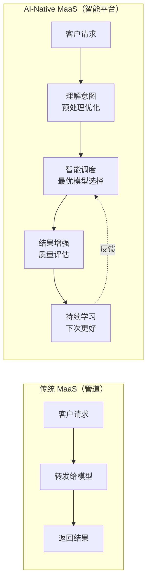

### 1.2 AI-Native 的三个层次

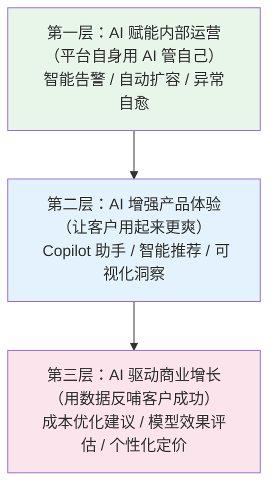

### 1.3 与竞品的差异化定位

| 维度 | 竞品（OpenRouter / Azure APIM） | MaaS AI-Native |
|------|-------------------------------|----------------|
| 路由策略 | 静态规则（按价格/延迟） | 动态学习，根据请求内容智能选模型 |
| 成本优化 | 手动配置 | AI 主动建议并自动执行 |
| 故障处理 | 固定 Fallback 链 | 预测性自愈，在故障发生前切换 |
| 开发者支持 | 文档 + 工单 | Copilot 助手实时指导集成 |
| 数据洞察 | 基础用量图表 | 自然语言查询 + AI 解读异常 |

---

## 2. AI-Native 设计原则

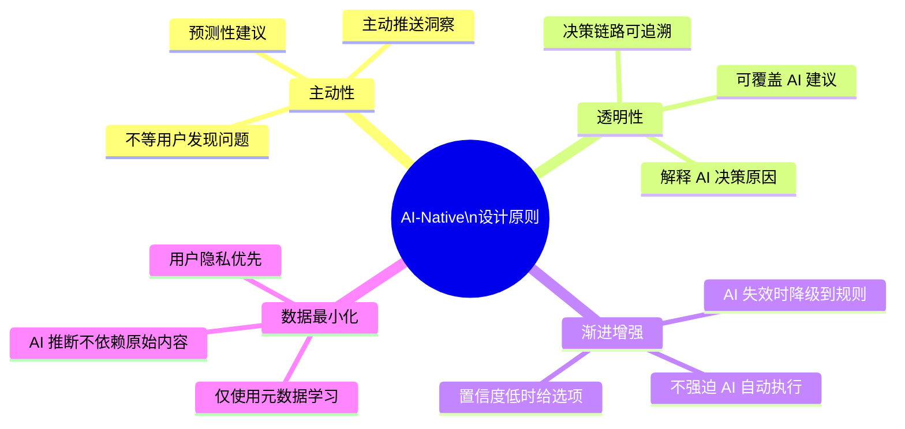

---

## 3. 核心 AI 能力地图

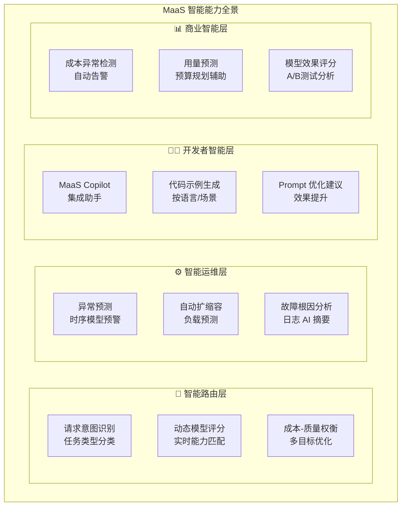

---

## 4. 智能助手：MaaS Copilot

### 4.1 产品定位

MaaS Copilot 是嵌入控制台的 AI 助手，帮助开发者**更快集成、更好调优、更低成本使用**大模型 API。

### 4.2 核心交互场景

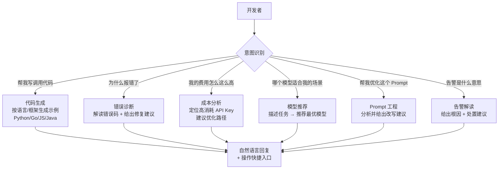

### 4.3 Copilot 技术实现

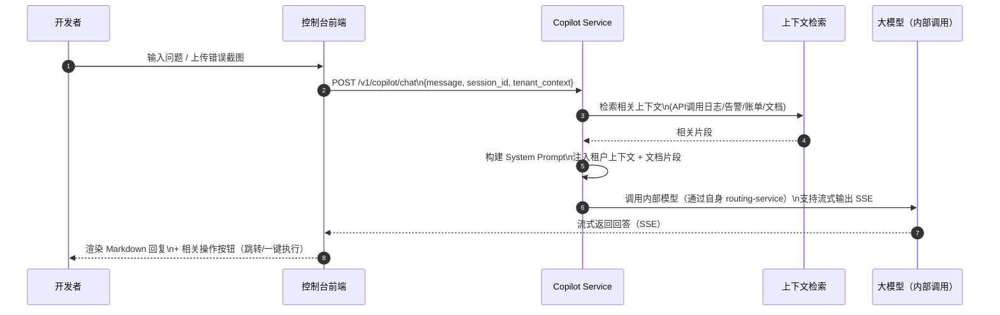

### 4.4 Copilot 上下文来源

| 上下文类型 | 来源 | 用途 |
|----------|------|------|
| 租户调用日志（近7天） | Elasticsearch | 诊断错误、分析用量 |
| 当前活跃告警 | monitor-service | 告警解读 |
| 账单明细（当月） | billing-service | 成本分析 |
| API Key 配置 | auth-service | 权限相关问题 |
| 平台文档库 | MinIO（向量化） | 集成指引 |
| 当前页面状态 | 前端注入 | 精准理解上下文 |

### 4.5 Copilot Prompt 工程示例

```
System Prompt 模板（成本分析场景）：

你是 MaaS 平台的智能助手，正在帮助开发者分析 API 使用成本。

当前用户信息：
- 租户: {{tenant_name}}
- 本月已用费用: {{current_month_cost}}元
- 同比上月: {{mom_change}}%

近7天高消耗调用（Top5）：
{{top_usage_list}}

近期异常记录：
{{recent_errors}}

请根据上述信息，用简洁的中文回答用户的问题。如果建议用户执行某个操作，
请在回答末尾附上 [ACTION:操作名称] 标记，前端会渲染为可点击按钮。

用户问题: {{user_question}}
```

---

## 5. 智能路由决策

### 5.1 超越规则：意图感知路由

传统路由依赖显式指定 `model` 参数。AI-Native 路由可以**理解请求意图**，自动匹配最优模型。

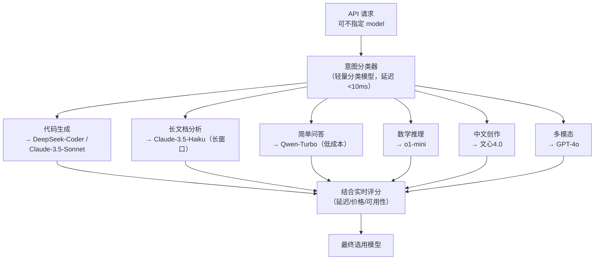

### 5.2 意图分类器设计

```
分类维度：
  task_type:    code | analysis | chat | reasoning | creation | multimodal
  complexity:   simple | medium | complex  （基于 prompt token 数估算）
  language:     zh | en | mixed
  latency_req:  realtime (<500ms) | normal (<2s) | batch (无要求)
  cost_level:   economy | standard | premium  （根据 API Key 套餐）

分类模型：
  - 优先使用本地部署的轻量分类模型（基于 BERT fine-tune，50ms内完成）
  - 模型文件存储在 MinIO，cache-service 预加载到内存
  - 每月基于真实请求日志 fine-tune 更新

置信度处理：
  - 置信度 > 0.85：自动选择
  - 0.6 < 置信度 < 0.85：选择但记录，用于后续反馈
  - 置信度 < 0.6：降级到静态规则路由
```

### 5.3 在线学习：路由决策反馈环

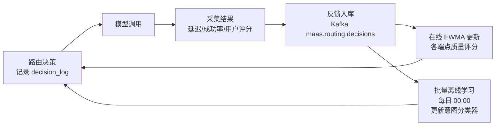

---

## 6. 智能成本优化

### 6.1 成本优化 AI 助手

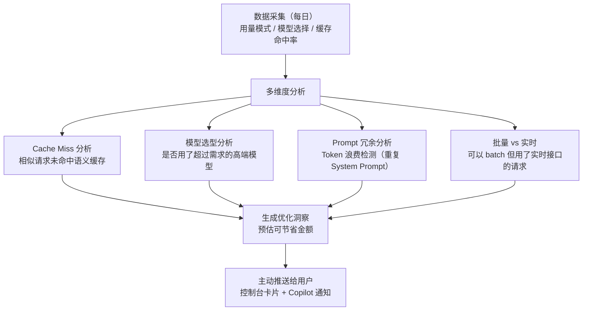

### 6.2 自动化成本优化规则（可选开启）

| 优化策略 | 触发条件 | 执行动作 | 预估节省 |
|---------|---------|---------|---------|
| 自动降级 Economy 模型 | 请求被分类为 simple chat | 改用 Qwen-Turbo 替换 GPT-4o | ~85% |
| Semantic Cache 预热 | 检测到高频相似请求 | 主动向量化并缓存高频 Prompt | ~40% |
| 批量请求合并 | 检测到 burst 小请求 | 自动合并为 batch API 调用 | ~30% |
| System Prompt 压缩 | System Prompt > 1000 tokens 且重复 | 提示用户压缩 / AI 自动压缩 | ~20% |

---

## 7. 异常自愈与运维自动化

### 7.1 预测性自愈

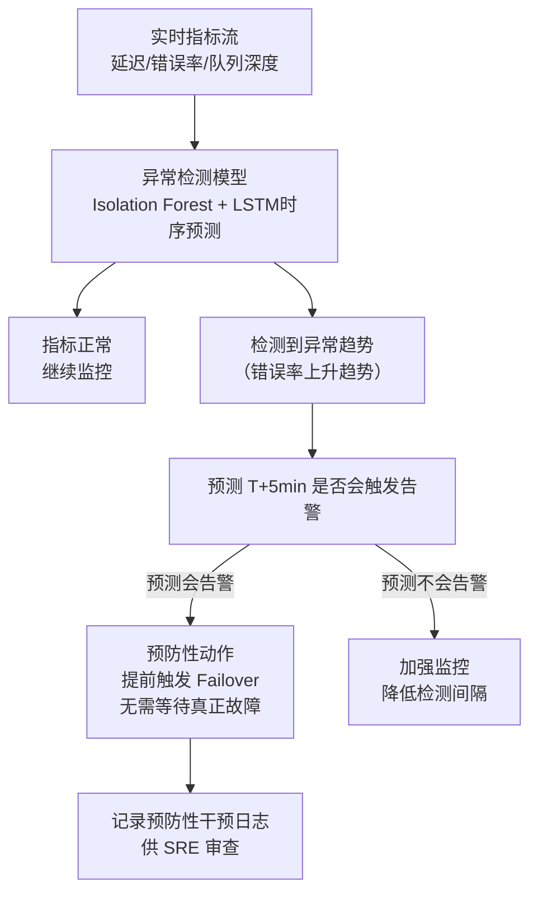

### 7.2 根因分析 AI

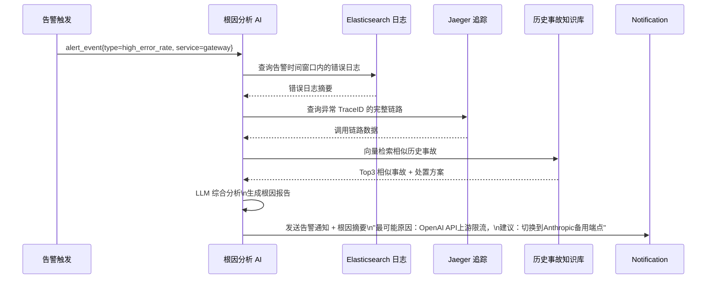

### 7.3 智能 Runbook 执行

```
当 P1 告警触发时，AI 可以自动执行预审批的修复动作：

✅ 允许自动执行（低风险）：
  - 流量切换到备用端点
  - 触发 HPA 扩容
  - 清除 Redis 异常 Key
  - 增加某端点的请求超时时间

⚠️ 需要人工确认（中风险）：
  - 停止某个租户的 API Key
  - 回滚某个服务版本
  - 修改路由策略权重

❌ 禁止自动执行（高风险）：
  - 删除数据
  - 修改计费策略
  - 影响所有租户的配置变更
```

---

## 8. AI-Powered 开发者体验

### 8.1 智能集成向导

用户首次接入时，Copilot 通过对话引导完成集成配置：

```
Copilot: 你好！我是 MaaS Copilot，帮你完成 API 集成。
         请问你的应用主要场景是什么？

用户: 我要做一个客服机器人，中文对话，需要快速响应

Copilot: 了解！基于你的场景，我推荐以下配置：

         📌 推荐模型：通义千问-Turbo（低成本+中文优化）
            备用模型：文心4.0（高峰期降级）
         📌 建议开启语义缓存（客服问题重复率高，预计节省 40% 费用）
         📌 超时设置：8秒（实时对话场景）

         要帮你生成 Python 接入代码吗？

用户: 好的

Copilot: [生成完整 Python 示例代码，包含重试逻辑和流式输出]
```

### 8.2 Prompt 优化工作台

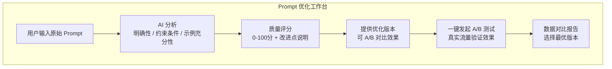

### 8.3 智能告警翻译（开发者视角）

传统告警是运维的事，AI-Native 把告警和开发者联系起来：

```
传统告警：
  [P1] maas_gateway_error_rate > 5%

AI-Native 告警（开发者版本）：
  ⚠️ 你的 API Key sk-xxx 最近 5 分钟请求错误率升至 8%
  主要错误类型：429 Too Many Requests（56次）
  原因：你调用的 GPT-4o 端点触发了速率限制
  
  建议操作：
  [查看详情] [切换到备用模型] [提升限额配置]
```

---

## 9. 数据飞轮设计

AI-Native 的核心护城河来自**数据飞轮**：平台越用越聪明，竞争对手难以复制。

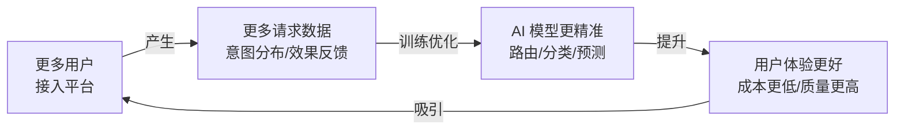

**关键数据资产：**

| 数据类型 | 积累方式 | 用于训练什么 |
|---------|---------|-------------|
| 请求意图标签 | 用户反馈 + 半监督标注 | 意图分类器 |
| 模型质量评分 | 用户评分 + 成功率指标 | 路由评分模型 |
| Prompt 效果对比 | A/B 测试结果 | Prompt 优化模型 |
| 故障-根因配对 | SRE 标注历史事故 | 根因分析模型 |
| 成本优化效果 | 优化前后对比 | 成本优化推荐模型 |

---

## 10. AI 能力演进路线图

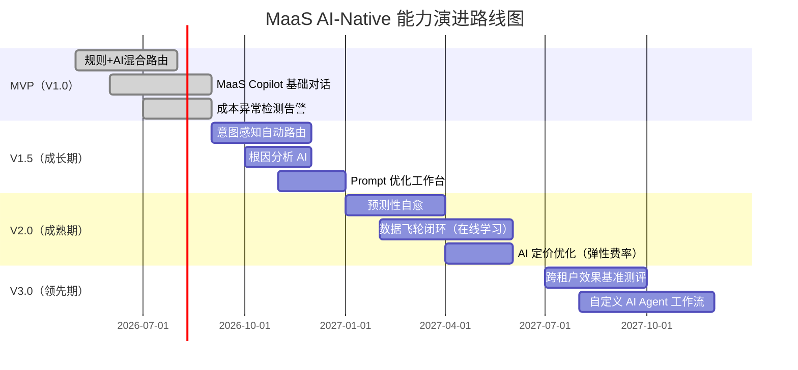

---

## 附录：AI-Native vs 传统 MaaS KPI 对比

| KPI 指标 | 传统 MaaS | AI-Native 目标 |
|---------|----------|---------------|
| 路由决策准确率 | ~70%（规则覆盖范围内） | >90%（意图感知） |
| 用户自助解决率 | ~30%（文档查找） | >70%（Copilot 引导） |
| 集成平均耗时 | 2-3天 | <4小时（有 Copilot 指导） |
| 成本优化建议采纳率 | N/A | >50% |
| 平均故障 MTTR | 45分钟 | <15分钟（AI 辅助根因） |
| 缓存命中率 | ~30%（随机） | >55%（主动预热） |

---

**变更历史**

| 版本 | 日期 | 说明 | 修改人 |
|------|------|------|--------|
| V1.0 | 2026-05-14 | 初稿 | 产品团队 |
