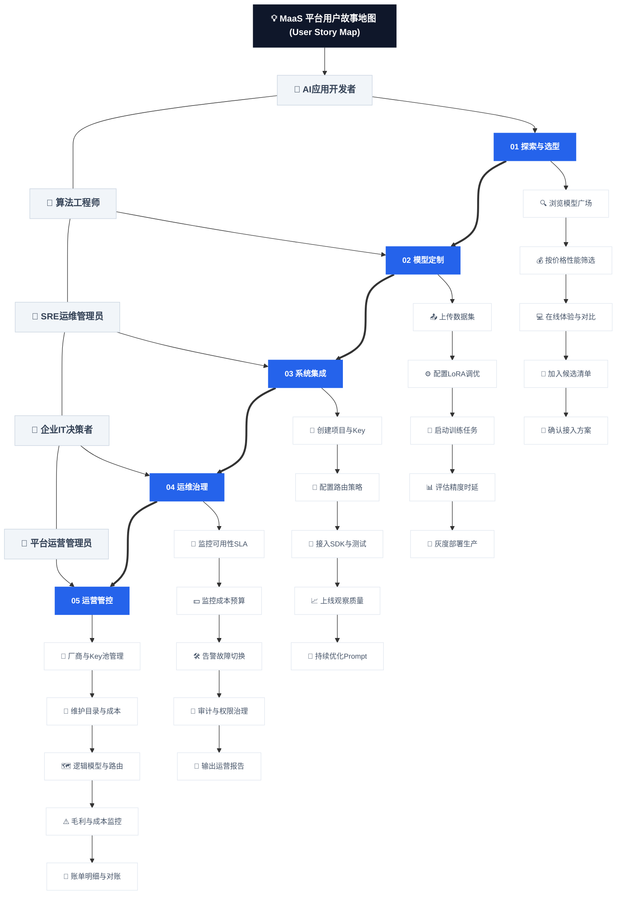
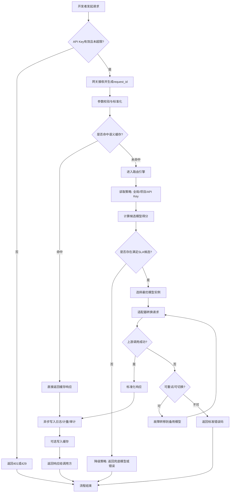
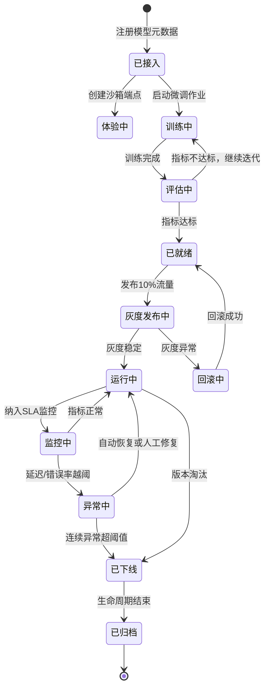
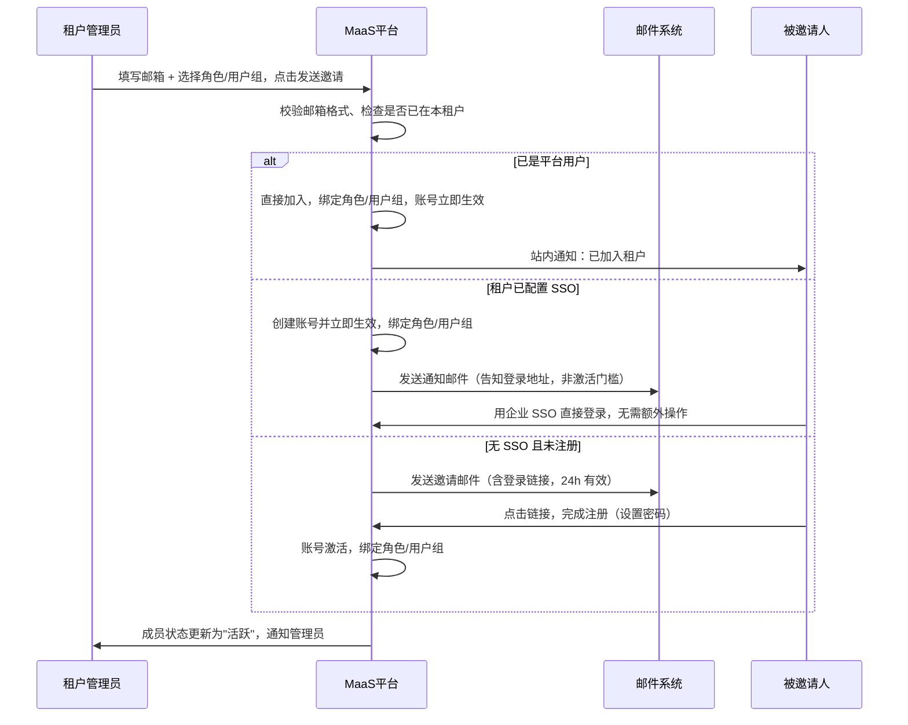
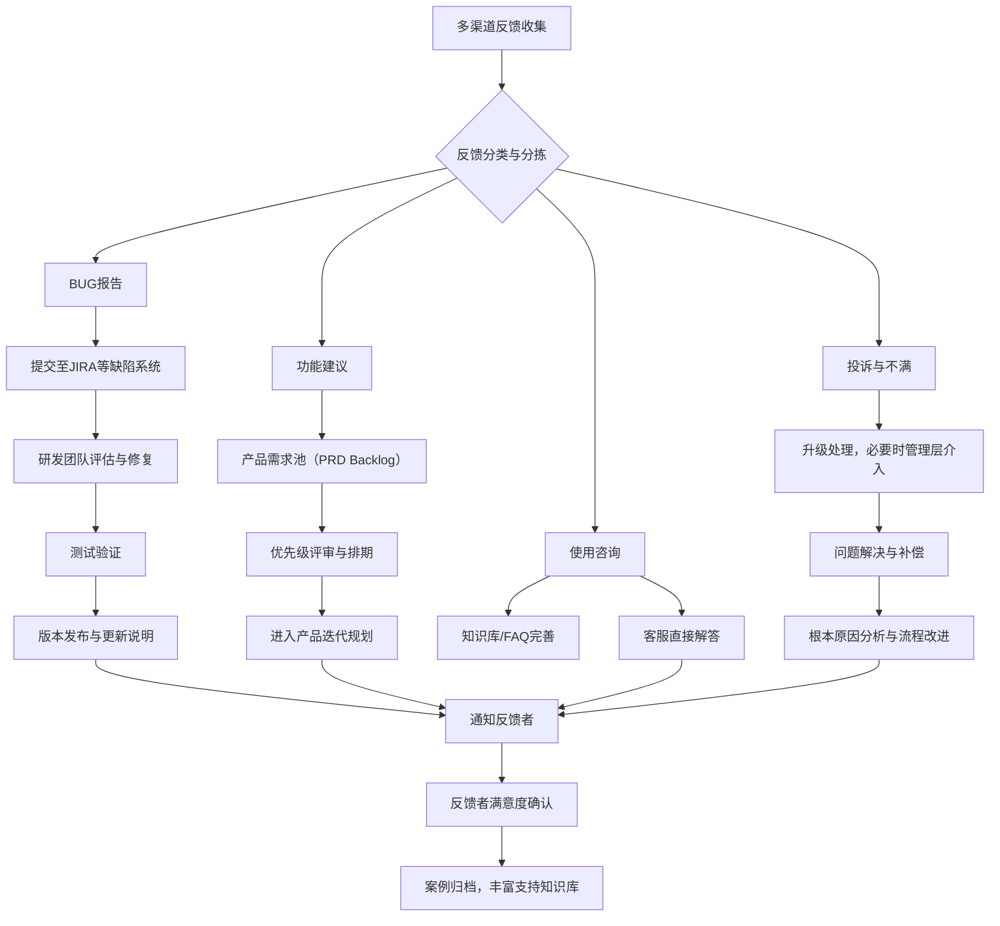
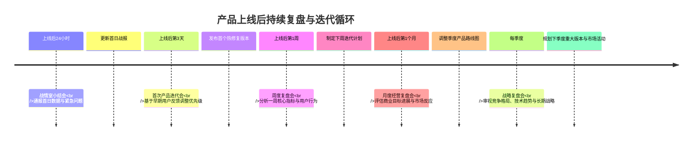
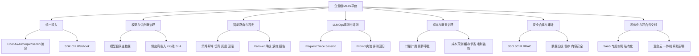
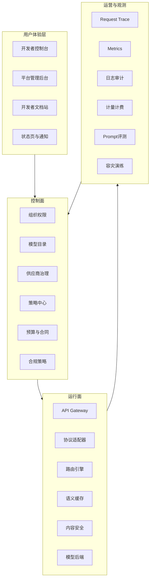

# MaaS平台 PRD文档

**当前日期：** 2026年05月21日

**标准版本：** V2.0 (企业级完整产品设计版)

本PRD用于指导MaaS平台从“可上线MVP”升级为“企业级完整产品设计版”。当前阶段优先形成完整、合规、可生成原型的产品蓝图，再根据商业目标、研发资源与交付节奏拆分优先级实现。本文档面向产品、研发、测试、运维、商务、法务、安全、合规、财务与解决方案团队联合评审，重点保障需求可理解、可验收、可审计、可运营、可生成原型。

---

## 文档归属说明 (Document Ownership)
**编写要点：** 建立文档的第一眼信任感，明确责任边界。此部分应在文档开头清晰展示，确保所有相关人员了解文档的基本信息和责任归属。

**模板内容：**

| **信息项** | **填写说明** | **示例** |
| --- | --- | --- |
| **项目名称** | 简洁明了的业务简称，反映核心功能 | `MaaS平台` |
| **文档状态** | 当前文档的生命周期状态 | `评审中` |
| **PM（产品负责人）** | 业务逻辑与决策的最终责任人 | `待指定（产品负责人）` |
| **FE Owner（前端负责人）** | 前端实现负责人 | `待指定（前端负责人）` |
| **BE Owner（后端负责人）** | 后端实现负责人 | `待指定（后端负责人）` |
| **QA Owner（测试负责人）** | 质量保证负责人 | `待指定（测试负责人）` |
| **UX/UI Owner（设计负责人）** | 用户体验与界面设计负责人 | `待指定（设计负责人）` |
| **密级** | 文档的保密级别 | `内部` |
| **关联链接** | **视觉化入口，建议使用超链接** | |
| **原型图链接** | 交互原型图地址 | `原型HTML/console-frontend-prototype.html`、`原型HTML/admin-frontend-prototype.html` |
| **UI设计稿** | 视觉设计稿地址 | `产品设计/原型设计文档.md` |
| **技术架构图** | 系统架构图地址 | `微服务设计/01-gateway-service详细设计.md`、`微服务设计/02-routing-service详细设计.md` |
| **数据字典** | 数据字段定义文档 | `待补充（建议新增：开发/数据库设计文档.md）` |
| **竞品分析报告** | 相关竞品调研 | `竞品分析/00-竞品分析总览.md`、`竞品分析/28-25家竞品能力全景总结与MaaS差距分析.md` |
| **最终蓝图补充** | 企业级最终版产品蓝图 | `产品设计/PRD补充/01-企业级MaaS产品最终蓝图.md` |
| **模型与供应商治理** | 模型目录、供应商、Key池、合同与SLA明细 | `产品设计/PRD补充/02-模型目录与供应商治理详细规格.md` |
| **路由与容灾补充** | 路由策略生命周期、策略解释、容灾演练 | `产品设计/PRD补充/03-路由策略与容灾降级详细规格.md` |
| **LLMOps补充** | Trace、Prompt实验、评测回归、质量成本分析 | `产品设计/PRD补充/04-LLMOps观测与Prompt评测详细规格.md` |
| **合规与私有化补充** | 合规策略、数据留存、私有化与混合云交付 | `产品设计/PRD补充/05-合规安全与私有化交付详细规格.md` |
| **原型生成清单** | 后续生成HTML原型的页面清单与交互要求 | `产品设计/PRD补充/06-原型HTML生成页面清单与交互要求.md` |


**填充指南：**

1. **项目名称**：应简洁且有辨识度，建议采用“产品形态+核心能力”的格式，如“MaaS平台”、“大模型聚合网关”、“AI一体机”。
2. **文档状态**：根据文档实际进度选择对应状态，注意状态变更时需要更新此表格。
3. **核心负责人**：务必填写具体人名而非部门名称，确保责任到人。
4. **关联链接**：所有链接必须为有效链接，确保评审时可直接访问查看。
5. **图源治理**：当前流程图图片存在外链依赖，建议在仓库新增 `架构图/mermaid/` 保存源文件并在CI中自动渲染，避免外链失效影响评审与交付。

---

## 版本变更记录 (Revision Log)
**编写要点：** 2026年严禁直接覆盖原内容。变更是代价，必须被记录。每次修改都需要新建一行记录，并在文档正文中用高亮标识修改内容。

**模板内容：**

| **版本号** | **修订日期** | **修订内容摘要** | **修订人** | **审核人** | **变更原因 (Why)** |
| --- | --- | --- | --- | --- | --- |
| V0.9 | 2026-03-19 | 模板初始版本，建立MaaS需求结构 | 产品团队 | 产品委员会 | 统一文档结构，便于跨团队协作 |
| V1.0 | 2026-05-15 | 项目评审版：补齐责任归属、执行摘要、KPI口径与验收约束 | 产品负责人 | 技术负责人 | 从模板切换为可评审、可执行版本 |
| V1.1 | 2026-05-18 | 架构升级为三层解耦（厂商模型目录→供应商后端→逻辑模型）；补充路由策略五种类型及四级范围；新增 Key 池设计（vendor_key_id/轮询/安全规则）；新增平台运营管理功能（§3.2.5，含告警通知渠道配置§3.2.5.5、企业合同定价配置§3.2.5.6）；新增模型广场功能规格（§3.2.6）；新增租户计费与账户管理（§3.2.7，含企业合同管理§3.2.7.5、阶梯单价§3.2.7.6）；新增合同定价数据模型（tenant_contract / contract_discount_item）；补充 vendor/route_policy/vendor_key 数据模型；修正 §3.4.3 编号重复；新增业务规则#8成本价快照和#9售价快照；新增§3.2.3.6租户限流规格；补充并发扣费预扣流程、对公充值撤销异常、Tier边界精度、赠送额度叠加规则 | 产品负责人 | 技术负责人 | 基于评审反馈完善三层架构逻辑与运营管控功能；新增企业合同折扣定价机制 |
| V1.2 | 2026-05-18 | 合同定价规则升级为“租户订阅模型 + 模型级折扣”：移除全模型统一折扣口径；更新运营端合同创建流程、租户合同展示、计费计算规则与数据模型（contract_model_subscription） | 产品负责人 | 技术负责人 | 贴合企业商务合同现实模式，避免“全模型同折扣”导致的定价失真 |
| V1.3 | 2026-05-18 | 补充账单管理规格：新增总账视图、租户分账、对账差异、出账记录四块的字段定义、按钮动作与状态流转规则，并与原型/HTML交互一致 | 产品负责人 | 技术负责人 | 提升账单运营可执行性，减少“仅有页面无业务动作”的落地偏差 |
| V1.4 | 2026-05-18 | 新增账单域术语对照表，统一“总账视图/租户分账/对账差异/出账记录/账期”等名词口径；同步修正文档元信息版本号 | 产品负责人 | 技术负责人 | 降低PRD、原型文档、HTML原型之间的术语漂移，便于研发、测试与运营对齐 |
| V1.5 | 2026-05-18 | 将账单域术语对照表从主 PRD 拆分为独立文档，主文档保留引用入口，降低 PRD 阅读负担 | 产品负责人 | 技术负责人 | 控制主 PRD 篇幅，保持术语维护独立且可复用 |
| V2.0 | 2026-05-21 | 基于25家竞品能力全景总结，将PRD升级为企业级完整产品设计版；新增企业模型运营控制面定位；补齐模型目录主数据、供应商治理、路由策略生命周期、容灾演练、请求级Trace、Prompt实验、评测回归、质量成本分析、合规策略、数据留存、SSO/SCIM、私有化/混合云/一体机交付、原型HTML页面清单；拆分6份PRD补充子文档承接字段、流程、状态、页面草图与验收明细 | 产品负责人 | 技术负责人 / 安全合规负责人 / 财务负责人 | 当前处于设计阶段，需要先形成完整、合规、可生成原型的企业级最终版PRD，再按优先级拆分研发实现 |


**标记修改内容的方法：**

在文档正文中，使用以下格式高亮显示修改内容：

```markdown
==本次修订部分：单模型实例最大并发请求数从50调整为100，以支持更高并发的推理场景==

或者

🔍 版本V1.2新增：增加了基于语义相似度的请求缓存机制，预计可降低高频重复Prompt 30%的Token消耗成本。
```

**填充指南：**

1. **版本号规范**：主版本号.次版本号（如V1.0、V1.1），重大变更时升级主版本号。
2. **修订内容摘要**：简洁明确说明修改了什么，不要写“优化了体验”等模糊表述。
3. **变更原因**：必须填写具体原因，这是追溯决策依据的关键。
4. **审核流程**：每次修改都应有对应的审核人，确保质量管控。

---

## 执行摘要（评审必读）

### 0.1 本期结论
1. 本文档当前目标是形成MaaS平台**企业级完整产品设计版**，不是只定义MVP功能边界。
2. 产品定位升级为**企业模型运营控制面**：统一管理模型、供应商、路由、成本、观测、质量、安全、合规、审计和交付。
3. 当前设计阶段要求先补齐完整能力闭环，再在研发排期阶段拆分P0/P1/P2优先级。
4. 后续原型HTML应优先围绕模型广场、Playground、Trace详情、路由策略、Prompt实验、评测中心、供应商治理、账单成本、合规策略、容灾演练生成页面。

### 0.2 本期不做
1. 不在当前PRD中设计大规模分布式预训练平台，仅覆盖模型接入、微调、评测、部署与推理运营。
2. 不在当前PRD中设计复杂联邦学习体系，仅预留边缘与一体机交付扩展。
3. 不在当前PRD中设计完整AI应用商店商业运营，但保留Agent模板、MCP工具与行业方案的产品入口。
4. 不在当前设计阶段压缩能力范围为MVP；实现优先级将在后续路线图与研发计划中独立拆分。

### 0.3 关键里程碑
1. D1：完成企业级最终版PRD与补充子文档，作为原型HTML生成依据。
2. D2：完成Console租户控制台和Admin平台后台的信息架构与关键页面原型。
3. D3：完成模型目录、供应商治理、路由策略、Trace、Prompt评测、合规策略、账单成本六条核心业务闭环的原型验收。
4. D4：基于完整设计拆分MVP、Beta、GA、企业增强版与私有化版本实施路线。

### 0.4 关键风险与决策点
1. 外部模型供应商稳定性与成本波动。
2. 计费准确性必须做到可审计、可追溯。
3. 合规策略（数据不出域、审计留痕）必须前置。
4. 路由策略、合规策略、预算策略必须可解释、可审批、可灰度、可回滚，否则企业客户难以放心上生产。
5. 请求级Trace、Prompt版本、评测回归和质量成本分析必须作为LLMOps核心能力进入原型，否则平台会退化为普通API网关。
6. 供应商治理必须从“Key配置”升级为“准入、合同、SLA、合规材料、健康评分、额度与对账”的运营体系。

---

## 一、需求背景及分析 (Background & Analysis)
**编写要点：** 使用“三段式”写法，用数据而非观点驱动。此部分的目标是让所有干系人理解“为什么要做这个需求”，建立共识基础。

### 1.1 需求背景
**当前现状与具体证据：**

+ **用户场景痛点：** 具体描述用户在什么场景下遇到什么问题。
+ **数据支撑：** 引用具体的数据指标来量化问题严重程度。
+ **用户反馈：** 引用用户反馈、客服工单、用户访谈记录等。

**示例格式：**

**当前现状：**

1. **AI应用开发门槛高：企业开发者整合多个大模型API平均需要对接3-5套不同协议，调试与兼容耗时约2-4周**。
2. **模型管理与运维复杂：自研模型的生命周期管理（训练、评估、部署、监控）分散在不同工具中，缺乏统一视图与自动化流程**。
3. **算力成本与利用率失控：异构GPU资源调度粗糙，推理任务高峰期响应延迟高，低谷期资源闲置率超过40%**。
4. **Token计费与预算管理缺失**：多模型调用成本不透明，缺乏细粒度预算控制和成本归因分析，易产生预算超支。

**具体证据：**

1. **数据指标**：2026年Q1开发者调研显示，83%的企业AI团队表示模型接入与管理的碎片化是阻碍AI应用快速上线的首要因素。
2. **系统日志分析**：日志数据显示，中型企业每月平均调用4种不同厂商的模型API，协议转换导致的调试错误占总错误的35%。
3. **客服工单**：过去6个月累计收到256个关于“模型API限流、响应慢”、“算力资源不足”、“账单超出预期”的工单。
4. **用户访谈摘录**：“我们需要一个统一的入口来管理所有模型，就像云服务的管理控制台一样，而不是为每个模型单独配置和维护。” —— 某金融科技公司AI负责人。

### 1.2 产品目的
**解决问题的核心价值：**

+ **主要目标：** 明确产品要解决的核心问题。
+ **次要目标：** 附带解决的问题或带来的附加价值。
+ **成功标准：** 如何衡量问题是否被解决。

**示例格式：**

**主要目的：**

1. **降低AI应用集成门槛：将多模型API对接时间从平均3周缩短到3天以内，提供统一的OpenAI兼容API**。
2. **实现模型全生命周期管理：构建从模型接入、精调、评估、部署到监控的自动化流水线**。
3. **提升算力资源利用率：通过智能调度使GPU整体利用率从40%提升至70%以上，推理任务P99延迟降低50%**。
4. **实现精细化成本管控**：提供实时Token消耗监控、预算预警和多维度成本分析报表。

**次要目标：**

1. **构建开发者生态：通过模型广场和低代码工具链，吸引外部开发者与模型提供商入驻**。
2. **保障企业级安全合规：满足数据不出域、私有化部署、全栈审计等金融、政务行业要求**。
3. **加速AI场景落地：内置行业解决方案模板（如智能客服、代码助手），缩短场景化AI应用上线周期**。

**成功衡量标准：**

| **指标名** | **当前基线** | **目标值** | **时间窗** | **统计口径** | **数据来源** | **责任人** |
| --- | --- | --- | --- | --- | --- | --- |
| 统一API接入成功率 | 98.8% | >= 99.9% | 上线后连续90天 | 成功请求数 / 总请求数（剔除调用方参数错误） | 网关日志 + APM | 后端负责人 |
| 请求响应时间P95 | 1.2s | <= 800ms | 上线后连续90天 | 全量在线请求端到端延迟P95 | OTel + Prometheus | 后端负责人 |
| 新模型接入周期 | 15个工作日 | <= 3个工作日 | M3至GA阶段 | 从需求评审通过到可上线服务 | 项目管理系统 + 发布流水线 | 产品负责人 |
| 资源利用率 | 42% | >= 70% | GA后首个季度 | GPU有效计算时长 / 可用时长 | 调度平台监控 | 运维负责人 |
| 预算超支率 | 18% | <= 3% | GA后首个季度 | 超预算项目数 / 总项目数 | 计费系统 + 财务报表 | 运营负责人 |

### 1.3 用户故事地图
**可视化用户旅程：**

+ **用户角色：** 明确涉及哪些用户角色。
+ **用户活动：** 用户需要完成的核心任务。
+ **用户任务：** 分解的具体操作步骤。
+ **用户故事：** 具体的功能需求点。

**示例格式：**



**详细用户故事清单：**

| **用户角色** | **用户故事** | **优先级** | **验收条件** |
| --- | --- | --- | --- |
| **AI应用开发者** | 作为AI应用开发者，我希望通过一套统一的API和密钥调用不同厂商的大模型，以便快速集成AI能力而无需应对协议碎片化问题。 | P0（必须有） | 1. 支持OpenAI兼容格式REST API 2. 一套API Key可路由至多个后端模型 3. 自动生成Python/Java/Go等多语言SDK |
| **算法工程师** | 作为算法工程师，我希望在平台内使用我的私有数据对基础模型进行微调，并一键部署为专属API服务，以便快速获得贴合业务场景的专属模型。 | P0（必须有） | 1. 支持LoRA/QLoRA等PEFT微调 2. 提供可视化训练进度与评估报告 3. 支持将微调后模型部署为在线推理服务 |
| **平台运维管理员** | 作为平台运维管理员，我希望实时监控所有模型服务的健康状态、算力使用率和API调用 metrics，以便快速定位故障并优化资源分配。 | P1（应该有） | 1. 提供统一的监控Dashboard 2. 支持Prometheus/Grafana集成 3. 关键指标异常自动告警（邮件/钉钉） |
| **企业IT决策者** | 作为企业IT决策者，我希望清晰地看到各部门、各项目的Token消耗与成本分摊，并能设置预算上限，以便实现AI成本的精细化管理和控制。 | P2（未来考虑） | 1. 提供多维度成本分析报表 2. 支持项目/部门级预算设置与预警 3. 成本数据可导出审计 |
| **平台运营管理员** | 作为平台运营管理员，我希望能快速接入一家新的 AI 厂商——录入其 API 信息、配置多个 Key、维护模型目录和成本价，并在不修改租户调用方式的情况下把新厂商的模型挂到已有逻辑模型下。 | P0（必须有） | 1. 支持在管理后台录入厂商 API base_url、认证方式、超时配置 2. 支持一次性批量添加多个 API Key 到 Key 池 3. 新厂商模型可通过模型目录挂载到已有逻辑模型后端，租户无感知切换 |
| **平台运营管理员** | 作为平台运营管理员，我希望实时看到每个逻辑模型、每家厂商的毛利率和成本趋势，并在出现负毛利风险或厂商 Key 额度告急时第一时间收到告警，以便及时调价或切换流量。 | P0（必须有） | 1. 提供逻辑模型级和厂商级双维度实时毛利看板 2. 负毛利风险（上架价 ≤ 成本价 × 110%）提前预警 3. Key 池 quota 使用率超过 80% 时自动告警，支持快速补录 Key |
| **平台运营管理员** | 作为平台运营管理员，我希望能按租户、厂商、逻辑模型、Key 等任意维度查询每一笔调用的完整链路信息（用了哪个后端、哪个 Key、多少 Token、成本/收入分别是多少），以便完成厂商账单对账和租户账单审核。 | P1（应该有） | 1. 调用明细支持 backend_id、vendor_key_id、tenant_id、时间段等多维筛选 2. 明细数据可导出 CSV/Excel，字段含成本价快照和售价快照 3. 平台计算 vendor_cost 与厂商账单导入后可做自动差异比对，误差超 0.1% 标红提示 |


**填充指南：**

1. **需求背景**：必须基于真实数据和用户反馈，避免主观判断。引用行业渗透率、开发耗时、资源利用率等具体数据。
2. **产品目的**：目标要具体、可衡量，最好有量化指标，如API响应时间、资源利用率、成本节约百分比。
3. **用户故事地图**：先画出整体用户旅程，再分解具体故事点，覆盖模型探索、开发、集成、运维、管控全流程。
4. **优先级排序**：使用MoSCoW法则（必须有/应该有/可以有/不会有）或类似方法。

---

## 二、需求概览 (Requirements Overview)
**编写要点：** 让读者在30秒内理解整体逻辑。此部分提供需求的“高空视图”，帮助团队快速把握核心内容。

### 2.1 需求目标
**一句话总结：**

+ **核心目标：** 用最简洁的语言说明这个需求要达成什么。
+ **成功指标：** 可量化的KPI，用于衡量目标是否达成。

**示例格式：**

**一句话目标：**`构建一个企业级、开放的MaaS（模型即服务）平台，通过统一API网关、智能路由与全生命周期管理，将AI大模型的集成效率提升3倍，算力成本降低30%，助力企业快速规模化落地AI应用。`

**成功指标（KPI）：**

| **指标名** | **当前基线** | **目标值** | **时间窗** | **统计口径** | **数据来源** | **责任人** |
| --- | --- | --- | --- | --- | --- | --- |
| API网关可用性 | 99.70% | >= 99.95% | GA后连续90天 | (总时长 - 不可用时长) / 总时长 | 可用性监控 | SRE负责人 |
| 核心服务SLA达标率 | 97.8% | >= 99.9% | GA后连续90天 | 满足SLA请求数 / 总请求数 | 服务网格指标 | SRE负责人 |
| 路由策略命中率 | 63% | >= 85% | M2至GA阶段 | 被策略引擎命中的请求数 / 总请求数 | 路由服务日志 | 算法负责人 |
| 单位Token推理成本 | 1.00（基线指数） | <= 0.85 | GA后首个季度 | 总推理成本 / 总Token量（指数化） | 计费系统 | 运营负责人 |
| 活跃企业客户季度增长率 | 8% | >= 20% | GA后连续2个季度 | 本季度活跃企业客户数环比 | CRM + 计费系统 | 商业化负责人 |

### 2.2 需求范围
**明确边界，拒绝需求蔓延：**

+ **Must Have（必须有）：** 本期最小可行交付（MVP）的核心功能。
+ **Should Have（应该有）：** 如果时间允许则完成的增强功能。
+ **Could Have（可以有）：** 锦上添花的功能，优先级较低。
+ **Won't Have（本次不做）：** 明确排除在本期范围之外。

**示例格式：**

| **范围分类** | **功能描述** | **优先级** | **说明** |
| --- | --- | --- | --- |
| **必须有 (Must Have)** | 统一API网关与协议转换 | P0 | 对外提供标准OpenAI兼容API，内置多厂商协议适配器 |
| **必须有 (Must Have)** | 模型广场与生命周期管理 | P0 | 模型接入、版本管理、精调、评估、部署、下线统一管理 |
| **必须有 (Must Have)** | 智能路由与负载均衡 | P0 | 基于上下文、成本、性能的请求路由与故障转移 |
| **应该有 (Should Have)** | 精细化成本核算与预算控制 | P1 | 基于Token的实时计费、多维度报表、预算设置与预警 |
| **应该有 (Should Have)** | 低代码AI应用开发工具链 | P1 | 可视化编排AI工作流（Agent）、快速构建RAG应用等 |
| **应该有 (Should Have)** | Prompt实验与评测回归中心 | P1 | 支持版本化Prompt、A/B实验、离线评测与上线前回归 |
| **应该有 (Should Have)** | 策略中心（Policy as Code） | P1 | 支持路由、预算、风控、内容安全策略统一配置与灰度发布 |
| **可以有 (Could Have)** | 模型性能排行榜与自动化评测 | P2 | 基于标准数据集自动评测模型，生成性能排行榜 |
| **可以有 (Could Have)** | 私有化部署与一体机交付 | P2 | 支持离线部署、硬件一体机交付模式 |
| **可以有 (Could Have)** | 多区域容灾与跨区故障演练 | P2 | 支持跨可用区/跨地域故障切换与演练报告输出 |
| **本次不做 (Won't Have)** | 大规模分布式模型训练平台 | N/A | 专注于推理与微调，全量训练平台规划在下一期 |
| **本次不做 (Won't Have)** | 边缘模型管理与联邦学习 | N/A | 边缘侧模型推理与协同训练，技术复杂度过高 |
| **本次不做 (Won't Have)** | 原生AI应用商店运营 | N/A | 应用分发与商业化运营，优先级较低 |


### 2.3 需求清单
**详细功能列表：**

+ **功能模块：** 大的功能分类。
+ **子功能：** 具体的功能点。
+ **优先级：** 实现的重要程度。
+ **预估工作量：** 开发所需的时间或复杂度评估。

**示例格式：**

| **功能模块** | **子功能** | **功能描述** | **优先级** | **预估工作量** | **备注** |
| --- | --- | --- | --- | --- | --- |
| **统一接入** | API网关 | 提供OpenAI兼容的RESTful API，统一认证、限流、日志 | P0 | 10人日 | 需支持高并发与弹性伸缩 |
| **统一接入** | 协议适配器 | 内置OpenAI、Anthropic、国产模型等协议转换模块 | P0 | 15人日 | 需持续维护更新适配器 |
| **统一接入** | SDK生成 | 自动生成Python/Java/Go等主流语言客户端SDK | P1 | 8人日 | 集成至开发者文档门户 |
| **模型管理** | 模型广场 | 模型分类展示、搜索、对比、一键体验与接入 | P0 | 12人日 | 需对接外部模型供应商API |
| **模型管理** | 模型精调工作台 | 提供数据上传、LoRA微调、超参配置、训练监控 | P0 | 20人日 | 集成vLLM/TensorRT-LLM等 |
| **模型管理** | 模型部署上线 | 支持在线服务、批量预测、边缘端等多种部署模式 | P0 | 15人日 | 需容器化与K8s调度集成 |
| **调度路由** | 智能路由引擎 | 基于任务类型、成本、延迟动态选择最优模型 | P0 | 18人日 | 核心算法模块，需A/B测试验证 |
| **调度路由** | 负载均衡与容错 | 多实例负载均衡、故障自动检测与转移 | P1 | 10人日 | 保障服务高可用性 |
| **调度路由** | 语义缓存 | 对相似请求进行缓存，降低重复计算与Token消耗 | P2 | 12人日 | 集成向量数据库进行相似度匹配 |
| **运营管控** | 计量计费系统 | 实时统计Token消耗，生成账单，支持预算预警；**模型上架须区分厂商成本价与租户售价，平台毛利由系统自动推导，账单对账以成本价为准，租户账单以售价为准** | P1 | 15人日 | 需财务系统对接考虑；双价格数据需独立存储，成本价仅平台管理员可见 |
| **运营管控** | 监控告警中心 | 服务健康度、性能指标、资源使用率监控与告警 | P1 | 10人日 | 集成Prometheus + AlertManager |
| **运营管控** | 权限与审计 | 多租户RBAC权限管理、操作日志全量审计 | P2 | 8人日 | 满足等保合规要求 |
| **观测与实验** | Prompt实验中心 | 支持Prompt版本管理、A/B实验、质量与成本联合评估 | P1 | 12人日 | 借鉴Helicone实验分析能力 |
| **治理与策略** | Policy as Code中心 | 路由、预算、风控、内容安全策略代码化配置与审批发布 | P1 | 14人日 | 借鉴Portkey控制面能力 |
| **治理与策略** | 预算审批工作流 | 超预算自动拦截，支持项目负责人审批后继续调用 | P1 | 8人日 | 解决企业预算治理闭环 |
| **可靠性工程** | 多区域容灾编排 | 预置跨区切换脚本，支持季度演练与RTO/RPO评估 | P2 | 10人日 | 对标云厂商高可用能力 |


### 2.4 管理预期和协调资源
**明确依赖和约束条件：**

+ **依赖关系：** 需要外部团队或系统配合的事项。
+ **资源需求：** 所需的人力、时间、技术资源。
+ **约束条件：** 技术、时间、预算等方面的限制。
+ **风险预警：** 可能影响项目进度的风险因素。

**示例格式：**

**关键依赖关系：**

1. **底层算力调度平台对接**：需要基础设施团队提供统一的GPU资源池与管理API（负责人：基础设施团队-陈工）。
2. **外部模型供应商合作**：需要商务与法务团队对接OpenAI、Anthropic、国内大模型厂商的API接入与商务条款（负责人：商务合作团队-周经理）。
3. **统一用户权限系统集成**：需要与公司SSO和权限中心对接（负责人：基础架构团队-王工）。
4. **财务系统对接**：需要与财务ERP系统对接，实现账单同步与支付（负责人：财务系统团队-李会计）。

**资源需求估算：**

+ **后端开发（核心平台）**：3人 x 12周 = **36人周**。
+ **后端开发（模型适配与调度）**：2人 x 10周 = **20人周**。
+ **前端开发（控制台）**：2人 x 8周 = **16人周**。
+ **算法开发（路由策略）**：1人 x 6周 = **6人周**。
+ **测试与QA**：2人 x 8周 = **16人周**。
+ **UI/UX设计**：1人 x 4周 = **4人周**。
+ **项目管理与DevOps**：1人 x 14周 = **14人周**。
+ **总计**：约**112人周**工作量。

**约束条件：**

1. **时间约束**：必须在2026年Q3结束前完成MVP版本上线并获取首批种子客户验证。
2. **技术约束**：需兼容主流国产化芯片（如昇腾、海光）与操作系统环境。
3. **预算约束**：初期无大规模营销预算，需依靠产品力和开发者社区进行冷启动。
4. **合规约束**：必须满足数据安全法、个人信息保护法及金融等行业监管要求。

**风险预警及应对：**

1. **技术风险**：多模型协议适配复杂度高，可能影响开发进度 - **应对方案**：采用模块化适配器设计，优先支持头部分厂商，后续迭代扩展。
2. **市场风险**：头部云厂商（AWS/Azure/阿里云）自有MaaS服务竞争激烈。**应对方案**：聚焦中立性、跨云模型聚合与更优的成本控制作为差异化优势。
3. **资源风险**：GPU算力资源供应不稳定或价格波动 - **应对方案**：设计多云、异构算力调度策略，避免单一供应商依赖。
4. **合规风险**：模型内容生成存在安全与合规问题。**应对方案**：内置内容安全过滤模块，提供可配置的合规策略，并与法务团队紧密协作。

### 2.5 竞品驱动新增需求（可直接纳入版本规划）
**目标：** 将竞品优势转化为可执行需求，避免“只做对比，不做落地”。

| **借鉴来源** | **新增需求** | **价值说明** | **优先级** | **验收标准（Done）** |
| --- | --- | --- | --- | --- |
| Helicone（观测/实验） | Prompt实验与回归中心 | 缩短提示词迭代周期，降低线上试错成本 | P1 | 1. 支持Prompt版本管理与Diff对比 2. 支持A/B实验并输出显著性结果 3. 发布前可执行固定评测集回归 |
| Portkey（控制面） | 策略中心 Policy as Code | 统一路由、预算、风控、内容策略，降低人工配置风险 | P1 | 1. 策略支持版本化与审批流 2. 支持灰度发布和一键回滚 3. 全量策略变更可审计 |
| LiteLLM/Portkey（预算治理） | 预算审批与超限拦截 | 将“看到账单”升级为“提前控费” | P1 | 1. 项目预算阈值可配置 2. 超阈值自动拦截并触发审批 3. 审批记录与调用日志可关联追溯 |
| Helicone（可观测） | 质量-成本联合分析看板 | 同时回答“质量是否提升、成本是否可控” | P1 | 1. 同屏展示质量、延迟、成本三维指标 2. 支持按模型/项目/租户钻取 3. 支持导出周报与异常归因 |
| AWS/Azure/GCP（高可用实践） | 多区域容灾与演练机制 | 提升关键客户对平台连续性的信任 | P2 | 1. 支持跨区切换脚本 2. 每季度完成一次演练并产出报告 3. RTO/RPO达到约定目标 |

**版本建议：**
1. V1.1（**已发布**）：三层模型架构（厂商目录→供应商后端→逻辑模型）、智能路由（5策略/4级范围）、计量计费（PAYG + 企业合同折扣 + 阶梯定价）、赠送额度、告警通知、模型广场。
2. V1.2（近期）：Prompt 实验与回归中心、Policy as Code 策略中心、预算审批工作流。
3. V1.3（中期）：质量-成本联合分析看板。
4. V1.4（中期偏后）：多区域容灾与演练机制。

**填充指南：**

1. **需求目标**：要具体、可衡量、有时限，最好符合SMART原则，明确平台的核心价值主张。
2. **需求范围**：明确划分边界是避免范围蔓延的关键，聚焦于模型聚合、调度与管理的核心能力。
3. **需求清单**：越详细越好，为开发工作量评估提供依据，特别关注智能路由、计费等核心模块。
4. **管理预期**：提前识别依赖和风险，有助于项目顺利推进，尤其是在涉及外部合作与合规领域。

---

## 三、需求说明 (Detailed Requirements)
**编写要点：** 需求的核心，采用“用户故事 + 规则定义 + 异常处理”的结构。这是开发团队实现功能的直接依据，必须详尽且无歧义。

### 3.1 需求功能流程图
**可视化业务逻辑和用户操作流程：**

**主流程（模型调用）：**



**模型生命周期状态机：**



### 3.2 功能详细说明
**按功能模块详细说明：**

#### 3.2.1 统一API网关功能
**用户故事：**_作为AI应用开发者，我希望通过一个统一的、类似于OpenAI的API端点来发送请求，无论实际调用的是GPT-4、Claude还是国产大模型，我都不需要修改代码中的请求格式。_

**功能规格：**

| **功能点** | **详细规格** | **交互说明** | **业务规则** |
| --- | --- | --- | --- |
| **统一API端点** | 1. 端点地址：`https://api.maas-platform.com/v1/chat/completions` 2. 支持HTTP POST方法 3. 请求体遵循OpenAI ChatCompletion格式 | 1. 开发者只需替换`base_url`和`api_key`即可从OpenAI SDK迁移 2. 文档提供完整的OpenAPI Spec(Swagger) 3. 支持在线API调试工具 | 1. 必须携带有效的`Authorization: Bearer {api_key}`头部 2. `model`字段支持平台内任意已接入模型标识符 3. 支持streaming流式响应 |
| **认证与密钥管理** | 1. 支持 API Key 认证，分**项目 Key**（`sk-proj-`，归属项目，用于生产部署）和**个人 Key**（`sk-pers-`，归属用户，用于 Playground/调试）两类 2. 项目 Key 可设置额度与过期时间，享有项目级限流与预算管控 3. 支持 IP 白名单限制 | 1. 开发者登录控制台分别管理两类密钥 2. 密钥列表展示使用量、剩余额度 3. 支持密钥的启用/禁用/轮换 | 1. 项目 Key 格式：`sk-proj-{随机32位}` 2. 个人 Key 格式：`sk-pers-{随机32位}` 3. 密钥泄露时可一键吊销 |
| **请求映射与适配** | 1. 内置适配器将通用请求映射为厂商特定参数 2. 例如：通用`max_tokens`映射为文心一言的`max_new_tokens` 3. 统一错误码映射：将厂商特定错误转为平台标准错误码 | 1. 适配过程对开发者透明 2. 在日志中可追溯原始请求与转换后请求 3. 适配器支持热加载更新 | 1. 映射规则以配置文件或代码插件形式管理 2. 确保参数映射不影响功能语义 3. 新模型接入需完成适配器开发与测试 |


**界面原型说明：**

```plain
[API密钥管理界面]
┌─────────────────────────────────────┐
│ API密钥管理                         │
├─────────────────────────────────────┤
│ 密钥列表                             │
│ ┌─────────────────────────────────┐ │
│ │ 名称      密钥(部分)     创建时间  │ │
│ │ Dev_Key   sk-maas...a1f3  3天前  │ │
│ │           [详情] [禁用] [删除]    │ │
│ │ Test_Key  sk-maas...b2e4  1小时前│ │
│ │           [详情] [禁用] [删除]    │ │
│ └─────────────────────────────────┘ │
│                                      │
│ [创建新密钥]                         │
│ 名称: [____________________________] │
│ 绑定项目: [下拉选择_项目A_________]   │
│ 额度限制: [_________] 万Tokens      │
│ IP白名单: [________________________] │
│ (可选，一行一个IP或CIDR)              │
│ [确定创建] [取消]                    │
└─────────────────────────────────────┘
```

#### 3.2.2 智能路由与调度功能

**用户故事：**_作为平台运维人员，我希望系统能根据请求的内容、当前的负载以及成本策略，智能地将请求分发到最合适的模型服务实例上，在保障性能的同时优化整体成本。_

智能路由模块包含三个子能力：

- **后端选择路由**：在同一逻辑模型的多个供应商后端之间按策略分流（权重轮询/成本优先/性能优先/会话黏性）。策略存储于 `route_policy` 表，生效范围支持 全局 / 逻辑模型 / 项目 / API Key 四级覆盖。详见 §3.2.4.4 及 §3.4.1。
- **故障转移**：后端调用失败时自动重试其他后端，重试策略（次数、间隔）存储于 `route_policy.max_retries`。详见 §3.2.4.4 ⑤故障转移兜底。
- **语义缓存**：对相同或相似语义的请求直接返回缓存结果，跳过后端调用，节省 Token 成本。详见 §3.4.3 语义缓存匹配算法。

路由策略的配置入口：**管理后台 → 系统设置 → 路由默认策略**（全局级）；**管理后台 → 模型管理 → 路由策略 Tab**（模型级）；**租户控制台 → 项目/API Key 设置**（项目级/Key 级）。

#### 3.2.3 组织与权限体系

**用户故事：** _作为一家接入 MaaS 平台的企业（租户），我希望能管理本公司内所有人员的账号、将人员按职能分组，并精细控制每个人/每个组在不同业务项目中的操作权限，而不需要平台管理员介入。_

---

##### 3.2.3.1 身份层级模型

```
平台 (Platform)
 └── 租户 (Tenant) = 一家企业 / 组织，由平台管理员开户
       ├── 成员 (Member) = 企业内的个人，以邮箱账号为唯一标识
       ├── 用户组 (Group) = 成员的集合，用于批量分配项目权限
       └── 项目 (Project) = 业务工作空间（如"客服助手生产"、"代码辅助测试"）
             └── 项目权限 = 将成员或用户组与项目级角色绑定
```

**关键约束：**
- 一个成员只能属于一个租户（不支持跨租户共享账号）
- 一个成员可以加入多个用户组
- 一个用户组可以关联多个项目，每个项目可赋予不同角色
- **项目 Key**（`sk-proj-`）与项目绑定，调用行为归属于所在项目；**个人 Key**（`sk-pers-`）归属于用户本人，用于 Playground 和本地调试，消费计入租户账单但无项目归因

---

##### 3.2.3.2 角色定义（RBAC）

**平台级角色：**

| 角色 | 描述 | 典型操作 |
|------|------|----------|
| **平台管理员 (Platform Admin)** | 由运营团队持有，管理所有租户 | 开户/封禁租户、配置模型/厂商/定价、查看全局监控 |

**租户级角色（2 档）：**

| 角色 | 描述 | 典型操作 |
|------|------|----------|
| **租户管理员 (Admin)** | 租户最高权限角色；租户开户时自动创建第一名 Admin，可多名 | 邀请/移除/停用成员、管理用户组、创建项目、配置路由策略、查看全租户账单、修改租户设置 |
| **租户成员 (Member)** | Admin 邀请后的默认状态，**加入时不自动获得任何项目权限**；需 Admin 显式赋予项目角色后才能操作对应项目 | 登录控制台、访问被授权的项目 |

**项目级角色（2 档，由 Admin 赋予 Member）：**

| 角色 | 创建/编辑 API Key | 使用 Playground | 查看用量 | 修改路由策略 | 管理项目成员 | 修改项目设置 |
|------|:-:|:-:|:-:|:-:|:-:|:-:|
| **租户管理员 (Admin)** _(全局，供参照)_ | ✅ | ✅ | ✅ | ✅ | ✅ | ✅ |
| **项目负责人 (Owner)** | ✅ | ✅ | ✅ | ❌ | ✅ | ✅ |
| **观察者 (Viewer)** | ❌ | ✅（只读）| ✅ | ❌ | ❌ | ❌ |

> **说明：** Admin 对所有项目拥有完整权限（含路由策略修改），不受项目级角色约束。项目级 Owner 与 Admin 的唯一差异是**不能修改路由策略等平台策略配置**，其余操作权限相同。Viewer 只读，不可进行任何写操作。

**权限优先级规则：** 当一个成员同时拥有「个人直接授权」和「用户组授权」时，**个人直接授权优先**，完全覆盖用户组授权（无论高低）。若只有用户组授权，则继承组角色；若个人授权设为「无权限」，该成员在此项目中无访问权，即便其所在用户组有权限。

---

##### 3.2.3.3 功能规格

| **功能模块** | **功能点** | **详细规格** | **业务规则** |
|---|---|---|---|
| **成员管理** | 邀请成员 | 租户管理员填写邮箱（支持批量，换行分隔），选择租户角色和初始用户组。系统根据账号状态和租户 SSO 配置走不同路径：① 已有平台账号 → 直接加入；② 租户已配置 SSO → 账号立即创建并生效，发通知邮件告知登录地址（非激活门槛）；③ 无 SSO 且未注册 → 发送邀请邮件（含登录链接，24h 有效） | 账号加入后立即生效，无"待激活"拦截状态（SSO 路径）；邮件邀请路径下未点击链接前账号不生效，但不占用配额 |
| **成员管理** | 移除成员 | 管理员将成员从租户移除，成员立即失去所有项目权限；其创建的**项目 Key** 保持有效（Key 归属于项目，由其他 Owner 或 Admin 继续管理）；其**个人 Key** 立即失效 | 不可移除自己，且移除前须保证至少保留一名管理员 |
| **成员管理** | 停用成员 | 管理员将成员账号置为"已停用"状态，成员立即无法登录，其所有 Session 立即失效；该成员的**个人 Key** 同步吊销；其创建的**项目 Key** 保持有效（归属于项目，不随人失效）；成员记录、项目权限配置、历史调用数据均保留 | ① 不可停用自己；② Admin 可停用 Member，不可停用其他 Admin；③ 停用≠移除，数据和权限配置不丢失，恢复后立即生效 |
| **成员管理** | 恢复成员 | 管理员将"已停用"成员重新置为"活跃"状态，成员恢复登录能力；原项目权限配置立即重新生效，但被吊销的 API Key 不自动恢复，需手动重新创建 | 恢复操作记录在审计日志；被吊销的 Key 不自动重建，避免遗留 Key 被意外复用 |
| **成员管理** | 调整角色 | 将成员的租户角色在 **Admin / Member 两档**之间切换。Admin 可将 Member 提升为 Admin，或将其他 Admin 降级为 Member（需确保租户内至少保留一名 Admin）；Admin 不可将自己降级 | 切换后新权限在下一次 API 请求时生效（缓存最多 60 秒）；每个租户至少保留一名 Admin，Admin 不可将自己降级（除非指定其他成员承接 Admin） |
| **用户组管理** | 创建用户组 | 填写组名称和描述，可选择初始成员列表 | 组名在租户内唯一 |
| **用户组管理** | 管理组成员 | 将成员加入/移出用户组，支持批量操作 | 成员加入组后自动继承该组的所有项目权限；若该成员在某项目上已有个人直接授权，则个人授权优先生效 |
| **用户组管理** | 管理组的项目权限 | 给用户组关联项目及角色，支持一组对多项目不同角色 | 删除用户组前需先解除所有项目关联，或将成员迁移到其他组 |
| **项目权限分配** | 直接授权 | 在项目设置中，Admin 将单个 Member（或用户组）与项目级角色（Owner / Viewer）绑定 | 每个项目至少保留一名项目 Owner |
| **项目权限分配** | 权限矩阵视图 | 提供"成员/用户组 × 项目 × 角色"的二维矩阵视图，支持批量编辑和 CSV 导出 | 矩阵中"-"表示无权访问，该项目对对应主体不可见 |
| **API Key 管理（Admin 视角）** | 查看全租户 Key | Admin 在「API Keys」页可切换「管理员视图」，查看租户内所有成员的个人 Key 元数据（名称、脱敏前缀+后4位、创建时间、最近使用时间、本月用量、状态）及所有项目的项目 Key 列表 | ① Admin 只能看到脱敏后的 Key（`sk-pers-****-xxxx`），**任何人（包括本人）都无法查看完整 Key 明文**；② 可按成员/项目筛选；③ 普通 Member 只能看到自己名下的 Key |
| **API Key 管理（Admin 视角）** | 吊销他人 Key | Admin 可一键吊销任意成员的个人 Key 或任意项目的项目 Key（安全应急场景） | 吊销不可逆，需二次确认；操作记录写入审计日志 |
| **审计** | 操作日志 | 记录所有权限变更：邀请、移除、角色变更、组变更 | 日志保留 180 天，支持按操作人/时间/对象检索；权限变更不可被删除 |

---

##### 3.2.3.4 用户注册与激活流程



---

##### 3.2.3.5 异常处理规则

| **异常场景** | **触发条件** | **系统行为** | **用户提示** |
|---|---|---|---|
| 最后一名管理员被移除/降级 | 尝试移除/降级当前租户唯一的 Admin | 阻断操作 | "租户至少需要一名管理员，请先将其他成员提升为管理员后再操作。" |
| 最后一名项目 Owner 被移除 | 尝试移除/降级项目唯一 Owner | 阻断操作 | "每个项目至少需要一名 Owner，请先指定其他成员为 Owner。" |
| 邀请链接过期 | 被邀请人 24h 后点击链接（仅无 SSO 的邮件邀请路径） | 链接失效，提示重新邀请 | "邀请链接已过期，请联系管理员重新发送邀请。" 管理员控制台可"重发邀请" |
| 删除有关联项目的用户组 | 用户组仍关联了至少一个项目 | 阻断删除，展示关联项目列表 | "该用户组仍关联 {N} 个项目，请先移除项目权限或将成员迁移到其他用户组。" |
| 成员被移除后其 API Key 调用 | 移除成员后，其创建的 Key 仍被使用 | Key 自动吊销，请求返回 401 | `{"error": {"message": "API Key has been revoked", "code": 401}}` |
| SSO 用户强制退出 | 企业 IdP 下发 SCIM 停用指令 | 实时吊销 Session 和 API Key | 用户下次请求返回 401，引导重新登录或联系管理员 |

---

##### 3.2.3.6 租户级请求限流（Rate Limiting）

限流是与预算管理并行的独立管控维度——**预算控制"花多少钱"，限流控制"每分钟发多少请求"**，两者均可触发拦截，互不替代。

**限流层级：**

| 层级 | 限流粒度 | 配置入口 | 说明 |
|------|----------|---------|------|
| **平台全局** | 所有租户总 RPM / 总 TPM 上限 | 管理后台 → 系统设置 | 防止单一厂商或平台自身过载；租户不可见 |
| **租户级** | 单租户的 RPM / TPM 上限 | 管理后台 → 租户管理 → 限流设置 | 管理员可为不同租户设置差异化配额（如企业版 vs 免费版） |
| **项目级** | 单项目的 RPM / TPM 上限 | 租户控制台 → 项目设置 | 租户在自身配额内自行分配；不超过租户级上限 |
| **API Key 级** | 单 Key 的 RPM / TPM 上限 | 租户控制台 → API Key 设置 | 租户在项目配额内自行设置；不超过项目级上限 |

**限流默认值（新租户）：**

| 指标 | 默认值 | 可调上限 |
|------|--------|---------|
| 租户 RPM（每分钟请求数） | 60 | 可申请调高至 3000 |
| 租户 TPM（每分钟 Token 数） | 200,000 | 可申请调高 |
| 单 API Key RPM | 30 | 不超过租户 RPM |

**超限行为：**
- 超出任意层级限流时，返回 `429 Too Many Requests`，响应头包含 `Retry-After: {秒数}`，`X-RateLimit-Limit`，`X-RateLimit-Remaining`，`X-RateLimit-Reset`
- 限流滑动窗口：1 分钟滚动窗口（非固定分钟重置），避免窗口边界突刺

---

#### 3.2.4 逻辑模型与供应商后端管理

**用户故事：**
_作为平台管理员，我希望能将同一个 AI 能力（如 DeepSeek-V3）同时接入多家供应商，这样在某家供应商出现故障或价格上涨时，系统可以自动切换或分流到其他供应商，而租户的调用方式完全不变。_

---

##### 3.2.4.1 核心架构：逻辑模型 vs 供应商后端

MaaS 平台的模型管理采用**三层解耦架构**，将「对外暴露的模型品牌」、「实际的 API 调用链路」与「厂商成本价管理」三层独立管理：

```
┌─────────────────────────────────────────────────────────┐
│              逻辑模型（Logical Model）                    │
│  面向租户：唯一别名、类型、租户售价、全局限流配额            │
│  租户只感知这一层，不感知背后的实现                        │
└────────────────────┬────────────────────────────────────┘
                     │ 1 : N
          ┌──────────┴──────────────────────────────┐
          ▼                ▼                        ▼
  ┌──────────────┐ ┌──────────────┐       ┌──────────────┐
  │ 供应商后端 #1 │ │ 供应商后端 #2 │  ...  │ 供应商后端 #N │
  │ 权重：50      │ │ 权重：30      │       │ 权重：20      │
  └──────┬───────┘ └──────┬───────┘       └──────┬───────┘
         │ FK             │ FK                    │ FK
         └────────────────┴───────────┬───────────┘
                                      ▼
  ┌───────────────────────────────────────────────────────┐
  │          厂商模型目录（Vendor Model Catalog）            │
  │  vendor_model_name / vendor_input_price（成本价）       │
  │  vendor_output_price（成本价）                         │
  │  仅平台管理员可见，在「厂商管理→模型目录」Tab 中统一维护  │
  └───────────────────────────────────────────────────────┘
```

**三层的核心区别：**

| 维度 | 逻辑模型 | 供应商后端 | 厂商模型目录 |
|------|----------|------------|-------------|
| **面向对象** | 租户（公开可见） | 仅平台管理员可见 | 仅平台管理员可见 |
| **核心字段** | 别名、模型类型、上下文窗口、租户售价、全局限流 | 厂商目录条目（FK）、后端限流、路由权重、状态 | vendor_id、vendor_model_name、vendor_input_price、vendor_output_price |
| **定价层** | 租户售价（Listing Price），所有后端共用同一对外售价 | 不存储成本价；通过 FK 只读引用厂商目录条目 | 厂商采购价（Cost Price），各厂商/模型独立维护，变更即时传播至所有引用后端 |
| **数量关系** | 一个逻辑模型可挂载多个后端（上限 20 个） | 每个后端归属唯一一个逻辑模型 | 一个厂商下每个 vendor_model_name 对应一条目录条目（唯一约束） |
| **状态独立** | 逻辑模型整体上线/下线 | 单个后端可独立启用/禁用，不影响其他后端 | 目录条目变更即时影响所有引用该条目的后端（需告警机制保护） |

---

##### 3.2.4.2 为什么需要多后端架构

**问题场景（单后端绑定的痛点）：**

1. **单点故障**：若只绑定一家供应商，该供应商 API 故障时整个模型不可用，影响所有租户。
2. **成本锁定**：无法在不同供应商间做价格套利（如 DeepSeek 官方 vs 硅基流动的 DeepSeek-V3 价格可能不同）。
3. **容量瓶颈**：单个 API Key 的 RPM/TPM 上限固定，并发压力无法分散。
4. **灰度切换困难**：上线新供应商时无法做渐进式流量切换，只能全量切换风险极高。

**多后端架构解决方案：**

| 场景 | 多后端的处理方式 |
|------|----------------|
| **高可用/故障转移** | 某后端连续失败超过阈值后自动禁用，流量转移到其他启用后端；恢复后可手动重新启用 |
| **成本优化** | 路由引擎的成本维度使用各后端实际成本价，低成本后端可设更高权重以降低整体采购成本 |
| **多 Key 均摊限流** | 同一供应商的多个 API Key 在「厂商管理→Key 池」中统一管理，Key 池内自动轮询分散 RPM/TPM 压力；后端层面的差异化（不同权重/限流策略）用于区分不同服务等级或地域节点 |
| **灰度引入新供应商** | 新供应商后端初期设置较低权重（如 5%），逐步验证稳定性后调高权重 |
| **地域合规** | 国内租户路由到国内节点后端，海外租户路由到海外节点后端 |

---

##### 3.2.4.3 供应商后端的生命周期

```
[新增后端] → [待验证] → [连通性测试] → [启用] ←→ [禁用]
                                              ↓
                                           [删除]（无进行中请求时）
```

**各状态说明：**

| 状态 | 含义 | 路由行为 |
|------|------|----------|
| **待验证** | 刚创建，尚未通过连通性测试 | 不参与路由 |
| **启用** | 正常接受流量 | 按权重参与路由 |
| **禁用** | 手动禁用或因健康检查失败自动禁用 | 不参与路由，保留配置 |
| **删除** | 永久移除 | 不参与路由，配置不可恢复 |

**自动禁用触发条件（健康检查）：**
- 连续 3 次请求超时（超过 30s）
- 5 分钟内错误率超过 50%
- 触发供应商侧 429（Rate Limit）且持续 10 分钟无恢复

**自动禁用后的行为：**
- 管理员收到告警通知（站内 + 邮件）
- 路由引擎立即将该后端权重置 0，流量转移到其他启用后端
- 若所有后端均被禁用，整个逻辑模型降级为不可用状态，返回 503

---

##### 3.2.4.4 路由引擎与多后端的交互

路由引擎在收到一个调用请求后，在已选定逻辑模型的前提下，按以下流程选择具体后端：

```
请求到达
    ↓
过滤：仅保留「启用」状态的后端
    ↓
读取生效路由策略（优先级：API Key 级 > 项目级 > 逻辑模型级 > 全局默认）
    ↓
按策略选择后端（见下表）
    ↓
选中后端 → 从 Key 池取一个可用 Key（轮询/最少调用优先）
    ↓
转发请求 → 记录 backend_id + vendor_key_id 到调用日志
    ↓
成功 → 更新该后端与 Key 的健康指标
失败 → 重试下一个后端（按重试策略） → 超过重试次数返回错误
```

**路由策略类型：**

---

**① 权重轮询（Weighted Round Robin）— 默认策略**

按各后端的 `route_weight` 做归一化加权随机选取，不感知后端的实时成本或延迟。

- **选择逻辑**：将所有 `enabled` 后端的权重求和，各后端按 `weight / total` 的概率随机命中。
- **权重调整效果**：权重 60:30:10 意味着三个后端分别承接约 60% / 30% / 10% 的流量。
- **适用场景**：通用分流、灰度发布（新供应商先设低权重验证，稳定后再调高）。
- **注意**：权重相同时退化为等概率随机，与后端数量无关；权重为 0 时等同于禁用。

---

**② 成本优先（Cost-First）**

每次请求时，从所有 `enabled` 后端中选取综合成本最低的后端，最大化平台毛利率。

- **成本计算**：以该请求的预估 Token 比例（输入 tokens × 输入成本价 + 输出 tokens × 输出成本价）加权，当输入/输出比例未知时使用该后端的综合参考成本（`vendor_input_price × 0.7 + vendor_output_price × 0.3`，比例可配置）。
- **成本来源**：读取 `vendor_model_catalog` 的当前成本价快照（非调用时再查，路由引擎缓存，TTL 60 秒）。
- **并列处理**：多个后端成本相同时，降级为权重轮询。
- **适用场景**：离线批量任务、对延迟不敏感的嵌入向量生成、文档摘要等。
- **风险提示**：若低成本后端质量不稳定，建议配合健康得分下限阈值使用（低于阈值的后端即使成本最低也跳过）。

---

**③ 性能优先（Performance-First）**

每次请求时，从所有 `enabled` 后端中选取实时性能最优的后端，最小化用户感知延迟。

- **性能评分**：综合最近 5 分钟的 P95 延迟（权重 60%）+ 错误率（权重 40%）计算健康得分，得分最高者优先。
  ```
  score = (1 / p95_latency_ms) × 0.6 + (1 - error_rate_5min) × 0.4
  ```
- **健康得分来源**：路由引擎本地滑动窗口统计，每分钟更新一次。
- **并列处理**：得分差异小于 5% 时降级为权重轮询，避免流量过度集中到单一后端。
- **降级保护**：若所有后端的错误率均超过 50%，则临时退回权重轮询，并触发全局告警。
- **适用场景**：实时对话产品、用户端 Copilot 功能、SLA 要求严格的场景。

---

**④ 会话黏性（Session Affinity）**

在一次多轮会话内，将请求始终路由到同一后端，避免因后端切换导致上下文断裂。

- **触发条件**：请求携带 `X-Session-ID` 请求头（或 body 中 `session_id` 字段），且逻辑模型（或其上层范围）的策略开启了会话黏性。
- **黏性窗口**：同一 `session_id` 的最后一次请求后 **30 分钟**内继续黏性到同一后端（TTL 可配置，范围 1~120 分钟）；超时后下一次请求重新按当前主策略（权重轮询/成本优先/性能优先）选取后端。
- **黏性存储**：`session_id → backend_id` 映射存储于 Redis，TTL 与黏性窗口一致。
- **失效处理**：若黏性后端在会话期间被禁用或健康检查失败，则自动清除该 `session_id` 的黏性映射，本次请求重新路由，下一轮次重建黏性。
- **适用场景**：多轮对话（ChatBot）、Agentic workflow 中的工具调用链、需要跨请求保持模型状态的场景。
- **注意**：`session_id` 由调用方自行生成和传入；平台不保证跨逻辑模型的黏性（同一 `session_id` 调用不同逻辑模型时，各模型独立路由）。

---

**⑤ 故障转移兜底（Failover）— 所有策略自动叠加**

任意策略选中的后端若调用失败，自动触发故障转移，不需要单独配置，默认始终生效。

- **触发条件**：调用失败（超时 / 5xx / 网络错误），且当前尚未到达最大重试次数。
- **重试逻辑**：排除已失败后端后，按**权重轮询**顺序选取下一个 `enabled` 后端重试（不再走成本/性能排序，保证速度）。
- **最大重试次数**：默认 2 次（可在逻辑模型级或全局配置，范围 0~5）；0 次表示不重试直接返回错误。
- **重试间隔**：指数退避，基础间隔 200ms，最大 2s（`min(200ms × 2^n, 2000ms)`）。
- **全部失败处理**：所有后端均失败后，返回 `503 Service Unavailable`，响应体包含 `request_id` 供排查。
- **流式请求特殊处理**：流式（SSE）请求在首 Token 已输出后，**不再重试**（重试会导致重复输出），直接断流并返回错误事件。

---

**策略生效范围（优先级由高到低）：**

| 范围 | 配置入口 | 说明 |
|------|----------|------|
| **API Key 级** | 租户控制台 → API Key 设置 | 该 Key 发起的请求使用指定策略，覆盖以下所有级别 |
| **项目级** | 租户控制台 → 项目设置 | 该项目下所有 Key 默认使用此策略（未单独设置 Key 级时生效） |
| **逻辑模型级** | 管理后台 → 模型管理 → 路由策略 Tab | 针对特定模型的默认策略，覆盖全局默认 |
| **全局默认** | 管理后台 → 系统设置 → 路由默认策略 | 兜底配置，未被任何上层策略覆盖时使用 |

**关键设计原则：**
- 后端间流量分配使用**归一化权重**：路由引擎将所有启用后端的权重求和，各后端权重除以总和即为实际分配比例。管理员无需保证权重总和为固定值。
- 路由决策时使用的成本是**各后端引用的厂商目录成本价**，不是租户售价，确保成本优化逻辑反映平台真实采购成本。
- 调用日志必须同时记录 `backend_id`（用哪个供应商后端）和 `vendor_key_id`（用哪个 Key）两个字段，用于账单对账和故障排查；**日志中禁止记录 Key 的明文值**，仅记录 `vendor_key_id`。
- 会话黏性依赖 `session_id`，由调用方在请求头或 body 中传入；平台不主动生成 `session_id`，也不保证跨逻辑模型的黏性。

---

##### 3.2.4.5 功能规格

**后端管理操作权限：**

| 操作 | 权限要求 | 备注 |
|------|----------|------|
| 查看后端列表 | 平台管理员 | 租户不可见 |
| 新增后端 | 平台管理员 | 从「厂商管理→模型目录」选择条目挂载，成本价随目录只读带入 |
| 维护厂商模型目录成本价 | 平台管理员 | 在「厂商管理→模型目录」Tab 中操作；变更后引用该条目的所有后端成本即时更新，历史快照用于账单对账 |
| 手动启用/禁用后端 | 平台管理员 | 禁用后流量立即转移 |
| 删除后端 | 平台管理员 | 需无进行中请求；删除前需二次确认 |
| 调整路由权重 | 平台管理员 | 变更即时生效 |

**数据字段约束：**

| 字段 | 类型 | 约束 |
|------|------|------|
| `vendor_catalog_entry_id` | FK | 必须是该厂商模型目录中的已录入条目（含 `vendor_id`、`vendor_model_name` 及成本价，由目录统一维护） |
| `route_weight` | int | 1 ~ 1000；相对权重，引擎归一化 |
| `status` | enum | `pending` / `enabled` / `disabled` |

**约束规则：**
1. 单个逻辑模型的后端数量上限：**20 个**。
2. 逻辑模型上线（`status=published`）的前提：**至少有 1 个 `enabled` 状态的后端**。
3. 最后一个启用后端被禁用时，逻辑模型自动降为 `degraded` 状态并告警，**不自动下线**（避免误操作影响已有配置）。
4. 同一供应商的同一 `vendor_model_name` 可以注册多个后端（例如不同地域节点或不同服务等级），每个后端独立管理限流与权重；同一供应商的多 API Key 轮询应在「厂商管理→Key 池」中管理，无需为多 Key 重复创建后端。

---

##### 3.2.4.6 厂商 Key 池设计

**设计目标：**
- 同一厂商的多个 API Key 统一在 Key 池中管理，路由引擎自动轮询，Key 级粒度的调用明细对管理员可查（不暴露明文 Key 值）。

**数据模型：**

```
// 厂商 Key 池（每个厂商对应一个 Key 池，Key 池内有多条记录）
vendor_key {
  vendor_key_id:   string    // 平台生成的唯一 ID，用于日志追溯与管理界面展示
  vendor_id:       string    // 所属厂商
  key_alias:       string    // 管理员自定义别名（如 "生产Key-A"），界面展示用
  key_value:       string    // 加密存储（AES-256），仅在调用时运行时解密，日志中绝不记录明文
  status:          enum      // active / disabled / quota_exhausted
  created_at:      datetime
  last_used_at:    datetime  // 最后一次被路由引擎使用的时间
  call_count_24h:  int       // 近 24 小时调用次数（用于均衡分析）
}
```

**Key 轮询策略：**

| 策略 | 说明 |
|------|------|
| **轮询（默认）** | 在所有 `active` Key 中依次循环，确保负载均匀 |
| **最少调用优先** | 优先选取 `call_count_24h` 最低的 Key，缓解个别 Key 触达 RPM 上限 |
| **失败暂退** | Key 连续返回 429 或认证失败超过阈值后自动置为 `quota_exhausted`，短暂退出轮询（默认 10 分钟后重试） |

**Key 池全部不可用时的处理：**

若某厂商的 Key 池中所有 Key 均处于 `disabled` 或 `quota_exhausted` 状态（即无任何 `active` Key 可用）：
1. 路由引擎将该厂商下所有供应商后端视为**不可调度**，从当次请求的候选后端列表中移除。
2. 若逻辑模型还有其他厂商的后端可用，正常路由到其他后端；若所有后端均不可用，返回 `503 Service Unavailable`，`error.code = "no_available_backend"`。
3. 系统立即触发**高优告警**：站内 + 邮件通知运营管理员，告警内容包含厂商名称、Key 池状态、关联的逻辑模型列表。
4. 管理员处置：补录新 Key 或手动恢复已暂退 Key；恢复后路由引擎在下一次健康检查周期内（默认 30 秒）自动重新纳入调度。

**Key 安全规则：**
- Key 明文仅在创建时由管理员录入，保存后**不可再次查看原始值**（界面仅展示末 4 位）。
- 系统日志、审计日志、告警消息、账单明细中**一律使用 `vendor_key_id` 引用 Key**，禁止出现明文 Key 值。
- Key 删除需二次确认；删除前有进行中请求时，等待完成后再删（或强制删除需单独授权）。

**调用明细可追溯：**

管理后台「调用明细」表格新增以下字段，管理员可按 `vendor_key_id` / `backend_id` 筛选：

| 字段 | 说明 | 是否管理员可见 | 是否租户可见 |
|------|------|---------------|-------------|
| `request_id` | 全链路唯一请求 ID | ✅ | ✅ |
| `backend_id` | 命中的供应商后端 | ✅ | ❌ |
| `vendor_key_id` | 实际发起调用的 Key 标识（`vendor_key_id`，非明文） | ✅ | ❌ |
| `key_alias` | Key 的别名（如 "生产Key-A"） | ✅ | ❌ |
| `snapshot_vendor_input_price` | 调用时的成本价快照 | ✅ | ❌ |
| `tenant_input_price` | 调用时的租户售价快照 | ✅ | ✅ |
| `prompt_tokens` / `completion_tokens` | Token 消耗明细 | ✅ | ✅ |

---

#### 3.2.5 平台运营管理功能

**用户故事：**
_作为平台运营管理员，我负责整个平台"进货—定价—卖出"的商业运转：从接入 AI 厂商、维护成本价，到配置逻辑模型对外销售，再到监控利润健康度和厂商账单对账。我需要在一个后台页面里完成从供应链到财务的全流程管控。_

---

##### 3.2.5.1 供应商接入管理

运营管理员接入一家新 AI 厂商的完整操作流程：

```
① 录入厂商基础信息
    ↓
② 配置 Key 池（添加一或多个 API Key）
    ↓
③ 连通性自测（ping 测试，验证 Key 可用）
    ↓
④ 维护模型目录（录入该厂商支持的模型名及成本价）
    ↓
⑤ 挂载后端（将目录条目绑定到已有逻辑模型）
    ↓
⑥ 设置路由权重 → 上线生效，租户无感知
```

**厂商录入字段规格：**

| 字段 | 类型 | 说明 |
|------|------|------|
| `vendor_name` | string | 展示名称（如 "DeepSeek 官方"） |
| `api_base_url` | string | 厂商 API 根地址（如 `https://api.deepseek.com/v1`） |
| `auth_type` | enum | `bearer_token` / `api_key_header` / `custom_header` |
| `timeout_ms` | int | 单次请求超时（默认 30000ms，范围 1000~120000） |
| `max_retries` | int | 厂商侧网络错误最大重试次数（默认 1，范围 0~3） |
| `region` | string | 可选；标记服务地域，用于合规路由（如 `cn-east`） |
| `notes` | text | 内部备注（联系人、合同编号、账单周期等） |

**Key 池运营操作：**

| 操作 | 说明 |
|------|------|
| **添加 Key** | 录入明文 Key（保存后不可查看原始值，仅展示末 4 位）；支持批量粘贴多行 |
| **设置别名** | 便于在调用明细中识别，如 "生产主Key"、"备用Key-B" |
| **禁用/启用** | 手动控制 Key 是否参与轮询，禁用后不影响其他 Key |
| **强制下线** | 若 Key 泄露，立即将其从轮询中移除并记录安全事件日志 |
| **额度监控** | 配置单 Key 的日/月 Token 消耗上限；超限后自动置为 `quota_exhausted` 并告警 |
| **使用统计** | 查看每个 Key 近 7/30 天的调用次数、Token 消耗、错误率 |

---

##### 3.2.5.2 成本与利润监控看板

运营管理员需要以"商业视角"而非"技术视角"看数据，核心关注：**每一分钱的进出是否健康。**

**看板核心指标（实时刷新，默认 1 分钟间隔）：**

| 指标 | 计算方式 | 告警阈值 |
|------|----------|---------|
| **整体毛利率** | `(总收入 - 总成本) / 总收入 × 100%` | 低于 15% 橙色预警；低于 5% 红色告警 |
| **逐模型毛利率** | 按逻辑模型分组，同上公式 | 任意模型毛利率 < 0 立即告警 |
| **逐厂商成本占比** | `该厂商 vendor_cost / 总 vendor_cost` | 单厂商占比 > 70% 发出集中度风险提示 |
| **厂商成本趋势** | 本月 vs 上月同期的成本金额变化 | 环比增幅 > 30% 触发异常提示 |
| **负毛利风险预警** | 成本价 > 上架价 × 95%（即毛利率 < 5%，处于危险区） | 提前预警，颜色标红，列出具体逻辑模型 |
| **Key 额度剩余** | 各 Key 当月已用 / 总配额 | 剩余 < 20% 橙色预警；< 5% 红色告警 |

**多维下钻分析：**
- 时间维度：今日 / 近 7 天 / 近 30 天 / 自定义区间
- 模型维度：按逻辑模型查看收入、成本、毛利趋势
- 厂商维度：按厂商查看采购成本、调用量、平均成本/次
- 租户维度：按租户查看贡献收入排名（Top 20）

---

##### 3.2.5.3 调用明细查询与对账

**调用明细查询（管理员视角，含完整链路信息）：**

查询条件支持任意组合筛选：

| 筛选维度 | 可选值 |
|----------|--------|
| 时间范围 | 精确到秒；最大查询跨度 90 天 |
| 租户 / 项目 | 租户 ID、项目名称 |
| 逻辑模型 | 模型名称 |
| 供应商后端 | `backend_id` 或供应商名称 |
| 厂商 Key | `vendor_key_id` 或 `key_alias` |
| 状态 | 成功 / 失败 / 超时 / 重试后成功 |
| Token 消耗 | ≥ N tokens（用于找大请求） |

每条明细包含字段：`request_id`、`tenant_id`、`project_id`、`api_key_id`、`model`、`backend_id`、`vendor_key_id`、`key_alias`、`prompt_tokens`、`completion_tokens`、`latency_ms`、`status_code`、`is_cache_hit`、`snapshot_vendor_input_price`、`snapshot_vendor_output_price`、`snapshot_listing_input_price`、`snapshot_listing_output_price`、`vendor_cost`、`tenant_revenue`、`gross_profit`、`route_strategy`、`retry_count`。

**厂商账单对账流程：**

```
① 下载厂商侧账单文件（CSV）
    ↓
② 上传至平台「账单对账」功能
    ↓
③ 系统以 (vendor_id, 日期, Token 量) 为 Key 自动比对
    ↓
④ 输出差异报告：
    - 一致条目：绿色
    - 平台多计（需退款或核查）：橙色
    - 厂商多计（需向厂商申诉）：红色
    ↓
⑤ 差异超 0.1% 时，系统自动生成对账 Issue 工单
```

**数据导出：**
- 调用明细可导出 CSV / Excel，字段可自定义勾选
- 汇总报表可导出 PDF（含图表），用于向管理层汇报

---

##### 3.2.5.4 运营风险管控

运营管理员需要提前感知并处置平台层面的商业风险，而非只在出问题后被动响应。

**风险类型与处置规则：**

| 风险类型 | 触发条件 | 告警方式 | 建议处置 |
|----------|----------|---------|---------|
| **负毛利** | 任意逻辑模型上架价 ≤ 成本价 | 站内高优通知 + 邮件 | 立即提价或禁用该后端 |
| **成本价上涨未更新** | 厂商目录价格较上次更新超过 30 天未核查 | 定期提醒（每月 1 日） | 核查厂商最新定价，更新目录 |
| **Key 额度告急** | 单 Key 当月已用额度 > 80% | 站内通知 | 补录新 Key 或联系厂商扩额 |
| **单一厂商集中度过高** | 某厂商流量占比 > 70% | 周报中标注风险 | 引入备用厂商后端，分散风险 |
| **厂商 SLA 劣化** | 某厂商后端 7 日平均错误率 > 5% 或 P95 延迟 > 5s | 站内通知 + 邮件 | 降低该厂商权重或临时禁用 |
| **厂商账单对账差异** | 对账差异超过 0.1% | 自动生成工单 | 查明原因，与厂商核对 |

**运营巡检报告（每周自动生成）：**
- 本周总调用量、总收入、总成本、整体毛利率
- 各逻辑模型收入排名 Top 10
- 各厂商成本排名 Top 10
- 当周告警事件汇总（发生次数、处置状态）
- 下周待关注事项（即将到期的 Key、成本价超 30 天未更新的模型）

---

##### 3.2.5.5 告警通知渠道配置

平台告警统一由「通知中心」负责分发。运营管理员可在**管理后台 → 系统设置 → 通知渠道**中配置。

**支持的通知渠道：**

| 渠道 | 配置项 | 说明 |
|------|--------|------|
| **站内通知** | 无需额外配置 | 默认开启，所有告警均写入管理后台通知中心 |
| **邮件** | 收件人列表（支持多个地址）；可按告警等级过滤（高优/中/低） | 需配置 SMTP 或接入 SendGrid/阿里云邮件推送 |
| **钉钉机器人** | Webhook URL；`secret` 签名密钥 | 消息格式：Markdown，包含告警等级、触发时间、处置建议链接 |
| **飞书机器人** | Webhook URL | 消息格式：飞书富文本卡片，含按钮直达处置页 |
| **企业微信机器人** | Webhook URL | 消息格式：Markdown |
| **通用 Webhook** | URL；HTTP Method（POST）；自定义 Headers；Body 模板（支持变量替换） | 用于对接自定义告警平台或 PagerDuty、OpsGenie 等 |

**告警等级与默认渠道：**

| 等级 | 定义 | 默认推送渠道 | 示例场景 |
|------|------|------------|---------|
| **P0 紧急** | 影响平台可用性或产生直接经济损失 | 站内 + 邮件 + IM（钉钉/飞书/企微任一已配置） | 负毛利、Key 池全部耗尽、所有后端不可用 |
| **P1 高优** | 需在 1 小时内处置的风险 | 站内 + 邮件 | 单模型毛利率 < 5%、Key 额度剩余 < 20%、厂商 SLA 劣化 |
| **P2 提醒** | 需关注但不紧急 | 站内 | 成本价 30 天未更新、厂商集中度 > 70% |

**通知规则：**
- 同一告警事件在 1 小时内不重复推送（去重冷却期可配置）
  - **去重 Key 格式**：`{alert_type}#{scope_type}#{scope_id}`（示例：`negative_margin#model#model_001`、`low_balance#tenant#t_123`）
  - 冷却计时从**告警触发时**开始，与推送是否成功、用户是否处理无关；冷却期内即使告警解除后再次触发也不重推，冷却结束后视为新告警
- 告警解除时（如 Key 额度补充后恢复 `active`）自动发送「已恢复」通知
- 所有通知均写入告警历史记录，可按时间/等级/渠道查询

---

##### 3.2.5.6 企业合同定价配置（运营管理员视角）

_运营管理员可为指定租户签署合同，约定计费模式（预付费/月结后付）与各模型的折扣率，合同生效后系统自动按折后价计费。_

**入口：** 管理后台 → 商业管理 → 合同管理

**合同创建流程：**
1. 选择目标租户
2. 填写合同期限（生效日期 / 到期日期）
3. 选择计费模式：**预付费**（租户使用 Credit 余额，消耗速率按折扣系数降低）或 **月结后付**（授信上限额度，月末出对公账单，无需预充值）
4. 填写外部合同编号/备注（对接财务合同系统）
5. 添加「订阅模型」条目（可多条）：

| 字段 | 可选值 | 说明 |
|------|--------|------|
| 模型 ID | 指定逻辑模型（必填） | 仅对已订阅模型生效 |
| 折扣系数 | 0.01 ~ 1.00 | 0.80 = 八折；1.00 = 不打折 |
| 模型生效日期 | start_date / end_date（必填） | 每个模型条目独立生效区间，且必须落在合同有效期内 |

> 规则：未出现在订阅模型清单中的模型，统一按公开 PAYG 价格计费，不继承合同折扣。
> 规则：模型条目在其独立生效区间外不生效；若同一模型配置多个时间段，时间段不可重叠。

6. 保存为「草稿」，二次确认后「激活」合同

**合同状态机：** `草稿` → `生效中` → `已到期`（自动，按 end_date）；管理员可手动「终止」使其变为 `已终止`

**到期处理：** 合同到期后该租户自动降级为标准按量付费（PAYG），无需人工干预；到期前 7 天系统发送 P1 提醒告警至通知渠道。

**月结后付账单：** 每月 1 日自动生成上月账单（含所有调用明细及合同折扣），发送至租户管理员邮箱，运营管理员可在「调用明细查询」中对账。

---

##### 3.2.5.7 账单管理（总账视图 / 租户分账 / 对账差异 / 出账记录）

**入口：** 管理后台 → 账单管理

**页面结构：**
- 总账视图（全局收入/成本/毛利）
- 租户分账（按租户聚合账单）
- 对账差异（平台与厂商账单差异工单化处理）
- 出账记录（账期出账流水与下载）

**0. 总账视图（bill-overview）**

核心字段：`billing_period`、`total_revenue`、`total_vendor_cost`、`gross_profit`、`gross_margin`、`mom_revenue_rate`、`mom_cost_rate`、`abnormal_tenant_count`。

按钮动作：
- `查看租户明细`：跳转并联动到租户分账 Tab，自动带入当前账期筛选条件。
- `刷新汇总`：触发账单汇总重算任务并提示最新刷新时间。
- `导出总账`：导出当前账期总账汇总报表（PDF/CSV）。

展示要求：
- 顶部必须展示本期总收入、总成本、毛利、毛利率四项 KPI 卡片。
- 趋势图至少包含最近 6 个账期的收入/成本双轴趋势。
- 当 `gross_margin < 0` 时，以红色风险态展示并触发 P1 预警标记。

**A. 租户分账（bill-tenant）**

核心字段：`tenant_id`、`billing_period`、`tenant_revenue`、`vendor_cost`、`gross_profit`、`difference_amount`、`settlement_status`。

按钮动作：
- `详情`：打开租户账单详情抽屉，展示按模型与按日分布明细；支持导出明细。
- `对账`：打开租户对账确认弹窗，允许记录差异备注与处理结论（正常/存疑/已修正）。
- `下载`：下载该租户该账期的 PDF/CSV 账单文件。

**B. 对账差异（bill-diff）**

核心字段：`diff_id`、`vendor_id`、`platform_amount`、`vendor_amount`、`diff_amount`、`diff_reason`、`diff_status`、`owner`、`updated_at`。

按钮动作：
- `查看明细`：展示差异计算口径、样本请求与快照价格明细。
- `标记为已确认差异`：将状态从 `待核实` 更新为 `已确认`，保留审计记录。
- `联系厂商核实`：复制差异摘要并唤起邮件草稿（预填 vendor 联系邮箱、账期、差异金额）。

状态流转：`待核实` → `已存疑` / `已确认` → `已修正`。

**C. 出账记录（bill-invoices）**

核心字段：`invoice_id`、`billing_period`、`tenant_id`、`invoice_amount`、`diff_amount`、`invoice_status`、`issued_at`。

按钮动作：
- `查看明细`：查看出账快照（金额、差异、处理人、处理备注）。
- `生成账单`：触发账单生成确认弹窗；若差异超阈值，默认禁用并提示先处理差异。
- `下载账单`：下载出账文件（PDF）与明细（CSV）。

状态流转：`待出账` → `对账中` → `已出账`（失败回退 `待出账` 并记录失败原因）。

**校验与约束：**
- 当 `difference_amount > configurable_threshold` 时，`生成账单` 按钮禁用。
- 所有出账/对账动作必须写入审计日志：操作人、时间、对象、前后状态、备注。
- 导出文件命名规则：`{billing_period}_{tenant_or_vendor}_{timestamp}.zip/pdf/csv`。

---

#### 3.2.6 模型广场（Model Marketplace）

**用户故事：**
_作为企业租户，我希望在平台上像逛「商店」一样浏览所有可用模型——看到它们的能力简介、价格、实时延迟数据——然后一键试用，而不需要联系任何人工审批。_

---

##### 3.2.6.1 模型列表页

**布局：** 左侧过滤栏 + 右侧模型卡片网格（默认每页 20 个，支持分页/无限滚动）。

**过滤与搜索：**

| 过滤维度 | 可选值 |
|----------|--------|
| 模型类型 | 文本生成 / 代码生成 / 图像理解 / 嵌入向量 / 语音 |
| 上下文窗口 | ≥ 8K / ≥ 32K / ≥ 128K |
| 价格区间 | 免费体验 / ¥0~0.1/1K tokens / ¥0.1~1/1K tokens / ¥1+ |
| 能力标签 | 函数调用 / 流式输出 / 多模态 / 中文优化 |
| 可用状态 | 全部 / 已上线 / Beta 中 |

**模型卡片信息：**
- 模型名称、厂商 Logo、类型标签
- 上下文窗口大小、最大输出 tokens
- 输入/输出价格（租户售价，成本价不展示）
- 近 24h 平均延迟（P95）、可用率
- 「立即使用」按钮 → 跳转 Playground；「查看详情」→ 详情抽屉

**排序方式：** 推荐排序（平台权重）/ 价格从低到高 / 延迟从低到高 / 最新上线

---

##### 3.2.6.2 模型详情抽屉

包含四个 Tab：

**【概览 Tab】**
- 模型描述、擅长场景、能力标签
- 技术规格：上下文窗口、最大输出、支持的媒体类型、是否支持函数调用
- 知识截止日期

**【性能 Tab】**
- 近 7 天 P50 / P95 / P99 延迟趋势折线图
- 近 7 天可用率趋势图
- 近 7 天 QPS 吞吐量趋势图（数据每小时更新）

**【定价 Tab】**
- 输入价格 / 缓存输入价格 / 输出价格（租户可见售价）
- 费用估算器：输入预估 prompt tokens + completion tokens → 实时计算预估费用
- 价格变更历史（生效日期、新旧价格对比）

**【使用示例 Tab】**
- Python / Node.js / curl 三种语言的最小可运行示例代码，含一键复制
- 示例中自动填充平台 `base_url` 和当前模型 ID

---

##### 3.2.6.3 交互规则

| 场景 | 行为 |
|------|------|
| 未登录访问模型广场 | 可浏览列表和详情，不可调用；「立即使用」引导登录/注册 |
| 点击「立即使用」 | 跳转至 Playground，预填充模型选择 |
| 模型处于 Beta 状态 | 展示 Beta 徽标；调用前提示「Beta 模型可能不稳定，不计入 SLA」；Beta 模型在列表同类型中排序置底 |
| 模型已下线 | 列表**默认隐藏**已下线模型；用户在「可用状态」过滤项中选择「已下线」可单独查询；卡片灰显，详情页展示下线日期和替代模型建议；不可发起试用 |
| 租户余额不足时调用 | 调用被拦截返回 402；Playground 中显示「账户余额不足，请充值」 |
| **缓存命中请求** | 调用**不扣费**（`balance` 不变）；调用明细仍记录该条请求，费用栏显示 ¥0，备注「语义缓存命中」；月度账单新增「缓存节省」汇总行 |

---

#### 3.2.7 租户计费与账户管理

**用户故事：**
_作为企业租户的财务负责人，我希望能随时查看账户余额、本月已消费金额、每笔调用的明细，并能为不同项目设置月度预算上限，避免失控的 API 调用产生意外账单。_

---

##### 3.2.7.1 账户余额与充值

平台采用**预付费信用额（Credit）**模式：

| 字段 | 说明 |
|------|------|
| `balance` | 账户当前可用余额（¥），精度至分 |
| `frozen_balance` | 因进行中请求预扣的冻结金额（毫秒级结算后释放或扣除） |
| `total_recharged` | 历史累计充值总额 |
| `total_consumed` | 历史累计消费总额 |
| `promo_balance` | 当前可用赠送额度（¥），独立于 `balance`，优先消耗 |

**并发扣费机制（预扣 + 实扣两阶段）：**

为防止并发请求导致余额超扣，平台采用两阶段扣费：
1. **预扣**：请求路由成功后，根据请求体预估 Token 上限计算预估费用，从 `balance`（或 `promo_balance`）中扣除并写入 `frozen_balance`，若余额不足则立即拒绝（`402`）
   - **预估公式**：`estimated_cost = (input_tokens + min(max_tokens, model_max_output)) × max(listing_input_price, listing_output_price) × 1.1`（上浮 10% 应对分词器计数偏差）。若请求体未传 `max_tokens`，则使用该模型的默认最大输出 token。预估值仅用于决定是否拦截，不作为最终计费依据。
2. **实扣/释放**：调用完成后，以实际 Token 用量计算真实费用：`actual_cost ≤ frozen_amount` 时退还差额；`actual_cost > frozen_amount` 时（流式超长响应等边界情况）追加扣除不足部分
3. **超时释放**：若请求超时或网络中断导致结算信号丢失，`frozen_balance` 在 **5 分钟**后自动释放（不计费）并记录异常日志

**充值方式：**

| 方式 | 适用场景 | 到账时间 |
|------|----------|---------|
| **在线支付** | 个人开发者 / 中小企业，即时自助充值 | 实时到账 |
| **对公银行转账** | 企业客户，通过线下汇款后由运营人工核销 | 1~3 个工作日 |

**在线支付流程：**
1. 租户在控制台选择充值金额（预设档位：¥100 / ¥500 / ¥1000 / ¥5000，或自定义）
2. 跳转支付页（支持微信支付 / 支付宝）
3. 支付成功后余额实时到账，生成充值凭证（可下载 PDF）

**对公银行转账流程：**
1. 租户在控制台提交「对公充值申请」，填写转账金额（最低 ¥500），系统返回平台对公收款账号及唯一汇款备注号
2. 企业财务在网银/柜台完成汇款，备注中必须包含唯一备注号
3. 运营管理员在「管理后台 → 财务核销 → 待核销充值」中核对到账记录，需运营管理员 + 财务负责人双角色确认后手动入账
4. 系统将金额写入租户余额，生成含对公收款信息的充值凭证（可用于报销），同时发送邮件到账通知
- 若超过 3 个工作日未核销，系统自动发送 P2 提醒至运营管理员

**余额告警：**
- 余额低于用户设定阈值（默认 ¥50）时发送邮件 + 站内通知
- 余额耗尽时：已发起的流式请求正常完成，新请求返回 `402 Payment Required`，响应体包含 `error.code = "insufficient_balance"`

---

##### 3.2.7.1.1 赠送额度（Promotion Credit）

赠送额度与正式余额隔离，独立结算，**不可提现、不可转让、到期自动作废**。

**扣费优先级：** 优先消耗 `promo_balance`，赠送额度耗尽后才扣 `balance`。

**赠送额度与合同折扣叠加规则：**
- 租户同时持有赠送额度和合同折扣时：先从 `promo_balance` 中扣除（按最终有效价 `effective_price` 计算）；`promo_balance` 耗尽后再从 `balance` 中按 `effective_price` 扣费
- 合同折扣仅对订阅模型生效；未订阅模型即使在合同期内也按公开价格（再叠加阶梯折扣）计费
- 示例：gpt-4o 在合同中折扣 0.80，listing_price = ¥1/1K tokens，tier_discount=0.90，则每 1K tokens 消耗 promo ¥0.80（取更优系数 0.80）
- 赠送额度不可用于月结后付合同租户（月结模式下无预付余额概念，promo_balance 强制为 0）

**赠送规则（运营后台可配置）：**

| 规则 | 默认配置 | 配置入口 |
|------|--------|---------|
| 新用户注册赠送 | ¥20，有效期 30 天 | 管理后台 → 运营活动 → 赠送规则 |
| 邀请新用户奖励 | 邀请人 ¥10，被邀请人 ¥10，各有效期 30 天 | 同上 |
| 手动赠送 | 运营管理员可对指定租户手动赠送任意金额 + 自定义有效期 | 管理后台 → 租户管理 → 余额赠送 |

**赠送记录展示：** 租户控制台账户页面展示各笔赠送额度的来源、金额、到期时间、已用量。

**到期处理：** 赠送额度到期时系统自动清零，生成「赠送额度到期」站内通知；不影响正式余额。

---

##### 3.2.7.2 账单与消费明细

**账单周期：** 按自然月生成月度账单，次月 3 日前完成生成并推送邮件通知。

**历史查询范围：** 支持查看最近 **12 个自然月**的账单数据（含当前月实时数据）。当月账单未正式生成前，展示「预估消费」标识；历史已结算月份展示「已结算」标识。

**数据刷新频率：** 当月调用明细准实时刷新（写入延迟 ≤ 5 分钟）；历史月账单为快照数据，不再变化。

---

**页面结构：月份选择器 + 4 个 Tab**

页面顶部提供**月份选择器**（下拉或左右切换），支持在最近 12 个自然月间切换。当前月默认选中。

---

**Tab ①：消费概览**

| 区域 | 内容 |
|------|------|
| **月度汇总卡** | 消费总额（含原价、折后价、节省金额）；充值到账金额；赠送额度消耗；当前余额；环比上月消费变化 |
| **阶梯 Tier 进度条** | 当前所在 Tier + 已消耗 Token 数 + 距下一 Tier 所需 Token 数；本月预计总消耗及预计对应 Tier（按日均用量推算） |
| **按日消费趋势** | 每日消费金额柱状图，可切换为按日 Token 消耗量；支持在月份内选定任意日期范围查看 |
| **按模型消费明细** | 各逻辑模型的 Token 消耗量、原价金额、折扣系数、实付金额；折线趋势图 |
| **按项目消费明细** | 各项目消费占比饼图 + 明细表格（项目名、Token 量、金额、占比） |
| **按 API Key 明细** | 各 Key 的消费金额排名表 |
| **折扣节省统计** | 当月节省金额 = Σ（原价 − 实付价）；按折扣来源分拆（阶梯折扣节省 / 合同折扣节省） |

---

**Tab ②：调用明细**

逐条展示每次 API 调用记录，**不展示** `backend_id`、`vendor_key_id`、成本价（平台内部信息）。

| 字段 | 说明 |
|------|------|
| 调用时间 | 请求到达时间戳（精确到秒） |
| 项目 | 项目名称 |
| 模型 | 逻辑模型名称 |
| API Key | Key 别名（脱敏） |
| 输入 tokens | prompt 消耗 token 数 |
| 输出 tokens | completion 消耗 token 数 |
| 原始单价 | listing_price（¥/1K tokens，展示输入/输出各自单价） |
| 折扣系数 | tier_discount × contract_discount（取更优值） |
| 实付金额 | 最终扣费（精确到 ¥0.000001） |
| 状态 | 成功 / 失败 / 缓存命中 |
| 请求 ID | `request_id`，用于排查问题 |

**筛选：** 时间范围 / 项目 / 模型 / API Key / 状态（成功 / 失败 / 缓存命中）

**分页：** 每页 50 条，支持跳页。

**单条展开：** 点击任意记录可展开查看完整请求元数据（请求 ID、响应延迟、token_source 标注）。

---

**Tab ③：充值记录**

展示账户所有充值流水。

| 字段 | 说明 |
|------|------|
| 充值时间 | 到账时间 |
| 充值方式 | 在线支付（微信/支付宝）/ 对公银行转账 / 运营手动赠送 |
| 充值金额 | 实际到账正式余额 ¥ |
| 赠送金额 | 同批次附带赠送额度 ¥（若有） |
| 状态 | 已到账 / 处理中 / 已撤销 |
| 凭证 | 下载充值凭证 PDF（可用于报销） |

---

**Tab ④：赠送额度**

展示账户所有赠送额度记录（含历史已到期记录）。

| 字段 | 说明 |
|------|------|
| 来源 | 新用户赠送 / 邀请奖励 / 运营手动赠送 |
| 发放金额 | ¥ |
| 有效期 | 到期时间 |
| 已用量 | 已消耗 ¥ |
| 剩余量 | 当前可用 ¥（到期后显示 0） |
| 状态 | 使用中 / 已耗尽 / 已到期 |

---

**导出：**
- Tab ① 消费概览：导出月度账单 PDF（含发票抬头，可用于报销）
- Tab ② 调用明细：导出 CSV（含当前筛选结果，最多导出 10 万条）
- Tab ③ 充值记录：导出 CSV

**月结后付合同租户（特殊情况）：** Tab ③ 充值记录替换为「月结账单」Tab，展示每月信用额度使用情况及账单支付状态，历史账单可下载 PDF。

---

##### 3.2.7.3 预算管理

**项目级月度预算：**
- 租户可为每个项目设置月度消费上限（¥）
- 达到 80% 时：发送预警通知，不拦截请求
- 达到 100% 时：该项目下的所有 API Key 新请求被拦截（返回 `429`，`error.code = "budget_exceeded"`）；其他项目不受影响
- 配额重置：每月 1 日 00:00 UTC+8 自动重置

**账户级全局预算：** 可设置账户整体月度上限，优先级低于项目级（触发时所有项目均拦截）。

**预算豁免审批（可选功能）：**
- 项目管理员可发起「超额审批」，填写申请理由和申请额度
- 超级管理员审批通过后，本月临时提升该项目预算上限
- 审批记录与调用日志可关联查询

---

##### 3.2.7.5 统一审批中心权限矩阵

审批中心统一受理以下三类审批请求：**预算超限**、**策略变更**、**内容安全规则变更**。各角色的提交、审核、免审批权限如下。

**① 提交审批（发起变更请求）**

| 角色 | 预算超限申请 | 路由策略变更 | 内容安全规则变更 | 预算策略变更 |
|------|:-----------:|:-----------:|:---------------:|:-----------:|
| **租户管理员 (Admin)** | ✅ 手动发起或系统自动 | ✅ | ✅ | ✅ |
| **项目负责人 (Owner)** | ✅ 手动发起或系统自动 | ❌ | ❌ | ❌ |
| **租户成员 (Member/Developer)** | ✅ 系统自动触发 | ❌ | ❌ | ❌ |
| **观察者 (Viewer)** | ❌ | ❌ | ❌ | ❌ |

> 预算超限时，系统自动以**触发操作的项目负责人**为申请人创建审批单；若无 Owner 则以 Admin 为申请人。

**② 审核审批（批准 / 驳回）**

| 角色 | 预算超限申请 | 路由策略变更 | 内容安全规则变更 |
|------|:-----------:|:-----------:|:---------------:|
| **租户管理员 (Admin)** | ✅（兜底，Owner 超时升级后） | ✅ | ✅ |
| **项目负责人 (Owner)** | ✅（仅本项目，不能审批自己提交的单） | ❌ | ❌ |
| **平台管理员 (Platform Admin)** | ✅（跨租户紧急处理） | ✅ | ✅ |

> **升级规则：** Owner 在配置的超时时间（默认 30 分钟）内未响应，自动升级至 Tenant Admin；Admin 超时后升级至 Platform Admin。Owner 不能审批自己提交的申请，系统自动跳过并升级。

**③ 直接生效（免审批）**

| 操作类型 | 免审批的条件 |
|---------|------------|
| 路由规则 — 编辑草稿 | 任何可提交变更的角色，草稿不影响线上 |
| 路由规则 — 发布生效版本 | **仅 Admin**；Member/Owner 发布需走审批 |
| 内容安全 — P2/P3 规则变更 | **仅 Admin** 可免审批直接保存 |
| 内容安全 — P0/P1 规则变更 | **任何角色均需审批**，不可绕过 |
| 预算策略 — 新建或下调上限 | **仅 Admin** 可免审批 |
| 预算策略 — 上调上限 ≤ 20% | **仅 Admin** 可免审批 |
| 预算策略 — 上调上限 > 20% | **任何角色均需审批** |

**④ 强制审批（任何角色不可绕过）**

- 修改**已生效**的路由规则直接发布（必须走灰度+审批流）
- P0 / P1 内容安全规则的触发动作变更（拦截 ↔ 放行）
- 预算上限单次上调超过 20%


| 场景 | 触发条件 | 系统行为 | 错误响应 |
|------|----------|---------|----------|
| **余额不足** | 账户余额 ≤ 0 | 新请求被拦截 | `402`，`insufficient_balance` |
| **项目预算超限** | 项目本月消费 ≥ 预算上限 | 该项目新请求被拦截 | `429`，`budget_exceeded` |
| **充值失败** | 支付回调超时或失败 | 余额不变，生成待处理充值记录 | 页面提示「充值处理中，通常 5 分钟内到账」 |
| **账单生成延迟** | 计费服务异常 | 账单延迟，先展示预估数据 | 页面提示「账单生成中，预计 XX 时完成」 |
| **对公充值撤销** | 企业银行端发起汇款撤销或退款，且平台已核销入账 | 冻结对应金额（不可用于新请求），生成「待处理撤销」记录；运营管理员在财务核销页审核确认后，从余额中扣除撤销金额；若余额不足则余额置为 0 并补充欠款记录 | 站内通知租户管理员：「您的充值记录已被申请撤销，请联系平台客服」；欠款状态下新请求返回 `402 balance_under_review` |
| **预扣后结算丢失** | 调用超时或网关异常，frozen_balance 未能正常实扣 | 5 分钟后自动释放冻结金额，不计费；写入异常日志供对账 | 无需用户感知，日志可供运营审核 |

---

##### 3.2.7.5 企业合同管理（租户视角）

_入口：控制台 → 账户设置 → 合同信息_

**页面内容：**

| 区域 | 展示内容 |
|------|----------|
| **当前合同摘要** | 合同有效期、计费模式（预付费/月结后付）、签署日期 |
| **订阅模型折扣表** | 订阅模型、折扣系数、折后售价（不展示成本价） |
| **节省统计** | 本月节省金额（= 原价 − 折后价，累计消费统计）；累计节省金额 |
| **月结账单状态**（仅月结后付） | 本月已用额度 / 信用上限；本月账单生成状态（生成中 / 待支付 / 已支付）；历史账单列表（可下载 PDF） |

**交互规则：**
- 无合同时显示「当前为标准按量付费」及入口引导（「联系商务签署合同」按钮，跳转至商务咨询页）
- 合同剩余天数 ≤ 7 天时，页面顶部显示橙色提示条「您的合同将于 {date} 到期，到期后自动切换为标准定价」
- 月结后付模式下，已用额度 ≥ 80% 信用上限时，页面显示黄色告警；≥ 100% 时新请求被拦截，返回 `402 credit_limit_exceeded`

---

##### 3.2.7.6 阶梯单价（Volume Tier Pricing）

_无需签署合同，系统根据租户当月已累计 Token 消耗量自动阶梯降价，适用于所有按量付费（PAYG）租户。合同托管租户可参与阶梯单价，最终系数按「模型合同折扣」与「阶梯折扣」取更优（较小值）。_

**阶梯规则（默认配置，运营管理员可在管理后台调整）：**

| 阶梯 | 当月累计消耗 Token（全模型汇总） | 折扣系数 | 说明 |
|------|------|------|------|
| Tier 0 | 0 ~ 500 万 | 1.00（无折扣） | 默认标准价 |
| Tier 1 | 500 万 ~ 5000 万 | 0.90（九折） | 超过 500 万后的增量消耗立即按九折计费 |
| Tier 2 | 5000 万 ~ 5 亿 | 0.80（八折） | — |
| Tier 3 | > 5 亿 | 0.70（七折） | — |

**计费逻辑：**
- 阶梯计算基于租户当月全平台 Token 消耗量（所有模型、所有项目汇总）
- 阶梯内消耗按对应折扣系数实时扣费，即跨入 Tier 1 后续消耗立即按 0.90 计费
- **Tier 边界精度**：阶梯切换以**单个 Token 为最小粒度**计算。例如当月累计 4,999,999 个 token 按 Tier 1（0.90）计费，第 5,000,000 个及以后按 Tier 2（0.80）计费；不以请求为单位取整（避免单次大请求横跨边界时的计算歧义）。
- 当月数据每月 1 日自动重置；阶梯达标不结转至下一月
- 计费单价（PAYG）：`effective_price = listing_price × tier_discount_rate`
- 计费单价（合同租户）：
  - 若命中订阅模型：`effective_price = listing_price × min(model_contract_discount, tier_discount_rate)`
  - 若未命中订阅模型：`effective_price = listing_price × tier_discount_rate`

**租户控制台展示：**
- 账户首页 → 当月消耗进度条，展示当前 Tier + 距离下一 Tier 还需 {N} 万 tokens
- 阶梯预计：根据当月日均用量推算本月预计总消耗及对应阶梯

**运营管理员配置入口：** 管理后台 → 定价管理 → 阶梯单价配置（支持修改阶梯阈值和折扣系数，新配置次月生效，当月不追溯）

---

### 3.3 数据加工说明
**数据处理规则和逻辑：**

| **数据项** | **数据来源** | **加工规则** | **更新频率** | **数据质量要求** |
| --- | --- | --- | --- | --- |
| **API请求日志** | 网关接入层 | • 原始请求与响应全文记录（脱敏后） • 提取关键字段：`api_key_id`（租户侧 Key）、`backend_id`、`vendor_key_id`（厂商侧 Key，仅记录 ID 不记录明文）、`model`、`prompt_tokens`、`completion_tokens`、`latency`、`status_code` • 计算 Token 消耗（根据模型定价表） | 实时流式写入 | • 日志完整性100%，用于计费与审计 • 延迟不超过5秒 • PII数据自动脱敏 • `vendor_key_id` 字段仅对平台管理员可查，租户明细中不展示 |
| **模型性能指标** | 路由调度层 | • 聚合各模型实例的响应时间（P50, P95, P99）、吞吐量（QPS）、错误率 • 计算实例健康得分（基于延迟、错误率加权） • 统计路由策略命中率与效果 | 每分钟聚合计算 | • 数据准确性99.9%以上 • 用于路由决策与自动扩缩容 |
| **成本与账单数据** | 计量计费引擎 | • 按api_key、项目、模型维度聚合Token消耗 • **以厂商成本价计算平台实际成本**（用于利润核算与路由决策）；**以租户售价计算应收账款**（用于租户账单与账期对账）• 每次调用成功后立即快照当时厂商目录成本价（字段 `snapshot_vendor_input_price`、`snapshot_vendor_output_price`），账单对账以快照值为准，不依赖事后目录修改 • 两套数据独立记录，差额即为平台毛利；• 按日/月生成双视角账单明细（成本账单/收入账单），关联财务系统 | 每小时批量计算 | • 计费准确性100%，容忍度为零 • 成本价数据仅平台运营可见，不暴露给租户 • 支持账单争议核查与修正 |
| **资源利用率** | 基础设施监控 | • 采集GPU/CPU使用率、内存占用、网络IO • 聚合集群级别、节点级别的资源视图 • 预测资源需求趋势 | 每15秒采集一次 | • 监控数据用于容量规划与成本优化 • 异常值自动检测与告警 |


**数据加工流程图：**

```mermaid
flowchart LR
        A[数据源层] --> B

        subgraph B[采集与接入层]
                B1[网关访问日志]
                B2[模型服务Metrics]
                B3[基础设施监控]
                B4[用户行为日志]
                B5[告警与事件流]
        end

        B --> C
        subgraph C[流处理与计算层]
                C1[解析与脱敏]
                C2[请求关联 request_id]
                C3[实时指标聚合]
                C4[计费累加与对账标记]
                C5[异常检测与告警触发]
        end

        C --> D
        subgraph D[存储层]
                D1[日志明细 ES]
                D2[时序指标 TSDB]
                D3[账单明细 PostgreSQL]
                D4[查询加速 Redis]
                D5[审计归档对象存储]
        end

        D --> E
        subgraph E[服务层]
                E1[监控查询 API]
                E2[账单查询 API]
                E3[审计检索 API]
                E4[报表生成服务]
        end

        E --> F
        subgraph F[应用层]
                F1[SRE 监控大盘]
                F2[开发者控制台]
                F3[财务对账报表]
                F4[管理后台]
        end
```



### 3.4 算法逻辑/策略规则说明
**核心业务规则和算法：**

#### 3.4.1 智能路由成本优化算法
**算法目的：** 在满足性能SLA的前提下，自动选择调用成本最低的模型或实例，优化平台整体运营成本。

**路由决策维度：**

| **维度** | **权重（可配置）** | **计算规则** | **数据来源** | **更新频率** |
| --- | --- | --- | --- | --- |
| **单次调用成本** | 60% | 基础成本 = (prompt_tokens * **厂商成本价_输入** + completion_tokens * **厂商成本价_输出**)，**路由引擎始终以厂商采购成本价进行成本最优决策，而非租户售价**；动态成本因子 = 根据实时供需或促销策略调整系数 | 模型定价表（成本价字段）& 实时计费引擎 | 实时计算 |
| **预测响应时间** | 25% | 基于模型实例历史P95延迟的指数加权移动平均（EWMA） 叠加当前队列长度预估的排队延迟 | 性能监控指标 | 每分钟更新 |
| **任务类型匹配度** | 10% | 根据请求特征（如token数、是否代码、是否多轮对话）匹配模型擅长领域评分 使用预定义的模型能力标签矩阵 | 请求内容分析 & 模型元数据 | 静态/半静态 |
| **供应商稳定性** | 5% | 基于供应商API近期错误率与可用性计算的稳定性得分 | 错误日志聚合 | 每小时更新 |


**决策公式（简化）：**

```plain
候选模型得分_i = 
（1 / 归一化成本_i × 权重_成本） +
（1 / 归一化延迟_i × 权重_延迟） +
（匹配度得分_i × 权重_匹配度） +
（稳定性得分_i × 权重_稳定性）
最终选择得分最高的模型。
成本与延迟采用倒数形式，表示越低越好。
```

#### 3.4.2 模型双价格体系（成本价 vs. 上架价）

**业务背景：**
MaaS 平台以"平台商"角色向多个 AI 厂商采购 API 调用能力，再以统一入口转售给企业租户。一个**逻辑模型**（面向租户的唯一别名）可以同时挂载**多个供应商后端**（Backend）——例如 deepseek-v3 可同时接入 DeepSeek 官方、硅基流动、第三方代理等多个后端。因此：

- **成本价属于厂商模型目录层**：成本价在「厂商管理→模型目录」中录入和维护，供应商后端绑定时从目录选择并只读引用；同一逻辑模型挂载不同厂商后端时成本价自然不同（因引用不同厂商目录条目）。
- **上架价属于逻辑模型层**：租户看到的是统一售价，不感知后端差异。

| 价格类型 | 归属层 | 含义 | 可见性 | 用途 |
|----------|--------|------|--------|------|
| **厂商成本价 (Vendor Cost Price)** | 厂商模型目录 | 平台向该厂商实际支付的采购价（按 Token 计），在「厂商管理→模型目录」中统一维护，供应商后端绑定时只读引用 | 仅平台管理员可见 | 路由成本优化、利润核算、财务对账 |
| **租户上架价 (Tenant Listing Price)** | 逻辑模型 | 平台向租户收取的调用费用（按 Token 计） | 租户可见（展示于模型广场与账单） | 租户账单生成、预算预警 |

**核心业务规则：**

1. **上架价 ≥ 所有后端成本价**：以下三个时机触发校验，任意一方向均不允许负毛利：
   - **从厂商目录选择后端条目时**：系统自动校验该目录条目的成本价（输入/输出分别）≤ 逻辑模型当前上架价，否则告警并阻断保存。
   - **下调逻辑模型上架价时**：系统自动校验新售价 ≥ 所有已绑定后端引用的目录条目成本价，出现负毛利则阻断保存并列出冲突后端。
   - **上调厂商目录成本价时**：系统检查所有引用该目录条目的后端所属逻辑模型，若上架价 < 新成本价则发出高优告警（不自动阻断，由管理员决策处理）。
2. **毛利率按后端实时推导**：管理员从目录选择后端条目后，界面同步展示该目录条目成本价相对当前逻辑模型上架价的毛利率；负毛利时红色警告并阻断保存。
3. **路由引擎使用各后端成本价**：智能路由决策中"单次调用成本"维度，使用被选中后端引用的厂商目录成本价，不得使用租户上架价，确保路由优化反映真实平台成本。
4. **账单双口径**：计量计费引擎同步记录两个口径的金额：
   - `vendor_cost`：以实际调用后端的成本价**快照值**计算，用于与厂商账单对账；
   - `tenant_revenue`：以逻辑模型的上架价计算，用于生成租户账单；
   - 差额 `gross_profit = tenant_revenue − vendor_cost` 归入平台毛利统计。
5. **上线前必须有可用后端**：逻辑模型至少有 1 个「启用」状态的供应商后端，才允许上线发布；无可用后端时上线操作被阻断。
6. **价格变更时效**：上架价支持设定生效时间，历史版本可追溯；厂商目录成本价变更即时生效并传播至所有引用该条目的后端——上调时系统自动检查关联逻辑模型上架价，若出现负毛利则发出高优告警（不自动下线，由管理员决策）；历史成本快照用于账单对账（见规则 8）。
7. **成本价保密性**：成本价字段在所有面向租户的 API 响应、账单页面、模型广场中严格隐藏，禁止泄露。
8. **计费成本价快照**：计费引擎在每次 API 调用成功后，**立即将当时的厂商目录成本价写入调用日志**（字段 `snapshot_vendor_input_price`、`snapshot_vendor_output_price`），账单对账以快照值为准，不依赖事后对目录成本价的修改，确保历史账单可重算且防止成本价追溯篡改。
9. **计费售价快照**：与成本价快照对称，计费引擎同时写入调用时刻的逻辑模型上架价快照（字段 `snapshot_listing_input_price`、`snapshot_listing_output_price`）。即使模型后续调价或下线，历史账单展示的单价仍为调用时的快照值，保证租户账单可追溯、不因价格变动而显示错误金额。租户账单及对账均以快照售价为准。

**数据字段定义：**

```
// 逻辑模型（面向租户）
model_listing_price {
  model_id:             string        // 逻辑模型唯一标识
  version:              int           // 定价版本号
  effective_at:         datetime      // 生效时间（不早于当前时间）
  listing_input_price:  decimal(10,6) // ¥ per 1K input tokens（租户可见）
  listing_input_cache:  decimal(10,6) // ¥ per 1K input tokens（缓存命中，可选）
  listing_output_price: decimal(10,6) // ¥ per 1K output tokens（租户可见）
}

// 供应商后端（成本价引用自厂商模型目录，不在此存储）
model_backend {
  backend_id:              string        // 后端唯一标识
  model_id:                string        // 归属逻辑模型
  vendor_catalog_entry_id: string        // FK → vendor_model_catalog.entry_id（含 vendor_id、vendor_model_name、成本价）
  route_weight:            int           // 相对路由权重（引擎归一化）
  status:                  enum          // enabled / disabled
}

// 厂商模型目录（成本价在此统一维护）
vendor_model_catalog {
  entry_id:            string        // 目录条目唯一标识
  vendor_id:           string        // 所属厂商
  vendor_model_name:   string        // 厂商 API 的 model 字段值，须与厂商文档完全一致
  vendor_input_price:  decimal(10,6) // ¥ per 1K input tokens（厂商采购价，仅管理员可见）
  vendor_input_cache:  decimal(10,6) // ¥ per 1K input tokens（缓存命中，可选）
  vendor_output_price: decimal(10,6) // ¥ per 1K output tokens（厂商采购价，仅管理员可见）
  effective_at:        datetime      // 当前价格生效时间（用于历史溯源查询）
  updated_at:          datetime      // 上次修改时间
  // 唯一约束：UNIQUE(vendor_id, vendor_model_name)
}

// 厂商（供应商基础实体）
vendor {
  vendor_id:       string        // 平台生成的唯一标识
  vendor_name:     string        // 展示名称（如 "DeepSeek 官方"）
  api_base_url:    string        // 厂商 API 根地址（如 https://api.deepseek.com/v1）
  auth_type:       enum          // bearer_token / api_key_header / custom_header
  timeout_ms:      int           // 单次请求超时（默认 30000，范围 1000~120000）
  max_retries:     int           // 厂商侧网络错误最大重试次数（默认 1，范围 0~3）
  region:          string        // 可选；服务地域标签，用于合规路由（如 cn-east）
  status:          enum          // active / disabled
  notes:           text          // 内部备注（联系人、合同编号、账单周期等）
  created_at:      datetime
  updated_at:      datetime
}

// 路由策略配置（策略存储层）
route_policy {
  policy_id:       string        // 唯一标识
  scope_type:      enum          // global / model / project / api_key
  scope_id:        string        // 对应 scope_type 的实体 ID（全局时为固定值 "global"）
  strategy:        enum          // weighted_round_robin / cost_first / performance_first / session_affinity
  session_ttl_min: int           // 会话黏性窗口（分钟），仅 session_affinity 策略生效，默认 30
  max_retries:     int           // 故障转移最大重试次数（默认 2，范围 0~5）
  is_active:       bool          // 是否生效
  created_by:      string        // 操作人
  created_at:      datetime
  updated_at:      datetime
  // 约束：同一 (scope_type, scope_id) 组合下只能有一条 is_active=true 的策略
}

tenant_contract {
  contract_id:    string        // 唯一合同 ID
  tenant_id:      string        // FK → tenant
  billing_mode:   enum          // prepaid（预付费）/ postpaid（月结后付）
  start_date:     date          // 合同生效日期
  end_date:       date          // 合同到期日期
  status:         enum          // draft / active / expired / terminated
  credit_limit:   decimal       // 月结后付信用上限（prepaid 时为 null）
  contract_ref:   string        // 外部合同编号/备注
  created_by:     string        // 运营管理员
  created_at:     datetime
  updated_at:     datetime
  // 约束：同一 tenant_id 下同一时刻只能有一条 status=active 的合同
}

contract_model_subscription {
  item_id:        string        // 唯一 ID
  contract_id:    string        // FK → tenant_contract
  model_id:       string        // 订阅逻辑模型 ID（必填）
  discount_rate:  decimal       // 折扣系数 0.01 ~ 1.00（0.80 = 八折）
  effective_start_date: date    // 模型条目生效开始日期（必填）
  effective_end_date:   date    // 模型条目生效结束日期（必填）
  // 计费逻辑：effective_price = listing_price × min(discount_rate, tier_discount_rate)
  // 约束：同一 contract_id + model_id + effective_start_date + effective_end_date 不允许重复
  // 约束：effective_start_date >= contract.start_date 且 effective_end_date <= contract.end_date
  // 约束：effective_start_date < effective_end_date；同一 model_id 的区间不可重叠
}
```

---

#### 3.4.3 语义缓存匹配算法
**算法目的： 识别具有相同或相似语义的用户请求，直接返回缓存结果，大幅降低重复计算的Token成本和响应延迟。**

**缓存匹配流程：**

1. **请求归一化**：去除请求中的无关空格、标准化换行符、忽略大小写差异。
2. **精确匹配（一级缓存）**：计算归一化后请求文本的MD5哈希，查询缓存（Redis）。命中则直接返回。
3. **语义相似匹配（二级缓存）**：若一级缓存未命中，则使用嵌入模型（如text-embedding-ada-002）将请求转换为向量。
4. **向量检索**：在向量数据库（如Pinecone、Weaviate）中检索Top-K个最相似的缓存条目（基于余弦相似度）。
5. **相似度阈值判定**：若最高相似度得分超过预设阈值（如0.92），则判定为语义命中，返回对应的缓存响应，并更新该缓存的访问热度与一级缓存。
6. **缓存写入**：若未命中任何缓存，则调用后端模型获取响应，将新的请求-响应对写入一级缓存（MD5键）和向量数据库。

**缓存管理策略：**

+ **TTL（生存时间）：缓存条目采用绝对过期（Absolute TTL），不随访问刷新；默认 24 小时，高频条目可由管理员手动延长**。
+ **LRU（最近最少使用）：当缓存空间满时，淘汰最久未被访问的条目**。
+ **预热与淘汰：支持管理员手动预热重要Prompt缓存，或按规则批量淘汰过期、低热度缓存**。

#### 3.4.4 异常处理规则
**编写要点：** 考虑所有可能的异常情况，提供明确的处理方案。

**常见异常场景及处理规则：**

| **异常场景** | **触发条件** | **系统行为** | **用户提示** | **后续处理** |
| --- | --- | --- | --- | --- |
| **API Key额度不足** | 请求所需Token消耗将超Key剩余额度 | 立即拒绝请求 | “API Key额度不足，当前剩余 {额度} Tokens，本次请求预估需要 {预估} Tokens。请充值或调整请求。” | 记录日志，触发额度告警（如邮件通知Key所有者） |
| **后端模型API限流 (429)** | 接收到模型供应商返回的429状态码 | 触发故障转移流程 | （对开发者透明，仅内部日志记录） | 将该实例标记为“拥挤”，短期内降低其路由权重；尝试路由至备用实例或其他模型。 |
| **后端模型服务超时** | 请求超过配置的超时时间（如30秒） | 主动取消请求，标记为失败 | 返回标准化错误：`{"error": {"message": "Upstream service timeout", "code": 504}}` | 触发重试（若配置），失败次数累计，可能触发实例健康状态降级。 |
| **请求内容安全违规** | 内容安全过滤器检测到违规内容（如极端言论） | 在网关层拦截请求，不转发至模型 | 返回标准化错误：`{"error": {"message": "Request content violates security policy", "code": 403}}` | 记录详细的违规内容和上下文，供安全审计。对于恶意用户，可临时或永久封禁其API Key。 |
| **平台内部错误** | 网关、路由等组件出现未捕获异常 | 返回500内部服务器错误 | `{"error": {"message": "Internal server error", "code": 500}}` | 错误信息记录至集中式日志系统（如ELK），触发PagerDuty等告警通知运维。 |
| **计费系统临时故障** | 计量计费服务暂时不可用 | 请求照常处理，但计量记录暂存队列 | （对开发者透明） | 启动降级模式，允许请求继续，同时记录待计费数据至可靠队列，等待计费服务恢复后异步补录。 |
| **模型版本热更新** | 管理员触发模型版本滚动更新 | 新旧版本并行，逐步切换流量 | （对开发者透明，`model`字段可指定版本号或使用别名如`gpt-4`指向最新版） | 使用蓝绿部署或金丝雀发布策略，监控新版本指标，无误后完全切换并下线旧版本。 |


**填充指南：**

1. **功能流程图**：使用Mermaid清晰展示核心调用流程与模型状态流转。
2. **功能详细说明**：每个功能点都要说明规格、交互和业务规则，特别是API兼容性和路由策略。
3. **数据加工**：明确数据来源、处理规则和质量要求，尤其是计费数据的准确性。
4. **算法逻辑**：复杂的业务规则需要用算法和公式明确表达，如路由决策和缓存策略。
5. **异常处理**：考虑周全的异常场景是系统健壮性的保证，特别是针对外部API的不稳定性。

---

## 四、埋点需求 (Data Tracking)
**编写要点：** 需求上线即意味着监控上线，不可后补。埋点是衡量产品成功的关键，也是后续优化的数据基础。

### 4.1 指标定义
**核心数据指标体系：**

| **指标类别** | **核心指标** | **计算方式** | **业务意义** | **预期目标** |
| --- | --- | --- | --- | --- |
| **平台可用性指标** | API网关可用性 | (总时间 - 网关不可用时间) / 总时间 × 100% | 衡量平台基础服务的可靠性 | ≥ 99.95% |
| **性能体验指标** | 请求平均响应时间P95 | 95%的请求从发起到收到第一个响应字节的时间 | 衡量平台整体响应速度 | ≤ 800ms |
| **性能体验指标** | 智能路由策略命中率 | (通过智能路由策略处理的请求数) / 总请求数 × 100% | 衡量路由优化策略的有效性 | ≥ 85% |
| **成本效率指标** | 单位Token处理成本 | 总运营成本 / 平台处理的Total Tokens | 衡量平台的成本效益 | 每季度环比降低 ≥ 5% |
| **成本效率指标** | 缓存命中率 | 语义缓存命中请求数 / 总请求数 × 100% | 衡量缓存节省成本的效果 | ≥ 20%（针对高频场景） |
| **开发者生态指标** | 活跃开发者数（DAU） | 每日调用平台API的独立开发者数量 | 衡量平台的开发者吸引力和活跃度 | 上线半年后DAU ≥ 500，月增长 ≥ 15% |
| **开发者生态指标** | 开发者留存率（次日/7日/30日） | 特定时间段后仍活跃的开发者比例 | 衡量平台产品与服务质量 | 30日留存率 ≥ 40% |
| **商业指标** | 平台总营收（MRR） | 月度经常性收入总和 | 衡量平台的商业价值与增长 | 达到盈亏平衡时间点（T） |
| **商业指标** | 平均客单价（ARPU） | 总营收 / 付费客户数量 | 衡量客户价值深度 | 稳步提升 |


### 4.2 埋点清单
**详细埋点方案：**

| **事件分类** | **事件名称（Event ID）** | **触发时机（Trigger）** | **携带参数（Properties）** | **上报方式** | **备注** |
| --- | --- | --- | --- | --- | --- |
| **API调用** | `api_request_received` | 网关接收到有效API请求 | `{request_id, api_key_id, project_id, endpoint, model_requested, user_agent, client_ip}` | 自动上报 | 用于流量分析与用户行为追踪 |
| **API调用** | `api_request_completed` | 请求处理完成（成功或失败） | `{request_id, status_code, model_served, prompt_tokens, completion_tokens, total_tokens, latency_ms, is_cached}` | 自动上报 | 核心计费与性能指标来源 |
| **路由决策** | `routing_decision_made` | 智能路由引擎做出路由决策 | `{request_id, routing_strategy_id, candidate_models, selected_model, selection_reason, predicted_cost, predicted_latency}` | 自动上报 | 用于评估路由策略效果 |
| **缓存操作** | `cache_hit` | 请求命中缓存（精确或语义） | `{request_id, cache_type(exact/semantic), cache_key, similarity_score, saved_tokens, saved_latency_ms}` | 自动上报 | 衡量缓存经济效益 |
| **缓存操作** | `cache_miss` | 请求未命中缓存 | `{request_id, cache_type, cache_key}` | 自动上报 | 用于缓存优化分析 |
| **模型管理** | `model_finetune_started` | 用户启动模型微调任务 | `{user_id, base_model, task_id, dataset_size, hyperparameters}` | 点击上报 | 跟踪模型定制化需求 |
| **模型管理** | `model_deployed` | 模型成功部署为在线服务 | `{user_id, model_name, model_version, deployment_type(online/batch), resource_config}` | 自动上报 | 衡量模型落地效率 |
| **用户操作** | `developer_sdk_downloaded` | 开发者下载平台SDK | `{user_id, sdk_language, project_context}` | 点击上报 | 衡量开发工具接受度 |
| **系统监控** | `model_instance_health_changed` | 模型实例健康状态变化（UP->DOWN等） | `{model_name, instance_url, old_status, new_status, reason, timestamp}` | 自动上报 | 驱动告警与运维响应 |
| **计费事件** | `billing_statement_generated` | 生成周期账单（日/月） | `{statement_id, period_start, period_end, customer_id, total_amount_currency, item_count}` | 自动上报 | 商业化核心事件 |


### 4.3 数据看板需求
**数据分析可视化需求：**

**核心看板列表：**

| **看板名称** | **核心图表** | **指标维度** | **更新频率** | **使用角色** | **业务价值** |
| --- | --- | --- | --- | --- | --- |
| **平台健康度概览** | 1. API成功率与响应时间趋势图 2. 全局请求量（QPS）与Token消耗热力图 3. 各模型服务实例负载状态 | 时间（实时/分/时/日）、模型、地域 | 实时 | 运维工程师、技术负责人 | 实时掌控平台整体运行状态 |
| **成本分析与优化** | 1. 成本构成堆叠图（按模型、项目、部门） 2. 单位Token成本趋势与环比 3. 缓存节省成本仪表盘 | 时间、成本维度、项目/部门 | 每小时 | 产品经理、运营、财务 | 实现成本可视、可控、可优化 |
| **开发者行为分析** | 1. 开发者活跃度与留存漏斗 2. 热门模型与API调用排行榜 3. SDK语言使用分布与版本采纳率 | 开发者ID、项目、时间、行为序列 | 每天 | 产品经理、开发者关系 | 洞察开发者需求，优化产品体验 |
| **路由策略效能** | 1. 各路由策略命中率与成本/延迟改善对比 2. A/B测试结果可视化 3. 故障转移触发次数与成功率的分布图 | 策略ID、模型、时间范围 | 每小时 | 算法工程师、运维 | 持续迭代与优化路由算法 |
| **商业化仪表盘** | 1. MRR/ARR增长趋势 2. 客户生命周期价值（LTV）与获客成本（CAC） 3. 账单回收率与坏账率 | 客户、产品套餐、时间 | 每天 | 商务、销售、管理层 | 监控商业健康度与增长 |


**关键漏斗分析（开发者激活）：**

<!-- 这是一个文本绘图，源码为：flowchart LR
A[100%<br />注册账号] --> B[70%<br />创建首个API Key]
B --> C[50%<br />成功发起首次API调用]
C --> D[35%<br />一周内再次调用]
D --> E[25%<br />集成至生产环境]
E --> F[15%<br />升级为付费套餐]
style A fill:#4caf50
style B fill:#8bc34a
style C fill:#cddc39
style D fill:#ffeb3b
style E fill:#ff9800
style F fill:#f44336 -->


**数据看板示例布局：**

```plain
[运营监控总览看板]
┌─────────────────────────────────────────────────────┐
│ 实时概览指标卡                                                     │
│ ┌─────────┐ ┌─────────┐ ┌─────────┐ ┌─────────┐ │
│ │ QPS     │ │ 成功率   │ │ 平均延迟 │ │ 今日Token│ │
│ │ 1,250   │ │ 99.92%  │ │ 312ms   │ │ 消耗    │ │
│ │ +8%     │ │ -0.03%  │ │ -45ms   │ │ 8.7M    │ │
│ │ vs1小时前│ │ vs昨日  │ │ vs昨日  │ │ +12%    │ │
│ └─────────┘ └─────────┘ └─────────┘ └─────────┘ │
├─────────────────────────────────────────────────────┤
│ 请求量与延迟趋势                │ 模型服务健康状态          │
│                           │                        │
│ ┌──────────────────────┐ │ ┌────────────────────┐ │
│ │ 请求量/延迟 (24h)    │ │ │ 模型实例状态矩阵  │ │
│ │                      │ │ │                    │ │
│ │    ▲ 请求量          │ │ │ GPT-4 [绿] [绿] [黄]│ │
│ │    │ 延迟           │ │ │ Claude[绿] [红] [绿]│ │
│ └──────────────────────┘ │ └────────────────────┘ │
├─────────────────────────────────────────────────────┤
│ 成本构成分析 (本月)        │ 智能路由策略效果             │
│                           │                        │
│ ┌──────────────────────┐ │ ┌────────────────────┐ │
│ │ 饼图: 按模型费用占比  │ │ │ 策略命中率与节省成本│ │
│ │                      │ │ │                    │ │
│ │   GPT-4 45%          │ │ │ 成本优化策略: 87%  │ │
│ │   Claude 30%         │ │ │  节省 $12,345      │ │
│ └──────────────────────┘ │ └────────────────────┘ │
└─────────────────────────────────────────────────────┘
```

**填充指南：**

1. **指标定义**：要可衡量、可追踪、有业务意义，紧扣平台可用性、性能、成本、生态、商业五大维度。
2. **埋点清单**：事件命名规范，参数设计完整，考虑后续分析需求，核心是API调用、路由、缓存、计费相关事件。
3. **数据看板**：可视化要直观，能够快速发现问题、洞察机会，面向不同角色（运维、产品、商务）提供专属视图。
4. **漏斗分析**：识别关键转化路径，优化用户体验，特别是开发者从注册到付费的转化旅程。

---

## 五、GTM方案 (Go-To-Market & Operations)
**编写要点：** 产品不仅要“做出来”，还要“推出去”。GTM方案确保产品成功落地并产生价值。

### 5.1 发布节奏
**分阶段发布计划：**

<!-- 这是一个文本绘图，源码为：gantt
title MaaS平台产品发布与运营计划
dateFormat  YYYY-MM-DD
axisFormat  %m-%d
section 核心产品开发
统一API网关与基础适配器 :2026-04-01, 28d
模型管理与精调工作台 :2026-04-15, 35d
智能路由与调度引擎 :2026-05-10, 30d
监控计费与运营后台 :2026-05-25, 28d
section 内测与种子用户
内部环境部署与测试 :2026-06-01, 14d
邀请种子开发者（50家） :2026-06-10, 21d
收集反馈与快速迭代 :2026-06-20, 21d
section 公开Beta与生态建设
公开Beta版上线（限注册） :2026-07-15, 30d
启动早期开发者计划（EDP） :2026-07-20, 60d
接入首批第三方模型供应商 :2026-08-01, 45d
section 正式发布 (GA)
V1.0 正式发布 :2026-09-01, 1d
启动首次市场推广活动 :2026-09-05, 14d
首批企业客户上生产 :2026-09-10, 持续
section 持续迭代与拓展
V1.1 企业级功能（合规/审计） :2026-10-01, 45d
V1.2 低代码工具链上线 :2026-11-15, 60d
启动商业化收费（部分功能） :2026-12-01, 持续 -->


**分阶段发布详细说明：**

| **发布阶段** | **目标用户** | **用户数量** | **持续时间** | **监控重点** | **成功标准** |
| --- | --- | --- | --- | --- | --- |
| **封闭内测** | 内部员工与战略合作伙伴 | 20-50家 | 6周 | • 核心功能可用性与稳定性 • API兼容性与开发者体验 • 基本计费逻辑准确性 | • 无P0/P1级阻塞性bug • 种子用户满意度 > 4.2/5 • 核心API调用成功率 > 99.5% |
| **公开Beta** | 广大开发者与中小企业 | 约500-1000家 | 8周 | • 真实场景下的性能与并发能力 • 多模型路由策略有效性 • 用户增长与留存数据 | • P95延迟 ≤ 1秒 • 平台可用性 > 99.9% • 周活跃用户留存率 > 60% |
| **正式发布 (GA)** | 所有企业客户 | 全面开放 | 持续 | • 企业级SLA达标情况 • 商业化转化率 • 客户服务满意度与NPS | • 企业客户合同签约数 ≥ 10家 • MRR达到预设目标 • 负面舆情可控 |


### 5.2 权限配置
**用户权限管理方案：**

| **用户角色** | **功能权限** | **数据权限** | **配置方式** | **开通流程** |
| --- | --- | --- | --- | --- |
| **开发者** | • 创建与管理API Key • 浏览与体验模型广场 • 使用精调工作台（私有数据） • 查看自有项目调用日志与成本 | • 仅查看和管理自己创建的项目、API Key及资源 • 可查看公开模型信息与榜单 • 无法查看其他开发者数据 | 通过注册自助开通 | 1. 用户注册并验证邮箱 2. 自动获得“开发者”基础权限 3. 可创建项目 |
| **项目管理员** | • 所有开发者权限 • 管理项目成员与角色 • 配置项目级预算与告警 • 导出项目级详细数据报表 | • 查看项目内所有成员的操作与数据 • 管理项目级资源（如专属模型实例） • 无法跨项目访问 | 由项目所有者或更高权限者授权 | 1. 在项目成员管理中分配角色 2. 选择“项目管理员” 3. 成员获得相应权限 |
| **平台管理员** | • 所有管理功能 • 系统全局配置管理 • 用户与权限管理 • 模型供应商接入审核 • 查看全平台监控与审计日志 | • 查看全平台所有数据（受隐私政策约束） • 管理所有用户、项目、资源 • 访问内部运维与诊断功能 | 手动授权，严格控制 | 1. 由超级管理员或IT安全团队审批 2. 需要书面申请与审批流程 3. 定期权限复审 |
| **只读审计员** | • 查看所有操作审计日志 • 查看财务与成本报表 • 导出审计数据 | • 按需配置审计范围（如仅某个部门或全公司） • 通常为财务、法务或安全团队人员 | 按需单独配置 | 1. 提交权限申请 2. 审批通过 3. 配置具体的数据可见范围 |


**权限开关配置示例：**

```plain
[项目管理 - 权限配置界面]
成员角色：○ 开发者 ○ 项目管理员 ○ 只读成员

功能权限开关（对项目管理员）：
□ 允许创建API Key
□ 允许删除项目资源
□ 允许邀请/移除成员
□ 允许修改项目预算
□ 允许查看所有成员日志

数据权限配置：
日志可见范围：○ 仅自己 ○ 本项目所有成员
成本数据可见：□ 可见明细 □ 仅可见汇总
```

### 5.3 宣导资料
**产品推广和培训材料：**

| **材料类型** | **目标受众** | **内容要点** | **交付形式** | **发布时间** |
| --- | --- | --- | --- | --- |
| **产品白皮书** | 技术决策者、架构师 | 1. 平台核心价值与架构解读 2. 与自建及单一云厂商方案的对比 3. 关键性能与成本数据 4. 合规与安全特性说明 | PDF文档 + 在线网页 | 公开Beta前 |
| **开发者快速入门指南** | 开发者、工程师 | 1. 5分钟从OpenAI迁移到本平台 2. 分步骤代码示例（Python/Node.js等） 3. SDK使用说明与最佳实践 4. 常见问题排错 | 交互式文档 + GitHub仓库 | 内测阶段开始，持续更新 |
| **功能演示视频** | 所有潜在用户 | 1. 3分钟平台概览 2. 核心功能深度演示（模型精调、路由配置） 3. 客户案例展示 | 短视频（发布在官网/B站） | 各主要功能上线前后 |
| **API文档与参考** | 开发者 | 1. 完整的OpenAPI Spec 2. 在线API调试器 3. 各语言SDK的API Reference | 自动化生成的可搜索文档站点 | 与API同步提供，持续更新 |
| **FAQ与知识库** | 所有用户 | 1. 常见技术问题及解答 2. 计费与账单问题 3. 故障排除指南 4. 联系支持方式 | 可搜索的在线帮助中心 | 公开Beta上线当天 |
| **更新公告与博客** | 现有用户与关注者 | 1. 新版本功能简介 2. 性能优化报告 3. 定价策略更新 4. 生态合作伙伴新闻 | 官网博客 + 邮件订阅 + 社区公告 | 定期发布 |
| **成功案例研究** | 销售、市场、潜在客户 | 1. 早期采用者访谈与成效数据 2. 细分行业解决方案拆解 3. ROI分析 | 深度文章 + 客户证言视频 | 积累一定案例后发布 |


**培训与市场活动计划：**

<!-- 这是一个文本绘图，源码为：timeline
title 产品上市与生态建设关键节点
2026-06-15 : 开发者内测启动<br />定向邀请50家技术合作伙伴
发布首版开发者文档
2026-07-01 : 首次线上技术分享会<br />主题：“如何统一管理你的大模型API”
招募技术布道师
2026-07-20 : 公开Beta上线<br />启动早期开发者计划（EDP）
举办首次线上黑客松
2026-09-01 : V1.0 正式发布 (GA)<br />召开线上发布会
启动首轮付费客户招募
2026-09-20 : 参加行业顶级技术大会（如QCon）<br />设立展台与主题演讲
发布行业解决方案白皮书
2026-10-15 : 启动首批企业客户深度赋能<br />提供上云迁移与架构咨询服务
收集企业级功能需求 -->


### 5.4 存量数据处理
**历史数据迁移和兼容方案（针对从其他平台迁移或私有化部署客户）：**

| **数据类型** | **数据量估算** | **迁移策略** | **处理规则** | **风险控制** |
| --- | --- | --- | --- | --- |
| **用户与权限数据** | 约1万用户账号 | 批量导入与映射 | • 映射规则：原用户名/邮箱映射为新平台账户 • 权限转换：根据原角色映射为新平台角色（如admin->平台管理员） • 密码重置：强制首次登录时重置密码 | • 分批次导入 • 导入前后账户状态对比验证 • 提供账户合并工具 |
| **模型服务配置** | 约数百个模型端点 | 选择性迁移 | • 接入审核：仅迁移稳定、活跃的模型服务 • 配置转换：将原调用地址、密钥转为平台适配器配置 • 测试验证：迁移后全量接口测试 | • 建立迁移清单与进度看板 • 灰度切流验证 • 回滚计划准备 |
| **计费与用量历史** | 视历史时长而定 | 归档参考，新系统重新开始 | • 数据归档：将历史账单数据导出为标准化格式（CSV）供客户存档 • 新老系统并行期：可能短暂双轨运行，确保计费连续性 | • 清晰沟通计费周期切割点 • 提供历史数据查询工具 • 法务与财务团队审核 |
| **审计日志** | 海量日志条目 | 不迁移，提供查询接口 | • 接口兼容：为老系统审计日志提供只读查询API，集成至新平台审计视图 • 逐步过期：按原系统保留策略处理 | • 确保查询接口性能 • 明确数据保留期限与责任 |


**数据迁移与服务切换流程图：**


<!-- 这是一个文本绘图，源码为：flowchart TD
A[启动迁移项目] --> B[评估与规划阶段]
subgraph B [评估与规划阶段]
B1[存量数据盘点]
B2[迁移方案设计（全量/增量）]
B3[兼容性与接口梳理]
B4[客户沟通与时间窗确认]
end
B --> C[数据迁移执行]
subgraph C [数据迁移执行]
C1[用户账户与权限迁移]
C2[模型服务配置接入]
C3[业务数据迁移（可选）]
C4[灰度环境验证]
end
C --> D[服务切换]
subgraph D [服务切换]
D1[DNS/流量逐步切换]
D2[新老系统并行监控]
D3[功能与性能验证]
D4[问题应急响应]
end
D --> E{切换验证成功?}
E -->|是| F[完成切换，下线老系统]
E -->|否| G[执行回滚计划]
G --> C
F --> H[迁移后支持]
subgraph H [迁移后支持]
H1[客户培训与新功能引导]
H2[持续性能优化]
H3[问题收集与迭代]
H4[客户满意度回访]
end
H --> I[迁移项目闭环] -->


**兼容性处理方案（针对API用户）：**

1. **API兼容**：确保新平台API与OpenAI格式高度兼容，绝大多数现有代码无需修改（仅需更改`base_url`和`api_key`）。
2. **SDK兼容：提供主流语言SDK，其接口设计尽可能模仿官方SDK，降低迁移成本**。
3. **文档兼容：迁移指南详细列出所有差异点，并提供代码对比示例**。
4. **支持兼容：设立专门的迁移支持通道，为迁移客户提供优先技术支持**。

**填充指南：**

1. **发布节奏**：分阶段发布降低风险，逐步扩大用户范围，明确从内测、公测到正式发布的里程碑与验证标准。
2. **权限配置**：权限设计要精细，支持多租户、项目制管理，满足企业级客户的安全与协作需求。
3. **宣导资料**：针对不同受众（决策者、开发者、运营者）准备不同材料，形成立体化的沟通矩阵。
4. **存量数据处理**：重点考虑企业客户从现有方案（如直接调用多家API）迁移到本平台的平滑过渡方案，降低切换门槛。

---

## 六、产品验证计划 (Validation & Retro)
**编写要点：** 闭环管理的体现，确保功能符合预期。产品上线不是终点，而是持续优化的起点。

### 6.1 数据分析
**上线后数据监控和分析计划：**

**核心监控指标看板：**

| **监控阶段** | **时间节点** | **监控指标** | **预警阈值** | **负责人** | **分析报告频率** |
| --- | --- | --- | --- | --- | --- |
| **上线初期（0-24小时）** | 上线后即刻 | • 网关错误率 • 核心接口P95延迟 • 首批用户请求量 • 计费流水准确性 | • 错误率 > 0.5% • P95延迟 > 2秒 • 请求量偏离预期 > 50% | 技术负责人 | 每小时简报 |
| **观察期（第1周）** | 上线后第1周 | • 开发者激活率与留存 • 功能使用深度（路由、缓存） • 用户反馈情绪分析 • 系统资源使用率 | • 次日留存 < 50% • 负面反馈率 > 10% • 核心功能使用率 < 预期60% | 产品经理 | 每日报告 |
| **稳定期（第2-4周）** | 上线后第2-4周 | • 开发者周/月留存率 • 单位Token成本变化 • 路由策略A/B测试结果 • 客户服务请求分布 | • 7日留存 < 40% • 成本优化未达预期 • SLA违规事件发生 | 数据分析师 | 每周报告 |
| **长期监控（1-3个月）** | 上线后1-3个月 | • 付费转化率与LTV • 生态规模（模型/开发者增长） • 竞品功能与市场反馈对比 • ROI与盈亏预测 | • 付费转化率停滞或下降 • 竞品推出强竞争功能 • ROI低于预期门槛 | 产品总监、商务负责人 | 月度战略报告 |


**数据验证检查清单：**

**上线后数据验证清单（示例）：**

**第一小时检查项：**

- [ ] 核心服务（API网关、数据库）健康状态全部为绿色。
- [ ] 错误日志中无未知异常（P0/P1级别）。
- [ ] 收到首批内测用户的API请求，且成功响应。
- [ ] 监控系统数据流正常，仪表板有实时数据显示。

**第一天检查项：**

- [ ] 开发者注册数与API Key创建数达到预期目标的50%以上。
- [ ] 来自不同客户端（Python SDK、直接curl请求等）的调用均成功。
- [ ] 计费引擎记录的Token消耗量与模型供应商账单可初步对应（在合理误差内）。
- [ ] 智能路由模块有决策日志产生，且未出现大量路由失败。

**第一周检查项：**

- [ ] 开发者次日留存率 > 60%，7日留存率 > 40%。
- [ ] 核心业务指标（如平均延迟、缓存命中率）趋于稳定并符合预期。
- [ ] 用户反馈渠道收集到有效建议与Bug报告，并已进入处理流程。
- [ ] 运维团队已熟悉监控告警处理流程，平均故障恢复时间（MTTR）达标。

**第一个月检查项：**

- [ ] 平台整体可用性达到99.9% SLA承诺。
- [ ] 成功签约首批（3-5家）付费企业客户，并完成生产环境接入。
- [ ] 产品迭代节奏建立，能够根据数据与反馈快速发布优化版本（如每2周一次）。
- [ ] 初步形成平台核心价值的内外部认知（通过市场声音、客户证言等验证）。

### 6.2 用户拜访
**用户研究和反馈收集计划：**

| **研究类型** | **时间安排** | **目标用户** | **样本数量** | **研究方法** | **研究目标** |
| --- | --- | --- | --- | --- | --- |
| **上线前可用性测试** | 上线前2周 | 内部员工、友好开发者 | 10-15人 | 任务完成测试、访谈 | 发现基础交互问题，验证核心用户流（如创建Key、发起调用） |
| **上线初期深度访谈** | 上线后第3-7天 | 前100名注册开发者 | 8-12人 | 一对一30分钟访谈 | 了解首次使用体验、第一印象、迁移痛点与惊喜时刻 |
| **第一周行为分析** | 上线后第1周 | 高活跃度与低活跃度开发者 | 各5-8人 | 后台数据分析 + 定向问卷 | 量化行为差异，识别促进活跃与导致流失的关键因素 |
| **月度满意度调研** | 每月一次 | 全体活跃开发者 | 全员推送 | 在线NPS+满意度问卷 | 持续追踪整体满意度趋势，识别改进优先级 |
| **付费客户季度回访** | 每季度一次 | 已签约企业客户 | 所有付费客户 | 高管/技术负责人访谈 | 深度了解业务价值、使用挑战、续约意向与增购机会 |
| **流失用户调研** | 监测到流失时 | 近期停止使用的开发者 | 每次5-8人 | 邮件问卷或简短电话回访 | 定位流失根本原因，防止问题扩大 |


**用户反馈闭环流程：**



### 6.3 潜在应对方案
**风险预案和问题应对策略：**

| **风险类别** | **风险描述** | **发生概率** | **影响程度** | **预警信号** | **应对方案** | **负责人** |
| --- | --- | --- | --- | --- | --- | --- |
| **技术风险** | 主要模型供应商API发生大规模故障或断供 | 中 | 极高 | • 某供应商API错误率飙升 • 官方发布故障公告 • 社交媒体用户抱怨激增 | 1. 立即启用故障转移，将流量导向其他可用模型 2. 启动备用供应商谈判（如有） 3. 通过状态页和公告向用户透明沟通影响与应对 4. 评估长期多供应商策略 | 技术负责人、运维经理 |
| **技术风险** | 平台自身遭遇严重安全漏洞或数据泄露 | 低 | 极高 | • 安全监控告警 • 外部安全团队披露 • 用户报告异常活动 | 1. 立即启动安全应急响应计划 2. 隔离受影响系统，修补漏洞 3. 依法进行监管通报和用户通知 4. 引入第三方安全审计增强信任 | 安全负责人、CTO |
| **商业风险** | 定价缺乏竞争力或成本结构失控，导致亏损 | 中 | 高 | • 单位Token成本持续高于收入 • 客户对价格投诉增多 • 竞争对手发起价格战 | 1. 深入分析成本构成，优化资源调度与采购 2. 设计差异化定价包（如预留实例、长期合约） 3. 提升产品价值（功能、体验），弱化纯价格竞争 4. 考虑引入战略投资支撑长期竞争 | 产品总监、财务负责人 |
| **运营风险** | 关键开发者社区出现负面舆论或大规模吐槽 | 中 | 高 | • 社交媒体、技术社区（如Reddit, V2EX）负面帖子增多 • NPS评分骤降 • 客服工单激增 | 1. 社区运营与技术支持团队主动介入，真诚沟通 2. 快速响应并修复确实存在的问题 3. 公布改进计划与时间表 4. 邀请关键意见领袖（KOL）体验改善后的版本 | 运营经理、开发者关系 |
| **法律合规风险** | 因模型生成内容或数据跨境等问题面临法律诉讼或监管处罚 | 中 | 极高 | • 收到律师函或监管问询 • 相关法律法规出台 • 合作伙伴因合规问题中止合作 | 1. 法务团队立即评估风险 2. 强化内容安全过滤与用户协议 3. 提供数据本地化/私有化部署选项 4. 建立常态化的合规审查与培训机制 | 法务负责人、合规官 |


**回退策略（Rollback Plan）：**

**回退触发条件（任一满足）：**

1. **核心功能故障**：统一API网关失败率 > 5% 持续15分钟，且无法快速定位修复。
2. **数据一致性与完整性错误：计费数据丢失或严重错误**影响 > 1% 用户**账单**。
3. **性能严重恶化：全局P95延迟 > 5秒 持续30分钟，且扩容无法缓解**。
4. **安全事件：发现可导致用户数据大规模泄露的危急**漏洞。
5. **用户大规模抵制：因重大体验问题或定价变更，导致活跃用户流失率单日** > 20%。

**回退操作流程（概要）：**

1. **决策与通告**：应急指挥中心确认触发回退，立即通知所有干系人（内部团队、重要客户）。
2. **流量切换**：将负载均衡/DNS配置切回至稳定旧版本（如有）或维护页面。
3. **数据回滚**：根据备份策略，将数据库、配置文件等回滚至上线前快照。
4. **服务验证**：验证回滚后核心服务的功能、性能与数据一致性。
5. **对外发布**：通过状态页、公告、社交媒体告知用户回退完成及后续计划。
6. **复盘与分析**：召开事故复盘会，分析根本原因，制定修复方案与预防措施。

**上线后复盘节奏：**



**填充指南：**

1. **数据分析**：建立从实时监控到长期商业分析的多层次数据体系，用数据驱动每一个决策。
2. **用户拜访**：将用户研究制度化，保持与开发者、客户之间的紧密联系，让用户声音贯穿产品迭代全过程。
3. **应对方案**：对技术、商业、运营、合规等全方位风险进行沙盘推演，制定详尽的预案，尤其是针对外部模型API依赖这一关键风险点。
4. **持续改进**：建立从监控、分析、规划、实施到验证的完整闭环，确保产品能快速响应市场变化与用户需求。

---

## 七、企业级最终版能力补强总纲 (V2.0)

### 7.1 设计阶段原则

当前阶段以“先设计完整企业级产品，再拆分优先级实现”为原则。本文档不再只描述MVP，而是作为后续生成原型HTML、开展评审、拆分研发迭代的完整产品设计输入。

V2.0版本的核心判断是：MaaS平台不能只做“大模型聚合网关”，而应成为企业的**模型运营控制面**。企业客户真正需要的不是一个可以转发请求的入口，而是一个能统一治理模型、供应商、路由、成本、Prompt、质量、安全、合规、审计和交付的生产级平台。



### 7.2 V2.0补强能力总表

| 能力域 | 补强内容 | 原型重点 | 明细文档 |
| --- | --- | --- | --- |
| 产品蓝图 | 企业模型运营控制面、角色地图、信息架构、业务闭环 | Console与Admin双端导航 | `产品设计/PRD补充/01-企业级MaaS产品最终蓝图.md` |
| 模型目录 | 模型能力标签、质量基准、合规属性、替代关系、上下线治理 | 模型目录、模型广场、模型详情 | `产品设计/PRD补充/02-模型目录与供应商治理详细规格.md` |
| 供应商治理 | 供应商准入、官方通道证明、Key池、额度、SLA、合同、对账、健康评分 | 供应商治理、Key池、供应商详情 | `产品设计/PRD补充/02-模型目录与供应商治理详细规格.md` |
| 路由策略 | 策略对象、硬约束、软评分、策略解释、仿真、审批、灰度、回滚 | 路由策略页、Trace路由解释卡 | `产品设计/PRD补充/03-路由策略与容灾降级详细规格.md` |
| 容灾降级 | 故障类型、fallback链、降级模板、容灾演练、SLA报告、状态页通知 | 容灾演练、状态页、故障报告 | `产品设计/PRD补充/03-路由策略与容灾降级详细规格.md` |
| LLMOps观测 | 请求级Trace、Session、工具调用链、RAG上下文、成本拆解、异常聚类 | Trace详情、调用明细、诊断面板 | `产品设计/PRD补充/04-LLMOps观测与Prompt评测详细规格.md` |
| Prompt与评测 | Prompt版本、Diff、变量、评测集、A/B实验、上线门禁、回归报告 | Prompt实验中心、评测中心 | `产品设计/PRD补充/04-LLMOps观测与Prompt评测详细规格.md` |
| 成本治理 | 成本预测、异常检测、缓存节省、替代模型模拟、FinOps建议 | 成本优化中心、预算账单 | `产品设计/PRD补充/04-LLMOps观测与Prompt评测详细规格.md` |
| 安全合规 | 数据分级、地域控制、零数据保留、脱敏、内容安全、审计报告 | 合规策略中心、审计日志 | `产品设计/PRD补充/05-合规安全与私有化交付详细规格.md` |
| 私有化交付 | SaaS、专属实例、私有化、混合云、一体机、离线部署、巡检升级 | 私有化交付向导、部署验收 | `产品设计/PRD补充/05-合规安全与私有化交付详细规格.md` |
| 原型生成 | Console/Admin页面清单、交互规则、页面草图、生成顺序 | 原型HTML拆分计划 | `产品设计/PRD补充/06-原型HTML生成页面清单与交互要求.md` |

### 7.3 最终版产品模块分层



### 7.4 原型HTML必须覆盖的关键页面

V2.0设计版建议后续原型HTML至少覆盖以下页面，以保证产品完整度和企业级表达：

| 页面组 | 页面 | 生成目的 |
| --- | --- | --- |
| 租户控制台 | 首页概览、API Key、模型广场、Playground | 覆盖开发者首次接入与日常使用 |
| 调试观测 | Trace调用明细、Trace详情、Session视图 | 展示平台区别于普通代理的LLMOps能力 |
| 路由治理 | 路由策略、策略仿真、策略审批、fallback链 | 展示智能路由可解释、可灰度、可回滚 |
| Prompt质量 | Prompt实验中心、评测中心、质量成本看板 | 展示Prompt迭代和模型质量治理闭环 |
| 成本财务 | 预算管理、账单、合同、成本优化中心 | 展示企业FinOps能力 |
| 组织安全 | 团队权限、SSO/SCIM、合规策略、审计日志 | 展示企业安全与合规能力 |
| 平台后台 | 模型目录、供应商治理、Key池、定价合同 | 展示平台运营和供应链治理能力 |
| 可靠性 | 全局监控、容灾演练、状态页、SLA报告 | 展示生产级高可用能力 |
| 交付 | 私有化交付向导、部署验收、巡检报告 | 展示面向大客户的交付能力 |

### 7.5 PRD新增验收口径

V2.0版本要求每个核心能力不仅有页面，还要有可验收规则。

| 能力 | 验收口径 |
| --- | --- |
| 模型目录 | 任一模型必须具备能力标签、上下文窗口、价格、合规属性、状态、后端、替代模型建议 |
| 供应商治理 | 任一供应商必须具备准入记录、Key池、模型目录、合同/备注、SLA、健康评分和对账入口 |
| 路由策略 | 任一生效策略必须具备版本、作用域、候选集、约束、评分、审批记录、命中统计和回滚点 |
| 请求Trace | 任一请求必须能查到租户、项目、Key、模型、供应商、策略、token、成本、延迟、错误与审计 |
| Prompt评测 | 任一Prompt发布必须支持版本、Diff、评测结果、审批、灰度与回滚 |
| 成本治理 | 任一账单金额必须可追溯到调用明细、价格快照、折扣、合同和成本价快照 |
| 合规策略 | 任一敏感请求必须能证明数据分级、模型选择、留存策略和内容安全策略已执行 |
| 容灾演练 | 任一演练必须有计划、审批、执行日志、RTO/RPO结果、影响范围和整改项 |
| 私有化交付 | 任一私有化项目必须有部署拓扑、资源规格、离线包、升级回滚、巡检和验收清单 |

### 7.6 从完整设计到实现优先级的拆分建议

当前PRD先保持完整设计，后续研发排期建议按以下顺序拆分：

1. **P0基础生产闭环**：统一API、模型目录、供应商后端、Key池、基础路由、计量计费、API Key、模型广场、Playground、基础Trace。
2. **P0企业可信闭环**：路由解释、fallback链、预算拦截、审计日志、供应商健康、成本价/售价快照、账单对账。
3. **P1运营优化闭环**：Prompt实验、评测回归、质量成本分析、策略仿真、灰度发布、成本异常检测、缓存节省报表。
4. **P1合规治理闭环**：SSO/SCIM、合规策略、数据留存、内容安全、审计报告、审批中心。
5. **P2高可用与交付闭环**：容灾演练、状态页、SLA报告、私有化部署、混合云路由、一体机交付、开发者CLI和Terraform/Helm生态。

### 7.7 设计阶段输出物清单

在生成原型HTML前，建议至少确认以下输出物已齐备：

- [ ] 主PRD V2.0完成评审。
- [ ] 六份PRD补充文档完成评审。
- [ ] Console与Admin页面清单确认。
- [ ] 模型目录、供应商治理、路由策略、Trace、合规策略、账单成本六个核心数据对象确认。
- [ ] 原型HTML页面生成顺序确认。
- [ ] 页面级权限、空状态、异常状态和高风险操作确认。
- [ ] 后续MVP实现优先级单独拆分，不影响完整设计版表达。

---

## 💡 项目使用指南
### 如何高效维护本PRD
1. **按需调整**：根据实际MaaS平台产品形态（纯SaaS、私有化、一体机）和阶段（初创、成长、成熟），调整章节内容和深度。初创期可聚焦核心API与路由，成长期加强监控与成本，成熟期侧重生态与商业化。
2. **团队协作**：不同部分可由不同角色负责编写，如产品经理主导整体和需求，架构师负责技术规格，运营经理负责GTM，最后整合确保一致性。
3. **持续更新**：PRD是活文档，随着项目进展、市场反馈和技术演进不断更新，版本记录务必清晰。
4. **版本控制**：严格按照版本变更记录管理文档变更，使用Git等工具进行协作与历史追溯。

### 各部分编写责任人建议
| **文档部分** | **主要责任人** | **协作角色** | **评审角色** |
| --- | --- | --- | --- |
| **文档归属说明** | 产品经理 | 技术负责人、设计负责人 | 项目总监 |
| **版本变更记录** | 产品经理 | 所有参与人员 | 所有干系人 |
| **需求背景及分析** | 产品经理 | 市场分析师、用户研究员 | 业务负责人、销售负责人 |
| **需求概览** | 产品经理 | 技术负责人、架构师 | 产品总监 |
| **需求说明** | 产品经理 | 架构师、后端/算法开发负责人 | 技术团队、测试团队、安全团队 |
| **埋点需求** | 产品经理 | 数据分析师、运维工程师 | 数据团队 |
| **GTM方案** | 产品经理 | 运营经理、市场经理、销售负责人 | 运营总监、销售总监 |
| **产品验证计划** | 产品经理 | 数据分析师、用户研究员、客服经理 | 产品总监 |


### 质量检查清单（提交前必查）
- [ ] 所有功能需求都有明确的验收标准，特别是API兼容性、性能SLA和成本计量规则。
- [ ] 所有技术依赖（外部模型API、底层算力平台、财务系统）都已识别并确认可行。
- [ ] 用户故事覆盖了开发者、运维、管理者等多角色在模型接入、使用、管理、管控的全流程。
- [ ] 数据埋点设计能够支撑核心指标体系的计算与监控告警。
- [ ] 发布节奏合理，风险应对措施（尤其是回退方案）具体可行。
- [ ] 文档版本号已更新，所有修改在版本记录中均有体现。
- [ ] 所有相关干系人（技术、产品、运营、市场、法务、财务）已评审并达成共识。

---

## 附录引用：账单域术语对照表

账单域术语已拆分至独立文档维护，详见：`产品设计/账单域术语对照表.md`。

适用范围：账单管理 PRD、原型设计文档、HTML 原型、接口字段说明、测试用例命名。

---

## 📋 文档元信息
| **项目** | **内容** |
| --- | --- |
| **文档版本** | V2.0 |
| **编写日期** | 2026年05月15日 |
| **最后更新** | 2026年05月21日 |
| **文档状态** | 企业级完整产品设计版 / 待原型生成 |
| **适用项目** | MaaS平台、大模型聚合平台、AI一体机产品需求文档 |
| **密级** | 内部 |


**注意：** 本PRD已升级为MaaS（模型即服务）平台企业级完整产品设计版。后续生成原型HTML时，请优先引用第七章与 `产品设计/PRD补充/` 下的详细规格；后续研发实现请另行拆分MVP、Beta、GA与企业增强版优先级。

