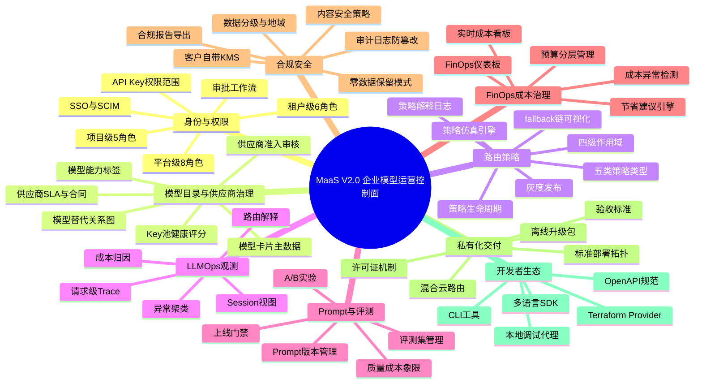
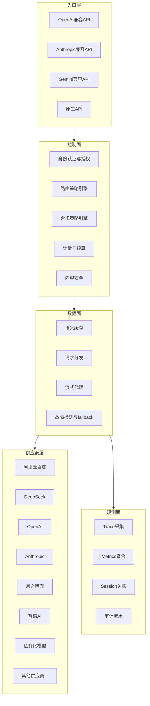
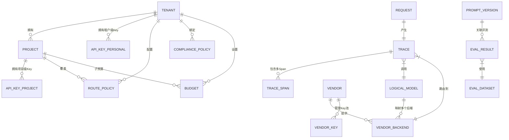
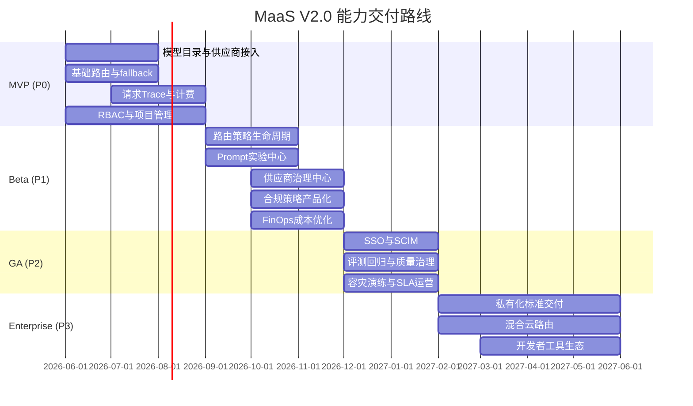

# MaaS平台 PRD V2.0 —— 企业模型运营控制面

**文档版本：** V2.0.0  
**编写日期：** 2026年05月21日  
**文档状态：** 设计评审中  
**机密等级：** 内部保密  
**替代说明：** 本文档替代旧版 `产品设计/maas平台PRD文档.md`，旧文档归档保留，不再更新。  
**竞品参考：** `竞品分析/28-25家竞品能力全景总结与MaaS差距分析.md`

---

## 0. 一句话定位

> **MaaS平台是企业的模型运营控制面（Model Operations Control Plane）**，统一接入多家模型供应商，通过可解释路由、FinOps成本治理、LLMOps请求观测、Policy as Code合规策略、完整企业权限与审计，让企业以生产级信心使用AI能力。

---

## 1. 为何要完全重写PRD

旧版PRD（V1.x）在三层模型架构、Key池、智能路由、计量计费、企业合同定价等基础能力上方向正确，但通过25家竞品全景分析，识别出七类系统性缺口：

| # | 缺口类别 | 具体表现 | 影响 |
|---|---|---|---|
| 1 | 用户角色体系过于扁平 | 仅Admin/Member两档，无法支撑大客户多角色多职责治理 | 大客户采购阻力 |
| 2 | 路由策略缺乏生命周期 | 没有策略仿真、灰度、审批、回滚、解释、效果评估 | 客户不敢上生产 |
| 3 | 请求级可观测不足 | 缺少Trace字段体系、fallback链可视化、session视图 | LLMOps能力弱 |
| 4 | 供应商治理停留在Key配置 | 缺少准入、SLA、合同、额度预测、健康评分、事故记录 | 上游风险传导 |
| 5 | Prompt实验与评测回归不完整 | 数据模型、评测流程、上线门禁、A/B实验、质量成本联动缺失 | 无LLMOps竞争力 |
| 6 | 合规策略未产品化 | 数据分级、地域控制、零数据保留、脱敏、客户KMS不具体 | 金融/政务客户无法采购 |
| 7 | 私有化交付不够标准化 | 部署规格、离线包、升级回滚、验收标准、许可证机制缺失 | 私有化无法规模化 |

V2.0的设计原则：**每个能力模块都要有数据模型、状态机、流程图、验收口径，不能只有页面截图或功能点列表。**

---

## 2. 产品能力全景 (Mindmap)

---

## 3. 子文档目录

| 文档编号 | 文件路径 | 内容概述 | 字数目标 | 当前状态 |
|---|---|---|---|---|
| 01 | [01-产品定位与用户角色体系.md](./01-产品定位与用户角色体系.md) | 产品愿景、竞争定位、完整RBAC体系（平台/租户/项目三层8+6+5角色）、用户旅程、审批工作流设计 | ≥20,000字 | 草稿 |
| 02 | [02-模型目录与供应商治理规格.md](./02-模型目录与供应商治理规格.md) | 模型卡片主数据、能力标签、替代关系图、供应商准入、Key池、SLA、合同、健康评分、模型生命周期 | ≥20,000字 | 草稿 |
| 03 | [03-路由策略与容灾降级规格.md](./03-路由策略与容灾降级规格.md) | 策略类型与作用域、策略生命周期状态机、仿真引擎、灰度、审批、回滚、fallback链可视化、容灾演练 | ≥20,000字 | 设计评审中 |
| 04 | [04-LLMOps观测与请求Trace规格.md](./04-LLMOps观测与请求Trace规格.md) | Trace字段体系、Session视图、路由解释、成本归因、异常聚类、Agent Trace、LLMOps仪表板 | ≥20,000字 | 草稿 |
| 05 | [05-Prompt实验与模型评测中心规格.md](./05-Prompt实验与模型评测中心规格.md) | Prompt版本、变量、A/B实验、评测数据集、评测指标、上线门禁、质量成本象限、评测与路由联动 | ≥20,000字 | 草稿 |
| 06 | [06-计费成本与FinOps规格.md](./06-计费成本与FinOps规格.md) | 计量模型、预算分层、FinOps仪表板、成本异常检测、节省建议、账单对账、合同定价 | ≥20,000字 | 草稿 |
| 07 | [07-合规安全与审计规格.md](./07-合规安全与审计规格.md) | 数据分级、地域控制、内容安全策略、零数据保留、客户KMS、审计日志字段、合规报告 | ≥20,000字 | 设计评审中 |
| 08 | [08-私有化交付与混合云规格.md](./08-私有化交付与混合云规格.md) | 部署形态、离线安装包、混合云路由、许可证机制、升级回滚、国产化适配、验收标准 | ≥20,000字 | 草稿 |
| 09 | [09-Console控制台功能规格.md](./09-Console控制台功能规格.md) | 全部租户侧页面信息架构、交互流程、字段验收、权限控制、核心数据模型 | ≥20,000字 | 设计评审中 |
| 10 | [10-Admin平台管理后台规格.md](./10-Admin平台管理后台规格.md) | 全部平台侧页面信息架构、交互流程、字段验收、权限控制、核心操作流程 | ≥20,000字 | 草稿 |
| 11 | [11-竞品差距覆盖验证矩阵.md](./11-竞品差距覆盖验证矩阵.md) | 将25家竞品分析识别的全部差距逐项对应V2.0文档章节，确认覆盖或标注待补充 | ≥8,000字 | 设计评审中 |
| 12 | [12-开发者工具与SDK规格.md](./12-开发者工具与SDK规格.md) | CLI核心命令集、多语言SDK接口规范、OpenAPI规范、Terraform Provider、本地调试代理 | ≥10,000字 | 框架草稿 |

---

## 4. 架构总览

### 4.1 平台分层架构

### 4.2 核心数据对象关系

### 4.3 能力优先级路线图

---

## 5. 竞争定位声明

| 竞争对手类型 | 核心打法 |
|---|---|
| 阿里云百炼/AWS Bedrock/Azure Foundry | 不争云厂商生态，争**跨云中立控制面**、**国内合规优先**、**非云化私有交付** |
| 硅基流动/智谱/Kimi | 把它们纳入模型供给侧，在**预算治理、审计、多供应商路由、企业SLA**上建立上层价值 |
| LiteLLM/One API/new-api | 用同等接入门槛 + **企业治理闭环（审批/审计/SLA/合规）+ 免自运维** 赢企业客户 |
| Portkey/Helicone | 学习策略控制面和LLMOps，补齐**国内合规、预算审批、供应商商务、合同计费**的差距 |
| OfoxAI/ZenMux/EasyRouter | 在托管体验和官方上游上不落后，在**完整企业治理、RBAC、审计、私有化**上明显领先 |

---

## 6. 版本变更记录

| 版本 | 日期 | 摘要 | 负责人 |
|---|---|---|---|
| V2.0.0 | 2026-05-21 | 基于25家竞品全景分析完全重写，新建PRD V2.0目录体系，替代旧PRD 1.x | 产品负责人 |

---

## 7. 关联文档索引

| 文档类型 | 路径 |
|---|---|
| 竞品分析（25家全景） | `竞品分析/28-25家竞品能力全景总结与MaaS差距分析.md` |
| 旧版PRD（归档） | `产品设计/maas平台PRD文档.md` |
| 技术架构设计 | `开发/技术架构设计文档.md` |
| 数据库设计 | `开发/数据库设计文档.md` |
| API接口设计 | `开发/API接口设计文档.md` |
| Console原型 | `原型HTML/console-frontend-prototype.html` |
| Admin原型 | `原型HTML/admin-frontend-prototype.html` |

---

*本文档是V2.0导航入口，所有详细规格见上方子文档。*
