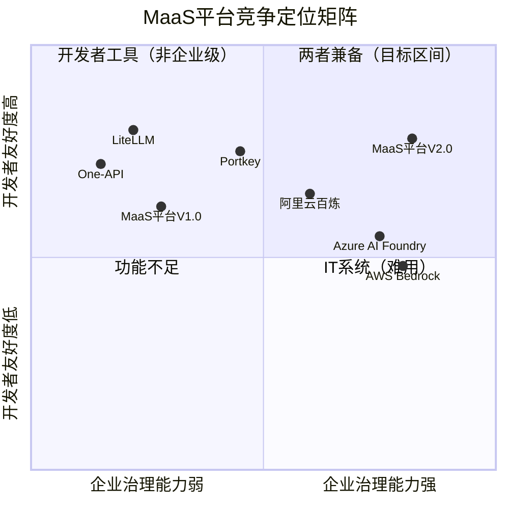
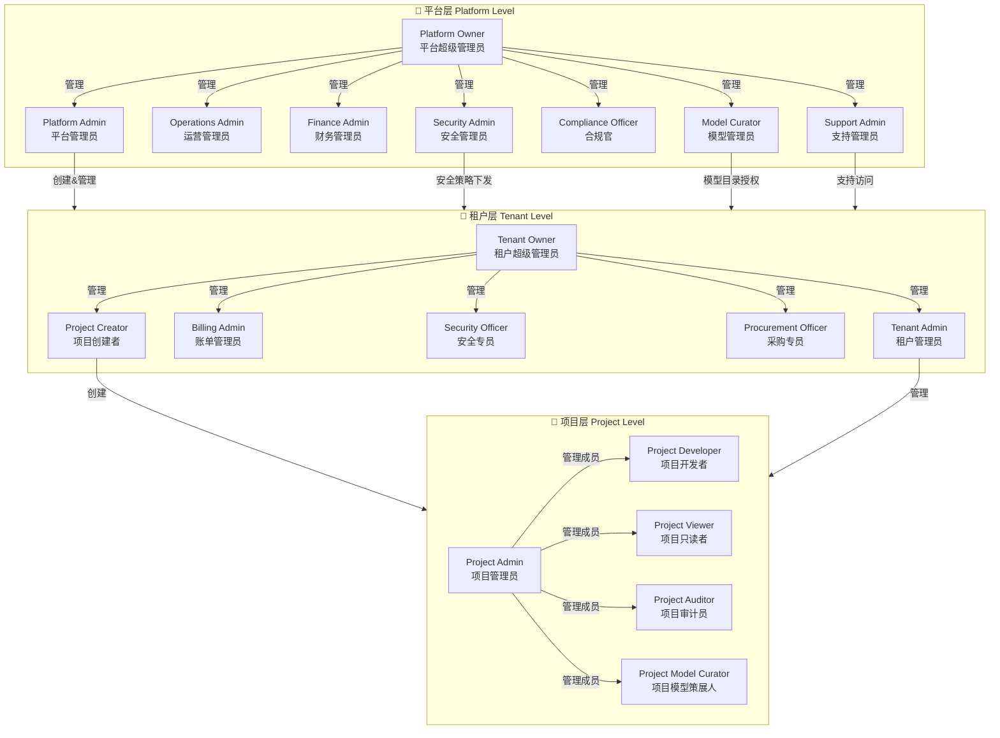
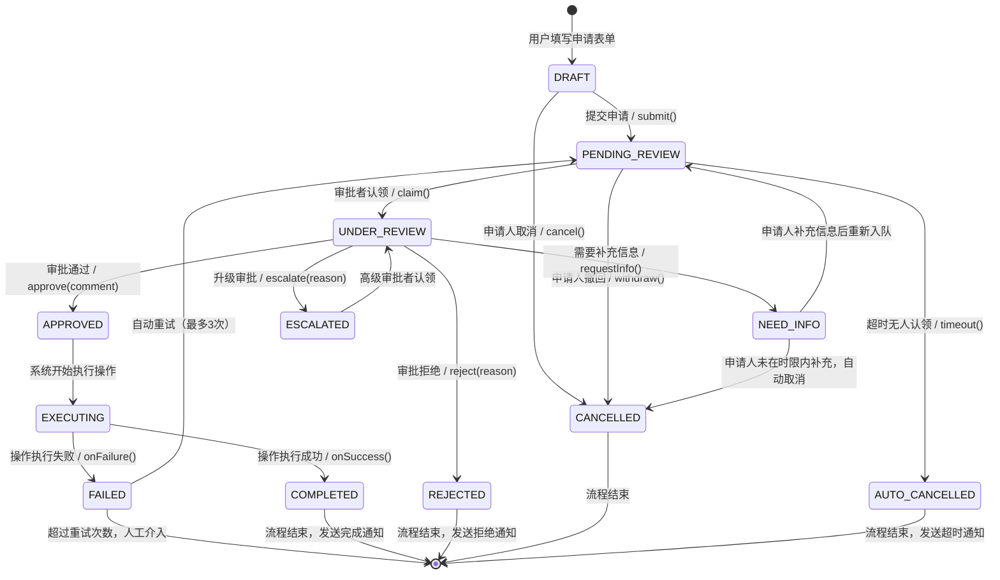
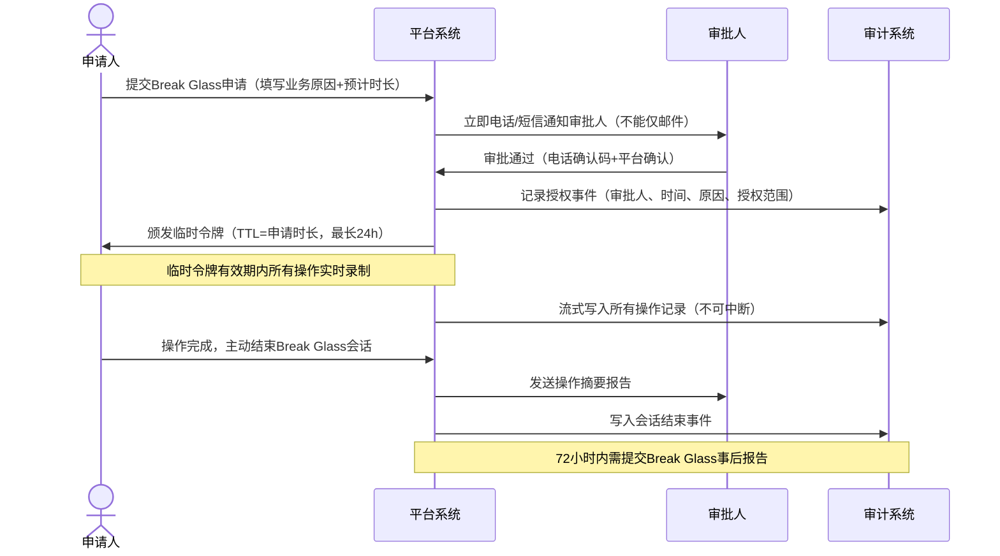
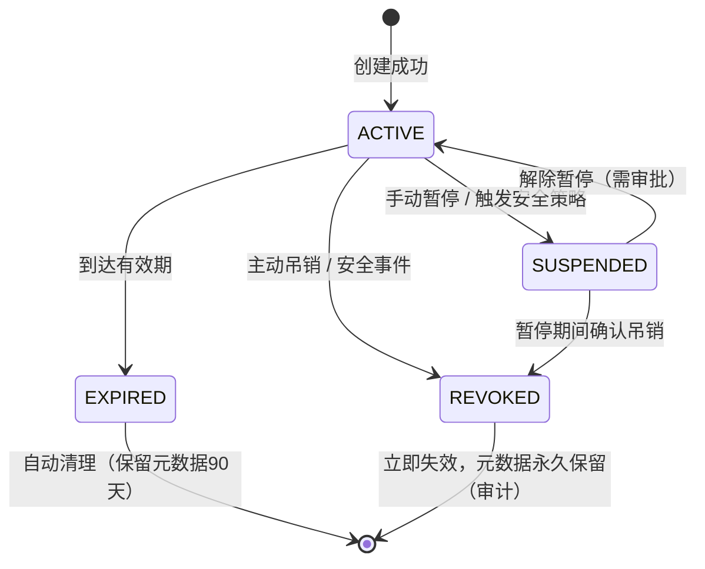
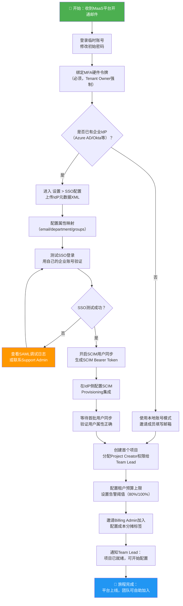
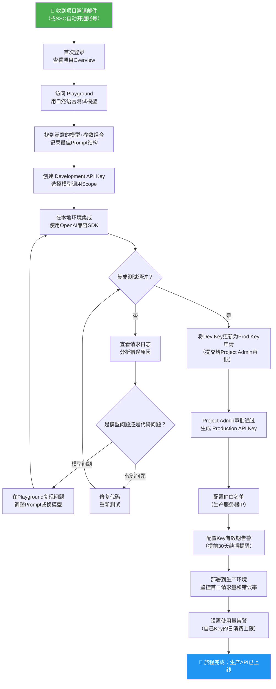
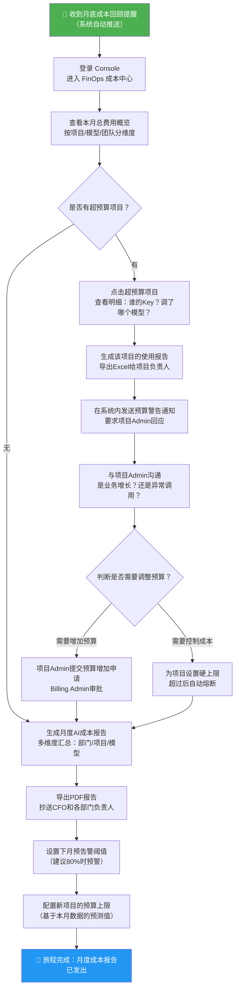
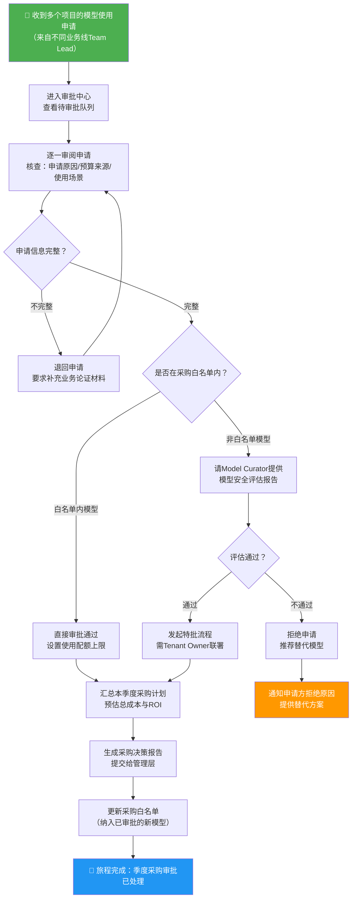
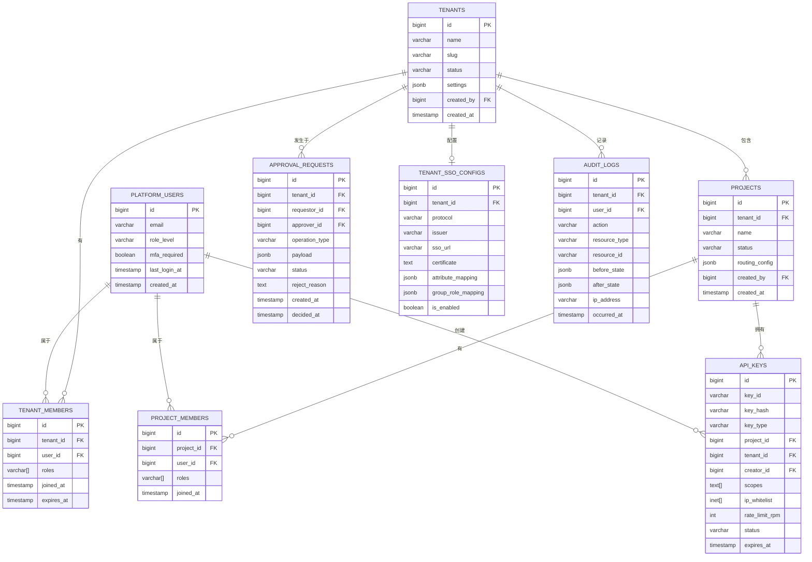

# 01 产品定位与用户角色体系

> **文档版本**：V2.0.0  
> **创建日期**：2026-05-21  
> **文档状态**：草稿（Draft）  
> **文档归属**：产品设计部 / MaaS平台产品组  
> **评审责任人**：产品负责人、架构师、安全合规负责人  
> **变更记录**：V2.0从V1.0重大升级——将双角色体系（Admin/Member）升级为三层19角色体系，增加权限矩阵、审批工作流、SSO/SCIM集成、数据隔离规格。

---

## 目录

1. [产品定位与战略愿景](#1-产品定位与战略愿景)
2. [用户角色体系总览](#2-用户角色体系总览)
3. [平台层角色（Platform Level）](#3-平台层角色platform-level)
4. [租户层角色（Tenant Level）](#4-租户层角色tenant-level)
5. [项目层角色（Project Level）](#5-项目层角色project-level)
6. [权限矩阵（Permission Matrix）](#6-权限矩阵permission-matrix)
7. [审批工作流设计](#7-审批工作流设计)
8. [SSO与SCIM集成规格](#8-sso与scim集成规格)
9. [API Key权限范围设计](#9-api-key权限范围设计)
10. [数据隔离模型](#10-数据隔离模型)
11. [用户旅程地图](#11-用户旅程地图user-journey-maps)
12. [验收标准](#12-验收标准)

---

## 1. 产品定位与战略愿景

### 1.1 从网关到控制面：战略升级路径

MaaS平台（Model-as-a-Service Platform）的战略定位经历了三个阶段的演进：

**阶段一（V0.x）：API代理网关**  
初期产品形态为简单的LLM API聚合网关，核心功能是统一多家供应商的API格式，降低开发者对接成本。该阶段产品价值单一，无法支撑企业级治理诉求。

**阶段二（V1.x）：多模型管理平台**  
引入租户隔离、基础计费、简单路由策略，支持多个业务线复用同一平台。但权限体系仅有Admin/Member两档，财务、安全、审计职能无法解耦，成为大客户采购的核心阻力。

**阶段三（V2.0）：企业模型运营控制面**  
当前版本定位为**Enterprise Model Operations Control Plane**，核心升级维度如下：

| 能力维度 | V1.x 现状 | V2.0 目标 | 升级理由 |
|----------|-----------|-----------|----------|
| 权限体系 | Admin/Member 2角色 | 三层19角色，细粒度RBAC | 大客户有CFO/CISO/CTO不同视图诉求 |
| 成本治理 | 查看账单 | FinOps预算管控、成本分摊、告警 | 企业AI成本已成C级关注 |
| 合规策略 | 无 | Policy as Code，审批工作流 | 金融/医疗/政务合规强制要求 |
| 审计能力 | 基础日志 | 完整操作审计、不可篡改审计链 | SOC2/等保2.0要求 |
| 身份集成 | 本地账号 | SAML 2.0/OIDC/SCIM 2.0 | 企业已有IdP，不希望独立维护账号 |
| 模型治理 | 手动配置 | 模型目录、版本、可用性矩阵 | 供应商模型频繁变化需标准化管理 |
| 可观测性 | 请求日志 | LLMOps全链路观测、Prompt评测 | AI质量成为业务关键指标 |

战略升级的核心逻辑：**企业AI采用曲线正在从POC阶段进入Production阶段**，Production阶段必须具备的三要素是：
1. **可治理**（Governable）：谁用了什么模型、花了多少钱、输出了什么内容，全部可查可控
2. **可扩展**（Scalable）：从10个开发者到10,000个内部用户，权限和资源管理不崩溃
3. **可合规**（Compliant）：满足行业监管要求，具备完整的合规证据链

### 1.2 核心价值主张

MaaS平台对不同角色交付不同的核心价值：

**对企业IT/平台团队（Platform Team）**：
- 统一接入多家模型供应商，消除重复集成成本（预计节省每家供应商3-5人周集成工作量）
- 集中管控API Key、权限、配额，消除"每个业务自己管Key"的安全风险
- 可解释路由策略，按成本/延迟/可用性自动调度，无需人工干预

**对企业AI开发团队（AI Engineering Team）**：
- Playground即时测试，无需搭建独立环境
- 标准OpenAI兼容API，迁移成本趋近于零
- 请求追踪、Prompt版本管理、A/B评测工具链

**对企业财务/运营团队（Finance/Ops Team）**：
- 按部门/项目/模型多维度成本分摊
- 预算预警和自动熔断，杜绝超额消费
- FinOps看板，支撑AI ROI汇报

**对企业安全/合规团队（Security/Compliance Team）**：
- Policy as Code：在中心化平台定义内容过滤、地域合规、数据不出境策略
- 完整操作审计日志，不可删除，支撑SOC2/等保2.0取证
- 高风险操作审批工作流，四眼原则

### 1.3 目标客户画像

**主要目标客户（Primary ICP）**：

| 客户类型 | 典型规模 | 关键痛点 | 付费意愿驱动因素 |
|----------|----------|----------|------------------|
| 金融科技企业 | 500-5000人 | 合规审计、数据不出境、风控日志 | 监管合规强制 |
| 大型互联网公司AI基础设施团队 | 内部平台服务1000+工程师 | 多租户成本分摊、API Key管控 | 内部效率与成本控制 |
| 企业数字化转型团队 | 100-1000人研发 | 统一接入、降低重复集成 | 降本增效 |
| 政府/国企信息化部门 | 50-500人 | 等保合规、国产化优先、审批流 | 合规必要性 |
| SaaS平台运营商 | 对外提供AI服务 | 多租户隔离、计量计费、白标 | 商业模式支撑 |

**次要目标客户（Secondary ICP）**：
- 咨询/集成商：为客户构建AI中台，需要白标能力
- 高校/研究机构：AI课题资源管控与成本追踪

### 1.4 产品定位矩阵



**定位解读**：  
- V1.0处于"功能尚可但治理能力弱"的区间，无法赢得大客户
- V2.0目标是在保持高开发者友好度的前提下，将企业治理能力提升至Azure AI Foundry/AWS Bedrock同等水平，同时在开发者体验上超越云厂商

---

## 2. 用户角色体系总览

### 2.1 三层角色架构设计原则

**设计原则一：最小权限原则（Principle of Least Privilege）**  
每个角色只拥有完成其职责所需的最小权限集合。权限不可"向上穿透"——项目级操作员无法影响租户级配置，租户管理员无法影响平台级设置。

**设计原则二：职责分离原则（Separation of Duties）**  
财务权限与技术权限分离、操作权限与审计权限分离、申请权限与审批权限分离。三权分立防止单点腐败风险。

**设计原则三：范围封闭原则（Scope Containment）**  
- 平台层角色：作用域为整个MaaS平台，跨所有租户可见
- 租户层角色：作用域仅限于所属租户及其下辖项目
- 项目层角色：作用域仅限于所属项目资源

**设计原则四：角色组合支持（Role Composition）**  
一个真实用户可以同时持有多个角色（如某人既是Tenant Admin又是Project Admin），系统取并集权限。但平台层角色与租户层角色不可跨层叠加（安全隔离要求）。

**设计原则五：时间限制权限（Time-Bounded Permissions）**  
所有权限支持有效期配置，到期自动降权。Break Glass应急权限必须有TTL（Time To Live），最长24小时。

**三层角色层级关系**：

```
Platform Level（平台层）
├── Platform Owner        ← 极少数人持有，平台生命周期管理
├── Platform Admin        ← 平台日常运营管理
├── Operations Admin      ← 平台运营指标与系统配置
├── Finance Admin         ← 平台级账单与供应商合约
├── Security Admin        ← 平台安全策略与审计
├── Compliance Officer    ← 合规策略制定与取证
├── Model Curator         ← 模型目录与供应商管理
└── Support Admin         ← 租户支持与工单处理

Tenant Level（租户层）
├── Tenant Owner          ← 租户最高管理权限
├── Tenant Admin          ← 租户日常管理
├── Billing Admin         ← 租户账单与预算管理
├── Security Officer      ← 租户安全策略
├── Procurement Officer   ← 模型采购申请与审批
└── Project Creator       ← 项目创建与初始化

Project Level（项目层）
├── Project Admin         ← 项目配置与成员管理
├── Project Developer     ← 代码集成与API调用
├── Project Viewer        ← 只读观察
├── Project Auditor       ← 审计日志查看
└── Project Model Curator ← 项目内模型策略配置
```

### 2.2 角色体系全景图



---

## 3. 平台层角色（Platform Level）

### 3.1 Platform Owner（平台超级管理员）

**角色英文ID**：`platform_owner`  
**角色层级**：Platform Level - Tier 0  
**最大持有人数建议**：≤ 3人（通常为CTO + 2名备份）

**职责描述**：  
Platform Owner是MaaS平台的最高权限持有者，负责平台生命周期管理、超级管理员账号管理、平台级安全策略的最终审批。该角色不参与日常运营，仅在关键决策节点介入。持有此角色的账号必须强制启用硬件MFA，且所有操作必须被审计日志记录。

**典型用户画像**：  
- 负责MaaS平台基础设施建设的CTO或VP Engineering
- 企业信息安全委员会指定的"系统最高负责人"
- 通常不在办公网络，通过VPN+MFA接入

**核心权限点列表**：
- ✅ 创建/删除Platform Admin账号
- ✅ 重置任意账号密码
- ✅ 查看/导出全平台审计日志（含Platform Admin操作）
- ✅ 启用/停用整个MaaS平台（全局开关）
- ✅ 修改平台级加密密钥策略
- ✅ 审批Platform Admin的Break Glass申请
- ✅ 配置IDP（身份提供商）根证书
- ✅ 查看所有租户的元数据（不含业务数据）
- ✅ 导出平台数据备份

**禁止项（Must NOT）**：
- ❌ 不应直接操作租户业务数据（违反最小权限原则）
- ❌ 不应单独持有，必须至少2人共同持有（防单点）
- ❌ 操作前必须经过审批工作流（4-eyes principle）
- ❌ 不可删除审计日志

**数据库字段示例**：
```sql
-- 账号表扩展字段
ALTER TABLE platform_users ADD COLUMN (
    role_level       VARCHAR(20) NOT NULL DEFAULT 'member',
    mfa_required     BOOLEAN NOT NULL DEFAULT false,
    last_login_at    TIMESTAMP,
    break_glass_until TIMESTAMP,
    created_by       BIGINT REFERENCES platform_users(id)
);

-- Platform Owner 创建时强制设置
INSERT INTO platform_users (email, role_level, mfa_required) 
VALUES ('cto@company.com', 'platform_owner', true);
```

---

### 3.2 Platform Admin（平台管理员）

**角色英文ID**：`platform_admin`  
**角色层级**：Platform Level - Tier 1  
**最大持有人数建议**：≤ 10人

**职责描述**：  
Platform Admin负责平台日常运营的最高管理权限，包括租户生命周期管理（创建/停用/删除）、平台级配置管理、下级平台角色的任命。Platform Admin是平台团队的"产品/运营负责人"，对应企业组织中的平台负责人角色。

**典型用户画像**：  
- MaaS平台产品负责人（Product Manager）
- 平台运营总监（Head of Platform Operations）
- 具有技术背景的业务负责人

**核心权限点列表**：
- ✅ 创建/修改/停用租户
- ✅ 为租户分配模型使用配额
- ✅ 管理Operations Admin/Finance Admin/Security Admin等平台角色
- ✅ 查看全平台使用统计
- ✅ 配置平台级默认策略
- ✅ 处理租户级别的紧急申请
- ✅ 查看平台审计日志（不含Platform Owner操作）

**禁止项**：
- ❌ 不可修改平台加密密钥
- ❌ 不可删除审计日志
- ❌ 不可创建其他Platform Admin（需Platform Owner审批）
- ❌ 不可访问租户内部业务数据（仅可查看租户元数据）

---

### 3.3 Operations Admin（运营管理员）

**角色英文ID**：`operations_admin`  
**角色层级**：Platform Level - Tier 2

**职责描述**：  
Operations Admin专注于平台的日常运营指标监控、系统健康状况管理、SLA追踪与故障响应。这是平台SRE（Site Reliability Engineer）团队的日常工作角色，具备较大的观察权限但操作权限受限。

**典型用户画像**：  
- 平台SRE工程师
- 平台运营值班人员
- 系统可靠性工程团队

**核心权限点列表**：
- ✅ 查看全平台请求监控指标（QPS、延迟、错误率）
- ✅ 查看模型供应商可用性状态
- ✅ 管理路由策略中的熔断配置
- ✅ 触发手动熔断（需审批或紧急情况可直接触发）
- ✅ 查看系统告警配置并确认告警
- ✅ 访问运维仪表板（不含财务数据）
- ✅ 导出系统性能报告

**禁止项**：
- ❌ 不可修改租户权限配置
- ❌ 不可查看请求内容（只能看聚合指标）
- ❌ 不可修改计费配置

---

### 3.4 Finance Admin（财务管理员）

**角色英文ID**：`finance_admin`  
**角色层级**：Platform Level - Tier 2

**职责描述**：  
Finance Admin管理平台与上游模型供应商的合约与账单，设置平台级成本告警，负责向租户分配计费策略。这是MaaS平台CFO/财务团队的专属视图角色。

**典型用户画像**：  
- 企业财务总监（CFO）或财务经理
- 采购/合同管理团队
- FinOps工程师

**核心权限点列表**：
- ✅ 查看全平台及分租户账单
- ✅ 配置平台级成本告警阈值
- ✅ 管理供应商API合约信息（密钥存储由Security Admin负责）
- ✅ 导出账单报告（CSV/PDF）
- ✅ 配置租户的计费模式（预付/后付/包月）
- ✅ 审批租户的预算超额申请
- ✅ 查看FinOps成本分析报告

**禁止项**：
- ❌ 不可查看请求日志内容
- ❌ 不可修改技术路由配置
- ❌ 不可管理用户账号

---

### 3.5 Security Admin（安全管理员）

**角色英文ID**：`security_admin`  
**角色层级**：Platform Level - Tier 2

**职责描述**：  
Security Admin负责平台整体安全策略的制定与执行，包括MFA策略、IP白名单、API Key安全策略、内容过滤策略、加密配置等。是企业CISO团队在MaaS平台的代表。

**典型用户画像**：  
- 企业CISO（首席信息安全官）或其委托人
- 信息安全工程师
- 红队/蓝队安全评估人员

**核心权限点列表**：
- ✅ 配置平台级MFA策略（强制/推荐/可选）
- ✅ 管理IP白名单和访问控制列表
- ✅ 配置内容过滤策略（PII检测、敏感词过滤）
- ✅ 管理供应商API Key的加密存储
- ✅ 查看全平台安全审计日志
- ✅ 触发安全事件响应（锁定账号/吊销Key）
- ✅ 配置TLS/mTLS策略
- ✅ 审批高风险安全变更

**禁止项**：
- ❌ 不可查看业务请求内容（防止权限滥用）
- ❌ 不可修改账单配置
- ❌ 不可管理租户业务配置

---

### 3.6 Compliance Officer（合规官）

**角色英文ID**：`compliance_officer`  
**角色层级**：Platform Level - Tier 2

**职责描述**：  
Compliance Officer负责制定和执行Policy as Code合规策略，取证合规证据，支撑等保2.0/SOC2/GDPR等认证工作。该角色具有高度的只读权限覆盖面，是合规审计的关键角色。

**典型用户画像**：  
- 企业法务合规团队
- 外部审计师（临时授权）
- 数据隐私官（DPO）

**核心权限点列表**：
- ✅ 查看并导出全平台完整审计日志
- ✅ 制定并发布合规策略（Policy as Code）
- ✅ 查看数据流向报告（数据不出境验证）
- ✅ 生成合规报告（SOC2/等保证据包）
- ✅ 查看任意租户的合规状态
- ✅ 冻结疑似违规的租户（需Platform Admin共同确认）
- ✅ 访问数据保留策略配置

**禁止项**：
- ❌ 不可修改系统配置（只读为主）
- ❌ 不可删除任何审计记录
- ❌ 不可查看用户密码或明文API Key

---

### 3.7 Model Curator（模型管理员）

**角色英文ID**：`model_curator`  
**角色层级**：Platform Level - Tier 2

**职责描述**：  
Model Curator负责MaaS平台的模型目录管理，包括新增/下线供应商模型、维护模型元数据（能力描述、价格、上下文长度、支持功能）、管理模型可用性状态、配置模型到租户的授权关系。

**典型用户画像**：  
- 平台模型技术评估工程师
- AI产品运营（负责跟踪模型发布动态）
- 供应商关系管理人员

**核心权限点列表**：
- ✅ 新增/修改/下线模型条目
- ✅ 配置模型价格（Token定价）
- ✅ 管理模型的租户授权白名单
- ✅ 配置模型健康检查策略
- ✅ 发布模型更新公告
- ✅ 管理模型能力标签（Function Call/Vision/Long Context等）

**禁止项**：
- ❌ 不可管理用户账号
- ❌ 不可修改计费账单
- ❌ 不可访问请求日志

---

### 3.8 Support Admin（支持管理员）

**角色英文ID**：`support_admin`  
**角色层级**：Platform Level - Tier 3

**职责描述**：  
Support Admin是平台客户支持团队的工作角色，具有受限的"代理查看"能力，可在租户授权的前提下协助排查问题。所有Support Admin的操作必须记录"代理操作"标记，确保审计可追溯。

**典型用户画像**：  
- 平台客户成功（CSM）人员
- 技术支持工程师（L1/L2）
- 账单纠纷处理人员

**核心权限点列表**：
- ✅ 查看工单和租户问题上报
- ✅ 在租户授权情况下查看租户配置（只读）
- ✅ 查看受限的请求错误日志（不含内容）
- ✅ 向租户发送系统通知
- ✅ 协助租户重置MFA（需二次审批）

**禁止项**：
- ❌ 不可在租户未授权情况下访问任何租户数据
- ❌ 不可修改任何配置
- ❌ 不可查看请求内容

---

## 4. 租户层角色（Tenant Level）

### 4.1 Tenant Owner（租户超级管理员）

**角色英文ID**：`tenant_owner`  
**角色层级**：Tenant Level - Tier 0  
**最大持有人数建议**：≤ 3人/租户

**职责描述**：  
Tenant Owner是企业租户内部的最高权限持有者，全权负责租户内的成员管理、项目管理、账单管理、安全策略配置。通常由企业的IT负责人或AI中台负责人担任。

**典型用户画像**：  
- 企业IT总监 / CIO
- 企业AI中台产品总监
- 购买并负责MaaS平台的业务负责人

**核心权限点列表**：
- ✅ 管理所有租户层角色成员
- ✅ 创建/删除项目
- ✅ 配置租户SSO（SAML/OIDC）
- ✅ 配置SCIM用户同步
- ✅ 设置租户整体预算上限
- ✅ 查看租户完整审计日志
- ✅ 配置租户数据保留策略
- ✅ 申请平台级支持
- ✅ 导出租户数据（含配置+账单）

**禁止项**：
- ❌ 不可访问其他租户的任何数据
- ❌ 不可修改平台级配置
- ❌ 不可删除审计日志

---

### 4.2 Tenant Admin（租户管理员）

**角色英文ID**：`tenant_admin`  
**角色层级**：Tenant Level - Tier 1

**职责描述**：  
Tenant Admin负责租户日常管理工作，是Tenant Owner的日常代理。在大型企业中，通常由AI平台工程团队的负责人担任。

**典型用户画像**：  
- 企业AI平台工程师Leader
- 云架构师（负责AI基础设施）

**核心权限点列表**：
- ✅ 邀请/移除租户成员
- ✅ 分配租户层角色（除Tenant Owner外）
- ✅ 创建/管理项目（需Project Creator权限或直接拥有）
- ✅ 配置租户API Key策略
- ✅ 查看租户使用统计
- ✅ 管理模型路由策略（租户级）
- ✅ 配置Webhook通知

**禁止项**：
- ❌ 不可修改SSO/SCIM配置（需Tenant Owner）
- ❌ 不可修改租户整体预算上限（需Billing Admin审批）
- ❌ 不可删除Tenant Owner

---

### 4.3 Billing Admin（账单管理员）

**角色英文ID**：`billing_admin`  
**角色层级**：Tenant Level - Tier 2

**职责描述**：  
Billing Admin是企业财务团队在MaaS租户内的代表，专注于成本分析、预算管理、账单导出，不参与技术配置。

**典型用户画像**：  
- 企业财务BP（Business Partner）
- AI项目预算管理人员
- 部门成本中心负责人

**核心权限点列表**：
- ✅ 查看租户账单（全部项目）
- ✅ 设置项目级预算上限
- ✅ 配置成本告警（按项目/模型/时段）
- ✅ 导出账单报告（CSV/PDF/Excel）
- ✅ 查看FinOps成本分析
- ✅ 审批项目预算超额申请
- ✅ 配置成本分摊标签（Cost Allocation Tags）

**禁止项**：
- ❌ 不可访问请求日志（内容或元数据）
- ❌ 不可修改技术配置
- ❌ 不可管理成员权限

---

### 4.4 Security Officer（安全专员）

**角色英文ID**：`security_officer`  
**角色层级**：Tenant Level - Tier 2

**职责描述**：  
Security Officer是企业安全团队在MaaS租户内的代表，负责API Key安全策略、内容过滤策略、访问控制审计，向企业CISO负责。

**典型用户画像**：  
- 企业信息安全工程师
- 数据安全合规人员
- DevSecOps工程师

**核心权限点列表**：
- ✅ 查看并导出租户审计日志
- ✅ 配置API Key有效期和IP白名单策略
- ✅ 配置内容过滤策略（PII/敏感词）
- ✅ 吊销异常API Key
- ✅ 查看异常访问告警
- ✅ 配置MFA强制策略（租户级）
- ✅ 审查项目安全配置

**禁止项**：
- ❌ 不可修改账单配置
- ❌ 不可查看请求内容正文
- ❌ 不可删除审计日志

---

### 4.5 Procurement Officer（采购专员）

**角色英文ID**：`procurement_officer`  
**角色层级**：Tenant Level - Tier 2

**职责描述**：  
Procurement Officer专注于模型和资源的采购申请与审批，是企业采购流程在MaaS平台的落地角色。负责审批项目团队的模型使用申请、预算申请，确保采购合规。

**典型用户画像**：  
- 企业采购部门负责人
- 预算审批委员会成员
- AI项目资源分配管理员

**核心权限点列表**：
- ✅ 审批项目级模型使用申请
- ✅ 审批项目预算申请
- ✅ 查看所有项目的资源使用情况
- ✅ 配置模型采购白名单（限制可用模型范围）
- ✅ 生成采购报告

**禁止项**：
- ❌ 不可直接修改技术配置
- ❌ 不可访问代码或请求日志

---

### 4.6 Project Creator（项目创建者）

**角色英文ID**：`project_creator`  
**角色层级**：Tenant Level - Tier 3

**职责描述**：  
Project Creator被授权在租户内创建新项目，并自动成为该项目的第一个Project Admin。这是项目生命周期启动的关键角色，通常由业务线负责人或架构师持有。

**典型用户画像**：  
- AI应用项目PM或Tech Lead
- 业务线架构师
- 获得IT部门授权的业务负责人

**核心权限点列表**：
- ✅ 创建新项目（自动成为项目的Project Admin）
- ✅ 为新项目申请初始配额
- ✅ 查看租户级项目列表（不含其他项目内部数据）

**禁止项**：
- ❌ 不可管理其他项目（除非另有授权）
- ❌ 不可修改租户配置
- ❌ 创建项目需Tenant Admin或Tenant Owner审批（可配置是否开启审批）

---

## 5. 项目层角色（Project Level）

### 5.1 Project Admin（项目管理员）

**角色英文ID**：`project_admin`  
**角色层级**：Project Level - Tier 1

**职责描述**：  
Project Admin是项目内部的最高管理权限角色，负责项目成员管理、配置管理、API Key管理、预算申请。是项目技术负责人的自然对应角色。

**典型用户画像**：  
- AI应用项目Tech Lead
- 研发团队Leader
- AI应用产品负责人（参与技术决策）

**核心权限点列表**：
- ✅ 管理项目成员和角色分配
- ✅ 创建/吊销项目API Key
- ✅ 配置项目级路由策略（在租户策略允许范围内）
- ✅ 查看项目使用统计和账单
- ✅ 配置Prompt模板
- ✅ 申请预算增加
- ✅ 配置项目Webhook
- ✅ 删除项目（需Tenant Admin审批）

**禁止项**：
- ❌ 不可修改租户级配置
- ❌ 不可访问其他项目数据
- ❌ 不可配置超出租户策略的规则

---

### 5.2 Project Developer（项目开发者）

**角色英文ID**：`project_developer`  
**角色层级**：Project Level - Tier 2

**职责描述**：  
Project Developer是最常见的项目工作角色，代表AI应用的开发工程师。主要工作是使用API Key调用模型、在Playground调试Prompt、查看自己创建的API Key的统计。

**典型用户画像**：  
- 后端工程师（集成LLM API）
- AI工程师（Prompt Engineering）
- 全栈开发者

**核心权限点列表**：
- ✅ 创建/查看/吊销自己创建的API Key
- ✅ 访问Playground（调试Prompt）
- ✅ 查看项目模型列表（可用模型）
- ✅ 查看自己API Key的使用统计
- ✅ 管理Prompt模板（创建/修改自己的）
- ✅ 查看项目级文档和示例代码

**禁止项**：
- ❌ 不可查看其他成员的API Key
- ❌ 不可修改项目配置
- ❌ 不可查看完整项目账单
- ❌ 不可管理其他成员

---

### 5.3 Project Viewer（项目只读者）

**角色英文ID**：`project_viewer`  
**角色层级**：Project Level - Tier 3

**职责描述**：  
Project Viewer拥有项目内最小的只读权限集合，适用于需要了解项目进度但不参与开发的业务方、产品经理、观察员等角色。

**典型用户画像**：  
- 项目关联的业务负责人（非技术）
- 产品经理（查看模型使用情况）
- 内部项目管理人员

**核心权限点列表**：
- ✅ 查看项目概览和成员列表
- ✅ 查看项目使用统计（聚合数据）
- ✅ 查看项目可用模型列表
- ✅ 访问只读Playground（不可发起调用，仅查看历史）

**禁止项**：
- ❌ 不可创建API Key
- ❌ 不可查看请求日志详情
- ❌ 不可修改任何配置

---

### 5.4 Project Auditor（项目审计员）

**角色英文ID**：`project_auditor`  
**角色层级**：Project Level - Tier 2（特殊只读权限）

**职责描述**：  
Project Auditor是专门用于审计目的的特殊角色，拥有比Project Viewer更广泛的日志访问权限，但没有任何写入或配置权限。适用于内部审计人员或外部审计师的临时授权。

**典型用户画像**：  
- 内部审计部门人员
- 外部安全审计师（临时授权）
- 合规验证人员

**核心权限点列表**：
- ✅ 查看项目完整操作审计日志
- ✅ 查看API Key创建/吊销历史
- ✅ 查看成员权限变更历史
- ✅ 导出审计报告
- ✅ 查看请求元数据（不含内容正文）

**禁止项**：
- ❌ 不可查看请求内容正文
- ❌ 不可修改任何配置
- ❌ 不可创建API Key
- ❌ 审计员账号本身的操作也必须被记录审计

---

### 5.5 Project Model Curator（项目模型策展人）

**角色英文ID**：`project_model_curator`  
**角色层级**：Project Level - Tier 2

**职责描述**：  
Project Model Curator是项目内专门负责模型策略配置的角色，在平台Model Curator划定的可用模型范围内，为项目配置默认模型、路由权重、Fallback策略等。适合有专门AI基础设施工程师的大型团队。

**典型用户画像**：  
- 项目内AI基础设施工程师
- MLOps工程师
- 负责模型选型的技术负责人

**核心权限点列表**：
- ✅ 在项目可用模型列表中配置默认模型
- ✅ 配置模型路由权重（A/B测试流量分配）
- ✅ 配置Fallback链（主模型失败时的降级策略）
- ✅ 配置模型级别的参数默认值（temperature等）
- ✅ 查看模型性能对比报告

**禁止项**：
- ❌ 不可新增不在可用列表中的模型
- ❌ 不可管理API Key
- ❌ 不可修改成员权限

---

## 6. 权限矩阵（Permission Matrix）

**图例说明**：
- ✅ 允许（Always Allow）
- ❌ 禁止（Always Deny）
- 🔶 条件允许（Conditional Allow）：括号内说明条件
- — 不适用（Not Applicable）

### 6.1 平台操作权限矩阵

| 操作 | PO | PA | OA | FA | SA | CO | MC | SU |
|------|----|----|----|----|----|----|----|----|
| 创建Platform Admin | ✅ | ❌ | ❌ | ❌ | ❌ | ❌ | ❌ | ❌ |
| 删除Platform Admin | ✅ | ❌ | ❌ | ❌ | ❌ | ❌ | ❌ | ❌ |
| 查看Platform Owner列表 | ✅ | ✅ | ❌ | ❌ | ✅ | ✅ | ❌ | ❌ |
| 创建新租户 | ✅ | ✅ | ❌ | ❌ | ❌ | ❌ | ❌ | ❌ |
| 停用/删除租户 | ✅ | 🔶(需审批) | ❌ | ❌ | ❌ | 🔶(合规冻结) | ❌ | ❌ |
| 查看所有租户列表 | ✅ | ✅ | ✅ | ✅ | ✅ | ✅ | ✅ | 🔶(授权内) |
| 修改租户配额 | ✅ | ✅ | ❌ | 🔶(需SA) | ❌ | ❌ | ❌ | ❌ |
| 新增模型供应商 | ✅ | ✅ | ❌ | ❌ | 🔶(密钥部分) | ❌ | ✅ | ❌ |
| 修改模型价格 | ✅ | ✅ | ❌ | ✅ | ❌ | ❌ | ✅ | ❌ |
| 下线模型 | ✅ | ✅ | ❌ | ❌ | ❌ | ❌ | ✅ | ❌ |
| 查看全平台审计日志 | ✅ | 🔶(除PO外) | ❌ | ❌ | ✅ | ✅ | ❌ | ❌ |
| 删除审计日志 | ❌ | ❌ | ❌ | ❌ | ❌ | ❌ | ❌ | ❌ |
| 配置平台MFA策略 | ✅ | ❌ | ❌ | ❌ | ✅ | ❌ | ❌ | ❌ |
| 配置IP白名单 | ✅ | ❌ | ❌ | ❌ | ✅ | ❌ | ❌ | ❌ |
| 配置内容过滤策略 | ✅ | ✅ | ❌ | ❌ | ✅ | ✅ | ❌ | ❌ |
| 查看供应商API Key | ✅ | ❌ | ❌ | ❌ | ✅ | ❌ | ❌ | ❌ |
| 配置路由熔断 | ✅ | ✅ | ✅ | ❌ | ❌ | ❌ | ❌ | ❌ |
| 查看平台账单 | ✅ | ✅ | ❌ | ✅ | ❌ | ❌ | ❌ | ❌ |
| 导出平台账单 | ✅ | ✅ | ❌ | ✅ | ❌ | 🔶(合规用途) | ❌ | ❌ |
| 配置IdP/SSO根证书 | ✅ | ❌ | ❌ | ❌ | ✅ | ❌ | ❌ | ❌ |
| 发布平台公告 | ✅ | ✅ | ✅ | ❌ | ❌ | ❌ | ✅ | ✅ |
| 生成合规报告 | ✅ | ✅ | ❌ | ❌ | ✅ | ✅ | ❌ | ❌ |

*PO=Platform Owner, PA=Platform Admin, OA=Operations Admin, FA=Finance Admin, SA=Security Admin, CO=Compliance Officer, MC=Model Curator, SU=Support Admin*

### 6.2 租户操作权限矩阵

| 操作 | TO | TA | BA | SO | PRC | PC |
|------|----|----|----|----|----|-----|
| 邀请/移除租户成员 | ✅ | ✅ | ❌ | ❌ | ❌ | ❌ |
| 分配租户层角色 | ✅ | 🔶(除TO外) | ❌ | ❌ | ❌ | ❌ |
| 创建项目 | ✅ | ✅ | ❌ | ❌ | ❌ | ✅ |
| 删除项目 | ✅ | 🔶(需审批) | ❌ | ❌ | ❌ | ❌ |
| 配置SSO/SAML | ✅ | ❌ | ❌ | ❌ | ❌ | ❌ |
| 配置SCIM同步 | ✅ | ❌ | ❌ | ❌ | ❌ | ❌ |
| 查看租户账单 | ✅ | ✅ | ✅ | ❌ | ✅ | ❌ |
| 设置预算上限 | ✅ | 🔶(需BA) | ✅ | ❌ | ❌ | ❌ |
| 导出账单 | ✅ | ✅ | ✅ | ❌ | ✅ | ❌ |
| 查看租户审计日志 | ✅ | ✅ | ❌ | ✅ | ❌ | ❌ |
| 吊销API Key | ✅ | ✅ | ❌ | ✅ | ❌ | ❌ |
| 配置MFA策略（租户级） | ✅ | ❌ | ❌ | ✅ | ❌ | ❌ |
| 审批模型使用申请 | ✅ | ✅ | ❌ | ❌ | ✅ | ❌ |
| 审批预算超额申请 | ✅ | ❌ | ✅ | ❌ | ✅ | ❌ |
| 配置内容过滤（租户级） | ✅ | ✅ | ❌ | ✅ | ❌ | ❌ |
| 查看所有项目统计 | ✅ | ✅ | ✅ | ✅ | ✅ | ❌ |
| 配置Webhook | ✅ | ✅ | ❌ | ❌ | ❌ | ❌ |
| 导出租户数据 | ✅ | 🔶(需审批) | ❌ | ❌ | ❌ | ❌ |

*TO=Tenant Owner, TA=Tenant Admin, BA=Billing Admin, SO=Security Officer, PRC=Procurement Officer, PC=Project Creator*

### 6.3 项目操作权限矩阵

| 操作 | PRA | PRD | PRV | PRAU | PRMC |
|------|-----|-----|-----|------|------|
| 管理项目成员 | ✅ | ❌ | ❌ | ❌ | ❌ |
| 创建API Key（项目级） | ✅ | ✅ | ❌ | ❌ | ❌ |
| 查看所有API Key | ✅ | 🔶(仅自己) | ❌ | ❌ | ❌ |
| 吊销API Key（他人） | ✅ | ❌ | ❌ | ❌ | ❌ |
| 配置项目路由策略 | ✅ | ❌ | ❌ | ❌ | ✅ |
| 配置Fallback策略 | ✅ | ❌ | ❌ | ❌ | ✅ |
| 配置模型路由权重 | ✅ | ❌ | ❌ | ❌ | ✅ |
| 使用Playground | ✅ | ✅ | 🔶(只读) | ❌ | ✅ |
| 查看项目账单 | ✅ | 🔶(仅自己Key) | 🔶(聚合) | ❌ | ❌ |
| 申请预算增加 | ✅ | ❌ | ❌ | ❌ | ❌ |
| 创建Prompt模板 | ✅ | ✅ | ❌ | ❌ | ❌ |
| 查看所有Prompt模板 | ✅ | ✅ | ✅ | ❌ | ✅ |
| 查看项目审计日志 | ✅ | ❌ | ❌ | ✅ | ❌ |
| 导出审计日志 | ✅ | ❌ | ❌ | ✅ | ❌ |
| 查看请求元数据 | ✅ | 🔶(仅自己Key) | ❌ | ✅ | ❌ |
| 查看请求内容正文 | 🔶(需内容审计权限) | ❌ | ❌ | ❌ | ❌ |
| 删除项目 | 🔶(需TA审批) | ❌ | ❌ | ❌ | ❌ |
| 查看项目成员列表 | ✅ | ✅ | ✅ | ✅ | ✅ |
| 配置项目Webhook | ✅ | 🔶(需PA审批) | ❌ | ❌ | ❌ |
| 申请新模型使用权限 | ✅ | 🔶(需PA审批) | ❌ | ❌ | ❌ |

*PRA=Project Admin, PRD=Project Developer, PRV=Project Viewer, PRAU=Project Auditor, PRMC=Project Model Curator*

### 6.4 数据访问权限矩阵

| 数据类型 | 内容说明 | Platform层 | Tenant层 | Project层 |
|----------|----------|-----------|---------|----------|
| 请求内容正文（Prompt/Response） | 实际的LLM输入输出 | SA仅在安全事件时可访问，需审批 | SO仅在安全事件时，需TO审批 | 无任何角色可常规访问 |
| 请求元数据（非内容） | Token数、延迟、模型、时间戳 | OA/SA/CO可访问聚合 | TO/TA/SO可按项目查看 | PRA/PRAU可查看本项目 |
| API Key（明文） | 实际密钥值 | SA管理供应商Key，用户Key单向哈希 | TO可查看Key前缀 | PRD只能在创建时查看一次 |
| 账单数据 | 费用金额、Token计量 | FA可查全平台 | BA/TO可查本租户 | PRA可查本项目 |
| 审计日志 | 操作记录 | CO/SA可查全平台 | TO/SO可查本租户 | PRA/PRAU可查本项目 |
| 模型配置 | 路由策略、参数 | PA/MC可配置 | TA可配置租户级 | PRA/PRMC可配置项目级 |
| 用户个人信息 | 邮箱、手机号等 | PO/PA有管理权限 | TO/TA有管理权限（本租户） | PRA只能看成员列表（邮箱） |

---

## 7. 审批工作流设计

### 7.1 需要审批的高风险操作清单

以下操作被分类为高风险操作，必须经过审批工作流：

**Tier A（需双人确认，立即生效后异步通知）**：
| 操作 | 申请方 | 审批方 | 超时处理 |
|------|--------|--------|----------|
| 普通API Key吊销 | 任意持有者 | Project Admin | 24h内不审批视为拒绝 |
| 项目成员移除 | Project Admin | Tenant Admin | 无超时，持续pending |
| 增加项目预算（≤20%） | Project Admin | Billing Admin | 48h自动拒绝 |

**Tier B（需明确审批，生效前必须通过）**：
| 操作 | 申请方 | 审批方 | 超时处理 |
|------|--------|--------|----------|
| 创建新项目 | Project Creator/TA | Tenant Owner/TA | 7天内审批 |
| 增加项目预算（>20%） | Project Admin | Billing Admin + Tenant Owner双签 | 7天自动拒绝 |
| 申请使用新模型 | Project Admin | Procurement Officer | 7天自动拒绝 |
| 停用租户成员 | Tenant Admin | Tenant Owner | 48h处理 |

**Tier C（需四眼原则，高敏感操作）**：
| 操作 | 申请方 | 审批方 | 特殊要求 |
|------|--------|--------|---------|
| 删除租户 | Platform Admin | Platform Owner | 需2个Platform Owner确认 |
| 导出全量数据 | Tenant Owner | Platform Admin | 需记录原因，保留申请记录 |
| Break Glass应急权限 | 任意用户 | 上级管理者 | TTL≤24h，全程录像审计 |
| 修改平台加密策略 | Security Admin | Platform Owner | 需Change Management工单 |
| 吊销租户Owner账号 | Platform Admin | Platform Owner | 需安全委员会审批 |

### 7.2 审批流状态机



**审批状态说明**：

| 状态 | 说明 | 下一步动作 |
|------|------|-----------|
| DRAFT | 申请草稿，未提交 | 申请人完善信息后提交 |
| PENDING_REVIEW | 等待审批者认领 | 审批者收到通知并认领 |
| UNDER_REVIEW | 审批者正在审核 | 审批者做出决策 |
| NEED_INFO | 需要申请人补充信息 | 申请人补充后自动重新入队 |
| ESCALATED | 已升级至更高权限审批者 | 高级审批者认领并审核 |
| APPROVED | 审批通过，等待执行 | 系统自动执行或人工确认执行 |
| EXECUTING | 系统正在执行操作 | 等待执行结果 |
| COMPLETED | 操作完成 | 终态，通知相关人 |
| REJECTED | 审批被拒绝 | 终态，申请人可修改后重新提交 |
| CANCELLED | 申请人主动撤回 | 终态 |
| AUTO_CANCELLED | 超时自动取消 | 终态，可重新提交 |
| FAILED | 执行失败 | 系统重试或人工介入 |

### 7.3 审批通知机制

**通知渠道优先级**：
1. **平台内通知**（必须）：审批中心实时推送，支持浏览器Web Push
2. **邮件通知**（必须）：触发点：提交/认领/通过/拒绝/超时警告
3. **企业IM通知**（可选）：支持钉钉/企业微信/Slack Webhook集成
4. **短信通知**（可选，仅Tier C操作）：手机号接收短信确认码

**通知渠道配置规格**：

租户管理员可在 Console → 团队与成员 → 通知渠道（`D11B`）中配置以下通知渠道，配置后对租户内所有审批通知生效：

| 渠道类型 | 配置项 | 说明 | 默认状态 |
|---------|-------|------|---------|
| 邮件 | 无需配置，使用成员注册邮箱 | 所有审批事件触发 | 必须开启 |
| 企业微信 | Webhook URL（企业微信群机器人） | 支持 Markdown 格式消息 | 默认关闭 |
| 钉钉 | Webhook URL + 签名 Secret | 支持 @ 指定审批人 | 默认关闭 |
| Slack | Webhook URL | 支持 Block Kit 富文本 | 默认关闭 |
| 飞书 | Webhook URL | 支持卡片消息格式 | 默认关闭 |
| 自定义 Webhook | URL + Headers（支持 Bearer Token 鉴权） | 推送标准 JSON payload | 默认关闭 |
| 短信 | 手机号（仅 Tier C 操作，由 Platform Admin 配置） | 仅用于高风险操作确认 | 默认关闭 |

**渠道配置的 Webhook Payload 格式（自定义 Webhook / 企业IM 通用）**：

```json
{
  "event_type": "approval.requested",
  "request_id": "REQ-20260521-001234",
  "requestor": {
    "name": "张三",
    "email": "zhangsan@company.com"
  },
  "operation": "创建新项目：AI客服助手-v2",
  "tier": "B",
  "scope": "租户：TechCorp",
  "expires_at": "2026-05-28T14:30:00+08:00",
  "approve_url": "https://maas.company.com/approvals/REQ-20260521-001234",
  "urgency": "normal"
}
```

`event_type` 枚举值：`approval.requested`、`approval.approved`、`approval.rejected`、`approval.expired`、`approval.auto_approved`

**每个用户的个人通知偏好**：

每个用户可在 Console 个人设置中覆盖租户级默认配置：
- 选择接收哪些类型的审批通知（我发起的 / 我需要审批的 / 与我相关的）
- 选择接收哪些渠道（在租户已配置渠道的基础上选择子集）
- 设置静默时段（如晚上 22:00 到早上 8:00 不接收非 Tier C 通知）

```json
{
  "notification": {
    "type": "APPROVAL_REQUEST",
    "template_id": "approval_pending",
    "variables": {
      "requestor_name": "张三",
      "requestor_email": "zhangsan@company.com",
      "operation": "创建新项目：AI客服助手-v2",
      "scope": "租户：TechCorp / 申请时间：2026-05-21 14:30",
      "request_id": "REQ-20260521-001234",
      "approve_url": "https://maas.company.com/approvals/REQ-20260521-001234",
      "expires_at": "2026-05-28 14:30",
      "urgency": "normal"
    }
  }
}
```

### 7.4 Break Glass应急权限

**适用场景**：生产系统发生严重故障，需要超出常规权限的紧急访问（如：主账号被锁定、需要紧急查看加密数据排查故障）。

**Break Glass流程**：



**Break Glass数据库记录**：
```sql
CREATE TABLE break_glass_sessions (
    id              BIGSERIAL PRIMARY KEY,
    requestor_id    BIGINT NOT NULL,
    approver_id     BIGINT NOT NULL,
    reason          TEXT NOT NULL,
    scope           JSONB NOT NULL,         -- 授权的操作范围
    started_at      TIMESTAMP NOT NULL,
    expires_at      TIMESTAMP NOT NULL,     -- 最长24h
    ended_at        TIMESTAMP,             -- 实际结束时间
    token_hash      VARCHAR(64) NOT NULL,   -- 临时令牌的哈希
    status          VARCHAR(20) NOT NULL,   -- active/expired/revoked
    post_report_url TEXT,                  -- 事后报告链接
    created_at      TIMESTAMP DEFAULT NOW()
);

CREATE TABLE break_glass_audit (
    id                  BIGSERIAL PRIMARY KEY,
    session_id          BIGINT REFERENCES break_glass_sessions(id),
    operation           VARCHAR(200) NOT NULL,
    resource_type       VARCHAR(50),
    resource_id         VARCHAR(100),
    request_payload     JSONB,             -- 脱敏后的请求数据
    response_status     INT,
    occurred_at         TIMESTAMP NOT NULL
);
```

---

## 8. SSO与SCIM集成规格

### 8.1 SAML 2.0 SP配置规格

MaaS平台作为SAML Service Provider（SP），支持企业IdP（如Okta、Azure AD、企业微信、飞书）进行单点登录。

**SP元数据**：
```xml
<!-- MaaS平台SAML SP元数据示例 -->
<md:EntityDescriptor 
    xmlns:md="urn:oasis:names:tc:SAML:2.0:metadata"
    entityID="https://maas.company.com/saml/tenant/{tenant_id}/metadata">
    
    <md:SPSSODescriptor 
        AuthnRequestsSigned="true"
        WantAssertionsSigned="true"
        protocolSupportEnumeration="urn:oasis:names:tc:SAML:2.0:protocol">
        
        <md:KeyDescriptor use="signing">
            <!-- SP签名证书 -->
        </md:KeyDescriptor>
        
        <md:AssertionConsumerService 
            Binding="urn:oasis:names:tc:SAML:2.0:bindings:HTTP-POST"
            Location="https://maas.company.com/saml/tenant/{tenant_id}/acs"
            index="1" isDefault="true"/>
            
        <md:SingleLogoutService 
            Binding="urn:oasis:names:tc:SAML:2.0:bindings:HTTP-Redirect"
            Location="https://maas.company.com/saml/tenant/{tenant_id}/slo"/>
    </md:SPSSODescriptor>
</md:EntityDescriptor>
```

**SAML断言属性映射配置**：

| 断言属性（IdP侧） | 平台字段 | 必需 | 说明 |
|------------------|---------|------|------|
| `NameID` | `user.external_id` | ✅ | 用户唯一标识，格式：`emailAddress` |
| `email` | `user.email` | ✅ | 邮箱地址 |
| `displayName` | `user.display_name` | ❌ | 显示名称 |
| `department` | `user.department` | ❌ | 部门，用于自动角色映射 |
| `groups` | 用于角色自动分配 | ❌ | 逗号分隔的组名列表 |
| `locale` | `user.locale` | ❌ | 语言偏好 |

**数据库存储**：
```sql
CREATE TABLE tenant_sso_configs (
    id              BIGSERIAL PRIMARY KEY,
    tenant_id       BIGINT NOT NULL,
    protocol        VARCHAR(10) NOT NULL,   -- saml/oidc
    issuer          VARCHAR(500) NOT NULL,  -- IdP的entityID
    sso_url         VARCHAR(500) NOT NULL,  -- IdP SSO端点
    slo_url         VARCHAR(500),          -- 单点登出端点
    certificate     TEXT NOT NULL,         -- IdP证书（PEM格式）
    attribute_mapping JSONB NOT NULL,       -- 字段映射配置
    group_role_mapping JSONB,              -- 组到角色映射
    is_enabled      BOOLEAN DEFAULT false,
    created_at      TIMESTAMP DEFAULT NOW(),
    updated_at      TIMESTAMP DEFAULT NOW(),
    UNIQUE(tenant_id)
);
```

### 8.2 OIDC配置规格

MaaS平台支持OIDC（OpenID Connect）作为替代SSO协议，适用于支持OIDC的现代IdP（如Auth0、Keycloak、Azure AD v2）。

**OIDC配置参数**：

| 参数 | 说明 | 示例 |
|------|------|------|
| `discovery_url` | OIDC Discovery Endpoint | `https://login.microsoftonline.com/{tenant}/.well-known/openid-configuration` |
| `client_id` | SP Client ID（由IdP颁发） | `a1b2c3d4-...` |
| `client_secret` | SP Client Secret（加密存储） | `*****` |
| `scopes` | 请求的Scope列表 | `["openid", "profile", "email", "groups"]` |
| `pkce_enabled` | 是否启用PKCE（推荐） | `true` |
| `redirect_uri` | 回调URL | `https://maas.company.com/oidc/tenant/{id}/callback` |
| `claims_mapping` | Claims到平台字段映射 | 见下方 |

**Claims映射示例**：
```json
{
  "claims_mapping": {
    "sub": "user.external_id",
    "email": "user.email",
    "name": "user.display_name",
    "preferred_username": "user.username",
    "groups": "user.groups",
    "department": "user.department"
  }
}
```

### 8.3 SCIM 2.0用户同步规格

SCIM（System for Cross-domain Identity Management）2.0支持企业IdP自动同步用户和组到MaaS平台，无需手动邀请。

**SCIM端点设计**：

| 端点 | 方法 | 说明 |
|------|------|------|
| `/scim/v2/tenant/{id}/Users` | GET | 获取用户列表（支持filter） |
| `/scim/v2/tenant/{id}/Users` | POST | 创建新用户 |
| `/scim/v2/tenant/{id}/Users/{userId}` | GET | 获取单个用户 |
| `/scim/v2/tenant/{id}/Users/{userId}` | PUT | 完整更新用户 |
| `/scim/v2/tenant/{id}/Users/{userId}` | PATCH | 部分更新用户 |
| `/scim/v2/tenant/{id}/Users/{userId}` | DELETE | 停用/删除用户 |
| `/scim/v2/tenant/{id}/Groups` | GET | 获取组列表 |
| `/scim/v2/tenant/{id}/Groups` | POST | 创建组 |
| `/scim/v2/tenant/{id}/Groups/{groupId}` | PATCH | 更新组成员 |

**SCIM User Schema**：
```json
{
  "schemas": ["urn:ietf:params:scim:schemas:core:2.0:User"],
  "id": "platform-user-id-12345",
  "externalId": "idp-user-id-abcdef",
  "userName": "zhangsan@company.com",
  "displayName": "张三",
  "emails": [{"value": "zhangsan@company.com", "primary": true}],
  "active": true,
  "name": {
    "familyName": "张",
    "givenName": "三"
  },
  "urn:maas:scim:extension:User": {
    "department": "AI平台部",
    "employeeNumber": "E12345",
    "managerId": "platform-user-id-99999"
  }
}
```

**SCIM同步策略**：

| 事件 | 触发时机 | 平台响应 |
|------|---------|---------|
| User Create | IdP新增用户并分配到MaaS组 | 自动创建平台账号，发送欢迎邮件 |
| User Update | IdP更新用户信息 | 同步更新平台账号信息 |
| User Deactivate | IdP停用账号 | 立即吊销所有Session和API Key，账号停用 |
| User Delete | IdP删除账号 | 软删除账号，数据保留6个月（合规要求） |
| Group Membership Add | 用户加入组 | 根据组-角色映射，自动授予对应角色 |
| Group Membership Remove | 用户离开组 | 自动撤销对应角色 |

### 8.4 角色与企业身份组映射

**映射配置示例**：
```json
{
  "group_role_mapping": [
    {
      "group_name": "MaaS-TenantAdmins",
      "role": "tenant_admin",
      "scope": "tenant"
    },
    {
      "group_name": "MaaS-BillingTeam",
      "role": "billing_admin",
      "scope": "tenant"
    },
    {
      "group_name": "MaaS-AIEngineering",
      "role": "project_developer",
      "scope": "project",
      "project_pattern": "ai-*"   // 支持通配符匹配项目名
    },
    {
      "group_name": "MaaS-SecurityAudit",
      "role": "security_officer",
      "scope": "tenant"
    }
  ]
}
```

**映射优先级规则**：
1. 显式分配的角色 > SCIM组映射角色（手动覆盖高于自动）
2. 更高权限角色优先（取并集时，更高权限生效）
3. 组映射角色在用户离组时自动撤销，显式分配不受影响

---

## 9. API Key权限范围设计

### 9.1 Scope体系设计

MaaS平台API Key采用细粒度Scope体系，每个Key必须声明其能执行的操作范围，最小权限原则。

**Scope命名规范**：`{resource}:{action}` 或 `{resource}:{action}:{qualifier}`

**完整Scope列表**：

| Scope标识 | 说明 | 适用场景 |
|-----------|------|---------|
| `model:invoke` | 调用模型推理（默认最小权限） | 生产应用API Key |
| `model:invoke:stream` | 流式调用模型 | 需要SSE流式输出 |
| `model:invoke:batch` | 批量推理任务 | 离线批处理场景 |
| `model:list` | 查看可用模型列表 | 需要动态选模型的应用 |
| `model:info:read` | 读取模型详情（价格/能力） | 成本估算工具 |
| `prompt:read` | 读取Prompt模板 | 读取中心化Prompt配置 |
| `prompt:write` | 创建/修改Prompt模板 | Prompt管理工具 |
| `usage:read:self` | 查看本Key的使用量 | 应用内成本监控 |
| `usage:read:project` | 查看项目级使用量 | 成本Dashboard应用 |
| `key:create` | 创建子Key | 多租户SaaS应用自行分发Key |
| `key:revoke:self` | 吊销本Key | 自动轮换脚本 |
| `audit:read:project` | 读取项目审计日志 | 合规工具集成 |
| `webhook:write` | 管理Webhook配置 | 自动化运维工具 |
| `admin:member:read` | 查看项目成员（Project Admin Key） | 企业内部管理系统 |

**Scope组合限制规则**：
- `key:create` 不可与 `admin:*` 同时使用（防止权限扩散）
- 拥有 `model:invoke` 的Key不能同时持有 `audit:read:*`（操作与审计分离）
- `model:invoke:batch` 需要单独审批开启（批量调用风险较高）

### 9.2 Key类型与生命周期

**Key类型**：

| 类型 | 格式前缀 | 用途 | 有效期 | 特殊限制 |
|------|---------|------|--------|---------|
| Production Key | `mk-prod-` | 生产环境API调用 | 长期（有效期可配置1-365天） | 必须绑定IP白名单（推荐） |
| Development Key | `mk-dev-` | 开发测试 | 短期（默认30天） | 调用量限制（如10K/day） |
| CI/CD Key | `mk-ci-` | 自动化流水线 | 中期（默认90天） | 仅允许非生产模型 |
| Playground Key | `mk-pg-` | Console Playground | 临时（Session级，2h） | 速率限制严格，不可导出 |
| Sub Key | `mk-sub-` | 应用自行分发 | 继承父Key有效期 | 权限范围≤父Key |

**Key生命周期状态机**：



**Key数据库设计**：
```sql
CREATE TABLE api_keys (
    id              BIGSERIAL PRIMARY KEY,
    key_id          VARCHAR(32) NOT NULL UNIQUE,    -- 公开的Key标识（不敏感）
    key_prefix      VARCHAR(10) NOT NULL,            -- 如 mk-prod
    key_hash        VARCHAR(64) NOT NULL,            -- SHA-256哈希（不存明文）
    key_type        VARCHAR(20) NOT NULL,            -- production/development/cicd/playground/sub
    project_id      BIGINT REFERENCES projects(id),
    tenant_id       BIGINT REFERENCES tenants(id),
    creator_id      BIGINT REFERENCES users(id),
    parent_key_id   BIGINT REFERENCES api_keys(id), -- Sub Key的父Key
    scopes          TEXT[] NOT NULL,                 -- 权限范围数组
    name            VARCHAR(100),                    -- 用户自定义名称
    description     TEXT,
    ip_whitelist    INET[],                          -- IP白名单
    rate_limit_rpm  INT DEFAULT 60,                  -- 每分钟请求限制
    rate_limit_tpd  BIGINT,                          -- 每天Token限制
    expires_at      TIMESTAMP,                       -- 到期时间（NULL=长期）
    last_used_at    TIMESTAMP,
    status          VARCHAR(20) DEFAULT 'active',    -- active/suspended/expired/revoked
    revoke_reason   TEXT,
    created_at      TIMESTAMP DEFAULT NOW(),
    updated_at      TIMESTAMP DEFAULT NOW()
);

-- Key使用统计（每小时聚合）
CREATE TABLE api_key_usage_hourly (
    key_id          VARCHAR(32),
    model_id        VARCHAR(100),
    hour_bucket     TIMESTAMP,
    request_count   INT DEFAULT 0,
    prompt_tokens   BIGINT DEFAULT 0,
    completion_tokens BIGINT DEFAULT 0,
    error_count     INT DEFAULT 0,
    total_cost_usd  DECIMAL(10,6) DEFAULT 0,
    PRIMARY KEY (key_id, model_id, hour_bucket)
);
```

### 9.3 Key安全策略

**IP白名单**：
- 支持单IP（`1.2.3.4`）、CIDR段（`192.168.1.0/24`）、IPv6
- Production Key强烈推荐配置，未配置时显示安全警告
- 动态IP场景（移动端）：不强制要求，但需额外开启MFA

**Key轮换策略**：
- 自动轮换：支持配置按天/周/月自动生成新Key
- 轮换宽限期：旧Key在轮换后保持有效N分钟（可配置，默认60分钟）
- 轮换通知：通过Webhook推送新Key（需提前配置接收端）

**泄露检测**：
- 扫描GitHub/GitLab公开仓库中的Key泄露（需配置GitHub Secret Scanning）
- 检测到可疑Key后自动暂停（SUSPENDED状态），发送告警
- 支持Key哈希比对API（供第三方安全工具查询）

**速率限制层次**：
```
平台级限速（最高优先级）
  └── 租户级限速
        └── 项目级限速
              └── API Key级限速（最低，最细粒度）
```

---

## 10. 数据隔离模型

### 10.1 租户数据隔离规格

**隔离模型**：MaaS平台采用**逻辑隔离+行级安全（Row-Level Security）**作为基础隔离策略，高级订阅支持**物理隔离（独立数据库实例）**。

**隔离维度**：

| 资源类型 | 隔离机制 | 隔离级别 |
|---------|---------|---------|
| 用户账号 | 每个用户强绑定`tenant_id`，RLS策略强制过滤 | 逻辑隔离 |
| 项目数据 | `project_id`+`tenant_id`双键约束 | 逻辑隔离 |
| API Key | `tenant_id`强绑定，网关层验证 | 逻辑+网关隔离 |
| 请求日志 | 独立分区表，`tenant_id`分区键 | 分区隔离 |
| 账单数据 | `tenant_id`行级过滤+独立视图 | 逻辑隔离 |
| 配置数据 | `tenant_id`行级过滤 | 逻辑隔离 |
| 高级订阅 | 独立PostgreSQL Schema或独立数据库 | 物理隔离 |

**PostgreSQL RLS策略示例**：
```sql
-- 启用行级安全
ALTER TABLE projects ENABLE ROW LEVEL SECURITY;

-- 定义隔离策略：用户只能看到自己租户的数据
CREATE POLICY tenant_isolation ON projects
    USING (tenant_id = current_setting('app.current_tenant_id')::BIGINT);

-- 平台管理员绕过RLS（需明确授予）
CREATE POLICY platform_admin_override ON projects
    TO platform_admin_role
    USING (true);  -- 平台Admin可查看所有

-- 应用层在每次数据库连接时设置
SET LOCAL app.current_tenant_id = '12345';
```

**网关层租户隔离**：
```
HTTP Request
  └── API Gateway
        ├── 提取 API Key
        ├── 查询 Key 所属 tenant_id
        ├── 注入 X-Tenant-ID Header
        └── 下游服务通过 Header 过滤数据
```

**跨租户数据访问防护**：
- 所有数据库查询必须包含`tenant_id`条件（代码规范 + CI检查）
- 敏感操作双重校验：应用层 + 数据库RLS
- 定期运行"越权查询"安全扫描（SQL注入检测）
- 审计日志记录所有`tenant_id`变更操作

### 10.2 项目数据隔离规格

项目是租户内的二级隔离单元，同一租户内不同项目默认相互不可见。

**项目隔离矩阵**：

| 数据 | 同项目内 | 同租户跨项目 | 跨租户 |
|------|---------|------------|--------|
| API Key | 项目成员可见 | ❌ 不可见 | ❌ 不可见 |
| Prompt模板 | 可见+可用 | ❌ 默认不可见（可选共享） | ❌ 不可见 |
| 请求日志 | Project Admin/Auditor可见 | ❌ 不可见 | ❌ 不可见 |
| 模型路由配置 | 项目成员可见 | ❌ 不可见 | ❌ 不可见 |
| 项目账单 | Project Admin/Billing Admin可见 | 租户Billing Admin可见 | ❌ 不可见 |

**Prompt模板共享机制**（可选功能）：
- 项目可将Prompt模板设置为"租户内共享"，允许其他项目只读使用
- 共享需Project Admin主动发布，Tenant Admin审批
- 共享模板被修改时自动通知使用方

### 10.3 个人数据隔离规格

**用户个人数据边界**：

| 数据类型 | 用户可见 | 项目Admin可见 | 租户Admin可见 | 平台Admin可见 |
|---------|---------|-------------|-------------|-------------|
| 邮箱/手机号 | ✅ | 仅邮箱（成员列表） | ✅ | ✅ |
| 密码/MFA密钥 | 不可见（单向哈希） | ❌ | ❌ | ❌ |
| 登录历史 | ✅ | ❌ | ✅ | ✅ |
| API Key明文 | 仅创建时一次 | ❌ | ❌ | ❌ |
| 个人Playground历史 | ✅ | ❌ | ❌ | ❌（SA在安全事件时可申请） |
| 操作行为日志 | 部分可见 | 本项目内 | 本租户内 | 全平台 |

**GDPR/个人数据删除处理**：
- 用户账号删除：执行"数据脱敏"而非物理删除（审计链路要求保留操作记录）
- 个人识别信息（PII）：从日志中提取并置空，保留匿名化操作记录
- 数据导出权（Right to Portability）：用户可申请导出个人数据包（JSON格式），72小时内提供
- 数据删除权（Right to Erasure）：支持合规删除，同时生成删除证明

---

## 11. 用户旅程地图（User Journey Maps）

### 11.1 企业IT管理员接入旅程

**角色**：Tenant Owner（企业IT总监，负责部署MaaS平台）  
**旅程目标**：完成企业MaaS平台的初始配置，实现SSO登录和首个项目上线



**关键痛点与解决方案**：
- **痛点1**：SSO配置复杂，调试困难 → 提供SAML调试工具，实时显示断言内容和错误原因
- **痛点2**：不知道SCIM Token在哪里配 → 在SCIM页面直接显示各主流IdP的配置截图引导
- **痛点3**：预算配置不清楚用哪个单位 → 提供"成本估算器"，输入预期使用量自动估算费用

### 11.2 AI开发工程师使用旅程

**角色**：Project Developer（AI工程师，负责将LLM集成到业务系统）  
**旅程目标**：完成LLM API集成，在生产环境调用模型



### 11.3 财务审计人员旅程

**角色**：Billing Admin（企业财务BP，负责AI项目成本管控）  
**旅程目标**：完成月度AI成本报告，识别超支项目并设置预算告警



### 11.4 业务负责人旅程

**角色**：Procurement Officer（业务线负责人，负责AI资源采购审批）  
**旅程目标**：处理季度AI资源采购申请，确保合规且满足业务需求



---

## 12. 验收标准

### 12.1 角色体系验收标准

| 验收项 | 验收标准 | 优先级 |
|--------|---------|--------|
| 三层角色全部实现 | 系统中存在所有19个角色，每个角色可被正常分配和撤销 | P0 |
| 权限隔离验证 | Project Developer无法访问Tenant级配置（自动化测试覆盖） | P0 |
| 跨租户隔离 | 租户A的任意用户无法访问租户B的任何数据（渗透测试通过） | P0 |
| 最小权限原则 | 新创建用户默认无任何权限，必须显式授权 | P0 |
| 审批工作流 | 所有Tier B/C操作均触发审批流，未审批操作被系统拒绝 | P0 |
| SSO集成 | SAML 2.0/OIDC登录全流程测试通过（含Okta/Azure AD） | P1 |
| SCIM同步 | 用户从IdP删除后，平台账号在5分钟内自动停用 | P1 |
| API Key安全 | 明文Key不出现在数据库、日志、错误消息中 | P0 |
| Break Glass | Break Glass权限申请/使用/审计全流程可用 | P1 |
| 数据隔离测试 | SQL注入尝试无法绕过RLS策略（安全审计通过） | P0 |

### 12.2 权限矩阵验收标准

- **覆盖率**：权限矩阵覆盖的50+个核心操作，每个操作均有对应的自动化测试用例
- **穷举测试**：每个角色的权限边界测试（边界内允许 + 边界外拒绝）
- **组合权限测试**：多角色组合时，权限取并集行为正确

### 12.3 性能与可靠性验收标准

| 指标 | 目标值 | 测量方法 |
|------|--------|---------|
| 权限检查延迟 | P99 ≤ 5ms | 压测工具模拟1000 RPS权限校验 |
| SSO登录延迟 | P95 ≤ 2s | 端到端登录流程测时 |
| SCIM同步延迟 | ≤ 5分钟 | IdP修改用户 → 平台生效时间 |
| 审批通知延迟 | ≤ 30秒 | 提交审批 → 审批人收到邮件 |
| 权限变更生效时间 | ≤ 1分钟 | 角色撤销 → 新请求拒绝生效 |

### 12.4 合规验收标准

- **等保2.0三级**：用户鉴别（身份认证）、访问控制、安全审计三要素全部达标
- **SOC2 Type II**：Access Control控制目标对应的证据可自动生成（审计日志导出）
- **GDPR**：个人数据删除请求处理时效 ≤ 72小时，删除证明可生成
- **数据不出境**：请求日志和用户数据的存储Region可配置，不可跨境流转

### 12.5 用户体验验收标准

| 场景 | 目标 |
|------|------|
| 首次SSO配置 | 无技术背景的IT管理员能在30分钟内完成SAML配置 |
| 邀请成员 | 成员从收到邮件到完成登录 ≤ 5分钟 |
| 创建API Key | 开发者从登录到拿到可用的API Key ≤ 3分钟 |
| 提交审批申请 | 申请表单填写 ≤ 2分钟，字段不超过5个 |
| 权限申请被拒绝 | 拒绝消息中包含明确原因和下一步建议 |

---

## 附录 A：角色ID速查表

| 角色英文ID | 中文名 | 层级 |
|-----------|--------|------|
| `platform_owner` | 平台超级管理员 | Platform |
| `platform_admin` | 平台管理员 | Platform |
| `operations_admin` | 运营管理员 | Platform |
| `finance_admin` | 财务管理员 | Platform |
| `security_admin` | 安全管理员 | Platform |
| `compliance_officer` | 合规官 | Platform |
| `model_curator` | 模型管理员 | Platform |
| `support_admin` | 支持管理员 | Platform |
| `tenant_owner` | 租户超级管理员 | Tenant |
| `tenant_admin` | 租户管理员 | Tenant |
| `billing_admin` | 账单管理员 | Tenant |
| `security_officer` | 安全专员 | Tenant |
| `procurement_officer` | 采购专员 | Tenant |
| `project_creator` | 项目创建者 | Tenant |
| `project_admin` | 项目管理员 | Project |
| `project_developer` | 项目开发者 | Project |
| `project_viewer` | 项目只读者 | Project |
| `project_auditor` | 项目审计员 | Project |
| `project_model_curator` | 项目模型策展人 | Project |

---

## 附录 B：关键数据库实体关系图



---

## 附录 C：变更历史

| 版本 | 日期 | 变更内容 | 变更人 |
|------|------|---------|--------|
| V2.0.0 | 2026-05-21 | 全新撰写：三层19角色体系、完整权限矩阵、审批工作流、SSO/SCIM规格、数据隔离模型 | 产品组 |
| V1.1.0 | 2025-12-01 | V1.x版本：Admin/Member双角色，基础功能描述 | 产品组 |

---

*本文档为MaaS平台V2.0 PRD子文档，归属产品设计 / MaaS-PRD-V2.0系列。如有疑问请联系产品负责人。*
