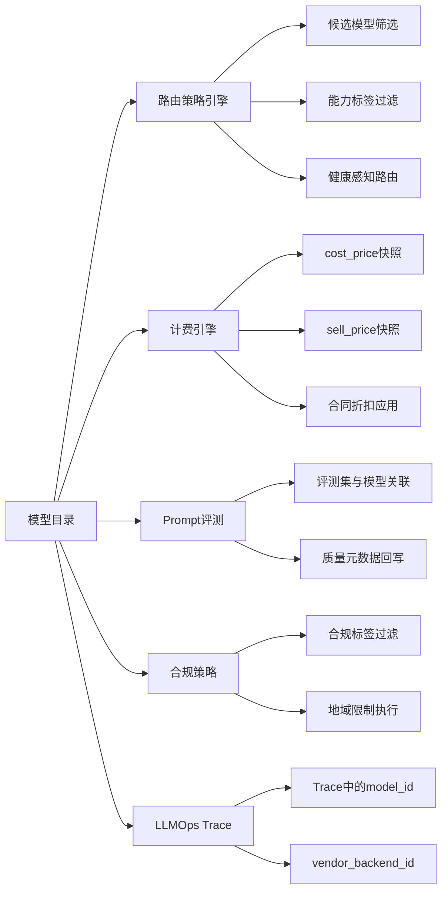
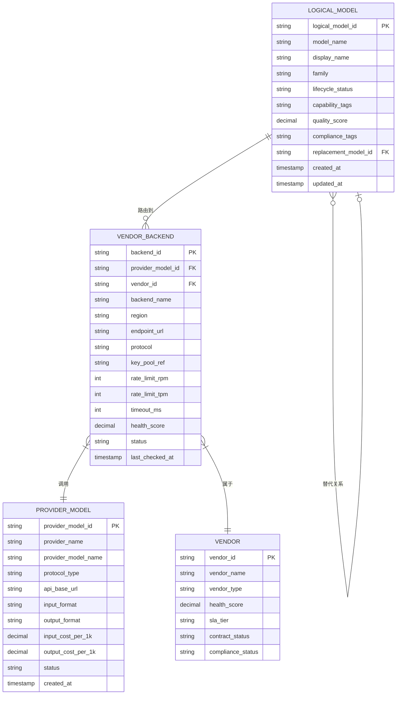
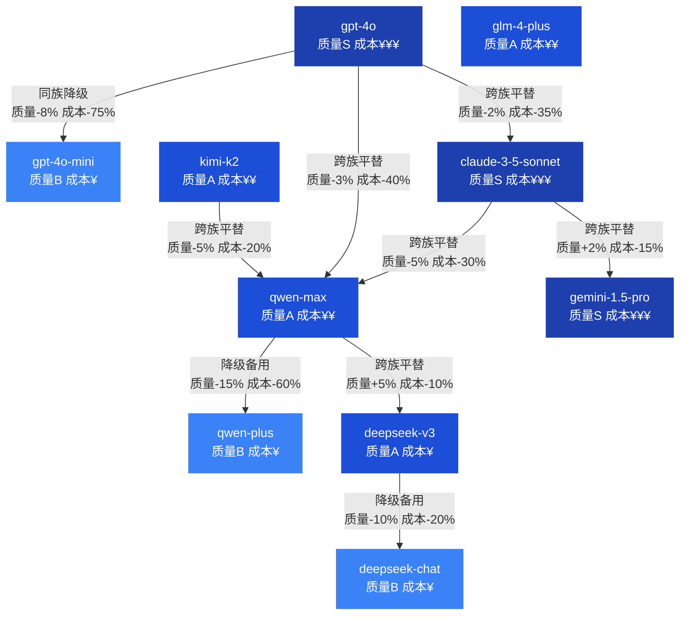
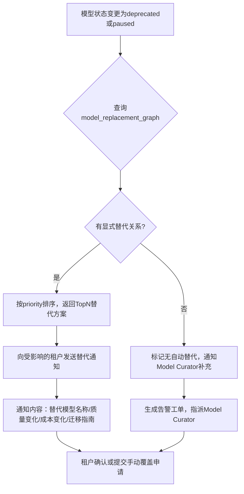
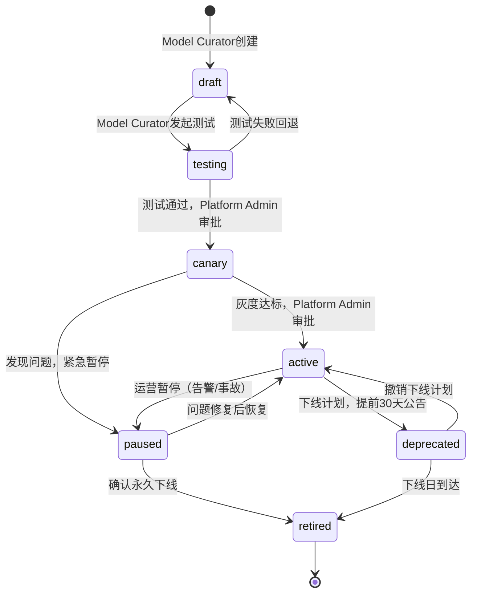
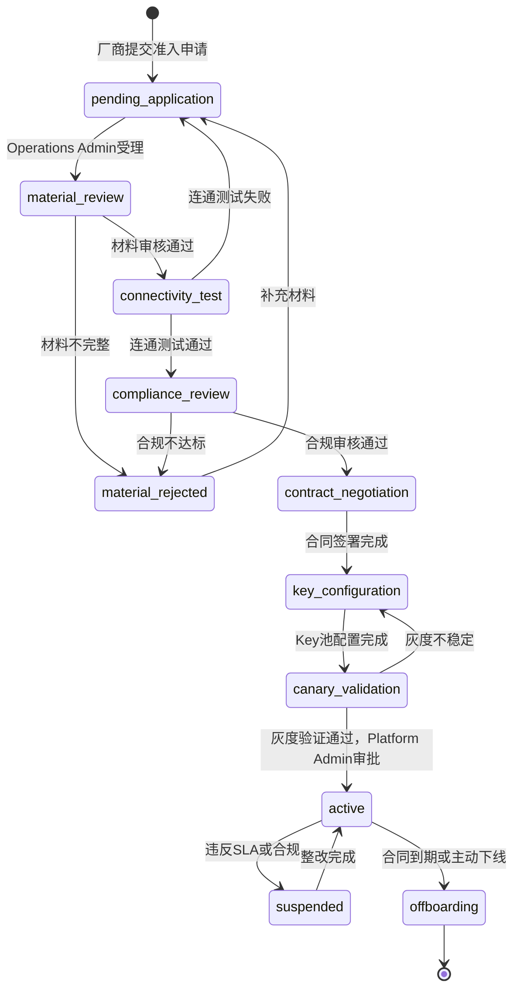
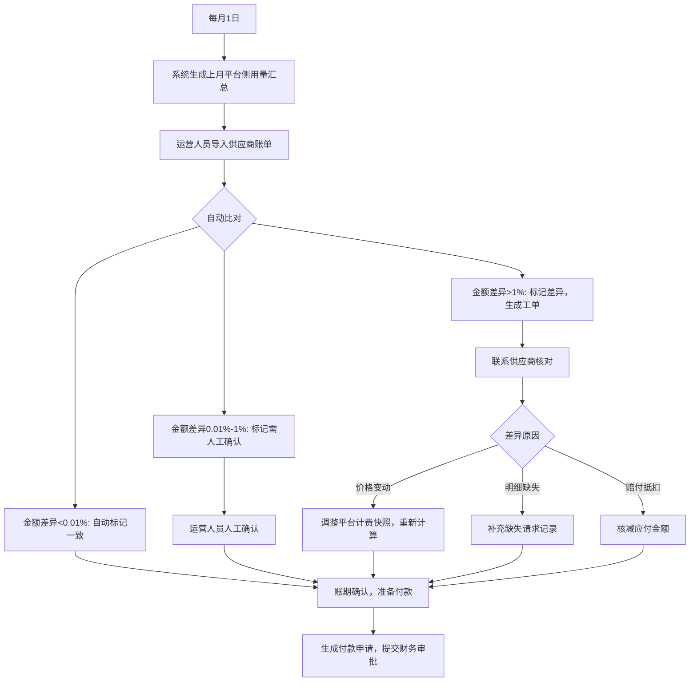

# 02 模型目录与供应商治理规格

**文档版本：** V2.0.0  
**编写日期：** 2026年05月21日  
**适用范围：** 产品、研发、运营、商务、合规团队  
**关联文档：** 00-总纲与导航.md、03-路由策略与容灾降级规格.md、06-计费成本与FinOps规格.md

---

## 1. 概述与设计原则

### 1.1 模型目录的三层含义

在企业级MaaS平台中，"模型目录"不是一张简单的表格或一个下拉框，而是包含三个层次的运营系统：

**技术配置层**：记录每个模型可以被哪些后端服务、Key和地域提供服务，这是路由引擎决策的数据基础。技术配置层的读者是平台研发团队和运维团队，关注的是可用性、连通性和性能参数。

**运营主数据层**：记录每个模型的能力、价格、合规属性、质量评分和生命周期状态。这是运营团队和商务团队维护的核心数据，也是路由策略引擎在做多目标优化时必须读取的"能力描述"。运营主数据层的读者包括模型管理员、采购专员、合规官和财务团队。

**开发者选型层**：将模型能力、价格、质量、合规、替代关系以可视化方式呈现给租户侧的开发者，让他们可以在模型广场中做出符合业务需求的模型选择。开发者选型层的读者是租户开发者、项目负责人和业务架构师。

### 1.2 设计原则

**原则一：三层分离，各层独立演化。** 厂商模型（Provider Model）、供应商后端（Vendor Backend）和逻辑模型（Logical Model）三层必须保持接口隔离。厂商模型更新时，不应破坏路由策略；供应商切换时，不应改变租户的API调用方式。

**原则二：模型卡片是共享主数据，不是临时配置。** 每个逻辑模型的能力、价格、合规属性和质量评分必须有唯一的版本化记录，任何变更都有审计日志，任何读取方（路由引擎、计费引擎、Prompt实验、评测系统）都读相同的数据源。

**原则三：模型替代关系必须显式维护，不能隐式推断。** 当A模型下线时，平台不应自动选择任何"类似"模型，而应根据运营团队显式配置的替代关系图给出推荐，并注明质量和成本的预期变化。

**原则四：供应商治理不是技术接入，而是运营体系。** 每个供应商从准入到下线，都要经历审核→合同→Key配置→灰度→正式启用→运营监控→续约或下线的完整运营周期。平台必须维护供应商的官方通道证明、合规材料、SLA记录和健康评分。

**原则五：模型生命周期有且只有一条主线。** 每个逻辑模型的状态变更必须经过审批（至少Model Curator层），不允许绕过状态机直接切换，尤其是暂停和下线操作，必须有提前通知窗口。

**原则六：模型广场是选型工作台，不是产品目录页。** 开发者来到模型广场不只是浏览，他们需要完成"为我的任务选择合适模型"这个工作，因此页面应支持任务场景推荐、多模型对比、成本质量分析和替代模拟。

### 1.3 与其他模块的关联关系



---

## 2. 三层模型架构

### 2.1 架构定义

**Layer 1：厂商模型（Provider Model）**  
这是模型在原始供应商API中的标识符和参数配置，例如 `openai:gpt-4o`、`anthropic:claude-3-5-sonnet-20241022`、`dashscope:qwen-max`。厂商模型直接对应供应商的计费单元，是成本价计算的起点。一个厂商可能有多个版本的同族模型，这些都是独立的厂商模型记录。

**Layer 2：供应商后端（Vendor Backend）**  
这是平台配置的、具体可发起请求的后端实例，包含API端点、区域、Key池引用、协议类型、速率限制、超时配置。一个厂商模型可以有多个供应商后端（例如同一个 gpt-4o 可以配置多个API Key池或多个区域后端）。路由引擎从供应商后端层选择实际发起请求的实例。

**Layer 3：逻辑模型（Logical Model）**  
这是平台对租户暴露的抽象模型标识符，例如 `maas:gpt-4o`、`maas:default-chat-large`。租户API调用中的 `model` 字段使用逻辑模型名称。一个逻辑模型可以映射到多个供应商后端，路由引擎根据策略从这些后端中选择。逻辑模型是模型卡片、能力标签、质量评分、替代关系、合规属性的挂载点。

### 2.2 三层架构ER图



### 2.3 映射示例

```
租户API请求 model="maas:gpt-4o"
    ↓ 逻辑模型解析
逻辑模型: logical_model_id="lm_gpt4o_default"
    display_name="GPT-4o"
    lifecycle_status="active"
    quality_score=0.92
    ↓ 路由策略选择后端
候选后端：
    [1] backend_id="vb_openai_us1" region="us-east-1" health_score=0.96
    [2] backend_id="vb_openai_ap1" region="ap-southeast" health_score=0.88
    ↓ 按健康分+延迟加权选择
实际调用：
    provider_model_name="gpt-4o-2024-11-20"
    endpoint_url="https://api.openai.com/v1/chat/completions"
    key_pool引用：kp_openai_prod_01
```

---

## 3. 模型卡片（Model Card）主数据规格

### 3.1 逻辑模型表（logical_model）完整字段

| 字段名 | 类型 | 必填 | 说明 |
|---|---|---|---|
| logical_model_id | VARCHAR(64) | ✅ | 全局唯一，格式：lm_{slug}，如 lm_gpt4o_default |
| model_name | VARCHAR(128) | ✅ | 对外暴露的模型标识符，如 maas:gpt-4o |
| display_name | VARCHAR(256) | ✅ | 界面显示名称，如 GPT-4o |
| description | TEXT | ✅ | 模型描述（Markdown） |
| provider_name | VARCHAR(64) | ✅ | 归属供应商，如 OpenAI、阿里云、DeepSeek |
| model_family | VARCHAR(64) | ✅ | 模型族，如 GPT-4、Qwen2.5、Claude-3.x |
| model_version | VARCHAR(64) | | 版本标识，如 gpt-4o-2024-11-20 |
| lifecycle_status | ENUM | ✅ | draft/testing/canary/active/paused/deprecated/retired |
| context_window_tokens | INT | ✅ | 最大上下文长度（token数），如 128000 |
| max_output_tokens | INT | ✅ | 最大输出token数，如 16384 |
| modalities_input | JSON | ✅ | 输入模态数组：["text","image","audio","video"] |
| modalities_output | JSON | ✅ | 输出模态数组：["text","image","audio"] |
| tool_calling_support | BOOLEAN | ✅ | 是否支持Function Calling / Tool Use |
| parallel_tool_calls | BOOLEAN | | 是否支持并行工具调用 |
| streaming_support | BOOLEAN | ✅ | 是否支持流式输出 |
| json_mode_support | BOOLEAN | | 是否支持JSON输出模式 |
| structured_output | BOOLEAN | | 是否支持结构化输出（OpenAI style） |
| embedding_support | BOOLEAN | | 是否提供Embedding能力 |
| embedding_dims | INT | | Embedding向量维度，如1536 |
| rerank_support | BOOLEAN | | 是否提供Rerank能力 |
| image_generation | BOOLEAN | | 是否提供图像生成 |
| image_resolution | VARCHAR(64) | | 支持的图像分辨率 |
| audio_support | BOOLEAN | | 是否支持语音转写或TTS |
| fine_tuning_support | BOOLEAN | | 是否支持微调 |
| input_price_per_1k | DECIMAL(12,6) | ✅ | 目录价输入Token每1000 Token价格（人民币） |
| output_price_per_1k | DECIMAL(12,6) | ✅ | 目录价输出Token每1000 Token价格（人民币） |
| cost_snapshot_cny | DECIMAL(12,6) | ✅ | 当前成本价快照（平台采购价），定期同步 |
| cost_snapshot_at | TIMESTAMP | ✅ | 成本价快照时间 |
| data_residency_regions | JSON | | 数据留存地域：["cn-hangzhou","cn-beijing"] |
| data_export_restricted | BOOLEAN | ✅ | 是否禁止数据出境，默认false |
| compliance_tags | JSON | | 合规标签：["MLPS-2","GDPR-compliant","PII-allowed"] |
| pii_processing_allowed | BOOLEAN | ✅ | 是否允许处理个人信息，默认true |
| model_data_retention | VARCHAR(32) | ✅ | 供应商端数据留存策略：none/30d/90d/training |
| official_channel | BOOLEAN | ✅ | 是否官方通道接入 |
| quality_tier | ENUM | ✅ | S/A/B/C/D五档质量等级 |
| quality_score | DECIMAL(4,3) | | 综合质量评分0-1 |
| last_eval_date | DATE | | 最近评测日期 |
| eval_dataset_refs | JSON | | 关联评测集ID数组 |
| benchmark_scores | JSON | | 基准评分：{"MMLU":85.6,"HumanEval":87.2,...} |
| replacement_model_id | VARCHAR(64) | | 替代模型logical_model_id（下线时使用） |
| deprecation_notice_at | TIMESTAMP | | 下线公告时间 |
| deprecation_at | TIMESTAMP | | 预计下线时间 |
| migration_guide_url | VARCHAR(512) | | 迁移指南链接 |
| tags | JSON | | 运营标签：["featured","new","sale"] |
| sort_weight | INT | | 模型广场排序权重 |
| visibility | ENUM | ✅ | public/tenant_only/internal，默认public |
| created_at | TIMESTAMP | ✅ | 创建时间 |
| updated_at | TIMESTAMP | ✅ | 最后更新时间 |
| updated_by | VARCHAR(64) | ✅ | 最后更新人 |

### 3.2 建表DDL

```sql
CREATE TABLE logical_model (
    logical_model_id    VARCHAR(64)   NOT NULL,
    model_name          VARCHAR(128)  NOT NULL UNIQUE,
    display_name        VARCHAR(256)  NOT NULL,
    description         TEXT,
    provider_name       VARCHAR(64)   NOT NULL,
    model_family        VARCHAR(64)   NOT NULL,
    model_version       VARCHAR(64),
    lifecycle_status    VARCHAR(32)   NOT NULL DEFAULT 'draft',
    context_window_tokens INT         NOT NULL,
    max_output_tokens   INT           NOT NULL,
    modalities_input    JSON,
    modalities_output   JSON,
    tool_calling_support BOOLEAN      NOT NULL DEFAULT FALSE,
    parallel_tool_calls BOOLEAN       DEFAULT FALSE,
    streaming_support   BOOLEAN       NOT NULL DEFAULT TRUE,
    json_mode_support   BOOLEAN       DEFAULT FALSE,
    structured_output   BOOLEAN       DEFAULT FALSE,
    embedding_support   BOOLEAN       DEFAULT FALSE,
    embedding_dims      INT,
    rerank_support      BOOLEAN       DEFAULT FALSE,
    image_generation    BOOLEAN       DEFAULT FALSE,
    fine_tuning_support BOOLEAN       DEFAULT FALSE,
    input_price_per_1k  DECIMAL(12,6) NOT NULL,
    output_price_per_1k DECIMAL(12,6) NOT NULL,
    cost_snapshot_cny   DECIMAL(12,6),
    cost_snapshot_at    TIMESTAMP,
    data_residency_regions JSON,
    data_export_restricted BOOLEAN    NOT NULL DEFAULT FALSE,
    compliance_tags     JSON,
    pii_processing_allowed BOOLEAN    NOT NULL DEFAULT TRUE,
    model_data_retention VARCHAR(32)  NOT NULL DEFAULT 'none',
    official_channel    BOOLEAN       NOT NULL DEFAULT TRUE,
    quality_tier        CHAR(1)       NOT NULL DEFAULT 'B',
    quality_score       DECIMAL(4,3),
    last_eval_date      DATE,
    eval_dataset_refs   JSON,
    benchmark_scores    JSON,
    replacement_model_id VARCHAR(64),
    deprecation_notice_at TIMESTAMP,
    deprecation_at      TIMESTAMP,
    migration_guide_url VARCHAR(512),
    tags                JSON,
    sort_weight         INT           NOT NULL DEFAULT 100,
    visibility          VARCHAR(32)   NOT NULL DEFAULT 'public',
    created_at          TIMESTAMP     NOT NULL DEFAULT CURRENT_TIMESTAMP,
    updated_at          TIMESTAMP     NOT NULL DEFAULT CURRENT_TIMESTAMP ON UPDATE CURRENT_TIMESTAMP,
    updated_by          VARCHAR(64),
    PRIMARY KEY (logical_model_id),
    INDEX idx_lifecycle (lifecycle_status),
    INDEX idx_provider (provider_name),
    INDEX idx_family (model_family),
    FOREIGN KEY (replacement_model_id) REFERENCES logical_model(logical_model_id)
);
```

---

## 4. 模型能力标签标准（capability_tags 枚举）

标签作用于三个场景：**模型广场筛选**（用户按标签过滤）、**路由策略过滤**（must_have_tags/must_not_have_tags）、**合规策略强制**（不满足标签的模型被排除）。

### 4.1 模态类（modality:*）

| Tag ID | 描述 | 示例模型 | 用途 |
|---|---|---|---|
| modality:text-in | 支持文本输入 | 全部文本模型 | 基础条件，几乎所有模型都有 |
| modality:text-out | 支持文本输出 | 全部Chat模型 | 基础条件 |
| modality:image-in | 支持图像输入（多模态） | GPT-4o, Qwen-VL, Claude-3.5 | 视觉理解任务路由 |
| modality:image-out | 支持图像生成 | DALL-E 3, Stable Diffusion | 图像生成任务路由 |
| modality:audio-in | 支持音频输入 | Whisper, Qwen-Audio | 语音转写场景 |
| modality:audio-out | 支持文字转语音 | TTS-1 | 语音合成场景 |
| modality:video-in | 支持视频输入 | Gemini 1.5 Pro | 视频理解任务 |
| modality:document-in | 支持文档直接输入 | Claude-3.5（PDF支持） | 文档分析任务 |

### 4.2 上下文类（context:*）

| Tag ID | 描述 | 代表值 | 路由用法 |
|---|---|---|---|
| context:8k | 上下文≥8K tokens | 8,192 | 短对话场景 |
| context:32k | 上下文≥32K tokens | 32,768 | 中等文档分析 |
| context:128k | 上下文≥128K tokens | 128,000 | 长文档/书籍分析 |
| context:200k | 上下文≥200K tokens | 200,000 | 超长文档（Kimi K2等） |
| context:1m | 上下文≥1M tokens | 1,000,000 | 极限长上下文 |

### 4.3 工具与能力类（capability:*）

| Tag ID | 描述 | 说明 |
|---|---|---|
| capability:tool-calling | 支持工具调用 | Function Calling / Tool Use |
| capability:parallel-tools | 支持并行工具调用 | 同一轮返回多个工具调用 |
| capability:code-interpreter | 代码执行能力 | 内置代码解释器 |
| capability:web-search | 联网搜索能力 | 内置搜索工具 |
| capability:json-mode | JSON输出模式 | 保证输出合法JSON |
| capability:structured-output | 结构化输出（Schema约束） | 严格schema遵守 |
| capability:streaming | 流式输出 | SSE/Server-Sent Events |
| capability:embedding | Embedding能力 | 文本向量化 |
| capability:rerank | Rerank能力 | 语义重排序 |
| capability:vision | 视觉理解 | 图像分析推理 |
| capability:reasoning | 推理模型（思维链） | o1/o3/R1类模型 |
| capability:instruction-following | 高指令遵循 | 复杂多步骤指令 |
| capability:role-play | 角色扮演 | 人设保持能力 |
| capability:multilingual | 多语言 | 英中日韩等 |
| capability:long-form | 长文本生成 | 报告/书稿生成 |
| capability:code-generation | 代码生成 | 编程助手场景 |

### 4.4 微调类（finetune:*）

| Tag ID | 描述 |
|---|---|
| finetune:supported | 该模型支持SFT微调 |
| finetune:lora | 支持LoRA微调 |
| finetune:rlhf | 支持RLHF微调 |
| finetune:custom-available | 平台提供微调任务 |

### 4.5 合规与地域类（compliance:*）

| Tag ID | 描述 | 适用场景 |
|---|---|---|
| compliance:cn-only | 数据仅留存中国大陆 | 金融/政务数据合规 |
| compliance:mlps-2 | 满足网络安全等级保护二级 | 政府/国企 |
| compliance:mlps-3 | 满足网络安全等级保护三级 | 金融/关键基础设施 |
| compliance:gdpr | GDPR合规 | 欧洲数据处理 |
| compliance:no-training | 供应商承诺不用于训练 | 企业数据保护 |
| compliance:pii-ok | 允许处理个人信息 | CRM/HR场景 |
| compliance:no-pii | 禁止处理个人信息 | 匿名化场景 |
| compliance:financial-ok | 可用于金融场景 | 风控/财务分析 |
| compliance:official-channel | 官方通道接入 | 合规证明 |

### 4.6 特性类（feature:*）

| Tag ID | 描述 |
|---|---|
| feature:fast-response | 首Token延迟<500ms |
| feature:high-throughput | 高吞吐量（适合批处理） |
| feature:cost-efficient | 高性价比（质量/成本比高） |
| feature:latest | 供应商最新版本 |
| feature:stable | 稳定版本（不会被替换） |
| feature:preview | 预览版（可能不稳定） |

---

## 5. 模型替代关系图（Model Replacement Graph）

### 5.1 业务背景

当一个逻辑模型被下线、暂停或降级时，平台必须能回答以下问题：
- 应该推荐哪个模型替代它？
- 切换后质量会下降多少？
- 切换后成本会变化多少？
- 上下文长度是否兼容（不会截断历史对话）？
- 工具调用格式是否兼容？

这些问题不能靠"相似度猜测"来回答，而必须基于运营团队显式维护的替代关系图。

### 5.2 替代关系数据结构

**model_replacement_graph 表**

| 字段名 | 类型 | 必填 | 说明 |
|---|---|---|---|
| edge_id | VARCHAR(64) | ✅ | 替代关系唯一ID |
| source_model_id | VARCHAR(64) | ✅ | 被替代的逻辑模型ID |
| target_model_id | VARCHAR(64) | ✅ | 推荐替代的逻辑模型ID |
| replacement_type | ENUM | ✅ | same-family-upgrade/cross-family-parity/downgrade-backup/task-specific |
| quality_delta_pct | DECIMAL(5,2) | ✅ | 质量变化百分比，负数表示下降，如 -3.5 |
| cost_delta_pct | DECIMAL(5,2) | ✅ | 成本变化百分比，负数表示降低，如 -40.0 |
| context_compatibility | ENUM | ✅ | full/partial/incompatible |
| context_delta_tokens | INT | | 上下文窗口变化量，正数表示增加 |
| toolcall_compatibility | ENUM | ✅ | full/format-change/partial/none |
| toolcall_migration_note | TEXT | | 工具调用迁移说明 |
| task_scope | JSON | | 适用的任务场景列表，如 ["chat","rag","code"] |
| confidence | DECIMAL(4,3) | ✅ | 替代建议置信度0-1，基于实测数据 |
| evidence_eval_job_id | VARCHAR(64) | | 支撑此替代关系的评测任务ID |
| recommendation_priority | INT | ✅ | 优先级，数字越小越优先 |
| effective_from | DATE | | 该替代关系生效日期 |
| note | TEXT | | 运营备注 |
| created_by | VARCHAR(64) | | 创建人 |
| created_at | TIMESTAMP | | 创建时间 |

**替代类型说明：**
- `same-family-upgrade`：同族升级，如 gpt-3.5-turbo → gpt-4o-mini，通常质量提升但成本增加
- `cross-family-parity`：跨族平替，如 gpt-4o → qwen-max，质量相近但供应商不同
- `downgrade-backup`：降级备用，质量下降但可用性更高，用于临时故障场景
- `task-specific`：特定任务下的替代，只在某些场景适用

### 5.3 主流模型替代关系图（可视化规格）



### 5.4 自动触发替代推荐规则

当逻辑模型的 `lifecycle_status` 变更为 `deprecated` 或 `paused` 时，系统触发以下流程：



### 5.5 模型下线通知用户旅程

> **背景**：仅有替代推荐的后端逻辑是不够的，租户用户在 Console 中需要有清晰的引导流程来完成路由迁移，否则会在下线日当天才发现调用失败。

**第一步：收到下线通知（T-30天）**

- 触发时机：`lifecycle_status` 切换为 `deprecated` 且 `deprecation_at` 已设定
- 通知渠道：站内通知（Console 顶部横幅 + 通知中心）+ 外部渠道（参见 `01-产品定位与用户角色体系.md` §7 审批工作流通知渠道）
- 通知接收角色：Tenant Admin、Billing Admin（成本影响）、Project Admin（受影响项目）
- 通知内容模板：

```
[模型下线通知] maas:claude-3-opus 将于 2026-07-01 下线

您的以下项目正在使用该模型：
- 项目：智能客服（proj_aaa）
- 项目：合同分析（proj_bbb）

推荐替代方案：
1. maas:claude-3-5-sonnet（同族降本，质量-3%，成本-65%）
2. maas:gpt-4o（跨族平替，质量±0%，成本-20%）

[立即迁移] → 跳转至路由策略配置页
[查看对比] → 打开模型对比页面
[暂时忽略] → 7 天后再次提醒
```

**第二步：Console 内引导弹窗（首次进入受影响项目时）**

当 Project Admin 或 Project Developer 进入一个使用了 `deprecated` 模型的项目时，Console 展示引导弹窗：

```
┌─────────────────────────────────────────────────────┐
│ ⚠️  此项目使用的模型即将下线                           │
│                                                     │
│ maas:claude-3-opus 将于 30 天后（2026-07-01）下线     │
│                                                     │
│ 受影响的路由策略：                                    │
│ • 生产策略（policy_xxx）                             │
│ • 测试策略（policy_yyy）                             │
│                                                     │
│ 推荐操作：                                          │
│ [一键迁移至 claude-3-5-sonnet]  [手动选择替代模型]   │
│                          [今天不再提示]              │
└─────────────────────────────────────────────────────┘
```

**第三步：一键迁移路由策略**

点击"一键迁移至 [推荐模型]"后，系统执行：

1. 列出所有引用了该下线模型的路由策略（当前项目范围内）
2. 展示迁移预览：将哪些策略中的 `model_id` 从旧模型替换为新模型
3. 用户确认后，批量创建策略变更草稿（`status=draft`）
4. 若路由策略启用了审批工作流，则自动触发审批流程；否则直接发布

**第四步：迁移进度追踪（T-7天倒计时）**

下线日前 7 天，Console 仪表板展示"待迁移项目"清单：

| 项目名称 | 受影响策略数 | 已迁移 | 未迁移 | 操作 |
|---------|-----------|--------|--------|------|
| 智能客服 | 3 | 3 | 0 | ✅ 已完成 |
| 合同分析 | 2 | 0 | 2 | [立即迁移] |

**第五步：下线日兜底行为**

若下线日到达时仍有路由策略引用已下线（`retired`）模型：
- 平台自动将该策略中的 `retired` 模型替换为其 `replacement_model_id`（若有），或从候选集中剔除该模型
- 在 `billing_ledger` 中对当日因自动兜底产生的路由变更标注 `auto_migrated=true`
- 发送最终迁移报告给 Tenant Admin，说明哪些策略被自动修改、替换为何模型

```sql
CREATE TABLE model_replacement_graph (
    edge_id                  VARCHAR(64)   NOT NULL,
    source_model_id          VARCHAR(64)   NOT NULL,
    target_model_id          VARCHAR(64)   NOT NULL,
    replacement_type         VARCHAR(32)   NOT NULL,
    quality_delta_pct        DECIMAL(5,2)  NOT NULL,
    cost_delta_pct           DECIMAL(5,2)  NOT NULL,
    context_compatibility    VARCHAR(32)   NOT NULL,
    context_delta_tokens     INT,
    toolcall_compatibility   VARCHAR(32)   NOT NULL DEFAULT 'full',
    toolcall_migration_note  TEXT,
    task_scope               JSON,
    confidence               DECIMAL(4,3)  NOT NULL DEFAULT 0.8,
    evidence_eval_job_id     VARCHAR(64),
    recommendation_priority  INT           NOT NULL DEFAULT 10,
    effective_from           DATE,
    note                     TEXT,
    created_by               VARCHAR(64),
    created_at               TIMESTAMP     NOT NULL DEFAULT CURRENT_TIMESTAMP,
    PRIMARY KEY (edge_id),
    INDEX idx_source (source_model_id),
    INDEX idx_target (target_model_id),
    FOREIGN KEY (source_model_id) REFERENCES logical_model(logical_model_id),
    FOREIGN KEY (target_model_id) REFERENCES logical_model(logical_model_id)
);
```

---

## 6. 模型生命周期管理

### 6.1 状态定义

| 状态 | 含义 | 可接收请求 | 在模型广场显示 |
|---|---|---|---|
| draft | 草稿，尚未测试 | 否 | 否 |
| testing | 内部测试中 | 仅测试Key | 否 |
| canary | 灰度中，部分租户可用 | 白名单租户 | 白名单用户可见 |
| active | 正式生效，全量可用 | 是 | 是 |
| paused | 暂停，不接受新请求 | 否 | 显示"暂停中" |
| deprecated | 已宣布即将下线，倒计时展示 | 是（过渡期） | 显示"即将下线" |
| retired | 已下线，完全不可用 | 否 | 否 |

### 6.2 状态转换规则



### 6.3 各状态转换的权限要求

| 转换 | 需要角色 | 审批要求 |
|---|---|---|
| draft → testing | Model Curator | 无需审批 |
| testing → canary | Model Curator | Platform Admin审批 |
| canary → active | Platform Admin | 需提交灰度报告 |
| active → deprecated | Platform Admin | 需提前30天，发送通知 |
| active → paused | Operations Admin | 紧急可免审批，事后补记录 |
| paused → active | Platform Admin | 需确认修复报告 |
| deprecated → retired | Platform Admin | 到达预定下线日期自动触发 |

### 6.4 模型下线预案标准流程

1. **T-30天**：Operations Admin在平台发布下线公告，所有使用该模型的租户收到邮件和控制台通知
2. **T-30天**：模型状态变更为 `deprecated`，模型广场显示倒计时
3. **T-15天**：二次提醒，通知未完成迁移的租户
4. **T-7天**：三次紧急提醒，提供替代模型建议和迁移指南
5. **T-1天**：平台运营确认路由策略已配置fallback
6. **T日**：模型状态变更为 `retired`，所有请求自动路由到替代模型
7. **T+7天**：生成下线事件复盘报告（迁移完成率、fallback触发量、客户反馈）

---

## 7. 供应商准入治理

### 7.1 供应商分类

| 类型 | 含义 | 示例 | 审核严格度 |
|---|---|---|---|
| official_direct | 官方直连，直接与模型厂商签约 | OpenAI、Anthropic、阿里云 | 最高 |
| authorized_reseller | 授权转售，通过代理商获得官方授权 | 授权经销商 | 高 |
| private_model | 客户自有私有化模型 | 客户部署的Llama/Qwen等 | 中（客户自行负责） |
| internal_model | 平台自有训练模型 | 平台自研模型 | 内部流程 |

### 7.2 供应商准入流程状态机



### 7.3 准入材料清单

| 材料类型 | 必要性 | 说明 |
|---|---|---|
| 官方通道授权证明 | ✅必填（official_direct） | 厂商出具的API使用授权函 |
| 授权转售许可证 | ✅必填（authorized_reseller） | 上级渠道的授权证明文件 |
| 企业营业执照 | ✅必填 | 有效期内的营业执照扫描件 |
| 数据处理协议（DPA） | ✅必填 | 符合GDPR/个保法的数据处理协议 |
| 服务水平协议（SLA） | ✅必填 | 可用性、延迟、错误率承诺 |
| 信息安全评估报告 | ✅必填（金融/政务供应商） | 第三方安全评估或自评报告 |
| 等级保护证书 | 金融/政务必填 | 相关等保认证复印件 |
| 网络安全承诺书 | ✅必填 | 不用于训练、不泄露数据承诺 |
| 接入协议 | ✅必填 | 双方签署的平台接入协议 |

### 7.4 供应商（vendor）表字段

| 字段名 | 类型 | 必填 | 说明 |
|---|---|---|---|
| vendor_id | VARCHAR(64) | ✅ | 全局唯一供应商ID |
| vendor_name | VARCHAR(256) | ✅ | 供应商全称 |
| vendor_short_name | VARCHAR(64) | ✅ | 显示简称，如 OpenAI/阿里云 |
| vendor_type | ENUM | ✅ | official_direct/authorized_reseller/private_model/internal |
| status | ENUM | ✅ | pending/active/suspended/offboarding |
| official_channel_proof | VARCHAR(512) | | 官方通道证明文件URL |
| dpa_signed | BOOLEAN | ✅ | 是否签署DPA |
| dpa_signed_at | DATE | | DPA签署日期 |
| contract_id | VARCHAR(64) | | 关联合同ID |
| contract_start | DATE | | 合同开始日期 |
| contract_end | DATE | | 合同结束日期 |
| settlement_cycle | ENUM | ✅ | monthly/quarterly/annual |
| base_currency | CHAR(3) | ✅ | 结算货币，如 CNY/USD |
| billing_method | ENUM | ✅ | prepay/postpay |
| total_quota_cny | DECIMAL(15,2) | | 合同总额度（元） |
| used_quota_cny | DECIMAL(15,2) | | 已使用额度（元） |
| health_score | DECIMAL(4,3) | | 综合健康评分0-1 |
| health_tier | ENUM | | excellent/healthy/degraded/warning/critical |
| sla_availability_slo | DECIMAL(6,4) | | 可用性SLO，如0.9995 |
| sla_p95_latency_ms | INT | | P95延迟SLO（ms） |
| last_incident_at | TIMESTAMP | | 最近一次SLA事故时间 |
| incident_count_30d | INT | | 近30天事故次数 |
| data_residency | VARCHAR(64) | | 数据留存地域说明 |
| compliance_certs | JSON | | 合规证书列表 |
| regions_supported | JSON | ✅ | 支持的地域列表 |
| contact_name | VARCHAR(128) | | 供应商对接人姓名 |
| contact_email | VARCHAR(256) | | 供应商对接人邮箱 |
| contact_phone | VARCHAR(32) | | 紧急联系电话 |
| notes | TEXT | | 运营备注 |
| created_at | TIMESTAMP | ✅ | 创建时间 |
| updated_at | TIMESTAMP | ✅ | 更新时间 |

---

## 8. Key池管理

### 8.1 vendor_key 表字段

| 字段名 | 类型 | 必填 | 说明 |
|---|---|---|---|
| key_id | VARCHAR(64) | ✅ | Key唯一ID |
| vendor_id | VARCHAR(64) | ✅ | 所属供应商ID |
| key_alias | VARCHAR(128) | ✅ | Key别名（运营友好名称） |
| key_value_hash | VARCHAR(256) | ✅ | API Key的安全哈希（仅用于去重） |
| key_value_encrypted | TEXT | ✅ | 加密存储的API Key值（AES-256-GCM） |
| status | ENUM | ✅ | active/paused/exhausted/revoked |
| quota_total_cny | DECIMAL(15,2) | | 额度总量（元），null表示无限 |
| quota_used_cny | DECIMAL(15,2) | ✅ | 已使用额度（元） |
| quota_reset_cycle | ENUM | | monthly/never |
| rate_limit_rpm | INT | | 每分钟请求数限制 |
| rate_limit_tpm | INT | | 每分钟Token数限制 |
| rate_limit_concurrent | INT | | 最大并发请求数 |
| health_score | DECIMAL(4,3) | ✅ | 实时健康评分0-1 |
| success_rate_1h | DECIMAL(5,4) | | 近1小时成功率 |
| avg_latency_ms_1h | INT | | 近1小时平均延迟 |
| throttle_rate_1h | DECIMAL(5,4) | | 近1小时限流率 |
| last_used_at | TIMESTAMP | | 最近使用时间 |
| last_checked_at | TIMESTAMP | ✅ | 最近健康检查时间 |
| created_at | TIMESTAMP | ✅ | 创建时间 |
| expires_at | TIMESTAMP | | Key有效期 |
| notes | TEXT | | 运营备注 |

### 8.2 轮询策略

**round_robin（轮询）**：依次使用Key池中的active Key，忽略权重差异。适合Key额度均等的场景。

**weighted（加权）**：根据Key的 `health_score` 和 `quota_remaining_ratio` 计算动态权重，健康分高、余量多的Key被选中的概率更高。权重计算公式：
```
weight_i = health_score_i × quota_remaining_ratio_i
selection_prob_i = weight_i / Σ(weight_j for all active j)
```

**priority（优先级）**：为每个Key设置优先级数字，优先使用高优先级Key，只有高优先级Key不可用时才切换到低优先级Key。适合主备Key场景。

### 8.3 Key健康评分算法

健康评分综合五个维度，滚动计算（每5分钟更新一次）：

```
health_score = w1 × success_rate_score
             + w2 × latency_score
             + w3 × throttle_score
             + w4 × quota_score
             + w5 × incident_score

其中：
  w1 = 0.30  (成功率权重)
  w2 = 0.20  (延迟权重)
  w3 = 0.20  (限流率权重)
  w4 = 0.20  (额度余量权重)
  w5 = 0.10  (近期事故权重)

成功率评分: success_rate_score = success_rate_1h (0-1)
延迟评分: latency_score = max(0, 1 - avg_latency_ms_1h / baseline_latency_ms)
限流评分: throttle_score = max(0, 1 - throttle_rate_1h × 10)
额度评分: quota_score = min(1, quota_remaining / quota_total)
事故评分: incident_score = max(0, 1 - incidents_7d / 5)
```

### 8.4 额度预测算法

使用近30天历史消耗数据（每日消耗量），通过线性回归预测未来N天的累计消耗，估算Key额度耗尽时间：

```python
# 伪代码
daily_usage = [day_1_usage, day_2_usage, ..., day_30_usage]
avg_daily = mean(daily_usage[-7:])  # 最近7天均值
quota_remaining = quota_total - quota_used
predicted_days_remaining = quota_remaining / avg_daily
predicted_exhaustion_date = today + timedelta(days=predicted_days_remaining)
```

### 8.5 预警级别

| 级别 | 触发条件 | 响应动作 |
|---|---|---|
| P3 信息 | 额度余量≤30% | 仅记录，控制台显示提示 |
| P2 警告 | 额度余量≤15%，或health_score≤0.70 | 发送邮件通知运营人员 |
| P1 紧急 | 额度余量≤5%，或health_score≤0.50 | 立即发送告警（邮件+企业微信），激活备用Key |
| P0 严重 | 额度耗尽，或health_score≤0.20 | 立即暂停Key，触发fallback切换，紧急呼叫On-call |

---

## 9. 供应商SLA与合同管理

### 9.1 SLA指标体系

| 指标名 | 定义 | 观测窗口 | 典型目标 |
|---|---|---|---|
| 月度可用性 | 成功响应时间 / 总时间 | 月度 | ≥99.95% |
| P95端到端延迟 | 95%请求的端到端延迟 | 滚动24小时 | ≤1500ms |
| P99端到端延迟 | 99%请求的端到端延迟 | 滚动24小时 | ≤3000ms |
| 首Token延迟P95 | 95%请求的TTFB | 滚动1小时 | ≤600ms |
| 错误率 | 5xx错误数 / 总请求数 | 滚动1小时 | ≤0.5% |
| 限流率 | 429响应数 / 总请求数 | 滚动1小时 | ≤1% |
| 额度保障 | 保障最低可用额度 | 月度 | 按合同 |

### 9.2 SLA违约事件表（vendor_sla_event）

| 字段名 | 类型 | 说明 |
|---|---|---|
| event_id | VARCHAR(64) | 违约事件ID |
| vendor_id | VARCHAR(64) | 供应商ID |
| event_type | ENUM | availability_breach/latency_breach/error_rate_breach/quota_breach |
| severity | ENUM | P0/P1/P2/P3 |
| metric_name | VARCHAR(64) | 违约指标名 |
| slo_threshold | DECIMAL | SLO目标值 |
| actual_value | DECIMAL | 实测值 |
| start_at | TIMESTAMP | 事故开始时间 |
| end_at | TIMESTAMP | 事故结束时间 |
| duration_minutes | INT | 持续时长 |
| affected_requests | INT | 受影响请求数 |
| root_cause | TEXT | 根因说明 |
| remediation | TEXT | 处置措施 |
| penalty_triggered | BOOLEAN | 是否触发赔付 |
| penalty_amount_cny | DECIMAL | 赔付金额 |
| status | ENUM | open/investigating/resolved/pending_compensation |

### 9.3 供应商合同表（vendor_contract）

| 字段名 | 类型 | 说明 |
|---|---|---|
| contract_id | VARCHAR(64) | 合同唯一ID |
| vendor_id | VARCHAR(64) | 供应商ID |
| contract_name | VARCHAR(256) | 合同名称 |
| contract_type | ENUM | prepay/postpay/subscription/volume |
| start_date | DATE | 合同生效日 |
| end_date | DATE | 合同到期日 |
| total_amount_cny | DECIMAL | 合同总金额 |
| prepay_amount_cny | DECIMAL | 预付款金额 |
| credit_limit_cny | DECIMAL | 授信额度 |
| billing_cycle | ENUM | monthly/quarterly/annual |
| payment_terms | VARCHAR(128) | 付款条件，如"月结30天" |
| discount_models | JSON | 模型级折扣配置数组 |
| volume_tiers | JSON | 阶梯价格配置 |
| sla_terms | JSON | SLA承诺条款 |
| invoice_type | ENUM | vat_special/vat_general/receipt |
| auto_renew | BOOLEAN | 是否自动续约 |
| renewal_notice_days | INT | 续约提醒提前天数 |
| contract_file_url | VARCHAR(512) | 合同扫描件存储URL |
| signed_at | DATE | 签署日期 |
| signed_by | VARCHAR(128) | 签署人 |
| status | ENUM | draft/active/expired/terminated |
| notes | TEXT | 备注 |

### 9.4 结算对账流程



---

## 10. 供应商健康评分与运营看板

### 10.1 综合健康评分公式

供应商级健康评分是所有active Key的加权平均，再综合SLA、事故和趋势因子：

```
vendor_health = 0.5 × avg(key_health_scores)   // Key池整体健康
              + 0.2 × sla_compliance_score      // SLA达成率（近30天）
              + 0.2 × (1 - incident_frequency)  // 1 - 近30天事故频率
              + 0.1 × trend_score               // 质量趋势（近7天改善/恶化）
```

### 10.2 健康等级与自动降级规则

| 等级 | 分数区间 | 颜色 | 路由影响 |
|---|---|---|---|
| Excellent | 0.95-1.00 | 绿色 | 优先参与路由 |
| Healthy | 0.80-0.95 | 绿色 | 正常参与路由 |
| Degraded | 0.65-0.80 | 黄色 | 权重降低50% |
| Warning | 0.50-0.65 | 橙色 | 权重降低80%，仅作备用 |
| Critical | <0.50 | 红色 | 临时暂停，触发fallback |

**自动降级规则**：当供应商健康分连续5分钟低于0.65时，路由引擎自动降低该供应商权重。当健康分低于0.50时，自动将该供应商标记为temporarily_suspended，路由完全绕过，并通知Operations Admin。

**自动恢复规则**：当暂停供应商连续15分钟健康分≥0.75时，自动恢复权重，并发送恢复通知。

### 10.3 运营看板指标清单

- 供应商整体健康热力图（颜色矩阵：供应商×时间段）
- Key池利用率（已用额度/总额度 Gauge图）
- 供应商调用量分布（饼图，近24小时）
- 供应商P95延迟趋势对比（折线图，近7天）
- 供应商错误率排行（柱状图）
- 合同到期提醒（30天内到期的合同）
- 额度耗尽预警列表（Key级别）
- 近期SLA事故时间线

---

## 11. 模型广场"选型工作台"功能规格

### 11.1 页面功能清单

| 功能模块 | 描述 | 权限要求 |
|---|---|---|
| 模型搜索 | 按名称/标签/供应商全文搜索 | 所有已登录用户 |
| 能力标签筛选 | 多选标签过滤模型列表 | 所有已登录用户 |
| 合规标签过滤 | 按合规要求过滤（仅国内/GDPR等） | 所有已登录用户 |
| 价格区间过滤 | 按输入/输出价格范围过滤 | 所有已登录用户 |
| 模型卡片展示 | 展示能力/价格/质量/合规摘要 | 所有已登录用户 |
| 模型详情页 | 完整的模型卡片，含性能、价格、评测 | 所有已登录用户 |
| 模型对比 | 选择2-4个模型并排对比所有维度 | 所有已登录用户 |
| 添加收藏夹 | 收藏常用模型，快速访问 | 已登录用户 |
| 任务场景推荐 | 输入任务描述，推荐最适合的模型 | 所有已登录用户 |
| 替代模型模拟 | 选择当前使用模型，模拟切换后影响 | 所有已登录用户 |
| 质量成本散点图 | 多个模型在质量/成本坐标系的分布图 | 所有已登录用户 |

### 11.2 任务场景推荐逻辑

```
输入：自然语言描述的任务（如"我需要分析上传的PDF文档并回答问题"）
处理：
  1. 提取需求标签：["modality:document-in","capability:tool-calling","context:128k"]
  2. 查询满足所有必要标签的逻辑模型
  3. 按 quality_score × (1 - cost_index) 排序
  4. 考虑租户的合规策略过滤
  5. 返回TopN推荐，每个推荐附带：
     - 选择理由（满足的标签说明）
     - 估算成本（基于典型请求大小）
     - 质量等级
     - 如有合同折扣则提示
输出：推荐模型列表 + 选择理由 + 成本估算
```

### 11.3 替代模拟功能规格

用户选择当前正在使用的模型（A），平台展示：
- 基于 `model_replacement_graph` 的推荐替代模型列表
- 每个替代方案的质量变化（+X% / -X%）
- 每个替代方案的月度成本节省估算
- 上下文兼容性说明
- 工具调用迁移说明（如有格式变化）
- 一键申请将当前路由策略切换到推荐替代模型（需审批）

### 11.4 质量成本散点图规格

- X轴：每千token综合成本（输入+输出加权均值）
- Y轴：模型质量评分（0-1）
- 每个气泡代表一个逻辑模型
- 气泡大小：上下文窗口大小（越大气泡越大）
- 气泡颜色：供应商分类（不同颜色区分）
- 高亮：Pareto最优前沿（质量/成本权衡最优点的连线）
- 悬停显示：模型名称、能力标签、合规标签、实时可用性
- 可过滤：按合规要求/任务场景/供应商

---

## 12. 验收标准

### 12.1 功能验收

| 验收项 | 验收标准 |
|---|---|
| 三层模型架构 | 逻辑模型→后端的映射关系可正确路由，切换后端不影响租户API |
| 模型卡片完整性 | 所有上线模型必须完成50+字段中的强制字段，缺失阻断发布 |
| 能力标签筛选 | 模型广场按标签筛选结果100%准确，延迟<200ms |
| 替代关系图 | 模型下线时，替代建议通知在5分钟内发送到受影响租户 |
| 生命周期状态机 | 状态转换必须经过权限检查，未授权操作返回403 |
| 供应商准入 | 9步准入流程所有状态转换有审计记录 |
| Key池轮询 | 加权轮询误差<5%（实测分布与理论分布偏差） |
| 健康评分实时性 | Key健康评分5分钟内更新，P1预警2分钟内触达 |

### 12.2 性能验收

| 指标 | 目标值 |
|---|---|
| 模型目录API响应时间 | P95 < 100ms |
| 模型广场页面首屏 | < 1s |
| 替代关系查询 | < 50ms |
| Key健康分批量计算 | 1000个Key < 30s |

### 12.3 数据质量验收

- 所有active状态的逻辑模型必须有cost_snapshot（最新24小时内）
- 所有active逻辑模型必须有质量等级（quality_tier不为空）
- 所有official_direct供应商必须有official_channel_proof文件
