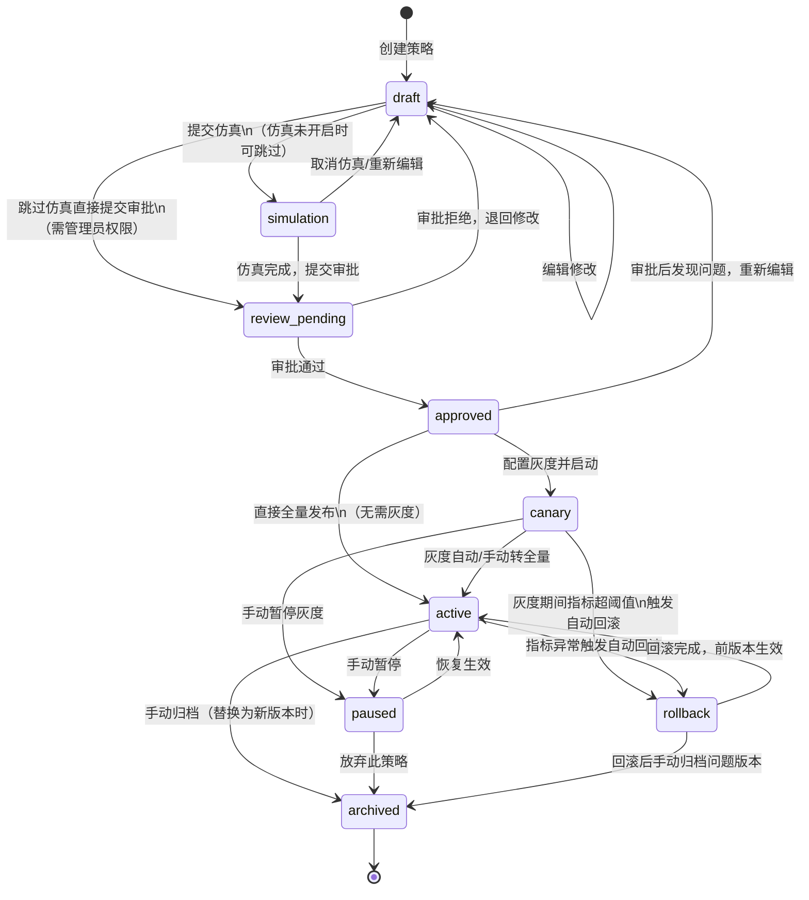
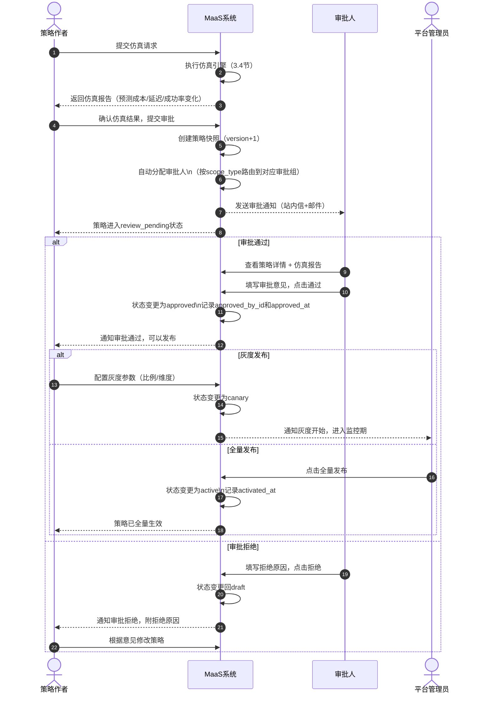
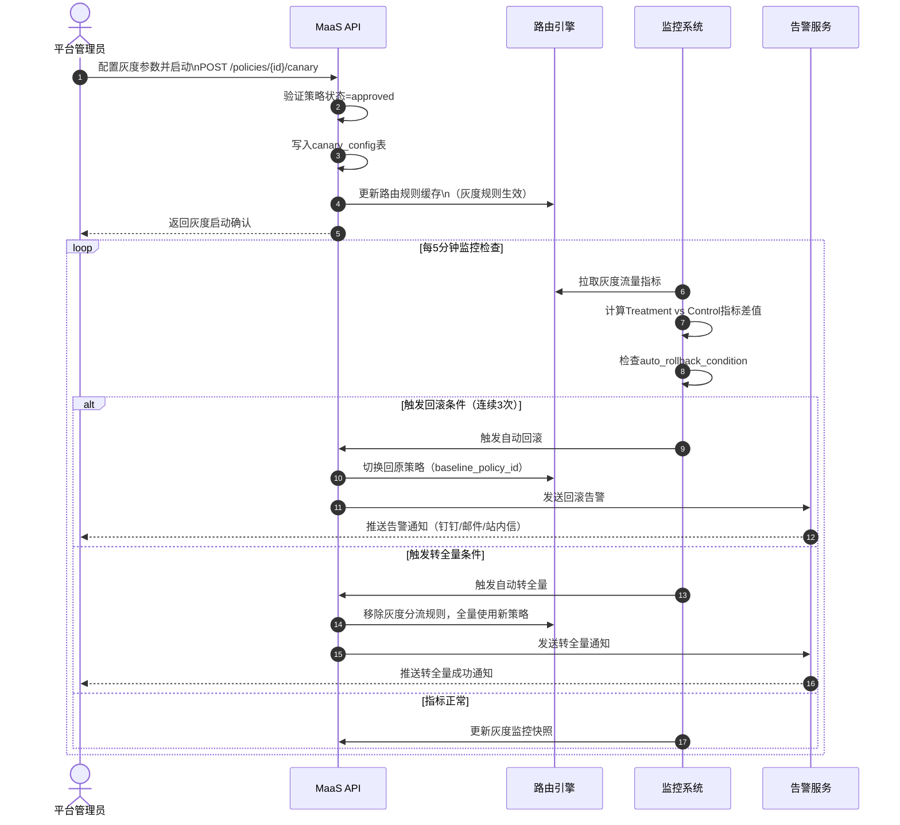
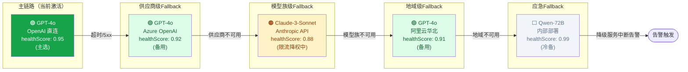
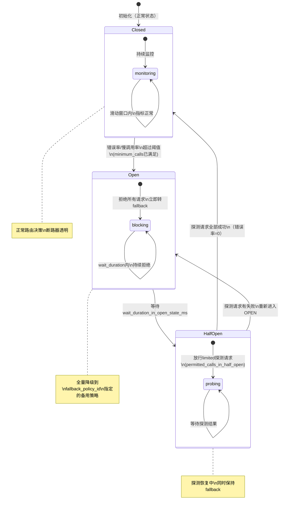
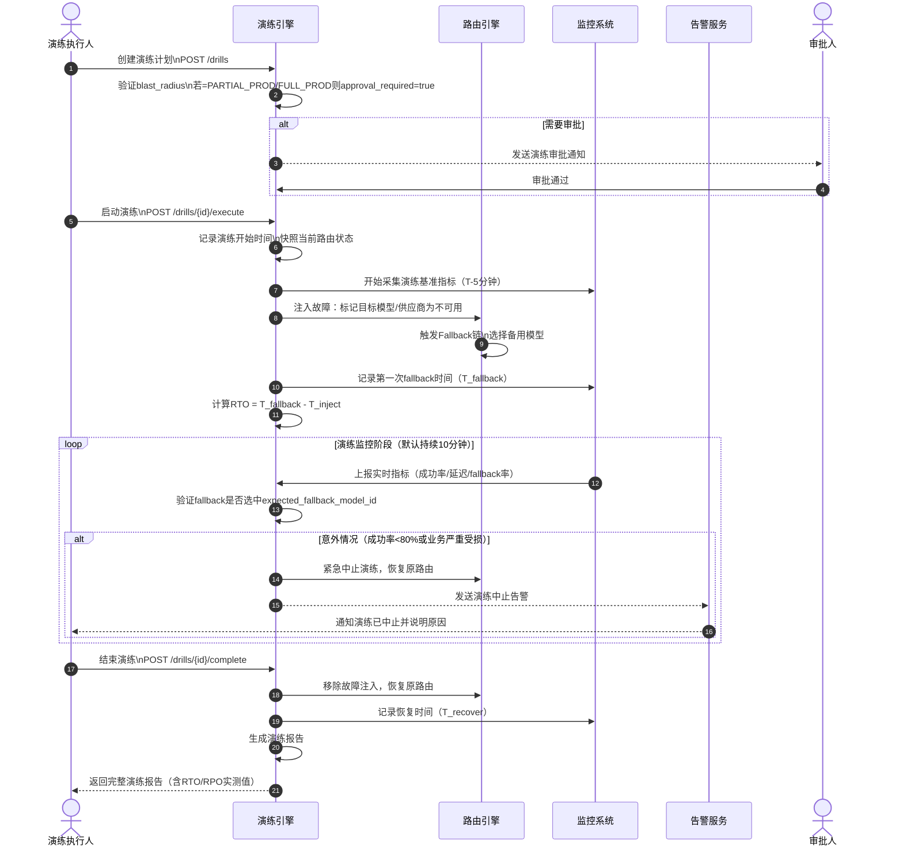

# 03 路由策略与容灾降级规格

**文档版本：** V2.0.0  
**编写日期：** 2026年05月21日  
**文档状态：** 设计评审中  
**所属模块：** 路由层（Routing Layer）  
**上游依赖：** `01-产品定位与用户角色体系.md`、`02-模型目录与供应商治理规格.md`  
**下游依赖：** `04-LLMOps观测与请求Trace规格.md`、`06-计费成本与FinOps规格.md`

---

## 文档摘要

本文档定义 MaaS 平台路由策略与容灾降级的完整规格，包括：策略数据模型（30+字段）、九阶段生命周期状态机、策略仿真引擎、灰度发布机制、五级 Fallback 链、可解释路由日志、策略效果评估、断路器设计，以及容灾演练规范。所有规格均以可执行验收口径结尾。

---

## 1. 路由策略设计原则与核心概念

### 1.1 设计哲学

路由是 MaaS 平台的"大脑"。每一次 API 调用都需要在毫秒级时间内完成以下决策：

> **在当前约束（预算、合规、可用性）下，从所有候选模型中选择使综合收益最大的模型，并在主链路失败时按预定策略自动降级。**

这个决策不能是黑盒。用户必须能看到"为什么选了这个模型"，运营人员必须能安全地变更策略，平台必须能自动保护用户免受上游故障的影响。

### 1.2 多目标路由：四维权重体系

路由决策的核心是一个多目标优化问题，四个维度相互竞争：

| 维度 | 含义 | 代理指标 | 权重范围 |
|------|------|----------|----------|
| **质量（Quality）** | 模型输出符合任务要求的程度 | 历史评测分/用户评分/ROUGE | 0~1.0 |
| **成本（Cost）** | 每次调用的 Token 费用 | 标准化成本指数（0=最便宜，1=最贵） | 0~1.0 |
| **延迟（Latency）** | 端到端响应时间 | 近7天P95延迟标准化值 | 0~1.0 |
| **稳定性（Stability）** | 模型/供应商的可用性与可靠性 | 综合健康评分 health_score | 0~1.0 |

> **各维度指标的数据新鲜度与缓存 TTL**：
>
> | 维度 | 数据来源 | 采集频率 | 缓存 TTL | 数据不可用时的降级值 |
> |------|---------|---------|---------|-------------------|
> | 质量（quality） | 评测系统回写到模型卡片 | 每次评测任务完成后异步更新 | 24h | 使用模型卡片的 `quality_score` 默认值（0.7） |
> | 成本（cost_index） | 模型卡片 `sell_price` | 价格变更时实时更新 | 5min | 使用模型卡片快照中的最新价格 |
> | 延迟（latency_index） | P95 历史统计（近 7 天滑动窗口） | 每 5 分钟重算一次，写入 Redis | 10min | 使用过去 30 天均值；若历史数据不足，使用全平台该模型的均值 |
> | 稳定性（health_score） | 健康探活任务（主动 + 被动） | 主动探活每 30 秒一次；被动（请求结果）实时更新 | 60s | 若超过 5 分钟无数据，health_score 降为 0.3，触发路由保守策略 |
>
> **评分矛盾处理**：当同一模型的实时 health_score 低（如供应商当前故障）但历史 latency_index 优（近 7 天表现好）时，路由引擎以**稳定性（实时）权重加倍计入**，覆盖延迟的历史优势，确保不将流量路由到当前故障的后端。具体公式在健康感知（HEALTH_AWARE）策略类型下生效：当任一候选后端 health_score < `health_threshold`（默认 0.4）时，直接从候选集中剔除，不参与多目标评分。

**综合评分公式：**

$$\text{score}_i = w_1 \cdot \text{quality}_i + w_2 \cdot (1 - \text{cost\_index}_i) + w_3 \cdot (1 - \text{latency\_index}_i) + w_4 \cdot \text{health\_score}_i$$

其中 $w_1 + w_2 + w_3 + w_4 = 1.0$，四个权重由策略配置决定，平台提供预设模板（成本优先/质量优先/均衡/低延迟），用户也可自定义。

**权重预设模板：**

| 模板名称 | w1（质量） | w2（成本） | w3（延迟） | w4（稳定性） | 适用场景 |
|----------|-----------|-----------|-----------|-------------|----------|
| 成本优先 | 0.20 | 0.50 | 0.15 | 0.15 | 批量处理、非实时任务 |
| 质量优先 | 0.55 | 0.15 | 0.15 | 0.15 | 高价值业务、合同评审 |
| 均衡模式 | 0.25 | 0.25 | 0.25 | 0.25 | 通用业务、默认值 |
| 低延迟优先 | 0.15 | 0.15 | 0.55 | 0.15 | 实时对话、在线交互 |
| 稳定性优先 | 0.15 | 0.15 | 0.15 | 0.55 | 生产关键任务、SLA严格场景 |

### 1.3 四级作用域：平台默认 → 租户级 → 项目级 → Key级

路由策略按作用域分四级，下级配置优先级高于上级；若下级未配置，则继承上级策略。

```
平台默认策略（Platform Default）
    ↓ 可覆盖
  租户级策略（Tenant Policy）
      ↓ 可覆盖
    项目级策略（Project Policy）
        ↓ 可覆盖
      Key级策略（API Key Policy）
```

**继承覆盖规则：**
- **继承（Inherit）**：下级策略字段值为 `null` 时，使用上级同名字段的值
- **覆盖（Override）**：下级策略字段有显式值时，完全替换上级值，不做合并
- **禁止下沉（No Downgrade）**：上级配置了合规硬约束（如`data_residency_required=CN`），下级策略不能移除此约束，只能收紧不能放宽。

  > **违规行为处理规则**：当下级策略（项目级/Key级）尝试放宽上级合规硬约束时，系统按以下规则响应：
  >
  > | 违规场景 | 系统行为 | 错误提示文案 |
  > |---------|---------|------------|
  > | Console 编辑策略时填入放宽值（如将 `data_residency=CN` 改为 `null`） | **阻止保存**，表单对应字段标红，不允许提交 | `此字段受上级合规约束（来源：租户级策略），不可放宽。如需修改，请联系 Tenant Admin 或 Security Officer。` |
  > | 通过 API 提交包含放宽值的策略 | 返回 HTTP 422，body 包含详细冲突说明 | `{"error":"COMPLIANCE_CONSTRAINT_VIOLATION","field":"data_residency","inherited_value":"CN","attempted_value":null,"source_policy_id":"policy_xxx"}` |
  > | 通过 Terraform Provider 应用包含放宽值的配置 | `terraform apply` 报错退出，错误消息包含违规字段和来源策略 ID | 同上，错误信息透传至 Terraform 输出 |
  > | 策略已保存但上级约束后续被收紧（如租户级新增约束覆盖了已有项目级策略）| **不阻止**已生效的上级约束变更；项目级策略的对应字段在下次生效时自动被上级覆盖；发送通知给 Project Admin，说明哪个字段被覆盖及原因 | 系统通知：`您的项目路由策略中的 [data_residency] 字段已被租户级新合规策略覆盖，当前生效值为 [CN]。` |
  >
  > **关键原则**：平台**永远不静默忽略**违规的放宽尝试，所有违规尝试必须有明确的错误提示或通知，并记录到审计日志。
- **作用域隔离**：不同租户的策略互相不可见，平台管理员可查看所有策略

### 1.4 五类策略类型

| 策略类型 | 英文标识 | 核心机制 | 适用场景 |
|----------|---------|---------|----------|
| **静态映射** | `STATIC_MAPPING` | 将逻辑模型名直接映射到一个或多个物理模型，按固定优先级选择 | 强合规要求、固定供应商合同 |
| **负载均衡** | `LOAD_BALANCE` | 在多个候选模型间按权重分发流量，支持轮询/权重轮询/最少连接 | 多供应商分流、容量平衡 |
| **健康感知** | `HEALTH_AWARE` | 实时检测候选模型健康评分，自动剔除低于阈值的候选，在剩余候选中选分最高者 | 高可用场景、主备切换 |
| **多目标优化** | `MULTI_OBJECTIVE` | 按四维权重公式实时计算综合评分，选评分最高的候选 | 成本/质量/延迟平衡的通用业务 |
| **规则路由** | `RULE_BASED` | 按请求标签/模型能力需求/预算余额/时间窗口等条件匹配规则，条件树决策 | 复杂多场景路由、按业务标签分流 |

### 1.5 策略优先级与冲突解决规则

当多条策略同时匹配同一请求时，按以下优先级解决冲突：

1. **硬约束优先**：合规约束（数据驻留、模型准入黑名单）不参与评分，直接过滤
2. **作用域优先**：Key级 > 项目级 > 租户级 > 平台默认
3. **激活时间优先**：同作用域下，最近激活的策略优先
4. **显式指定优先**：请求头携带 `X-MaaS-Policy-Id` 时，直接使用指定策略（需有权限）

**冲突检测**：策略发布前，系统自动扫描同作用域下是否存在条件完全重叠的策略，若存在则提示冲突并要求人工确认。

---

## 2. 路由策略数据模型

### 2.1 route_policy 表（策略主表）

| 字段名 | 数据类型 | 是否必填 | 默认值 | 说明 |
|--------|---------|---------|--------|------|
| `policy_id` | VARCHAR(36) | 是 | UUID v4 | 策略唯一标识，全局不重复 |
| `name` | VARCHAR(100) | 是 | — | 策略名称，同作用域内唯一 |
| `display_name` | VARCHAR(200) | 否 | 同name | 展示名称，支持多语言 |
| `description` | TEXT | 否 | — | 策略详细描述 |
| `scope_type` | ENUM | 是 | — | 作用域类型：PLATFORM/TENANT/PROJECT/API_KEY |
| `scope_id` | VARCHAR(36) | 是 | — | 对应作用域实体ID（租户ID/项目ID/Key ID）；平台级时为'platform' |
| `policy_type` | ENUM | 是 | — | STATIC_MAPPING/LOAD_BALANCE/HEALTH_AWARE/MULTI_OBJECTIVE/RULE_BASED |
| `status` | ENUM | 是 | draft | draft/simulation/review_pending/approved/canary/active/paused/rollback/archived |
| `version` | INT | 是 | 1 | 策略版本号，每次发布+1 |
| `version_hash` | VARCHAR(64) | 是 | — | 策略内容的SHA-256哈希，用于变更检测 |
| `parent_policy_id` | VARCHAR(36) | 否 | — | 继承自的父策略ID（null=不继承，使用平台默认） |
| `weight_quality` | DECIMAL(4,3) | 否 | 0.25 | 质量维度权重 w1，仅MULTI_OBJECTIVE类型有效 |
| `weight_cost` | DECIMAL(4,3) | 否 | 0.25 | 成本维度权重 w2 |
| `weight_latency` | DECIMAL(4,3) | 否 | 0.25 | 延迟维度权重 w3 |
| `weight_stability` | DECIMAL(4,3) | 否 | 0.25 | 稳定性维度权重 w4 |
| `min_health_score` | DECIMAL(4,3) | 否 | 0.6 | 候选模型最低健康评分阈值，低于此值自动剔除 |
| `max_candidates` | INT | 否 | 5 | 参与评分的最多候选模型数 |
| `timeout_ms` | INT | 否 | 30000 | 路由决策超时阈值（ms），超过则触发fallback |
| `retry_count` | INT | 否 | 2 | 同一候选最大重试次数 |
| `canary_percentage` | DECIMAL(5,2) | 否 | 0.00 | 灰度流量比例（0~100.00） |
| `canary_target_type` | ENUM | 否 | — | 灰度目标维度：TENANT/PROJECT/API_KEY/TRAFFIC_RATIO |
| `canary_target_ids` | JSON | 否 | — | 灰度目标ID列表 |
| `auto_promote_enabled` | BOOLEAN | 否 | false | 是否启用灰度自动转全量 |
| `auto_rollback_enabled` | BOOLEAN | 否 | true | 是否启用自动回滚 |
| `auto_rollback_threshold_error_rate` | DECIMAL(5,4) | 否 | 0.05 | 触发自动回滚的错误率阈值 |
| `auto_rollback_threshold_latency_p95_ms` | INT | 否 | 5000 | 触发自动回滚的P95延迟阈值（ms） |
| `data_residency_required` | VARCHAR(10) | 否 | — | 数据驻留要求（如'CN'、'EU'），null=不限 |
| `model_whitelist` | JSON | 否 | — | 允许使用的模型ID列表，null=不限 |
| `model_blacklist` | JSON | 否 | — | 禁止使用的模型ID列表 |
| `author_id` | VARCHAR(36) | 是 | — | 创建人用户ID |
| `approved_by_id` | VARCHAR(36) | 否 | — | 审批人用户ID |
| `approved_at` | TIMESTAMP | 否 | — | 审批时间 |
| `activated_at` | TIMESTAMP | 否 | — | 策略激活时间 |
| `deactivated_at` | TIMESTAMP | 否 | — | 策略停用时间 |
| `simulation_job_id` | VARCHAR(36) | 否 | — | 关联的最近一次仿真任务ID |
| `tags` | JSON | 否 | [] | 策略标签，用于分类检索 |
| `change_reason` | TEXT | 否 | — | 本次版本变更原因 |
| `created_at` | TIMESTAMP | 是 | NOW() | 创建时间 |
| `updated_at` | TIMESTAMP | 是 | NOW() | 最后更新时间 |

### 2.2 route_rule 表（规则条件表，仅RULE_BASED类型使用）

| 字段名 | 数据类型 | 说明 |
|--------|---------|------|
| `rule_id` | VARCHAR(36) | 规则唯一ID |
| `policy_id` | VARCHAR(36) | 所属策略ID |
| `rule_name` | VARCHAR(100) | 规则名称 |
| `priority` | INT | 规则优先级，数字越小越优先（1=最高） |
| `condition_type` | ENUM | 条件类型：AND/OR |
| `request_tags` | JSON | 匹配的请求标签（精确/模糊匹配） |
| `model_capabilities_required` | JSON | 必须具备的模型能力标签（如`["vision","function_calling"]`） |
| `budget_remaining_gt_percent` | DECIMAL(5,2) | 预算剩余比例大于此值时匹配 |
| `budget_remaining_lt_percent` | DECIMAL(5,2) | 预算剩余比例小于此值时匹配（切低价模型） |
| `time_window_start` | TIME | 时间窗口起始（UTC，24H格式） |
| `time_window_end` | TIME | 时间窗口结束（UTC） |
| `time_window_days_of_week` | JSON | 适用的星期列表（[1,2,3,4,5]=工作日） |
| `request_source_ip_cidr` | VARCHAR(50) | 来源IP的CIDR范围，可用于内网/外网分流 |
| `user_tier` | VARCHAR(20) | 匹配用户等级（free/basic/pro/enterprise） |
| `max_input_tokens_lt` | INT | 请求Input Token上限（用于短文本/长文本分流） |
| `min_input_tokens_gt` | INT | 请求Input Token下限 |
| `target_candidate_group` | VARCHAR(36) | 命中此规则后使用的候选组ID（关联route_candidate表） |
| `is_enabled` | BOOLEAN | 规则是否启用 |
| `created_at` | TIMESTAMP | 创建时间 |

### 2.3 route_candidate 表（候选模型配置表）

| 字段名 | 数据类型 | 说明 |
|--------|---------|------|
| `candidate_id` | VARCHAR(36) | 候选记录唯一ID |
| `policy_id` | VARCHAR(36) | 所属策略ID |
| `candidate_group` | VARCHAR(36) | 候选组ID（一个策略可有多组候选，用于规则路由） |
| `model_id` | VARCHAR(36) | 逻辑模型ID（关联模型目录） |
| `physical_model_id` | VARCHAR(36) | 物理模型ID（指定到具体供应商实例） |
| `weight` | DECIMAL(5,2) | 候选权重（LOAD_BALANCE类型使用），总和应为100 |
| `priority` | INT | 候选优先级（STATIC_MAPPING类型使用） |
| `is_primary` | BOOLEAN | 是否为主候选（fallback链的起点） |
| `cost_override` | DECIMAL(12,6) | 覆盖模型目录中的成本值（合同特殊价格） |
| `enabled` | BOOLEAN | 是否启用此候选 |
| `effective_from` | TIMESTAMP | 候选生效时间（支持定时切换） |
| `effective_until` | TIMESTAMP | 候选失效时间 |

### 2.4 route_fallback_chain 表（Fallback链配置表）

| 字段名 | 数据类型 | 说明 |
|--------|---------|------|
| `chain_id` | VARCHAR(36) | Fallback链唯一ID |
| `policy_id` | VARCHAR(36) | 所属策略ID |
| `chain_name` | VARCHAR(100) | 链名称（可读标识） |
| `chain_level` | ENUM | 链级别：MODEL/VENDOR/MODEL_FAMILY/REGION/EMERGENCY |
| `primary_model_id` | VARCHAR(36) | 主模型ID |
| `fallback_1_model_id` | VARCHAR(36) | 第一级fallback模型ID |
| `fallback_2_model_id` | VARCHAR(36) | 第二级fallback模型ID |
| `fallback_3_model_id` | VARCHAR(36) | 第三级fallback模型ID |
| `emergency_model_id` | VARCHAR(36) | 应急兜底模型ID（最终保障） |
| `trigger_timeout_ms` | INT | 超时触发阈值（ms） |
| `trigger_error_codes` | JSON | 触发fallback的HTTP错误码列表（如`[429,500,502,503]`） |
| `trigger_quality_score_lt` | DECIMAL(4,3) | 质量分低于此值触发fallback（质量检测模式） |
| `auto_recovery_enabled` | BOOLEAN | 是否启用主链路自动回切 |
| `recovery_health_threshold` | DECIMAL(4,3) | 主链路恢复所需的最低健康评分（默认0.85） |
| `recovery_window_minutes` | INT | 主链路持续健康的观察窗口（分钟，默认10） |
| `anti_flap_cooldown_minutes` | INT | 防抖动冷却时间（分钟，防止频繁切换，默认5） |
| `is_active` | BOOLEAN | 当前链是否激活 |
| `created_at` | TIMESTAMP | 创建时间 |
| `updated_at` | TIMESTAMP | 更新时间 |

### 2.5 完整建表 DDL

```sql
-- 路由策略主表
CREATE TABLE route_policy (
    policy_id       VARCHAR(36)    PRIMARY KEY,
    name            VARCHAR(100)   NOT NULL,
    display_name    VARCHAR(200),
    description     TEXT,
    scope_type      ENUM('PLATFORM','TENANT','PROJECT','API_KEY') NOT NULL,
    scope_id        VARCHAR(36)    NOT NULL,
    policy_type     ENUM('STATIC_MAPPING','LOAD_BALANCE','HEALTH_AWARE',
                         'MULTI_OBJECTIVE','RULE_BASED') NOT NULL,
    status          ENUM('draft','simulation','review_pending','approved',
                         'canary','active','paused','rollback','archived')
                    NOT NULL DEFAULT 'draft',
    version         INT            NOT NULL DEFAULT 1,
    version_hash    VARCHAR(64)    NOT NULL,
    parent_policy_id VARCHAR(36),
    weight_quality  DECIMAL(4,3)   DEFAULT 0.250,
    weight_cost     DECIMAL(4,3)   DEFAULT 0.250,
    weight_latency  DECIMAL(4,3)   DEFAULT 0.250,
    weight_stability DECIMAL(4,3)  DEFAULT 0.250,
    min_health_score DECIMAL(4,3)  DEFAULT 0.600,
    max_candidates  INT            DEFAULT 5,
    timeout_ms      INT            DEFAULT 30000,
    retry_count     INT            DEFAULT 2,
    canary_percentage DECIMAL(5,2) DEFAULT 0.00,
    canary_target_type ENUM('TENANT','PROJECT','API_KEY','TRAFFIC_RATIO'),
    canary_target_ids  JSON,
    auto_promote_enabled   BOOLEAN DEFAULT FALSE,
    auto_rollback_enabled  BOOLEAN DEFAULT TRUE,
    auto_rollback_threshold_error_rate    DECIMAL(5,4) DEFAULT 0.0500,
    auto_rollback_threshold_latency_p95_ms INT DEFAULT 5000,
    data_residency_required VARCHAR(10),
    model_whitelist JSON,
    model_blacklist JSON,
    author_id       VARCHAR(36)    NOT NULL,
    approved_by_id  VARCHAR(36),
    approved_at     TIMESTAMP,
    activated_at    TIMESTAMP,
    deactivated_at  TIMESTAMP,
    simulation_job_id VARCHAR(36),
    tags            JSON           DEFAULT '[]',
    change_reason   TEXT,
    created_at      TIMESTAMP      NOT NULL DEFAULT CURRENT_TIMESTAMP,
    updated_at      TIMESTAMP      NOT NULL DEFAULT CURRENT_TIMESTAMP
                    ON UPDATE CURRENT_TIMESTAMP,
    INDEX idx_scope (scope_type, scope_id),
    INDEX idx_status (status),
    INDEX idx_author (author_id)
) ENGINE=InnoDB DEFAULT CHARSET=utf8mb4;

-- 路由规则表
CREATE TABLE route_rule (
    rule_id         VARCHAR(36)    PRIMARY KEY,
    policy_id       VARCHAR(36)    NOT NULL,
    rule_name       VARCHAR(100)   NOT NULL,
    priority        INT            NOT NULL DEFAULT 100,
    condition_type  ENUM('AND','OR') NOT NULL DEFAULT 'AND',
    request_tags    JSON,
    model_capabilities_required JSON,
    budget_remaining_gt_percent DECIMAL(5,2),
    budget_remaining_lt_percent DECIMAL(5,2),
    time_window_start TIME,
    time_window_end   TIME,
    time_window_days_of_week JSON,
    request_source_ip_cidr VARCHAR(50),
    user_tier       VARCHAR(20),
    max_input_tokens_lt INT,
    min_input_tokens_gt INT,
    target_candidate_group VARCHAR(36),
    is_enabled      BOOLEAN        NOT NULL DEFAULT TRUE,
    created_at      TIMESTAMP      NOT NULL DEFAULT CURRENT_TIMESTAMP,
    FOREIGN KEY (policy_id) REFERENCES route_policy(policy_id)
        ON DELETE CASCADE,
    INDEX idx_policy_priority (policy_id, priority)
) ENGINE=InnoDB DEFAULT CHARSET=utf8mb4;

-- 候选模型表
CREATE TABLE route_candidate (
    candidate_id    VARCHAR(36)    PRIMARY KEY,
    policy_id       VARCHAR(36)    NOT NULL,
    candidate_group VARCHAR(36),
    model_id        VARCHAR(36)    NOT NULL,
    physical_model_id VARCHAR(36),
    weight          DECIMAL(5,2)   DEFAULT 1.00,
    priority        INT            DEFAULT 1,
    is_primary      BOOLEAN        DEFAULT FALSE,
    cost_override   DECIMAL(12,6),
    enabled         BOOLEAN        DEFAULT TRUE,
    effective_from  TIMESTAMP,
    effective_until TIMESTAMP,
    FOREIGN KEY (policy_id) REFERENCES route_policy(policy_id)
        ON DELETE CASCADE,
    INDEX idx_policy_model (policy_id, model_id)
) ENGINE=InnoDB DEFAULT CHARSET=utf8mb4;

-- Fallback链表
CREATE TABLE route_fallback_chain (
    chain_id        VARCHAR(36)    PRIMARY KEY,
    policy_id       VARCHAR(36)    NOT NULL,
    chain_name      VARCHAR(100)   NOT NULL,
    chain_level     ENUM('MODEL','VENDOR','MODEL_FAMILY','REGION','EMERGENCY') NOT NULL,
    primary_model_id  VARCHAR(36)  NOT NULL,
    fallback_1_model_id VARCHAR(36),
    fallback_2_model_id VARCHAR(36),
    fallback_3_model_id VARCHAR(36),
    emergency_model_id  VARCHAR(36),
    trigger_timeout_ms  INT        DEFAULT 30000,
    trigger_error_codes JSON       DEFAULT '[429,500,502,503,504]',
    trigger_quality_score_lt DECIMAL(4,3),
    auto_recovery_enabled   BOOLEAN DEFAULT TRUE,
    recovery_health_threshold DECIMAL(4,3) DEFAULT 0.850,
    recovery_window_minutes INT    DEFAULT 10,
    anti_flap_cooldown_minutes INT DEFAULT 5,
    is_active       BOOLEAN        DEFAULT TRUE,
    created_at      TIMESTAMP      NOT NULL DEFAULT CURRENT_TIMESTAMP,
    updated_at      TIMESTAMP      NOT NULL DEFAULT CURRENT_TIMESTAMP
                    ON UPDATE CURRENT_TIMESTAMP,
    FOREIGN KEY (policy_id) REFERENCES route_policy(policy_id)
        ON DELETE CASCADE,
    INDEX idx_policy_active (policy_id, is_active)
) ENGINE=InnoDB DEFAULT CHARSET=utf8mb4;
```

---

## 3. 路由策略生命周期

### 3.1 状态定义

路由策略共有九个状态，覆盖从草稿创建到归档的完整生命周期：

| 状态值 | 状态名称 | 说明 | 是否影响线上流量 |
|--------|---------|------|----------------|
| `draft` | 草稿 | 策略创建后的初始状态，可随时编辑 | 否 |
| `simulation` | 仿真中 | 已提交仿真引擎，正在用历史流量评估策略效果 | 否 |
| `review_pending` | 待审批 | 仿真完成，等待审批人审核 | 否 |
| `approved` | 已审批 | 审批通过，等待发布（可配置立即生效或灰度） | 否 |
| `canary` | 灰度中 | 按配置比例/维度向部分流量生效 | 是（部分流量） |
| `active` | 完全生效 | 对所有匹配流量生效 | 是（全量） |
| `paused` | 已暂停 | 人工暂停，流量回退到上一个active策略 | 否 |
| `rollback` | 回滚中 | 自动或手动触发回滚，切换到前一版本 | 是（回滚版本） |
| `archived` | 已归档 | 历史策略，不再使用，保留审计记录 | 否 |

### 3.2 状态转换规则



### 3.3 每个状态的操作权限矩阵

| 操作 | 策略作者 | 项目管理员 | 租户管理员 | 平台管理员 | 审批人 |
|------|---------|-----------|-----------|-----------|--------|
| 创建/编辑（draft） | ✓ | ✓ | ✓ | ✓ | — |
| 提交仿真 | ✓ | ✓ | ✓ | ✓ | — |
| 提交审批 | ✓ | ✓ | ✓ | ✓ | — |
| 审批通过/拒绝 | — | — | — | ✓ | ✓ |
| 配置灰度并发布 | — | ✓ | ✓ | ✓ | — |
| 全量发布 | — | — | ✓ | ✓ | — |
| 手动暂停/恢复 | — | ✓ | ✓ | ✓ | — |
| 手动触发回滚 | — | ✓ | ✓ | ✓ | — |
| 归档 | — | — | ✓ | ✓ | — |
| 查看策略详情 | ✓（仅自己的） | ✓（项目内） | ✓（租户内） | ✓（全部） | ✓（待审批） |

### 3.4 版本控制机制

每次策略从 `draft` 状态进入 `review_pending` 状态时，系统自动创建策略快照：

- 快照内容：策略主表全量字段 + 所有关联规则 + 候选模型配置 + fallback链配置
- 快照格式：JSON序列化后压缩存储
- 版本号：整数自增，每次发布+1，回滚不产生新版本号
- 快照保留：最近50个版本，超出后按FIFO淘汰（归档状态策略的快照永久保留）
- 版本对比：支持任意两个版本的字段级Diff对比展示

**版本快照表（route_policy_snapshot）：**

| 字段名 | 类型 | 说明 |
|--------|------|------|
| `snapshot_id` | VARCHAR(36) | 快照唯一ID |
| `policy_id` | VARCHAR(36) | 策略ID |
| `version` | INT | 对应版本号 |
| `snapshot_data` | LONGBLOB | 压缩后的JSON快照内容 |
| `diff_from_previous` | JSON | 与上一版本的字段级差异 |
| `created_by` | VARCHAR(36) | 创建快照的用户ID |
| `created_at` | TIMESTAMP | 快照创建时间 |

### 3.5 策略审批流程



---

## 4. 策略仿真引擎

### 4.1 仿真引擎架构概述

仿真引擎的核心目标：**在不影响线上流量的前提下，用历史真实请求数据预测新策略的实际效果**，从而让运营人员在发布前就能看到"如果用这个策略，上周的请求会有什么结果"。

**输入：**
- 待评估的新路由策略（draft状态）
- 历史 Trace 数据（可配置时间窗口：最近7天/14天/30天）
- 流量采样比例（1%~100%，大流量场景建议10%~20%）

**输出：**
- 预测成本变化（%）
- 预测P95延迟变化（ms）
- 预测成功率变化（%）
- 预测模型分布变化（各模型流量占比变化）
- 风险点列表（识别出的潜在问题）
- 置信度评分

### 4.2 仿真任务数据结构（simulation_job 表）

| 字段名 | 数据类型 | 说明 |
|--------|---------|------|
| `job_id` | VARCHAR(36) | 仿真任务唯一ID |
| `policy_id` | VARCHAR(36) | 待仿真的策略ID |
| `policy_version` | INT | 仿真时的策略版本号 |
| `status` | ENUM | pending/running/completed/failed/cancelled |
| `simulation_window_days` | INT | 历史数据时间窗口（天数），默认7 |
| `traffic_sample_rate` | DECIMAL(5,4) | 流量采样比例（0.01~1.0） |
| `scope_type` | ENUM | 仿真范围：PLATFORM/TENANT/PROJECT |
| `scope_id` | VARCHAR(36) | 仿真范围的实体ID |
| `total_requests_simulated` | BIGINT | 实际参与仿真的请求总数 |
| `simulation_started_at` | TIMESTAMP | 仿真开始时间 |
| `simulation_completed_at` | TIMESTAMP | 仿真完成时间 |
| `elapsed_seconds` | INT | 仿真耗时（秒） |
| `predicted_cost_change_pct` | DECIMAL(8,4) | 预测成本变化（%，负值=降低） |
| `predicted_latency_p50_change_ms` | INT | 预测P50延迟变化（ms） |
| `predicted_latency_p95_change_ms` | INT | 预测P95延迟变化（ms） |
| `predicted_latency_p99_change_ms` | INT | 预测P99延迟变化（ms） |
| `predicted_success_rate_change_pct` | DECIMAL(8,4) | 预测成功率变化（%） |
| `predicted_fallback_rate_change_pct` | DECIMAL(8,4) | 预测fallback率变化（%） |
| `predicted_model_distribution` | JSON | 预测模型分布（model_id → 流量占比） |
| `baseline_model_distribution` | JSON | 当前策略的模型分布（对比基准） |
| `risk_points` | JSON | 识别出的风险点列表（详见下文） |
| `confidence_score` | DECIMAL(4,3) | 仿真结果置信度（0~1.0，基于样本量和历史准确率） |
| `error_message` | TEXT | 仿真失败时的错误信息 |
| `created_by` | VARCHAR(36) | 触发仿真的用户ID |
| `created_at` | TIMESTAMP | 任务创建时间 |

**risk_points 字段结构（JSON数组）：**
```json
[
  {
    "risk_type": "HIGH_FALLBACK_RATE",
    "severity": "HIGH",
    "description": "新策略将主要流量路由到GPT-4o，其近7天健康评分为0.72，低于阈值0.75",
    "affected_request_count": 1240,
    "affected_request_pct": 3.2,
    "suggestion": "建议将min_health_score调整为0.70或在候选列表中增加Claude-3作为备选"
  }
]
```

### 4.3 仿真计算流程

```mermaid
flowchart TD
    A([仿真请求触发]) --> B[加载策略配置\n读取policy+rules+candidates+fallback_chain]
    B --> C[从Trace存储查询历史请求\n按scope_id + simulation_window过滤]
    C --> D{样本量是否充足?}
    D -- 不足5000条 --> E[发出警告：置信度低\n继续仿真]
    D -- 充足 --> F[按traffic_sample_rate抽样]
    E --> F
    F --> G[对每条历史请求重放路由决策\n使用新策略计算候选评分]

    G --> H{请求匹配哪个规则?}
    H -- 匹配规则路由 --> I[按规则条件筛选候选组]
    H -- 无特殊规则 --> J[使用全局候选列表]

    I --> K[计算候选评分\nscore = w1*q + w2*(1-c) + w3*(1-l) + w4*h]
    J --> K

    K --> L{主候选健康评分\n是否满足min_health_score?}
    L -- 不满足 --> M[标记为fallback场景\n选择下一候选]
    L -- 满足 --> N[记录选中模型和评分明细]
    M --> N

    N --> O[累计统计：成本/延迟/成功率/模型分布]
    O --> P{所有请求处理完毕?}
    P -- 否 --> G
    P -- 是 --> Q[与当前策略基准对比\n计算delta值]

    Q --> R[识别风险点\n按规则检测异常pattern]
    R --> S[计算置信度评分\n基于样本量和历史仿真准确率]
    S --> T[生成仿真报告\n写入simulation_job表]
    T --> U([仿真完成，通知用户])
```

### 4.4 仿真结果可视化规格

仿真报告页面需展示以下可视化元素：

**4.4.1 核心指标对比卡片（4块）**

每块卡片显示：指标名称、当前值、预测值、变化量（+/-）、变化率（%）、趋势箭头（颜色：绿=改善，红=恶化，灰=无变化）：

| 卡片 | 指标 | 改善方向 |
|------|------|----------|
| 成本 | 预测每千次调用成本（¥） | 下降为改善 |
| P95延迟 | 预测P95响应时间（ms） | 下降为改善 |
| 成功率 | 预测请求成功率（%） | 上升为改善 |
| Fallback率 | 预测触发fallback比例（%） | 下降为改善 |

**4.4.2 模型流量分布对比图**

双柱状图（当前策略 vs 新策略），横轴为模型名，纵轴为流量占比（%）。若某模型流量变化超过20个百分点，该柱用橙色高亮。

**4.4.3 风险点列表**

按严重程度（HIGH/MEDIUM/LOW）分组展示，每条风险点显示：风险类型标签、描述、影响请求数、建议操作按钮（点击可直接跳转到对应配置项）。

### 4.5 仿真精度评估机制

系统每周对已完成灰度发布的策略进行**仿真回测**：将仿真时的预测值与灰度期间的实测值对比，计算误差并积累为仿真引擎的精度基线。

精度评估指标：

| 指标 | 计算方式 | 健康阈值 |
|------|---------|---------|
| 成本预测误差率 | abs(预测值-实测值)/实测值 | < 15% |
| 延迟P95预测误差率 | abs(预测值-实测值)/实测值 | < 20% |
| 成功率预测误差率 | abs(预测值-实测值) | < 2个百分点 |
| 模型分布预测误差 | 各模型流量占比绝对差之和 | < 10个百分点 |

若当月仿真精度未达标，系统自动在仿真报告中降低置信度评分，并展示警告提示。

---

## 5. 灰度发布

### 5.1 灰度维度设计

MaaS 平台支持五个灰度维度，可组合使用：

| 灰度维度 | 配置方式 | 适用场景 |
|----------|---------|----------|
| **按租户** | 指定租户ID列表，该租户所有流量使用新策略 | 先在测试租户/合作租户验证 |
| **按项目** | 指定项目ID列表，该项目流量使用新策略 | 低风险项目先试 |
| **按API Key** | 指定Key ID列表，Key持有人流量使用新策略 | 指定内测用户 |
| **按流量比例** | 配置百分比（1%~99%），随机抽样流量 | 通用灰度，无需指定对象 |
| **按时间窗口** | 配置灰度生效的时间段（UTC） | 低峰期灰度验证 |

### 5.2 灰度配置数据结构（canary_config 表）

| 字段名 | 数据类型 | 说明 |
|--------|---------|------|
| `canary_id` | VARCHAR(36) | 灰度配置唯一ID |
| `policy_id` | VARCHAR(36) | 关联的路由策略ID |
| `dimension` | ENUM | TENANT/PROJECT/API_KEY/TRAFFIC_RATIO/TIME_WINDOW |
| `target_ids` | JSON | 按维度指定的ID列表（TRAFFIC_RATIO维度时为空） |
| `traffic_ratio_pct` | DECIMAL(5,2) | 流量比例（0~100，TRAFFIC_RATIO维度时使用） |
| `time_window_start` | TIMESTAMP | 灰度时间窗口开始 |
| `time_window_end` | TIMESTAMP | 灰度时间窗口结束（null=不限） |
| `baseline_policy_id` | VARCHAR(36) | 对照组使用的策略ID（用于指标对比） |
| `monitor_interval_minutes` | INT | 灰度监控检查间隔（分钟，默认5） |
| `auto_promote_condition` | JSON | 自动转全量的条件（见5.4节） |
| `auto_rollback_condition` | JSON | 自动回滚的条件（见5.5节） |
| `current_phase` | ENUM | monitoring/promoting/rolling_back/completed |
| `started_at` | TIMESTAMP | 灰度开始时间 |
| `promoted_at` | TIMESTAMP | 转全量时间（null=未转） |
| `rolled_back_at` | TIMESTAMP | 回滚时间（null=未回滚） |

### 5.3 灰度过程中的实时监控指标

灰度期间，控制台自动展示灰度流量（Treatment组）vs 对照流量（Control组）的实时对比：

| 监控指标 | 检查频率 | 告警阈值（默认） |
|----------|---------|----------------|
| 请求成功率 | 每5分钟 | Treatment < Control - 1% |
| P95延迟 | 每5分钟 | Treatment > Control + 500ms |
| 每千token成本 | 每5分钟 | Treatment > Control * 1.2（成本上涨20%） |
| Fallback触发率 | 每5分钟 | Treatment > Control + 2% |
| 5xx错误率 | 每1分钟 | Treatment > 3%（绝对值） |

### 5.4 灰度自动转全量的条件

`auto_promote_condition` JSON结构示例：
```json
{
  "min_duration_hours": 24,
  "min_request_count": 10000,
  "conditions": [
    { "metric": "success_rate_diff_pct", "operator": "gte", "value": -0.5 },
    { "metric": "latency_p95_diff_ms", "operator": "lte", "value": 200 },
    { "metric": "cost_diff_pct", "operator": "lte", "value": 10.0 }
  ],
  "condition_logic": "AND"
}
```

满足以下全部条件时，系统自动将灰度策略提升为全量：
1. 灰度运行时长 ≥ `min_duration_hours`
2. 灰度组请求量 ≥ `min_request_count`
3. 所有配置的指标条件均满足（AND逻辑）

### 5.5 灰度自动回滚的条件

`auto_rollback_condition` JSON结构示例：
```json
{
  "conditions": [
    { "metric": "success_rate_diff_pct", "operator": "lt", "value": -2.0 },
    { "metric": "error_rate_5xx_pct", "operator": "gt", "value": 5.0 },
    { "metric": "latency_p95_diff_ms", "operator": "gt", "value": 2000 }
  ],
  "condition_logic": "OR",
  "consecutive_check_count": 3
}
```

满足以下任一条件（连续 `consecutive_check_count` 次检查均触发）时，系统自动回滚：
- 成功率比对照组低超过 2 个百分点
- 5xx 错误率超过 5%（绝对值）
- P95 延迟比对照组高超过 2000ms

### 5.6 灰度发布 Sequence Diagram



---

## 6. Fallback 链设计

### 6.1 Fallback 链类型详解

Fallback 链按层级分为五类，形成立体的容错网络：

#### 6.1.1 模型级 Fallback（MODEL）

**触发场景**：同一逻辑模型（如 `gpt-4o`）绑定了多个物理供应商实例（如 OpenAI 直连、Azure OpenAI、阿里云转发），主实例超时或报错时，切换到备用实例。

**特点**：
- 用户无感知，逻辑模型不变
- 切换延迟最小（通常在100ms内完成）
- 成本/效果基本一致

#### 6.1.2 供应商级 Fallback（VENDOR）

**触发场景**：整个供应商（如 OpenAI）不可用，切换到另一个供应商的同能力模型（如 Anthropic Claude-3-Sonnet）。

**特点**：
- 模型名称变化，但能力对等
- 成本可能有差异（在仿真报告中提前评估）
- 需要配置模型替代关系（来自模型目录 `02-模型目录与供应商治理规格.md`）

#### 6.1.3 模型族级 Fallback（MODEL_FAMILY）

**触发场景**：所有 GPT-4 系列模型不可用，降级到 GPT-3.5 系列或其他同族模型。

**特点**：
- 模型能力有所降级，成本通常更低
- 需要在策略中明确配置可接受的降级幅度
- 支持配置降级通知（告知租户当前使用的是降级模型）

#### 6.1.4 地域级 Fallback（REGION）

**触发场景**：华东区域不可用（如阿里云华东-2故障），切换到华北区域的同模型实例。

**特点**：
- 适用于有严格数据驻留要求但允许同国内跨区的场景
- 延迟可能小幅上升
- 需要在数据合规策略允许的范围内配置

#### 6.1.5 应急 Fallback（EMERGENCY）

**触发场景**：所有前四级 fallback 链路均失败，进入最终兜底方案。

**特点**：
- 通常配置为最基础、最稳定的模型（如内部部署的开源模型）
- 质量可能明显下降，但保证服务不完全中断
- 触发时必须发送告警，并记录为 P1 级事件

### 6.2 Fallback 触发条件

| 触发类型 | 触发条件 | 说明 |
|----------|---------|------|
| **超时** | 响应时间 > `trigger_timeout_ms` | 主动切断，不等待超时结果 |
| **HTTP 5xx** | 返回 500/502/503/504 | 服务端错误，立即切换 |
| **限流 429** | 返回 429 Too Many Requests | 触发fallback并将该供应商临时降权 |
| **连接拒绝** | TCP Connection Refused/Reset | 网络层故障 |
| **质量检测失败** | 输出质量分 < `trigger_quality_score_lt` | 仅在开启质量检测模式时有效 |
| **健康评分过低** | `health_score` < `min_health_score` | 路由决策阶段提前剔除，不发请求 |

### 6.3 Fallback 链可视化规格（重点）

#### 6.3.1 可视化目标

用户在控制台的"路由策略详情"页面，能清晰看到：
1. 当前 fallback 链的节点图（主链路 + 各级备用链路）
2. 当前哪个节点是激活状态（绿色）
3. 哪个节点当前处于故障/降权状态（红色）
4. 近24小时的 fallback 切换历史（时间线）

#### 6.3.2 节点图显示规则

| 节点状态 | 颜色 | 图标 | 说明 |
|----------|------|------|------|
| 激活（当前选中路由） | 绿色实心圆 | check | 当前实际使用的模型 |
| 健康（备用） | 绿色空心圆 | check-circle | 健康可用，处于备用状态 |
| 降权（限流中） | 橙色圆 | exclamation | 触发过限流，临时降权中 |
| 故障（不可用） | 红色圆 | times | 健康检测失败，暂时排除 |
| 冷备（灾备） | 灰色圆 | pause | 仅在前级全部失败时启用 |

#### 6.3.3 Fallback 链可视化 Mermaid 示例



### 6.4 Fallback 记录字段（trace 中的 fallback_events 数组）

每条请求 Trace 的 `fallback_events` 字段记录完整的 fallback 历史：

```json
{
  "trace_id": "tr_abc123",
  "fallback_events": [
    {
      "sequence": 1,
      "timestamp": "2026-05-21T08:23:45.123Z",
      "from_model_id": "gpt-4o-openai-direct",
      "to_model_id": "gpt-4o-azure-eastus",
      "fallback_level": "MODEL",
      "trigger_type": "TIMEOUT",
      "trigger_value": "31245ms",
      "trigger_threshold": "30000ms",
      "elapsed_before_fallback_ms": 31245,
      "chain_id": "chain_xyz789"
    },
    {
      "sequence": 2,
      "timestamp": "2026-05-21T08:24:17.456Z",
      "from_model_id": "gpt-4o-azure-eastus",
      "to_model_id": "claude-3-sonnet-anthropic",
      "fallback_level": "VENDOR",
      "trigger_type": "HTTP_ERROR",
      "trigger_value": "503",
      "elapsed_before_fallback_ms": 892,
      "chain_id": "chain_xyz789"
    }
  ],
  "final_model_used": "claude-3-sonnet-anthropic",
  "total_fallback_count": 2,
  "total_extra_latency_ms": 32137
}
```

### 6.5 自动回切规则

主链路恢复后，系统按以下规则决策是否自动切回：

1. **健康观察期**：主模型健康评分需连续 `recovery_window_minutes` 分钟 ≥ `recovery_health_threshold`（默认：持续10分钟 ≥ 0.85）
2. **防抖动冷却**：上次切换（无论主动还是回切）后，至少等待 `anti_flap_cooldown_minutes` 分钟才允许回切（默认5分钟），防止因偶发抖动导致频繁切换
3. **业务低谷优先**：若配置了回切时间窗口，优先在低峰期执行回切
4. **回切通知**：回切时发送通知，告知主链路已恢复，记录 fallback 持续时间

---

## 7. 路由解释日志

### 7.1 路由决策解释对象（route_explanation）

每次路由决策都生成一个 `route_explanation` 对象，随 Trace 一起存储：

```json
{
  "route_explanation": {
    "policy_id": "pol_abc123",
    "policy_name": "企业AI项目-均衡策略",
    "policy_version": 7,
    "policy_type": "MULTI_OBJECTIVE",
    "scope_type": "PROJECT",
    "scope_id": "proj_xyz456",
    "decision_latency_us": 342,
    "candidate_models": [
      {
        "model_id": "gpt-4o",
        "physical_model_id": "gpt-4o-openai-direct",
        "score": 0.847,
        "score_breakdown": {
          "quality_score": 0.92,
          "cost_index": 0.78,
          "latency_index": 0.65,
          "health_score": 0.95,
          "weighted_quality": 0.230,
          "weighted_cost": 0.055,
          "weighted_latency": 0.088,
          "weighted_stability": 0.238
        },
        "is_selected": true
      },
      {
        "model_id": "claude-3-5-sonnet",
        "physical_model_id": "claude-3-5-sonnet-anthropic",
        "score": 0.812,
        "score_breakdown": {
          "quality_score": 0.89,
          "cost_index": 0.62,
          "latency_index": 0.71,
          "health_score": 0.93,
          "weighted_quality": 0.223,
          "weighted_cost": 0.095,
          "weighted_latency": 0.073,
          "weighted_stability": 0.233
        },
        "is_selected": false
      }
    ],
    "excluded_models": [
      {
        "model_id": "gpt-4-turbo",
        "exclude_reason": "BUDGET_EXHAUSTED",
        "exclude_detail": "项目预算已消耗97.3%，高成本模型已被自动排除"
      },
      {
        "model_id": "gemini-1.5-pro",
        "exclude_reason": "COMPLIANCE_RESTRICTION",
        "exclude_detail": "租户数据驻留要求=CN，该模型数据区域=US，不满足合规约束"
      },
      {
        "model_id": "deepseek-r1",
        "exclude_reason": "HEALTH_SCORE_TOO_LOW",
        "exclude_detail": "健康评分0.52 < 最低阈值0.60，已自动排除"
      }
    ],
    "selected_model": {
      "model_id": "gpt-4o",
      "physical_model_id": "gpt-4o-openai-direct",
      "selection_reason": "综合评分最高（0.847），在所有候选中以+0.035分优势胜出"
    },
    "fallback_triggered": false,
    "applied_rules": ["rule_budget_guard_001"],
    "cache_hit": false
  }
}
```

### 7.2 路由解释在 Trace 详情页的展示规格

在 Trace 详情页面的"路由解释"Tab中展示以下内容：

**区域1：决策摘要**（顶部，单行横排）
- 策略名称（可点击跳转策略详情）
- 策略版本
- 最终选中模型
- 决策耗时（μs）
- 是否触发Fallback（标签）

**区域2：候选模型评分对比表**（卡片中）
- 表格展示所有候选模型，列：模型名、质量分、成本指数、延迟指数、健康分、综合评分
- 最终选中行高亮显示
- 评分数值支持可视化进度条展示（宽度对应分值）

**区域3：排除模型说明**（折叠面板）
- 列举被排除的候选模型及排除原因（颜色区分：预算=橙、合规=红、健康不足=灰）

**区域4：评分公式展示**
- 展示本次请求使用的权重配置：$w_1=0.25, w_2=0.25, w_3=0.25, w_4=0.25$
- 展示最终选中模型的计算过程

### 7.3 路由解释的存储策略

路由解释包含决策过程数据，**不包含请求内容**，遵循以下存储策略：

| 存储决策 | 规则 | 原因 |
|----------|------|------|
| 全量存储 | 默认对所有请求存储路由解释 | 支持审计和问题排查 |
| 采样存储 | 高流量场景（>1000 QPS）可配置10%采样率 | 控制存储成本 |
| 仅存元数据 | 不存储 prompt/completion 内容 | 隐私保护，符合数据最小化原则 |
| 保留周期 | 默认30天，企业版可配置至180天 | 审计要求 |
| 压缩存储 | candidate_models数组做protobuf序列化后gzip压缩 | 降低存储占用约60% |

---

## 8. 策略效果评估与对比

### 8.1 策略效果指标体系

策略上线后，系统持续收集以下6类效果指标，形成策略"健康报告"：

| 指标类别 | 具体指标 | 计算口径 | 健康基准 |
|----------|---------|---------|---------|
| **成本** | 千Token成本（¥/K tokens） | 实际账单金额 / 总Token数 × 1000 | 参考仿真预测值 ±15% |
| **延迟** | P50/P95/P99响应时间（ms） | 网关侧记录的端到端耗时 | P95 < 5000ms（默认） |
| **成功率** | 请求成功率（%） | HTTP 2xx / 总请求数 | > 99% |
| **缓存命中率** | 语义缓存命中率（%） | 缓存命中次数 / 总请求数 | 参考历史基准 |
| **Fallback率** | 触发fallback比例（%） | 有fallback事件的请求 / 总请求数 | < 2%（告警阈值） |
| **用户满意度** | 用户评分（1~5星，可选） | 用户显式反馈的平均分 | > 4.0 |

### 8.2 A/B 策略对比报告规格

A/B 对比在以下场景触发：
- 灰度发布期间（Treatment组 vs Control组）
- 手动指定两个策略进行历史数据对比
- 策略版本升级后的自动前后对比

**A/B 对比报告必须包含：**

| 报告模块 | 内容 | 统计方法 |
|----------|------|---------|
| 基础信息 | 策略A/B的名称、版本、生效时间、样本量 | — |
| 成本对比 | 千Token成本、总成本、日成本趋势图 | t检验，p < 0.05 为显著 |
| 延迟对比 | P50/P95/P99对比，延迟分布直方图 | Mann-Whitney U检验 |
| 成功率对比 | 成功率、错误类型分布 | 卡方检验 |
| 模型分布对比 | 各模型流量占比对比（双柱状图） | — |
| Fallback对比 | Fallback率、各级别fallback占比 | — |
| 综合评分 | 基于6类指标的加权综合改善评分 | 参考策略权重配置 |

### 8.3 策略变更前后趋势对比图规格

在策略"效果评估"页面，展示以策略激活时间为分割线的趋势对比：

- 横轴：时间（过去30天）
- 纵轴：各指标值
- 策略切换时间点：垂直虚线标注，标注策略名称和版本
- 颜色：新策略期间用蓝色，旧策略期间用灰色
- 支持4图联动（成本/延迟/成功率/Fallback率）

### 8.4 策略 ROI 计算

$$\text{ROI} = \frac{\Delta\text{Cost\_Saving}}{|\Delta\text{Quality\_Loss}| \times \text{Quality\_Unit\_Value}}$$

其中：
- $\Delta\text{Cost\_Saving}$：策略变更后的成本节省量（¥/月）
- $\Delta\text{Quality\_Loss}$：策略变更导致的质量评分下降（0~1）
- $\text{Quality\_Unit\_Value}$：每单位质量损失对应的业务价值（由用户配置，¥）

若 ROI > 1，表示成本节省超过了质量损失的业务价值代价，策略优化是合算的。

### 8.5 策略效果异常检测

策略上线后，系统在**监控期**（默认72小时）内对关键指标进行实时漂移检测：

**异常检测算法**：基于 3-Sigma 规则 + EWMA（指数加权移动平均）

| 检测场景 | 触发条件 | 处理动作 |
|----------|---------|---------|
| 成本突增 | 实时成本 > 历史均值 × 1.3，连续10分钟 | 发送告警，建议检查模型分布 |
| 延迟突增 | 实时P95 > 历史P95 × 1.5，连续5分钟 | 发送告警，评估是否触发回滚 |
| 成功率骤降 | 实时成功率 < 历史均值 - 3%，连续5分钟 | 发送紧急告警，建议立即回滚 |
| Fallback率骤升 | 实时Fallback率 > 5%，连续3分钟 | 自动触发回滚（若auto_rollback_enabled=true） |

---

## 9. 容灾降级设计

### 9.1 降级模式分类

#### 9.1.1 自动降级

系统根据实时监控指标自动触发，无需人工介入：
- **超时触发**：单个模型的 P99 延迟连续超过阈值
- **错误率触发**：单个模型的错误率超过配置阈值
- **断路器触发**：断路器状态机进入 OPEN 状态

#### 9.1.2 主动降级

运营人员在控制台手动触发，用于以下场景：
- 预防性降级（如供应商发布预告维护窗口前）
- 成本控制（高峰期主动将部分流量降级到低成本模型）
- 应急响应（事故期间快速切换）

#### 9.1.3 预演降级（演练模式）

在演练模式下触发的降级，不影响真实用户，仅对演练流量有效（见第10章）。

### 9.2 降级策略配置（circuit_breaker_config 表）

| 字段名 | 数据类型 | 说明 |
|--------|---------|------|
| `cb_id` | VARCHAR(36) | 断路器配置唯一ID |
| `model_id` | VARCHAR(36) | 保护的目标模型ID |
| `physical_model_id` | VARCHAR(36) | 保护的物理模型ID（null=保护所有实例） |
| `scope_type` | ENUM | PLATFORM/TENANT/PROJECT |
| `scope_id` | VARCHAR(36) | 作用域ID |
| `failure_rate_threshold` | DECIMAL(5,4) | 触发断路器的错误率阈值（默认0.50=50%） |
| `slow_call_rate_threshold` | DECIMAL(5,4) | 慢调用率阈值（超过此比例的请求延迟>slow_call_duration_ms） |
| `slow_call_duration_ms` | INT | 慢调用定义阈值（ms，默认30000） |
| `minimum_number_of_calls` | INT | 滑动窗口内最小调用数（样本量不足时不触发） |
| `sliding_window_type` | ENUM | COUNT_BASED/TIME_BASED |
| `sliding_window_size` | INT | 滑动窗口大小（COUNT_BASED=次数，TIME_BASED=秒数） |
| `wait_duration_in_open_state_ms` | INT | OPEN状态持续时间（ms），超过后进入HALF_OPEN |
| `permitted_calls_in_half_open` | INT | HALF_OPEN状态允许通过的探测请求数（默认5） |
| `fallback_policy_id` | VARCHAR(36) | 断路器触发时使用的降级策略ID |
| `notify_tenant` | BOOLEAN | 是否向租户发送降级通知 |
| `notify_channels` | JSON | 通知渠道列表（email/webhook/dingtalk/slack） |
| `is_enabled` | BOOLEAN | 是否启用此断路器 |
| `created_at` | TIMESTAMP | 创建时间 |
| `updated_at` | TIMESTAMP | 更新时间 |

### 9.3 断路器状态机



### 9.4 降级通知机制

降级事件触发时，按以下优先级发送通知：

| 通知对象 | 触发条件 | 通知内容 | 通知渠道 |
|----------|---------|---------|---------|
| 平台运维团队 | 所有自动降级事件 | 事件ID、受影响模型、触发原因、影响范围 | PagerDuty/钉钉/企业微信 |
| 租户管理员 | 影响该租户的降级事件 | 受影响服务、降级模型说明、预计恢复时间 | 邮件/站内信/Webhook |
| 状态页更新 | P0/P1级别事件 | 公开的服务状态更新（status.example.com） | 自动更新状态页 |
| 开发者通知 | API Key对应项目受影响 | 降级信息、建议行动、客服联系 | 邮件 |

### 9.5 降级期间的 SLA 承诺和赔付规则

| 降级类型 | SLA可用性承诺 | 赔付标准 | 赔付上限 |
|----------|-------------|---------|---------|
| 主模型降级到同能力备用模型 | 99.9%（原承诺不变） | 超出99.9%后，每小时赔付月费1% | 月费50% |
| 主模型降级到低能力兜底模型 | 95%（降级期间） | 降级期间按实际用量7折计费 | — |
| 完全不可用（所有fallback失败） | 99%年度可用性 | 超出部分每小时赔付月费10% | 月费100% |

---

## 10. 容灾演练规格

### 10.1 演练计划设计（drill_plan 表）

| 字段名 | 数据类型 | 说明 |
|--------|---------|------|
| `drill_id` | VARCHAR(36) | 演练计划唯一ID |
| `drill_name` | VARCHAR(200) | 演练名称（可读标识） |
| `drill_type` | ENUM | MANUAL（手动触发）/ SCHEDULED（定期自动）/ CHAOS（混沌工程随机） |
| `scenario` | ENUM | VENDOR_OUTAGE/MODEL_DEGRADATION/REGION_FAILURE/RATE_LIMIT/QUALITY_DROP/FULL_OUTAGE |
| `target_vendor_id` | VARCHAR(36) | 目标供应商ID（演练断开哪个供应商） |
| `target_model_id` | VARCHAR(36) | 目标模型ID（null=演练该供应商所有模型） |
| `target_region` | VARCHAR(20) | 目标地域（地域级演练使用） |
| `expected_fallback_model_id` | VARCHAR(36) | 预期fallback后应选择的模型ID（用于验证） |
| `expected_rto_seconds` | INT | 预期恢复时间目标（秒）（RTO期望值） |
| `expected_rpo_requests` | INT | 预期恢复点目标（可接受的请求丢失数） |
| `blast_radius` | ENUM | SANDBOX/TENANT_STAGING/PARTIAL_PROD/FULL_PROD |
| `approval_required` | BOOLEAN | 是否需要审批才能执行（PROD环境必须=true） |
| `approved_by_id` | VARCHAR(36) | 审批人ID |
| `scheduled_at` | TIMESTAMP | 计划执行时间（SCHEDULED类型） |
| `actual_started_at` | TIMESTAMP | 实际开始时间 |
| `actual_ended_at` | TIMESTAMP | 实际结束时间 |
| `drill_status` | ENUM | draft/scheduled/running/completed/aborted |
| `result_summary` | JSON | 演练结果摘要（见10.3节） |
| `created_by` | VARCHAR(36) | 演练计划创建人 |
| `created_at` | TIMESTAMP | 创建时间 |

### 10.2 演练执行流程



### 10.3 演练结果记录

`result_summary` JSON字段结构：

```json
{
  "drill_id": "drill_20260521_001",
  "scenario": "VENDOR_OUTAGE",
  "target_vendor": "openai",
  "drill_started_at": "2026-05-21T02:00:00Z",
  "drill_ended_at": "2026-05-21T02:15:30Z",
  "actual_rto_seconds": 2.3,
  "expected_rto_seconds": 5.0,
  "rto_passed": true,
  "actual_rpo_requests_lost": 3,
  "expected_rpo_requests_lost": 10,
  "rpo_passed": true,
  "fallback_success": true,
  "expected_fallback_model": "gpt-4o-azure-eastus",
  "actual_fallback_model": "gpt-4o-azure-eastus",
  "fallback_model_matched": true,
  "total_requests_during_drill": 1842,
  "requests_succeeded": 1839,
  "requests_failed": 3,
  "success_rate_during_drill_pct": 99.84,
  "p95_latency_during_drill_ms": 2341,
  "baseline_p95_latency_ms": 1876,
  "latency_increase_ms": 465,
  "cost_during_drill_per_1k_tokens": 0.0245,
  "baseline_cost_per_1k_tokens": 0.0198,
  "cost_increase_pct": 23.7,
  "business_impact_assessment": "低影响：延迟轻微上升（465ms），成功率接近正常水平",
  "issues_identified": [],
  "recommendations": [
    "Azure OpenAI延迟比主链路高465ms P95，建议优化连接池参数",
    "演练期间成本上涨23.7%，建议在fallback预算配额中预留此缓冲"
  ],
  "overall_result": "PASS"
}
```

### 10.4 演练报告模板

演练报告以 PDF/Markdown 格式导出，包含以下章节：

1. **演练概要**：时间、场景、目标、参与人员
2. **演练环境**：受影响范围（blast_radius）、流量规模、测试环境说明
3. **执行时间线**：关键时间点（注入故障 → 首次fallback → 稳定运行 → 恢复原路由）
4. **RTO/RPO实测结果**：对比预期值，超标标红
5. **Fallback准确性验证**：预期链路 vs 实际链路，逐跳对比
6. **业务影响评估**：成功率、延迟、成本的量化影响
7. **问题与改进建议**：演练过程中发现的问题、改进建议、责任人、完成日期
8. **签字确认**：演练负责人、审批人、运维负责人

### 10.5 RTO/RPO 目标值设定（按故障等级）

| 故障等级 | 定义 | RTO目标 | RPO目标 | 演练验证频率 |
|----------|------|--------|--------|-------------|
| **P0** | 所有模型完全不可用，平台瘫痪 | < 60秒 | 0个请求丢失 | 每季度1次 |
| **P1** | 主要供应商不可用（影响>50%流量） | < 10秒 | < 5个请求丢失 | 每月1次 |
| **P2** | 单个供应商不可用（影响<50%流量） | < 3秒 | 0个请求丢失 | 每月2次 |
| **P3** | 单个模型降级（有同等备选） | < 1秒 | 0个请求丢失 | 每周1次（自动） |

### 10.6 演练频率要求

| 演练类型 | 频率 | 执行方式 | 报告要求 |
|----------|------|---------|---------|
| P3级单模型故障演练 | 每周自动 | 全自动（SANDBOX环境） | 系统自动归档，异常时推送 |
| P2级单供应商故障演练 | 每月2次 | 半自动（需人工审批） | 需生成标准报告，发送给运维团队 |
| P1级主供应商故障演练 | 每月1次 | 人工主导 | 需生成完整报告，CTO/VP审阅 |
| P0级全平台容灾演练 | 每季度1次 | 专项演练（需提前1周通知） | 正式报告，行政存档，SLA复盘 |

---

## 11. 路由策略 API 设计

### 11.1 关键 API 端点清单

| 方法 | 路径 | 描述 | 所需权限 |
|------|------|------|---------|
| GET | `/v1/policies` | 列举路由策略（支持按scope/status/type过滤） | 读取权限 |
| POST | `/v1/policies` | 创建新路由策略 | 策略管理权限 |
| GET | `/v1/policies/{policy_id}` | 获取策略详情（含规则、候选、fallback链） | 读取权限 |
| PUT | `/v1/policies/{policy_id}` | 更新策略（仅draft状态） | 策略管理权限 |
| DELETE | `/v1/policies/{policy_id}` | 删除策略（仅draft/archived状态） | 管理员权限 |
| POST | `/v1/policies/{policy_id}/simulate` | 提交仿真任务 | 策略管理权限 |
| GET | `/v1/policies/{policy_id}/simulation/{job_id}` | 查询仿真任务状态和结果 | 读取权限 |
| POST | `/v1/policies/{policy_id}/submit-review` | 提交审批 | 策略管理权限 |
| POST | `/v1/policies/{policy_id}/approve` | 审批通过 | 审批权限 |
| POST | `/v1/policies/{policy_id}/reject` | 审批拒绝 | 审批权限 |
| POST | `/v1/policies/{policy_id}/canary` | 启动灰度发布 | 管理员权限 |
| PUT | `/v1/policies/{policy_id}/canary` | 更新灰度配置 | 管理员权限 |
| POST | `/v1/policies/{policy_id}/promote` | 灰度转全量 | 管理员权限 |
| POST | `/v1/policies/{policy_id}/rollback` | 回滚到指定版本 | 管理员权限 |
| POST | `/v1/policies/{policy_id}/pause` | 暂停策略 | 管理员权限 |
| POST | `/v1/policies/{policy_id}/resume` | 恢复策略 | 管理员权限 |
| GET | `/v1/policies/{policy_id}/versions` | 获取版本历史列表 | 读取权限 |
| GET | `/v1/policies/{policy_id}/versions/{version}/diff` | 对比两个版本的差异 | 读取权限 |
| GET | `/v1/policies/{policy_id}/effect-report` | 获取策略效果评估报告 | 读取权限 |
| GET | `/v1/policies/{policy_id}/fallback-chain` | 获取当前fallback链状态（含节点健康） | 读取权限 |
| POST | `/v1/drills` | 创建容灾演练计划 | 演练管理权限 |
| POST | `/v1/drills/{drill_id}/execute` | 启动演练 | 演练管理权限 |
| POST | `/v1/drills/{drill_id}/complete` | 结束演练 | 演练管理权限 |
| GET | `/v1/drills/{drill_id}/report` | 获取演练报告 | 读取权限 |

### 11.2 仿真 API 参数详情

**POST `/v1/policies/{policy_id}/simulate`**

请求体：
```json
{
  "simulation_window_days": 7,
  "traffic_sample_rate": 0.1,
  "scope_override": {
    "scope_type": "TENANT",
    "scope_id": "tenant_abc123"
  },
  "notify_on_completion": true,
  "notify_email": "policy-owner@example.com"
}
```

响应体：
```json
{
  "job_id": "sim_job_xyz789",
  "status": "pending",
  "estimated_completion_seconds": 45,
  "polling_url": "/v1/policies/{policy_id}/simulation/sim_job_xyz789"
}
```

### 11.3 灰度控制 API 参数详情

**POST `/v1/policies/{policy_id}/canary`**

请求体：
```json
{
  "dimension": "TRAFFIC_RATIO",
  "traffic_ratio_pct": 10.0,
  "baseline_policy_id": "pol_prev_version",
  "monitor_interval_minutes": 5,
  "auto_promote_condition": {
    "min_duration_hours": 24,
    "min_request_count": 10000,
    "conditions": [
      { "metric": "success_rate_diff_pct", "operator": "gte", "value": -0.5 },
      { "metric": "latency_p95_diff_ms", "operator": "lte", "value": 200 }
    ],
    "condition_logic": "AND"
  },
  "auto_rollback_condition": {
    "conditions": [
      { "metric": "error_rate_5xx_pct", "operator": "gt", "value": 5.0 }
    ],
    "condition_logic": "OR",
    "consecutive_check_count": 3
  }
}
```

---

## 12. 验收标准

### 12.1 功能验收标准

| 验收项 | 验收口径 | 优先级 |
|--------|---------|--------|
| 策略CRUD | 创建/读取/更新/删除操作均在200ms内响应，返回符合数据模型规范的JSON | P0 |
| 状态机完整性 | 系统拒绝所有非法状态转换（如直接从draft→active），并返回明确错误码 | P0 |
| 仿真引擎 | 10万条历史请求的仿真任务在5分钟内完成；结果包含全部必要字段 | P0 |
| 仿真精度 | 经过灰度验证的回测精度：成本误差<15%，延迟误差<20% | P1 |
| 灰度发布 | 灰度流量分流误差<0.5个百分点；自动回滚在触发条件满足后120秒内执行 | P0 |
| Fallback链切换 | 主链路故障后，P99首次fallback切换延迟<500ms（不含请求超时等待时间） | P0 |
| Fallback可视化 | 节点图正确展示节点状态（延迟<5秒），支持点击节点查看历史事件 | P1 |
| 路由解释日志 | 每条请求Trace均包含完整route_explanation，字段完整率>99.9% | P0 |
| 版本回滚 | 从触发回滚到前版本策略完全生效，P99时间<30秒 | P0 |
| 演练引擎 | 演练故障注入后，路由引擎感知时间<2秒；演练完成后路由恢复时间<5秒 | P1 |
| 断路器状态机 | 满足触发条件后，断路器在下一次请求时立即进入OPEN状态（不延迟） | P0 |
| 审批流程 | 提交审批后，审批通知在30秒内送达指定审批人 | P1 |

### 12.2 性能验收标准

| 指标 | 目标值 | 测试场景 |
|------|--------|---------|
| 路由决策延迟（不含上游请求）| P99 < 5ms | 1000 QPS并发，含规则匹配和评分计算 |
| 策略规则缓存命中率 | > 99% | 生产流量重放测试 |
| 仿真任务吞吐量 | ≥ 10个并发仿真任务不相互影响 | 并发触发10个大型仿真任务 |
| 策略版本切换延迟 | 策略激活后，所有路由引擎节点在5秒内同步 | 3节点路由集群测试 |
| Fallback链状态刷新 | 健康评分更新到路由决策生效延迟<10秒 | 模拟供应商健康评分变更 |

### 12.3 安全验收标准

| 验收项 | 验收口径 |
|--------|---------|
| 跨租户隔离 | 租户A的策略管理员无法读取/修改租户B的任何策略；API返回403 |
| 权限最小化 | 普通用户无法直接发布策略（必须经过审批），尝试时返回403 |
| 合规约束不可绕过 | 上级设置的data_residency_required约束，下级策略无法通过API覆盖；尝试时返回422 |
| 审计日志 | 所有策略变更（含查看仿真报告）均记录操作人、时间、操作类型、前后值到审计日志 |
| 演练隔离 | 演练模式的故障注入不影响非演练流量；blast_radius=SANDBOX时，100%隔离 |

### 12.4 可观测性验收标准

| 验收项 | 验收口径 |
|--------|---------|
| 路由决策可追溯 | 给定任意trace_id，可在1秒内查询到完整route_explanation |
| Fallback事件可查 | 给定任意时间范围，可查询该范围内所有fallback事件，含触发原因和持续时间 |
| 策略效果报告 | 策略激活后6小时内，效果评估页面可展示真实指标（非示例数据） |
| 演练报告完整性 | 演练结束后5分钟内，可导出包含所有10.4节字段的完整演练报告 |

---

*文档版本：V2.0.0 | 最后更新：2026年05月21日 | 下一章：[04-LLMOps观测与Prompt评测规格.md](./04-LLMOps观测与Prompt评测规格.md)*
