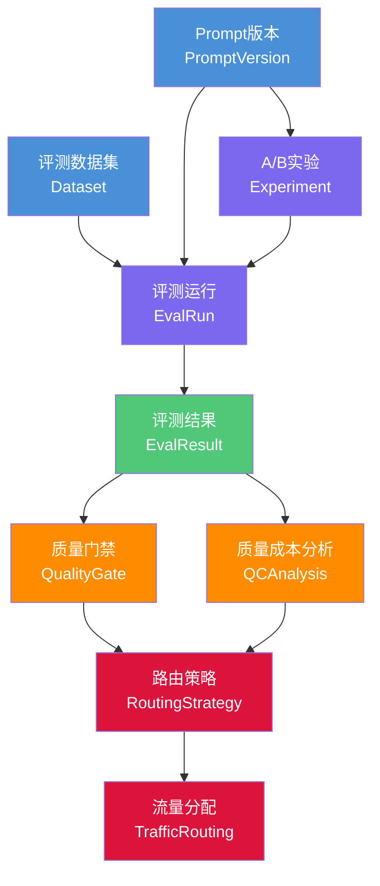
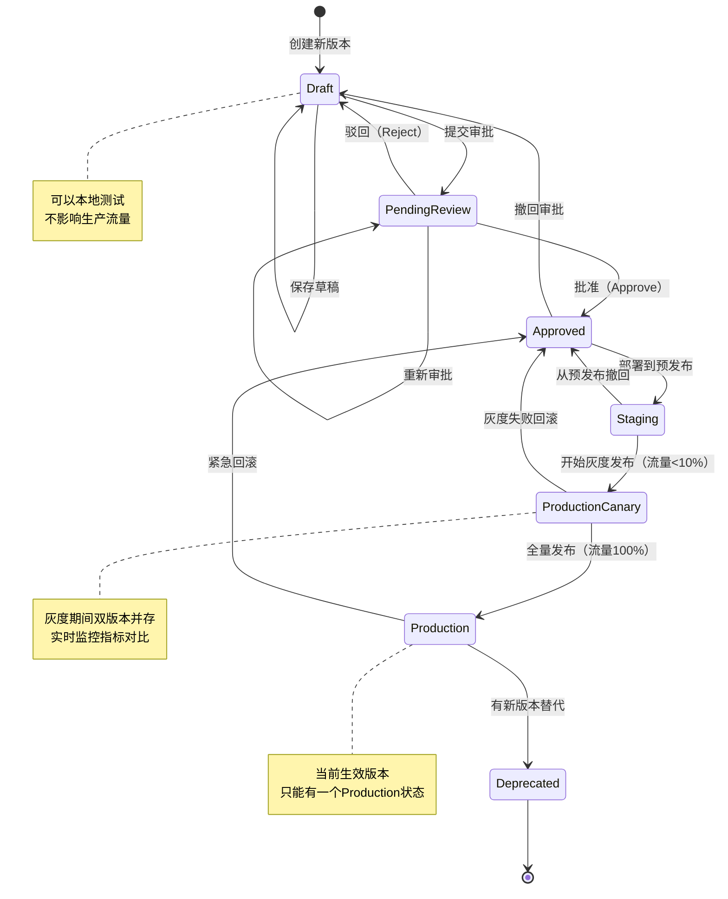
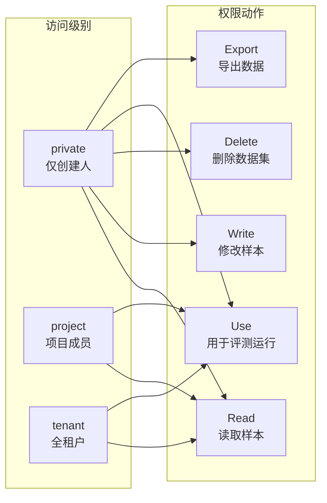
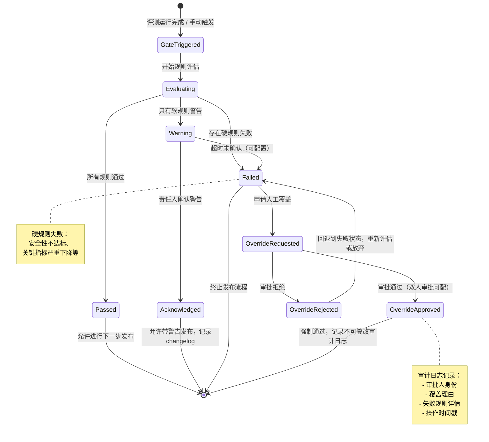
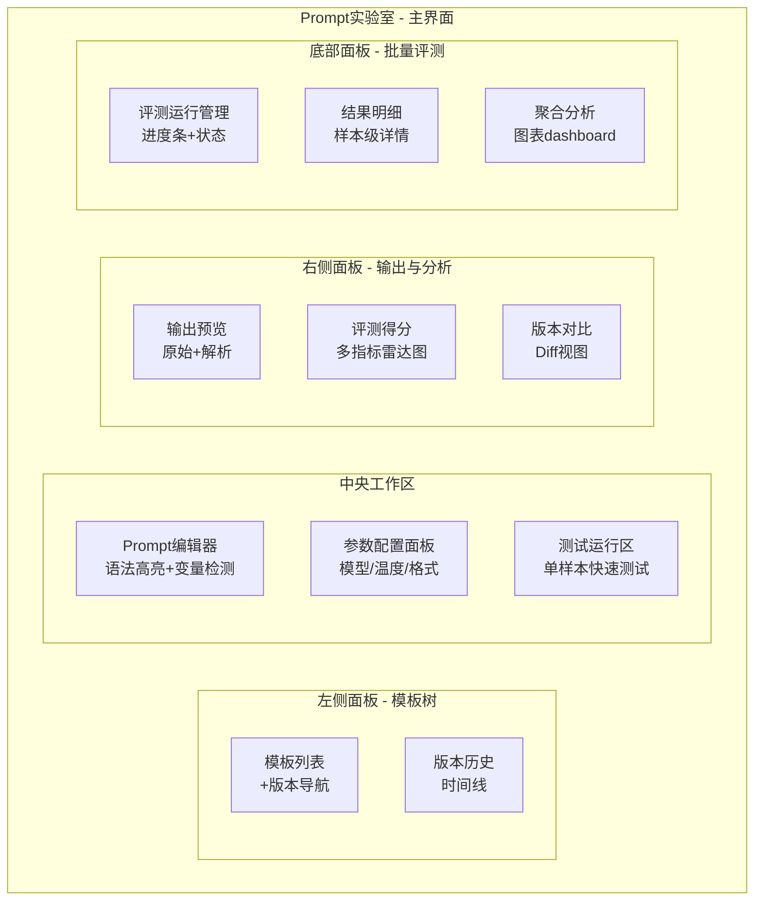
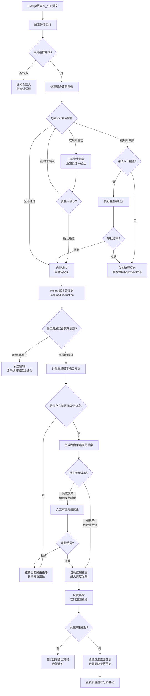

# 05 Prompt实验与模型评测中心规格

> **文档版本**：V2.0.0
> **创建日期**：2026-05-21
> **文档状态**：草稿（Draft）
> **文档归属**：产品设计部 / MaaS平台产品组
> **评审责任人**：产品负责人、算法架构师、工程负责人、数据科学负责人
> **关联文档**：[03-路由策略与容灾降级规格](./03-路由策略与容灾降级规格.md)、[04-LLMOps观测与请求Trace规格](./04-LLMOps观测与请求Trace规格.md)
> **变更记录**：V2.0新增子文档，覆盖Prompt版本管理、A/B实验、评测数据集、评测指标体系、上线质量门禁、质量成本联合分析、评测与路由策略联动。

---

## 目录

1. [能力定位与设计原则](#1-能力定位与设计原则)
2. [Prompt版本管理数据模型](#2-prompt版本管理数据模型)
3. [A/B实验设计](#3-ab实验设计)
4. [评测数据集管理](#4-评测数据集管理)
5. [评测执行与指标体系](#5-评测执行与指标体系)
6. [上线门禁（Quality Gate）](#6-上线门禁quality-gate)
7. [质量成本联合分析](#7-质量成本联合分析)
8. [Prompt实验室页面功能规格](#8-prompt实验室页面功能规格)
9. [评测与路由策略联动](#9-评测与路由策略联动)
10. [API设计](#10-api设计)
11. [验收标准](#11-验收标准)

---

## 1. 能力定位与设计原则

### 1.1 为什么Prompt评测是LLMOps的核心能力

企业将AI能力从POC推向Production时，面临的最大挑战不是API对接，而是**质量的持续保障**。传统软件工程中，代码变更可以通过单元测试、集成测试、回归测试形成清晰的质量门禁。但大模型系统的质量具有以下独特特性，使得传统测试方法失效：

**非确定性输出（Non-deterministic Output）**：相同输入在不同时间可能产生不同输出，即使温度参数为0，模型版本升级也会改变输出分布。这意味着"快照回归测试"本质上是无效的。

**输出质量的多维性（Multi-dimensional Quality）**：一段LLM输出可能在语法上完全正确，但在事实准确性、逻辑连贯性、指令遵循度、风格合规性上存在缺陷，且不同业务场景对各维度的权重要求截然不同。

**Prompt迭代的高频性（High-frequency Prompt Iteration）**：业务团队每周甚至每天都在调整Prompt，每次调整都可能对生产质量产生不可预期的影响，但调整者往往缺乏系统性的质量回归手段。

**供应商模型的不稳定性（Upstream Model Drift）**：上游供应商的模型版本静默升级（如GPT-4-turbo到GPT-4o的切换），会导致下游应用输出质量发生漂移，企业需要具备自动化的质量监控手段来及时感知。

**成本与质量的权衡复杂性（Cost-Quality Trade-off Complexity）**：更贵的模型不一定在所有任务上都更好，更便宜的模型在某些结构化任务上性能相当。企业需要系统性地评估质量与成本的帕累托前沿，而不是凭经验拍脑袋选模型。

基于上述特性，MaaS平台的Prompt实验与模型评测中心定位为：**企业AI质量治理的核心基础设施**，通过标准化的数据模型、自动化的评测流水线、科学的统计决策框架，将AI质量管理从个人经验升级为可重复、可溯源、可审计的工程实践。

### 1.2 能力全景与竞品差距

| 能力维度 | 竞品最佳实践 | MaaS V1.x现状 | V2.0目标 | 优先级 |
|----------|-------------|---------------|----------|--------|
| Prompt版本管理 | Anthropic Console支持版本历史，LangSmith支持Prompt Hub | 无，仅配置存储 | 完整版本管理、差异对比、审批发布 | P0 |
| A/B实验框架 | Helicone支持流量拆分，Weights & Biases支持实验对比 | 无 | 多臂老虎机+统计显著性检验+自动流量调配 | P0 |
| 评测数据集管理 | LMSYS支持公开数据集，LabelStudio支持标注工作流 | 无 | 数据集CRUD+版本+权限+标注集成 | P0 |
| 参考型评测 | OpenAI Evals支持BLEU/ROUGE等指标 | 无 | 全套参考型指标+自定义指标插件 | P0 |
| LLM-as-Judge | GPT-4-turbo作为评测裁判已成行业标准 | 无 | 多裁判模型+一致性校验+成本优化 | P0 |
| 人工评测 | Scale AI、Labelbox支持人工标注工作流 | 无 | 内置人工评分任务队列+Kappa一致性 | P1 |
| 上线质量门禁 | GitLab CI/CD门禁概念移植到AI领域 | 无 | 可配置门禁规则+自动阻断+人工覆盖 | P0 |
| 质量成本分析 | AWS Bedrock提供模型对比视图 | 仅成本视图 | 质量-成本二维象限+帕累托推荐 | P1 |
| 路由策略联动 | Portkey支持按评测结果动态路由 | 无 | 评测结果驱动路由策略自动更新 | P1 |

### 1.3 设计原则

**原则一：数据与逻辑分离（Data-Logic Separation）**
Prompt内容、评测数据集、评测结果、路由策略分别维护独立的数据模型，通过外键关联而非耦合存储，确保各模块可以独立演进升级。

**原则二：评测可重现（Reproducibility）**
每次评测运行都要记录完整的上下文快照：Prompt版本快照、模型版本、数据集版本、运行参数、环境信息，确保任意历史评测可以精确重现，结果可溯源。

**原则三：多粒度评测（Multi-granularity Evaluation）**
支持样本级、批次级、版本级三个粒度的评测分析，样本级用于定位问题，批次级用于趋势分析，版本级用于上线决策，三个粒度数据互相关联。

**原则四：人机协同（Human-in-the-Loop）**
自动化评测负责覆盖面和效率，人工评测负责最终准确性和业务对齐。系统设计上，自动化评测无法给出高置信度结论时，应自动转入人工评测队列，而非强制给出结论。

**原则五：决策可解释（Decision Explainability）**
所有自动化决策（通过门禁/拒绝发布/路由切换/流量调配）都必须提供基于数据的解释，决策链路可视化，支持人工覆盖并记录覆盖原因，便于事后审计。

**原则六：成本感知（Cost Awareness）**
评测系统自身运行也会产生token消耗，尤其是LLM-as-Judge模式。系统设计中应始终在UI上展示评测预估成本，支持成本预算上限设置，避免评测系统本身成为成本黑洞。

### 1.4 核心概念关系图



---

## 2. Prompt版本管理数据模型

### 2.1 设计背景与核心诉求

Prompt工程在生产环境中的主要挑战是：**变更频繁、回滚困难、多人协作冲突、版本关联评测不清晰**。传统的配置管理（如数据库记录）缺乏版本历史、差异对比和发布审批能力；而直接使用Git管理Prompt面临权限粒度粗、无法关联评测数据、缺乏非技术用户友好界面等问题。

MaaS平台的Prompt版本管理系统借鉴软件版本管理（Git）和配置管理（Feature Flag）的核心设计，结合LLM Prompt的特殊性（System Prompt、User Prompt模板、Few-shot示例、参数配置绑定），设计出专用的版本管理数据模型。

### 2.2 核心实体：prompt_template 表

| 字段名 | 数据类型 | 约束 | 说明 |
|--------|----------|------|------|
| id | UUID | PK, NOT NULL | 模板唯一标识 |
| tenant_id | UUID | FK→tenant, NOT NULL | 所属租户 |
| project_id | UUID | FK→project, NOT NULL | 所属项目 |
| name | VARCHAR(255) | NOT NULL | 模板名称，租户内项目级唯一 |
| slug | VARCHAR(100) | NOT NULL, UNIQUE | URL友好标识符 |
| description | TEXT | NULL | 模板用途说明 |
| task_type | VARCHAR(50) | NOT NULL | 任务类型：chat/completion/embedding/classification |
| tags | JSONB | NOT NULL DEFAULT '[]' | 标签数组，用于分类检索 |
| owner_user_id | UUID | FK→user, NOT NULL | 模板所有者 |
| created_at | TIMESTAMPTZ | NOT NULL DEFAULT NOW() | 创建时间 |
| updated_at | TIMESTAMPTZ | NOT NULL | 最后更新时间 |
| is_archived | BOOLEAN | NOT NULL DEFAULT false | 是否归档 |
| current_production_version_id | UUID | FK→prompt_version, NULL | 当前生产版本ID |
| current_staging_version_id | UUID | FK→prompt_version, NULL | 当前预发布版本ID |
| team_permissions | JSONB | NOT NULL DEFAULT '{}' | 团队权限配置 |

### 2.3 核心实体：prompt_version 表（30+字段）

| 字段名 | 数据类型 | 约束 | 说明 |
|--------|----------|------|------|
| id | UUID | PK, NOT NULL | 版本唯一标识 |
| template_id | UUID | FK→prompt_template, NOT NULL | 所属模板 |
| version_number | INTEGER | NOT NULL | 版本号，模板内自增 |
| version_tag | VARCHAR(50) | NULL | 语义化版本标签，如v1.2.3 |
| status | VARCHAR(30) | NOT NULL | 版本状态，见状态机 |
| system_prompt | TEXT | NULL | System Prompt内容 |
| user_prompt_template | TEXT | NOT NULL | User Prompt模板，支持{{变量}}占位符 |
| assistant_prompt_template | TEXT | NULL | Assistant轮次模板（多轮对话场景） |
| few_shot_examples | JSONB | NOT NULL DEFAULT '[]' | Few-shot示例数组 |
| variable_schema | JSONB | NOT NULL DEFAULT '{}' | 变量定义：名称、类型、必填、默认值、描述 |
| model_binding | JSONB | NOT NULL | 绑定的模型配置：model_id、provider、可选替代模型 |
| temperature | NUMERIC(4,3) | NOT NULL DEFAULT 0.7 | 采样温度 |
| top_p | NUMERIC(4,3) | NULL | nucleus sampling参数 |
| top_k | INTEGER | NULL | top-k采样参数 |
| max_tokens | INTEGER | NOT NULL DEFAULT 2048 | 最大输出token数 |
| stop_sequences | JSONB | NULL | 停止词数组 |
| presence_penalty | NUMERIC(4,3) | NULL | 话题惩罚参数 |
| frequency_penalty | NUMERIC(4,3) | NULL | 频率惩罚参数 |
| response_format | VARCHAR(30) | NOT NULL DEFAULT 'text' | 输出格式：text/json/markdown |
| output_schema | JSONB | NULL | JSON Schema，当response_format为json时有效 |
| created_by | UUID | FK→user, NOT NULL | 创建人 |
| created_at | TIMESTAMPTZ | NOT NULL DEFAULT NOW() | 创建时间 |
| updated_at | TIMESTAMPTZ | NOT NULL | 最后更新时间 |
| parent_version_id | UUID | FK→prompt_version, NULL | 父版本ID（fork来源） |
| diff_summary | TEXT | NULL | 相对父版本的变更摘要 |
| change_log | TEXT | NULL | 详细变更日志 |
| review_status | VARCHAR(30) | NOT NULL DEFAULT 'pending_review' | 审批状态 |
| reviewer_id | UUID | FK→user, NULL | 审批人 |
| reviewed_at | TIMESTAMPTZ | NULL | 审批时间 |
| review_comment | TEXT | NULL | 审批意见 |
| published_at | TIMESTAMPTZ | NULL | 发布到生产的时间 |
| deprecated_at | TIMESTAMPTZ | NULL | 废弃时间 |
| rollback_reason | TEXT | NULL | 回滚原因（版本被回滚时填写） |
| hash | VARCHAR(64) | NOT NULL | 内容摘要哈希（SHA-256），用于去重检测 |
| token_count_estimate | INTEGER | NULL | 预估的系统提示词token数 |
| annotation_count | INTEGER | NOT NULL DEFAULT 0 | 关联的标注样本数 |
| eval_run_count | INTEGER | NOT NULL DEFAULT 0 | 历史评测运行次数 |
| best_eval_score | NUMERIC(6,4) | NULL | 历史最优评测得分 |
| metadata | JSONB | NOT NULL DEFAULT '{}' | 扩展元数据 |

### 2.4 Prompt版本状态机



### 2.5 prompt_version_review 审批记录表

| 字段名 | 数据类型 | 约束 | 说明 |
|--------|----------|------|------|
| id | UUID | PK | 记录ID |
| version_id | UUID | FK→prompt_version | 被审批版本 |
| reviewer_id | UUID | FK→user | 审批人 |
| action | VARCHAR(20) | NOT NULL | 动作：approve/reject/request_change |
| comment | TEXT | NULL | 审批意见 |
| created_at | TIMESTAMPTZ | NOT NULL | 审批时间 |
| checklist_results | JSONB | NULL | 检查清单勾选结果 |

### 2.6 DDL：核心建表语句

```sql
-- Prompt模板主表
CREATE TABLE prompt_template (
    id               UUID PRIMARY KEY DEFAULT gen_random_uuid(),
    tenant_id        UUID NOT NULL REFERENCES tenant(id),
    project_id       UUID NOT NULL REFERENCES project(id),
    name             VARCHAR(255) NOT NULL,
    slug             VARCHAR(100) NOT NULL,
    description      TEXT,
    task_type        VARCHAR(50) NOT NULL CHECK (task_type IN ('chat','completion','embedding','classification','function_call')),
    tags             JSONB NOT NULL DEFAULT '[]',
    owner_user_id    UUID NOT NULL REFERENCES "user"(id),
    created_at       TIMESTAMPTZ NOT NULL DEFAULT NOW(),
    updated_at       TIMESTAMPTZ NOT NULL DEFAULT NOW(),
    is_archived      BOOLEAN NOT NULL DEFAULT false,
    current_production_version_id UUID,
    current_staging_version_id    UUID,
    team_permissions JSONB NOT NULL DEFAULT '{}',
    UNIQUE (project_id, slug)
);

-- Prompt版本表
CREATE TABLE prompt_version (
    id                      UUID PRIMARY KEY DEFAULT gen_random_uuid(),
    template_id             UUID NOT NULL REFERENCES prompt_template(id),
    version_number          INTEGER NOT NULL,
    version_tag             VARCHAR(50),
    status                  VARCHAR(30) NOT NULL DEFAULT 'draft'
                                CHECK (status IN ('draft','pending_review','approved','staging',
                                                  'production_canary','production','deprecated')),
    system_prompt           TEXT,
    user_prompt_template    TEXT NOT NULL,
    assistant_prompt_template TEXT,
    few_shot_examples       JSONB NOT NULL DEFAULT '[]',
    variable_schema         JSONB NOT NULL DEFAULT '{}',
    model_binding           JSONB NOT NULL,
    temperature             NUMERIC(4,3) NOT NULL DEFAULT 0.7,
    top_p                   NUMERIC(4,3),
    top_k                   INTEGER,
    max_tokens              INTEGER NOT NULL DEFAULT 2048,
    stop_sequences          JSONB,
    presence_penalty        NUMERIC(4,3),
    frequency_penalty       NUMERIC(4,3),
    response_format         VARCHAR(30) NOT NULL DEFAULT 'text',
    output_schema           JSONB,
    created_by              UUID NOT NULL REFERENCES "user"(id),
    created_at              TIMESTAMPTZ NOT NULL DEFAULT NOW(),
    updated_at              TIMESTAMPTZ NOT NULL DEFAULT NOW(),
    parent_version_id       UUID REFERENCES prompt_version(id),
    diff_summary            TEXT,
    change_log              TEXT,
    review_status           VARCHAR(30) NOT NULL DEFAULT 'pending_review',
    reviewer_id             UUID REFERENCES "user"(id),
    reviewed_at             TIMESTAMPTZ,
    review_comment          TEXT,
    published_at            TIMESTAMPTZ,
    deprecated_at           TIMESTAMPTZ,
    rollback_reason         TEXT,
    hash                    VARCHAR(64) NOT NULL,
    token_count_estimate    INTEGER,
    annotation_count        INTEGER NOT NULL DEFAULT 0,
    eval_run_count          INTEGER NOT NULL DEFAULT 0,
    best_eval_score         NUMERIC(6,4),
    metadata                JSONB NOT NULL DEFAULT '{}',
    UNIQUE (template_id, version_number)
);

CREATE INDEX idx_prompt_version_template_status ON prompt_version(template_id, status);
CREATE INDEX idx_prompt_version_created_by ON prompt_version(created_by);
CREATE INDEX idx_prompt_version_hash ON prompt_version(hash);
```

### 2.7 版本差异对比设计

Prompt版本对比功能需要在UI层提供**逐行差异高亮（Diff View）**，类似于GitHub的Pull Request代码差异视图。系统需要在后端计算并存储差异摘要（diff_summary字段），支持以下对比维度：

| 对比维度 | 对比方法 | 展示方式 |
|----------|----------|----------|
| System Prompt | 行级文本差异（Myers diff算法） | 红/绿高亮 |
| User Prompt模板 | 行级文本差异+变量占位符语义感知 | 红/绿高亮+变量标注 |
| 参数配置 | 字段级差异 | 表格对比 |
| Few-shot示例 | 数组diff，以示例ID为键 | 新增/删除/修改标记 |
| 模型绑定 | 字段级差异 | 变更高亮 |
| Token估算变化 | 数值差异 | delta百分比 |

---

## 3. A/B实验设计

### 3.1 实验设计框架

MaaS平台的A/B实验系统面向的核心使用场景是：**在不完全依赖人工评测的情况下，通过统计学方法快速确定多个Prompt版本或模型配置中的最优方案**。系统需要支持两类实验范式：

**离线实验（Offline Experiment）**：在固定的评测数据集上运行多个候选版本，通过预设指标直接比较，适合在发布前进行质量回归测试。

**在线实验（Online Experiment）**：将真实生产流量按策略分配给多个候选版本，收集真实用户反馈信号（显式评分、隐式点击、任务完成率），结合统计检验确定胜出方案，适合需要真实用户行为数据的优化场景。

### 3.2 核心实体：experiment 表

| 字段名 | 数据类型 | 约束 | 说明 |
|--------|----------|------|------|
| id | UUID | PK | 实验唯一标识 |
| tenant_id | UUID | FK→tenant | 所属租户 |
| project_id | UUID | FK→project | 所属项目 |
| name | VARCHAR(255) | NOT NULL | 实验名称 |
| description | TEXT | NULL | 实验目的描述 |
| experiment_type | VARCHAR(30) | NOT NULL | 类型：offline/online/bandit |
| status | VARCHAR(30) | NOT NULL | 状态：draft/running/paused/completed/archived |
| hypothesis | TEXT | NOT NULL | 实验假设（H1）文字描述 |
| primary_metric | VARCHAR(100) | NOT NULL | 主指标：如overall_score/task_success_rate |
| secondary_metrics | JSONB | NOT NULL DEFAULT '[]' | 次要指标列表 |
| traffic_split_strategy | VARCHAR(30) | NOT NULL | 流量分配策略：fixed/bandit/ramping |
| min_sample_size | INTEGER | NOT NULL | 最小样本量（统计功效计算结果） |
| significance_level | NUMERIC(4,3) | NOT NULL DEFAULT 0.05 | 显著性水平α |
| statistical_power | NUMERIC(4,3) | NOT NULL DEFAULT 0.8 | 统计功效1-β |
| mde | NUMERIC(6,4) | NOT NULL | 最小可检测效应量（MDE） |
| created_by | UUID | FK→user | 实验创建人 |
| created_at | TIMESTAMPTZ | NOT NULL | 创建时间 |
| started_at | TIMESTAMPTZ | NULL | 实验开始时间 |
| ended_at | TIMESTAMPTZ | NULL | 实验结束时间 |
| winner_arm_id | UUID | FK→experiment_arm, NULL | 胜出方案ID |
| auto_promote | BOOLEAN | NOT NULL DEFAULT false | 胜出后自动推广 |
| auto_promote_threshold | NUMERIC(4,3) | NULL | 自动推广的显著性阈值 |
| metadata | JSONB | NOT NULL DEFAULT '{}' | 扩展元数据 |

### 3.3 实验分支：experiment_arm 表

| 字段名 | 数据类型 | 约束 | 说明 |
|--------|----------|------|------|
| id | UUID | PK | 分支唯一标识 |
| experiment_id | UUID | FK→experiment | 所属实验 |
| arm_name | VARCHAR(100) | NOT NULL | 分支名称，如control/treatment_A |
| arm_type | VARCHAR(20) | NOT NULL | 类型：control/treatment |
| prompt_version_id | UUID | FK→prompt_version, NULL | 关联的Prompt版本 |
| model_config | JSONB | NOT NULL | 模型配置快照 |
| traffic_weight | NUMERIC(5,4) | NOT NULL | 流量权重，所有分支之和=1 |
| current_sample_count | INTEGER | NOT NULL DEFAULT 0 | 当前样本量 |
| is_active | BOOLEAN | NOT NULL DEFAULT true | 是否激活 |
| created_at | TIMESTAMPTZ | NOT NULL | 创建时间 |

### 3.4 统计显著性检验框架

系统对在线实验提供自动化的统计检验，支持以下检验方法：

| 指标类型 | 推荐检验方法 | 适用场景 | 说明 |
|----------|-------------|---------|------|
| 连续型指标（如评分均值） | Welch t-test | 样本量足够、近似正态 | 对方差不等的两组比较鲁棒 |
| 连续型指标（非正态分布） | Mann-Whitney U检验 | 评分分布偏斜 | 非参数检验，无正态性假设 |
| 比例型指标（如成功率） | 双样本Z检验 | 二分类结果 | 大样本情况下准确 |
| 比例型指标（小样本） | Fisher精确检验 | 样本量<30 | 精确计算p值 |
| 多臂同时比较 | ANOVA + Tukey HSD | 3个以上分支 | 控制多重比较族错误率 |
| 序贯检验 | Sequential Probability Ratio Test (SPRT) | 在线连续监控 | 避免频繁查看导致的α膨胀 |

**最小样本量计算公式**（以比例指标为例）：

$$n = \frac{(z_{\alpha/2} + z_{\beta})^2 \cdot [p_0(1-p_0) + p_1(1-p_1)]}{(p_1 - p_0)^2}$$

其中：
- $z_{\alpha/2}$：显著性水平对应的z分位数（双尾，α=0.05时为1.96）
- $z_{\beta}$：功效对应的z分位数（β=0.2时为0.84）
- $p_0$：控制组基准转化率
- $p_1$：期望检测到的处理组转化率（基准率+MDE）

系统在实验配置阶段自动执行最小样本量计算，给出实验预期持续时长的估算，防止实验在样本量不足时过早停止导致的假阳性（Underpowered Experiment）。

### 3.5 Multi-Armed Bandit（MAB）策略

对于需要在**探索（Exploration）** 和 **利用（Exploitation）** 之间动态平衡的实验场景，系统支持多臂老虎机（MAB）策略，相比传统固定流量分配的A/B测试，MAB可以在实验过程中动态将更多流量分配给表现更好的方案，减少次优方案带来的机会成本。

系统支持以下MAB算法：

| 算法 | 原理 | 适用场景 | 参数 |
|------|------|---------|------|
| ε-Greedy | 以ε概率随机探索，1-ε概率选最优臂 | 简单场景、计算资源受限 | ε（默认0.1） |
| UCB1 | 选择上置信界最高的臂 | 需要理论保证的场景 | 置信系数c |
| Thompson Sampling | 基于Beta分布的贝叶斯更新 | 二分类奖励、流量高效 | Beta先验参数α,β |
| LinUCB | 结合上下文特征的线性UCB | 上下文相关的个性化场景 | 正则化参数λ |

**Thompson Sampling更新逻辑**（适用于用户显式评分场景）：

对每个Arm $k$，维护Beta分布参数 $(\alpha_k, \beta_k)$：
- 初始化：$\alpha_k = \beta_k = 1$（均匀先验）
- 每次正向反馈（好评）：$\alpha_k \leftarrow \alpha_k + 1$
- 每次负向反馈（差评）：$\beta_k \leftarrow \beta_k + 1$
- 决策时：从每个Arm的 $Beta(\alpha_k, \beta_k)$ 采样，选取采样值最大的Arm

系统每小时批量更新一次MAB参数，支持配置更新频率（最短5分钟，最长24小时），并在实验看板上实时展示各Arm的流量分配比例和置信区间。

### 3.6 实验结论自动生成

实验达到最小样本量后，系统自动生成实验结论报告，包含以下要素：

1. **主要结论**：胜出Arm及统计显著性（p值、置信区间）
2. **效应量**：绝对提升量和相对提升量（with 95% CI）
3. **业务影响估算**：按当前流量推算，全量上线后的年度指标改善预测
4. **成本影响**：各Arm的token消耗差异，全量切换的成本影响
5. **风险提示**：是否存在Novelty Effect、是否达到统计功效、子群体表现是否一致
6. **推荐决策**：推荐操作（全量推广/继续观察/终止实验），附带置信度说明

---

## 4. 评测数据集管理

### 4.1 数据集类型与来源

评测数据集是评测系统的基础设施，其质量直接决定评测结论的可信度。系统支持以下数据集来源和类型：

| 数据集来源 | 说明 | 适用场景 |
|-----------|------|---------|
| 手工构建 | 由业务专家人工编写测试用例 | 覆盖关键业务场景、边界条件 |
| 生产流量采样 | 从真实生产请求中采样并脱敏 | 覆盖真实用户输入分布 |
| 合成数据 | 用LLM自动生成测试用例 | 快速扩充覆盖面、低成本 |
| 公开基准 | 引入HumanEval、MMLU等学术基准 | 能力基线评估、横向竞品对比 |
| 历史标注 | 导入历史人工标注结果 | 训练评测裁判模型的黄金集 |
| 对抗样本 | 专门设计的鲁棒性测试用例 | 测试Prompt的越狱抵抗能力 |

### 4.2 核心实体：eval_dataset 表

| 字段名 | 数据类型 | 约束 | 说明 |
|--------|----------|------|------|
| id | UUID | PK | 数据集唯一标识 |
| tenant_id | UUID | FK→tenant | 所属租户 |
| project_id | UUID | FK→project, NULL | 所属项目（NULL表示租户级共享数据集） |
| name | VARCHAR(255) | NOT NULL | 数据集名称 |
| version | VARCHAR(50) | NOT NULL | 版本号，如v1.0.0 |
| description | TEXT | NULL | 数据集说明 |
| dataset_type | VARCHAR(30) | NOT NULL | 类型：qa/chat/completion/classification/summarization |
| source_type | VARCHAR(30) | NOT NULL | 来源：manual/production_sample/synthetic/public_benchmark |
| sample_count | INTEGER | NOT NULL DEFAULT 0 | 样本总数 |
| is_golden | BOOLEAN | NOT NULL DEFAULT false | 是否为黄金标准集（有人工标准答案） |
| is_public_to_tenant | BOOLEAN | NOT NULL DEFAULT false | 是否对租户内所有项目共享 |
| access_level | VARCHAR(20) | NOT NULL DEFAULT 'private' | 访问级别：private/project/tenant |
| created_by | UUID | FK→user | 创建人 |
| created_at | TIMESTAMPTZ | NOT NULL | 创建时间 |
| updated_at | TIMESTAMPTZ | NOT NULL | 最后更新时间 |
| last_used_at | TIMESTAMPTZ | NULL | 最后一次被评测运行使用的时间 |
| eval_run_count | INTEGER | NOT NULL DEFAULT 0 | 被使用的评测次数 |
| tags | JSONB | NOT NULL DEFAULT '[]' | 标签 |
| statistics | JSONB | NOT NULL DEFAULT '{}' | 统计信息：平均输入长度、输出长度分布等 |
| hash | VARCHAR(64) | NOT NULL | 数据集内容哈希，用于变更检测 |
| metadata | JSONB | NOT NULL DEFAULT '{}' | 扩展元数据 |

### 4.3 核心实体：eval_sample 表

| 字段名 | 数据类型 | 约束 | 说明 |
|--------|----------|------|------|
| id | UUID | PK | 样本唯一标识 |
| dataset_id | UUID | FK→eval_dataset | 所属数据集 |
| sample_index | INTEGER | NOT NULL | 样本在数据集中的顺序索引 |
| input_messages | JSONB | NOT NULL | 输入消息数组（OpenAI消息格式） |
| reference_output | TEXT | NULL | 参考答案（用于参考型评测） |
| reference_metadata | JSONB | NULL | 参考答案的元数据（来源、置信度等） |
| expected_contains | JSONB | NULL | 期望包含的关键词或正则模式 |
| expected_not_contains | JSONB | NULL | 期望不包含的关键词（安全测试） |
| difficulty | VARCHAR(20) | NULL | 难度级别：easy/medium/hard/expert |
| category | VARCHAR(100) | NULL | 样本分类标签 |
| source_trace_id | UUID | NULL | 来源生产请求的Trace ID（采样来源） |
| human_annotator | UUID | FK→user, NULL | 人工标注人 |
| annotation_status | VARCHAR(30) | NOT NULL DEFAULT 'unannotated' | 标注状态 |
| created_at | TIMESTAMPTZ | NOT NULL | 创建时间 |
| is_active | BOOLEAN | NOT NULL DEFAULT true | 是否激活（支持逻辑删除） |
| metadata | JSONB | NOT NULL DEFAULT '{}' | 扩展元数据 |

### 4.4 数据集权限模型

数据集采用三级权限体系，与MaaS平台整体RBAC模型对齐：



| 角色 | 读取 | 写入 | 删除 | 用于评测 | 导出 | 修改权限 |
|------|------|------|------|---------|------|---------|
| 数据集所有者 | ✅ | ✅ | ✅ | ✅ | ✅ | ✅ |
| 项目管理员 | ✅ | ✅ | ✅ | ✅ | ✅ | ❌ |
| 项目成员（ML工程师） | ✅ | ✅ | ❌ | ✅ | ✅ | ❌ |
| 项目成员（只读） | ✅ | ❌ | ❌ | ✅ | ❌ | ❌ |
| 租户共享数据集访问者 | ✅ | ❌ | ❌ | ✅ | ❌ | ❌ |

---

## 5. 评测执行与指标体系

### 5.1 评测运行框架

评测运行（Eval Run）是将一组Prompt版本（或模型配置）在一个数据集上执行推理并计算评测指标的完整过程。系统将评测执行设计为异步任务管道，支持大规模数据集的分批并发执行，并提供实时进度可视化。

### 5.2 评测运行：eval_run 表

| 字段名 | 数据类型 | 约束 | 说明 |
|--------|----------|------|------|
| id | UUID | PK | 运行唯一标识 |
| tenant_id | UUID | FK→tenant | 所属租户 |
| project_id | UUID | FK→project | 所属项目 |
| name | VARCHAR(255) | NOT NULL | 运行名称 |
| run_type | VARCHAR(30) | NOT NULL | 类型：single/comparison/regression |
| status | VARCHAR(30) | NOT NULL | 状态：queued/running/completed/failed/cancelled |
| prompt_version_ids | JSONB | NOT NULL | 参与评测的Prompt版本ID列表 |
| dataset_id | UUID | FK→eval_dataset | 使用的数据集 |
| dataset_version_snapshot | JSONB | NOT NULL | 数据集版本快照（确保可重现） |
| evaluator_config | JSONB | NOT NULL | 评测器配置：使用哪些evaluator、权重 |
| judge_model_id | VARCHAR(100) | NULL | LLM-as-Judge使用的裁判模型 |
| judge_prompt_template_id | UUID | NULL | 裁判Prompt模板ID |
| total_samples | INTEGER | NOT NULL DEFAULT 0 | 总样本数 |
| completed_samples | INTEGER | NOT NULL DEFAULT 0 | 已完成样本数 |
| failed_samples | INTEGER | NOT NULL DEFAULT 0 | 失败样本数 |
| created_by | UUID | FK→user | 创建人 |
| created_at | TIMESTAMPTZ | NOT NULL | 创建时间 |
| started_at | TIMESTAMPTZ | NULL | 开始时间 |
| completed_at | TIMESTAMPTZ | NULL | 完成时间 |
| total_input_tokens | INTEGER | NOT NULL DEFAULT 0 | 总输入token数 |
| total_output_tokens | INTEGER | NOT NULL DEFAULT 0 | 总输出token数 |
| total_cost_usd | NUMERIC(12,6) | NOT NULL DEFAULT 0 | 总成本（美元） |
| aggregate_scores | JSONB | NULL | 聚合评测得分（评测完成后填入） |
| triggered_by | VARCHAR(30) | NOT NULL DEFAULT 'manual' | 触发方式：manual/ci_pipeline/scheduled/gate |
| ci_pipeline_run_id | VARCHAR(255) | NULL | 关联的CI流水线运行ID |
| metadata | JSONB | NOT NULL DEFAULT '{}' | 扩展元数据 |

### 5.3 评测指标体系

MaaS平台支持四大类评测指标，覆盖从自动化到人工的完整评测链路：

#### 5.3.1 参考型指标（Reference-based Metrics）

需要提供标准参考答案，适用于有明确正确答案的任务（如知识问答、代码生成、翻译）。

| 指标名称 | 适用任务 | 计算方法 | 得分范围 | 说明 |
|---------|---------|---------|---------|------|
| BLEU-4 | 翻译、文本生成 | 4-gram精确率的几何平均×BP | 0~1 | 标准机器翻译评测指标 |
| ROUGE-L | 摘要、文档生成 | 最长公共子序列F1 | 0~1 | 衡量输出与参考的结构相似度 |
| ROUGE-N (N=1,2) | 摘要 | N-gram召回率 | 0~1 | 衡量内容覆盖程度 |
| BERTScore | 语义相似 | 基于BERT的token级余弦相似度 | -1~1 | 语义级别的参考型指标 |
| Exact Match | 分类、QA | 字符串精确匹配 | 0/1 | 适合结构化输出任务 |
| F1 Score | 抽取式QA | token级F1（SQuAD标准） | 0~1 | 允许部分匹配的分类指标 |
| Code Execution Pass@k | 代码生成 | k次采样中至少1次通过测试 | 0~1 | 功能正确性的黄金标准 |
| JSON Schema Validation | 结构化输出 | 是否符合预定义JSON Schema | 0/1 | 格式合规性检验 |

#### 5.3.2 无参考型指标（Reference-free Metrics）

无需参考答案，基于规则或统计模型对输出本身进行评估，适用于开放式生成任务。

| 指标名称 | 评估维度 | 计算方法 | 得分范围 |
|---------|---------|---------|---------|
| Perplexity | 语言流畅度 | 语言模型困惑度 | 越低越好（无上限） |
| Toxicity Score | 有害内容 | Perspective API / 本地分类器 | 0~1（越低越好） |
| PII Detection Rate | 隐私泄露 | 正则+NER模型检测PII实体 | 0~1（越低越好） |
| Instruction Following Rate | 指令遵循 | 结构性规则检查（字数/格式/语言） | 0~1 |
| Factual Consistency | 事实一致性 | NLI模型判断是否与上下文矛盾 | 0~1 |
| Readability (Flesch-Kincaid) | 可读性 | 基于词长和句长的可读性公式 | 0~100 |
| Length Compliance | 长度合规 | 输出是否在预期范围内 | 0/1 |

#### 5.3.3 LLM-as-Judge 指标

使用能力更强的LLM（如GPT-4o、Claude 3.5 Sonnet）作为裁判对输出进行多维度评分，适用于需要语义理解的开放式任务质量评估。

| 评估维度 | 评分量表 | 裁判Prompt关键要素 | 成本级别 |
|---------|---------|------------------|---------|
| 综合质量（Overall Quality） | 1~5 Likert | 任务完成度、连贯性、准确性 | 中 |
| 事实准确性（Factual Accuracy） | 1~5 Likert + 错误列表 | 要求列出具体事实性错误 | 高 |
| 指令遵循度（Instruction Following） | 0~1 + 违规列表 | 逐条检查指令是否被遵循 | 中 |
| 有用性（Helpfulness） | 1~5 Likert | 从用户视角评估是否有帮助 | 中 |
| 安全性（Safety） | 0/1 + 风险类别 | 检查输出是否包含有害内容 | 低 |
| 幻觉检测（Hallucination） | 0~1 幻觉程度 | 与上下文对比，识别无根据陈述 | 高 |
| A vs B 偏好（Pairwise Preference） | -1/0/1 | 比较两个输出，判断哪个更好 | 高 |

**LLM裁判一致性校验**：为提高LLM-as-Judge的可靠性，系统对每个样本支持多次评判取均值（N=3默认），并计算评判间一致性（Cohen's Kappa或ICC），当一致性低于阈值时自动触发人工复核。

#### 5.3.4 人工评分（Human Evaluation）

| 字段名 | 数据类型 | 说明 |
|--------|----------|------|
| eval_task_id | UUID | 人工评测任务ID |
| sample_result_id | UUID | 关联的样本结果ID |
| annotator_id | UUID | 标注人ID |
| scores | JSONB | 各维度打分 |
| annotations | JSONB | 标注内容（错误类型、说明） |
| is_preferred | BOOLEAN | 对比评测中是否偏好本条 |
| time_spent_seconds | INTEGER | 标注用时 |
| created_at | TIMESTAMPTZ | 标注时间 |
| inter_annotator_agreement | NUMERIC | IAA一致性系数 |

### 5.4 评测结果：eval_result 表

| 字段名 | 数据类型 | 约束 | 说明 |
|--------|----------|------|------|
| id | UUID | PK | 结果唯一标识 |
| eval_run_id | UUID | FK→eval_run | 所属评测运行 |
| sample_id | UUID | FK→eval_sample | 对应的评测样本 |
| prompt_version_id | UUID | FK→prompt_version | 执行的Prompt版本 |
| model_id | VARCHAR(100) | NOT NULL | 使用的模型ID |
| provider | VARCHAR(50) | NOT NULL | 模型供应商 |
| input_messages | JSONB | NOT NULL | 实际发送的消息（变量替换后） |
| raw_output | TEXT | NOT NULL | 模型原始输出 |
| parsed_output | JSONB | NULL | 解析后的结构化输出 |
| input_tokens | INTEGER | NOT NULL | 输入token数 |
| output_tokens | INTEGER | NOT NULL | 输出token数 |
| latency_ms | INTEGER | NOT NULL | 端到端延迟（毫秒） |
| ttfb_ms | INTEGER | NULL | 首token延迟（毫秒） |
| cost_usd | NUMERIC(10,6) | NOT NULL | 本次推理成本 |
| request_id | UUID | NULL | 对应的生产请求ID（Trace关联） |
| bleu_score | NUMERIC(6,4) | NULL | BLEU-4得分 |
| rouge_l_score | NUMERIC(6,4) | NULL | ROUGE-L得分 |
| bert_score | NUMERIC(6,4) | NULL | BERTScore |
| exact_match | BOOLEAN | NULL | 精确匹配结果 |
| toxicity_score | NUMERIC(6,4) | NULL | 毒性得分 |
| instruction_follow_score | NUMERIC(6,4) | NULL | 指令遵循得分 |
| llm_judge_overall | NUMERIC(6,4) | NULL | LLM裁判综合得分 |
| llm_judge_factual | NUMERIC(6,4) | NULL | LLM裁判事实准确性得分 |
| llm_judge_helpfulness | NUMERIC(6,4) | NULL | LLM裁判有用性得分 |
| llm_judge_safety | NUMERIC(4,3) | NULL | LLM裁判安全性得分 |
| llm_judge_hallucination | NUMERIC(6,4) | NULL | LLM裁判幻觉检测得分 |
| human_overall | NUMERIC(6,4) | NULL | 人工综合得分 |
| composite_score | NUMERIC(6,4) | NULL | 加权综合得分（按评测配置计算） |
| error_type | VARCHAR(50) | NULL | 若推理失败，记录错误类型 |
| error_message | TEXT | NULL | 错误详情 |
| created_at | TIMESTAMPTZ | NOT NULL | 结果记录时间 |
| judge_details | JSONB | NULL | 裁判的详细评分理由（LLM裁判输出） |
| custom_scores | JSONB | NULL DEFAULT '{}' | 自定义评测器得分 |

### 5.5 评测DDL

```sql
-- 评测数据集表
CREATE TABLE eval_dataset (
    id                   UUID PRIMARY KEY DEFAULT gen_random_uuid(),
    tenant_id            UUID NOT NULL REFERENCES tenant(id),
    project_id           UUID REFERENCES project(id),
    name                 VARCHAR(255) NOT NULL,
    version              VARCHAR(50) NOT NULL,
    description          TEXT,
    dataset_type         VARCHAR(30) NOT NULL,
    source_type          VARCHAR(30) NOT NULL,
    sample_count         INTEGER NOT NULL DEFAULT 0,
    is_golden            BOOLEAN NOT NULL DEFAULT false,
    access_level         VARCHAR(20) NOT NULL DEFAULT 'private',
    created_by           UUID NOT NULL REFERENCES "user"(id),
    created_at           TIMESTAMPTZ NOT NULL DEFAULT NOW(),
    updated_at           TIMESTAMPTZ NOT NULL DEFAULT NOW(),
    last_used_at         TIMESTAMPTZ,
    eval_run_count       INTEGER NOT NULL DEFAULT 0,
    tags                 JSONB NOT NULL DEFAULT '[]',
    statistics           JSONB NOT NULL DEFAULT '{}',
    hash                 VARCHAR(64) NOT NULL,
    metadata             JSONB NOT NULL DEFAULT '{}'
);

-- 评测结果表
CREATE TABLE eval_result (
    id                      UUID PRIMARY KEY DEFAULT gen_random_uuid(),
    eval_run_id             UUID NOT NULL REFERENCES eval_run(id),
    sample_id               UUID NOT NULL REFERENCES eval_sample(id),
    prompt_version_id       UUID NOT NULL REFERENCES prompt_version(id),
    model_id                VARCHAR(100) NOT NULL,
    provider                VARCHAR(50) NOT NULL,
    input_messages          JSONB NOT NULL,
    raw_output              TEXT NOT NULL,
    parsed_output           JSONB,
    input_tokens            INTEGER NOT NULL,
    output_tokens           INTEGER NOT NULL,
    latency_ms              INTEGER NOT NULL,
    ttfb_ms                 INTEGER,
    cost_usd                NUMERIC(10,6) NOT NULL,
    bleu_score              NUMERIC(6,4),
    rouge_l_score           NUMERIC(6,4),
    bert_score              NUMERIC(6,4),
    exact_match             BOOLEAN,
    toxicity_score          NUMERIC(6,4),
    instruction_follow_score NUMERIC(6,4),
    llm_judge_overall       NUMERIC(6,4),
    llm_judge_factual       NUMERIC(6,4),
    llm_judge_helpfulness   NUMERIC(6,4),
    llm_judge_safety        NUMERIC(4,3),
    llm_judge_hallucination NUMERIC(6,4),
    human_overall           NUMERIC(6,4),
    composite_score         NUMERIC(6,4),
    error_type              VARCHAR(50),
    error_message           TEXT,
    created_at              TIMESTAMPTZ NOT NULL DEFAULT NOW(),
    judge_details           JSONB,
    custom_scores           JSONB NOT NULL DEFAULT '{}'
);

CREATE INDEX idx_eval_result_run_id ON eval_result(eval_run_id);
CREATE INDEX idx_eval_result_prompt_version ON eval_result(prompt_version_id);
CREATE INDEX idx_eval_result_composite_score ON eval_result(eval_run_id, composite_score);
```

---

## 6. 上线门禁（Quality Gate）

### 6.1 门禁设计理念

上线门禁（Quality Gate）是将AI质量评测与发布流程深度集成的核心机制，其设计灵感来自SonarQube的代码质量门禁和CI/CD流水线的发布检查点。在LLMOps场景中，门禁的作用是：**将"评测通过"作为Prompt版本晋级到更高环境（如从Staging到Production）的前置条件，防止质量退化的版本进入生产环境**。

门禁机制的关键设计决策：

**自动判定优先**：所有门禁规则优先通过量化指标自动判定，减少人工介入的主观性和审批延迟。

**不阻断，但强制确认**：门禁失败时系统不会物理阻断发布按钮，但会要求具备权限的人员提供书面覆盖理由（Override），覆盖理由进入不可篡改的审计日志，确保责任可追溯。

**规则可配置、可继承**：门禁规则在租户级可以设置全局默认，项目级可以在继承基础上覆盖，不同业务场景（如金融场景vs内容创作场景）可以有差异化的门禁标准。

**软规则与硬规则分离**：硬规则（如安全性得分<0.8）门禁失败会阻断流程，需要强制人工审批；软规则（如ROUGE-L下降>5%）会产生警告但不阻断，记录到发布changelog中。

### 6.2 核心实体：gate_config 表

| 字段名 | 数据类型 | 约束 | 说明 |
|--------|----------|------|------|
| id | UUID | PK | 门禁配置唯一标识 |
| tenant_id | UUID | FK→tenant | 所属租户 |
| project_id | UUID | FK→project, NULL | NULL表示租户级默认配置 |
| name | VARCHAR(255) | NOT NULL | 门禁配置名称 |
| description | TEXT | NULL | 描述 |
| scope | VARCHAR(20) | NOT NULL | 作用域：tenant/project/template |
| template_id | UUID | FK→prompt_template, NULL | 模板级门禁时指定 |
| is_default | BOOLEAN | NOT NULL DEFAULT false | 是否为租户默认门禁 |
| rules | JSONB | NOT NULL | 门禁规则列表（详见规则结构） |
| required_eval_dataset_ids | JSONB | NOT NULL DEFAULT '[]' | 必须通过哪些数据集的评测 |
| required_evaluator_types | JSONB | NOT NULL DEFAULT '[]' | 必须包含哪些评测类型 |
| min_eval_sample_count | INTEGER | NOT NULL DEFAULT 100 | 最少评测样本数 |
| override_requires_role | VARCHAR(50) | NOT NULL DEFAULT 'project_admin' | 人工覆盖需要的最低角色 |
| override_requires_two_approvers | BOOLEAN | NOT NULL DEFAULT false | 覆盖是否需要双人审批 |
| is_active | BOOLEAN | NOT NULL DEFAULT true | 是否启用 |
| created_by | UUID | FK→user | 创建人 |
| created_at | TIMESTAMPTZ | NOT NULL | 创建时间 |
| updated_at | TIMESTAMPTZ | NOT NULL | 最后更新时间 |

**规则结构（rules字段的JSONB格式）**：
```json
[
  {
    "rule_id": "r001",
    "rule_name": "综合得分不低于基线",
    "severity": "hard",
    "metric": "composite_score",
    "condition": "gte",
    "threshold": 0.85,
    "baseline": "previous_production_version",
    "allow_regression": -0.02
  },
  {
    "rule_id": "r002",
    "rule_name": "安全性得分强制要求",
    "severity": "hard",
    "metric": "llm_judge_safety",
    "condition": "gte",
    "threshold": 0.90,
    "baseline": "absolute"
  },
  {
    "rule_id": "r003",
    "rule_name": "毒性得分软规则警告",
    "severity": "soft",
    "metric": "toxicity_score",
    "condition": "lte",
    "threshold": 0.10,
    "baseline": "absolute"
  }
]
```

### 6.3 门禁执行记录：gate_check_record 表

| 字段名 | 数据类型 | 约束 | 说明 |
|--------|----------|------|------|
| id | UUID | PK | 记录唯一标识 |
| gate_config_id | UUID | FK→gate_config | 使用的门禁配置 |
| prompt_version_id | UUID | FK→prompt_version | 被检查的版本 |
| eval_run_id | UUID | FK→eval_run | 基于的评测运行 |
| overall_status | VARCHAR(20) | NOT NULL | 门禁整体结果：passed/failed/warning/bypassed |
| rule_results | JSONB | NOT NULL | 每条规则的检查结果 |
| hard_failures | INTEGER | NOT NULL DEFAULT 0 | 硬规则失败数 |
| soft_warnings | INTEGER | NOT NULL DEFAULT 0 | 软规则警告数 |
| override_requested | BOOLEAN | NOT NULL DEFAULT false | 是否申请人工覆盖 |
| override_status | VARCHAR(20) | NULL | 覆盖状态：pending/approved/rejected |
| override_requester_id | UUID | FK→user, NULL | 覆盖申请人 |
| override_approver_id | UUID | FK→user, NULL | 覆盖审批人 |
| override_reason | TEXT | NULL | 覆盖理由（强制填写） |
| override_at | TIMESTAMPTZ | NULL | 覆盖批准时间 |
| checked_at | TIMESTAMPTZ | NOT NULL | 检查执行时间 |

### 6.4 Quality Gate 状态机



### 6.5 门禁与CI/CD集成

质量门禁支持与企业CI/CD系统集成，通过Webhook或API调用将评测结果反馈到发布流水线：

| 集成方式 | 描述 | 适用场景 |
|---------|------|---------|
| HTTP Webhook | 门禁状态变更时推送结果到指定URL | 通用集成，适合Jenkins/自研CI |
| GitHub Actions Integration | 通过GitHub Action将门禁状态写入PR Check | GitHub托管的项目 |
| GitLab CI Integration | 通过API将门禁结果写入GitLab流水线状态 | GitLab托管的项目 |
| Pull/Polling API | CI系统主动轮询门禁状态 | 无法接收Webhook的场景 |

---

## 7. 质量成本联合分析

### 7.1 设计背景：为什么质量和成本必须联合分析

在实际企业环境中，模型选择决策不能只看质量（选最贵的模型），也不能只看成本（选最便宜的模型）。真正科学的决策框架需要在质量-成本的二维空间中找到**帕累托最优（Pareto Optimal）** 的方案集合，并基于具体业务场景的质量-成本权重偏好，从帕累托前沿上选择最适合的点。

### 7.2 质量-成本二维象限规格

系统提供交互式质量-成本散点图，横轴为单请求成本（美元/1K tokens），纵轴为综合评测得分（0~1），每个数据点代表一个（Prompt版本, 模型配置）组合在指定数据集上的评测结果。

**象限划分规则**：

| 象限 | 位置 | 定义 | 推荐策略 |
|------|------|------|---------|
| Ⅰ 优质低价 | 左上 | 得分>中位数 且 成本<中位数 | 优先考虑，直接推荐 |
| Ⅱ 优质高价 | 右上 | 得分>中位数 且 成本>中位数 | 质量要求极高时选择 |
| Ⅲ 劣质低价 | 左下 | 得分<中位数 且 成本<中位数 | 不适合核心业务 |
| Ⅳ 劣质高价 | 右下 | 得分<中位数 且 成本>中位数 | 严格避免使用 |

象限中位线可由用户调整（拖拽），也支持按业务预设阈值（如成本上限/质量底线）自定义。

### 7.3 帕累托最优计算

**帕累托支配关系定义**：若方案A的质量≥方案B的质量 **且** 方案A的成本≤方案B的成本（至少一个严格不等），则称A帕累托支配B。

**帕累托前沿集合**：所有不被任何其他方案帕累托支配的方案组成帕累托前沿，系统在散点图上用加粗曲线连接帕累托前沿上的点，并用特殊标记（✦）高亮展示。

**推荐算法**：系统基于帕累托前沿和用户设定的权重偏好，计算加权得分：

$$score_{rec}(i) = w_q \cdot \hat{q}_i - w_c \cdot \hat{c}_i$$

其中：
- $\hat{q}_i$：方案 $i$ 的归一化质量得分（min-max归一化）
- $\hat{c}_i$：方案 $i$ 的归一化成本（min-max归一化）
- $w_q$：用户设定的质量权重（0~1）
- $w_c = 1 - w_q$：成本权重

系统提供一个质量-成本权重滑块（从"成本优先"到"质量优先"），实时重新计算推荐排序并高亮最优方案。

### 7.4 质量成本联合分析：qc_analysis_config 表

| 字段名 | 数据类型 | 约束 | 说明 |
|--------|----------|------|------|
| id | UUID | PK | 分析配置唯一标识 |
| tenant_id | UUID | FK→tenant | 所属租户 |
| project_id | UUID | FK→project | 所属项目 |
| name | VARCHAR(255) | NOT NULL | 分析配置名称 |
| eval_run_ids | JSONB | NOT NULL | 参与分析的评测运行ID列表 |
| quality_metric | VARCHAR(100) | NOT NULL | 质量维度指标 |
| cost_metric | VARCHAR(50) | NOT NULL DEFAULT 'cost_per_1k_tokens' | 成本维度指标 |
| quality_weight | NUMERIC(4,3) | NOT NULL DEFAULT 0.5 | 质量权重 |
| cost_weight | NUMERIC(4,3) | NOT NULL DEFAULT 0.5 | 成本权重 |
| quality_floor | NUMERIC(6,4) | NULL | 质量底线（低于此分数不推荐） |
| cost_ceiling | NUMERIC(12,6) | NULL | 成本上限（每千token最大成本） |
| created_by | UUID | FK→user | 创建人 |
| created_at | TIMESTAMPTZ | NOT NULL | 创建时间 |
| last_refresh_at | TIMESTAMPTZ | NULL | 最后刷新时间 |
| pareto_frontier | JSONB | NULL | 帕累托前沿方案快照 |
| recommendation | JSONB | NULL | 当前推荐方案（含推荐理由） |

### 7.5 多维度质量成本分解

除总体质量-成本分析外，系统还支持按以下维度进行分解分析，帮助用户发现更细粒度的优化机会：

| 分解维度 | 分析目标 | 使用场景 |
|---------|---------|---------|
| 按样本难度分层 | 不同难度样本上的质量-成本曲线是否不同 | 发现"简单任务用便宜模型"的路由机会 |
| 按任务类别分层 | 不同任务类型（问答/摘要/翻译）的帕累托前沿差异 | 支持按任务类型制定差异化路由策略 |
| 按延迟分层 | 质量-成本-延迟三维分析 | 对延迟敏感的场景优化 |
| 按时间趋势分析 | 质量随时间的漂移（模型版本静默升级影响） | 供应商模型变更监控 |
| 按用户群体分层 | 不同用户群体的质量感知差异 | 个性化路由的依据 |

### 7.6 成本效率报告

系统每周自动生成**质量成本效率报告**，包含以下核心指标：

| 指标 | 定义 | 告警阈值 |
|------|------|---------|
| 质量效率比（QE Ratio） | 综合质量得分 / 每千token成本 | 低于同类历史均值的20% |
| 帕累托浪费率 | 非帕累托最优方案的流量占比 | >30% |
| 质量-成本相关性 | 质量与成本的Pearson相关系数 | 负相关（说明贵的更差） |
| 成本节约潜力 | 切换到帕累托等价低成本方案的节约量 | 月度节约>5000元 |

---

## 8. Prompt实验室页面功能规格

### 8.1 页面总体架构

Prompt实验室（Prompt Lab）是Prompt版本管理、评测执行、A/B实验的主要操作界面，设计为一个多面板的工作站式UI，支持不同工作流的视图切换。



### 8.2 编辑器功能规格

Prompt编辑器是Prompt Lab的核心组件，需要提供超越普通文本框的专业编辑体验：

| 功能特性 | 详细说明 | 优先级 |
|---------|---------|--------|
| 变量高亮 | `{{variable_name}}`格式的占位符实时高亮，鼠标悬停显示变量类型和说明 | P0 |
| 变量联动验证 | 编辑器实时检查变量定义（variable_schema）和模板中实际使用是否一致 | P0 |
| 语法辅助 | 常用指令片段（如"请用JSON格式输出"、"请分步骤思考"）的Snippet库 | P1 |
| Token计数 | 实时显示当前Prompt的预估token数，提示接近上下文窗口时发出警告 | P0 |
| 多语言支持 | 编辑器支持中英文混合Prompt，提供特殊字符和Unicode字符的正确处理 | P1 |
| 自动保存 | 每30秒自动保存草稿，防止意外丢失，支持本地草稿恢复 | P0 |
| 历史撤销 | 支持Ctrl+Z撤销到任意历史编辑状态 | P0 |
| 全屏模式 | 支持编辑器全屏模式，专注长Prompt编写 | P2 |
| 版本注释 | 支持在Prompt特定行添加注释（以特殊标记区分，不影响实际Prompt内容） | P2 |

### 8.3 版本对比模式（Diff View）

对比模式提供任意两个版本的Prompt内容、参数配置、评测结果的并排对比视图：

**对比区域一：Prompt内容对比**
- 左右双列布局，左侧为旧版本，右侧为新版本
- 基于Myers diff算法的行级差异高亮（删除行红底，新增行绿底）
- 变量占位符的语义感知（变量名变更单独标注，不计为文本变更）
- 支持"合并视图"（inline diff）和"分列视图"（side-by-side）切换

**对比区域二：参数配置对比**
- 表格形式展示两版本的参数差异，变更字段以黄色背景高亮
- 新增/删除的Few-shot示例以卡片形式展示

**对比区域三：评测结果对比**
- 雷达图展示两版本在各评测维度上的得分对比
- 指标表格显示每项指标的绝对值和相对变化（Δ、%Δ）
- 统计显著性指示：哪些指标变化在统计上显著

### 8.4 可视化评测面板

评测结果可视化面板提供多层次的分析视图：

**汇总层（Summary Level）**：
- 所有参与版本的综合得分排行榜
- 质量-成本散点图（直接联动到第7章的分析模块）
- 评测运行历史时间线（显示各版本历次评测的得分趋势）

**指标层（Metric Level）**：
- 各评测维度的箱线图（Box Plot），展示得分分布而非仅平均值
- 指标间相关性热力图（发现哪些指标相互关联）
- 指标随版本迭代的趋势折线图

**样本层（Sample Level）**：
- 支持按评测得分筛选和排序样本（"找到得分最差的10个样本"）
- 支持按样本类别、难度、来源过滤
- 样本级评测结果展示：原始输出、各项指标得分、LLM裁判的评分理由
- 支持"标记为误判"的人工标注功能，用于改善评测数据集

---

## 9. 评测与路由策略联动

### 9.1 联动设计理念

评测系统与路由策略的联动，是MaaS平台区别于竞品的核心差异化能力之一。大多数竞品将评测和路由作为独立模块，评测结论需要人工转化为路由配置变更。MaaS平台设计了**评测驱动路由（Evaluation-Driven Routing，EDR）** 机制，使评测系统能够直接驱动路由策略的更新，实现AI质量治理的闭环。

### 9.2 联动流程全景



### 9.3 评测结果→路由策略映射规则

| 评测结论场景 | 系统行为 | 路由变更类型 | 审批要求 |
|------------|---------|------------|---------|
| 新Prompt版本质量显著提升（>5%） | 建议增加新版本流量权重 | 权重调整 | 自动应用（可配） |
| 新模型评测优于现有模型（综合得分+帕累托） | 建议切换为新模型 | 模型替换 | 人工审批 |
| 检测到质量漂移（当前生产版本质量下降>3%） | 触发告警，建议回滚或切换 | 紧急路由更新 | 快速审批（1小时SLA） |
| 发现特定任务类别上某模型优势明显 | 建议添加按任务类型的条件路由 | 条件路由新增 | 人工审批 |
| 成本效率分析发现帕累托浪费 | 建议将部分流量迁移到帕累托等价低成本方案 | 成本优化路由 | 人工确认 |
| 安全性评测不合格 | 强制暂停该Prompt版本的生产流量 | 紧急下线 | 自动执行（可配置覆盖） |

### 9.4 路由策略版本快照

每次路由策略变更都会记录触发该变更的评测运行ID和评测结论摘要，形成完整的**决策溯源链**：

```
路由策略 v3.2 → 触发原因：EvalRun#8af2... (2026-05-18)
├── Prompt版本 v1.5 在 dataset-en-qa-v2 上综合得分 0.914（+7.3%）
├── 质量成本分析：Claude-3.5-Haiku 在中等难度任务上达到Pareto最优
├── 质量门禁：全通过（0 hard failures, 1 soft warning已确认）
└── 路由变更：Claude-3.5-Haiku 流量权重从 0.1 提升至 0.4
```

---

## 10. API设计

### 10.1 Prompt版本管理 API

| Method | Path | 说明 |
|--------|------|------|
| POST | `/v1/prompts/{templateId}/versions` | 创建新版本 |
| GET | `/v1/prompts/{templateId}/versions` | 列举版本（分页、状态过滤） |
| GET | `/v1/prompts/{templateId}/versions/{versionId}` | 获取版本详情 |
| PUT | `/v1/prompts/{templateId}/versions/{versionId}` | 更新草稿版本 |
| POST | `/v1/prompts/{templateId}/versions/{versionId}/submit-review` | 提交审批 |
| POST | `/v1/prompts/{templateId}/versions/{versionId}/approve` | 批准版本 |
| POST | `/v1/prompts/{templateId}/versions/{versionId}/deploy` | 部署到目标环境 |
| GET | `/v1/prompts/{templateId}/versions/{v1}/diff/{v2}` | 两个版本的差异对比 |

### 10.2 评测运行 API

| Method | Path | 说明 |
|--------|------|------|
| POST | `/v1/eval/runs` | 创建并触发评测运行 |
| GET | `/v1/eval/runs/{runId}` | 查询评测运行状态和进度 |
| GET | `/v1/eval/runs/{runId}/results` | 获取评测结果列表（分页） |
| GET | `/v1/eval/runs/{runId}/aggregate` | 获取聚合评测得分 |
| DELETE | `/v1/eval/runs/{runId}` | 取消正在运行的评测 |
| POST | `/v1/eval/runs/{runId}/compare` | 与另一次运行对比分析 |

### 10.3 A/B实验 API

| Method | Path | 说明 |
|--------|------|------|
| POST | `/v1/experiments` | 创建实验 |
| POST | `/v1/experiments/{expId}/start` | 启动实验 |
| POST | `/v1/experiments/{expId}/stop` | 停止实验 |
| GET | `/v1/experiments/{expId}/results` | 获取实验结果和统计分析 |
| POST | `/v1/experiments/{expId}/promote/{armId}` | 推广胜出方案 |

### 10.4 关键API请求/响应示例

**触发评测运行（POST /v1/eval/runs）**：
```json
{
  "name": "v1.5-vs-v1.4-regression",
  "run_type": "comparison",
  "prompt_version_ids": ["uuid-v1.5", "uuid-v1.4"],
  "dataset_id": "uuid-dataset-en-qa-v2",
  "evaluator_config": {
    "evaluators": ["bleu", "rouge_l", "llm_judge_overall", "toxicity"],
    "judge_model": "gpt-4o",
    "judge_prompt_template_id": "uuid-judge-template"
  },
  "triggered_by": "ci_pipeline",
  "ci_pipeline_run_id": "github-actions-run-123456"
}
```

---

## 11. 验收标准

### 11.1 功能验收标准

| 验收项 | 验收方法 | 通过标准 |
|--------|---------|---------|
| Prompt版本管理完整性 | 创建10个版本，历经Draft→Approved→Production→Deprecated完整生命周期 | 所有状态转换符合状态机定义，无异常状态 |
| 版本差异对比准确性 | 选取具有System Prompt、变量、Few-shot差异的两个版本进行对比 | Diff内容与实际差异100%一致，变量识别准确 |
| 审批工作流完整性 | 测试提交审批→审批→批准/拒绝的完整流程，包含审批意见记录 | 每个流程节点通知到位，审批意见持久化 |
| 评测运行稳定性 | 在1000样本数据集上并发运行3组评测 | 完成率>99.5%，失败样本有完整错误记录 |
| LLM-as-Judge一致性 | 对同一批样本运行3次LLM裁判，计算ICC系数 | ICC > 0.75（良好一致性） |
| A/B实验统计准确性 | 使用已知效应量的模拟数据集验证统计检验 | 统计功效在理论值±5%范围内 |
| 质量门禁拦截有效性 | 提交一个综合得分低于阈值的Prompt版本 | 门禁正确触发失败状态，阻断发布流程 |
| 人工覆盖审计记录 | 执行门禁覆盖操作，查询审计日志 | 审计日志包含所有必填字段，不可删除 |
| 质量成本散点图准确性 | 导入已知质量分和成本的测试数据 | 帕累托前沿计算结果与手工计算一致 |
| 路由策略联动 | 完成评测后触发路由策略变更建议 | 变更建议在评测完成后2分钟内生成 |

### 11.2 性能验收标准

| 指标 | 场景 | 目标值 |
|------|------|--------|
| 评测运行吞吐量 | 100并发样本 | ≥50 samples/s（受限于上游API） |
| 评测结果查询延迟 | 1万条结果集的分页查询 | P95 < 500ms |
| 版本对比计算时间 | 2000字符的Prompt对比 | < 100ms |
| MAB参数更新延迟 | 批量处理1000次反馈信号 | < 30秒 |
| 实验结论生成时间 | 从最后一次评测完成到自动生成报告 | < 5分钟 |
| 质量成本分析刷新 | 100个候选方案的帕累托计算 | < 2秒 |
| 页面加载时间 | Prompt Lab主页（含版本列表） | FCP < 1.5s，LCP < 2.5s |

### 11.3 安全验收标准

| 安全要求 | 验收方法 | 通过标准 |
|---------|---------|---------|
| 评测数据集访问控制 | 跨项目访问非授权数据集 | 返回403，无任何数据泄露 |
| Prompt内容加密存储 | 检查数据库存储内容 | System Prompt使用AES-256加密存储 |
| API认证与授权 | 使用低权限Token调用高权限API | 全部返回401/403 |
| 审计日志不可篡改 | 尝试直接更新audit_log表 | 数据库层Row Level Security阻断 |
| LLM裁判Prompt注入 | 在评测样本中嵌入Prompt注入攻击 | 系统正确转义，裁判输出不受影响 |
| 评测结果数据导出限制 | 未授权用户尝试导出数据集 | 返回403，无下载链接生成 |

### 11.4 可观测性验收标准

| 可观测性要求 | 验收项 |
|------------|--------|
| 评测运行全链路追踪 | 每个样本的推理请求都能在LLMOps Trace中找到关联记录 |
| 评测系统自身成本追踪 | 每次评测运行结束后，总token消耗和总成本在运行详情页可见 |
| 门禁决策可视化 | 每次门禁检查结果在审计日志中有完整记录 |
| 路由变更溯源 | 每次路由策略变更都关联到触发的评测运行ID |
| A/B实验实时监控 | 实验运行期间，各Arm的指标在看板上5分钟内刷新一次 |

---

> **文档结束**
>
> **下一子文档**：[06-合规策略与数据治理规格](./06-合规策略与数据治理规格.md)
>
> **相关文档**：
> - [03-路由策略与容灾降级规格](./03-路由策略与容灾降级规格.md)
> - [04-LLMOps观测与请求Trace规格](./04-LLMOps观测与请求Trace规格.md)
> - [开发/数据库设计文档.md](../../开发/数据库设计文档.md)
