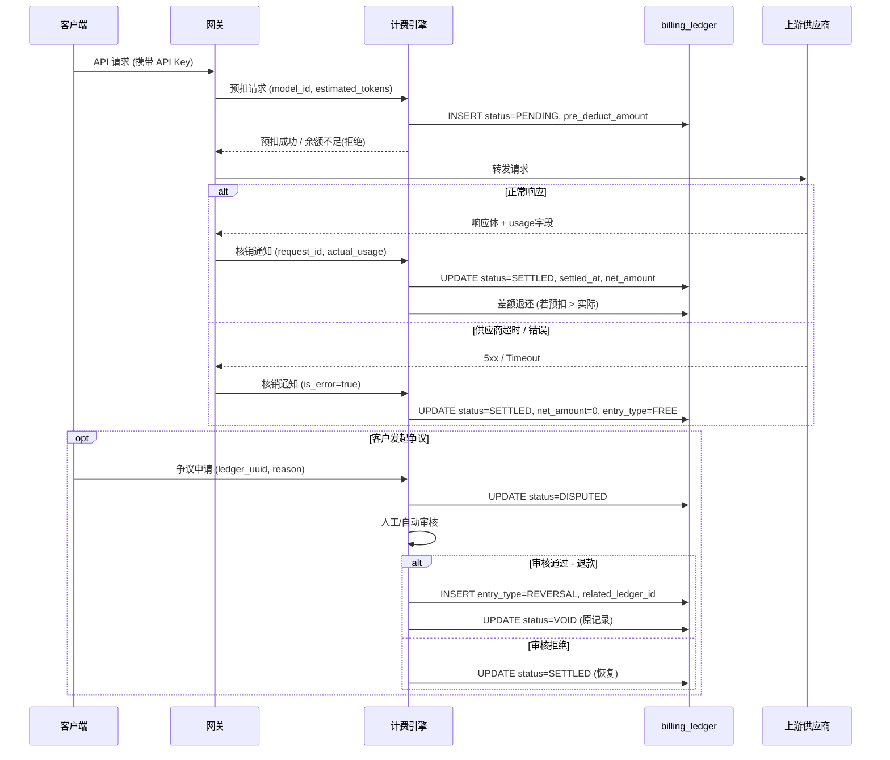
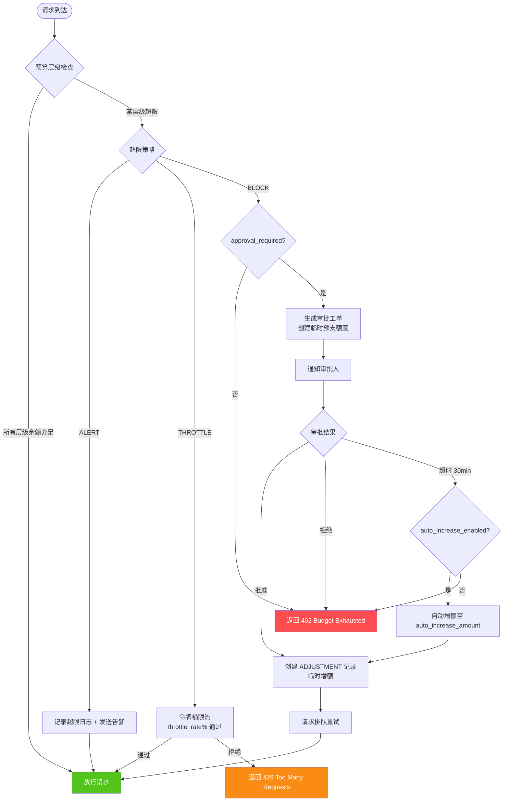
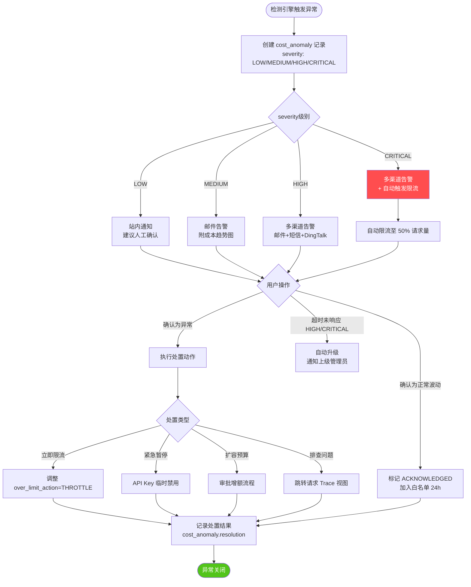
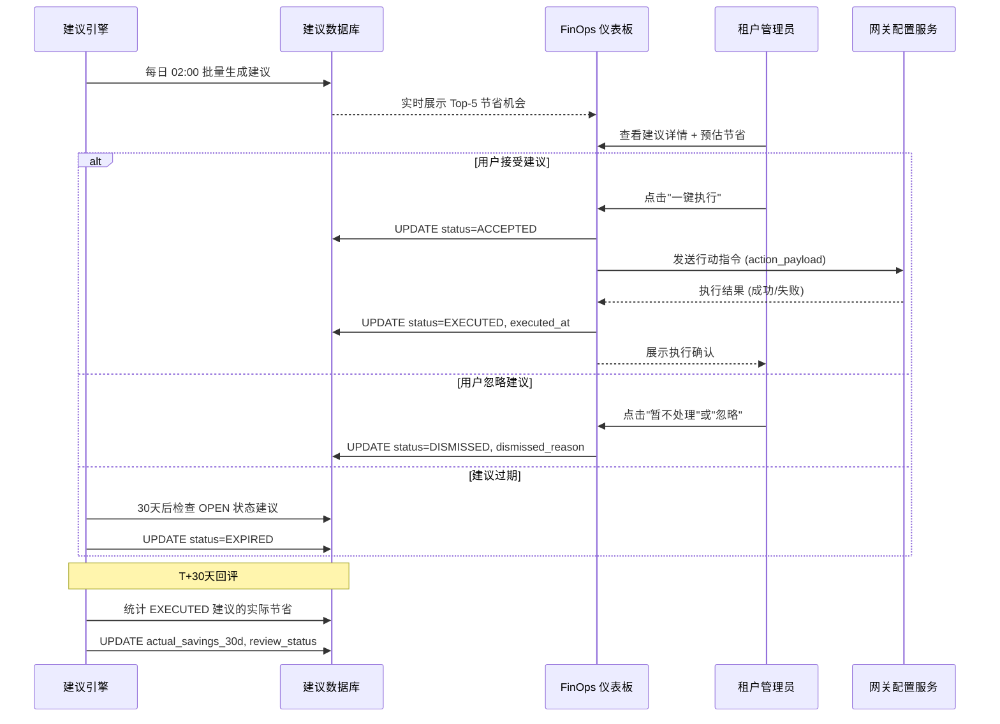
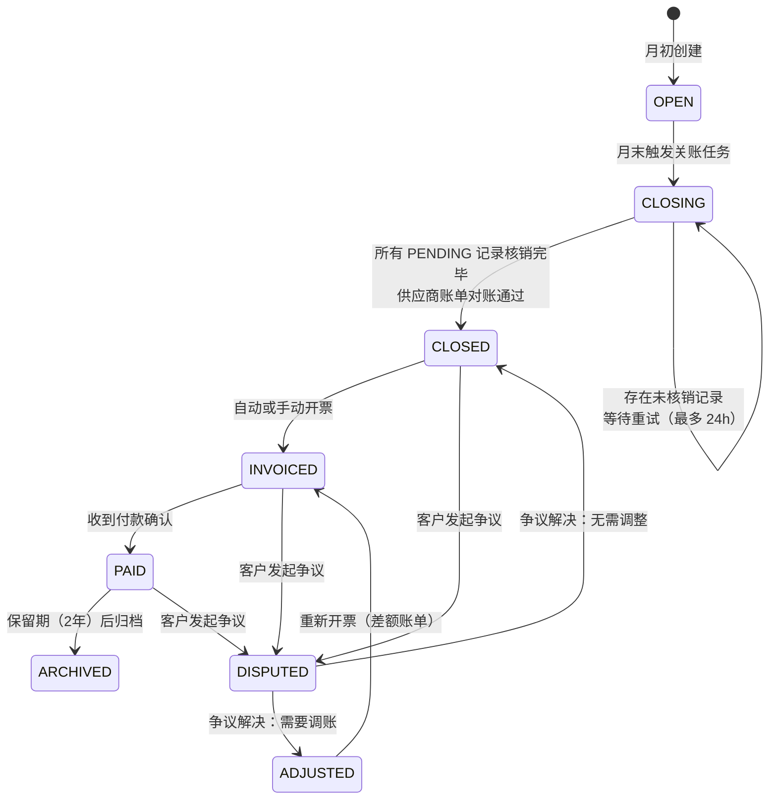
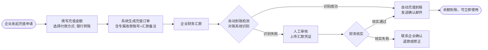

# 06 - 计费成本与 FinOps 规格

**文档版本**：V2.0.0  
**所属产品**：MaaS 平台 PRD V2.0  
**创建日期**：2026-05-21  
**负责人**：计费域 PM  
**审核人**：技术负责人 / 财务合规  
**状态**：草稿

---

## 目录

1. [计量与计费模型](#1-计量与计费模型)
2. [预算分层管理](#2-预算分层管理)
3. [FinOps 仪表板规格](#3-finops-仪表板规格)
4. [成本异常检测](#4-成本异常检测)
5. [成本节省建议引擎](#5-成本节省建议引擎)
6. [账单管理与对账](#6-账单管理与对账)
7. [合同定价规格](#7-合同定价规格)
8. [余额与额度管理](#8-余额与额度管理)
9. [计费 API 设计](#9-计费-api-设计)
10. [验收标准](#10-验收标准)

---

## 1. 计量与计费模型

### 1.1 概述与设计原则

MaaS 平台的计费体系是整个商业闭环的核心支柱。区别于传统 SaaS 按席位收费，LLM API 网关的计费粒度细至单次请求的 Token 消耗，且不同模型的定价差异可能达到数十倍甚至数百倍。因此，计费模型设计需要同时兼顾以下几个维度：

**精确性**：Token 计量必须与模型供应商保持强一致性，误差容忍度不超过 ±0.01%（每月累计）。系统须从请求层（网关捕获）、响应层（模型返回 usage 字段）和账单层（供应商月账单）三个维度进行三方比对，确保任意两方的差异均有审计轨迹。

**实时性**：余额扣减采用预扣-核销两阶段机制，预扣在请求发出前完成（P99 < 5ms），核销在响应回包后 1 秒内完成。对于流式响应（SSE），核销触发点为流结束事件或超时。

**可审计性**：每一笔计费记录（billing_ledger）须包含完整的因果链，可从一笔账单行项回溯至原始 HTTP 请求日志。所有价格变更须有版本快照，历史账单不受价格修改影响。

**灵活性**：支持按 Token 计费、按调用次数计费、按包月套餐计费、按合同约定阶梯价计费四种基础模型，以及组合计费（如：包月基础额度 + 超量按 Token 计费）。

**公平性**：Prompt Token 与 Completion Token 分别计量，音频、图片等多模态输入按等价 Token 单位折算后统一入账。Cached Token（KV Cache 命中）享受折扣定价，在账单上单独呈现。

### 1.2 Token 计量机制

#### 1.2.1 计量数据来源优先级

系统按以下优先级确定最终计量值：

1. **模型供应商 usage 字段**（最高优先级）：OpenAI、Anthropic 等主流供应商在响应体中返回 `usage.prompt_tokens`、`usage.completion_tokens`，系统以此为准，同时记录网关侧计算值作为对比。
2. **网关侧 Tokenizer 计算值**：对于不返回 usage 字段的供应商或本地部署模型，网关使用对应模型的 Tokenizer（tiktoken for GPT 系列、sentencepiece for Gemma/LLaMA 等）实时计算，计算结果异步写入，不阻塞响应链路。
3. **估算值**：当 Tokenizer 计算超时（>200ms）或不可用时，系统以字符数 / 4 作为估算值，并在账单记录中标注 `is_estimated = true`，后续批处理作业会尝试补算精确值。

#### 1.2.2 多模态 Token 折算规则

| 输入类型 | 折算规则 | 备注 |
|---------|---------|------|
| 文本 | 1:1，直接使用供应商 Token 数 | — |
| 图片（低分辨率）| 85 Token / 张（OpenAI 标准） | ≤ 512×512 |
| 图片（高分辨率）| 170 Token / 512px-tile | 按 tile 数累加 |
| 音频 | 1 Token / 0.1 秒 | Whisper 等语音模型 |
| 视频帧 | 按帧数 × 图片规则 | 采样率可配 |
| 文档（PDF）| 由供应商返回 Token 数 | 供应商处理后计量 |

#### 1.2.3 Cached Token 折扣

KV Cache 命中的 Token（Anthropic prompt caching、OpenAI 缓存输入）以独立字段 `cached_input_tokens` 记录，并以标准 Prompt Token 价格的 10%（可由合同覆盖）计入成本，在账单上单独列示为 `cached_token_amount`。

### 1.3 billing_ledger 表设计

`billing_ledger` 是计费系统的核心事实表，记录每次请求的完整计费快照。该表采用追加写入（Append-Only）模式，任何修正均通过冲销记录（`entry_type = REVERSAL`）+ 新记录实现，禁止更新已有行。

#### 1.3.1 DDL（PostgreSQL）

```sql
CREATE TABLE billing_ledger (
    -- 主键与标识
    id                          BIGSERIAL PRIMARY KEY,
    ledger_uuid                 UUID NOT NULL DEFAULT gen_random_uuid(),
    
    -- 关联关系
    tenant_id                   VARCHAR(64) NOT NULL,
    workspace_id                VARCHAR(64),
    app_id                      VARCHAR(64),
    api_key_id                  VARCHAR(128) NOT NULL,
    user_id                     VARCHAR(128),                          -- 终端用户（可选）
    
    -- 请求溯源
    request_id                  VARCHAR(128) NOT NULL,                 -- 网关请求唯一ID
    trace_id                    VARCHAR(128),                          -- 分布式追踪ID
    upstream_request_id         VARCHAR(256),                          -- 供应商侧请求ID
    
    -- 模型信息
    model_id                    VARCHAR(128) NOT NULL,                 -- 逻辑模型ID
    model_version               VARCHAR(64),                          -- 模型版本快照
    provider_id                 VARCHAR(64) NOT NULL,                  -- 供应商ID
    provider_model_id           VARCHAR(128) NOT NULL,                 -- 供应商原始模型名
    
    -- 计量数据
    prompt_tokens               INT NOT NULL DEFAULT 0,
    completion_tokens           INT NOT NULL DEFAULT 0,
    cached_input_tokens         INT NOT NULL DEFAULT 0,
    total_tokens                INT NOT NULL DEFAULT 0,
    is_estimated                BOOLEAN NOT NULL DEFAULT FALSE,        -- 是否为估算值
    is_stream                   BOOLEAN NOT NULL DEFAULT FALSE,
    
    -- 定价快照（写入时锁定，不随价格修改变动）
    price_version_id            VARCHAR(64) NOT NULL,                  -- 定价版本快照ID
    prompt_unit_price           NUMERIC(20, 10) NOT NULL,             -- 每Token单价(USD)
    completion_unit_price       NUMERIC(20, 10) NOT NULL,
    cached_unit_price           NUMERIC(20, 10) NOT NULL DEFAULT 0,
    currency                    CHAR(3) NOT NULL DEFAULT 'USD',
    
    -- 金额计算
    prompt_amount               NUMERIC(20, 6) NOT NULL,              -- = prompt_tokens * price
    completion_amount           NUMERIC(20, 6) NOT NULL,
    cached_token_amount         NUMERIC(20, 6) NOT NULL DEFAULT 0,
    discount_amount             NUMERIC(20, 6) NOT NULL DEFAULT 0,    -- 折扣减免
    gross_amount                NUMERIC(20, 6) NOT NULL,              -- 扣前总额
    net_amount                  NUMERIC(20, 6) NOT NULL,              -- 实扣金额
    
    -- 预扣与核销
    pre_deduct_amount           NUMERIC(20, 6),                       -- 预扣金额
    pre_deduct_at               TIMESTAMPTZ,
    settled_at                  TIMESTAMPTZ,                          -- 核销时间
    
    -- 账单归属
    billing_period              CHAR(7),                              -- 'YYYY-MM'
    bill_id                     BIGINT,                               -- 归属账单ID
    
    -- 入账类型
    entry_type                  VARCHAR(32) NOT NULL DEFAULT 'CHARGE', -- CHARGE/REVERSAL/ADJUSTMENT/FREE
    related_ledger_id           BIGINT,                               -- 冲销/调账关联原记录
    
    -- 预算关联
    budget_id                   BIGINT,                               -- 命中的预算策略ID
    budget_dimension            VARCHAR(32),                          -- 扣减的预算层级
    
    -- 请求时序
    request_at                  TIMESTAMPTZ NOT NULL,
    response_at                 TIMESTAMPTZ,
    latency_ms                  INT,
    
    -- HTTP元数据
    http_status                 SMALLINT,
    is_error                    BOOLEAN NOT NULL DEFAULT FALSE,
    error_code                  VARCHAR(64),
    
    -- 状态与审计
    status                      VARCHAR(32) NOT NULL DEFAULT 'SETTLED', -- PENDING/SETTLED/DISPUTED/VOID
    created_at                  TIMESTAMPTZ NOT NULL DEFAULT now(),
    updated_at                  TIMESTAMPTZ NOT NULL DEFAULT now(),
    created_by                  VARCHAR(64) DEFAULT 'system',
    
    -- 约束
    CONSTRAINT uq_ledger_request UNIQUE (request_id, entry_type),
    CONSTRAINT ck_entry_type CHECK (entry_type IN ('CHARGE','REVERSAL','ADJUSTMENT','FREE')),
    CONSTRAINT ck_status CHECK (status IN ('PENDING','SETTLED','DISPUTED','VOID'))
);

-- 索引
CREATE INDEX idx_bl_tenant_period  ON billing_ledger (tenant_id, billing_period);
CREATE INDEX idx_bl_app_period     ON billing_ledger (app_id, billing_period);
CREATE INDEX idx_bl_request_id     ON billing_ledger (request_id);
CREATE INDEX idx_bl_bill_id        ON billing_ledger (bill_id);
CREATE INDEX idx_bl_created_at     ON billing_ledger (created_at DESC);
CREATE INDEX idx_bl_model_period   ON billing_ledger (model_id, billing_period);
```

表字段合计：**34 个字段**，完整覆盖计量、定价、金额、审计、归属五个维度。

### 1.4 计费状态机

每笔请求的计费生命周期经历 `PENDING → SETTLED → (DISPUTED) → VOID` 的状态转移。



### 1.5 计费引擎架构要点

- **幂等性保障**：核销接口以 `request_id` 为幂等键，重复调用返回已有记录，不重复扣费。
- **精度策略**：所有金额字段使用 `NUMERIC(20,6)`，中间计算使用 `NUMERIC(20,10)`，最终入库前四舍五入至 6 位小数，防止浮点误差累积。
- **写扩展性**：`billing_ledger` 按 `billing_period`（月份）进行 Range 分区，每月自动创建新分区，历史分区可归档至冷存储（S3 + Parquet）。
- **并发控制**：余额扣减采用 PostgreSQL `SELECT ... FOR UPDATE SKIP LOCKED` + 行级锁，避免超扣。高并发场景下补充 Redis 令牌桶作为第一层防护。

---

## 2. 预算分层管理

### 2.1 设计目标

企业级客户对 AI 支出的管控诉求涵盖从集团到具体项目的多个层级。MaaS 平台的预算体系设计为**四层树形结构**，自顶向下依次为：租户（Tenant）→ 工作空间（Workspace）→ 应用（App）→ API Key，每一层既可独立设置预算，也可继承上层约束（取最严格者生效）。

### 2.2 四层预算层级模型

```
Tenant（月度总预算：$10,000）
├── Workspace A（月度预算：$4,000）
│   ├── App A-1（月度预算：$1,500）
│   │   ├── API Key a1-prod（日预算：$200）
│   │   └── API Key a1-test（月预算：$100）
│   └── App A-2（月度预算：$2,500）
└── Workspace B（月度预算：$6,000）
    └── App B-1（无独立限额，继承 Workspace B）
```

**层级约束规则**：
1. 子层级的预算上限不得超过父层级的剩余可分配额度。
2. 当父层级触发告警或限额时，子层级的消耗请求均受影响。
3. 子层级预算耗尽不影响同级其他子层级，但累计消耗会向上冒泡至父层级余额。

### 2.3 budget 表设计

```sql
CREATE TABLE budget (
    id                      BIGSERIAL PRIMARY KEY,
    budget_uuid             UUID NOT NULL DEFAULT gen_random_uuid(),
    
    -- 归属
    tenant_id               VARCHAR(64) NOT NULL,
    dimension               VARCHAR(32) NOT NULL,     -- TENANT/WORKSPACE/APP/API_KEY
    dimension_id            VARCHAR(128) NOT NULL,    -- 对应层级的实体ID
    parent_budget_id        BIGINT REFERENCES budget(id),
    
    -- 预算设置
    budget_name             VARCHAR(128) NOT NULL,
    budget_type             VARCHAR(32) NOT NULL,     -- MONTHLY/DAILY/WEEKLY/FIXED_PERIOD
    period_start            DATE,                     -- FIXED_PERIOD 起始日
    period_end              DATE,                     -- FIXED_PERIOD 截止日
    amount_limit            NUMERIC(20, 4) NOT NULL,  -- 预算上限
    currency                CHAR(3) NOT NULL DEFAULT 'USD',
    
    -- 告警阈值（多级，JSON数组）
    alert_thresholds        JSONB NOT NULL DEFAULT '[50, 80, 90, 100]',
    alert_channels          JSONB NOT NULL DEFAULT '["email"]', -- email/sms/webhook/dingtalk
    
    -- 超限策略
    over_limit_action       VARCHAR(32) NOT NULL DEFAULT 'ALERT',  -- ALERT/THROTTLE/BLOCK
    throttle_rate           NUMERIC(5,2),             -- 限流百分比（0-100）
    approval_required       BOOLEAN NOT NULL DEFAULT FALSE,
    auto_increase_enabled   BOOLEAN NOT NULL DEFAULT FALSE,
    auto_increase_amount    NUMERIC(20, 4),           -- 自动增额步长
    auto_increase_max       NUMERIC(20, 4),           -- 自动增额上限
    
    -- 当前周期状态（滚动更新）
    current_period          CHAR(7),                  -- 'YYYY-MM' or 'YYYY-MM-DD'
    consumed_amount         NUMERIC(20, 4) NOT NULL DEFAULT 0,
    reserved_amount         NUMERIC(20, 4) NOT NULL DEFAULT 0,   -- 预扣中未核销
    remaining_amount        NUMERIC(20, 4) NOT NULL DEFAULT 0,   -- 实时余额
    last_alert_threshold    INT,                      -- 已触发的最高阈值
    
    -- 模型/供应商过滤（可选）
    allowed_models          JSONB,                    -- null = 不限制
    blocked_models          JSONB,
    allowed_providers       JSONB,
    
    -- 状态
    status                  VARCHAR(32) NOT NULL DEFAULT 'ACTIVE', -- ACTIVE/PAUSED/EXPIRED
    is_deleted              BOOLEAN NOT NULL DEFAULT FALSE,
    
    -- 审计
    created_at              TIMESTAMPTZ NOT NULL DEFAULT now(),
    updated_at              TIMESTAMPTZ NOT NULL DEFAULT now(),
    created_by              VARCHAR(64) NOT NULL,
    last_modified_by        VARCHAR(64),
    version                 INT NOT NULL DEFAULT 1,   -- 乐观锁
    
    CONSTRAINT uq_budget_dim UNIQUE (tenant_id, dimension, dimension_id, budget_type, period_start),
    CONSTRAINT ck_dimension CHECK (dimension IN ('TENANT','WORKSPACE','APP','API_KEY')),
    CONSTRAINT ck_over_limit CHECK (over_limit_action IN ('ALERT','THROTTLE','BLOCK'))
);
```

表字段合计：**28 个字段**，覆盖配置、状态、告警、审计全链路。

### 2.4 告警级别定义

| 级别 | 默认阈值 | 告警文案 | 通知渠道 | 是否阻断请求 |
|-----|---------|---------|---------|------------|
| INFO | 50% | "预算已使用 50%，请关注消耗趋势" | 站内信 | 否 |
| WARNING | 80% | "预算告警：已消耗 80%，预计 N 天耗尽" | 邮件 + 站内信 | 否 |
| CRITICAL | 90% | "预算严重告警：仅剩 10%，请立即扩容或限流" | 邮件 + 短信 + DingTalk | 否 |
| EXHAUSTED | 100% | "预算已耗尽，超限请求将被拒绝/限流" | 全渠道 + 自动工单 | 取决于策略 |

**告警防重机制**：同一预算同一阈值 24 小时内最多触发 1 次通知，避免告警风暴。阈值一旦下降（如通过充值）后重新升至同级，再次触发。

### 2.5 超限审批流程



### 2.6 预算重置与结转规则

- **月度预算**：每月 1 日 00:00 UTC 自动重置，`consumed_amount` 归零，不结转上月未用额度（默认）。可通过 `carry_over_enabled` 配置开启结转，结转金额上限为 `amount_limit * carry_over_ratio`（默认 0.2，即最多结转 20%）。
- **固定周期预算**：到期后不自动续期，需手动或通过自动化规则创建下一周期预算。
- **日预算**：每日 00:00 UTC 重置，不支持结转。

---

## 3. FinOps 仪表板规格

### 3.1 总体布局

FinOps 仪表板面向两类用户：**租户管理员**（关注成本控制、预算执行）和**财务分析师**（关注账单核对、成本分摊）。仪表板采用 6 面板布局，支持时间范围筛选（今日 / 近 7 天 / 近 30 天 / 自定义）、租户 / 工作空间 / 应用 / 模型 / 供应商多维度下钻。

### 3.2 面板 P1：成本总览卡片组

**功能描述**：顶部 KPI 卡片，快速呈现当前周期的核心指标。

| 字段名 | 数据来源 | 计算逻辑 | 更新频率 |
|--------|---------|---------|---------|
| `total_cost_current_period` | billing_ledger 聚合 | SUM(net_amount) WHERE billing_period=当月 | 实时（延迟 ≤ 30s） |
| `cost_vs_last_period` | 月度汇总表 | (本月 - 上月) / 上月 × 100% | 1 分钟缓存 |
| `budget_utilization_rate` | budget 表 | consumed_amount / amount_limit × 100% | 实时 |
| `budget_days_remaining` | 预测模型 | remaining / (consumed / elapsed_days) | 5 分钟缓存 |
| `total_requests_current` | billing_ledger COUNT | COUNT(*) WHERE billing_period=当月 | 实时 |
| `avg_cost_per_request` | 计算字段 | total_cost / total_requests | 实时 |
| `top_cost_model` | GROUP BY 聚合 | 本月消耗金额最高的模型 | 5 分钟缓存 |
| `anomaly_alert_count` | 异常检测表 | 本月未处理异常告警数 | 1 分钟缓存 |

### 3.3 面板 P2：成本趋势折线图

**功能描述**：展示成本/Token 用量随时间变化趋势，支持按日/小时粒度切换。

| 字段名 | 数据来源 | 备注 | 更新频率 |
|--------|---------|------|---------|
| `time_bucket` | 时间维度 | 日粒度: DATE, 小时粒度: TIMESTAMPTZ | 聚合计算 |
| `cost_usd` | billing_ledger | SUM(net_amount) per bucket | 5 分钟预聚合 |
| `prompt_tokens_sum` | billing_ledger | SUM(prompt_tokens) | 5 分钟预聚合 |
| `completion_tokens_sum` | billing_ledger | SUM(completion_tokens) | 5 分钟预聚合 |
| `request_count` | billing_ledger | COUNT(*) | 5 分钟预聚合 |
| `error_rate` | billing_ledger | SUM(is_error)/COUNT(*) | 5 分钟预聚合 |
| `forecast_cost` | 预测引擎 | 基于 ARIMA 的未来 7 天预测 | 每小时刷新 |
| `budget_limit_line` | budget 表 | 当月预算上限水平参考线 | 实时 |

### 3.4 面板 P3：模型成本分布饼图/热力图

**功能描述**：展示不同模型、供应商的成本占比，支持树形图和表格两种视图。

| 字段名 | 数据来源 | 备注 | 更新频率 |
|--------|---------|------|---------|
| `model_id` | billing_ledger GROUP BY | — | 15 分钟缓存 |
| `provider_id` | billing_ledger GROUP BY | — | 15 分钟缓存 |
| `cost_share_pct` | 计算字段 | 该模型成本 / 总成本 | 15 分钟缓存 |
| `total_tokens` | billing_ledger SUM | prompt + completion | 15 分钟缓存 |
| `avg_latency_p99` | 请求日志 | P99 延迟 | 15 分钟缓存 |
| `cost_per_1k_tokens` | 计算字段 | cost / total_tokens * 1000 | 15 分钟缓存 |
| `mom_change` | 对比上月 | 月环比变化率 | 每日刷新 |

### 3.5 面板 P4：预算执行看板

**功能描述**：多层级预算进度条，红黄绿三色状态，实时显示各预算单元余额。

| 字段名 | 数据来源 | 备注 | 更新频率 |
|--------|---------|------|---------|
| `budget_id` | budget 表 | — | 实时 |
| `budget_name` | budget 表 | — | 实时 |
| `dimension` | budget 表 | — | 实时 |
| `consumed_pct` | budget 表计算 | consumed / limit | 实时（≤30s） |
| `remaining_amount` | budget 表 | — | 实时 |
| `status_color` | 规则引擎 | <50% 绿; 50-80% 黄; >80% 红 | 实时 |
| `projected_exhaust_date` | 预测引擎 | 预计耗尽日期 | 1 小时刷新 |
| `alert_triggered_levels` | 告警记录 | 本周期已触发告警级别 | 实时 |

### 3.6 面板 P5：成本分摊视图

**功能描述**：支持按 workspace / app / user_tag 等维度进行成本分摊分析，导出分摊报告。

| 字段名 | 数据来源 | 备注 | 更新频率 |
|--------|---------|------|---------|
| `allocation_dimension` | 用户选择 | workspace/app/label | 按需计算 |
| `dimension_id` | billing_ledger | — | 每日预聚合 |
| `dimension_name` | 元数据表 | — | 每日预聚合 |
| `cost_allocated` | billing_ledger SUM | 按维度聚合 | 每日 T+1 |
| `cost_shared` | 共享成本分摊规则 | 按规则分配 | 每日 T+1 |
| `cost_total` | 计算字段 | allocated + shared | 每日 T+1 |
| `share_of_total` | 计算字段 | — | 每日 T+1 |
| `yoy_change` | 对比去年同期 | — | 每日 T+1 |

### 3.7 面板 P6：节省机会摘要

**功能描述**：展示成本节省建议引擎输出的 Top 5 节省机会，附预计节省金额和执行状态。

| 字段名 | 数据来源 | 备注 | 更新频率 |
|--------|---------|------|---------|
| `recommendation_id` | savings_recommendation 表 | — | 每日刷新 |
| `recommendation_type` | 建议引擎 | 6 种类型见第 5 章 | 每日刷新 |
| `description` | 建议引擎生成 | — | 每日刷新 |
| `estimated_savings_usd` | 建议引擎计算 | — | 每日刷新 |
| `confidence_score` | ML 模型 | 0-1 置信度 | 每日刷新 |
| `status` | 建议表 | OPEN/ACCEPTED/DISMISSED | 实时 |
| `action_link` | 建议表 | 跳转执行链接 | — |

---

## 4. 成本异常检测

### 4.1 设计目标

成本异常检测的核心价值在于**早于账单发现成本失控**。传统月账单模式下，异常往往在月末才被发现，损失已无法挽回。MaaS 平台的异常检测引擎以**分钟级**为基础粒度，结合短期（1 小时）、中期（24 小时）、长期（30 天）三个时间窗口，实现对突发性、趋势性、结构性三类异常的全面覆盖。

### 4.2 五种典型异常场景

#### 场景 1：突发流量导致成本激增（Spike Detection）

**触发条件**：当前 1 小时内消耗超过近 7 天同小时均值的 300%，且绝对金额超过告警阈值（默认 $10）。

**典型原因**：
- 业务侧 Bug 导致循环调用（如无限重试）
- 压测流量误打到生产环境
- API Key 泄露导致的恶意调用
- 营销活动带来的合法流量峰值（需人工确认）

**检测算法**：Z-Score 检测，窗口 = 7 天 × 24 小时基线，阈值 Z > 3.0 触发告警。

#### 场景 2：成本持续爬升（Trend Drift Detection）

**触发条件**：连续 3 天日消耗环比增长 > 20%，且不存在对应的预算计划调整记录。

**典型原因**：
- 用户数量缓慢增长但未同步调整预算
- 某个应用改版后 Prompt 变长，Token 单价不变但用量增加
- 模型切换后到更贵的模型

**检测算法**：线性趋势回归 + Mann-Kendall 趋势检验，p-value < 0.05 判定为显著趋势。

#### 场景 3：模型分布异常（Model Distribution Anomaly）

**触发条件**：某模型在过去 1 小时的消耗占比超过历史 30 天 P95 占比的 200%。

**典型原因**：
- 路由策略 Bug 导致所有流量集中到单一（通常是最贵的）模型
- 某供应商降级后所有流量回退到默认模型

**检测算法**：KL 散度（Kullback-Leibler Divergence）检测模型分布漂移，KL > 0.5 告警。

#### 场景 4：低效调用模式（Inefficiency Detection）

**触发条件**：某应用/API Key 的 `completion_tokens / prompt_tokens` 比率连续 24 小时 < 0.05（大量输入 Token 换取极少输出），且调用量 > 1000 次。

**典型原因**：
- 使用高价模型执行简单分类/打标签任务（应使用轻量级模型）
- Prompt 工程问题导致大量冗余上下文
- 错误地将完整对话历史带入每次请求

**检测算法**：滑动窗口统计，超出历史 P5 分位数触发低效告警（非严重告警）。

#### 场景 5：跨预算层级穿透（Budget Penetration）

**触发条件**：某 API Key 当日消耗 > 其所属 App 预算的 50%（即单个 Key 占用超过半数预算）。

**典型原因**：
- 某个应用所有流量集中在一个 Key（健康分散度不足）
- 测试 Key 未设置独立低限额，消耗了业务预算

**检测算法**：实时比例计算，硬规则判断，无需 ML 模型。

### 4.3 三种检测算法详述

#### 算法 A：统计过程控制（Z-Score / 3σ 法则）

适用于场景 1（突发尖刺）。以过去 N 天同时段值构建基线分布，计算当前值的 Z 分数：

$$Z = \frac{x - \mu}{\sigma}$$

其中 $\mu$ 为历史均值，$\sigma$ 为历史标准差。当 $|Z| > 3$ 时触发告警。对于数据量不足（< 7 天历史）的新应用，采用绝对阈值（消耗 > $5/hour）兜底。

**优点**：计算简单、实时性好；**缺点**：对持续高消耗不敏感（高位均值导致 σ 大）。

#### 算法 B：时间序列异常检测（Prophet + 残差检验）

适用于场景 2（趋势漂移）。使用 Facebook Prophet 对历史日消耗时间序列进行建模，提取趋势项 $T(t)$、季节项 $S(t)$（周季节性）和节假日效应 $H(t)$：

$$y(t) = T(t) + S(t) + H(t) + \varepsilon(t)$$

计算残差 $\varepsilon(t)$，若连续多日残差为正且显著（t 检验 p < 0.05），判定为趋势上升异常。该算法每日 03:00 UTC 批处理运行，不要求实时。

**优点**：能捕捉季节性，误报率低；**缺点**：需要至少 30 天历史数据，冷启动期依赖 Z-Score 兜底。

#### 算法 C：分布散度检测（KL 散度）

适用于场景 3（模型分布异常）。设历史 30 天各模型消耗占比为参考分布 $P$，当前 1 小时占比为观测分布 $Q$：

$$KL(P \| Q) = \sum_{i} P(i) \log \frac{P(i)}{Q(i)}$$

$KL > 0.5$ 触发 WARNING，$KL > 1.0$ 触发 CRITICAL。为避免零概率问题，对所有模型加 Laplace 平滑（$\epsilon = 0.001$）。

### 4.4 异常处置流程



### 4.5 cost_anomaly 表设计

```sql
CREATE TABLE cost_anomaly (
    id              BIGSERIAL PRIMARY KEY,
    anomaly_uuid    UUID NOT NULL DEFAULT gen_random_uuid(),
    tenant_id       VARCHAR(64) NOT NULL,
    anomaly_type    VARCHAR(64) NOT NULL,   -- SPIKE/TREND_DRIFT/MODEL_DIST/INEFFICIENCY/BUDGET_PENETRATION
    severity        VARCHAR(16) NOT NULL,   -- LOW/MEDIUM/HIGH/CRITICAL
    dimension       VARCHAR(32),
    dimension_id    VARCHAR(128),
    detected_value  NUMERIC(20,6),
    baseline_value  NUMERIC(20,6),
    deviation_pct   NUMERIC(10,4),
    algorithm_used  VARCHAR(64),
    detected_at     TIMESTAMPTZ NOT NULL DEFAULT now(),
    status          VARCHAR(32) NOT NULL DEFAULT 'OPEN', -- OPEN/ACKNOWLEDGED/RESOLVED/FALSE_POSITIVE
    resolution      TEXT,
    resolved_at     TIMESTAMPTZ,
    resolved_by     VARCHAR(64),
    alert_sent_at   TIMESTAMPTZ,
    created_at      TIMESTAMPTZ NOT NULL DEFAULT now()
);
```

---

## 5. 成本节省建议引擎

### 5.1 引擎定位

成本节省建议引擎（Savings Recommendation Engine，SRE）是 FinOps 仪表板的"智能顾问"模块。与异常检测侧重于发现问题不同，SRE 的目标是**主动发现优化机会**，量化节省潜力，并提供一键执行的行动路径。SRE 每日凌晨 02:00 UTC 运行全量分析，并在检测到高置信度机会时实时推送。

### 5.2 六种节省类型

#### 类型 S1：模型降级建议（Model Downgrade）

**发现逻辑**：分析某应用使用高价模型（如 GPT-4o）处理的任务，通过对响应的语义复杂度评分（基于输出 Token 数、句法树深度、专业词汇比例），判断该任务是否可由低价模型（如 GPT-4o-mini、Qwen-Turbo）同等完成。

**量化方法**：`estimated_savings = (高价模型单价 - 低价模型单价) × 近30天Token用量`

**置信度依据**：任务复杂度分布 + A/B 测试历史数据（若存在）。

**行动路径**：一键创建路由规则，按 Task Type 路由低复杂度请求至推荐模型，保留高复杂度请求使用原模型。

#### 类型 S2：Prompt 缓存优化（Prompt Caching）

**发现逻辑**：检测同一 API Key 的请求中，Prompt 前缀重复率 > 70%（通过前 N Token 哈希统计），且该 Key 使用的模型支持 Prompt Caching（Anthropic Claude / OpenAI）。

**量化方法**：`estimated_savings = 重复前缀Token数 × (1 - cached_token_折扣率) × prompt_unit_price × 请求频率`

**行动路径**：提供代码示例，指导用户在请求中添加 `cache_control` 标记，或自动在网关层注入缓存头。

#### 类型 S3：批处理整合（Batch API）

**发现逻辑**：发现某应用在非实时场景（平均响应时间容忍度 > 5 分钟，通过 SLA 标签识别）使用了实时 API，而对应供应商提供 Batch API（如 OpenAI Batch，通常 50% 折扣）。

**量化方法**：`estimated_savings = 近30天该应用消耗 × 50%（批量折扣率）`

**行动路径**：跳转至网关路由配置，为该应用创建批处理路由策略，配置最大等待时间。

#### 类型 S4：包月套餐切换建议（Commitment Purchase）

**发现逻辑**：某模型过去 90 天的日均消耗稳定（变异系数 CV < 0.3），且按量消耗费用已超过该模型包月套餐价格的 120%。

**量化方法**：`estimated_savings = (按量费用 - 包月费用) × 12（月）`

**行动路径**：跳转至合同管理页，生成包月采购草案，发起审批。

#### 类型 S5：废弃 API Key 清理（Idle Key Cleanup）

**发现逻辑**：某 API Key 在过去 30 天内未产生任何消耗，但其预算配额占用了父级预算的 > 10%（锁定了预算空间）。

**量化方法**：`freed_budget = key的预算上限`（非直接金额节省，而是预算释放价值）

**行动路径**：一键禁用或删除 API Key，释放预算配额。

#### 类型 S6：上下文压缩建议（Context Compression）

**发现逻辑**：检测到某应用的对话类请求中，`prompt_tokens > 8000` 的比例 > 40%，且这些请求中存在大量重复对话历史（通过 Token 去重比率估算），推测 Prompt 冗余率 > 50%。

**量化方法**：`estimated_savings = 近30天prompt_tokens × 30%（压缩率估算）× prompt_unit_price`

**行动路径**：推荐启用网关层摘要压缩中间件，或提供 LangChain ConversationSummaryMemory 集成代码示例。

### 5.3 savings_recommendation 数据模型

```sql
CREATE TABLE savings_recommendation (
    id                      BIGSERIAL PRIMARY KEY,
    recommendation_uuid     UUID NOT NULL DEFAULT gen_random_uuid(),
    tenant_id               VARCHAR(64) NOT NULL,
    recommendation_type     VARCHAR(32) NOT NULL,     -- S1-S6 类型码
    title                   VARCHAR(256) NOT NULL,
    description             TEXT NOT NULL,
    
    -- 影响范围
    affected_dimension      VARCHAR(32),              -- APP/API_KEY/MODEL
    affected_dimension_id   VARCHAR(128),
    affected_model_id       VARCHAR(128),
    affected_provider_id    VARCHAR(64),
    
    -- 量化数据
    analysis_period_days    INT NOT NULL DEFAULT 30,
    current_monthly_cost    NUMERIC(20,4),
    estimated_monthly_savings NUMERIC(20,4),
    estimated_annual_savings  NUMERIC(20,4),
    savings_confidence      NUMERIC(5,4),             -- 0-1置信度
    
    -- 行动配置
    action_type             VARCHAR(64),              -- CREATE_ROUTE/ENABLE_CACHE/CONTACT_SALES/...
    action_payload          JSONB,                    -- 行动所需参数
    action_link             VARCHAR(512),
    
    -- 状态
    status                  VARCHAR(32) NOT NULL DEFAULT 'OPEN', -- OPEN/ACCEPTED/DISMISSED/EXECUTED/EXPIRED
    dismissed_reason        TEXT,
    accepted_at             TIMESTAMPTZ,
    executed_at             TIMESTAMPTZ,
    expires_at              TIMESTAMPTZ,
    
    -- 执行结果追踪（T+30天回评）
    actual_savings_30d      NUMERIC(20,4),
    review_status           VARCHAR(32),              -- PENDING/EFFECTIVE/INEFFECTIVE
    
    -- 审计
    generated_at            TIMESTAMPTZ NOT NULL DEFAULT now(),
    generated_by            VARCHAR(64) NOT NULL DEFAULT 'sre-engine',
    created_at              TIMESTAMPTZ NOT NULL DEFAULT now()
);
```

### 5.4 建议转行动流程



---

## 6. 账单管理与对账

### 6.1 账单生命周期

MaaS 平台的账单管理采用**月度周期账单**为基础单元，同时支持实时账单视图（当月未关账的滚动账单）。账单生命周期经历以下状态：

**OPEN（开放中）** → **CLOSING（关账中）** → **CLOSED（已关账）** → **INVOICED（已开票）** → **PAID（已付款）** → **ARCHIVED（已归档）**

异常分支：**DISPUTED（争议中）**，可从 CLOSED/INVOICED/PAID 进入，解决后回归主线流程。

### 6.2 账单状态机



### 6.3 对账差异处理

每月关账前，系统自动执行**三方对账**：

1. **MaaS内部账单** vs **供应商账单**：比对每个供应商渠道的消耗金额，允许误差 ±0.5%（源于汇率换算和 Tokenizer 差异）。
2. **MaaS内部账单** vs **客户记账系统**（可选）：通过 Webhook 推送对账数据，客户可在 7 天内提出争议。
3. **billing_ledger汇总** vs **bill（月账单头）**：验证明细汇总等于账单总额，确保无数据遗漏。

**对账差异分类与处置**：

| 差异类型 | 允许阈值 | 自动处置 | 人工介入条件 |
|---------|---------|---------|------------|
| 金额差异（小差异）| ±0.5% 且 < $5 | 冲销入账，标注 `MINOR_RECONCILE` | 无需 |
| 金额差异（大差异）| > 0.5% 或 > $5 | 暂停关账，触发对账工单 | 必须 |
| Token 数差异 | ±1% | 记录差异日志，不调整金额 | > 1% 时人工 |
| 记录缺失 | 供应商有，本地无 | 尝试从 trace 日志重建 | 重建失败时人工 |
| 重复计费 | 本地有两条，供应商一条 | 自动冲销重复记录 | 金额 > $100 时人工确认 |

### 6.4 bill_reconciliation 表设计

```sql
CREATE TABLE bill_reconciliation (
    id                      BIGSERIAL PRIMARY KEY,
    reconciliation_uuid     UUID NOT NULL DEFAULT gen_random_uuid(),
    
    -- 对账主体
    bill_id                 BIGINT NOT NULL,
    tenant_id               VARCHAR(64) NOT NULL,
    billing_period          CHAR(7) NOT NULL,
    provider_id             VARCHAR(64),               -- null = 内部对账
    
    -- 对账数据
    recon_type              VARCHAR(32) NOT NULL,       -- INTERNAL/VENDOR/CLIENT
    maas_amount             NUMERIC(20,6) NOT NULL,
    vendor_amount           NUMERIC(20,6),
    client_amount           NUMERIC(20,6),
    
    -- 差异分析
    amount_diff             NUMERIC(20,6),              -- vendor - maas
    diff_pct                NUMERIC(10,6),
    token_diff_prompt       BIGINT,
    token_diff_completion   BIGINT,
    
    -- 处置
    diff_category           VARCHAR(64),               -- MINOR/MAJOR/MISSING/DUPLICATE/RATE_DIFF
    auto_resolved           BOOLEAN NOT NULL DEFAULT FALSE,
    resolution_action       VARCHAR(64),               -- WRITE_OFF/ADJUSTMENT/PENDING
    adjustment_ledger_id    BIGINT REFERENCES billing_ledger(id),
    
    -- 状态
    status                  VARCHAR(32) NOT NULL DEFAULT 'PENDING',
    started_at              TIMESTAMPTZ NOT NULL DEFAULT now(),
    completed_at            TIMESTAMPTZ,
    completed_by            VARCHAR(64),
    notes                   TEXT,
    
    -- 审计
    created_at              TIMESTAMPTZ NOT NULL DEFAULT now(),
    updated_at              TIMESTAMPTZ NOT NULL DEFAULT now()
);
```

### 6.5 调账规则

调账（Adjustment）是指对已关账账单进行事后修正的操作，分为以下四类：

**① 信用调整（Credit）**：因系统故障、服务中断等原因给予客户费用减免。需填写调整原因、减免金额、关联故障工单号。减免通过插入 `entry_type=ADJUSTMENT` 的 billing_ledger 记录实现，净额为负。

**② 借记调整（Debit）**：因计费低估（如 Tokenizer Bug 导致少收费用）而补收差额。金额 > $100 的借记调整须经客户确认后方可执行。

**③ 套餐兑换（Entitlement）**：将包月套餐额度折算为 billing_ledger 中的 FREE 记录，用于抵扣按量消耗。

**④ 合同价差调整（Contract True-Up）**：在合同周期结束时，按约定阶梯价格重新计算实际应付金额与已收金额之差，生成 True-Up 账单行。

所有调账操作须满足：**双人复核**（金额 > $500）、**自动生成审计日志**、**触发下游开票系统同步**。

---

## 7. 合同定价规格

### 7.1 合同定价体系概述

MaaS 平台的定价分为三个层次：

1. **公开标价（List Price）**：面向所有用户的默认单价，在价格页面公开展示，随供应商调价动态更新。
2. **协议折扣价（Negotiated Price）**：通过合同约定的折扣比例或固定单价，适用于年度承诺用量 > $10,000 的企业客户。折扣覆盖指定模型列表，可精细到 Prompt/Completion Token 各自的折扣率。
3. **阶梯价格（Volume Tier Price）**：用量越大单价越低，在合同中定义消耗区间和对应单价。阶梯价格有两种计算模式：**累计阶梯**（整体用量适用对应阶梯价）和**分段阶梯**（各区间内的用量按各自价格计算，最终求和）。

### 7.2 tenant_contract 表设计

```sql
CREATE TABLE tenant_contract (
    id                      BIGSERIAL PRIMARY KEY,
    contract_uuid           UUID NOT NULL DEFAULT gen_random_uuid(),
    
    -- 合同基本信息
    tenant_id               VARCHAR(64) NOT NULL,
    contract_name           VARCHAR(256) NOT NULL,
    contract_code           VARCHAR(64) UNIQUE,         -- 合同编号
    contract_type           VARCHAR(32) NOT NULL,        -- STANDARD/ENTERPRISE/PILOT/MSA
    
    -- 合同期限
    effective_date          DATE NOT NULL,
    expiry_date             DATE NOT NULL,
    auto_renew              BOOLEAN NOT NULL DEFAULT FALSE,
    renewal_notice_days     INT DEFAULT 60,
    
    -- 承诺用量与最小消费
    committed_spend_usd     NUMERIC(20,4),               -- 承诺年消费金额（USD）
    minimum_monthly_spend   NUMERIC(20,4),               -- 最低月消费（低于则补差）
    
    -- 结算设置
    billing_cycle           VARCHAR(32) NOT NULL DEFAULT 'MONTHLY', -- MONTHLY/QUARTERLY/ANNUAL
    payment_terms_days      INT NOT NULL DEFAULT 30,     -- 账期（天）
    currency                CHAR(3) NOT NULL DEFAULT 'USD',
    invoice_currency        CHAR(3) DEFAULT 'CNY',       -- 开票币种
    exchange_rate_source    VARCHAR(64) DEFAULT 'PBOC',  -- 汇率来源
    
    -- 全局折扣（在模型级订阅之上叠加）
    global_discount_pct     NUMERIC(5,4) DEFAULT 0,      -- 0-1, 0=无折扣
    
    -- 增值服务
    includes_support        VARCHAR(32) DEFAULT 'STANDARD', -- STANDARD/PRIORITY/DEDICATED
    includes_sla_credits    BOOLEAN DEFAULT FALSE,
    custom_sla_uptime_pct   NUMERIC(6,4),
    
    -- 合同状态
    status                  VARCHAR(32) NOT NULL DEFAULT 'DRAFT', -- DRAFT/ACTIVE/EXPIRED/TERMINATED/SUSPENDED
    terminated_reason       TEXT,
    terminated_at           TIMESTAMPTZ,
    
    -- 文档
    contract_doc_url        VARCHAR(512),
    signed_at               DATE,
    signed_by_tenant        VARCHAR(128),
    signed_by_vendor        VARCHAR(128),
    
    -- 审计
    created_at              TIMESTAMPTZ NOT NULL DEFAULT now(),
    updated_at              TIMESTAMPTZ NOT NULL DEFAULT now(),
    created_by              VARCHAR(64) NOT NULL,
    last_modified_by        VARCHAR(64),
    
    CONSTRAINT ck_contract_type CHECK (contract_type IN ('STANDARD','ENTERPRISE','PILOT','MSA')),
    CONSTRAINT ck_contract_status CHECK (status IN ('DRAFT','ACTIVE','EXPIRED','TERMINATED','SUSPENDED'))
);
```

### 7.3 contract_model_subscription 表设计

每份合同可订阅多个模型，每个模型订阅记录包含该模型的专属定价规则：

```sql
CREATE TABLE contract_model_subscription (
    id                      BIGSERIAL PRIMARY KEY,
    contract_id             BIGINT NOT NULL REFERENCES tenant_contract(id),
    tenant_id               VARCHAR(64) NOT NULL,
    
    -- 模型范围
    model_scope             VARCHAR(32) NOT NULL DEFAULT 'SPECIFIC', -- SPECIFIC/PROVIDER/ALL
    model_id                VARCHAR(128),                -- SPECIFIC时必填
    provider_id             VARCHAR(64),                 -- PROVIDER时必填
    
    -- 定价模式
    pricing_mode            VARCHAR(32) NOT NULL DEFAULT 'DISCOUNT', -- DISCOUNT/FIXED/TIERED/PACKAGE
    
    -- 折扣模式
    prompt_discount_pct     NUMERIC(5,4) DEFAULT 0,      -- 0-1
    completion_discount_pct NUMERIC(5,4) DEFAULT 0,
    cached_discount_pct     NUMERIC(5,4) DEFAULT 0,
    
    -- 固定单价模式
    fixed_prompt_price      NUMERIC(20,10),             -- 每Token USD
    fixed_completion_price  NUMERIC(20,10),
    
    -- 阶梯价格（JSON，见下方格式说明）
    tier_pricing_rules      JSONB,
    tier_mode               VARCHAR(32) DEFAULT 'GRADUATED', -- GRADUATED/VOLUME
    
    -- 包量套餐
    package_tokens          BIGINT,                      -- 包含Token数
    package_price_usd       NUMERIC(20,4),               -- 套餐价格
    package_overage_mode    VARCHAR(32) DEFAULT 'LIST_PRICE', -- 超量计价模式
    
    -- 有效期（可覆盖合同期）
    effective_date          DATE,
    expiry_date             DATE,
    
    -- 状态
    status                  VARCHAR(32) NOT NULL DEFAULT 'ACTIVE',
    priority                INT NOT NULL DEFAULT 100,    -- 多规则优先级，越小越优先
    
    created_at              TIMESTAMPTZ NOT NULL DEFAULT now(),
    updated_at              TIMESTAMPTZ NOT NULL DEFAULT now()
);
```

### 7.4 阶梯价格规则 JSON 格式说明

`tier_pricing_rules` 字段存储阶梯价格配置，格式如下：

```json
{
  "token_type": "COMBINED",
  "tiers": [
    {"from": 0,          "to": 1000000,    "prompt_price": 0.000003, "completion_price": 0.000012},
    {"from": 1000000,    "to": 10000000,   "prompt_price": 0.0000025,"completion_price": 0.00001},
    {"from": 10000000,   "to": 100000000,  "prompt_price": 0.000002, "completion_price": 0.000008},
    {"from": 100000000,  "to": null,       "prompt_price": 0.0000015,"completion_price": 0.000006}
  ],
  "reset_period": "MONTHLY",
  "tier_calculation": "GRADUATED"
}
```

**字段说明**：
- `token_type`：阶梯统计维度，`COMBINED`（Prompt+Completion合并）或 `SEPARATE`（各自独立阶梯）。
- `from/to`：Token 用量区间（`null` 表示无上限）。
- `reset_period`：阶梯重置周期（`MONTHLY` / `QUARTERLY` / `ANNUALLY`）。
- `tier_calculation`：`GRADUATED`（分段计算，各区间内用量乘以对应单价）或 `VOLUME`（整体用量按达到的阶梯单价计算）。

---

## 8. 余额与额度管理

### 8.1 余额体系设计

MaaS 平台支持三种余额/额度类型，优先级（扣减顺序）如下：

| 优先级 | 额度类型 | 说明 | 过期规则 |
|-------|---------|------|---------|
| 1（最高）| 赠送额度（Gift Credits） | 注册赠送、活动赠送，有有效期 | 到期清零，不退现金 |
| 2 | 充值余额（Prepaid Balance） | 预付费充值，无有效期 | 不过期，可退款（扣手续费） |
| 3（最低）| 合同信用额度（Contract Credit Line） | 后付费合同约定的月度信用额度 | 按月重置，不累计 |

**扣费顺序实现**：计费引擎在核销时按优先级依次扣减各余额池，直至扣完实际消耗金额。若合计余额不足（按量计费且无信用额度），请求在预扣阶段被拒绝（HTTP 402）。

### 8.2 余额预警规则

| 预警类型 | 触发条件 | 通知渠道 | 是否阻断 |
|---------|---------|---------|---------|
| 低余额提醒 | 充值余额 < $10 或 < 月均消耗的 3 天量 | 站内信 + 邮件 | 否 |
| 极低余额警告 | 充值余额 < $2 或预计 24h 内耗尽 | 邮件 + 短信 | 否 |
| 余额耗尽通知 | 充值余额 = 0 且无合同信用额度 | 全渠道 | 是（仅赠送额度也耗尽时） |
| 赠送额度到期提醒 | 到期前 7 天 / 3 天 / 1 天 | 站内信 + 邮件 | 否 |

### 8.3 对公充值流程

企业用户（对公汇款）的充值流程需走财务审核，不同于个人用户的即时支付。



### 8.4 退款规则

| 退款类型 | 触发条件 | 退款金额 | 处理时效 |
|---------|---------|---------|---------|
| 充值余额退款 | 用户主动申请，余额 > $0 | 余额全额 - 手续费（1%，最高 $50） | T+5 工作日 |
| 账户注销退款 | 账户注销且余额 > $1 | 全额退款，无手续费 | T+10 工作日 |
| 赠送额度退款 | **不支持退款** | — | — |
| 合同信用额度退款 | 合同提前终止时按剩余月份比例 | 按合同约定 | 合同条款约定 |
| 故障补偿 | SLA 未达标触发 credit | 按 SLA 文档计算，以 Credits 形式返还 | T+3 工作日 |

---

## 9. 计费 API 设计

### 9.1 核心接口列表

| 接口 | 方法 | 路径 | 描述 | 权限 |
|-----|-----|-----|-----|-----|
| 查询账单列表 | GET | `/v1/billing/bills` | 分页查询账单，支持多维筛选 | tenant:billing:read |
| 查询账单明细 | GET | `/v1/billing/bills/{bill_id}/ledger` | 查询账单下的 billing_ledger 记录 | tenant:billing:read |
| 查询实时消耗 | GET | `/v1/billing/usage/realtime` | 当日/当月实时消耗汇总 | tenant:billing:read |
| 查询余额 | GET | `/v1/billing/balance` | 查询各余额池余额 | tenant:billing:read |
| 查询预算状态 | GET | `/v1/billing/budgets` | 查询预算列表及执行状态 | tenant:billing:read |
| 创建预算 | POST | `/v1/billing/budgets` | 创建新预算策略 | tenant:billing:write |
| 更新预算 | PUT | `/v1/billing/budgets/{budget_id}` | 修改预算配置 | tenant:billing:write |
| 查询节省建议 | GET | `/v1/billing/savings-recommendations` | 获取当前活跃节省建议 | tenant:billing:read |
| 执行节省建议 | POST | `/v1/billing/savings-recommendations/{id}/execute` | 一键执行建议 | tenant:billing:write |
| 发起争议 | POST | `/v1/billing/bills/{bill_id}/disputes` | 对账单发起争议 | tenant:billing:dispute |
| 导出账单 | POST | `/v1/billing/bills/{bill_id}/export` | 异步导出 CSV/XLSX | tenant:billing:read |

### 9.2 关键接口示例

**查询实时消耗响应示例**：

```json
{
  "code": 0,
  "data": {
    "period": "2026-05",
    "as_of": "2026-05-21T14:30:00Z",
    "total_cost_usd": 1234.56,
    "total_tokens": 987654321,
    "budget_utilization": {
      "limit": 5000.00,
      "consumed": 1234.56,
      "utilization_pct": 24.69
    },
    "top_models": [
      {"model_id": "gpt-4o", "cost": 876.54, "tokens": 500000000},
      {"model_id": "claude-3-5-sonnet", "cost": 234.56, "tokens": 200000000}
    ]
  }
}
```

### 9.3 Webhook 事件

计费系统对外发布以下 Webhook 事件，支持客户系统集成：

| 事件名称 | 触发时机 | Payload 关键字段 |
|---------|---------|----------------|
| `billing.budget.threshold_reached` | 预算阈值触发 | budget_id, threshold_pct, consumed, remaining |
| `billing.budget.exhausted` | 预算耗尽 | budget_id, over_limit_action |
| `billing.anomaly.detected` | 成本异常检测触发 | anomaly_type, severity, deviation_pct |
| `billing.bill.closed` | 月账单关账 | bill_id, billing_period, total_amount |
| `billing.balance.low` | 余额低预警 | balance_type, current_balance, threshold |

---

## 10. 验收标准

### 10.1 功能验收标准

| 功能模块 | 验收条件 | 验收方法 |
|---------|---------|---------|
| Token 计量精度 | 与供应商账单误差 ≤ 0.01%（月累计） | 对比测试：发送 1000 次已知 Token 数的请求，比对本地计量与供应商 usage 字段 |
| 预扣响应时间 | P99 < 5ms（在 QPS=500 下） | 压测：并发 500 请求，统计预扣延迟分布 |
| 核销时效 | 正常响应核销 ≤ 1s，流式响应核销 ≤ 3s | 端到端时序测试 |
| 预算告警准确性 | 告警触发延迟 ≤ 60s（从超阈值到通知送达）| 构造超限场景，测量通知送达时间 |
| 对账完整性 | billing_ledger 汇总与月账单头总额误差 = 0 | 月末对账脚本：SUM(ledger) = bill.total_amount |
| 异常检测召回率 | 已知异常场景的检测召回率 ≥ 90% | 注入 5 种标准异常场景，验证检测结果 |
| 节省建议准确性 | 建议执行后 T+30 天实际节省 ≥ 估算的 60% | A/B 回评：统计 30 天内 EXECUTED 建议的实际效果 |
| 账单导出时效 | 月账单（< 100 万行）导出 ≤ 5 分钟 | 功能测试：触发导出，计时至文件可下载 |

### 10.2 性能验收标准

| 指标 | 目标值 | 测试场景 |
|-----|-------|---------|
| billing_ledger 写入吞吐 | ≥ 10,000 TPS | 并发写入压测，持续 10 分钟 |
| 实时消耗查询响应时间 | P99 < 200ms | 并发 100 查询，持续 5 分钟 |
| FinOps 仪表板首屏加载 | < 3s（含 6 个面板数据） | 模拟 50 并发用户打开仪表板 |
| 月度对账任务执行时间 | < 30 分钟（含 1000 万条记录） | 生产环境数据量压测 |
| 异常检测端到端延迟 | < 5 分钟（从异常发生到告警发出） | 注入模拟异常，计时至告警 |

### 10.3 安全与合规验收标准

- **数据脱敏**：API Key 在所有账单展示页面只显示末 4 位，全文仅在审计日志中以加密形式存储。
- **访问控制**：账单数据接口须验证租户隔离，不同租户的账单数据严格隔离，通过渗透测试验证越权访问为 0。
- **审计日志**：所有调账操作（ADJUSTMENT 类型记录）须有完整的 `created_by`、`approved_by`、时间戳，满足金融合规（ISO 27001 / SOC2）审计要求。
- **数据保留**：billing_ledger 数据保留 ≥ 7 年（中国会计法要求），合规归档至不可篡改的冷存储。
- **幂等性**：计费核销接口通过重复调用测试，100 次重复请求只产生 1 条有效记录。

### 10.4 验收里程碑

| 里程碑 | 目标日期 | 交付物 |
|-------|---------|-------|
| M1：计费引擎基础功能上线 | Sprint 6 结束 | billing_ledger 写入、预扣核销、余额管理 |
| M2：预算管理功能上线 | Sprint 8 结束 | 四层预算、告警通知、超限策略 |
| M3：FinOps 仪表板 Beta | Sprint 10 结束 | P1-P4 面板可用，数据 T+5 分钟刷新 |
| M4：账单对账与导出 | Sprint 12 结束 | 月度对账流程、账单导出、开票集成 |
| M5：异常检测与建议引擎 | Sprint 14 结束 | 5 种异常场景、6 种建议类型、回评机制 |
| M6：合同定价与 True-Up | Sprint 16 结束 | 合同管理、阶梯定价、True-Up 账单 |
| M7：全量生产验收 | Sprint 18 结束 | 通过所有验收标准，安全审计通过 |

---

*本文档为 MaaS 平台 PRD V2.0 子文档，详细计费域技术实现参见《微服务设计/05-billing-auth-service详细设计.md》；账单域术语定义参见《产品设计/账单域术语对照表.md》；计费相关 API 接口详细规范参见《开发/API接口设计文档.md》。*
