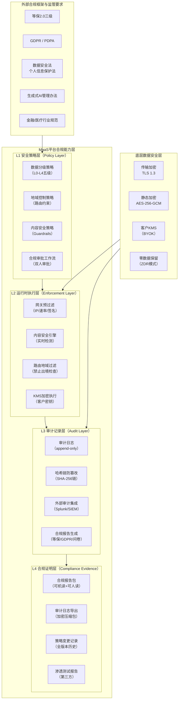
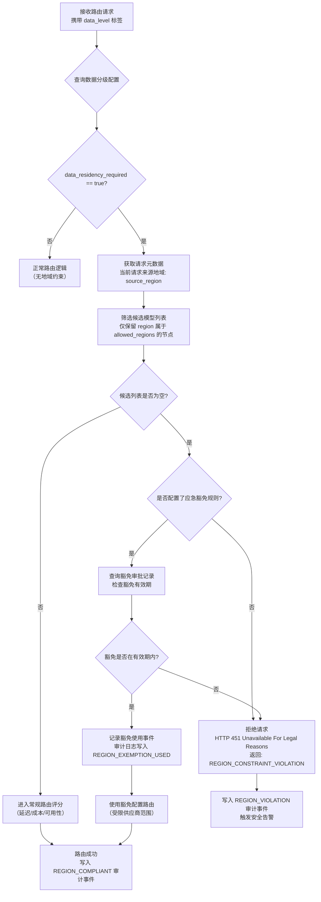
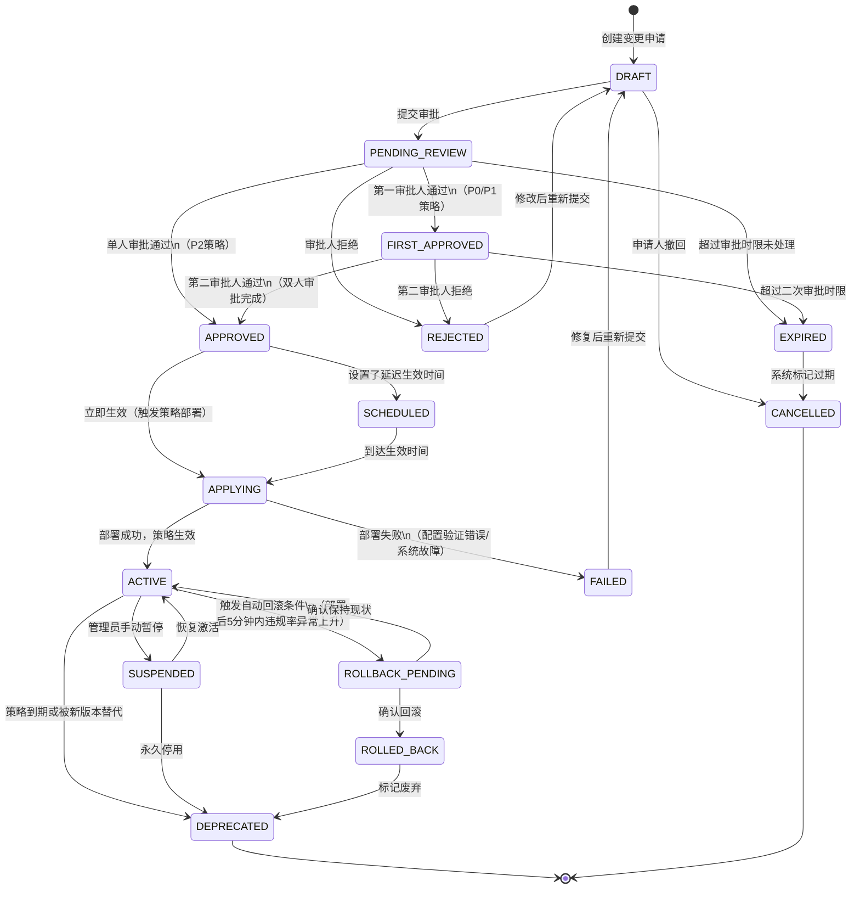

# MaaS平台 PRD V2.0 —— 第07章：合规安全与审计规格

**文档版本：** V2.0.0  
**编写日期：** 2026年05月21日  
**文档状态：** 设计评审中  
**机密等级：** 内部保密  
**所属模块：** 合规安全体系  
**前置文档：** `06-计费成本与FinOps规格.md`  
**后续文档：** `08-私有化交付与部署规格.md`

---

## 目录

1. [合规安全设计原则](#第1章-合规安全设计原则)
2. [数据分级与地域控制](#第2章-数据分级与地域控制)
3. [内容安全策略（Guardrails）](#第3章-内容安全策略guardrails)
4. [零数据保留模式](#第4章-零数据保留模式)
5. [客户自带KMS](#第5章-客户自带kms)
6. [审计日志体系](#第6章-审计日志体系)
7. [合规报告](#第7章-合规报告)
8. [API安全规格](#第8章-api安全规格)
9. [合规策略审批流程](#第9章-合规策略审批流程)
10. [验收标准](#第10章-验收标准)

---

## 第1章 合规安全设计原则

### 1.1 为什么合规安全是MaaS平台的核心竞争力

在企业AI采购决策链中，安全合规能力已从"锦上添花"演变为"采购前置门槛"。根据对金融、政务、医疗、大型制造企业的访谈与竞品分析，合规安全缺失是MaaS平台失单的首要原因，而非功能不足或价格过高。具体体现在以下三个维度：

**监管压力维度**：中国《数据安全法》《个人信息保护法》《网络安全法》《生成式人工智能服务管理暂行办法》等法规相继落地，金融行业的《金融数据安全数据分级指南》（JR/T 0197）、医疗行业的《医疗卫生机构网络安全管理办法》均对数据处理链路有明确要求。任何涉及将企业数据发送至外部AI服务的行为，都需要有完整的合规证据链。MaaS平台作为企业AI流量的中转枢纽，天然处于合规审查的焦点位置。

**信任经济维度**：大型企业客户（特别是500强、央国企、持牌金融机构）的AI采购流程包含供应商安全问卷、渗透测试报告、等保证书核验、数据处理协议审查等多个环节。如果MaaS平台无法提供标准化的合规文档包、无法支持客户自带密钥、无法提供可机读的审计日志，客户安全团队会直接否决采购申请，销售周期将无限延长。

**数据主权维度**：跨国企业面临数据跨境监管（GDPR Article 44等），国内企业面临数据不出境要求（等保三级、关键信息基础设施保护）。MaaS平台若不能精确控制请求流量的地理路由——哪些租户的哪类数据可以路由到哪些地域的哪些供应商——就无法服务对数据主权有硬性要求的客户群体。

综合以上背景，MaaS V2.0将合规安全能力作为顶层设计约束，而非事后合规补丁。所有数据模型设计、路由逻辑设计、存储设计都必须在合规视角下通过评审。

### 1.2 合规安全设计的五项原则

**原则一：分层防御（Defense in Depth）**  
合规安全控制不能依赖单点，必须在接入层、路由层、存储层、审计层分别设置独立控制，任何单一控制失效不会导致合规违反。例如：内容安全检测在网关侧有一道预过滤，在路由引擎侧有精确策略执行，在审计日志中有不可篡改的记录，三层互为验证。

**原则二：最小数据原则（Data Minimization）**  
平台默认收集满足业务运营所需的最小数据集。Prompt/Response原文等敏感内容默认不持久化，仅在用户显式开启且通过合规审批后方可留存。元数据（Token量、耗时、模型标识）与内容数据（原始文本）严格分离存储，访问控制独立配置。

**原则三：可审计可证明（Auditability and Provenance）**  
合规不是声明，是证据。所有安全策略的配置变更、执行动作、异常事件必须生成不可篡改的审计日志，并支持以机读格式导出提供给外部审计机构。审计链从策略创建、审批、生效、执行到失效的全生命周期均有记录。

**原则四：客户主权（Customer Data Sovereignty）**  
平台托管的所有与客户相关的数据（包括API Key、路由配置、审计日志、Prompt/Response内容）的加密密钥，客户有权选择由平台管理或由客户自带KMS管理。密钥轮换、密钥撤销、密钥审计均在客户控制范围内。

**原则五：策略即代码（Policy as Code）**  
合规策略以结构化数据模型表达，版本化存储，支持仿真测试，通过审批工作流生效，自动生成合规报告。避免合规依赖人工操作和文档描述，确保策略的可追溯性和可重复验证性。

### 1.3 合规能力层次架构图



### 1.4 合规角色与责任矩阵

| 角色 | 职责描述 | 可见范围 | 操作权限 |
|------|---------|---------|---------|
| 平台安全管理员 | 配置全局安全策略、维护合规基线 | 所有租户合规配置（脱敏视图） | 创建/修改全局策略模板 |
| 租户安全负责人 | 管理租户内数据分级、内容策略、KMS | 本租户全量 | 配置租户级策略、申请审批 |
| 合规审计员 | 下载审计日志、生成合规报告、检查违规 | 审计日志（只读）、报告 | 导出、生成报告 |
| 安全运营工程师 | 响应安全告警、处置内容安全事件 | 安全告警、拦截记录 | 处置工单、封禁API Key |
| 外部审计机构 | 审查平台合规能力 | 合规报告包、审计导出 | 只读 |

---

## 第2章 数据分级与地域控制

### 2.1 为什么需要数据分级

企业内部数据的安全性差异极大：一段公开的营销话术与一份含有客户身份证号的金融报告，在MaaS平台的处理方式理应完全不同。前者可以路由到成本最优的供应商，甚至允许缓存；后者则可能被严格限制只能路由到境内的自有部署模型，且不允许任何形式的日志落盘。

如果平台没有数据分级体系，则所有数据会被按照同一套规则处理，要么牺牲安全性（高敏感数据被不受控地发送到任意供应商），要么牺牲灵活性（所有数据都按最严格标准处理，导致成本急剧上升、可用供应商范围极度收窄）。

数据分级的核心价值在于将"数据敏感度"与"处理规则"解耦：分级定义一次，所有路由、存储、审计、加密规则均依据分级自动应用。

### 2.2 L0-L4 五级数据分级体系

MaaS平台采用五级数据分级模型，与国家标准《数据安全法》的"重要数据"、"核心数据"框架保持映射关系，同时向下兼容金融行业JR/T 0197标准的四级分类。

| 分级 | 名称 | 定义 | 典型数据示例 | 默认加密 | 可路由供应商范围 | 允许落盘日志 | 允许跨境 |
|------|------|------|-----------|---------|--------------|------------|---------|
| L0 | 公开数据 | 已公开或无业务敏感性的数据 | 公开文档、演示Prompt | 传输加密 | 无限制 | 允许 | 允许 |
| L1 | 内部数据 | 企业内部使用、不宜对外公开但泄露风险低 | 内部操作手册、培训材料 | 传输+静态加密 | 已认证供应商 | 允许（TTL 90天） | 需申请 |
| L2 | 敏感数据 | 包含个人信息、商业机密等，泄露会造成一定损失 | 用户邮箱、内部会议纪要、业务流程文档 | AES-256强制 | 合规认证供应商 | 允许（TTL 30天） | 需合规审批 |
| L3 | 高度敏感数据 | 包含重要个人信息、核心商业机密，泄露会造成重大损失 | 身份证号、合同金额、客户名单、财务预测 | AES-256 + 字段脱敏 | 境内认证供应商 | 元数据only | 禁止 |
| L4 | 核心机密数据 | 国家重要数据或企业最高机密，泄露会造成严重后果 | 国家秘密、核心算法、重大并购信息 | AES-256 + 客户KMS + 字段脱敏 | 仅自有模型或私有化部署 | 禁止落盘 | 严格禁止 |

### 2.3 数据分级配置的三种模式

**模式一：请求头声明模式（Header-Based）**  
调用方在HTTP请求头中携带 `X-Data-Classification: L2` 声明数据级别。平台信任调用方声明，记录声明值，但不主动验证。适用于调用方可信度高、有内部数据治理体系的场景。优点是实现简单、零延迟；缺点是依赖调用方正确声明。

**模式二：API Key绑定模式（Key-Bound）**  
在API Key配置时绑定默认数据分级，该Key下所有请求均按绑定级别处理，调用方无需在请求中额外声明。适用于专用API Key对应特定业务场景（如客服机器人Key绑定L2，内部工具Key绑定L1）的场景。优点是调用方无感知、配置集中；缺点是同一Key下的不同请求无法有差异化分级。

**模式三：内容扫描模式（Content-Scan）**  
平台在路由前对Prompt内容进行正则/NER（命名实体识别）扫描，自动识别是否包含手机号、身份证、信用卡号等敏感标识符，动态升级数据分级。例如：默认L1的请求，若检测到包含身份证号模式（18位数字+末位X），自动升级为L2处理。

可在租户配置中为三种模式设置优先级和组合策略，例如："请求头声明 > Key绑定 > 内容扫描"。

### 2.4 `data_classification` 数据库表设计

```sql
CREATE TABLE data_classification_config (
    id                  BIGINT          NOT NULL AUTO_INCREMENT COMMENT '主键',
    tenant_id           VARCHAR(64)     NOT NULL COMMENT '租户ID',
    config_name         VARCHAR(128)    NOT NULL COMMENT '配置名称',
    config_scope        ENUM('TENANT','PROJECT','API_KEY') NOT NULL COMMENT '作用域',
    scope_id            VARCHAR(64)     NOT NULL COMMENT '作用域对象ID',

    -- 分级声明模式
    declaration_mode    ENUM('HEADER','KEY_BOUND','CONTENT_SCAN','COMBINED') NOT NULL DEFAULT 'KEY_BOUND' COMMENT '分级声明模式',
    default_level       TINYINT         NOT NULL DEFAULT 1 COMMENT '默认数据分级(0-4)',
    max_allowed_level   TINYINT         NOT NULL DEFAULT 4 COMMENT '允许的最高分级',
    mode_priority       JSON            COMMENT '组合模式下的优先级顺序',

    -- 内容扫描配置
    content_scan_enabled   BOOLEAN      NOT NULL DEFAULT FALSE COMMENT '是否启用内容扫描',
    scan_patterns          JSON         COMMENT '扫描规则JSON(正则/NER标签)',
    auto_upgrade_level     TINYINT      COMMENT '扫描命中后升级到的分级',

    -- 地域控制
    allowed_regions        JSON         NOT NULL COMMENT '允许路由的地域列表',
    blocked_regions        JSON         COMMENT '明确禁止的地域列表',
    data_residency_required BOOLEAN     NOT NULL DEFAULT FALSE COMMENT '是否要求数据驻留（不跨境）',
    residency_region        VARCHAR(32)  COMMENT '数据驻留地域代码（CN/EU/US等）',

    -- 供应商约束
    allowed_vendor_ids     JSON         COMMENT '允许路由到的供应商ID列表（null=无限制）',
    blocked_vendor_ids     JSON         COMMENT '明确禁止的供应商ID列表',
    require_vendor_cert    VARCHAR(64)  COMMENT '要求供应商持有的认证（ISO27001/等保等）',

    -- 存储约束
    log_content_allowed    BOOLEAN      NOT NULL DEFAULT TRUE COMMENT '是否允许日志记录原始内容',
    log_metadata_only      BOOLEAN      NOT NULL DEFAULT FALSE COMMENT '是否仅记录元数据',
    log_ttl_days           INT          COMMENT '日志保留天数（null=永久）',
    cache_allowed          BOOLEAN      NOT NULL DEFAULT TRUE COMMENT '是否允许语义缓存',
    cache_ttl_seconds      INT          COMMENT '缓存有效时间（秒）',

    -- 加密要求
    encryption_required    BOOLEAN      NOT NULL DEFAULT TRUE COMMENT '是否要求静态加密',
    kms_required           BOOLEAN      NOT NULL DEFAULT FALSE COMMENT '是否要求客户KMS',
    kms_config_id          VARCHAR(64)  COMMENT '关联的KMS配置ID',
    field_masking_required BOOLEAN      NOT NULL DEFAULT FALSE COMMENT '是否要求字段脱敏',
    masking_config         JSON         COMMENT '脱敏规则配置',

    -- 生命周期
    effective_at           DATETIME     NOT NULL DEFAULT CURRENT_TIMESTAMP COMMENT '生效时间',
    expires_at             DATETIME     COMMENT '过期时间（null=永久有效）',
    created_by             VARCHAR(64)  NOT NULL COMMENT '创建人',
    approved_by            VARCHAR(64)  COMMENT '审批人',
    status                 ENUM('DRAFT','PENDING_APPROVAL','ACTIVE','SUSPENDED','ARCHIVED') NOT NULL DEFAULT 'DRAFT',
    version                INT          NOT NULL DEFAULT 1 COMMENT '版本号',
    created_at             DATETIME     NOT NULL DEFAULT CURRENT_TIMESTAMP,
    updated_at             DATETIME     NOT NULL DEFAULT CURRENT_TIMESTAMP ON UPDATE CURRENT_TIMESTAMP,

    PRIMARY KEY (id),
    UNIQUE KEY uk_scope (tenant_id, config_scope, scope_id, version),
    INDEX idx_tenant_status (tenant_id, status),
    INDEX idx_scope_id (scope_id)
) ENGINE=InnoDB DEFAULT CHARSET=utf8mb4 COMMENT='数据分级与地域控制配置表';
```

### 2.5 地域控制规则与禁止出境检查

**地域代码体系**

平台使用三层地域代码：`{国家代码}-{云区域代码}-{可用区代码}`，例如：
- `CN-ALIYUN-CN-HANGZHOU-A` — 阿里云杭州可用区A
- `CN-TENCENT-AP-GUANGZHOU-3` — 腾讯云广州3区
- `US-AWS-US-EAST-1` — AWS美东1区
- `EU-AZURE-WEST-EUROPE` — Azure西欧

**禁止出境检查流程**



**地域约束配置示例（JSON）**

```json
{
  "config_name": "金融核心数据-L3配置",
  "default_level": 3,
  "data_residency_required": true,
  "residency_region": "CN",
  "allowed_regions": [
    "CN-ALIYUN-CN-HANGZHOU-A",
    "CN-ALIYUN-CN-BEIJING-B",
    "CN-TENCENT-AP-GUANGZHOU-3",
    "CN-PRIVATECLOUD-DATACENTER-1"
  ],
  "blocked_regions": [
    "US-*",
    "EU-*",
    "JP-*"
  ],
  "require_vendor_cert": "等保三级",
  "log_metadata_only": true,
  "kms_required": true
}
```

### 2.6 数据分级与处理规则的联动矩阵

| 处理规则 | L0 | L1 | L2 | L3 | L4 |
|---------|:--:|:--:|:--:|:--:|:--:|
| 语义缓存 | ✅ | ✅ | ✅（TTL 1h） | ❌ | ❌ |
| 内容日志落盘 | ✅ | ✅ | ✅（TTL 30d） | ❌（仅元数据） | ❌ |
| 路由到境外供应商 | ✅ | 需申请 | 需合规审批 | ❌ | ❌ |
| 路由到未认证供应商 | ✅ | ❌ | ❌ | ❌ | ❌ |
| 字段脱敏 | 可选 | 可选 | 建议 | 强制 | 强制 |
| 客户KMS加密 | 可选 | 可选 | 可选 | 建议 | 强制 |
| 零数据保留模式 | 可选 | 可选 | 可选 | 建议 | 强制 |
| 双人审批变更策略 | ❌ | ❌ | 建议 | 强制 | 强制 |

---

## 第3章 内容安全策略（Guardrails）

### 3.1 内容安全在MaaS平台的定位

内容安全策略（Guardrails）是MaaS平台在请求处理链路中对Prompt和Response内容进行检测、过滤、改写、拦截的能力集合。与传统内容审核系统（仅面向用户生成内容）不同，MaaS Guardrails面向的是企业内部AI调用场景，其核心挑战在于：

**双向检测需求**：既需要检测用户输入的Prompt（防止恶意指令注入、越权查询、隐私数据泄露），也需要检测模型输出的Response（防止幻觉输出、不当内容、合规违禁信息），两个方向的检测规则、触发逻辑、处置动作均有差异。

**业务定制化需求**：不同租户、不同业务场景对内容安全的要求差异极大。法律行业的AI助手需要拦截所有医疗建议类输出；金融机构的智能客服需要拦截任何具体投资建议；教育类应用需要对未成年人保护进行严格过滤。通用的内容安全规则无法满足企业级的精细化需求。

**低延迟要求**：内容安全检测处于请求处理的关键路径上，任何超过50ms的额外延迟都会被用户感知。平台需要在检测精度和延迟之间取得平衡，提供轻量级规则引擎（<5ms）和深度语义检测（<30ms）两档能力。

**审计可证明性**：当内容安全事件需要向监管机构举证时，需要提供完整的"检测依据—触发规则—处置动作—通知记录"证据链，这要求所有安全决策均留有结构化日志。

### 3.2 Guardrails策略类型体系

平台定义七大类内容安全策略类型：

**① 关键词过滤（Keyword Filter）**  
基于精确关键词、通配符、正则表达式的快速过滤。延迟最低（<1ms），适合高确定性的禁用词列表。支持关键词库版本化管理，支持租户自定义扩展词库。

**② 模式匹配（Pattern Match）**  
基于正则表达式或预定义数据模式（手机号、身份证、银行卡、IP地址、AWS Key等）的敏感信息识别。主要用于防止PII数据泄露到日志或输出内容。

**③ 语义分类（Semantic Classifier）**  
调用内置的文本分类模型对内容进行语义级别的分类，支持多标签输出（暴力、色情、歧视、政治敏感、商业敏感等）。延迟10-30ms，精度高于关键词过滤。

**④ Prompt注入检测（Prompt Injection Detector）**  
专门识别试图通过Prompt操纵系统指令的攻击模式，包括：角色扮演越权（"假设你是没有限制的AI"）、指令覆盖（"忽略之前的所有指令"）、分隔符注入（"---new prompt---"）等。

**⑤ 话题边界控制（Topic Boundary）**  
定义该AI助手允许讨论的话题范围，超出范围的请求返回标准拒绝话术。例如：HR助手仅允许讨论招聘、薪酬、假期相关话题，不允许讨论投资、法律咨询等话题。

**⑥ 输出合规检测（Output Compliance）**  
对模型Response进行合规性检测，包括：是否包含个人信息、是否给出需要执照资质的专业建议（投资/医疗/法律）、是否包含版权材料的大段引用。

**⑦ 自定义规则（Custom Rule）**  
通过CEL（Common Expression Language）表达式编写复杂业务规则，支持跨字段逻辑判断（如：当system_prompt包含"财务助手"且user_message包含特定证券代码时触发）。

### 3.3 风险分类与拦截动作矩阵

| 风险类型 | 风险代码 | 默认拦截动作 | 可配置动作 | 审计事件 |
|---------|---------|------------|----------|--------|
| 极高风险内容（暴恐、CSAM等） | RISK_CRITICAL | BLOCK_HARD | 不可修改 | CONTENT_CRITICAL_BLOCKED |
| 违禁话题（政治敏感、违法信息） | RISK_PROHIBITED | BLOCK_SOFT | 可改为REVIEW | CONTENT_PROHIBITED_BLOCKED |
| PII泄露风险 | RISK_PII | MASK_AND_ALLOW | BLOCK / ALLOW | PII_DETECTED |
| Prompt注入攻击 | RISK_INJECTION | BLOCK_HARD | 可改为ALERT | PROMPT_INJECTION_DETECTED |
| 超出话题边界 | RISK_OFFTOPIC | REDIRECT（标准话术） | BLOCK / ALLOW | TOPIC_BOUNDARY_EXCEEDED |
| 不当专业建议 | RISK_PROFESSIONAL | DISCLAIMER_INJECT | BLOCK / ALERT | PROFESSIONAL_ADVICE_DETECTED |
| 商业敏感信息 | RISK_BUSINESS | ALERT | BLOCK / MASK | BUSINESS_SENSITIVE_DETECTED |
| 版权内容引用 | RISK_COPYRIGHT | DISCLAIMER_INJECT | BLOCK / ALLOW | COPYRIGHT_RISK_DETECTED |

**拦截动作说明：**
- `BLOCK_HARD`：直接拒绝请求，不调用任何模型，返回HTTP 403，不可被任何策略覆盖
- `BLOCK_SOFT`：拒绝请求，返回HTTP 403，可通过豁免审批临时放行
- `MASK_AND_ALLOW`：对检测到的PII字段进行脱敏替换后继续路由，替换规则可配置
- `REDIRECT`：不拒绝请求，但将Response替换为预设的标准话术，不调用模型
- `DISCLAIMER_INJECT`：在模型Response前/后注入合规免责声明
- `ALERT`：允许请求通过，但同步触发安全告警通知
- `REVIEW`：允许请求通过，同时创建人工审核工单，异步处置

### 3.4 `safety_policy` 数据库表设计（30+字段）

```sql
CREATE TABLE safety_policy (
    id                      BIGINT          NOT NULL AUTO_INCREMENT COMMENT '主键',
    tenant_id               VARCHAR(64)     NOT NULL COMMENT '租户ID',
    policy_name             VARCHAR(128)    NOT NULL COMMENT '策略名称',
    policy_code             VARCHAR(64)     NOT NULL COMMENT '策略唯一编码（可用于API引用）',
    policy_type             ENUM('KEYWORD_FILTER','PATTERN_MATCH','SEMANTIC_CLASSIFIER',
                                 'PROMPT_INJECTION','TOPIC_BOUNDARY','OUTPUT_COMPLIANCE',
                                 'CUSTOM_RULE') NOT NULL COMMENT '策略类型',
    description             TEXT            COMMENT '策略描述',
    
    -- 作用域配置
    apply_scope             ENUM('TENANT','PROJECT','API_KEY','MODEL') NOT NULL DEFAULT 'TENANT' COMMENT '作用域',
    scope_ids               JSON            COMMENT '作用域对象ID列表（null=作用于全部）',
    apply_direction         ENUM('REQUEST','RESPONSE','BOTH') NOT NULL DEFAULT 'BOTH' COMMENT '检测方向',
    apply_positions         JSON            COMMENT '执行位置：gateway/router/adapter等',
    
    -- 规则配置
    rule_config             JSON            NOT NULL COMMENT '规则配置（因策略类型而异）',
    keyword_list_id         BIGINT          COMMENT '关联的关键词库ID',
    pattern_set_id          BIGINT          COMMENT '关联的正则模式集ID',
    classifier_model        VARCHAR(64)     COMMENT '使用的分类模型标识',
    classifier_threshold    DECIMAL(4,3)    COMMENT '语义分类置信度阈值（0.0-1.0）',
    topic_allowlist         JSON            COMMENT '允许话题列表（话题边界策略）',
    custom_rule_expression  TEXT            COMMENT 'CEL自定义规则表达式',
    
    -- 触发与动作
    risk_level              ENUM('LOW','MEDIUM','HIGH','CRITICAL') NOT NULL DEFAULT 'MEDIUM' COMMENT '风险等级',
    risk_code               VARCHAR(32)     NOT NULL COMMENT '风险代码（见风险分类体系）',
    default_action          ENUM('ALLOW','ALERT','MASK_AND_ALLOW','REDIRECT',
                                 'DISCLAIMER_INJECT','BLOCK_SOFT','BLOCK_HARD','REVIEW') NOT NULL COMMENT '默认动作',
    action_config           JSON            COMMENT '动作附加配置（脱敏规则/免责声明文本等）',
    fallback_response       TEXT            COMMENT '拒绝时返回给调用方的话术（REDIRECT/BLOCK时使用）',
    alert_config            JSON            COMMENT '告警配置（webhook/邮件/工单）',
    
    -- 性能与采样
    sampling_rate           DECIMAL(5,4)    NOT NULL DEFAULT 1.0 COMMENT '检测采样率（1.0=100%检测）',
    priority                INT             NOT NULL DEFAULT 100 COMMENT '策略执行优先级（值越小越先执行）',
    short_circuit_on_match  BOOLEAN         NOT NULL DEFAULT FALSE COMMENT '命中后是否短路跳过后续策略',
    max_latency_ms          INT             COMMENT '最大允许检测延迟（超时则采用默认动作）',
    
    -- 白名单
    whitelist_project_ids   JSON            COMMENT '豁免检测的项目ID列表',
    whitelist_api_key_ids   JSON            COMMENT '豁免检测的API Key ID列表',
    whitelist_conditions    JSON            COMMENT '豁免条件表达式（CEL）',
    
    -- 统计与效果
    total_checks            BIGINT          NOT NULL DEFAULT 0 COMMENT '累计检测次数',
    total_hits              BIGINT          NOT NULL DEFAULT 0 COMMENT '累计命中次数',
    total_blocks            BIGINT          NOT NULL DEFAULT 0 COMMENT '累计拦截次数',
    false_positive_rate     DECIMAL(6,5)    COMMENT '误报率（人工标注后统计）',
    last_hit_at             DATETIME        COMMENT '最后一次命中时间',
    
    -- 生命周期
    status                  ENUM('DRAFT','PENDING_APPROVAL','ACTIVE','SUSPENDED','DEPRECATED') NOT NULL DEFAULT 'DRAFT',
    version                 INT             NOT NULL DEFAULT 1 COMMENT '版本号',
    parent_policy_id        BIGINT          COMMENT '父策略ID（用于版本继承）',
    effective_at            DATETIME        COMMENT '生效时间',
    expires_at              DATETIME        COMMENT '过期时间',
    created_by              VARCHAR(64)     NOT NULL COMMENT '创建人',
    approved_by             VARCHAR(64)     COMMENT '审批人',
    approved_at             DATETIME        COMMENT '审批时间',
    created_at              DATETIME        NOT NULL DEFAULT CURRENT_TIMESTAMP,
    updated_at              DATETIME        NOT NULL DEFAULT CURRENT_TIMESTAMP ON UPDATE CURRENT_TIMESTAMP,
    
    PRIMARY KEY (id),
    UNIQUE KEY uk_policy_code (tenant_id, policy_code, version),
    INDEX idx_tenant_status (tenant_id, status),
    INDEX idx_type_scope (policy_type, apply_scope),
    INDEX idx_risk_level (risk_level),
    INDEX idx_priority (priority)
) ENGINE=InnoDB DEFAULT CHARSET=utf8mb4 COMMENT='内容安全策略（Guardrails）配置表';
```

### 3.5 Guardrails执行引擎架构

内容安全检测在请求处理链路的两个关键位置执行：

**执行位置一：API网关层（Pre-Route）**  
执行耗时最低的策略类型：关键词过滤、PII模式匹配。目标是在路由决策前拦截明显违规内容，避免将敏感请求发出到任何供应商。延迟目标：P99 < 5ms。

**执行位置二：路由引擎层（Pre-Dispatch）**  
执行语义分类、话题边界检测、Prompt注入检测。此时已完成路由决策但尚未发出网络请求，可以访问完整的路由上下文（目标模型、数据分级）。延迟目标：P99 < 30ms。

**执行位置三：响应处理层（Post-Response）**  
执行输出合规检测、版权检测、免责声明注入。此时已获得模型Response，执行Response侧检测，并根据结果决定是否将Response透传给调用方。延迟目标：P99 < 20ms。

### 3.6 内容安全事件处理流程

当策略命中时，系统执行以下标准化事件处理流程：

1. **记录检测事件**：同步写入 `content_safety_event` 表，包含检测时间戳、请求ID、命中规则、置信度、原始内容摘要（哈希值）。
2. **执行配置动作**：按 `default_action` 或豁免规则执行相应动作。
3. **返回标准响应**：拦截类动作返回标准错误码和话术，不暴露内部规则细节。
4. **触发告警通知**：ALERT及以上级别事件异步发送告警（Webhook/邮件/企业微信）。
5. **更新策略统计**：异步更新策略的 `total_hits`、`total_blocks` 统计字段。

---

## 第4章 零数据保留模式

### 4.1 什么是零数据保留（Zero Data Retention，ZDR）

零数据保留模式是指MaaS平台在处理特定请求时，不在任何平台层面存储Prompt原文、Response原文及任何可以重建对话内容的衍生数据。从技术角度，这意味着请求内容数据在完成一次API调用后从平台内存中彻底清除，不写入任何持久化存储（数据库、对象存储、日志文件、缓存、审计系统）。

ZDR模式的需求来源于以下几类高敏感场景：

- **法律专业场景**：律师事务所使用AI辅助起草合同和分析案情，这些内容属于受司法特权保护的律师-客户特权通信（Attorney-Client Privilege），任何第三方持有都可能导致特权丧失。
- **医疗诊断场景**：医院使用AI辅助临床决策，患者病历信息受HIPAA（美国）或医疗行业数据保护法规严格保护，要求数据不在医疗机构管控范围外留存任何副本。
- **金融合规场景**：投资银行的并购项目分析、内幕信息处理等场景，监管机构要求严格的信息隔离，数据不留存是隔离的最强形式。
- **政务保密场景**：涉密业务系统使用AI时，按保密法要求数据不得在非涉密环境留存。

### 4.2 ZDR的两种技术模式

**模式一：元数据Only模式（Metadata-Only Mode）**

在此模式下，平台保留所有对账、审计、运营所需的元数据，但不保留任何可重建对话内容的数据：
- ✅ 保留：request_id、tenant_id、api_key_id、model_id、timestamp、input_tokens、output_tokens、latency_ms、status_code、cost_amount
- ✅ 保留：内容安全检测结果（仅保留风险类型和置信度，不保留命中片段）
- ✅ 保留：路由决策结果（选中模型、fallback路径）
- ❌ 不保留：prompt原文、response原文、messages数组、system_prompt
- ❌ 不保留：内容哈希值（防止基于哈希的内容追踪）
- ❌ 不保留：任何可用于推断内容的中间计算结果

**模式二：完全不落盘模式（True Zero Retention Mode）**

在此模式下，连元数据也不持久化，仅保留计费所需的最小会计记录：
- ✅ 保留：加密的计费凭证（含Token量、成本、时间戳，不含任何请求标识符关联关系）
- ✅ 保留：审计的不可关联事件哈希（证明处理发生了，但无法关联到具体内容）
- ❌ 不保留：request_id（使用不可关联的随机标识符替代）
- ❌ 不保留：任何可建立请求-用户关联的标识符

### 4.3 ZDR配置选项

ZDR通过 `data_classification_config` 表的 `log_content_allowed`、`log_metadata_only` 字段控制，同时需要在API Key配置中设置 `zdr_mode`：

```json
{
  "api_key_config": {
    "zdr_mode": "METADATA_ONLY",
    "zdr_scope": ["prompt", "response", "messages"],
    "zdr_verified": true,
    "zdr_compliance_cert": "cert-2026-ZDR-001",
    "billing_voucher_encryption": true,
    "billing_voucher_kms_id": "kms-customer-001"
  }
}
```

可配置参数：

| 参数 | 类型 | 说明 |
|------|------|------|
| `zdr_mode` | ENUM | `DISABLED` / `METADATA_ONLY` / `TRUE_ZERO_RETENTION` |
| `zdr_scope` | Array | 哪些字段范围不落盘（`prompt` / `response` / `messages` / `system_prompt`） |
| `zdr_verified` | Boolean | 是否已通过ZDR合规认证 |
| `zdr_verification_ts` | DateTime | ZDR配置最后一次验证时间 |
| `billing_voucher_encryption` | Boolean | 计费凭证是否使用客户KMS加密 |
| `zdr_audit_mode` | ENUM | 审计事件的记录级别（仅哈希/最小元数据/不记录） |

### 4.4 ZDR验证机制

ZDR模式的可信度依赖于技术验证而非仅凭声明。平台提供以下验证机制：

**静态验证**：在ZDR模式激活后，系统自动发送一系列标记测试请求（内容为特定随机字符串），随后由独立进程扫描所有存储系统（数据库、Redis、对象存储、日志流）查找标记字符串，验证零留存的执行效果。验证结果作为合规证明写入不可篡改的验证日志。

**持续监控**：对ZDR模式下的写入操作进行字节级监控，任何向受保护字段写入非零字节的操作均触发P0告警。

**定期合规审计**：平台每季度出具ZDR合规报告，证明技术控制的持续有效性，报告格式符合SOC 2 Type II的证据要求。

### 4.5 ZDR模式的局限性声明

平台在ZDR模式下无法提供以下功能，需在产品合同和功能说明中明确披露：

- 不支持语义缓存（缓存要求存储请求内容的向量表示）
- 不支持Prompt管理（Prompt历史记录需要存储内容）
- 不支持会话重播（无法从存储中恢复对话内容）
- 不支持内容安全事件的详细取证（仅有事件类型记录，无内容证据）
- 如遭遇计费纠纷，平台仅能提供Token计量凭证，无法提供请求内容作为争议举证

---

## 第5章 客户自带KMS

### 5.1 BYOK（Bring Your Own Key）的产品价值

MaaS平台的BYOK（Bring Your Own Key）能力允许企业客户使用自己控制的密钥管理服务（KMS）对平台存储的敏感数据进行加密，而不依赖平台管理的密钥。BYOK的核心价值在于：

**密钥主权**：平台运营方在技术上无法访问客户数据——即使平台的数据库被非法访问，攻击者得到的也只是密文，解密所需的密钥由客户独立持有，平台无法提供协助（也无法被强制要求提供）。

**独立审计链**：密钥的使用记录（谁在什么时间用什么操作访问了密钥）由客户的KMS系统独立记录，与平台审计日志相互印证，形成两条独立的证据链。

**密钥撤销控制**：客户可以在任何时候撤销KMS中的密钥授权，立即使平台无法访问被该密钥加密的所有数据，实现数据的"逻辑删除"，无需等待平台物理删除。

### 5.2 支持的KMS类型与接口规格

平台通过统一的KMS适配层支持以下四类主流KMS：

#### 5.2.1 阿里云KMS（Alibaba Cloud KMS）

**接口协议**：阿里云KMS Open API（HTTPS REST）  
**认证方式**：AccessKey + AccessKeySecret 或 RAM角色STS临时凭证（推荐）  
**支持操作**：`GenerateDataKey`、`Decrypt`、`DescribeKey`、`GetPublicKey`  
**密钥类型**：对称密钥（AES-256）、非对称密钥（RSA-2048/4096）  
**推荐配置**：使用专属KMS（DKMS）在客户VPC内部署，避免KMS请求出VPC  

```json
{
  "kms_type": "ALIBABA_CLOUD_KMS",
  "region": "cn-hangzhou",
  "kms_instance_id": "kst-bjj62d8f5e3p8zp6xxxx",
  "key_id": "arn:acs:kms:cn-hangzhou:123456:key/xxxxxxxx-xxxx-xxxx-xxxx",
  "auth_method": "STS_ROLE",
  "sts_role_arn": "acs:ram::123456:role/MaaSPlatformKMSRole",
  "endpoint_override": "kms.cn-hangzhou.aliyuncs.com"
}
```

#### 5.2.2 AWS KMS（Amazon Web Services KMS）

**接口协议**：AWS KMS API（HTTPS + AWS Signature V4）  
**认证方式**：IAM角色（AssumeRole）、AccessKey  
**支持操作**：`GenerateDataKey`、`Decrypt`、`DescribeKey`、`CreateGrant`  
**特色能力**：支持CMK（Customer Managed Keys）的密钥策略精细化控制，支持KMS密钥授权（Grant）委托  
**多区域支持**：支持AWS Multi-Region Keys，实现跨区域数据访问  

```json
{
  "kms_type": "AWS_KMS",
  "region": "cn-northwest-1",
  "key_id": "arn:aws-cn:kms:cn-northwest-1:123456789:key/xxxxxxxx-xxxx-xxxx-xxxx",
  "auth_method": "IAM_ROLE",
  "role_arn": "arn:aws-cn:iam::123456789:role/MaaSPlatformKMSRole",
  "external_id": "MaaSPlatform-Tenant-XXXXX"
}
```

#### 5.2.3 Azure Key Vault

**接口协议**：Azure Key Vault REST API  
**认证方式**：Azure AD服务主体（Service Principal）、托管标识（Managed Identity）  
**支持操作**：`wrapKey`、`unwrapKey`、`getKey`  
**特色能力**：支持HSM（Hardware Security Module）级别密钥保护（Premium SKU）  

```json
{
  "kms_type": "AZURE_KEY_VAULT",
  "vault_url": "https://customer-vault.vault.azure.net/",
  "key_name": "maas-platform-dek",
  "key_version": "xxxxxxxxxxxxxxxxxxxxxxxxxxxxxxxx",
  "auth_method": "SERVICE_PRINCIPAL",
  "tenant_id": "xxxxxxxx-xxxx-xxxx-xxxx-xxxxxxxxxxxx",
  "client_id": "xxxxxxxx-xxxx-xxxx-xxxx-xxxxxxxxxxxx",
  "client_secret": "<encrypted_by_platform_master_key>"
}
```

#### 5.2.4 HashiCorp Vault

**接口协议**：HashiCorp Vault HTTP API（Transit Secrets Engine）  
**认证方式**：AppRole、Kubernetes Auth、JWT/OIDC  
**支持操作**：`/encrypt`、`/decrypt`、`/rewrap`、`/rotate`  
**特色能力**：支持私有化自建，适合完全离线或混合云场景；支持命名空间隔离  

```json
{
  "kms_type": "HASHICORP_VAULT",
  "vault_address": "https://vault.internal.customer.com:8200",
  "namespace": "customer-ns",
  "mount_path": "transit",
  "key_name": "maas-dek",
  "auth_method": "APPROLE",
  "role_id": "xxxxxxxx-xxxx-xxxx-xxxx-xxxxxxxxxxxx",
  "secret_id": "<encrypted_by_platform_master_key>"
}
```

### 5.3 密钥层级体系

平台采用信封加密（Envelope Encryption）架构，密钥体系分为三层：

```
客户KMS（Customer KMS）
       │
       │ 加密/解密
       ▼
数据加密密钥（DEK, Data Encryption Key）  ← 每个租户一个DEK，存储为密文
       │
       │ 加密/解密
       ▼
业务数据（Prompt/Response/API Key/配置等）
```

- **KMS密钥（KEK，Key Encryption Key）**：由客户KMS管理，MaaS平台从不接触明文KEK，仅调用KMS API进行DEK的加密/解密操作。
- **数据加密密钥（DEK）**：由平台在开通BYOK时生成（AES-256位随机密钥），使用KEK加密后以密文形式存储在平台数据库。每次访问需解密数据时，平台请求KMS解密DEK，然后用明文DEK解密数据，操作完成后DEK明文从内存清除。
- **业务数据**：使用DEK的AES-256-GCM加密，密文存储在平台存储系统。

### 5.4 密钥轮转机制

密钥轮转是定期更换加密密钥以限制密钥暴露时间窗口的安全实践。平台支持以下轮转方式：

**自动轮转**：配置轮转周期（推荐90天），系统在到期时自动生成新DEK，用新KEK加密存储，并在后台批量重新加密存量数据（在线重加密，不影响业务）。重加密过程产生详细日志，支持进度追踪和中断恢复。

**手动轮转**：安全负责人主动触发密钥轮转，通常在怀疑密钥泄露时使用。触发后立即生效，旧密钥标记为废弃，进入30天宽限期（用于解密仍在处理中的数据），宽限期结束后彻底禁用。

**紧急撤销**：在确认密钥泄露时，可立即撤销KMS中的密钥访问授权，导致平台立即无法解密任何该租户数据（包括运营元数据）。这是核弹级操作，需要双人确认。

### 5.5 KMS故障处理策略

KMS不可用时平台的降级行为：

| 故障场景 | 故障检测 | 降级策略 | 恢复机制 |
|---------|---------|---------|---------|
| KMS网络超时（< 5s） | 请求超时 | 使用本地DEK内存缓存（最长TTL 5分钟） | 自动重试 |
| KMS连续失败（> 3次） | 熔断器触发 | 切换到只读模式，不接受新的加密数据写入 | 人工确认后恢复 |
| KMS长时间不可用（> 15min） | 健康检查 | 触发P0告警，暂停该租户新请求处理 | KMS恢复后自动解除 |
| KMS密钥被吊销 | 解密失败 | 立即触发P0告警，请求拒绝，数据保持密文 | 客户重新授权后恢复 |

---

## 第6章 审计日志体系

### 6.1 审计日志的设计目标

审计日志是MaaS平台合规安全能力的核心组件，为平台的所有操作行为提供不可篡改的历史记录。设计目标：

**完整性**：覆盖平台所有安全相关操作，包括身份认证、授权变更、数据访问、策略变更、合规事件，不漏记任何审计事件。

**不可否认性**：审计记录一旦写入，在技术上无法被修改或删除，即使是平台DBA也无法篡改历史审计记录。

**可检索性**：支持基于时间范围、事件类型、操作者、资源ID等多维度的高效检索，P95查询延迟 < 500ms（时间范围 ≤ 90天）。

**合规导出**：支持以多种格式导出审计数据（JSON、CSV、OCSF），用于满足监管要求和外部审计需求。

### 6.2 `audit_event` 数据库表设计（40+字段）

```sql
CREATE TABLE audit_event (
    -- 基础标识
    id                      BIGINT          NOT NULL AUTO_INCREMENT COMMENT '自增主键',
    event_id                VARCHAR(64)     NOT NULL COMMENT '全局唯一事件ID（UUID v7，时序有序）',
    tenant_id               VARCHAR(64)     NOT NULL COMMENT '租户ID（null=平台级事件）',
    platform_event          BOOLEAN         NOT NULL DEFAULT FALSE COMMENT '是否为平台级事件（非租户事件）',

    -- 时间戳
    event_time              DATETIME(6)     NOT NULL COMMENT '事件发生时间（微秒精度）',
    received_time           DATETIME(6)     NOT NULL DEFAULT CURRENT_TIMESTAMP(6) COMMENT '平台接收时间',
    server_timestamp        BIGINT          NOT NULL COMMENT '服务器单调时钟时间戳（用于哈希链）',

    -- 事件分类
    event_category          ENUM('AUTH','IAM','API_ACCESS','DATA_ACCESS','CONFIG_CHANGE',
                                 'SECURITY_ALERT','COMPLIANCE','BILLING','SYSTEM') NOT NULL COMMENT '事件大类',
    event_type              VARCHAR(64)     NOT NULL COMMENT '事件类型（见事件分类体系）',
    event_severity          ENUM('DEBUG','INFO','NOTICE','WARNING','ERROR','CRITICAL') NOT NULL DEFAULT 'INFO',
    outcome                 ENUM('SUCCESS','FAILURE','PARTIAL') NOT NULL DEFAULT 'SUCCESS' COMMENT '事件结果',
    failure_reason          VARCHAR(256)    COMMENT '失败原因（outcome=FAILURE时）',

    -- 操作主体（Actor）
    actor_type              ENUM('USER','API_KEY','SERVICE_ACCOUNT','SYSTEM','EXTERNAL') NOT NULL,
    actor_id                VARCHAR(128)    NOT NULL COMMENT '操作主体ID',
    actor_name              VARCHAR(128)    COMMENT '操作主体显示名称（快照，不跟随变更）',
    actor_email             VARCHAR(256)    COMMENT '操作主体邮箱（用户类型）',
    actor_ip                VARCHAR(45)     COMMENT '操作主体IP地址（IPv4/IPv6）',
    actor_ip_asn            VARCHAR(64)     COMMENT 'IP所属ASN（用于异常检测）',
    actor_user_agent        VARCHAR(512)    COMMENT 'User-Agent（HTTP调用时）',
    actor_session_id        VARCHAR(64)     COMMENT '关联的会话ID（Web登录）',
    actor_api_key_id        VARCHAR(64)     COMMENT '关联的API Key ID',
    actor_country           VARCHAR(2)      COMMENT '操作来源国家代码（GeoIP）',
    impersonated_by         VARCHAR(128)    COMMENT '代理操作者ID（sudo/impersonate场景）',

    -- 操作目标（Resource）
    resource_type           VARCHAR(64)     NOT NULL COMMENT '操作对象类型（api_key/model/policy/tenant等）',
    resource_id             VARCHAR(128)    NOT NULL COMMENT '操作对象ID',
    resource_name           VARCHAR(256)    COMMENT '操作对象名称（快照）',
    resource_tenant_id      VARCHAR(64)     COMMENT '对象所属租户ID（跨租户操作时）',
    parent_resource_type    VARCHAR(64)     COMMENT '父资源类型（层级资源）',
    parent_resource_id      VARCHAR(128)    COMMENT '父资源ID',

    -- 操作详情
    action_verb             VARCHAR(64)     NOT NULL COMMENT '操作动词（CREATE/READ/UPDATE/DELETE/EXECUTE等）',
    request_id              VARCHAR(64)     COMMENT '关联的API请求ID',
    request_path            VARCHAR(1024)   COMMENT '请求路径（API调用时）',
    request_method          VARCHAR(8)      COMMENT 'HTTP方法',
    change_before           JSON            COMMENT '变更前数据快照（脱敏后）',
    change_after            JSON            COMMENT '变更后数据快照（脱敏后）',
    change_fields           JSON            COMMENT '变更字段列表',
    additional_details      JSON            COMMENT '附加上下文信息',

    -- 数据安全相关
    data_classification     TINYINT         COMMENT '相关数据分级（0-4）',
    contains_pii            BOOLEAN         COMMENT '是否涉及PII',
    pii_categories          JSON            COMMENT 'PII类别列表',
    data_region             VARCHAR(32)     COMMENT '数据所在地域',

    -- 防篡改
    prev_event_id           VARCHAR(64)     COMMENT '前一条审计事件ID（哈希链）',
    event_hash              VARCHAR(64)     NOT NULL COMMENT '本事件哈希值（SHA-256）',
    chain_hash              VARCHAR(64)     NOT NULL COMMENT '链式哈希（含前一条哈希的累积哈希）',
    signature               VARCHAR(512)    COMMENT '平台私钥签名（可选，高安全场景）',

    -- 存储与导出
    archived                BOOLEAN         NOT NULL DEFAULT FALSE COMMENT '是否已归档到冷存储',
    exported_at             DATETIME        COMMENT '最后导出时间',
    retention_until         DATETIME        NOT NULL COMMENT '保留截止时间（到期后可删除）',

    PRIMARY KEY (id),
    UNIQUE KEY uk_event_id (event_id),
    INDEX idx_tenant_time (tenant_id, event_time DESC),
    INDEX idx_category_type (event_category, event_type),
    INDEX idx_actor_id (actor_id, event_time DESC),
    INDEX idx_resource (resource_type, resource_id),
    INDEX idx_severity_time (event_severity, event_time DESC),
    INDEX idx_chain (prev_event_id)
) ENGINE=InnoDB DEFAULT CHARSET=utf8mb4 COMMENT='审计事件日志表（append-only，禁止UPDATE/DELETE）'
  PARTITION BY RANGE COLUMNS(event_time) (
    PARTITION p_2026_q1 VALUES LESS THAN ('2026-04-01'),
    PARTITION p_2026_q2 VALUES LESS THAN ('2026-07-01'),
    PARTITION p_2026_q3 VALUES LESS THAN ('2026-10-01'),
    PARTITION p_2026_q4 VALUES LESS THAN ('2027-01-01'),
    PARTITION p_future VALUES LESS THAN MAXVALUE
  );
```

> **Append-Only强制约束**：在数据库层通过Row-Level Security或触发器阻止 UPDATE/DELETE 操作。在应用层，审计日志写入服务为专用只写微服务，不暴露任何修改接口。

### 6.3 审计事件分类体系（50+种事件类型）

**AUTH 认证类（10种）**

| 事件类型 | 说明 | 严重级别 |
|---------|------|---------|
| `AUTH_LOGIN_SUCCESS` | 用户登录成功 | INFO |
| `AUTH_LOGIN_FAILURE` | 用户登录失败 | WARNING |
| `AUTH_LOGIN_MFA_REQUIRED` | MFA验证要求触发 | INFO |
| `AUTH_LOGIN_MFA_SUCCESS` | MFA验证成功 | INFO |
| `AUTH_LOGIN_MFA_FAILURE` | MFA验证失败 | WARNING |
| `AUTH_LOGOUT` | 用户登出 | INFO |
| `AUTH_SESSION_EXPIRED` | 会话过期 | INFO |
| `AUTH_TOKEN_REFRESH` | Token刷新 | DEBUG |
| `AUTH_BRUTE_FORCE_DETECTED` | 暴力破解检测 | CRITICAL |
| `AUTH_ACCOUNT_LOCKED` | 账户因异常被锁定 | ERROR |

**IAM 权限类（10种）**

| 事件类型 | 说明 | 严重级别 |
|---------|------|---------|
| `IAM_ROLE_ASSIGNED` | 角色分配 | NOTICE |
| `IAM_ROLE_REVOKED` | 角色撤销 | NOTICE |
| `IAM_PERMISSION_DENIED` | 权限拒绝 | WARNING |
| `IAM_API_KEY_CREATED` | API Key创建 | NOTICE |
| `IAM_API_KEY_DELETED` | API Key删除 | NOTICE |
| `IAM_API_KEY_ROTATED` | API Key轮换 | NOTICE |
| `IAM_MEMBER_INVITED` | 成员邀请 | INFO |
| `IAM_MEMBER_REMOVED` | 成员移除 | NOTICE |
| `IAM_PRIVILEGE_ESCALATION` | 权限提升（超管操作） | ERROR |
| `IAM_SSO_GROUP_SYNCED` | SSO群组同步 | INFO |

**CONFIG_CHANGE 配置变更类（15种）**

| 事件类型 | 说明 | 严重级别 |
|---------|------|---------|
| `CONFIG_ROUTING_POLICY_CREATED` | 路由策略创建 | NOTICE |
| `CONFIG_ROUTING_POLICY_UPDATED` | 路由策略更新 | NOTICE |
| `CONFIG_ROUTING_POLICY_ACTIVATED` | 路由策略激活 | NOTICE |
| `CONFIG_SAFETY_POLICY_CREATED` | 安全策略创建 | NOTICE |
| `CONFIG_SAFETY_POLICY_ACTIVATED` | 安全策略激活 | WARNING |
| `CONFIG_DATA_CLASSIFICATION_CHANGED` | 数据分级配置变更 | WARNING |
| `CONFIG_KMS_CONFIGURED` | KMS配置设置 | WARNING |
| `CONFIG_KMS_KEY_ROTATED` | KMS密钥轮转 | WARNING |
| `CONFIG_ZDR_MODE_CHANGED` | 零数据保留模式变更 | ERROR |
| `CONFIG_VENDOR_ADDED` | 供应商添加 | NOTICE |
| `CONFIG_VENDOR_DISABLED` | 供应商禁用 | WARNING |
| `CONFIG_REGION_RULE_CHANGED` | 地域控制规则变更 | WARNING |
| `CONFIG_QUOTA_CHANGED` | 配额变更 | INFO |
| `CONFIG_BILLING_CONFIG_CHANGED` | 计费配置变更 | NOTICE |
| `CONFIG_SSO_CONFIG_CHANGED` | SSO配置变更 | ERROR |

**SECURITY_ALERT 安全告警类（15种）**

| 事件类型 | 说明 | 严重级别 |
|---------|------|---------|
| `SECURITY_CONTENT_CRITICAL_BLOCKED` | 极高风险内容拦截 | CRITICAL |
| `SECURITY_CONTENT_PROHIBITED_BLOCKED` | 违禁内容拦截 | ERROR |
| `SECURITY_PII_DETECTED` | PII数据检测 | WARNING |
| `SECURITY_PROMPT_INJECTION_DETECTED` | Prompt注入攻击检测 | ERROR |
| `SECURITY_REGION_VIOLATION` | 地域控制违规 | ERROR |
| `SECURITY_REGION_EXEMPTION_USED` | 地域豁免使用 | WARNING |
| `SECURITY_RATE_LIMIT_EXCEEDED` | 速率限制触发 | WARNING |
| `SECURITY_IP_BLOCKED` | IP黑名单拦截 | WARNING |
| `SECURITY_ANOMALY_DETECTED` | 异常行为检测 | ERROR |
| `SECURITY_KMS_ACCESS_DENIED` | KMS访问被拒绝 | CRITICAL |
| `SECURITY_KMS_KEY_REVOKED` | KMS密钥被吊销 | CRITICAL |
| `SECURITY_AUDIT_TAMPERING_DETECTED` | 审计日志篡改检测 | CRITICAL |
| `SECURITY_SIGNATURE_INVALID` | 请求签名无效 | ERROR |
| `SECURITY_DATA_EXFILTRATION_SUSPECTED` | 疑似数据泄露 | CRITICAL |
| `SECURITY_COMPLIANCE_VIOLATION` | 合规违规事件 | ERROR |

**COMPLIANCE 合规类（10种）**

| 事件类型 | 说明 | 严重级别 |
|---------|------|---------|
| `COMPLIANCE_REPORT_GENERATED` | 合规报告生成 | INFO |
| `COMPLIANCE_REPORT_EXPORTED` | 合规报告导出 | NOTICE |
| `COMPLIANCE_POLICY_APPROVED` | 合规策略审批通过 | NOTICE |
| `COMPLIANCE_POLICY_REJECTED` | 合规策略审批拒绝 | WARNING |
| `COMPLIANCE_AUDIT_EXPORT` | 审计日志导出 | NOTICE |
| `COMPLIANCE_ZDR_VERIFIED` | ZDR验证完成 | NOTICE |
| `COMPLIANCE_CERTIFICATION_UPDATED` | 合规证书更新 | INFO |
| `COMPLIANCE_GDPR_DATA_REQUEST` | GDPR数据请求处理 | WARNING |
| `COMPLIANCE_GDPR_DATA_DELETED` | GDPR数据删除完成 | NOTICE |
| `COMPLIANCE_PENTEST_UPLOADED` | 渗透测试报告上传 | INFO |

### 6.4 防篡改机制：哈希链设计

**哈希链原理**

每条审计日志记录都包含 `event_hash`（本条记录的哈希）和 `chain_hash`（累积链式哈希），形成一条从第一条记录到最新记录的不可断裂哈希链：

```
chain_hash[n] = SHA-256(chain_hash[n-1] + event_hash[n])
```

如果历史记录中任何一条被篡改，其后所有记录的 `chain_hash` 都会失效，篡改行为立即被检测。

**哈希计算内容**

`event_hash` 的计算输入为：
```
event_hash = SHA-256(
    event_id || tenant_id || event_time || event_type || 
    actor_id || resource_id || outcome || 
    canonical_json(change_before) || canonical_json(change_after) ||
    server_timestamp
)
```

**完整性验证**

平台提供独立的审计完整性验证API，可对任意时间范围的审计日志执行链式哈希验证，输出验证报告（包含验证起始点、终止点、链式哈希值、是否存在断链）。

**外部审计系统集成**

平台支持将审计日志实时流式转发到客户自建的外部SIEM系统（Security Information and Event Management），包括：
- **Splunk**：通过HEC（HTTP Event Collector）实时推送
- **IBM QRadar**：通过Syslog-NG转发
- **阿里云SLS**：通过Logtail Agent采集
- **Microsoft Sentinel**：通过Azure Monitor Data Collector API

外部系统独立保存同一份审计数据，与平台内部存储相互印证，进一步防止平台自身的审计篡改。

---

## 第7章 合规报告

### 7.1 合规报告的产品价值

手动编写合规报告是企业安全团队最耗时的工作之一。一份等保三级报告通常需要安全工程师耗费2-4周时间收集证据、填写表格。MaaS平台通过自动化合规报告生成，将这一过程压缩到数小时，且所有证据均直接来自平台审计数据，可验证、可溯源。

### 7.2 支持的报告类型

**等保合规报告（GB/T 22239）**  
覆盖等保2.0三级要求中与MaaS平台相关的技术控制项，包括：身份鉴别、访问控制、安全审计、入侵防范、数据完整性、数据保密性、数据备份恢复。自动从审计日志、策略配置、加密配置中提取证据数据，按等保标准的控制项格式输出。

**GDPR合规报告**  
涵盖GDPR Article 30（处理活动记录）、Article 32（安全技术措施）、Article 33（数据泄露通知记录）要求的证明材料。包含数据处理活动清单、处理合法性依据、数据主体权利响应记录、数据泄露事件记录（如有）。

**客户安全问卷报告**  
针对大型企业采购过程中常见的安全问卷（CAIQ/VSA等格式），平台预置200+常见问题的标准答案模板，可由安全负责人在线填写、审核、导出为可交付的PDF文档。

**供应商清单与数据流图**  
自动生成当前活跃供应商清单（包含供应商名称、服务地域、持有认证、数据处理协议状态）和数据流向图（展示哪些租户的哪类数据被路由到哪些供应商），用于DPA（数据处理协议）附件和客户数据访问请求响应。

### 7.3 `report_template` 数据库表设计

```sql
CREATE TABLE report_template (
    id                  BIGINT          NOT NULL AUTO_INCREMENT,
    template_code       VARCHAR(64)     NOT NULL COMMENT '模板唯一编码',
    template_name       VARCHAR(128)    NOT NULL COMMENT '模板名称',
    report_type         ENUM('DJBH','GDPR','SECURITY_QUESTIONNAIRE','VENDOR_LIST',
                             'DATA_FLOW','AUDIT_SUMMARY','CUSTOM') NOT NULL COMMENT '报告类型',
    version             VARCHAR(16)     NOT NULL COMMENT '模板版本',
    description         TEXT            COMMENT '模板说明',

    -- 模板配置
    template_config     JSON            NOT NULL COMMENT '模板结构配置（章节/字段/数据源）',
    data_sources        JSON            NOT NULL COMMENT '数据来源配置（审计表/配置表/手动输入）',
    output_formats      JSON            NOT NULL COMMENT '支持的输出格式（PDF/Word/JSON/CSV）',
    auto_fill_fields    JSON            COMMENT '可自动填充的字段列表及数据查询逻辑',
    manual_fields       JSON            COMMENT '需要人工填写的字段列表',

    -- 审批配置
    requires_approval   BOOLEAN         NOT NULL DEFAULT TRUE COMMENT '导出是否需要审批',
    approver_roles      JSON            COMMENT '审批人角色列表',
    auto_approve_roles  JSON            COMMENT '可自助导出的角色列表（无需审批）',

    -- 生命周期
    is_builtin          BOOLEAN         NOT NULL DEFAULT FALSE COMMENT '是否内置模板',
    status              ENUM('ACTIVE','DEPRECATED') NOT NULL DEFAULT 'ACTIVE',
    created_by          VARCHAR(64)     NOT NULL,
    created_at          DATETIME        NOT NULL DEFAULT CURRENT_TIMESTAMP,
    updated_at          DATETIME        NOT NULL DEFAULT CURRENT_TIMESTAMP ON UPDATE CURRENT_TIMESTAMP,

    PRIMARY KEY (id),
    UNIQUE KEY uk_template_code (template_code, version)
) ENGINE=InnoDB DEFAULT CHARSET=utf8mb4 COMMENT='合规报告模板表';

CREATE TABLE compliance_report (
    id                  BIGINT          NOT NULL AUTO_INCREMENT,
    report_id           VARCHAR(64)     NOT NULL COMMENT '报告唯一ID',
    tenant_id           VARCHAR(64)     NOT NULL COMMENT '租户ID',
    template_id         BIGINT          NOT NULL COMMENT '关联模板ID',
    report_name         VARCHAR(256)    NOT NULL COMMENT '报告名称',
    report_type         VARCHAR(64)     NOT NULL COMMENT '报告类型',

    -- 覆盖范围
    period_start        DATE            COMMENT '报告覆盖期间开始',
    period_end          DATE            COMMENT '报告覆盖期间结束',
    scope_projects      JSON            COMMENT '覆盖的项目范围（null=全部）',

    -- 内容
    auto_filled_data    JSON            COMMENT '自动填充的数据内容',
    manual_filled_data  JSON            COMMENT '人工填写的数据内容',
    final_content       JSON            COMMENT '最终合并内容（生成后）',
    evidence_list       JSON            COMMENT '引用的证据列表（审计事件ID等）',

    -- 状态
    status              ENUM('DRAFT','PENDING_REVIEW','APPROVED','EXPORTED','WITHDRAWN') NOT NULL DEFAULT 'DRAFT',
    reviewed_by         VARCHAR(64)     COMMENT '审核人',
    reviewed_at         DATETIME        COMMENT '审核时间',
    review_comments     TEXT            COMMENT '审核意见',

    -- 导出记录
    export_format       VARCHAR(16)     COMMENT '最后导出格式',
    export_hash         VARCHAR(64)     COMMENT '导出文件SHA-256哈希（用于完整性验证）',
    exported_at         DATETIME        COMMENT '最后导出时间',
    exported_by         VARCHAR(64)     COMMENT '导出人',

    created_by          VARCHAR(64)     NOT NULL,
    created_at          DATETIME        NOT NULL DEFAULT CURRENT_TIMESTAMP,
    updated_at          DATETIME        NOT NULL DEFAULT CURRENT_TIMESTAMP ON UPDATE CURRENT_TIMESTAMP,

    PRIMARY KEY (id),
    UNIQUE KEY uk_report_id (report_id),
    INDEX idx_tenant_type (tenant_id, report_type),
    INDEX idx_status (status)
) ENGINE=InnoDB DEFAULT CHARSET=utf8mb4 COMMENT='合规报告实例表';
```

### 7.4 合规报告自动生成逻辑

自动生成流程分为四个阶段：

**阶段一：数据采集（自动）**  
系统根据模板的 `data_sources` 配置，从审计日志、策略配置、用户管理、供应商管理等模块自动查询所需数据，填充 `auto_filled_data` 字段。数据查询使用预定义的报告专用SQL视图，确保查询不影响业务性能。

**阶段二：差距分析（自动）**  
系统检查 `manual_fields` 中哪些字段尚未填写，哪些自动数据项存在异常值（例如：审计日志存在断链、加密配置不符合等保要求），生成差距报告清单，通知安全负责人。

**阶段三：人工确认（半自动）**  
安全负责人在报告编辑界面填写手动字段，确认自动填充内容，对差距项添加说明或整改计划。系统提供逐条确认工作流，防止遗漏。

**阶段四：审核与导出（工作流）**  
填写完成后提交审核，由合规审计员（或指定审批人）进行最终审核，审核通过后方可导出。导出时系统计算文件哈希，写入审计事件 `COMPLIANCE_REPORT_EXPORTED`，哈希值同时附在报告文件末页，便于日后验证报告完整性。

### 7.5 合规报告导出格式规格

> **背景**：审计机构和外部监管方对报告格式有明确要求，"机读格式"不等于任意 JSON。本节明确定义每种输出格式的规范标准。

**格式一：PDF（人工审阅，必须支持）**

- PDF 版本：PDF 1.7（ISO 32000-1）
- 字体：内嵌中文字体（思源黑体），不依赖宿主机安装的字体
- 结构：封面（报告名称/租户名称/报告期间/生成时间/生成人/审核人）+ 目录 + 正文章节 + 附录（原始证据摘要）+ 完整性哈希页
- 签名：支持可选的 PDF 数字签名（PAdES-B-T 格式），使用平台的代码签名证书
- 文件大小：单份报告 PDF ≤ 50MB（超出时自动拆分附录为独立文件）

**格式二：JSON（机读集成，必须支持）**

- JSON 结构版本：报告 JSON 遵循 MaaS 合规报告 Schema v1.0（OpenAPI Schema 格式定义，随 OpenAPI 规范发布）
- 编码：UTF-8，无 BOM
- 字段命名：snake_case
- 时间格式：ISO 8601 with timezone offset（`2026-05-21T14:30:00+08:00`）

最小结构示例：
```json
{
  "schema_version": "1.0",
  "report_id": "RPT-20260521-DJBH-001",
  "report_type": "DJBH",
  "tenant_id": "tenant_xxx",
  "tenant_name": "TechCorp Ltd.",
  "period": {
    "start": "2026-01-01",
    "end": "2026-03-31"
  },
  "generated_at": "2026-05-21T14:30:00+08:00",
  "generated_by": "security@techcorp.com",
  "reviewed_by": "ciso@techcorp.com",
  "reviewed_at": "2026-05-21T16:00:00+08:00",
  "controls": [
    {
      "control_id": "DJBH-IA-01",
      "control_name": "身份鉴别-用户身份唯一标识",
      "status": "COMPLIANT",
      "evidence": [
        {
          "evidence_id": "audit_event_12345",
          "description": "审计日志确认所有用户账号具有唯一 user_id，无共享账号",
          "timestamp": "2026-05-21T14:28:00+08:00"
        }
      ],
      "notes": null
    }
  ],
  "summary": {
    "total_controls": 48,
    "compliant": 45,
    "partial": 2,
    "non_compliant": 1,
    "not_applicable": 0
  },
  "file_hash": {
    "algorithm": "SHA-256",
    "value": "a3f5c2..."
  }
}
```

**格式三：Excel/CSV（数据分析，可选支持）**

- 适用于：供应商清单、数据流图的表格部分、审计摘要统计
- Excel：`.xlsx` 格式，工作表命名与报告章节对应，含数据验证和条件格式
- CSV：UTF-8 with BOM（兼容 Windows Excel 直接打开），字段分隔符为英文逗号，字段值含逗号时用双引号包裹

**格式四：Word（可选，用于安全问卷填写）**

- `.docx` 格式（Office Open XML）
- 使用样式体系（标题1/2/3、正文、表格样式），便于客户将内容合并到其采购文档模板中
- 预留"[客户自填]"占位符用于非平台数据的补充说明

**导出格式可选矩阵**：

| 报告类型 | PDF | JSON | Excel/CSV | Word |
|---------|-----|------|-----------|------|
| 等保合规报告（DJBH） | ✅ 必须 | ✅ 必须 | 可选 | 可选 |
| GDPR 合规报告 | ✅ 必须 | ✅ 必须 | 可选 | 可选 |
| 客户安全问卷报告 | ✅ 必须 | — | — | ✅ 必须 |
| 供应商清单与数据流图 | ✅ 必须 | ✅ 必须 | ✅ 必须 | — |
| 审计日志导出 | — | ✅ 必须 | ✅ 必须 | — |

---

## 第8章 API安全规格

### 8.1 API安全的威胁模型

MaaS平台的API暴露面是最主要的安全攻击入口。威胁模型覆盖以下攻击向量：

- **API Key泄露**：API Key被硬编码在代码库、被日志记录、被配置管理系统泄露，导致攻击者伪造合法调用方消耗配额或访问敏感数据。
- **暴力破解与枚举**：对租户子域名、API Key格式、模型ID等进行枚举或暴力探测。
- **请求重放攻击**：截获合法请求后重复发送，绕过速率限制或产生重复计费。
- **中间人攻击（MITM）**：通过不安全的网络环境截获API Key和请求内容。
- **Prompt注入与越权**：通过精心构造的Prompt操纵模型输出越权信息或执行越权操作。
- **拒绝服务（DoS/DDoS）**：通过高频请求耗尽配额、耗尽供应商限额或耗尽平台计算资源。

### 8.2 API Key安全规格

**密钥格式**  
所有API Key使用以下格式：`mk_{env}_{random_40_chars}`，例如：`mk_prod_aBcD1234...`。前缀固定（便于代码扫描工具识别泄露），随机部分使用密码学安全随机数生成器（CSPRNG）生成，熵值 ≥ 200bit。

**密钥存储**  
API Key明文仅在创建时向用户展示一次，之后系统仅存储其 `SHA-256哈希值` 用于验证，以及使用平台KMS加密的密文用于审计显示（脱敏后4位明文）。数据库中永远不存储API Key明文。

**密钥验证流程**  
1. 接收请求中的API Key（通过 `Authorization: Bearer mk_prod_xxx` 头）
2. 计算请求API Key的SHA-256哈希
3. 在本地高性能缓存（Redis）中查找哈希→租户/权限映射（缓存TTL：5分钟）
4. 缓存未命中则查询数据库，命中后回填缓存
5. 比较哈希值（使用常数时间比较函数 `crypto_constant_time_equal`，防止时序攻击）
6. 验证通过后检查Key状态（是否有效、是否过期、是否被封禁）

### 8.3 请求签名验证（可选高安全模式）

对于L3/L4级数据处理场景，平台提供请求签名验证选项（类似AWS Signature V4）：

**签名内容**
```
StringToSign = METHOD + "\n"
             + canonical_path + "\n"  
             + canonical_query_string + "\n"
             + sha256(request_body) + "\n"
             + timestamp + "\n"
             + nonce
```

**签名算法**：HMAC-SHA256，使用API Key对应的签名密钥（与API Key分离管理）。

**防重放保护**：签名中的 `timestamp` 必须在服务端当前时间 ±5分钟以内，`nonce` 在15分钟内不可重复（通过Redis Set存储已用nonce）。

### 8.4 IP白名单与地理围栏

**IP白名单**  
可在API Key级别配置允许的IP地址或CIDR段，不在白名单内的来源IP直接拒绝（HTTP 403），不消耗任何计算资源。白名单支持最多100个IP/CIDR条目，变更需双人确认，变更记录写入审计日志。

**地理围栏**  
基于GeoIP数据库，对超过配置的地理边界（国家/大洲级别）的请求进行拦截或告警。地理围栏是辅助控制而非主要安全控制（GeoIP可被VPN绕过），主要用于异常检测告警。

### 8.5 速率限制规格

平台实现四层速率限制，使用滑动窗口算法（Sliding Window Counter）：

| 限制维度 | 限制粒度 | 默认配额 | 超限行为 | 超限响应 |
|---------|---------|---------|---------|---------|
| 全局请求速率 | 平台级 | 100万 RPM | 队列缓冲 | 503 Service Unavailable |
| 租户请求速率 | 租户级 | 10万 RPM（可配置） | 直接拒绝 | 429 Too Many Requests |
| API Key请求速率 | Key级 | 1000 RPM（可配置） | 直接拒绝 | 429 Too Many Requests |
| IP请求速率 | IP级 | 200 RPM | 触发CAPTCHA或封禁 | 429 Too Many Requests |

所有速率限制事件写入审计日志（`SECURITY_RATE_LIMIT_EXCEEDED`），连续触发超过阈值（默认：1分钟内10次）自动触发告警并考虑封禁。

### 8.6 TLS要求与密码学规范

**传输层安全**
- 强制TLS 1.2+，推荐TLS 1.3（TLS 1.2/1.1/1.0禁用）
- 禁用不安全密码套件（RC4、DES、3DES、MD5）
- 强制前向保密（Forward Secrecy）：仅允许ECDHE/DHE密钥交换
- HSTS（HTTP Strict Transport Security）：`max-age=31536000; includeSubDomains; preload`
- 证书：RSA 2048bit 或 ECDSA P-256，定期续签（不超过90天的Let's Encrypt证书或企业内部PKI）

**加密算法规范**

| 用途 | 算法 | 密钥长度 | 说明 |
|------|------|---------|------|
| 对称加密（数据静态加密） | AES-GCM | 256bit | 含认证标签，防篡改 |
| 非对称加密（密钥交换） | ECDH P-256 | 256bit | 前向保密 |
| 哈希（审计链、密码存储） | SHA-256 | - | 禁用MD5/SHA-1 |
| 密码散列（用户密码） | Argon2id | 内存64MB/2线程/迭代3次 | 抗GPU破解 |
| HMAC（请求签名） | HMAC-SHA256 | 256bit | - |

### 8.7 API异常检测

平台内置以下API异常检测规则，异常事件写入审计日志并触发告警：

- **凌晨高频调用**：某API Key在0:00-6:00发出超过日常均值5倍的请求
- **新地理位置登录**：管理控制台登录来自历史未见过的国家/城市
- **大规模数据导出**：单次请求返回Token量超过阈值（默认100K tokens），或批量导出行为
- **短时间内多次认证失败**：同一IP在5分钟内认证失败超过10次
- **API Key被多个不同IP同时使用**：同一API Key在5分钟内从3个以上不同ASN发出请求（疑似密钥共享或泄露）

---

## 第9章 合规策略审批流程

### 9.1 为什么高风险策略变更需要审批

合规策略（数据分级配置、Guardrails策略、地域控制规则、KMS配置、ZDR模式开关）是企业AI安全的"防火墙"，任何错误的配置变更都可能导致：
- 本应拦截的高风险内容流出
- 受保护的L3/L4数据被路由到不合规供应商
- 合规报告中出现未记录的策略变更导致审计失败

因此，平台要求：**影响安全状态的策略变更必须经过明确的审批流程，高风险变更必须由两人独立审批（双人审批制，即No Single Point of Authority原则）。**

### 9.2 风险等级分类

**P0 — 极高风险变更**（需要租户安全负责人 + 平台安全管理员双重审批，且需要触发合规通知）
- 关闭任何L3/L4数据的地域控制
- 关闭任何 `BLOCK_HARD` 策略或将其降级为 `ALLOW`
- 变更ZDR模式（特别是从TRUE_ZERO_RETENTION降级）
- 撤销KMS配置或切换KMS供应商
- 批量删除审计日志（理论上被系统禁止，但审批流仍在）

**P1 — 高风险变更**（需要项目负责人 + 租户安全负责人双重审批，72小时内完成审批）
- 新增地域豁免规则
- 将 `BLOCK_SOFT` 策略改为 `ALERT`
- 修改数据分级配置（降低分级）
- 添加IP白名单例外
- 修改密钥轮转周期（延长超过180天）

**P2 — 中等风险变更**（需要项目负责人单人审批，48小时内完成）
- 新增内容安全策略（不影响现有策略）
- 调整速率限制配额（提升）
- 修改告警阈值
- 新增供应商（需要认证）

**P3 — 低风险变更**（记录审计日志，无需审批）
- 修改策略名称、描述
- 调整告警通知接收人
- 导出合规报告
- 只读配置查询

### 9.3 审批状态机



### 9.4 双人审批执行控制

**技术层面的双人控制保障**：
- 审批工作流在独立的审批服务中执行，策略变更的生效需要审批服务的签名授权令牌（时效性令牌，有效期15分钟）
- 第一审批人签名的令牌由系统持有，第二审批人签名后系统合并两个签名，策略执行服务验证两个签名均有效才允许部署
- 系统级别禁止同一账户同时充当第一审批人和第二审批人
- 所有审批动作（通过、拒绝、过期）均写入不可篡改审计日志，包括审批人IP、时间戳、MFA验证状态

**审批人不在岗的处理**：
- P1/P2变更：超过审批时限（48-72小时）后自动发送升级通知给角色上级，上级可代为审批
- P0变更：无自动升级，必须由指定审批角色处理，超时不自动批准也不自动拒绝，持续告警直到处理

### 9.5 紧急变更通道（Emergency Change）

在安全事件应急响应场景下，等待正常审批流程可能导致安全损失扩大。平台设置紧急变更通道：

- 由平台安全管理员激活紧急变更模式
- 紧急变更可绕过常规审批时限，由安全管理员+安全负责人（电话确认）快速授权
- 紧急变更后30分钟内必须补充书面审批记录
- 所有紧急变更记录加标签 `EMERGENCY_CHANGE`，在下一个季度合规报告中单独列出
- 紧急变更通道使用次数受限（默认每季度不超过3次），超出需要额外的合规说明

---

## 第10章 验收标准

### 10.1 功能性验收标准

| # | 验收项目 | 验收描述 | 验收方法 | 通过标准 |
|---|---------|---------|---------|---------|
| F01 | 数据分级配置 | 可创建L0-L4五级数据分级配置，配置作用于API Key | 创建各级配置并发起测试请求 | 路由决策日志中正确记录数据分级标签 |
| F02 | 禁止出境检查 | L3数据请求被阻止路由到境外供应商 | 以L3分级Key请求境外模型 | 返回451状态码，审计日志记录REGION_VIOLATION |
| F03 | Guardrails关键词过滤 | 命中关键词的请求被拦截 | 发送包含测试词的Prompt | HTTP 403，内容安全审计事件写入 |
| F04 | PII检测与脱敏 | 身份证号在日志中被脱敏替换 | 发送含18位身份证号的请求，检查日志 | 日志中身份证号显示为 `***` |
| F05 | Prompt注入检测 | 含注入指令的Prompt被拦截 | 发送"忽略所有之前指令"类测试Prompt | 检测命中，事件写入，请求被拦截或告警 |
| F06 | ZDR元数据Only模式 | 开启ZDR后，数据库不存储Prompt原文 | 开启ZDR，发送测试请求，检查所有存储 | 全量扫描相关表，无Prompt原文存在 |
| F07 | 阿里云KMS集成 | BYOK配置后，静态数据用客户KMS加密 | 配置阿里云KMS，写入数据，撤销KMS权限后验证无法读取 | 撤销后数据不可读，KMS恢复后可读 |
| F08 | AWS KMS集成 | 同F07，供应商为AWS KMS | 同F07方法 | 同F07标准 |
| F09 | 审计日志完整性 | 审计日志哈希链可验证 | 运行审计完整性验证API，覆盖30天数据 | 无断链，验证报告显示 `VALID` |
| F10 | 审计日志防篡改 | DBA直接UPDATE审计记录无效 | 在数据库直接执行UPDATE | 操作失败（触发器/约束阻止） |
| F11 | 合规报告生成 | 等保合规报告可自动填充并导出PDF | 触发等保报告生成，人工填充剩余字段，导出 | 报告结构完整，自动字段准确，PDF可正常打开 |
| F12 | 双人审批 | P0策略变更需两个不同账号审批 | 以同一账号尝试同时担任两个审批角色 | 系统拒绝，提示需要不同账号审批 |
| F13 | IP白名单 | 非白名单IP被拒绝 | 从不在白名单的IP发送请求 | HTTP 403，IP拒绝审计事件写入 |
| F14 | TLS版本强制 | TLS 1.0/1.1请求被拒绝 | 用TLS 1.0客户端发起请求 | 握手失败 |
| F15 | 速率限制 | API Key超出RPM限制被429 | 在1秒内发出超出限额的请求 | 超出部分返回429，限制策略事件写入 |

### 10.2 性能验收标准

| 指标 | 目标值 | 测试方法 |
|------|-------|---------|
| 关键词过滤延迟（P99） | < 3ms | 10000并发请求下压测，检查P99耗时 |
| 语义分类延迟（P99） | < 25ms | 1000并发，Prompt平均200 tokens |
| 地域控制检查延迟（P99） | < 5ms | 与路由延迟合并，增量不超过5ms |
| 审计日志写入延迟（P99） | < 50ms | 高频写入压测，审计日志写入不阻塞主路径 |
| 审计日志查询（90天范围，P95） | < 500ms | 覆盖全字段的复合查询 |
| 哈希链完整性验证（100万条记录） | < 60s | 批量验证性能测试 |
| KMS加解密延迟（P99，阿里云KMS） | < 80ms | 通过VPC专线访问KMS的延迟 |
| 合规报告自动生成时间（30天数据） | < 30s | 触发生成，计时至填充完成 |

### 10.3 安全验收标准

| # | 安全验收项 | 验收标准 |
|---|---------|---------|
| S01 | 渗透测试 | 经第三方安全机构渗透测试，无High及以上漏洞 |
| S02 | OWASP API安全Top 10 | 对应测试用例全部通过 |
| S03 | API Key扫描 | CI/CD流水线集成API Key泄露扫描，阻止含Key的代码提交 |
| S04 | 密码学合规 | 禁止使用的算法（MD5/SHA-1/RC4/DES）在代码库中零存在 |
| S05 | 依赖安全 | SBOM（软件物料清单）中无已知High/Critical CVE |
| S06 | 数据隔离 | 多租户数据隔离测试：租户A无法访问租户B的任何数据 |
| S07 | 审计日志外泄 | 非授权用户（含DBA）无法读取其他租户的审计日志内容 |

### 10.4 合规验收标准

| # | 合规验收项 | 验收标准 |
|---|---------|---------|
| C01 | 等保三级 | 平台通过等保2.0三级测评，获得测评证书 |
| C02 | ISO 27001 | 平台运营符合ISO 27001框架，完成年度内审 |
| C03 | 数据安全法 | 完成数据处理活动备案，建立数据安全责任人制度 |
| C04 | 个人信息保护 | 完成个人信息保护影响评估（PIIA），建立主体权利响应机制 |
| C05 | 合规报告交付 | 5个工作日内可交付完整合规文档包（等保报告+安全问卷+DPA）给客户采购团队 |

---

*本文档版本 V2.0.0，2026年05月21日。如有修订请在文档头部更新版本号，并在审计系统中记录变更摘要。*
