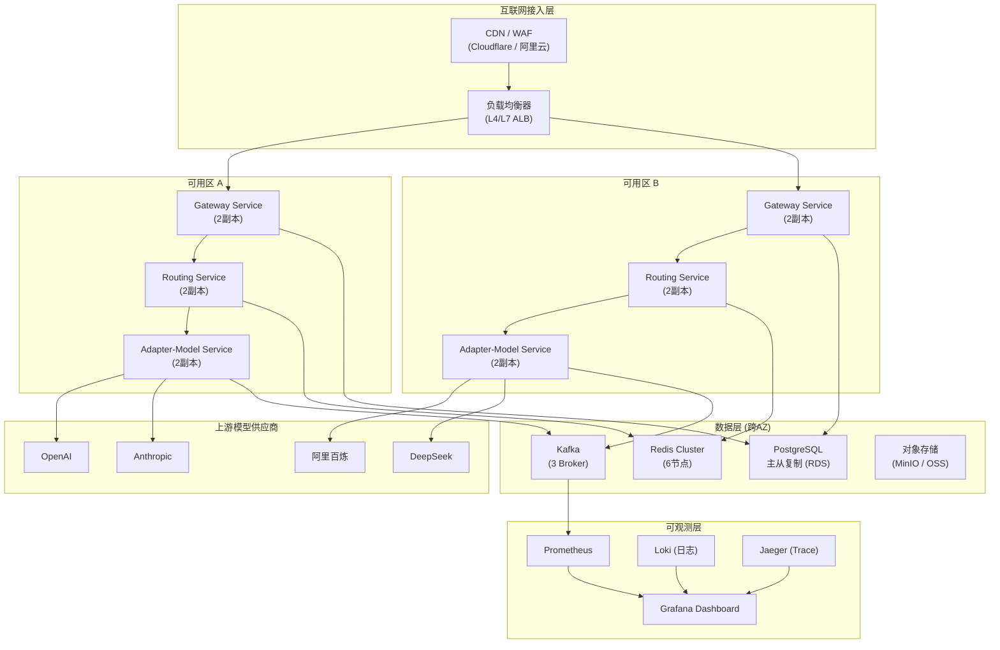
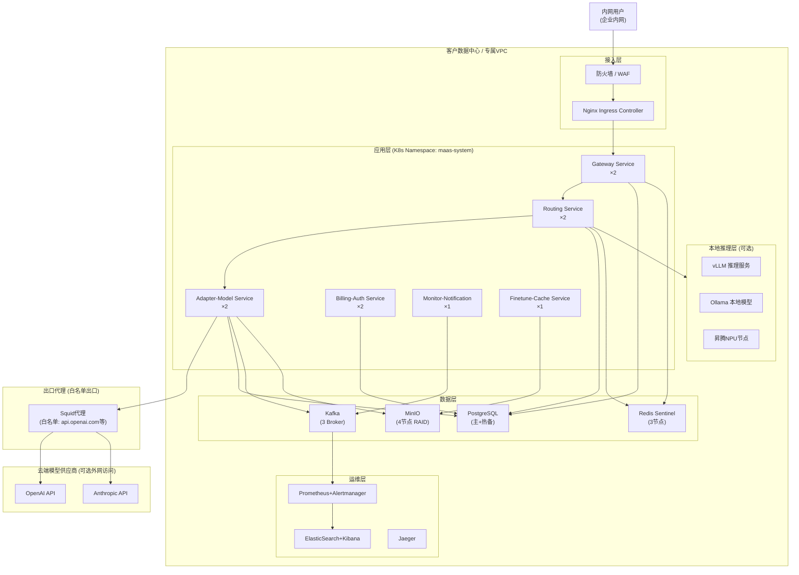
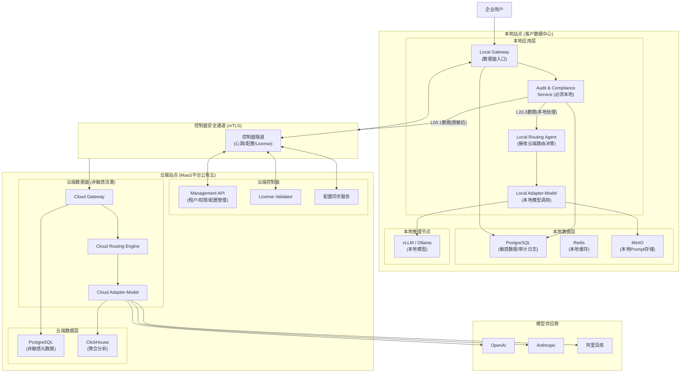
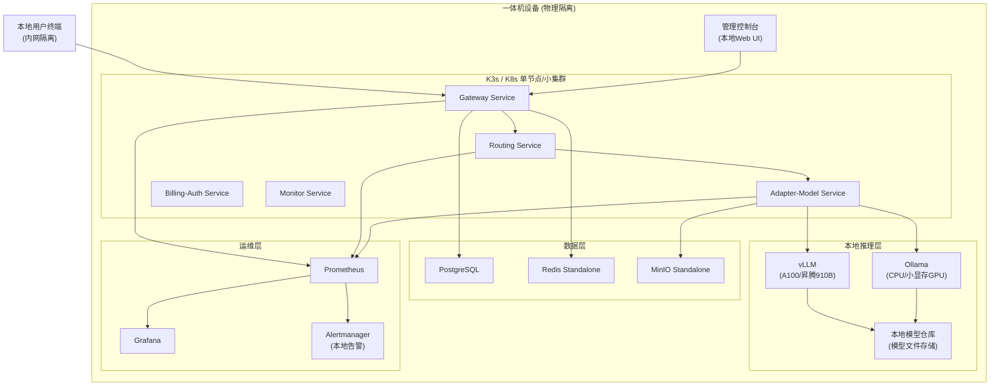
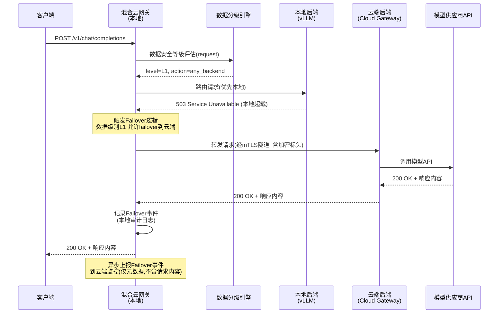
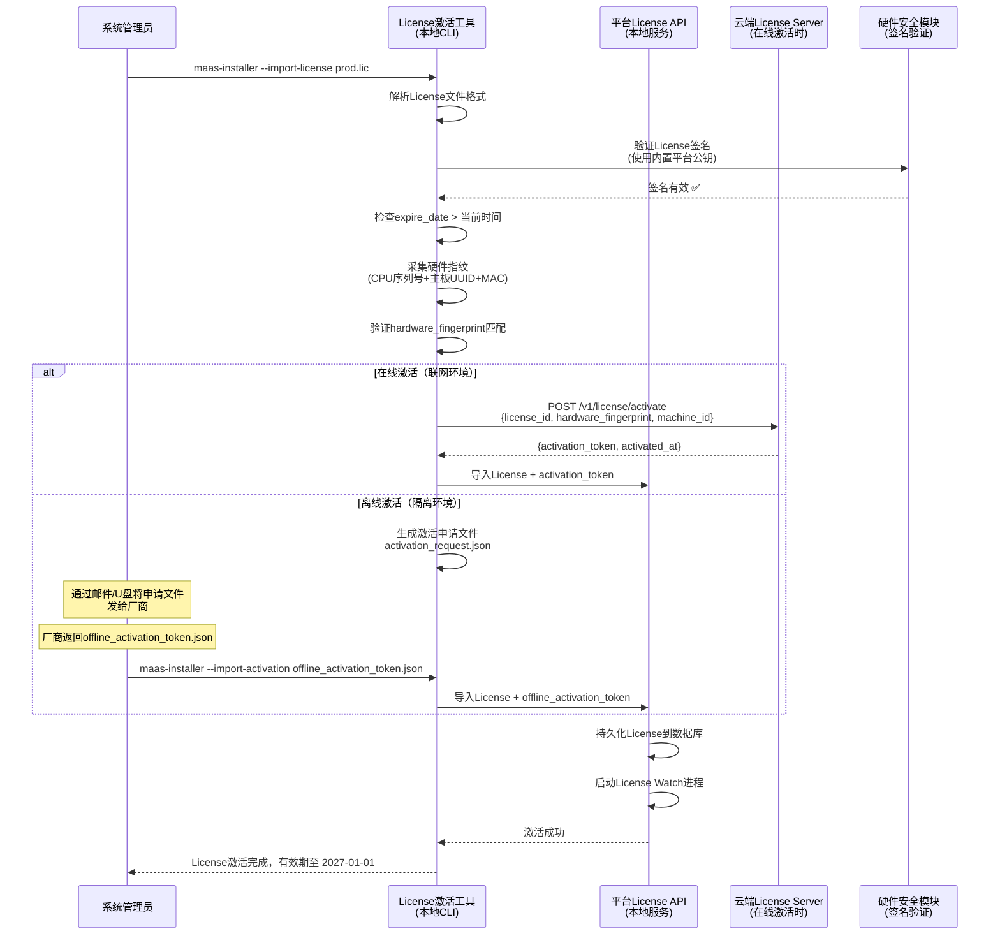
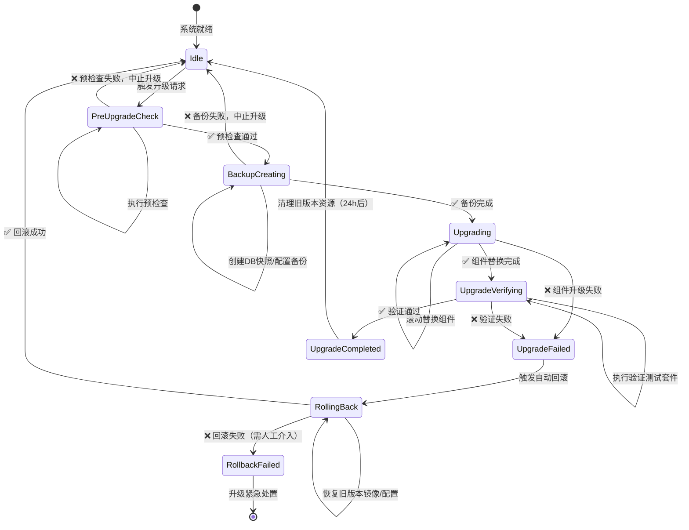

# MaaS平台 PRD V2.0 —— 08 私有化交付与混合云规格

**文档版本：** V2.0.0  
**编写日期：** 2026年05月21日  
**文档状态：** 设计评审中  
**机密等级：** 内部保密  
**所属模块：** 私有化交付与混合云  
**上游依赖：** `00-总纲与导航.md`、`01-产品定位与用户角色体系.md`、`03-路由策略与容灾降级规格.md`  
**下游影响：** 运维手册、部署拓扑文档、SLA服务等级协议

---

## 目录

1. [私有化交付战略定位](#1-私有化交付战略定位)
2. [部署形态与拓扑规格](#2-部署形态与拓扑规格)
3. [核心组件清单](#3-核心组件清单)
4. [离线安装包规格](#4-离线安装包规格)
5. [混合云路由规格](#5-混合云路由规格)
6. [许可证机制](#6-许可证机制)
7. [升级与回滚规格](#7-升级与回滚规格)
8. [国产化适配规格](#8-国产化适配规格)
9. [容量规划指南](#9-容量规划指南)
10. [私有化验收标准](#10-私有化验收标准)
11. [运维支持规格](#11-运维支持规格)

---

## 1. 私有化交付战略定位

### 1.1 战略背景与价值主张

随着企业AI采购从"尝鲜期"进入"生产级治理期"，安全合规、数据主权、成本可控三大诉求日益凸显。金融、政务、军工、医疗等强监管行业对AI基础设施的部署位置、数据流向、访问审计提出了极为严格的要求，单一公有云SaaS模式已无法满足其采购门槛。MaaS平台V2.0将私有化交付能力作为核心战略能力之一，旨在以标准化、可复制的方式支撑规模化私有化交付，消除因"每个私有化项目都是定制化"导致的交付成本失控问题。

私有化交付的核心价值主张：
- **数据主权**：模型请求内容、响应内容、企业私有Prompt均不离开客户数据中心，满足等保三级、MLPS2.0、行业监管要求
- **成本可预期**：私有化License按租户数/请求量/功能集定价，客户可精确预算全生命周期成本
- **标准化交付**：通过离线安装包、预检查脚本、验收自动化测试，将单次交付周期压缩至5个工作日以内
- **自主可控**：支持国产化操作系统（麒麟/统信）、国产CPU（飞腾/鲲鹏/海光）、国产GPU（昇腾/天数），满足"信创"合规要求
- **混合演进路径**：客户可从纯私有化起步，逐步演进到混合云模式，享受云端弹性能力的同时保持核心数据在本地

### 1.2 三种交付形态定义

MaaS平台V2.0定义三种标准交付形态，形态之间存在明确的能力边界和适用场景区分：

#### 形态一：公有SaaS（Multi-Tenant Cloud）

**定义：** 平台运营方统一运维，所有租户共享底层基础设施（计算、存储、网络），通过租户隔离机制保障数据安全。

**核心特征：**
- 租户隔离层次：逻辑隔离（数据库行级多租户 + API层鉴权隔离）
- 上线周期：即注册即用，无需交付
- 成本模式：按量计费（Token/请求/坐席），无前期投入
- 运维责任：平台方完全负责
- 功能迭代：自动获取最新版本，无需手动升级

**适用客户画像：**
- 互联网企业、创业公司、中小型企业
- AI应用以内容生成、客服、代码辅助为主，对数据合规要求相对宽松
- 技术团队规模小，无专职运维能力
- 希望快速验证AI业务价值，优先灵活性而非绝对控制权

**能力限制（相比专有云）：**
- 不支持本地GPU资源接入
- 不支持完全离线环境
- Prompt内容会经过平台方数据处理管道
- 不支持自定义网络策略与防火墙规则

#### 形态二：专有云（Dedicated VPC / Private Cloud）

**定义：** 在客户私有化环境（自建数据中心、客户专属VPC或托管云专区）独立部署完整平台实例，客户拥有独立的计算、存储、网络资源。

**核心特征：**
- 租户隔离层次：物理/资源隔离（独立Kubernetes集群、独立数据库实例）
- 上线周期：5~15个工作日（视环境复杂度）
- 成本模式：License按年授权 + 原厂维保
- 运维责任：客户方主责，平台方提供远程技术支持
- 功能迭代：客户自主决定升级时机，平台方提供升级包与升级指导

**适用客户画像：**
- 金融机构（银行、保险、券商）、政府机关、央国企
- 数据安全等级要求高（等保三级及以上），内部合规部门要求数据不出本机房
- 有一定IT运维能力，或有成熟IT外包服务商
- 愿意为数据主权和安全可控支付更高溢价

**能力增强（相比公有SaaS）：**
- 支持接入客户自建GPU集群（Ollama、vLLM、私有推理服务）
- 支持完全离线运行（断网模式）
- 支持客户自定义SSO集成（LDAP、AD、飞书、钉钉）
- 支持网络策略自定义、出口IP固定
- 支持部署在国产化环境（麒麟OS + 鲲鹏/飞腾CPU）

#### 形态三：一体机（Appliance，完全离线）

**定义：** 平台软件预安装在指定硬件设备（服务器一体机）上，交付物为"开箱即用"的硬件+软件一体交付物，适用于完全物理隔离（无互联网）的环境。

**核心特征：**
- 租户隔离层次：单租户（绝大多数场景）或有限的小规模多租户
- 上线周期：设备入场后2个工作日完成激活配置
- 成本模式：硬件采购 + 软件License，一次性付费为主
- 运维责任：客户方完全负责，平台方提供现场服务支持（按次计费）
- 功能迭代：通过离线升级包（U盘/内网包）手动升级，审核周期长

**适用客户画像：**
- 涉密单位、军工企业、国家安全相关机构
- 核电、化工等工业控制系统周边
- 完全隔离网络（物理隔离、红区网络）中的AI能力需求
- 对硬件品牌、产地有严格要求（国产化一体机）

### 1.3 混合云设计原则

混合云形态是专有云形态的超集，在保留本地数据主权的基础上，通过安全通道将本地实例与云端能力打通，实现弹性扩缩、云端模型能力补充、云端数据分析等目标。混合云设计遵循以下核心原则：

**原则一：数据分级，分级控制流向**
将数据分为四个安全等级：
- L0（公开数据）：可自由上云，支持云端日志聚合与分析
- L1（内部数据）：可上云但需加密传输，Prompt内容在本地脱敏后上云
- L2（敏感数据）：仅本地处理，模型调用只走本地后端，禁止路由到云端
- L3（秘密/机密数据）：完全本地，不触发任何云端通信

**原则二：路由智能感知本地/云端后端能力差异**
混合云路由引擎需感知本地GPU负载、本地模型能力列表、云端模型能力列表，在保证数据合规的前提下，优先路由到本地，本地超载或无对应能力时自动故障转移到云端（需满足数据安全等级约束）。

**原则三：配置下发与状态上报走独立控制面通道**
混合云控制面通信（配置同步、健康心跳、许可证验证）走独立加密通道（TLS双向认证），与数据面（模型请求）严格隔离，防止数据面异常影响控制面，也防止控制面权限被用于访问数据面。

**原则四：本地实例具备完整独立运行能力**
混合云设计中，本地实例（边缘节点）必须具备在断开云端连接时持续运行的能力（降级为纯本地模式），最大宽限期48小时（License续签宽限期），避免云端故障导致本地业务中断。

**原则五：可审计的混合云操作日志**
所有混合云控制面操作（配置下发、License更新、远程升级触发）必须生成本地可见的操作日志，审计日志不依赖云端存储，保障本地审计能力的完整性。

---

## 2. 部署形态与拓扑规格

### 2.1 标准SaaS部署拓扑

标准SaaS部署采用多可用区（Multi-AZ）高可用架构，所有组件均运行在平台方托管的Kubernetes集群中，通过Ingress Controller对外提供服务。



**SaaS形态最小生产规格：**

| 组件 | 实例数 | CPU | 内存 | 存储 | 网络带宽 | 备注 |
|------|--------|-----|------|------|----------|------|
| Gateway Service | 4 | 4核 | 8GB | 20GB | 10Gbps | 跨AZ各2副本 |
| Routing Service | 4 | 4核 | 8GB | 20GB | 1Gbps | 跨AZ各2副本 |
| Adapter-Model Service | 4 | 8核 | 16GB | 50GB | 10Gbps | 跨AZ各2副本 |
| Billing-Auth Service | 2 | 4核 | 8GB | 50GB | 1Gbps | 跨AZ各1副本 |
| Monitor-Notification Service | 2 | 4核 | 8GB | 100GB | 1Gbps | 跨AZ各1副本 |
| PostgreSQL (RDS) | 1主2从 | 8核 | 32GB | 500GB SSD | 1Gbps | 数据持久化 |
| Redis Cluster | 6节点 | 4核 | 16GB | 50GB | 1Gbps | 缓存+会话 |
| Kafka | 3 Broker | 4核 | 16GB | 200GB | 10Gbps | 请求审计流 |

### 2.2 专有云（VPC隔离）部署拓扑

专有云部署在客户数据中心或专属VPC中，与公网完全隔离，模型供应商访问通过白名单出口代理进行，所有组件运行在客户自管的Kubernetes集群上。



**专有云形态最小生产规格（无本地GPU）：**

| 组件 | 实例数 | CPU | 内存 | 存储 | GPU | 网络带宽 |
|------|--------|-----|------|------|-----|----------|
| 控制节点（K8s Master） | 3 | 8核 | 16GB | 200GB SSD | 无 | 1Gbps |
| 应用节点（Worker） | 4 | 16核 | 32GB | 200GB SSD | 无 | 10Gbps |
| 数据节点（DB/Cache） | 3 | 16核 | 64GB | 1TB NVMe SSD | 无 | 10Gbps |
| 存储节点（MinIO） | 4 | 8核 | 16GB | 4TB HDD×4 | 无 | 10Gbps |
| 运维节点（Ops） | 1 | 8核 | 16GB | 500GB SSD | 无 | 1Gbps |

**专有云形态最小生产规格（含本地GPU推理）：**

| 组件 | 实例数 | CPU | 内存 | 存储 | GPU | 网络带宽 |
|------|--------|-----|------|------|-----|----------|
| GPU推理节点 | 2+ | 32核 | 128GB | 1TB NVMe | A100 80GB ×4 或昇腾910B ×4 | 200Gbps IB |
| 其余同上 | - | - | - | - | - | - |

### 2.3 混合云（本地审计+云端路由）部署拓扑

混合云形态在本地保留审计、合规、数据安全组件，将路由决策和模型调用分级处理，敏感数据走本地后端，非敏感数据可走云端后端。



**混合云形态本地节点最小规格：**

| 组件 | 实例数 | CPU | 内存 | 存储 | 网络带宽 | 备注 |
|------|--------|-----|------|------|----------|------|
| 本地Gateway | 2 | 8核 | 16GB | 100GB | 10Gbps | HA主备 |
| 本地Audit服务 | 2 | 4核 | 8GB | 500GB | 1Gbps | 审计日志本地存储 |
| 本地路由代理 | 2 | 4核 | 8GB | 50GB | 1Gbps | 接收云端策略 |
| 本地Adapter | 2 | 8核 | 16GB | 100GB | 10Gbps | 本地模型调用 |
| PostgreSQL（审计） | 1主1备 | 8核 | 32GB | 1TB SSD | 1Gbps | 敏感数据落地 |
| Redis（本地缓存） | 3节点 | 4核 | 16GB | 50GB | 1Gbps | 会话/限流 |
| MinIO（本地存储） | 2节点 | 4核 | 8GB | 2TB HDD | 1Gbps | Prompt/响应存档 |

### 2.4 一体机（完全离线）部署拓扑

一体机形态所有服务运行在单台或小型集群服务器上，无任何外网连接，通过本地推理引擎提供模型能力。



**一体机形态标准硬件配置（推荐BOM）：**

| 项目 | 最小配置（小型） | 标准配置（中型） | 增强配置（大型） |
|------|----------------|----------------|----------------|
| CPU | 鲲鹏920 32核 / 飞腾D3000 32核 | 鲲鹏920 64核×2 | 鲲鹏920 64核×4 |
| 内存 | 256GB DDR4 ECC | 512GB DDR4 ECC | 1TB DDR4 ECC |
| 系统盘 | 2TB NVMe SSD×2 RAID1 | 4TB NVMe SSD×4 RAID10 | 8TB NVMe SSD×8 |
| 数据盘 | 8TB SATA HDD×4 | 16TB SATA HDD×8 | 32TB SATA HDD×12 |
| GPU | 昇腾910B×2 (64GB) | 昇腾910B×4 (64GB) | 昇腾910B×8 (64GB) |
| 网络 | 万兆以太网×2 | 万兆以太网×4 | 25Gbps以太网×4 |
| 电源 | 2000W冗余电源 | 3000W冗余电源 | 4000W冗余电源 |

---

## 3. 核心组件清单

### 3.1 组件总览

MaaS平台V2.0由六个核心微服务和若干基础设施中间件组成。以下为完整组件清单，包含每个组件的版本、依赖关系、最小规格、网络需求及在各部署形态中的必要性。

### 3.2 微服务组件详表

| 组件名称 | 最新版本 | 容器镜像 | 最小CPU | 最小内存 | 最小磁盘 | SaaS必须 | 专有云必须 | 一体机必须 |
|----------|---------|---------|---------|---------|---------|---------|---------|---------|
| gateway-service | v2.0.3 | maas/gateway:v2.0.3 | 2核 | 4GB | 10GB | ✅ | ✅ | ✅ |
| routing-service | v2.0.3 | maas/routing:v2.0.3 | 2核 | 4GB | 10GB | ✅ | ✅ | ✅ |
| adapter-model-service | v2.0.3 | maas/adapter:v2.0.3 | 4核 | 8GB | 20GB | ✅ | ✅ | ✅ |
| billing-auth-service | v2.0.3 | maas/billing:v2.0.3 | 2核 | 4GB | 20GB | ✅ | ✅ | ✅ |
| monitor-notification-service | v2.0.3 | maas/monitor:v2.0.3 | 2核 | 4GB | 50GB | ✅ | ✅ | 可选 |
| finetune-cache-service | v2.0.3 | maas/finetune:v2.0.3 | 4核 | 16GB | 100GB | ✅ | 可选 | 可选 |
| console-frontend | v2.0.3 | maas/console-fe:v2.0.3 | 0.5核 | 512MB | 1GB | ✅ | ✅ | ✅ |
| admin-frontend | v2.0.3 | maas/admin-fe:v2.0.3 | 0.5核 | 512MB | 1GB | ✅ | ✅ | ✅ |
| docs-site | v2.0.3 | maas/docs:v2.0.3 | 0.5核 | 256MB | 500MB | ✅ | 可选 | 可选 |

### 3.3 基础设施中间件组件表

| 中间件 | 版本要求 | 最小副本数 | 最小CPU/节点 | 最小内存/节点 | 最小存储/节点 | 必须 | 备注 |
|--------|---------|----------|-------------|-------------|-------------|------|------|
| PostgreSQL | ≥14.0 | 1主1备 | 4核 | 16GB | 200GB SSD | ✅ | 主数据存储 |
| Redis | ≥7.0 | 3节点(Sentinel模式) | 2核 | 8GB | 20GB | ✅ | 缓存/限流/会话 |
| Apache Kafka | ≥3.4 | 3 Broker | 4核 | 16GB | 100GB | ✅ | 审计日志流/异步任务 |
| MinIO | ≥RELEASE.2024 | 4节点(分布式) | 2核 | 4GB | 1TB HDD/节点 | ✅ | 对象存储/模型文件 |
| Prometheus | ≥2.45 | 1（HA需2） | 2核 | 8GB | 200GB | ✅ | 指标采集 |
| Grafana | ≥10.0 | 1 | 2核 | 4GB | 10GB | ✅ | 监控大屏 |
| Alertmanager | ≥0.26 | 1 | 1核 | 1GB | 5GB | ✅ | 告警路由 |
| Loki | ≥2.9 | 1 | 2核 | 4GB | 500GB | 推荐 | 日志聚合 |
| Jaeger | ≥1.51 | 1 | 2核 | 4GB | 200GB | 推荐 | 分布式Trace |
| Nginx Ingress | ≥1.9 | 2 | 2核 | 2GB | 5GB | ✅ | 入口控制器 |

### 3.4 组件间依赖关系

| 服务 | 强依赖（启动必须） | 弱依赖（功能降级） | 外网依赖 |
|------|-----------------|-----------------|--------|
| gateway-service | PostgreSQL, Redis | Kafka, Jaeger | 无（仅转发） |
| routing-service | PostgreSQL, Redis | Kafka | 无 |
| adapter-model-service | Redis, Kafka | Jaeger, MinIO | 模型供应商API（可配置走代理） |
| billing-auth-service | PostgreSQL, Redis | Kafka | License验证服务（离线模式可本地验证） |
| monitor-notification-service | PostgreSQL, Prometheus | Loki, Kafka | 告警webhook（可配置内网目标） |
| finetune-cache-service | PostgreSQL, MinIO, Redis | Kafka | 可选外网模型下载 |

### 3.5 网络端口规格

| 服务 | 监听端口 | 协议 | 对外暴露 | 说明 |
|------|---------|------|---------|------|
| gateway-service | 8080 (HTTP), 8443 (HTTPS) | HTTP/2, gRPC | ✅ | 主入口，用户请求入口 |
| routing-service | 8081 | HTTP/gRPC | 内部 | 仅集群内访问 |
| adapter-model-service | 8082 | HTTP/gRPC | 内部 | 仅集群内访问 |
| billing-auth-service | 8083 | HTTP/gRPC | 内部 | 仅集群内访问 |
| monitor-notification-service | 8084, 9090(metrics) | HTTP | 内部 | 9090需Prometheus采集 |
| finetune-cache-service | 8085 | HTTP/gRPC | 内部 | 仅集群内访问 |
| console-frontend | 3000 | HTTP | ✅（走Ingress） | 控制台前端 |
| admin-frontend | 3001 | HTTP | ✅（走Ingress，限IP白名单） | 管理后台 |
| PostgreSQL | 5432 | TCP | ❌ | 仅数据节点网段访问 |
| Redis | 6379 | TCP | ❌ | 仅应用节点网段访问 |
| Kafka | 9092 | TCP | ❌ | 仅集群内访问 |

---

## 4. 离线安装包规格

### 4.1 离线包设计目标

离线安装包（Offline Installation Bundle，简称OIB）是专有云和一体机形态交付的核心物料，要求在完全无互联网的环境中，通过标准化流程完成MaaS平台的全量安装。离线包必须满足：
- **完整性**：包含所有依赖，无需安装过程中访问外网（PyPI、DockerHub、npm等均需内置）
- **可验证性**：每个文件均有SHA-256校验值，整包有GPG签名
- **幂等性**：重复执行安装脚本不产生副作用，支持断点续装
- **可审计性**：安装过程生成结构化安装日志，每步操作有时间戳和执行结果

### 4.2 离线包目录结构

```
maas-offline-bundle-v2.0.3-{edition}-{arch}-{date}.tar.gz
├── MANIFEST.json                    # 包清单，含所有文件SHA-256
├── SIGNATURE.sig                    # GPG签名（平台私钥签名MANIFEST.json）
├── VERSION                          # 版本标识文件
├── RELEASE_NOTES.md                 # 本版本变更说明
├── bin/                             # 安装工具二进制
│   ├── maas-installer               # 主安装程序（Linux ELF，静态链接）
│   ├── maas-precheck                # 预检查工具
│   ├── maas-verify                  # 安装验证工具
│   └── maas-upgrade                 # 升级工具
├── images/                          # Docker/OCI镜像包
│   ├── maas-core-images.tar         # MaaS核心服务镜像（约15GB）
│   ├── infra-images.tar             # 基础设施镜像（约8GB）
│   └── images.manifest.json         # 镜像清单（含digest）
├── charts/                          # Helm Charts
│   ├── maas-core/                   # MaaS核心服务Chart
│   ├── maas-infra/                  # 基础设施Chart
│   └── values/                      # 不同形态的values模板
│       ├── values-saas.yaml
│       ├── values-private.yaml
│       ├── values-hybrid.yaml
│       └── values-appliance.yaml
├── k8s/                             # Kubernetes安装包（K3s/K8s）
│   ├── k3s-v1.28.x-linux-amd64.tar.gz
│   ├── k3s-v1.28.x-linux-arm64.tar.gz
│   └── k8s-v1.28.x-images.tar.gz
├── configs/                         # 默认配置模板
│   ├── cluster-config.yaml.tmpl
│   ├── tls/                         # 自签名TLS证书（仅测试用）
│   └── gm-tls/                      # 国密TLS证书模板
├── scripts/                         # 辅助脚本
│   ├── precheck.sh                  # 预检查脚本
│   ├── install.sh                   # 安装入口脚本
│   ├── post-install-verify.sh       # 安装后验证脚本
│   ├── uninstall.sh                 # 卸载脚本
│   └── upgrade.sh                   # 升级脚本
├── db-migrations/                   # 数据库迁移文件
│   ├── v2.0.0/
│   ├── v2.0.1/
│   ├── v2.0.2/
│   └── v2.0.3/
├── models/                          # 模型文件（仅Appliance版包含）
│   └── .gitkeep                     # 标准版此目录为空
├── docs/                            # 离线文档
│   ├── installation-guide.pdf
│   ├── operation-guide.pdf
│   └── api-reference.pdf
└── license/                         # 临时评估License
    └── trial.lic
```

### 4.3 版本标识规格

VERSION文件格式（JSON）：

```json
{
  "product": "MaaS Platform",
  "version": "2.0.3",
  "edition": "private",
  "arch": "amd64",
  "build_date": "2026-05-21T08:00:00Z",
  "git_commit": "a1b2c3d4e5f6",
  "k8s_min_version": "1.26.0",
  "k8s_max_version": "1.29.x",
  "os_support": ["CentOS 7.9+", "RHEL 8.x", "Ubuntu 20.04/22.04", "麒麟V10", "统信UOS 20"],
  "arch_support": ["amd64", "arm64", "loongarch64"],
  "bundle_sha256": "e3b0c44298fc1c149afbf4c8996fb92427ae41e4649b934ca495991b7852b855",
  "components": {
    "gateway-service": "v2.0.3",
    "routing-service": "v2.0.3",
    "adapter-model-service": "v2.0.3",
    "billing-auth-service": "v2.0.3",
    "monitor-notification-service": "v2.0.3",
    "finetune-cache-service": "v2.0.3",
    "postgresql": "14.10",
    "redis": "7.2.3",
    "kafka": "3.6.1",
    "minio": "RELEASE.2024-01-18T22-51-28Z"
  }
}
```

### 4.4 预检查脚本规格（precheck.sh）

预检查脚本在安装前自动验证目标环境是否满足所有前置条件，输出结构化报告，并在关键项不满足时阻止安装继续。

**检查项清单：**

| 检查项 | 类型 | 最低要求 | 不满足时行为 |
|--------|------|---------|------------|
| CPU核心数 | BLOCK | ≥16核（生产），≥8核（测试） | 阻止安装 |
| 可用内存 | BLOCK | ≥64GB（生产），≥32GB（测试） | 阻止安装 |
| 系统盘可用空间 | BLOCK | ≥100GB | 阻止安装 |
| 数据盘可用空间 | BLOCK | ≥500GB | 阻止安装 |
| 操作系统版本 | BLOCK | 见支持列表 | 阻止安装 |
| 内核版本 | BLOCK | ≥4.18（x86），≥5.10（ARM） | 阻止安装 |
| Docker/Containerd版本 | BLOCK | Docker≥24.0，Containerd≥1.7 | 阻止安装 |
| CPU架构匹配 | BLOCK | 与安装包arch一致 | 阻止安装 |
| 防火墙端口 | WARN | 8080,8443,6443等必要端口 | 警告继续 |
| SELinux模式 | WARN | 建议Permissive | 警告继续 |
| 时钟同步 | WARN | NTP同步误差<1s | 警告继续 |
| swap配置 | WARN | 建议关闭swap | 警告继续 |
| hostname解析 | BLOCK | 所有节点hostname可互相解析 | 阻止安装 |
| GPU驱动（含GPU时） | BLOCK | CUDA≥12.0 或 CANN≥7.0 | 阻止安装（如选GPU节点） |
| License文件有效性 | BLOCK | License存在且签名验证通过 | 阻止安装 |

**预检查脚本输出格式（JSON，机器可读）：**

```json
{
  "precheck_version": "1.0",
  "run_at": "2026-05-21T09:00:00Z",
  "hostname": "maas-master-01",
  "overall_result": "PASS",
  "block_failures": [],
  "warnings": [
    {
      "item": "swap_config",
      "detail": "Swap is enabled (8192 MB). Recommend disabling for K8s.",
      "severity": "WARN"
    }
  ],
  "checks": [
    {"item": "cpu_cores", "result": "PASS", "actual": 32, "required": 16},
    {"item": "memory_gb", "result": "PASS", "actual": 128, "required": 64}
  ]
}
```

### 4.5 安装脚本规格（install.sh）

安装脚本采用幂等化设计，支持以下安装模式：

```bash
# 交互式安装（推荐首次安装）
./install.sh --mode interactive --edition private --values configs/cluster-config.yaml

# 静默安装（CI/CD或自动化场景）
./install.sh --mode silent --edition appliance --values configs/appliance-config.yaml --license license/prod.lic

# 仅安装基础设施（分步安装场景）
./install.sh --mode silent --component infra-only

# 仅安装MaaS应用（基础设施已存在）
./install.sh --mode silent --component app-only --values configs/cluster-config.yaml
```

安装阶段定义（状态持久化到 `/var/maas-install/install-state.json`）：

| 阶段 | 阶段名 | 预计时长 | 幂等 |
|------|--------|---------|------|
| 1 | precheck | 2分钟 | ✅ |
| 2 | prepare_images | 5分钟 | ✅ |
| 3 | install_k8s | 10分钟 | ✅ |
| 4 | install_infra | 15分钟 | ✅ |
| 5 | install_app | 10分钟 | ✅ |
| 6 | init_db | 3分钟 | ✅ |
| 7 | import_license | 1分钟 | ✅ |
| 8 | post_verify | 5分钟 | ✅ |

### 4.6 安装验证脚本规格（post-install-verify.sh）

安装完成后，验证脚本自动执行以下检查并生成验收报告：

| 验证项 | 验证方法 | 通过标准 |
|--------|---------|---------|
| 所有Pod运行状态 | kubectl get pods -A | 全部Running，无CrashLoopBackOff |
| API健康检查 | GET /healthz | 返回200，响应体含所有组件状态 |
| 数据库连接 | SQL: SELECT 1 | 成功返回 |
| Redis连接 | PING命令 | 返回PONG |
| Kafka主题创建 | kafka-topics.sh --list | 必要主题均存在 |
| License验证 | License API | 返回valid=true |
| 管理控制台访问 | HTTP GET https://admin.xxx | 返回200 |
| 用户控制台访问 | HTTP GET https://console.xxx | 返回200 |
| 发送测试请求 | POST /v1/chat/completions | 返回200或路由成功 |

---

## 5. 混合云路由规格

### 5.1 混合云路由核心概念

混合云路由是MaaS平台在混合云形态下的核心差异化能力，它在统一路由策略框架下，将本地后端（Local Backend）和云端后端（Cloud Backend）视为同等的路由目标，通过数据安全等级约束、延迟策略、成本策略、容灾策略，智能决策每个请求的处理位置。

**本地后端（Local Backend）：** 部署在客户数据中心的推理服务（vLLM、Ollama、昇腾推理服务等），以及通过本地Adapter调用的客户内网部署的大模型服务。

**云端后端（Cloud Backend）：** MaaS平台云端托管的模型适配器，通过云端API Key访问OpenAI、Anthropic、阿里百炼等公有云模型服务。

**混合路由网关（Hybrid Gateway）：** 部署在本地的请求入口，负责接受企业内部请求，应用数据安全策略，决策是否将请求路由到本地后端或通过安全隧道转发到云端处理。

### 5.2 数据不出境规则引擎

数据不出境规则是混合云路由的最高优先级约束，在所有路由策略计算之前生效。

**数据分级策略配置数据模型：**

```json
{
  "data_classification_policy": {
    "policy_id": "dcp-001",
    "tenant_id": "tenant-abc",
    "version": "1.0",
    "default_level": "L1",
    "rules": [
      {
        "rule_id": "rule-001",
        "priority": 1,
        "conditions": {
          "project_tags": ["finance", "sensitive"],
          "api_key_labels": ["prod-financial"]
        },
        "classification": "L2",
        "action": "local_only"
      },
      {
        "rule_id": "rule-002",
        "priority": 2,
        "conditions": {
          "request_contains_pii": true
        },
        "classification": "L2",
        "action": "local_only"
      },
      {
        "rule_id": "rule-003",
        "priority": 3,
        "conditions": {
          "project_tags": ["public", "marketing"]
        },
        "classification": "L0",
        "action": "any_backend"
      }
    ],
    "level_routing_map": {
      "L0": ["local_backend", "cloud_backend"],
      "L1": ["local_backend", "cloud_backend_encrypted"],
      "L2": ["local_backend"],
      "L3": ["local_backend_airgap"]
    }
  }
}
```

### 5.3 混合云路由配置数据模型

```json
{
  "hybrid_routing_config": {
    "config_id": "hrc-001",
    "tenant_id": "tenant-abc",
    "version": "2.0",
    "local_backends": [
      {
        "backend_id": "local-vllm-01",
        "name": "本地vLLM集群",
        "endpoint": "http://vllm.internal:8000",
        "auth_type": "bearer",
        "models": ["Qwen2.5-72B-Instruct", "Qwen2.5-7B-Instruct"],
        "max_concurrent": 100,
        "priority": 10,
        "health_check_url": "http://vllm.internal:8000/health",
        "timeout_ms": 30000,
        "tags": ["local", "high-security"]
      }
    ],
    "cloud_backends": [
      {
        "backend_id": "cloud-openai-01",
        "name": "云端OpenAI",
        "provider": "openai",
        "models": ["gpt-4o", "gpt-4o-mini"],
        "priority": 5,
        "allowed_data_levels": ["L0", "L1"],
        "tags": ["cloud", "gpt-family"]
      }
    ],
    "routing_strategy": {
      "default_strategy": "local_first",
      "local_overload_threshold": 0.85,
      "failover_to_cloud": true,
      "failover_allowed_levels": ["L0", "L1"],
      "latency_budget_ms": 500,
      "cost_weight": 0.3,
      "latency_weight": 0.7
    },
    "tunnel_config": {
      "tunnel_type": "mTLS",
      "ca_cert_path": "/etc/maas/certs/ca.crt",
      "client_cert_path": "/etc/maas/certs/client.crt",
      "client_key_path": "/etc/maas/certs/client.key",
      "tunnel_endpoint": "https://cloud-gateway.maas.example.com:443",
      "keepalive_interval_s": 30,
      "reconnect_max_retry": 5
    }
  }
}
```

### 5.4 延迟混合策略

当本地后端和云端后端均可用时，混合路由支持以下延迟相关策略：

| 策略名称 | 触发条件 | 路由行为 | 适用场景 |
|----------|---------|---------|---------|
| local_first | 始终 | 优先本地，本地超载时failover云端 | 默认策略，大多数私有化场景 |
| latency_optimized | 本地P95>500ms | 同时向本地和云端发请求，取先回的结果（hedged request） | 低延迟敏感场景，数据级别L0/L1 |
| cost_optimized | 非高峰时段（可配置） | 优先路由到成本更低的后端（本地GPU成本vs.云端按量计费） | 成本敏感的批量推理 |
| cloud_first | 本地维护窗口 | 本地维护期间自动全量切换云端 | 计划内维护 |
| round_robin_hybrid | 特定实验项目 | 按权重在本地/云端之间分流（用于A/B对比） | 模型质量比对实验 |

### 5.5 跨云Failover机制



**Failover触发条件：**

| 触发类型 | 阈值/条件 | 恢复条件 | 最大Failover比例 |
|----------|---------|---------|----------------|
| 本地服务不可用 | 健康检查连续失败3次（间隔10s） | 连续成功2次健康检查 | 100%（完全切换） |
| 本地服务超载 | 并发利用率>85%持续60s | 并发利用率<70%持续30s | 30%（部分切换） |
| 本地服务超时 | P99延迟>3000ms持续120s | P99延迟<1000ms持续60s | 50%（部分切换） |
| 本地服务错误率高 | 5xx错误率>10%持续60s | 错误率<2%持续120s | 100%（完全切换） |

**注意：** Failover到云端前，路由引擎必须再次检查数据安全级别。L2/L3级别请求在本地后端不可用时，**不允许**failover到云端，将返回503错误并触发高优先级告警。

### 5.6 混合云控制面同步

控制面同步负责将云端配置（路由策略、模型目录更新、License状态）定期推送到本地节点，以及将本地运行状态（健康指标、License使用量）汇报到云端。

| 同步内容 | 方向 | 频率 | 数据敏感性 | 加密要求 |
|---------|------|------|----------|---------|
| 路由策略配置 | 云→本地 | 事件驱动（变更推送）+ 5分钟全量同步 | 低 | TLS传输加密 |
| License状态 | 双向 | 每小时心跳，每日全量核对 | 中 | TLS + 内容加密 |
| 模型目录更新 | 云→本地 | 每日 | 低 | TLS传输加密 |
| 健康状态上报 | 本地→云 | 每30秒 | 低（仅指标，无请求内容） | TLS传输加密 |
| License使用量 | 本地→云 | 每小时 | 中 | TLS + 内容加密 |
| 告警事件 | 本地→云 | 实时（事件驱动） | 低 | TLS传输加密 |

---

## 6. 许可证机制

### 6.1 许可证设计目标

许可证机制（License Mechanism）是私有化商业变现的核心保障，需要同时满足：
- **防篡改**：License内容不可被客户伪造或修改
- **离线可验证**：在完全断网环境下，本地可独立验证License有效性，无需回调云端
- **硬件绑定（可选）**：高安全等级场景支持将License与服务器硬件指纹绑定，防止License迁移
- **宽限期保护**：网络波动、云端故障不应导致客户业务立即中断，设计合理的宽限期
- **精细化计量**：License粒度足够细，支持按租户数、模型数、请求配额、功能集多维度授权

### 6.2 License文件格式

License文件采用JSON + RSA-4096签名（或国密SM2签名）的格式，文件扩展名为 `.lic`。

**License JSON结构：**

```json
{
  "license_id": "lic-2026-abc123",
  "license_version": "2.0",
  "product": "MaaS Platform",
  "edition": "private_cloud",
  "issued_to": {
    "organization": "示例银行股份有限公司",
    "contact_email": "it-admin@example-bank.com",
    "region": "CN"
  },
  "issued_by": {
    "vendor": "MaaS平台运营方",
    "issuer_id": "maas-issuer-001"
  },
  "issued_at": "2026-01-01T00:00:00Z",
  "expire_date": "2027-01-01T00:00:00Z",
  "grace_period_hours": 48,
  "quotas": {
    "tenant_count": 50,
    "user_count_per_tenant": 500,
    "model_count": 20,
    "request_quota_per_month": 10000000,
    "token_quota_per_month": 5000000000,
    "concurrent_requests": 200,
    "api_key_count": 200,
    "project_count_per_tenant": 50
  },
  "features_enabled": [
    "routing_basic",
    "routing_advanced",
    "llmops_trace",
    "prompt_lab",
    "finops_basic",
    "finops_advanced",
    "sso_ldap",
    "sso_saml",
    "audit_log",
    "data_classification",
    "hybrid_cloud_routing",
    "local_model_adapter",
    "multi_tenant"
  ],
  "hardware_fingerprint": {
    "enabled": true,
    "fingerprint_hash": "sha256:a3f5b2c1d4e6...",
    "binding_mode": "soft",
    "allowed_migration_count": 2
  },
  "deployment": {
    "deployment_type": "private_cloud",
    "max_nodes": 20,
    "allowed_regions": ["CN"],
    "allowed_datacenter_labels": []
  },
  "support": {
    "support_level": "enterprise",
    "support_expire_date": "2027-01-01T00:00:00Z",
    "remote_support_allowed": true
  }
}
```

**License文件完整格式（含签名）：**

```
-----BEGIN MAAS LICENSE-----
eyJsaWNlbnNlX2lkIjoibGljLTIwMjYtYWJjMTIzIi...（Base64编码JSON内容）
-----END MAAS LICENSE-----
-----BEGIN MAAS LICENSE SIGNATURE-----
（Base64编码的RSA-4096或SM2签名，对上述JSON内容的SHA-256摘要签名）
-----END MAAS LICENSE SIGNATURE-----
```

### 6.3 许可字段详细说明

| 字段 | 类型 | 说明 | 超限行为 |
|------|------|------|---------|
| tenant_count | integer | 允许创建的最大租户数量 | 禁止创建新租户，现有租户不受影响 |
| user_count_per_tenant | integer | 每租户最大用户数 | 禁止添加新用户 |
| model_count | integer | 允许接入的最大模型数量 | 禁止添加新模型，现有模型不受影响 |
| request_quota_per_month | integer | 每自然月最大请求数 | 超限后返回429，触发告警通知 |
| token_quota_per_month | integer | 每自然月最大Token数 | 超限后返回429，触发告警通知 |
| concurrent_requests | integer | 最大并发请求数 | 超并发返回429 |
| expire_date | ISO8601 | License到期日期 | 到期后进入宽限期（grace_period_hours） |
| grace_period_hours | integer | 到期后宽限期（小时数） | 宽限期内正常服务，宽限期结束后降级为只读模式 |
| features_enabled | array | 已授权的功能列表 | 未授权功能入口隐藏，API返回403 |
| hardware_fingerprint | object | 硬件指纹绑定配置 | soft模式超迁移次数触发告警，hard模式直接拒绝 |

### 6.4 License激活流程



### 6.5 离线License验证机制

在完全离线环境中，License验证不依赖任何网络请求，完全在本地完成：

**验证步骤：**
1. 读取License文件，提取JSON内容和签名
2. 使用内置平台公钥（RSA-4096或SM2，编译期内嵌到二进制）对JSON内容的SHA-256摘要验签
3. 验证 `expire_date` > 当前系统时间（允许宽限期 `grace_period_hours`）
4. 验证 `hardware_fingerprint`（如启用）：计算当前机器硬件指纹与License中的指纹比对
5. 验证 `features_enabled` 列表是否包含当前功能所需的权限
6. 验证请求量是否超过 `request_quota_per_month`（本地统计，无需云端）

**宽限期行为：**
- License到期后，进入宽限期（默认48小时）
- 宽限期内：所有功能正常，但每次请求在响应头中携带 `X-License-Warning: expires_in_Xh`
- 宽限期内：每小时在管理控制台弹出续期提醒
- 宽限期结束：系统进入**降级模式**（Read-Only Mode）：已有对话可继续，但禁止新增租户/用户/API Key，禁止路由请求，管理界面只读
- 降级模式期间：历史数据完整保留，不删除任何数据

---

## 7. 升级与回滚规格

### 7.1 版本兼容性矩阵

MaaS平台遵循语义化版本（SemVer 2.0），版本格式为 `MAJOR.MINOR.PATCH`：
- MAJOR 版本升级：不保证向下兼容，需要完整迁移流程
- MINOR 版本升级：向下兼容API和数据格式，可滚动升级
- PATCH 版本升级：仅Bug修复和安全补丁，可热升级（无流量中断）

| 升级路径 | 兼容性 | 推荐升级方式 | 回滚难度 |
|----------|--------|------------|---------|
| PATCH→PATCH（如2.0.2→2.0.3） | ✅ 完全兼容 | 滚动升级（Rolling Update） | 简单（直接回滚镜像） |
| MINOR→MINOR（如2.0.x→2.1.x） | ✅ API兼容 | 蓝绿部署（Blue-Green） | 中等（可能有DB schema变更） |
| MAJOR→MAJOR（如2.x→3.x） | ⚠️ 需迁移 | 全量迁移（Full Migration） | 复杂（数据迁移） |
| 降版本（如2.1.x→2.0.x） | ❌ 不支持 | 禁止（仅允许回滚到升级前快照） | - |

**组件最小兼容版本表（V2.0系列）：**

| 客户端/组件 | 最低API版本 | 说明 |
|------------|-----------|------|
| Console Frontend | v2.0.0 | 前端与Backend API保持MINOR级兼容 |
| Admin Frontend | v2.0.0 | 同上 |
| SDK（Python/JS/Java） | v2.0.0 | OpenAI兼容接口保持稳定 |
| 数据库Schema | v2.0.0 | MINOR升级通过迁移脚本向前兼容 |

### 7.2 金丝雀升级（Canary Upgrade）

金丝雀升级适用于PATCH版本升级，通过逐步扩大新版本流量比例验证稳定性后再全量替换。

**金丝雀升级流程：**

1. **阶段1（5%流量）：** 部署新版本Pod（比例5%），观察错误率和延迟，持续30分钟
2. **阶段2（20%流量）：** 无问题则扩大到20%，继续观察60分钟
3. **阶段3（50%流量）：** 继续扩大到50%，观察120分钟
4. **阶段4（100%流量）：** 全量替换，删除旧版本Pod

**自动暂停条件：** 在任何阶段，如果下列任一指标超过阈值，金丝雀升级自动暂停并告警：
- 新版本5xx错误率 > 旧版本的200%
- 新版本P99延迟 > 旧版本的150%
- 新版本Pod重启次数 > 3次（在观察窗口内）

### 7.3 蓝绿部署（Blue-Green Deployment）

蓝绿部署适用于MINOR版本升级，通过维护两套完整环境（蓝色=当前生产，绿色=新版本）实现零停机升级。

**蓝绿升级步骤：**

1. 在绿色命名空间（`maas-green`）部署新版本全套组件
2. 在绿色环境执行数据库向前迁移（新版本兼容旧数据格式）
3. 在绿色环境执行完整预验收测试套件
4. 通过Ingress规则将100%流量切换到绿色环境（原子切换，<1s）
5. 观察绿色环境稳定运行30分钟
6. 执行蓝色环境（旧版本）资源回收（保留24小时后删除，用于快速回滚）

### 7.4 升级状态机



### 7.5 数据库Migration回滚

数据库迁移采用前向兼容设计，每次MINOR版本升级前，新版本Schema必须与旧版本应用兼容（双写窗口）。

**Migration原则：**
- **禁止**在同一个MINOR版本升级中执行不可回滚的DDL（如DROP COLUMN）
- 字段删除必须分三个版本执行：V2.1废弃（代码不再写入）→ V2.2新版本不再读取 → V2.3执行DROP COLUMN
- 所有Migration脚本必须有对应的Down Migration（回滚脚本）

**Migration文件命名规范：**

```
db-migrations/
└── v2.0.3/
    ├── V2.0.3__add_hybrid_routing_config.sql       # Up Migration
    ├── V2.0.3__add_hybrid_routing_config.down.sql  # Down Migration（回滚）
    └── V2.0.3__migration_notes.md                  # 变更说明
```

### 7.6 组件健康检查规格

每个微服务必须实现标准健康检查接口：

| 端点 | 用途 | 响应要求 |
|------|------|---------|
| `GET /healthz/live` | Liveness Probe（存活检测） | 200：进程存活；503：需要重启 |
| `GET /healthz/ready` | Readiness Probe（就绪检测） | 200：可接收流量；503：暂不接收流量 |
| `GET /healthz/startup` | Startup Probe（启动检测） | 200：启动完成；503：仍在启动 |
| `GET /healthz/detailed` | 详细健康状态（运维使用） | JSON格式，含依赖组件状态 |

**`/healthz/detailed` 响应示例：**

```json
{
  "status": "healthy",
  "version": "v2.0.3",
  "uptime_seconds": 86400,
  "dependencies": {
    "postgresql": {"status": "healthy", "latency_ms": 2},
    "redis": {"status": "healthy", "latency_ms": 1},
    "kafka": {"status": "healthy", "latency_ms": 5}
  },
  "resource_usage": {
    "cpu_percent": 23.5,
    "memory_percent": 45.2,
    "goroutines": 120
  }
}
```

---

## 8. 国产化适配规格

### 8.1 国产化适配战略

国产化适配是MaaS平台进入金融、政务、央国企客户的关键门槛。中国信息技术应用创新工作委员会（信创委）要求关键信息基础设施逐步替换为国内自主可控的技术产品。MaaS平台V2.0将全面支持"信创"生态，包括国产操作系统、国产CPU、国产GPU以及国密算法体系，确保在完全国产化的硬件软件环境中稳定运行。

### 8.2 国产操作系统支持

| 操作系统 | 版本 | 内核版本 | 架构支持 | 测试状态 | 认证状态 |
|---------|------|---------|---------|---------|---------|
| 麒麟（Kylin） | V10 SP2/SP3 | 4.19.90 / 5.10.x | x86_64, aarch64 | ✅ 已测试 | 认证中 |
| 统信UOS | 20 1060e | 5.10.x | x86_64, aarch64 | ✅ 已测试 | 认证中 |
| 中标麒麟 | V7 Update6 | 3.10.x | x86_64 | ⚠️ 部分测试 | 计划中 |
| 欧拉（openEuler） | 22.03 LTS SP3 | 5.10.x | x86_64, aarch64 | ✅ 已测试 | 计划中 |
| 龙蜥（Anolis OS） | 8.8 | 5.10.x | x86_64 | ✅ 已测试 | 计划中 |

**国产OS适配关键技术点：**
- 容器运行时：优先支持iSula（华为开源容器引擎）和Containerd，Docker可选
- 包管理：兼容dnf/yum（RPM系）和apt（DEB系）
- 系统服务：使用systemd管理主机级服务，避免依赖特定发行版的init实现
- glibc版本：代码编译指定最低glibc 2.17兼容（对应CentOS 7/麒麟V10基础库）

### 8.3 国产CPU适配

**飞腾（Phytium）处理器适配：**

| 型号 | 指令集 | 编译选项 | 性能调优 | 已验证场景 |
|------|--------|---------|---------|---------|
| 飞腾D3000 | ARMv8-A | `-march=armv8-a+sve` | NUMA感知内存分配 | 全链路压测 |
| 飞腾S2500 | ARMv8-A+SVE | `-march=armv8.2-a+sve2` | 大页内存（HugePages） | 数据库负载 |

**鲲鹏（Kunpeng）处理器适配：**

| 型号 | 指令集 | 编译选项 | 特殊要求 | 已验证场景 |
|------|--------|---------|---------|---------|
| 鲲鹏920 | ARMv8.2-A | `-march=armv8.2-a` | 需要华为鲲鹏GCC编译器套件 | 全链路压测 |
| 鲲鹏930 | ARMv9 | `-march=armv9-a` | 使用毕昇JDK替代OpenJDK（Java组件） | 性能测试中 |

**海光（Hygon）处理器适配：**

| 型号 | 指令集 | 编译选项 | 已验证场景 |
|------|--------|---------|---------|
| 海光7185/7285 | x86_64 (AMD Zen2兼容) | 标准x86_64，无需特殊编译选项 | 全链路压测 |

**多架构镜像构建规格：**

所有MaaS服务镜像必须提供多架构版本，通过Docker Manifest List统一标识：

```
maas/gateway:v2.0.3
├── linux/amd64   （x86标准版）
├── linux/arm64   （飞腾/鲲鹏版，使用国产编译器编译）
└── linux/loong64 （LoongArch，龙芯版，计划支持）
```

### 8.4 国产GPU（加速器）适配

**华为昇腾（Ascend）NPU适配：**

| 产品型号 | 显存 | 驱动版本要求 | CANN版本 | 推理框架 | 支持模型格式 |
|---------|------|------------|---------|---------|------------|
| 昇腾910B | 64GB/卡 | ≥23.0.2 | ≥7.0.0 | MindSpore Lite, vLLM-Ascend | GGUF, Safetensors |
| 昇腾910A | 32GB/卡 | ≥22.0.0 | ≥6.3.0 | MindSpore Lite | GGUF |
| 昇腾310P | 16GB/卡 | ≥22.0.0 | ≥6.2.0 | MindSpore Lite（推断加速） | ONNX |

**天数智芯（Iluvatar GPU）适配：**

| 产品型号 | 显存 | 驱动版本要求 | 计算框架 | 支持情况 |
|---------|------|------------|---------|---------|
| MR-V150 | 32GB/卡 | ≥2.3.0 | IXRT（天数推理框架） | 开发中 |
| BI-V150 | 64GB/卡 | ≥3.0.0 | IXRT 3.x | 计划支持 |

**本地推理层GPU适配集成方式：**

MaaS平台通过适配器层（Adapter-Model Service）支持国产GPU，无需修改核心路由逻辑：

```
[Adapter-Model Service]
    ├── OpenAI兼容适配器 → 标准NVIDIA GPU (vLLM/Ollama)
    ├── 昇腾适配器 → vLLM-Ascend / MindSpore推理服务
    └── 天数适配器 → IXRT推理服务（开发中）
```

### 8.5 国密算法（GM/T标准）适配

**支持的国密算法：**

| 算法 | 标准 | 用途 | 实现库 | 状态 |
|------|------|------|--------|------|
| SM2 | GM/T 0003 | 非对称加密、数字签名（替代RSA） | GmSSL 3.x, Bouncy Castle | ✅ 支持 |
| SM3 | GM/T 0004 | 哈希算法（替代SHA-256） | GmSSL 3.x | ✅ 支持 |
| SM4 | GM/T 0002 | 对称加密（替代AES-128/256） | GmSSL 3.x | ✅ 支持 |
| SM9 | GM/T 0044 | 标识密码（基于身份的加密） | GmSSL 3.x | 计划支持 |
| TLCP | GM/T 0024 | 国密TLS（GM HTTPS） | GmSSL 3.x, Nginx-GmSSL | ✅ 支持 |

**国密TLS部署方案：**

在需要国密TLS合规的场景（如金融行业CFCA要求），Nginx Ingress Controller替换为支持TLCP的Nginx-GmSSL版本，所有内外通信使用SM2证书+SM4加密的TLCP协议。

**国密算法启用配置示例：**

```yaml
# values-private-gmssl.yaml
global:
  tls:
    mode: gmssl           # 启用国密TLS
    sm2_cert: /etc/maas/certs/sm2-server.crt
    sm2_key: /etc/maas/certs/sm2-server.key
    sm2_ca: /etc/maas/certs/sm2-ca.crt

crypto:
  hash_algorithm: sm3     # 替代sha256
  symmetric_algorithm: sm4 # 替代aes-256
  asymmetric_algorithm: sm2 # 替代rsa-4096
  license_signature_algorithm: sm2  # License签名使用SM2
```

---

## 9. 容量规划指南

### 9.1 容量规划概述

私有化部署的容量规划需要在项目立项阶段完成，因为硬件采购周期通常为4~12周。本章节提供标准化的容量计算公式，帮助售前、实施工程师根据客户业务参数快速估算所需资源规格。

### 9.2 核心容量计算公式

**并发请求数（Concurrent Requests, CR）计算：**

$$CR = \frac{RPM \times TTFT_{avg}}{60}$$

其中：
- $RPM$：每分钟请求数（Requests Per Minute）
- $TTFT_{avg}$：平均首Token延迟（Time To First Token，秒）

**GPU显存需求估算（以Transformer模型为例）：**

$$VRAM_{GB} = \frac{P \times B \times C}{G \times 1024^3}$$

其中：
- $P$：模型参数量（Billion）
- $B$：量化位宽（FP16=2字节，INT8=1字节，INT4=0.5字节）
- $C$：常数系数（1.2，包含KV Cache和激活值开销）
- $G$：GPU数量

**示例计算（Qwen2.5-72B INT8量化，4块昇腾910B）：**

$$VRAM_{GB} = \frac{72 \times 1 \times 1.2}{4} = 21.6 \text{ GB/GPU}$$

结论：4块昇腾910B（每块64GB）可以运行Qwen2.5-72B INT8量化模型，且有剩余显存用于KV Cache扩展。

**存储容量需求计算：**

$$Storage_{TB} = RPD \times T_{avg} \times B_{token} \times R_{retention} \times R_{replication}$$

其中：
- $RPD$：每日请求数
- $T_{avg}$：平均总Token数（输入+输出）
- $B_{token}$：每Token存储字节数（约4字节/Token，含元数据约100字节/请求）
- $R_{retention}$：日志保留天数
- $R_{replication}$：副本系数（通常2~3）

**示例计算（日请求量100万，平均1000 Token/请求，保留180天，3副本）：**

$$Storage_{TB} = 1,000,000 \times 1,000 \times 100 \times 180 \times 3 / 10^{12} \approx 54 \text{ TB}$$

### 9.3 按业务规模分级的推荐配置

| 规模档次 | 日请求量 | 峰值并发 | 推荐GPU | 推荐CPU节点 | 推荐存储 | 推荐网络 |
|---------|---------|---------|---------|-----------|---------|---------|
| 小型（试点） | <10万 | <50 | 昇腾910B×2 | 32核×2台 | 10TB | 万兆 |
| 中型（部门级） | 10万~100万 | 50~200 | 昇腾910B×4 | 64核×4台 | 50TB | 万兆冗余 |
| 大型（企业级） | 100万~1000万 | 200~1000 | 昇腾910B×8 | 64核×8台 | 200TB | 25Gbps冗余 |
| 超大型（集团级） | >1000万 | >1000 | 昇腾910B×16+ | 集群扩展 | 500TB+ | 100Gbps IB |

### 9.4 扩容触发阈值

系统根据以下阈值自动触发扩容告警，运维人员收到告警后应在规定时间内完成容量扩充：

| 指标 | 警告阈值 | 严重阈值 | 响应时间 | 扩容动作 |
|------|---------|---------|---------|---------|
| GPU利用率（推理节点） | 70%（持续1h） | 85%（持续30min） | 4h内 | 增加GPU节点 |
| CPU利用率（应用节点） | 70%（持续1h） | 85%（持续30min） | 2h内 | 水平扩展Pod副本 |
| 内存利用率 | 75%（持续1h） | 90%（持续15min） | 2h内 | 扩容节点内存或增加节点 |
| 数据库连接池占用率 | 70% | 90% | 1h内 | 增加连接池大小或扩容DB |
| 存储利用率 | 70% | 85% | 1周内 | 扩容存储节点 |
| Kafka消费延迟 | >10万条积压 | >100万条积压 | 2h内 | 增加消费者副本 |
| 请求队列深度 | >1000 | >5000 | 30min内 | 水平扩展Gateway/Routing服务 |

### 9.5 水平扩展策略

MaaS平台各层次的水平扩展策略如下：

**无状态服务层（Gateway/Routing/Adapter）：**
- 扩展机制：Kubernetes HPA（Horizontal Pod Autoscaler）
- 扩展指标：CPU利用率>70% 或 自定义请求队列深度
- 扩展步长：每次+2个副本，间隔3分钟（防止频繁扩缩）
- 最大副本数：按License授权的 `max_nodes` 控制

**有状态服务层（PostgreSQL）：**
- 扩展机制：读写分离（增加只读副本）
- 扩展条件：读QPS>5000或CPU>70%
- 写扩展：需要垂直扩容（升级规格），或使用分片（需评估）

**缓存层（Redis Cluster）：**
- 扩展机制：添加Redis Cluster分片（Resharding）
- 扩展条件：内存使用率>75%或QPS>10万
- 在线扩展：Redis Cluster支持在线添加节点，无需停机

**推理层（GPU节点）：**
- 扩展机制：添加GPU物理节点，通过K8s Device Plugin纳管
- 扩展条件：GPU利用率>70%持续1小时
- 注意：GPU节点扩容有硬件采购周期，需提前规划

---

## 10. 私有化验收标准

### 10.1 验收总体框架

私有化交付验收分为五大维度：功能验收、性能基准、安全基线、运维能力、文档交付。每个维度均有量化的通过/失败标准，所有BLOCK级验收项必须全部通过后才能签署验收报告。

### 10.2 功能验收清单

**A. 基础平台功能（BLOCK级，必须100%通过）：**

| 验收项 | 验收方法 | 通过标准 |
|--------|---------|---------|
| A-01 管理员账户创建与登录 | 操作演示 | 成功创建超管账户，登录管理控制台 |
| A-02 租户创建与配置 | 操作演示 | 创建2个测试租户，分别配置独立参数 |
| A-03 用户创建与角色分配 | 操作演示 | 在每个租户下创建不同角色用户，权限隔离正确 |
| A-04 模型接入配置 | 操作演示+API调用 | 配置至少2个模型（1个本地+1个云端或2个本地），调用成功 |
| A-05 API Key创建与鉴权 | API调用测试 | 创建Key，携带Key调用模型API，返回200 |
| A-06 路由策略配置 | 操作演示+API调用 | 创建基础路由策略，验证请求按策略路由 |
| A-07 请求日志与Trace | 控制台查看 | 调用后在控制台可查询到完整请求日志和Trace |
| A-08 计费统计 | 控制台查看 | Token消耗统计正确，账单数据可查 |
| A-09 告警配置与触发 | 操作演示 | 配置告警规则，手动触发，验证告警通知 |
| A-10 License状态显示 | 控制台查看 | 控制台正确显示License到期日和使用量 |
| A-11 SSO集成（如需） | 操作演示 | 通过客户SSO系统（LDAP/AD/飞书）成功登录 |
| A-12 数据不出境验证 | 抓包验证 | L2级别请求不产生任何外网出站流量 |

**B. 混合云功能（如部署混合云形态，BLOCK级）：**

| 验收项 | 验收方法 | 通过标准 |
|--------|---------|---------|
| B-01 本地模型调用 | API调用 | 请求成功路由到本地vLLM/Ollama，返回正确响应 |
| B-02 云端模型Failover | 模拟本地故障 | 停止本地模型服务，L0/L1级请求自动failover到云端 |
| B-03 L2数据不failover | API调用+抓包 | L2级请求在本地不可用时，返回503，不路由到云端 |
| B-04 控制面同步 | 配置变更验证 | 在云端控制台修改路由策略，本地5分钟内生效 |
| B-05 断网模式 | 断开云端隧道 | 断开控制面隧道后，本地服务继续正常运行（宽限期内） |

### 10.3 性能基准测试

**性能验收必须在生产规格硬件上执行，测试工具使用 `maas-bench`（平台官方压测工具）：**

| 测试场景 | 测试方法 | 验收标准 |
|---------|---------|---------|
| 单模型并发压测 | 100并发，持续10分钟 | P95延迟<2000ms（本地GPU），P99<5000ms |
| 多模型并发压测 | 50并发×3模型，持续10分钟 | 错误率<0.1%，无OOM崩溃 |
| 峰值并发测试 | 逐步加压至License最大并发，持续5分钟 | 无服务崩溃，超并发请求正确返回429 |
| 持久化写入压测 | 1000 req/min，持续1小时 | 日志无丢失，DB写入延迟<50ms（P99） |
| 混合云Failover延迟 | 模拟本地故障，测量Failover时间 | Failover完成时间<30秒 |
| 系统重启恢复测试 | 重启全部节点，测量恢复时间 | 全量恢复时间<15分钟，数据零丢失 |

**性能基准测试环境要求：**
- 压测客户端与被测系统网络延迟<5ms（同机房）
- 测试前清空缓存（Redis FLUSHALL），确保冷启动状态
- 测试期间记录所有节点资源使用情况

### 10.4 安全基线扫描

**安全验收使用OpenSCAP或等保扫描工具执行，验收标准：**

| 安全检查项 | 工具/方法 | 通过标准 |
|----------|---------|---------|
| 容器镜像漏洞扫描 | Trivy scan（所有镜像） | 无CRITICAL级漏洞，HIGH级漏洞有已知缓解措施 |
| Kubernetes RBAC配置 | kube-bench CIS标准 | CIS Kubernetes Benchmark Level 1全部通过 |
| 网络策略检查 | kubectl get networkpolicy | 所有命名空间有NetworkPolicy，拒绝默认通信 |
| TLS版本检查 | testssl.sh | 所有对外端口使用TLS 1.2+，禁用SSLv3/TLS1.0/1.1 |
| 密码强度策略 | 配置审查 | 管理员密码≥12位，含大小写+数字+特殊字符 |
| 审计日志完整性 | 查询审计日志 | 所有操作均有审计日志，日志不可删除 |
| 数据加密检查 | 配置审查+DB查询 | 敏感字段（API Key、密码）在数据库中加密存储 |
| 默认账号检查 | 登录测试 | 无默认密码账号，初始密码强制修改 |
| 端口暴露检查 | nmap扫描 | 仅8080/8443对外暴露，其他端口仅内网可达 |

### 10.5 运维能力验收

| 验收项 | 验证方法 | 通过标准 |
|--------|---------|---------|
| OP-01 Grafana监控大屏可用 | 访问Grafana | 所有预设Dashboard正常显示，无断图 |
| OP-02 告警通知测试 | 触发测试告警 | 告警通知在5分钟内到达配置的接收渠道 |
| OP-03 日志查询 | ELK/Loki查询 | 可按租户/时间/请求ID查询到日志 |
| OP-04 备份执行与验证 | 触发手动备份 | 备份成功生成，备份文件完整性校验通过 |
| OP-05 备份恢复演练 | 从备份恢复到测试环境 | 恢复后数据与源环境一致，服务正常启动 |
| OP-06 滚动升级演练 | 执行PATCH版本升级 | 升级期间无请求失败，升级完成后功能正常 |
| OP-07 单节点故障演练 | 停止1个应用节点 | 30秒内流量自动切换，服务持续可用 |
| OP-08 巡检脚本执行 | 运行maas-healthcheck | 输出完整健康报告，无FAIL项 |

### 10.6 文档交付清单

以下文档必须随私有化项目交付，文档不齐全视为交付不完整：

| 文档名称 | 格式 | 必须 | 说明 |
|---------|------|------|------|
| 安装部署指南 | PDF | ✅ | 含本次部署的实际配置参数 |
| 系统运维手册 | PDF | ✅ | 含日常运维操作步骤 |
| 故障处理手册 | PDF | ✅ | 含常见故障的诊断和处理步骤 |
| API参考文档 | PDF + HTML离线版 | ✅ | 含所有API接口说明 |
| 安全配置基线 | PDF | ✅ | 含本次部署的安全配置清单 |
| 备份恢复规程 | PDF | ✅ | 含备份策略和恢复操作步骤 |
| 升级指南 | PDF | ✅ | 含升级前准备和升级步骤 |
| 许可证证书 | 原件+PDF扫描 | ✅ | 含License激活码和有效期 |
| 网络拓扑图 | Visio/PNG | ✅ | 本次部署的实际网络拓扑 |
| 账户清单 | 加密文档 | ✅ | 含初始账户和密码（加密保存，单独交付） |
| 容量规划报告 | PDF | 推荐 | 当前配置的容量分析和扩容建议 |
| 培训记录 | PDF | 推荐 | 运维人员培训完成证明 |

---

## 11. 运维支持规格

### 11.1 巡检脚本规格

平台提供标准化巡检脚本 `maas-healthcheck`，私有化客户应配置为每日自动执行并将报告发送给运维团队。

**巡检脚本检查内容：**

| 检查维度 | 检查项 | 告警级别 |
|---------|--------|---------|
| 服务健康 | 所有Pod运行状态 | CRITICAL（有Pod非Running） |
| 服务健康 | 所有Deployment副本数是否达期望值 | WARNING（副本不足期望） |
| 资源使用 | CPU利用率 | WARNING(>70%), CRITICAL(>85%) |
| 资源使用 | 内存利用率 | WARNING(>75%), CRITICAL(>90%) |
| 资源使用 | 磁盘使用率 | WARNING(>70%), CRITICAL(>85%) |
| 数据库 | PostgreSQL主从复制延迟 | WARNING(>30s), CRITICAL(>300s) |
| 数据库 | 慢查询统计（>1000ms的查询数） | WARNING(>10条/小时) |
| 缓存 | Redis内存使用率 | WARNING(>80%) |
| 消息队列 | Kafka消费延迟积压量 | WARNING(>5万条) |
| 证书 | TLS证书到期时间 | WARNING(<30天), CRITICAL(<7天) |
| License | License到期时间 | WARNING(<30天), CRITICAL(<7天) |
| 备份 | 最近一次备份时间 | WARNING(>25小时), CRITICAL(>72小时) |

**巡检报告格式（JSON，可对接ITSM系统）：**

```json
{
  "check_time": "2026-05-21T08:00:00+08:00",
  "cluster_id": "maas-private-001",
  "overall_status": "WARNING",
  "critical_count": 0,
  "warning_count": 2,
  "pass_count": 25,
  "items": [
    {
      "category": "resource",
      "item": "disk_usage",
      "node": "data-node-01",
      "status": "WARNING",
      "actual": "73%",
      "threshold": "70%",
      "message": "磁盘使用率已超过警告阈值，建议在2周内扩容"
    }
  ]
}
```

### 11.2 故障诊断工具

平台提供 `maas-diag` 故障诊断工具，用于快速收集问题排查所需的全套诊断信息：

```bash
# 全量诊断信息收集（生成诊断包，用于提交工单）
maas-diag collect --output /tmp/diag-bundle-$(date +%Y%m%d).tar.gz

# 实时诊断（交互式，适用于在线问题排查）
maas-diag interactive

# 特定服务诊断
maas-diag diagnose --service gateway-service --since 1h

# 网络连通性诊断
maas-diag network --check-all-endpoints

# 数据库诊断
maas-diag database --check-locks --check-slow-queries --check-replication
```

`maas-diag collect` 收集的诊断信息：
- 所有组件的最近1小时日志
- 所有Pod的describe输出
- Kubernetes事件（最近500条）
- 节点资源使用情况（top）
- 数据库慢查询日志（最近24小时）
- 网络策略配置快照
- 当前路由策略配置（脱敏后）

### 11.3 远程支持协议

| 支持场景 | 支持方式 | 响应时间 | 操作记录 |
|---------|---------|---------|---------|
| P0故障（服务完全不可用） | 电话+远程桌面（需客户授权） | 30分钟内响应 | 全程录屏，日志留存 |
| P1故障（核心功能受损） | 远程桌面（需客户授权） | 2小时内响应 | 全程录屏，日志留存 |
| P2故障（功能部分异常） | 工单+视频会议 | 8小时内响应 | 工单记录 |
| 配置变更指导 | 视频会议+文档 | 1个工作日内 | 操作确认书 |
| 版本升级支持 | 视频会议陪同操作 | 预约制（提前3天） | 升级操作记录 |

**远程访问安全要求：**
- 远程访问必须通过客户授权的堡垒机或安全通道
- 厂商人员不得存储客户数据，操作过程全程录制
- 每次远程操作完成后，客户方审计人员审核操作日志
- 远程会话结束后，立即关闭访问权限（禁止长期保留远程访问权限）

### 11.4 SLA约定

**私有化版本SLA等级定义：**

| 故障等级 | 定义 | 响应时间 | 解决时间目标 |
|---------|------|---------|------------|
| P0（Critical） | 核心服务完全不可用，影响所有用户 | 30分钟 | 4小时内恢复或提供临时方案 |
| P1（High） | 核心功能严重受损，影响>50%用户 | 2小时 | 8小时内恢复 |
| P2（Medium） | 非核心功能异常，或影响<50%用户 | 8小时 | 3个工作日内解决 |
| P3（Low） | 轻微功能缺陷，有可接受的规避方案 | 1个工作日 | 下一PATCH版本修复 |

**年度可用性SLA：**

| 服务等级 | 年度可用性目标 | 最大年停机时间 | 备注 |
|---------|--------------|-------------|------|
| 企业版标准 | 99.5% | 43.8小时 | 含计划内维护 |
| 企业版增强 | 99.9% | 8.7小时 | 含计划内维护 |
| 企业版旗舰 | 99.95% | 4.4小时 | 含计划内维护 |

**SLA排除条款：** 以下情况不计入SLA统计：
- 客户自行操作导致的服务中断
- 客户数据中心基础设施（供电、网络）故障
- 不可抗力（自然灾害、战争等）
- 客户拒绝接受平台方的安全补丁更新超过6个月后发生的相关安全事件

---

## 附录A：术语表

| 术语 | 全称 | 说明 |
|------|------|------|
| OIB | Offline Installation Bundle | 离线安装包 |
| LIC | License | 许可证文件 |
| HGW | Hybrid Gateway | 混合云网关 |
| TLCP | Transport Layer Cryptography Protocol | 国密传输层安全协议 |
| CANN | Compute Architecture for Neural Networks | 华为昇腾计算架构 |
| mTLS | Mutual TLS | 双向TLS认证 |
| HPA | Horizontal Pod Autoscaler | 水平Pod自动扩缩容 |
| VRAM | Video RAM | GPU显存 |
| RPM | Requests Per Minute | 每分钟请求数 |
| TTFT | Time To First Token | 首Token响应时间 |
| SLA | Service Level Agreement | 服务等级协议 |
| BOM | Bill of Materials | 物料清单 |
| IB | InfiniBand | 高性能互联网络（GPU集群专用） |
| NVMe | Non-Volatile Memory express | 高性能固态硬盘接口协议 |

---

## 附录B：版本历史

| 版本 | 日期 | 变更内容 | 作者 |
|------|------|---------|------|
| V2.0.0 | 2026-05-21 | 初始版本，私有化交付规格全量设计 | 产品团队 |

---

*本文档为MaaS平台PRD V2.0系列文档第08篇，与其他子文档共同构成完整的产品需求规格。如有疑问请参阅 `00-总纲与导航.md` 或联系产品负责人。*
