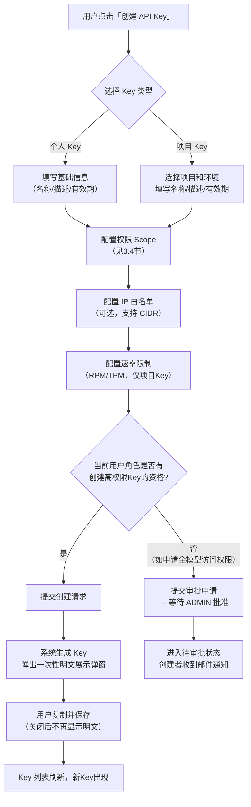
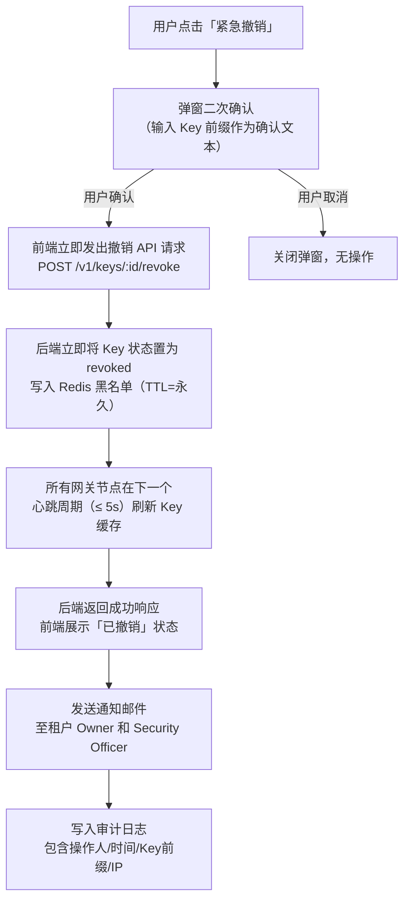

# MaaS平台 PRD V2.0 —— 09 租户侧Console控制台功能规格

**文档版本：** V2.0.0  
**编写日期：** 2026年05月21日  
**文档状态：** 设计评审中  
**机密等级：** 内部保密  
**关联文档：** `01-产品定位与用户角色体系.md` / `03-路由策略与容灾降级规格.md` / `04-LLMOps观测与请求Trace规格.md` / `06-计费成本与FinOps规格.md`

---

## 概述

本文档定义MaaS平台租户侧Console控制台的完整功能规格，涵盖所有页面的信息架构、交互流程、字段定义、权限控制与验收标准。Console是租户用户管理AI调用能力的核心操作界面，服务于以下九类角色（与 `01-产品定位与用户角色体系.md` §2.1 三层角色定义完全对齐）：

| 角色代码 | 角色名称 | 核心职责 |
|---|---|---|
| `TENANT_OWNER` | 租户所有者 | 全功能，含账号注销与合同管理 |
| `TENANT_ADMIN` | 租户管理员 | 全功能，不含合同与账号注销 |
| `BILLING_ADMIN` | 计费管理员 | 成本/预算/合同/账单，不含技术配置 |
| `SECURITY_OFFICER` | 安全合规官 | 合规策略/审计日志/Key审查，只读技术配置 |
| `PROJECT_ADMIN` | 项目管理员 | 管辖项目内全功能，跨项目只读 |
| `PROJECT_DEVELOPER` | 项目开发者 | 自己项目的Key/Trace/路由，不含成员管理 |
| `PROJECT_VIEWER` | 项目观察者 | 管辖项目内只读 |
| `PROJECT_AUDITOR` | 项目审计员 | 管辖项目内审计日志只读；不可查看Prompt/Response原文（需合规审批）；不可修改任何配置 |
| `PROJECT_MODEL_CURATOR` | 项目模型策略管理员 | 管辖项目内路由策略配置与模型选型；不含成员管理与预算设置 |

---

## 第1章 信息架构与导航

### 1.1 整体侧边栏导航结构

Console侧边栏采用两级导航：一级菜单以图标+文字形式展示，悬停折叠时仅展示图标。二级菜单以缩进列表展示，仅当一级菜单激活时展开。

```mermaid
flowchart TD
    ROOT["Console 侧边栏导航"]

    ROOT --> D1["仪表板 Dashboard"]
    ROOT --> D2["API Key 管理"]
    D2 --> D2A["个人 Key"]
    D2 --> D2B["项目 Key"]

    ROOT --> D3["模型广场"]
    D3 --> D3A["全部模型"]
    D3 --> D3B["我的收藏"]
    D3 --> D3C["模型对比"]

    ROOT --> D4["项目管理"]
    D4 --> D4A["项目列表"]
    D4 --> D4B["环境管理"]

    ROOT --> D5["Trace 调用明细"]
    D5 --> D5A["实时调用"]
    D5 --> D5B["历史查询"]
    D5 --> D5C["异常聚类"]
    D5 --> D5D["Session 视图"]
    D5 --> D5E["Agent Run 视图"]

    ROOT --> D6["路由策略"]
    D6 --> D6A["策略列表"]
    D6 --> D6B["策略仿真"]
    D6 --> D6C["版本历史"]

    ROOT --> D7["Prompt 实验室"]
    D7 --> D7A["Prompt 库"]
    D7 --> D7B["A/B 实验"]
    D7 --> D7C["评测任务"]

    ROOT --> D8["成本优化中心"]
    D8 --> D8A["成本仪表板"]
    D8 --> D8B["优化建议"]
    D8 --> D8C["预算管理"]
    D8 --> D8D["账单下载"]

    ROOT --> D9["合规策略"]
    D9 --> D9A["策略列表"]
    D9 --> D9B["内容安全"]
    D9 --> D9C["合规报告"]

    ROOT --> D10["团队与成员"]
    D10 --> D10A["成员列表"]
    D10 --> D10B["用户组"]
    D10 --> D10C["SSO 配置"]

    ROOT --> D11["告警与合同"]
    D11 --> D11A["告警规则"]
    D11 --> D11B["通知渠道"]
    D11 --> D11C["合同查看"]
```



### 1.2 菜单访问权限矩阵

| 一级菜单 | OWNER | ADMIN | BILLING | SECURITY | PROJ_ADMIN | DEVELOPER | VIEWER |
|---|:---:|:---:|:---:|:---:|:---:|:---:|:---:|
| 仪表板 | ✓ | ✓ | ✓ | ✓ | ✓(仅本项目) | ✓(仅本项目) | ✓(只读) |
| API Key 管理 | ✓ | ✓ | — | ✓(只读) | ✓(本项目) | ✓(个人) | — |
| 模型广场 | ✓ | ✓ | — | ✓ | ✓ | ✓ | ✓ |
| 项目管理 | ✓ | ✓ | ✓(只读) | ✓(只读) | ✓(本项目) | ✓(本项目只读) | ✓(只读) |
| Trace 调用明细 | ✓ | ✓ | — | ✓(全部) | ✓(本项目) | ✓(本人Key) | — |
| 路由策略 | ✓ | ✓ | — | ✓(只读) | ✓(本项目) | ✓(只读) | — |
| Prompt 实验室 | ✓ | ✓ | — | — | ✓ | ✓ | ✓(只读) |
| 成本优化中心 | ✓ | ✓ | ✓ | — | ✓(本项目) | — | — |
| 合规策略 | ✓ | ✓ | — | ✓ | — | — | — |
| 团队与成员 | ✓ | ✓ | — | ✓(只读) | ✓(本项目成员) | — | — |
| 告警与合同 | ✓ | ✓ | ✓ | ✓(只读) | — | — | — |

> 说明：「—」表示该菜单对此角色不可见（侧边栏直接隐藏，不显示禁用态）；「只读」表示可以进入但所有写操作按钮不渲染或呈 `disabled` 态。

### 1.3 面包屑导航规则

**格式：** `租户名` > `一级模块` > `二级模块` > `实体名称`

**示例：**
- `AcmeCorp > 项目管理 > 项目列表 > payment-service`
- `AcmeCorp > Trace调用明细 > 历史查询 > req_01HXZ7K3M2...`
- `AcmeCorp > 路由策略 > 策略列表 > cost-saving-v3 > 版本历史`

**规则说明：**

1. 面包屑最多展示 4 级，超出时中间段折叠为 `...`，末段始终完整显示。
2. 除末段（当前页）外，所有节点均可点击跳转。
3. 实体名称超过 32 字符时，截断显示并在 Tooltip 中展示完整名称。
4. 在移动端（< 768px）宽度下，面包屑仅显示最后两级，前置段以 `< 返回` 形式呈现。

### 1.4 全局搜索功能规格

**触发方式：** 顶部导航栏搜索框，快捷键 `Ctrl + K`（Windows）/ `⌘ K`（macOS）。

**搜索范围与结果分类：**

| 分类 | 搜索内容 | 权限过滤 |
|---|---|---|
| API Key | key_name / key_prefix | 仅返回当前角色可见的Key |
| 项目 | project_name / project_code | 仅返回当前用户有权限的项目 |
| 模型 | model_name / model_alias / 供应商 | 全量返回 |
| Trace | request_id（精确匹配） | 按角色权限过滤 |
| 路由策略 | strategy_name | 仅返回当前角色可见的策略 |
| 成员 | username / email | 仅 OWNER / ADMIN / SECURITY 可搜索 |

**交互规格：**
- 输入 2 个字符以上时开始模糊匹配，防抖延迟 200ms。
- 下拉面板最多展示每类前 5 条，底部有「查看全部结果」跳转至全文搜索页。
- 精确输入 `request_id`（`req_` 开头的 ULID）时直接跳转至 Trace 详情页，不展示下拉。
- 搜索历史保存最近 10 条，存储在 `localStorage`，不上传服务器。
- 搜索结果高亮匹配关键词（`<mark>` 标签，黄底黑字）。

---

## 第2章 仪表板（Dashboard）

### 2.1 页面布局规格

仪表板采用三行布局：
- **第1行：** KPI 卡片区，6 张等宽卡片横排，内边距 `24px`。
- **第2行：** 趋势图区（左2/3）+ 待办事项区（右1/3），各占 `66.7%` 和 `33.3%`。
- **第3行：** 快速入口区（8 个操作按钮卡片）。

每个区块之间垂直间距 `24px`，整体内边距 `24px`。

### 2.2 KPI 卡片定义

| 卡片编号 | 指标名称 | 计算口径 | 单位 | 刷新频率 | 可见角色 |
|---|---|---|---|---|---|
| KPI-01 | 今日请求数 | 当日 00:00 至当前时刻，统计租户下所有成功+失败请求总数 | 次 | 30s | 除 VIEWER 外所有角色 |
| KPI-02 | 成功率 | `成功请求数 / 总请求数 × 100%`，时间窗口与KPI-01一致 | % | 30s | OWNER / ADMIN / SECURITY |
| KPI-03 | P95 延迟 | 当日所有完成请求的第95百分位 `first_token_latency_ms`（首Token延迟） | ms | 30s | OWNER / ADMIN / PROJECT_ADMIN |
| KPI-04 | 本月成本 | 当自然月 1 日 00:00 至当前时刻，所有项目的计量成本（不含税） | 元/美元 | 5min | OWNER / ADMIN / BILLING |
| KPI-05 | 预算使用率 | `本月成本 / 本月预算总额 × 100%`，若无预算则显示「未配置」 | % | 5min | OWNER / ADMIN / BILLING |
| KPI-06 | 未处理告警数 | 当前 `status=active` 且 `resolved_at IS NULL` 的告警数量 | 个 | 10s | OWNER / ADMIN / SECURITY |

**KPI 卡片交互：**
- 每张卡片右上角显示「趋势小火花图」（sparkline），展示过去 24h 小时级数据。
- 点击 KPI-01 跳转至 Trace 调用明细 → 实时调用，过滤条件预设为今日。
- 点击 KPI-04 / KPI-05 跳转至成本优化中心 → 成本仪表板。
- 点击 KPI-06 跳转至告警与合同 → 告警规则，过滤 `status=active`。
- 若当前角色无权看某卡片，该位置显示遮罩「无权限查看此指标」，不隐藏位置（避免布局跳动）。

**告警阈值视觉规则：**
- KPI-05 预算使用率 ≥ 80%：卡片底部边框变为 `amber-500`，数字变为 `amber-600`。
- KPI-05 预算使用率 ≥ 100%：边框变为 `red-500`，数字变为 `red-600`，卡片内出现红色感叹号图标。
- KPI-06 未处理告警数 > 0：数字显示红色 Badge。

### 2.3 趋势图区规格

**请求量趋势图（左侧主图）：**
- 类型：双 Y 轴折线图（主轴：请求量/次，副轴：成功率/%）。
- 默认时间范围：过去 24 小时，颗粒度：每小时1个数据点。
- 时间范围切换选项：`1H / 6H / 24H / 7D / 30D`，切换后数据颗粒度自动调整（1H→每分钟，6H→每5分钟，24H→每小时，7D→每天，30D→每天）。
- 图例：「请求量」（蓝色实线）、「成功率」（绿色虚线）。
- 鼠标悬停显示 Tooltip：精确时间 / 请求量 / 成功率 / 失败数。

**模型用量分布图（右侧辅图，位于趋势图下方）：**
- 类型：水平条形图。
- 展示 TOP 5 模型的今日请求占比。
- 点击某模型条目，在 Trace 列表中追加该模型过滤。

### 2.4 待办事项区规格

待办事项卡片采用分组折叠列表，每组有独立的 Badge 计数。

| 分组 | 触发条件 | 操作 | 可见角色 |
|---|---|---|---|
| 待审批的策略变更 | 存在 `status=pending_approval` 的路由策略版本 | 点击跳转至对应策略审批页 | OWNER / ADMIN |
| 预算告警 | 预算使用率 ≥ 配置的告警阈值 | 点击跳转至成本优化中心 → 预算管理 | OWNER / ADMIN / BILLING |
| API Key 即将过期 | Key 有效期 ≤ 7 天 | 点击弹出「续期 Key」快捷面板 | OWNER / ADMIN / PROJECT_ADMIN |
| 模型状态通知 | 供应商侧出现降级/中断事件 | 点击查看模型详情 → 供应商状态 | OWNER / ADMIN / DEVELOPER |
| 成员待激活 | 邀请链接已发出但成员尚未完成注册 | 点击可重发邀请邮件 | OWNER / ADMIN |

**待办事项交互细节：**
- 每个分组默认折叠，Badge 数量 > 0 时自动展开。
- 每条待办事项右侧有「处理」按钮（跳转）和「忽略」按钮（当前会话内标记已读，不持久化）。
- 所有待办列表为空时，区域显示「暂无待处理事项」+ 绿色图标，保持区域高度不坍缩。

### 2.5 快速入口区规格

8 个常用操作入口，以 `2 × 4` 图文卡片排列：

| 序号 | 入口名称 | 目标页面 | 最低权限要求 |
|---|---|---|---|
| 1 | 创建 API Key | API Key 管理 → 创建Key弹窗 | DEVELOPER |
| 2 | 新建项目 | 项目管理 → 创建项目弹窗 | ADMIN |
| 3 | 查看 Trace | Trace调用明细 → 历史查询 | DEVELOPER |
| 4 | 配置路由策略 | 路由策略 → 策略列表 | PROJECT_ADMIN |
| 5 | 测试 Prompt | Prompt实验室 → 编辑器 | DEVELOPER |
| 6 | 查看账单 | 成本优化中心 → 成本仪表板 | BILLING |
| 7 | 邀请成员 | 团队与成员 → 邀请弹窗 | ADMIN |
| 8 | 配置告警 | 告警与合同 → 告警规则 | ADMIN |

当前角色无权限的入口显示灰色禁用态（不隐藏，保持布局稳定），悬停时 Tooltip 提示「您的角色无此操作权限」。

---

## 第3章 API Key 管理

### 3.1 个人 Key 列表字段定义

个人Key是与当前登录用户绑定的API密钥，用于开发/调试场景，不绑定项目。

| 字段名 | 类型 | 说明 | 是否可排序 | 是否可搜索 |
|---|---|---|:---:|:---:|
| `key_id` | string | 系统生成的 ULID，列表中不显示，详情页显示 | — | — |
| `key_name` | string | 用户自定义名称，最多 64 字符 | — | ✓ |
| `key_prefix` | string | Key 前8位明文展示，如 `sk-aBcD****`，后续位全部脱敏为 `****` | — | ✓ |
| `permission_scope` | enum[] | Key 允许调用的模型/项目/API能力范围，详见3.4节 | — | ✓ |
| `ip_whitelist` | string[] | 允许调用的 IP 或 CIDR 列表，为空表示不限制 | — | — |
| `expires_at` | datetime | Key 过期时间，`null` 表示永不过期 | ✓ | — |
| `last_used_at` | datetime | 最后一次成功调用的时间（UTC），精确到分钟 | ✓ | — |
| `status` | enum | `active` / `disabled` / `expired` / `revoked` | — | ✓ |
| `monthly_calls` | int | 过去30天的累计调用次数 | ✓ | — |
| `created_at` | datetime | Key 创建时间 | ✓ | — |
| `created_by` | string | 创建者 username | — | ✓ |

**列表操作：**
- 行内操作：「复制前缀」「禁用/启用」「编辑」「撤销」。
- 「撤销」操作需二次确认弹窗，提示「此操作不可逆，Key将永久失效，依赖此Key的调用将立即返回401」。
- 支持多选批量禁用（最多 50 条）。

### 3.2 项目 Key 列表字段定义

项目Key绑定到特定项目，可由该项目的 Project Admin 或以上角色管理。

项目Key列表字段在个人Key字段基础上增加：

| 附加字段 | 类型 | 说明 |
|---|---|---|
| `project_id` | string | 绑定项目 ID |
| `project_name` | string | 绑定项目名称（可点击跳转项目详情） |
| `environment` | enum | `dev` / `staging` / `prod` |
| `rate_limit_rpm` | int | 每分钟请求数上限（0=不限制） |
| `rate_limit_tpm` | int | 每分钟 Token 数上限（0=不限制） |
| `budget_limit_monthly` | decimal | Key 级别月度预算上限（元/美元），0=不限制 |

**权限控制：**
- `DEVELOPER` 只能看到自己创建的项目Key，且不能修改 `rate_limit_*` 和 `budget_limit_monthly` 字段。
- `PROJECT_ADMIN` 可以管理本项目内所有 Key，包括他人创建的。
- `TENANT_ADMIN` / `OWNER` 可以管理所有项目的所有 Key。
- `SECURITY_OFFICER` 只读所有Key，可触发「强制撤销」（不需要二次审批，但写入审计日志）。

### 3.3 创建 Key 流程



**一次性明文展示弹窗规格：**
- 弹窗包含：完整 Key 明文（等宽字体）、「复制到剪贴板」按钮、「已安全保存，关闭」按钮。
- 弹窗背景不可点击关闭，必须点击「已安全保存，关闭」。
- 弹窗内有红色警告提示「此 Key 仅显示一次，关闭后无法再次查看，请立即保存到安全位置」。
- 关闭后，Key 在列表中的展示形式立即切换为脱敏前缀（`sk-aBcD****`）。

### 3.4 Key 权限 Scope 选择界面规格

Scope 选择采用多级树形勾选组件：

**第一级：模型访问范围**

| Scope | 说明 | 最低授权角色 |
|---|---|---|
| `model:all` | 访问租户下所有已激活模型 | ADMIN |
| `model:project` | 仅访问绑定项目配置的允许模型列表 | PROJECT_ADMIN |
| `model:list:[model_ids]` | 精确指定一组模型 ID | DEVELOPER |

**第二级：API 能力范围**

| Scope | 说明 |
|---|---|
| `chat:completions` | 调用 Chat Completions API |
| `embeddings` | 调用 Embeddings API |
| `images` | 调用图像生成 API |
| `audio` | 调用语音 API |
| `files` | 文件上传/下载 API |
| `finetuning` | 微调任务 API（高风险，需 ADMIN 审批） |

**第三级：数据权限**

| Scope | 说明 |
|---|---|
| `trace:read:self` | 读取本 Key 产生的 Trace |
| `trace:read:project` | 读取所在项目的全部 Trace（需 PROJECT_ADMIN）|
| `usage:read` | 读取用量统计 API |

### 3.5 Key 轮转规则

Key 轮转指在不中断业务的前提下，用新 Key 替换旧 Key 的操作。

**轮转流程：**
1. 用户在 Key 详情页点击「开始轮转」。
2. 系统创建一个新 Key，与旧 Key 具有相同的权限 Scope、IP 白名单、速率限制。
3. 进入「双 Key 并存期」（默认 24h，可配置 1h ～ 7d），两个 Key 同时有效。
4. 并存期结束后，旧 Key 自动失效（状态变为 `expired`）。
5. 用户可在并存期内主动结束轮转（提前使旧 Key 失效）。

**轮转期间的 UI 标识：**
- 旧 Key 行显示黄色 Badge「轮转中」+ 倒计时（如「还有 23h 12m 失效」）。
- 新 Key 行显示绿色 Badge「新Key」。
- 两者通过 `rotation_group_id` 字段关联，列表中展示为「分组折叠」样式。

### 3.6 Key 泄露紧急撤销流程

**触发入口：** Key 行操作菜单 → 「紧急撤销」（红色高亮显示）。

**流程目标：** 从触发到 Key 失效 ≤ 30 秒。

**流程步骤：**



**撤销后处理：**
- 已撤销的 Key 在列表中保留 90 天（`status=revoked`），然后逻辑删除（不物理删除，审计需要）。
- 已撤销 Key 的历史 Trace 记录保持可查询（关联到已撤销状态的 Key）。
- 系统自动在 Console 内创建一条「安全事件」待办事项，建议用户检查近 30 天该 Key 的调用记录。

### 3.6 API Key 异常检测与泄露应急响应

> **背景**：Key 被撤销是事后处置；更关键的是事前/事中感知——Key 是否已经在被未授权方使用，从而第一时间触发处置流程。

**3.6.1 异常使用检测规则**

平台对每个 API Key 持续分析以下异常行为模式，触发告警：

| 规则 ID | 检测项 | 触发条件 | 告警级别 |
|--------|--------|---------|---------|
| KEY-A01 | IP 异常 | Key 在过去 7 天从未出现过的 IP 段（CIDR /24）发起调用 | WARNING |
| KEY-A02 | 时段异常 | Key 在非工作时段（如凌晨 1-5 点）首次出现大量调用 | WARNING |
| KEY-A03 | 调用量突增 | 单个 Key 在 5 分钟内的调用量超过其过去 30 天日均的 10 倍 | CRITICAL |
| KEY-A04 | 地域异常 | Key 首次从海外 IP（非租户历史使用地域）调用 | WARNING |
| KEY-A05 | 多地并发 | 同一 Key 在 1 分钟内从 3 个以上不同国家/地区发起调用 | CRITICAL |
| KEY-A06 | 模型切换异常 | Key 突然开始调用其历史未使用的高价值模型（如从仅用 Qwen-Turbo 突然调用 GPT-4o） | INFO |
| KEY-A07 | GitHub 公开检测 | 平台扫描 GitHub 公开仓库（通过 GitHub Secret Scanning 合作），发现 Key 前缀出现在公开代码中 | CRITICAL |

**3.6.2 告警触达规则**

- `INFO` 级别：仅在 Console 通知中心展示，不发送外部通知
- `WARNING` 级别：Console 通知 + 邮件通知给 Key 拥有者和 Security Officer
- `CRITICAL` 级别：Console 通知 + 邮件 + 企业 IM（若已配置）+ 短信（若已配置）；在 Console Key 详情页顶部展示红色横幅

**3.6.3 Key 泄露应急响应流程**

当 CRITICAL 级别告警触发（或用户主动发现 Key 泄露）时，Console 在 Key 详情页展示「应急响应引导」面板，分步引导完成处置：

```
┌──────────────────────────────────────────────────────────────────┐
│ 🚨 检测到 API Key 可能泄露                                        │
│ 检测原因：KEY-A07 - Key 前缀出现在 GitHub 公开仓库               │
│ 首次检测时间：2026-05-21 14:32:00                                 │
│                                                                  │
│ 建议立即执行以下步骤：                                            │
│                                                                  │
│ ✅ 第1步：立即吊销此 Key          [立即吊销] ← 一键操作          │
│ ⬜ 第2步：创建替代 Key（吊销后）  [创建新 Key]                   │
│ ⬜ 第3步：查看泄露后的调用记录    [查看异常 Trace]               │
│ ⬜ 第4步：更新使用此 Key 的系统   [查看接入指南]                  │
│ ⬜ 第5步：提交安全事件报告（可选）[生成事件报告]                  │
│                                                                  │
│ [标记为已处理，不再提示]                                          │
└──────────────────────────────────────────────────────────────────┘
```

**第3步"查看异常 Trace"的具体功能**：

点击后跳转至 Trace 历史查询页，自动应用以下筛选条件：
- Key = 当前 Key
- 时间范围 = 告警时间前 7 天至当前
- 重点标注：来自未知 IP 的请求、调用量突增时段、调用了高价值模型的请求

**第5步"生成事件报告"**：

平台自动生成一份结构化的安全事件报告，包含：
- Key 基本信息（ID、创建时间、权限范围）
- 异常检测详情（触发规则、首次异常时间、涉及 IP 列表）
- 泄露期间调用统计（总调用次数、Token 消耗、估算成本）
- 处置记录（吊销时间、操作人）

报告可导出为 PDF，供安全合规团队存档或上报给信息安全管理体系（ISMS）审计。

**3.6.4 Key 安全评分（可选展示）**

在 Key 列表中，每个 Key 右侧展示安全评分标签（绿/黄/红），评分基于以下因素：

| 因素 | 扣分项 |
|------|--------|
| Key 未设置过期时间 | -10 分 |
| Key 权限范围过宽（超过实际使用范围）| -15 分 |
| Key 近 30 天有 WARNING 级别异常 | -20 分 |
| Key 近 7 天有 CRITICAL 级别异常 | -50 分 |
| Key 超过 90 天未轮换 | -10 分 |

满分 100 分，展示为：🟢 安全（80-100）/ 🟡 注意（60-79）/ 🔴 高风险（0-59）

---

## 第4章 模型广场

### 4.1 筛选面板规格

筛选面板固定在页面左侧，宽度 `240px`，支持多选复合筛选，实时刷新结果（防抖 300ms）。

| 筛选维度 | 控件类型 | 选项说明 |
|---|---|---|
| 能力标签 | 多选复选框 | `文本生成` / `代码生成` / `图像理解` / `语音识别` / `图像生成` / `向量嵌入` / `函数调用` / `长文本` |
| 模态 | 单选按钮组 | `全部` / `文本` / `多模态` / `图像` / `音频` |
| 价格区间 | 范围滑块 | 按每百万输入Token价格（元），最小值0，最大值自动取当前最高价格 |
| 合规标签 | 多选复选框 | `ISO 27001` / `SOC2 Type II` / `GDPR兼容` / `数据不出境` / `等保三级` |
| 供应商 | 多选复选框 | 动态加载租户已接入的供应商列表 |
| 上下文长度 | 档位选择 | `≥8K` / `≥32K` / `≥128K` / `≥200K` |
| 是否收藏 | 切换开关 | 开启时仅展示收藏模型 |

**「重置筛选」按钮：** 清除所有选中条件，回到默认全量展示状态。

### 4.2 模型卡片字段定义

列表视图默认采用卡片网格布局（每行 3 张），可切换为表格视图。

| 字段 | 在卡片中的展示方式 |
|---|---|
| `model_name` | 卡片标题，加粗，最多2行截断 |
| `model_alias` | 标题下方灰色小字（如 `gpt-4o-2024-08-06`） |
| `vendor_name` | 供应商 Logo（16px）+ 名称，卡片左上角 |
| `capability_tags` | 最多显示 3 个彩色标签，多余的折叠为 `+N` |
| `input_price_per_1m` | 「¥ X.XX / 1M input tokens」，绿色字体 |
| `output_price_per_1m` | 「¥ X.XX / 1M output tokens」，绿色字体 |
| `quality_score` | 1-5 星评分（基于平台内部评测集的综合评分） |
| `compliance_tags` | 合规认证图标（最多 3 个），悬停显示完整名称 |
| `alternative_model` | 「替代模型: xxx」，蓝色链接，点击跳转到替代模型详情 |
| `status` | 右上角状态 Badge：`可用`(绿) / `限速`(黄) / `不可用`(红) |
| `context_length` | 上下文窗口（如 `128K`） |

**卡片操作区：**
- 「加入收藏」（爱心图标，切换态）。
- 「加入对比」（最多选 4 个，超出时有提示）。
- 「查看详情」（跳转至模型详情页）。
- 「快速测试」（跳转至 Prompt 实验室，预填该模型）。

### 4.3 模型详情页（Tabs 结构）

模型详情页 URL：`/console/models/:model_id`

**Tab 1：概览**

展示内容：模型描述（富文本）、供应商介绍、能力标签列表、适用场景、不适用场景、与前代模型的差异说明。

**Tab 2：性能**

展示内容：
- 平台内部评测结果表格（评测集名称 / 评测日期 / 得分 / 排名）。
- P50 / P95 / P99 延迟直方图（基于过去 7 天平台路由到该模型的真实请求数据）。
- TTFT（首 Token 时间）趋势图（过去 7 天每日均值）。
- 可用性 SLA 趋势（过去 30 天，每天的实际可用分钟数）。

**Tab 3：价格**

展示内容：

| 计费维度 | 当前价格 | 生效日期 | 历史价格 |
|---|---|---|---|
| 输入 Token（¥/1M） | 动态读取 | 动态读取 | 可展开历史价格表 |
| 输出 Token（¥/1M） | 动态读取 | 动态读取 | 可展开历史价格表 |
| 图像输入（¥/张） | 动态读取或不适用 | — | — |
| 缓存命中折扣 | X% off | — | — |

价格来源标注：「由供应商 [供应商名] 提供，平台已加价 Y%」（对有权限的角色显示，如 BILLING_ADMIN）。

**Tab 4：示例**

展示内容：
- 平台提供的调用示例代码（多语言切换：Python / Node.js / cURL）。
- 示例涵盖：Chat Completion / Streaming / Function Calling / Vision。
- 代码块有「复制」按钮。

**Tab 5：API 参数**

展示内容：该模型支持的完整参数列表。

| 参数名 | 类型 | 默认值 | 取值范围 | 说明 |
|---|---|---|---|---|
| `temperature` | float | 1.0 | 0.0 – 2.0 | 采样温度 |
| `max_tokens` | int | — | 1 – 模型最大值 | 最大输出Token数 |
| `top_p` | float | 1.0 | 0.0 – 1.0 | 核采样参数 |
| `stream` | bool | false | — | 是否流式输出 |
| `tools` | array | — | — | Function Calling 工具列表 |
| `response_format` | object | — | `text` / `json_object` | 输出格式约束 |

**Tab 6：合规**

展示内容：
- 合规认证列表（证书编号 / 颁发机构 / 有效期 / 证书PDF下载链接）。
- 数据驻留地区（哪些地区的数据会被路由到该模型）。
- 数据保留策略（供应商对请求数据的保留时长）。
- GDPR DPA 签署状态。
- 零数据保留（ZDR）是否支持。

### 4.4 模型对比功能规格

**触发方式：** 在模型卡片点击「加入对比」（最多 4 个模型同时对比）。

**对比面板：**
- 固定在页面底部（高度 `48px`），显示「已选 N 个模型，开始对比」。
- 点击「开始对比」跳转到 `/console/models/compare?ids=id1,id2,id3`。

**对比表格字段：**

| 对比维度 | 说明 |
|---|---|
| 基础信息 | 模型名 / 供应商 / 版本日期 / 上下文长度 / 最大输出 |
| 能力标签 | 逐项打勾/打叉 |
| 价格 | 输入/输出 Token 单价（并排显示，最优价格高亮绿色） |
| 性能指标 | P95延迟 / TTFT / 月均可用率 |
| 质量评分 | 综合评分 + 各维度分项雷达图 |
| 合规认证 | 逐项认证打勾/打叉 |
| 替代模型 | 是否有替代模型，以及替代模型名称 |
| 快速操作 | 「加入收藏」「快速测试」「查看详情」按钮 |

---

## 第5章 项目管理

### 5.1 项目列表字段定义

| 字段名 | 类型 | 说明 | 可排序 | 可搜索 |
|---|---|---|:---:|:---:|
| `project_name` | string | 项目显示名称，最多 64 字符 | — | ✓ |
| `project_code` | string | 项目唯一标识符（小写字母+数字+连字符，最多32字符） | — | ✓ |
| `environment` | enum | `dev` / `staging` / `prod`（项目可以跨环境，此列显示主环境） | ✓ | ✓ |
| `member_count` | int | 当前项目成员数（含所有角色） | ✓ | — |
| `monthly_cost` | decimal | 当前自然月累计成本（元/美元） | ✓ | — |
| `budget_status` | enum | `正常` / `预警`(≥80%) / `超支`(≥100%) | ✓ | ✓ |
| `last_activity_at` | datetime | 最后一次 API 调用时间 | ✓ | — |
| `status` | enum | `active` / `archived` / `suspended` | — | ✓ |
| `created_at` | datetime | 项目创建时间 | ✓ | — |
| `created_by` | string | 创建者 username | — | ✓ |

**列表操作：** 「进入项目」（跳转至项目详情）、「归档」（需ADMIN）、「删除」（需OWNER，且项目必须先归档）。

### 5.2 项目创建流程

项目创建采用两步式表单：

**步骤一：基础信息**

| 字段 | 必填 | 校验规则 |
|---|:---:|---|
| 项目名称 | ✓ | 1-64 字符，不能与同租户下已有项目重名 |
| 项目编码 | ✓ | 小写字母开头，只含 `[a-z0-9-]`，长度 3-32 字符，全局唯一 |
| 项目描述 | — | 最多 256 字符 |
| 主环境 | ✓ | 单选：`dev` / `staging` / `prod` |
| 项目标签 | — | 自定义 KV 标签，最多 10 对，Key/Value 各最多 63 字符 |

**步骤二：初始化配置（可选）**

| 配置项 | 说明 |
|---|---|
| 初始成员邀请 | 可直接填入邮箱和角色，创建完成后发送邀请邮件 |
| 月度预算 | 设置初始月度预算上限（可跳过，后续在成本优化中心配置） |
| 关联路由策略 | 从现有策略中选择一个作为项目默认路由策略 |
| 允许模型列表 | 限制此项目只能调用指定的模型（白名单） |

**表单校验：** 所有必填字段通过后，「完成创建」按钮才激活，避免用户提交无效表单。

### 5.3 项目详情页（子 Tabs）

项目详情页 URL：`/console/projects/:project_id`

**Tab 概览：**
展示项目基础信息、今日请求量 KPI 卡片（仅本项目数据）、最近 7 天调用趋势折线图、成员列表快照（最多展示 5 条）。

**Tab 设置：**
可编辑字段：项目名称、项目描述、项目标签、允许模型列表、默认路由策略。
危险操作区：「归档项目」（使项目进入只读状态）、「删除项目」（仅 OWNER，需先归档）。

**Tab 成员：**
展示本项目成员列表（username / 邮箱 / 项目角色 / 加入时间），支持新增成员、修改角色、移除成员。

**Tab API Key：**
项目 Key 的子集视图，仅展示绑定到本项目的 Key，功能与3.2节相同。

**Tab 预算：**
本项目预算配置（月度/季度预算、告警阈值），以及本月已用金额、趋势图。

**Tab 路由策略：**
本项目生效的路由策略（可以覆盖租户级默认策略），支持创建项目级专属策略或绑定共享策略。

**Tab 监控：**
本项目的实时监控视图：P95延迟仪表盘、成功率趋势图、TOP 5 模型用量饼图、告警事件时间线。

### 5.4 项目成员权限配置

项目级角色与权限的详细映射：

| 操作 | PROJECT_ADMIN | PROJECT_DEVELOPER | PROJECT_VIEWER |
|---|:---:|:---:|:---:|
| 查看项目基础信息 | ✓ | ✓ | ✓ |
| 修改项目设置 | ✓ | — | — |
| 查看成员列表 | ✓ | ✓ | — |
| 管理成员（增删改角色） | ✓ | — | — |
| 创建项目 API Key | ✓ | ✓ | — |
| 查看所有项目 Key | ✓ | 仅自己创建的 | — |
| 撤销 API Key | ✓ | 仅自己创建的 | — |
| 查看本项目 Trace | ✓ | 仅自己 Key 的 | — |
| 管理路由策略（本项目） | ✓ | — | — |
| 查看路由策略 | ✓ | ✓（只读） | — |
| 配置预算 | ✓ | — | — |
| 查看成本 | ✓ | — | — |

### 5.5 项目环境管理

每个项目支持最多三个环境（`dev` / `staging` / `prod`），各环境的配置相互独立。

**环境独立的配置项：**
- 路由策略（不同环境可以绑定不同策略）。
- API Key 列表（每个 Key 都标注所属环境，跨环境 Key 不允许）。
- 速率限制（dev 环境通常配置更低限速）。
- 模型白名单（staging 可以比 dev 少一些实验模型）。

**环境切换：** 在项目详情页右上角有环境切换下拉，切换时页面内所有数据（Trace / Key / 成本）自动按新环境过滤。

**环境晋级（Promotion）：** 项目 Admin 可以将 `dev` 环境的路由策略和配置「晋级」到 `staging`，`staging` 晋级到 `prod` 时需要 Tenant Admin 审批。

---

## 第6章 Trace 调用明细

### 6.1 Trace 列表字段定义

| 字段名 | 类型 | 宽度 | 可排序 | 说明 |
|---|---|---|:---:|---|
| `request_id` | string | 180px | — | 系统生成的 ULID，点击跳转详情页，展示前 12 位 + `...` |
| `created_at` | datetime | 160px | ✓ | 请求发起时间（UTC+8），精确到毫秒 |
| `model_name` | string | 140px | ✓ | 实际路由到的模型名称 |
| `strategy_name` | string | 120px | — | 生效的路由策略名称 |
| `status` | enum | 80px | ✓ | `success` / `failed` / `partial`（流式中途断开） |
| `cost` | decimal | 80px | ✓ | 本次请求成本（元/美元，4位小数） |
| `latency_ms` | int | 80px | ✓ | 端到端延迟（ms） |
| `ttft_ms` | int | 80px | ✓ | 首 Token 延迟（ms），非流式请求显示「—」 |
| `is_cached` | bool | 60px | — | 是否命中语义缓存（绿色图标标识） |
| `is_fallback` | bool | 60px | — | 是否触发了 fallback 切换（橙色图标标识） |
| `input_tokens` | int | 80px | ✓ | 输入 Token 数 |
| `output_tokens` | int | 80px | ✓ | 输出 Token 数 |

**列表默认排序：** `created_at DESC`（最新请求在最上方）。

**列表分页：** 每页 50 条，支持「上一页/下一页」以及「跳至第 N 页」输入。

### 6.2 高级筛选面板

点击「筛选」按钮展开高级筛选侧边面板（drawer 样式，从右侧滑入，宽度 `360px`）。

| 筛选维度 | 控件 | 说明 |
|---|---|---|
| 时间范围 | 日期时间范围选择器 | 默认最近 24h，支持快捷选项：1h/6h/24h/7d/30d/自定义 |
| 模型 | 多选下拉（支持搜索） | 列出所有被调用过的模型 |
| 状态 | 多选复选框 | `success` / `failed` / `partial` |
| 成本范围 | 双端滑块 + 输入框 | 最小值/最大值（元/美元） |
| API Key | 多选下拉（支持搜索） | 仅显示当前角色可见的 Key |
| 项目 | 多选下拉 | 仅显示当前角色有权限的项目 |
| 是否命中缓存 | 三态单选 | 全部 / 是 / 否 |
| 是否发生 fallback | 三态单选 | 全部 / 是 / 否 |
| 路由策略 | 多选下拉 | 列出所有已使用的策略 |
| 延迟范围 | 双端输入框（ms） | 过滤端到端延迟超过阈值的请求 |

**筛选条件持久化：** 筛选条件以 URL QueryString 形式序列化（如 `?status=failed&model=gpt-4o&start=2026-05-21T00:00`），可以复制链接分享给他人。

### 6.3 Trace 详情页规格

Trace 详情页 URL：`/console/traces/:request_id`

**页面布局：** 上下分区，顶部固定基础信息区（不随滚动），下方滚动区包含 5 个可折叠内容块。

---

**基础信息区（顶部 Header，不可折叠）**

| 字段 | 位置 | 说明 |
|---|---|---|
| `request_id` | 左侧大字 | 完整 ULID 显示，右侧有「复制」图标 |
| `status` | Badge | `success`(绿) / `failed`(红) / `partial`(橙) |
| `created_at` | 时间戳 | UTC+8，精确到毫秒 |
| `model_name` | 标签 | 最终路由的模型 |
| `api_key_name` | 链接 | 点击跳转到 Key 详情，权限不够时显示脱敏前缀 |
| `project_name` | 链接 | 点击跳转到项目详情 |
| `user_id` | 文本 | 调用方传入的 `X-User-Id` 请求头值，如无则显示「未传入」 |

---

**内容块1：路由解释区（可折叠，默认展开）**

| 字段 | 说明 |
|---|---|
| `strategy_name` | 生效的路由策略名称 + 版本号 |
| `candidate_models` | 候选模型列表，每个模型展示评分和排名 |
| `selected_model` | 最终选择的模型（高亮）及选择理由（文字说明） |
| `excluded_models` | 被排除的模型及排除原因（如「健康检查失败」「超出预算限制」「不满足合规要求」） |
| `strategy_type` | 策略类型（成本优先/性能优先/加权轮询/规则匹配/自适应） |

候选模型评分表格字段：

| 模型名 | 健康评分 | 成本评分 | 性能评分 | 综合评分 | 是否被选中 | 排除原因 |
|---|---|---|---|---|---|---|
| （动态数据） | 0-100 | 0-100 | 0-100 | 0-100 | ✓ / — | 文字说明或「—」 |

---

**内容块2：时间线区（可折叠，默认展开）**

以瀑布图（Waterfall）形式展示请求的各阶段耗时：

| Span 名称 | 说明 |
|---|---|
| `client_to_gateway` | 客户端到网关的网络传输时间 |
| `auth_validation` | API Key 鉴权和权限校验 |
| `compliance_check` | 合规策略检查（如有） |
| `routing_decision` | 路由决策引擎耗时 |
| `upstream_connect` | 连接到上游供应商 |
| `upstream_ttft` | 上游供应商首 Token 时间 |
| `upstream_total` | 上游供应商全部 Token 时间 |
| `response_to_client` | 最后一个 Token 到客户端的传输时间 |
| `cache_lookup` | 缓存查找时间（如启用语义缓存） |

每个 Span 显示：开始时间偏移（ms）/ 持续时间（ms）/ 百分比占比（宽度条）。

---

**内容块3：Token 与成本区（可折叠，默认展开）**

| 字段 | 值 |
|---|---|
| 输入 Token | X 个 |
| 输出 Token | X 个 |
| 缓存命中 Token（prompt cache） | X 个（如适用） |
| 实际计费 Token（输入）| X 个（考虑缓存折扣后） |
| 输入单价 | ¥ X.XXXX / 1M tokens |
| 输出单价 | ¥ X.XXXX / 1M tokens |
| 本次请求成本 | ¥ X.XXXX |
| 成本归因 | 项目名 / API Key 名 |
| 是否命中语义缓存 | 是（节省 ¥X.XX）/ 否 |

---

**内容块4：Fallback 链区（仅当 `is_fallback=true` 时显示，默认展开）**

以步骤时间线形式展示 fallback 的切换路径：

```
步骤1 → [原始模型: claude-3-opus]  状态: failed  错误: 429 Rate Limited  耗时: 1200ms
步骤2 → [fallback模型1: gpt-4o]    状态: failed  错误: 503 Service Unavailable  耗时: 800ms
步骤3 → [fallback模型2: qwen-max]  状态: success  耗时: 450ms  ← 最终成功
```

每个步骤显示：模型名 / 状态（success/failed）/ 错误码（如有）/ 错误信息 / 本步耗时。

总计字段：fallback 次数 / 总额外延迟（所有失败步骤耗时之和） / 最终模型。

---

**内容块5：审计信息区（可折叠，SECURITY_OFFICER 默认展开，其他角色默认折叠）**

| 字段 | 说明 |
|---|---|
| `compliance_policy_name` | 命中的合规策略名称 |
| `data_classification` | 请求被判定的数据等级（如「内部」「机密」） |
| `content_safety_result` | 内容安全检查结果：`passed` / `flagged` / `blocked` |
| `flagged_categories` | 如被标记，列出命中的类别（如「偏见」「PII」） |
| `request_hash` | 请求内容的 SHA256 哈希（不存储明文内容） |
| `log_retained` | 请求/响应日志是否已按合规策略留存 |
| `retention_policy_name` | 适用的日志留存策略名称 |
| `audit_log_id` | 关联的审计日志 ID |

### 6.4 Trace 导出规格

**触发入口：** 列表页顶部「导出」按钮（下拉菜单：CSV / JSON）。

**导出参数：**
- 导出范围：当前筛选条件下的全部记录（最多 100,000 条），超出时提示用户缩小时间范围。
- 大批量导出（> 10,000 条）采用异步任务，导出完成后发邮件通知下载链接（链接有效期 24h）。

**CSV 列顺序：** `request_id`, `created_at`, `project_name`, `api_key_name`, `model_name`, `strategy_name`, `status`, `cost`, `latency_ms`, `ttft_ms`, `input_tokens`, `output_tokens`, `is_cached`, `is_fallback`, `error_code`, `error_message`

**JSON 格式：** 每行一个 JSON 对象（NDJSON 格式），包含 Trace 列表所有字段及基础信息区所有字段（不含内容明文）。

### 6.5 权限控制

| 操作 | OWNER/ADMIN | SECURITY | PROJECT_ADMIN | DEVELOPER | VIEWER |
|---|:---:|:---:|:---:|:---:|:---:|
| 查看列表 | 全部 | 全部 | 本项目 | 本人Key | — |
| 查看详情（路由解释区） | ✓ | ✓ | ✓ | ✓ | — |
| 查看详情（审计信息区） | ✓ | ✓ | — | — | — |
| 导出 CSV/JSON | ✓ | ✓ | 本项目 | 本人Key，≤1000条 | — |
| 查看请求内容明文 | — | ✓（若合规策略允许）| — | — | — |

---

## 第7章 路由策略

### 7.1 策略列表字段定义

| 字段名 | 类型 | 说明 | 可排序 |
|---|---|---|:---:|
| `strategy_name` | string | 策略名称，最多 64 字符 | — |
| `strategy_type` | enum | `cost_priority`（成本优先）/ `performance_priority`（性能优先）/ `weighted_round_robin`（加权轮询）/ `rule_based`（规则匹配）/ `adaptive`（自适应） | ✓ |
| `scope` | enum | `tenant`（租户级）/ `project`（项目级）/ `key`（Key级）/ `tag`（请求标签级） | ✓ |
| `status` | enum | `draft`（草稿）/ `pending_approval`（待审批）/ `active`（生效中）/ `paused`（已暂停）/ `archived`（已归档） | ✓ |
| `version` | string | 语义化版本号，如 `v1.2.0` | ✓ |
| `traffic_percent` | int | 灰度流量百分比（0-100），`100` 表示全量生效 | ✓ |
| `updated_at` | datetime | 最后更新时间 | ✓ |
| `updated_by` | string | 最后更新人 username | — |

**列表操作：** 「编辑」「复制」「暂停/启用」「查看版本历史」「删除」（仅 draft 状态可删除）。

### 7.2 策略创建向导（6步骤）


**步骤1 基础信息：**

| 字段 | 必填 | 校验 |
|---|:---:|---|
| 策略名称 | ✓ | 1-64 字符，同租户内不重名 |
| 策略描述 | — | 最多 512 字符 |
| 作用域 | ✓ | 单选：租户级 / 项目级（需选择项目）/ Key级（需选择Key）/ 请求标签级（需填写标签 KV）|
| 是否启用灰度 | — | 开启时显示灰度流量百分比配置 |
| 初始状态 | ✓ | 单选：草稿（仅保存，不生效）/ 提交审批（提交后进入 `pending_approval`） |

**步骤2 策略类型：**

每种类型以大图标+标题+说明的形式卡片展示，单选：

| 类型 | 说明 | 适用场景 |
|---|---|---|
| 成本优先 | 在可用模型中选择单次调用成本最低的 | 批量任务、非实时场景 |
| 性能优先 | 在可用模型中选择延迟最低（P95）的 | 用户交互、实时应用 |
| 加权轮询 | 按自定义权重分配流量到多个模型 | 流量分散、A/B测试 |
| 规则匹配 | 根据请求属性（模型标签/Token数/用户等级）选择模型 | 精细化控制 |
| 自适应 | 平台自动根据实时成本和性能评分动态选择 | 通用场景 |

**步骤3 候选模型：**
- 从「模型广场」中选择 1-10 个模型加入候选池。
- 每个候选模型显示当前状态（绿/黄/红）和当前 P95 延迟。
- 可设置每个候选模型的「最大权重」上限，防止单点依赖。

**步骤4 权重配置：**
- 仅「加权轮询」类型需要此步骤，其他类型此步骤自动跳过（显示灰色已完成状态）。
- 权重输入框（整数 1-100），各模型权重之和自动归一化显示百分比。
- 实时可视化：饼图展示流量分配预览。

**步骤5 Fallback 链配置：**

| 字段 | 说明 |
|---|---|
| fallback 触发条件 | 多选：`5xx错误` / `429限速` / `延迟超阈值`（ms阈值可配置）/ `cost超预算` |
| fallback 最大次数 | 整数 1-5，超过后返回最终错误 |
| fallback 顺序 | 拖拽排序列表，定义依次尝试的 fallback 模型 |
| 全部 fallback 失败时的响应 | 单选：返回错误 / 返回缓存的最近一次成功响应（如有）|

**步骤6 评审确认：**
- 汇总展示步骤1-5的所有配置，只读，分块展示。
- 「提交策略」按钮：创建新版本，状态设为 `pending_approval`。
- 「保存为草稿」按钮：状态设为 `draft`，不触发审批。

### 7.3 策略版本历史与回滚

版本历史页 URL：`/console/strategies/:strategy_id/versions`

版本列表字段：

| 字段 | 说明 |
|---|---|
| `version` | 版本号（`v1.0.0`、`v1.1.0` 等） |
| `status` | `current`（当前生效）/ `superseded`（已被替代）/ `archived` |
| `created_at` | 版本创建时间 |
| `created_by` | 版本创建人 |
| `change_summary` | 此版本相较上一版本的变更摘要（自动生成 + 手动描述） |
| `approval_status` | `approved` / `rejected` / `pending` |
| `approved_by` | 审批人 username（如适用） |

**回滚操作：**
1. 点击历史版本行的「回滚至此版本」按钮。
2. 弹窗确认，显示「将切换为 vX.X.X，当前生效的 vX.X.X 将变为 superseded」。
3. 回滚不需要重新走审批流程（因为该版本之前已通过审批），但写入审计日志。
4. 回滚完成后，新的「current」版本立即生效，旧的「current」变为「superseded」。

### 7.4 策略仿真入口

策略仿真页 URL：`/console/strategies/:strategy_id/simulate`

仿真功能允许在不影响生产流量的情况下，测试策略的路由决策。

**仿真输入：**
- 选择策略版本（默认当前版本，也可选历史版本）。
- 输入模拟请求参数：预估 Token 数、模型标签偏好、是否允许缓存、用户等级标签。
- 可选：上传一批请求参数（JSON 数组，最多 100 条），批量仿真。

**仿真输出：**
- 单次仿真：展示路由解释区（同 Trace 详情页路由解释区格式）。
- 批量仿真：展示模型选择分布饼图、预估成本总计、预估平均延迟。

### 7.5 策略灰度控制

灰度控制位于策略详情页右上角，显示「流量百分比」滑块（0%-100%）。

**灰度规则：**
- 当 `traffic_percent < 100` 时，该策略仅对 `traffic_percent%` 的请求生效，剩余流量走租户默认策略。
- 请求分配基于 `request_id` 的哈希一致性分发，保证相同用户的请求分配结果一致。
- 调整滑块后点击「应用灰度变更」，立即生效，不需要审批（但写入审计日志）。
- 当 `traffic_percent = 100` 时，滑块变为绿色「全量」状态。

### 7.6 策略审批状态显示

| 审批状态 | 图标 | 说明 | 可操作角色 |
|---|---|---|---|
| `pending_approval` | 黄色时钟 | 等待审批 | OWNER / ADMIN 可审批或拒绝 |
| `approved` | 绿色勾 | 已审批（自动激活） | — |
| `rejected` | 红色叉 | 已拒绝 | 创建者可修改后重新提交 |
| `auto_approved` | 蓝色闪电 | 变更量小于阈值（如仅调整权重≤10%），自动通过 | — |

审批操作入口位于策略列表行和策略详情页，弹窗中需填写「审批意见」（必填，1-256字符）。

---

## 第8章 Prompt 实验室

### 8.1 Prompt 库列表字段定义

| 字段名 | 说明 | 可排序 |
|---|---|:---:|
| `prompt_name` | Prompt 名称，最多 64 字符 | — |
| `current_version` | 当前版本号（语义化版本） | ✓ |
| `status` | `draft` / `testing` / `production` / `deprecated` | ✓ |
| `associated_models` | 此 Prompt 关联测试过的模型列表（图标形式展示） | — |
| `variable_count` | Prompt 模板中定义的变量数量 | ✓ |
| `last_modified_at` | 最后修改时间 | ✓ |
| `last_modified_by` | 最后修改人 | — |
| `tag_list` | 自定义标签（如「客服」「代码」「摘要」） | — |

**列表操作：** 「打开编辑器」「复制为新版本」「删除」（仅 draft 状态）。

### 8.2 Prompt 编辑器规格

Prompt 编辑器采用三栏布局：左侧模板编辑区（50%）、中间变量管理区（25%）、右侧测试运行区（25%）。

**左侧模板编辑区：**
- 富文本编辑器，支持 Jinja2 语法高亮（`{{variable}}` 变量、`` 条件、`` 循环）。
- 编辑器底部状态栏显示：字符数 / 预估 Token 数（基于 tiktoken 实时估算） / 当前光标位置。
- 版本切换下拉：可以在不同版本间切换查看，切换为非最新版本时编辑区变为只读并显示黄色提示条。

**中间变量管理区：**
- 自动从模板中解析 `{{variable_name}}` 语法，列出所有变量。
- 每个变量可以设置：类型（string/int/float/list/json）、默认值、描述、是否必填。
- 点击变量名可以在左侧编辑区高亮该变量的所有出现位置。

**右侧测试运行区：**
- 「选择模型」下拉（展示模型广场的模型列表）。
- 变量填值表单（基于中间区变量列表自动生成）。
- 「运行测试」按钮：发起真实 API 调用，结果显示在下方。
- 结果区展示：响应文本 / 耗时 / 成本 / Token 数。
- 历史运行记录（最近 20 次，可点击查看详情）。

### 8.3 A/B 实验管理

A/B 实验列表字段：

| 字段 | 说明 |
|---|---|
| `experiment_name` | 实验名称 |
| `variant_a` | A 组配置（Prompt版本 + 模型） |
| `variant_b` | B 组配置（Prompt版本 + 模型） |
| `traffic_split` | 流量分配（如 50/50、70/30） |
| `status` | `running` / `paused` / `completed` |
| `start_date` | 开始时间 |
| `end_date` | 结束时间（或「进行中」） |
| `winner` | 实验结论（完成后填写：A胜/B胜/无差异） |

实验详情展示两组的对比指标：成功率 / 平均成本 / 平均延迟 / 用户评分（如收集了反馈）。

### 8.4 评测任务入口

评测任务入口（完整规格见文档 `05-Prompt实验与模型评测中心规格.md`），在 Prompt 实验室中提供快捷入口：

- 「创建评测任务」按钮：预填当前 Prompt 版本和模型，跳转至评测中心创建评测任务。
- 「关联评测任务」Tab：展示与当前 Prompt 关联的历史评测任务及结果摘要。
- 「上线门禁检查」：在 Prompt 升级为 `production` 状态时，系统检查是否有满足条件的评测任务通过（成功率≥阈值，成本不超标），如无则阻止升级并提示「需要先通过评测门禁」。

---

## 第9章 成本优化中心

### 9.1 成本仪表板规格

**成本仪表板 KPI 区（5 张卡片）：**

| 卡片 | 指标 | 计算口径 |
|---|---|---|
| 本月消费 | 当自然月累计成本 | 所有已完成计费的请求成本之和 |
| 预算使用率 | `本月消费 / 月度预算 × 100%` | 若无预算显示「未配置预算」 |
| 日均消费 | 本月消费 / 已过天数 | 用于外推全月预测 |
| 全月预测 | `日均消费 × 当月总天数` | 绿色（<100%预算）/ 红色（>100%预算） |
| 已节省金额 | 本月通过缓存命中、成本优先路由节省的金额 | 与「无优化基线」相比 |

**成本趋势图：**
- 类型：面积图（堆叠），按项目/模型/供应商三种维度切换。
- 时间范围：当月（默认）/ 过去3个月 / 过去6个月 / 过去12个月。
- 悬停 Tooltip：精确日期 + 各维度分项成本 + 合计。

### 9.2 优化建议列表

系统每日凌晨 2:00 自动分析过去 30 天的调用数据，生成优化建议列表。

| 字段 | 说明 |
|---|---|
| `suggestion_type` | 建议类型（见下表） |
| `title` | 建议标题（一句话描述） |
| `estimated_saving_monthly` | 预计每月节省金额（元/美元） |
| `confidence` | 置信度（`高`/`中`/`低`），基于历史数据量和规律稳定性 |
| `action_button` | 快速操作入口（如「调整路由策略」「启用缓存」「查看详情」） |
| `status` | `new` / `in_progress` / `dismissed` / `completed` |

**建议类型分类：**

| 类型 | 触发条件示例 | 行动方向 |
|---|---|---|
| `switch_to_cheaper_model` | 某模型质量评分与价格更低的替代模型相差 < 5%，但价格贵 30%+ | 推荐切换模型 |
| `enable_semantic_cache` | 同语义请求重复率 > 15%，未开启语义缓存 | 启用语义缓存 |
| `optimize_prompt_tokens` | 某 Prompt 的平均输入 Token 数超过同类 Prompt 200%+ | 优化 Prompt 长度 |
| `batch_eligible` | 有大量非实时任务使用实时 API | 迁移到批处理 API（如有供应商支持） |
| `idle_project` | 某项目 30 天内调用量 = 0 | 建议归档项目 |
| `expiring_budget` | 当月预算剩余 < 5%，距月底还有 > 7 天 | 申请增加预算或降低流量 |

### 9.3 成本归因下钻

下钻交互遵循「总计 → 一级维度 → 二级维度 → 请求列表」的层级路径：

- **按项目下钻：** 总成本 → 各项目成本占比（饼图+列表）→ 选择项目后，看该项目按模型的成本分布 → 点击模型后，看该项目+该模型的 Trace 列表。
- **按模型下钻：** 总成本 → 各模型成本占比 → 选择模型后，看该模型按项目的成本分布 → 继续下钻到 Trace 列表。
- **按供应商下钻：** 总成本 → 各供应商成本占比 → 选择供应商后，看该供应商下各模型的成本分布。

下钻面包屑跟踪路径，可点击任意层级返回。

### 9.4 预算管理

**预算层级结构（三层）：**

```
租户总预算（月度）
  └─ 项目预算（月度，各项目独立设置）
       └─ API Key 预算（月度，Key级别上限）
```

**预算设置字段：**

| 字段 | 说明 | 必填 |
|---|:---|:---:|
| `budget_type` | 月度/季度（预算重置周期） | ✓ |
| `amount` | 预算金额（元/美元）| ✓ |
| `alert_threshold_1` | 第一告警阈值（如 70%），触发邮件通知 | — |
| `alert_threshold_2` | 第二告警阈值（如 90%），触发邮件+企业微信通知 | — |
| `hard_cap` | 是否开启硬封顶（到达 100% 后拒绝新请求）| — |
| `rollover_unused` | 是否允许上月未用预算结转（最多结转 20%）| — |

**预算审批流程：** 增加预算需要 `BILLING_ADMIN` 或 `TENANT_OWNER` 审批（金额增幅 > 50% 时）。

---

## 第10章 合规策略

### 10.1 合规策略列表字段定义

| 字段名 | 说明 |
|---|---|
| `policy_name` | 策略名称，最多 64 字符 |
| `scope` | 作用范围：`tenant`（全租户）/ `project`（指定项目）/ `model`（特定模型调用） |
| `data_classification` | 适用的数据等级：`public`（公开）/ `internal`（内部）/ `confidential`（机密）/ `restricted`（受限）|
| `allowed_regions` | 允许数据流转的地域列表（如 `["cn-north", "cn-east"]`） |
| `model_whitelist` | 此策略允许调用的模型 ID 列表（空=不限制） |
| `log_retention_days` | 请求/响应日志留存天数（0=不留存，-1=永久） |
| `status` | `active` / `inactive` / `draft` |
| `last_updated_at` | 最后更新时间 |

### 10.2 策略创建规格

策略创建采用分步表单（4步）：

**步骤1：数据分级选择**

展示数据等级对照表，用户选择此策略适用于哪些等级：
- `public`：可以路由到任何合法模型。
- `internal`：必须路由到签署了 DPA 的供应商，不允许路由到数据保留 > 30 天的模型。
- `confidential`：只允许路由到零数据保留（ZDR）模型或私有化部署模型。
- `restricted`：只允许路由到私有化部署模型，数据不出租户网络。

**步骤2：地域控制**

多选：允许调用的模型所在数据中心地域（与模型广场的「数据驻留地区」字段关联）。

违规检测：如选择了地域后，系统自动检查候选模型中是否有不满足地域约束的，并显示警告「以下模型的数据中心不在允许地域内，将被此策略排除：[模型列表]」。

**步骤3：模型白名单**

可选：从模型广场中选择此策略允许调用的模型白名单（为空则只受地域约束，不限制模型）。

**步骤4：日志留存配置**

| 配置项 | 说明 |
|---|---|
| 请求日志留存 | 是/否 + 留存天数（支持 7/30/90/180/365/永久） |
| 响应日志留存 | 是/否 + 留存天数（与请求日志可以不同） |
| 敏感字段脱敏 | 配置需要脱敏的字段（如邮箱/手机号/身份证号，使用正则或预置类型） |
| 客户托管密钥（BYOK）| 是否使用客户自己的 KMS Key 加密留存日志（需在安全设置中先配置 KMS） |

### 10.3 内容安全规则（Guardrails）配置界面

Guardrails 配置页 URL：`/console/compliance/guardrails`

Guardrails 由一组规则组成，每条规则可以配置：

| 字段 | 说明 |
|---|---|
| `rule_name` | 规则名称 |
| `direction` | 检查方向：`input`（检查请求内容）/ `output`（检查响应内容）/ `both` |
| `rule_type` | 规则类型：`keyword_block`（关键词拦截）/ `regex_match`（正则匹配）/ `pii_detection`（PII 检测）/ `topic_classifier`（主题分类器）/ `external_api`（调用外部审核服务）|
| `action` | 命中后操作：`block`（拒绝请求，返回 `451`）/ `flag`（记录但放行）/ `redact`（脱敏后放行，仅 PII 类型）|
| `severity` | 严重级别：`low` / `medium` / `high` / `critical` |
| `is_active` | 是否启用 |

界面支持：
- 拖拽调整规则优先级（规则按从上到下顺序检查，第一个命中的规则生效）。
- 「测试规则」按钮：输入测试文本，查看哪条规则被命中。
- 规则导入/导出（JSON格式）。

### 10.4 合规报告下载入口

合规报告页 URL：`/console/compliance/reports`

支持生成的报告类型：

| 报告类型 | 说明 | 格式 | 生成频率 |
|---|---|---|---|
| 月度合规摘要 | 各合规策略的生效情况、命中次数、拦截次数 | PDF / Excel | 每月1日自动生成 |
| 数据访问审计报告 | 按用户/Key 的数据访问记录 | Excel / CSV | 按需生成（最大时间窗口90天） |
| 内容安全报告 | Guardrails 命中详情 | PDF / Excel | 按需生成 |
| 合规认证状态报告 | 模型使用合规覆盖率（各等级数据使用了哪些模型，是否符合策略）| PDF | 按需生成 |

**下载权限：** 仅 `SECURITY_OFFICER` / `TENANT_OWNER` / `TENANT_ADMIN` 可下载。下载行为写入审计日志。

---

## 第11章 团队与成员

### 11.1 成员列表字段定义

| 字段名 | 说明 | 可排序 |
|---|---|:---:|
| `username` | 用户名（唯一） | ✓ |
| `email` | 邮箱地址（已验证） | ✓ |
| `tenant_role` | 租户级角色（如 Tenant Admin）| ✓ |
| `project_roles` | 参与的项目数量及角色摘要（如「3个项目，2个Admin，1个Developer」） | — |
| `status` | `active`（已激活）/ `pending`（待激活，邀请已发出）/ `suspended`（已暂停）/ `deactivated`（已注销）| ✓ |
| `last_login_at` | 最后登录时间 | ✓ |
| `mfa_status` | `enabled` / `disabled`，配套显示 MFA 类型（TOTP/FIDO2/SMS）| ✓ |
| `created_at` | 加入租户时间 | ✓ |

**列表操作：** 「查看详情」「修改角色」「暂停」「重置密码」「强制登出（终止所有Session）」「注销账号（OWNER专属）」。

### 11.2 邀请成员流程

**邀请入口：** 成员列表页右上角「邀请成员」按钮。

**邀请表单字段：**

| 字段 | 必填 | 说明 |
|---|:---:|---|
| 邮箱地址 | ✓ | 支持批量粘贴（每行一个，最多 50 个） |
| 租户角色 | ✓ | 下拉选择，不能授予高于当前操作者角色的权限 |
| 项目成员资格（可选） | — | 可同时邀请加入一个或多个项目，并指定项目角色 |
| 邀请有效期 | ✓ | 7天（默认）/ 30天 / 永不过期 |
| 自定义邀请附言 | — | 最多 256 字符，附加在邀请邮件末尾 |

**邀请链接规则：**
- 邀请链接包含 JWT Token，包含：租户ID / 预设角色 / 邀请人ID / 有效期。
- 同一邮箱同时只能有一个有效邀请，重复邀请会使旧邀请失效。
- 被邀请人点击链接后，跳转注册/登录页，完成后自动绑定到租户并分配角色。

### 11.3 角色权限配置

**角色管理原则：**
- 平台内置 7 种租户角色（固定，不可删除）：TENANT_OWNER / TENANT_ADMIN / BILLING_ADMIN / SECURITY_OFFICER / PROJECT_ADMIN / PROJECT_DEVELOPER / PROJECT_VIEWER。
- `TENANT_OWNER` 角色数量上限：3 人（至少 1 人）。
- 角色变更需记录变更理由，写入审计日志。
- 降低用户角色（如从 ADMIN 降为 DEVELOPER）时，弹窗提示「此操作将收回该用户以下权限：[权限列表]，继续？」。

### 11.4 用户组管理

用户组用于批量授予权限（将一组用户授权到多个项目，减少逐个配置的工作量）。

**用户组列表字段：** 组名 / 组描述 / 成员数 / 关联项目数 / 创建时间。

**用户组 CRUD：**
- 创建用户组：设置组名、描述，添加成员（从成员列表选择）。
- 组授权：将用户组批量授权到指定项目，指定项目角色（组内所有成员获得相同项目角色）。
- 修改组成员：添加/移除成员，变更立即生效（不需要审批）。
- 删除用户组：仅删除组定义，不影响已授权的项目权限（已有项目成员资格保持不变，只是不再受组管理）。

### 11.5 SSO 配置入口

SSO 配置页 URL：`/console/team/sso`（仅 TENANT_OWNER 可访问）。

支持的 SSO 协议：

| 协议 | 说明 | 配置字段 |
|---|---|---|
| SAML 2.0 | 企业 IdP（Okta / ADFS / Azure AD）| 元数据 XML 上传 / SP 实体 ID / ACS URL / 签名证书 |
| OIDC | 标准 OpenID Connect | Client ID / Client Secret / 发现文档 URL / Scope |

SSO 配置完成后，可以启用「强制 SSO」（所有成员必须通过 SSO 登录，禁止账号密码登录），启用前需确认至少一名 OWNER 账号不受强制 SSO 约束（防止 IdP 故障导致无法登录控制台）。

---

## 第12章 告警设置与合同管理

### 12.1 告警规则配置界面规格

告警规则列表字段：

| 字段 | 说明 |
|---|---|
| `rule_name` | 规则名称 |
| `metric` | 监控指标（见下表） |
| `condition` | 触发条件（`>`/`<`/`=`/`>=`/`<=` + 阈值） |
| `window` | 时间窗口（5分钟/15分钟/1小时/1天） |
| `severity` | `info` / `warning` / `critical` |
| `notification_channels` | 绑定的通知渠道列表 |
| `status` | `active` / `paused` |
| `created_by` | 创建人 |

**支持监控的指标（metric 选项）：**

| 指标 | 说明 |
|---|---|
| `request_error_rate` | 请求错误率（%） |
| `p95_latency_ms` | P95延迟（ms） |
| `monthly_cost` | 当月累计成本 |
| `budget_usage_rate` | 预算使用率（%） |
| `active_key_count` | 有效 API Key 数量变化 |
| `key_expiry_days` | API Key 剩余有效天数（低于阈值告警） |
| `model_availability` | 指定模型的实时可用率（%）|
| `fallback_rate` | fallback 触发率（%） |
| `compliance_block_count` | 合规策略拦截次数 |

**告警创建规则：**
- 同一 `metric` + `window` 组合下，最多创建 10 条告警规则（防止告警风暴）。
- 告警触发后，相同规则的重复告警在1小时内静默（不重复发送），1小时后若条件仍满足则再次触发。
- 告警恢复时（条件不再满足），发送「恢复通知」（可配置是否发送）。

### 12.2 通知渠道配置规格

通知渠道列表支持以下类型：

| 渠道类型 | 配置字段 | 测试发送支持 |
|---|---|:---:|
| 邮件 | 收件人邮箱列表（最多 20 个）| ✓ |
| 企业微信机器人 | Webhook URL | ✓ |
| 钉钉机器人 | Webhook URL + 签名密钥 | ✓ |
| 飞书机器人 | Webhook URL | ✓ |
| Slack Webhook | Webhook URL | ✓ |
| PagerDuty | Integration Key | ✓ |
| 自定义 Webhook | URL + 自定义请求头（最多5个）+ Payload 模板（Jinja2） | ✓ |

每个通知渠道有「发送测试消息」按钮，点击后立即发送一条测试通知，状态显示「发送成功/失败」（10秒超时）。

一条告警规则最多绑定 5 个通知渠道（可以是不同类型的组合）。

### 12.3 合同查看界面规格

合同查看页 URL：`/console/billing/contracts`（仅 BILLING_ADMIN / TENANT_OWNER 可访问）。

**合同信息展示：**

| 字段 | 说明 |
|---|---|
| `contract_id` | 合同编号 |
| `contract_type` | 合同类型（年度预付 / 月度后付 / 用量预付 / 企业定制）|
| `contract_status` | `active`（生效中）/ `expiring_soon`（30天内到期）/ `expired`（已过期）/ `terminated` |
| `start_date` | 合同开始日期 |
| `end_date` | 合同结束日期 |
| `committed_amount` | 承诺消费金额（元）|
| `current_usage` | 合同期内实际累计消费 |
| `remaining_amount` | 剩余可用额度 |
| `auto_renewal` | 是否开启自动续约 |
| `contract_file` | 合同 PDF 下载链接 |

**折扣明细 Tab：**

| 折扣类型 | 适用范围 | 折扣率 | 生效条件 |
|---|---|---|---|
| 预付承诺折扣 | 所有模型 | X% off | 签署预付合同 |
| 用量阶梯折扣 | 指定模型或供应商 | 阶梯表 | 月用量达到各阶梯 |
| 专属模型定价 | 指定模型 | 固定单价 | 合同期内 |
| 促销折扣 | 限定模型 | X% off | 促销有效期内 |

折扣明细表中，当前月度实际生效的折扣以蓝色高亮，未生效（不满足条件）的折扣以灰色显示。

**用量对比 Tab：**
展示折线图：横轴为合同期内的月份，纵轴展示「承诺用量基线」（虚线）和「实际用量」（实线），帮助用户判断是否充分利用合同额度。

若实际用量持续低于承诺基线 30%+ 超过 3 个月，系统在此页面显示「建议」提示「当前用量低于承诺基线，您可能需要下调续约合同的承诺金额，或加大平台使用以充分利用折扣。」

---

## 第13章 验收标准

### 13.1 功能验收矩阵

| 模块 | 验收项 | 验收口径 | 优先级 |
|---|---|---|---|
| 信息架构与导航 | 权限隔离 | 测试7种角色，无法访问无权限菜单，403不暴露具体原因 | P0 |
| 信息架构与导航 | 全局搜索 | 输入 request_id 精确匹配，200ms 内返回结果跳转 | P1 |
| 仪表板 | KPI 卡片刷新 | KPI-01/02/03 每30秒刷新一次，P95延迟与Trace数据误差 < 5% | P0 |
| 仪表板 | 待办事项 | Key 过期7天前出现待办，ADMIN 角色可见「审批待办」 | P1 |
| API Key 管理 | 紧急撤销 | 从触发到网关拒绝该 Key 的请求，端到端延迟 ≤ 30 秒 | P0 |
| API Key 管理 | 一次性展示 | Key 明文弹窗关闭后，再次打开 Key 详情只显示脱敏前缀 | P0 |
| 模型广场 | 筛选联动 | 任意筛选组合，结果实时刷新，300ms 内完成前端过滤 | P1 |
| 模型广场 | 模型对比 | 选择2-4个模型，对比表格正确展示所有字段 | P1 |
| 项目管理 | 环境隔离 | dev 环境的 API Key 无法调用 prod 环境的路由策略 | P0 |
| 项目管理 | 环境晋级审批 | staging→prod 晋级需 Tenant Admin 审批，审批记录可查 | P0 |
| Trace 调用明细 | Fallback链展示 | 发生3次 fallback 的请求，Trace 详情页展示3步切换链路 | P0 |
| Trace 调用明细 | 路由解释 | 每个 Trace 详情页可见候选模型评分和排除原因 | P1 |
| Trace 调用明细 | 导出 | 10000条 CSV 导出，异步完成后发邮件，文件包含所有规定字段 | P1 |
| 路由策略 | 灰度控制 | 调整 traffic_percent=50%，实际路由流量与配置偏差 < 5%（统计显著性需 ≥ 1000 次请求）| P0 |
| 路由策略 | 版本回滚 | 回滚到历史版本，5秒内新版本生效，旧版本变为 superseded | P0 |
| 路由策略 | 审批流 | 高权重变更提交后，非 ADMIN 角色不能自行审批自己的变更 | P0 |
| Prompt 实验室 | 上线门禁 | 无评测任务通过的 Prompt 无法升级为 production 状态 | P1 |
| 成本优化中心 | 预算硬封顶 | 开启 hard_cap 后，成本超过预算的请求返回 `402 Payment Required` | P0 |
| 成本优化中心 | 优化建议 | 重复率 > 15% 场景下，优化建议中出现「启用语义缓存」建议 | P2 |
| 合规策略 | 地域控制 | 绑定仅允许 `cn-north` 的策略后，路由到非 `cn-north` 的模型返回 `403` 并记录合规事件 | P0 |
| 合规策略 | Guardrails | 关键词拦截规则命中后，请求返回 `451`，Trace 审计区显示命中规则 | P0 |
| 团队与成员 | SSO 强制 | 启用「强制 SSO」后，账号密码登录返回 `403`，提示「请使用企业 SSO 登录」 | P1 |
| 团队与成员 | 角色降级确认 | 降低用户角色时展示影响范围弹窗，操作写入审计日志 | P1 |
| 告警与合同 | 告警触发延迟 | 指标超阈值后，通知渠道在 60 秒内收到告警消息 | P0 |
| 告警与合同 | 告警静默 | 同一规则触发后，1小时内不重复发送（恢复后再次触发不受此限制）| P1 |

### 13.2 性能验收标准

| 场景 | 指标 | 目标值 |
|---|---|---|
| 仪表板页面首次加载 | FCP（首次内容渲染） | ≤ 2.5 秒（P95，4G网络） |
| 仪表板 KPI 数据接口 | 响应时间 | ≤ 500ms（P99） |
| Trace 列表查询（默认条件，50条/页） | 响应时间 | ≤ 1 秒（P95） |
| Trace 高级筛选（含时间范围30天）| 响应时间 | ≤ 3 秒（P95） |
| Trace 详情页加载 | 响应时间 | ≤ 800ms（P95） |
| 全局搜索（2字符以上防抖后） | 下拉结果出现 | ≤ 300ms（P95） |
| 模型广场列表加载 | 响应时间 | ≤ 1 秒（P95） |
| 路由策略仿真（单次） | 响应时间 | ≤ 2 秒（P95） |
| 成本仪表板（当月数据） | 响应时间 | ≤ 2 秒（P95） |

### 13.3 安全验收标准

| 安全项 | 验收方式 |
|---|---|
| 越权访问 | 通过 API 直接请求其他租户的资源返回 `403`，不暴露资源是否存在 |
| CSRF 防护 | 所有写操作 API 验证 `X-CSRF-Token` 请求头（或 SameSite Cookie） |
| XSS 防护 | 用户输入的所有字段在展示时均经过 HTML 转义，不允许 `innerHTML` 直接渲染用户数据 |
| 会话管理 | 空闲超过 30 分钟后，会话自动失效，跳转登录页 |
| 审计日志完整性 | 所有写操作（增删改）在数据库事务内写入审计日志，不可修改（append-only 设计） |
| Key 明文保护 | 数据库中的 API Key 以 AES-256-GCM 加密存储，创建后明文只展示一次 |
| 敏感操作 MFA | `TENANT_OWNER` 执行「删除项目」「注销账号」「强制 SSO」时，需要 MFA 二次验证 |

### 13.4 无障碍访问验收标准

| 项目 | 标准 |
|---|---|
| 键盘导航 | 所有交互元素可通过 `Tab` 键到达，`Enter`/`Space` 触发激活 |
| 屏幕阅读器 | 所有图标按钮有 `aria-label`，表格有 `<caption>` 和列标题，模态弹窗有 `role="dialog"` + `aria-labelledby` |
| 颜色对比度 | 正文文字颜色对比度 ≥ 4.5:1（WCAG 2.1 AA）|
| 错误提示 | 表单验证错误不仅用颜色区分，同时有文字提示 |

---

## 附录A：页面 URL 规范

| 页面 | URL 模板 |
|---|---|
| 仪表板 | `/console/dashboard` |
| 个人 API Key 列表 | `/console/keys/personal` |
| 项目 API Key 列表 | `/console/keys/project` |
| 模型广场 | `/console/models` |
| 模型详情 | `/console/models/:model_id` |
| 模型对比 | `/console/models/compare?ids=id1,id2` |
| 项目列表 | `/console/projects` |
| 项目详情 | `/console/projects/:project_id` |
| Trace 实时调用 | `/console/traces/realtime` |
| Trace 历史查询 | `/console/traces/history` |
| Trace 详情 | `/console/traces/:request_id` |
| 路由策略列表 | `/console/strategies` |
| 路由策略详情 | `/console/strategies/:strategy_id` |
| 策略版本历史 | `/console/strategies/:strategy_id/versions` |
| 策略仿真 | `/console/strategies/:strategy_id/simulate` |
| Prompt 库 | `/console/prompts` |
| Prompt 编辑器 | `/console/prompts/:prompt_id/edit` |
| A/B 实验 | `/console/prompts/experiments` |
| 成本仪表板 | `/console/cost/dashboard` |
| 优化建议 | `/console/cost/suggestions` |
| 预算管理 | `/console/cost/budgets` |
| 合规策略列表 | `/console/compliance/policies` |
| Guardrails 配置 | `/console/compliance/guardrails` |
| 合规报告 | `/console/compliance/reports` |
| 成员列表 | `/console/team/members` |
| 用户组 | `/console/team/groups` |
| SSO 配置 | `/console/team/sso` |
| 告警规则 | `/console/alerts/rules` |
| 通知渠道 | `/console/alerts/channels` |
| 合同查看 | `/console/billing/contracts` |

---

## 附录B：Console 全局错误码规范

| HTTP 状态码 | 错误码 | 含义 | Console 展示方式 |
|---|---|---|---|
| 400 | `INVALID_PARAMS` | 请求参数不合法 | 表单字段红色错误提示 |
| 401 | `UNAUTHORIZED` | 未登录或 Session 过期 | 跳转登录页，携带 `redirect_uri` |
| 403 | `FORBIDDEN` | 无权限 | Toast 提示「您没有权限执行此操作」，不暴露资源详情 |
| 404 | `NOT_FOUND` | 资源不存在（也用于权限隔离，隐藏存在与否）| 跳转 404 页面 |
| 409 | `CONFLICT` | 资源冲突（如重名）| 表单字段下方红色提示 |
| 422 | `VALIDATION_ERROR` | 业务校验失败 | 具体字段错误提示 |
| 429 | `RATE_LIMITED` | Console 操作频率过高 | Toast 提示「操作过于频繁，请稍后再试」，按钮禁用倒计时 |
| 451 | `LEGAL_BLOCK` | 合规拦截 | 在 Trace 详情页显示「已被合规策略拦截」 |
| 500 | `INTERNAL_ERROR` | 服务内部错误 | Toast 提示「服务暂时不可用，请稍后重试」，提供 `trace_id` 供排查 |
| 503 | `SERVICE_UNAVAILABLE` | 服务维护中 | 全屏维护页面，显示预计恢复时间 |

---

## 附录C：平台状态页规格（Status Page）

> **对应 GAP-29**：补充面向客户的公开可访问状态页规格，与 `03-路由策略与容灾降级规格.md` §12 SLA 承诺协同。

### C.1 状态页定位

平台状态页（`status.maas-platform.com` 或 `<私有化域名>/status`）是面向所有租户用户和外部访客的**公开可访问**服务健康看板，无需登录。其目标是：

- 在平台发生故障时，让用户第一时间获得官方信息，减少重复工单和恐慌
- 提供历史可用性数据，作为 SLA 履约的公开凭证
- 在维护窗口前发布公告，让用户提前感知

### C.2 状态页内容规格

**模块一：当前状态总览**

| 组件名称 | 状态 | 说明 |
|---------|------|------|
| API 网关 | 🟢 正常 / 🟡 降级 / 🔴 中断 | 展示 API 接入层的整体状态 |
| 路由引擎 | 🟢 正常 / 🟡 降级 / 🔴 中断 | 路由决策服务健康状态 |
| Console 控制台 | 🟢 正常 / 🟡 降级 / 🔴 中断 | Web 控制台可访问性 |
| 计费服务 | 🟢 正常 / 🟡 降级 / 🔴 中断 | Token 计量与预算扣减 |
| 审计日志 | 🟢 正常 / 🟡 降级 / 🔴 中断 | 日志写入与查询 |
| 供应商 - OpenAI | 🟢 / 🟡 / 🔴 | 实时同步自 OpenAI Status |
| 供应商 - Anthropic | 🟢 / 🟡 / 🔴 | 实时同步自 Anthropic Status |
| 供应商 - 阿里云百炼 | 🟢 / 🟡 / 🔴 | 平台侧探活结果 |

页面顶部展示一行全局状态横幅：
- 🟢 所有系统正常运行
- 🟡 部分系统存在性能降级
- 🔴 系统存在重大故障，正在处理

**模块二：近 90 天可用性历史条形图**

每个组件展示过去 90 天的日粒度可用性条形图（绿/黄/红），并在图下展示：
- 当月可用性百分比（如 `99.97%`）
- 过去 90 天平均可用性

**模块三：故障与维护公告时间线**

按时间倒序展示所有公告条目，每条包含：

| 字段 | 说明 |
|------|------|
| 公告类型 | `故障（Incident）` / `维护（Maintenance）` / `性能降级（Degraded）` |
| 标题 | 简洁描述，如"API 网关部分请求延迟升高" |
| 影响范围 | 受影响组件名称、受影响地域 |
| 状态 | `调查中` / `已定位` / `修复中` / `已解决` / `已完成（维护）` |
| 更新记录 | 按时间轴展示每次状态更新，含时间戳和更新内容 |
| 解决时间 | 故障从发生到解决的总耗时 |

**模块四：计划维护公告**

提前 ≥ 72 小时发布的计划维护公告，展示在独立区域，包含：
- 维护时间窗口（含时区）
- 受影响组件
- 预计影响（降级/完全不可用）
- 维护原因说明

### C.3 状态页订阅功能

用户可订阅状态更新，支持以下方式：

| 订阅方式 | 描述 |
|---------|------|
| Email 订阅 | 输入邮箱，选择订阅粒度（全部更新/仅重大故障/维护通知） |
| RSS/Atom Feed | 提供标准 Feed 地址，支持 RSS 阅读器订阅 |
| Webhook | 企业用户可配置 Webhook URL，故障更新时推送结构化 JSON |

Webhook payload 格式示例：
```json
{
  "event_type": "incident.updated",
  "incident_id": "INC-2026-0521-001",
  "title": "API 网关部分请求延迟升高",
  "status": "identified",
  "affected_components": ["api_gateway", "routing_engine"],
  "severity": "major",
  "started_at": "2026-05-21T10:23:00+08:00",
  "updated_at": "2026-05-21T10:45:00+08:00",
  "update_message": "已定位为路由引擎健康分缓存刷新异常，正在回滚配置",
  "status_page_url": "https://status.maas-platform.com/incidents/INC-2026-0521-001"
}
```

### C.4 状态页自动化规则

| 触发条件 | 自动动作 |
|---------|---------|
| API 网关 P99 延迟 > 2s（持续 3 分钟）| 自动在状态页创建"性能降级"公告，标记 `api_gateway` 为🟡 |
| 任意供应商后端健康分 < 0.3（持续 5 分钟）| 在状态页标记对应供应商组件为🟡，注明"部分供应商响应异常" |
| API 网关错误率 > 5%（持续 1 分钟）| 自动创建"重大故障"公告，标记 `api_gateway` 为🔴，触发随叫随到告警 |
| 故障恢复（所有指标连续 5 分钟正常）| 自动更新公告状态为"已解决"，恢复组件状态为🟢 |
| 运维人员手动发布维护公告 | 组件状态在维护开始时自动切换为🟡，结束时切换回🟢 |

### C.5 状态页验收标准

| # | 验收项 | 验收口径 |
|---|--------|---------|
| SP-01 | 无需登录访问 | 状态页在未登录状态下可通过 HTTPS 访问，不跳转 Console 登录页 |
| SP-02 | 自动化公告创建 | 人工制造 API 网关 P99 > 2s 场景，状态页在 ≤ 5 分钟内自动展示降级公告 |
| SP-03 | 历史数据展示 | 状态页展示过去 90 天每日可用性条，数据与内部监控系统的 SLA 统计一致，误差 < 0.01% |
| SP-04 | Webhook 推送 | 配置 Webhook 后，故障状态每次变更（调查中→已定位→修复中→已解决）均触发一次 Webhook 推送，延迟 ≤ 30 秒 |
| SP-05 | 维护公告展示 | 通过 Admin 后台发布计划维护公告后，状态页在 ≤ 1 分钟内展示该公告 |
