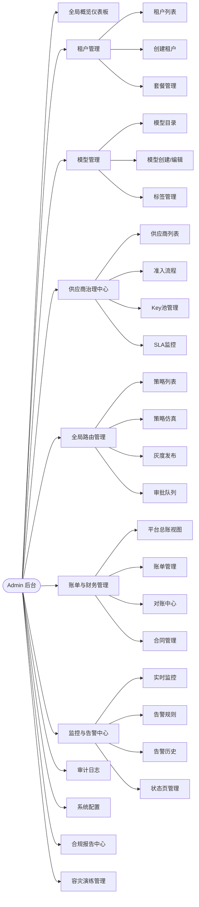
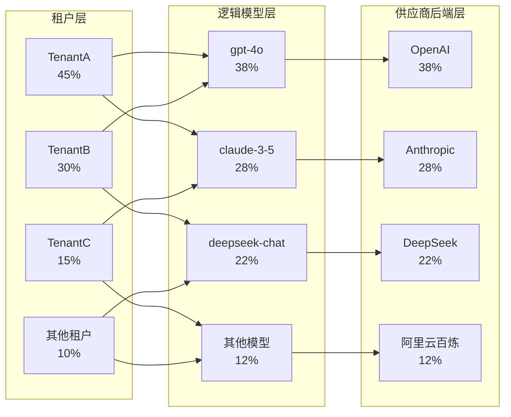
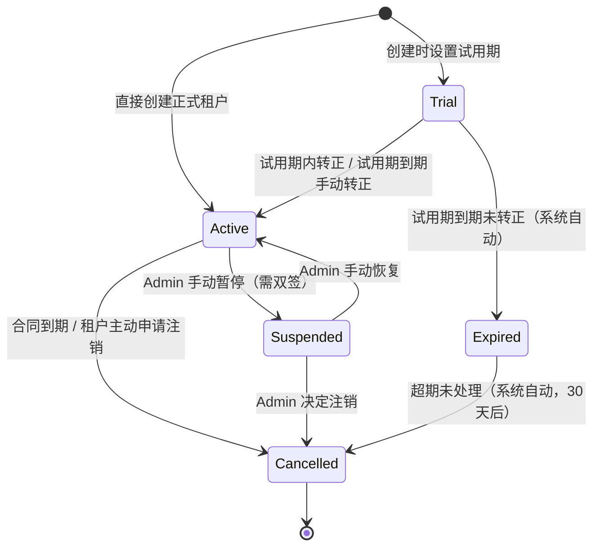
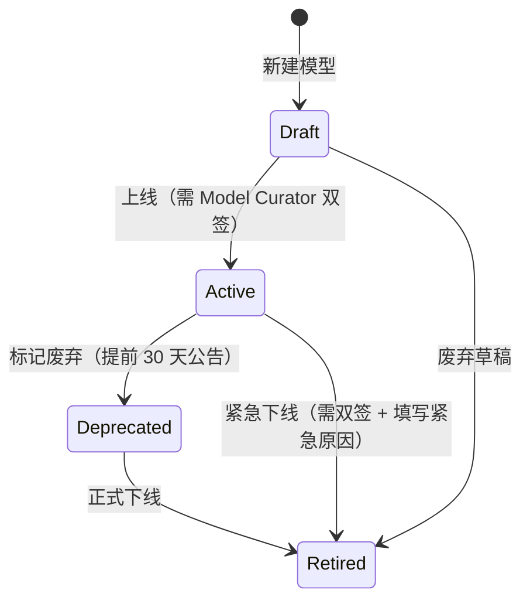
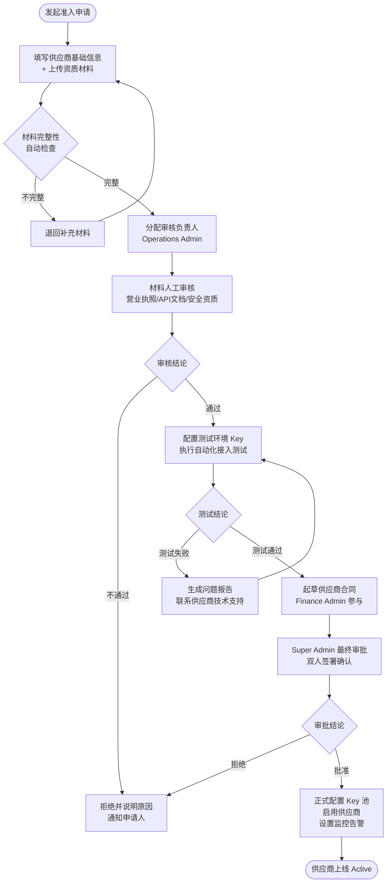
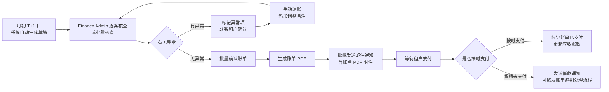

# 10 - Admin 平台管理后台规格

**文档版本**：V2.0.0  
**所属产品**：MaaS 平台 PRD V2.0  
**创建日期**：2026-05-21  
**负责人**：平台运营域 PM  
**审核人**：技术负责人 / 安全合规 / 财务负责人  
**状态**：草稿

---

## 目录

1. [Admin 信息架构与权限概述](#1-admin-信息架构与权限概述)
2. [全局概览仪表板](#2-全局概览仪表板)
3. [租户管理](#3-租户管理)
4. [模型管理](#4-模型管理)
5. [供应商治理中心](#5-供应商治理中心)
6. [全局路由管理](#6-全局路由管理)
7. [账单与财务管理](#7-账单与财务管理)
8. [监控与告警中心](#8-监控与告警中心)
9. [审计日志](#9-审计日志)
10. [系统配置](#10-系统配置)
11. [合规报告中心](#11-合规报告中心)
12. [容灾演练管理](#12-容灾演练管理)
13. [验收标准](#13-验收标准)

---

## 1. Admin 信息架构与权限概述

### 1.1 概述与设计原则

MaaS 平台 Admin 后台（以下简称"Admin 后台"）是面向平台运营团队的内部管理系统，与面向租户的 Console 前台相互独立，部署在独立域名（如 `admin.maas.internal`），仅限平台内部员工通过企业 SSO 登录使用，不对外暴露。

Admin 后台遵循以下设计原则：

**最小权限原则**：每种 Admin 角色只能访问其职责范围内的菜单和操作。财务人员无法查看密钥明文；安全审计人员只能只读不能修改；模型策展人只能管理模型目录，不能进入账单模块。

**操作可溯性原则**：Admin 后台中所有写操作（增/删/改）及高风险读操作（如查看密钥、导出用户数据）均须写入 `audit_log`，记录操作者、时间、操作类型、目标对象、变更前后值的完整快照，无法从代码层面绕过。

**双人复核原则**：对于高风险操作（如租户封号、供应商强制下线、全平台限流、费率变更），系统要求两名有权 Admin 依次审批（Maker-Checker），避免单点误操作。

**灰度分级原则**：Admin 后台本身的功能上线也遵循灰度策略，新功能可通过 Feature Flag 对指定角色灰度开放，降低运营风险。

### 1.2 Admin 后台侧边栏导航结构

Admin 后台采用两级侧边栏导航，主导航位于左侧，二级导航以展开方式呈现。整体信息架构如下：

### 1.3 角色与菜单权限对照表

Admin 后台定义 6 种平台运营角色，各角色的菜单可见性与操作权限如下表所示。权限级别说明：`RW` = 读写、`RO` = 只读、`-` = 无权访问。

| 菜单模块 | Super Admin | Operations Admin | Finance Admin | Security Admin | Model Curator | Support Admin |
|---|---|---|---|---|---|---|
| 全局概览仪表板 | RW | RO | RO | RO | RO | RO |
| 租户管理 - 列表/详情 | RW | RW | RO | RO | - | RO |
| 租户管理 - 创建/编辑 | RW | RW | - | - | - | - |
| 租户管理 - 封停/恢复 | RW | RW（需双签） | - | - | - | - |
| 租户管理 - 套餐变更 | RW | RW（需双签） | RW | - | - | - |
| 模型管理 - 目录浏览 | RW | RO | - | RO | RW | RO |
| 模型管理 - 创建/编辑 | RW | - | - | - | RW | - |
| 模型管理 - 上线/下线 | RW | - | - | - | RW（需双签） | - |
| 供应商治理 - 列表/详情 | RW | RO | RO | RO | RO | - |
| 供应商治理 - 准入管理 | RW | RW | - | RO | RO | - |
| 供应商治理 - Key 池管理 | RW | RW | - | RO | - | - |
| 供应商治理 - SLA 监控 | RW | RW | RO | RO | - | RO |
| 全局路由 - 列表/仿真 | RW | RW | - | RO | RO | - |
| 全局路由 - 策略审批 | RW | RW（需双签） | - | - | - | - |
| 账单财务 - 总账/分账 | RW | RO | RW | - | - | - |
| 账单财务 - 账单生成 | RW | - | RW（需双签） | - | - | - |
| 账单财务 - 对账中心 | RW | - | RW | - | - | - |
| 账单财务 - 合同管理 | RW | - | RW | - | - | - |
| 监控与告警 - 全局监控 | RW | RW | - | RW | - | RW |
| 监控与告警 - 告警规则 | RW | RW | - | RW | - | - |
| 监控与告警 - 状态页 | RW | RW | - | RO | - | RW |
| 审计日志 | RW | RO | RO | RW | RO | - |
| 系统配置 - 参数配置 | RW | RO | - | RO | - | - |
| 系统配置 - SSO/SCIM | RW | - | - | RW | - | - |
| 系统配置 - Feature Flags | RW | - | - | - | - | - |
| 合规报告中心 | RW | RO | RO | RW | - | - |
| 容灾演练管理 | RW | RW | - | RO | - | - |

### 1.4 操作审计说明

所有 Admin 操作均通过框架级 AOP 拦截自动写入 `audit_log` 表，无需业务代码手动调用，也无法从业务层绕过。写入时机为：操作开始时写入 `PENDING` 记录，操作成功后更新为 `SUCCESS`，操作失败后更新为 `FAILED` 并附带错误信息。

`audit_log` 记录要素：

| 字段名 | 类型 | 说明 |
|---|---|---|
| `log_id` | UUID | 全局唯一审计记录 ID |
| `created_at` | Timestamp | 操作发生时间（UTC） |
| `operator_id` | UUID | 操作者 Admin 用户 ID |
| `operator_email` | String | 操作者邮箱（冗余存储，防 ID 被删后丢失） |
| `operator_role` | Enum | 操作者角色快照 |
| `client_ip` | String | 操作者客户端 IP（支持 IPv4/IPv6） |
| `user_agent` | String | 浏览器 UA 信息 |
| `session_id` | String | 当前登录会话 ID |
| `action_type` | Enum | 操作类型：CREATE / UPDATE / DELETE / EXPORT / VIEW_SENSITIVE / APPROVE / REJECT |
| `resource_type` | String | 被操作的资源类型，如 `tenant`、`model`、`vendor_key` |
| `resource_id` | String | 被操作的资源 ID |
| `resource_name` | String | 被操作的资源名称快照 |
| `before_snapshot` | JSONB | 变更前对象快照（仅 UPDATE/DELETE 写入） |
| `after_snapshot` | JSONB | 变更后对象快照（仅 CREATE/UPDATE 写入） |
| `result` | Enum | SUCCESS / FAILED / PENDING |
| `error_message` | String | 失败原因（可选） |
| `hash_prev` | String | 前一条记录的 SHA-256 哈希（构成哈希链） |
| `hash_self` | String | 本条记录内容的 SHA-256 哈希 |

---

## 2. 全局概览仪表板

### 2.1 功能概述

全局概览仪表板是 Admin 后台的首页，也是平台运营人员每日工作的起点。它以统一视图呈现平台当前运营健康状态，帮助运营人员在 30 秒内判断平台是否运转正常、是否存在需要立即处置的异常。仪表板数据刷新策略：KPI 摘要每 60 秒刷新一次，告警列表和供应商状态每 15 秒刷新一次，实时流量图每 5 秒刷新一次。

### 2.2 平台级 KPI 摘要卡片

仪表板顶部展示 7 张核心 KPI 卡片，横向排列，每张卡片显示当前值与环比（日环比、周环比），超过阈值时以颜色警示。

| KPI 指标 | 描述 | 计算口径 | 告警阈值（红色） |
|---|---|---|---|
| 总租户数 | 平台全量注册租户数（含所有状态） | COUNT(tenant WHERE status != 'deleted') | — |
| 活跃租户数 | 过去 24 小时内有 API 请求的租户数 | COUNT DISTINCT(tenant_id FROM request_log WHERE created_at > NOW()-24h) | 环比下降 > 20% |
| 今日总请求量 | 平台今日（自然日，UTC+8）处理的请求总次数 | SUM(request_count) 按自然日聚合 | — |
| 平台综合成功率 | 今日所有请求中返回 2xx 的比例 | 成功请求数 / 总请求数 × 100% | < 99% |
| 平台 P95 延迟 | 今日所有请求 P95 端到端响应延迟（TTFT for streaming） | P95(latency_ms) | > 3000ms |
| 今日平台总成本 | 今日对供应商的实际支出合计 | SUM(cost_usd) 按自然日聚合 | 超预算 110% |
| 今日平台毛利 | 今日收入 - 今日成本（不含 SaaS 固定成本） | SUM(revenue) - SUM(cost) | 毛利率 < 15% |

### 2.3 实时流量 Sankey 图

Sankey 图展示当前时刻（近 5 分钟滚动窗口）平台流量在租户、逻辑模型、供应商后端三个维度的分布情况，节点宽度按请求量比例渲染。

Sankey 图支持交互操作：点击节点可下钻到对应租户/模型/供应商的详情页；悬浮提示框显示该节点的请求量、Token 消耗、成功率、平均延迟四项指标。

### 2.4 供应商健康看板

供应商健康看板以卡片网格形式展示所有已接入供应商的实时状态，每张卡片包含以下信息：

| 字段 | 说明 |
|---|---|
| 供应商名称 + Logo | 视觉识别 |
| 健康状态标签 | 健康（绿）/ 轻度降级（黄）/ 严重告警（橙）/ 故障（红）|
| 今日成功率 | 过去 1 小时的成功率百分比 |
| P95 延迟 | 过去 1 小时的 P95 延迟（ms）|
| Key 池健康 | 可用 Key 数 / 总 Key 数 |
| 今日消耗 | 已消耗 Token 数与剩余额度预估 |
| 最后探活时间 | 上一次健康探测成功的时间戳 |

健康状态判断逻辑（按优先级从高到低）：
- **故障**：过去 5 分钟成功率 < 50%，或所有 Key 均不可用；
- **严重告警**：过去 5 分钟成功率 50%–90%，或 P95 延迟 > 10s，或 Key 可用率 < 30%；
- **轻度降级**：过去 5 分钟成功率 90%–99%，或 P95 延迟 5s–10s，或 Key 可用率 30%–70%；
- **健康**：其余情况。

### 2.5 近期高优告警列表

仪表板右侧展示最近 24 小时内 Severity = `Critical` 或 `High` 的告警列表，按最新触发时间倒序排列，最多展示 20 条。

| 列名 | 说明 |
|---|---|
| 告警 ID | 可点击跳转到告警详情 |
| 告警级别 | Critical（红）/ High（橙）|
| 告警标题 | 简短描述，如"供应商 OpenAI P95 延迟超 5s" |
| 触发时间 | 告警首次触发的时间戳 |
| 状态 | 触发中 / 已确认 / 已关闭 |
| 处置人 | 已认领的 Admin（未认领显示"未分配"）|

### 2.6 平台运营快报

仪表板底部显示"今日运营快报"，包含自然日零时以来的运营事件汇总：

- **新增租户**：今日新完成注册并激活的租户数，可点击查看列表；
- **新建项目**：今日所有租户新创建的项目数；
- **新发布策略**：今日通过审批并生效的路由策略数；
- **待审批事项**：当前队列中等待 Admin 审批的事项数（路由策略审批 + 供应商准入审批 + 租户套餐变更审批），以气泡标注在侧边栏菜单上；
- **今日事故**：今日发生的 Severity = Critical 的供应商事故或平台事故数量；
- **到期提醒**：7 天内即将到期的供应商合同数 / 租户套餐数。

---

## 3. 租户管理

### 3.1 功能概述

租户管理模块是 Admin 后台最核心的日常操作模块，支持平台运营人员对租户进行全生命周期管理，从创建、配置、运营监控到状态变更、套餐调整。

### 3.2 租户列表页

租户列表采用高密度表格展示，支持全文搜索（按租户名称/ID/域名）、多条件筛选和列排序。

**列定义：**

| 列名 | 类型 | 说明 | 可排序 |
|---|---|---|---|
| 租户 ID | String | UUID 前 8 位缩略展示，可复制完整值 | 否 |
| 租户名称 | String | 可点击跳转详情页 | 是 |
| 状态 | Enum | Active（绿）/ Trial（蓝）/ Suspended（黄）/ Cancelled（灰）| 否 |
| 套餐等级 | Enum | Free / Starter / Professional / Enterprise | 是 |
| 创建时间 | DateTime | UTC+8，显示"YYYY-MM-DD HH:mm" | 是 |
| 本月消费 | Decimal | 本月累计计费金额（CNY/USD 按设置），超出预算显红 | 是 |
| 本月用量（Token） | BigInt | 本月 Prompt + Completion Token 合计，带单位换算（K/M/B）| 是 |
| 本月请求量 | BigInt | 本月 API 调用总次数 | 是 |
| 成员数 | Integer | 租户下的用户账号数 | 是 |
| 操作 | Button | 查看详情 / 快速操作（暂停/恢复/变更套餐）|  — |

**筛选条件：**
- 状态多选（Active / Trial / Suspended / Cancelled）；
- 套餐等级多选；
- 创建时间范围选择器（日历组件）；
- 本月消费区间（最小值～最大值输入框）；
- 超出配额（是/否）。

### 3.3 租户创建向导

租户创建流程分为 3 个步骤，向导式界面，完成每步后才能进入下一步。

**步骤一：基础信息**

| 字段 | 类型 | 必填 | 校验规则 |
|---|---|---|---|
| 租户名称 | String | 是 | 2–64 字符，唯一，不允许与现有租户重名 |
| 租户英文标识（Slug） | String | 是 | 小写字母+数字+连字符，4–32 字符，全局唯一，创建后不可更改 |
| 主联系人邮箱 | Email | 是 | 合法邮箱格式；将作为初始 Tenant Admin 账号 |
| 主联系人姓名 | String | 是 | 2–50 字符 |
| 企业名称（全称） | String | 是 | 用于合同与发票 |
| 所属行业 | Enum | 是 | 互联网 / 金融 / 医疗 / 教育 / 政务 / 其他 |
| 备注 | Text | 否 | 运营内部备注，租户侧不可见，最多 500 字 |
| 来源渠道 | Enum | 否 | 官网自注册 / 销售创建 / 合同导入 / 合作伙伴 |

**步骤二：套餐与配额**

| 字段 | 类型 | 默认值 | 说明 |
|---|---|---|---|
| 套餐等级 | Enum | Free | Free / Starter / Professional / Enterprise |
| 月调用量上限（次） | Integer | 按套餐预设 | 0 = 不限，需手动解锁 |
| 月 Token 上限 | BigInt | 按套餐预设 | 0 = 不限 |
| 并发请求上限 | Integer | 按套餐预设 | 每个 API Key 的最大并发数 |
| 最大 API Key 数 | Integer | 按套餐预设 | 租户可创建的最大 API Key 数量 |
| 最大成员数 | Integer | 按套餐预设 | 租户下最多用户账号数 |
| 最大项目数 | Integer | 按套餐预设 | 租户下最多可创建的项目数 |
| 可访问模型列表 | MultiSelect | 按套餐预设 | 允许该租户使用的逻辑模型 ID 列表 |
| SLA 等级 | Enum | 标准 | 标准 / 高级 / 企业级 |
| 功能开关 | Toggle Group | 按套餐预设 | 包括：Prompt 实验室 / 精调缓存 / 评测中心 / 私有 Fallback / 自定义路由 |
| 试用期截止日 | Date | 空（非试用）| 设置后状态自动标记为 Trial |

**步骤三：初始管理员确认**

- 展示步骤一中填写的主联系人邮箱，说明将向该邮箱发送欢迎邮件和登录激活链接；
- 可选：发送自定义欢迎邮件内容（富文本编辑器，支持变量插值如 `{{tenant_name}}`）；
- 确认创建：触发后台创建流程，并在 10 秒内完成租户初始化（包括：租户记录写库、初始配额写入、Admin 账号创建、欢迎邮件发送）；
- 创建成功后自动跳转到新建租户的详情页。

### 3.4 租户详情页

租户详情页以 Tab 形式组织，顶部显示租户名称、状态标签、套餐标签和操作按钮区（编辑/暂停/恢复/变更套餐/发送通知）。

| Tab 名称 | 主要内容 |
|---|---|
| 基础信息 | 所有基础字段的只读展示 + 编辑入口；合同签署状态；销售负责人归属 |
| 成员管理 | 该租户下所有用户账号列表（邮箱/角色/状态/最后登录），Admin 可禁用/恢复成员账号 |
| 项目列表 | 租户下所有项目（项目名/创建时间/API Key 数/本月用量），Admin 只读查看，不可操作 |
| API Key | 该租户所有 API Key 的摘要信息（ID/名称/状态/权限范围），Admin 可强制禁用 Key |
| 账单记录 | 账单历史列表（月份/状态/金额/操作），可下载账单 PDF |
| 合同管理 | 该租户关联的合同列表，包含折扣配置和有效期 |
| 合规状态 | KYC 状态 / 数据处理协议签署状态 / 合规备注 |
| 操作日志 | 针对该租户的所有 Admin 操作审计记录，只读 |

### 3.5 租户状态机

租户的全生命周期状态流转如下：

状态说明：
- **Trial**：试用状态。API 正常可调用，但受试用配额限制；试用期到期后 API 调用被自动拦截（返回 429）；
- **Active**：正式激活状态。按套餐配额正常提供服务；
- **Suspended**：暂停状态。API 调用被拦截（返回 403，错误码 `TENANT_SUSPENDED`）；存储数据保留；支持恢复；
- **Cancelled**：已注销。API 调用被拦截；数据进入保留期（默认 90 天）；保留期后触发数据删除流程；
- **Expired**：试用到期。与 Suspended 行为相同，仅状态标签不同。

### 3.6 批量操作

租户列表支持勾选多条记录后进行批量操作：

| 操作 | 描述 | 需要双签 |
|---|---|---|
| 批量暂停 | 将选中的 Active/Trial 租户批量设为 Suspended | 是 |
| 批量恢复 | 将选中的 Suspended 租户批量恢复为 Active | 否 |
| 批量导出 | 将选中租户的基础信息导出为 CSV（不包含敏感字段）| 否 |
| 批量发送通知 | 向选中租户的主联系人批量发送系统邮件 | 否 |
| 批量变更套餐 | 将选中租户批量切换到指定套餐等级 | 是 |

---

## 4. 模型管理

### 4.1 功能概述

模型管理模块由 Model Curator 角色主导运营，负责平台模型目录的日常维护，包括模型上线/下线、能力标签管理、替代关系配置和质量基准数据录入。所有对模型可用性产生影响的操作均须通过审批。

### 4.2 模型目录列表

模型目录以表格形式展示平台所有已知模型（包含所有生命周期状态），支持搜索和多条件筛选。

| 列名 | 类型 | 说明 |
|---|---|---|
| 模型 ID | String | 逻辑模型 ID，如 `gpt-4o`，可点击进入详情 |
| 模型名称 | String | 友好显示名称（支持中文） |
| 供应商 | String | 关联供应商名称 |
| 模型类型 | Enum | Text / Multimodal / Embedding / Rerank / Image / Audio |
| 能力标签 | Tags | 如 `function-calling` / `vision` / `long-context` / `streaming` |
| 状态 | Enum | Draft / Active / Deprecated / Retired |
| 上下文长度 | Integer | 最大 Context Window（tokens） |
| 输入单价 | Decimal | 每百万 Prompt Token 的 CNY 价格 |
| 输出单价 | Decimal | 每百万 Completion Token 的 CNY 价格 |
| 今日请求量 | BigInt | 今日 UTC+8 当前累计请求次数 |
| 更新时间 | DateTime | 最后一次字段更新时间 |

**筛选条件：**
- 模型类型多选；
- 状态多选；
- 供应商多选；
- 能力标签（包含指定标签）；
- 上下文长度范围（≥ 指定值）；
- 支持搜索（按模型 ID 或名称模糊匹配）。

### 4.3 模型创建与编辑表单

创建/编辑模型使用同一套表单，分为 4 个 Tab 分组填写：

**基础信息 Tab：**

| 字段 | 类型 | 必填 | 说明 |
|---|---|---|---|
| 逻辑模型 ID | String | 是 | 全局唯一，一旦创建不可修改，格式：`{供应商}-{模型名}-{版本}`（小写+连字符）|
| 模型友好名称（中文） | String | 是 | 在控制台面向租户展示的名称 |
| 模型友好名称（英文） | String | 是 | 对外 API 文档中的名称 |
| 关联供应商 | Select | 是 | 必须从已准入的供应商列表中选择 |
| 供应商侧模型 ID | String | 是 | 调用供应商 API 时使用的 model 参数值 |
| 模型类型 | Enum | 是 | Text / Multimodal / Embedding / Rerank / Image / Audio |
| 模型简介 | Text | 是 | 200 字以内，面向租户展示 |
| 模型详细描述 | Markdown | 否 | 支持 Markdown，面向开发者的详细说明文档 |
| 封面图 | Image | 否 | 用于模型目录卡片展示，推荐 400×400px |

**技术规格 Tab：**

| 字段 | 类型 | 必填 | 说明 |
|---|---|---|---|
| 最大 Context Window | Integer | 是 | 单位：tokens |
| 最大输出 Token | Integer | 是 | max_tokens 参数的最大允许值 |
| 支持流式输出 | Boolean | 是 | 是否支持 SSE 流式响应 |
| 支持 Function Calling | Boolean | 是 | — |
| 支持 Tool Use | Boolean | 是 | Anthropic 风格 Tool Use |
| 支持 Vision（图片输入） | Boolean | 是 | — |
| 支持 JSON Mode | Boolean | 是 | 是否支持强制 JSON 输出 |
| 支持 Structured Output | Boolean | 是 | OpenAI response_format JSON Schema 支持 |
| 最大并发数（Key 级） | Integer | 否 | 该模型的并发请求推荐上限 |
| 请求超时建议值（ms） | Integer | 是 | 用于网关默认超时配置 |
| 知识截止日期 | Date | 否 | 模型训练数据的截止日期 |

**定价 Tab：**

| 字段 | 类型 | 必填 | 说明 |
|---|---|---|---|
| 输入 Token 单价（$/1M） | Decimal | 是 | 向供应商支付的成本价 |
| 输出 Token 单价（$/1M） | Decimal | 是 | 向供应商支付的成本价 |
| Cached Token 折扣 | Decimal | 否 | 如 0.5 = 50% 折扣，0 = 不适用 |
| 平台加价率（%） | Decimal | 是 | 平台 Markup 百分比，计算公式：售价 = 成本 × (1 + markup_rate) |
| 计费货币 | Enum | 是 | USD / CNY |
| 生效日期 | Date | 是 | 该定价版本的生效日期，历史账单不受影响 |

**能力标签 Tab：**
以 Tag 选择器形式展示，可从已有标签池中选择，也可创建新标签（新标签需 Super Admin 审批后才能加入全局标签池）。标签池分类：
- **输入模态**：`text-input` / `image-input` / `audio-input` / `video-input`；
- **输出能力**：`text-output` / `image-output` / `audio-output`；
- **特殊能力**：`function-calling` / `tool-use` / `json-mode` / `structured-output` / `streaming` / `vision` / `long-context` / `code-generation` / `reasoning`；
- **合规标签**：`china-mainland-compliance` / `zero-data-retention` / `hipaa-compliant`。

### 4.4 模型生命周期操作

模型状态机与各状态操作按钮如下：

各状态可执行的操作：
- **Draft → Active（上线）**：触发弹窗确认，要求填写"生效说明"和"通知范围"（哪些租户会受到影响），需要第二名 Model Curator 或 Super Admin 在审批队列中确认；
- **Active → Deprecated（标记废弃）**：填写废弃公告文案和正式下线日期；系统在正式下线日前 30 天/7 天/1 天自动向使用该模型的租户发送通知；
- **Deprecated → Retired（正式下线）**：正式下线操作可手动触发或在预定日期自动触发；触发后所有对该模型的 API 请求将收到 `MODEL_RETIRED` 错误码；
- **Active → Retired（紧急下线）**：需要两名 Admin 确认，并填写紧急原因（如：安全漏洞、严重质量问题）；触发后立即生效，系统异步发送告警通知给所有受影响租户。

### 4.5 模型替代关系配置

当一个模型被废弃或下线时，可以配置其替代模型（Successor）。替代关系配置界面展示当前模型的替代链：

| 字段 | 说明 |
|---|---|
| 当前模型 ID | 只读，即本模型 |
| 推荐替代模型 | 单选，从 Active 状态的同类型模型中选择 |
| 替代关系说明 | 文字说明，解释替代模型的适用性和迁移建议 |
| 自动路由切换 | Toggle：是否允许路由策略在本模型不可用时自动切换到替代模型 |
| 自动切换条件 | 仅当"自动路由切换"开启时可配置：仅在模型故障时 / 仅在模型废弃后 / 始终优先 |

### 4.6 模型质量基准数据管理

Model Curator 可为每个模型维护质量基准数据（Benchmark），用于在控制台向租户展示模型能力参考值，并作为路由策略评分的参考输入。

| 基准项 | 类型 | 说明 |
|---|---|---|
| MMLU 得分 | Decimal(5,2) | 0–100，来源于公开基准测试 |
| HumanEval 得分 | Decimal(5,2) | 代码生成能力评分 |
| MATH 得分 | Decimal(5,2) | 数学推理能力评分 |
| 中文理解得分（C-Eval） | Decimal(5,2) | — |
| 平台内部评测得分 | Decimal(5,2) | 由平台评测中心生成的综合质量得分 |
| 测评时间 | Date | 该批次基准数据的测评日期 |
| 数据来源 | String | 公开榜单 URL 或平台内部测评 Job ID |

---

## 5. 供应商治理中心

### 5.1 功能概述

供应商治理中心是 MaaS 平台最复杂的运营管理模块之一，覆盖供应商的全生命周期管理：从准入评估、合同签署、Key 池配置、日常健康监控，到 SLA 违约处理和事故复盘。该模块的核心价值在于将供应商侧风险（API 可用性下降、Key 额度耗尽、合同到期等）在传导到租户之前就被识别和处置。

### 5.2 供应商列表

| 列名 | 类型 | 说明 |
|---|---|---|
| 供应商 ID | String | 内部标识符，如 `openai`、`anthropic` |
| 供应商名称 | String | 可点击进入详情页 |
| 当前状态 | Enum | Active / Degraded / Critical / Incident / Inactive |
| 健康综合得分 | Integer | 0–100，综合可用性/延迟/成功率/Key 池健康计算 |
| Key 池状态 | String | "X 可用 / Y 总数"，点击跳转 Key 池管理页 |
| 今日用量（Token） | BigInt | 今日已消耗 Token 总数 |
| 今日成本（USD） | Decimal | 今日累计成本 |
| 合同状态 | Enum | 有效 / 即将到期（≤30天）/ 已到期 / 无合同 |
| SLA 达成率（近 30 天） | Decimal | 近 30 天 SLO 达成率百分比 |
| 最后事故 | DateTime | 最近一次 Incident 的发生时间，"无"表示无历史事故 |

### 5.3 供应商准入流程管理

新供应商的准入遵循以下标准化流程，每个步骤均在系统中留有完整记录：

准入申请表单字段：

| 字段 | 类型 | 必填 | 说明 |
|---|---|---|---|
| 供应商名称 | String | 是 | 正式名称，不可重复 |
| 供应商类型 | Enum | 是 | 国际云厂商 / 国内大模型厂商 / 开源模型托管 / 私有部署 |
| API 基础 URL | URL | 是 | 供应商 API 端点，需通过连通性测试 |
| 协议兼容性 | Enum | 是 | OpenAI Compatible / Anthropic / Custom |
| 营业执照 / 资质证明 | File | 是 | PDF，最大 20MB |
| 技术接入文档 URL | URL | 是 | 供应商官方 API 文档链接 |
| 安全合规证书 | File | 否 | SOC2 / ISO 27001 等 |
| 联系人姓名 | String | 是 | 供应商侧商务/技术联系人 |
| 联系人邮箱 | Email | 是 | — |
| 预计月均调用量 | Enum | 否 | < 100M / 100M–1B / > 1B Token |
| 申请原因 | Text | 是 | 说明引入该供应商的业务必要性，500 字以内 |

### 5.4 供应商详情页 Tabs

| Tab | 主要内容 |
|---|---|
| 基础信息 | 所有基础字段的只读展示及编辑入口；关联的模型列表（该供应商下的所有模型） |
| Key 池管理 | 见 5.5 详述 |
| SLA 监控 | 见 5.6 详述 |
| 合同管理 | 与该供应商签署的合同列表，包含折扣配置、有效期、主要条款摘要 |
| 质量记录 | 定期（每周）自动运行的质量测评记录，包含各模型的延迟/成功率/质量得分趋势图 |
| 事故历史 | 见 5.7 详述 |

### 5.5 Key 池管理子页

Key 池管理是供应商治理中日常操作频率最高的功能，用于管理平台持有的该供应商 API Key 集合。

**Key 列表字段：**

| 字段 | 类型 | 说明 |
|---|---|---|
| Key ID | String | 内部 ID，可点击查看（查看操作写入 audit_log） |
| Key 摘要 | String | 显示前 8 位 + `****` 后缀，不显示完整 Key |
| 状态 | Enum | 健康 / 降级 / 错误 / 禁用 / 额度耗尽 |
| 绑定模型范围 | Tags | 该 Key 被授权调用的模型列表 |
| 今日消耗额度 | Decimal | 今日消耗的 Token 量或费用 |
| 月度限额 | Decimal | 该 Key 的月度消费上限（USD） |
| 月度已用额度 | Decimal | 本月已消耗的累计费用 |
| 额度预测耗尽时间 | DateTime | 按当前消耗速率预测何时触达月度限额，红色表示 ≤ 7 天 |
| 上次成功调用 | DateTime | 最近一次成功 API 调用的时间戳 |
| 探活状态 | Boolean | 最近一次健康探测是否成功（每 60 秒探活一次）|
| 创建时间 | DateTime | — |

**Key 轮询策略配置：**
每个供应商的 Key 池可配置独立的轮询策略：
- **Round Robin（轮询）**：平均分配请求到所有健康 Key；
- **Least Connections（最少连接）**：优先路由到当前并发数最少的 Key；
- **Weighted（权重）**：为每个 Key 配置权重值，按权重比例分配；
- **Priority（优先级）**：配置 Key 的优先级梯队，优先级高的 Key 饱和后才使用下一级。

**额度预测图表：**
以折线图展示每个 Key 的月度额度消耗趋势（近 30 天实际消耗 + 未来 15 天预测），并标注限额警戒线（80%/100%）。预测算法基于近 7 天消耗速率的加权移动平均。

### 5.6 SLA 监控

SLA 监控子页展示该供应商的 SLO 达成情况，包含历史统计和当前实时状态。

**SLO 指标配置：**

| SLO 指标名 | 默认目标值 | 计算方式 | 统计窗口 |
|---|---|---|---|
| API 可用性（Availability） | 99.9% | 成功请求数 / 总请求数 | 滚动 30 天 |
| P50 延迟 | ≤ 500ms | 50 百分位响应时间 | 滚动 7 天 |
| P95 延迟 | ≤ 2000ms | 95 百分位响应时间 | 滚动 7 天 |
| P99 延迟 | ≤ 5000ms | 99 百分位响应时间 | 滚动 7 天 |
| 错误率 | ≤ 0.1% | 5xx 错误数 / 总请求数 | 滚动 7 天 |

**SLA 违约事件记录：**
当某个 SLO 指标在合同约定的统计窗口内未达到目标值时，系统自动创建 SLA 违约事件记录：

| 字段 | 类型 | 说明 |
|---|---|---|
| 违约事件 ID | UUID | — |
| 违约 SLO | String | 具体是哪个 SLO 指标未达标 |
| 统计周期 | DateRange | 违约对应的统计时间窗口 |
| 目标值 | Decimal | SLO 目标 |
| 实际值 | Decimal | 统计周期内的实际表现 |
| 缺口 | Decimal | 实际值与目标值的差值 |
| 影响请求数 | BigInt | 该统计周期内受影响的请求总数 |
| 赔付金额（估算） | Decimal | 按合同赔付条款估算的赔付金额 |
| 处理状态 | Enum | 待确认 / 已发送函件 / 赔付中 / 已结案 |
| Finance Admin 备注 | Text | 财务人员的处理备注 |

### 5.7 供应商事故历史

每次供应商发生显著的可用性事故（定义：任意 5 分钟窗口内成功率 < 99% 且持续 ≥ 5 分钟），系统自动创建事故记录。

| 字段 | 类型 | 说明 |
|---|---|---|
| 事故 ID | String | 格式 `INC-{年月日}-{序号}`，如 `INC-20260521-003` |
| 影响供应商 | String | — |
| 影响模型 | Tags | 本次事故影响到的模型列表 |
| 开始时间 | DateTime | 事故检测到的时间（不一定是实际故障开始时间）|
| 结束时间 | DateTime | 事故恢复完成时间，未恢复显示"进行中" |
| 持续时长 | Integer | 分钟数 |
| 影响请求数 | BigInt | 事故期间失败或延迟超阈值的请求总数 |
| 影响租户数 | Integer | 受波及的不同租户数量 |
| 根因分析 | Text | Operations Admin 填写的根因描述 |
| 处置方案 | Text | 事故处置过程记录（时间线格式）|
| 供应商官方公告 URL | URL | 可选，供应商 Status Page 的对应事故链接 |
| 复盘是否完成 | Boolean | 是否完成 Post-mortem 复盘文档 |

---

## 6. 全局路由管理

### 6.1 功能概述

全局路由管理模块允许 Admin 在平台层面创建、审批、监控路由策略。与租户侧路由策略的区别在于：平台级策略具有最高优先级，可覆盖租户自定义策略，主要用于平台级应急降级、成本控制和供应商流量分配调整。

### 6.2 平台级策略列表

| 列名 | 类型 | 说明 |
|---|---|---|
| 策略 ID | String | 全局唯一，格式 `policy-{UUID 前 8 位}` |
| 策略名称 | String | 可点击进入详情/编辑页 |
| 策略类型 | Enum | Cost-Optimized / Latency-Optimized / Failover / Load-Balance / Custom |
| 作用范围 | Enum | 全平台 / 指定租户组 / 指定模型 / 指定供应商 |
| 状态 | Enum | Draft / Pending-Approval / Active / Archived |
| 版本号 | String | 格式 `v{major}.{minor}`，每次修改后 minor +1，major 变更需重新审批 |
| 创建者 | String | 创建该策略的 Admin 邮箱 |
| 创建时间 | DateTime | — |
| 上次生效时间 | DateTime | 最近一次审批通过并生效的时间 |
| 今日路由命中次数 | BigInt | 今日经该策略路由的请求总数 |
| 操作 | Button | 编辑 / 仿真 / 灰度 / 存档 |

### 6.3 策略创建多步骤向导

**步骤一：策略基本信息**

| 字段 | 类型 | 必填 | 说明 |
|---|---|---|---|
| 策略名称 | String | 是 | 2–64 字符，平台内唯一 |
| 策略描述 | Text | 是 | 说明该策略的设计意图和适用场景，100 字以上 |
| 策略类型 | Enum | 是 | Cost-Optimized / Latency-Optimized / Failover / Load-Balance / Custom |
| 作用范围类型 | Enum | 是 | 全平台 / 指定租户组 / 指定模型 / 指定供应商 |
| 作用范围值 | MultiSelect | 是（非全平台时）| 根据作用范围类型选择对应的租户组/模型/供应商 |
| 生效时间范围 | DatetimeRange | 否 | 留空表示永久有效；填写后策略在范围外自动挂起 |
| 优先级 | Integer | 是 | 1–100，数字越小优先级越高；同优先级按创建时间排序 |

**步骤二：路由规则配置**

路由规则以"条件-动作"形式配置，支持最多 10 条规则，按顺序匹配（第一条匹配即执行对应动作，不继续向下匹配）。

条件维度（支持 AND/OR 组合）：
- 请求者租户 ID（等于 / 属于分组 / 不属于分组）；
- 请求目标逻辑模型（等于 / 属于标签组）；
- 请求时间段（工作时间 / 非工作时间 / 自定义时间范围）；
- 请求来源地区（中国大陆 / 海外 / 指定省份）；
- 请求体参数（如 `temperature > 0.8` / `max_tokens > 4096`）。

动作类型：
- **路由到指定供应商**：绑定一个或多个供应商，并配置分流比例；
- **路由到指定供应商组**：按标签（如"国内合规供应商"）路由；
- **强制 Fallback**：跳过主路由，直接走备用链路；
- **限流**：对匹配请求施加额外的速率限制；
- **拒绝**：直接拒绝请求并返回指定错误码和错误信息；
- **打标签**：为请求附加平台标签，用于后续监控分析（不影响路由结果）。

**步骤三：Fallback 链配置**

为本策略配置 Fallback 链，当主路由失败时依次尝试备用路由：

| 配置项 | 类型 | 说明 |
|---|---|---|
| Fallback 层数 | Integer | 1–5 层，每层配置一个备用供应商或供应商组 |
| 第 N 层供应商 | Select | 从已准入的供应商中选择 |
| 触发 Fallback 的条件 | Enum | 主路由超时 / 主路由 5xx / 主路由 429 / 以上任意一种 |
| Fallback 超时（ms） | Integer | 每一层 Fallback 尝试的超时时间 |
| 最终兜底行为 | Enum | 返回 503 / 返回缓存响应 / 返回平台降级消息 |

**步骤四：审批配置**

- 选择审批人：从有权审批路由策略的 Admin 列表中选择 1–3 名审批人；
- 审批截止时间：设置审批请求的过期时间（默认 48 小时）；
- 生效方式：审批通过后立即生效 / 审批通过后进入灰度 / 在指定时间生效。

### 6.4 策略仿真界面

策略仿真允许在不影响生产流量的情况下，使用历史请求数据评估策略效果。

仿真配置：
- **选择策略**：从列表中选择一条 Draft 或 Active 状态的策略；
- **历史流量窗口**：选择用于回放的历史时间窗口（最近 1 小时 / 6 小时 / 24 小时 / 7 天，或自定义范围）；
- **流量采样率**：100% / 10% / 1%（样本量越大，仿真越精确，但耗时越长）；
- **对比基准**：选择一条 Active 策略作为对比基准（如不选择则与当前实际路由结果对比）。

仿真报告输出：
- **路由分布对比**：仿真策略 vs 基准策略的供应商流量分布饼图；
- **成本对比**：仿真总成本 vs 基准总成本，差额和百分比；
- **延迟对比**：P50/P95/P99 延迟对比折线图；
- **成功率对比**：总体成功率对比；
- **Fallback 触发率**：仿真策略触发 Fallback 的次数和比例；
- **样本详情**：抽样查看 100 条请求的仿真路由决策明细。

### 6.5 灰度发布控制台

灰度发布允许新策略以小比例流量逐步生效，降低新策略带来的风险。

| 配置/显示项 | 说明 |
|---|---|
| 策略名称（只读）| 当前正在灰度的策略 |
| 灰度比例滑块 | 0%–100%，拖拽即时生效，支持输入框精确设置 |
| 当前生效策略 | 100% - 灰度比例 的流量执行的旧策略名称 |
| 实时效果对比 | 双列展示：灰度策略 vs 当前策略的成功率、P95 延迟、成本/请求 |
| 自动提升规则 | 可配置：当灰度策略的成功率 ≥ X% 且 P95 延迟 ≤ Y ms 时，每隔 Z 分钟自动将比例提升 10% |
| 自动回滚规则 | 可配置：当灰度策略的成功率 < X% 时，立即将比例降回 0% 并发送告警 |
| 手动全量切换 | 一键将灰度比例设为 100%，需要审批人再次确认 |
| 手动终止灰度 | 将比例降为 0%，策略退回 Draft 状态 |

### 6.6 策略审批队列

| 列名 | 说明 |
|---|---|
| 策略名称 | 可点击查看策略完整配置 |
| 申请类型 | 新建 / 修改 / 归档 / 全量切换 |
| 申请人 | 发起审批请求的 Admin |
| 申请时间 | 提交审批的时间 |
| 过期时间 | 审批截止时间 |
| 当前状态 | 待审批 / 已批准 / 已拒绝 / 已过期 |
| 操作 | 查看详情 / 批准 / 拒绝 |

审批详情页内容：
- 策略完整配置的 Diff 视图（新版 vs 旧版，增量红绿色标注）；
- 申请人备注；
- 仿真报告链接（如果申请前已运行过仿真）；
- 审批意见输入框（批准/拒绝均需填写意见，最少 20 字）。

### 6.7 全局 Fallback 链配置

平台级全局 Fallback 链是最兜底的应急配置，当任何策略都无法成功路由请求时启用。

| 配置项 | 说明 |
|---|---|
| 第 1 备用供应商 | 平台首选备用供应商，通常是可用性最高的供应商 |
| 第 2 备用供应商 | 第 1 备用不可用时的选项 |
| 第 3 备用供应商 | 依此类推，最多 5 层 |
| 全局最终兜底 | 当所有供应商均不可用时的兜底响应：返回 503 Service Unavailable（附带 Retry-After 头）|
| 兜底消息模板 | 自定义 503 响应体中的错误消息文案 |
| 配置更新需要双签 | 修改全局 Fallback 链需要 Super Admin 级别双人审批 |

---

## 7. 账单与财务管理

### 7.1 功能概述

账单与财务管理模块由 Finance Admin 角色主导，覆盖平台财务的完整工作流：从日常成本监控、租户分账查看，到月末账单生成发布、供应商对账处理和合同维护。该模块的数据以 `06-计费成本与 FinOps 规格.md` 中定义的 `billing_ledger` 表为核心数据源。

### 7.2 平台总账视图

平台总账视图提供平台维度的财务全局视角，时间维度支持：今日 / 本周 / 本月 / 上月 / 自定义日期范围。

**核心财务指标卡片：**

| 指标 | 计算公式 | 说明 |
|---|---|---|
| 总收入（含税） | SUM(invoice_amount) 在选定时间范围内 | 向租户开具的发票总金额 |
| 总收入（不含税） | 总收入 / (1 + 税率) | 税率默认 6%（增值税专票） |
| 总成本（供应商支出） | SUM(vendor_cost_usd × 汇率) | 向供应商实际支付的费用，按当日汇率换算 CNY |
| 毛利 | 总收入（不含税）- 总成本 | — |
| 毛利率 | 毛利 / 总收入（不含税）× 100% | 低于 15% 显红色告警 |
| 未结账金额 | 已产生费用但尚未生成账单的金额 | — |
| 应收账款 | 已发送账单但尚未支付的金额合计 | — |
| 逾期应收 | 超过账期（默认 30 天）仍未支付的金额 | — |

**各供应商支出占比图表：**以饼图展示选定时间范围内各供应商的费用占比，支持点击下钻查看该供应商各模型的分项成本。

**成本趋势折线图：**展示近 30 天（或自定义范围）的每日总成本和总收入趋势，叠加毛利率折线。

### 7.3 租户分账视图

租户分账视图以租户为维度展示收入明细，帮助 Finance Admin 了解收入来源分布和大客户情况。

**租户分账列表：**

| 列名 | 说明 |
|---|---|
| 租户名称 | 可点击进入该租户的账单详情 |
| 本期消费（CNY） | 选定时间范围内该租户的总计费金额 |
| 本期 Token 消耗 | 按 Prompt / Completion 分列展示 |
| 本期请求量 | — |
| 最热门模型 | 该租户本期使用量最高的前 3 个模型 |
| 账单状态 | 草稿 / 已确认 / 已发送 / 已支付 / 逾期 |
| 付款方式 | 预付（余额）/ 后付（月结）/ 合同定价 |

### 7.4 账单生成与发布流程

平台账单遵循月结模式，每月 1 日自动为上月生成所有租户的账单草稿，Finance Admin 确认后批量发送。

账单手动调账规则：
- 每笔手动调账须填写调账类型（折扣优惠 / 退款 / 补收 / 坏账处理）、调账金额和原因说明；
- 调账金额超过 1000 元需要第二名 Finance Admin 复核；
- 所有调账记录永久保存，不可删除，仅可注释说明。

### 7.5 与供应商对账

对账中心支持将平台侧账单与供应商出具的账单进行自动比对，识别差异项供人工确认。

**对账流程：**

1. **导入供应商账单**：Finance Admin 手动上传供应商导出的月度账单文件（支持 CSV / Excel / 供应商特定格式）；
2. **格式解析**：系统根据供应商配置的账单格式模板自动解析字段（日期/模型/Token 量/金额）；
3. **自动比对**：系统将供应商账单中每一行与平台 `billing_ledger` 中对应的记录进行比对；
4. **差异标记**：比对结果分为三类：完全匹配 / 差异可接受（误差 ≤ 0.1%）/ 需人工确认差异；
5. **人工确认差异项**：Finance Admin 对每条"需确认差异项"进行逐一处置（接受差异 / 对账调整 / 联系供应商核实）；
6. **对账完成**：所有差异项处置完成后，Finance Admin 标记本次对账完成，生成对账报告。

**对账摘要字段：**

| 字段 | 说明 |
|---|---|
| 对账月份 | 格式 `YYYY-MM` |
| 供应商名称 | — |
| 导入账单总金额 | 供应商账单的总额 |
| 平台侧计算总金额 | 平台 billing_ledger 的汇总值 |
| 绝对差异 | 两者之差，正数表示供应商多收 |
| 相对差异率 | |差异| / 平台侧金额 × 100% |
| 完全匹配行数 | — |
| 差异行数 | — |
| 对账状态 | 进行中 / 已完成 / 有待处理差异 |

### 7.6 合同管理

Admin 后台支持对每个租户和每个供应商维护合同记录，记录合同条款和折扣配置。

**合同字段：**

| 字段 | 类型 | 说明 |
|---|---|---|
| 合同 ID | String | 格式 `CTR-{年月}-{序号}` |
| 合同类型 | Enum | 租户合同 / 供应商合同 |
| 关联方 | Select | 关联的租户或供应商 |
| 合同名称 | String | — |
| 生效日期 | Date | — |
| 到期日期 | Date | 到期前 30 天发送提醒通知 |
| 合同文件 | File | PDF，最大 50MB，加密存储 |
| 折扣配置 | JSONB | 分模型、分用量阶梯的折扣率配置 |
| 最低消费承诺 | Decimal | 合同约定的月度最低消费金额 |
| 超量单价 | Decimal | 超出承诺用量后的单价 |
| 账期 | Integer | 发票开具后多少天内付款，默认 30 天 |
| 续签提醒 | Toggle | 是否在到期前发送续签提醒邮件 |
| 经办人 | String | 负责该合同的 Finance Admin 姓名 |

### 7.7 发票管理

| 字段 | 说明 |
|---|---|
| 发票申请来源 | 租户从控制台提交 / Admin 手动创建 |
| 发票类型 | 增值税专用发票 / 增值税普通发票 |
| 开票金额 | 与关联账单一致 |
| 开票信息 | 公司名称 / 纳税人识别号 / 银行账号 / 地址 |
| 开票状态 | 待处理 / 开具中 / 已开具 / 已邮寄 / 已作废 |
| 发票号码 | 开具后填入 |
| 快递单号 | 纸质发票邮寄时填入 |
| 上传扫描件 | Finance Admin 上传发票 PDF 扫描件 |

---

## 8. 监控与告警中心

### 8.1 功能概述

监控与告警中心是平台 SRE 和 Operations Admin 的核心工作台，整合了平台级实时监控大盘、告警规则配置、历史告警处置记录、SLA 达成报告和对外状态页管理。该模块与微服务层的 `monitor-notification-service` 对接，数据经过聚合后以可视化方式呈现。

### 8.2 全局实时监控大盘

监控大盘以时间序列图为主，支持时间范围选择（近 15 分钟 / 1 小时 / 6 小时 / 24 小时 / 7 天），自动刷新间隔可配置（15s / 30s / 60s / 手动刷新）。

**核心监控图表：**

| 图表名称 | 图表类型 | Y 轴 | 数据来源 |
|---|---|---|---|
| 全局请求 QPS | 折线图（多线：总/成功/失败）| 请求/秒 | 实时聚合 |
| 全局 P95/P99 延迟 | 折线图（双线）| 毫秒 | 百分位聚合 |
| 全局错误率 | 面积图（按错误类型分色）| 百分比 | 按 HTTP 状态码聚合 |
| 各供应商 QPS 分布 | 堆叠面积图（按供应商着色）| 请求/秒 | 按供应商 ID 分组 |
| 各供应商错误率 | 折线图（多线，按供应商）| 百分比 | 按供应商 ID 分组 |
| Token 消耗速率 | 折线图（Prompt / Completion 双线）| Token/分钟 | 实时聚合 |
| 成本燃烧速率 | 折线图 | USD/小时 | 实时成本聚合 |

**供应商健康矩阵（热力图）：**以矩阵形式展示近 24 小时内各供应商各时间段的健康状态，X 轴为时间（以小时为粒度），Y 轴为供应商列表，格子颜色表示该时间段的健康状态（绿/黄/橙/红）。

### 8.3 告警规则配置

平台预置一批默认告警规则，Operations Admin 可修改阈值，也可新增自定义规则。

**预置告警规则列表：**

| 规则名称 | 触发条件 | 默认级别 | 默认通知渠道 |
|---|---|---|---|
| 平台成功率骤降 | 5 分钟内成功率 < 99% | Critical | 企业微信+邮件 |
| 供应商可用性下降 | 任意供应商 5 分钟成功率 < 95% | High | 企业微信 |
| 供应商 P95 延迟超阈值 | 任意供应商 P95 延迟 > 5s 持续 5 分钟 | High | 企业微信 |
| Key 池耗尽预警 | 任意供应商可用 Key 数 < 总 Key 数 × 20% | High | 邮件 |
| Key 额度即将耗尽 | 任意 Key 预计 ≤ 7 天触达月限额 | Medium | 邮件 |
| 成本超预算 | 当日成本超今日预算的 110% | High | 邮件 |
| 租户配额超限 | 任意租户本月消耗超配额 90% | Medium | 邮件 |
| 异常流量突增 | 平台 QPS 环比 15 分钟暴增 > 300% | High | 企业微信 |
| 证书即将过期 | 任意 TLS 证书 ≤ 30 天到期 | Medium | 邮件 |
| 合同即将到期 | 任意供应商/租户合同 ≤ 30 天到期 | Low | 邮件 |

**自定义告警规则字段：**

| 字段 | 类型 | 说明 |
|---|---|---|
| 规则名称 | String | 唯一，2–64 字符 |
| 触发指标 | Select | 从平台预定义的指标列表中选择 |
| 聚合方式 | Enum | 平均值 / 最大值 / 最小值 / P95 / P99 / 求和 |
| 评估时间窗口 | Integer + Enum | 如"5 分钟" |
| 触发条件 | 表达式 | 如 `value < 0.99` 或 `value > 5000` |
| 持续时间 | Integer | 条件连续满足多少分钟后触发告警（避免抖动）|
| 告警级别 | Enum | Critical / High / Medium / Low |
| 通知渠道 | MultiSelect | 邮件 / 企业微信 / 钉钉 / Webhook |
| 通知接收人 | MultiSelect | 从 Admin 用户列表选择 |
| 恢复通知 | Toggle | 告警恢复后是否发送恢复通知 |

### 8.4 告警历史与处置记录

| 字段 | 说明 |
|---|---|
| 告警 ID | 唯一，格式 `ALT-{年月日}-{序号}` |
| 规则名称 | 触发的告警规则 |
| 触发时间 | — |
| 恢复时间 | 未恢复显示"-" |
| 持续时长 | 分钟数 |
| 级别 | Critical / High / Medium / Low |
| 触发值 | 触发告警时的指标实际值 |
| 状态 | 触发中 / 已确认 / 已关闭 |
| 认领人 | 认领处置该告警的 Admin |
| 处置备注 | Admin 记录的处置过程和根因 |
| 关联事故 | 是否关联到供应商事故记录 |

### 8.5 SLA 报告

SLA 报告以月度为周期自动生成，也可按需手动生成。报告内容：

- **可用性 SLO 达成情况**：按月展示平台整体可用性、各供应商可用性的 SLO 达成状态（达标/未达标），对比合同约定目标值；
- **延迟 SLO 达成情况**：P95/P99 延迟月度分布直方图及 SLO 达成率；
- **错误率 SLO 达成情况**：月度错误率趋势与 SLO 阈值对比；
- **事故汇总**：本月发生的所有事故列表（事故 ID、持续时长、影响范围）；
- **SLO 预算余量**：基于 Error Budget 模型展示剩余可用 Error Budget 百分比。

### 8.6 状态页管理

平台提供对外公开的状态页（如 `status.maas.example.com`），Admin 后台可管理状态页的内容。

| 功能 | 说明 |
|---|---|
| 当前系统状态设置 | 手动设置展示状态：正常运行 / 性能降级 / 部分功能中断 / 全面中断 |
| 各组件状态配置 | 可配置哪些服务组件展示在状态页上，以及各组件的当前状态 |
| 事件公告发布 | 发布 Incident 公告或维护通知（Markdown 格式），支持定时发布 |
| 历史事件归档 | 查看和编辑已发布的历史 Incident 记录 |
| 订阅者管理 | 查看状态页订阅用户数，可发送手动推送 |

### 8.7 通知渠道管理

| 渠道 | 配置项 |
|---|---|
| 邮件（SMTP） | SMTP 服务器地址/端口/账号/密码；发件人显示名；支持模板变量 |
| 企业微信群机器人 | Webhook URL；可配置多个机器人（对应不同告警级别分组） |
| 钉钉群机器人 | Webhook URL + 签名密钥；加签验证方式 |
| 自定义 Webhook | URL；HTTP Method（POST/PUT）；自定义请求头；Payload 模板（支持变量） |
| PagerDuty | API Key；Service Key；仅用于 Critical 级别告警 |

通知渠道配置后可发送测试消息，确认渠道连通性后方可保存。

---

## 9. 审计日志

### 9.1 功能概述

审计日志模块向 Security Admin 和 Super Admin 提供对平台所有 Admin 操作的完整可见性，是平台安全合规的核心能力之一。系统要求：审计日志一旦写入不可修改，保留期限不少于 3 年，支持防篡改验证，并支持完整导出以满足外部审计需求。

### 9.2 审计日志列表

列表支持分页（每页 50 条），按时间倒序排列，支持多维度快速筛选。

**列定义：**

| 列名 | 宽度 | 说明 |
|---|---|---|
| 时间 | 180px | 精确到秒，UTC+8，显示 `YYYY-MM-DD HH:mm:ss` |
| 操作者 | 200px | 邮箱 + 角色标签，可点击过滤该操作者的所有记录 |
| 操作类型 | 120px | CREATE / UPDATE / DELETE / EXPORT / VIEW_SENSITIVE / APPROVE / REJECT，带颜色标签 |
| 目标资源 | 200px | `{资源类型}:{资源名称}`，如 `tenant:TenantA` |
| 来源 IP | 140px | 操作者客户端 IP |
| 结果 | 80px | SUCCESS（绿）/ FAILED（红）/ PENDING（灰）|
| 详情 | — | 点击"查看"展开详情或跳转详情页 |

### 9.3 多维筛选条件

| 筛选维度 | 组件类型 | 说明 |
|---|---|---|
| 时间范围 | 日历选择器（范围）| 开始时间 ~ 结束时间，最大跨度 90 天 |
| 操作类型 | 多选下拉 | CREATE / UPDATE / DELETE / EXPORT / VIEW_SENSITIVE / APPROVE / REJECT |
| 操作者 | 搜索选择 | 输入邮箱或姓名模糊搜索 |
| 角色 | 多选下拉 | 按 Admin 角色过滤 |
| 资源类型 | 多选下拉 | tenant / model / vendor / vendor_key / route_policy / billing / audit_log 等 |
| 来源 IP | 文本输入 | 支持 CIDR 格式过滤 |
| 操作结果 | 单选 | 全部 / 成功 / 失败 |
| 关键词 | 文本搜索 | 对资源名称、操作者邮箱、IP 地址做全文匹配 |

### 9.4 审计日志详情

点击日志记录后展示完整详情，包含：

- **基本信息**：所有字段的完整展示；
- **变更 Diff 视图**：当 `action_type` 为 UPDATE 或 DELETE 时，以 JSON Diff 方式展示 `before_snapshot` 和 `after_snapshot` 的差异，新增字段绿色高亮，删除字段红色高亮，修改字段双行展示（修改前/修改后）；
- **关联请求信息**：操作者的 Session ID、User Agent 信息；
- **哈希验证**：显示本条记录的 `hash_self` 值，以及前一条记录的 `hash_prev` 是否匹配（构成哈希链完整性验证）。

### 9.5 审计日志导出

支持将满足筛选条件的审计日志批量导出，供外部审计或内部排查使用。

| 配置项 | 说明 |
|---|---|
| 导出格式 | CSV（UTF-8 with BOM）/ JSON Lines（每行一个 JSON 对象）|
| 时间范围 | 必填，单次导出最大范围 90 天 |
| 筛选条件 | 与列表页相同的所有筛选维度均支持导出时过滤 |
| 包含字段 | 可选择是否包含 before_snapshot / after_snapshot（体积较大）|
| 导出方式 | 小于 10 万条：浏览器直接下载；超过 10 万条：异步生成后发送下载链接邮件 |
| 导出记录 | 每次导出操作本身也写入 audit_log（action_type = EXPORT）|

### 9.6 防篡改验证

审计日志采用哈希链结构保证不可篡改性，每条记录包含 `hash_prev`（前一条记录的哈希值）和 `hash_self`（本条记录核心字段内容的 SHA-256 哈希值）。

**完整性验证界面：**
Security Admin 可触发"哈希链完整性验证"，系统从最早的记录开始，逐条重新计算哈希值并与存储值比对，若所有记录均一致则显示"验证通过"，若发现任意一条不一致则标记为"发现篡改风险"并显示具体的问题记录位置。

完整性验证为异步任务，验证大量记录（> 100 万条）可能需要数分钟，系统在后台执行并在完成后发送通知。

---

## 10. 系统配置

### 10.1 功能概述

系统配置模块仅 Super Admin 可完整访问，用于管理平台全局参数、SSO 集成、Feature Flag 和系统健康监控。配置变更均写入 audit_log，高风险配置修改需要双签。

### 10.2 平台全局参数配置

| 参数名 | 类型 | 默认值 | 说明 |
|---|---|---|---|
| 全局请求超时（ms） | Integer | 60000 | 网关对供应商请求的最大等待时间 |
| 流式响应超时（ms） | Integer | 120000 | 流式请求的最大总时长 |
| 全局最大并发请求数 | Integer | 10000 | 网关层面的全局并发上限 |
| 默认速率限制（req/min/key）| Integer | 1000 | 未配置专属策略时的默认 API Key 速率限制 |
| 请求体最大大小（MB）| Integer | 10 | 单次 API 请求的最大 Request Body 大小 |
| Cache TTL（秒）| Integer | 300 | Prompt Cache 的默认 TTL，0 = 禁用 |
| 日志保留期（天）| Integer | 90 | 请求日志的保留天数，到期后自动删除 |
| 审计日志保留期（年）| Integer | 3 | audit_log 的法定保留期限 |
| 默认账期（天）| Integer | 30 | 新租户账单的默认付款期限 |
| 平台时区 | Enum | Asia/Shanghai | 用于报表和告警时间展示的时区 |
| 系统通知邮件发件人 | Email | — | 系统邮件的 From 地址 |
| 平台客服邮箱 | Email | — | 错误响应体中展示的联系地址 |
| 维护窗口时间 | Cron 表达式 | — | 计划维护时间窗口，在状态页自动展示维护通知 |

### 10.3 SSO 与 SCIM 配置管理

Admin 后台支持接入企业 IdP（Identity Provider）实现 Admin 账号的统一身份认证。

**SSO 配置字段：**

| 字段 | 类型 | 说明 |
|---|---|---|
| IdP 类型 | Enum | SAML 2.0 / OIDC / Azure AD / Okta / 飞书 / 企业微信 |
| Entity ID / Client ID | String | 平台在 IdP 侧的应用标识 |
| SSO 登录 URL | URL | IdP 的登录端点 |
| 证书 / Client Secret | String/File | 加密存储，页面不显示明文 |
| 属性映射 | JSONB | 将 IdP 返回的属性映射到平台字段，如 `email → operator_email` |
| 默认分配角色 | Enum | 新 Admin 账号通过 SSO 首次登录时分配的默认角色 |
| 强制 SSO | Toggle | 开启后禁止密码登录，所有账号必须通过 SSO |

**SCIM 配置字段：**

| 字段 | 类型 | 说明 |
|---|---|---|
| SCIM Base URL | URL（只读）| 平台提供的 SCIM 2.0 端点，供 IdP 配置 |
| Bearer Token | String | 生成按钮，生成后仅显示一次；用于 IdP 向平台推送用户同步 |
| 同步范围 | Enum | 仅同步用户 / 仅同步群组 / 用户和群组 |
| 群组到角色映射 | JSONB | 将 IdP 群组映射到平台 Admin 角色 |
| 最后同步时间 | DateTime（只读）| 最近一次 SCIM 同步成功的时间戳 |

### 10.4 功能开关（Feature Flags）

Feature Flag 管理界面允许 Super Admin 对平台功能进行细粒度的灰度控制：

| 字段 | 说明 |
|---|---|
| Flag Key | 唯一标识，如 `enable_prompt_lab_for_enterprise` |
| 描述 | 该 Flag 控制的功能说明 |
| 当前状态 | 全量开启 / 全量关闭 / 灰度中 |
| 灰度规则 | 按租户 ID 白名单 / 按租户套餐 / 按随机百分比 |
| 创建时间 | — |
| 上次修改人 | Admin 邮箱 |

### 10.5 系统健康检查面板

| 检查项 | 状态说明 |
|---|---|
| API 网关服务 | 实例数 / 在线实例数 / P95 延迟 |
| 路由服务 | 实例数 / 在线实例数 |
| 计费服务 | 在线状态 / 最后处理账单时间 |
| 数据库主节点 | 连接状态 / 主从延迟（ms）|
| Redis 集群 | 节点状态 / 内存使用率 |
| 消息队列（Kafka）| 消费延迟（lag）/ 各 Topic 积压量 |
| 对象存储 | 可用性探测结果 |
| 外部 DNS 解析 | 主要供应商域名的解析耗时 |

### 10.6 备份与恢复管理

| 功能 | 说明 |
|---|---|
| 自动备份计划 | 查看当前备份计划（每日全量 + 每小时增量） |
| 备份列表 | 按时间倒序列出所有成功的备份快照，含大小、存储位置、保留截止时间 |
| 手动触发备份 | Super Admin 可手动触发一次即时全量备份（需填写备份备注） |
| 恢复演练 | 触发恢复演练：将最新备份恢复到隔离的演练环境，验证备份可用性 |
| 恢复操作 | 高风险操作，需要双签确认 + 维护窗口申请；恢复完成后发送通知邮件 |

---

## 11. 合规报告中心

### 11.1 功能概述

合规报告中心为 Security Admin 提供合规文档的自动生成和归档能力，支持等保测评、GDPR 合规、客户安全问卷等场景，大幅减少合规团队手动整理数据的工作量。

### 11.2 合规报告模板管理

平台内置以下报告模板：

| 模板名称 | 适用场景 | 数据来源 |
|---|---|---|
| 等保三级合规自查报告 | 国内等级保护评测 | 系统配置 + 审计日志 + 安全事件 |
| GDPR 合规报告 | 欧盟数据保护 | 数据分类标签 + 数据出境记录 + 用户数据处理记录 |
| SOC 2 准备报告 | 信任服务标准 | 访问控制 + 审计日志 + 安全配置 + 可用性记录 |
| 客户安全问卷（通用版）| 大客户采购前安全评估 | 安全设计文档 + 合规证书 + 渗透测试报告 |
| 数据处理协议（DPA） | GDPR 下的数据处理合同附件 | 自动填充平台名称/地址/处理目的等字段 |

模板支持自定义编辑（Markdown + 变量插值），变量从平台实时数据中拉取，如 `{{平台可用性近30天}}` 自动替换为实际值。

### 11.3 一键生成合规报告

1. Security Admin 选择报告模板；
2. 选择报告时间范围（如：2026 年 Q1）；
3. 选择报告接收方（如：客户名称、评测机构名称），系统自动填入相关信息；
4. 点击"生成报告"，系统在后台异步收集数据并渲染报告，通常在 5 分钟内完成；
5. 生成完成后可预览 HTML 版本，确认后导出 PDF（带平台数字签名）。

### 11.4 报告历史与归档

所有已生成的合规报告按时间倒序归档，记录：报告类型、生成时间、生成人、报告时间范围、接收方、报告文件（加密存储）、有效期（默认 1 年）。

支持按报告类型和时间过滤，支持批量下载为 ZIP 包。

### 11.5 数据出境检测报告

对于涉及 GDPR 或数据本地化合规的租户，系统可生成"数据出境检测报告"：

- 统计指定时间范围内，数据（请求 Prompt / 响应 Completion）被路由到境外供应商（如 OpenAI、Anthropic 等）的比例；
- 按租户、项目、模型分别统计境外路由占比；
- 对于配置了"仅限境内路由"策略的租户，验证是否存在策略绕过（即实际发生境外路由）的情况；
- 报告以表格 + 环形图形式呈现，可导出 PDF 和 CSV。

---

## 12. 容灾演练管理

### 12.1 功能概述

容灾演练管理模块帮助平台运营团队定期验证容灾预案的有效性，确保 RTO（恢复时间目标）和 RPO（恢复点目标）在实际演练中可以达成，避免真实事故发生时预案失效。演练在隔离的演练环境中执行，不影响生产流量。

### 12.2 演练计划列表与创建

**演练计划列表字段：**

| 字段 | 说明 |
|---|---|
| 演练 ID | 格式 `DR-{年月}-{序号}` |
| 演练名称 | 如"2026 Q2 主数据库故障切换演练" |
| 演练类型 | 供应商全量故障 / 数据库主从切换 / 区域性网络故障 / 全平台重启 / 自定义场景 |
| 计划执行时间 | 预定的演练开始时间 |
| 演练时长预估 | 分钟数 |
| 负责人 | Operations Admin |
| 状态 | 计划中 / 执行中 / 已完成 / 已取消 |
| RTO 目标 | 演练设定的恢复时间目标（分钟）|
| RPO 目标 | 演练设定的恢复点目标（分钟）|

**演练计划创建表单：**

| 字段 | 类型 | 必填 | 说明 |
|---|---|---|---|
| 演练名称 | String | 是 | — |
| 演练类型 | Enum | 是 | 从预设场景中选择，或选择"自定义" |
| 演练描述 | Text | 是 | 详细描述演练场景和目标，100 字以上 |
| 计划执行时间 | Datetime | 是 | 必须在未来 24 小时以上 |
| 演练时长上限 | Integer | 是 | 超出时长自动终止演练 |
| RTO 目标（分钟）| Integer | 是 | — |
| RPO 目标（分钟）| Integer | 是 | — |
| 预案文档链接 | URL | 否 | 关联的容灾预案文档 |
| 通知人员 | MultiSelect | 是 | 演练过程中需要在线的 Admin 人员列表 |
| 演练范围 | Enum | 是 | 全平台 / 指定供应商 / 指定模型组 |

### 12.3 演练执行控制台

演练开始后进入执行控制台，该页面为全屏模式，分为三个区域：

**左侧：故障注入控制台**
- 显示当前激活的故障注入列表（如：已暂停 OpenAI 供应商路由）；
- 提供故障注入按钮（按演练类型预设对应的注入操作）；
- 支持逐步升级故障范围（如：先注入单个供应商，再扩大到多供应商）；
- 紧急终止按钮（红色醒目按钮），点击后立即恢复所有故障注入。

**中间：实时监控视图**
- 与监控大盘相同的关键指标实时折线图；
- 标注故障注入时间点（垂直虚线）；
- 显示当前平台状态（正常 / 降级 / 模拟故障中）。

**右侧：演练日志**
- 自动记录所有操作的时间线（何时注入故障、何时系统自动切换、何时 Admin 执行恢复操作）；
- 支持实时添加手动备注（用于记录观察到的异常行为）；
- 显示当前已耗时 vs 演练时长上限的进度条。

### 12.4 演练结果报告

演练结束（正常结束或提前终止）后，系统自动生成演练结果报告：

**报告核心指标：**

| 指标 | 说明 |
|---|---|
| 实测 RTO | 从故障注入到系统恢复正常服务的实际耗时（分钟）|
| RTO 达成情况 | 实测 RTO vs 目标 RTO，达成/未达成 |
| 实测 RPO | 恢复完成时，最近一次成功备份的时间点距故障注入的时间差（分钟）|
| RPO 达成情况 | 实测 RPO vs 目标 RPO |
| 演练期间业务影响 | 演练期间失败/降级的请求数和百分比 |
| Failover 自动切换是否成功 | 是/否，以及切换触发时间和生效时间 |
| 发现的问题 | Admin 在演练日志中标记的问题点列表 |
| 改进建议 | 基于本次演练结果的预案优化建议 |

**报告归档与跟进：**
- 演练报告永久归档，可在列表页查看历史所有演练报告；
- 报告中发现的问题点可转化为 Jira/工单（需配置集成），自动分配给对应团队处理；
- 下次相同类型演练前，系统自动提示上次演练报告中未关闭的问题点。

---

## 13. 验收标准

### 13.1 功能验收矩阵

以下验收标准基于本文档定义的所有功能模块，每条验收项均为可测试的、有明确通过/不通过判断的具体条件。

| 模块 | 验收项 | 验收方法 | 通过标准 |
|---|---|---|---|
| 权限与访问控制 | AC-01：不同角色只能访问授权菜单 | 以各角色账号分别登录，逐一尝试访问无权菜单 | 无权菜单不在侧边栏显示，直接访问 URL 返回 403 |
| 权限与访问控制 | AC-02：高风险操作需双人审批 | 以单人账号尝试执行需双签的操作（如租户封停）| 操作进入审批队列，单人无法直接生效 |
| 审计日志 | AL-01：所有写操作自动写入 audit_log | 执行一条 UPDATE 操作，查询 audit_log | audit_log 中存在对应记录，before_snapshot 和 after_snapshot 均正确 |
| 审计日志 | AL-02：敏感读操作写入 audit_log | Admin 查看 Key 明文，查询 audit_log | audit_log 中存在 action_type = VIEW_SENSITIVE 的记录 |
| 审计日志 | AL-03：哈希链完整性验证通过 | 在系统配置 > 审计日志页触发完整性验证 | 验证结果显示"通过"，无篡改告警 |
| 租户管理 | TM-01：租户创建向导全流程 | 按步骤完成 3 步创建 | 创建完成后租户出现在列表页，初始管理员收到激活邮件 |
| 租户管理 | TM-02：状态变更与 API 拦截联动 | 将租户设为 Suspended，用该租户 Key 调用 API | API 返回 403，错误码 `TENANT_SUSPENDED` |
| 模型管理 | MM-01：模型上线需双签 | 以单名 Model Curator 操作上线草稿模型 | 操作进入审批队列，模型状态仍为 Draft |
| 模型管理 | MM-02：模型下线后 API 返回正确错误 | 执行模型 Retired 操作，调用该模型 API | API 返回正确的 `MODEL_RETIRED` 错误码 |
| 供应商治理 | VG-01：准入流程状态流转 | 完整走一遍供应商准入流程 | 各节点状态按流程图正确流转，负责人收到对应通知 |
| 供应商治理 | VG-02：Key 额度预测 | 设置 Key 月限额，模拟消耗数据 | 额度预测图正确展示预计耗尽时间，触达 7 天时发送告警 |
| 路由管理 | RM-01：策略仿真报告 | 选择策略和历史窗口运行仿真 | 仿真报告包含路由分布/成本/延迟对比，无仿真错误 |
| 路由管理 | RM-02：灰度自动回滚 | 配置灰度自动回滚规则，触发回滚条件 | 比例自动降回 0%，发送告警通知 |
| 账单财务 | BF-01：账单自动生成 | 触发月度账单生成任务 | 所有 Active/Suspended 租户均生成草稿账单，金额与 billing_ledger 汇总值一致 |
| 账单财务 | BF-02：对账差异标记 | 导入与平台数据存在差异的供应商账单 | 系统正确标记差异行，差异率计算准确 |
| 监控告警 | MA-01：告警规则触发 | 手动制造触发条件（如暂停供应商 Key）| 5 分钟内相应告警在列表出现，指定渠道收到通知 |
| 监控告警 | MA-02：状态页手动更新 | Admin 修改状态页系统状态为"性能降级" | 状态页（公开）同步显示最新状态 |
| 合规报告 | CR-01：报告一键生成 | 选择等保合规报告模板点击生成 | 5 分钟内生成完毕，报告中动态变量已正确替换为实际数据 |
| 容灾演练 | DR-01：演练执行与报告生成 | 完整执行一次供应商故障演练 | 演练结束后自动生成报告，RTO/RPO 实测值有填充 |

### 13.2 性能验收标准

| 指标 | 要求 |
|---|---|
| Admin 后台页面加载时间（P95）| ≤ 3 秒（首屏）|
| 租户列表翻页响应时间（P95）| ≤ 1 秒（含 1 万+ 条数据）|
| 审计日志查询响应时间（P95）| ≤ 2 秒（含跨 30 天的多条件查询）|
| 仪表板 KPI 数据刷新延迟 | ≤ 60 秒（KPI 卡片），≤ 15 秒（告警列表）|
| 策略仿真耗时（100% 采样 1 小时窗口）| ≤ 5 分钟 |
| 合规报告生成耗时 | ≤ 5 分钟 |
| 审计日志导出（10 万条 CSV）耗时 | ≤ 10 分钟（异步生成）|

### 13.3 安全验收标准

| 安全项 | 要求 |
|---|---|
| Admin 后台登录 | 必须经过企业 SSO，禁止纯密码登录（可配置）|
| MFA 验证 | 所有 Admin 账号必须开启 MFA，否则无法访问高风险操作 |
| API Key 明文不出现在 HTTP 响应体 | 所有 Key 字段以掩码形式返回，查看明文须走独立授权接口并写入审计日志 |
| Admin 后台不可从公网直接访问 | 仅可通过企业 VPN 或内网访问，部署层面限制来源 IP |
| CSP 头 | 所有 Admin 页面响应头包含合理的 Content-Security-Policy，禁止 inline-script |
| CSRF 防护 | 所有写操作接口验证 CSRF Token 或使用 SameSite=Strict Cookie |

### 13.4 可访问性与体验验收标准

| 项目 | 要求 |
|---|---|
| 高危操作确认弹窗 | 所有不可逆操作（删除/封停/下线）需用户在弹窗中手动输入资源名称或操作关键词才能确认执行，避免误触 |
| 批量操作防误操作 | 批量操作前显示"您将对 X 条记录执行 Y 操作，是否继续？"的确认弹窗 |
| 操作结果即时反馈 | 所有写操作在 3 秒内返回操作结果提示（成功 Toast / 错误 Banner + 原因说明）|
| 长任务进度展示 | 异步任务（报告生成/日志导出/仿真运行）显示进度条或进度百分比 |
| 空状态友好提示 | 列表为空时展示说明文案和操作引导，而非空白页面 |

---

*本文档由平台运营域 PM 负责维护，修改时须通知 Security Admin 和技术负责人。所有字段定义须与数据库设计文档（`开发/数据库设计文档.md`）保持同步。*
