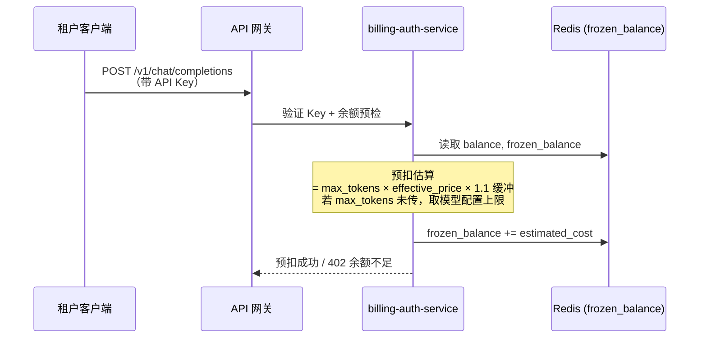
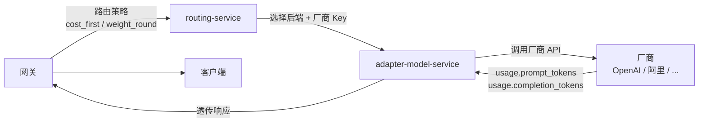
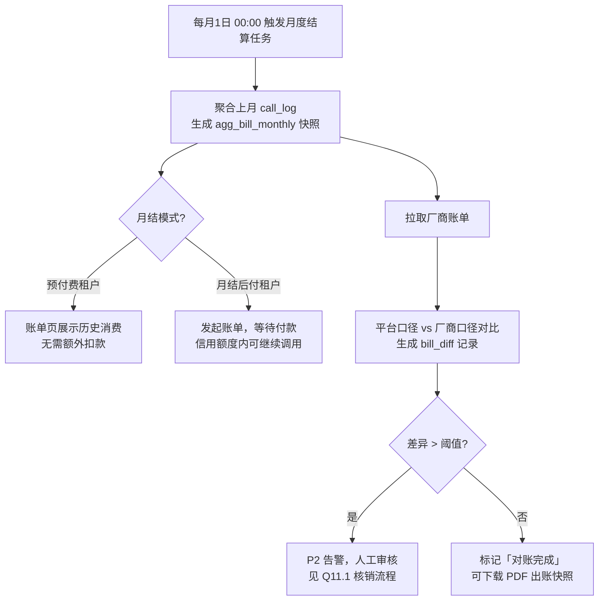
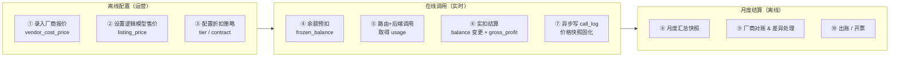
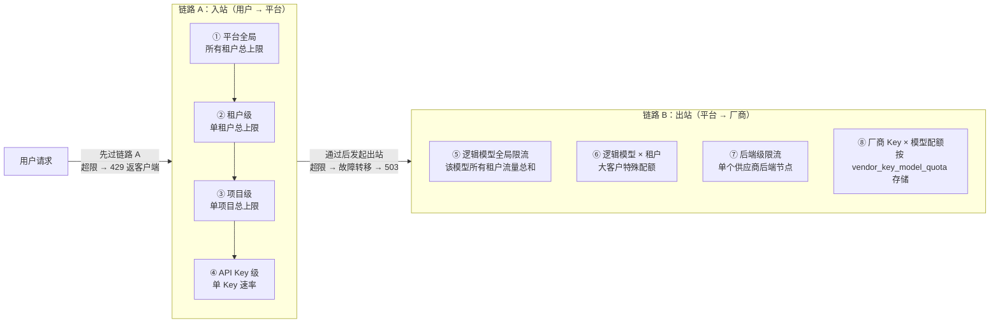
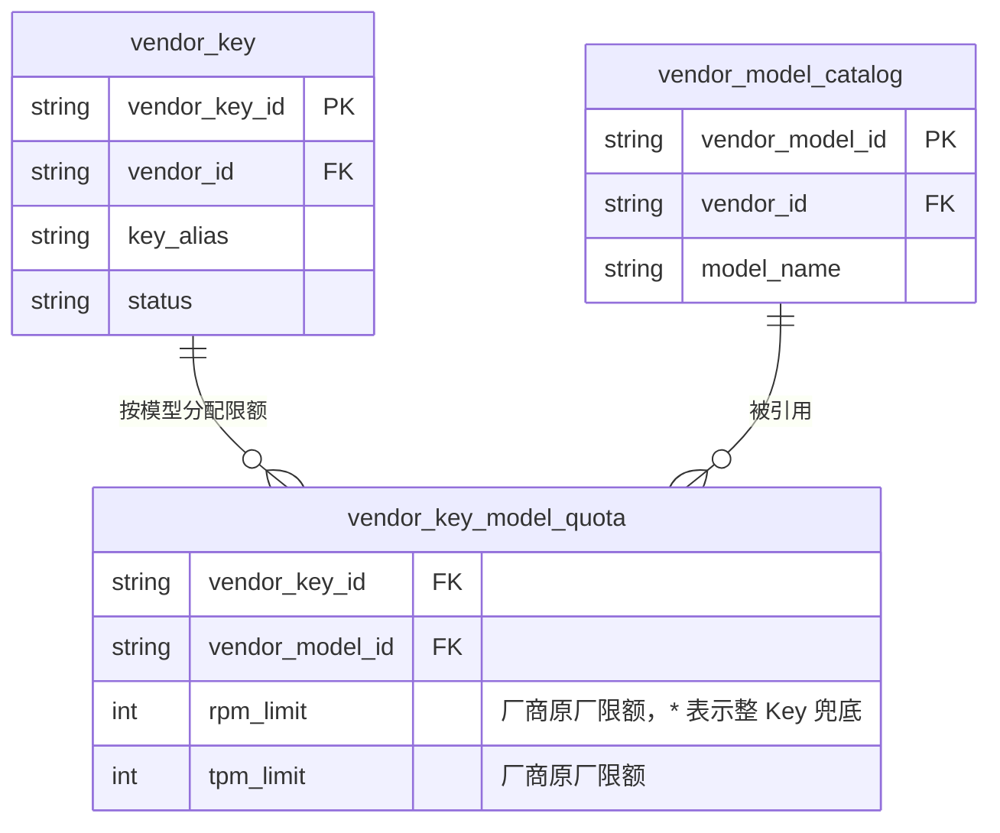
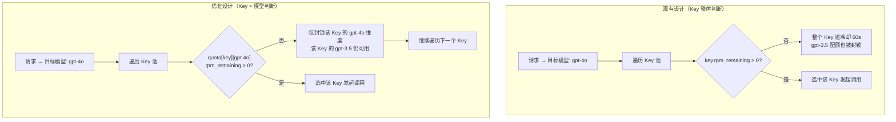
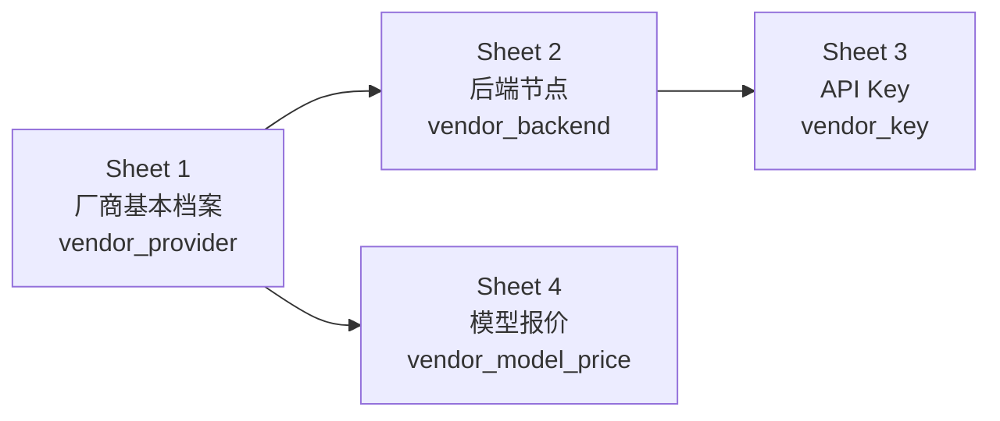
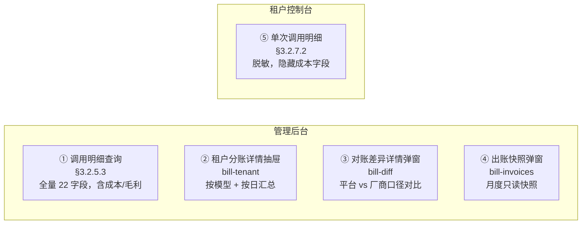
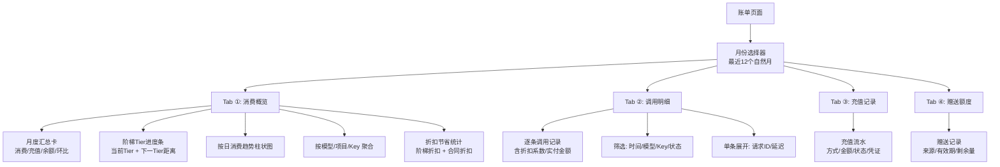

# MaaS 平台 · 需求澄清 Q&A 文档

> **文档说明**：本文档面向产品/研发/测试团队，通过 Q&A 形式澄清 PRD 中易产生歧义的需求边界、异常场景处理逻辑及隐含决策依据。每个问题均含决策理由，便于后续迭代时追溯意图。
>
> **版本**：V1.0 | **创建日期**：2026-05-18 | **关联 PRD**：`maas平台PRD文档.md V1.1`

---

## 目录

1. [计费与扣费](#1-计费与扣费)（含 Q1.0 整体计费链路全景）
2. [路由与故障转移](#2-路由与故障转移)（含 Q2.6 路由策略配置入口与优先级全景）
3. [合同折扣与阶梯定价](#3-合同折扣与阶梯定价)
4. [赠送额度（Promo Credit）](#4-赠送额度promo-credit)
5. [限流与并发控制](#5-限流与并发控制)
6. [厂商 Key 池管理](#6-厂商-key-池管理)
7. [语义缓存](#7-语义缓存)
8. [模型广场与模型生命周期](#8-模型广场与模型生命周期)
9. [权限与 RBAC](#9-权限与-rbac)（含 Q9.4~Q9.9：项目概念、成员添加、数据隔离、两层角色关系、租户开户流程、用户组范围与权限分配）
10. [告警与监控](#10-告警与监控)
11. [账户与充值](#11-账户与充值)
12. [数据一致性与幂等性](#12-数据一致性与幂等性)
13. [补充边界场景](#13-补充边界场景)

---

## 1. 计费与扣费

**Q1.0：平台整体计费模式是什么？从获取供应商报价到向租户出账，完整链路是什么？**

**A：** 平台采用「成本侧与售价侧分离、预扣-实扣两阶段结算、价格快照不可变」的计费架构，全链路共分 **6 个环节**：

---

### 环节一：运营配置层（离线）

| 配置对象 | 字段 | 说明 |
|---------|------|------|
| 厂商后端（Backend） | `vendor_input_price` / `vendor_output_price` | 厂商对平台收取的成本价，单位 ¥/Token，由运营从厂商控制台获取后手动录入或通过价格同步 API 拉取 |
| 逻辑模型（Logical Model） | `listing_input_price` / `listing_output_price` | 平台对租户的标准售价，在厂商成本价基础上加价，体现平台毛利空间 |
| 阶梯折扣（Tier Discount） | `tier_discount` | 按租户累计消费额分级，达到阈值后全量调用享受折扣（见 §3.2.6） |
| 合同折扣（Contract Discount） | `contract_discount` | 针对大客户签订合同，在阶梯折扣基础上额外给予的专项折扣 |

> **有效售价（effective_price）** = `listing_price × min(tier_discount, contract_discount)`
> 当两种折扣同时存在时，取更优（更低）折扣系数，不叠加。

---

### 环节二：请求发起 → 余额预扣（同步，在响应前完成）



- **净余额** = `balance - frozen_balance`，预扣时检查净余额是否 ≥ 预扣金额，防止多并发超扣
- 预扣失败返回 `HTTP 402`，不转发请求，`call_log` 不记录（见 Q1.2 限流类比）

---

### 环节三：路由 & 后端调用（同步）



- `usage` 字段（厂商计量 Token 数）是计费的**唯一权威来源**；厂商未返回时降级为平台本地 tiktoken 估算，标注 `token_source = estimated`（见 Q13.1）
- 后端全部失败 → 返回 503，`vendor_cost = 0`，预扣全额退还（见 Q1.3）

---

### 环节四：实扣结算（同步，响应返回后立即执行）

```
vendor_cost      = vendor_input_price  × prompt_tokens
                 + vendor_output_price × completion_tokens

tenant_revenue   = effective_input_price  × prompt_tokens
                 + effective_output_price × completion_tokens
                 （缓存命中 / 请求失败时 = 0）

gross_profit     = tenant_revenue - vendor_cost

actual_deduction = tenant_revenue   // 从租户 balance 实扣
delta            = estimated_cost - actual_deduction  // 预扣多退少补

balance         -= actual_deduction
frozen_balance  -= estimated_cost   // 释放预扣
```

> **价格快照**：`snapshot_vendor_input_price`、`snapshot_listing_input_price` 等字段在 `call_log` 写入时以**请求发起时刻的价格**固化，事后调价不影响历史账单（Business Rule #9）。

---

### 环节五：异步写入明细（解耦，不阻塞响应）

```
API 响应返回  →  Kafka topic: call_log_events
              →  billing-auth-service Consumer
              →  ClickHouse call_log 表（写入含 22 字段的完整记录）
              →  月度 agg_bill_monthly 增量更新
```

- Kafka 消费延迟 > 5 分钟 → P1 告警
- 明细写入失败不影响用户调用，但影响账单准确性，需运维及时修复（见 Q12.2）

---

### 环节六：月度结算 & 对账（离线批处理）



---

### 完整链路一览



> **决策依据**：  
> - 预扣-实扣双阶段保证高并发下余额不超卖；  
> - 价格快照不可变保证历史账单稳定性；  
> - vendor_cost / tenant_revenue 分离使平台可随时查看每次调用的毛利润，支撑定价决策；  
> - 与厂商账单解耦（通过 bill_diff 对账）允许平台和厂商各自使用自己的计量口径，月度人工或自动核销差异。

---

**Q1.1：流式请求（SSE）在中途断流（连接中断、客户端主动关闭等），如何计费？**

已生成的 Token 按实际已输出量计费，未输出的部分不计费。`completion_tokens` 字段记录实际已输出的 Token 数，`actual_cost = actual_tokens × effective_price`。若客户端主动关闭连接，网关侧需在 TCP FIN 后 100ms 内截断统计，避免继续消耗后端 Token 被计入成本。

> **决策依据**：已产生的推理算力成本由平台承担，向用户按实收。既符合用户预期（"没收到的不付钱"），也避免平台双亏。

---

**Q1.2：请求被限流（返回 429），是否计费？**

不计费。请求在网关层被拒绝，未到达后端模型，无 Token 消耗，`balance` 不变。调用明细中不记录 429 的被拦截请求（减少噪音）。

> **决策依据**：限流是平台保护机制，不应惩罚用户。

---

**Q1.3：请求余额预扣成功，但后端 5xx / 超时导致全部重试均失败，最终返回 503。用户需要为本次调用付费吗？**

不付费。全部后端失败后，`frozen_balance` 在结算时完全退还（差额退回 `balance`），`actual_cost = 0`。调用明细记录该请求，状态标注为 `failed`，金额显示 ¥0。

> **决策依据**：用户没有得到服务结果，不应付费；平台侧向厂商发起的实际调用成本由平台自担（通常极低，属于运营成本）。

---

**Q1.4：预扣金额估算公式中，`max_tokens` 未传时怎么处理？估算是否会过高导致用户误判余额不足？**

若请求未传 `max_tokens`，预扣公式使用该逻辑模型配置的 `model_max_output_tokens` 作为上限，并附加 10% 浮动缓冲（防止分词器计数偏差）。这确实可能导致预扣金额高于实际消费，但差额在请求结束后立即退还。

为降低误判，平台在余额检查时使用「净余额 = `balance - frozen_balance`」评估是否可支付预扣，而非直接判断 `balance`，避免多个并发请求互相干扰。

> **边界案例**：用户有 ¥10 余额，发起 5 个并发请求，每个预扣 ¥3 → 第 4 个请求时净余额 = 10 - 9 = 1 < 3，被 402 拒绝，符合预期。

---

**Q1.5：调用明细中的 `snapshot_listing_input_price` 是快照时间点的价格还是当前价格？**

是**请求发起时刻**的售价快照，一旦写入不再变更。即使运营事后调整了该逻辑模型的定价，已有历史账单不受影响。这由 Business Rule #9 保证。

---

**Q1.6：`vendor_cost` 为负数是否可能？**

正常不可能。`vendor_cost` = `vendor_input_price × input_tokens + vendor_output_price × output_tokens`，价格和 Token 数均为非负值。若出现负数，视为数据异常，触发 P0 告警并进入人工审核流程（`billing_anomaly` 告警类型）。

---

## 2. 路由与故障转移

**Q2.1：会话黏性（Session Affinity）期间，被黏性的后端被管理员手动禁用，当前进行中的请求和后续请求如何处理？**

- **当前请求**：若请求尚未发出，则立即清除该 `session_id` 的黏性映射，本次请求按故障转移逻辑（权重轮询排除已失败后端）路由到其他后端。
- **后续请求**：黏性映射已清除，下一次请求将按当前主策略重新选择后端并重建新的黏性映射。
- **连续对话一致性**：平台不保证多轮会话在后端切换后的上下文一致性（上下文由调用方在 `messages` 字段中显式传入，与后端无关），因此后端切换不会破坏对话逻辑。

> **决策依据**：禁用后端是运维操作，优先保证请求可用性；由调用方负责上下文管理是 Stateless API 设计的基本原则。

---

**Q2.2：成本优先策略（Cost First）中，若多个后端成本相同，如何打破平局？**

按 `backend_id` 字典序稳定排序，取最小值。这确保了相同成本情况下的路由行为是确定性的，便于复现和测试。

---

**Q2.3：策略优先级中，API Key 级策略优先于 Project 级。若 API Key 只配置了「会话黏性」策略，而 Project 配置了「限流」规则，两者是否冲突？**

不冲突。路由策略（`route_policy` 表）和限流规则（`rate_limit_rule` 表）是两套独立机制：
- **路由策略**：决定请求发往哪个后端；
- **限流规则**：决定请求是否允许通过。
两者在网关处理管线中串联，先执行限流检查，通过后再执行路由选择，互不干扰。

---

**Q2.4：重试时，指数退避的计时从何时开始？是上游响应超时后，还是立即开始退避？**

从上游判定为失败（收到错误响应或连接超时）后立即开始退避计时。第 1 次重试等待 200ms，第 2 次 400ms，上限 2000ms。退避期间请求处于等待状态，不向客户端返回任何内容（流式请求除外——流式首 Token 后不重试，直接断流）。

---

**Q2.5：当所有后端均处于 `disabled` 状态（非临时故障，是被主动禁用）时，路由层如何响应？**

立即返回 `503 Service Unavailable`，不走重试（无后端可选），响应体附带 `request_id`。同时触发 P0 告警「逻辑模型无可用后端」，通知运营介入。

---

**Q2.6：路由策略一共可以在几处配置？各处优先级如何？**

共 **4 个配置入口**，优先级从高到低依次为：

| 优先级 | 范围 | 配置入口 | 操作方 |
|--------|------|----------|--------|
| 1（最高） | **API Key 级** | 租户控制台 → API Key 设置 → 路由策略覆盖 | 租户 |
| 2 | **项目级** | 租户控制台 → 项目设置 + 路由策略页 | 租户 |
| 3 | **逻辑模型级** | 管理后台 → 模型管理 → 模型配置抽屉 → 路由权重 Tab | 平台管理员 |
| 4（兜底） | **全局默认** | 管理后台 → 系统设置 → 全局限流 Tab | 平台管理员 |

**生效规则**：引擎从优先级 1 向下找第一个「已显式配置」的级别并使用；若均未配置则回退到全局默认（不可为空）。

---

### 入口 ① — API Key 级（最高优先级）

**位置**：租户控制台 → API Keys → 新建/编辑 API Key 弹窗 → 「路由策略覆盖（可选）」区域

**操作方**：租户（Admin 及项目 Owner 均可；Viewer 无此权限）

**配置方式**：

```
路由策略覆盖（可选）
☐ 覆盖此 Key 的路由策略（默认继承项目/模型级策略）
  策略类型  权重轮询 ▾（含：权重轮询 / 成本优先 / 性能优先 / 会话黏性）
  最大重试  [ 2 ]
```

- 默认**不勾选**，即继承项目级或更低优先级策略；
- 勾选后展开策略类型 + 最大重试次数配置；选权重轮询时显示后端权重子表（选择后端 + 设置相对权重）；
- Key 创建成功后仍可通过「编辑 API Key」抽屉（🔧图标）修改。

**作用范围**：仅对该 Key 发出的请求生效，覆盖此 Key 以下所有级别的策略。

**未配置时**：透传到项目级策略；若项目级也未配置，继续向下透传。

---

### 入口 ② — 项目级（两个子入口，效果等价）

#### 子入口 ②-A：项目设置页（快速选择）

**位置**：租户控制台 → 项目设置（project-settings） → 基础信息区块 → 「默认路由策略」下拉

```
默认路由策略 *   default-routing ▾
```

- 仅能从已在「路由策略配置」页创建好的策略中**选择**；
- 适合快速绑定，不能在此处新建或调整策略参数。

#### 子入口 ②-B：路由策略配置页（完整管理）

**位置**：租户控制台 → 路由策略（sidebar） → 「+ 新建策略」/ 编辑已有策略

```
配置路由策略（抽屉）
  生效范围 *   ● 全局  ○ 逻辑模型  ○ 项目  ○ API Key
  目标（非全局时显示）  prod-gpt4o ▾
  策略类型 *   ○ 权重轮询 ● 成本优先 ○ 性能优先 ○ 会话黏性
  会话 TTL（会话黏性时展示）  [ 30 ] 分钟
  后端权重表（权重轮询时展示）  [后端 → 权重]
  最大重试次数 *   [ 2 ]（故障转移参数，所有策略均生效）
```

- **支持 4 种生效范围**：全局 / 逻辑模型 / 项目 / API Key，从一个统一入口管理所有已创建的租户侧策略；
- 同一「范围 + 目标」组合只能有一条生效策略，新建时若已存在弹出覆盖提示；
- 同时提供 Policy as Code 编辑器（策略中心 → 路由策略 Tab），支持 YAML 编写、版本追踪、灰度发布与审批工作流（面向高级用户）。

**作用范围**：该项目下所有未单独设置 Key 级策略的 API Key 均使用此策略。

**未配置时**：透传到逻辑模型级策略。

---

### 入口 ③ — 逻辑模型级（管理员配置）

**位置**：管理后台 → 模型管理 → 点击某逻辑模型行 → 模型配置抽屉 → **[路由权重 Tab]**

```
模型配置：prod-gpt4o
  Tab：[基础信息] [供应商后端] [计费策略] [限流与配额] [路由权重] [发布记录]

【路由权重 Tab】
  全局默认权重 *   35（模型间流量分配的参考值，引擎归一化）
  项目覆盖权重（可选）
    项目A（客服机器人-生产）: 权重 50   [编辑] [删除]
    项目B（代码助手-测试）:   权重 20   [编辑] [删除]
    [+ 添加项目覆盖]
```

- **该 Tab 配置的是该逻辑模型对特定项目的「入口权重」**，影响当多个逻辑模型并列时路由引擎为该项目分配流量的比例，属于模型间维度；
- 后端间权重（OpenAI vs Azure vs 第三方供应商）在同一抽屉的 **[供应商后端 Tab]** 中单独配置；
- 项目覆盖权重：内联展开表单，支持为特定项目单独设置权重（相对值 1~1000，删除后恢复全局默认）；
- 模型配置变更需「保存并发布」才生效，并生成发布记录版本。

**作用范围**：针对该逻辑模型，未被租户侧（入口①②）覆盖时生效。

**未配置/删除时**：回退到全局默认权重。

---

### 入口 ④ — 全局默认（最低优先级兜底）

**位置**：管理后台 → 系统配置（system settings） → **[全局限流 Tab]**（及路由默认策略相关字段）

- 平台级参数，覆盖整个平台的兜底路由行为；
- 包含：默认路由策略类型（权重轮询）、最大重试次数（默认 2）、指数退避参数等；
- 系统配置发布后自动生成版本号，支持一键回滚至任意历史版本；
- IP 白名单变更时，系统自动校验当前请求 IP 是否在新白名单内，防止管理员意外锁定自己。

**作用范围**：任何未被上层（①②③）覆盖的请求均使用此配置，不可为空。

---

### 补充：Failover 的特殊地位

故障转移（Failover）**不属于可选策略**，任何生效策略均自动附带：

- 主策略选中后端失败 → 排除失败后端后，按**权重轮询**顺序选下一个可用后端重试；
- 最大重试次数在各入口均可配置（范围 0~5）；
- 流式请求在首 Token 已输出后**不重试**（防重复输出），直接断流并返回错误事件。

> **决策依据**：四级范围设计参考 Nginx/K8s 的 ConfigMap 继承模式，平台统一兜底保证请求不会因配置缺失失败，同时给租户充分的细粒度覆盖能力；Failover 不可关闭是 SLA 保障的底线设计。

---

## 3. 合同折扣与阶梯定价

**Q3.1：租户同时持有合同折扣（如 8 折）和当月已达阶梯 Tier 2（8 折），两者如何叠加？**

取两者中更低的折扣率（即对用户更优惠的那个）：`effective_discount = min(contract_discount, tier_discount)`。两者不相乘叠加（否则会出现 6.4 折的超低价），也不取高（否则折扣形同虚设）。

> **示例**：合同 8 折 × Tier 2 也是 8 折 → 有效价 = listing_price × 0.80。若合同 7 折 × Tier 1 是 9 折 → 取 7 折。

> **决策依据**：合同折扣是针对大客户的战略让利，不应被阶梯打折进一步稀释；取最优对用户友好，有利于合同签约意愿。

---

**Q3.2：合同到期当天（`end_date` 当天 23:59），当天产生的账单用哪个折扣率？**

当天 23:59:59.999 之前产生的调用均按合同折扣率计算；合同到期后次日 00:00:00 起恢复标准售价。快照在请求发起时写入（`snapshot_listing_input_price`），包含当时有效的折扣信息，因此结算无歧义。

---

**Q3.3：合同折扣只针对特定模型（`contract_discount_item.model_id`）配置了折扣。租户调用了未在合同中的模型，用哪个价格？**

使用该逻辑模型的标准售价（`model_listing_price`，即 1.0 倍）。合同折扣仅作用于明确配置了 `model_id` 的条目，未覆盖的模型不享受任何合同优惠。

---

**Q3.4：阶梯 Token 计数在月底重置，重置时间是 UTC 还是本地时区？**

使用北京时间（UTC+8）的自然月首日 00:00:00 作为重置时间点。跨月零点前后的请求以请求发起时间（`created_at`）判断归属月份。

---

**Q3.5：月结后付（Postpaid）租户不存在余额，那么阶梯计费如何累计？**

月结后付租户仍按 Token 累计量应用阶梯折扣，差异仅在于：不需要预扣 `frozen_balance`，账单月末结算时直接按当月累计 Token 量确定最终折扣并出账。月结账单在次月 1 日生成，支付期限 30 天，超期则触发信用额度冻结。

---

## 4. 赠送额度（Promo Credit）

**Q4.1：赠送额度和正式余额，哪个先扣？**

赠送额度（`promo_balance`）先扣，不足时再扣 `balance`。单次请求若横跨两个来源（如赠送额度只剩 ¥0.5，本次费用 ¥1.2），则先扣完 ¥0.5 的 `promo_balance`，不足的 ¥0.7 从 `balance` 中扣除，一次请求不拆分为两条账单记录（内部拆分核算，对外展示为一条）。

---

**Q4.2：赠送额度使用合同折扣价还是标准价计算消耗？**

使用有效价（`effective_price`，即含合同折扣和阶梯折扣的最终价格）计算 `promo_balance` 消耗，而非标准售价（`listing_price`）。

> **示例**：listing_price = ¥1.0/K tokens，合同 8 折后 effective_price = ¥0.80/K tokens。调用 1K tokens 消耗 `promo_balance` ¥0.80，而非 ¥1.00。

> **决策依据**：赠送额度是面值额度，消耗基于实际付出成本，防止通过折扣+赠金套利（如极低折扣快速消耗赠金）。

---

**Q4.3：月结后付租户能否拥有赠送额度？**

不能。月结后付租户的 `promo_balance` 强制为 0，充值/赠送操作会被系统拒绝（返回业务错误）。

> **决策依据**：月结租户无需预付，赠送额度机制的激励意义为零；同时避免赠金与信用额度混合产生核算复杂性。

---

**Q4.4：赠送额度可以提现或退款吗？**

不可以。`promo_balance` 只能用于平台内的 API 调用消费，不可提现、不可转让、不可退款。到期后自动清零（`expires_at` 时间由发放规则决定）。

---

## 5. 限流与并发控制

**Q5.1：限流（429）和余额不足（402）同时触发时，优先返回哪个错误码？**

两者独立，先触发先返回——网关管线中限流检查（§3.2.3.6）位于余额检查（§3.2.7.1）之前，因此：
- 若限流先触发 → 返回 `429 Too Many Requests`；
- 若通过了限流检查但余额不足 → 返回 `402 Payment Required`。

两者不会同时出现在同一响应中。

---

**Q5.2：四级限流（平台 / 租户 / 项目 / API Key）中，若租户级已触发限流，项目级和 Key 级的请求是否全部被拦截？**

是的。四级限流是层层嵌套关系，高层（平台/租户）触发限流后，该层下的所有低层请求均被拦截，不会再进行低层检查。响应中的 `X-RateLimit-Scope` 头标明触发限流的层级，便于调用方诊断。

---

**Q5.3：限流窗口用固定窗口还是滑动窗口？若是滑动窗口，窗口大小如何配置？**

使用滑动窗口（Sliding Window），基于 Redis Sorted Set 实现。默认窗口 60 秒（RPM），可通过管理后台按规则级别单独配置（支持 1s / 10s / 60s / 3600s）。滑动窗口在突发流量精度上优于固定窗口，防止窗口边界的"双倍突发"问题。

---

**Q5.4：RPM / TPM 具体是什么意思？系统中有多处可以配置 RPM / TPM，一共有几处？它们分别管什么、优先级关系是怎样的？**

**名词解释**

- **RPM**（Requests Per Minute）：每分钟允许通过的请求次数，控制调用频率；
- **TPM**（Tokens Per Minute）：每分钟允许处理的 Token 总数（输入 + 输出合计），控制数据吞吐量。

两者通常同时配置——RPM 防止高频短请求打爆网关，TPM 防止少量超长请求耗尽后端算力。

**全局概览**

平台共有 **8 处**可配置 RPM / TPM，分属两条方向相反、互相独立的控制链：



**链路 A：入站流量管控（4 层嵌套，从外到内依次检查）**

| 层 | 配置入口 | 控制范围 | 约束关系 |
|----|---------|---------|---------|
| ① 平台全局 | 管理后台 → 系统设置 → 限流配置 | 所有租户加总流量的绝对天花板 | 最顶层，所有层均不可超过此值 |
| ② 租户级 | 管理后台 → 租户管理 → 配额与限流 Tab | 单租户跨所有项目的流量总和 | ≤ ①；不同套餐租户可设差异化配额 |
| ③ 项目级 | 租户控制台 → 项目设置 | 单项目跨所有 Key 的流量总和 | ≤ ②；租户自行在内部分配预算 |
| ④ API Key 级 | 租户控制台 → API Key 管理 | 单个 Key 的调用速率 | ≤ ③；用于隔离不同应用或团队 |

任一层触发限流即立即返回 `429 Too Many Requests`，不再向下检查；响应头 `X-RateLimit-Scope` 标明触发层级（见 Q5.2）。

**链路 B：出站流量管控（4 处，防止打爆厂商侧）**

| 位置 | 配置入口 | 控制范围 | 说明 |
|------|---------|---------|------|
| ⑤ 逻辑模型全局限流 | 管理后台 → 模型广场 → 模型配置 → 限流与配额 Tab | 所有租户调用该逻辑模型的流量总和 | 防止单个热门模型占满后端 |
| ⑥ 逻辑模型 × 租户特殊限流 | 同上，添加租户特殊条目 | 特定租户调用该模型的专属上限 | 可高于⑤，但不超过 ⑤ × 2；用于大客户定制 |
| ⑦ 后端级限流 | 管理后台 → 模型广场 → 后端配置 → 高级选项 | 单个供应商后端节点的流量上限 | 防止单个后端节点被打爆；留空则继承厂商默认值 |
| ⑧ 厂商 Key × 模型配额 | 管理后台 → 厂商管理 → Key 池 → 单 Key 编辑 | 每个 (vendor_key, vendor_model) 组合的独立限额 | 按 `vendor_key_model_quota` 表存储，精确对应厂商真实限额单元；支持 `model_id = "*"` 通配退化为整 Key 限流（详见 Q6.4） |

链路 B 超限后不直接返回 429，而是触发故障转移：尝试切换其他 Key 或其他后端；全部不可用时才向客户端返回 `503`。

**两条链路的交叉关系**

链路 A 和链路 B 互相独立，一个请求同时受两条链约束，取先触达的那个作为实际瓶颈：

- 租户 RPM 剩余 50，逻辑模型 RPM 剩余 20 → 实际可用为 20（模型级先达限）
- 链路 A 的②租户级与链路 B 的⑤逻辑模型级不存在父子关系，二者并联生效

---

**Q5.5：逻辑模型已经配置了多个后端（⑦），为什么还需要逻辑模型级的全局限流（⑤）？两者不是重复吗？**

不重复。⑦ 和 ⑤ 解决的是两个维度的问题：

- **⑦ 后端级限流** = 技术约束，回答"这个后端节点物理上撑得住多少"，由具体供应商节点的承载能力决定；
- **⑤ 逻辑模型全局限流** = 业务约束，回答"这个模型我们打算对外卖多少"，是平台主动设定的产品级天花板，与技术容量无关。

| 场景 | ⑦ 后端配置 | ⑤ 模型全局限流 | 实际意图 |
|------|-----------|--------------|---------|
| 3 个后端各 1000 RPM | 各自 1000 | 设 2000 | 技术上能跑 3000，但产品上只卖 2000，保留 1000 作为容灾缓冲 |
| 3 个后端各 1000 RPM | 各自 1000 | 不设 | 流量峰值时三个后端可能同时被打爆，无全局刹车 |
| gpt-4o 成本高 | 3 个后端各 500 | 设 300 | 主动限制该模型出量，防止成本失控 |

另一个关键场景：路由算法在某些后端故障时会把流量集中到剩余健康后端，没有 ⑤ 的情况下，健康后端可能被压垮。⑤ 相当于给整个逻辑模型加一道全局熔断——无论内部如何分配，总量不超。

**结论**：⑦ 管"技术上能不能"，⑤ 管"业务上想不想"。如果平台对某逻辑模型没有主动限流诉求，⑤ 可留空（不限制），退化为纯由各后端的 ⑦ 自然限定总量。

---

## 6. 厂商 Key 池管理

**Q6.1：厂商 Key 池中所有 Key 均耗尽（触发各自速率上限），此时请求应如何处理？**

返回 `503 Service Unavailable`，响应体中 `error.code = "upstream_key_exhausted"`。同时立即触发 P0 级别告警「厂商 Key 池耗尽」，通知运营补充 Key。网关不会无限等待 Key 恢复，而是直接拒绝请求，避免队列积压。

---

**Q6.2：Key 轮换策略是「循环轮询」还是「最小负载」？若某个 Key 刚刚触发限流，多久之后会被重新纳入轮换？**

默认使用权重轮询（与后端路由策略解耦，Key 选择独立于后端选择）。若某个 Key 收到厂商侧 429 响应，该 Key 进入冷却期（默认 60 秒，可配置），冷却期内不再被选中；冷却期结束后自动恢复参与轮换。冷却期内若所有 Key 均在冷却，则触发 Q6.1 的耗尽逻辑。

---

**Q6.3：Key 池与逻辑模型的绑定关系是什么？一个 Key 可以绑定多个逻辑模型吗？**

`vendor_key` 属于某个 `vendor`（厂商），而非某个具体逻辑模型。同一厂商下所有逻辑模型共享该厂商的 Key 池。即：一个 Key 可服务于同一厂商的多个逻辑模型，平台按 Key 的调用频次而非逻辑模型维度做轮换。

---

**Q6.4：厂商 Key 的 RPM / TPM 限额是按整个 Key 算，还是按 Key × 模型分别算？当前设计是否存在缺陷，应如何优化？**

**问题根源**

主流厂商（OpenAI、Anthropic 等）的真实限额执行单元是 **(Key, 模型)**，而非 Key 整体。同一个 Key 下，不同模型有各自独立的 RPM / TPM 额度，互不干扰：

| Key | 模型 | RPM 限额 | TPM 限额 |
|-----|------|---------|----------|
| key-A | gpt-4o | 500 | 30,000 |
| key-A | gpt-3.5-turbo | 3,500 | 90,000 |
| key-B | gpt-4o | 500 | 30,000 |

**当前设计的两处缺陷**

`vendor_key` 数据模型只存了一个 Key 整体的 `rpm_limit` / `tpm_limit`，Redis 计数器也只按 `vendor_key_id` 单维度统计，导致：

1. **额度填写无法自洽**：key-A 对 gpt-4o 的上限是 500 RPM，对 gpt-3.5-turbo 是 3,500 RPM，`vendor_key.rpm_limit` 填哪个都是错的——填最小值浪费 gpt-3.5 配额，填最大值会导致 gpt-4o 被打爆。

2. **冷却粒度过粗**：key-A 的 gpt-4o 额度耗尽收到厂商 429 后，现有设计将整个 key-A 置为冷却，而实际上 key-A 的 gpt-3.5-turbo 仍有大量剩余，造成可用资源的无谓封锁。

**推荐优化方案**

新增 `vendor_key_model_quota` 表，以 **(vendor_key_id, vendor_model_id)** 为复合主键单独存储每个模型的限额；Redis 计数器同步改为 `vendor_ratelimit:{key_id}:{vendor_model_id}:rpm` 双维度键。

**数据模型对比：**



**Key 选择流程对比：**



**向后兼容**：若某厂商不区分模型限流（整个账号统一额度），`vendor_key_model_quota` 中使用 `vendor_model_id = "*"` 通配符表示整 Key 的总量上限，退化为原有行为，运营侧只需填一条记录。

**运营规范建议**：接入新厂商 Key 时，运营人员应在厂商控制台逐模型查阅实际配额后录入；若厂商文档未公布分模型限额，则填写通配记录并在备注中注明"按账号整体估算"。

> **决策依据**：此优化将平台对厂商配额的建模精度从"Key 级"提升到"Key × 模型级"，与厂商真实执行单元对齐，避免因粒度错误导致可用资源被误封或超量消耗。

---

**Q6.5：通过 Excel 批量导入厂商信息时，应准备哪些表格？每张表需要哪些字段？**

**A：** 厂商信息分为四个层次，对应 **4 张 Sheet**，需按顺序导入（后序 Sheet 依赖前序数据已存在）。完整模板见 `开发/厂商信息导入模板.md`。

**导入顺序与依赖关系：**



**各表核心字段一览：**

| Sheet | 关键字段 | 说明 |
|-------|---------|------|
| ① 厂商基本档案 | `厂商代码`、`API协议类型`、`默认BaseURL`、`结算货币`、`汇率` | 全局唯一标识，决定 API 调用协议适配器 |
| ② 后端节点 | `厂商代码(FK)`、`后端名称`、`BaseURL`、`超时时间`、`路由权重` | 一个厂商可配多个节点（主/备区、不同版本） |
| ③ API Key | `后端名称(FK)`、`Key别名`、`API Key值`、`RPM上限`、`TPM上限` | **⚠️ 敏感信息**，建议通过 UI 单独录入，避免 Key 明文落文件 |
| ④ 模型报价 | `厂商代码(FK)`、`厂商原始模型名`、`输入价(¥/1K token)`、`输出价`、`生效日期` | 生效日期用于历史账单价格快照追溯，精度 `decimal(10,6)` |

**重要注意事项：**

1. **Sheet 3（API Key）安全要求**：导入文件须加密保存（密码保护的 xlsx），导入完成后立即从文件删除 Key 列并存档空模板。建议生产环境 Key 通过管理后台 UI 手动录入，Excel 仅用于测试/灰度环境批量导入。
2. **价格精度**：Sheet 4 报价字段保留 6 位小数（如 `0.000015`），单位统一为 **CNY（已按汇率换算）**，不填原币价格。
3. **通配 Key 限额**：若厂商不区分模型限流，Sheet 3 的 `RPM/TPM上限` 填整 Key 总额，并在 Sheet 4 中用 `vendor_model_id = *` 通配（见 Q6.4）。
4. **幂等导入**：以 `厂商代码` + `后端名称` + `厂商原始模型名` 为联合唯一键，重复导入相同行视为更新（upsert），不重复创建。

---

## 7. 语义缓存

**Q7.1：语义缓存命中的请求是否计费？**

不计费。命中缓存的请求 `balance` 不变，`vendor_cost = 0`，`tenant_revenue = 0`。调用明细仍记录该请求，费用栏展示 ¥0，备注「语义缓存命中」；月度账单新增「缓存节省」汇总行，展示当月因缓存命中估算节省的金额（用于向用户展示平台价值）。

---

**Q7.2：相似度阈值（`similarity_threshold`，默认 0.92）是否可以被租户自行调整？**

当前版本（V1.1）不支持租户级别配置，阈值为全局设定，由运营管理员调整。未来 P2 迭代中考虑开放租户/项目级别的阈值配置。

> **边界说明**：阈值越高，缓存越精确但命中率越低；阈值越低，命中率越高但可能返回不准确的缓存结果。0.92 是经验值，适合中文通用场景。

---

**Q7.3：缓存的 TTL 到期后，下一次相似请求是否触发回源并更新缓存？**

是的。TTL 到期后缓存条目失效，下一次相似请求会穿透到后端模型，获取新响应后重新写入缓存，TTL 重置为初始値（默认 **24 小时**）。TTL 采用绝对过期（Absolute TTL）而非滑动过期，防止热点问题导致缓存永不失效。

---

**Q7.4：语义缓存是否区分不同租户？租户 A 的查询结果会被租户 B 命中吗？**

不跨租户共享。缓存 Key 包含 `tenant_id`（或更细粒度的 `project_id`）作为命名空间前缀，确保租户数据隔离。不同租户的语义相似请求不会互相命中，既满足数据安全要求，也避免不同租户上下文差异导致的缓存误命中。

---

## 8. 模型广场与模型生命周期

**Q8.1：已下线（Deprecated）的模型在广场是否展示？**

默认隐藏。用户可在过滤器中选择「可用状态 → 已下线」后查看。已下线模型卡片灰显，详情页展示下线日期和推荐替代模型；不可发起 Playground 试用，已有的调用 API 会收到错误响应（模型已不可用）。

---

**Q8.2：Beta 模型的 SLA 如何处理？若 Beta 模型故障，是否触发 SLA 赔偿？**

Beta 模型**不计入 SLA 统计**。调用前会展示免责提示「Beta 模型可能不稳定，不计入 SLA 保障」，用户确认后方可调用。Beta 模型的可用性数据单独统计，不合并到整体可用性指标中。无 SLA 赔偿。

---

**Q8.3：模型定价（`model_listing_price`）可以为 0 吗？0 定价代表免费模型还是配置错误？**

可以为 0，表示该模型对租户免费（如内测专属模型、平台补贴模型）。0 定价需运营管理员显式设置，系统不会自动校验其合理性。为防止配置错误，管理后台在保存 0 定价时会弹出二次确认提示。

---

**Q8.4：逻辑模型（Logical Model）和厂商模型（Vendor Model）是一对一还是一对多关系？**

一个逻辑模型可对应**多个后端（Backend）**，每个后端指向一个厂商模型（`vendor_model_catalog` 中的条目）。同一个厂商模型也可以被多个后端引用（例如同一 DeepSeek-V3 模型接入两家渠道商）。这是一对多的树形关系：逻辑模型 → 多个后端 → 各自指向一个厂商模型目录条目。

---

## 9. 权限与 RBAC

**Q9.1：用户同时属于两个用户组，一个组赋予了 `project:read`，另一个组赋予了 `project:write`，最终权限是什么？**

取并集（就高原则）：用户最终拥有 `project:read` 和 `project:write` 两个权限。RBAC 采用权限合并而非互斥，任一来源授权均生效。

> **决策依据**：权限取并集是业界通行做法（AWS IAM 同理），取交集会导致多组成员的权限意外缩减，不符合直觉。

---

**Q9.2：用户被从项目中移除，其已创建的 API Key 是否随之失效？**

分两种情况：

- **项目 Key**：归属于项目（`project_id`），不归属于创建者。用户移除后，其创建的项目 Key 依然有效，其他有权限的成员可继续管理。
- **个人 Key**：归属于用户本人。用户被停用后，其个人 Key 立即失效；从项目移除但账号未停用时，个人 Key 仍然有效（但已无法访问该项目资源）。

> **决策依据**：项目 Key 生命周期与用户身份解耦，避免因人员变动导致服务意外中断。若需撤销，Admin 或项目 Owner 需手动禁用相关 Key。

---

**Q9.3：租户账号被平台停用（`tenant.status = suspended`），其下的项目和 Key 是否仍然可用？**

租户被停用后，该租户下所有 API Key（包括项目 Key 和个人 Key）均立即失效（网关层实时校验 `tenant.status`），项目也不可调用。但租户数据（项目、Key、调用历史）保留，待租户恢复后可继续使用。

---

**Q9.4：租户端的「项目」到底是什么概念？权限范围是什么？为什么要有这个层级？**

### 一、项目是什么

项目（Project）是**租户内的业务工作空间**，对应企业的一条业务线或一套运行环境。

身份层级关系如下：

```
平台 (Platform)
 └── 租户 (Tenant) = 一家企业
       └── 项目 (Project) = 业务工作空间，如 "客服机器人-生产" / "代码助手-测试"
             └── API Key = 挂在项目下，调用行为归属该项目
```

**项目不是账号，也不是服务实例**——它是一个"治理容器"，将 API Key 发放、预算、限流、路由、权限这五类资源的管控边界统一绑在同一个业务单元上。

---

### 二、项目的权限范围（RBAC 两项目角色）

项目内有两个角色，角色与项目绑定，不跨项目继承：

| 能力 | Admin（租户管理员，供参照） | Owner（项目负责人） | Viewer（观察者） |
|------|:---:|:---:|:---:|
| 创建 / 编辑 / 吊销 API Key | ✅ | ✅ | ❌ |
| 使用 Playground | ✅ | ✅ | ✅（只读） |
| 查看用量与费用 | ✅ | ✅ | ✅ |
| 修改路由策略 | ✅ | ❌ | ❌ |
| 管理项目成员 / 用户组 | ✅ | ✅ | ❌ |
| 修改项目设置（预算、限流、通知）| ✅ | ✅ | ❌ |

> Admin 对所有项目拥有完整权限（含路由策略），不受项目级角色约束。项目 Owner 与 Admin 的唯一差异是**不能修改路由策略等平台策略配置**。

**权限优先级规则**：成员若同时拥有「个人直接授权」和「用户组」两条授权，**个人直接授权优先覆盖组授权**（无论角色高低）。若个人授权设为「无权限」，即使其所在组有权限，该成员在此项目中也无法访问。此规则支持 SCIM/飞书同步场景：无需修改组成员关系，即可对特定成员进行项目级降权或屏蔽。

**跨项目可见性**：成员在项目中的角色为 `-`（无绑定）时，该项目对其完全不可见，不出现在 sidebar 和 API 列表中。

---

### 三、项目级别独立管控的五类资源

| 资源 | 项目级管控能力 | 超限行为 |
|------|--------------|----------|
| **项目 Key** | 归属某个项目，创建时选择项目（`sk-proj-` 前缀） | 删除项目前需先迁移或删除 Key |
| **个人 Key** | 归属于用户本人，不绑定项目（`sk-pers-` 前缀） | 用户离职/停用时 Key 同步失效 |
| **月度预算** | 可为每个项目设置独立月度消费上限（¥） | 到 80% 告警；到 100% 该项目新请求返回 `429 budget_exceeded`，其他项目不受影响；支持 Owner 发起超额审批流 |
| **限流（RPM/TPM）** | 项目级 RPM/TPM 上限，在租户配额内自行划拨 | 超限返回 `429`；不超过租户级上限 |
| **路由策略** | 可为该项目设置独立路由策略，优先级高于逻辑模型级和全局默认 | 未配置则继承逻辑模型级或全局策略 |
| **调用归属** | 所有调用日志以 `project_id` 维度聚合，用于成本分摊和按项目账单导出 | — |

---

### 四、为什么需要「项目」这个层级

**痛点**：一家企业接入 MaaS 后，实际上有多个不同的使用场景：客服机器人（高频低延迟）、文档处理（离线批量）、代码助手（开发测试），以及 prod / staging 两套环境——共 6 个业务单元。如果没有隔离机制，这 6 个场景共用一个账号余额和一批 API Key，会产生：

1. **成本归因失真**：所有调用混在一起，无法知道哪条业务线花了多少钱。
2. **失控消费风险**：一个 batch job 刷爆了预算，导致其他业务的实时对话被 429 拦截。
3. **权限过度集中**：后端工程师需要创建 API Key，但不应该看到另一个项目的用量数据；Viewer 需要查用量但不能改 Key。
4. **环境泄漏风险**：生产环境的 Key 和测试环境的 Key 若放在一起，误用风险极高。

**项目层级的解法**：

| 问题 | 项目层级如何解决 |
|------|--------------|
| 成本归因 | 调用日志强制带 `project_id`，控制台支持按项目维度导出账单 CSV |
| 失控消费 | 每个项目独立月度预算，超限只拦截该项目，其他项目正常运行 |
| 权限细分 | Owner/Viewer 两角色绑定到项目，同一人在 A 项目是 Owner、在 B 项目可以是 Viewer |
| 环境隔离 | prod 和 staging 建两个项目，分别发 Key、设限流和预算，物理分离 |

**与「租户」的关系**：租户是计费和合同的主体（账单发给租户，余额在租户级），项目是内部治理的主体（成本分摊、权限边界、预算上限）。两者分工互补，不重复。

**与「API Key」的关系**：Key 是调用凭证（谁来调），项目是业务容器（这次调用算谁的）。平台支持两类 Key 并存：

| 类型 | 前缀 | 归属 | 适用场景 | 成本归因 |
|------|------|------|----------|----------|
| **项目 Key** | `sk-proj-` | 归属项目 | 生产部署、应用集成 | 按项目归因，享有项目级限流与预算 |
| **个人 Key** | `sk-pers-` | 归属用户 | Playground、本地调试 | 计入租户账单，无项目归因 |

一个项目可以有多个项目 Key；一个用户可以有多个个人 Key。个人 Key 不受项目级预算/限流约束，但受租户级总配额约束。

> **决策依据**：这套设计参考 Google Cloud Project / AWS Account 的多层级治理模型，结合 MaaS 企业客户「多业务线 + 多环境 + 多团队」的典型使用场景设计，目的是让一套账号同时满足"统一计费"和"细粒度控制"两个看似矛盾的需求。

---

**Q9.5：租户里的不同角色用户是怎么添加的？全靠手动吗？**

分两个阶段：**加入租户** 和 **分配项目角色**，前者以手动邀请为主，后者可通过用户组批量承接。

### 阶段一：成员加入租户（邮件邀请流）

所有成员的加入入口是**租户管理员手动发邀请**，没有"自行注册后加入某个租户"的入口（平台不允许用户主动选择租户）。

**操作流程：**

```
租户管理员
  → 控制台 → 成员管理 → 邀请成员
  → 填写邮箱（支持多行批量）
  → 选择租户角色（管理员 / 普通成员）
  → 可选择初始用户组
  → 点击"发送邀请"
         ↓
[已是平台用户]      →  直接加入，站内通知，账号立即生效
[租户已配置 SSO]   →  账号立即创建并生效，发通知邮件（非激活门槛）
                      对方用企业 SSO 直接登录，无需任何额外操作
[无 SSO 且未注册]  →  收到邀请邮件（链接 24h 有效）→ 点击完成注册（设密码）→ 账号激活
```

**细节：**
- SSO 路径下账号立即生效，管理员邀请完成后对方无需操作即可登录
- 邮件邀请路径链接 24 小时有效，过期后管理员可从成员列表"重发邀请"
- 邮件邀请路径下，未点击链接前账号不生效，但不占用配额
- 租户管理员可批量邀请（邮箱换行分隔），但每个人的角色/用户组在邀请时需选好

---

### 阶段二：分配项目角色

成员加入租户后，默认角色是「普通成员」，**不会自动获得任何项目的权限**。项目角色需要单独分配：

| 分配方式 | 操作路径 | 适合场景 |
|---------|---------|---------|
| **个人直接授权** | 项目设置 → 成员与权限 → 添加成员 → 选角色（Owner/Viewer） | 少量成员、临时授权 |
| **通过用户组批量** | 租户成员管理 → 用户组 → 将成员加入组 → 组已关联了若干项目和角色 | 批量入职、按部门/职能分组 |

加入用户组后，成员**自动继承**该组对所有关联项目的权限（无需逐项目操作）。

**典型批量入职流程：**
1. 管理员预先建好用户组（如"后端开发组"），并将该组关联到若干项目并赋予相应项目角色（Owner 或 Viewer）
2. 邀请新成员时，直接把他加入"后端开发组"
3. 成员激活账号后，自动获得该组所有项目的相应权限，无需逐个项目单独配置

---

### SCIM / SSO 的角色

| 能力 | 当前支持情况 | 说明 |
|------|------------|------|
| SSO 登录绑定 | ✅ 租户配置 SSO 后，邀请时账号立即生效 | 对方用企业 SSO 直接登录，无需激活步骤；邮件仅作通知用途 |
| SCIM 停用同步 | ✅ 支持企业 IdP 下发 SCIM 停用指令 | 实时吊销 Session 和 API Key，员工离职时自动处理 |
| SCIM 自动创建成员 | ❌ 当前版本不支持 | SCIM Provisioning（自动创建账号并分配角色）为未来规划功能，当前仍需管理员手动邀请 |

> **决策依据**：邀请制保证了租户对成员准入的绝对控制——平台不会自动将任何账号归属到某租户，避免因账号混入导致数据泄露。SCIM 停用（离职同步）优先级高于创建，是因为离职时 Key 未吊销的安全风险比入职延迟更高。

---

**Q9.9：用户组是全局概念吗？里面的成员可以先不关联项目？只有租户管理员能分配角色和项目吗？**

### 用户组的范围

用户组是**租户级**概念，不是平台全局——A 租户的用户组对 B 租户完全不可见，也无法跨租户共享。

### 用户组内的成员可以先不关联项目

用户组的"建组"和"关联项目"是两步独立操作，顺序不限：

```
① 建用户组 → 把成员加进来
   （此时成员在组里，但没有任何项目权限）
             ↓
② 给用户组关联项目 + 角色
   （之后组内所有成员自动继承该权限）
```

适合"先按部门分好人，再陆续开放项目权限"的入职场景。

### 谁能分配角色和项目

不只是租户管理员，分两个层面：

| 操作 | 租户管理员 (Admin) | 项目 Owner | Viewer |
|------|:---------:|:---------:|:------:|
| 创建 / 删除用户组 | ✅ | ❌ | ❌ |
| 给用户组关联项目 + 角色 | ✅ | ❌ | ❌ |
| 将成员加入 / 移出用户组 | ✅ | ❌ | ❌ |
| 在项目内直接添加成员并分配角色 | ✅ | ✅（仅本项目） | ❌ |
| 修改项目内某成员的角色 | ✅ | ✅（仅本项目） | ❌ |

**关键区分**：
- **用户组**是租户级资产，只有租户管理员能操作
- **项目内的成员权限**，该项目的 Owner 也能管——他是"项目小管理员"，可以拉人进来、分配角色，但权力边界止于本项目，无法跨项目操作，也无法碰用户组

> **决策依据**：用户组权限集中在租户管理员，保证了租户内权限分配的一致性和可审计性；项目 Owner 的权力下放则避免了所有权限变更都必须找租户管理员的瓶颈。

---

**Q9.6：各项目之间的数据是隔离的吗？隔离到什么程度？**

是**逻辑隔离**，不是物理隔离。数据库层同一张表存所有项目的数据，但所有查询、权限校验、用量统计均强制带 `project_id` 过滤。

### 各维度隔离情况

| 数据 / 资源 | 隔离程度 | 说明 |
|------------|---------|------|
| **调用日志 / 用量数据** | ✅ 逻辑隔离 | 每条调用记录强制写入 `project_id`；控制台查询自动以当前项目为 scope，成员无法查看其他项目的日志 |
| **API Key** | ✅ 硬隔离 | Key 归属项目，不能跨项目使用；用 A 项目的 Key 发起的请求，计费和日志只计入项目 A |
| **月度预算** | ✅ 硬隔离 | 超限只拦截本项目新请求（`429 budget_exceeded`），其他项目不受影响 |
| **限流（RPM/TPM）** | ✅ 逻辑隔离 | 项目级限流配额独立，A 项目耗尽不影响 B 项目 |
| **路由策略** | ✅ 逻辑隔离 | 每个项目可设置独立路由策略，优先级高于逻辑模型级和全局默认 |
| **成员可见性** | ✅ 逻辑隔离 | 无项目角色的成员，该项目不出现在其视图中（API 和 UI 均不可见） |
| **账户余额** | ❌ 租户级共享 | 余额挂在租户账户下，所有项目共用同一个钱包；项目预算只是消费上限，不是独立钱包 |
| **可用模型列表** | ❌ 租户级共享 | 当前版本不支持项目级模型白名单，租户下所有项目可访问同一套已启用模型 |
| **底层厂商后端** | ❌ 平台级共享 | 所有租户的请求共用同一个厂商后端池和 Key 池，通过 Key 池轮询分摊，不做租户/项目级物理隔离 |

---

### 一个容易混淆的边界

**项目 A 的 Key 泄露，会影响项目 B 吗？**

- 调用数据：不会。Key A 只能查到项目 A 的日志和用量。
- 费用：会间接影响——因为两个项目共用同一个租户余额，Key A 被滥用会消耗整体余额，导致项目 B 也可能因余额耗尽被 `402` 拦截。
- 解法：为项目 A 设置独立月度预算上限，超限只打 A，保护 B 不受影响。

---

### 和"租户间隔离"的对比

| 隔离层次 | 类型 | 备注 |
|---------|------|------|
| 不同租户之间 | 强逻辑隔离（多租户 SaaS 标准） | 不同租户的数据在 DB 层通过 `tenant_id` 隔离，任何查询都无法越界 |
| 同租户不同项目 | 逻辑隔离（权限 + `project_id` scope） | 数据在同一租户内共享存储，隔离靠 RBAC 控制 |
| 企业私有部署 | 物理隔离（独立实例） | 如需数据库层面物理隔离，需走私有部署方案，不在当前 SaaS 版本范围内 |

> **决策依据**：项目间采用逻辑隔离而非物理隔离，是在"治理精细度"和"运维复杂度"之间取的平衡点。对绝大多数企业客户而言，逻辑隔离配合 RBAC 已能满足安全合规要求；若需强物理隔离，需走私有部署。

---

**Q9.7：用户角色和项目的关系是什么？两层角色怎么理解？**

系统有**两层独立的角色**，分别控制不同的事，一个人的实际权限是两层的叠加。

### 两层角色各管什么

```
┌─────────────────────────────────────────────────────┐
│ 第一层：租户级角色（管"你是谁"）                       │
│                                                     │
│  租户管理员 (Admin)  ── 邀请/移除成员、管用户组、看全租户账单、改路由策略 │
│  普通成员   (Member) ── 能登录控制台，但看不到任何项目   │
└───────────────────────┬─────────────────────────────┘
                        │ 加入租户后，还需要 ↓
┌───────────────────────▼─────────────────────────────┐
│ 第二层：项目级角色（管"你在这个项目里能做什么"）        │
│                                                     │
│  Owner  ── 管成员、改设置、建 Key；不可改路由策略     │
│  Viewer ── 只读，查用量和日志；不能创建 Key           │
│  （无绑定）── 该项目在 sidebar 里根本看不到            │
└─────────────────────────────────────────────────────┘
```

**一个人的完整权限 = 租户级角色 + 在每个项目中的项目级角色。**
两层互不替代，缺任何一层都会导致权限不完整。

---

### 具体示例

公司有 3 名成员，2 个项目：

| 人 | 租户级角色 | 项目 A 角色 | 项目 B 角色 | 实际能干什么 |
|----|-----------|------------|------------|------------|
| 小王（CTO） | 租户管理员 (Admin) | Owner | Owner | 管成员/账单/路由策略 + 两个项目均可完整操作 |
| 小李（后端） | 普通成员 (Member) | Owner | 无 | 可完整操作项目 A（路由策略除外）；项目 B 在其视图中完全不可见 |
| 小赵（运营） | 普通成员 (Member) | Viewer | Viewer | 两个项目均可查用量/日志，但不能建 Key、不能改配置 |

---

### 三个容易混淆的点

**① 租户管理员 ≠ 自动拥有所有项目的 Owner 权限**

租户管理员只是"公司 IT 管理员"——负责人员管理和账单，如果他们还需要操作某个具体项目（建 Key、改路由策略），仍然需要被显式分配该项目的 Owner 角色。两件事是分开的。

**② 普通成员加入租户后默认什么项目都看不到**

这是设计意图：加入租户只是"进了公司大门"，要能进哪间"办公室"（项目），需要管理员单独开门（分配项目角色）。未分配任何项目角色的成员，控制台里的项目列表为空。

**③ 同一人在不同项目里可以有不同角色**

小李在项目 A 是 Owner，在项目 B 可以是 Viewer，角色绑定在"人 × 项目"这个维度上，互不影响。

> **决策依据**：两层角色分离是"关注点分离"原则的体现——租户管理员不必了解每个项目的业务细节，项目 Owner 不必有账单权限。通过用户组可以将这两层的配置批量化，减少逐人配置的工作量。

---

**Q9.8：企业租户账号是自己注册的，还是我们平台开户？开户后如何扩展团队成员？**

**租户账号由我们的运营团队手动开户，没有公开的企业自助注册入口。** 完整的入驻流程分三个阶段：

### 阶段一：平台侧开户（我们的运营人员操作）

企业客户完成商务签约/资质核验后，我们的运营人员在管理后台执行开户：

```
管理后台 → 租户管理 → 创建租户
  → 填写企业名称、联系信息、合同类型（预付 / 月结后付）
  → 配置该租户的限流配额（RPM/TPM）
  → 指定初始租户管理员邮箱
  → 系统向该邮箱发送激活邮件，账号创建完成
```

> 运营人员还可在此配置企业合同定价（折扣比例/阶梯单价）、赠送初始额度等。

---

### 阶段二：租户管理员首次登录

租户管理员收到激活邮件，完成密码设置（或 SSO 绑定），进入控制台后执行初始化：

```
控制台
  → 创建项目（如"客服机器人-生产"、"代码助手-测试"）
  → 创建用户组（可选，适合成员较多时批量管理权限）
  → 邀请团队成员
```

---

### 阶段三：邀请团队成员（租户管理员操作）

```
控制台 → 成员管理 → 邀请成员
  → 填写邮箱（支持多行批量）
  → 选择租户角色（管理员 / 普通成员）+ 初始用户组
  → 发送激活邮件
         ↓
[被邀请人已有平台账号] → 直接加入，站内通知
[被邀请人未注册]       → 点击邮件链接，完成注册后激活
         ↓
被邀请人登录控制台
  → 看到自己被授权的项目列表
  → 在权限范围内操作（建 Key / 查用量 / 改策略）
```

---

### 为什么不做企业自助注册？

| 原因 | 说明 |
|------|------|
| **商务合规** | 企业接入需签合同、核验营业执照，不适合完全无人值守的自助流程 |
| **定价差异** | 不同企业可能有不同的合同单价和折扣，开户时需运营人员配置 |
| **配额管控** | 不同客户等级有不同的限流配额，开户时差异化设置 |

> **注意区分**：PRD 中另有"开发者自助注册"（个人开发者用邮箱直接注册，自动获得开发者权限）——这是面向个人的轻量模式，账号归属于个人而非企业租户，走的是完全不同的入口和权限体系。

---

## 10. 告警与监控

**Q10.1：同一告警事件（如「余额不足」）在用户处理后再次触发，是新告警还是沿用旧告警？**

去重 Key 格式为 `{alert_type}#{scope_type}#{scope_id}`（例：`low_balance#tenant#tenant_001`）。同一 Key 在最后一次触发后 1 小时内静默（无论期间是否解除）。1 小时后再次触发视为新告警，重新推送通知。

> **决策依据**：防止告警风暴（Alert Storm），同时确保在冷却期结束后问题复现时仍能及时通知。

---

**Q10.2：告警的「1 小时冷却」从什么时间开始计算？是触发时、推送成功时，还是用户确认处理时？**

从告警**触发时间**开始计算，与推送是否成功、用户是否确认无关。这保证了即使推送失败，也不会在 1 小时内反复重试造成通知轰炸。若推送失败，记录推送失败日志，但不影响去重计时器。

---

**Q10.3：毛利率为负（`gross_profit < 0`）的告警，是对所有调用实时计算，还是按批次统计？**

实时计算，但触发告警的阈值基于**滑动窗口均值**（默认 5 分钟窗口内的平均毛利率），而非单次调用。这防止偶发的 0 成本/低价缓存命中请求对毛利率的短暂拉低误触发告警。

---

## 11. 账户与充值

**Q11.1：对公银行转账到账后，运营手动核销时填错金额怎么办？能否修正？**

支持修正操作（`transfer_reversal` 流程，见 §3.2.7.4）。修正需要双角色确认（操作人 + 复核人），操作后生成审计日志。若已充值金额超出实际转账金额，系统扣回多余部分；若产生负余额，账户进入 `balance_under_review` 状态，冻结新调用直至人工介入。

---

**Q11.2：充值时选择的币种（如人民币 CNY）能否混用？平台是否支持多币种？**

V1.1 仅支持人民币（CNY）计价与结算，不支持多币种。所有价格、余额、账单均以 CNY 为单位，`decimal(10,6)` 精度（最小单位 0.000001 元）。多币种支持列为未来版本规划项（V2.x）。

---

**Q11.3：在线支付成功后，若支付网关回调延迟（如 10 分钟后才回调），余额何时到账？**

余额在支付网关回调成功处理后到账（非支付发起时）。若回调 30 分钟内未到，平台主动向支付网关查询订单状态（最多轮询 3 次，间隔 10 分钟）。超过 2 小时仍未确认则订单标记为 `payment_timeout`，用户在控制台可见「充值订单处理中，如有疑问请联系支持」提示，并可发起人工核查。

---

**Q11.4：账单体系共有几个"查看明细"入口？各自展示哪些字段？**

系统共有 **5 个**账单明细视图，分布在管理后台和租户控制台两侧：



**① 调用明细查询（管理后台，逐条完整链路）**

| 分组 | 字段 | 含义 |
|------|------|------|
| 身份链路 | `request_id` | 本次请求的全局唯一 ID，用于追溯和幂等去重 |
| | `tenant_id` | 发起请求的租户 ID |
| | `project_id` | 请求归属的项目 ID |
| | `api_key_id` | 租户侧使用的 API Key ID（非明文） |
| 路由链路 | `model` | 调用的逻辑模型名称（如 prod-gpt4o） |
| | `backend_id` | 实际路由到的供应商后端 ID |
| | `vendor_key_id` | 实际使用的厂商 API Key ID（非明文） |
| | `key_alias` | 厂商 Key 的自定义别名（如"生产Key-A"），便于识别 |
| | `route_strategy` | 本次路由使用的策略（如 cost_first / weight_round） |
| | `retry_count` | 重试次数；0 表示首次成功，>0 表示发生了故障转移 |
| Token 计量 | `prompt_tokens` | 输入 Token 数（以厂商 usage 字段为准） |
| | `completion_tokens` | 输出 Token 数（以厂商 usage 字段为准） |
| | `is_cache_hit` | 是否命中语义缓存；命中时 vendor_cost 和 tenant_revenue 均为 0 |
| 性能状态 | `latency_ms` | 端到端响应耗时（毫秒），从网关收到请求到返回首字节 |
| | `status_code` | HTTP 状态码；200 成功，503 后端全失败，429 限流等 |
| 价格快照 | `snapshot_vendor_input_price` | 请求发起时刻的厂商输入价（¥/token），一旦写入不再变更 |
| | `snapshot_vendor_output_price` | 请求发起时刻的厂商输出价（¥/token） |
| | `snapshot_listing_input_price` | 请求发起时刻的平台对租户售价·输入（含合同折扣） |
| | `snapshot_listing_output_price` | 请求发起时刻的平台对租户售价·输出（含合同折扣） |
| 财务核算 | `vendor_cost` | 本次调用的厂商成本 = 厂商输入价×输入 Token + 厂商输出价×输出 Token |
| | `tenant_revenue` | 本次调用的平台收入 = 售价×Token 数（扣除缓存命中/失败则为 0） |
| | `gross_profit` | 本次毛利润 = tenant_revenue − vendor_cost |

> 价格快照和成本字段（`snapshot_vendor_*`、`vendor_cost`、`gross_profit`）仅管理员可见，不暴露给租户。

示例行：

| request_id | tenant_id | model | backend_id | vendor_key_id | key_alias | prompt_tokens | completion_tokens | is_cache_hit | latency_ms | status_code | snapshot_vendor_input_price | snapshot_listing_input_price | vendor_cost | tenant_revenue | gross_profit | route_strategy | retry_count |
|---|---|---|---|---|---|---|---|---|---|---|---|---|---|---|---|---|---|
| req-6f2a3b | tenant_001 | prod-gpt4o | bk-openai-01 | vk-0023 | 生产Key-A | 1,240 | 380 | false | 823 | 200 | 0.000015 | 0.000030 | ¥0.0242 | ¥0.0486 | ¥0.0244 | cost_first | 0 |
| req-7c9d1e | tenant_002 | qwen-turbo | bk-ali-02 | vk-0031 | 阿里主Key | 420 | 210 | true | 12 | 200 | 0.000002 | 0.000005 | ¥0.0000 | ¥0.0000 | ¥0.0000 | weight_round | 0 |
| req-8e4f0a | tenant_001 | prod-gpt4o | bk-openai-01 | vk-0023 | 生产Key-A | 3,800 | 0 | false | 30,001 | 503 | 0.000015 | 0.000030 | ¥0.0000 | ¥0.0000 | ¥0.0000 | cost_first | 3 |

**② 租户分账详情抽屉（管理后台，按租户账期汇总）**

| 字段 | 说明 |
|------|------|
| 账单总额 | 该租户本账期总收入（售价口径） |
| 差异金额 | 与厂商账单的差额 |
| 按模型明细 | 各逻辑模型名称 + 对应金额 |
| 按日分布 | 折线图 + 峰值日 |

示例（公司A-生产，2026-05）：

| 模型 | 金额 |
|------|------|
| prod-gpt4o | ¥12,840.00 |
| qwen-turbo | ¥3,120.00 |
| claude-3.5 | ¥2,470.20 |
| **合计** | **¥18,430.20** |

峰值日：2026-05-12（¥1,280）；差异：+¥0.20

**③ 对账差异详情弹窗（管理后台，平台 vs 厂商口径核查）**

| 区域 | 字段 |
|------|------|
| 头部信息 | `diff_id`、厂商名、账期、差异金额、状态、差异原因说明 |
| 口径对比表 | 维度 / 平台口径（¥）/ 厂商账单（¥） |
| 样本请求表 | `request_id`、时间戳（UTC+8）、Token 数、平台计费金额 |
| 处理结论表单 | 处理结论（确认差异 / 存疑待核 / 已修正）、备注（选"确认"或"存疑"时必填） |

示例（DIF-2026-0044，Anthropic 时区差异）：

口径对比表：

| 维度 | 平台口径（¥） | 厂商账单（¥） |
|------|-------------|-------------|
| 本月账单合计 | 7,422.00 | 7,209.00 |
| claude-3.5-sonnet | 5,840.00 | 5,712.00 |
| claude-3.5-haiku | 1,582.00 | 1,497.00 |

样本请求表（共 47 条）：

| request_id | 时间戳（UTC+8） | Token 数 | 平台计费 |
|---|---|---|---|
| req-6f2a3b... | 2026-05-31 23:02 | 4,210 | ¥0.84 |
| req-7c9d1e... | 2026-05-31 23:31 | 12,080 | ¥2.42 |
| req-8e4f0a... | 2026-05-31 23:58 | 31,400 | ¥6.28 |

**④ 出账快照弹窗（管理后台，月度只读视图）**

| 区域 | 字段 |
|------|------|
| 头部 | 账期、生成时间、操作人 |
| KPI 行 | 本月总收入、本月总成本、毛利润、未确认差异金额 |
| 按模型汇总表 | 逻辑模型名 / 收入 / 成本 / 毛利润 / 毛利率 |
| 按租户汇总 | 折叠展开，结构同上 |
| 差异说明 | 已记录的差异备注 + 对账完成率 |

> 快照为只读，不可编辑；下载 PDF / 导出 CSV 均写入审计日志。

示例（2026-05 快照）：

KPI 行：总收入 ¥45,230.88 / 总成本 ¥28,460.12 / 毛利润 ¥16,770.76（37.1%）/ 未确认差异 ¥213.42

按模型汇总：

| 逻辑模型 | 收入 | 成本 | 毛利润 | 毛利率 |
|---------|------|------|--------|--------|
| prod-gpt4o | ¥21,432 | ¥13,840 | ¥7,592 | 35.4% |
| qwen-turbo | ¥7,821 | ¥4,230 | ¥3,591 | 45.9% |
| claude-3.5 | ¥9,650 | ¥7,210 | ¥2,440 | 25.3% |
| deepseek-v3 | ¥3,220 | ¥1,540 | ¥1,680 | 52.2% |

**⑤ 单次调用明细（租户控制台，脱敏视图）**

| 展示字段 | 刻意隐藏 |
|---------|---------|
| 时间、项目、模型、Key 名称、输入 tokens、输出 tokens、金额 | `backend_id`、`vendor_key_id`、成本价（平台内部信息，租户不可见） |

示例：

| 时间 | 项目 | 模型 | Key 名称 | 输入 tokens | 输出 tokens | 金额 |
|------|------|------|---------|------------|------------|------|
| 2026-05-12 14:32:01 | AI助手-生产 | prod-gpt4o | prod-key-001 | 1,240 | 380 | ¥0.0486 |
| 2026-05-12 14:33:15 | AI助手-生产 | qwen-turbo | prod-key-001 | 420 | 210 | ¥0.0000 🔵缓存命中 |
| 2026-05-12 14:35:08 | 数据分析-测试 | prod-gpt4o | test-key-007 | 3,800 | 0 | ¥0.0000 ❌失败 |

---

**Q11.5：租户控制台账单设计是否过于简单，只能看当月月度数据？**

**背景：** 原 PRD §3.2.7.2 仅描述了"本月"视图，缺少历史月份切换、日粒度消费、充值记录、赠送额度展示以及折扣可见性的明确设计，产品 / 前端 / 测试团队存在理解歧义。

**A：原设计存在以下 5 处缺口，已在 PRD §3.2.7.2 重新设计：**

| 缺口 | 原设计问题 | 新设计决策 |
|------|-----------|-----------|
| **历史月份切换** | 仅描述"本月"，无法跨月查看 | 支持最近 12 个自然月；页面顶部月份选择器切换 |
| **日粒度消费趋势** | 只有"趋势折线图"，粒度不明 | 新增「按日消费趋势」柱状图，精确到每日 |
| **充值记录** | 充值流程在账户页有，但账单页无充值流水 Tab | 独立 Tab ③ 充值记录，含状态和 PDF 凭证下载 |
| **赠送额度明细** | §3.2.7.1.1 提及展示但未整合到账单页 | 独立 Tab ④ 赠送额度，含来源/有效期/剩余量 |
| **折扣可见性** | 租户只能看最终金额，不知道用了哪种折扣 | 消费概览 Tab 增加原价 / 折扣系数 / 节省统计展示 |

**新的账单页面结构（Tab 式设计）：**



**关键设计决策说明：**

1. **月份切换 vs 时间范围筛选**：Tab ② 调用明细的时间范围筛选仍支持跨月查询（最多跨 3 个月），但月份选择器影响 Tab ①/③/④ 的月度聚合视图。

2. **当月数据实时性**：当月调用明细准实时刷新（≤ 5 分钟延迟），标注「实时数据」；历史已结算月份标注「已结算」，为快照不再变化。

3. **折扣展示原则**：Tab ② 调用明细中展示「折扣系数」和「实付金额」，**不展示**成本价和 `backend_id`（平台内部信息）；折扣系数 = `tier_discount × contract_discount` 取更优值，让租户看到省了多少钱，但看不到平台的利润率。

4. **月结后付合同租户**：Tab ③「充值记录」替换为「月结账单」Tab，展示每月信用额度使用情况及支付状态。

---

## 12. 数据一致性与幂等性

**Q12.1：调用同一接口时若使用相同的 `X-Request-ID`，平台是否保证幂等？**

网关层对 `request_id` 做幂等检查（基于 Redis，TTL 24 小时）：若在 24 小时内收到相同 `request_id` 的请求，返回第一次请求的缓存响应，不再转发给后端，不再扣费。24 小时后视为新请求正常处理。

> **注意**：`request_id` 由调用方生成，平台不校验其唯一性分布，若调用方错误地复用了 `request_id`，可能收到非预期的历史响应。

---

**Q12.2：调用明细写入失败（如 Kafka 消费异常），是否影响用户的正常调用响应？**

不影响。调用明细写入（Kafka → ClickHouse）与 API 响应链路解耦（异步写入），明细写入失败不会导致 API 报错。但明细缺失会影响账单准确性，Kafka 消费延迟 > 5 分钟时触发 P1 告警，确保运维及时介入修复。

---

**Q12.3：账单月度汇总与调用明细加总对不上（分布式环境下的精度问题），以哪个为准？**

以**调用明细（`call_log`）逐条加总**为准（每条记录精确到 `decimal(10,6)`），月度账单汇总是从明细聚合计算的二次结果。若两者不一致（允许 0.001 元以内的浮点误差），以明细为准，触发账单对账告警，人工复核。

---

---

## 13. 补充边界场景

**Q13.1：Token 计数由平台自行计算，还是以厂商返回值为准？两者不一致时以哪个为准？**

以**厂商 API 响应体中返回的 `usage` 字段**（`prompt_tokens` / `completion_tokens`）为计费依据，而非平台本地预估值。厂商使用自己的分词器计数，平台本地估算仅用于预扣金额（§3.2.7.1 预估公式），不影响最终计费。

实扣结算时，`call_log` 中的 `prompt_tokens` 和 `completion_tokens` 直接来源于厂商响应。若厂商响应未返回 `usage`（部分流式接口省略），则降级使用平台本地 tiktoken 估算值，并在 `call_log` 中标注 `token_source = estimated`。

> **决策依据**：厂商自身计费以 `usage` 为准；平台与厂商的对账以厂商 `usage` 为对齐基准，防止双方账单系统性偏差。

---

**Q13.2：流式请求（SSE）已输出部分 Token 后，若账户余额恰好耗尽（`balance` 变为 0），是否继续输出还是立即断流？**

**继续输出直至当次请求完成，不在请求中途强制断流。** 原因如下：
1. 预扣机制（§3.2.7.1）已在请求发起时冻结了预估金额，中途断流并不能阻止成本已经产生；
2. 中途断流会严重破坏用户体验，且对话上下文无法恢复；
3. 真正的余额枯竭防护在于预扣阶段——若预扣时余额不足，请求被 402 拒绝，根本不会到达流式阶段。

当次请求完成后，账单结算可能导致 `balance` 为负（因为实际 Token 超过预扣估算）。此时账户进入余额预警状态，下一次请求若预扣再次失败则正常 402 拦截。

> **边界案例**：预扣 ¥1 → 实际消费 ¥1.3（超长输出）→ 追扣 ¥0.3，balance = -0.3 → 下次请求预扣 ¥X 时，净余额 = -0.3 - X < 0 → 402 拒绝。

---

**Q13.3：调用明细（`call_log`）是否完全按租户隔离？租户能否看到其他租户的数据？**

严格按租户隔离。调用明细查询接口在服务层强制注入 `tenant_id` 过滤条件，网关层也校验请求的 `tenant_id` 与 API Key 归属是否一致，双重保障。

- **控制台侧**：租户仅能查询自身 `tenant_id` 下的明细，API 不暴露任何跨租户字段；
- **管理后台侧**：运营管理员可跨租户查询，但需具备 `billing:view_all` 权限，所有跨租户查询操作记录审计日志；
- **ClickHouse 数据层**：不在数据库层做行级安全（依赖服务层保证），但分区设计以 `tenant_id` 为第一分区键，物理上减少跨租户数据扫描风险。

> **决策依据**：数据隔离是多租户 SaaS 的基本合规要求，泄露其他租户调用数据属于高级安全事件（OWASP A01 Broken Access Control）。

---

## 第十四章：团队与成员页 UX 待确认

**Q14.1：团队页左侧树形结构，用户组节点和用户节点分别应展示哪些信息？**

**背景**：当前原型中，左侧树展示"用户组（展开后为用户）+ 未分组用户"，点击节点后右侧面板切换内容。但树节点本身展示的辅助信息（角标、描述）尚未定稿。

**待决策内容**：

- **用户组节点**：当前仅展示"组名 + 成员数角标"。是否需要补充：
  - 组所关联的项目数？（如 `后端工程师组 · 2个项目`）
  - 组角色/默认权限级别？（如 Owner / Viewer）
  - 其他标签？

- **用户节点**：当前仅展示"头像首字母 + 姓名"。是否需要补充：
  - 租户角色标签？（如 `Admin`、`Member`）
  - 在线/离线状态？
  - 所属组标识（已可从父节点推断，是否冗余）？

**候选方案**：

| 方案 | 用户组节点 | 用户节点 | 适用场景 |
|------|-----------|---------|---------|
| A（最简） | 组名 + 成员数 | 头像 + 姓名 | 成员少、信息密度低时 |
| B（中等） | 组名 + 成员数 + 项目数 | 头像 + 姓名 + 角色徽章 | 推荐方案，信息适量 |
| C（详细） | 组名 + 成员数 + 项目数 + 权限级别 | 头像 + 姓名 + 角色 + 状态点 | 管理员重度使用场景 |

**决策建议**：方案 B。用户组补充项目数有助于快速判断该组是否已完成授权；用户节点加角色徽章有助于区分 Admin 与普通 Member。

**方案 B 树节点示意草图**：

```
组织目录
├─▼ [图标] 后端工程师组           2人 · 2个项目
│   ├─ [B] Bob Li               [Member]
│   └─ [C] Carol Wang            [Member]
├─▼ [图标] 运维组                 1人 · 2个项目
│   └─ [D] David Chen            [Member]
├─▶ [图标] 产品团队                 0人 · 1个项目
└─   [A] Alice Zhang           [Admin]   ← 未分组
```

- `▼/▶` 为展开/收起按钞
- `[图标]` 为 `fa-layer-group` 组图标；`[B]` 为头像首字母圆圈
- 组节点右侧显示 `成员数 · 项目数`；用户节点右侧显示 `[角色徽章]`

> **待确认方**：产品负责人 + 前端设计师  
> **影响范围**：`团队与成员` 页面树节点渲染逻辑

**Q14.1 补充：点击节点后，右侧面板应展示什么？**

**角色体系前置说明（来自 `auth.user_roles` 数据库设计）**：

平台存在两套完全独立的角色，不能混用：

| 层级 | 字段 | 值域 | 特点 |
|------|------|------|------|
| 租户级（`scope_type=tenant`） | 租户角色 | **Admin / Member**（两档） | 每个用户在租户内**只有一个**，控制能否管理成员/用户组/计费/路由策略 |
| 项目级（`scope_type=project`） | 项目角色 | **Owner / Viewer**（两档） | 同一用户在**不同项目可以有不同角色**，scope_id 指向具体项目 |

因此，团队页右侧表格里只能出现**租户角色**（一人一个值）；项目角色只能在"拥有项目"侧拉抽屉里按项目逐条展示，绝不能出现在主表格列。

---

两种节点右侧展示内容不同，草图如下：

**① 点击用户组 → 右侧展示组信息 + 组内成员列表**

```
┌─────────────────────────────────────────────────────────────────┐
│ 后端工程师组                    [管理成员]  [编辑用户组]  [项目(2)] │
├─────────────────────────────────────────────────────────────────┤
│ ℹ 项目权限在「项目管理」页编辑；点击"项目(2)"可查看该组关联项目     │
├──────────┬─────────────┬──────────────┬────────────────────────┤
│ 成员     │ 邮箱        │ 租户角色     │ 账号状态               │
│          │             │（Admin / Member）│                        │
├──────────┼─────────────┼──────────────┼────────────────────────┤
│ Bob Li   │ bob@acme... │ Member       │ ● 活跃                 │
│ Carol W. │ carol@ac... │ Admin        │ ● 活跃                 │
└──────────┴─────────────┴──────────────┴────────────────────────┘
  注：此表不显示项目角色列，因为同一用户在不同项目角色不同，
      无法合并成一列展示。项目角色见操作栏[项目(2)]抽屉。
```

**② 点击用户 → 右侧展示用户信息行 + 末列"拥有项目"可展开**

```
┌─────────────────────────────────────────────────────────────────┐
│ Bob Li                              [编辑成员]  [停用]  [移除]  │
├─────────────────────────────────────────────────────────────────┤
│ ℹ 项目角色在各项目内配置，此处仅展示租户角色与项目入口            │
├──────────┬─────────────┬──────────────┬──────────┬──────┬──────┤
│ 成员     │ 邮箱        │ 租户角色     │ 所属用户组│ 状态 │项目  │
├──────────┼─────────────┼──────────────┼──────────┼──────┼──────┤
│ Bob Li   │ bob@acme... │ Member       │ 后端工程…│ 活跃 │[2↗] │
└──────────┴─────────────┴──────────────┴──────────┴──────┴──────┘
  注："项目"列只显示项目数量，点击↗滑出抽屉，抽屉里才展示每个项目
      的项目角色（Owner/Viewer）。主表格不出现项目角色列。
```

**"拥有项目"抽屉内容**（项目角色在此展示）：

```
┌──────────────────────────────────────────────────┐
│  Bob Li 的项目（2）              [前往项目管理 →] │
├──────────────────────────────────────────────────┤
│  📁 core-api                          查看 →     │
│     项目角色：Owner      [直接授权]              │
├ ─ ─ ─ ─ ─ ─ ─ ─ ─ ─ ─ ─ ─ ─ ─ ─ ─ ─ ─ ─ ─ ─ ─┤
│  📁 crm-bot                           查看 →     │
│     项目角色：Viewer     [继承自 后端工程师组]   │
└──────────────────────────────────────────────────┘
```

---

**待确认项**：

**① 租户角色的值域**

**已确认**：**Admin / Member 两档**，已于 2026-05-20 更新 PRD 租户级角色表及调整角色功能规格。要点：
- Admin：租户最高权限，开户时自动创建第一名；可多名；可邀请/管理成员、配置路由策略等一切租户级操作
- Member：默认角色，依赖项目角色获得实际权限

**② 账号状态已补入 PRD**（见 Q14.1 ② 结论，2026-05-20 已更新）

**③ 用户组关联项目的项目角色**

用户组被整体授权到项目时，该组在项目里有一个统一角色（如整组 Owner）。组内每个成员继承这个组角色，但如果成员同时有直接授权（个人覆盖），则个人授权优先。

> **待确认**：组在项目里的角色是否始终整组统一，不支持组内个别成员覆盖以外的差异化配置？（当前 PRD 倾向是：组统一角色 + 个人覆盖优先，请确认）

**② 用户是否有"账号状态"字段？**

常见状态有：

| 状态值 | 触发时机 |
|--------|---------|
| 活跃 | 邀请已接受，正常使用 |
| 待激活 | 邀请邮件已发但未接受 |
| 已停用 | 管理员手动停用 |

> **结论**：平台支持停用账号，PRD 成员管理章节原只有"邀请"和"移除"两个操作，**已于 2026-05-20 补充"停用成员"和"恢复成员"两条用例**，详见 PRD 第 3.2.3.3 节功能规格表。
>
> 补充内容要点：
> - 停用后立即失效：Session 吊销 + 本租户所有 API Key 吊销
> - 停用≠移除：数据和权限配置保留，恢复后立即生效
> - 被吊销的 Key **不**随恢复自动重建，需手动重创（避免遗留 Key 复用）
> - 权限层级：Admin 可停用 Member，不可停用其他 Admin

**③ 用户组也有关联项目，点开项目抽屉展示什么？**

用户组可以被整体授权到某个项目并赋予一个角色（如整个"后端工程师组" → core-api → Owner）。点击操作栏"项目(N)"滑出抽屉，每条应展示：

```
┌──────────────────────────────────────────────────┐
│  后端工程师组 的项目（2）          [前往项目管理 →] │
├──────────────────────────────────────────────────┤
│  📁 core-api                           查看 →    │
│     组角色：Owner                                │
├ ─ ─ ─ ─ ─ ─ ─ ─ ─ ─ ─ ─ ─ ─ ─ ─ ─ ─ ─ ─ ─ ─ ─┤
│  📁 crm-bot                            查看 →    │
│     组角色：Viewer                               │
└──────────────────────────────────────────────────┘
```

> **待确认**：用户组在项目里的角色是整组统一一个角色，还是组内每个成员可以有不同角色？（会影响数据模型复杂度）

---

**Q14.2：用户"拥有项目"侧拉列表里，每个项目卡片应展示哪些字段？**

**背景**：当前原型中，点击用户后表格行末尾出现"N 个项目"徽章，点击后右侧滑入抽屉，列出该用户关联的项目名称列表，每项仅含项目名 + "查看"跳转按钮。

**待决策内容**：每条项目记录是否需要补充：

1. **用户在该项目中的角色**？（如 `Owner`、`Viewer`）——帮助管理员快速判断权限是否合理
2. **角色来源**？（直接授权 / 继承自用户组）——当用户通过多个用户组获得不同项目角色时，来源信息有助于排查权限叠加
3. **项目状态**？（活跃 / 已归档）——避免列出无效项目干扰判断
4. **项目下该用户的 API Key 数量**？——辅助信息，可选

**候选方案**：

| 字段 | 必要性 | 备注 |
|------|--------|------|
| 项目名 | ✅ 必须 | |
| 用户在此项目的角色 | ✅ 建议 | 核心判断依据 |
| 角色来源（直接/继承） | ⚠️ 可选 | 对权限排查有价值，但增加复杂度 |
| 项目状态 | ⚠️ 可选 | 活跃项目可默认过滤已归档 |
| API Key 数量 | ❌ 暂不需要 | 可通过跳转项目管理查看 |

**决策建议**：展示"项目名 + 用户在此项目的角色 + 角色来源（直接/继承徽章）"三个字段，项目状态可通过默认过滤已归档项目解决，不需要在此列出。

**侧拉抽屉单条条目示意草图**：

```
┌────────────────────────────────────────────┐
│  Bob Li 的项目（2）              [前往项目管理 →] │
├────────────────────────────────────────────┤
│                                            │
│  📁 core-api                     查看 →   │
│     Owner       [直接授权]                 │
│                                            │
├ ─ ─ ─ ─ ─ ─ ─ ─ ─ ─ ─ ─ ─ ─ ─ ─ ─ ─ ─ ─┤
│                                            │
│  📁 crm-bot                      查看 →   │
│     Viewer      [继承自 后端工程师组]       │
│                                            │
└────────────────────────────────────────────┘
```

- 第一行：项目名 + 右侧跳转按钮
- 第二行：用户在此项目的角色（如 `Owner` 或 `Viewer`）+ 来源徽章
  - 直接授权：蓝色徽章 `[直接授权]`
  - 继承：灰色徽章 `[继承自 XXX组]`，并注明来源组名

> **待确认方**：产品负责人  
> **影响范围**：团队页侧拉抽屉 `teamProjectDrawer` 的数据结构与渲染逻辑；后端需补充"用户项目角色+来源"接口字段

---

*文档结束。如有新边界场景，请在此文档末尾追加 Q&A 并同步更新 PRD 对应章节。*
