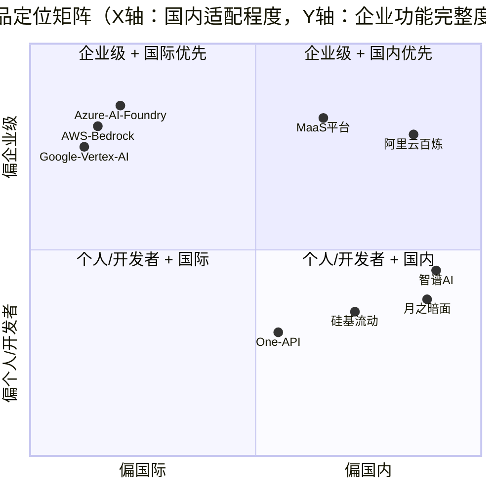

# 竞品分析总览

**文档版本：** V1.2  
**编写日期：** 2026年05月15日  
**维护频率：** 每季度更新  
**负责人：** 产品负责人

---

## 目录结构

```
竞品分析/
├── 00-竞品分析总览.md          ← 本文件，汇总对比矩阵 + 定位图
├── 01-阿里云百炼.md            国内最强 MaaS，阿里系生态
├── 02-硅基流动.md              国内高性价比推理 API
├── 03-One-API.md              开源多模型聚合 Proxy
├── 04-AWS-Bedrock.md          AWS 托管基础模型服务
├── 05-Azure-AI-Foundry.md     微软 Azure AI 平台
├── 06-Google-Vertex-AI.md     谷歌云 AI 平台
├── 07-智谱AI开放平台.md        国内 GLM 系列模型平台
├── 08-月之暗面.md              Moonshot AI Kimi API
├── 09-new-api.md               轻量 OpenAI 聚合网关
├── 10-Grok2API.md              Grok 垂直代理层
├── 11-Quotio.md                轻量中转/代理工具
├── 12-UniAPI.md                通用 API 聚合平台
├── 13-Sub2API.md               订阅转 API 工具
├── 14-OpenAI-Router.md         路由与 failover 网关
├── 15-bifrost.md               轻量 AI 网关
├── 16-litellm.md               成熟开源 LLM Proxy
├── 17-easyrouter.md            轻量路由网关
├── 18-worldclaw.md             轻量 AI 接入工具
├── 19-portkey.md               AI Gateway / Control Plane
├── 20-Helicone.md              LLM Observability + Proxy
├── 21-one-hub.md               通用聚合中转工具
├── 22-ofox-ai.md               轻量 AI 平台
├── 23-api2D.md                 OpenAI 兼容转发平台
├── 24-zemux.md                 轻量代理 / 中转工具
└── 25-b-ai.md                  轻量开发者 AI 平台
```

---

## 竞品全景图



---

## 功能对比总矩阵

| 功能维度 | **MaaS平台** | 阿里百炼 | 硅基流动 | One API | AWS Bedrock | Azure Foundry | Google Vertex | 智谱AI | 月之暗面 |
|---------|:-----------:|:-------:|:-------:|:-------:|:-----------:|:-------------:|:-------------:|:------:|:-------:|
| **OpenAI 兼容 API** | ✅ | ✅ | ✅ | ✅ | ⚠️ | ✅ | ⚠️ | ✅ | ✅ |
| **多厂商聚合** | ✅ 6+ | ⚠️ 阿里系 | ✅ 30+ | ✅ 30+ | ✅ AWS系 | ✅ 微软系 | ✅ 谷歌系 | ❌ 仅GLM | ❌ 仅Kimi |
| **智能路由/Failover** | ✅ 多维评分 | ⚠️ 基础 | ⚠️ 基础 | ⚠️ 轮询 | ✅ 内置HA | ✅ | ✅ | ❌ | ❌ |
| **语义缓存** | ✅ L1+L2 | ❌ | ❌ | ❌ | ❌ | ❌ | ❌ | ❌ | ❌ |
| **模型精调** | ✅ LoRA/SFT | ✅ | ⚠️ 有限 | ❌ | ✅ | ✅ | ✅ | ✅ | ⚠️ |
| **自托管模型** | ✅ vLLM/TGI | ✅ | ❌ | ✅ | ⚠️ | ⚠️ | ⚠️ | ❌ | ❌ |
| **企业级 RBAC** | ✅ Casbin | ✅ | ❌ | ⚠️ | ✅ IAM | ✅ Azure AD | ✅ IAM | ⚠️ | ❌ |
| **多租户 SaaS** | ✅ | ✅ | ❌ | ⚠️ | ✅ | ✅ | ✅ | ✅ | ❌ |
| **详细账单/成本** | ✅ Token粒度 | ✅ | ✅ | ⚠️ | ✅ | ✅ | ✅ | ✅ | ✅ |
| **AI Copilot 内置** | ✅ | ❌ | ❌ | ❌ | ❌ | ⚠️ Copilot | ❌ | ❌ | ❌ |
| **国内合规（等保）** | ✅ | ✅ | ⚠️ | ❌ | ❌ | ❌ | ❌ | ✅ | ⚠️ |
| **私有化部署** | ✅ | ⚠️ 专有云 | ❌ | ✅ 开源 | ❌ | ❌ | ❌ | ⚠️ | ❌ |
| **国内模型支持** | ✅ | ✅ 通义 | ✅ | ✅ | ❌ | ⚠️ | ❌ | ✅ GLM | ✅ Kimi |
| **海外模型支持** | ✅ GPT/Claude | ⚠️ 有限 | ✅ | ✅ | ✅ | ✅ | ✅ | ❌ | ❌ |
| **明确 SLA** | ✅ 99.9% | ✅ | ❌ | ❌ | ✅ 99.95% | ✅ 99.9% | ✅ | ⚠️ | ❌ |

---

## 定价对比

| 产品 | 定价模式 | GPT-4o 同级价格 | 最低消费 | 备注 |
|------|---------|---------------|---------|------|
| **MaaS平台** | Token 用量 + 阶梯 | 中等（聚合溢价约 5-15%） | 无 | 语义缓存可抵消溢价 |
| 阿里百炼 | Token 用量 | 中等 | 无 | 通义模型性价比高 |
| 硅基流动 | Token 用量 | **极低**（50-80% 折扣） | 无 | 主要是开源模型 |
| One API | 开源免费 | 取决于自选厂商 | N/A | 自建需要运维成本 |
| AWS Bedrock | Token + 调用次数 | 较高 | 无 | 复杂计费结构 |
| Azure AI Foundry | Token + 部署费 | 高 | 无 | 与 OpenAI 同价或更高 |
| Google Vertex AI | Token + 调用次数 | 中等 | 无 | 有免费额度 |
| 智谱AI | Token 用量 | 低（GLM 系列） | 无 | 仅国产模型 |
| 月之暗面 | Token 用量 | 低（Kimi 系列） | 无 | 主打长上下文 |

---

## 分客户群竞争策略

| 目标客户 | 首要竞争对手 | 我方核心卖点 | 关键话术 |
|---------|------------|-----------|---------|
| **金融/政务合规企业** | AWS Bedrock / Azure | 国内合规，数据不出境，等保2.0 | "唯一同时支持国内合规 + 全厂商聚合的平台" |
| **多模型混用技术团队** | 阿里百炼 | 中立路由，不绑定任何厂商 | "最优模型由算法决定，而非由厂商关系决定" |
| **成本敏感型初创** | 硅基流动 | 语义缓存降低 40% 成本 + SLA 保障 | "不只是便宜，还能省" |
| **自建运维能力团队** | One API | 免运维 SaaS + AI-Native 功能 | "比 One API 多了智能路由、Copilot、官方 SLA" |
| **国际化业务** | Azure / AWS | 国内外模型统一接入 | "一个 API Key，同时调用 GPT-4o 和通义千问" |

---

## 更新记录

| 日期 | 更新内容 | 负责人 |
|------|---------|--------|
| 2026-05-14 | 初版建立，覆盖 8 家竞品 | 产品负责人 |
| 2026-05-15 | 补充 API 网关/路由层竞品，扩展到 16 份文档 | 产品负责人 |
| 2026-05-15 | 补充 EasyRouter、WorldClaw、Portkey、Helicone 等 9 家竞品 | 产品负责人 |
| 2026-05-15 | 新增两张可汇报横向对比表（开源网关类 / SaaS 控制面类） | 产品负责人 |

> ⚠️ AI 领域竞争格局变化极快，请每季度核实各竞品最新动态并更新本目录

---

## API 网关与路由层补充竞品

这一组竞品与 One API、new-api、litellm 同属“OpenAI 兼容入口 / 路由代理”赛道，核心差异主要在于：是否更偏单模型、是否具备路由与 failover、是否支持预算/日志/审计、是否能承载企业级治理。

| 产品 | 核心定位 | 更强的地方 | 明显短板 |
|------|---------|----------|---------|
| new-api | 轻量聚合代理 | 上手快、部署简单 | 企业治理薄弱 |
| Grok2API | Grok 垂直代理 | 单模型接入简单 | 覆盖面太窄 |
| Quotio | 轻量中转工具 | 轻量、易试用 | 资料少、功能收敛 |
| UniAPI | 通用聚合平台 | OpenAI 兼容、易接入 | 平台化不足 |
| Sub2API | 订阅转 API | 转换能力强 | 企业能力弱 |
| OpenAI Router | 路由 / 容灾 | failover、切换强 | 非完整平台 |
| bifrost | 轻量 AI 网关 | 路由能力较好 | 公开资料分散 |
| LiteLLM | 成熟开源 Proxy | 路由、fallback、budget、guardrails | 仍需自建运维 |

---

## 新增补充竞品（路由、观测、轻量平台类）

这一组更偏“AI 基础设施工具层”或“轻量 SaaS 层”，与 MaaS 平台的差异不在于能否接模型，而在于是否具备平台化治理、成本控制、合规和产品化体验。

| 产品 | 类别 | 更强的地方 | 明显短板 |
|------|------|----------|---------|
| EasyRouter | 路由网关 | 路由/切换清晰 | 平台治理弱 |
| WorldClaw | 轻量工具 | 简单、轻量 | 资料少、治理弱 |
| Portkey | AI Gateway | 策略、预算、观测较完整 | 仍需自建运维 |
| Helicone | Observability | Trace、成本、实验分析强 | 不是完整业务平台 |
| one-hub | 聚合中转 | 简单易用 | 规模化治理不足 |
| ofox.ai | 轻量 SaaS | 控制台与基础统计更像产品 | 深度能力有限 |
| api2D | 转发平台 | OpenAI 兼容、国内接入便利 | 平台能力偏薄 |
| Zemux | 轻量工具 | 快速试用、简单管理 | 企业能力弱 |
| b.ai | 开发者平台 | 轻量产品化体验 | 公开信息有限 |

---

## 基础信息总表

以下 Star 数为 2026-05 的大致量级或公开页面可见量级；对公开信息不足或闭源 SaaS 产品，已标注“待核实 / N/A”。

| 产品 | 开源/闭源 | Star | GitHub / 官网 |
|------|----------|------|---------------|
| 阿里云百炼 | 闭源 SaaS | N/A | https://bailian.console.aliyun.com |
| 硅基流动 | 闭源 SaaS | N/A | https://siliconflow.cn |
| One API | 开源 | 约 20k+ | https://github.com/songquanpeng/one-api |
| AWS Bedrock | 闭源 SaaS | N/A | https://aws.amazon.com/bedrock |
| Azure AI Foundry | 闭源 SaaS | N/A | https://ai.azure.com |
| Google Vertex AI | 闭源 SaaS | N/A | https://cloud.google.com/vertex-ai |
| 智谱AI开放平台 | 闭源 SaaS | N/A | https://bigmodel.cn |
| 月之暗面 | 闭源 SaaS | N/A | https://platform.moonshot.cn |
| new-api | 开源（待核实） | 待核实 | GitHub / 仓库信息待核实 |
| Grok2API | 轻量开源/社区实现（待核实） | 待核实 | GitHub / 仓库信息待核实 |
| Quotio | 待核实 | 待核实 | 官网 / 仓库信息待核实 |
| UniAPI | 待核实 | 待核实 | GitHub / 官网信息待核实 |
| Sub2API | 待核实 | 待核实 | GitHub / 官网信息待核实 |
| OpenAI Router | 待核实 | 待核实 | GitHub / 仓库信息待核实 |
| bifrost | 待核实 | 待核实 | GitHub / 仓库信息待核实 |
| LiteLLM | 开源 | 约 20k+ | https://github.com/BerriAI/litellm / https://docs.litellm.ai |
| EasyRouter | 待核实 | 待核实 | GitHub / 官网信息待核实 |
| WorldClaw | 待核实 | 待核实 | 官网 / 仓库信息待核实 |
| Portkey | 闭源 SaaS（控制面产品） | N/A | https://portkey.ai |
| Helicone | 开源（待核实） | 待核实 | https://github.com/Helicone/helicone / https://www.helicone.ai |
| one-hub | 待核实 | 待核实 | GitHub / 官网信息待核实 |
| ofox.ai | 闭源 SaaS | N/A | https://ofox.ai |
| api2D | 闭源 SaaS | N/A | https://api2d.com |
| Zemux | 待核实 | 待核实 | GitHub / 官网信息待核实 |
| b.ai | 待核实 | 待核实 | 官网 / 仓库信息待核实 |

---

## 开源代理/网关类竞品横向对比表

> 适用于“我们要不要自建网关”的讨论场景。

| 产品 | 开源状态 | 技术定位 | 路由/Failover | 成本治理 | 企业治理 | 运维复杂度 | 适配建议 |
|------|---------|---------|--------------|---------|---------|-----------|---------|
| One API | 开源（较明确） | 多模型聚合代理 | ⚠️ 基础轮询/权重 | ⚠️ 基础 | ⚠️ 基础 | 低-中 | 小团队快速接入 |
| LiteLLM | 开源（较明确） | LLM Proxy / Router | ✅ 强 | ✅ 较强 | ⚠️ 需补齐 | 中 | 平台工程团队首选工具层 |
| new-api | 开源（待核实） | 轻量聚合网关 | ⚠️ 基础 | ⚠️ 基础 | ❌ 弱 | 低 | 临时或早期项目 |
| UniAPI | 待核实 | 通用聚合平台 | ⚠️ 基础 | ⚠️ 基础 | ❌ 弱 | 低-中 | 小规模统一入口 |
| OpenAI Router | 待核实 | 路由网关 | ✅ 较强 | ⚠️ 中 | ❌ 弱 | 中 | 重路由、轻治理场景 |
| bifrost | 待核实 | 轻量 AI 网关 | ⚠️ 中 | ⚠️ 基础 | ❌ 弱 | 低-中 | 内部中转层 |
| EasyRouter | 待核实 | 路由网关 | ⚠️ 中 | ⚠️ 基础 | ❌ 弱 | 低-中 | 模型切换优先场景 |
| one-hub | 待核实 | 聚合中转 | ⚠️ 基础 | ⚠️ 基础 | ❌ 弱 | 低 | 开发测试与轻量生产 |
| Sub2API | 待核实 | 订阅转 API | ❌ 弱 | ❌ 弱 | ❌ 弱 | 低 | 协议转换工具 |
| Grok2API | 待核实 | 单模型垂直代理 | ❌ 弱 | ❌ 弱 | ❌ 弱 | 低 | Grok 专用接入 |

---

## SaaS 控制面/观测类竞品横向对比表

> 适用于“我们是买平台还是自己拼工具”的讨论场景。

| 产品 | 产品类型 | 开源/闭源 | 核心优势 | 主要短板 | 适用客户 |
|------|---------|----------|---------|---------|---------|
| Portkey | AI Gateway / Control Plane | 闭源 SaaS（官方产品） | 策略、路由、预算、观测较完整 | 仍需与业务系统整合 | 平台工程团队、出海团队 |
| Helicone | LLM Observability + Proxy | 开源+SaaS（以官方信息为准） | Trace、成本、实验分析能力强 | 观测强于治理，非完整业务平台 | 需要精细观测的产品团队 |
| api2D | 转发型 SaaS | 闭源 SaaS | OpenAI 兼容、接入快 | 平台治理深度有限 | 国内开发者快速接入 |
| ofox.ai | 轻量 AI 平台 | 闭源 SaaS（待核实） | 控制台友好、轻量产品化 | 深度路由/治理能力有限 | 中小团队 |
| b.ai | 轻量开发者平台 | 待核实 | 上手快、产品化体验轻量 | 公开资料有限 | 早期项目 |
| WorldClaw | 轻量工具平台 | 待核实 | 简单易用 | 资料与能力边界不清晰 | 试验性场景 |
| Zemux | 轻量代理平台 | 待核实 | 快速试用 | 企业能力弱 | 内测与试点场景 |

---

## 采购建议（一页结论）

| 决策问题 | 推荐方向 |
|---------|---------|
| 只想快速接入多个模型 | One API / new-api / UniAPI（短期） |
| 需要强路由和工程可控性 | LiteLLM / Portkey |
| 需要完善观测与实验分析 | Helicone |
| 需要企业级治理、合规与平台化运营 | MaaS 平台 |


