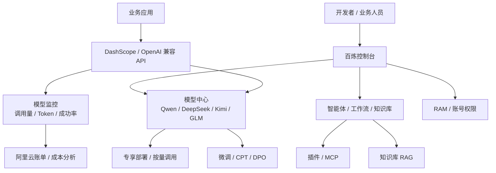

# 竞品分析：阿里云百炼（Model Studio）

**更新日期：** 2026年05月21日  
**产品类型：** 云厂商一站式大模型开发与应用平台  
**竞争优先级：** 高（国内企业客户与云资源绑定场景强竞争）  
**参考资料：** [阿里云百炼产品文档](https://help.aliyun.com/zh/model-studio/)、[Alibaba Cloud Model Studio](https://www.alibabacloud.com/help/en/model-studio/)

---

## 1. 结论摘要

阿里云百炼是阿里云面向大模型开发、调用、调优、部署、评测和应用构建的一站式平台。它的竞争力不只是 Qwen 模型本身，而是“模型服务 + 应用构建 + 阿里云账号体系 + 计费账单 + 云资源生态”的组合。对国内企业客户来说，百炼在采购合规、发票、云账号、RAM 权限、地域和稳定性上天然有优势。

百炼对 MaaS 的威胁主要来自三类场景：已经深度使用阿里云的客户、以 Qwen 为主模型的业务、需要快速搭建智能体/知识库/工作流的业务部门。它的短板也清晰：跨云、多供应商中立路由不足；平台能力强绑定阿里云；路由策略更多体现为模型选择、地域选择和部署规格选择，而不是面向多厂商的统一策略网关。

MaaS 应避开“单云模型平台”正面对打，突出多供应商统一接入、租户级路由、成本治理、语义缓存、企业审计和私有化交付能力。

---

## 2. 产品概况

| 项目 | 内容 |
| --- | --- |
| 产品名称 | 阿里云百炼 / Model Studio |
| 核心定位 | 一站式大模型开发与应用平台 |
| 模型覆盖 | Qwen 系列为核心，同时提供 DeepSeek、Kimi、GLM 等第三方模型 |
| 主要能力 | 模型调用、模型调优、部署、评测、知识库、智能体、工作流、插件、MCP |
| 接入方式 | DashScope API、OpenAI 兼容模式、控制台可视化构建 |
| 企业能力 | 阿里云账号、RAM、账单、成本分析、模型监控、地域能力 |
| 计费方式 | 按 Token、按部署资源、包月/专享服务等多种模式 |

---

## 3. 技术架构

---

## 4. 核心能力

| 能力 | 百炼表现 | 对 MaaS 的影响 |
| --- | --- | --- |
| 模型调用 | Qwen 全系列和部分第三方模型开箱即用 | 在国内模型供给上强 |
| OpenAI 兼容 | 支持 compatible-mode，迁移成本低 | 削弱 MaaS 的兼容入口差异 |
| 应用构建 | 智能体、工作流、知识库、插件、MCP | 对业务部门吸引力强 |
| 模型调优 | SFT、CPT、DPO、评测、部署 | 覆盖模型生命周期 |
| 专享部署 | 面向高并发、低延迟和资源隔离 | 适合生产关键业务 |
| 监控计费 | 调用量、Token、成功率、阿里云账单 | 云内成本闭环较完整 |
| 企业权限 | 依赖阿里云 RAM 和账号体系 | 云上治理成熟 |

---

## 5. 路由策略、规则与容灾

百炼不是典型的多供应商 Router。它的“路由”更多体现在模型选择、地域选择、API Base 选择和专享部署选择。

| 策略点 | 百炼特点 | 局限 |
| --- | --- | --- |
| 模型选择 | Qwen Max/Plus/Flash 等按效果、速度、成本分层 | 主要在百炼模型池内选择 |
| 第三方模型 | 接入 DeepSeek、Kimi、GLM 等 | 不等同于客户自定义多供应商路由 |
| 地域选择 | 北京、海外等不同 base URL | 跨地域策略需业务侧规划 |
| 专享部署 | 可用专属资源提升稳定性 | 成本更高，弹性需规划 |
| fallback | 可在应用层配置备用模型 | 缺少面向全供应商的统一 failover 规则 |
| 成本控制 | 阿里云账单、成本分析和额度控制 | 跨云成本不可统一治理 |

MaaS 若与百炼竞争，应强调：不只是“调用哪个模型”，而是按租户、项目、应用、Key、SLA、成本、质量和合规约束动态选择供应商与模型，并记录每次路由决策。

---

## 6. 同类竞品对比

| 维度 | 阿里云百炼 | AWS Bedrock | Azure AI Foundry | MaaS |
| --- | --- | --- | --- | --- |
| 云生态 | 阿里云强绑定 | AWS 强绑定 | Azure/Microsoft 强绑定 | 可跨云/私有化 |
| 国内可用性 | 强 | 受区域影响 | 中国区能力差异 | 可按客户环境适配 |
| 模型中立性 | 中 | 中高 | 高 | 高 |
| 路由网关 | 平台内选择为主 | 有跨区/模型路由能力 | 有 model routing | 多供应商策略路由 |
| 应用构建 | 强 | 强 | 强 | 视产品规划 |
| 企业治理 | 云账号体系强 | AWS IAM 强 | Entra/Azure 强 | 租户/业务治理强 |

---

## 7. 优势、劣势与销售应对

| 优势 | 说明 |
| --- | --- |
| 国内云厂商背书 | 采购、账单、发票、合规和服务体系成熟 |
| Qwen 生态强 | 自研模型迭代快，中文和国内场景适配好 |
| 一站式能力 | 从模型调用到应用构建覆盖完整 |
| 低门槛 | 控制台和 OpenAI 兼容 API 都方便接入 |

| 劣势 | 说明 |
| --- | --- |
| 云锁定 | 平台能力强绑定阿里云 |
| 中立路由不足 | 不适合客户自主管理多云、多供应商策略 |
| 跨供应商成本治理弱 | 阿里云外成本难统一 |
| 私有化边界需确认 | 复杂政企场景需项目化交付 |

销售应对：承认百炼适合阿里云内建应用和 Qwen 优先场景；MaaS 主打“统一管多个供应商和多个云”，把路由、预算、审计、合规、缓存、供应商合同和私有化交付作为差异点。

---

## 8. 总结

阿里云百炼是国内云厂商大模型平台的强代表，产品完整、生态强、上手快。MaaS 不应只比较单模型调用价格，而要用多供应商治理、企业级路由和跨云运营闭环证明价值。
