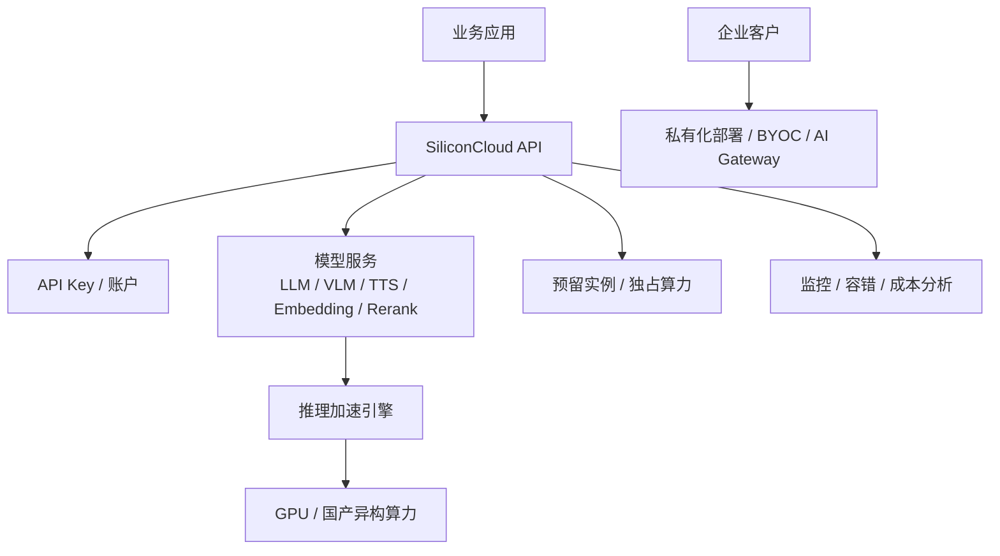

# 竞品分析：硅基流动 SiliconFlow

**更新日期：** 2026年05月21日  
**产品类型：** 高性价比大模型推理云 / 模型 API / 企业部署服务  
**竞争优先级：** 高（国内开发者与低成本推理场景强竞争）  
**参考资料：** [硅基流动官网](https://siliconflow.cn/)、[SiliconFlow 文档](https://docs.siliconflow.cn/)

---

## 1. 结论摘要

硅基流动的核心定位是“更快、更全、更丝滑的大模型 API 与推理加速平台”。它覆盖语言、语音、图片、视频、向量、重排序等多场景模型，重点强调 DeepSeek、Qwen、Kimi、GLM、BGE、SenseVoice、Qwen-Image 等开源或主流模型的高性价比推理服务，并提供预留实例、推理加速、私有化部署和私有化大模型服务网关。

它对 MaaS 的威胁主要来自成本和性能心智：开发者很容易把硅基流动当成“低价高速模型 API”直接接入；企业客户则可能看中预留实例、BYOC、计算/网络/存储隔离和国产异构 GPU 适配。它不是纯 API 代理，而是带推理基础设施能力的模型服务商。

MaaS 应把硅基流动视为重要上游和竞品：既可接入其模型 API，也需要在多供应商路由、预算审计、缓存、企业分账和策略治理上形成高一层控制面。

---

## 2. 产品概况

| 项目 | 内容 |
| --- | --- |
| 产品名称 | SiliconFlow / SiliconCloud |
| 核心定位 | 一站式模型 API 与高效推理加速云服务 |
| 模型覆盖 | Qwen、DeepSeek、Kimi、GLM、BGE、BCE、SenseVoice、图像/多模态模型等 |
| 产品矩阵 | 大模型 API、预留实例、推理加速、私有化部署、私有化大模型服务网关 |
| 主要卖点 | 高速推理、高性价比、高稳定性、高安全性、混合云/BYOC |
| 企业能力 | 独占算力、监控容错、技术支持、计算/网络/存储隔离 |

---

## 3. 技术架构

---

## 4. 核心能力

| 能力 | 表现 | 对 MaaS 的影响 |
| --- | --- | --- |
| 模型 API | 开箱即用，按量计费 | 开发者接入门槛低 |
| 开源模型覆盖 | DeepSeek、Qwen、GLM、Kimi 等丰富 | 国内热门模型供给强 |
| 推理加速 | 官方强调高速、低延迟和吞吐提升 | 性能/成本优势明显 |
| 预留实例 | 独占算力、性能可预期 | 企业生产场景吸引力高 |
| 私有化部署 | 支持 BYOC、隔离与混合云 | 与 MaaS 私有化存在竞争 |
| 监控容错 | 官方宣称完善监控和容错机制 | 可用性主张明确 |
| 成本分析 | 强调智能成本分析 | 与 MaaS 成本治理局部重叠 |

---

## 5. 路由策略、规则与容灾

硅基流动的公开资料强调推理服务稳定性、监控容错、预留实例和企业级高可用，但不应把它等同于 OpenRouter/LiteLLM 那类多供应商策略路由器。

| 策略点 | 硅基流动特点 | MaaS 对比 |
| --- | --- | --- |
| 模型选择 | 在 SiliconCloud 模型池中选模型 | MaaS 可跨供应商选择 |
| 性能路由 | 依赖其推理引擎和算力调度 | MaaS 可按上游实时延迟路由 |
| 预留容量 | 通过预留实例保障关键业务 | MaaS 可组合预留和按量上游 |
| 容错 | 官方主张监控和容错机制 | MaaS 需做供应商级 fallback 与熔断 |
| 私有化网关 | 有私有化大模型服务网关产品 | MaaS 需强调策略治理和审计闭环 |
| 成本优化 | 推理成本与资源利用率优化 | MaaS 叠加多供应商价格比较和缓存 |

---

## 6. 与 MaaS 平台对比

| 维度 | 硅基流动 | MaaS |
| --- | --- | --- |
| 核心优势 | 推理加速、低成本、热门模型 API | 多供应商治理、路由、审计、分账 |
| 模型范围 | SiliconFlow 上架模型 | 任意供应商和自建模型 |
| 路由能力 | 平台内模型/算力调度为主 | 跨供应商策略路由 |
| 企业部署 | BYOC/私有化强 | 私有化 + 统一控制面 |
| 成本治理 | 推理成本优化 | 预算、缓存、分账、合同价格统一 |
| 可观测 | 平台监控为主 | 请求级路由、成本、质量和审计 |

---

## 7. 优势、劣势与应对

| 优势 | 说明 |
| --- | --- |
| 性价比心智强 | 对价格敏感开发者非常有吸引力 |
| 热门开源模型上新快 | DeepSeek/Qwen/GLM/Kimi 等覆盖适配国内需求 |
| 推理基础设施能力强 | 不只是转发 API，有底层加速和算力调度能力 |
| 企业交付可选项多 | 预留实例、BYOC、私有化部署形成企业方案 |

| 劣势 | 说明 |
| --- | --- |
| 中立性有限 | 本质仍是单平台模型服务商 |
| 企业运营治理不足 | 不是完整多供应商预算/审批/审计平台 |
| 路由透明度待核实 | 公开资料未呈现细粒度策略路由配置 |
| 客户议价依赖平台 | 供应商合同和模型池受其平台影响 |

销售应对：对客户认可硅基流动的性能和成本时，应将其纳入 MaaS 上游候选；同时强调 MaaS 负责统一多个上游、缓存降本、失败切换、业务分账和审计合规。

---

## 8. 总结

硅基流动是国内模型 API 与推理加速赛道的重要竞品，尤其在低成本、高性能、热门模型和企业部署上有竞争力。MaaS 要把它从“替代者”转化为“可被统一治理的优质上游”，并在路由治理层建立差异。
