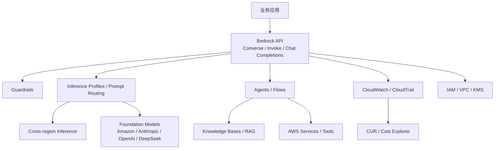

# 竞品分析：Amazon Bedrock

**更新日期：** 2026年05月21日  
**产品类型：** 云厂商全托管生成式 AI 平台  
**竞争优先级：** 高（全球企业与受监管行业强竞争）  
**参考资料：** [Amazon Bedrock](https://aws.amazon.com/bedrock/)、[Amazon Bedrock Documentation](https://docs.aws.amazon.com/bedrock/)、[Bedrock Overview](https://docs.aws.amazon.com/bedrock/latest/userguide/what-is-bedrock.html)

---

## 1. 结论摘要

Amazon Bedrock 是 AWS 的全托管生成式 AI 平台，提供来自 Amazon、Anthropic、DeepSeek、Moonshot、MiniMax、OpenAI 等供应商的 100+ 基础模型，并围绕生产级应用提供 Agents、Flows、Knowledge Bases、Guardrails、Prompt Management、Evaluation、Provisioned Throughput、Cross-region Inference、Inference Profiles 和 Prompt Routing。

Bedrock 的核心优势是 AWS 企业级基础设施、IAM 权限、VPC/私网、安全合规、CloudWatch/CloudTrail 监控审计和全球区域能力。它对 MaaS 的威胁不在于“API 网关轻量替换”，而在于大企业已经把身份、网络、数据、成本和审计托管在 AWS，Bedrock 自然成为云内生成式 AI 标准平台。

MaaS 的机会在于：客户需要跨 AWS、Azure、国内云、开源模型和自有模型统一治理时，Bedrock 的云边界会变成限制。MaaS 应突出跨云、多供应商、中立路由、成本归因和本地化交付。

---

## 2. 产品概况

| 项目 | 内容 |
| --- | --- |
| 产品名称 | Amazon Bedrock |
| 产品定位 | 全托管基础模型平台与企业生成式 AI 应用平台 |
| 模型覆盖 | Amazon Nova、Anthropic Claude、DeepSeek、Kimi、MiniMax、OpenAI 等 100+ 模型 |
| 关键能力 | 模型调用、Agents、Flows、Knowledge Bases、Guardrails、Evaluation、Prompt Management |
| 路由能力 | Inference Profiles、Cross-region Inference、Prompt Routing |
| 企业能力 | IAM、CloudWatch、CloudTrail、VPC、KMS、成本分配、合规能力 |
| 计费 | 按量调用、Provisioned Throughput、批处理等 |

---

## 3. 技术架构

---

## 4. 核心能力

| 能力 | Bedrock 表现 | 竞争含义 |
| --- | --- | --- |
| 模型市场 | 多供应商 100+ 模型 | 模型丰富度强 |
| 统一 API | Converse API、Invoke API、Chat Completions API | 降低多模型接入复杂度 |
| Prompt Routing | 同模型家族内高效路由 | 已具备明确路由产品能力 |
| Inference Profiles | 将请求路由到模型和一个或多个 AWS 区域 | 面向区域容量和可用性 |
| Cross-region Inference | 高峰时跨区域路由推理请求 | 云内容灾能力强 |
| Guardrails | 安全护栏与负责任 AI 控制 | 适合受监管行业 |
| Knowledge Bases | 托管 RAG 能力 | 降低应用构建门槛 |
| Provisioned Throughput | 专属容量 | 生产 SLA 与低延迟场景强 |

---

## 5. 路由策略与容灾

| 策略 | Bedrock 能力 | MaaS 对比 |
| --- | --- | --- |
| 跨区域路由 | Cross-region Inference 可在峰值时跨 AWS 区域分发 | MaaS 需要跨供应商、跨云和私有资源 |
| Profile 路由 | Inference Profiles 绑定模型和区域集合 | MaaS 应提供租户级策略与灰度版本 |
| Prompt Routing | 同一模型家族内按提示复杂度/适配性路由 | MaaS 可扩展到跨家族、跨供应商 |
| 专属容量 | Provisioned Throughput 保障吞吐 | MaaS 可组合专属与按量上游 |
| fallback | 云内区域/容量层面更成熟 | 跨云 fallback 仍需业务或外部平台实现 |
| 成本归因 | 支持 IAM 主体维度成本分配 | MaaS 需做业务部门/应用/Key 分摊 |

Bedrock 的容灾策略非常适合 AWS 内部资源调度，但它不是中立多云 Router。若客户要求 OpenAI、Anthropic、阿里云、智谱、自建 vLLM 同时纳入策略，Bedrock 本身不适合作为唯一控制面。

---

## 6. 与 MaaS 平台对比

| 维度 | Bedrock | MaaS |
| --- | --- | --- |
| 云生态 | AWS 深度绑定 | 中立，可跨云/私有化 |
| 模型覆盖 | AWS 接入模型丰富 | 可接入任意供应商和自建模型 |
| 路由范围 | AWS 区域、模型家族、托管模型 | 多供应商、多云、租户级策略 |
| 企业安全 | IAM/VPC/KMS/CloudTrail 强 | 需对接客户 IAM、堡垒机、审计体系 |
| 应用构建 | Agents、Flows、KB 强 | 取决于 MaaS 产品规划 |
| 计费治理 | AWS 成本体系强 | 业务维度分账更灵活 |
| 国内交付 | 受区域和服务可用性影响 | 可适配本地云和私有化 |

---

## 7. 优势、劣势与应对

| 优势 | 说明 |
| --- | --- |
| 企业级成熟 | 安全、网络、审计、计费、合规体系完整 |
| 模型与应用能力完整 | 从模型调用到 Agent/RAG/Guardrails 覆盖生产链路 |
| 路由能力明确 | Cross-region、Inference Profiles、Prompt Routing 是官方能力 |
| AWS 客户粘性强 | 已在 AWS 的企业迁移成本低 |

| 劣势 | 说明 |
| --- | --- |
| 云锁定明显 | 深度绑定 AWS 身份、网络和账单 |
| 多云中立不足 | 不适合作为跨云模型治理统一层 |
| 区域差异 | 模型和功能可用性受区域影响 |
| 国内客户门槛 | 网络、合规、采购和本地服务存在现实限制 |

销售应对：对 AWS 深度客户，不要只卖“更便宜 API”。应围绕跨云治理、国内外供应商统一接入、本地模型接入、业务级预算和私有化审计建立价值。

---

## 8. 总结

Amazon Bedrock 是 MaaS 在国际企业市场最强的云厂商竞品之一。它的路由和容灾能力已经具备官方产品化形态，但范围主要在 AWS 生态内。MaaS 的差异化必须落在中立、多云、多供应商和本地化治理。
