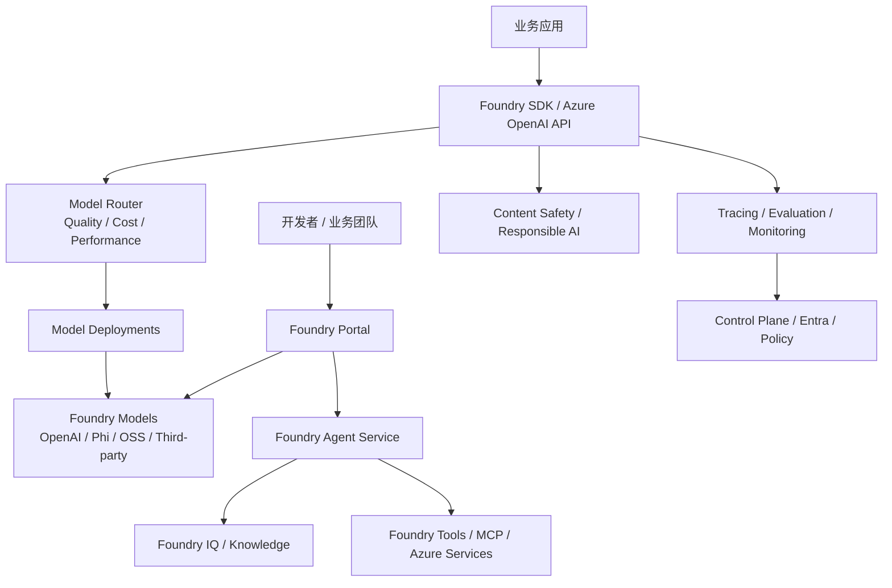

# 竞品分析：Azure AI Foundry / Microsoft Foundry

**更新日期：** 2026年05月21日  
**产品类型：** 云厂商 AI 应用与智能体工厂平台  
**竞争优先级：** 高（企业客户、Microsoft 生态和 Azure OpenAI 场景强竞争）  
**参考资料：** [Microsoft Foundry](https://azure.microsoft.com/en-us/products/ai-foundry)、[Microsoft Foundry Documentation](https://learn.microsoft.com/en-us/azure/foundry/)、[Azure OpenAI 文档入口](https://learn.microsoft.com/en-us/azure/ai-services/openai/)

---

## 1. 结论摘要

Azure AI Foundry 已升级为 Microsoft Foundry 叙事，定位为“AI app and agent factory”。它不是单纯模型 API，而是围绕模型目录、Azure OpenAI、Foundry Models、Agent Service、Control Plane、Foundry IQ、Content Safety、可观测、评测和 Microsoft 生态集成构建的企业级 AI 平台。

Foundry 官方强调可访问 11,000+ 模型，并提供实时 model routing，用于在质量和成本之间自动选择更合适的模型。再叠加 Entra ID、Azure Policy、Defender、Purview、AI Search、VS Code、GitHub、Copilot Studio 和 Microsoft 365 生态，它对企业客户的吸引力很强。

MaaS 的竞争机会在于：Azure Foundry 强绑定 Microsoft/Azure 生态，跨国内云、私有模型、非 Azure 合同和本地化交付时弹性不足。MaaS 应突出“中立模型控制面”和“企业内部统一模型运营层”。

---

## 2. 产品概况

| 项目 | 内容 |
| --- | --- |
| 产品名称 | Azure AI Foundry / Microsoft Foundry |
| 核心定位 | AI 应用与智能体开发、优化、治理平台 |
| 模型覆盖 | Azure OpenAI、Microsoft Phi、开源模型、第三方模型、行业模型等 |
| 官方主张 | 11,000+ Foundry Models、模型比较、微调、蒸馏、自动升级、实时模型路由 |
| 关键能力 | Agent Service、Foundry Models、Foundry Control Plane、Foundry IQ、Content Safety、可观测与评测 |
| 企业基础 | Entra ID、Azure RBAC、Private Link、Azure Monitor、Policy、Purview |
| 生态集成 | VS Code、GitHub Copilot、Copilot Studio、Microsoft 365、Azure AI Search |

---

## 3. 技术架构

---

## 4. 核心能力

| 能力 | Foundry 表现 | 竞争含义 |
| --- | --- | --- |
| 模型目录 | 官方称 11,000+ 模型 | 模型选择面广 |
| Azure OpenAI | GPT 系列企业级托管入口 | 企业信任强 |
| Model Router | 实时路由到合适模型以兼顾质量和成本 | 对 MaaS 路由能力有直接竞争 |
| Agent Service | 编排和托管智能体 | 应用构建能力强 |
| Foundry IQ | 连接企业知识与智能体 | RAG/企业搜索协同强 |
| Control Plane | 统一治理、可信 AI、观测、评测 | 企业控制面成熟 |
| Content Safety | 内容安全和策略能力 | 合规场景优势明显 |
| 开发者生态 | VS Code、GitHub、SDK | 开发体验强 |

---

## 5. 路由策略、规则与容灾

| 策略 | Foundry 特点 | MaaS 对比 |
| --- | --- | --- |
| 实时模型路由 | 官方主张自动选择合适模型，优化质量和成本 | MaaS 需提供可解释、可审计的策略配置 |
| 部署路由 | Azure OpenAI/Foundry Models 通过 deployment 管理 | MaaS 可跨供应商路由而非仅 Azure deployment |
| 成本优化 | 模型路由、蒸馏、微调、自动升级 | MaaS 可叠加预算、缓存、供应商价格比较 |
| 内容安全 | 与 Content Safety、Responsible AI 集成 | MaaS 需支持可插拔策略和本地合规 |
| 容灾 | 依赖 Azure 区域、配额、部署和客户架构 | MaaS 可做 Azure 之外的 fallback |
| 观测评测 | trace、monitor、evaluate agentic workflows | MaaS 要补齐全链路可观测 |

Foundry 的路由优势是产品化程度高，尤其适合 Azure 内模型和智能体开发。它的限制是策略控制面依然围绕 Azure 资源组织，跨云供应商需要外部治理层。

---

## 6. 与 MaaS 平台对比

| 维度 | Azure AI Foundry | MaaS |
| --- | --- | --- |
| 平台定位 | Azure/Microsoft AI 应用与智能体平台 | 中立模型运营与网关平台 |
| 模型覆盖 | 极广，但依赖 Foundry/Azure 上架 | 可接入任意 API 和自建模型 |
| 路由能力 | 官方 model routing，偏 Azure 内 | 多供应商、跨云、租户级路由 |
| 企业身份 | Entra ID/RBAC 强 | 可对接客户现有 IAM |
| 应用生态 | Microsoft 365/Copilot/GitHub 强 | 可服务非 Microsoft 体系 |
| 国内适配 | 中国区能力和模型差异需核实 | 可按本地云和私有化定制 |
| 成本治理 | Azure 成本体系强 | 可跨供应商统一分账 |

---

## 7. 优势、劣势与应对

| 优势 | 说明 |
| --- | --- |
| 企业生态极强 | Microsoft 365、GitHub、VS Code、Azure 一体化 |
| 模型目录广 | 官方强调 11,000+ 模型和比较能力 |
| 路由能力明确 | model routing 直接对标 MaaS 智能路由 |
| 治理与安全成熟 | Entra、Content Safety、Policy、监控评测体系完整 |

| 劣势 | 说明 |
| --- | --- |
| Azure 绑定 | 平台价值大量来自 Azure 生态 |
| 国内能力差异 | Azure 中国区与国际区存在服务差异 |
| 跨供应商中立性有限 | 非 Azure 合同、非 Azure 模型管理不自然 |
| 成本复杂 | 服务多、计费项多，FinOps 门槛高 |

销售应对：对 Microsoft 客户强调“Foundry 可作为上游之一”，MaaS 提供统一入口、跨云 fallback、国内供应商补充、自建模型接入和业务级审计分账。

---

## 8. 总结

Azure AI Foundry 是云厂商中最直接冲击 MaaS 路由与治理叙事的竞品之一，尤其是官方 model routing 和 Control Plane 能力。MaaS 必须用中立性、跨云能力、国内适配和可解释路由建立差异。
