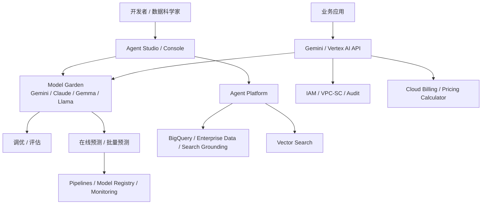

# 竞品分析：Google Vertex AI / Gemini Enterprise Agent Platform

**更新日期：** 2026年05月21日  
**产品类型：** 云厂商 AI/ML 与企业智能体平台  
**竞争优先级：** 高（国际企业、Gemini、多模态和 Google Cloud 数据生态场景）  
**参考资料：** [Google Cloud Vertex AI](https://cloud.google.com/vertex-ai)、[Vertex AI Generative AI Documentation](https://docs.cloud.google.com/vertex-ai/generative-ai/docs)

---

## 1. 结论摘要

Google Vertex AI 正在被 Google Cloud 统一到 Gemini Enterprise Agent Platform 叙事下，定位为构建、扩缩、治理和优化企业级智能体的平台。它覆盖 Gemini 多模态模型、Model Garden、Agent Platform、Agent Studio、模型评估、调优、训练、预测、MLOps、BigQuery 集成、Vector Search 和 Google Cloud 安全治理。

Vertex AI 的强项是 Google 自研 Gemini、多模态、搜索/数据生态、MLOps 和企业 AI 生命周期管理。Model Garden 提供 200+ 生成式 AI 模型和工具，包括 Gemini、Imagen、Veo、Gemma、Llama、Anthropic Claude 等。它对 MaaS 的威胁主要出现在国际化企业、Google Cloud 数据仓库用户、需要多模态和完整 ML 平台的团队。

它的局限也明显：对 Google Cloud 资源体系依赖强；国内可用性、采购和网络存在门槛；面向多云、多供应商中立路由的能力不如专门 MaaS/AI Gateway。MaaS 应把 Vertex AI 作为强上游和生态竞品同时看待。

---

## 2. 产品概况

| 项目 | 内容 |
| --- | --- |
| 产品名称 | Google Vertex AI / Gemini Enterprise Agent Platform |
| 核心定位 | 企业级智能体、生成式 AI 和 ML 生命周期平台 |
| 模型覆盖 | Gemini、Imagen、Veo、Chirp、Gemma、Llama、Claude 等 |
| 关键能力 | Model Garden、Agent Studio、调优、评估、训练、预测、MLOps、Vector Search |
| 数据生态 | BigQuery、Cloud Storage、Google Search grounding、企业数据连接 |
| 企业能力 | IAM、VPC Service Controls、Cloud Logging、Cloud Monitoring、审计与安全控制 |
| 计费 | 按模型调用、训练/预测资源、向量检索、流水线等分别计费 |

---

## 3. 技术架构

---

## 4. 核心能力

| 能力 | Vertex AI 表现 | 竞争含义 |
| --- | --- | --- |
| Gemini 多模态 | 文本、图像、视频、代码等能力强 | 多模态应用竞争力高 |
| Model Garden | 200+ 模型和工具 | 模型发现、测试、部署闭环强 |
| Agent Platform | 构建、扩缩、治理企业级智能体 | 应用平台化能力强 |
| 调优与评估 | 支持生成式 AI 评估、调优和 ML 训练 | 生命周期完整 |
| 数据生态 | BigQuery、Vector Search、Search grounding | 企业知识和数据分析优势明显 |
| MLOps | Pipelines、Model Registry、Feature Store、Monitoring | 传统 ML 和 GenAI 一体化 |
| 安全治理 | Google Cloud IAM、日志、监控、安全控制 | 云内企业治理成熟 |

---

## 5. 路由策略与容灾边界

Vertex AI 的路由不像 OpenRouter 或 LiteLLM 那样以“多供应商 API Router”为核心。它更强调平台内模型选择、部署、评估和 Google Cloud 基础设施可用性。

| 策略点 | Vertex AI 特点 | MaaS 对比 |
| --- | --- | --- |
| 模型选择 | 通过 Model Garden 选择 Gemini、Claude、Gemma 等 | MaaS 可统一外部供应商和自建模型 |
| 区域与部署 | 模型和功能受区域可用性影响 | MaaS 可跨云/跨供应商 fallback |
| 评估驱动选择 | 有模型评估服务支持数据驱动比较 | MaaS 需把评估结果接入路由策略 |
| 数据 grounding | 与 Google Search/企业数据连接 | MaaS 可做可插拔 RAG/知识库 |
| 容灾 | 依赖 Google Cloud 区域、配额和客户架构 | MaaS 应提供供应商级容灾链路 |
| 成本控制 | Google Cloud Billing 和价格计算器 | MaaS 可做跨供应商成本归因 |

---

## 6. 与 MaaS 平台对比

| 维度 | Vertex AI | MaaS |
| --- | --- | --- |
| 云生态 | Google Cloud 强绑定 | 中立、可跨云和私有化 |
| 模型能力 | Gemini/多模态/MLOps 强 | 取决于接入供应商组合 |
| 路由网关 | 平台内模型选择为主 | 多供应商策略路由 |
| 企业数据 | BigQuery/Google Search 强 | 可对接客户任意数据源 |
| 传统 ML | 很强 | 通常不是 MaaS 核心 |
| 国内适配 | 网络和采购门槛高 | 可更贴近本地客户 |
| 成本治理 | Google Cloud 内强 | 跨供应商统一治理强 |

---

## 7. 优势、劣势与应对

| 优势 | 说明 |
| --- | --- |
| Gemini 与多模态强 | 适合视频、图像、搜索增强和复杂多模态场景 |
| 数据生态强 | BigQuery、Search、Vector Search 形成差异 |
| AI 生命周期完整 | 训练、预测、评估、MLOps 成熟 |
| 企业治理成熟 | Google Cloud 安全和审计体系完善 |

| 劣势 | 说明 |
| --- | --- |
| 云锁定 | 深度依赖 Google Cloud |
| 国内落地限制 | 网络、合规、采购和服务可用性不稳定 |
| 中立路由不足 | 不适合作为国内多供应商统一网关 |
| 学习曲线 | 平台体系庞大，非 Google Cloud 客户成本高 |

销售应对：遇到 Google Cloud 客户时，应把 Vertex AI 作为可接入上游而非完全替代；MaaS 负责跨云供应商统一入口、国内模型补齐、业务预算和审计分摊。

---

## 8. 总结

Google Vertex AI 是强大的云厂商 AI 生命周期平台，尤其在 Gemini、多模态、数据生态和 MLOps 上优势明显。MaaS 的竞争点在中立路由、跨供应商治理、本地化和企业内部成本/审计闭环。
