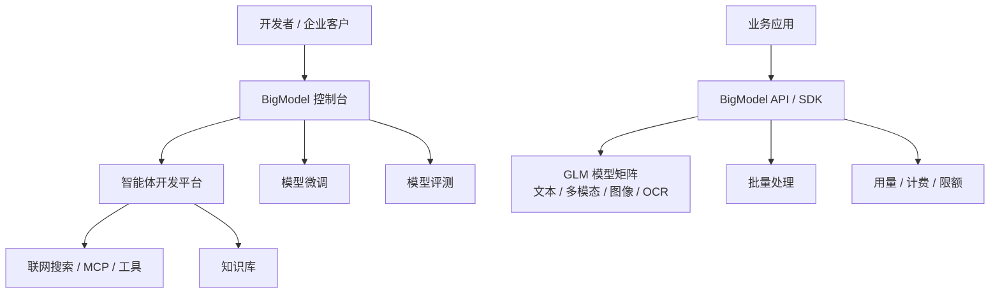

# 竞品分析：智谱 AI 开放平台 BigModel

**更新日期：** 2026年05月21日  
**产品类型：** 单厂商大模型开放平台 / 一站式 MaaS 平台  
**竞争优先级：** 高（国内 GLM 生态、智能体和政企场景）  
**参考资料：** [智谱开放平台](https://open.bigmodel.cn/)、[BigModel 文档](https://docs.bigmodel.cn/)

---

## 1. 结论摘要

智谱 BigModel 官方定位为“一站式大模型开发平台”，提供 GLM 系列模型 API、智能体开发、模型精调、推理、评测、联网搜索、MCP、知识库、批量处理等能力。它已经不是单一 GLM API，而是从模型、工具到应用开发的完整平台。

对 MaaS 来说，智谱的竞争点在国内模型可信度、中文能力、政企服务、GLM 旗舰模型、智能体和开发套件。它的限制是供应商单一：平台主要服务智谱模型矩阵，无法天然承担多供应商中立路由、统一预算、跨模型合同和多云容灾。

MaaS 的策略应是把 BigModel 作为重要模型供应商接入，同时在统一控制面、供应商中立性、成本与审计治理上区分。

---

## 2. 产品概况

| 项目 | 内容 |
| --- | --- |
| 产品名称 | 智谱 AI 开放平台 / BigModel |
| 核心定位 | 一站式模型即服务 AI 开发平台 |
| 模型覆盖 | GLM-5.1、GLM-5V、GLM-Image、GLM-OCR 等文本、多模态、图像、OCR 模型 |
| 平台能力 | API、智能体、联网搜索、MCP、知识库、微调、评测、批量处理 |
| 目标用户 | 开发者、企业 AI 团队、政企客户、Agent 应用开发者 |
| 竞争类型 | 单厂商模型平台，与 MaaS 在模型调用和应用构建上重叠 |

---

## 3. 技术架构

---

## 4. 核心能力

| 能力 | 智谱表现 | 竞争含义 |
| --- | --- | --- |
| GLM 模型矩阵 | 文本、推理、视觉、图像、OCR 覆盖 | 单厂商模型实力强 |
| OpenAI 兼容/SDK | 文档提供多种开发接入方式 | 接入成本低 |
| 智能体 | 智能体市场和 API 接入 | 应用层竞争增强 |
| 联网搜索/MCP | 工具生态持续扩展 | Agent 场景吸引力强 |
| 知识库 | 支持企业知识接入 | RAG 场景覆盖 |
| 微调/评测 | 支持模型定制和效果验证 | 生命周期能力完整 |
| 服务保障 | 官方强调高并发算力和安全防护 | 政企客户信任点 |

---

## 5. 路由策略与容灾边界

智谱不是多供应商 Router。其“路由”主要是客户在 GLM 模型矩阵内做模型选择，或在业务侧自行设计备用模型。

| 策略点 | 智谱特点 | MaaS 对比 |
| --- | --- | --- |
| 模型选择 | 按 GLM 模型能力、上下文、价格选择 | MaaS 可在 GLM、Qwen、Kimi、Claude 等之间选择 |
| 工具调用 | 联网搜索、MCP、知识库与模型结合 | MaaS 可对接多供应商工具和企业内工具 |
| fallback | 公开资料未突出多供应商自动 fallback | MaaS 应提供跨供应商容灾链路 |
| 成本控制 | 平台用量和模型价格 | MaaS 做租户/部门/应用/Key 分账 |
| 合规审计 | 单平台服务保障 | MaaS 需要统一记录跨供应商审计 |

---

## 6. 与 MaaS 平台对比

| 维度 | 智谱 BigModel | MaaS |
| --- | --- | --- |
| 模型归属 | 智谱自有模型为主 | 多供应商和自建模型 |
| 平台能力 | API + Agent + 工具 + 微调评测 | 网关 + 路由 + 治理 + 成本审计 |
| 路由范围 | GLM 模型矩阵内 | 跨模型/跨供应商/跨云 |
| 容灾 | 依赖智谱平台可用性 | 可设计多上游 fallback |
| 成本治理 | 平台账单 | 企业内部多维分账 |
| 私有化 | 需按商务确认 | MaaS 可作为统一私有化控制面 |

---

## 7. 优势、劣势与应对

| 优势 | 说明 |
| --- | --- |
| 国内模型品牌强 | GLM 在中文、政企和开发者市场有认知 |
| 一站式能力完整 | API、Agent、知识库、微调、评测覆盖面广 |
| 工具生态丰富 | 联网搜索、MCP、批量处理等增强应用能力 |
| 服务保障明确 | 高并发算力和安全防护是重要卖点 |

| 劣势 | 说明 |
| --- | --- |
| 供应商单一 | 不解决多模型中立治理 |
| 路由能力有限 | 缺少跨供应商策略路由和容灾 |
| 成本比较不足 | 只能在自家模型价格内优化 |
| 客户锁定 | 应用和工具深度使用后迁移成本升高 |

销售应对：对 GLM 认可度高的客户，应支持“智谱作为上游接入 MaaS”，而不是二选一；MaaS 负责统一策略、预算、缓存、审计和多供应商 fallback。

---

## 8. 总结

智谱 BigModel 是国内单厂商大模型平台中的强竞品，平台能力已经扩展到 Agent 和模型生命周期。MaaS 需要用中立性、多供应商路由和企业运营治理与其错位竞争。
