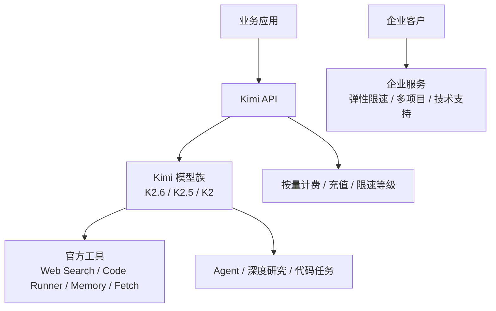

# 竞品分析：月之暗面 Moonshot / Kimi API

**更新日期：** 2026年05月21日  
**产品类型：** 单厂商模型开放平台 / Kimi 模型 API  
**竞争优先级：** 中高（长上下文、Agent、代码和研究场景）  
**参考资料：** [Kimi 大模型开放平台](https://platform.moonshot.cn/)、[Moonshot/Kimi 文档](https://platform.moonshot.cn/docs)

---

## 1. 结论摘要

月之暗面开放平台以 Kimi 模型 API 为核心，强调“模型即服务、创新快人一步”。平台最新主推 Kimi K2.6/K2.5/K2 等模型，覆盖长程代码编写、Agent 自主执行、多模态输入、复杂工具调用、深度研究、法律合规、对话洞察等场景，并提供联网搜索、Memory、Code-Runner、Excel、Fetch、QuickJS、单位转换等官方工具。

Kimi 对 MaaS 的威胁集中在单模型体验和场景口碑：长上下文、深度研究、代码 Agent、工具调用和中文用户认知强。它不是多供应商路由平台，路由和容灾更多依赖客户在业务侧设计，平台本身主要围绕 Kimi 模型族和官方工具生态。

MaaS 应将 Kimi 作为高价值上游模型，同时提供跨供应商路由、Kimi 与其他模型的 fallback、成本缓存和企业用量治理。

---

## 2. 产品概况

| 项目 | 内容 |
| --- | --- |
| 产品名称 | 月之暗面开放平台 / Kimi API |
| 核心定位 | Kimi 模型即服务平台 |
| 模型覆盖 | Kimi K2.6、K2.5、K2 等，覆盖文本、视觉、代码、Agent 任务 |
| 核心卖点 | 长上下文、代码能力、Agent、自主工具调用、中文体验 |
| 工具能力 | Web Search、Memory、Excel、Code-Runner、QuickJS、Fetch、Convert 等 |
| 商业模式 | 自助充值按量付费、企业服务、SLA 与定制支持 |
| 目标用户 | 开发者、中小团队、需要 Kimi 能力的企业客户 |

---

## 3. 技术架构

---

## 4. 核心能力

| 能力 | Kimi 表现 | 竞争含义 |
| --- | --- | --- |
| 长上下文 | Kimi 品牌心智强 | 文档理解和研究场景优势明显 |
| 代码与 Agent | K2/K2.6 强调长程代码和自主执行 | 与 Claude/GPT 在编码场景竞争 |
| 官方工具 | 搜索、代码执行、记忆、Excel、Fetch 等 | 降低 Agent 应用开发门槛 |
| 多模态 | K2.5 支持视觉与文本输入 | 复杂场景覆盖增强 |
| 企业服务 | SLA、弹性限速、多项目架构 | 可进入生产场景 |
| 生态合作 | 被开发工具、平台和应用集成 | 模型影响力扩散 |

---

## 5. 路由策略与容灾边界

| 策略点 | Kimi 特点 | MaaS 对比 |
| --- | --- | --- |
| 模型选择 | 在 Kimi 模型族内选择 K2.6/K2.5/K2 等 | MaaS 可跨 Kimi、Qwen、GLM、Claude、OpenAI 选择 |
| 工具增强 | 官方工具提升模型能力 | MaaS 可统一管理不同供应商工具调用 |
| 限速与企业服务 | 充值等级、企业弹性限速 | MaaS 可做应用级限流和配额 |
| fallback | 未突出多供应商自动 fallback | MaaS 可在 Kimi 异常时切换其他模型 |
| 成本优化 | 按 MTok 计费，存在缓存命中价格 | MaaS 可叠加语义缓存和供应商价格路由 |
| 审计治理 | 平台内用量为主 | MaaS 提供企业内部审计和分账 |

---

## 6. 与 MaaS 平台对比

| 维度 | Kimi API | MaaS |
| --- | --- | --- |
| 核心价值 | Kimi 模型能力和工具生态 | 多模型治理与统一网关 |
| 模型范围 | 月之暗面模型族 | 多供应商和自建模型 |
| 路由能力 | 模型族内选择 | 策略路由、fallback、熔断 |
| 成本治理 | 平台充值和模型价格 | 企业预算、分账、缓存降本 |
| 可观测 | 平台用量为主 | 请求级日志、路由解释、质量监控 |
| 企业适配 | 企业服务可用 | 可统一多个上游合同和权限 |

---

## 7. 优势、劣势与应对

| 优势 | 说明 |
| --- | --- |
| Kimi 用户心智强 | 长文本和中文场景认知好 |
| Agent/代码能力突出 | K2 系列强化自主执行和工程任务 |
| 工具生态开箱即用 | 搜索、代码执行、记忆等减少开发成本 |
| 价格透明 | MTok 价格和按量充值易理解 |

| 劣势 | 说明 |
| --- | --- |
| 单供应商 | 不解决多模型治理 |
| 容灾需外部实现 | 异常时客户需要自己切换 |
| 企业控制面有限 | 不覆盖多部门预算、审批、审计 |
| 场景依赖模型能力 | 若任务不适合 Kimi，需要额外模型补充 |

销售应对：Kimi 应作为 MaaS 推荐模型池中的重要上游；MaaS 用“统一调用 Kimi 与其他模型、自动 fallback、缓存降本、审计分账”承接企业生产需求。

---

## 8. 总结

月之暗面 Kimi API 是国内模型平台中非常有辨识度的竞品，尤其适合长上下文、代码 Agent 和深度研究场景。MaaS 的优势不在替代 Kimi，而在统一治理 Kimi 与其他供应商。
