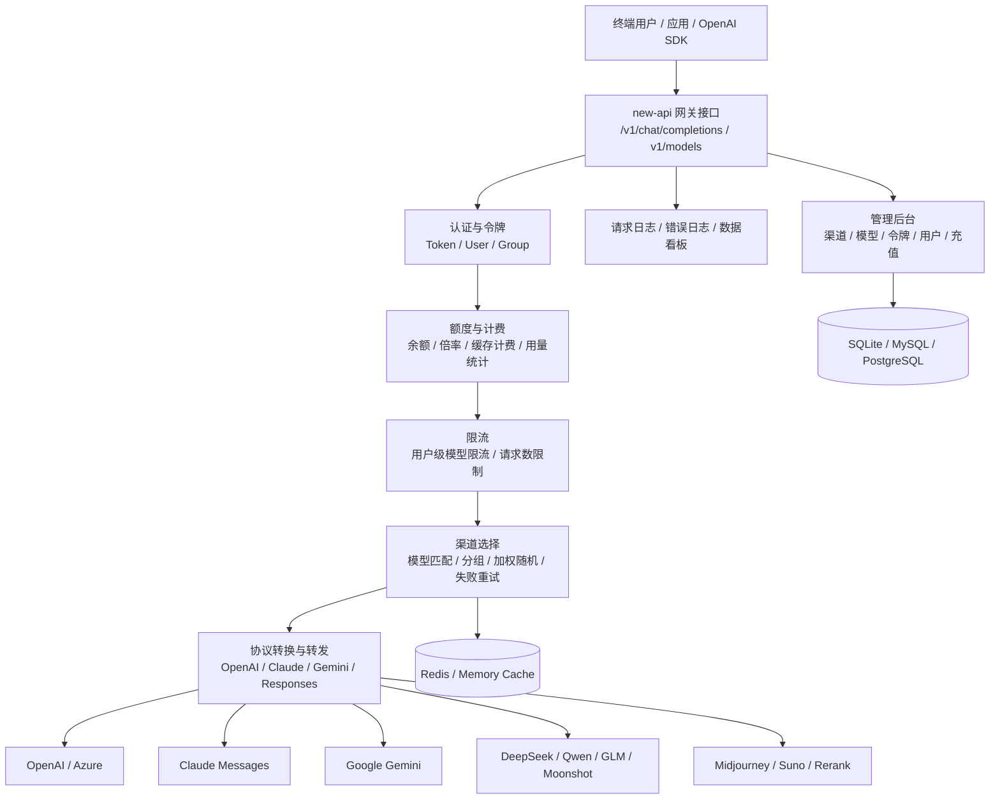
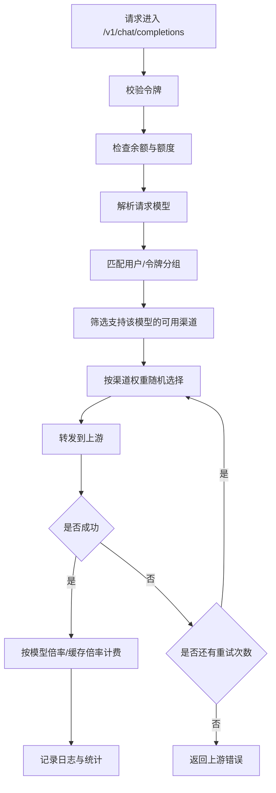

# 竞品分析：new-api

**更新日期：** 2026年05月21日  
**信息来源：** GitHub 仓库、官方文档、用户实测记录、社区部署实践  
**竞争优先级：** 高（国内开源大模型网关与 AI 资产管理系统，One API 同源演进）  
**参考地址：**

1. GitHub：[QuantumNous/new-api](https://github.com/QuantumNous/new-api)
2. 中文 README：[README.zh_CN](https://github.com/QuantumNous/new-api/blob/main/README.zh_CN.md)
3. 官方文档：[New API Docs](https://docs.newapi.pro/zh/docs)
4. 特性说明：[特性说明](https://docs.newapi.pro/zh/docs/guide/wiki/basic-concepts/features-introduction)
5. API 文档：[网关接口](https://docs.newapi.pro/zh/docs/api)
6. 部署文档：[安装部署](https://docs.newapi.pro/zh/docs/installation)

> 用户调研记录中 new-api GitHub Star 约 27.2k；本次核实时 GitHub 页面显示约 34.5k。Star 数增长较快，对外汇报前建议以 GitHub 实时数据复核。

---

## 1. 结论摘要

new-api 是基于 One API 演进而来的开源大模型网关与 AI 资产管理系统，核心价值是把 OpenAI、Claude、Gemini、DeepSeek、通义、Midjourney、Suno、Rerank、自定义上游等不同模型和接口统一纳入一个自部署控制台，并提供渠道管理、令牌管理、额度/余额、模型倍率、计费、充值、请求日志、数据看板、用户管理、渠道加权随机、失败重试和多格式协议转换。

与旧版“轻量 API 网关”的判断相比，new-api 的产品化程度需要上调。它不只是基础转发工具，而是更接近“面向个人站长、小团队、企业内部的模型转发运营平台”。它在国内开源社区中的影响力明显，Star 数高、部署门槛低、UI 完整、计费与渠道能力贴近 API 分发/转售/内部额度管理场景。

不过，new-api 的核心仍然是“渠道聚合 + 令牌/额度 + 计费运营 + OpenAI 兼容转发”。它有渠道加权随机和失败重试，但缺少 LiteLLM/Bifrost 那种更工程化的多维动态路由、SLA 路由、可解释 fallback、语义缓存、企业级多租户治理和深度可观测性。因此它对 MaaS 平台的威胁主要在“低成本自建 API 分发平台”和“国内开发者/小团队市场”，不是完整企业 MaaS 的直接替代。

---

## 2. 产品概况

| 项目 | 内容 |
| --- | --- |
| 产品名称 | new-api |
| 所属社区/组织 | QuantumNous / Calcium-Ion 社区演进项目 |
| 产品定位 | 新一代大模型网关与 AI 资产管理系统 |
| 项目来源 | 基于 One API 二次开发，兼容原 One API 数据库 |
| 开源协议 | AGPLv3，且 UI 展示类修改需保留项目归属和原项目链接 |
| 技术栈 | Go 为主，Web 管理界面，Docker 化部署 |
| 部署形态 | 自托管 / Docker Compose / Docker / 宝塔 / 多机部署 |
| 目标用户 | 个人开发者、小团队、API 分发站点、企业内部模型管理团队、私有化网关使用者 |
| 典型场景 | 多渠道聚合、OpenAI 兼容转发、令牌分发、额度管理、模型倍率计费、渠道监控、内部成本核算 |
| 竞争类型 | 国内开源 AI Gateway / API 分发运营平台 / One API 替代品 |

官方 README 将其描述为“A unified AI model hub for aggregation & distribution”和“新一代大模型网关与 AI 资产管理系统”。这个定位比单纯 API Proxy 更宽，尤其强调 AI 资产管理、组织内部鉴权、用量统计、成本核算和私有化部署。

---

## 3. 产品定位与典型场景

| 场景 | new-api 解决的问题 | 价值 |
| --- | --- | --- |
| 多模型统一入口 | 不同模型厂商协议、Key、接口和价格不一致 | 通过统一网关转发，业务侧使用 OpenAI 兼容接口 |
| 渠道聚合 | 同一个模型可能配置多个渠道或上游地址 | 通过渠道管理、模型映射和加权随机分发流量 |
| API Key 分发 | 多用户共用上游 Key 不便管理 | 通过令牌生成、额度、模型限制和分组控制访问 |
| 内部计费 | 组织内部或授权客户需要消耗统计 | 支持余额、倍率、额度、用量日志和充值集成 |
| API 分发站点 | 站长需要快速搭建 API 中转与售卖平台 | 提供登录、充值、兑换码、令牌、日志和控制台 |
| 协议适配 | Claude、Gemini、Responses 等接口与 OpenAI 不一致 | 支持多种 API 格式和部分格式转换 |
| 轻量私有化 | 企业内部想快速搭建统一模型入口 | Docker Compose 部署，SQLite 开箱即用，也可接 MySQL/PostgreSQL |
| 国内模型接入 | 需要统一管理通义、DeepSeek、智谱、月之暗面等 | 通过渠道和自定义上游接入国内 OpenAI-compatible 服务 |

new-api 的优势在于“把模型转发、用户系统、令牌、额度和运营后台打包好了”。对技术能力有限但希望快速运营模型 API 的团队，它比从零开发控制台更有吸引力。

---

## 4. 技术架构



| 层级 | 说明 |
| --- | --- |
| API 接入层 | 对外暴露 OpenAI-compatible、Claude、Gemini、Rerank、Realtime、Responses 等接口 |
| 认证层 | 用户登录、令牌鉴权、分组、模型调用限制 |
| 额度计费层 | 余额、请求消耗、模型倍率、补全倍率、缓存倍率、充值与兑换 |
| 渠道路由层 | 根据模型、分组、渠道状态和权重选择上游渠道，失败后按配置重试 |
| 协议转换层 | 支持 OpenAI 与 Claude Messages、Gemini、Responses 等协议间部分转换 |
| 运营后台 | 管理渠道、令牌、模型、用户、系统设置、运营设置和数据看板 |
| 存储层 | 单机可用 SQLite，生产建议使用 MySQL/PostgreSQL；多机需 Redis 和关键 Secret |
| 缓存层 | Redis 或内存缓存，用于运行缓存和多机状态共享；不等同于语义缓存 |

---

## 5. 部署与运行

new-api 的主流部署方式是 Docker Compose。官方推荐克隆仓库后编辑 `docker-compose.yml`，再启动服务。

```bash
git clone https://github.com/QuantumNous/new-api.git
cd new-api
nano docker-compose.yml
docker-compose up -d
```

部署完成后访问：

```text
http://localhost:3000
```

用户实测部署地址：

```text
http://101.43.45.218:3000/console/playground
```


### 5.1 部署依赖

| 项目 | 要求 |
| --- | --- |
| 本地数据库 | SQLite，Docker 部署需挂载 `/data` 目录 |
| 远程数据库 | MySQL 5.7.8+ 或 PostgreSQL 9.6+ |
| 容器环境 | Docker / Docker Compose |
| 缓存 | Redis 推荐，单机也可使用内存缓存 |
| 多机部署 | 必须设置 `SESSION_SECRET`；共享 Redis 时必须设置 `CRYPTO_SECRET` |

### 5.2 生产部署建议

| 事项 | 建议 |
| --- | --- |
| 数据库 | 生产环境使用 MySQL/PostgreSQL，不建议长期依赖容器内 SQLite |
| 持久化 | 挂载 `/data`，备份数据库、上传文件、日志和配置 |
| Redis | 多实例部署时使用 Redis，共享缓存和状态 |
| Secret | 设置 `SESSION_SECRET`、`CRYPTO_SECRET`，避免登录态和密文不一致 |
| 安全 | 禁止默认账号弱密码，开启 HTTPS，限制管理后台访问来源 |
| 合规 | 若对外运营 API 服务，需要自行处理备案、实名、内容安全、日志留存、税务、支付和上游授权义务 |
| 授权 | AGPLv3 对二次开发和网络服务发布有开源义务，企业商用需法务评估 |

---

## 6. 核心功能总览

| 分类 | 能力 | 成熟度 | 说明 |
| --- | --- | --- | --- |
| API 兼容 | OpenAI-compatible API | 高 | 支持常见 OpenAI SDK 改 base URL 接入 |
| 多协议 | Claude、Gemini、Responses、Realtime、Rerank | 中高 | 覆盖面广，但部分转换仍有能力边界 |
| 渠道管理 | 多上游渠道配置 | 高 | 可配置渠道、模型、Key、Base URL、分组和权重 |
| 路由 | 渠道加权随机 | 中 | 以权重随机和失败重试为主，不是多维智能路由 |
| 容灾 | 失败自动重试 | 中 | 可配置失败重试次数，缺少复杂熔断和可解释降级链路 |
| 令牌 | Token 生成、模型限制、额度限制 | 高 | 贴合 API 分发和内部授权场景 |
| 用户 | 用户管理、分组、登录注册 | 中高 | 支持多登录方式和用户后台 |
| 计费 | 余额、倍率、充值、兑换 | 高 | 比 LiteLLM/Bifrost 更贴近 API 售卖/运营 |
| 缓存计费 | prompt cache 命中倍率统计 | 中 | 支持 OpenAI、Azure、DeepSeek、Claude、Qwen 等缓存计费统计 |
| 限流 | 用户级模型限流 | 中 | 支持总请求数和成功请求数限制 |
| 数据看板 | Dashboard 与统计分析 | 中高 | 适合运营查看用量和渠道情况 |
| 日志 | 请求日志、错误日志 | 中 | 可查请求消耗和失败原因，深度可观测性弱于专业 APM |
| UI | Web 管理后台 | 高 | 对个人站长和内部团队友好 |
| 多语言 | 中文、英文、法语、日语等 | 中 | 官方标注仍在完善 |
| 合规提醒 | README/文档多次强调合法授权 | 高 | 对 API 分发类产品风险有明确提示 |

---

## 7. 渠道、模型与路由机制

### 7.1 渠道管理

渠道是 new-api 的核心资源。每个渠道通常对应一个上游模型服务或 OpenAI-compatible endpoint，包含上游 Key、Base URL、支持模型、分组、状态、权重、模型倍率等配置。

用户实测中的渠道配置页面：


配置模型：


模型和计费设置：


测试控制台：


### 7.2 路由策略

new-api 官方特性中明确提到“渠道加权随机”和“失败自动重试”。这意味着它的路由主要是渠道层选择，而不是像 LiteLLM/Bifrost/OpenRouter 那样提供丰富的策略对象。

| 路由能力 | new-api 表现 | 说明 |
| --- | --- | --- |
| 模型匹配 | 支持 | 请求模型必须匹配某个渠道支持模型或映射模型 |
| 分组匹配 | 支持 | 用户/令牌分组可控制可用渠道范围 |
| 权重随机 | 支持 | 多个可用渠道按权重随机分配 |
| 失败重试 | 支持 | 设置中可配置失败重试次数 |
| Provider 级 only/ignore | 不突出 | 通常通过渠道启停、分组和模型配置间接实现 |
| 按延迟/吞吐路由 | 未见明确成熟能力 | 可能有性能指标统计，但非核心路由策略 |
| 成本优先路由 | 未见明确成熟能力 | 可通过倍率和权重人工配置近似实现 |
| SLA 路由 | 不突出 | 缺少面向 SLA 的自动策略和解释 |
| 自动 fallback 链 | 基础 | 更像失败后换渠道重试，不是显式多模型降级编排 |

### 7.3 路由决策链路



---

## 8. 令牌、用户与权限管理

new-api 的令牌体系非常贴合 API 分发和内部授权场景。管理员可以给用户创建令牌，并限制该令牌的模型、额度、分组和可用范围。

| 能力 | 说明 |
| --- | --- |
| 令牌生成 | 为用户或应用生成独立 API Key |
| 模型限制 | 可设置令牌能调用的模型 |
| 分组控制 | 通过用户组或令牌分组控制可用渠道与价格策略 |
| 额度控制 | 控制用户或令牌可用余额、消耗额度 |
| 使用查询 | 配合 new-api-key-tool 可查询 Key 使用额度 |
| 用户管理 | 支持普通用户和管理员后台 |
| 登录方式 | 支持账号密码、OIDC、Telegram、Discord、LinuxDO 等登录方式 |

这套能力对 MaaS 有直接参考价值：它把“API Key 分发 + 模型权限 + 额度”做成了站长/管理员易理解的后台配置，而不是只提供底层配置文件。

---

## 9. 计费、余额与成本核算

new-api 相比 LiteLLM/Bifrost 的一个突出特点是更偏“运营计费”。它面向合法授权场景下的内部充值、额度分配、企业客户账务管理和成本核算。

### 9.1 计费模型

| 配置项 | 作用 |
| --- | --- |
| 模型倍率 | 控制不同模型的消耗倍率 |
| 补全倍率 | 区分输入和输出 token 成本 |
| 分组倍率 | 不同用户组可配置不同价格或消耗策略 |
| 渠道倍率 | 不同上游渠道成本不同，可通过渠道配置体现 |
| 提示缓存倍率 | 缓存命中时按设定比例计费，范围通常为 0-1 |
| 余额/额度 | 用户或令牌消耗时扣减 |
| 充值/兑换 | 支持易支付、Stripe 等授权场景下的充值或内部额度分配 |

### 9.2 缓存计费

官方特性中明确提到缓存计费支持：开启后可在缓存命中时按照设定比例计费。支持渠道包括 OpenAI、Azure、DeepSeek、Claude、Qwen 等。

需要注意：这里的“缓存计费”主要是对上游 provider prompt caching 的计费统计和倍率处理，不等于 Bifrost 那种自带 semantic cache，也不等于 MaaS 自研语义缓存。

### 9.3 MaaS 视角

new-api 的计费能力很接地气，特别适合小型 API 分发站点。但企业 MaaS 仍需补齐：

1. 部门、项目、成本中心分摊。
2. 预算审批和超预算流程。
3. 合同、发票、对账和财务系统集成。
4. SLA 违约统计和服务质量报表。
5. 合规审计与数据留存。

---

## 10. 容灾、重试与降级

new-api 支持失败自动重试，并可在系统设置中配置失败重试次数。README 中也提到“渠道重试与缓存”。

### 10.1 已具备能力

| 能力 | 说明 |
| --- | --- |
| 失败重试次数 | 在运营设置中配置失败后重试次数 |
| 多渠道重试 | 当一个渠道失败时，可尝试其他符合条件的渠道 |
| 渠道权重 | 通过权重影响正常流量分配 |
| 渠道启停 | 管理员可手动禁用异常渠道 |
| 错误日志 | 可记录上游错误，便于排查 |

### 10.2 能力边界

| 能力 | new-api 当前边界 |
| --- | --- |
| 熔断 | 未看到类似错误率阈值、冷却时间、自动恢复的完整熔断策略说明 |
| 多维路由 | 缺少按延迟、吞吐、价格、健康度动态打分的成熟策略 |
| 显式 fallback 链 | 缺少请求级 `fallbacks` 或策略级降级链编排 |
| Key rotation | 多 Key 可通过多个渠道配置实现，但不是 Bifrost 那种明确的 429 换 Key 机制 |
| 可解释降级 | 返回和日志中可能有错误，但缺少完整“为什么选择/为什么降级”的解释链路 |
| SLA 告警 | 需要外部监控或二次开发补齐 |

### 10.3 用户实测：上游限流错误

用户通过本地 new-api 调用 OpenRouter Free Router 时，遇到上游 provider 限流：

```bash
curl -X POST "http://localhost:3000/v1/chat/completions" \
  -H "Authorization: Bearer sk-xxx" \
  -H "Content-Type: application/json" \
  -d '{
    "model": "openrouter/free",
    "messages": [
      {
        "role": "system",
        "content": "Hello"
      }
    ]
  }'
```


返回错误显示上游 OpenRouter 选择的 provider 被限流：

```json
{
  "error": {
    "message": "Provider returned error (...) is temporarily rate-limited upstream.",
    "type": "upstream_error",
    "code": 429,
    "metadata": {
      "provider_name": "Venice",
      "is_byok": false
    }
  }
}
```

这说明 new-api 能把上游错误透传出来，但如果只配置了一个渠道或上游本身的免费模型池限流，new-api 无法凭空保证可用性。生产环境需要配置多个稳定渠道、合理权重和失败重试，并对 429/5xx 做监控。

---

## 11. 支持接口与协议转换

new-api 的接口覆盖面较广，官方 README 中列出多种模型接口和格式转换能力。

| 类型 | 支持情况 | 说明 |
| --- | --- | --- |
| OpenAI-compatible | 支持 | 常规 chat/completions、models 等接口 |
| OpenAI Responses | 支持 | OpenAI Responses API；部分 OpenAI Compatible 与 Responses 互转仍在开发中 |
| OpenAI Realtime | 支持 | 包含 Azure 渠道 |
| Claude Messages | 支持 | 可直接支持 Claude Messages 格式 |
| Google Gemini | 支持 | 支持 Gemini 格式；Gemini 转 OpenAI 当前仅文本，函数调用未完全支持 |
| Rerank | 支持 | 兼容 Cohere、Jina，可接入 Dify |
| Midjourney-Proxy | 支持 | 依赖第三方 Midjourney-Proxy 项目和上游授权 |
| Suno API | 支持 | 音乐生成类 API 接入能力 |
| Dify | 支持 | ChatFlow 模式 |
| 自定义上游 | 支持 | 可配置合法授权的自定义上游 endpoint |

### 11.1 Models 接口实测

```bash
curl -X GET "http://localhost:3000/v1/models" \
  -H "Authorization: Bearer sk-xxx"
```


返回示例：

```json
{
  "data": [
    {
      "id": "openrouter/free",
      "object": "model",
      "created": 1626777600,
      "owned_by": "custom",
      "supported_endpoint_types": ["openai"]
    }
  ],
  "object": "list",
  "success": true
}
```

---

## 12. Reasoning、思考模型与参数处理

new-api 对 reasoning 模型做了较多适配。官方特性中提到：

1. OpenAI o 系列模型可通过模型名称后缀设置 reasoning effort，例如 `o3-mini-high`、`o3-mini-medium`、`o3-mini-low`。
2. Claude 思考模型可通过 `-thinking` 后缀启用思考模式。
3. 支持“思考转内容”，可在渠道额外设置中配置 `thinking_to_content`，将 `reasoning_content` 转换为 `<think>` 标签拼接到内容中返回。

这类能力对国内开发者很实用，因为许多客户端对 reasoning 字段支持不一致，通过模型后缀和内容转换可以降低接入复杂度。

---

## 13. 数据看板、日志与可观测性

new-api 提供数据看板、请求日志、用量统计和错误日志，足以覆盖 API 分发站点的基础运营需求。

| 能力 | 说明 |
| --- | --- |
| 数据看板 | 查看总体调用、消耗、用户、渠道等统计信息 |
| 请求日志 | 记录请求模型、用户、令牌、消耗、状态等 |
| 错误日志 | 记录上游失败和转发错误 |
| 渠道状态 | 管理员可观察渠道是否可用，手动调整 |
| 成本统计 | 结合模型倍率、分组和缓存倍率进行内部成本核算 |
| 性能指标 | 仓库近期有模型性能指标相关提交，但作为产品能力仍需实测确认 |

与 Bifrost 的 built-in observability 或 Helicone 的专业观测能力相比，new-api 更偏运营后台日志，不是完整 APM/Tracing 产品。它适合站长和管理员排查常见问题，但对企业 SLA、链路追踪、fallback 解释、延迟分位数分析、告警闭环仍需外部系统补齐。

---

## 14. 安全、合规与授权风险

new-api 官方文档和 README 多次强调“合法授权”和“合规义务”。这非常关键，因为 new-api 常被用于 API 分发、转售或公开服务场景。

### 14.1 安全能力

| 能力 | 说明 |
| --- | --- |
| 用户登录 | 支持本地账号和多种第三方登录方式 |
| OIDC | 支持统一身份认证 |
| Token 管理 | 独立令牌、额度和模型限制 |
| 分组 | 用于区分用户、模型、渠道和价格策略 |
| HTTPS | 需由部署方通过反向代理或网关配置 |
| 后台权限 | 提供管理员后台，但企业级 RBAC 深度需核实 |

### 14.2 合规风险

| 风险 | 说明 |
| --- | --- |
| AGPLv3 | 企业二开和网络服务发布可能触发开源义务，需法务评估 |
| UI 归属保留 | 修改 UI 时需保留作者归属和原项目链接等要求 |
| 上游授权 | 必须合法获取上游 API Key、账号、模型服务和接口权限 |
| 公开运营 | 若对公众提供生成式 AI 服务，需要备案、内容安全、实名、日志留存、税务、支付等 |
| 支付合规 | 使用易支付、Stripe 等需符合当地支付和税务要求 |
| 内容安全 | new-api 本身不是完整内容安全审查平台，需要外部风控或上游审核补齐 |
| 数据安全 | 部署方需自行保障数据库、日志、Key 加密和访问控制 |

对 MaaS 平台而言，这些风险也是销售机会：企业客户往往不希望自己承担开源许可证、上游授权、备案、内容安全和运营合规的全部责任。

---

## 15. 与 One API 的关系

new-api 是基于 One API 的二次开发项目，官方 README 明确提到兼容原 One API 数据库。这意味着它承接了 One API 在国内 API 分发场景中的使用习惯，同时增加了更现代的 UI、更广的接口支持、更多登录方式、缓存计费、reasoning 适配、Responses/Reatime/Gemini/Claude 等能力。

| 维度 | One API | new-api | 判断 |
| --- | --- | --- | --- |
| 项目活跃度 | 原项目影响力大，但演进相对慢 | 社区活跃，Release 和提交频繁 | new-api 更活跃 |
| UI | 较传统 | 新 UI，现代化程度更高 | new-api 更强 |
| 数据兼容 | 原始数据库 | 兼容 One API 数据库 | 迁移友好 |
| 接口覆盖 | OpenAI 转发为主 | OpenAI、Claude、Gemini、Responses、Realtime、Rerank 等 | new-api 更广 |
| 计费运营 | 基础能力 | 充值、成本核算、缓存计费更突出 | new-api 更贴近运营 |
| 路由 | 基础渠道选择 | 加权随机、失败重试 | new-api 有增强，但仍偏基础 |

---

## 16. 与 LiteLLM / Bifrost / OpenRouter 对比

| 维度 | new-api | LiteLLM | Bifrost | OpenRouter | 判断 |
| --- | --- | --- | --- | --- | --- |
| 产品形态 | 自部署网关 + 运营后台 | 开源 LLM Proxy / Router | 高性能 AI Gateway | 托管模型聚合平台 | new-api 更偏运营分发 |
| 开源协议 | AGPLv3 | 以仓库为准 | Apache-2.0 | SaaS 非自部署 | new-api 商用开源义务更重 |
| 接入门槛 | Docker 快速部署 | Docker/Python/K8s | NPX/Docker/Go | 注册即用 | OpenRouter 最低，new-api 自部署较低 |
| 渠道管理 | 强 | 强 | 强 | 平台托管 | new-api UI 运营友好 |
| 路由策略 | 加权随机、失败重试 | 多策略 router、fallback、cooldown | weighted LB、fallback、key rotation | price/latency/throughput/provider policy | new-api 路由深度较弱 |
| 计费充值 | 强 | 成本追踪强，充值弱 | 预算治理强，充值弱 | credits/usage | new-api 更适合 API 分发站点 |
| 企业治理 | 中 | 中高 | 中高 | 中 | MaaS 仍有空间 |
| 可观测性 | 基础运营日志 | callbacks 和外部集成 | 内置日志/trace | generation usage/activity | new-api 不适合深度 tracing |
| 缓存 | 缓存计费，Redis/内存缓存 | 可配置缓存 | semantic cache | prompt caching 整合 | new-api 不是语义缓存产品 |
| 国内生态 | 强 | 中 | 中 | 中低 | new-api 国内站长/开发者影响力强 |
| 私有化 | 强 | 强 | 强 | 弱 | new-api 私有化便利 |

---

## 17. 与 MaaS 平台对比

| 对比维度 | MaaS 平台 | new-api | 胜出方 |
| --- | --- | --- | --- |
| OpenAI 兼容 API | 支持 | 支持 | 持平 |
| 多渠道聚合 | 支持 | 支持 | 持平 |
| 国内模型接入 | 支持 | 支持 | 持平 |
| 部署简单 | 中 | 高 | new-api |
| 运营后台 | 企业级控制台 | 站长/管理员后台 | 各有侧重 |
| 计费充值 | 预算、账单、分摊、发票、对账 | 余额、倍率、充值、兑换 | MaaS 更企业，new-api 更轻量 |
| 路由策略 | 多维评分、SLA、成本、健康度 | 加权随机、失败重试 | MaaS |
| 容灾降级 | 熔断、fallback、告警、SLA | 基础失败重试 | MaaS |
| 语义缓存 | 可自研和运营化 | 不突出，仅缓存计费 | MaaS |
| 企业 RBAC | 租户、项目、部门、角色 | 用户、分组、令牌 | MaaS |
| 审批流 | 模型申请、Key 申请、预算审批 | 不突出 | MaaS |
| 合规材料 | 等保、审计、内容安全、私有化交付 | 部署方自行承担 | MaaS |
| 开源可控 | 可选 | AGPLv3 开源 | new-api 在代码可得性上强，但许可约束重 |
| 成本 | 商业平台成本较高 | 自建成本低 | new-api |

---

## 18. 优势分析

| 维度 | 优势 |
| --- | --- |
| 国内社区影响力强 | Star 高、使用者多、One API 迁移心智强 |
| 部署简单 | Docker Compose 即可启动，SQLite 开箱即用 |
| UI 完整 | 渠道、模型、令牌、用户、计费、看板都可在后台配置 |
| 计费运营贴近实际 | 余额、倍率、充值、兑换、缓存计费很适合 API 分发和内部额度管理 |
| 接口覆盖广 | OpenAI、Claude、Gemini、Responses、Realtime、Rerank、Midjourney、Suno 等 |
| 国内模型友好 | 可通过 OpenAI-compatible、自定义上游和渠道配置接入国内模型 |
| One API 兼容 | 兼容原 One API 数据库，降低迁移成本 |
| Reasoning 适配 | 模型后缀、thinking_to_content 等能力解决客户端兼容问题 |
| 自部署可控 | 数据和 Key 可部署在自己的服务器上 |

---

## 19. 劣势与边界

| 维度 | 劣势 | 影响 |
| --- | --- | --- |
| AGPLv3 约束 | 网络服务和二开可能触发开源义务 | 企业商用和深度定制需谨慎 |
| 路由策略较基础 | 主要是加权随机和失败重试 | 难以满足复杂 SLA、成本、延迟最优场景 |
| 容灾机制不深 | 缺少完整熔断、冷却、fallback 解释和 key rotation 策略 | 大规模生产稳定性需要二开或外部治理 |
| 观测深度有限 | 偏日志和看板，不是完整 tracing/APM | 故障定位和 SLA 分析能力不足 |
| 企业治理不足 | 用户/分组/令牌有，但组织、项目、审批、RBAC 复杂度有限 | 大企业内部平台仍需扩展 |
| 内容安全需补齐 | 本身不是完整合规审核平台 | 对外服务需额外接入审核、风控和日志留存 |
| 运维责任在用户 | 数据库、Redis、备份、安全、上游 Key 都需自行维护 | 小团队后期运维压力可能上升 |
| 与 API 转售场景绑定强 | 产品能力很贴近站长运营 | 企业客户可能担心灰色转售心智影响合规形象 |

---

## 20. 对 MaaS 平台的产品启示

### 20.1 必须对齐的能力

1. 渠道管理 UI：供应商、Base URL、Key、模型、分组、权重、状态一站式配置。
2. 令牌管理：Key 级模型限制、额度限制、分组和状态管理。
3. 模型倍率：输入、输出、缓存命中、分组倍率等灵活计费参数。
4. 数据看板：总请求、成功率、消耗、用户、渠道、模型维度统计。
5. 请求日志：完整记录请求模型、实际渠道、错误、消耗、延迟和用户信息。
6. 失败重试：多渠道失败自动切换，并记录降级原因。
7. Reasoning 适配：统一 reasoning 字段、thinking 内容和客户端兼容模式。
8. 多协议：OpenAI、Claude、Gemini、Responses、Realtime、Rerank 等接口兼容。
9. 低成本部署：给中小客户提供轻量私有化版本。
10. 合规提示：在产品内明确上游授权、内容安全、日志留存和对外运营边界。

### 20.2 差异化方向

| 方向 | MaaS 可强化点 |
| --- | --- |
| 企业治理 | 租户、部门、项目、角色、审批流和权限继承 |
| 路由专业度 | 成本、延迟、可用性、区域、SLA、合规策略的多维动态路由 |
| 容灾体系 | 熔断、冷却、fallback 链、key rotation、告警和可解释链路 |
| 语义缓存 | FAQ/RAG 场景语义缓存、命中解释、节省金额和缓存治理 |
| 合规交付 | 等保、审计、内容安全、敏感信息脱敏、数据不出域 |
| 财务闭环 | 合同、套餐、发票、对账、成本中心、预算审批 |
| 供应商管理 | 统一采购、议价、供应商 SLA、国产模型适配认证 |
| 专业运维 | 性能压测、容量规划、灰度发布、灾备演练、Runbook |

---

## 21. 销售应对策略

### 21.1 客户说“new-api 开源自建就够了”时

建议话术：

> new-api 是非常成熟的开源网关和 API 分发后台，适合快速搭建统一入口、令牌和计费系统。但它解决的重点是“能快速转发和运营 API”，企业正式使用大模型时还需要组织权限、审批流、预算分摊、SLA、合规审计、内容安全、供应商授权和可解释路由。MaaS 平台的价值是把这些能力变成可交付、可运维、可审计的企业平台，而不是只提供一个转发后台。

### 21.2 适合承认 new-api 强的场景

1. 客户是个人开发者、小团队或站长。
2. 客户需要快速搭建 API 分发或内部中转服务。
3. 客户预算有限，愿意自行运维开源项目。
4. 客户需求集中在令牌、余额、模型倍率、渠道管理和简单转发。
5. 客户已有技术人员能处理数据库、Redis、安全和上游渠道问题。

### 21.3 MaaS 更适合的场景

1. 客户是大中型企业，需要组织、项目、审批和合规。
2. 客户不能接受 AGPLv3 二开和网络服务开源义务风险。
3. 客户需要供应商 SLA、正式合同、发票和对账。
4. 客户需要稳定生产，而不仅是“能跑起来”。
5. 客户需要深度路由、语义缓存、可观测性、告警和容灾治理。
6. 客户需要内容安全、审计留痕、实名、日志留存等合规交付。

---

## 22. 风险与核实清单

| 核实项 | 当前判断 | 后续动作 |
| --- | --- | --- |
| Star 数 | 用户记录约 27.2k，本次页面约 34.5k | 汇报前复核 GitHub 实时数据 |
| 开源协议 | AGPLv3，且有 UI 归属保留要求 | 企业商用前法务评估 |
| 路由机制 | 渠道加权随机、失败自动重试 | 实测失败重试、禁用渠道、权重分配行为 |
| 缓存能力 | 支持缓存计费和 Redis/内存缓存 | 区分运行缓存、上游 prompt cache 计费和语义缓存 |
| 多机部署 | 需要 `SESSION_SECRET`、`CRYPTO_SECRET`、Redis 等 | 做高可用部署验证 |
| 数据库 | SQLite/MySQL/PostgreSQL | 生产压测 MySQL/PostgreSQL 表规模和日志增长 |
| 支持接口 | OpenAI、Claude、Gemini、Responses、Realtime、Rerank 等 | 按目标模型逐接口验收 |
| Reasoning 适配 | 支持后缀和 thinking_to_content | 验证不同客户端兼容性 |
| 支付/充值 | 支持易支付、Stripe 等 | 核实支付合规、税务和业务资质 |
| 内容安全 | 项目提示由部署方承担 | 需要额外审核、敏感词、风控和日志留存方案 |
| 企业 RBAC | 用户/分组/令牌为主 | 核实是否满足部门、项目、角色和审批需求 |

---

## 23. 总结

new-api 是国内开源大模型网关与 API 分发后台中的重要竞品。它的优势不是深度智能路由，而是把“渠道管理、OpenAI 兼容、令牌、额度、倍率、充值、日志、看板和多接口适配”做成了可以快速部署的完整后台。对个人开发者、小团队、API 分发站点和轻量内部网关，它的吸引力很强。

对 MaaS 平台来说，new-api 是“低成本自建”和“国内开源运营后台”的代表。MaaS 需要对齐其易用的渠道/令牌/计费后台体验，同时在企业治理、合规交付、路由专业度、容灾可观测、语义缓存、预算审批、账单财务和供应商 SLA 上形成明显差异。换句话说，new-api 解决“快速搭一个能运营的 API 网关”，MaaS 要解决“企业长期、合规、可靠、可审计地运营 AI 能力”。
