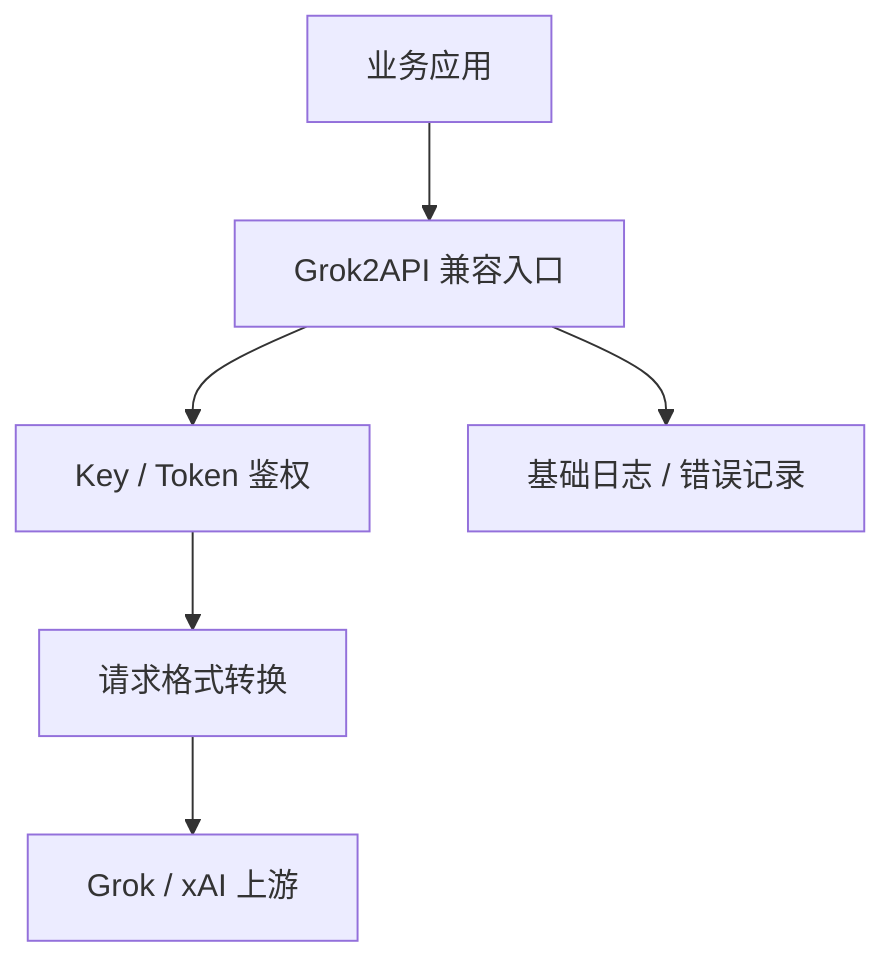

# 竞品分析：Grok2API

**更新日期：** 2026年05月21日  
**产品类型：** Grok/xAI API 中转或兼容代理工具（资料有限）  
**竞争优先级：** 低到中（垂直模型代理，非完整 MaaS）  
**信息边界：** 公开资料有限，本文按“Grok 模型 API 代理/中转服务”类别保守分析，具体能力需以实际项目文档和部署包核实。

---

## 1. 结论摘要

Grok2API 更适合作为“特定模型 API 转发/兼容代理”来分析，而不是成熟企业级模型网关。它的核心价值通常是把 Grok/xAI 相关能力封装成开发者更容易调用的 API，可能提供 OpenAI-compatible 入口、Key 转发、简单鉴权和基础日志。

这类工具对 MaaS 的威胁有限，但会在单模型尝鲜、个人开发者、低成本接入和非正式集成场景中抢占心智。它通常缺少多供应商路由、企业预算、审计、合规、可观测、容灾和正式 SLA。

---

## 2. 产品概况

| 项目 | 内容 |
| --- | --- |
| 产品名称 | Grok2API |
| 产品形态 | Grok/xAI API 中转、代理或兼容封装 |
| 目标用户 | 个人开发者、小团队、需要快速接入 Grok 能力的项目 |
| 核心能力 | API 转发、模型兼容、Key 管理、简单调用封装 |
| 部署方式 | 可能为自托管脚本、开源服务或第三方 SaaS，需核实 |
| 核实状态 | 资料有限，不能默认具备企业能力 |

---

## 3. 技术架构

---

## 4. 路由与容灾分析

| 能力 | 可能表现 | 风险 |
| --- | --- | --- |
| 模型路由 | 通常只面向 Grok 单模型或少量模型 | 不具备多供应商策略 |
| fallback | 可能没有，或仅简单重试 | 上游异常时不可用 |
| 限流 | 可能做基础限流 | 不能替代企业配额体系 |
| 监控 | 基础请求日志 | 缺少成本、质量和 SLA 视图 |
| 成本控制 | 依赖上游价格或代理价格 | 缺少组织级分账 |
| 合规 | 不明确 | 数据留存和代理链路需审计 |

---

## 5. 与 MaaS 平台对比

| 维度 | Grok2API | MaaS |
| --- | --- | --- |
| 覆盖范围 | Grok/xAI 单一方向 | 多供应商、多模型、自建模型 |
| 接入门槛 | 低 | 中等，面向生产治理 |
| 路由策略 | 弱 | 成本、延迟、质量、SLA、合规策略 |
| 容灾 | 基础或缺失 | fallback、熔断、重试、灰度 |
| 企业治理 | 基本缺失 | 租户、预算、审批、审计 |
| 适用场景 | 快速尝鲜、轻量代理 | 企业生产模型运营 |

---

## 6. 优势、劣势与应对

| 优势 | 说明 |
| --- | --- |
| 简单直接 | 围绕 Grok 接入，学习成本低 |
| 开发者友好 | 可能兼容 OpenAI SDK，便于试用 |
| 垂直聚焦 | 对只需要 Grok 的项目足够轻 |

| 劣势 | 说明 |
| --- | --- |
| 资料有限 | 项目稳定性和维护状态需核实 |
| 企业能力弱 | 没有完整治理、审计和合规体系 |
| 上游依赖强 | Grok/xAI 上游变化会直接影响可用性 |
| 路由能力弱 | 不解决多模型选择和容灾 |

销售应对：无需与 Grok2API 正面争夺平台定位。客户若只想试 Grok，可承认其轻量价值；若进入生产，应引导到 MaaS 的统一治理、审计、fallback 和成本控制。

---

## 7. 总结

Grok2API 是典型垂直模型代理类竞品，价值在低门槛接入，短板在企业治理和多供应商路由。MaaS 应将其视为边缘竞争者，而不是核心平台竞品。
