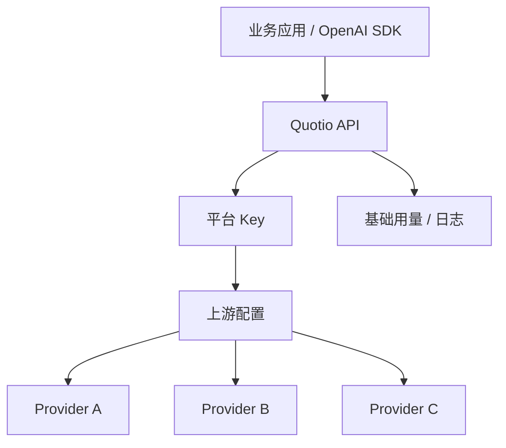

# 竞品分析：Quotio

**更新日期：** 2026年05月21日  
**产品类型：** 轻量 OpenAI-compatible API 中转/聚合工具（资料有限）  
**竞争优先级：** 低到中  
**信息边界：** 公开资料不足以确认其完整产品能力，本文按轻量 API 中转/聚合工具类别保守分析。

---

## 1. 结论摘要

Quotio 更像轻量 API 中转或模型聚合工具，核心价值可能是统一 API Base、管理多个上游 Key、对外提供 OpenAI-compatible 接口，并简化个人开发者或小团队接入模型的成本。公开资料有限，暂不能确认其是否具备成熟路由、计费、企业治理、合规审计和高可用 SLA。

这类工具对 MaaS 的挑战来自“上手快”和“够便宜够简单”，但不适合承担企业生产环境的统一模型控制面。MaaS 应在销售和产品叙事中明确区分：Quotio 解决调用便利性，MaaS 解决企业运营治理。

---

## 2. 产品概况

| 项目 | 内容 |
| --- | --- |
| 产品名称 | Quotio |
| 产品形态 | API 中转 / 聚合 / OpenAI 兼容代理，需核实 |
| 目标用户 | 个人开发者、小团队、轻量应用 |
| 典型场景 | 统一 API Base、隐藏上游 Key、快速切换模型、降低接入成本 |
| 核心竞争点 | 简单、低门槛、可能支持多模型聚合 |
| 核实状态 | 资料有限，企业能力待确认 |

---

## 3. 技术架构

---

## 4. 路由策略与容灾

| 能力 | 可能表现 | 待核实问题 |
| --- | --- | --- |
| 模型映射 | 将统一模型名映射到上游模型 | 是否支持版本化和灰度 |
| 优先级路由 | 可能支持主备上游 | 是否有健康检查和熔断 |
| 成本路由 | 可能按价格选择 | 是否维护准确价格表 |
| fallback | 可能简单重试或切换 | 是否按错误类型区分 |
| 监控日志 | 基础请求记录 | 是否有成本、质量、延迟分析 |
| 配额限流 | 可能有简单限制 | 是否支持租户/项目级规则 |

---

## 5. 与 MaaS 平台对比

| 维度 | Quotio | MaaS |
| --- | --- | --- |
| 定位 | 轻量 API 代理/聚合 | 企业模型运营平台 |
| 路由策略 | 基础或待核实 | 多维策略、可解释、可审计 |
| 容灾 | 简单 fallback 或无 | 熔断、重试、供应商级容灾 |
| 成本治理 | 简单用量 | 预算、分账、价格策略、缓存 |
| 企业权限 | 待核实 | RBAC、租户、应用、Key |
| 合规审计 | 待核实 | 请求审计、策略审计、数据留存控制 |

---

## 6. 优势、劣势与应对

| 优势 | 说明 |
| --- | --- |
| 上手快 | 适合个人开发者快速接入 |
| 心智简单 | 统一 API 和 Key 管理直观 |
| 成本可能较低 | 轻量工具通常价格压力小 |

| 劣势 | 说明 |
| --- | --- |
| 资料有限 | 难评估稳定性和可信度 |
| 企业治理弱 | 不适合复杂组织管理 |
| 风险不可见 | 数据流经代理服务时需关注隐私和合规 |
| 长期维护不确定 | 小型项目可能存在停更风险 |

销售应对：当客户拿 Quotio 对比时，先确认其使用目的。如果只是开发测试，MaaS 不必强争；如果是生产环境，应围绕审计、预算、SLA、容灾和私有化提出差异。

---

## 7. 总结

Quotio 类工具是轻量模型中转市场的一员，适合低门槛调用，不适合承担企业级 MaaS 职责。MaaS 需要在治理深度和生产可靠性上拉开差距。
