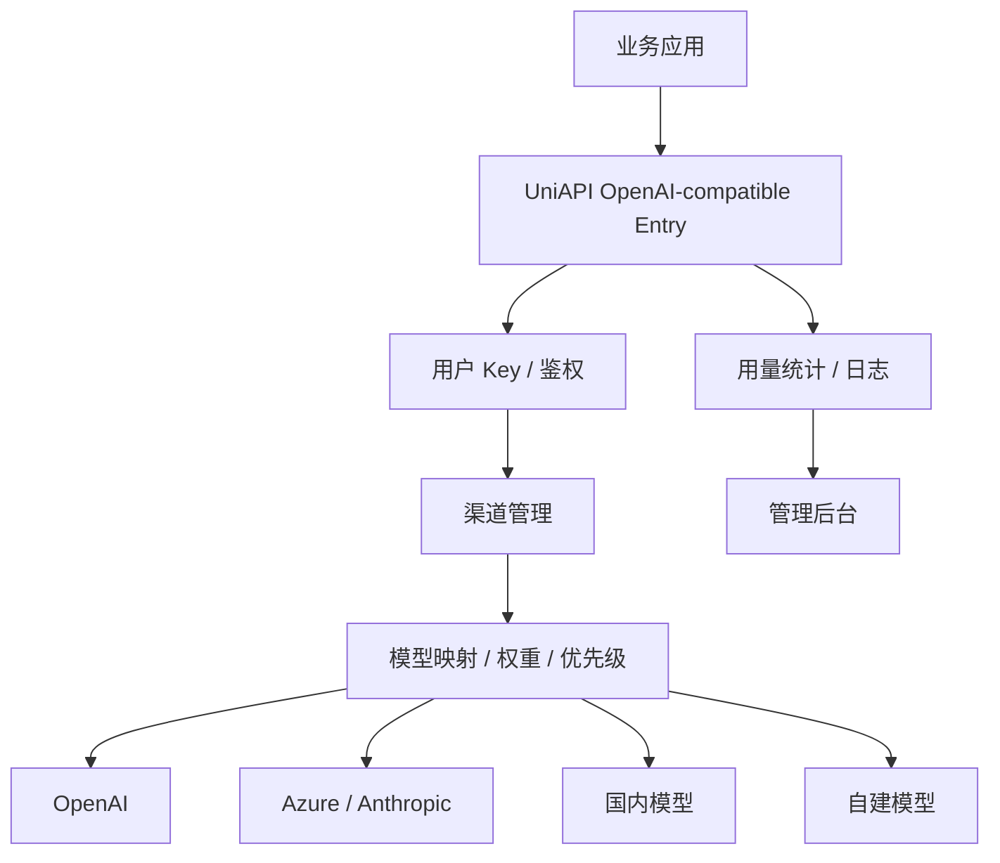

# 竞品分析：UniAPI

**更新日期：** 2026年05月21日  
**产品类型：** 通用 OpenAI-compatible API 聚合/代理平台（资料有限）  
**竞争优先级：** 中（与 One API/new-api/LiteLLM 同类心智局部重叠）  
**信息边界：** 本文按“通用模型 API 聚合代理”类别分析，具体能力需以项目仓库、文档和部署版本核实。

---

## 1. 结论摘要

UniAPI 从命名和旧稿定位看，更接近通用 API 聚合/代理平台：通过统一入口管理多个模型供应商、多个 API Key 和多种模型格式，对外提供 OpenAI-compatible 调用体验。它的核心竞争点是“统一”和“兼容”，与 One API、new-api、LiteLLM、Bifrost 在轻量网关层面存在重叠。

若 UniAPI 具备渠道管理、模型映射、优先级/fallback、用量统计和基础用户管理，它会对 MaaS 的基础网关能力构成局部竞争。但它通常难以覆盖企业级预算审批、跨部门分账、合规审计、策略可解释、语义缓存和供应商合同治理。

---

## 2. 产品概况

| 项目 | 内容 |
| --- | --- |
| 产品名称 | UniAPI |
| 产品形态 | 通用模型 API 聚合/代理平台 |
| 核心定位 | 多模型统一入口、OpenAI 兼容、渠道/Key 管理 |
| 目标用户 | 开发者、小团队、内部工具平台、需要统一多个上游的团队 |
| 同类竞品 | One API、new-api、LiteLLM、Bifrost、OpenAI Router |
| 核实状态 | 资料有限，需按具体项目确认 |

---

## 3. 技术架构

---

## 4. 核心能力推断

| 能力 | 可能表现 | 企业化缺口 |
| --- | --- | --- |
| OpenAI 兼容 | 对外统一接口 | 多协议适配需核实 |
| 渠道管理 | 多上游 Key/base URL | 缺少供应商合同治理 |
| 模型映射 | 统一模型名映射不同上游 | 质量差异难自动处理 |
| 优先级/权重 | 基础路由 | 策略解释和版本化不足 |
| fallback | 上游失败后切换 | 健康检查和熔断能力待核实 |
| 用量统计 | token/请求统计 | 企业预算、审批、分账不足 |
| 用户管理 | 基础用户/Key | RBAC 和租户模型可能较弱 |

---

## 5. 路由规则与容灾

| 规则 | 价值 | 风险 |
| --- | --- | --- |
| 固定渠道 | 稳定、易排查 | 单点故障 |
| 优先级渠道 | 主备切换 | 备用模型效果可能不一致 |
| 权重分流 | 容量分摊和灰度 | 需要健康检查配合 |
| 成本优先 | 降低调用费用 | 可能牺牲质量 |
| 错误重试 | 提升成功率 | 可能放大延迟和费用 |

对生产环境来说，UniAPI 类工具必须回答：失败原因如何分类、是否有熔断冷却、是否记录每次路由决策、是否支持租户级规则隔离、是否可以审计管理员改动。这些通常是 MaaS 的优势区。

---

## 6. 与 MaaS 平台对比

| 维度 | UniAPI | MaaS |
| --- | --- | --- |
| 基础网关 | 可能支持 | 支持 |
| 路由深度 | 基础规则为主 | 成本、延迟、质量、合规、SLA 多目标 |
| 容灾 | 简单 fallback | 熔断、健康检查、灰度、供应商级容灾 |
| 成本治理 | 用量统计 | 预算、分账、预测、缓存 |
| 企业治理 | 基础用户 | 租户、部门、项目、应用、审批 |
| 审计合规 | 待核实 | 完整请求和策略审计 |
| 产品完整度 | 工具型 | 平台型 |

---

## 7. 优势、劣势与应对

| 优势 | 说明 |
| --- | --- |
| 通用入口清晰 | “统一 API”价值容易理解 |
| 部署可能轻量 | 适合小团队快速落地 |
| 可替代基础代理 | 对简单中转需求足够 |
| 二开空间大 | 技术团队可按需扩展 |

| 劣势 | 说明 |
| --- | --- |
| 企业能力不足 | 预算、审批、审计、合规通常弱 |
| 路由策略浅 | 难处理复杂质量/成本/SLA 目标 |
| 可观测有限 | 缺少链路级质量和路由解释 |
| 运维责任转嫁 | 自托管团队需承担稳定性 |

销售应对：UniAPI 是 MaaS 基础网关能力的提醒。面对该类竞品，应强调 MaaS 不只是统一 API，而是统一运营、治理和可靠性。

---

## 8. 总结

UniAPI 类工具适合做轻量统一入口，是 MaaS 的局部替代品。MaaS 要在企业治理、路由可解释、容灾闭环和成本审计上建立平台级壁垒。
