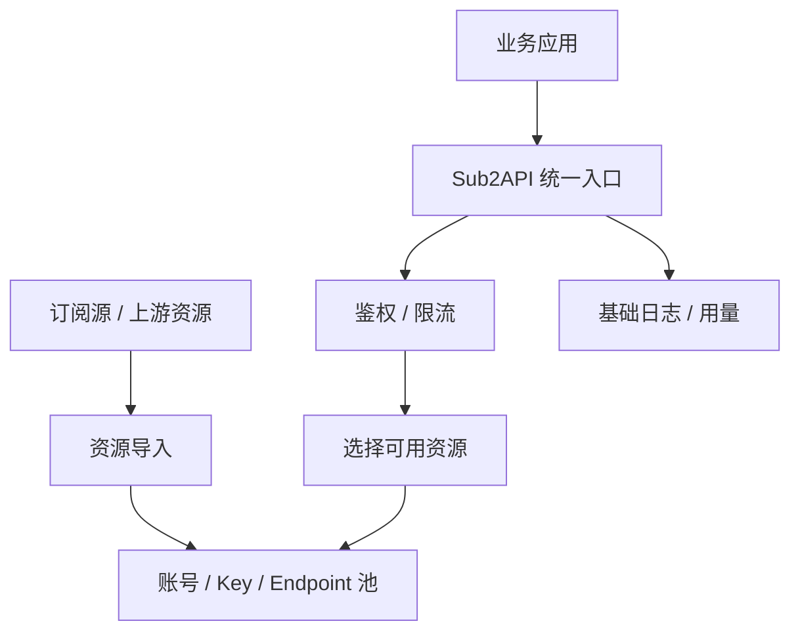

# 竞品分析：Sub2API

**更新日期：** 2026年05月21日  
**产品类型：** 订阅源转 API / 轻量中转代理工具（资料有限）  
**竞争优先级：** 低到中  
**信息边界：** 公开资料有限，本文按“订阅资源转换为可调用 API 的轻量工具”类别保守分析。

---

## 1. 结论摘要

Sub2API 更像一种把订阅、账号、节点或上游资源转换为统一 API 调用能力的工具，而不是完整模型网关。其核心价值是把分散的上游凭证或资源封装起来，对外提供更容易使用的接口，适合个人或小团队快速接入。

这类工具的商业和工程价值在于“资源转换”和“调用便利”，但对企业生产环境存在明显不足：来源合规、账号稳定性、数据隐私、审计、限流、容灾和 SLA 都需要谨慎评估。MaaS 与其竞争时应强调正规供应商接入、合同治理、企业审计和稳定可控。

---

## 2. 产品概况

| 项目 | 内容 |
| --- | --- |
| 产品名称 | Sub2API |
| 产品形态 | 订阅源转 API / 代理中转工具 |
| 目标用户 | 个人开发者、小团队、资源整合需求方 |
| 典型场景 | 将订阅资源转换为 OpenAI-compatible 或其他 API 调用入口 |
| 核心价值 | 低门槛、资源复用、快速接入 |
| 核实状态 | 资料有限，合规和稳定性需重点核查 |

---

## 3. 技术架构

---

## 4. 核心能力与风险

| 能力 | 可能表现 | 主要风险 |
| --- | --- | --- |
| 订阅解析 | 导入上游资源列表 | 资源来源合法性不明 |
| API 转换 | 提供统一调用入口 | 协议兼容不完整 |
| 资源池 | 多账号/多 Key 轮询 | 账号失效和封禁风险 |
| 简单路由 | 选择可用资源 | 缺少质量和成本策略 |
| fallback | 某资源失败后换下一个 | 错误处理可能粗糙 |
| 日志统计 | 基础用量 | 企业审计不足 |
| 数据安全 | 通常资料不充分 | 请求内容可能经过非可信代理 |

---

## 5. 路由与容灾分析

Sub2API 类工具可能会把“资源池轮询”包装成路由能力，但它与企业级智能路由不同。

| 项目 | Sub2API 类工具 | MaaS |
| --- | --- | --- |
| 路由目标 | 可用账号/订阅资源 | 正规供应商、模型、区域、自建服务 |
| 路由依据 | 可用性、轮询、简单优先级 | 成本、延迟、质量、SLA、合规 |
| 容灾方式 | 换资源、重试 | 熔断、健康检查、fallback、告警 |
| 可解释性 | 弱 | 每次路由可审计 |
| 风险控制 | 依赖工具实现 | 企业策略和审批 |

---

## 6. 与 MaaS 平台对比

| 维度 | Sub2API | MaaS |
| --- | --- | --- |
| 定位 | 资源转换工具 | 企业模型运营平台 |
| 合规性 | 需重点核查 | 正规供应商接入与审计 |
| 稳定性 | 资源质量决定 | SLA、容灾、供应商管理 |
| 成本治理 | 通常弱 | 预算、分账、缓存、价格策略 |
| 数据安全 | 风险较高 | 可私有化和合规控制 |
| 适用场景 | 个人/测试/非关键任务 | 企业生产业务 |

---

## 7. 优势、劣势与应对

| 优势 | 说明 |
| --- | --- |
| 极低门槛 | 对个人开发者有吸引力 |
| 资源复用 | 能整合分散订阅或账号 |
| 快速见效 | 短期可完成 API 化调用 |

| 劣势 | 说明 |
| --- | --- |
| 合规风险高 | 订阅来源、账号授权和转售边界不清 |
| 稳定性弱 | 上游资源随时可能失效 |
| 企业能力缺失 | 缺少正式 SLA、审计、预算和权限 |
| 数据安全不透明 | 请求内容经过代理链路需谨慎 |

销售应对：遇到客户拿 Sub2API 对比，重点不是功能，而是风险。MaaS 应强调正规供应商合同、可审计链路、稳定 SLA、私有化部署和企业级数据安全。

---

## 8. 总结

Sub2API 代表轻量资源转换工具，对个人开发和测试有价值，但不适合企业生产模型网关。MaaS 应在合规、稳定、审计和治理上形成清晰边界。
