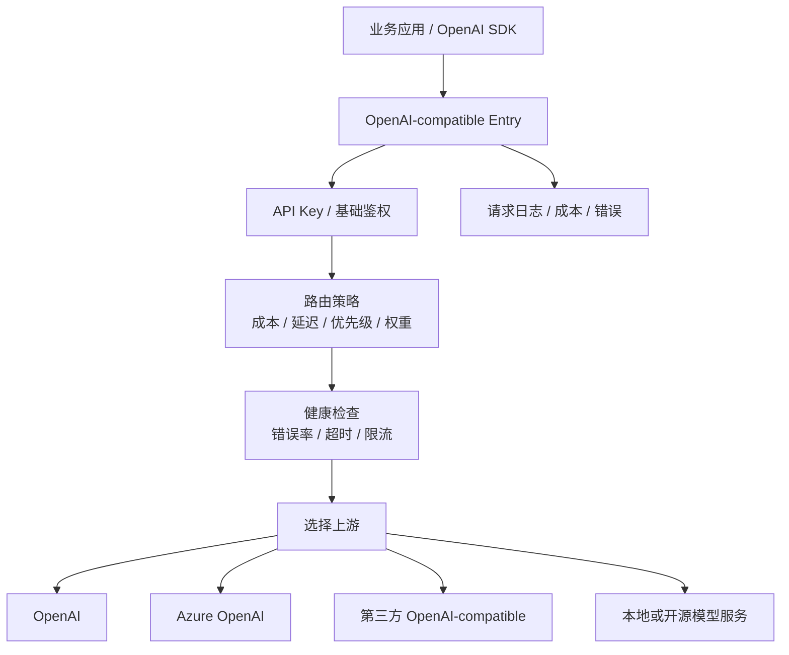
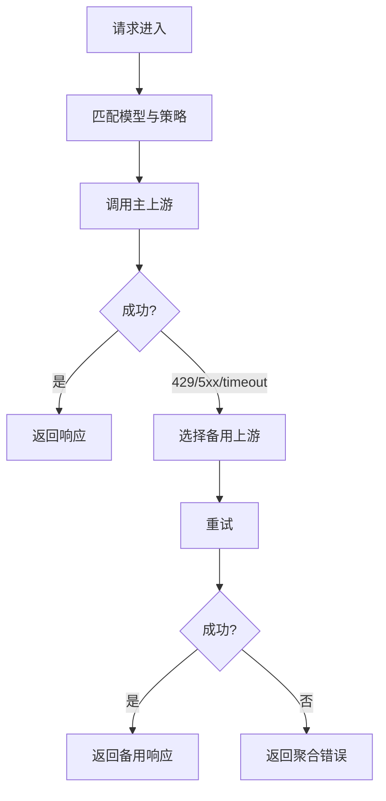

# 竞品分析：OpenAI Router

**更新日期：** 2026年05月21日  
**信息来源：** 旧稿、GitHub 搜索、社区路由网关实践、同类产品对比  
**竞争优先级：** 中（路由器型网关概念，具体项目资料有限）  
**参考地址：**

1. GitHub 搜索：[OpenAI Router](https://github.com/search?q=%22OpenAI+Router%22+LLM&type=repositories)
2. 参考竞品：[LiteLLM](16-litellm.md)
3. 参考竞品：[Bifrost](15-bifrost.md)
4. 参考竞品：[Portkey](19-portkey.md)
5. 参考竞品：[OpenRouter](26-openrouter.md)

---

## 1. 结论摘要

“OpenAI Router”更像一个通用产品形态或社区项目命名，而不是当前可清晰核实的单一成熟商业产品。GitHub 搜索未发现明确高热度、唯一指向的 `OpenAI Router` 仓库；公开资料更适合按“OpenAI-compatible 路由器型网关”进行分析。本文将其定位为：在 OpenAI API 兼容入口之上，加入多上游选择、健康检查、失败切换、成本/延迟策略和基础观测的轻量路由层。

这类产品的核心价值很明确：解决业务侧不想绑定单一上游的问题，让请求可以在多个模型或供应商之间切换。但它通常只解决“路由和容灾”，不解决企业级组织治理、预算审批、合规审计、供应商采购和完整运营平台。对 MaaS 来说，它是路由能力的局部竞争者，不是完整 MaaS 替代品。

由于当前缺少唯一官方来源，本文所有能力分为“路由器型产品常见能力”和“需核实能力”。正式对外汇报时，若客户提到具体 OpenAI Router 项目，应以其仓库、文档和部署形态重新核验。

---

## 2. 产品概况

| 项目 | 内容 |
| --- | --- |
| 产品名称 | OpenAI Router |
| 产品形态 | OpenAI-compatible 路由器型网关概念 / 社区实现名称 |
| 部署形态 | 通常为自托管轻量服务，具体取决于实现 |
| 核心定位 | 多上游模型路由、失败切换、成本/延迟优化 |
| 目标用户 | 想在多个 OpenAI-compatible 上游之间做自动切换的技术团队 |
| 典型场景 | 故障切换、模型选择、供应商冗余、统一 API Base、低成本模型替换 |
| 竞争类型 | 路由层工具，与 LiteLLM、Bifrost、Portkey、MaaS 路由模块重叠 |
| 核实状态 | 资料有限，未确认唯一成熟官方产品 |

---

## 3. 技术架构

| 层级 | 说明 |
| --- | --- |
| 兼容入口 | 以 OpenAI API 格式对外暴露，业务侧改 base URL 即可接入 |
| 策略层 | 按模型、权重、成本、延迟、可用性或优先级选择上游 |
| 健康层 | 探测上游是否超时、限流、5xx 或不可用 |
| 转发层 | 将请求转发给 OpenAI、Azure、第三方代理或本地模型服务 |
| 日志层 | 记录请求、响应、错误、耗时和消耗，便于排查路由效果 |

---

## 4. 核心功能与成熟度

| 能力 | 常见实现 | 成熟度 | 说明 |
| --- | --- | --- | --- |
| OpenAI 兼容 | 支持 | 中高 | 路由器型网关的基本前提 |
| 多上游配置 | 支持 | 中 | 配置多个 endpoint/key/model |
| 权重路由 | 常见 | 中 | 可做简单负载均衡 |
| 优先级路由 | 常见 | 中 | 主备上游切换 |
| 成本优先 | 部分支持 | 中低 | 需要维护价格表和模型能力 |
| 延迟优先 | 部分支持 | 中低 | 需要持续测速和健康数据 |
| failover | 常见 | 中 | 主上游失败后换备用上游 |
| 健康检查 | 部分支持 | 中 | 质量取决于探测频率和错误分类 |
| 语义缓存 | 少见 | 低 | 通常不是核心能力 |
| 企业 RBAC | 少见 | 低 | 多数工具不做复杂组织治理 |
| 计费账单 | 部分支持 | 低到中 | 通常只做简单 usage，不做企业分账 |

---

## 5. 路由策略与容灾规则

### 5.1 典型路由策略

| 策略 | 行为 | 适用场景 | 风险 |
| --- | --- | --- | --- |
| 固定路由 | 某模型固定走某上游 | 稳定业务、明确供应商 | 缺少容灾 |
| 权重路由 | 多上游按权重分流 | 灰度、容量分摊 | 权重需人工维护 |
| 优先级路由 | 主上游失败后走备用 | 容灾与高可用 | 失败判断过粗会误切换 |
| 成本优先 | 优先选择低价上游 | 批处理、非实时任务 | 可能牺牲质量和延迟 |
| 延迟优先 | 选择低延迟上游 | 实时对话 | 需要准确测速 |
| 错误类型路由 | 按 429/5xx/timeout 选择不同处理 | 生产容灾 | 实现复杂，需要日志闭环 |

### 5.2 容灾链路

这种链路的关键不只是“能重试”，而是要记录为什么重试、用了哪个备用、成本和延迟变化、是否影响输出质量。很多轻量 OpenAI Router 只做到转发和重试，没有做到可解释治理。

---

## 6. 与 MaaS 平台对比

| 对比维度 | MaaS 平台 | OpenAI Router |
| --- | --- | --- |
| OpenAI 兼容入口 | 支持 | 支持 |
| 路由策略 | 成本、延迟、质量、SLA、合规、租户策略 | 多数为成本/延迟/权重/主备 |
| fallback | 可做多模型、多供应商、错误类型链路 | 通常为上游失败重试 |
| 语义缓存 | 可支持 | 通常不支持 |
| 企业预算 | 租户/部门/项目/应用/Key | 通常不支持 |
| 审计 | 完整路由与请求审计 | 基础日志 |
| 私有化 | 可标准交付 | 取决于项目 |
| 合规 | 可按客户要求落地 | 通常缺少体系 |
| 平台完整度 | 高 | 中低 |

---

## 7. 优势、劣势与销售应对

### 7.1 优势

| 优势 | 说明 |
| --- | --- |
| 定位清晰 | 解决多上游路由和 failover，价值直观 |
| 接入成本低 | 保持 OpenAI-compatible，业务改造小 |
| 轻量易部署 | 通常比完整 MaaS 平台部署简单 |
| 适合工程团队二开 | 可以按自身需求快速扩展策略 |

### 7.2 劣势

| 劣势 | 说明 |
| --- | --- |
| 产品边界窄 | 只解决路由，缺少企业运营闭环 |
| 可观测不足 | 没有完整 trace、成本、质量和策略解释，路由容易黑盒化 |
| 治理薄弱 | 缺少组织、预算、审批、审计和合规能力 |
| 资料分散 | 没有唯一成熟官方产品，评估成本高 |

### 7.3 销售应对

客户如果只要“多个 Key 出问题时自动切换”，OpenAI Router 足够轻。MaaS 应把话题推进到生产运营：谁能配置策略、谁审批、如何分账、失败怎么审计、合规怎么留痕、是否支持私有模型和国内外供应商统一治理。这些才是 MaaS 的优势区。

---

## 8. 信息核实与待跟进

| 信息项 | 状态 | 备注 |
| --- | --- | --- |
| 唯一官方产品 | 未确认 | GitHub 搜索无明确唯一仓库 |
| 路由能力 | 按产品形态归纳 | 需结合具体实现核实 |
| fallback | 按常见网关归纳 | 需实测错误场景 |
| 企业治理 | 未见明确资料 | 不应假设存在 |
| 对外汇报 | 需谨慎 | 建议标注为“路由器型产品类别” |

---

## 9. 总结

OpenAI Router 更适合作为“路由器型网关”类别来分析，而不是一个已核实的强品牌竞品。它提醒 MaaS：路由和 failover 是客户能直接感知的刚需，但真正的企业价值在于把路由纳入预算、审计、合规、可观测和组织治理。MaaS 需要在策略深度和运营闭环上明显超过这类轻量路由工具。
