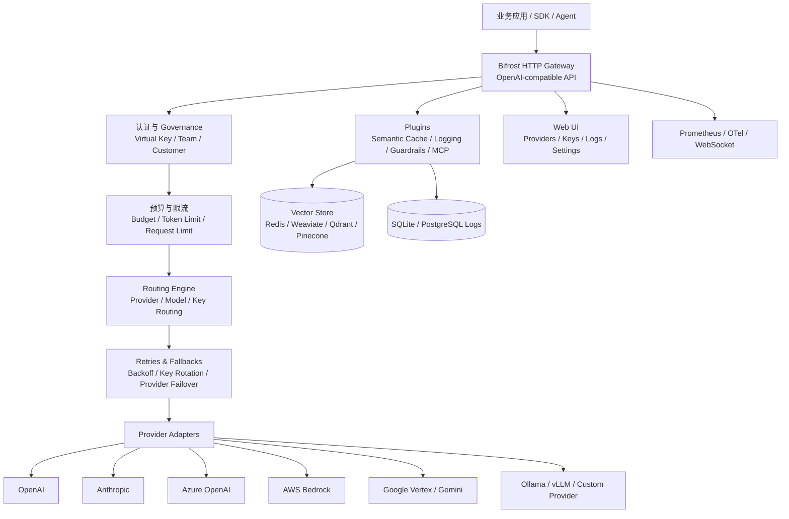

# 竞品分析：Bifrost

**更新日期：** 2026年05月21日  
**信息来源：** 官方文档、GitHub 仓库、用户实测记录、社区实践  
**竞争优先级：** 高（高性能开源 AI Gateway / LLM Router，与 LiteLLM 直接同赛道）  
**参考地址：**

1. GitHub：[maximhq/bifrost](https://github.com/maximhq/bifrost)
2. 官方文档：[Bifrost Docs](https://docs.getbifrost.ai/)
3. Virtual Keys：[Virtual Keys](https://docs.getbifrost.ai/features/governance/virtual-keys)
4. Routing：[Governance Routing](https://docs.getbifrost.ai/features/governance/routing)
5. Retries & Fallbacks：[Retries & Fallbacks](https://docs.getbifrost.ai/features/retries-and-fallbacks)
6. Semantic Caching：[Semantic Caching](https://docs.getbifrost.ai/features/semantic-caching)
7. Observability：[Built-in Observability](https://docs.getbifrost.ai/features/observability/default)

> 用户调研记录中 Bifrost GitHub Star 约 3.9k；本次核实时 GitHub 页面显示约 5.1k。Star 数变化较快，对外汇报前建议以 GitHub 实时数据复核。

---

## 1. 结论摘要

Bifrost 是 Maxim 推出的高性能开源 AI Gateway，定位与 LiteLLM、Portkey、OpenAI Router 等产品高度重叠。它通过统一的 OpenAI 兼容 API 接入 20+ 模型供应商，强调低延迟、高吞吐、自动 fallback、负载均衡、语义缓存、Virtual Keys、预算限额、可观测性和 Web UI 管理。

与旧版文档里“轻量路由网关”的判断相比，Bifrost 的实际产品化程度更高：它不仅做统一入口和转发，还提供了供应商管理、模型路由、虚拟 Key、Team/Customer 分层预算、语义缓存、实时日志、Prometheus/Tracing、MCP Gateway、插件体系和企业部署能力。它已经不是简单中转工具，而是一个比较完整的 AI Gateway 基础设施产品。

**对 MaaS 平台的启示：** Bifrost 在“网关性能、开源部署、治理 UI、语义缓存、Virtual Key、内置观测”上都有较强对标价值。MaaS 平台需要在网关层能力上认真对齐，同时用国内合规、业务账单、审批流程、多租户运营、SLA 产品化和企业交付能力形成差异。

---

## 2. 产品概况

| 项目 | 内容 |
| --- | --- |
| 产品名称 | Bifrost |
| 所属公司/组织 | Maxim / maximhq |
| 产品定位 | 高性能 AI Gateway / LLM Router / OpenAI-compatible Proxy |
| 开源协议 | Apache-2.0（以 GitHub 仓库实时声明为准） |
| 技术栈 | Go 为主，UI 使用 TypeScript，提供 HTTP Gateway 与 Go SDK |
| 目标用户 | AI 平台团队、基础设施团队、需要多模型统一入口和生产治理的研发团队 |
| 典型场景 | 多供应商接入、自动 fallback、负载均衡、语义缓存、Virtual Key 治理、成本控制、日志观测、MCP 工具网关 |
| 部署方式 | NPX、本地进程、Docker、Kubernetes、Helm、Go SDK 嵌入式集成 |
| 竞争类型 | 开源 AI Gateway / LLMOps 基础设施 |

Bifrost 主要提供三种使用方式：

1. **Gateway 模式**：部署独立 HTTP 网关，对外提供 OpenAI 兼容接口和 Web 管理界面。
2. **Go SDK 模式**：在 Go 服务中直接嵌入 Bifrost core，获得更高性能和更细粒度控制。
3. **Drop-in Replacement 模式**：把 OpenAI、Anthropic、Google GenAI 等 SDK 的 base URL 指向 Bifrost，减少业务代码改造。

---

## 3. 产品定位与典型场景

| 场景 | Bifrost 解决的问题 | 价值 |
| --- | --- | --- |
| 多供应商统一接入 | 不同模型供应商 API、SDK、鉴权和返回结构不一致 | 用统一 OpenAI-compatible API 屏蔽差异 |
| 高可用 AI 网关 | 上游 provider 可能限流、超时、故障 | 通过 retries、key rotation、fallback chains 和 load balancing 提升可用性 |
| 多 Key / 多 Provider 负载均衡 | 单个供应商或单个 API Key 容量有限 | 在 provider、API Key、模型维度分摊流量 |
| 语义缓存 | 重复或相似请求造成成本浪费和延迟 | 通过 exact hash + semantic similarity 降低 API 调用成本和响应时间 |
| 企业治理 | 多团队共用模型时缺少权限、预算和速率控制 | 通过 Virtual Keys、Teams、Customers、Budget、Rate Limit 实现分层治理 |
| 可观测性 | AI 请求调试困难，缺少 trace、cost 和 retry/fallback 信息 | 内置请求日志、实时流、筛选查询、token/cost/latency 分析 |
| MCP Gateway | 模型需要安全调用外部工具 | 作为 MCP client/server，连接并暴露外部工具 |
| 迁移现有应用 | 已有应用绑定 OpenAI/Anthropic/GenAI SDK | 通过修改 base URL 实现低成本迁移 |

---

## 4. 技术架构



| 层级 | 说明 |
| --- | --- |
| Transport 层 | 负责 HTTP Gateway 和其他接入方式，主要入口是 `bifrost-http` |
| Core 层 | 包含 provider adapters、schemas、主路由逻辑和 Go SDK 能力 |
| Framework 层 | 提供 config store、log store、vector store 等持久化抽象 |
| Plugins 层 | 提供 semantic cache、governance、logging、telemetry、mocker、MCP 等扩展能力 |
| UI 层 | 提供 Web 控制台，用于供应商、Key、规则、日志、配置和运行状态管理 |
| Enterprise 层 | 提供 clustering、custom security、guardrails、私有化高级部署等增强能力 |

Bifrost 的一个重要区别是 Go 技术栈。它在官方材料中强调极低网关开销，并在 benchmark 中宣传 5,000 RPS 下只增加微秒级延迟。该性能数字来自官方基准，正式采用前仍需结合客户部署环境压测验证。

---

## 5. 部署与运行

### 5.1 NPX 快速启动

```bash
npx -y @maximhq/bifrost
```

适合本地体验和快速验证。启动后可打开 Web UI 进行供应商、Key、规则和日志配置。

### 5.2 Docker 部署

```bash
docker run -p 8080:8080 maximhq/bifrost
```

带持久化目录的 Docker 示例：

```bash
docker run -p 8080:8080 \
  -v $(pwd)/data:/app/data \
  maximhq/bifrost
```

默认管理界面通常为：

```text
http://localhost:8080
```

### 5.3 Go SDK 集成

```bash
go get github.com/maximhq/bifrost/core
```

Go SDK 适合对性能、插件、请求生命周期有更强控制的内部平台团队。

### 5.4 生产部署建议

| 事项 | 建议 |
| --- | --- |
| 持久化 | 挂载配置、日志和运行数据目录，避免容器重启丢失配置 |
| 日志存储 | 小规模可使用 SQLite；生产建议评估 PostgreSQL |
| 语义缓存 | 配置 Redis/Valkey、Weaviate、Qdrant 或 Pinecone 等 vector store |
| 高可用 | 使用 Kubernetes / Helm 部署多副本，配合 Ingress、HPA、探针和滚动发布 |
| 密钥管理 | 使用环境变量、Secret Manager 或企业密钥系统，不在配置文件硬编码上游 Key |
| 监控告警 | 打开 built-in logs、Prometheus metrics、OTel tracing 或 Maxim 插件 |
| 安全 | 生产环境建议启用认证、Virtual Key 强制校验、TLS、最小权限模型白名单 |

---

## 6. 核心功能总览

| 分类 | 能力 | 成熟度 | 说明 |
| --- | --- | --- | --- |
| 接口兼容 | OpenAI-compatible API | 高 | 支持 `/v1/chat/completions` 等通用接口 |
| 多供应商 | 20+ providers | 高 | OpenAI、Anthropic、Bedrock、Vertex、Azure、Cohere、Mistral、Ollama、Groq 等 |
| 路由 | Provider / Model Routing | 高 | 基于 Virtual Key 配置 provider、model、key 访问范围 |
| 负载均衡 | Weighted Load Balancing | 高 | 在多个 provider 或 API Key 之间按权重分发 |
| 容灾 | Retries + Fallbacks | 高 | 退避重试、限流换 Key、跨 provider fallback |
| 缓存 | Semantic Caching | 高 | 支持 exact hash + semantic similarity 双层缓存 |
| 成本治理 | Budget / Cost Tracking | 中高 | 支持 VK、Team、Customer 分层预算 |
| 限流 | Token / Request Rate Limit | 中高 | VK 级 token 和 request 限制，周期重置 |
| 权限 | Virtual Keys | 高 | 模型、provider、key、预算、限速、启停管理 |
| 组织 | Teams / Customers | 中高 | Team 和 Customer 分层预算，VK 可挂到 Team 或 Customer |
| 可观测性 | Logs / Metrics / Tracing | 高 | 内置日志、实时流、筛选、Prometheus、OTel、Maxim 插件 |
| 插件 | Plugin Architecture | 中高 | 支持 logging、semantic cache、governance、telemetry、mocker 等 |
| MCP | MCP Gateway | 中高 | 作为 MCP client/server 连接和暴露工具 |
| UI | Web 管理控制台 | 中高 | 管理供应商、Key、规则、日志、安全、性能设置 |
| 企业功能 | SSO / Clustering / Guardrails | 中 | 部分能力属于 Enterprise，需要核实授权边界 |

---

## 7. 供应商与模型管理

Bifrost 的供应商管理是其网关能力的基础。用户可以在 Web UI 中配置 provider、API Key、base URL、模型限制、网络配置、重试策略等信息。

### 7.1 供应商配置方式

| 配置项 | 说明 |
| --- | --- |
| Provider | OpenAI、Anthropic、Bedrock、Vertex、Azure、Ollama、Custom Provider 等 |
| API Key | 支持一个 provider 配多个 Key，用于容量扩展和限流换 Key |
| Base URL | 支持官方 endpoint，也支持 OpenAI-compatible 自建服务或第三方代理 |
| Models | 可设置 Key 支持的模型范围，也可通过 Model Catalog 同步 provider 模型列表 |
| Weight | 多 Key 或多 provider 时参与加权负载均衡 |
| Network Config | 配置超时、最大重试次数、退避初始值、退避上限等 |

### 7.2 用户实测：配置 Kimi 供应商

用户调研中记录了通过 OpenAI-compatible 方式配置 Kimi 模型：


选择 OpenAI-compatible provider 并配置 Key：


配置 base URL：


测试调用：

```bash
curl -X POST http://localhost:8080/v1/chat/completions \
  -H "Content-Type: application/json" \
  -d '{
    "model": "openai/kimi-k2.5",
    "messages": [
      {"role": "user", "content": "Hello!"}
    ]
  }'
```


---

## 8. 路由策略与路由规则

Bifrost 的路由能力主要围绕 Virtual Key 展开。Virtual Key 不只是鉴权凭证，也是请求治理和路由策略的载体。

### 8.1 路由基本概念

| 概念 | 说明 |
| --- | --- |
| Provider | 模型供应商，例如 OpenAI、Anthropic、Azure、Ollama |
| Model | 模型名称，可以是裸模型名 `gpt-4o`，也可以是 `provider/model` |
| Virtual Key | 请求治理实体，绑定 provider/model/key 访问范围、预算、限流和路由规则 |
| Provider Config | Virtual Key 下的 provider 配置，包含 allowed models、weight、allowed keys 等 |
| Model Catalog | Bifrost 同步 provider 模型列表，用于模型校验和通配符 `*` 判断 |
| Fallback Chain | 主 provider 失败后按顺序尝试其他 provider/model |

### 8.2 Provider / Model 限制

Virtual Key 可以限制允许访问的 provider 和 model。Bifrost 官方文档中强调默认是 deny-by-default：没有配置 provider configs 时，VK 会阻止所有 provider；配置后，只允许指定 provider/model 通过。

| 配置 | 含义 |
| --- | --- |
| `allowed_models: ["*"]` | 允许该 provider 在 Model Catalog 中支持的所有模型 |
| `allowed_models: []` | 不允许任何模型，等同 deny |
| `allowed_models: ["gpt-4o"]` | 只允许显式列出的模型 |
| `key_ids: ["*"]` | 可以使用该 provider 下任意 Key |
| `key_ids: ["key-prod-001"]` | 只能使用指定 provider API Key |

这个机制可以做环境隔离，例如生产 VK 只能使用生产 Key，开发 VK 只能使用测试 Key；也可以做合规隔离，例如某些敏感业务只能走经过审计的 provider key。

### 8.3 加权负载均衡

当一个 Virtual Key 配置多个 provider 且设置 weight 时，Bifrost 会按权重做负载均衡。

示例：

```text
Virtual Key: vk-prod-main
├── OpenAI
│   ├── Allowed Models: [gpt-4o, gpt-4o-mini]
│   └── Weight: 0.2
└── Azure
    ├── Allowed Models: [gpt-4o]
    └── Weight: 0.8
```

实际行为：

| 请求模型 | 路由结果 |
| --- | --- |
| `gpt-4o` | 80% Azure，20% OpenAI |
| `gpt-4o-mini` | 100% OpenAI，因为只有 OpenAI 被允许 |
| `claude-3-sonnet` | 被拒绝，因为没有 provider 允许该模型 |

调用裸模型名会触发负载均衡：

```bash
curl -X POST http://localhost:8080/v1/chat/completions \
  -H "x-bf-vk: sk-bf-prod" \
  -H "Content-Type: application/json" \
  -d '{
    "model": "gpt-4o",
    "messages": [{"role": "user", "content": "Hello!"}]
  }'
```

指定 provider/model 可以绕过负载均衡，直接打到目标 provider：

```json
{
  "model": "openai/gpt-4o",
  "messages": [{"role": "user", "content": "Hello!"}]
}
```

### 8.4 自动 Fallback

当一个 Virtual Key 配置多个 provider 时，Bifrost 会根据 provider 权重自动生成 fallback chain。请求体没有手动指定 `fallbacks` 时，Bifrost 会按 provider 权重排序，并在主 provider 失败后尝试下一个 provider。

关键规则：

1. 只有请求体没有显式 `fallbacks` 时才自动补充。
2. provider 按 weight 排序生成 fallback 顺序。
3. 每个 fallback provider 都会执行自己的 retry budget。
4. 如果请求体已指定 `fallbacks`，Bifrost 保留用户指定链路。
5. 插件可以通过错误上的 `AllowFallbacks = false` 阻止 fallback 继续执行。

手动 fallback 示例：

```json
{
  "model": "openai/gpt-4o-mini",
  "messages": [
    {"role": "user", "content": "Explain quantum computing in simple terms"}
  ],
  "fallbacks": [
    "anthropic/claude-3-5-sonnet-20241022",
    "bedrock/anthropic.claude-3-sonnet-20240229-v1:0"
  ]
}
```

### 8.5 用户实测：模型映射规则

用户实测中配置了类似“请求 `kimi-2.5` 时自动请求 `kimi-2.5-thinking`”的规则：


调用 `kimi-2.5` 后实际路由到 `kimi-2.5-thinking`：


这个能力对 MaaS 平台很有参考价值：它相当于模型别名、模型升级、灰度切换和 provider 路由规则的产品化入口。

---

## 9. 容灾、重试与降级

Bifrost 的可靠性由两层机制组成：provider 内部 retries 和 provider 之间 fallbacks。

### 9.1 Retries

当 provider 返回可重试错误时，Bifrost 会使用指数退避和 jitter 重试。

| 错误类型 | 是否重试 | 是否换 Key |
| --- | --- | --- |
| DNS、连接失败等网络错误 | 是 | 否，复用同一 Key |
| 5xx 服务端错误 | 是 | 否，复用同一 Key |
| 429 限流错误 | 是 | 是，尝试切换到同 provider 的其他 Key |
| 请求校验错误 | 否 | 否 |
| 插件拦截 | 否 | 否 |
| 请求取消 | 否 | 否 |

默认参数包括 `retry_backoff_initial = 500ms`、`retry_backoff_max = 5000ms`，`max_retries` 默认可能为 0，需要在 provider 的 `network_config` 中显式配置。

### 9.2 Key Rotation

如果一个 provider 配置多个 API Key，Bifrost 在 429 限流时会自动换 Key，而不是对同一个已经限流的 Key 反复重试。

```json
{
  "providers": {
    "openai": {
      "keys": [
        {"name": "openai-key-1", "value": "env.OPENAI_KEY_1", "models": ["*"], "weight": 1.0},
        {"name": "openai-key-2", "value": "env.OPENAI_KEY_2", "models": ["*"], "weight": 1.0},
        {"name": "openai-key-3", "value": "env.OPENAI_KEY_3", "models": ["*"], "weight": 1.0}
      ],
      "network_config": {
        "max_retries": 5
      }
    }
  }
}
```

这个能力对生产很关键，因为很多 LLM 故障其实不是 provider 整体不可用，而是某个账号、某个 Key、某个区域被限流。

### 9.3 Fallback Chain

Fallback 在 retries 耗尽后触发。每个 fallback provider 都会获得自己的完整 retry budget。

例如 primary provider `max_retries = 3`，两个 fallback provider 也各自 `max_retries = 3`，理论上最多可能发生 12 次尝试：primary 首次 + 3 次重试，fallback1 首次 + 3 次重试，fallback2 首次 + 3 次重试。

### 9.4 降级链路价值

| 场景 | Bifrost 机制 | 价值 |
| --- | --- | --- |
| 单 Key 限流 | 同 provider key rotation | 不需要切换 provider，优先消化同 provider 其他 Key 容量 |
| Provider 短暂 5xx | retry with backoff | 抵抗瞬时波动 |
| Provider 整体故障 | fallback to next provider | 保持业务连续性 |
| 主模型成本超预算 | governance 拒绝或触发 fallback | 自动切到更低成本模型 |
| 合规插件拦截 | plugin can stop fallback | 防止安全场景被绕过 |

---

## 10. 语义缓存

Bifrost 的语义缓存是其区别于很多轻量网关的重要能力，也是 MaaS 平台需要重点对标的能力。

### 10.1 核心机制

Bifrost semantic cache 支持双层缓存：

1. **Direct hash matching**：对规范化后的请求做精确哈希匹配，适合完全相同请求。
2. **Semantic similarity search**：使用 embedding 和 vector store 对相似语义请求命中缓存。

核心特性：

| 能力 | 说明 |
| --- | --- |
| 双层缓存 | exact hash + semantic similarity |
| 向量检索 | 使用 embedding 模型生成向量，匹配相似请求 |
| TTL | 支持缓存生命周期设置，默认可配置 |
| Threshold | 支持相似度阈值，默认示例为 0.8 |
| Streaming | 支持流式响应缓存，并保持 chunk 顺序 |
| 模型隔离 | 可按 model/provider 隔离缓存 |
| 请求级覆盖 | 支持通过 context 或 header 控制 TTL、threshold、cache type、no-store |
| Cache Debug | 响应中可返回 cache hit、hit type、similarity、cache id 等信息 |

### 10.2 Vector Store

语义缓存需要 vector store，官方文档提到支持：

| Vector Store | 适用说明 |
| --- | --- |
| Redis / Valkey | 推荐用于 direct hash mode，也可用于低延迟缓存场景 |
| Weaviate | 支持语义向量检索 |
| Qdrant | 支持语义向量检索 |
| Pinecone | 支持托管向量检索 |

### 10.3 Direct Hash Mode

如果不希望引入 embedding provider，可使用 direct-only 模式：设置 `dimension: 1` 并省略 provider / embedding model。该模式只做精确匹配，不产生 embedding 调用成本，适合成本敏感或低延迟场景。

### 10.4 对 MaaS 的启示

Bifrost 已经把语义缓存作为开源功能呈现，这会削弱 MaaS 平台“语义缓存独有”的差异。MaaS 平台需要进一步强调：

1. 缓存命中可解释性和成本节省报表。
2. 租户级缓存隔离与合规策略。
3. 缓存污染防护、过期策略和人工清理工具。
4. 与账单、路由、SLA 的联动，而不是单点缓存能力。

---

## 11. Virtual Keys、预算与组织治理

Virtual Key 是 Bifrost 的主要治理实体。用户或应用通过请求头携带 Virtual Key，Bifrost 根据该 Key 决定能访问哪些 provider/model/key、预算是否足够、速率是否超限、是否允许路由和 fallback。

### 11.1 支持的 Key Header

| Header | 说明 |
| --- | --- |
| `x-bf-vk` | Bifrost 原生 Virtual Key header，例如 `sk-bf-*` |
| `Authorization` | OpenAI 风格，例如 `Bearer sk-bf-*` |
| `x-api-key` | Anthropic 风格 |
| `x-goog-api-key` | Google Gemini 风格 |

当认证开启时，`Authorization` 可能用于身份认证，此时 Virtual Key 推荐使用 `x-bf-vk`。

### 11.2 Virtual Key 能力

| 能力 | 说明 |
| --- | --- |
| Access Control | 限制可访问 provider、model 和 provider key |
| Budget | 设置独立预算，可与 Team/Customer 预算共同检查 |
| Rate Limit | VK 级 token limit 和 request limit |
| Active/Inactive | 支持即时启停 |
| Association | 一个 VK 可挂到一个 Team 或一个 Customer，二者互斥 |
| Error Response | 缺失、禁用、超预算、超限、模型不允许等均有标准错误 |

### 11.3 Team 与 Customer

Bifrost 的组织治理是三层结构：

```text
Customer
  └── Team
        └── Virtual Key
```

也支持 Virtual Key 直接挂到 Customer，或既不挂 Team 也不挂 Customer。

| 层级 | 作用 |
| --- | --- |
| Customer | 最高层组织或大客户，拥有独立预算，可包含多个 Team 和直接 VK |
| Team | 部门或团队层级，拥有独立预算，可属于一个 Customer |
| Virtual Key | 应用或用户级访问凭证，拥有模型权限、预算、限速和 Key 限制 |

官方文档中明确 Team 和 Customer 主要做预算管理，不做 rate limit；rate limit 主要在 VK 级别配置。

### 11.4 用户实测：Virtual Key 与 Team

创建 Virtual Key：


强制 Virtual Key 后，不带 Key 请求会报错：


带 Key 请求示例：

```bash
curl -X POST http://localhost:8080/v1/chat/completions \
  -H "Content-Type: application/json" \
  -H "x-bf-vk: sk-bf-xxx" \
  -d '{
    "model": "openai/kimi-k2.5",
    "messages": [
      {"role": "user", "content": "Hello!"}
    ]
  }'
```


Team 配置：


### 11.5 限速与预算

用户实测中可在模型或 Key 相关配置中设置：

1. 最大支出。
2. 最大 token 数。
3. 最大请求数。


官方文档中 Virtual Key 支持：

| 限制类型 | 说明 |
| --- | --- |
| Max Limit | 预算上限，按金额控制 |
| Reset Duration | `1m`、`1h`、`1d`、`1w`、`1M`、`1Y` 等周期重置 |
| Calendar aligned | 日/周/月/年可按 UTC 日历边界重置 |
| Token Limit | 每周期最大 token 数 |
| Request Limit | 每周期最大请求数 |

---

## 12. Prompt、客户端、安全和性能配置

用户实测中记录了 Bifrost Web UI 的几个配置模块。

### 12.1 Prompt


用户备注中提到“只能配置 openai 的模型”。这一点建议后续继续核实：它可能与当前部署版本、provider 类型或 Prompt 插件支持范围有关，不能直接推断为产品永久限制。

### 12.2 客户端配置


### 12.3 安全设置


常见安全能力包括认证开关、Virtual Key 强制校验、必填 Header、SSO、密钥管理和插件级安全控制。

### 12.4 性能设置


性能配置需要结合 provider 超时、retry、队列、连接池、日志异步写入、缓存和部署副本数一起评估。

---

## 13. 调用方式

### 13.1 OpenAI-compatible Chat Completions

```bash
curl -X POST http://localhost:8080/v1/chat/completions \
  -H "Content-Type: application/json" \
  -H "x-bf-vk: sk-bf-xxx" \
  -d '{
    "model": "openai/gpt-4o-mini",
    "messages": [
      {"role": "system", "content": "You are a helpful assistant."},
      {"role": "user", "content": "Hello!"}
    ]
  }'
```

### 13.2 OpenAI SDK 调用

```python
from openai import OpenAI

client = OpenAI(
    api_key="sk-bf-xxx",
    base_url="http://localhost:8080/v1",
)

response = client.chat.completions.create(
    model="openai/gpt-4o-mini",
    messages=[{"role": "user", "content": "用 Python 实现快速排序"}],
)

print(response.choices[0].message.content)
```

### 13.3 Streaming

```python
stream = client.chat.completions.create(
    model="openai/gpt-4o-mini",
    messages=[{"role": "user", "content": "讲一个短故事。"}],
    stream=True,
)

for chunk in stream:
    if chunk.choices[0].delta.content is not None:
        print(chunk.choices[0].delta.content, end="")
```

### 13.4 Go SDK 调用

```go
package main

import (
    "context"
    "fmt"

    bifrost "github.com/maximhq/bifrost/core"
    "github.com/maximhq/bifrost/core/schemas"
)

func main() {
    config := schemas.BifrostConfig{}

    client, err := bifrost.Init(config)
    if err != nil {
        panic(err)
    }

    req := schemas.ChatCompletionRequest{
        Model: "openai/gpt-4o-mini",
        Messages: []schemas.ChatMessage{
            {Role: "user", Content: "Hello, Bifrost!"},
        },
    }

    resp, err := client.ChatCompletionRequest(
        schemas.NewBifrostContext(context.Background(), schemas.NoDeadline),
        req,
    )
    if err != nil {
        fmt.Printf("Error: %v\n", err)
        return
    }

    fmt.Println(resp.Choices[0].Message.Content)
}
```

---

## 14. 可观测性

Bifrost 内置 observability，重点包括请求日志、实时流、筛选、token、cost、latency、provider、model、retry、selected key、attempt trail 等。

### 14.1 Dashboard


### 14.2 LLM Log


### 14.3 观测字段

| 字段类型 | 说明 |
| --- | --- |
| Request Data | 输入 messages、model parameters、tools、prompt 信息 |
| Response Data | 输出内容、tool calls、函数结果、状态 |
| Performance | latency、token usage、cost |
| Provider Context | 实际 provider、model、selected key |
| Retry Info | `number_of_retries`、`attempt_trail`、失败原因 |
| Custom Metadata | 配置 logging headers 或 `x-bf-lh-*` 自动采集 |
| Multimodal | 音频、图像、工具调用等请求类型追踪 |

日志插件异步写入，官方宣称对请求延迟影响很低。日志存储默认可使用 SQLite，也可配置 PostgreSQL。

---

## 15. 与 LiteLLM 对比

| 对比维度 | LiteLLM | Bifrost | 初步判断 |
| --- | --- | --- | --- |
| 技术栈 | Python 为主 | Go 为主 | Bifrost 更强调性能，LiteLLM Python 生态更成熟 |
| 开源成熟度 | Star 和社区更大 | 增长较快，Star 较低 | LiteLLM 生态占优 |
| Provider 覆盖 | 很广，100+ LLM 适配宣传 | 20+ providers，1000+ models 宣传 | LiteLLM 覆盖更广，Bifrost 常见 provider 足够 |
| 网关性能 | 生产可用，但 Python 网关需调优 | 官方强调微秒级 overhead 和 5k RPS | Bifrost 性能叙事更强，需实测验证 |
| 路由 | routing strategy 丰富，latency/cost/usage/least-busy 等 | VK provider/model/key routing，weighted LB，automatic fallback | LiteLLM 策略更细；Bifrost 治理绑定更强 |
| Fallback | retries、cooldown、fallback、context/content fallback | retries、key rotation、provider fallback、plugin fallback control | 各有优势，Bifrost key rotation 叙事清晰 |
| 语义缓存 | 有缓存能力，但语义缓存不是核心卖点 | Semantic caching 是明确开源特性 | Bifrost 更突出 |
| Virtual Key | 成熟，Key/User/Team spend | VK/Team/Customer 分层预算、provider/model/key 限制 | Bifrost 分层模型更清晰 |
| UI | 有管理 UI，工程工具感较强 | Web UI 覆盖 provider、VK、logs、settings | Bifrost UI 产品化更明显 |
| 可观测性 | callbacks + 外部集成强 | 内置 logs、WebSocket、筛选、Prometheus/OTel | Bifrost 内置体验更强 |
| 企业能力 | Enterprise 功能需授权 | Enterprise 功能也需授权 | 持平，需核实边界 |
| 国内适配 | 可接国内 provider / OpenAI-compatible | 可通过 OpenAI-compatible 配国内模型 | 持平，均需实测 |

---

## 16. 与 MaaS 平台对比

| 对比维度 | MaaS 平台 | Bifrost | 胜出方 |
| --- | --- | --- | --- |
| OpenAI 兼容 API | 支持 | 支持 | 持平 |
| 多供应商接入 | 国内外统一接入 | 20+ providers | 持平 |
| 路由策略 | 多维评分、SLA、成本、可用性 | weighted routing、provider/model/key restrictions、fallback | 持平，Bifrost 网关能力强 |
| 自动容灾 | retries、熔断、fallback、SLA | retries、key rotation、automatic fallback | 持平 |
| 语义缓存 | L1/L2、语义相似命中、成本优化 | exact + semantic cache | 持平，需看实现深度 |
| Virtual Key | 租户/项目/API Key 管理 | VK、Team、Customer、Budget、Rate Limit | 持平或 Bifrost 治理底座较强 |
| 成本中心 | 账单、预算、分摊、发票、报表 | spend、budget、token/cost logs | MaaS |
| 审批流 | 模型申请、预算申请、Key 申请、权限审批 | 需外部系统或二开 | MaaS |
| 国内合规 | 等保、审计、数据出境、私有化材料 | 通用开源组件，需自行建设 | MaaS |
| 组织 RBAC | 企业租户、部门、项目、角色 | Team/Customer/VK，SSO 部分能力 | MaaS |
| 控制台 | 面向运营、管理员、开发者 | 偏网关管理和工程治理 | MaaS |
| 自建灵活性 | 支持 | 强 | 持平 |
| 开源可控 | 可选开源组件 | Apache-2.0 开源 | Bifrost |
| 高性能网关 | 取决于实现 | Go + 性能宣传强 | Bifrost 叙事更强，需实测 |

---

## 17. 优势分析

| 维度 | 优势描述 |
| --- | --- |
| 性能叙事强 | Go 实现，官方强调极低 overhead 和高 RPS，适合性能敏感团队 |
| 产品化 UI 较完整 | Provider、Virtual Key、Rules、Logs、Security、Performance 等都有可视化入口 |
| 治理模型清晰 | Virtual Key 绑定 provider/model/key restrictions、budget、rate limit；Team/Customer 做分层预算 |
| 容灾机制实用 | retries、rate limit key rotation、automatic provider fallback 组合贴近真实生产问题 |
| 语义缓存明确 | exact + semantic 双层缓存、vector store、TTL、threshold、cache debug 都较完整 |
| 可观测性内置 | 请求/响应/token/cost/latency/retry/attempt trail 都可记录，支持 UI/API/WebSocket |
| 插件体系 | semantic cache、logging、governance、mocker、telemetry 等模块化扩展 |
| Drop-in 迁移 | 对 OpenAI、Anthropic、GenAI 等 SDK 改 base URL 即可接入 |
| 开源协议友好 | Apache-2.0 对企业二开和私有化较友好 |

---

## 18. 劣势与边界

| 维度 | 劣势描述 | 影响 |
| --- | --- | --- |
| 生态规模小于 LiteLLM | Star、社区、历史案例仍低于 LiteLLM | 客户选型时可能更信任 LiteLLM |
| 企业能力边界需核实 | Clustering、SSO、Guardrails、Custom Plugins 等可能涉及 Enterprise | 商业化部署需确认授权成本 |
| 治理偏网关层 | 有 VK/Team/Customer，但不是完整企业 MaaS 业务平台 | 审批、合同、发票、工单、SLA 报表需要另建 |
| 复杂能力配置门槛 | 语义缓存、vector store、fallback、Key restrictions 配置项多 | 生产使用需要平台工程能力 |
| 国内模型需实测 | 通过 OpenAI-compatible 可接入，但多模态、工具、流式、计费字段可能有差异 | 国内客户落地前需逐模型验证 |
| 高性能宣传需复核 | 官方 benchmark 不等于客户实际环境 | 需要按目标 QPS、日志、缓存、fallback 场景压测 |
| 数据合规非默认完整 | 开源网关不天然等于等保和审计体系 | 金融/政务客户需补合规材料和流程 |
| UI 仍偏工程 | 面向平台工程师强，对财务、业务管理员不一定友好 | MaaS 可在业务体验上差异化 |

---

## 19. 对 MaaS 平台的产品启示

### 19.1 必须对齐的能力

1. Provider / Model / Key 三级路由与访问限制。
2. Virtual Key 级模型白名单、预算、token limit、request limit、启停。
3. Team / Customer / Tenant 分层预算和成本归因。
4. Weighted load balancing 和 automatic fallback。
5. 429 key rotation、5xx retry、跨 provider fallback。
6. 语义缓存与 direct cache 双模式。
7. cache hit、fallback、selected provider、selected key、attempt trail 的可观测字段。
8. Web UI 配置 provider、key、规则、日志、安全和性能参数。

### 19.2 可以形成差异的方向

| 方向 | MaaS 可强化点 |
| --- | --- |
| 国内合规 | 等保、数据出境、审计留痕、敏感信息保护、国产模型优先 |
| 业务闭环 | 模型申请、Key 申请、预算申请、审批流、工单、SLA 报表 |
| 账单运营 | 合同、套餐、充值、发票、财务对账、部门分摊 |
| 路由解释 | 展示为什么命中某 provider、为什么 fallback、为什么拒绝或降级 |
| 缓存运营 | 展示缓存命中率、节省金额、误命中风险、缓存清理与隔离策略 |
| 多租户 SaaS | 租户、项目、环境、角色、资源隔离和跨组织运营能力 |
| AI 运维助手 | 自动分析错误率、成本异常、限流原因、fallback 风暴和配置建议 |

---

## 20. 销售应对策略

### 20.1 客户说“我们可以用 Bifrost 自建”时

建议话术：

> Bifrost 是一个很强的开源 AI Gateway，尤其适合有平台工程团队、希望自建高性能统一入口的客户。它能解决模型接入、路由、fallback、虚拟 Key、日志和语义缓存等网关层问题。但企业真正运营 MaaS 时，还需要预算审批、账单分摊、合同发票、租户管理、合规审计、SLA 报表和业务控制台。MaaS 平台的价值是把这些能力产品化、流程化，而不是只提供一个网关组件。

### 20.2 适合承认 Bifrost 强的场景

1. 客户技术团队偏基础设施，能自建和维护网关。
2. 客户关注极致性能、Go 技术栈和开源可控。
3. 客户核心需求是 provider 统一入口、自动 fallback、语义缓存和日志观测。
4. 客户已有内部 IAM、账单、审批和合规系统，只缺 AI Gateway。

### 20.3 MaaS 更适合的场景

1. 客户希望交付完整 AI 平台，而不是自己拼组件。
2. 客户需要财务、运营、管理员、研发都能使用的统一控制台。
3. 客户关注国内合规、私有化材料、等保和审计。
4. 客户需要模型采购、预算审批、成本分摊和 SLA 运营闭环。
5. 客户没有足够平台工程团队长期维护开源网关。

---

## 21. 风险与核实清单

| 核实项 | 当前判断 | 后续动作 |
| --- | --- | --- |
| Star 数 | 用户记录约 3.9k，本次页面约 5.1k | 汇报前复核 GitHub 实时数据 |
| 开源协议 | Apache-2.0 | 法务评估前复核 LICENSE |
| Enterprise 边界 | Clustering、SSO、Guardrails、Custom Plugins 等可能属于企业版 | 核实功能价格和授权范围 |
| 性能数据 | 官方宣传 5k RPS、微秒级 overhead | 用目标场景压测验证 |
| 语义缓存 | 官方明确支持 exact + semantic cache | 实测 vector store、阈值、流式缓存、租户隔离 |
| 国内模型 | 可通过 OpenAI-compatible 接入 Kimi 等 | 验证通义、DeepSeek、智谱、Moonshot、文心等兼容性 |
| Prompt 能力 | 用户实测提示部分模型限制 | 核实当前版本 Prompt 插件 provider 支持范围 |
| 高可用 | 支持 K8s/企业部署，企业 clustering 需确认 | 验证多副本配置一致性、日志存储和缓存共享 |
| 合规 | 默认不是完整合规平台 | 补齐审计、脱敏、权限、数据留存、报表和安全评估 |

---

## 22. 总结

Bifrost 是一个需要重点关注的开源 AI Gateway 竞品。它与 LiteLLM 同属多模型代理和路由层赛道，但产品表达更强调 Go 高性能、内置 Web UI、语义缓存、Virtual Key 治理、自动 fallback 和可观测性。它对 MaaS 平台的威胁不在于“完整业务平台”，而在于它已经把 AI Gateway 的底座能力做得比较系统，能吸引有平台工程能力的客户自建。

MaaS 平台对 Bifrost 的竞争策略应当是：承认其作为开源网关组件的强能力，在路由、fallback、缓存、Key 治理和观测上对齐；同时把差异放在企业可运营平台能力上，包括国内合规、租户/项目/部门治理、预算审批、账单分摊、SLA 报表、业务控制台和 AI 运维助手。
