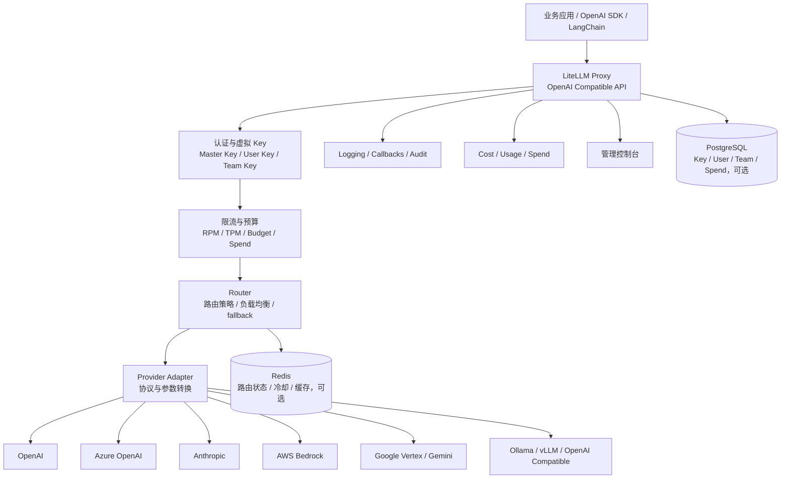
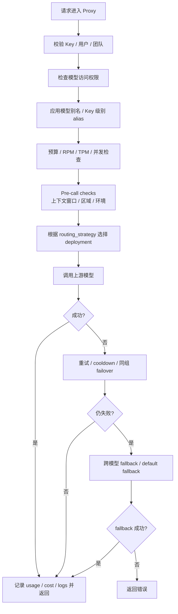

# 竞品分析：LiteLLM

**更新日期：** 2026年05月21日  
**信息来源：** 官方文档、GitHub 仓库、用户实测记录、社区实践  
**竞争优先级：** 高（成熟开源 LLM Proxy / Gateway / Router）  
**参考地址：**

1. GitHub：[BerriAI/litellm](https://github.com/BerriAI/litellm)
2. 官方文档：[LiteLLM Docs](https://docs.litellm.ai/docs/)
3. Router 文档：[Router - Load Balancing](https://docs.litellm.ai/docs/routing)
4. Proxy 配置文档：[Proxy Configs](https://docs.litellm.ai/docs/proxy/configs)
5. Fallback 文档：[Fallbacks](https://docs.litellm.ai/docs/proxy/reliability)
6. Virtual Keys 文档：[Virtual Keys](https://docs.litellm.ai/docs/proxy/virtual_keys)
7. Cookbook：[LiteLLM Cookbook](https://models.litellm.ai/cookbook)

> Star 数会持续变化。用户调研记录中 LiteLLM GitHub Star 约 43.6k，正式对外汇报前建议以 GitHub 实时数据复核。

---

## 1. 结论摘要

LiteLLM 是开源 LLM 网关赛道里成熟度很高的代表产品，核心价值是把不同模型厂商、不同协议和不同部署实例收敛到一个 OpenAI 兼容入口，并在网关层提供路由、负载均衡、重试、fallback、预算、限流、日志和控制台管理能力。

它不是单纯的“API 转发器”，而是偏平台工程的 LLM Gateway。对于有自建能力的团队，LiteLLM 可以作为 AI 基础设施层的核心组件；对于缺少运维、治理、合规和业务平台建设能力的客户，它仍然需要与权限系统、审批流、账单系统、SLA 运营和企业门户做二次集成。

**对 MaaS 平台的启示：** LiteLLM 在路由与代理层非常强，尤其是多部署负载均衡、故障冷却、fallback 链路和虚拟 Key 成本控制；MaaS 平台需要在“路由专业度”上对齐其能力，同时在多租户、组织治理、国内合规、业务闭环、账单运营和平台化体验上形成差异。

---

## 2. 产品概况

| 项目 | 内容 |
| --- | --- |
| 产品名称 | LiteLLM |
| 产品定位 | 开源 LLM Proxy / AI Gateway / Router |
| 主要形态 | Python SDK + 独立 Proxy Server + 管理控制台 |
| 开源协议 | 以官方仓库实时声明为准 |
| 目标用户 | 开发者、AI 平台团队、基础设施团队、需要统一模型入口的企业技术团队 |
| 典型场景 | 多厂商统一接入、OpenAI 兼容代理、模型路由、负载均衡、fallback、成本统计、虚拟 Key 管理、日志与观测 |
| 部署方式 | 本地进程、Docker、Kubernetes、数据库版 Proxy、云原生部署 |
| 竞争类型 | 开源 LLM 网关 / 控制面基础设施 |

LiteLLM 的典型使用方式有两类：

1. **SDK 模式**：业务应用直接引入 `litellm` Python 包，通过 `completion()` 或 `Router` 调用多家模型。
2. **Proxy 模式**：部署一个独立网关，业务侧继续使用 OpenAI SDK，只需把 `base_url` 指向 LiteLLM Proxy。

对企业来说，真正有竞争力的是 Proxy 模式，因为它能集中管理上游模型、API Key、限流、预算、路由、fallback 和日志，便于在组织内部推广统一 AI 调用入口。

---

## 3. 产品定位与典型场景

| 场景 | LiteLLM 解决的问题 | 价值 |
| --- | --- | --- |
| 多模型统一接入 | OpenAI、Azure OpenAI、Anthropic、Bedrock、Vertex AI、Gemini、DeepSeek、Ollama、vLLM 等接口差异大 | 用一个 OpenAI 兼容接口屏蔽多厂商协议差异 |
| 多部署负载均衡 | 同一模型可能在多个区域、多个账号或多个供应商部署 | 在同一 `model_name` 下配置多个部署实例，自动选择可用实例 |
| 路由与成本优化 | 不同请求对质量、成本、延迟要求不同 | 按权重、速率、延迟、成本、负载等维度选择模型 |
| 容灾与降级 | 上游模型限流、超时、报错、内容策略拦截 | 通过 retries、cooldown、fallback、context fallback 保持服务连续性 |
| 成本与配额治理 | 多团队共用模型时难以追踪费用 | 通过虚拟 Key、用户、团队维度统计 spend，设置预算和速率限制 |
| 观测与审计 | AI 调用链路难以排查问题 | 记录请求、延迟、错误、成本、上游模型，并接入 Langfuse、Helicone、PromptLayer 等系统 |
| 快速实验 | 模型选型和 Prompt 迭代需要 A/B 或影子流量 | 支持模型对比、路由组和 traffic mirroring 等实验方式 |

---

## 4. 技术架构



| 层级 | 说明 |
| --- | --- |
| API 兼容层 | 对外暴露 `/v1/chat/completions`、`/chat/completions`、embeddings、images 等 OpenAI 风格接口 |
| 认证授权层 | 支持 `master_key`、虚拟 Key、用户、团队、模型访问范围、Key 启停等能力 |
| 限流预算层 | 支持 key/user/team 维度的预算、`rpm_limit`、`tpm_limit`、并发限制、花费追踪 |
| Router 层 | 负责同模型多部署负载均衡、跨模型 fallback、策略路由、冷却、重试和预检查 |
| Provider Adapter 层 | 将 OpenAI 格式请求转换为不同模型厂商的原生调用格式，并统一响应结构 |
| 可观测层 | 记录请求、响应、错误、延迟、成本、模型、上游地址，可通过 callback 接入外部观测平台 |
| 控制台与配置层 | 通过 YAML、环境变量、API 或 UI 管理模型、Key、路由组、预算和策略 |

---

## 5. 部署与运行

LiteLLM 支持轻量本地部署，也支持面向生产的容器化与数据库部署。

### 5.1 Docker 快速部署

```bash
docker pull ghcr.io/berriai/litellm:main-latest

docker run -p 4000:4000 \
  -v /path/to/config.yaml:/app/config.yaml \
  -e OPENAI_API_KEY="sk-your-openai-key" \
  ghcr.io/berriai/litellm:main-latest \
  --config /app/config.yaml
```

### 5.2 本地 Python 部署

```bash
pip install 'litellm[proxy]'
litellm --config config.yaml --port 4000
```

启动后，默认在 `http://localhost:4000` 提供服务。OpenAI SDK、curl、LangChain 等客户端可以把 `base_url` 指向该地址。

### 5.3 生产部署要点

| 事项 | 建议 |
| --- | --- |
| 配置管理 | 使用 `config.yaml` + 环境变量，敏感 Key 不直接写死在仓库中 |
| 数据库 | 使用 PostgreSQL 存储虚拟 Key、用户、团队和 spend 信息 |
| Redis | 多实例部署时使用 Redis 共享路由状态、cooldown、用量和缓存状态 |
| K8s | 通过 Deployment + Service + Ingress 部署，配合 HPA 和探针 |
| 日志 | 接入集中日志平台，保留错误、延迟、成本和上游模型信息 |
| 告警 | 对高错误率、高延迟、预算超限、fallback 激增配置告警 |
| 安全 | 生产环境关闭匿名访问，使用 master key / virtual key / SSO 等机制 |

---

## 6. 核心配置模型

LiteLLM 的核心配置由 `config.yaml` 承载，主要包括以下部分：

| 配置块 | 作用 |
| --- | --- |
| `model_list` | 定义可用模型、模型别名、上游 provider、API Key、部署级 rpm/tpm/weight 等 |
| `router_settings` | 定义路由策略、重试、超时、Redis、预检查、路由组等 |
| `litellm_settings` | 定义 fallback、callback、drop_params、request_timeout、缓存等 LiteLLM 模块级设置 |
| `general_settings` | 定义 master key、数据库、控制台、安全与服务级参数 |
| `environment_variables` | 在配置文件中声明运行时环境变量 |
| `credential_list` | 集中定义可复用的上游凭证，便于密钥轮换和减少重复配置 |

### 6.1 基础配置示例

```yaml
model_list:
  - model_name: "gpt-4o"
    litellm_params:
      model: "openai/gpt-4o"
      api_key: "os.environ/OPENAI_API_KEY"

  - model_name: "claude-3-haiku"
    litellm_params:
      model: "anthropic/claude-3-haiku-20240307"
      api_key: "os.environ/ANTHROPIC_API_KEY"

  - model_name: "llama3-8b"
    litellm_params:
      model: "ollama/llama3:8b"
      api_base: "http://localhost:11434"

general_settings:
  master_key: "sk-your-gateway-secret-key"
```

### 6.2 OpenAI 兼容本地模型配置

```yaml
model_list:
  - model_name: "qwen-local"
    litellm_params:
      model: "openai/qwen/Qwen-7B-Chat"
      api_key: "os.environ/LOCAL_MODEL_API_KEY"
      api_base: "http://localhost:8000/v1"
```

如果使用 Ollama：

```bash
curl -fsSL https://ollama.com/install.sh | sh
ollama pull llama3:8b
```

```yaml
model_list:
  - model_name: "llama3-8b"
    litellm_params:
      model: "ollama/llama3:8b"
      api_base: "http://localhost:11434"
```

---

## 7. 路由策略梳理

LiteLLM 的路由能力是其最重要的竞争优势之一。它的路由不是单一规则，而是由模型别名、部署池、策略选择、预算限流、健康状态、fallback 链和请求级参数共同决定。

### 7.1 基本概念

| 概念 | 说明 |
| --- | --- |
| `model_name` | 对外暴露给调用方的模型名，也可理解为模型组或逻辑模型名 |
| `litellm_params.model` | 实际调用的上游模型名称，例如 `openai/gpt-4o`、`azure/gpt-4o` |
| deployment | `model_list` 中的一条模型配置。同一个 `model_name` 可以对应多个 deployment |
| model group | 拥有同一 `model_name` 的多个 deployment 形成一个候选池 |
| router strategy | 在候选池里选择具体 deployment 的算法 |
| fallback | 当前模型组失败后，切换到另一个模型组或指定模型 ID |

示例：调用方请求 `model=gpt-4o`，LiteLLM 可以在 OpenAI `gpt-4o`、Azure East US `gpt-4o`、Azure Canada `gpt-4o` 之间自动选择，并在全部失败时 fallback 到 `claude-sonnet` 或 `gpt-4o-mini`。

### 7.2 同名模型组负载均衡

```yaml
model_list:
  - model_name: "gpt-4o"
    litellm_params:
      model: "openai/gpt-4o"
      api_key: "os.environ/OPENAI_API_KEY"
      rpm: 200

  - model_name: "gpt-4o"
    litellm_params:
      model: "azure/gpt-4o"
      api_base: "os.environ/AZURE_API_BASE_EU"
      api_key: "os.environ/AZURE_API_KEY_EU"
      api_version: "2024-08-01-preview"
      rpm: 600

router_settings:
  routing_strategy: "simple-shuffle"
```

调用方只看到一个 `gpt-4o`，LiteLLM 会在多个 deployment 中选择一个实际上游。若配置了 `rpm` / `tpm` / `weight`，默认策略会按容量或权重进行加权选择。

### 7.3 主要路由策略

| 策略 | 官方名称 | 适用场景 | 说明 |
| --- | --- | --- | --- |
| 加权随机 / 默认策略 | `simple-shuffle` | 生产默认、高吞吐、多部署池 | 默认推荐策略。若配置 `rpm` / `tpm` / `weight`，按容量或权重选择；否则随机选择 |
| 最少繁忙 | `least-busy` | 并发差异明显、实例负载不均 | 优先选择当前负载更低的 deployment |
| 用量感知 | `usage-based-routing` / `usage-based-routing-v2` | 需要考虑 rpm/tpm 消耗的场景 | 根据用量和限额避免打满某个上游 |
| 延迟优先 | `latency-based-routing` | 对响应速度敏感的在线应用 | 根据历史延迟选择更快的上游，可配置统计窗口 |
| 成本优先 | `cost-based-routing` | 成本敏感、模型质量差异可接受 | 倾向选择成本更低的模型或部署 |
| 自定义策略 | Custom Routing Strategy | 内部有特殊调度逻辑 | 可通过代码扩展策略实现业务自定义 |

LiteLLM 官方文档中建议生产优先使用 `simple-shuffle`，并给每个 deployment 配置 `rpm` / `tpm`，以获得较好的吞吐与低路由开销。

### 7.4 权重、容量与优先级规则

```yaml
model_list:
  - model_name: "o1"
    litellm_params:
      model: "openai/o1-preview"
      api_key: "os.environ/OPENAI_API_KEY"
      weight: 1
      order: 1

  - model_name: "o1"
    litellm_params:
      model: "azure/o1-preview"
      api_base: "os.environ/AZURE_API_BASE"
      api_key: "os.environ/AZURE_API_KEY"
      weight: 2
      order: 2
```

`weight` 控制被选中的相对概率，`rpm` / `tpm` 表示 deployment 容量，`order` 表示主备优先级。`order` 数值越小优先级越高，当前优先级失败后才会升级到下一优先级，适合“主区域优先，备用区域兜底”的场景。

### 7.5 按模型分组使用不同路由策略

LiteLLM 支持 `routing_groups`，即同一个 Proxy 内，不同模型组使用不同路由算法。

```yaml
router_settings:
  routing_strategy: "simple-shuffle"
  routing_groups:
    - group_name: "latency-sensitive"
      models: ["gpt-4o", "claude-sonnet"]
      routing_strategy: "latency-based-routing"
      routing_strategy_args:
        ttl: 60

    - group_name: "batch"
      models: ["gpt-4o-mini", "llama-70b"]
      routing_strategy: "usage-based-routing-v2"
```

规则特点：

1. 每个 `model_name` 最多只能属于一个 routing group。
2. 未纳入任何 group 的模型使用顶层 `routing_strategy`。
3. routing group 可通过 UI、API 或配置更新。
4. 适合把在线请求、批处理任务、低成本任务拆成不同策略域。

### 7.6 模型别名与访问映射

LiteLLM 支持模型别名，可以把调用方请求的模型名映射到平台内部模型组。

```yaml
router_settings:
  model_group_alias:
    "gpt-4": "gpt-4o"
```

虚拟 Key 也可以配置别名，实现不同用户看到同一模型名但实际路由到不同模型：

```json
{
  "models": ["my-free-tier"],
  "aliases": {
    "gpt-3.5-turbo": "my-free-tier"
  },
  "duration": "30d"
}
```

这类能力可用于免费版/付费版区分、模型平滑升级、灰度切换和客户级差异化策略。

---

## 8. 路由规则与决策链路



| 规则维度 | 典型配置 | 作用 |
| --- | --- | --- |
| 模型访问 | `models`、`aliases`、`model_group_alias` | 控制用户能调用哪些模型，或者把模型名映射到指定模型组 |
| 部署容量 | `rpm`、`tpm`、`weight` | 控制 deployment 的容量权重和负载均衡比例 |
| 请求限流 | `rpm_limit`、`tpm_limit`、`max_parallel_requests` | 控制 key/user/team 或 deployment 的速率与并发 |
| 预算 | `max_budget`、`budget_duration`、team/user spend | 控制消费上限，避免失控调用 |
| 路由策略 | `simple-shuffle`、`least-busy`、`latency-based-routing` 等 | 决定候选 deployment 的选择方式 |
| 优先级 | `order` | 主备优先级，先用主部署，失败后再用备部署 |
| 预检查 | `enable_pre_call_checks`、`max_input_tokens`、`region_name` | 在实际调用前过滤不满足上下文窗口、区域等要求的 deployment |
| fallback | `fallbacks`、`default_fallbacks`、`context_window_fallbacks`、`content_policy_fallbacks` | 控制失败、超长上下文、内容策略错误时的降级链 |
| 冷却 | `allowed_fails`、`cooldown_time`、`disable_cooldowns` | 对高失败率 deployment 临时摘除，避免持续打坏上游 |
| 超时重试 | `num_retries`、`timeout`、`request_timeout`、`retry_after` | 控制请求失败后的重试次数和等待时间 |

### 8.1 Pre-call Checks

`enable_pre_call_checks` 开启后，LiteLLM 可以在调用上游前做预过滤，避免请求发到必然失败的模型上。

典型检查包括：

1. **上下文窗口检查**：请求 token 超过模型上下文窗口时，提前触发错误或 fallback。
2. **区域检查**：根据 `region_name` 过滤不符合区域要求的 deployment。
3. **环境检查**：通过 `model_info.supported_environments` 控制模型只在 `production`、`staging` 或 `development` 中暴露。

```yaml
router_settings:
  enable_pre_call_checks: true

model_list:
  - model_name: "gpt-4o"
    litellm_params:
      model: "openai/gpt-4o"
      api_key: "os.environ/OPENAI_API_KEY"
    model_info:
      max_input_tokens: 128000
      supported_environments: ["production", "staging"]
```

---

## 9. 容灾、重试与降级机制

LiteLLM 的可靠性能力由 retries、timeout、cooldown、weighted failover、fallbacks 等机制组合构成。

### 9.1 自动重试

```yaml
litellm_settings:
  num_retries: 3
  request_timeout: 10

router_settings:
  num_retries: 2
  timeout: 30
```

特点：

1. 对 RateLimitError 等错误可使用退避策略。
2. 对通用错误可按配置立即重试。
3. 可按异常类型自定义 retry policy，例如认证错误不重试、超时重试 2 次、限流重试 3 次。
4. 重试失败后再进入 fallback 链路。

### 9.2 Cooldown 冷却

当某个 deployment 连续失败、429、超时或错误率过高时，LiteLLM 可以将其短暂移出候选池。

```yaml
router_settings:
  allowed_fails: 3
  cooldown_time: 30
```

冷却机制的价值在于：

1. 避免持续请求已经异常的上游。
2. 让健康 deployment 继续服务。
3. 冷却结束后自动重新加入候选池。
4. 在多实例部署时，可通过 Redis 共享冷却状态。

### 9.3 同组 failover

同一 `model_name` 下配置多个 deployment 时，当前 deployment 失败后，LiteLLM 可以在同组内重新选择另一个 deployment。

```yaml
model_list:
  - model_name: "gpt-4.1-mini"
    litellm_params:
      model: "azure/gpt-4.1-mini"
      api_base: "https://eastus2.example.azure.com"
      api_key: "os.environ/AZURE_EASTUS2_KEY"
      weight: 1

  - model_name: "gpt-4.1-mini"
    litellm_params:
      model: "azure/gpt-4.1-mini"
      api_base: "https://swedencentral.example.azure.com"
      api_key: "os.environ/AZURE_SWEDEN_KEY"
      weight: 1

router_settings:
  routing_strategy: "simple-shuffle"
  enable_weighted_failover: true
```

适合跨区域同模型副本，例如 Azure East US 失败后自动切到 Sweden Central，而不是立刻降级到另一个模型。

### 9.4 跨模型 fallback

```yaml
litellm_settings:
  fallbacks:
    - "gpt-4o": ["claude-sonnet", "gpt-4o-mini"]
```

fallback 按顺序执行。若 `gpt-4o` 调用失败且重试耗尽，会先尝试 `claude-sonnet`，再尝试 `gpt-4o-mini`。

| 类型 | 配置 | 触发场景 |
| --- | --- | --- |
| 通用 fallback | `fallbacks` | 429、500、超时、上游错误等通用失败 |
| 默认 fallback | `default_fallbacks` | 某个模型组没有单独配置 fallback 时，使用全局兜底模型 |
| 上下文窗口 fallback | `context_window_fallbacks` | 输入超出模型上下文窗口，切到长上下文模型 |
| 内容策略 fallback | `content_policy_fallbacks` | 某 provider 内容策略拦截，切到另一个 provider 或模型 |
| 指定模型 ID fallback | `model_info.id` + `fallbacks` | 需要精确回退到某个 deployment，而不是模型组 |
| 请求级 fallback | 请求体 `fallbacks` | 客户端按请求指定备用模型 |

### 9.5 上下文窗口降级

```yaml
router_settings:
  enable_pre_call_checks: true

litellm_settings:
  context_window_fallbacks:
    - "gpt-4o": ["gpt-4o-long-context"]
```

这个能力适合长文档总结、知识库问答和代码分析场景。短请求走低成本模型，长上下文请求自动切到大窗口模型。

### 9.6 内容策略降级

```yaml
litellm_settings:
  content_policy_fallbacks:
    - "azure-gpt-4o": ["anthropic-claude-sonnet"]
```

当某个供应商触发内容策略错误时，可以自动切到另一个供应商。这个能力对跨厂商合规策略差异较大的客户有价值，但也需要谨慎控制，因为不同厂商安全策略不同，可能带来审计和合规口径不一致的问题。

### 9.7 禁用 fallback

```json
{
  "model": "gpt-4o",
  "messages": [{"role": "user", "content": "ping"}],
  "disable_fallbacks": true
}
```

适用于金融、评测、模型一致性验证等场景。

---

## 10. 成本、预算与 Key 治理

LiteLLM 的虚拟 Key 是其企业治理能力的重要基础。使用虚拟 Key 通常需要 PostgreSQL。

### 10.1 虚拟 Key 生成

```bash
curl 'http://localhost:4000/key/generate' \
  -H 'Authorization: Bearer sk-master-key' \
  -H 'Content-Type: application/json' \
  --data-raw '{
    "models": ["gpt-4o", "gpt-4o-mini"],
    "metadata": {"project": "demo"},
    "max_budget": 100,
    "budget_duration": "30d",
    "rpm_limit": 1000,
    "tpm_limit": 100000
  }'
```

### 10.2 Spend Tracking

| 维度 | 说明 |
| --- | --- |
| Key | 每个虚拟 Key 的 spend，可通过 `/key/info` 查询 |
| User | Key 关联用户后，可统计用户级花费 |
| Team | Key 关联团队后，可统计团队级花费 |
| Model | 通过模型价格表估算不同模型成本 |
| Request | 在日志和 callback 中记录单次调用成本、token、上游模型 |

成本计算通常基于 LiteLLM 内置的模型价格与上下文窗口配置，并结合供应商返回的 usage 进行估算。对于 Azure 等返回模型名不够精确的场景，需要设置 `model_info.base_model` 以保证成本计算准确。

### 10.3 Key 治理能力

| 能力 | 说明 |
| --- | --- |
| 模型范围 | 限制某个 Key 可调用的模型列表 |
| 预算上限 | 设置 `max_budget` 和预算周期 |
| 速率限制 | 设置 `rpm_limit`、`tpm_limit` |
| 并发限制 | 设置 `max_parallel_requests` |
| Key 启停 | 通过 `/key/block`、`/key/unblock` 管理 Key 状态 |
| 临时预算提升 | 可通过 `/key/update` 做临时预算增加 |
| 默认参数和上限 | 可配置 Key 生成时的默认值和最大允许值 |
| Key 轮换 | Enterprise 能力支持 Key rotation 和定时轮换 |
| 自定义生成逻辑 | 可挂接 `custom_generate_key_fn`，在生成 Key 前做组织规则校验 |

### 10.4 与 MaaS 的关系

LiteLLM 的预算与 Key 能力已经接近“平台治理底座”，但更偏技术配置。MaaS 平台可以在此基础上做产品化差异：预算申请、审批、充值、账单归属、发票、部门分摊、成本预测、异常消费告警和可解释的成本优化建议。

---

## 11. 可观测性与日志

| 能力 | 说明 |
| --- | --- |
| 请求日志 | 记录模型、Key、用户、请求时间、耗时、状态码、错误信息 |
| Usage | 记录 prompt tokens、completion tokens、total tokens |
| 成本 | 估算单次请求 cost，并汇总到 Key/User/Team |
| 上游信息 | 可记录实际命中的 provider、api_base、model_id 等 |
| Trace / Callback | 支持自定义 callback，接入 Langfuse、Helicone、PromptLayer 等 |
| 告警 | 支持对 LLM API exception、慢响应、预算告警等发送 Slack 或 webhook |
| 调试 | 支持 `set_verbose`、`--detailed_debug` 查看详细路由和调用日志 |

可观测性对 LiteLLM 路由能力非常关键。如果没有完整日志，自动 fallback 可能导致“请求成功但模型已悄悄变化”，从而影响输出稳定性、成本归因和问题复盘。

---

## 12. 控制台与实测页面

LiteLLM Proxy 启动后提供 Web 控制台，可用于模型、Key、路由、预算和调用观测等管理。具体能力会随版本、部署模式和 Enterprise 授权变化。

用户实测记录中包含以下页面能力：

### 12.1 配置模型


### 12.2 模型对话


### 12.3 模型对比


### 12.4 API Key 管理


### 12.5 调用返回


---

## 13. 调用方式

### 13.1 curl 调用 Chat Completions

```bash
curl -X POST 'http://localhost:4000/v1/chat/completions' \
  -H 'Content-Type: application/json' \
  -H 'Authorization: Bearer sk-your-litellm-key' \
  -d '{
    "model": "gpt-4o",
    "messages": [
      {"role": "user", "content": "Hello, how are you?"}
    ]
  }'
```

### 13.2 OpenAI SDK 调用

```python
from openai import OpenAI

client = OpenAI(
    api_key="sk-your-litellm-key",
    base_url="http://localhost:4000/v1",
)

response = client.chat.completions.create(
    model="gpt-4o",
    messages=[{"role": "user", "content": "用 Python 实现快速排序"}],
)

print(response.choices[0].message.content)
```

### 13.3 Prompt ID / Prompt Version 调用

用户实测中记录了通过 `prompt_id`、`prompt_variables`、`prompt_version` 发起调用的方式。该能力适合把 Prompt 模板从业务代码中抽离出来，但具体字段和控制台能力需以当前部署版本为准。

```bash
curl -X POST 'http://localhost:4000/chat/completions' \
  -H 'Content-Type: application/json' \
  -H 'Authorization: Bearer sk-your-litellm-key' \
  -d '{
    "model": "openrouter/free",
    "prompt_id": "kate_prompt",
    "prompt_version": 1,
    "prompt_variables": {
      "template_variables": "example_template_variables"
    },
    "messages": [
      {"role": "user", "content": "hi"}
    ]
  }'
```

---

## 14. 核心特性总表

| 分类 | 特性 | 成熟度 | 说明 |
| --- | --- | --- | --- |
| 接口兼容 | OpenAI 兼容 API | 高 | 支持用 OpenAI SDK 直接接入 Proxy |
| 多模型 | 100+ provider / model 接入 | 高 | 覆盖 OpenAI、Anthropic、Azure、Bedrock、Vertex、Gemini、Ollama、vLLM 等 |
| 路由 | 同模型多部署负载均衡 | 高 | 通过相同 `model_name` 聚合多个 deployment |
| 路由 | 多策略路由 | 高 | 支持 simple-shuffle、least-busy、usage-based、latency-based、cost-based 等 |
| 路由 | routing groups | 中高 | 可对不同模型组使用不同路由策略 |
| 容灾 | retries / timeout | 高 | 支持请求超时、重试、退避和异常类型策略 |
| 容灾 | cooldown | 高 | 失败 deployment 自动冷却，减少打坏上游 |
| 容灾 | fallback | 高 | 支持通用 fallback、default fallback、上下文 fallback、内容策略 fallback |
| 成本 | Spend tracking | 中高 | 支持 Key/User/Team 维度成本追踪 |
| 配额 | Budget / RPM / TPM | 中高 | 可按 Key、模型、团队等维度做限制 |
| 权限 | Virtual keys | 中高 | 可创建、禁用、限制模型范围和预算 |
| 观测 | callbacks / logging | 高 | 可接入 Langfuse、Helicone、PromptLayer 等 |
| 缓存 | Redis / In-memory cache | 中 | 支持缓存，但不是语义缓存平台的完整形态 |
| 控制台 | UI 管理 | 中 | 可管理 Key、模型和部分配置，企业能力随版本变化 |
| 企业治理 | SSO / SCIM / OIDC / Key rotation | 中 | 部分属于 Enterprise 能力 |

---

## 15. 优势分析

| 维度 | 优势描述 |
| --- | --- |
| 成熟度 | 开源 LLM 网关领域成熟度高，文档、社区和实践案例丰富 |
| 接入广度 | 支持大量模型供应商和 OpenAI 兼容服务，适合多模型策略 |
| 路由能力 | 路由策略、部署优先级、fallback、cooldown、重试机制完整 |
| 开发体验 | 对业务侧保持 OpenAI 兼容，迁移成本低 |
| 成本治理 | 虚拟 Key、spend tracking、预算、限流等能力具备平台底座属性 |
| 自建灵活 | 可私有化部署，能接本地模型服务和企业自有模型 endpoint |
| 可扩展 | Python 生态便于二次开发，可通过 callback 和自定义策略扩展 |
| 适合平台工程 | 可作为企业内部 AI Gateway 的核心组件，承接统一入口和治理底座 |

---

## 16. 劣势与边界

| 维度 | 劣势描述 | 对客户的影响 |
| --- | --- | --- |
| 运维成本 | 自托管需要团队负责部署、数据库、Redis、升级、监控和告警 | 对缺少平台工程能力的客户门槛较高 |
| 平台完整度 | 强在网关，不是完整 MaaS 业务平台 | 审批、合同、账单、租户运营、工单、SLA 需要另建 |
| 配置复杂度 | 路由、fallback、预算、Key、观测配置项较多 | 初期上手快，生产调优复杂 |
| 企业功能授权 | SSO、SCIM、Key rotation 等部分能力可能属于 Enterprise | 商业化落地需评估许可证成本 |
| 国内合规 | 默认是通用开源组件，不天然提供等保、审计报表、数据合规流程 | 面向金融/政务客户需补齐合规包 |
| UI 产品化 | 控制台偏工程管理，不是面向业务用户的完整运营台 | 非技术角色使用体验有限 |
| 高压性能 | Python 网关在极高并发下需压测和调优 | 大规模生产需关注 worker、连接池、Redis、DB 和水平扩展 |
| 输出一致性 | fallback 后模型可能变化 | 对强一致、评测、合规审计场景需要显式记录和控制 |
| 非标准字段 | provider 特有字段仍存在差异 | 下游若依赖 reasoning、cost、metadata 等字段，仍需适配 |

---

## 17. 与 MaaS 平台对比

| 对比维度 | MaaS 平台 | LiteLLM | 胜出方 |
| --- | --- | --- | --- |
| OpenAI 兼容 API | 支持 | 支持 | 持平 |
| 多模型聚合 | 支持国内外模型统一接入 | 支持大量 provider | 持平，LiteLLM 覆盖面强 |
| 路由策略 | 多维评分、成本、延迟、可用性、SLA | simple-shuffle、least-busy、latency、usage、cost、custom | 持平或 LiteLLM 略强，取决于实现深度 |
| 容灾降级 | 重试、熔断、fallback、SLA | retries、cooldown、fallback、weighted failover | 持平，LiteLLM 机制成熟 |
| 语义缓存 | L1/L2、语义相似命中、成本优化 | 普通响应缓存 / Redis 缓存 | MaaS |
| 虚拟 Key | 租户/项目/API Key 管理 | Virtual keys、预算、限流 | 持平 |
| 成本中心 | 账单、分摊、预算、发票、报表 | Spend tracking、预算、Key/User/Team 统计 | MaaS |
| 企业 RBAC | 组织、角色、权限、审批 | 基础角色/Key/Team，部分 Enterprise | MaaS |
| 审批流 | 模型申请、预算申请、Key 申请、权限审批 | 需二开或外部系统 | MaaS |
| 国内合规 | 等保、审计、数据出境、私有化方案 | 通用组件，需自行建设 | MaaS |
| 控制台体验 | 面向租户、运营和管理员 | 偏工程配置和网关管理 | MaaS |
| 自托管灵活性 | 支持 | 强 | 持平 |
| 开源生态 | 可选开源组件 | 开源生态强 | LiteLLM |
| 上手成本 | 平台交付后低 | 工程接入快，生产治理复杂 | MaaS 对业务客户更友好 |

---

## 18. 对 MaaS 平台的产品启示

### 18.1 必须对齐的能力

LiteLLM 已经把 AI Gateway 的基础能力拉到了较高水位，MaaS 平台在以下能力上不能明显弱于它：

1. 同一逻辑模型下支持多个 provider / region / endpoint。
2. 支持按权重、容量、延迟、成本、错误率进行路由。
3. 支持模型组 fallback、上下文窗口 fallback、内容策略 fallback。
4. 支持超时、重试、熔断、冷却、健康剔除。
5. 支持 API Key 级预算、RPM、TPM、并发、模型访问范围。
6. 支持记录真实命中的 provider、model、deployment、cost 和 fallback 原因。
7. 支持灰度、A/B、流量镜像或模型对比。

### 18.2 可以形成差异的方向

| 方向 | MaaS 可强化点 |
| --- | --- |
| 平台化治理 | 租户、部门、项目、角色、审批、审计一体化 |
| 账单运营 | 合同、套餐、充值、发票、成本分摊、预算预测 |
| 国内合规 | 等保、审计留痕、数据不出境、敏感信息保护、国产模型优先策略 |
| 语义缓存 | 不只是 exact cache，而是语义相似缓存和可解释成本节省 |
| 路由可解释 | 展示为什么选某模型、为什么 fallback、为什么降级 |
| SLA 产品化 | 把路由、fallback、告警与 SLA 报表绑定 |
| 业务用户体验 | 面向管理员、财务、研发负责人和普通开发者的分层控制台 |
| Copilot 运维 | 用 AI 助手解释账单异常、路由异常、模型质量波动和配置建议 |

---

## 19. 销售应对策略

### 19.1 客户说“我们可以用 LiteLLM 自建”时

建议话术：

> LiteLLM 是非常成熟的开源网关工具，如果客户团队有平台工程能力，用它搭一层统一入口是合理选择。但它主要解决的是“怎么转发、怎么路由、怎么 fallback”。真正到企业落地，还需要补齐租户、审批、账单、合规、审计、SLA、成本运营和业务控制台。MaaS 平台的价值是把这些能力做成完整产品，而不是让客户自己拼装。

### 19.2 适合承认 LiteLLM 强的场景

1. 客户拥有强平台工程团队。
2. 客户明确要求自建、开源、可二开。
3. 客户核心诉求是多模型代理、路由和 fallback。
4. 客户已有内部权限、账单、审计系统，只缺 AI Gateway 组件。

### 19.3 MaaS 更适合的场景

1. 客户需要可运营的企业 MaaS 平台，而不是单个网关组件。
2. 客户关心预算审批、部门分摊、合同账单、财务对账。
3. 客户需要国内合规、私有化交付、等保和审计材料。
4. 客户希望业务团队和研发团队都能使用，而不是只给平台工程师配置 YAML。
5. 客户希望通过语义缓存、智能路由和统一账单直接降低成本。

---

## 20. 风险与核实清单

| 核实项 | 当前判断 | 后续动作 |
| --- | --- | --- |
| Star 数 | 用户调研记录约 43.6k | 汇报前以 GitHub 实时数据复核 |
| 开源协议 | 以官方仓库为准 | 商务和法务评估前复核 license |
| Enterprise 功能边界 | SSO、SCIM、Key rotation 等可能属于 Enterprise | 采购或对标前核实价格与功能清单 |
| 控制台能力 | 不同版本差异可能较大 | 以实际部署版本截图和功能为准 |
| 国内模型支持 | 支持多家国内模型或 OpenAI 兼容接入，但高级能力需验证 | 逐一验证通义、DeepSeek、智谱、Moonshot、文心等能力完整性 |
| 性能上限 | 需要结合部署拓扑压测 | 针对目标 QPS、P95、并发、fallback 风暴做压测 |
| 合规能力 | 默认不等于完整合规平台 | 需要补齐审计、脱敏、权限、数据留存和报表 |

---

## 21. 总结

LiteLLM 是“开源 AI Gateway / LLM Router”赛道的高成熟度产品。它的优势集中在工程基础设施层：多 provider 接入、OpenAI 兼容代理、路由策略、负载均衡、fallback、冷却、重试、虚拟 Key 和成本追踪。它非常适合作为企业内部 AI 网关底座，也适合作为 MaaS 平台在路由与代理层的能力参照。

但 LiteLLM 的核心边界也很明确：它不是完整 MaaS 业务平台。企业真正上线时，还需要围绕组织、权限、审批、预算、账单、审计、SLA、合规、运营控制台和用户体验做大量产品化建设。MaaS 平台与 LiteLLM 竞争时，不应否认其网关能力，而应把差异放在“完整平台闭环”和“企业可运营能力”上。
