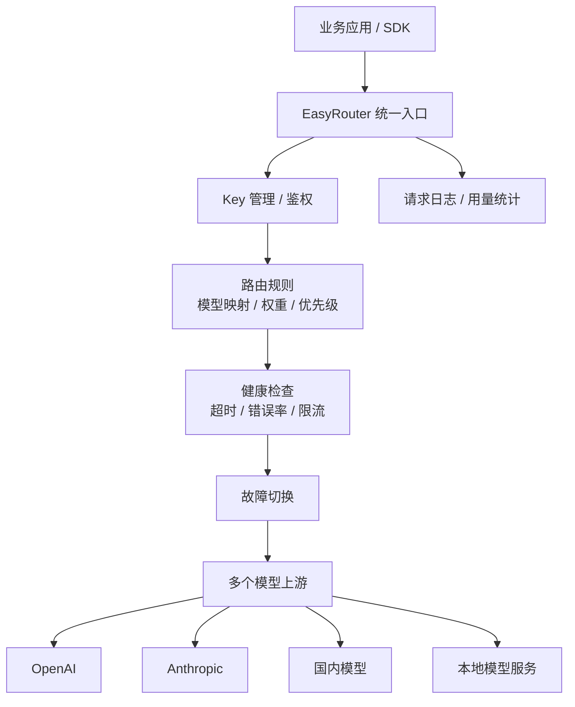

# 竞品分析：EasyRouter（路由器型网关类别）

**更新日期：** 2026年05月21日  
**信息来源：** 旧稿、社区路由网关实践、同类产品对比；注意与 [27-easyrouter.md](27-easyrouter.md) 的 easyrouter.io 区分  
**竞争优先级：** 中（路由与统一入口类别竞品，具体实现需核实）  
**参考地址：**

1. 具体实体产品分析：[EasyRouter.io](27-easyrouter.md)
2. 参考竞品：[LiteLLM](16-litellm.md)
3. 参考竞品：[Bifrost](15-bifrost.md)
4. 参考竞品：[Portkey](19-portkey.md)
5. 参考竞品：[OpenAI Router](14-OpenAI-Router.md)

---

## 1. 结论摘要

本文件保留为“EasyRouter 路由器型网关类别”的分析，避免与 [27-easyrouter.md](27-easyrouter.md) 中已经核实的 `easyrouter.io` 实体产品混淆。这里的 EasyRouter 指一类轻量模型路由工具：通过 OpenAI-compatible API 暴露统一入口，在多个上游模型或供应商之间做规则选择、主备切换、健康检查和基础成本/延迟优化。

这类产品的价值在于“简单把路由跑起来”：业务侧仍调用 OpenAI SDK，平台侧通过配置规则决定请求走哪个模型、哪个 Key、哪个上游。当客户处于早期工程阶段、团队很小、只想规避单一上游故障时，EasyRouter 类工具很有吸引力。但它通常不是完整企业 MaaS：缺少组织权限、预算审批、合同合规、审计留痕、语义缓存、成本分摊和可观测闭环。

MaaS 与 EasyRouter 类工具的竞争重点不是“谁能转发”，而是“谁能把模型路由变成企业可治理的生产能力”。

---

## 2. 产品概况

| 项目 | 内容 |
| --- | --- |
| 产品名称 | EasyRouter（类别分析） |
| 产品形态 | 轻量模型路由与统一入口工具 |
| 部署方式 | 通常为自托管或轻量 SaaS，具体取决于实现 |
| 核心定位 | OpenAI-compatible API Router / Failover Gateway |
| 目标用户 | 内部平台工程师、个人开发者、小团队、需要快速多上游切换的项目 |
| 典型场景 | 模型切换、主备容灾、按权重分流、低成本模型替换、统一 API Base |
| 竞争类型 | 路由器型网关，与 LiteLLM/Bifrost/Portkey/MaaS 路由模块局部重叠 |
| 核实状态 | 资料分散，能力需按具体项目核实 |

---

## 3. 技术架构

| 层级 | 说明 |
| --- | --- |
| 入口层 | 对外保持 OpenAI-compatible，让业务侧低成本迁移 |
| Key 层 | 管理平台 Key 或上游 Key，部分实现支持配额 |
| 规则层 | 通过模型名、权重、优先级、成本、延迟等规则选择上游 |
| 健康层 | 检测上游是否可用，并在异常时切换 |
| 日志层 | 提供基础请求、错误、耗时和消耗记录 |

---

## 4. 核心能力

| 分类 | 能力 | 成熟度 | 说明 |
| --- | --- | --- | --- |
| OpenAI 兼容 | 统一 `/v1/chat/completions` 等接口 | 中高 | 类别基本能力 |
| 多上游配置 | 配置多个 provider/key/base URL | 中 | 取决于具体实现 |
| 模型映射 | 请求模型映射到实际上游模型 | 中 | 适合兼容客户端 |
| 权重路由 | 按权重分流 | 中 | 灰度和负载分摊常见 |
| 优先级路由 | 主备切换 | 中 | 容灾基础能力 |
| 健康检查 | 超时、错误率、429/5xx | 中低 | 很多实现较粗糙 |
| fallback | 失败后换上游 | 中 | 未必支持跨模型质量对齐 |
| 成本路由 | 低价优先 | 中低 | 需要价格表维护 |
| 延迟路由 | 低延迟优先 | 中低 | 需要持续测速 |
| 可观测 | 基础日志 | 低到中 | 通常弱于 Helicone/Portkey |
| 企业治理 | RBAC、预算、审批 | 低 | 通常不是核心 |

---

## 5. 路由与容灾重点

### 5.1 规则类型

| 规则 | 说明 | 风险 |
| --- | --- | --- |
| 模型名规则 | `gpt-4` 走 A，上游不可用走 B | 模型能力差异可能导致结果不一致 |
| 权重规则 | A 70%、B 30% | 缺少健康感知会把流量打到坏节点 |
| 主备规则 | 先走主供应商，失败再备份 | 容灾简单但延迟会增加 |
| 成本规则 | 优先便宜模型 | 可能牺牲质量 |
| 延迟规则 | 优先低延迟节点 | 需要稳定测速和地区信息 |
| 手动规则 | 管理员指定某业务走某上游 | 运维成本高 |

### 5.2 生产风险

| 风险 | 说明 |
| --- | --- |
| fallback 后质量漂移 | 备用模型不等价，输出风格和能力可能变化 |
| 重试放大成本 | 多次重试会增加延迟和上游费用 |
| 黑盒路由 | 没有日志解释时，业务不知道为什么选某模型 |
| 规则冲突 | 成本、延迟、稳定性、合规目标可能互相冲突 |
| 健康检查误判 | 瞬时网络问题可能触发错误切换 |

---

## 6. 与 MaaS 平台对比

| 对比维度 | MaaS 平台 | EasyRouter 类工具 |
| --- | --- | --- |
| OpenAI 兼容入口 | 支持 | 支持 |
| 路由规则 | 多维策略、租户级、版本化 | 基础权重/优先级/主备 |
| 容灾 fallback | 错误类型、跨模型、熔断冷却 | 基础失败切换 |
| 语义缓存 | 支持 | 通常不支持 |
| 可观测 | 请求、路由、成本、质量、审计 | 基础日志 |
| 企业治理 | RBAC、预算、审批、合规 | 通常缺失 |
| 私有化 | 标准交付 | 取决于具体项目 |
| 成本分摊 | 部门/项目/应用/Key | 通常较弱 |
| 平台完整度 | 高 | 中低 |

---

## 7. 优势、劣势与销售应对

### 7.1 优势

| 优势 | 说明 |
| --- | --- |
| 轻量 | 部署和理解成本低 |
| 路由心智直接 | 客户容易理解“多上游切换”的价值 |
| 改造小 | OpenAI-compatible 接口便于迁移 |
| 适合早期项目 | 小团队可快速搭建冗余入口 |

### 7.2 劣势

| 劣势 | 说明 |
| --- | --- |
| 企业治理不足 | 预算、审批、审计、合规通常缺失 |
| 可观测弱 | 很难解释每次路由和 fallback 的原因 |
| 策略深度有限 | 多为简单规则，缺少 SLA/合规/质量目标 |
| 长期维护不确定 | 具体项目差异大，社区活跃度不稳定 |

### 7.3 销售应对

对 EasyRouter 类工具，不要否认其工程价值。应承认它适合早期和轻量容灾，然后强调企业上线后还需要：策略审批、预算分摊、审计留痕、合规控制、可解释路由、告警闭环、供应商管理和私有化交付。MaaS 的价值在于把“路由工具”升级成“模型运营平台”。

---

## 8. 信息核实与待跟进

| 信息项 | 状态 | 备注 |
| --- | --- | --- |
| 具体官方项目 | 未唯一确认 | 本文件为类别分析 |
| 与 27 文件关系 | 已区分 | 27 为 easyrouter.io 实体产品 |
| 路由能力 | 类别归纳 | 具体能力需按仓库核实 |
| 企业能力 | 通常较弱 | 不应默认存在 |
| 适用场景 | 已明确 | 工程路由/轻量容灾 |

---

## 9. 总结

EasyRouter 类产品代表了客户对“多模型路由和故障切换”的直接需求。它们轻、快、易理解，但很难自然演进成企业级 MaaS。MaaS 应吸收其低门槛、规则直观和 OpenAI 兼容优势，并在策略治理、可观测、预算、审计、合规、私有化和语义缓存上拉开差距。
