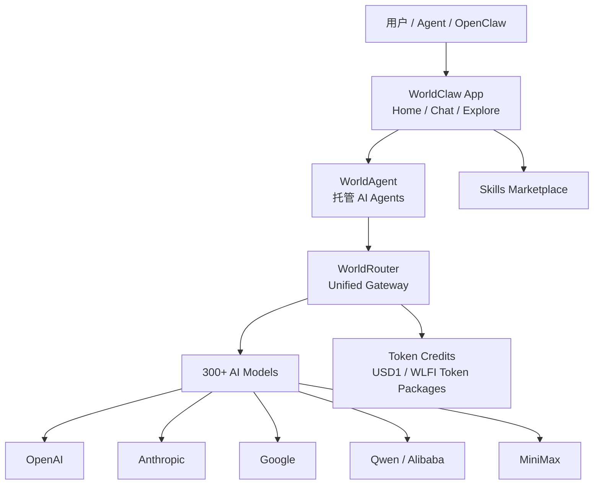

# 竞品分析：WorldClaw / WorldRouter

**更新日期：** 2026年05月21日  
**信息来源：** WorldClaw 官网、WorldRouter 页面、产品介绍、用户调研记录  
**竞争优先级：** 中（Agent OS + 托管模型网关，资料有限但定位已较清晰）  
**参考地址：**

1. 官网：[WorldClaw](https://worldclaw.ai/)
2. WorldAgent 锚点：[WorldAgent](https://worldclaw.ai/#worldagent)
3. WorldRouter：[WorldRouter](https://worldrouter.ai/)
4. Terms：[Terms of Service](https://worldclaw.ai/terms)
5. Privacy：[Privacy Policy](https://worldclaw.ai/privacy-policy)

---

## 1. 结论摘要

WorldClaw 不是旧稿里“资料有限的轻量 AI 接入工具”，它的官网定位已经更清楚：以“Run hundreds of agents on one operating system”为主叙事，包含三块产品：WorldRouter、WorldAgent 和 WorldClaw App。其中与 MaaS 最相关的是 **WorldRouter**，官网称其为 unified gateway for AI models 和 accessible token marketplace，可访问 300+ AI models，并以约低于官方和 OpenRouter 30% 的 token 价格作为核心卖点。

WorldClaw 的竞争方式与 OpenRouter/OfoxAI/EasyRouter 不完全相同。它一边做模型网关和 token marketplace，一边做 Agent OS/App，试图把模型调用、Agent 部署、技能市场和个人/团队 AI 操作系统放在一起。对 MaaS 平台而言，WorldRouter 是模型入口竞品，WorldAgent/WorldClaw App 则是上层 Agent 应用生态，可能绕过传统企业平台，从终端用户和 Agent 工具入口切入。

需要注意，WorldClaw 公开资料仍偏官网营销，缺少详细 API 文档、路由策略、fallback 规则、企业审计、权限、SLA、数据留存和合规认证说明。本文档应把“已核实官网主张”和“待实测能力”分开，避免把 300+ 模型、30% 折扣、Agent OS 等营销信息直接等同于成熟企业网关能力。

---

## 2. 产品概况

| 项目 | 内容 |
| --- | --- |
| 产品名称 | WorldClaw / WorldRouter / WorldAgent |
| 公司主体 | WorldClaw Limited |
| 产品定位 | Agent OS + 统一模型网关 + Token Marketplace |
| 核心模块 | WorldRouter、WorldAgent、WorldClaw App |
| 模型规模 | 官网宣称 WorldRouter 可访问 300+ AI models |
| 部署形态 | SaaS 托管服务，未见自部署 |
| 目标用户 | Agent 用户、OpenClaw 用户、需要低成本多模型入口的开发者和个人用户 |
| 典型场景 | AI Agent 任务、OpenClaw 一键部署、多模型调用、token package 购买、Agent 技能市场 |
| 商业模式 | 一次性 token plan，支持 USD1 支付或锁定 WLFI tokens 解锁套餐 |
| 竞争类型 | 托管模型聚合网关 + Agent 应用生态，与 OpenRouter/EasyRouter/OfoxAI 局部重叠 |

官网价格区展示 Lite、Standard、Pro、Max token plan，token credits 可用于 WorldRouter 与 WorldClaw App。这说明 WorldClaw 把模型调用和上层 Agent 产品放在同一个 token 体系中经营，而不是单独卖 API。

---

## 3. 产品定位与典型场景

| 场景 | WorldClaw 解决的问题 | 价值 |
| --- | --- | --- |
| 多模型低成本访问 | 用户想通过一个入口访问大量模型并降低 token 成本 | WorldRouter 宣称 300+ 模型和约 30% 折扣 |
| Agent 一体化 | 用户不想自己搭 Agent 运行环境 | WorldAgent 声称一键部署托管 AI agents |
| OpenClaw 生态 | OpenClaw 用户需要模型入口、App 和技能市场 | WorldClaw App 提供 OpenClaw、WorldRouter、skills marketplace |
| 个人 AI 操作系统 | 用户希望从一个 App 管理 AI 任务 | WorldClaw App 覆盖 Home、Chat、Explore 等入口 |
| Token 套餐 | 用户希望一次性购买 AI credits，而非订阅 | 提供 Lite/Standard/Pro/Max token packages |

与 API2D/EasyRouter 不同，WorldClaw 不只是 base URL 替换型产品。它把模型入口、Agent App、技能市场和 token 经济打包，产品叙事更偏消费级和 Agent 生态。

---

## 4. 技术架构

| 层级 | 说明 |
| --- | --- |
| App 层 | 面向终端用户的 WorldClaw App，强调 AI agents operating system |
| Agent 层 | WorldAgent，官网称 Q2 2026 launch，一键部署托管 Agent |
| Gateway 层 | WorldRouter，统一模型网关和 token marketplace |
| 模型层 | 300+ 模型，官网举例包括 Claude、GPT、Gemini、Qwen、MiniMax 等 |
| 计费层 | token credits，可用 USD1 或锁定 WLFI tokens 获取套餐 |
| 生态层 | OpenClaw 与 skills marketplace，偏 Agent 应用生态 |

---

## 5. 核心功能总览

| 分类 | 能力 | 成熟度 | 说明 |
| --- | --- | --- | --- |
| 统一模型入口 | WorldRouter 访问 300+ 模型 | 中 | 官网主张明确，但 API 细节需实测 |
| 成本折扣 | 约低于官方/OpenRouter 30% | 中 | 官网声明为示例价格，不保证未来价格和可用性 |
| Agent 平台 | WorldAgent 一键部署托管 Agent | 低到中 | 官网显示 Q2 2026 launching |
| App 体验 | WorldClaw App 管理 AI Agent 任务 | 中 | 偏终端用户应用，不是企业控制台 |
| OpenClaw 集成 | 一键部署 OpenClaw、接入 WorldRouter | 中 | 对 Agent/Coding 工具用户有吸引力 |
| Token 套餐 | Lite/Standard/Pro/Max | 中 | 一次性购买，不是订阅 |
| 路由策略 | 未见公开细节 | 低 | 缺少 provider sort、fallback、健康检查说明 |
| 可观测 | 未见成熟 API 日志/成本看板说明 | 低 | 需要登录或文档核实 |
| 企业治理 | 未见 RBAC、审计、预算中心 | 低 | 更偏个人和 Agent 生态 |
| 私有化 | 未见 | 低 | SaaS 托管为主 |

---

## 6. 路由、规则与容灾

WorldRouter 的名称暗示其具备模型路由属性，但当前官网公开资料更多强调“unified gateway”和“token marketplace”，没有充分展示企业级路由规则。

| 能力 | 当前公开状态 | 判断 |
| --- | --- | --- |
| 多模型统一入口 | 已宣传 300+ 模型 | 已核实官网主张 |
| 价格优化 | 宣称约 30% 折扣 | 需核实实时价格与供应链 |
| Provider 路由 | 未见细节 | 不应写成已支持 |
| 模型 fallback | 未见显式配置 | 不应写成已支持 |
| 自动 failover | 未见公开说明 | 待核实 |
| 熔断冷却 | 未见 | 待核实 |
| 可解释路由日志 | 未见 | 待核实 |
| SLA | 未见明确平台 SLA | 待核实 |

### 6.1 与 MaaS 的路由差距

MaaS 如果要对 WorldRouter 形成优势，应重点展示：显式模型 fallback、错误类型触发、成本/延迟/质量路由、供应商健康检查、熔断冷却、路由决策日志和租户级策略版本。WorldClaw 目前更像“便宜且统一的模型入口”，不是可审计的企业策略路由平台。

---

## 7. 计费与商业模式

WorldClaw 的计费非常有辨识度：不是传统 API 充值，也不是月订阅，而是 token plan。

| 套餐 | 官网价格 | 权益 |
| --- | --- | --- |
| Lite | $4.99 | 1,000 AI token credits，10 WorldClaw points |
| Standard | $29 | 3,000 AI token credits，100 WorldClaw points |
| Pro | $99 或锁定 19K WLFI tokens | 10,000 AI token credits，1,500 points |
| Max | $199 或锁定 39K WLFI tokens | 20,000 AI token credits，3,000 points |

官网也提示 WorldClaw 是 WorldClaw 直接提供的第三方服务，不由 World Liberty Financial LLC 或其关联方提供、管理或控制。对企业客户来说，这种 token/加密资产相关支付叙事可能增加采购和合规评估复杂度。

---

## 8. 与 OpenRouter、EasyRouter、OfoxAI 对比

| 维度 | WorldClaw/WorldRouter | OpenRouter | EasyRouter | OfoxAI |
| --- | --- | --- | --- | --- |
| 核心定位 | Agent OS + Token Marketplace + Gateway | 模型市场 + 路由平台 | 企业 AI API Gateway | 企业 LLM Gateway |
| 模型规模 | 300+ 主张 | 500+ | 40+ | 100+ |
| 成本卖点 | 约 30% 折扣 | 模型市场透明价格 | 官方价与合规上游 | 0% 手续费与返利 |
| Agent 生态 | 强，WorldAgent/WorldClaw App | 中 | Coding Agent 工具支持 | Agent/IDE 工具支持 |
| 路由策略 | 未公开 | 强 | 中 | 中高 |
| 企业治理 | 弱 | 中 | 中 | 中 |
| 合规采购 | 待核实，token 支付复杂 | 中 | 国际 Invoice | 中 |
| 私有化 | 未见 | 未见 | 未见 | 未见 |

---

## 9. 与 MaaS 平台对比

| 对比维度 | MaaS 平台 | WorldClaw |
| --- | --- | --- |
| 多模型入口 | 支持 | 支持 300+ 主张 |
| 成本优化 | 路由、缓存、采购折扣 | 价格折扣主张 |
| Agent 应用生态 | 需建设 | WorldAgent/WorldClaw App 更强 |
| 路由/fallback | 可做企业策略 | 未见公开成熟能力 |
| 企业治理 | 强 | 弱 |
| 审计与合规 | 强 | 未见详细资料 |
| 私有化 | 可支持 | 未见 |
| 采购合规 | 本地合同/发票可做 | token/WLFI 相关叙事需评估 |
| 数据可观测 | 可做全链路 | 未见成熟说明 |

---

## 10. 优势、劣势与销售应对

### 10.1 优势

| 优势 | 说明 |
| --- | --- |
| Agent 叙事强 | 不只是 API，而是围绕 Agent OS 和 App 构建生态 |
| 模型数量和价格卖点直接 | 300+ 模型和约 30% 折扣很容易吸引个人用户 |
| OpenClaw 绑定 | 对 OpenClaw/Coding Agent 用户有天然入口优势 |
| 一次性 token plan | 比企业合同更轻，适合个人用户快速购买 |

### 10.2 劣势

| 劣势 | 说明 |
| --- | --- |
| 官方资料偏营销 | 缺少详细 API、路由、fallback 和观测文档 |
| 企业治理弱 | 未见 RBAC、预算、审计、审批、SLA |
| 支付与合规复杂 | USD1/WLFI token 相关叙事会增加企业采购阻力 |
| Agent 产品未完全成熟 | WorldAgent 显示 Q2 2026 launching |
| 私有化缺失 | 未见自部署能力 |

### 10.3 销售应对

面对 WorldClaw，MaaS 不应只比较模型数量和价格。应强调企业客户需要可控供应商、稳定 SLA、合规合同、预算审批、审计日志、私有化和可解释路由。WorldClaw 更适合个人 Agent 用户和轻量应用，MaaS 更适合企业生产平台。

---

## 11. 信息核实与待跟进

| 信息项 | 状态 | 备注 |
| --- | --- | --- |
| 官网定位 | 已核实 | Agent OS + WorldRouter |
| 模型数量 | 已核实官网主张 | 300+，需实时验证 |
| 折扣价格 | 已核实官网声明 | 示例价格，不保证未来价格 |
| WorldAgent | 已核实 | Q2 2026 launching |
| API 文档 | 未充分获取 | 需后续登录或查 WorldRouter 文档 |
| 路由/fallback | 未见 | 不应当作已支持 |
| 企业治理 | 未见 | 可作为 MaaS 差异点 |
| 合规采购 | 待核实 | token/WLFI 相关机制需法务关注 |

---

## 12. 总结

WorldClaw 是一个值得跟踪的 Agent 生态型竞品。它的 WorldRouter 会在多模型入口和低价 token 调用上与 OpenRouter、OfoxAI、EasyRouter、MaaS 产生竞争，而 WorldAgent/WorldClaw App 则可能从 Agent 工具和终端用户侧建立入口优势。当前它的企业级路由、fallback、审计、权限、合规和私有化能力公开资料不足，MaaS 应把它视为“Agent 入口和价格心智竞品”，而不是成熟企业 MaaS 替代品。
