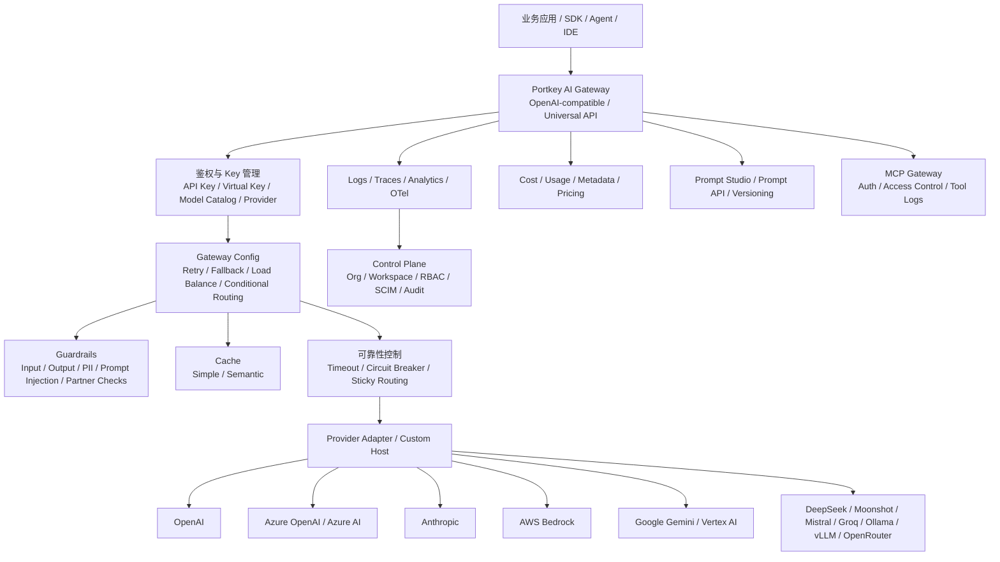

# 竞品分析：Portkey

**更新日期：** 2026年05月21日  
**信息来源：** Portkey 官方文档、GitHub 仓库、README、模型价格库、用户实测记录  
**竞争优先级：** 高（成熟 AI Gateway / AI Control Plane，与 LiteLLM、Bifrost 直接同赛道）  
**参考地址：**

1. GitHub：[Portkey-AI/gateway](https://github.com/Portkey-AI/gateway)
2. 官方文档：[Portkey Docs](https://portkey.ai/docs)
3. AI Gateway：[AI Gateway](https://portkey.ai/docs/product/ai-gateway)
4. Load Balancing：[Load Balancing](https://portkey.ai/docs/product/ai-gateway/load-balancing)
5. Fallbacks：[Fallbacks](https://portkey.ai/docs/product/ai-gateway/fallbacks)
6. Guardrails：[Guardrails](https://portkey.ai/docs/product/guardrails)
7. MCP Gateway：[MCP Gateway](https://portkey.ai/docs/product/mcp-gateway)
8. Portkey Models：[Portkey Models](https://portkey.ai/models)

> 用户调研记录中 Portkey Gateway GitHub Star 约 11.4k；本次核实时 GitHub 页面显示约 11.8k。Star 数变化较快，正式汇报前建议以 GitHub 实时数据复核。

---

## 1. 结论摘要

Portkey 是当前 AI Gateway / AI Control Plane 赛道中产品化程度较高的代表之一。它同时提供开源 Gateway、Hosted Gateway、Enterprise 私有化和完整控制台能力，核心价值是把不同模型供应商、不同 API 协议和不同组织治理规则统一到一个网关与控制面中。

与 One API、new-api、one-hub 这类“API 分发后台”不同，Portkey 更偏企业级 LLMOps 基础设施：它强调可组合的 Gateway Config、自动重试、fallback、加权负载均衡、条件路由、sticky routing、request timeout、circuit breaker、simple/semantic cache、Guardrails、Virtual Keys/Model Catalog、预算与速率限制、OpenTelemetry 可观测、Prompt Management、MCP Gateway、组织/工作区/RBAC/SSO/SCIM 以及企业私有化部署。

对 MaaS 平台而言，Portkey 是高优先级竞品。它在“路由可靠性、请求编排、护栏、观测、成本治理、Agent/MCP 治理”上已经形成比较完整的产品闭环。MaaS 要与之竞争，不能只强调多模型接入，而要在国内合规、私有云交付、企业账单、审批预算、中文生态、模型资产治理、SLA 运营和业务工作流上形成差异。

---

## 2. 产品概况

| 项目 | 内容 |
| --- | --- |
| 产品名称 | Portkey |
| 公司/组织 | Portkey AI |
| 产品定位 | AI Gateway / AI Control Plane / LLMOps 平台 |
| 开源项目 | `Portkey-AI/gateway`，MIT License |
| 技术栈 | Gateway 以 TypeScript 为主，支持 Node.js、Docker、Cloudflare Workers、企业 K8s/云部署 |
| 目标用户 | AI 平台团队、企业开发团队、基础设施团队、Agent 应用团队、需要统一治理 LLM 调用的组织 |
| 典型场景 | 多模型统一入口、可靠路由、fallback、负载均衡、Guardrails、观测、成本追踪、模型目录、MCP 治理、Prompt 管理 |
| 产品形态 | 开源 Gateway + Hosted SaaS + Enterprise 私有化/混合部署 |
| 竞争类型 | 企业级 AI Gateway / LLM Control Plane |

Portkey 官方描述是：用一个快速友好的 API 路由到大量语言、视觉、音频和图像模型，并提供可靠性、安全、成本和可观测能力。GitHub README 同时强调开源 gateway、企业版、Hosted Gateway 和 MCP Gateway。

---

## 3. 产品定位与典型场景

| 场景 | Portkey 解决的问题 | 价值 |
| --- | --- | --- |
| 多模型统一接入 | OpenAI、Anthropic、Azure、Bedrock、Gemini、Mistral、Groq、本地模型等接口差异大 | 通过统一 Gateway 和 SDK 屏蔽供应商差异 |
| 可靠性治理 | LLM 上游经常超时、限流、故障、输出不合规 | 用 retries、fallbacks、timeouts、circuit breaker 和 guardrails 保证连续性 |
| 负载均衡 | 单供应商、单账号、单 region 容量有限 | 在多个 provider、模型或 API Key 之间按权重分发 |
| 条件路由 | 不同业务、用户、环境、metadata 需要走不同模型 | 通过 Config 和 metadata 做条件路由与策略编排 |
| 成本控制 | 多团队共用模型，费用归属和预算难管理 | 用模型价格库、metadata、预算和 rate limit 做成本归因 |
| 缓存降本 | 重复或相似请求造成成本和延迟浪费 | 支持 simple cache 和 semantic cache |
| AI 安全 | Prompt injection、PII 泄露、输出格式错误、违规内容 | 提供内置与合作伙伴 Guardrails，可阻断、记录、重试或 fallback |
| 观测调试 | AI 请求链路、错误、token、成本、延迟难追踪 | 提供日志、trace、analytics、OpenTelemetry 和导出能力 |
| Agent 治理 | Agent 使用 MCP 工具时凭证、权限、日志分散 | 用 MCP Gateway 统一鉴权、授权、凭证注入和工具调用日志 |
| 企业控制面 | 组织、工作区、API Key、权限、SSO、SCIM、审计需要集中管理 | Enterprise 版提供组织和治理能力 |

---

## 4. 技术架构



| 层级 | 说明 |
| --- | --- |
| Gateway 接入层 | 暴露 OpenAI-compatible、Universal API、Responses API、Anthropic Messages 等接口 |
| Provider/Model 层 | 管理供应商凭证、模型访问、价格、workspace 权限和 custom model |
| Config 编排层 | 用 JSON Config 组合 retry、fallback、loadbalance、condition、cache、timeout、guardrails 等策略 |
| 可靠性层 | 自动重试、指数退避、fallback 链、request timeout、circuit breaker、sticky routing |
| 安全护栏层 | 输入/输出 Guardrails、PII redaction、prompt injection、JSON schema、合作伙伴护栏、自定义 webhook |
| 缓存层 | Simple cache 和 semantic cache，用于降本和降延迟 |
| 观测层 | Logs、Traces、Analytics、Feedback、OpenTelemetry、日志导出和外部追踪集成 |
| 成本治理层 | Portkey Models 价格库、metadata、预算、rate limit、workspace/provider/model 成本归因 |
| Agent/MCP 层 | 统一管理 MCP server、工具权限、身份转发、凭证注入和调用日志 |
| 企业控制面 | 组织、工作区、RBAC、SSO、SCIM、审计日志、KMS、Secret References、私有化部署 |

---

## 5. 部署与运行

### 5.1 开源 Gateway 快速启动

Portkey Gateway 可通过 `npx` 本地启动：

```bash
npx @portkey-ai/gateway
```

默认服务：

```text
Gateway API: http://localhost:8787/v1
Gateway Console: http://localhost:8787/public/
```

用户实测使用 Docker：

```bash
docker run --rm -p 8787:8787 portkeyai/gateway:latest
```

Docker Compose 示例：

```yaml
version: '3'
services:
  web:
    ports:
      - "8787:8787"
    image: "portkeyai/gateway:latest"
    restart: always
```


### 5.2 部署形态

| 形态 | 说明 | 适合场景 |
| --- | --- | --- |
| Local / NPX | 本地开发一条命令启动 | 快速体验、开发调试 |
| Docker | 本地或服务器容器部署 | 小规模自托管 |
| Cloudflare Workers | 边缘部署，适合低延迟代理 | 全球化轻量场景 |
| Hosted Gateway | Portkey SaaS 托管 | 不想自运维的团队 |
| Enterprise Private / Hybrid | AWS、Azure、GCP、OpenShift、Kubernetes 等企业部署 | 安全、合规、私有化和大规模生产 |

### 5.3 生产部署注意事项

| 事项 | 建议 |
| --- | --- |
| Key 管理 | 生产环境不要在命令行或文档中暴露上游 Key，使用 Secret Manager 或 Secret References |
| 日志合规 | 配置请求日志字段，避免记录敏感 Prompt、PII 和完整响应 |
| 高可用 | 多副本部署需要评估 Redis/缓存状态、负载均衡、健康检查和滚动升级 |
| 企业版边界 | SSO、SCIM、KMS、完整 RBAC、审计、私有云架构等能力需核实授权版本 |
| 成本数据 | Portkey Models 价格库需与客户真实合同价、折扣价和区域价做校准 |
| 国内合规 | 如果面向国内生成式 AI 服务，需要补备案、内容安全、实名、日志留存和数据边界评估 |

---

## 6. 核心功能总览

| 分类 | 能力 | 成熟度 | 说明 |
| --- | --- | --- | --- |
| 接口兼容 | OpenAI-compatible / Universal API / Responses / Messages | 高 | 覆盖主流调用协议和 SDK 迁移场景 |
| 多供应商 | 45+ provider、1600+ 模型宣传口径，模型价格库覆盖更多 | 高 | 支持国际、云厂商、本地和 OpenAI-compatible 上游 |
| 路由编排 | Config 驱动策略 | 高 | retry、fallback、loadbalance、conditional routing 可组合 |
| 负载均衡 | weighted load balancing | 高 | 支持 provider、model、API Key 维度分流 |
| Sticky Routing | 基于 metadata 等字段保持会话粘性 | 高 | 适合 A/B、会话一致性、用户体验一致性 |
| 容灾降级 | retries、fallback、timeouts、circuit breaker | 高 | 支持按状态码触发 fallback，日志可追踪 fallback 链 |
| Guardrails | 输入/输出护栏、PII、Prompt Injection、JSON Schema、合作伙伴护栏 | 高 | 可同步阻断、异步记录、重试、fallback、反馈入库 |
| 缓存 | simple cache、semantic cache | 中高 | 降低重复请求成本和延迟 |
| 观测 | logs、traces、analytics、feedback、OpenTelemetry | 高 | 支持成本、延迟、错误、用户维度分析 |
| 成本治理 | Portkey Models、metadata、预算、rate limit | 高 | 支持成本归因和限制策略 |
| Prompt | Prompt Studio、Prompt API、版本、标签、partial | 中高 | 偏 SaaS/Enterprise 控制台能力 |
| MCP | MCP Gateway、MCP Registry、工具权限、身份转发 | 高 | 面向 Agent 工具调用治理 |
| 企业治理 | Org、Workspace、RBAC、SSO、SCIM、Audit、KMS | 高 | 主要在企业版/托管控制面中体现 |
| 开源网关 | MIT License、快速本地部署 | 中高 | 轻量、可自托管，但完整控制面需 Hosted/Enterprise |

---

## 7. 供应商、模型与价格库

Portkey 支持 OpenAI、Azure OpenAI、Anthropic、AWS Bedrock、Google Gemini、Google Vertex AI、Cohere、Mistral、Groq、DeepSeek、Moonshot、OpenRouter、Ollama、vLLM、Stability AI、Replicate、Together AI、Fireworks、Dashscope、Zhipu 等供应商或兼容端点。

Portkey Models 是一个独立的开源模型价格与配置数据库，用于成本归因。官方模型页面显示覆盖 3,508 个模型、39+ providers、313 endpoints；GitHub README 中也描述为覆盖 2,000+ 模型、40+ providers。该差异说明数据在持续更新，正式汇报时应以实时页面为准。

| 能力 | 说明 |
| --- | --- |
| Model Catalog | 集中管理 provider、model、workspace access、pricing 和 usage limit |
| 自定义模型 | 可添加 custom/fine-tuned models，并配置价格和访问范围 |
| 价格覆盖 | 支持 input token、output token、cache read/write、audio、image、web search、thinking token、batch 等复杂费用项 |
| 成本归因 | 结合 metadata、用户、workspace、provider、model 做分析 |
| 合同价适配 | 可通过 pricing override、adjustment 或企业配置匹配客户真实成本 |

---

## 8. 路由策略与规则

Portkey 的路由核心是 Gateway Config。Config 可以直接随请求传入，也可以在控制台创建后用 Config ID 引用。相比只做“模型名匹配”的网关，Portkey 的策略更强调组合和编排。

### 8.1 Weighted Load Balancing

典型配置：

```json
{
  "strategy": {
    "mode": "loadbalance"
  },
  "targets": [
    {
      "provider": "@openai-prod",
      "weight": 0.7
    },
    {
      "provider": "@azure-prod",
      "weight": 0.3
    }
  ]
}
```

能力要点：

| 能力 | 说明 |
| --- | --- |
| provider 间分流 | OpenAI、Azure、Anthropic、Bedrock 等之间按权重分发 |
| model 间分流 | 新旧模型、便宜/高质量模型之间按比例分发 |
| 多 API Key 分流 | 同供应商多账号或多 Key 分担 rate limit |
| 渐进迁移 | 新模型先小比例承接流量，稳定后逐步提高权重 |
| 权重为 0 | 可临时停止目标承接流量而不删除配置 |

### 8.2 Sticky Load Balancing

Sticky routing 可以用 `metadata.user_id`、`metadata.session_id` 等字段做哈希，让同一用户或会话持续命中同一目标。

```json
{
  "strategy": {
    "mode": "loadbalance",
    "sticky": {
      "enabled": true,
      "hash_fields": ["metadata.user_id"],
      "ttl": 3600
    }
  },
  "targets": [
    {
      "provider": "@openai-prod",
      "weight": 0.5
    },
    {
      "provider": "@anthropic-prod",
      "weight": 0.5
    }
  ]
}
```

官方说明 sticky sessions 使用两级缓存：内存 + Redis。无 Redis 时，多实例场景只能在单实例内存中保持粘性。

### 8.3 Conditional Routing

Portkey 文档索引中包含 Conditional Routing 和组合策略案例，适合按请求 metadata、用户、环境、模型能力、地区或业务标签路由。例如：

| 条件 | 路由意图 |
| --- | --- |
| `metadata.env = prod` | 生产请求走稳定模型，测试请求走实验模型 |
| `metadata.tier = premium` | 高价值客户走高质量模型 |
| `metadata.region = eu` | 欧盟用户走满足数据边界要求的供应商 |
| `metadata.task = coding` | 编码任务走代码能力更强的模型 |
| `metadata.cost_center` | 结合成本中心做预算和账单归因 |

### 8.4 Custom Host 与 BYO Provider

用户实测中使用 `x-portkey-custom-host` 将 OpenAI provider 请求转到 Moonshot 兼容地址。这体现了 Portkey 对 OpenAI-compatible / custom host 的适配能力。

脱敏示例：

```bash
curl http://127.0.0.1:8787/v1/chat/completions \
  -H "Authorization: Bearer sk-***" \
  -H "x-portkey-provider: openai" \
  -H "x-portkey-custom-host: https://api.moonshot.cn/v1" \
  -H "Content-Type: application/json" \
  -d '{
    "model": "moonshot-v1-8k",
    "messages": [
      {
        "role": "user",
        "content": "你好，你是谁？"
      }
    ]
  }'
```

---

## 9. 容灾降级与可靠性

Portkey 的可靠性能力比较完整，且可以与 Guardrails、缓存、条件路由组合。

### 9.1 Fallbacks

典型 fallback 配置：

```json
{
  "strategy": {
    "mode": "fallback"
  },
  "targets": [
    {
      "override_params": {
        "model": "@openai-prod/gpt-4o"
      }
    },
    {
      "override_params": {
        "model": "@anthropic-prod/claude-3-5-sonnet-20241022"
      }
    }
  ]
}
```

按状态码触发 fallback：

```json
{
  "strategy": {
    "mode": "fallback",
    "on_status_codes": [429, 503]
  },
  "targets": [
    {
      "provider": "@openai-prod"
    },
    {
      "provider": "@azure-prod"
    }
  ]
}
```

### 9.2 Retries

README 示例中通过 `retry.attempts` 设置自动重试：

```json
{
  "retry": {
    "attempts": 5
  }
}
```

官方描述是自动重试失败请求，并使用指数退避避免网络拥塞。适合处理临时 5xx、网络抖动、上游短暂不可用等问题。

### 9.3 Request Timeouts

Request timeout 用于控制上游长时间无响应，避免单个 LLM 请求拖垮业务线程或用户体验。它适合与 fallback 组合：超时后切换到备用模型或备用供应商。

### 9.4 Circuit Breaker

文档索引中包含 Circuit Breaker：当目标不健康时自动停止路由，直到恢复。该能力对于生产级网关非常重要，因为它能避免持续向已故障 provider 打流量。

### 9.5 路由可追踪

Portkey fallback 文档说明可通过 Config ID 和 Trace ID 查看 fallback 链路中的所有尝试。这一点对排查“为什么最终用了某个模型”“为什么 fallback”很关键。

---

## 10. Guardrails 与安全策略

Portkey 的 Guardrails 是它与普通网关拉开差距的重要能力。它支持对输入和输出做校验，并可在 Gateway 层执行同步阻断、异步记录、重试、fallback、反馈记录等动作。

### 10.1 Guardrails 类型

| 类型 | 说明 |
| --- | --- |
| Regex match | 检查输入或输出是否命中正则 |
| JSON Schema | 校验输出是否符合 JSON Schema |
| Contains Code | 检测 SQL、Python、TypeScript 等代码片段 |
| Prompt Injection | LLM-based 检测提示词注入 |
| Detect Gibberish | 检测乱码或异常文本 |
| PII Redaction | 敏感信息检测与脱敏 |
| Moderation | 内容安全和违规内容检查 |
| Partner Guardrails | 集成 Aporia、Pillar、Qualifire、CrowdStrike AIDR、AWS/Azure Guardrails 等 |
| Custom Guardrails | 通过自定义 webhook 或 raw JSON 接入自有护栏 |

### 10.2 Config 接入方式

```json
{
  "retry": {
    "attempts": 3
  },
  "cache": {
    "mode": "simple"
  },
  "provider": "@openai-xxx",
  "input_guardrails": ["guardrails-id-xxx"],
  "output_guardrails": ["guardrails-id-yyy"]
}
```

### 10.3 护栏动作

| 动作 | 说明 |
| --- | --- |
| Async | 异步执行，只记录结果，不影响请求主链路 |
| Sync | 同步执行，可在请求前或响应前阻断 |
| Deny | 护栏失败时拒绝请求，Portkey 使用 446 状态码表达阻断 |
| Log Only | 护栏失败但继续处理，Portkey 使用 246 状态码表达软失败 |
| Sequential / Parallel | 可串行或并行运行多个检查 |
| Feedback | 将护栏结果作为 eval/feedback 数据记录 |
| Fallback / Retry | 可结合状态码对护栏失败做重试或 fallback |

### 10.4 与 MaaS 的关系

Portkey 的 Guardrails 已经非常接近企业客户对“AI 安全网关”的想象。MaaS 若只做模型调用和账单，会在安全治理上处于弱势；需要补齐内容安全、敏感信息脱敏、输出结构校验、Prompt 注入防护、护栏审计和策略版本管理。

---

## 11. 缓存与成本优化

Portkey 支持 simple cache 和 semantic cache。官方 README 将 Smart caching 列为成本管理能力，文档索引中也有 Cache、cache hit latency、cache hit rate、cache behavior 等页面。

| 能力 | 说明 | 价值 |
| --- | --- | --- |
| Simple cache | 对相同请求返回缓存结果 | 降低重复请求成本和延迟 |
| Semantic cache | 对语义相似请求命中缓存 | 适合 FAQ、客服、知识问答等重复问题场景 |
| Cache Analytics | 分析 cache hit rate、cache hit latency | 评估缓存收益 |
| Cache TTL/Behavior | 自托管环境可配置缓存行为 | 控制一致性与成本收益平衡 |
| Cost Attribution | 结合 Portkey Models 和 metadata 做成本归因 | 让缓存节省可量化 |

对 MaaS 平台来说，Portkey 的缓存能力意味着“语义缓存”已是高端 AI Gateway 的标配能力之一，不能只作为附加优化项看待。

---

## 12. 观测、日志与分析

Portkey 的观测能力覆盖日志、trace、analytics、feedback、OpenTelemetry 和导出。

| 能力 | 说明 |
| --- | --- |
| Logs | 按时间查看请求、模型、provider、状态码、成本、延迟、错误 |
| Trace | 查看一次请求的生命周期，包含 fallback、guardrail、cache 等链路信息 |
| Analytics | 请求量、token、成本、延迟、错误率、cache hit、status code、用户等图表 |
| Metadata | 在请求中附加用户、租户、业务、环境、成本中心，用于分析和治理 |
| Feedback | 将用户反馈、护栏结果、评价数据与请求关联 |
| OTel | 支持 OpenTelemetry 观测和外部 collector/export |
| Logs Export | 企业版支持完整日志导出，用于审计和离线分析 |
| Auto-Instrumentation | 对多种 LLM/Agent 框架自动埋点 |

Portkey 的强点不是简单“记录请求日志”，而是把请求编排策略、成本、用户 metadata、护栏结果和 trace 放在同一个控制面里。这对平台工程团队很有吸引力。

---

## 13. Prompt Management 与实验

Portkey 不只是 Gateway，还提供 Prompt Engineering Studio、Prompt API、Prompt Library、Prompt Playground、Prompt Versioning、Labels、Partials、Prompt Observability 等功能。

| 能力 | 说明 |
| --- | --- |
| Prompt Library | 集中管理 Prompt 模板 |
| Prompt Versioning | 记录版本、标签和发布状态 |
| Prompt API | 业务可通过 API 执行保存的 Prompt |
| Prompt Playground | 团队协作调试 Prompt 和模型参数 |
| A/B Test | 文档中包含 prompt/model A/B 测试实践 |
| Smart Fallback with Model-Optimized Prompts | fallback 到不同模型时可配合模型优化 Prompt |

这部分能力使 Portkey 更像 LLMOps 控制面，而不只是网关。MaaS 如果面向企业开发者平台，也应考虑 Prompt 版本、Prompt 发布、评测和灰度实验能力。

---

## 14. MCP Gateway 与 Agent 治理

Portkey MCP Gateway 面向 Agent 工具调用场景，提供集中鉴权、访问控制、凭证注入和日志。

| 能力 | 说明 |
| --- | --- |
| MCP Registry | 管理 MCP servers、工具、资源和 prompts |
| Authentication | Client 只需向 Portkey 鉴权，由 Gateway 处理上游凭证 |
| Authorization | 控制用户、workspace、team 可访问哪些 server 和 tool |
| Identity Forwarding | 将用户身份、团队、角色转发给内部 MCP server |
| Credential Injection | 对 GitHub、Slack 等外部服务注入 OAuth/API Key |
| Observability | 记录谁在什么时间调用了什么工具、参数和响应 |
| Rate Limits | 对 MCP 请求按用户、团队或 server 限速 |
| Circuit Breakers | 对不健康 MCP server 做故障处理 |
| Client 生态 | 支持 Claude Desktop、Cursor、VS Code、自定义 Agent 等 MCP 客户端 |

Agent 和 MCP 治理会成为 MaaS 后续竞争重点。Portkey 已经把这一块产品化，说明“模型网关”正在升级成“Agent 控制平面”。

---

## 15. 用户实测记录

用户本地通过 Portkey Gateway 调用了 OpenAI、DeepSeek、Moonshot 等 provider，并验证了 OpenAI-compatible 调用方式。

OpenAI 示例，已脱敏：

```bash
curl http://127.0.0.1:8787/v1/chat/completions \
  -H "x-portkey-provider: openai" \
  -H "Authorization: Bearer sk-***" \
  -H "Content-Type: application/json" \
  -d '{
    "messages": [
      {
        "role": "user",
        "content": "Say this is test."
      }
    ],
    "max_tokens": 20,
    "model": "gpt-4"
  }'
```

DeepSeek 示例，已脱敏：

```bash
curl http://127.0.0.1:8787/v1/chat/completions \
  -H "Authorization: Bearer sk-***" \
  -H "x-portkey-provider: deepseek" \
  -H "Content-Type: application/json" \
  -d '{
    "model": "deepseek-chat",
    "messages": [
      {
        "role": "user",
        "content": "你好，请自我介绍一下"
      }
    ]
  }'
```

Moonshot 示例，已脱敏：

```bash
curl http://127.0.0.1:8787/v1/chat/completions \
  -H "Authorization: Bearer sk-***" \
  -H "x-portkey-provider: moonshot" \
  -H "Content-Type: application/json" \
  -d '{
    "model": "moonshot-v1-8k",
    "messages": [
      {
        "role": "user",
        "content": "你好，请自我介绍一下"
      }
    ]
  }'
```

用户实测响应中，Portkey 保持了 OpenAI Chat Completion 风格，并在部分响应中补充了 `provider` 字段。示例截图：


> 原始调研记录中包含完整上游 API Key。本次整理已移除明文 Key。后续建议检查历史版本、外部同步文档和截图，避免泄露可用密钥。

---

## 16. 与 LiteLLM / Bifrost / OpenRouter 对比

| 维度 | Portkey | LiteLLM | Bifrost | OpenRouter |
| --- | --- | --- | --- | --- |
| 产品形态 | 开源 Gateway + SaaS/Enterprise 控制面 | 开源 Proxy / Router | 开源高性能 AI Gateway | 托管模型市场与路由平台 |
| 网关定位 | AI Gateway / Control Plane | LLM Proxy / Router | 高性能 Gateway / Router | Hosted Router / Marketplace |
| 开源协议 | MIT | 以仓库实时声明为准 | Apache-2.0 | 非自托管网关 |
| 部署 | NPX、Docker、Workers、Hosted、Enterprise | Python、Docker、K8s | NPX、Docker、K8s、Go SDK | SaaS 为主 |
| 路由能力 | 高，可组合 Config | 高，策略丰富 | 高，weighted + fallback + cache | 高，provider routing |
| Fallback | 高，按状态码和组合策略 | 高 | 高 | 高 |
| Load Balancing | 高，权重、sticky、嵌套策略 | 高 | 高 | provider 侧路由 |
| Circuit Breaker | 有文档能力 | 有 cooldown/熔断风格能力 | 有健康/fallback 体系 | 平台内部处理 |
| Guardrails | 强，产品化护栏和伙伴生态 | 中高，需插件/集成 | 中高，插件/企业能力 | 中，偏策略与隐私设置 |
| 语义缓存 | 支持 | 支持/可配置 | 明确支持 | provider prompt cache |
| 观测 | 强，OTel、logs、traces、analytics | 中高 | 高 | 中高 |
| Prompt 管理 | 强 | 弱到中 | 弱到中 | 弱 |
| MCP/Agent 治理 | 强，MCP Gateway/Agent Gateway | 有 MCP 相关扩展但不是核心 | 有 MCP Gateway | 非核心 |
| 企业治理 | 强，Org/Workspace/RBAC/SSO/SCIM | 中高 | 中高 | 中 |
| 国内生态 | 中，支持部分国内 provider | 中 | 中 | 中低 |
| 商业支持 | 强，企业版和托管版 | 有商业能力 | 有商业能力 | SaaS 支持 |

---

## 17. 与 One API / new-api / one-hub 对比

| 维度 | Portkey | One API | new-api | one-hub |
| --- | --- | --- | --- | --- |
| 定位 | 企业 AI Gateway / LLMOps 控制面 | 国内开源 API 分发系统 | 国内开源网关与 AI 资产管理 | One API 二开增强分支 |
| 核心用户 | 企业平台团队 | 个人/小团队/API 分发站点 | 国内站点和自建团队 | One API 增强需求用户 |
| 路由策略 | Config 编排、fallback、loadbalance、condition、sticky | 负载均衡、失败重试 | 加权随机、失败重试 | 规则/供应商/模型筛选 |
| Guardrails | 强 | 弱 | 弱到中 | 弱 |
| 观测 | 强，OTel/trace/analytics | 基础日志 | 看板/日志 | Prometheus/Uptime Kuma |
| Prompt 管理 | 强 | 无 | 弱 | 无 |
| MCP 治理 | 强 | 无 | 无 | 无 |
| 支付/站点运营 | 不是重点 | 有额度/兑换码 | 有充值/计费 | 有支付/月账单 |
| 企业 RBAC | 强 | 弱 | 弱到中 | 弱到中 |
| 国内合规 | 需客户自行确认 | 自建方承担 | 自建方承担 | 自建方承担 |
| 开源自建成本 | 中 | 低 | 低到中 | 低到中 |

Portkey 不是 one-api 系产品的直接替代品。one-api 系更偏“把模型 API 卖出去/分发出去”，Portkey 更偏“把企业内部所有 LLM 和 Agent 调用治理起来”。

---

## 18. 与 MaaS 平台对比

| 对比维度 | MaaS 平台 | Portkey | 胜出方 |
| --- | --- | --- | --- |
| OpenAI 兼容入口 | 支持 | 支持 | 持平 |
| 多模型接入 | 支持 | 支持广泛 | 持平或 Portkey |
| 路由策略 | 成本、延迟、健康度、SLA、合规策略 | fallback、loadbalance、condition、sticky、circuit breaker | 持平，需看 MaaS 落地深度 |
| 容灾降级 | 应支持熔断、fallback、告警、自动恢复 | 能力成熟 | Portkey 对标压力大 |
| Guardrails | 需要建设内容安全和策略护栏 | 产品化成熟 | Portkey |
| 语义缓存 | 可作为差异化重点 | 支持 simple/semantic cache | 持平，需看缓存治理深度 |
| 观测与 Trace | 应支持请求、模型、成本、错误、链路 | OTel、logs、trace、analytics 成熟 | Portkey |
| 成本治理 | 企业账单、预算、成本中心、合同价 | metadata、预算、价格库、analytics | 各有侧重 |
| Prompt 管理 | 可建设为业务平台能力 | Prompt Studio 已成熟 | Portkey |
| MCP/Agent 治理 | 后续重点 | MCP Gateway/Agent Gateway 已布局 | Portkey |
| 国内合规 | 可做本地化、备案、内容安全、审计 | 国际产品，需客户评估 | MaaS |
| 私有化交付 | 可按国内企业环境适配 | Enterprise 支持 AWS/Azure/GCP/K8s | 持平，MaaS 本地化更优 |
| 业务闭环 | 可结合账户、合同、审批、工单、企业门户 | 更偏基础设施控制面 | MaaS |
| 中文生态 | 可深度适配国产模型、渠道和监管 | 支持部分国内 provider，但产品语境国际化 | MaaS |

---

## 19. 优势分析

| 维度 | 优势 |
| --- | --- |
| 产品成熟度 | 已从开源 gateway 扩展为完整控制面，能力覆盖 LLMOps 多个核心环节 |
| 路由编排 | Config 可组合，fallback、loadbalance、condition、guardrails、cache 可嵌套 |
| 可靠性 | retries、timeouts、fallback、circuit breaker、trace 形成完整生产可靠性链路 |
| Guardrails | 护栏能力产品化程度高，支持输入/输出、同步/异步、deny/log/fallback/retry |
| 观测 | logs、traces、analytics、feedback、OTel 和导出能力完善 |
| 成本数据 | Portkey Models 解决模型价格碎片化问题，支持复杂费用项 |
| 企业治理 | Org、Workspace、RBAC、SSO、SCIM、Audit、KMS、Secret References 等企业能力清晰 |
| MCP/Agent | 已将 MCP server 管理、工具权限和身份转发纳入控制面 |
| 生态集成 | 支持 OpenAI SDK、LangChain、LlamaIndex、CrewAI、Autogen、Vercel AI SDK、IDE/Agent 工具等 |
| 开源与商业结合 | 开源 gateway 降低试用门槛，Hosted/Enterprise 承接生产需求 |

---

## 20. 劣势与边界

| 维度 | 劣势或风险 | 影响 |
| --- | --- | --- |
| 完整能力版本边界 | 开源 Gateway 与 Hosted/Enterprise 能力边界需要逐项确认 | 采购或对标时不能把所有功能默认当成开源可用 |
| 国内合规 | 国际产品默认不等同于国内生成式 AI 合规方案 | 面向国内客户时需要补备案、内容安全、实名、数据路径说明 |
| 成本口径 | Portkey Models 是公开价格库，客户实际合同价可能不同 | 财务对账前需支持价格 override 和合同价校准 |
| 复杂度 | Config 编排能力强，但配置复杂度也更高 | 需要平台团队维护策略和最佳实践 |
| 自托管运维 | Docker/Workers 轻量，但企业级高可用、缓存、日志、OTel、KMS 仍需工程投入 | 小团队可能低估运维成本 |
| 数据出境 | Hosted 模式下日志、metadata、prompt 是否出境需要审查 | 金融、政企、医疗等行业采用需谨慎 |
| UI/文档语言 | 产品语境偏英文和国际开发者 | 国内客户培训、售前和运维材料需要本地化 |
| 供应商覆盖 | 支持国内模型，但国内生态适配深度需实测 | 国产模型参数、内容安全、专有接口可能需补适配 |
| 价格 | Enterprise/Hosted 商业价格需评估 | 与自建 MaaS 或国内产品相比可能有成本压力 |

---

## 21. 对 MaaS 平台的启示

### 21.1 必须对齐的能力

1. Gateway Config 需要产品化，不能只停留在后台表单配置。
2. 路由策略要支持 fallback、按状态码触发、加权负载均衡、条件路由和会话粘性。
3. 容灾体系要包含 retry、timeout、circuit breaker、健康检查、冷却、自动恢复和链路追踪。
4. Guardrails 必须成为网关层能力，支持输入/输出、同步/异步、阻断/记录/重试/fallback。
5. 观测必须把 trace、日志、成本、错误、fallback、guardrail、cache 命中放在同一视图。
6. metadata 要成为平台一等能力，用于租户、用户、业务、成本中心、环境和实验分组。
7. 模型价格库要支持复杂费用项，包括 cache、audio、image、web search、thinking token、batch。
8. MCP/Agent 工具治理需要纳入产品路线，提供工具权限、凭证注入、调用日志和审计。

### 21.2 差异化方向

| 方向 | MaaS 可强化点 |
| --- | --- |
| 国内合规 | 备案、内容安全、实名、审计、敏感信息脱敏、日志留存和数据本地化 |
| 国产模型生态 | 深度适配通义、文心、智谱、混元、DeepSeek、Moonshot、豆包、硅基流动等 |
| 企业业务闭环 | 合同、套餐、发票、预算审批、成本中心、部门分摊、工单和服务目录 |
| 私有化交付 | 支持国产云、信创环境、内网部署、离线模型价格库和国产数据库 |
| 可解释路由 | 展示每次请求为什么选中某模型、为何跳过、为何 fallback 或被护栏阻断 |
| 策略模板 | 提供“成本优先”“质量优先”“合规优先”“低延迟”“高可用”等开箱即用策略 |
| 中文运营体验 | 中文控制台、中文错误库、中文告警、中文运维 Runbook 和售前方案 |
| 行业模板 | 金融、政企、医疗、教育、制造等行业的护栏和审计模板 |

---

## 22. 销售应对策略

### 22.1 客户说“Portkey 已经很完整”时

建议话术：

> Portkey 在 AI Gateway 和控制面上确实非常成熟，尤其是路由、fallback、Guardrails、观测和 MCP 治理能力，属于我们需要认真对标的产品。如果客户主要诉求是国际化开发者平台和通用 LLMOps，Portkey 是强竞品。但国内企业最终还要解决数据合规、内容安全备案、国产模型深度适配、合同账单、部门预算、审批流、私有化交付和本地服务响应。我们的 MaaS 平台重点是把这些国内企业生产要求做成完整闭环，而不是只提供一个网关。

### 22.2 适合承认 Portkey 强的场景

1. 客户已有国际化研发团队，熟悉 OpenAI/Anthropic/AWS/GCP 生态。
2. 客户重视 Guardrails、OTel、Prompt 管理、MCP/Agent 治理。
3. 客户希望用开源 Gateway 快速试用，再购买 Hosted/Enterprise。
4. 客户需要复杂路由编排和 fallback，可接受英文产品和国际支持体系。
5. 客户愿意自行处理国内监管、备案、内容安全和数据出境问题。

### 22.3 MaaS 更适合的场景

1. 客户核心场景在国内，涉及政企、金融、医疗、教育、国企等合规环境。
2. 客户需要国产模型接入深度、中文支持、本地化交付和本地 SLA。
3. 客户需要与内部 IAM、OA、财务、采购、工单、预算系统打通。
4. 客户更关注组织治理、合同账单、审批和成本中心，而不只是 Gateway。
5. 客户需要内容安全、实名、日志留存、审计报告和监管口径。
6. 客户要求离线私有化、信创适配或国产云部署。

---

## 23. 风险与核实清单

| 核实项 | 当前判断 | 后续动作 |
| --- | --- | --- |
| Star 数 | 用户记录 11.4k，本次页面约 11.8k | 汇报前复核 GitHub 实时数据 |
| 开源协议 | Gateway 仓库显示 MIT license | 法务评估时复核 LICENSE |
| Gateway 2.0 | README 提到 2.0 pre-release，企业核心网关能力正在并入开源 | 跟踪 2.0 分支能力和稳定性 |
| 完整功能边界 | Hosted/Enterprise 承载很多控制面能力 | 对照 Feature Comparison 核实开源/付费边界 |
| Guardrails 数量 | README 和文档口径存在 20+/40+/50+ 等不同描述 | 对外材料统一用“多种内置与伙伴护栏”，避免固定数字 |
| 模型数量 | 文档有 250+、1600+、模型库 3500+ 等不同口径 | 区分 Gateway provider/model 与 pricing database 覆盖范围 |
| 缓存 | 支持 simple/semantic cache | 实测开源和企业版边界、向量库依赖和 TTL 策略 |
| Circuit Breaker | 文档索引明确存在 | 实测触发条件、恢复策略和观测字段 |
| 国内模型 | 支持 DeepSeek、Moonshot、Dashscope、Zhipu 等 | 实测参数兼容、函数调用、流式、图片和内容安全 |
| Hosted 数据路径 | 需评估日志、Prompt、metadata 是否进入 Portkey 云 | 对金融/政企客户需走安全评估 |
| Enterprise 私有化 | 支持 AWS/Azure/GCP/K8s/Openshift 等 | 核实报价、交付模式、运维责任和升级机制 |
| 明文 Key 泄露 | 原始调研记录包含完整 API Key | 已从本文档移除；建议轮换历史暴露 Key |

---

## 24. 总结

Portkey 是 AI Gateway 赛道里非常值得重点关注的产品。它的强项不是单点转发，而是把模型接入、路由、fallback、负载均衡、护栏、缓存、观测、成本、Prompt、MCP 和企业治理放到一个控制面里。相比 LiteLLM，它更强调商业控制台、Guardrails、Prompt/MCP 和企业治理；相比 Bifrost，它更强调 SaaS/Enterprise 控制面和生态整合；相比 OpenRouter，它更适合企业把自己的 provider、Key、策略和组织治理接入统一网关。

对 MaaS 平台而言，Portkey 是“网关层能力”的高水位参考。我们需要正视它在路由编排、可靠性、安全护栏、观测和 Agent 治理上的成熟度，同时用国内合规、国产模型生态、企业账单、预算审批、私有化交付、中文运营体验和行业模板形成差异。Portkey 解决的是“AI 调用如何被统一治理”，MaaS 要进一步回答“企业如何安全、合规、可运营地消费和管理模型能力”。
