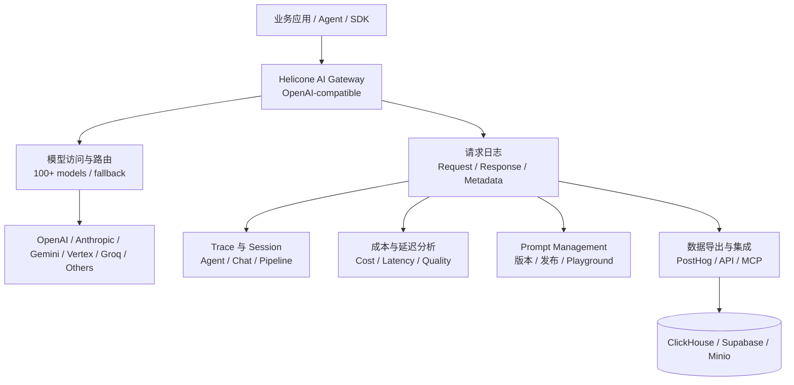

# 竞品分析：Helicone

**更新日期：** 2026年05月21日  
**信息来源：** 官网、官方文档、GitHub、产品 README、用户调研记录  
**竞争优先级：** 高（成熟 LLM Observability + AI Gateway，MaaS 可观测与网关能力强对标）  
**参考地址：**

1. 官网：[Helicone](https://www.helicone.ai/)
2. 文档：[Helicone Docs](https://docs.helicone.ai/)
3. GitHub：[Helicone/helicone](https://github.com/Helicone/helicone)
4. AI Gateway Quickstart：[Quickstart](https://docs.helicone.ai/getting-started/quick-start)
5. Pricing：[Helicone Pricing](https://www.helicone.ai/pricing)

---

## 1. 结论摘要

Helicone 已不只是旧稿中“Observability + Proxy”的轻量观测层，而是一个开源的 **AI Gateway + LLM Observability Platform**。官方 README 明确描述其能力包括：通过 OpenAI-compatible AI Gateway 用一个 API Key 访问 100+ 模型，提供智能路由、自动 fallback、请求日志、成本与延迟分析、sessions、traces、prompt management、playground、fine-tuning partner 集成、数据导出、MCP server、自托管和企业合规。

对 MaaS 平台而言，Helicone 是高优先级竞品，但竞争点与 OpenRouter/OfoxAI 不同。它不是单纯卖“更多模型”或“更便宜模型”，而是把网关、观测、调试、实验、prompt、成本、数据资产和自托管打成一套 LLMOps 工作台。MaaS 如果只有路由和账单，而缺少请求级 trace、session、用户维度、prompt 版本、实验分析、导出和异常诊断，会在 AI 工程团队面前显得不够专业。

Helicone 的边界也很清楚：它强在开发者和工程团队的可观测、调试和统一网关，不是传统企业采购/审批/预算/合规流程平台。MaaS 应把 Helicone 视为“可观测和 LLMOps 体验标杆”，同时在国内私有化、组织预算、审批、合规交付、供应商可控和业务治理上建立差异。

---

## 2. 产品概况

| 项目 | 内容 |
| --- | --- |
| 产品名称 | Helicone |
| 所属公司 | Helicone, Inc.，YC W23 |
| 开源协议 | Apache-2.0 |
| 产品定位 | AI Gateway / LLM Observability / LLMOps Platform |
| 部署形态 | Helicone Cloud、Docker 自托管、企业 Helm Chart |
| API 形态 | OpenAI-compatible AI Gateway，支持 OpenAI、Anthropic、Gemini、Vertex、Groq 等集成 |
| 目标用户 | AI 产品团队、平台工程团队、Agent 团队、需要请求追踪和成本分析的企业 |
| 典型场景 | 统一模型入口、自动 fallback、请求日志、trace/session、成本分析、prompt 版本、实验评估、自托管观测 |
| 竞争类型 | Observability + Gateway，与 Portkey、LangSmith、OpenLLMetry、MaaS 可观测模块重叠 |

GitHub README 显示 Helicone 仓库约 5.7k stars，110+ contributors，并明确提供 Docker 自托管架构。自托管组件包括 Web、Worker、Jawn、Supabase、ClickHouse 和 Minio，说明其不是简单 SaaS 面板，而是具备完整日志与分析数据栈。

---

## 3. 技术架构



| 层级 | 说明 |
| --- | --- |
| Gateway 层 | 通过 `https://ai-gateway.helicone.ai` 提供 OpenAI-compatible 统一入口 |
| Provider 层 | 支持 OpenAI、Anthropic、Azure、AWS Bedrock、Gemini、Vertex、Groq、Together、Fireworks 等集成 |
| Observability 层 | 请求日志、trace、session、用户、properties、成本、延迟、错误分析 |
| Prompt 层 | 使用生产数据做 prompt 版本管理、playground 和部署 |
| 数据层 | Cloud 或自托管 ClickHouse/Supabase/Minio，支持导出与数据自治 |
| 企业层 | SOC 2、GDPR、SAML/SSO、数据保留和企业部署能力需按套餐核实 |

---

## 4. 接入方式

Helicone AI Gateway 的接入方式非常简单，业务侧只需替换 base URL 和 API Key：

```typescript
import { OpenAI } from "openai";

const client = new OpenAI({
  baseURL: "https://ai-gateway.helicone.ai",
  apiKey: process.env.HELICONE_API_KEY,
});

const response = await client.chat.completions.create({
  model: "gpt-4o-mini",
  messages: [{ role: "user", content: "Hello, world!" }],
});
```

Helicone 也支持不经 AI Gateway 的异步日志接入，例如 OpenAI、Anthropic、LangChain、Vercel AI SDK、OpenRouter、LiteLLM 等集成。这个设计让它既能作为网关，也能作为旁路观测层。

---

## 5. 核心功能总览

| 分类 | 能力 | 成熟度 | 说明 |
| --- | --- | --- | --- |
| AI Gateway | 100+ 模型统一入口 | 高 | OpenAI-compatible，支持一个 Key 访问多模型 |
| 路由与 fallback | 智能路由、自动 fallback | 中高 | 官方明确宣传，但策略细节需文档逐项核实 |
| 请求日志 | Request/Response、metadata、properties | 高 | Helicone 最核心能力 |
| Trace/Session | Agent、chatbot、pipeline 会话追踪 | 高 | 适合调试多轮 Agent |
| 成本分析 | cost、latency、quality 等指标 | 高 | 内置模型价格数据库，支持 300+ 模型价格查询 |
| Prompt 管理 | Prompt versioning、playground、gateway 发布 | 中高 | 连接生产数据与 prompt 迭代 |
| 实验与评估 | Playground、datasets、fine-tuning partner | 中 | 与 OpenPipe/Autonomi 等伙伴集成 |
| 数据导出 | API、MCP server、ETL、PostHog | 中高 | 有数据自治意识 |
| 自托管 | Docker、企业 Helm Chart | 高 | 对数据敏感客户有吸引力 |
| 合规 | SOC 2、GDPR | 中高 | 官方宣传 Enterprise Ready |
| 企业治理 | 团队、组织、权限 | 中 | 强于轻量代理，但不等同企业审批/预算中心 |

---

## 6. 路由、规则与容灾

Helicone 当前路由能力与传统 LiteLLM/Portkey 类网关有所重叠，但它的核心差异是“路由 + 可观测”一体化。

| 能力 | Helicone 判断 | MaaS 对比 |
| --- | --- | --- |
| 模型统一入口 | 支持 100+ 模型 | MaaS 也应支持，但要补国内模型和私有模型 |
| 自动 fallback | 官方明确宣传 automatic fallbacks | MaaS 应提供更可解释的 fallback 原因和策略版本 |
| 智能路由 | 官方宣传 intelligent routing | MaaS 应覆盖成本、延迟、SLA、合规、地区、租户优先级 |
| 路由审计 | Helicone 具备请求日志基础 | MaaS 可进一步做完整策略决策链 |
| 熔断冷却 | 公开材料未突出 | MaaS 可作为生产稳定性差异点 |
| 语义缓存 | Helicone 有 gateway/cache 相关演进，但核心仍是观测 | MaaS 可强化语义缓存降本和命中解释 |

Helicone 的威胁在于：即使路由策略不是最复杂，它也能把每次路由、失败、成本和延迟放进观测工作台，让工程团队快速定位问题。MaaS 若只做黑盒路由，会输在可解释性上。

---

## 7. 计费、可观测与数据能力

Helicone 提供免费层，GitHub README 中提到每月 10k requests free tier。其商业价值不只是代理调用，而是围绕请求数据建立分析和调试闭环。

| 能力 | 说明 |
| --- | --- |
| Cost Tracking | 按模型和请求统计成本，内置开源模型价格数据库 |
| Latency Tracking | 查看模型、供应商、用户、会话维度延迟 |
| Error Debugging | 通过请求日志定位错误与异常请求 |
| Sessions | 将多轮对话或 Agent 任务串成会话 |
| Properties | 业务侧可打标签，按用户、项目、环境、功能过滤 |
| Prompt Management | 用生产请求数据沉淀 prompt 版本和实验 |
| Data Export | 通过 API、ETL、PostHog、MCP 等方式导出或连接外部系统 |

对 MaaS 的启示是：平台不能只提供总量用量表。企业真正调试 AI 应用时，需要看到“哪个用户、哪个 prompt、哪个模型、哪次调用、为什么慢、为什么贵、为什么失败”。

---

## 8. 与同类产品对比

| 维度 | Helicone | Portkey | LiteLLM/Bifrost | MaaS |
| --- | --- | --- | --- | --- |
| 核心定位 | Observability + AI Gateway | AI Control Plane | 自部署网关/路由 | 企业 MaaS 平台 |
| 观测深度 | 强 | 强 | 中 | 应补齐 |
| 路由/fallback | 中高 | 强 | 强 | 应强 |
| Prompt/实验 | 强 | 中高 | 弱 | 可规划 |
| 自托管 | 支持 | 企业方案 | 支持 | 支持 |
| 企业审批/预算 | 中 | 中高 | 弱 | 强项 |
| 国内合规 | 需评估 | 需评估 | 自部署可控 | 强项 |
| 成本优化 | 分析强，缓存需核实 | 强 | 取决于配置 | 应结合缓存与路由 |

---

## 9. 与 MaaS 平台对比

| 对比维度 | MaaS 平台 | Helicone | 胜出方 |
| --- | --- | --- | --- |
| LLM 请求观测 | 可建设 | 已成熟 | Helicone |
| AI Gateway | 支持 | 支持 100+ 模型 | 持平 |
| 智能路由/fallback | 可做企业策略 | 已有产品能力 | 持平或 MaaS 可深化 |
| Prompt 管理 | 可规划 | 已有 | Helicone |
| 数据导出 | 可做 | API/MCP/PostHog 等丰富 | Helicone |
| 国内合规与私有化交付 | 强 | 自托管可行但国内交付需核实 | MaaS |
| 组织预算/审批 | 强 | 非核心 | MaaS |
| 供应商合同与本地模型 | 强 | 偏全球模型生态 | MaaS |

---

## 10. 优势、劣势与销售应对

### 10.1 优势

| 优势 | 说明 |
| --- | --- |
| 开源且成熟 | Apache-2.0，GitHub 活跃，支持自托管 |
| Observability 标杆 | 请求、trace、session、成本、延迟、prompt 分析完整 |
| 接入简单 | 改 base URL 即可接入 AI Gateway 或日志代理 |
| 数据资产意识强 | 支持导出、ETL、MCP 和外部分析工具 |
| 工程团队友好 | 面向 AI Engineer，而不是只面向采购或运营 |

### 10.2 劣势

| 劣势 | 说明 |
| --- | --- |
| 企业流程不是核心 | 审批、成本中心、部门预算、采购合规不是第一卖点 |
| 国内模型和本地交付需评估 | 需要看客户是否能接受海外 SaaS 或自托管成本 |
| 路由策略细节需核实 | 官方宣传智能路由和 fallback，但企业策略编排深度需实测 |
| 对非工程用户门槛偏高 | 强工程导向，业务管理员可能需要更简单的运营视图 |

### 10.3 销售应对

如果客户主要痛点是“看不清 LLM 调用发生了什么”，Helicone 是强竞品，MaaS 不能轻描淡写。应强调 MaaS 不只是观测，还覆盖企业多租户、预算审批、供应商治理、合规和私有化；同时必须展示接近 Helicone 的请求级日志、成本、延迟、fallback 原因和 prompt 调试能力。

---

## 11. 信息核实与待跟进

| 信息项 | 状态 | 备注 |
| --- | --- | --- |
| GitHub 与开源协议 | 已核实 | Apache-2.0，约 5.7k stars |
| AI Gateway | 已核实 | OpenAI-compatible，100+ 模型 |
| Observability | 已核实 | request、trace、session、cost、latency |
| 自托管 | 已核实 | Docker，企业 Helm Chart |
| 合规 | 已核实官网宣传 | SOC 2、GDPR，需合同核实 |
| 路由/fallback | 已核实宣传 | 需要实测策略细节 |
| 国内部署合规 | 待核实 | 取决于自托管和数据流 |

---

## 12. 总结

Helicone 是 MaaS 在“LLM 可观测与工程化体验”上的重要对标对象。它把 AI Gateway、请求日志、成本延迟、session trace、prompt 版本、数据导出和自托管整合得很完整。MaaS 要胜出，不能只讲模型聚合和路由，必须把“可解释、可调试、可审计、可运营”的体验做到同等甚至更强；同时利用国内合规、组织预算、私有化和供应商治理建立企业级差异。
