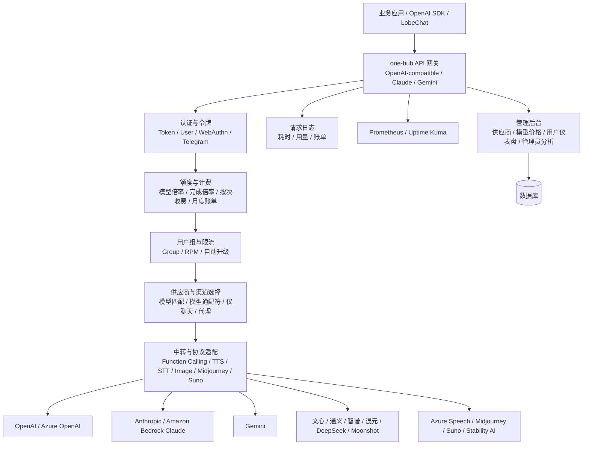
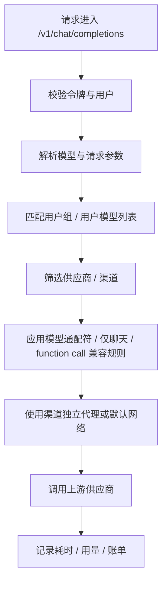

# 竞品分析：one-hub

**更新日期：** 2026年05月21日  
**信息来源：** GitHub 仓库、README、官方文档、演示站、用户实测记录  
**竞争优先级：** 中（One API 二开增强版，偏国内 API 分发与运营后台）  
**参考地址：**

1. GitHub：[MartialBE/one-hub](https://github.com/MartialBE/one-hub)
2. README：[README.md](https://github.com/MartialBE/one-hub/blob/main/README.md)
3. 英文 README：[README.en.md](https://github.com/MartialBE/one-hub/blob/main/README.en.md)
4. 文档站：[one-hub-doc](https://one-hub-doc.vercel.app/)
5. 演示站：[one-hub Demo](https://one-hub.xiao5.info/)

> 用户调研记录中 one-hub GitHub Star 约 2.8k；本次核实时 GitHub 页面仍显示约 2.8k。正式汇报前建议以 GitHub 实时数据复核。

---

## 1. 结论摘要

one-hub 是基于 One API 二次开发的开源 OpenAI 接口管理与分发系统。它延续了 One API 的渠道、令牌、额度、用户、分组、倍率和中转能力，同时强化了 UI、用户仪表盘、管理员分析、供应商模块、模型价格更新、动态模型列表、支付、用户组 RPM、Prometheus 监控、Uptime Kuma 状态监控、用户月度账单、WebAuthn 登录、Gemini/Claude 格式 API 请求以及非 OpenAI 模型函数调用兼容。

相比 One API，one-hub 更像“面向 API 分发站点和内部运营场景的增强分支”，在运营后台、价格管理、支付账单、监控和多供应商能力上做了不少实用增强；相比 new-api，它的社区规模、活跃度和接口覆盖弱一些，但 Apache-2.0 许可比 new-api 的 AGPLv3 更宽松，对企业二开和私有化评估更友好。

不过，one-hub 的官方 README 也明确提示项目用于个人学习，不保证稳定性且不提供技术支持。它更适合有技术能力的小团队、自建站点和内部工具，不适合直接承担企业级 MaaS 的稳定性、合规、SLA、审批、预算、语义缓存和深度可观测要求。

---

## 2. 产品概况

| 项目 | 内容 |
| --- | --- |
| 产品名称 | one-hub |
| 开发者 | MartialBE 及社区贡献者 |
| 项目来源 | 基于 songquanpeng/one-api 二次开发，数据库与原版 One API 不兼容 |
| 产品定位 | OpenAI 接口管理与分发系统 / One API 增强分支 / API 运营后台 |
| 开源协议 | Apache-2.0 |
| 技术栈 | Go + JavaScript/React 管理界面 |
| 部署形态 | Docker、Docker Compose、配置文件启动、演示站 |
| 目标用户 | 个人开发者、小团队、API 分发站点、内部模型管理平台、希望基于 One API 增强二开的团队 |
| 典型场景 | 多供应商聚合、渠道管理、令牌分发、价格管理、支付、月度账单、监控、函数调用兼容 |
| 竞争类型 | 国内开源 API 分发后台 / One API 分支 / new-api 近邻竞品 |

README 中明确说明：one-hub 基于 One API 二次开发，请不要与原版混用，因为新增功能导致数据库不兼容。这一点对迁移和生产升级非常关键。

---

## 3. 产品定位与典型场景

| 场景 | one-hub 解决的问题 | 价值 |
| --- | --- | --- |
| One API 二开升级 | 原版 One API UI 和运营能力较传统 | 提供新 UI、仪表盘、管理员统计和供应商模块 |
| 多供应商统一入口 | 国内外模型和多媒体 API 分散 | 通过渠道/供应商统一管理 OpenAI、Claude、Gemini、Midjourney、Suno 等 |
| API Key 分发 | 用户和应用需要独立访问令牌 | 延续 One API 的令牌、额度、模型列表和分组能力 |
| 价格运营 | 模型价格变化快，手动维护成本高 | 支持模型价格更新、自动获取供应商模型、多策略价格更新 |
| 支付与账单 | API 分发站点需要收费和月度账单 | 支持支付、模型按次收费、用户月度账单生成 |
| 监控运维 | 管理员需要观察系统状态和指标 | 支持 Prometheus、Uptime Kuma、请求耗时日志和分析数据统计 |
| 客户端兼容 | LobeChat 等客户端需要非 OpenAI 模型函数调用 | 优化非 OpenAI 模型 function calling 兼容 |
| 安全登录 | 密码登录安全性有限 | 支持 WebAuthn 登录，提升后台安全性 |

one-hub 的定位可以概括为：站在 One API 的基础上，向“更现代的 API 分发运营后台”演进。

---

## 4. 技术架构



| 层级 | 说明 |
| --- | --- |
| API 接入层 | 支持 OpenAI-compatible，并增强 Gemini、Claude 格式 API 请求 |
| 认证层 | 继承用户/令牌体系，并支持 Telegram bot、WebAuthn 等登录能力 |
| 计费层 | 支持完成倍率、模型按次收费、支付、用户月度账单和价格更新 |
| 供应商层 | 重构中转供应商模块，支持自动获取供应商模型、模型通配符和渠道代理 |
| 中继层 | 兼容多供应商，支持非 OpenAI 模型函数调用、Azure Speech TTS、部分 STT/图片/音乐能力 |
| 观测层 | 请求日志增加耗时，支持 Prometheus 和 Uptime Kuma 状态监控 |
| 管理层 | 新 UI、用户仪表盘、管理员分析数据统计、分页排序和配置文件启动 |

---

## 5. 部署与运行

one-hub 提供 Docker 镜像和演示站，README 中也提到支持使用配置文件启动程序。与 One API 类似，它通常以单体 Web 服务形态部署，默认业务心智仍是“配置供应商/渠道 -> 创建令牌 -> 用 OpenAI-compatible API 调用”。

演示站：

```text
https://one-hub.xiao5.info/
```

用户实测地址：

```text
http://101.43.45.218:3000/panel/channel
```

用户记录的演示账号：

```text
root / 123456
```

> 注意：用户原始记录中包含一段演示 Key。本文档已脱敏，不保留完整 Key。生产分析和对外文档中不应暴露可用 API Key。


### 5.1 生产部署注意事项

| 事项 | 建议 |
| --- | --- |
| 默认账号 | 演示站和默认账号不应在生产环境复用，首次登录必须修改密码 |
| 数据库 | 因数据库与原 One API 不兼容，迁移前必须备份和验证迁移路径 |
| 配置文件 | 如果使用配置文件启动，需要纳入版本管理和敏感信息保护流程 |
| HTTPS | 对外提供 API 服务必须配置 TLS，避免令牌明文传输 |
| 监控 | 启用 Prometheus 和 Uptime Kuma 后，需要配置告警规则和指标归档 |
| 支付 | 支付能力涉及财务、税务、实名和业务资质，不能只按技术功能评估 |
| 合规 | README 明确提示不保证稳定性、不提供技术支持，公开服务需自行满足监管要求 |

---

## 6. 核心功能总览

| 分类 | 能力 | 成熟度 | 说明 |
| --- | --- | --- | --- |
| OpenAI 兼容 | OpenAI API 管理与分发 | 高 | 继承 One API 核心能力 |
| 多协议 | Gemini、Claude 格式 API 请求 | 中高 | 比 One API 更现代，但需按接口实测 |
| UI | 全新 UI、用户仪表盘、管理员分析 | 中高 | 明显强于原版 One API |
| 供应商管理 | 重构中转供应商模块 | 中高 | 支持自动获取供应商模型、价格更新、模型通配符 |
| 渠道代理 | 单渠道 http/socks5 代理 | 中高 | 适合跨网络环境和供应商差异化代理 |
| 路由 | 模型匹配、通配符、仅聊天、分组 | 中 | 仍偏规则配置，不是复杂动态路由 |
| 计费 | 完成倍率、按次收费、支付、月度账单 | 中高 | 比 One API 更偏运营化 |
| 用户组 | 用户组 RPM、用户分组自动升级 | 中高 | 对站点运营实用 |
| 可观测 | 请求耗时、Prometheus、Uptime Kuma | 中高 | 强于 One API 基础日志 |
| 安全 | WebAuthn、Telegram bot | 中 | 后台登录安全增强，但企业 RBAC 仍需核实 |
| 多媒体 | Azure Speech、Midjourney、Suno、Cloudflare STT/图片 | 中 | 覆盖面广，但依赖上游和第三方项目 |
| 函数调用 | 非 OpenAI 模型 function call 优化 | 中高 | 对 LobeChat 等客户端有价值 |
| 价格管理 | 多策略模型价格自动更新 | 中高 | 适合模型价格频繁变化场景 |
| 企业治理 | 租户/审批/预算中心 | 低 | 不是完整企业 MaaS 平台 |

---

## 7. 供应商与模型支持

README 中列出了 one-hub 当前支持的供应商，覆盖聊天、补全、TTS/STT、图片、Midjourney/Suno 等能力。典型供应商包括：

| 类型 | 代表供应商 |
| --- | --- |
| 国际模型 | OpenAI、Azure OpenAI、Anthropic、Gemini、Mistral、Groq、Cohere、Amazon Bedrock |
| 国内模型 | 百度文心、通义千问、讯飞星火、智谱、腾讯混元、百川、MiniMax、DeepSeek、Moonshot、零一万物 |
| 本地/开源 | Ollama |
| 多媒体 | Azure Speech、Cloudflare AI、Midjourney、Stability AI、Suno |
| 应用平台 | Coze |

用户实测的模型/供应商配置页面：


---

## 8. 路由、规则与渠道选择

one-hub 的路由能力更接近 One API/new-api 一类“渠道规则 + 分组 + 权重/筛选”的体系，不是 LiteLLM/Bifrost/OpenRouter 那类复杂策略路由。

### 8.1 已知路由相关能力

| 能力 | 说明 |
| --- | --- |
| 动态返回用户模型列表 | 用户看到的模型列表可基于权限和配置动态生成 |
| 模型通配符 | 支持用通配符管理模型，减少逐模型维护成本 |
| 自动获取供应商模型 | 可从供应商侧获取模型列表，降低维护负担 |
| 自定义测速模型 | 可指定测速模型，用于渠道测试和可用性判断 |
| 单渠道代理 | 每个渠道可配置独立 http/socks5 代理 |
| 仅聊天渠道 | 开启后如果请求带 function call 参数会跳过该渠道 |
| 非 OpenAI 函数调用 | 优化非 OpenAI 模型 function call 兼容 |
| 用户组 RPM | 可限制用户组请求速率 |

### 8.2 路由决策链路



### 8.3 能力边界

| 能力 | 当前判断 |
| --- | --- |
| 成本/延迟动态路由 | 未看到成熟策略说明，主要依赖配置与价格更新 |
| 显式 fallback 链 | 不突出，仍偏渠道层重试/筛选 |
| 熔断冷却 | 未见完整熔断、冷却、自动恢复策略说明 |
| 语义缓存 | 未见 semantic cache 能力 |
| 可解释路由 | 日志有耗时，但缺少完整路由决策解释链 |
| SLA 路由 | 不具备企业 SLA 策略体系 |

---

## 9. 计费、价格与账单

one-hub 相比原版 One API 的一个增强方向是价格和账单运营。

| 能力 | 说明 |
| --- | --- |
| 完成倍率自定义 | 可自定义 completion 侧倍率 |
| 模型按次收费 | 除 token 计费外，支持按请求次数计费 |
| 模型价格更新 | 支持在后台更新模型价格 |
| 自动获取供应商模型 | 可配合价格维护减少人工成本 |
| 多策略价格更新 | 支持覆盖更新、只更新现有价格、只新增价格 |
| 支付 | 支持支付能力，适合 API 分发站点 |
| 用户月度账单 | 可通过环境变量或配置文件启用月度账单生成 |
| 用户分组自动升级 | 可按规则升级用户组，适合套餐或会员体系 |
| billing tag | 仓库提交中出现 token 元数据 `billingtag` 用于数据分析 |

这些能力说明 one-hub 的设计重心已经不只是“转发”，而是更偏 API 消费运营。对 MaaS 平台而言，它提醒我们：即使是开源小项目，也开始把账单、价格、用户分层和监控做成后台功能。

---

## 10. 可观测性与运维

one-hub 比 One API 更重视可观测性和运维集成。

| 能力 | 说明 |
| --- | --- |
| 日志请求耗时 | 请求日志增加耗时字段，方便定位慢请求 |
| 用户仪表盘 | 用户可查看自身用量和状态 |
| 管理员分析 | 管理员可查看分析数据统计界面 |
| Prometheus | 支持 Prometheus 指标监控 |
| Uptime Kuma | 支持 Uptime Kuma 状态监控面板 |
| 自定义测速模型 | 用指定模型测试渠道状态 |
| 完整分页排序 | 提升后台大量数据管理体验 |

与 Bifrost/Helicone 这类专业观测产品相比，one-hub 的观测仍偏运营后台和基础指标；但对于 API 分发站点，它已经比 One API 更实用了。

---

## 11. 安全、登录与合规

### 11.1 安全能力

| 能力 | 说明 |
| --- | --- |
| WebAuthn | 支持注册 WebAuthn 登录凭证，降低密码泄露风险 |
| Telegram bot | 支持 Telegram bot 相关能力 |
| 用户角色 | 仓库提交中出现新增“可信内部员工”角色等级 |
| 用户组 RPM | 对用户组做请求速率限制 |
| 管理员管理用户 Key | 仓库提交中出现管理员查看和编辑其他用户 Key 的能力 |

### 11.2 合规与稳定性提示

README 明确写明：本项目为个人学习使用，不保证稳定性，且不提供任何技术支持；使用者必须遵循 OpenAI 使用条款以及法律法规，不得用于非法用途；请勿向中国地区公众提供未经备案的生成式 AI 服务。

这意味着 one-hub 在企业采购语境下有明显边界：它可以作为自建参考或开源二开基座，但不能直接等同于有商业 SLA 和合规承诺的 MaaS 平台。

---

## 12. 调用与用户实测

用户记录中通过 one-hub 测试 Kimi 模型和 Chat Completions 接口。

渠道测试示例：

```bash
curl -i "http://101.43.45.218:3000/api/channel/test/1?model=kimi-k2.5"
```

本地渠道测试示例：

```bash
curl -X GET "http://localhost:3000/api/channel/test/1?model=kimi-k2.5" \
  --header "Authorization: Bearer sk-***"
```

Chat Completions 调用示例：

```bash
curl -X POST "http://localhost:3000/v1/chat/completions" \
  -H "Authorization: Bearer sk-***" \
  -H "Content-Type: application/json" \
  -d '{
    "model": "kimi-k2.5",
    "messages": [
      {
        "role": "system",
        "content": "Hello"
      }
    ]
  }'
```

这里和 One API/new-api 类似，业务侧使用 OpenAI-compatible API；实际能否成功取决于供应商配置、模型名映射、渠道 Key、网络代理和上游模型可用性。

---

## 13. 与 One API / new-api 的关系

one-hub 明确基于 One API 二次开发，同时 README 感谢 new-api，且说明 Midjourney/Suno 模块代码来源于 new-api。

| 维度 | One API | one-hub | new-api |
| --- | --- | --- | --- |
| 项目来源 | 原始经典项目 | One API 二开增强 | One API 同源演进 |
| 开源协议 | MIT + 署名要求 | Apache-2.0 | AGPLv3 + UI 归属保留 |
| Star | 约 34k | 约 2.8k | 约 34.5k |
| UI | 传统后台 | 全新 UI、仪表盘 | 新 UI，活跃演进 |
| 数据兼容 | 原版数据库 | 与 One API 不兼容 | 兼容 One API 数据库 |
| 计费运营 | 额度、倍率、兑换码 | 支付、月度账单、按次收费、价格更新 | 充值、成本核算、缓存计费 |
| 路由 | 负载均衡、失败重试 | 模型通配符、供应商模块、仅聊天规则 | 加权随机、失败重试 |
| 监控 | 基础日志 | Prometheus、Uptime Kuma、耗时日志 | 数据看板、错误日志 |
| 协议覆盖 | OpenAI 兼容为主 | Gemini/Claude 格式增强 | Responses、Realtime、Gemini、Claude、Rerank 等更广 |
| 适合场景 | 经典 API 分发 | 需要更强 UI/账单/监控的 One API 用户 | 更活跃的一体化网关与资产管理 |

判断：one-hub 是 One API 的增强分支，但不是 new-api 的同等级社区规模竞品。它更适合被视为“API 分发后台增强样本”，用于观察开源站点运营功能的演进。

---

## 14. 与 LiteLLM / Bifrost / OpenRouter 对比

| 维度 | one-hub | LiteLLM | Bifrost | OpenRouter |
| --- | --- | --- | --- | --- |
| 产品形态 | 自部署 API 分发后台 | 开源 LLM Proxy / Router | 高性能 AI Gateway | 托管模型聚合平台 |
| 核心优势 | UI、账单、支付、监控、供应商增强 | 路由策略、fallback、虚拟 Key | Go 性能、语义缓存、内置观测 | 模型市场、SaaS 聚合、默认路由 |
| 路由深度 | 中低 | 高 | 高 | 高 |
| 计费运营 | 中高 | 中 | 中 | 中高 |
| 企业治理 | 低到中 | 中高 | 中高 | 中 |
| 可观测性 | 中 | 中高 | 高 | 中高 |
| 语义缓存 | 不突出 | 可配置 | 明确支持 | provider prompt cache |
| 部署门槛 | 中低 | 中 | 中低 | 无需部署 |
| 国内生态 | 中 | 中 | 中 | 中低 |
| 商业合规 | 部署方自担，无技术支持承诺 | 自部署可控 | 自部署可控 | SaaS 数据出境需评估 |

---

## 15. 与 MaaS 平台对比

| 对比维度 | MaaS 平台 | one-hub | 胜出方 |
| --- | --- | --- | --- |
| OpenAI 兼容 API | 支持 | 支持 | 持平 |
| 多供应商聚合 | 支持 | 支持 | 持平 |
| 部署简单 | 中 | 较高 | one-hub |
| UI 管理 | 企业控制台 | API 分发后台 | 各有侧重 |
| 支付和账单 | 合同、套餐、发票、分摊 | 支付、月度账单、按次收费 | MaaS 更企业，one-hub 更轻量 |
| 路由策略 | 成本、延迟、健康度、SLA 多维 | 规则/供应商/模型筛选为主 | MaaS |
| 容灾降级 | 熔断、fallback、告警、SLA | 不突出 | MaaS |
| 语义缓存 | 可建设语义缓存与缓存运营 | 不突出 | MaaS |
| 企业 RBAC | 租户、项目、部门、角色、审批 | 用户、用户组、角色增强 | MaaS |
| 可观测性 | 链路、延迟分位数、错误聚类、告警 | Prometheus、Uptime Kuma、耗时日志 | MaaS |
| 合规交付 | 等保、审计、内容安全、实名、日志留存 | 部署方自行承担 | MaaS |
| 商业支持 | 有 SLA 和交付团队 | README 声明不提供技术支持 | MaaS |
| 开源许可 | 商业产品/私有化 | Apache-2.0 | one-hub 二开友好 |

---

## 16. 优势分析

| 维度 | 优势 |
| --- | --- |
| 基于 One API 心智 | 对熟悉 One API 的用户迁移理解成本低 |
| Apache-2.0 | 相比 AGPLv3 更适合企业二开评估 |
| UI 和统计增强 | 用户仪表盘、管理员分析、分页排序比原版更现代 |
| 供应商模块增强 | 自动获取模型、模型通配符、价格更新、渠道代理更实用 |
| 账单运营增强 | 支付、月度账单、按次收费、完成倍率自定义贴近 API 分发运营 |
| 监控集成 | Prometheus 和 Uptime Kuma 对自运维很有帮助 |
| 函数调用兼容 | 优化非 OpenAI 模型 function call，适配 LobeChat 等客户端 |
| 安全登录增强 | WebAuthn 增强后台账号安全 |
| 多媒体覆盖 | Azure Speech、Midjourney、Suno、Stability AI 等扩展了 API 分发范围 |

---

## 17. 劣势与边界

| 维度 | 劣势 | 影响 |
| --- | --- | --- |
| 社区规模较小 | Star 和贡献者远低于 One API/new-api | 长期维护和生态资源弱一些 |
| 官方稳定性承诺弱 | README 声明不保证稳定性、不提供技术支持 | 企业生产采用风险较高 |
| 数据库不兼容 One API | 不能与原版混用 | 迁移需要额外验证 |
| 路由策略不深 | 主要是规则、供应商和模型筛选 | 难以满足 SLA/成本/延迟动态优化 |
| 企业治理不足 | 用户组和角色增强，但不是完整租户/项目/RBAC | 大企业平台仍需二开 |
| 语义缓存缺失 | 未见 semantic cache 能力 | 成本优化弱于 MaaS/Bifrost |
| 内容安全不完整 | 目录中有 safety 模块，但不等于完整合规平台 | 对外服务仍需风控、审核和日志留存 |
| 支付合规自担 | 支付功能技术上支持，不代表资质和税务合规 | API 分发站点存在运营合规风险 |
| 模型列表维护策略 | README 说明内置模型列表平常不再更新 | 需要管理员主动在后台更新价格和模型 |

---

## 18. 对 MaaS 平台的产品启示

### 18.1 必须对齐的能力

1. 供应商/渠道后台需要足够易用，支持模型通配符、自动拉取模型和价格更新。
2. 用户仪表盘与管理员分析要分层，不只给管理员看总量。
3. 请求日志应记录耗时、模型、渠道、用户、计费、错误原因。
4. 计费需要支持 token、按次、完成倍率、用户组策略和月度账单。
5. 支持 Prometheus 等标准监控出口，方便企业接入现有运维体系。
6. 后台登录应支持更安全的方式，例如 WebAuthn、OIDC、MFA。
7. 支持非 OpenAI 模型 function calling 兼容，降低客户端适配成本。
8. 支持模型价格更新和供应商模型同步，减少人工维护模型目录。

### 18.2 差异化方向

| 方向 | MaaS 可强化点 |
| --- | --- |
| 企业治理 | 租户、项目、部门、角色、审批流、权限继承 |
| 路由专业度 | 成本、延迟、可用性、SLA、合规和区域策略动态路由 |
| 容灾体系 | 熔断、冷却、fallback 链、key rotation、告警和自动恢复 |
| 语义缓存 | 相似请求缓存、缓存命中解释、节省金额和缓存治理 |
| 财务闭环 | 合同、套餐、发票、对账、成本中心和预算审批 |
| 合规交付 | 等保、审计、实名、内容安全、敏感信息脱敏和日志留存 |
| 商业支持 | SLA、升级保障、漏洞修复、迁移支持和运维服务 |
| 路由解释 | 展示每次请求为什么选某渠道、为什么跳过、为什么失败或降级 |

---

## 19. 销售应对策略

### 19.1 客户说“one-hub 开源自建就够了”时

建议话术：

> one-hub 确实是 One API 的一个实用增强版本，UI、账单、支付、监控和供应商管理都比原版更完整，适合小团队或站点快速搭建 API 分发后台。但它的 README 明确说明不保证稳定性且不提供技术支持。企业生产系统真正需要的是 SLA、合规审计、内容安全、预算审批、可解释路由、故障告警和持续运维保障。MaaS 平台解决的是长期可运营和可追责的问题，而不只是快速搭一个后台。

### 19.2 适合承认 one-hub 强的场景

1. 客户熟悉 One API，想要更现代 UI 和账单监控。
2. 客户是小团队、站长或内部工具团队。
3. 客户需要 Apache-2.0 许可，避免 AGPLv3 约束。
4. 客户需要支付、月度账单、模型价格更新、Prometheus/Uptime Kuma。
5. 客户能自行承担部署、升级、安全、合规和上游 Key 管理。

### 19.3 MaaS 更适合的场景

1. 客户需要正式商业支持和 SLA。
2. 客户有合规、审计、实名、内容安全和日志留存要求。
3. 客户需要租户、项目、部门、角色、审批和预算分摊。
4. 客户需要高可用、自动故障切换和可解释路由。
5. 客户希望把模型使用纳入企业 IT 和财务管理体系。
6. 客户不能接受开源项目“不保证稳定性、不提供技术支持”的生产风险。

---

## 20. 风险与核实清单

| 核实项 | 当前判断 | 后续动作 |
| --- | --- | --- |
| Star 数 | 用户记录约 2.8k，本次页面约 2.8k | 汇报前复核 GitHub 实时数据 |
| 开源协议 | Apache-2.0 | 法务评估时复核 LICENSE |
| 项目稳定性 | README 声明不保证稳定性且不提供技术支持 | 生产采用需自建保障体系 |
| 数据库兼容 | 与原 One API 数据库不兼容 | 迁移前做备份和迁移演练 |
| 模型价格更新 | 支持后台更新和多策略自动更新 | 实测价格源、更新策略和覆盖范围 |
| 供应商模型获取 | 支持自动获取供应商模型 | 验证国内供应商和 OpenAI-compatible 上游适配 |
| Prometheus | 支持 | 核实指标名称、粒度和告警可用性 |
| Uptime Kuma | 支持 | 核实状态面板集成方式 |
| 支付/月度账单 | 支持 | 核实支付方式、账单准确性和合规要求 |
| Gemini/Claude 格式 | 支持 | 按目标客户端和模型逐项验证 |
| Function calling | 优化非 OpenAI 模型 | 验证 LobeChat、工具调用和特殊参数兼容性 |
| 内容安全 | 有相关模块迹象但不是完整合规平台 | 对外服务需补审核、实名、留痕和风控 |

---

## 21. 总结

one-hub 是 One API 生态里的一个重要增强分支。它没有 new-api 那样大的社区规模，也不是 LiteLLM/Bifrost 那种专业智能网关，但它在 API 分发后台的运营能力上做了不少现实增强：新 UI、仪表盘、供应商模块、价格更新、支付、月度账单、Prometheus、Uptime Kuma、WebAuthn 和非 OpenAI 函数调用兼容。

对 MaaS 平台而言，one-hub 的价值是提醒我们：开源竞品已经开始把“后台体验、价格维护、账单、监控和供应商管理”做得越来越贴近真实运营。MaaS 需要吸收这些易用能力，同时在企业治理、合规交付、SLA、语义缓存、可解释路由、预算审批和财务闭环上拉开差距。
