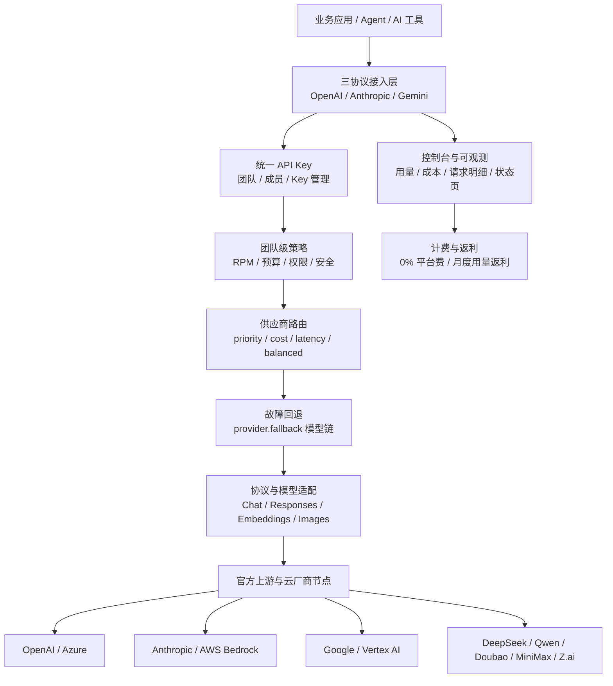
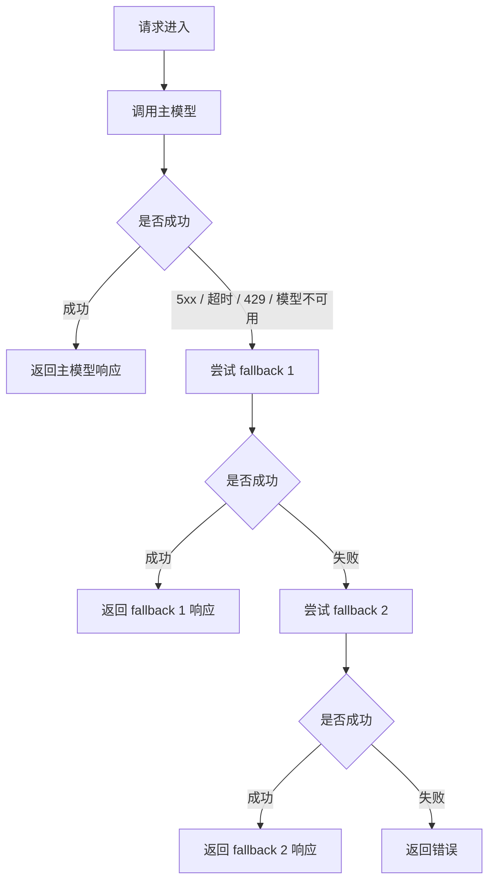

# 竞品分析：OfoxAI

**更新日期：** 2026年05月21日  
**信息来源：** 官网、官方文档、GitHub 组织页、状态页、用户实测记录  
**竞争优先级：** 中高（托管式企业 LLM 网关 / OpenRouter 近邻竞品 / 多协议模型聚合平台）  
**参考地址：**

1. 官网：[OfoxAI](https://ofox.ai/zh)
2. API 文档：[API 概览](https://ofox.ai/zh/docs/api)
3. 快速开始：[3 步接入你的 Agent](https://ofox.ai/zh/quickstart)
4. 模型广场：[OfoxAI Models](https://ofox.ai/zh/models)
5. 供应商路由：[Provider Routing](https://ofox.ai/zh/docs/develop/advanced/provider-routing)
6. 故障回退：[Fallback](https://ofox.ai/zh/docs/develop/advanced/fallback)
7. 速率限制：[Rate Limits](https://ofox.ai/zh/docs/develop/guides/rate-limits)
8. 企业服务：[OfoxAI Enterprise](https://ofox.ai/zh/enterprise)
9. 对比页：[OfoxAI vs OpenRouter](https://ofox.ai/zh/vs/openrouter)
10. 状态页：[OfoxAI Status](https://status.ofox.ai/)
11. GitHub：[OfoxAI Labs](https://github.com/ofoxai)

---

## 1. 结论摘要

OfoxAI 是一个托管式企业 LLM 网关和模型聚合平台，核心价值是通过一个统一 API Key 和三套原生协议接入 OpenAI、Anthropic、Google Gemini、DeepSeek、通义千问、MiniMax、Z.ai 等 100+ 模型。它的官方定位已经不是旧稿中“资料有限的轻量 AI 平台”，而是更接近 OpenRouter、ZenMux 一类云端模型市场与统一网关，同时强化企业成本、团队权限、SLA、全球加速、官方上游和零内容留存。

从功能看，OfoxAI 的差异化集中在五点：第一，OpenAI、Anthropic、Gemini 三协议原生兼容，避免只做 OpenAI-compatible 转换层；第二，声称通过 Azure、AWS Bedrock、Google Vertex、Anthropic、OpenAI 等官方授权通道供给模型；第三，提供 `provider.routing` 扩展参数，可按稳定性、成本、延迟、负载均衡选择供应商节点；第四，提供 `provider.fallback` 跨模型回退列表，可在 5xx、超时、429、模型不可用时自动切换；第五，面向企业宣传多成员、角色权限、成员预算、API Key 加密存储、审计追踪、实时用量和成本分析。

对 MaaS 平台而言，OfoxAI 的威胁不在私有化或复杂治理深度，而在“接入快、模型多、中文友好、成本口径直接、路由和 fallback 已产品化”。如果客户只是要一个公网 API 聚合入口，OfoxAI 这类产品会有很强替代性；如果客户要求企业内控、私有化部署、供应商合同可控、审批、预算、审计、账单分摊、合规留痕和 SLA 责任闭环，MaaS 仍有明显发挥空间。

---

## 2. 产品概况

| 项目 | 内容 |
| --- | --- |
| 产品名称 | OfoxAI / Ofox AI |
| 公司主体 | NICE TALK PTE. LTD.，新加坡主体 |
| 产品定位 | 企业级 LLM 网关 / 托管式模型聚合平台 / 多协议 AI API Gateway |
| 部署形态 | SaaS 托管服务，不是开源自部署网关 |
| API 形态 | OpenAI-compatible、Anthropic 原生、Gemini 原生三协议入口 |
| 目标用户 | 开发者、Agent 团队、AI SaaS、出海团队、需要低门槛接入多模型的企业团队 |
| 典型场景 | 多模型统一调用、Agent 工具接入、Claude Code/Codex/Gemini CLI 接入、模型成本优化、跨模型 fallback、团队预算控制 |
| 模型规模 | 官网模型广场展示 100+ 模型，覆盖 OpenAI、Anthropic、Google、Qwen、Doubao、MiniMax、Z.ai 等 |
| 商业模式 | 按量付费，公开强调 0% 平台手续费、无订阅、月度用量返利和企业级支持 |
| 竞争类型 | OpenRouter/ZenMux 近邻竞品，同时与 LiteLLM、Portkey、Bifrost 的网关能力局部重叠 |

OfoxAI 官网主张“3 分钟接入世界模型”，并在 GitHub 组织页描述为“One API, Better prices, better speed, no subscriptions”。这说明它的产品心智是“一个 Key 接入多模型”，但与 One API/new-api 这类开源自建面板不同，它更偏云端托管服务和官方上游聚合。

---

## 3. 产品定位与典型场景

| 场景 | OfoxAI 解决的问题 | 价值 |
| --- | --- | --- |
| 多模型快速接入 | 不同模型厂商 API、Key、SDK、计费和区域访问差异较大 | 一个统一账户和 API Key 接入 100+ 模型 |
| 三协议兼容 | OpenAI-compatible 转换层无法覆盖 Claude/Gemini 原生特性 | OpenAI、Anthropic、Gemini SDK 可直接配置 base URL |
| Agent 工具接入 | Claude Code、Codex CLI、Gemini CLI、Cline、Cherry Studio 等工具配置分散 | 提供工具集成教程，降低个人和团队迁移成本 |
| 供应商路由 | 同一模型可由多个供应商节点承载，成本、延迟和稳定性不同 | 通过 `priority`、`cost`、`latency`、`balanced` 控制分发策略 |
| 故障回退 | 主模型限流、超时、供应商异常会导致业务中断 | 通过 `provider.fallback` 自动按顺序尝试备选模型 |
| 成本控制 | 多模型价格复杂，充值手续费和隐藏成本影响总成本 | 宣传 0% 平台手续费、官方模型定价、月度用量返利 |
| 团队管理 | 多人共用 Key 难以追踪和控费 | 多成员、角色权限、成员预算、API Key 加密存储和审计追踪 |
| 企业稳定性 | 海外模型访问、上游波动和区域网络影响线上服务 | 全球加速、多区域冗余、公开状态页和 SLA 口径 |
| 隐私合规 | 客户担心 Prompt 和返回内容被记录或训练 | 企业页宣传默认不记录内容、不训练，仅保留计费必要数据 |

OfoxAI 最适合的客户画像是：希望快速接入全球模型、团队规模不大到需要完整私有化平台、但又比个人 API 中转更关心稳定性、预算、日志和企业支持的应用团队。

---

## 4. 技术架构



| 层级 | 说明 |
| --- | --- |
| 协议接入层 | 对外提供 OpenAI-compatible、Anthropic 原生、Gemini 原生三类 Base URL |
| 认证与团队层 | 统一 API Key，面向团队宣传多成员、角色权限、预算和 Key 加密存储 |
| 策略层 | 默认团队级 100 RPM、TPM 不限；高配额需联系支持调整 |
| 供应商路由层 | 同一模型存在多个供应商节点时，按稳定性、成本、延迟或均衡策略选择 |
| 故障回退层 | 主模型失败后按 fallback 列表尝试备选模型，支持跨厂商回退 |
| 模型适配层 | 支持 Chat Completions、Responses、Embeddings、Images、Anthropic Messages、Gemini Generate Content 等 |
| 观测与计费层 | 提供用量、费用、请求明细；状态页公开部分模型可用性和延迟 |
| 企业服务层 | 提供月度用量返利、专属支持、全球加速、SLA、零内容留存等企业卖点 |

---

## 5. 接入与 API 形态

### 5.1 Base URL

| 协议 | Base URL | 说明 |
| --- | --- | --- |
| OpenAI 兼容 | `https://api.ofox.ai/v1` | 兼容 OpenAI SDK，支持 Chat Completions、Responses API、Embeddings、Images、Models |
| Anthropic 原生 | `https://api.ofox.ai/anthropic` | 兼容 Anthropic SDK，支持 Claude Messages 和模型列表 |
| Gemini 原生 | `https://api.ofox.ai/gemini` | 兼容 Google GenAI SDK，支持 generateContent、streamGenerateContent 和模型列表 |
| 香港站 | `https://api.ofox.io/v1` 等 | 面向中国开发者，同账号、同 Key、同余额 |

### 5.2 认证方式

所有协议使用统一的 OfoxAI API Key，但不同协议 Header 不同：

| 协议 | Header | 示例 |
| --- | --- | --- |
| OpenAI | `Authorization` | `Bearer $OFOXAI_API_KEY` |
| Anthropic | `x-api-key` | `$OFOXAI_API_KEY` |
| Gemini | `x-goog-api-key` | `$OFOXAI_API_KEY` |

官方安全建议包括：使用环境变量、定期轮换 Key、区分开发和生产环境、监控用量、为不同项目创建独立 Key。企业页还宣传 API Key 加密存储和审计追踪，但具体 RBAC 细粒度、Key 作用域和审计字段仍需控制台实测。

### 5.3 OpenAI Chat Completions 示例

```bash
curl -X POST https://api.ofox.ai/v1/chat/completions \
  -H "Content-Type: application/json" \
  -H "Authorization: Bearer $OFOXAI_API_KEY" \
  -d '{
    "model": "openai/gpt-5.4",
    "messages": [
      {"role": "user", "content": "Hello World!"}
    ]
  }'
```

用户实测中也使用过免费模型：

```bash
curl https://api.ofox.ai/v1/chat/completions \
  -H "Authorization: Bearer $OFOXAI_API_KEY" \
  -H "Content-Type: application/json" \
  -d '{
    "model": "z-ai/glm-4.7-flash:free",
    "messages": [
      {"role": "user", "content": "Hello!"}
    ]
  }'
```


实测返回格式与 OpenAI Chat Completions 接近：

```json
{
  "id": "2026042009372452d111a01b1d41e4",
  "object": "chat.completion",
  "created": 1776649044,
  "model": "z-ai/glm-4.7-flash:free",
  "choices": [
    {
      "index": 0,
      "message": {
        "role": "assistant",
        "content": "Hello! How can I help you today?"
      },
      "finish_reason": "stop"
    }
  ],
  "usage": {
    "prompt_tokens": 6,
    "completion_tokens": 50,
    "total_tokens": 56,
    "completion_tokens_details": {
      "reasoning_tokens": 39
    }
  }
}
```

用户记录中提到该免费模型响应较慢，并出现过速率限制。这与官方默认团队级 100 RPM 的限制、免费模型更容易受资源调度影响的判断一致。


---

## 6. 核心功能总览

| 分类 | 能力 | 成熟度 | 说明 |
| --- | --- | --- | --- |
| 统一入口 | 一个 API Key 接入多模型 | 高 | 核心卖点，适合快速集成 |
| 三协议兼容 | OpenAI、Anthropic、Gemini 原生协议 | 高 | 比单纯 OpenAI-compatible 聚合更完整 |
| 模型目录 | 100+ 模型、供应商、价格、上下文和能力标签 | 中高 | 模型数量少于 OpenRouter 的 500+，但更强调精选生产可用 |
| 官方上游 | Azure、AWS Bedrock、Google Vertex、Anthropic、OpenAI 等 | 中高 | 官方宣传强，但具体合同与区域需商务核实 |
| 供应商路由 | `priority`、`cost`、`latency`、`balanced` | 中高 | 已有明确文档和请求级参数 |
| 故障回退 | `provider.fallback` 跨模型回退列表 | 中高 | 支持 5xx、超时、429、模型不可用触发 |
| Prompt Caching | 支持并建议用于降低 token 消耗 | 中 | 依赖具体模型和协议特性 |
| 多模态 | 图像生成、视觉、音频、视频、PDF 等能力标签 | 中 | 模型广场展示能力标签，具体兼容性需逐模型验证 |
| 团队管理 | 多成员、角色权限、成员预算 | 中 | 官网宣传明确，控制台细节需实测 |
| 成本控制 | 0% 平台手续费、用量返利、预算限制 | 中高 | 很适合对比 OpenRouter，但财务结算细节需核实 |
| 可观测 | 用量、费用、请求明细、状态页 | 中高 | 企业页称 LLM 可观测对接 Langfuse/Datadog 即将上线 |
| 隐私 | 默认零内容留存、不训练 | 中 | 需结合服务条款、DPA 和企业合同确认 |
| SLA | 官网出现 99.9%/99.99% 可用性口径 | 中 | 企业页注明 SLA 不含上游模型厂商故障，正式合同需核对 |
| 私有化 | 未见自部署能力 | 低 | 与 MaaS 私有化部署形成明显边界 |

---

## 7. 模型与供应商覆盖

OfoxAI 模型广场展示“最新 97 个模型”和 100+ 顶级模型口径，覆盖常见国际与国内模型供应商。模型 ID 通常采用 `provider/model` 格式，例如：

```text
openai/gpt-5.4
anthropic/claude-sonnet-4.6
google/gemini-3.1-flash-lite
deepseek/deepseek-v4-flash
bailian/qwen3.6-plus
volcengine/doubao-seed-2.0-pro
z-ai/glm-4.7-flash:free
moonshotai/kimi-k2.6
minimax/minimax-m2.7
```

| 类型 | 代表供应商/模型 |
| --- | --- |
| 国际闭源模型 | OpenAI、Anthropic、Google、xAI、Mistral |
| 国内模型 | DeepSeek、Qwen/百炼、Doubao/火山、Z.ai/智谱、Moonshot、MiniMax |
| 多模态模型 | Gemini、GPT Image、Doubao Seedream、Nano Banana、视觉/PDF/音频/视频能力模型 |
| 向量与图片 | OpenAI Text Embedding、Gemini Embedding、图像生成模型 |
| 免费模型 | 例如 `z-ai/glm-4.7-flash:free`，适合试用但可能存在速度和限流问题 |

与 OpenRouter 相比，OfoxAI 的模型数量较少，但它在官网对比页中将这一点包装为“精选生产就绪模型”，并强调官方原价、无充值手续费、三协议原生和稳定性。

---

## 8. 路由策略梳理

OfoxAI 的路由能力主要是供应商路由，不是像 OpenRouter 的 `openrouter/auto` 那样根据 prompt 自动选择模型。用户仍需要指定主模型，但在同一模型存在多个供应商节点时，可以通过 `provider.routing` 控制节点选择。

### 8.1 路由策略

| 策略 | 含义 | 适用场景 | 风险 |
| --- | --- | --- | --- |
| `priority` | 按 OfoxAI 预设优先级顺序，默认策略 | 生产环境、稳定性优先 | 用户对内部排序规则不可见 |
| `cost` | 选择当前成本最低的供应商节点 | 批处理、数据标注、成本敏感业务 | 可能牺牲延迟或稳定性 |
| `latency` | 选择响应延迟最低的供应商节点 | 实时对话、交互式 Agent、客服场景 | 成本可能上升，低延迟数据需要持续更新 |
| `balanced` | 均匀分配到所有可用节点 | 高并发、避免单供应商过载 | 是否按健康度加权未公开 |

### 8.2 请求级路由示例

```python
from openai import OpenAI

client = OpenAI(
    base_url="https://api.ofox.ai/v1",
    api_key="<OFOXAI_API_KEY>"
)

response = client.chat.completions.create(
    model="openai/gpt-4o",
    messages=[{"role": "user", "content": "你好"}],
    extra_body={
        "provider": {
            "routing": "cost"
        }
    }
)
```

TypeScript 中也可直接在请求体传入扩展字段：

```typescript
const response = await client.chat.completions.create({
  model: 'openai/gpt-4o',
  messages: [{ role: 'user', content: '你好' }],
  provider: {
    routing: 'latency'
  }
})
```

### 8.3 全局路由策略

官方文档提到，也可以在 OfoxAI 控制台设置全局默认路由策略，无需每次请求都指定。这意味着它已经从“代码参数能力”上升为“控制台策略配置能力”，但目前公开资料未详细展示策略的生效范围、团队/Key/模型维度继承规则、审批和版本管理。

### 8.4 与 OpenRouter 路由的差异

| 维度 | OfoxAI | OpenRouter |
| --- | --- | --- |
| 模型选择 | 用户指定模型为主 | 支持固定模型、`models` fallback、`openrouter/auto`、`openrouter/free` |
| Provider 路由 | `priority`、`cost`、`latency`、`balanced` | price、throughput、latency、order、only、ignore、data policy 等更细 |
| 路由解释 | 公开文档偏策略说明 | Provider 维度字段更丰富，返回和控制项更多 |
| 企业卖点 | 官方上游、无手续费、三协议、SLA、团队预算 | 模型数量、生态广度、自动路由、模型市场 |
| 能力边界 | 尚未看到自动模型选择器 | Auto Router 能按 prompt 选择模型 |

---

## 9. 故障回退与容灾降级

OfoxAI 的 fallback 是本次分析中最重要的特性之一。它通过 `provider.fallback` 在单次请求中配置备选模型列表，主模型失败后自动按顺序尝试 fallback 列表中的模型，并返回第一个成功响应。

### 9.1 工作原理



### 9.2 请求级 fallback 示例

```python
from openai import OpenAI

client = OpenAI(
    base_url="https://api.ofox.ai/v1",
    api_key="<OFOXAI_API_KEY>"
)

response = client.chat.completions.create(
    model="openai/gpt-4o",
    messages=[{"role": "user", "content": "你好"}],
    extra_body={
        "provider": {
            "fallback": [
                "anthropic/claude-sonnet-4.6",
                "google/gemini-3.1-flash-lite-preview"
            ]
        }
    }
)

print(response.model)
```

### 9.3 路由与 fallback 组合

```json
{
  "model": "openai/gpt-4o",
  "messages": [
    {
      "role": "user",
      "content": "你好"
    }
  ],
  "provider": {
    "routing": "latency",
    "fallback": [
      "anthropic/claude-sonnet-4.6",
      "google/gemini-3.1-flash-lite-preview"
    ]
  }
}
```

### 9.4 触发条件

| 会触发 fallback | 不触发 fallback |
| --- | --- |
| HTTP 5xx 服务器错误 | HTTP 4xx 客户端错误，429 除外 |
| 请求超时 | 参数错误、模型 ID 错误、权限错误等需调用方修正的问题 |
| 429 上游限流 | 内容过滤或模型拒绝生成 |
| 模型不可用、供应商维护或下线 | 明确的业务策略拒绝 |

### 9.5 最佳实践

| 建议 | 说明 |
| --- | --- |
| 选择能力相近的备选模型 | 避免 fallback 后输出质量和上下文能力大幅变化 |
| 跨厂商回退 | 例如 OpenAI 主模型搭配 Anthropic、Google 备选，降低单厂商故障影响 |
| 设置 2 到 3 个备选 | 过长链路会增加延迟和不可解释性 |
| 监控回退频率 | 如果频繁触发，说明主模型或供应商策略需要调整 |
| 与 `latency` 或 `priority` 组合 | 实时场景用低延迟节点，生产默认用稳定性优先 |

### 9.6 能力边界

OfoxAI 的 fallback 已经具备“请求级容灾降级”能力，但公开文档中尚未看到如下企业级机制：

| 能力 | 当前判断 |
| --- | --- |
| 熔断冷却 | 未看到类似 circuit breaker、cooldown、半开探测的配置说明 |
| 按错误类型精细策略 | 文档列出触发条件，但未见按错误码配置不同 fallback 链 |
| SLA 分级路由 | 未见按租户、Key、业务等级绑定 SLA 策略的公开说明 |
| 路由决策审计 | 未看到每次请求完整记录“为何选某供应商/为何 fallback”的字段说明 |
| 自动模型选择 | 未见类似 `openrouter/auto` 的 prompt-based 模型路由器 |

---

## 10. 速率限制与限流治理

OfoxAI 默认限流策略较明确：

| 指标 | 默认值 | 说明 |
| --- | --- | --- |
| RPM | 100 请求/分钟 | 团队级聚合，多 API Key 共享同一配额 |
| TPM | 不限 | 官方文档称 Token/分钟不限 |
| 调整方式 | 联系支持 | 需要更高 RPM 时联系支持申请 |
| 响应 Header | `x-ratelimit-limit-requests`、`x-ratelimit-remaining-requests`、`x-ratelimit-reset-requests` | 便于客户端做退避和监控 |

团队级聚合限流的好处是可以避免多 Key 叠加击穿上游供应商限速；缺点是对高并发团队来说，默认 100 RPM 可能偏低，需要企业配额或架构侧批量合并、缓存、fallback 和异步化。

官方优化建议包括：使用 Prompt Caching、合并短请求、选择合适模型、控制 `max_tokens`、使用模型回退。对 MaaS 平台而言，OfoxAI 这套能力已经覆盖了开发者自助优化的基础需求，但还不是企业内控视角的“按租户/项目/应用/成本中心”细粒度限流与预算体系。

---

## 11. 计费、成本与商业策略

OfoxAI 在商业宣传上非常重视“比 OpenRouter 更便宜”的心智：

| 能力 | OfoxAI 口径 | 竞争意义 |
| --- | --- | --- |
| 平台手续费 | 0% 平台手续费，无充值/预存手续费 | 直接对比 OpenRouter 信用卡充值手续费 |
| 模型价格 | 官方模型定价透传 | 降低客户对中间商加价的疑虑 |
| 月度返利 | 月消耗达到门槛后次月返利，最高 7% 等效节省 | 吸引稳定大用量客户留存 |
| 企业门槛 | 消费达标自动生效，无需人工申请 | 比传统企业销售流程更轻 |
| 成本看板 | 用量、费用、请求明细实时可查 | 对团队控费和异常排查有价值 |
| 预算控制 | 按 Key 或用户设置日/周/月额度并自动限额 | 防止意外账单 |

企业页返利梯度包括 Bronze、Silver、Gold、Platinum，分别对应月消耗门槛与 3% 到 7% 的等效节省比例。这类策略会对中小团队很有吸引力，因为它把“企业折扣”做成了自助、透明、自动到账的产品能力。

需要注意的是，OfoxAI 的低成本叙事主要对标 OpenRouter 的充值手续费。如果客户更看重合规发票、国内合同、私有化部署、集团预算、成本中心分摊、供应商议价和审计留痕，则 MaaS 平台仍能从企业采购和治理角度建立差异化。

---

## 12. 可观测性、日志与状态监控

OfoxAI 已具备基础可观测卖点：官网和 GitHub 组织页都强调实时 dashboards，覆盖 usage、cost、per-request analytics。状态页也公开展示多个模型的可用率和平均延迟。

### 12.1 控制台能力

| 能力 | 说明 |
| --- | --- |
| 用量追踪 | 查看 API 调用量和 token 消耗 |
| 成本分析 | 查看费用、模型价格和账单趋势 |
| 请求明细 | 按请求查看调用情况，便于排查 |
| 余额查询 | 提供 `/v1/user/balance` 接口，兼容 cc-switch 等工具 |
| 状态页 | 公开展示模型维度可用性和延迟 |

### 12.2 状态页观察

状态页显示多个模型处于 “All Systems Operational”，并以模型维度展示可用率和响应延迟。例如部分模型在 2026 年 2 月到 5 月区间显示 99% 左右可用率和 1 到 7 秒不等延迟。这个状态页对开发者很有帮助，但也暴露了一个事实：单模型可用率可能低于官网企业页的总体 SLA 口径。

### 12.3 企业可观测边界

企业页提到“LLM 可观测性即将上线”，可按需开启 Prompt 与返回日志，并广播至 Langfuse、Datadog、Weave 等平台。这个方向与 Portkey、Helicone、Langfuse 的能力接近，但公开资料显示仍处于“即将上线”或按需能力，不应在竞品结论中视为完全成熟。

| 企业级观测能力 | 当前判断 |
| --- | --- |
| 请求级 usage/cost | 已宣传支持 |
| 状态页 | 已公开 |
| Prompt/Response 日志 | 企业页称按需开启，需核实上线状态 |
| Langfuse/Datadog/Weave 广播 | 企业页称即将上线 |
| 路由决策解释 | 未见完整公开说明 |
| 审计报表导出 | 未见详细公开说明 |

---

## 13. 安全、隐私与企业治理

OfoxAI 对企业客户的安全承诺集中在：API Key 加密存储、审计追踪、角色权限、成员预算、零内容留存和不训练。

| 维度 | OfoxAI 能力 | 备注 |
| --- | --- | --- |
| API Key 安全 | Key 创建后仅显示一次，建议环境变量管理和定期轮换 | 基础安全实践清晰 |
| 团队权限 | 多成员团队管理、角色权限分配 | 具体角色模型需控制台验证 |
| 预算控制 | 成员预算、按 Key 或用户日/周/月额度 | 对团队控费有价值 |
| 审计追踪 | 官网宣传支持 | 审计字段、保留周期、导出能力需核实 |
| 内容留存 | 企业页宣传 Prompt 与返回默认不记录、不训练 | 仅保留请求来源和 Token 用量等计费数据 |
| 合规文档 | 有服务条款、隐私政策 | 是否提供 DPA、SOC2、ISO、数据区域选择需进一步核实 |
| 私有化 | 未见 | 对强监管客户是明显短板 |

零内容留存是对 OpenRouter、各类中转站和企业客户非常敏感的卖点。但正式采购时不能只看官网文案，需要核对服务条款、隐私政策、企业合同、日志保留开关、异常排查时的临时日志机制，以及上游模型厂商的数据处理条款。

---

## 14. 工具与生态集成

OfoxAI 明确把 Agent 和开发工具接入作为增长入口，文档列出多类集成：

| 类别 | 代表工具 |
| --- | --- |
| 编程 Agent | Claude Code、Codex CLI、Gemini CLI、OpenCode、OpenClaw |
| VS Code 插件 | Cline、GitHub Copilot 配置教程 |
| 编辑器 | Zed Editor、Cursor 替代方案说明 |
| 桌面客户端 | Cherry Studio、Chatbox、BotGem、OpenCat、NextChat、Claude Coworks |
| 开发框架 | OpenAI SDK、LangChain、LlamaIndex |
| 多模型工具 | CC-Switch |
| 其他 | 沉浸式翻译、LobeHub 等 |

这类生态对 MaaS 平台有启发：模型平台不应只提供 API 文档，还要提供面向具体工具的可复制配置路径。尤其是在 Agent IDE、Claude Code、Codex CLI、Cline 等快速增长的场景中，“一键替换 base URL 和 API Key”会显著降低迁移摩擦。

---

## 15. 与 OpenRouter、ZenMux、LiteLLM、Portkey 对比

| 维度 | OfoxAI | OpenRouter | ZenMux | LiteLLM/Bifrost | Portkey |
| --- | --- | --- | --- | --- | --- |
| 部署形态 | SaaS 托管 | SaaS 托管 | SaaS 托管 | 自部署/开源网关为主 | SaaS + 企业控制平面 |
| 核心定位 | 企业 LLM 网关 + 多协议聚合 | 模型市场 + 路由平台 | 托管模型聚合网关 | LLM Proxy / Gateway / Router | AI Gateway / Control Plane |
| 模型数量 | 100+，精选生产模型 | 500+，覆盖面更广 | 多模型聚合 | 取决于自配置上游 | 取决于接入供应商 |
| 协议 | OpenAI、Anthropic、Gemini 原生 | 以 OpenAI-compatible 为核心 | OpenAI、Anthropic、Vertex/Gemini 等 | OpenAI-compatible + 多协议适配 | 多协议网关 |
| 供应商路由 | priority/cost/latency/balanced | 更细的 provider controls | provider routing + auto | 自配置权重、fallback、cooldown | gateway config、条件路由、熔断 |
| 模型路由 | 主要指定模型 + fallback | `openrouter/auto`、`openrouter/free`、models fallback | `zenmux/auto` | 可自配置别名和模型组 | 配置化路由，偏企业策略 |
| fallback | 请求级 `provider.fallback` 列表 | 模型与 provider fallback 丰富 | 全局/请求级 fallback | 强，可自定义 | 强，含 retry/timeout/circuit breaker |
| 成本优势 | 0% 手续费、用量返利 | 模型多但充值手续费受争议 | 聚合与赔付卖点 | 成本取决于自有上游 | 企业观测与治理价值 |
| 企业治理 | 团队、预算、权限、SLA 宣传 | 开发者市场偏强，企业治理较弱 | 托管聚合偏强 | 需要自建治理 | 企业治理最强 |
| 私有化 | 未见 | 未见 | 未见 | 强 | 视企业方案 |

OfoxAI 在 OpenRouter 近邻竞品中很会“打点”：它不正面拼模型数量，而是强调三协议原生、无充值手续费、官方上游、全球加速、SLA 和企业支持。相比 ZenMux，它更强调成本与企业服务；相比 LiteLLM/Bifrost，它少了自部署和深度可控，但接入门槛低；相比 Portkey，它的控制平面和治理深度可能还不够，但价格和开发者接入更直接。

---

## 16. 与 MaaS 平台对比

| 对比维度 | MaaS 平台 | OfoxAI | 胜出方 |
| --- | --- | --- | --- |
| 多模型统一入口 | 支持 | 支持 100+ 模型和统一 Key | 持平 |
| 三协议原生 | 取决于实现 | OpenAI、Anthropic、Gemini 原生 | OfoxAI 暂优 |
| 供应商路由 | 可设计为企业级策略路由 | 已支持 priority/cost/latency/balanced | 持平或 OfoxAI 暂优 |
| 故障回退 | 可支持按租户/场景配置 | 请求级 fallback 列表已产品化 | 持平 |
| 自动模型路由 | 可规划 | 未见类似 `openrouter/auto` | MaaS 可差异化 |
| 企业预算 | 可按租户、部门、项目、应用做预算 | 成员预算、Key/用户额度 | MaaS 更有深度空间 |
| 审批与流程 | 可做企业审批、合同、成本中心 | 未见完整审批流 | MaaS |
| 私有化部署 | 可支持 | 未见 | MaaS |
| 合规与数据驻留 | 可按客户环境设计 | SaaS，零内容留存需合同核实 | MaaS |
| 成本透明 | 取决于定价和供应商结算 | 0% 平台费和返利口径清晰 | OfoxAI 对开发者更直观 |
| 可观测 | 可做全链路审计、告警和报表 | 用量、成本、请求明细，深度观测待核实 | MaaS |
| 开发生态 | 需补充工具教程 | Agent/IDE/SDK 集成丰富 | OfoxAI |
| 采购与服务 | 可做本地交付、SLA、运维 | SaaS 企业支持 | 视客户类型 |

### 16.1 MaaS 的机会点

| 机会 | 建议 |
| --- | --- |
| 企业级策略中心 | 做成“模型、供应商、预算、审批、fallback、SLA、合规”的统一策略编排，而不是只做 API 中转 |
| 可解释路由 | 每次请求记录命中的模型、供应商、策略、fallback 原因、成本和延迟，形成审计链 |
| 多层预算 | 支持租户、部门、项目、应用、Key、成员多层预算和预算审批 |
| 私有化和混合云 | 支持客户自有供应商账号、内网模型、专有云和公有模型混合路由 |
| 合规留痕 | 提供数据分类、日志脱敏、留存周期、审计导出和监管报表 |
| Agent 工具接入 | 学习 OfoxAI 的工具集成文档，为 Claude Code、Codex CLI、Cline、Cherry Studio 等提供一键配置 |

---

## 17. 优势分析

| 优势 | 说明 |
| --- | --- |
| 产品定位清晰 | “3 分钟接入世界模型”和“一个 Key 用所有模型”非常好理解 |
| 三协议原生 | 对 Claude/Gemini 原生 SDK 用户比单一 OpenAI-compatible 更友好 |
| 路由与 fallback 已公开产品化 | `provider.routing` 和 `provider.fallback` 有明确文档与示例 |
| 成本叙事强 | 0% 手续费、无订阅、用量返利直接击中 OpenRouter 痛点 |
| 中文与国际双站 | `ofox.ai` 和 `ofox.io` 适配全球与中国开发者，文档中文友好 |
| 企业卖点完整 | 团队、权限、预算、审计、SLA、零内容留存都有对外表达 |
| Agent 工具生态强 | 覆盖 Claude Code、Codex CLI、Gemini CLI、Cline、Cherry Studio 等高频工具 |
| 状态页公开 | 有助于建立稳定性信任，也方便客户自查故障 |

---

## 18. 劣势与风险

| 风险 | 说明 | 对 MaaS 的启示 |
| --- | --- | --- |
| SaaS 依赖强 | 未见自部署能力，客户必须信任 OfoxAI 托管服务 | 强调私有化、混合云和客户自控供应商账号 |
| SLA 口径需核实 | 官网出现 99.9% 和企业页 99.99% 口径，且不含上游故障 | MaaS 应明确平台 SLA、上游 SLA 和责任边界 |
| 模型数量少于 OpenRouter | 官网承认 OpenRouter 500+，OfoxAI 100+ | 强调“精选生产模型”可行，但长尾模型覆盖不足 |
| 路由透明度有限 | 未见完整路由决策字段、权重、健康检查和熔断说明 | MaaS 可做可解释路由和策略审计 |
| 免费模型体验不稳定 | 用户实测有慢响应和限流 | 面向生产需推荐付费模型和企业配额 |
| 企业治理深度待核实 | 权限、预算、审计虽有宣传，但细节公开有限 | MaaS 需要把治理做成可演示、可验收的功能 |
| 合规证明不足 | 未见 SOC2、ISO、DPA、数据驻留等详细资料 | 对政企和大客户，MaaS 可用合规交付拉开差距 |
| 可观测深度仍在演进 | Langfuse/Datadog 等广播能力宣传为即将上线 | MaaS 应尽早形成成熟监控、告警、报表和追踪体系 |

---

## 19. 销售应对策略

### 19.1 客户说“OfoxAI 更便宜、更快接入”

回应重点：认可 OfoxAI 对开发者接入很友好，但引导客户区分“API 聚合服务”和“企业 MaaS 平台”。如果客户只是做 PoC 或小团队 Agent，OfoxAI 确实很快；如果进入生产，需要考虑预算审批、部门分账、权限、合规、日志留存、供应商合同、SLA 责任和私有化部署。

### 19.2 客户关注三协议原生

回应重点：MaaS 不能只做 OpenAI-compatible，应该规划 OpenAI、Anthropic、Gemini 三协议原生入口，并对 Responses API、Claude Messages、Gemini generateContent 的差异做统一治理。OfoxAI 在这点上值得对标。

### 19.3 客户关注路由和 fallback

回应重点：OfoxAI 已有请求级路由和 fallback，但公开能力更偏开发者参数。MaaS 可以提供更企业化的策略中心：按租户、应用、模型、成本、SLA、地区、合规等级配置路由，并记录每次决策原因。

### 19.4 客户关注零内容留存

回应重点：OfoxAI 的零内容留存是官网承诺，正式采购仍需合同和上游条款。MaaS 可以提供私有化、客户自持日志、脱敏存储、留存周期配置和审计导出，让数据控制权更明确。

### 19.5 客户关注 OpenRouter 替代

回应重点：OfoxAI 的确更直接对标 OpenRouter，尤其是手续费和中文支持。但 MaaS 的定位不应陷入“谁的模型市场更便宜”，而应强调企业内控、合规、组织级运营和供应商可控。

---

## 20. 对 MaaS 产品建设的启示

1. 路由策略必须产品化，而不是只写在配置文件里。OfoxAI 把 `priority`、`cost`、`latency`、`balanced` 做成公开文档和请求参数，这点非常适合 MaaS 借鉴。
2. fallback 要支持跨模型、跨厂商，并记录触发原因。MaaS 可以在 OfoxAI 基础上进一步做错误类型策略、熔断冷却、半开探测和 SLA 分级。
3. 三协议原生是新基线。只兼容 OpenAI API 已不足以覆盖 Claude 和 Gemini 的原生能力，尤其是缓存、工具调用、视觉、多模态和长上下文。
4. 成本页面要足够透明。模型价格、缓存价格、请求成本、预算余额、返利或折扣都应可视化，否则客户会被 OfoxAI 这类“0% 手续费”叙事吸引。
5. 开发生态文档要具体到工具。Claude Code、Codex CLI、Gemini CLI、Cline、Cherry Studio、LangChain、LlamaIndex 都应有直接可复制配置。
6. 企业治理要做深。OfoxAI 已宣传团队、预算、角色和审计；MaaS 若要胜出，必须在审批、分账、审计、合规、私有化和运维闭环上明显更强。

---

## 21. 信息核实与待跟进

| 信息项 | 当前状态 | 后续建议 |
| --- | --- | --- |
| 官网与文档 | 已核实，资料较完整 | 定期复核版本和模型数量 |
| 产品主体 | 官网页脚显示 NICE TALK PTE. LTD. 新加坡主体 | 商务尽调时核验公司资质与合同主体 |
| 模型数量 | 官网展示 100+，模型页当前显示最新模型列表 | 以模型 API 或控制台实时统计为准 |
| 路由策略 | 已确认 `priority`、`cost`、`latency`、`balanced` | 实测同一模型多供应商时返回字段与策略效果 |
| fallback | 已确认 `provider.fallback` 列表与触发条件 | 实测 429、5xx、超时下的响应、耗时和实际模型字段 |
| 速率限制 | 默认团队级 100 RPM、TPM 不限 | 企业客户需确认可提升配额和价格 |
| SLA | 官网有 99.9%/99.99% 口径，企业页注明不含上游故障 | 采购前要求 SLA 合同文本 |
| 零内容留存 | 企业页宣传默认不记录、不训练 | 核对隐私政策、DPA、日志开关和上游条款 |
| 可观测集成 | Langfuse/Datadog/Weave 广播称即将上线 | 后续跟踪是否正式上线 |
| 私有化 | 未见 | 可作为 MaaS 销售差异化点 |

---

## 22. 总结

OfoxAI 是一个值得重点跟踪的 OpenRouter 近邻竞品。它把“统一接入世界模型”包装得非常开发者友好，同时又补上了团队预算、权限、SLA、全球加速、零内容留存和官方上游这些企业采购关心的表达。它的 `provider.routing` 和 `provider.fallback` 已经覆盖了客户常问的路由策略、容灾降级和成本优化基础能力，不能再按“资料有限的轻量平台”处理。

不过，OfoxAI 仍是托管式公网服务，公开资料中尚未看到私有化部署、深度审批、完整审计、熔断冷却、路由可解释性、合规证明和复杂企业分账能力。MaaS 平台应把它视为“开发者接入和托管聚合体验”的强对标对象，同时在企业治理、合规、私有化、预算审批、供应商可控和全链路观测上建立更高壁垒。
