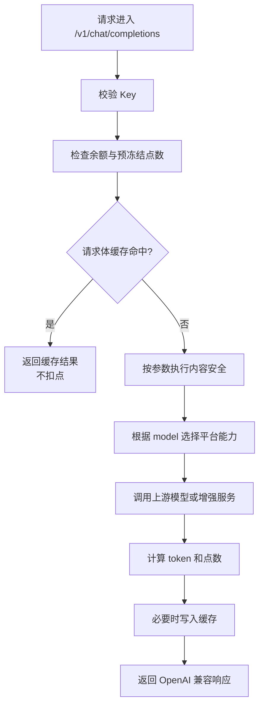

# 竞品分析：API2D

**更新日期：** 2026年05月21日  
**信息来源：** 官网、Apifox API 文档、产品 FAQ、用户调研记录、同类竞品对比  
**竞争优先级：** 中（国内 OpenAI 兼容 API 聚合/转发服务，偏个人开发者与轻量团队）  
**参考地址：**

1. 官网：[API2D](https://api2d.com/)
2. 新版入口：[API2D 开通页](https://api2d.com/r/)
3. API 文档：[API2D Apifox 文档](https://api2d-doc.apifox.cn/)
4. 兼容应用：[API2D 兼容应用](https://api2d.com/wiki/app)
5. 计费说明：[API2D 计费说明](https://api2d.com/wiki/pricing)
6. API 说明：[API2D API](https://api2d.com/wiki/api)
7. Forward Key：[API2D Forward Key](https://api2d.com/wiki/forward-key)
8. 支持反馈：[API2D 联系我们](https://support.qq.com/product/544571)

---

## 1. 结论摘要

API2D 是国内较早面向个人开发者和轻量团队提供 OpenAI 兼容 API 转发/聚合的商业服务，核心口号是“像用电一样用 API”和“注册、充值、填 Key 即用”。它的主要价值不是企业级 MaaS 治理，也不是 OpenRouter/OfoxAI 那类现代模型市场，而是把海外模型和部分增强能力包装成国内开发者更容易使用的 API 入口：用户注册、充值、复制 Key 后，将支持自定义 API URL 的客户端、SDK 或应用指向 API2D，即可按点数调用。

API2D 不能简单写成“裸代理”。官方资料显示它在 OpenAI 兼容接口之外，提供了 API2D Key / Forward Key / Custom Key / API Token 等 Key 形态，支持 Chat Completions、Completions、Embeddings、Images、TTS/STT、Claude、Gemini、Stable Diffusion、向量数据库、文本安全、检索增强和工具能力。它还提供请求结果缓存机制：相同 `sha1(request.body)` 可在 24 小时内直接返回缓存，命中后不扣点；也支持 `x-api2d-no-cache: 1` 强制跳过缓存。这一点在成本优化上有实用价值，但不是语义缓存，而是请求体级精确缓存。

从竞争关系看，API2D 更像“国内开发者友好的 OpenAI API 商业中转服务”，与 One API/new-api 的自部署 API 分发后台、OpenRouter/OfoxAI 的托管模型聚合平台、LiteLLM/Portkey 的企业 AI Gateway 都不完全一样。它对 MaaS 的威胁主要在 PoC、个人开发者、小团队和兼容应用生态；当客户进入企业级阶段，API2D 在私有化、组织治理、审计、预算、复杂路由、容灾、SLA、合规和供应商可控方面短板明显。

---

## 2. 产品概况

| 项目 | 内容 |
| --- | --- |
| 产品名称 | API2D |
| 产品定位 | OpenAI 兼容 API 聚合/转发服务 / 国内商业 API 中转平台 / 轻量开发者 API 网关 |
| 部署形态 | SaaS 托管服务，用户不自部署 |
| 核心口号 | 像用电一样用 API；注册、充值、填 Key 即用 |
| API 形态 | OpenAI-compatible 为主，另有 Claude、Gemini、Stable Diffusion、向量数据库、Azure TTS/STT 等接口 |
| 目标用户 | 国内个人开发者、AI 应用使用者、小团队、需要快速配置 API URL 的客户端用户 |
| 典型场景 | ChatGPT 客户端接入、OpenAI SDK 改 base URL、图像生成、向量检索、内容安全、应用兼容教程、代理销售 |
| Key 形态 | API2D Key、Forward Key、Custom Key、API Token |
| 计费方式 | 充值点数，按模型与增强能力消耗点数；文档中常见口径为 OpenAI 官方定价 1.5 倍，存在例外 |
| 竞争类型 | 国内商业 API 中转/聚合服务，与 One API/new-api、OfoxAI、OpenRouter、ZenMux 形成局部竞争 |

API2D 的产品心智非常接地气：不要求用户理解复杂的模型路由、供应商策略或企业治理，而是强调“哪些软件能填 API URL，基本就能用 API2D”。这一点让它在大量桌面客户端、网页应用、ChatGPT Next Web、OpenCat、Chat 酱、Bot 郡等工具用户中有天然传播性。

---

## 3. 产品定位与典型场景

| 场景 | API2D 解决的问题 | 价值 |
| --- | --- | --- |
| 国内开发者快速接入 OpenAI 类接口 | 海外 API 获取、支付、网络和客户端配置存在门槛 | 通过国内化注册、充值、Key 和教程降低接入成本 |
| AI 客户端配置 | 大量客户端只支持填写 API Key 和 API URL | 提供兼容 OpenAI 接口的转发入口，改 base URL 即可用 |
| 小团队 PoC | 项目早期不想搭网关、签供应商合同或维护上游 Key | 快速验证模型能力，按点数消耗 |
| 内容安全 | 开发者需要简单文本审核或内容拦截 | 通过 `safe_mode`、`moderation`、`moderation_stop` 做轻量治理 |
| 请求重复场景 | 相同请求重复调用会重复扣费 | 请求体级缓存命中后不扣点，适合静态测试和重复内容 |
| 检索增强 | 轻量应用需要向量写入、搜索和查询 | 提供向量数据库相关接口，降低自建向量库门槛 |
| 代理销售 | 渠道方希望售卖 API 能力 | 官网 FAQ 提到代理销售问题，说明其商业模式面向分销场景 |
| 多模态能力 | 用户需要图片、语音、Claude/Gemini 等能力 | 文档目录覆盖图片生成、TTS/STT、Claude、Gemini、Stable Diffusion |

API2D 的定位可以概括为：它不是企业 AI 基础设施平台，而是“商业化的 API 入口服务 + 兼容应用教程 + 轻量增强能力”。

---

## 4. 技术架构

```mermaid
graph TB
    Client[客户端 / SDK / AI 应用] --> API[API2D 兼容 API 入口\n/v1/chat/completions 等]
    API --> Auth[鉴权层\nAPI2D Key / Forward Key / Custom Key / API Token]
    Auth --> Billing[点数与冻结\n预冻结 / 消耗 / 余额查询]
    Billing --> Cache[请求体缓存\nsha1(request.body) / 24小时 / no-cache]
    Cache --> Safety[内容安全增强\nsafe_mode / moderation / moderation_stop]
    Safety --> Relay[转发与增强层\nOpenAI-compatible / Claude / Gemini / Images]
    Relay --> OpenAI[OpenAI 类模型]
    Relay --> Claude[Claude]
    Relay --> Gemini[Gemini]
    Relay --> Image[Stable Diffusion / Image API]
    Relay --> Vector[向量数据库 / 检索增强]
    API --> Console[用户后台\n注册 / 充值 / Key / 兼容应用]
    Console --> Support[FAQ / 教程 / 支持反馈]
```

| 层级 | 说明 |
| --- | --- |
| 接入层 | 对外提供 OpenAI 风格路径，例如 `/v1/chat/completions`，适合 SDK 和客户端改 base URL |
| 鉴权层 | Header 使用 `Authorization: Bearer ...`，可填 forwardKey、customKey 或 API Token |
| 计费层 | 采用点数体系，部分接口会预冻结点数，最终按实际消耗调整 |
| 缓存层 | 对完整请求体做哈希缓存，相同请求体 24 小时内可直接返回且不扣点 |
| 内容安全层 | 通过自定义参数接入 GPT 自审或腾讯文本安全审核 |
| 转发层 | 调用 OpenAI、Claude、Gemini、Stable Diffusion、Azure 语音等上游能力 |
| 应用生态层 | 提供大量兼容应用教程，让非平台工程用户直接配置使用 |

---

## 5. 接入与调用方式

### 5.1 兼容性口径

官网 FAQ 明确说明：所有使用 OpenAI 接口、且支持设置自定义 API 域名/地址的软件、网站和 SDK，都可以使用 API2D。这个定位非常典型：API2D 的核心接入路径不是让用户学习一个新 SDK，而是替换 OpenAI SDK 或客户端里的 API Base 与 Key。

### 5.2 Chat Completions

Apifox 文档显示，聊天接口路径为：

```text
POST /v1/chat/completions
```

Header：

```text
Content-Type: application/json
Authorization: Bearer <forwardKey/customKey/API Token>
```

请求体示例：

```json
{
  "model": "gpt-3.5-turbo",
  "messages": [
    {
      "role": "user",
      "content": "讲个笑话"
    }
  ],
  "safe_mode": false
}
```

返回格式接近 OpenAI Chat Completions，但会附加计费相关字段，例如 `pre_token_count`、`pre_total`、`adjust_total`、`final_total`：

```json
{
  "id": "chatcmpl-7KeDpu9A1NA8cvGROprevZBXrFf90",
  "object": "chat.completion",
  "created": 1685155529,
  "model": "gpt-3.5-turbo-0301",
  "usage": {
    "prompt_tokens": 13,
    "completion_tokens": 32,
    "total_tokens": 45,
    "pre_token_count": 4096,
    "pre_total": 42,
    "adjust_total": 41,
    "final_total": 1
  },
  "choices": [
    {
      "message": {
        "role": "assistant",
        "content": "为什么小鸟不会在电脑上打字？因为它们只会打鸟语！"
      },
      "finish_reason": "stop",
      "index": 0
    }
  ]
}
```

### 5.3 常见调用示例

```bash
curl https://openai.api2d.net/v1/chat/completions \
  -H "Content-Type: application/json" \
  -H "Authorization: Bearer $API2D_KEY" \
  -d '{
    "model": "gpt-3.5-turbo",
    "messages": [
      {
        "role": "user",
        "content": "用一句话介绍 API2D"
      }
    ]
  }'
```

> 说明：历史教程中常见 Base URL 为 `https://openai.api2d.net/v1`。API2D 页面和 Apifox 文档主要强调路径与 Header，实际生产接入时应以用户后台和最新文档展示的入口为准。

---

## 6. 核心功能总览

| 分类 | 能力 | 成熟度 | 说明 |
| --- | --- | --- | --- |
| OpenAI 兼容 | `/v1/chat/completions`、`/v1/completions`、Embeddings、Images 等 | 高 | 面向客户端和 SDK 迁移非常友好 |
| Key 管理 | API2D Key、Forward Key、Custom Key、API Token | 中高 | 覆盖终端使用和开发者转发场景 |
| 计费 | 点数充值、预冻结、最终扣点、余额查询 | 中高 | 商业中转服务核心能力 |
| 内容安全 | `safe_mode`、`moderation`、`moderation_stop` | 中 | 轻量安全能力，效果和成本需注意 |
| 缓存 | 请求体哈希缓存 24 小时，命中不扣点 | 中 | 成本友好，但不是语义缓存 |
| 流式 | 支持 `stream` 参数 | 中 | 文档提示因计费和审核逻辑，比官方流慢 |
| 多模型 | GPT-3.5/4/4o/o1 等 OpenAI 系列模型 | 中 | 文档枚举较多，但实时可用性需后台核实 |
| 多供应商 | Claude、Gemini、Stable Diffusion、腾讯云、Azure 语音等 | 中 | 覆盖广度不错，但统一治理能力有限 |
| 向量数据库 | uuid、写入向量、搜索、删除、查询 | 中 | 面向轻量检索增强场景 |
| 兼容应用 | Chat 酱、Bot 郡、OpenCat、GPTNextWeb 等教程 | 高 | 用户增长与低门槛使用的重要入口 |
| 路由策略 | 未见明确智能路由策略 | 低 | 更偏固定转发和平台内部选择 |
| 容灾降级 | 未见显式 fallback 链、熔断冷却和 SLA 路由 | 低 | 对生产企业场景不足 |
| 企业治理 | 未见完整 RBAC、多租户、审批、审计 | 低 | 不是企业 MaaS 平台 |

---

## 7. Key 体系与开发者模式

API2D 文档中 Authorization 可使用 forwardKey、customKey 或 API Token。结合官网“API2D Key / Forward Key”表述，可以把其 Key 体系理解为面向不同使用场景的多层访问凭证。

| Key 类型 | 典型用途 | 价值 | 风险 |
| --- | --- | --- | --- |
| API2D Key | 用户直接调用 API2D 服务 | 简单直接，适合个人和客户端配置 | 泄露后可能直接消耗点数 |
| Forward Key | 面向转发、代理或集成场景 | 便于把 API2D 接入到第三方应用或中间层 | 需要额度和权限控制，否则难以分摊成本 |
| Custom Key | 自定义 Key 管理 | 可提升对外分发时的可读性和管控 | 具体作用域需后台实测 |
| API Token | 开发者计划或管理 API | 适合查询消耗、生成 Key 等开发者操作 | 管理权限高时需要严格保护 |

与 One API/new-api 的令牌系统相比，API2D 的 Key 更偏 SaaS 用户凭证和商业转发凭证；与 OpenRouter 的 Management API Key 相比，公开资料中 API2D 的 Key 生命周期、额度上限、禁用、周期重置和 API 化管理能力没有那么完整。

---

## 8. 计费与成本机制

API2D 使用点数体系。官方页面强调“像用电一样用 API”，用户注册、充值、复制 Key 后即可使用。Apifox 文档对 Chat Completions 提供了非常关键的计费说明：

| 计费点 | 说明 |
| --- | --- |
| 模型定价 | 文档口径为模型定价均为 OpenAI 官方定价的 1.5 倍，3.5 元充值档位除外 |
| 图片例外 | `gpt-4-vision-preview` 图片部分价格不同，`detail: low` 每张 20P，`detail: high` 每张 100P |
| 预冻结 | 未指定 `max_tokens` 时，会按模型支持最大 token 预冻结点数 |
| 最终扣点 | 返回中可见预冻结、调整和最终扣点字段 |
| safe mode | 开启后每次访问约增加 1P 消耗 |
| moderation | 开启后每 9000 字符增加 10P 消耗 |
| 缓存命中 | 相同请求体命中缓存后不扣点 |
| Token 估算 | 官网提供 Token 计算器帮助估算费用 |

### 8.1 预冻结机制影响

文档中特别提醒：如果不指定 `max_tokens`，每次请求会预先冻结模型支持的最大 token 对应点数。例如 GPT-3.5 场景可能因为预冻结导致余额不足报错。用户可以通过设置合理的 `max_tokens` 来降低预冻结压力。

这对客户体验很关键：API2D 的计费不是只在请求完成后扣除，而是存在调用前余额校验和冻结过程。如果接入方不了解，会把“余额足够但报错”误判为接口异常。

### 8.2 缓存机制的成本价值

API2D 的缓存机制是请求体级精确缓存：

| 项目 | 说明 |
| --- | --- |
| 缓存 Key | `sha1(request.body)` |
| 保存时间 | 24 小时 |
| 命中效果 | 直接返回缓存结果，不扣点 |
| 跳过方式 | 请求 Header 添加 `x-api2d-no-cache: 1` |
| 判断方式 | 非流式返回多 `cache` 属性；流式返回 Header 多 `X-Api2d-Cache` |

这类缓存适合重复测试、固定 prompt、教程演示和某些静态问答，但不能替代 MaaS 语义缓存。它不会识别相似问题，也不适合需要实时生成、多轮上下文变化或强随机性的场景。

---

## 9. 内容安全与审核能力

API2D 在 OpenAI 兼容参数之外提供了三个内容安全相关扩展：

| 参数 | 默认值 | 作用 | 成本影响 | 能力边界 |
| --- | --- | --- | --- | --- |
| `safe_mode` | `false` | 尝试让 GPT 自己审查内容，不输出违规结果 | 每次访问约增加 1P | 对暴力、色情效果较好，政治类效果一般；依赖模型自律 |
| `moderation` | `false` | 调用文本安全接口判定内容，并将审核结果放入返回值 `moderation` 字段 | 每 9000 字符增加 10P | 需要开发者自行判断如何处理 |
| `moderation_stop` | `false` | 在 `moderation` 为 true 且审核不通过时自动拦截 | 同 `moderation` | 仅是轻量拦截，不等同企业内容安全策略中心 |

与 MaaS 平台相比，API2D 的内容安全能力更像“接口级附加参数”。MaaS 可以在此基础上做更完整的策略：按租户/应用/场景配置审核规则，记录命中原因，支持人工复核、灰度策略、风险分级和合规报表。

---

## 10. 路由策略、规则与容灾降级

API2D 的公开资料没有展示成熟的外部可配置路由策略。它不像 OfoxAI 提供 `provider.routing`，也不像 OpenRouter 提供 provider sort、only/ignore、模型 fallback 或 auto router；更不像 LiteLLM/Portkey 提供自定义权重、fallback、熔断和冷却。

### 10.1 当前可确认的路由相关能力

| 能力 | 当前判断 | 说明 |
| --- | --- | --- |
| 固定模型调用 | 支持 | 用户通过 `model` 参数指定模型 |
| OpenAI 兼容转发 | 支持 | 主要通过 API Base + Key 转发到平台上游 |
| 多上游聚合 | 有 | 官网展示 OpenAI、Claude、Gemini、Stable Diffusion、腾讯云、向量数据库等能力 |
| 开发者 Key/Forward Key | 有 | 可支持上层应用或代理场景 |
| 请求体缓存 | 有 | 相同请求体 24 小时缓存，节省成本 |
| 内容安全规则 | 有 | `safe_mode`、`moderation`、`moderation_stop` |
| 显式 provider 路由 | 未见 | 没有公开 `cost`、`latency`、`priority` 等策略参数 |
| 显式模型 fallback | 未见 | 未见请求级备选模型链路 |
| 熔断冷却 | 未见 | 未见公开健康检查、熔断、恢复策略 |
| SLA 路由 | 未见 | 不具备企业级 SLA 策略公开能力 |

### 10.2 请求处理链路推断



### 10.3 与 MaaS 路由能力的差距

API2D 的强项是“填 Key 即用”和“应用兼容”，不是复杂路由。企业客户常见的以下要求，API2D 公开资料没有充分覆盖：

| 企业需求 | API2D 当前短板 |
| --- | --- |
| 按成本/延迟/稳定性动态选供应商 | 未见外部可配置策略 |
| 同模型多供应商权重与健康度 | 未见控制台能力 |
| 跨模型 fallback | 未见请求级或全局配置 |
| 错误类型触发不同降级 | 未见 |
| 熔断、冷却、半开探测 | 未见 |
| 可解释路由日志 | 未见 |
| 租户级 SLA 策略 | 未见 |

---

## 11. 可观测性与运营能力

API2D 的运营能力主要围绕用户充值、点数消耗、Key 和兼容应用教程展开。Apifox 文档中提供余额查询、查询点数消耗、生成 API Token、Custom Key 操作等开发者计划接口，说明它具备一定后台与开发者管理能力。

| 能力 | 说明 | 成熟度 |
| --- | --- | --- |
| 余额查询 | 文档目录包含余额查询接口 | 中 |
| 点数消耗查询 | 开发者计划中包含查询点数消耗 | 中 |
| Key 管理 | 支持 API Token、Custom Key、Forward Key 等 | 中 |
| 兼容应用教程 | 官网提供多种应用教程 | 高 |
| FAQ 和支持反馈 | 提供产品 FAQ 与腾讯兔小巢反馈入口 | 中 |
| 请求日志 | 公开资料未展示完整请求日志、路由日志和审计日志 | 低 |
| 成本分析 | 更偏余额/点数查询，未见复杂成本分析看板 | 低 |
| 告警 | 未见企业级告警能力 | 低 |

与 new-api/One API 相比，API2D 不强调用户自建运营后台；与 OpenRouter/OfoxAI 相比，它也缺少更现代的模型目录、请求分析、团队预算和状态页。它的运营重心更像商业 API 服务本身，而不是让客户管理自己的组织级 AI 消耗。

---

## 12. 生态与兼容应用

API2D 的一个重要优势是“兼容应用”生态。官网明确说，支持填写 API URL 的 GPT-3.5/4 应用基本都可以使用 API2D，并列举了多种聊天工具和开源应用。

| 类型 | 代表应用/工具 |
| --- | --- |
| 聊天客户端 | Chat 酱、Bot 郡、OpenCat |
| Web 应用 | GPTNextWeb、各类 ChatGPT Web 类项目 |
| SDK | OpenAI SDK 及支持自定义 API Base 的语言 SDK |
| AI 应用 | 支持自定义 API URL 的 GPT-3.5/4 应用 |
| 开发工具 | 可通过 Forward Key/API Token 集成到中间层 |

这类兼容应用生态是 API2D 对个人用户和小团队最强的获客入口。它不像 MaaS 平台那样先讲平台架构，而是直接告诉用户“你现在手里的软件怎么填”。这一点值得 MaaS 公共文档和开发者门户借鉴。

---

## 13. 与 One API、new-api、OfoxAI、OpenRouter 对比

| 维度 | API2D | One API/new-api | OfoxAI | OpenRouter |
| --- | --- | --- | --- | --- |
| 部署形态 | SaaS 托管 | 自部署开源后台 | SaaS 托管 | SaaS 托管 |
| 核心定位 | 国内商业 API 中转/聚合 | API 分发运营后台 | 企业 LLM 网关 | 模型市场 + 路由平台 |
| 接入门槛 | 极低，注册充值填 Key | 需要部署和配置渠道 | 低，注册 Key 后接入 | 低，注册 Key 后接入 |
| 模型广度 | 中，OpenAI/Claude/Gemini/图像/语音等 | 取决于自配置渠道 | 100+ 精选模型 | 500+ 模型和 provider |
| 路由策略 | 弱，未见显式策略 | 渠道权重/失败重试 | priority/cost/latency/balanced | provider sort/filters/auto/free |
| fallback | 未见显式配置 | 渠道失败重试 | 请求级 fallback 列表 | 模型和 provider fallback 丰富 |
| 计费 | 点数充值，官方价 1.5 倍口径 | 自定义倍率/余额/充值 | 官方价、0% 平台费、返利 | 模型价格 + 充值手续费口径 |
| 缓存 | 请求体级 24 小时缓存 | 运行缓存/部分缓存计费 | Prompt Caching | Prompt Caching |
| 内容安全 | safe mode、moderation | 依赖部署方或插件 | 零内容留存/基础安全宣传 | provider policy 和隐私策略 |
| 企业治理 | 弱 | 站点级用户/令牌/额度 | 团队、预算、权限宣传 | 开发者市场偏强 |
| 私有化 | 无 | 有 | 无 | 无 |

API2D 与 One API/new-api 的最大差异是“谁承担运维”。API2D 把上游、计费、Key、充值和可用性都封装成 SaaS；One API/new-api 则让用户自建、自己配置上游和价格。API2D 与 OfoxAI/OpenRouter 的差异是“平台现代化程度”：OfoxAI/OpenRouter 更强调模型市场、供应商路由、企业团队、可观测和 SLA，而 API2D 更像早期但实用的国内 API 中转商业服务。

---

## 14. 与 MaaS 平台对比

| 对比维度 | MaaS 平台 | API2D | 胜出方 |
| --- | --- | --- | --- |
| OpenAI 兼容 | 支持 | 支持 | 持平 |
| 接入便利性 | 取决于门户和文档 | 极强，填 Key 即用 | API2D |
| 多模型聚合 | 支持 | 支持部分模型和增强能力 | 持平或 MaaS |
| 三协议原生 | 可规划 | 以 OpenAI 兼容为主，另有 Claude/Gemini 接口 | MaaS 可差异化 |
| 路由策略 | 可做成本/延迟/SLA/合规路由 | 未见成熟策略 | MaaS |
| 容灾降级 | 可做 fallback、熔断、冷却 | 未见显式能力 | MaaS |
| 计费与预算 | 可做组织/部门/项目/应用分账 | 点数充值与消耗 | MaaS |
| 内容安全 | 可做策略中心和审计 | 参数级 safe mode/moderation | MaaS |
| 缓存 | 可做语义缓存和精确缓存 | 请求体级精确缓存 | MaaS |
| 私有化部署 | 可支持 | 不支持 | MaaS |
| 企业审计 | 可做完整审计链 | 未见 | MaaS |
| 兼容应用教程 | 需建设 | 强 | API2D |
| 合规与供应商可控 | 可按客户要求交付 | SaaS 中转，客户控制弱 | MaaS |

### 14.1 MaaS 应对重点

| API2D 卖点 | MaaS 应对方式 |
| --- | --- |
| 注册、充值、填 Key 即用 | 做好开发者自助开通、示例、SDK 和兼容应用教程 |
| OpenAI SDK 兼容 | 保证 base URL 替换体验稳定，并覆盖常见客户端 |
| 请求缓存不扣点 | 提供显式缓存策略，区分精确缓存、语义缓存和缓存计费 |
| 内容安全扩展参数 | 建设平台级内容安全策略中心，而不是只靠请求参数 |
| 点数预付费简单 | 提供企业预算、余额、成本中心、账单分摊和用量告警 |
| 国内用户易用 | 强化中文文档、客服、合规和本地化交付 |

---

## 15. 优势分析

| 优势 | 说明 |
| --- | --- |
| 接入心智极简单 | “注册、充值、复制 Key”非常适合个人和轻量团队 |
| 兼容应用生态好 | 支持大量可填写 API URL 的客户端和开源应用 |
| OpenAI 兼容成熟 | Chat Completions 等接口接近官方格式，SDK 改造成本低 |
| 点数计费直观 | 用户能通过充值点数直接理解消耗 |
| 请求体缓存实用 | 相同请求 24 小时内命中不扣点，适合测试和重复场景 |
| 内容安全有基础能力 | `safe_mode` 和 `moderation` 对轻量应用有帮助 |
| 能力覆盖不止聊天 | 包含图片、向量、语音、Claude、Gemini、Stable Diffusion 等入口 |
| 中文支持好 | 官网、FAQ、教程面向国内用户，降低学习成本 |

---

## 16. 劣势与风险

| 风险 | 说明 | 对 MaaS 的启示 |
| --- | --- | --- |
| 平台治理弱 | 未见完整团队、RBAC、审批、审计和预算中心 | MaaS 应把组织治理做成核心壁垒 |
| 路由能力弱 | 未见成本/延迟/健康度/合规路由参数 | MaaS 应提供策略化路由和可解释日志 |
| 容灾能力弱 | 未见显式 fallback、熔断、冷却、SLA 路由 | MaaS 可强化生产可用性承诺 |
| SaaS 中转依赖 | 客户无法控制上游供应商、区域、日志和合同 | MaaS 可提供自持上游、混合云和私有化 |
| 计费溢价 | 常见口径为官方价 1.5 倍，长期大用量成本可能偏高 | MaaS 可通过企业采购和直连供应商降低成本 |
| 预冻结体验 | 未设置 `max_tokens` 可能冻结较多点数并报余额不足 | MaaS 应提供更透明的成本预估与报错解释 |
| 内容安全有限 | safe mode 效果随机，moderation 仍需开发者处理 | MaaS 可做风险分级、策略编排和审计留痕 |
| 缓存粒度有限 | 仅完整请求体匹配，无法识别语义相似 | MaaS 可做语义缓存和缓存命中解释 |
| 企业合规不足 | 未见 SOC2、ISO、DPA、数据驻留、私有化等资料 | MaaS 对政企客户有明显机会 |

---

## 17. 销售应对策略

### 17.1 客户说“API2D 已经够用了”

如果客户只是个人开发、Demo、PoC 或配置 ChatGPT 客户端，API2D 的确足够简单。应先认可其低门槛价值，再追问客户是否进入生产：是否需要团队权限、预算控制、日志审计、供应商 SLA、内容安全策略、部门分账、私有化、合规留痕和故障降级。一旦进入这些问题，API2D 的平台能力会明显不足。

### 17.2 客户关注价格

API2D 的点数体系简单，但官方文档中有 OpenAI 官方价 1.5 倍的口径，长期高用量客户应关注总成本。MaaS 可以强调企业直采、供应商议价、缓存节省、路由降本、预算告警和成本中心分摊，而不是只比较单次调用价格。

### 17.3 客户关注兼容应用

API2D 在这点上做得好。MaaS 不应该只提供抽象 API 文档，而要提供 ChatGPT Next Web、OpenCat、Cherry Studio、Cline、LangChain、LlamaIndex 等具体应用的配置教程，让用户能像 API2D 一样快速上手。

### 17.4 客户关注内容安全

API2D 的内容安全是参数级能力。MaaS 应强调企业级内容安全策略中心：按租户和应用配置、支持多供应商审核、命中原因可追溯、人工复核、审计报表和合规留存。

### 17.5 客户关注稳定性

API2D 的公开资料不突出多供应商 fallback、熔断和 SLA。MaaS 可以展示多上游健康检查、自动降级、错误类型策略、熔断冷却、可解释路由日志和告警闭环。

---

## 18. 对 MaaS 产品建设的启示

1. 开发者体验要像 API2D 一样直接。注册、创建 Key、复制 base URL、粘贴到客户端，这条链路必须短。
2. 兼容应用教程是增长入口。不要只写 API Reference，要写“在某个具体工具里怎么填”。
3. 计费解释要清楚。API2D 的 `pre_total`、`adjust_total`、`final_total` 体现了扣费透明度，MaaS 也应展示请求成本拆解。
4. 缓存要可控可解释。API2D 的 `x-api2d-no-cache` 很实用，MaaS 可以进一步提供精确缓存、语义缓存、缓存禁用和命中原因。
5. 内容安全要平台化。API2D 的 `safe_mode` 和 `moderation` 是好入口，但企业需要策略中心和审计闭环。
6. 路由与 fallback 是 MaaS 的差异化核心。API2D 没有成熟公开能力，MaaS 应把成本、延迟、稳定性、合规、SLA 和错误类型都纳入策略。

---

## 19. 信息核实与待跟进

| 信息项 | 当前状态 | 后续建议 |
| --- | --- | --- |
| 官网定位 | 已核实，强调“像用电一样用 API”和填 Key 即用 | 定期复核新版页面 |
| API 文档 | 已核实 Apifox 文档，覆盖 Chat、Images、Embeddings、语音、向量、Claude 等 | 后续可逐接口实测 |
| Base URL | 历史教程常见 `https://openai.api2d.net/v1`，文档页重点展示路径 | 以用户后台最新入口为准 |
| Key 形态 | 已看到 forwardKey/customKey/API Token/API2D Key 表述 | 后续登录后台核实权限和生命周期 |
| 计费 | 已确认官方价 1.5 倍口径、点数、预冻结和增强能力额外扣点 | 需要查看最新充值档位和模型价格表 |
| 缓存 | 已确认请求体哈希缓存 24 小时与 no-cache Header | 实测流式和非流式返回字段 |
| 内容安全 | 已确认 `safe_mode`、`moderation`、`moderation_stop` | 实测不同风险类型效果 |
| 路由/fallback | 未见成熟公开能力 | 若有后台隐藏策略，需登录或询问官方 |
| 企业治理 | 未见完整资料 | 销售对比时作为短板处理 |
| 合规/SLA | 未见详细合同和认证资料 | 企业采购前必须核实 |

---

## 20. 总结

API2D 是国内 API 中转服务中非常典型、也很有代表性的产品：它把“复杂模型 API”做成了“充值点数 + 填 Key + 改 API URL”的简单体验，并通过兼容应用教程、内容安全参数、请求缓存、向量接口和多种 Key 形态覆盖了个人开发者和小团队的高频需求。

但它的能力边界同样清晰：API2D 更适合轻量使用和快速接入，不适合承担企业级 MaaS 的组织治理、私有化、合规、预算审批、可解释路由、自动 fallback、熔断降级和全链路审计。MaaS 平台应学习它的低门槛接入和中文兼容应用生态，同时在企业治理、策略路由、容灾、成本管理和合规交付上建立更高壁垒。
