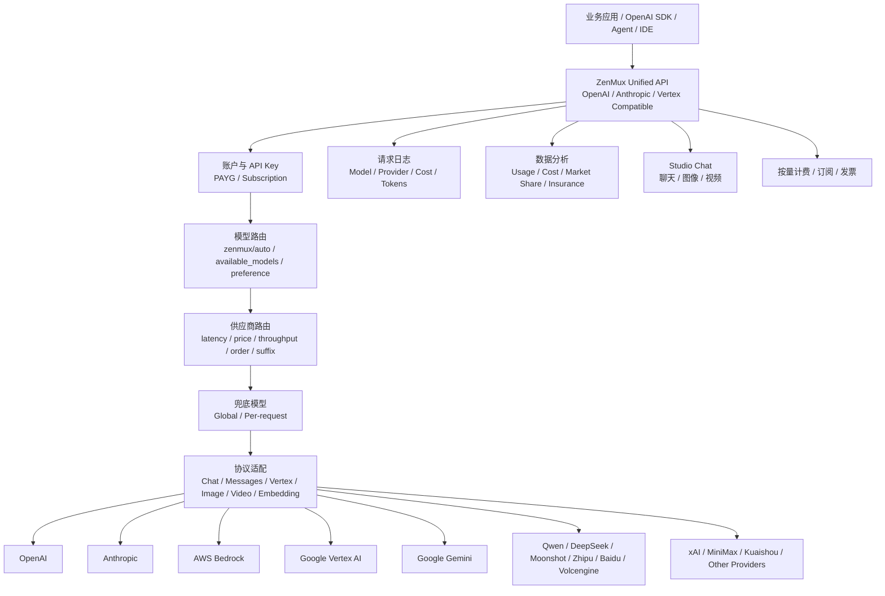
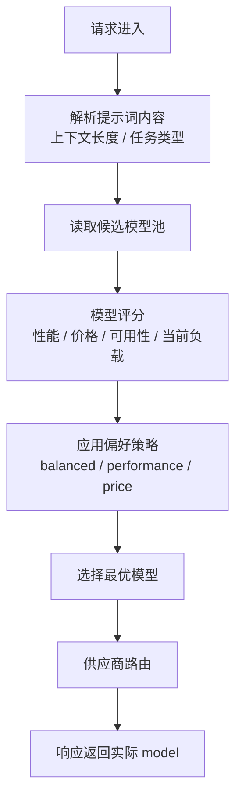

# 竞品分析：ZenMux

**更新日期：** 2026年05月21日  
**信息来源：** ZenMux 官网、官方文档、用户实测记录、公开页面  
**竞争优先级：** 中高（托管模型聚合网关，与 OpenRouter 接近，强调模型路由、供应商路由和可用性保障）  
**参考地址：**

1. 官网：[ZenMux](https://zenmux.ai/)
2. 模型列表：[ZenMux Models](https://zenmux.ai/models)
3. 数据分析：[ZenMux Analytics](https://zenmux.ai/analytics)
4. 快速开始：[Quickstart](https://zenmux.ai/docs/zh/guide/quickstart.html)
5. 供应商路由：[Provider Routing](https://zenmux.ai/docs/zh/guide/advanced/provider-routing.html)
6. 模型路由：[Model Routing](https://zenmux.ai/docs/zh/guide/advanced/model-routing.html)
7. 兜底模型：[Fallback Model](https://zenmux.ai/docs/zh/guide/advanced/fallback.html)
8. 请求日志：[Request Logs](https://zenmux.ai/docs/zh/guide/observability/logs.html)
9. 成本分析：[Cost](https://zenmux.ai/docs/zh/guide/observability/cost.html)
10. 保险补偿：[Insurance](https://zenmux.ai/docs/zh/guide/observability/insurance.html)

> 文件名沿用原始编号 `24-zenMux.md`，但官方品牌和用户调研地址均为 ZenMux / zenmux.ai。本文按 ZenMux 进行分析。

---

## 1. 结论摘要

ZenMux 是一个托管式模型聚合网关和多模型 API 平台，定位接近 OpenRouter，但更强调“一个账户、一套 API、统一访问顶级模型”“官方供应商或授权云合作伙伴”“多供应商故障切换”“模型智能路由”和“结果不佳保险赔付”。它不是 One API/new-api/one-hub 这类自托管 API 分发后台，也不是 LiteLLM/Bifrost/Portkey 这类可作为企业内部基础设施部署的开源网关。

ZenMux 的核心能力包括 OpenAI/Anthropic/Google Vertex AI 协议兼容、模型列表与价格展示、模型详情页、供应商详情页、供应商路由、模型路由 `zenmux/auto`、全局/请求级兜底模型、流式、多模态、结构化输出、工具调用、推理模型、提示词缓存、图片/视频生成、文本嵌入、网络搜索、1M 长上下文、请求日志、成本分析、用量统计、订阅制和按量计费。

与旧稿“资料有限、轻量代理工具”的判断相比，ZenMux 的产品化程度需要明显上调。它已经具备比较完整的模型聚合平台能力，尤其在“同一模型多供应商路由”“任务级自动选模型”“兜底模型”“价格/延迟/吞吐量透明对比”“结果不佳赔付”上有鲜明产品特色。它对 MaaS 平台的竞争威胁主要来自“托管聚合体验 + 全球模型覆盖 + 低接入门槛 + 智能路由叙事”，而不是企业私有化或国内合规交付能力。

---

## 2. 产品概况

| 项目 | 内容 |
| --- | --- |
| 产品名称 | ZenMux |
| 公司主体 | AI Force Singapore Pte. Ltd.（官网页脚信息） |
| 产品定位 | 托管式多模型聚合网关 / AI Model Router / Unified AI API |
| 主要形态 | SaaS 平台 + API 网关 + 模型列表 + Studio Chat + 数据分析 |
| 开源属性 | 未看到核心网关开源仓库；官网链接主要指向文档/项目管理/Skills 等资源 |
| 目标用户 | 开发者、AI 应用团队、Agent/IDE 用户、需要统一调用国际和国内模型的团队 |
| 典型场景 | 多模型统一 API、供应商自动切换、模型自动选择、Claude Code/Cursor/Dify/Open-WebUI 等工具接入 |
| 协议支持 | OpenAI-compatible、Anthropic API、Google Vertex AI API 等 |
| 计费方式 | 按量计费、订阅制套餐、发票下载、模型价格展示 |
| 竞争类型 | 托管模型聚合平台 / OpenRouter 近邻竞品 / API 聚合与路由平台 |

ZenMux 官网主张“万千模型，一个网关，统一接入”，并强调模型来自官方提供商或授权云合作伙伴。这个定位与 OpenRouter 高度相似：客户不需要自建渠道、维护上游 Key 或部署网关，只需要注册 ZenMux，使用一个 API Key 调用不同模型。

---

## 3. 产品定位与典型场景

| 场景 | ZenMux 解决的问题 | 价值 |
| --- | --- | --- |
| 多模型统一入口 | 开发者需要分别管理 OpenAI、Anthropic、Gemini、Qwen、DeepSeek、Moonshot 等账号和协议 | 用一套 API 和一个账户统一调用 |
| 同模型多供应商 | Claude 等模型可通过 Anthropic、AWS Bedrock、Google Vertex 等不同供应商访问 | 自动选择低延迟、可用或更便宜的供应商 |
| 模型选择困难 | 不同任务需要不同能力、成本和速度的模型 | `zenmux/auto` 根据任务内容和偏好自动选模型 |
| 生产可用性 | 单一供应商故障、限流、超时会影响业务 | 多供应商自动切换和兜底模型降低中断风险 |
| 成本优化 | 模型价格差异大，人工比较成本高 | 模型详情页展示价格、延迟、吞吐、参数和供应商状态 |
| 编程 Agent 使用 | Claude Code、Cursor、Cline、OpenCode 等工具需要稳定模型入口 | 提供多种 IDE/Agent 接入指南 |
| 运营可观测 | 开发者需要看每次请求的模型、供应商、token、成本和用量 | 请求日志、成本分析、用量统计和公开 Analytics |
| 结果质量保障 | 延迟过高、吞吐低、幻觉等问题难以追责 | 引入“保险赔付”机制作为差异化承诺 |

ZenMux 的重点不是“帮你搭建自己的模型中转后台”，而是“你直接使用 ZenMux 作为模型路由和聚合入口”。

---

## 4. 技术架构



| 层级 | 说明 |
| --- | --- |
| API 接入层 | 提供 OpenAI-compatible、Anthropic Messages、Google Vertex AI 等协议入口 |
| 账户计费层 | 提供 API Key、按量余额、订阅套餐、发票和账单能力 |
| 模型路由层 | `zenmux/auto` 根据提示词、任务类型、上下文、价格、性能和可用性选择模型 |
| 供应商路由层 | 对同一模型在多个供应商间按延迟、价格、吞吐量或指定顺序路由 |
| 兜底层 | 主模型或路由策略失败后切换到全局或请求级 fallback model |
| 协议适配层 | 统一 Chat、Messages、Responses、Image、Video、Embedding、Tool Calls 等能力 |
| 可观测层 | 记录调用日志、实际模型、实际供应商、token、价格、成本和用量 |
| 展示层 | 模型列表、模型详情、供应商详情、Studio Chat、Analytics 和文档 |

---

## 5. 部署与接入

ZenMux 是托管式平台，公开资料中未看到需要用户自托管网关的部署流程。典型接入方式是直接把 OpenAI SDK 的 `base_url` 指向 ZenMux API，并使用 ZenMux API Key。

### 5.1 OpenAI SDK 接入

```python
from openai import OpenAI

client = OpenAI(
    base_url="https://zenmux.ai/api/v1",
    api_key="<ZENMUX_API_KEY>"
)

completion = client.chat.completions.create(
    model="qwen/qwen3-max",
    messages=[
        {
            "role": "user",
            "content": "What is the meaning of life?"
        }
    ]
)

print(completion.choices[0].message.content)
```

### 5.2 用户实测 Chat Completions

```bash
curl https://zenmux.ai/api/v1/chat/completions \
  -H "Content-Type: application/json" \
  -H "Authorization: Bearer $ZENMUX_API_KEY" \
  -d '{
    "model": "sapiens-ai/agnes-1.5-lite",
    "messages": [
      {
        "role": "user",
        "content": "What is the meaning of life?"
      }
    ]
  }'
```

用户记录的返回结构保持 OpenAI Chat Completion 风格，包含 `id`、`model`、`choices`、`usage`、`object`、`created` 等字段。


---

## 6. 核心功能总览

| 分类 | 能力 | 成熟度 | 说明 |
| --- | --- | --- | --- |
| 统一 API | OpenAI-compatible API | 高 | 业务侧可直接替换 `base_url` |
| 多协议 | Anthropic、Google Vertex AI、OpenAI Responses 等 | 中高 | 文档中有多协议 API 页面 |
| 模型聚合 | 国际和国内主流模型 | 高 | 模型列表和详情页覆盖多供应商、多模态模型 |
| 供应商路由 | latency、price、throughput、order、provider suffix | 高 | 是 ZenMux 的核心差异之一 |
| 模型路由 | `zenmux/auto` 自动选模型 | 中高 | 支持候选池和偏好策略 |
| 兜底模型 | 全局兜底、请求级兜底 | 中高 | 当前只支持一个兜底模型，无二次兜底 |
| 多模态 | 图片、视频、嵌入、网络搜索、长上下文 | 中高 | 文档覆盖范围较广 |
| 工具调用 | Tool Calls / Structured Output / Reasoning | 中高 | 适合 Agent 和开发工具接入 |
| 提示词缓存 | Prompt Cache | 中 | 文档和博客提及缓存命中分析 |
| 可观测 | 请求日志、成本、用量、公开 Analytics | 中高 | 支持查看实际模型与供应商 |
| 计费 | 按量、订阅、发票 | 中高 | 更像 SaaS 消费平台而非自托管计费后台 |
| 保险赔付 | 延迟、吞吐、幻觉等结果不佳时赔付 | 中 | 差异化强，但需要核实触发标准和赔付规则 |
| 私有化 | 未见明确自托管网关方案 | 低 | 与 MaaS 私有化、LiteLLM/Bifrost 自部署不同 |
| 企业治理 | 组织 RBAC、审批、预算中心未突出 | 中低 | 偏开发者平台，不是完整企业 MaaS 控制台 |

---

## 7. 模型与供应商覆盖

ZenMux 官网展示其支持 Anthropic、DeepSeek、xAI、OpenAI、Google、MiniMax、Moonshot、Z.AI、Qwen、Baidu、Volcengine、Kuaishou 等模型或供应商生态，并支持通过模型列表页查看各模型的输入/输出模态、价格、上下文长度、Max Tokens 等信息。

### 7.1 模型列表页

模型列表页可用于快速筛选模型，并查看：

| 信息 | 说明 |
| --- | --- |
| 模型 Slug | API 调用中的 `model` 值 |
| 输入/输出模态 | 文本、图片、音频、视频等支持情况 |
| 输入/输出价格 | Prompt / Completion 或不同模态计费项 |
| Context | 上下文窗口 |
| Max Tokens | 最大输出 token |
| 供应商 | 该模型背后的可用供应商 |

### 7.2 模型详情页

模型详情页展示同一模型在多个供应商下的差异，包括：

| 信息 | 说明 |
| --- | --- |
| 供应商列表 | 同一模型可由 Anthropic、Bedrock、Vertex 等不同供应商提供 |
| 性能对比 | 首 Token 延迟、吞吐量等指标 |
| 价格对比 | 各供应商计费项和价格 |
| 参数对比 | 支持参数差异 |
| 协议支持 | OpenAI API、Anthropic API 等 |
| 可用性状态 | 实时服务状态 |
| Provider Slug | 用于供应商路由配置 |

### 7.3 供应商详情页

供应商详情页展示某一供应商接入的所有模型和用量统计。这个设计使 ZenMux 更像“模型市场 + 供应商透明对比 + 路由平台”，而不是单纯 API 中转。

---

## 8. 供应商路由策略

ZenMux 的供应商路由是其核心能力之一：同一模型可能通过多个供应商调用，ZenMux 根据策略选择供应商。

### 8.1 默认路由策略

官方文档说明默认策略为：

1. 性能优先：按照首 Token 延迟从低到高排序。
2. 智能切换：如果原厂不可用，自动切换到其他供应商。

这说明 ZenMux 默认会把延迟和可用性作为核心路由依据。

### 8.2 模型名后缀锁定供应商

对于生产环境固定供应商、合规要求或测试验证场景，可直接在模型名后追加供应商 slug：

```text
model_slug:provider_slug
```

示例：

```json
{
  "model": "anthropic/claude-3.7-sonnet:amazon-bedrock",
  "messages": [
    {
      "role": "user",
      "content": "Hello, Claude!"
    }
  ]
}
```

这种方式完全兼容 OpenAI SDK 的标准参数结构，不需要额外 `provider` 字段。

### 8.3 按性能指标优先级路由

ZenMux 支持通过 `provider.routing` 指定按特定指标排序。

| 指标 | 说明 |
| --- | --- |
| `latency` | 按首 Token 延迟从低到高排序 |
| `price` | 按综合价格从低到高排序 |
| `throughput` | 按吞吐量从高到低排序 |

示例：

```json
{
  "model": "anthropic/claude-sonnet-4",
  "messages": [
    {
      "role": "user",
      "content": "Hello!"
    }
  ],
  "provider": {
    "routing": {
      "type": "priority",
      "primary_factor": "latency"
    }
  }
}
```

### 8.4 指定供应商列表回退

通过 `type: order` 指定供应商调用顺序，按列表依次尝试，成功即停。

```json
{
  "model": "anthropic/claude-sonnet-4",
  "messages": [
    {
      "role": "user",
      "content": "Hello!"
    }
  ],
  "provider": {
    "routing": {
      "type": "order",
      "providers": [
        "anthropic/anthropic_endpoint",
        "google-vertex/VertexAIAnthropic",
        "amazon-bedrock/BedrockAnthropic"
      ]
    }
  }
}
```

行为边界：

| 行为 | 说明 |
| --- | --- |
| 顺序调用 | 按 `providers` 列表顺序尝试 |
| 成功即停 | 任一供应商成功返回后停止后续尝试 |
| 单一供应商 | 只配置一个供应商时，只调用该供应商 |
| 支持性要求 | 指定供应商必须支持所选模型，否则可能失败 |

### 8.5 典型场景匹配

| 场景 | 推荐方式 | 说明 |
| --- | --- | --- |
| 锁定单一供应商 | 模型名后缀 | 适合生产固定供应商或合规要求 |
| 地理位置优化 | 指定供应商列表 | 选择离用户更近或区域合规的供应商 |
| 成本控制 | 按价格路由 | 优先选择更低价格供应商 |
| 性能优化 | 按延迟或吞吐量路由 | 动态选择更快或吞吐更高供应商 |
| 高可用保障 | 指定多个供应商 | 多供应商回退提升连续性 |
| A/B 测试 | 灵活切换 | 对比不同供应商表现 |

---

## 9. 模型路由：`zenmux/auto`

模型路由用于在多个候选模型之间自动选择最适合当前请求的模型。与供应商路由不同，模型路由解决的是“用哪个模型”，供应商路由解决的是“同一模型通过哪个供应商”。

### 9.1 基础用法

```json
{
  "model": "zenmux/auto",
  "model_routing_config": {
    "available_models": [
      "anthropic/claude-4-sonnet",
      "openai/gpt-5",
      "google/gemini-2.5-flash-lite"
    ],
    "preference": "balanced"
  },
  "messages": [
    {
      "role": "user",
      "content": "解释一下什么是量子计算"
    }
  ]
}
```

如果未指定 `available_models`，官方文档说明系统会使用平台全量模型池。

### 9.2 路由决策流程



### 9.3 偏好策略

| 策略 | 质量倾向 | 成本倾向 | 适用场景 |
| --- | --- | --- | --- |
| `balanced` | 中高 | 中高 | 生产通用应用、对话助手、内容生成 |
| `performance` | 高 | 低 | 关键业务、法律/医疗/金融、复杂代码、学术研究 |
| `price` | 中 | 高 | 高并发简单对话、内部工具、测试环境、预算敏感场景 |

### 9.4 能力边界

| 边界 | 说明 |
| --- | --- |
| 路由延迟 | 官方 FAQ 称决策通常 50-100ms，对大多数应用影响可忽略 |
| 候选池大小 | 官方建议 3-5 个模型，过少无法发挥优势，过多增加复杂度 |
| 可解释性 | 响应返回实际模型，控制台可看日志；但未看到完整评分解释链 |
| 控制权 | 托管平台内置策略，企业无法像自建网关一样完全控制算法和数据 |

---

## 10. 兜底模型与容灾降级

ZenMux 的 Fallback Model 用于主模型或路由策略失败时自动切换备用模型。

### 10.1 全局兜底模型

控制台路径：

```text
Settings / Strategy / Default Fallback Model
```

特点：

| 能力 | 说明 |
| --- | --- |
| 全局生效 | 配置一次后，所有请求可继承 |
| 无需改代码 | 对业务侧透明 |
| 集中管理 | 便于统一调整和监控 |
| 请求级覆盖 | 单次请求的 `provider.fallback` 优先级更高 |

### 10.2 请求级兜底模型

```json
{
  "model": "anthropic/claude-sonnet-4",
  "messages": [
    {
      "role": "user",
      "content": "解释一下什么是量子计算"
    }
  ],
  "provider": {
    "fallback": "google/gemini-2.5-flash-lite"
  }
}
```

### 10.3 与模型路由组合

```json
{
  "model": "zenmux/auto",
  "model_routing_config": {
    "available_models": ["anthropic/claude-4-sonnet", "openai/gpt-5"],
    "preference": "balanced"
  },
  "provider": {
    "fallback": "google/gemini-2.5-flash-lite"
  },
  "messages": [
    {
      "role": "user",
      "content": "解释一下什么是量子计算"
    }
  ]
}
```

### 10.4 与供应商路由组合

```json
{
  "model": "anthropic/claude-sonnet-4",
  "provider": {
    "routing": {
      "type": "order",
      "providers": [
        "anthropic/anthropic_endpoint",
        "google-vertex/VertexAIAnthropic"
      ]
    },
    "fallback": "google/gemini-2.5-flash-lite"
  },
  "messages": [
    {
      "role": "user",
      "content": "解释一下什么是量子计算"
    }
  ]
}
```

### 10.5 触发条件

官方文档列出的触发条件包括：

| 条件 | 说明 |
| --- | --- |
| 5xx 错误 | 上游 502/503 或服务不可用 |
| 超时 | 主模型响应超时 |
| 401/403 | API Key 无效或权限不足 |
| 429 | 达到速率限制 |
| 404 | 模型不存在或模型标识无效 |
| 临时故障 | 主模型服务短暂不可用 |
| 路由全部失败 | 智能路由候选模型均不可用 |

### 10.6 边界

| 边界 | 说明 |
| --- | --- |
| 当前只支持一个兜底模型 | 兜底模型失败后不会继续二次兜底 |
| 可能增加异常时延迟 | 正常请求不触发兜底；触发后耗时取决于主模型超时和备用模型响应 |
| 可观测方式 | 响应 `model` 字段会显示实际模型，控制台日志可查看详情 |

---

## 11. 可观测性、成本与保险补偿

ZenMux 把可观测性和成本透明作为产品卖点，官网强调“每个 Token、每笔费用一目了然”。

### 11.1 请求日志

请求日志用于查看每次调用的：

| 信息 | 说明 |
| --- | --- |
| 实际模型 | 包括模型路由或兜底后最终使用的模型 |
| 实际供应商 | 供应商路由后使用的 provider |
| Token 用量 | prompt、completion、total token 等 |
| 成本 | 本次请求费用 |
| 延迟/状态 | 响应状态、错误和耗时信息 |
| 路由行为 | 是否使用 fallback、是否切换供应商等信息 |

### 11.2 成本分析与用量统计

文档中包含成本分析、用量统计、模型价格、PAYG Balance、Statistics Timeseries、Statistics Leaderboard、Statistics Market Share 等平台 API 和页面，说明 ZenMux 不只是调用入口，也在做用量透明和平台公开数据。

### 11.3 保险赔付

ZenMux 官网强调“结果不佳？我们赔付”，并描述当用户遇到幻觉输出、过高延迟或低吞吐量时可获得赔付。这是相对 OpenRouter、One API 系和一般网关比较少见的差异化承诺。

需要核实的关键点：

| 核实项 | 说明 |
| --- | --- |
| 赔付触发标准 | 幻觉、延迟、吞吐等如何量化和证明 |
| 赔付范围 | 覆盖哪些模型、供应商、套餐和场景 |
| 赔付金额 | 按请求费用、固定额度还是人工审核 |
| 自动化程度 | 自动赔付还是工单/申诉 |
| 数据使用 | 失败样本如何脱敏、分析和反馈 |

---

## 12. 协议与高级能力

ZenMux 文档目录显示其覆盖较多模型能力：

| 能力 | 说明 |
| --- | --- |
| OpenAI Chat Completions | 兼容 OpenAI SDK 调用方式 |
| OpenAI Responses API | 支持 Responses 风格接口 |
| Anthropic Messages | 支持 Anthropic Messages 格式 |
| Google Vertex AI | 支持 Generate Content、Generate Images、Generate Videos 等 |
| Streaming | 支持流式返回 |
| Multimodal | 支持多模态输入/输出 |
| Structured Output | 支持结构化输出 |
| Tool Calls | 支持工具调用 |
| Reasoning Models | 支持推理模型和相关参数 |
| Prompt Cache | 支持提示词缓存相关能力 |
| Image Generation | 支持 Google Gemini 协议和 OpenAI Image 协议 |
| Video Generation | 支持视频生成 |
| Embeddings | 支持文本嵌入 |
| Web Search | 支持网络搜索 |
| 1M Long Context | 支持超长上下文场景 |

这些能力说明 ZenMux 正在从“聊天模型聚合”扩展为更完整的多模态模型 API 平台。

---

## 13. Agent 与开发工具生态

ZenMux 文档中提供大量最佳实践，覆盖 AI 编程和应用平台：

| 类型 | 代表工具 |
| --- | --- |
| 编程 Agent | Claude Code、CodeX、Gemini CLI、OpenCode、Cline、OpenClaw、Hermes Agent |
| IDE / 编辑器 | Cursor、Neovate、Obsidian |
| AI 应用平台 | Dify、Open-WebUI、Cherry Studio、RikkaHub、Sider |
| 其他 | GitHub Copilot 接入、CC-Switch、Claude Desktop |

这说明 ZenMux 的目标用户不只是 API 开发者，也包括大量使用模型聚合服务的 Agent/IDE 用户。对 MaaS 平台而言，这类“工具接入指南 + 低摩擦 base_url 替换”非常值得借鉴。

---

## 14. 与 OpenRouter 对比

| 维度 | ZenMux | OpenRouter |
| --- | --- | --- |
| 产品形态 | 托管模型聚合网关 | 托管模型聚合市场和路由平台 |
| 自托管 | 未见核心网关自托管 | 不提供自托管网关 |
| 核心卖点 | 多供应商路由、模型路由、兜底、保险赔付、透明 Analytics | 模型市场、provider routing、BYOK、OpenAI 兼容、ZDR/隐私选项 |
| 模型选择 | `zenmux/auto` 自动选模型 | `openrouter/auto` 等路由能力 |
| 供应商路由 | latency/price/throughput/order/provider suffix | provider preferences、sort、allow/ignore、fallback 等 |
| 兜底 | 全局和请求级 fallback，当前一个兜底模型 | provider fallback 和路由策略更偏 provider 层 |
| 可观测 | 请求日志、成本、用量、公开 Analytics、保险数据 | Dashboard、Activity、Usage、provider/route 信息 |
| 价格透明 | 模型详情页展示价格、延迟、吞吐、供应商状态 | 模型页展示 provider、价格、上下文、能力 |
| 保险机制 | 明确强调 AI 表现不佳赔付 | 未见类似强卖点 |
| 国内模型 | 明确展示 Qwen、Moonshot、DeepSeek、Baidu、Volcengine 等 | 支持部分国内模型，多通过 provider 集成 |
| 企业治理 | 未突出组织级 RBAC/审批 | 有团队/账单能力，但不是私有化 MaaS |
| 数据合规 | 托管平台，需评估数据路径 | 托管平台，需评估数据路径 |

判断：ZenMux 是 OpenRouter 的近邻竞品，但更突出“同一模型多供应商性能/价格透明比较”和“保险赔付”。如果 OpenRouter 是国际化模型市场，ZenMux 更像带中文文档、模型路由、赔付承诺和 Agent 接入指南的托管模型网关。

---

## 15. 与 LiteLLM / Bifrost / Portkey 对比

| 维度 | ZenMux | LiteLLM | Bifrost | Portkey |
| --- | --- | --- | --- | --- |
| 产品形态 | 托管 SaaS 聚合网关 | 开源 LLM Proxy / Router | 开源高性能 AI Gateway | 开源 Gateway + SaaS/Enterprise 控制面 |
| 自部署 | 未见核心网关自部署 | 支持 | 支持 | 支持开源 gateway 和企业私有化 |
| 路由层级 | 模型路由 + 供应商路由 | 多部署/多模型路由 | Provider/Model/Key 路由 | Config 编排路由 |
| Fallback | 全局/请求级单兜底模型 | 多级 fallback 配置 | retries + fallback chains | fallback 可组合策略 |
| 负载均衡 | 延迟/价格/吞吐/顺序，托管内部实现 | 权重/速率/延迟/成本等 | weighted load balancing | weighted/sticky load balancing |
| Guardrails | 未突出 | 中高，需配置/集成 | 插件/企业能力 | 强，产品化护栏 |
| 语义缓存 | 提示词缓存，语义缓存未明确 | 支持/可配置 | 明确支持 semantic cache | 支持 simple/semantic cache |
| 观测 | 日志、成本、用量、公开 Analytics | 日志和外部观测集成 | 内置日志/Prometheus/OTel | logs/traces/analytics/OTel |
| 企业治理 | 弱到中 | 中高 | 中高 | 高 |
| Agent/MCP | 多工具接入指南，未见 MCP Gateway 控制面 | 有相关扩展但非核心 | MCP Gateway 能力 | MCP Gateway/Agent Gateway |
| 适合客户 | 不想自建、直接消费全球模型 | 有平台工程能力的团队 | 需要自建高性能网关 | 需要企业控制面和治理的团队 |

---

## 16. 与 One API / new-api / one-hub 对比

| 维度 | ZenMux | One API | new-api | one-hub |
| --- | --- | --- | --- | --- |
| 产品形态 | 托管模型聚合平台 | 自托管 API 分发后台 | 自托管网关与 AI 资产管理 | One API 二开增强后台 |
| 是否开源 | 核心平台未见开源 | 开源 | 开源 | 开源 |
| 上游 Key | 平台统一提供/管理 | 用户自备渠道 Key | 用户自备渠道 Key | 用户自备渠道 Key |
| 计费模式 | ZenMux 账户按量/订阅 | 自建额度/兑换码/倍率 | 自建余额/倍率/充值 | 自建支付/月账单 |
| 路由能力 | 模型路由 + 供应商路由 + 兜底 | 渠道负载均衡/失败重试 | 加权随机/失败重试 | 模型/供应商规则为主 |
| 模型市场 | 强，模型和供应商公开页面 | 弱 | 中 | 中 |
| 多供应商透明对比 | 强 | 弱 | 中 | 中 |
| 私有化 | 弱 | 强 | 强 | 强 |
| 国内 API 分发运营 | 弱，不适合用户自建售卖站 | 强 | 强 | 强 |
| 企业合规交付 | 需评估托管数据路径 | 自建方负责 | 自建方负责 | 自建方负责 |

ZenMux 与 One API 系不是同一类产品。One API 系强调“你搭一个自己的分发平台”，ZenMux 强调“你用我的聚合平台调用所有模型”。

---

## 17. 与 MaaS 平台对比

| 对比维度 | MaaS 平台 | ZenMux | 胜出方 |
| --- | --- | --- | --- |
| 多模型统一 API | 支持 | 支持 | 持平 |
| 低接入门槛 | 中 | 高，直接使用托管 API | ZenMux |
| 全球模型覆盖 | 取决于接入 | 覆盖国际和国内主流模型 | ZenMux 或持平 |
| 模型自动路由 | 可建设 | `zenmux/auto` 已产品化 | ZenMux 对标压力大 |
| 供应商路由 | 可建设 | latency/price/throughput/order/suffix | ZenMux |
| 兜底模型 | 可建设多级 fallback | 支持全局和请求级，但仅一个兜底 | MaaS 可做更深 |
| 语义缓存 | 可作为核心差异 | 提示词缓存，语义缓存不突出 | MaaS |
| 企业治理 | 租户、项目、角色、审批、预算 | 未突出 | MaaS |
| 私有化交付 | 可支持 | 未见核心平台私有化 | MaaS |
| 国内合规 | 可本地化交付 | 托管平台需评估 | MaaS |
| 成本中心/财务 | 合同、发票、部门分摊、预算审批 | 按量/订阅/发票，偏开发者消费 | MaaS |
| 内容安全 | 可集成国内内容安全 | 未突出企业级安全护栏 | MaaS |
| Agent 工具生态 | 可建设 | 接入指南丰富 | ZenMux 目前体验更轻 |
| 赔付承诺 | 可设计 SLA/赔付 | 结果不佳保险赔付 | 各有侧重 |

---

## 18. 优势分析

| 维度 | 优势 |
| --- | --- |
| 接入门槛低 | 无需部署，无需维护多个上游账号和协议 |
| 模型覆盖广 | 覆盖国际和国内主流模型，模型列表和详情页清晰 |
| 同模型多供应商 | 对 Claude 等模型可在 Anthropic、Bedrock、Vertex 等供应商间切换 |
| 供应商路由成熟 | 支持延迟、价格、吞吐、顺序、后缀锁定等策略 |
| 模型路由差异化 | `zenmux/auto` 可以根据任务和偏好自动选模型 |
| 容灾体验清晰 | 全局兜底 + 请求级兜底，响应显示实际模型 |
| 可观测实用 | 请求日志可看模型和供应商，成本/用量/Analytics 能力完整 |
| Agent 生态友好 | 提供大量 Claude Code、Cursor、Dify、Open-WebUI 等接入指南 |
| 价格透明 | 模型详情页展示价格、延迟、吞吐、参数、状态 |
| 保险赔付叙事 | 用赔付承诺强化可靠性和质量保障心智 |

---

## 19. 劣势与边界

| 维度 | 劣势或风险 | 影响 |
| --- | --- | --- |
| 托管依赖 | 业务调用依赖 ZenMux 平台稳定性 | 客户无法完全掌控底层网关和供应商 Key |
| 私有化不足 | 未见核心网关自托管方案 | 难以满足政企、金融、内网和数据本地化客户 |
| 企业治理弱 | 未突出组织级 RBAC、审批、预算中心、项目隔离 | 大中型企业平台治理仍需 MaaS 补齐 |
| 兜底链有限 | 当前只支持一个兜底模型 | 复杂生产场景需要多级 fallback 和熔断链 |
| 路由可解释性有限 | 响应返回实际模型，日志可查，但未见完整评分解释 | 企业客户难以审计每次路由决策原因 |
| Guardrails 不突出 | 内容安全、PII、Prompt Injection 等护栏不是主要卖点 | 对合规/安全场景竞争力弱于 Portkey/MaaS |
| 价格与供应风险 | 依赖上游供应商和 ZenMux 定价 | 成本可预测性需结合合同和账单验证 |
| 数据出境/隐私 | 托管平台处理请求内容和 metadata | 国内敏感行业采用需做安全合规评估 |
| 赔付规则需核实 | 保险赔付是亮点，但规则、范围和执行方式需细查 | 销售对比时不能只看宣传口径 |
| 品牌命名混淆 | 原文件名写 Zemux，官网为 ZenMux | 对内文档需统一命名，避免引用错误 |

---

## 20. 对 MaaS 平台的产品启示

### 20.1 必须对齐的能力

1. 模型列表页要展示价格、上下文、Max Tokens、输入/输出模态和供应商状态。
2. 模型详情页要支持同一模型不同供应商的价格、延迟、吞吐、参数和协议对比。
3. 路由策略不能只做渠道随机，需要支持延迟优先、价格优先、吞吐优先、指定顺序和供应商锁定。
4. 模型路由需要产品化，提供 `auto` 模式、候选模型池、偏好策略和实际模型返回。
5. 兜底模型需要支持全局配置和请求级覆盖，同时建议 MaaS 做成多级 fallback 链。
6. 请求日志要明确展示实际模型、实际供应商、fallback 是否触发、token 和成本。
7. 面向 Agent/IDE 的接入指南要完整覆盖 Claude Code、Cursor、Cline、Dify、Open-WebUI 等。
8. 成本分析要让开发者看到模型、供应商、用户、项目和时间维度的用量趋势。

### 20.2 可差异化方向

| 方向 | MaaS 可强化点 |
| --- | --- |
| 私有化部署 | 支持内网、国产云、信创、离线模型目录和本地计费 |
| 国内合规 | 备案、实名、内容安全、审计日志、敏感信息脱敏、日志留存 |
| 企业治理 | 租户、项目、部门、角色、审批流、预算和成本中心 |
| 深度 fallback | 多级 fallback、熔断、冷却、健康检查、自动恢复和告警 |
| 可解释路由 | 每次请求展示模型选择、供应商选择、跳过原因和 fallback 原因 |
| 语义缓存 | 相似请求缓存、缓存命中率、节省金额和缓存治理策略 |
| SLA 与赔付 | 用企业 SLA、故障报告和服务信用替代营销式保险口径 |
| 国产模型优化 | 深度适配通义、文心、智谱、混元、DeepSeek、Moonshot、豆包等 |
| 财务闭环 | 合同价、发票、成本分摊、预算冻结、部门报表和采购对账 |

---

## 21. 销售应对策略

### 21.1 客户说“ZenMux 一套 API 就够了”时

建议话术：

> ZenMux 的优势是接入非常快，尤其适合开发者直接调用全球模型、做模型对比和使用自动路由。它的供应商路由、模型路由和兜底机制都很有参考价值。但它本质上是托管聚合平台，客户需要把请求内容、metadata 和模型使用交给外部平台处理。对国内企业，尤其是金融、政企、医疗、教育和大型集团，真正困难的是私有化部署、数据合规、内容安全、审计留痕、预算审批、成本分摊和本地 SLA。MaaS 平台解决的是企业级可控、可审计、可运营的问题，而不仅是快速调用模型。

### 21.2 适合承认 ZenMux 强的场景

1. 客户是开发者、小团队或 AI 工具团队，希望快速接入全球模型。
2. 客户不想自建网关和维护上游供应商 Key。
3. 客户主要使用 Claude Code、Cursor、Cline、Dify、Open-WebUI 等工具。
4. 客户关注同一模型不同供应商的价格、延迟和可用性。
5. 客户愿意使用托管平台，并可接受数据出境和平台依赖风险。

### 21.3 MaaS 更适合的场景

1. 客户要求私有化、内网部署或国产云部署。
2. 客户有国内生成式 AI 合规、内容安全、审计和日志留存要求。
3. 客户需要组织级权限、项目隔离、审批流、预算和成本中心。
4. 客户希望统一管理自有模型、国产模型、专属模型和内部知识服务。
5. 客户要求 SLA、应急响应、工单、运维报告和商业交付团队。
6. 客户不能接受核心业务请求经过第三方托管聚合平台。

---

## 22. 风险与核实清单

| 核实项 | 当前判断 | 后续动作 |
| --- | --- | --- |
| 产品名称 | 官方为 ZenMux，原文件名为 Zemux | 内部目录可保留编号，但正文统一 ZenMux |
| 公司主体 | 官网页脚显示 AI Force Singapore Pte. Ltd. | 对外引用前复核服务协议和主体信息 |
| 开源属性 | 未见核心网关开源 | 核实 GitHub 组织是否仅文档/Skills/项目页 |
| 自托管能力 | 未见公开自托管部署 | 向官方确认是否有 Enterprise 私有化方案 |
| 供应商来源 | 官网声称官方提供商或授权云合作伙伴 | 采购前核实上游授权、数据路径和转售合规 |
| 模型覆盖 | 官网展示多个国际/国内供应商 | 汇报前截图或导出实时模型列表 |
| 模型路由 | 支持 `zenmux/auto`、候选池和偏好策略 | 实测不同任务下的实际模型选择是否合理 |
| 供应商路由 | 支持 latency、price、throughput、order、suffix | 实测同一模型不同供应商切换和日志展示 |
| 兜底模型 | 支持全局和请求级；当前只支持一个兜底 | 验证失败触发、响应 model 字段和日志记录 |
| Prompt Cache | 文档有提示词缓存和相关博客 | 核实是否支持语义缓存、缓存隔离和缓存策略 |
| 保险赔付 | 官网强宣传 | 核实触发标准、赔付金额、审核流程和适用范围 |
| 数据合规 | 托管平台 | 国内敏感客户需评估数据出境、日志留存和隐私政策 |
| 价格口径 | 按量/订阅/发票 | 核实模型价格、服务费、汇率、税费和退款规则 |

---

## 23. 总结

ZenMux 是一个值得重点关注的托管模型聚合平台。它不应该再被归类为“资料较少的轻量代理工具”，而应被视为 OpenRouter 近邻竞品：通过统一 API 汇聚多家模型和供应商，并把模型选择、供应商选择、价格透明、故障兜底、日志分析和开发工具接入做成产品化体验。

它最强的点是接入快、模型覆盖广、供应商路由清晰、`zenmux/auto` 有明确产品入口、全局/请求级 fallback 易理解，并用“保险赔付”建立可用性和质量承诺心智。它的边界也很清楚：托管平台依赖强，私有化、企业治理、国内合规、内容安全、预算审批和深度可解释路由不是主要强项。

对 MaaS 平台来说，ZenMux 提醒我们：用户已经不满足于“统一 API”，他们还希望看到模型/供应商透明对比、自动选型、故障兜底、成本可视、工具快速接入和质量承诺。MaaS 需要吸收这些体验，同时用企业级可控、合规、私有化、组织治理和财务闭环建立更高壁垒。
