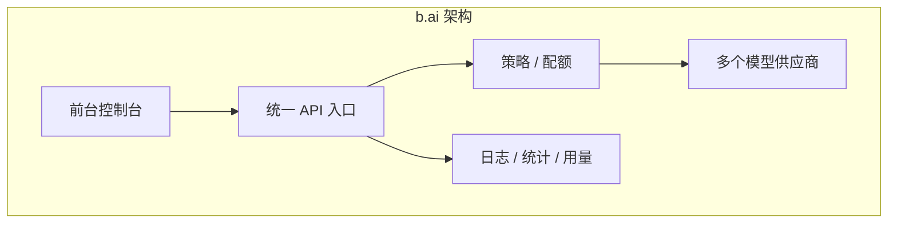

# 竞品分析：b.ai

**更新日期：** 2026年05月15日  
**信息来源：** 公开资料有限、产品介绍、社区讨论  
**竞争优先级：** 🟢 低到中（资料较少，按轻量 AI 平台归纳）

---

## 1. 产品概况

| 项目 | 内容 |
|------|------|
| **产品名称** | b.ai |
| **产品定位** | 轻量 AI 接入 / 管理 / 中转平台 |
| **目标用户** | 个人开发者、小团队、早期产品团队 |
| **典型场景** | 统一入口、模型转发、基础统计 |

> 说明：b.ai 公开资料有限，以下按轻量 AI 平台进行保守分析。

---

## 2. 技术架构



**架构特点：**
- 更像面向开发者的轻量 SaaS
- 一般强调“能快速接上、能看用量、能做基础治理”
- 不以复杂企业流程为核心卖点

---

## 3. 核心特性

```
✅ 统一入口
✅ 基础策略 / 配额
✅ 用量统计
✅ 轻量控制台

❌ 深度智能路由
❌ 语义缓存
❌ 企业 RBAC
❌ 审批/多租户
❌ 完整 SLA
```

---

## 4. 优势分析

| 维度 | 优势描述 |
|------|---------|
| **产品化更明显** | 比纯开源中转工具更接近可用产品 |
| **易上手** | 面向开发者的门槛较低 |
| **基础管理够用** | 对早期团队来说通常已够用 |

---

## 5. 劣势分析

| 维度 | 劣势描述 |
|------|---------|
| **公开信息有限** | 细节功能需进一步核实 |
| **平台深度不足** | 企业级治理和运营闭环可能不足 |
| **差异化压力大** | 易被更成熟的网关/平台替代 |

---

## 6. 与 MaaS 平台对比

| 对比维度 | MaaS平台 | b.ai | 胜出方 |
|---------|---------|------|--------|
| 统一接入 | ✅ | ✅ | 持平 |
| 用量统计 | ✅ | ✅ | 持平 |
| 路由能力 | ✅ | ⚠️ 基础 | **MaaS** |
| 语义缓存 | ✅ | ❌ | **MaaS** |
| 企业治理 | ✅ | ⚠️ 基础 | **MaaS** |
| 平台完整度 | 高 | 中 | **MaaS** |

---

## 7. 销售应对策略

- b.ai 若偏开发者产品，那么它的优势是轻便，但短板是治理和规模化。
- 我们需要突出“从可用到可运营”的差异，而不仅是“有没有控制台”。
- 对企业客户来说，SLA、审计和成本中心通常比轻量控制台更关键。

---

## 8. 信息核实状态

| 信息类型 | 核实状态 | 备注 |
|---------|---------|------|
| 公开资料 | ⚠️ 有限 | 建议后续复核官网/仓库 |
| 架构判断 | ⚠️ 保守归纳 | 以轻量开发者平台分析 |

---

地址：https://b.ai/
