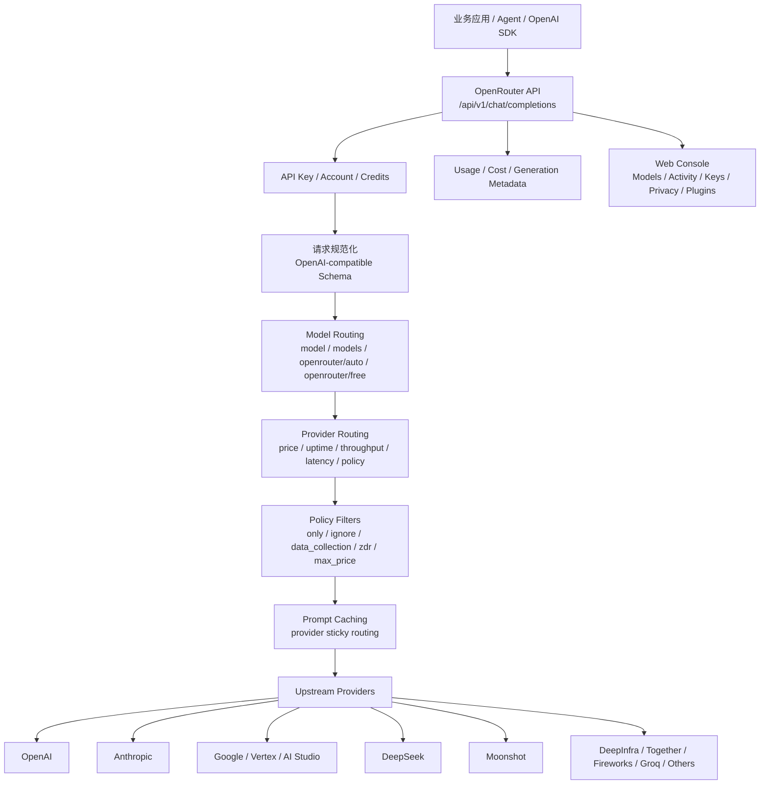

# 竞品分析：OpenRouter

**更新日期：** 2026年05月21日  
**信息来源：** 官方文档、用户实测记录、控制台与 API 走读  
**竞争优先级：** 高（托管式模型聚合平台 / Model Router / AI API Marketplace）  
**参考地址：**

1. 官网：[OpenRouter](https://openrouter.ai/)
2. Quickstart：[OpenRouter Quickstart](https://openrouter.ai/docs/quickstart)
3. Models：[OpenRouter Models](https://openrouter.ai/models)
4. Auto Router：[Auto Router](https://openrouter.ai/docs/features/model-routing)
5. Provider Routing：[Provider Routing](https://openrouter.ai/docs/features/provider-routing)
6. Prompt Caching：[Prompt Caching](https://openrouter.ai/docs/features/prompt-caching)
7. Privacy & Provider Logging：[Provider Logging](https://openrouter.ai/docs/features/privacy-and-logging)
8. Structured Outputs：[Structured Outputs](https://openrouter.ai/docs/features/structured-outputs)
9. Management API Keys：[Management API Keys](https://openrouter.ai/docs/features/provisioning-api-keys)

---

## 1. 结论摘要

OpenRouter 是一个托管式 AI 模型聚合与路由平台，核心价值是通过一个 OpenAI-compatible API 访问多家模型供应商和大量模型，并在请求时自动处理 provider 选择、价格优先负载均衡、模型 fallback、性能排序、隐私策略过滤、免费模型路由、Auto Router、prompt caching、BYOK 和用量统计。

与 LiteLLM、Bifrost 不同，OpenRouter 不是用户自部署的开源网关，而是一个云端模型市场 + 统一 API + 路由调度层。客户不需要自己维护上游供应商账号、模型目录、价格表、可用性探测和 provider fallback，直接通过 OpenRouter 账号和 API Key 使用模型。这让它对个人开发者、Agent 应用、出海 SaaS 和需要快速集成多模型的团队非常有吸引力。

**对 MaaS 平台的启示：** OpenRouter 的威胁不在“企业私有化平台”，而在“极低接入门槛、丰富模型目录、透明价格、自动路由和开发者生态”。MaaS 平台如果只做统一 API 网关，会被 OpenRouter 这类托管聚合平台压缩价值；必须强化企业多租户、国内合规、预算审批、账单分摊、私有化部署、供应商可控、SLA、审计和运营控制台能力。

---

## 2. 产品概况

| 项目 | 内容 |
| --- | --- |
| 产品名称 | OpenRouter |
| 产品定位 | 托管式 AI 模型聚合平台 / Model Router / API Marketplace |
| 部署形态 | SaaS 托管服务，不是开源自部署网关 |
| API 形态 | OpenAI-compatible API，主要入口为 `https://openrouter.ai/api/v1` |
| 目标用户 | 开发者、Agent 应用、AI SaaS、模型评测团队、需要快速接入多模型的企业团队 |
| 典型场景 | 一套 API 调用多模型、多 provider 自动 fallback、模型对比、免费模型实验、Auto Router、BYOK、prompt caching |
| 商业模式 | 按模型调用付费，平台统一结算；支持 API Key、credits、usage、BYOK 等能力 |
| 竞争类型 | 托管式模型聚合平台，与 LiteLLM/Bifrost/Portkey/Helicone 部分重叠 |

OpenRouter 更像“模型调用交易与路由平台”，而不是传统意义上的企业内部 MaaS 控制台。它把模型、供应商、价格、可用性、API 兼容和路由封装成云服务，用户只需要选择模型 slug 或路由器模型即可调用。

---

## 3. 产品定位与典型场景

| 场景 | OpenRouter 解决的问题 | 价值 |
| --- | --- | --- |
| 多模型快速接入 | 每家模型 API、Key、计费、SDK 和 endpoint 不一致 | 用一个 OpenAI-compatible API 访问大量模型 |
| 模型市场 | 用户难以发现、比较和试用不同模型 | 提供模型目录、价格、能力标签、免费模型和排行榜入口 |
| Provider 自动路由 | 同一模型可能由多个 provider 托管，价格、延迟和稳定性不同 | 默认按价格和可用性路由，并自动 fallback |
| 模型 fallback | 主模型限流、停机、内容过滤或上下文错误时请求失败 | 通过 `models` 数组配置备用模型链路 |
| Auto Router | 用户不知道该选哪个模型 | `openrouter/auto` 根据 prompt 分析自动选择模型 |
| 成本优化 | 不同 provider 价格差异大 | 支持 `:floor`、`provider.sort = price`、`max_price` 等控制 |
| 性能优化 | 低延迟或高吞吐场景需要动态选择 provider | 支持 `:nitro`、`provider.sort = throughput/latency` 和性能阈值 |
| 隐私策略过滤 | 不同 provider 是否训练、是否保留日志不同 | 支持 data policy、ZDR、provider ignore/only 等路由控制 |
| 开发者试验 | 需要低成本试用模型 | `openrouter/free` 可自动选择免费模型 |
| BYOK | 企业已有上游 provider Key，想走统一入口 | 支持 Bring Your Own Key，并优先使用自有 Key |

---

## 4. 技术架构



| 层级 | 说明 |
| --- | --- |
| API 接入层 | 对外暴露 OpenAI 兼容接口，支持 Chat Completions、Embeddings、Responses、Structured Outputs 等能力 |
| 账号与计费层 | 通过 OpenRouter API Key、credits、usage 和管理 API Key 做账号级调用控制 |
| 模型路由层 | 根据 `model`、`models`、`openrouter/auto`、`openrouter/free` 决定目标模型或模型组 |
| Provider 路由层 | 在同一模型的多个 provider endpoint 之间按价格、稳定性、吞吐、延迟、策略过滤进行选择 |
| 策略控制层 | 通过 `provider` 对象指定 `order`、`only`、`ignore`、`allow_fallbacks`、`data_collection`、`zdr`、`max_price` 等 |
| 缓存层 | 利用各 provider 的 prompt caching 能力，并通过 sticky routing 提升缓存命中率 |
| 观测与结算层 | 返回实际模型、provider、usage、cost、cache tokens、generation id 等信息 |
| 控制台层 | 提供模型目录、Key 管理、Activity、隐私设置、插件配置、Request Builder 等工具 |

---

## 5. 接入与调用方式

OpenRouter 不需要用户部署服务。用户创建账号、充值或配置 Key 后，即可通过 API 调用。

### 5.1 REST API

```bash
curl https://openrouter.ai/api/v1/chat/completions \
  -H "Content-Type: application/json" \
  -H "Authorization: Bearer $OPENROUTER_API_KEY" \
  -H "HTTP-Referer: https://example.com" \
  -H "X-OpenRouter-Title: Example App" \
  -d '{
    "model": "openai/gpt-4o-mini",
    "messages": [
      {"role": "user", "content": "What is the meaning of life?"}
    ]
  }'
```

`HTTP-Referer` 和 `X-OpenRouter-Title` 是可选 Header，用于应用归因和榜单展示。

### 5.2 OpenAI SDK 兼容接入

```python
from openai import OpenAI

client = OpenAI(
    base_url="https://openrouter.ai/api/v1",
    api_key="<OPENROUTER_API_KEY>",
)

response = client.chat.completions.create(
    model="openai/gpt-4o-mini",
    messages=[{"role": "user", "content": "你好，介绍一下 OpenRouter"}],
)

print(response.choices[0].message.content)
```

### 5.3 官方 SDK

OpenRouter 提供轻量 Client SDK 和 Agent SDK：

| SDK | 作用 |
| --- | --- |
| `@openrouter/sdk` | 类型安全的 REST API 封装，适合常规模型调用 |
| `@openrouter/agent` | 面向 Agent 的高级 SDK，封装多轮、工具执行和状态管理 |

### 5.4 API Key 管理

OpenRouter 支持 Management API Keys，用于程序化管理普通 API Key。典型场景包括 SaaS 应用给每个客户实例创建独立 Key、定期轮换 Key、设置 Key limit、禁用超限 Key 等。

Key 管理对象通常包含：

| 字段 | 说明 |
| --- | --- |
| `hash` | Key 的 hash 标识 |
| `label` | Key 标签，例如 `sk-or-v1-...` |
| `name` | Key 名称 |
| `disabled` | 是否禁用 |
| `limit` | Key 额度上限 |
| `limit_remaining` | 剩余额度 |
| `limit_reset` | daily / weekly / monthly 等周期重置 |
| `include_byok_in_limit` | BYOK 用量是否纳入 Key limit |
| `usage_daily/weekly/monthly` | 周期用量 |

---

## 6. 模型目录与模型选择

OpenRouter 的核心资产之一是模型目录。用户可在模型页面查看模型 slug、价格、上下文长度、是否免费、支持参数、provider 列表、性能、数据策略等。

### 6.1 模型 slug

调用时通常使用类似格式：

```text
provider/model-name
```

示例：

```text
openai/gpt-4o-mini
anthropic/claude-sonnet-4.5
google/gemini-3-flash-preview
deepseek/deepseek-v3.2
moonshotai/kimi-k2
```

OpenRouter 还提供一些特殊路由器模型：

| 模型 slug | 作用 |
| --- | --- |
| `openrouter/auto` | 根据 prompt 自动选择模型 |
| `openrouter/free` | 从可用免费模型中自动选择 |
| `openrouter/bodybuilder` | 根据自然语言生成可执行的 OpenRouter 请求体 |
| `~openai/gpt-latest` | latest alias，解析到最新 OpenAI 旗舰模型 |
| `~anthropic/claude-sonnet-latest` | latest alias，解析到最新 Claude Sonnet 系列模型 |

### 6.2 用户实测：Free Router 调用

用户调研中使用 `openrouter/free` 进行了测试：

```bash
curl https://openrouter.ai/api/v1/chat/completions \
  -H "Content-Type: application/json" \
  -H "Authorization: Bearer $OPENROUTER_API_KEY" \
  -d '{
    "model": "openrouter/free",
    "messages": [
      {
        "role": "user",
        "content": "How many r`s are in the word `strawberry?`"
      }
    ],
    "reasoning": {
      "enabled": true
    }
  }'
```


返回中实际模型为：

```json
{
  "model": "liquid/lfm-2.5-1.2b-thinking-20260120:free",
  "provider": "Liquid",
  "usage": {
    "prompt_tokens": 23,
    "completion_tokens": 886,
    "total_tokens": 909,
    "cost": 0
  }
}
```

这说明 `openrouter/free` 是一个路由器，而不是固定模型。响应会告诉用户实际使用了哪个模型和 provider。


---

## 7. 路由策略梳理

OpenRouter 的路由可分为两层：模型路由和 provider 路由。

### 7.1 模型路由

| 方式 | 配置 | 行为 |
| --- | --- | --- |
| 固定模型 | `model: "openai/gpt-4o-mini"` | 调用指定模型，并在该模型可用 provider 之间路由 |
| 模型 fallback | `models: ["model-a", "model-b"]` | 主模型失败后尝试备用模型 |
| Auto Router | `model: "openrouter/auto"` | 根据 prompt 自动选择模型 |
| Free Router | `model: "openrouter/free"` | 从符合请求能力的免费模型中选择 |
| Latest alias | `model: "~openai/gpt-latest"` | 自动解析到最新模型版本 |
| Body Builder | `model: "openrouter/bodybuilder"` | 生成可执行请求体，用于多模型并行或比较 |

### 7.2 Provider 路由

同一个模型可能由多个 provider 托管，例如官方 provider、云厂商托管、推理平台、开源模型服务商等。OpenRouter 会在这些 endpoint 之间做选择。

默认策略：

1. 优先选择最近 30 秒没有明显故障的 provider。
2. 在稳定 provider 中优先低价候选，并按价格倒数平方加权选择。
3. 剩余 provider 作为 fallback。
4. 如果设置了 `provider.sort` 或 `provider.order`，默认负载均衡会被关闭，按用户指定规则尝试。

### 7.3 Provider 参数总表

| 参数 | 作用 |
| --- | --- |
| `order` | 指定 provider 优先顺序，例如 `["anthropic", "openai"]` |
| `allow_fallbacks` | 是否允许 provider fallback，默认 true |
| `require_parameters` | 只路由到支持请求中所有参数的 provider |
| `data_collection` | 控制是否允许可能保存或训练数据的 provider，可设为 `deny` |
| `zdr` | 只使用 Zero Data Retention endpoint |
| `only` | 仅允许指定 provider |
| `ignore` | 排除指定 provider |
| `quantizations` | 过滤量化类型，例如 `fp8`、`int8`、`bf16` |
| `sort` | 按 `price`、`throughput`、`latency` 排序 |
| `preferred_min_throughput` | 偏好满足吞吐阈值的 provider |
| `preferred_max_latency` | 偏好满足延迟阈值的 provider |
| `max_price` | 设置最高可接受价格，超出则不执行 |

---

## 8. 自动路由、免费路由与 Body Builder

### 8.1 Auto Router

`openrouter/auto` 由 NotDiamond 路由系统支持，会分析 prompt 并从高质量模型集合中选择最适合的模型。

工作流程：

1. 分析 prompt 复杂度、任务类型和能力需求。
2. 选择合适模型。
3. 将请求转发给所选模型。
4. 在响应中返回实际使用的 `model`。

调用示例：

```json
{
  "model": "openrouter/auto",
  "messages": [
    {"role": "user", "content": "Explain quantum entanglement in simple terms"}
  ]
}
```

可通过插件参数限制 Auto Router 的可选模型：

```json
{
  "model": "openrouter/auto",
  "messages": [
    {"role": "user", "content": "Explain quantum entanglement"}
  ],
  "plugins": [
    {
      "id": "auto-router",
      "allowed_models": ["anthropic/*", "openai/gpt-5.1"]
    }
  ]
}
```

### 8.2 Free Models Router

`openrouter/free` 会从免费模型中选择一个满足请求能力的模型，适合学习、实验、低容量应用和演示场景。

工作流程：

1. 分析请求需要的能力，例如视觉、工具调用、结构化输出。
2. 过滤符合条件的免费模型。
3. 从候选免费模型中选择一个。
4. 转发请求并返回实际模型信息。

### 8.3 Body Builder

`openrouter/bodybuilder` 可以根据自然语言生成 OpenRouter API 请求体，适合快速构造多模型调用或模型对比请求。

示例：

```python
import requests
import json

response = requests.post(
    url="https://openrouter.ai/api/v1/chat/completions",
    headers={
        "Authorization": "Bearer <OPENROUTER_API_KEY>",
        "Content-Type": "application/json",
    },
    data=json.dumps({
        "model": "openrouter/bodybuilder",
        "messages": [
            {
                "role": "user",
                "content": "Count to 10 using Claude Sonnet and GPT-5"
            }
        ]
    })
)

requests_json = json.loads(response.json()["choices"][0]["message"]["content"])
print(json.dumps(requests_json, indent=2))
```

返回可能包含多个请求：

```json
{
  "requests": [
    {
      "model": "anthropic/claude-sonnet-4.5",
      "messages": [{"role": "user", "content": "Count to 10"}]
    },
    {
      "model": "openai/gpt-5.1",
      "messages": [{"role": "user", "content": "Count to 10"}]
    }
  ]
}
```

---

## 9. Provider 路由规则与决策链路

### 9.1 默认价格优先负载均衡

OpenRouter 默认按价格和稳定性路由。同一模型有多个 provider endpoint 时，低价 provider 更可能被选中，但并不是机械地永远选最低价；平台会考虑近 30 秒故障情况，并把剩余 provider 作为 fallback。

示例理解：

| Provider | 价格 | 状态 | 默认路由倾向 |
| --- | --- | --- | --- |
| A | $1 / M tokens | 稳定 | 最可能被选中 |
| B | $2 / M tokens | 最近有故障 | 排在后面 |
| C | $3 / M tokens | 稳定 | 可作为 fallback |

### 9.2 按吞吐、延迟或价格排序

显式设置 `provider.sort` 后，OpenRouter 会关闭默认负载均衡，按指定属性排序尝试 provider。

```json
{
  "model": "meta-llama/llama-3.3-70b-instruct",
  "messages": [{"role": "user", "content": "Hello"}],
  "provider": {
    "sort": "throughput"
  }
}
```

快捷后缀：

| 后缀 | 等效配置 | 作用 |
| --- | --- | --- |
| `:nitro` | `provider.sort = "throughput"` | 优先高吞吐 provider |
| `:floor` | `provider.sort = "price"` | 优先低价 provider |

示例：

```json
{
  "model": "meta-llama/llama-3.3-70b-instruct:nitro",
  "messages": [{"role": "user", "content": "Hello"}]
}
```

### 9.3 多模型全局排序

默认情况下，`models` fallback 会先按模型分组：主模型的 endpoint 全部尝试后才进入备用模型。如果设置 `partition: "none"`，OpenRouter 可以跨多个模型和 provider 全局排序。

```json
{
  "models": [
    "anthropic/claude-sonnet-4.5",
    "openai/gpt-5-mini",
    "google/gemini-3-flash-preview"
  ],
  "messages": [{"role": "user", "content": "Hello"}],
  "provider": {
    "sort": {
      "by": "throughput",
      "partition": "none"
    }
  }
}
```

适合“只关心速度，不执着于具体模型”的场景。

### 9.4 性能阈值

OpenRouter 支持按 p50、p75、p90、p99 设置偏好阈值。例如希望选择 p90 吞吐大于 50 tokens/sec 的 provider：

```json
{
  "models": [
    "anthropic/claude-sonnet-4.5",
    "openai/gpt-5-mini",
    "google/gemini-3-flash-preview"
  ],
  "messages": [{"role": "user", "content": "Hello"}],
  "provider": {
    "sort": {
      "by": "price",
      "partition": "none"
    },
    "preferred_min_throughput": {
      "p90": 50
    }
  }
}
```

注意：`preferred_min_throughput` 和 `preferred_max_latency` 是偏好，不是硬过滤；不满足阈值的 endpoint 会被降级排序，而不是完全排除。`max_price` 则是硬约束，超过价格就不会执行。

---

## 10. 模型 Fallback 与容灾降级

OpenRouter 的 fallback 分为 provider fallback 和 model fallback。

### 10.1 Provider Fallback

调用单个模型时，如果该模型有多个 provider endpoint，OpenRouter 会自动在 provider 间 fallback。触发原因包括：

1. Provider 近期故障或不可用。
2. Provider 返回错误。
3. Provider 不支持请求参数。
4. Provider 不满足数据策略或 ZDR 要求。
5. Provider 价格超过 `max_price`。
6. Provider 被 `ignore` 排除或不在 `only` 列表。

### 10.2 Model Fallback

通过 `models` 数组指定多个模型：

```python
import requests
import json

response = requests.post(
    url="https://openrouter.ai/api/v1/chat/completions",
    headers={
        "Authorization": "Bearer <OPENROUTER_API_KEY>",
        "Content-Type": "application/json",
    },
    data=json.dumps({
        "models": [
            "anthropic/claude-3.5-sonnet",
            "gryphe/mythomax-l2-13b"
        ],
        "messages": [
            {"role": "user", "content": "What is the meaning of life?"}
        ]
    })
)
```

默认情况下，主模型出错后尝试备用模型。可能触发 model fallback 的错误包括：

| 触发类型 | 说明 |
| --- | --- |
| 上下文长度错误 | 主模型无法处理请求长度 |
| 内容审核拒绝 | 某些 provider 或模型因政策拒绝回答 |
| 限速 | 模型或 provider 返回 rate limit |
| 停机 | provider 不可用或服务故障 |
| 参数不支持 | 请求参数与 provider 能力不匹配 |

### 10.3 禁用 Fallback

如果需要确保请求只由指定 provider 处理，可以设置：

```json
{
  "model": "mistralai/mixtral-8x7b-instruct",
  "messages": [{"role": "user", "content": "Hello"}],
  "provider": {
    "order": ["together"],
    "allow_fallbacks": false
  }
}
```

这对合规、可复现评测和固定供应商成本核算很重要。

---

## 11. 成本、价格与用量治理

OpenRouter 的成本治理主要围绕模型价格、provider 路由、API Key limit、usage、credits 和 BYOK 展开。

### 11.1 成本控制能力

| 能力 | 说明 |
| --- | --- |
| 价格透明 | 模型页面展示不同模型和 provider 的价格 |
| 默认低价路由 | provider 默认按价格和可用性做负载均衡 |
| `:floor` | 快捷选择最低价格 provider |
| `max_price` | 设置可接受最高价格，超过则不执行 |
| Key limit | API Key 可设置额度上限和周期重置 |
| Usage fields | 响应返回 token、cost、cache tokens 等信息 |
| BYOK | 使用用户自己的 provider key，减少或改变结算路径 |
| Free models | 通过 `openrouter/free` 使用免费模型实验 |

### 11.2 用量返回示例

用户实测响应中包含：

```json
{
  "usage": {
    "prompt_tokens": 23,
    "completion_tokens": 886,
    "total_tokens": 909,
    "cost": 0,
    "prompt_tokens_details": {
      "cached_tokens": 0,
      "cache_write_tokens": 0
    },
    "completion_tokens_details": {
      "reasoning_tokens": 628,
      "image_tokens": 0
    }
  }
}
```

这些字段对 MaaS 平台很有参考价值：模型聚合平台不只返回 token，还返回 reasoning tokens、cache tokens、cost details 等细分信息，便于计费、成本分析和模型行为调试。

### 11.3 管理边界

OpenRouter 提供 Key limit、usage、管理 API 和账号级设置，但它不是完整企业账单系统。与 MaaS 相比，它缺少：

1. 企业内部部门分摊。
2. 预算审批流。
3. 合同、套餐、充值、发票和对账闭环。
4. 租户级成本中心和项目级成本归因。
5. 国内财务合规和私有化账单集成。

---

## 12. Prompt Caching 与缓存路由

OpenRouter 不是自己实现统一语义缓存，而是整合各 provider 的 prompt caching 能力，并用 provider sticky routing 提升缓存命中率。

### 12.1 Provider Sticky Routing

当请求触发 prompt caching 后，OpenRouter 会记住该会话使用的 provider endpoint。后续同模型、同会话请求会尽量路由到同一 provider，从而保持 provider 侧缓存命中。

工作特点：

1. 对支持隐式缓存的 provider 自动生效，例如 OpenAI、DeepSeek、Gemini 2.5 等。
2. 对显式缓存 provider 支持 `cache_control`，例如 Anthropic、Alibaba Qwen、Gemini 等。
3. Sticky routing 只有在 provider 缓存读取价格低于普通 prompt 价格时才会启用。
4. 如果 sticky provider 不可用，会自动 fallback 到其他 provider。
5. 如果用户手动设置 `provider.order`，显式顺序优先于 sticky routing。

### 12.2 Cache Usage 字段

响应中的 `usage.prompt_tokens_details` 可包含：

| 字段 | 说明 |
| --- | --- |
| `cached_tokens` | 命中缓存读取的 token 数 |
| `cache_write_tokens` | 写入缓存的 token 数 |
| `cached_read_tokens` | 部分响应中用于表示缓存读取 token |

### 12.3 与 Bifrost 语义缓存的差异

| 维度 | OpenRouter Prompt Caching | Bifrost Semantic Caching |
| --- | --- | --- |
| 缓存类型 | provider 原生 prompt cache 整合 | exact hash + semantic similarity |
| 存储位置 | 上游 provider 或 OpenRouter 路由记忆 | 用户配置 vector store |
| 命中逻辑 | 同 provider、同会话、同缓存片段 | 相同或语义相似请求 |
| 部署控制 | SaaS 平台托管 | 用户自部署可控 |
| 适合场景 | 长上下文、多轮对话、provider 原生缓存降本 | RAG、FAQ、重复问答、语义相似请求复用 |

---

## 13. 隐私、数据策略与合规控制

OpenRouter 的隐私控制主要体现在 provider 选择和账号设置上。

### 13.1 Data Policy Filtering

每个 provider 有自己的数据保留和训练政策。OpenRouter 在 provider 页面和文档中展示其了解的数据策略，并允许用户在账号级或请求级过滤。

请求级示例：

```json
{
  "model": "openai/gpt-4o-mini",
  "messages": [{"role": "user", "content": "Hello"}],
  "provider": {
    "data_collection": "deny"
  }
}
```

这会尽量只使用不收集用户数据的 provider。

### 13.2 Zero Data Retention

可通过 `zdr: true` 只路由到 Zero Data Retention endpoint：

```json
{
  "model": "openai/gpt-4o-mini",
  "messages": [{"role": "user", "content": "Hello"}],
  "provider": {
    "zdr": true
  }
}
```

### 13.3 EU In-region Routing

企业客户可申请 EU in-region routing，使用 `https://eu.openrouter.ai` 让 prompts 和 completions 在欧盟区域内处理。该能力偏企业版，需要开通确认。

### 13.4 MaaS 视角下的合规边界

OpenRouter 提供 provider 数据策略过滤，但它仍然是外部托管服务。对国内政企、金融、医疗等客户，需要重点评估：

1. 数据是否出境。
2. 请求是否经过 OpenRouter 境外服务。
3. 上游 provider 是否保留 prompt。
4. 是否能满足等保、审计、日志留存、敏感信息脱敏要求。
5. 是否支持私有化或专属区域部署。

---

## 14. 多模态、结构化输出与插件能力

### 14.1 多模态与 PDF

OpenRouter 支持向模型发送图片、PDF 等多模态内容。用户调研中记录了 PDF 调用方式：

```python
import requests

url = "https://openrouter.ai/api/v1/chat/completions"
headers = {
    "Authorization": "Bearer <OPENROUTER_API_KEY>",
    "Content-Type": "application/json"
}

messages = [
    {
        "role": "user",
        "content": [
            {"type": "text", "text": "What are the main points in this document?"},
            {
                "type": "file",
                "file": {
                    "filename": "document.pdf",
                    "file_data": "https://bitcoin.org/bitcoin.pdf"
                }
            }
        ]
    }
]

payload = {
    "model": "anthropic/claude-sonnet-4",
    "messages": messages,
    "plugins": [
        {
            "id": "file-parser",
            "pdf": {"engine": "mistral-ocr"}
        }
    ]
}

response = requests.post(url, headers=headers, json=payload)
print(response.json())
```

OpenRouter 的 PDF 解析会返回 file annotations。后续请求可以携带 annotations，避免重复解析同一个 PDF，从而节省成本和时间。

### 14.2 Structured Outputs

OpenRouter 支持对兼容模型使用 `response_format.type = json_schema`：

```json
{
  "messages": [
    {"role": "user", "content": "What's the weather like in London?"}
  ],
  "response_format": {
    "type": "json_schema",
    "json_schema": {
      "name": "weather",
      "strict": true,
      "schema": {
        "type": "object",
        "properties": {
          "location": {"type": "string"},
          "temperature": {"type": "number"},
          "conditions": {"type": "string"}
        },
        "required": ["location", "temperature", "conditions"],
        "additionalProperties": false
      }
    }
  }
}
```

如果需要确保 provider 支持该参数，应同时设置：

```json
{
  "provider": {
    "require_parameters": true
  }
}
```

### 14.3 Reasoning 字段

用户实测中开启 `reasoning.enabled = true` 后，响应中出现 `message.reasoning` 和 `reasoning_details`。这说明 OpenRouter 会尽量标准化 reasoning 模型的思考链路字段，但具体是否返回、返回多少，仍受模型和 provider 支持影响。

---

## 15. 用户实测：OpenRouter 接入 Bifrost

用户调研中还测试了通过 Bifrost 调用 OpenRouter：


调用示例：

```bash
curl -X POST http://101.43.45.218:8080/v1/chat/completions \
  -H "Content-Type: application/json" \
  -d '{
    "model": "openrouter/openrouter/free",
    "messages": [
      {"role": "user", "content": "Hello!"}
    ]
  }'
```

返回中可以看到两层路由信息：

```json
{
  "model": "openai/gpt-oss-120b:free",
  "usage": {
    "prompt_tokens": 69,
    "prompt_tokens_details": {
      "cached_read_tokens": 64,
      "cached_tokens": 64
    },
    "completion_tokens": 23,
    "total_tokens": 92
  },
  "extra_fields": {
    "provider": "openrouter",
    "model_requested": "openrouter/free",
    "latency": 5806
  }
}
```


这个实测说明 OpenRouter 可以作为 Bifrost、LiteLLM 或 MaaS 的一个上游 provider。但要注意：如果 MaaS 接 OpenRouter，相当于“平台路由套平台路由”，会带来两个问题：

1. **链路可解释性变复杂**：MaaS 选择 OpenRouter，OpenRouter 再选择实际 provider 和模型。
2. **成本与合规归因变复杂**：实际上游 provider、缓存命中、数据策略、错误原因需要透传并落库。

---

## 16. 核心特性总表

| 分类 | 能力 | 成熟度 | 说明 |
| --- | --- | --- | --- |
| 统一 API | OpenAI-compatible API | 高 | 现有 OpenAI SDK 可直接改 base URL 接入 |
| 模型目录 | 大量模型与 provider 聚合 | 高 | 模型市场和透明价格是核心资产 |
| Provider 路由 | price / uptime / latency / throughput | 高 | 默认价格优先，可显式排序和过滤 |
| Model Fallback | `models` 数组 | 高 | 主模型失败后切备用模型 |
| Auto Router | `openrouter/auto` | 中高 | NotDiamond 支持，自动选模型 |
| Free Router | `openrouter/free` | 高 | 免费模型自动选择，利于获客和实验 |
| Prompt Caching | provider caching + sticky routing | 中高 | 依赖 provider 原生缓存能力 |
| BYOK | Bring Your Own Key | 中高 | 可配置自有 provider Key，降低供应商绑定 |
| Key 管理 | Management API Keys | 中高 | 支持创建、禁用、limit、周期重置 |
| 成本控制 | `:floor`、`max_price`、usage | 高 | 成本优化能力产品化明显 |
| 性能控制 | `:nitro`、latency/throughput threshold | 高 | 可按 p50/p75/p90/p99 偏好路由 |
| 隐私控制 | data policy、ZDR、EU routing | 中高 | 适合请求级过滤，但仍是外部 SaaS |
| 多模态 | 图片、PDF、file parser | 中高 | PDF annotations 可复用解析结果 |
| 结构化输出 | JSON Schema | 中高 | 可配合 `require_parameters` 确保 provider 支持 |
| 企业平台 | 组织、审批、账单、私有化 | 中低 | 不是完整企业 MaaS 控制台 |

---

## 17. 优势分析

| 维度 | 优势 |
| --- | --- |
| 接入门槛极低 | 不需要部署网关，也不需要逐个申请上游 provider Key |
| 模型目录丰富 | 模型发现、试用、比较和切换体验强 |
| 路由能力细 | 支持价格、吞吐、延迟、provider 顺序、only/ignore、ZDR、data policy 等细粒度参数 |
| 默认容灾强 | provider fallback 和 model fallback 降低单点故障 |
| 成本优化直观 | 默认低价路由、`:floor`、`max_price`、usage 和 cache token 字段便于成本控制 |
| 开发者生态强 | 文档、Request Builder、SDK、免费模型、排行榜和模型页面对开发者友好 |
| 快速模型实验 | 一个 Key 即可测试大量模型，非常适合 Agent 和应用原型 |
| BYOK 灵活 | 可把自有 provider Key 接到统一入口，减少完全托管结算压力 |
| 数据策略可控 | 请求级 data policy、ZDR、only/ignore provider 方便做合规过滤 |

---

## 18. 劣势与边界

| 维度 | 劣势 | 影响 |
| --- | --- | --- |
| 不是自部署产品 | OpenRouter 是外部 SaaS | 国内政企、金融、私有化客户采用受限 |
| 上游不可完全可控 | 实际 provider 可能由 OpenRouter 动态选择 | 成本、延迟、合规和故障归因需要额外治理 |
| 企业业务闭环弱 | 缺少审批、工单、部门预算、合同发票、SLA 报表 | 不能直接替代 MaaS 平台 |
| 合规风险较高 | 请求经过 OpenRouter 和第三方 provider | 数据出境、日志保留、训练政策需逐项评估 |
| 路由可解释性有限 | 平台内部路由细节不完全开放 | 企业客户可能难以审计每次决策原因 |
| 价格依赖平台 | 由 OpenRouter 聚合并结算 | 大客户议价、专属合同和本地财务流程可能受限 |
| 高级能力依赖 provider | prompt caching、structured outputs、tools 等能力由模型/provider 决定 | 同一参数在不同 provider 行为可能不一致 |
| 免费模型不适合生产 | 免费模型容量、限速、可用性和质量不稳定 | 适合实验，不适合 SLA 场景 |

---

## 19. 与 LiteLLM / Bifrost 对比

| 维度 | OpenRouter | LiteLLM | Bifrost | 判断 |
| --- | --- | --- | --- | --- |
| 产品形态 | SaaS 模型聚合平台 | 开源自部署 LLM Proxy | 开源自部署 AI Gateway | OpenRouter 接入最快，自部署可控性弱 |
| 模型接入 | 平台已聚合大量模型 | 用户自行配置 provider | 用户自行配置 provider | OpenRouter 模型发现和试用更强 |
| 路由层 | provider routing + model fallback + auto router | 多策略 router、fallback、预算 | VK routing、weighted LB、fallback | 三者都强，但侧重点不同 |
| 部署成本 | 无需部署 | 需要运维 Proxy/DB/Redis | 需要运维 Gateway/DB/缓存 | OpenRouter 最省运维 |
| 数据控制 | 请求经过 OpenRouter | 用户自控部署环境 | 用户自控部署环境 | LiteLLM/Bifrost 更适合私有化 |
| 成本优化 | 默认低价路由、透明价格、max_price | 自建成本表和路由策略 | 自建成本治理和缓存 | OpenRouter 开箱即用更强 |
| 语义/Prompt 缓存 | provider prompt caching + sticky routing | 取决于配置和集成 | semantic cache 明确 | Bifrost 更像自有缓存能力 |
| 企业治理 | Key limit、usage、隐私设置 | Virtual Key、Team、Spend | VK、Team、Customer、Budget | 自部署网关更适合内部治理 |
| 控制台 | 模型市场、Activity、Keys、Settings | 网关管理控制台 | 网关管理控制台 | OpenRouter 面向开发者市场，自部署产品面向平台工程 |
| 合规 | 外部 SaaS，部分企业区域能力 | 自部署可做合规改造 | 自部署可做合规改造 | MaaS/自部署在国内更有优势 |

---

## 20. 与 MaaS 平台对比

| 对比维度 | MaaS 平台 | OpenRouter | 胜出方 |
| --- | --- | --- | --- |
| 多模型统一 API | 支持 | 支持 | 持平 |
| 模型市场体验 | 需建设 | 已成熟 | OpenRouter |
| 接入门槛 | 需部署或开通企业环境 | 注册即用 | OpenRouter |
| Provider 路由 | 可按 SLA、成本、可用性、合规策略定制 | price/uptime/latency/throughput/data policy | 持平，OpenRouter 开箱即用强 |
| Model Fallback | 支持 | `models` 数组支持 | 持平 |
| 免费模型生态 | 取决于平台 | `openrouter/free` 很强 | OpenRouter |
| Prompt caching | 可自研语义缓存和分层缓存 | provider cache + sticky routing | 各有优势 |
| BYOK | 可支持 | 支持 | 持平 |
| 国内合规 | 可做私有化、等保、审计、数据不出域 | 外部 SaaS，需谨慎 | MaaS |
| 组织治理 | 租户、项目、部门、角色、审批 | 账号、Key、privacy settings | MaaS |
| 成本中心 | 预算、分摊、账单、发票、对账 | usage、credits、Key limit | MaaS |
| SLA 与运营 | 可提供企业 SLA、告警、工单 | 平台级 SLA 需商业确认 | MaaS |
| 私有化 | 可交付 | 默认不支持 | MaaS |
| 开发者体验 | 需完善模型广场和 Request Builder | 非常强 | OpenRouter |

---

## 21. 对 MaaS 平台的产品启示

### 21.1 必须对齐的能力

1. OpenAI-compatible API 和 SDK 低成本迁移。
2. 模型广场：模型价格、上下文、能力标签、免费/付费、供应商、性能和数据策略展示。
3. Provider 级路由参数：only、ignore、order、fallback、max_price、latency、throughput。
4. Model fallback：通过模型数组配置降级链路。
5. Auto Router：基于 prompt 复杂度、成本和质量自动选模型。
6. Free / Trial 模型路由：提供试用模型池和低成本实验入口。
7. Prompt caching 可观测：cached tokens、cache write tokens、节省金额。
8. Request Builder：用 UI 或自然语言生成 API 请求体。
9. Key limit、usage、成本上限和周期重置。
10. 数据策略标签：ZDR、是否训练、日志保留、境内/境外、供应商合规状态。

### 21.2 可形成差异的能力

| 方向 | MaaS 可强化点 |
| --- | --- |
| 国内合规 | 数据不出域、等保、审计、国产模型优先、敏感信息脱敏 |
| 企业运营 | 审批流、预算申请、部门分摊、发票、合同、对账 |
| 私有化交付 | 客户自有 VPC、内网访问、专属模型池、专属 Key 管理 |
| 路由可解释 | 展示每次请求为什么选某 provider、为什么 fallback、为什么被策略过滤 |
| SLA 产品化 | 错误率、延迟、fallback 率、缓存命中率、预算超限告警 |
| 多租户治理 | 租户、项目、环境、角色、资源隔离和跨组织运营 |
| 供应商采购 | 帮客户统一采购、议价、合同和供应商 SLA 管理 |

---

## 22. 销售应对策略

### 22.1 客户说“OpenRouter 一个 Key 就能调所有模型”时

建议话术：

> OpenRouter 的优势非常明确：接入快、模型多、开发者体验好，很适合原型验证、出海应用和快速试模型。但企业真正把大模型能力纳入生产体系时，还需要数据合规、权限审批、预算分摊、账单对账、SLA 监控、私有化部署和供应商可控。MaaS 平台不是只解决“能不能调模型”，而是解决“企业能不能安全、可控、可审计、可运营地使用模型”。

### 22.2 适合承认 OpenRouter 强的场景

1. 个人开发者或小团队快速试模型。
2. 海外应用需要快速接入多家模型。
3. 客户核心需求是模型发现、模型对比和低成本实验。
4. 客户对数据出境、私有化、内部审批要求不高。
5. Agent 应用需要频繁尝试不同模型组合。

### 22.3 MaaS 更适合的场景

1. 客户是国内政企、金融、医疗、制造等合规敏感行业。
2. 客户要求私有化部署或数据不出内网。
3. 客户需要内部部门预算、审批、账单、发票和成本分摊。
4. 客户需要统一供应商采购和 SLA 保障。
5. 客户希望把模型调用纳入企业 IT 管理体系，而不是使用外部开发者平台。

---

## 23. 风险与核实清单

| 核实项 | 当前判断 | 后续动作 |
| --- | --- | --- |
| 模型数量 | OpenRouter 模型目录变化快 | 汇报前实时查看 Models 页面 |
| 免费模型限制 | 免费模型适合实验，不适合生产 | 核实免费模型 rate limit 和可用性 |
| Auto Router 模型池 | 官方会动态更新 | 核实当前支持模型和 NotDiamond 路由效果 |
| BYOK 能力 | 支持自带 provider Key | 核实 provider 覆盖、结算方式和限制 |
| Prompt caching | 依赖 provider 原生能力 | 按目标模型验证 cached tokens 和成本节省 |
| 数据策略 | 提供 provider policy 标签和过滤 | 法务/安全需逐 provider 复核真实条款 |
| EU routing | 企业客户可申请 | 核实价格、开通条件和可用模型 |
| Management API | 可管理 Key 和 limit | 核实是否满足企业客户多租户 Key 分发需求 |
| OpenRouter 接 Bifrost/MaaS | 技术上可行 | 需要设计实际 provider、cost、trace 透传字段 |
| 国内可用性 | 外部 SaaS 访问可能受网络影响 | 实测延迟、稳定性和合规可接受性 |

---

## 24. 总结

OpenRouter 是当前模型聚合平台中非常有代表性的竞品。它用托管式 SaaS 的方式把“模型目录、价格透明、统一 API、provider 路由、模型 fallback、自动选型、免费模型、BYOK、缓存和隐私策略”打包成一个开发者友好的入口。它不适合直接替代企业私有化 MaaS 平台，但会显著抬高用户对模型广场、路由灵活性、成本透明度和接入体验的预期。

MaaS 平台应当把 OpenRouter 视为“开发者体验和模型市场”的标杆，而不是简单网关竞品。产品上需要对齐其模型目录、路由参数、fallback、Auto Router、Request Builder、缓存用量和成本透明能力；商业上则要用国内合规、私有化交付、组织治理、预算审批、账单运营、供应商 SLA 和可审计能力形成差异。
