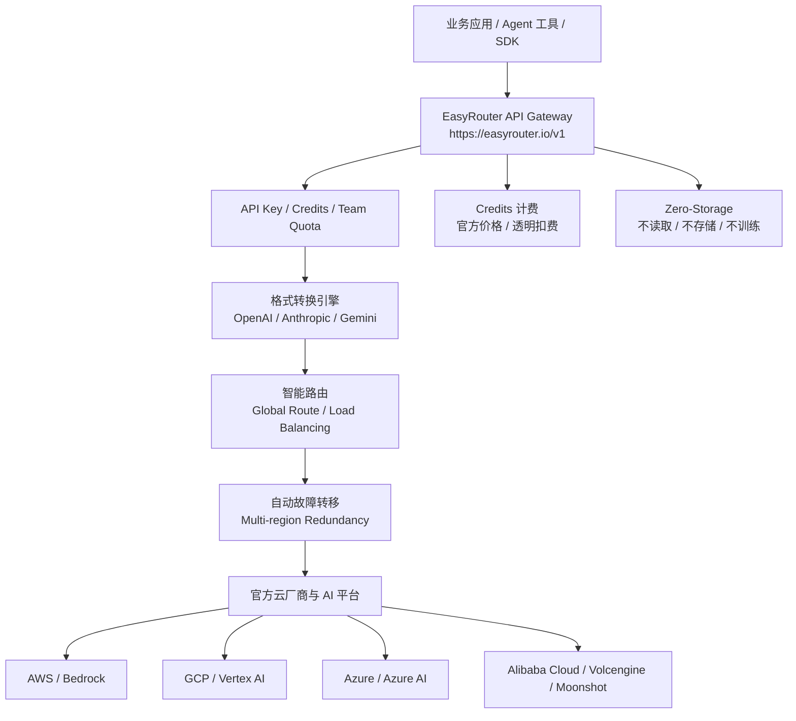

# 竞品分析：EasyRouter.io

**更新日期：** 2026年05月21日  
**信息来源：** 官网、官方文档、FAQ、模型广场、用户调研记录  
**竞争优先级：** 中高（托管式企业 AI API Gateway，OpenRouter/OfoxAI/ZenMux 近邻竞品）  
**参考地址：**

1. 官网：[EasyRouter](https://easyrouter.io/)
2. 文档：[EasyRouter Docs](https://docs.easyrouter.io/zh)
3. API 文档：[EasyRouter API](https://docs.easyrouter.io/zh/docs/api)
4. 模型广场：[EasyRouter Models](https://easyrouter.io/pricing)
5. 控制台：[EasyRouter Console](https://easyrouter.io/console)

---

## 1. 结论摘要

EasyRouter.io 是一个托管式企业 AI API Gateway，官方定位明确不是传统代理或转售，而是“enterprise-grade AI API gateway”。它通过 `https://easyrouter.io/v1` 提供 OpenAI-compatible 统一入口，宣称支持 40+ 顶级模型，覆盖 OpenAI、Claude、Gemini、DeepSeek、Qwen、Moonshot、Grok、Zhipu、Volcengine、Cohere、Minimax、Wenxin、Spark、Suno、Midjourney、Hunyuan 等，并强调上游来自 AWS、GCP、Azure、Amazon Bedrock、Google Vertex AI、Azure AI Studio、阿里云、火山引擎、Moonshot 等官方云厂商或 AI 平台。

它的竞争姿态非常接近 OfoxAI 和 ZenMux：强调一个 API Key、全球多区域、官方合规上游、OpenAI/Anthropic/Gemini 格式转换、自动 failover、负载均衡、99.9% availability SLA、P99 小于 200ms、Zero-Storage 隐私协议、按官方模型价格扣 Credits。对 MaaS 来说，它不是轻量工具，而是“托管聚合网关 + 企业合规叙事”的直接对标。

不过，EasyRouter.io 的公开资料更偏官网营销和 FAQ，尚未看到像 Portkey/Helicone 那样成熟的可视化控制平面、策略版本、审计日志、团队预算、请求级路由解释和企业流程治理说明。MaaS 应学习其“官方上游 + 三协议格式 + 自动容灾 + 零存储 + 全球加速”的表达，同时在国内发票、合规、私有化、组织预算、审批审计和可解释路由上形成差异。

---

## 2. 产品概况

| 项目 | 内容 |
| --- | --- |
| 产品名称 | EasyRouter.io |
| 产品定位 | 企业级 AI API Gateway / 托管式多模型聚合网关 |
| 部署形态 | SaaS 托管服务 |
| API 入口 | `https://easyrouter.io/v1` |
| 模型规模 | 官网宣称 40+ premium AI models |
| 协议格式 | OpenAI Chat Completions、Anthropic Messages、Google Gemini 等标准格式 |
| 目标用户 | 需要统一访问 GPT、Claude、Gemini、DeepSeek 等模型的开发者和企业团队 |
| 典型场景 | AI Coding Agent 接入、多模型统一调用、全球高可用、官方云厂商通道、团队共享额度 |
| 计费方式 | 充值 Credits，`$1 USD = 200 Credits`，按模型官方价格扣除 |
| 竞争类型 | OpenRouter/OfoxAI/ZenMux 近邻竞品，与 MaaS 云端托管入口能力重叠 |

EasyRouter 官网特别强调“不适合追求无限套餐和极低价格的用户”，这说明它主动与灰色代理、量化模型或不稳定中转区分，主打合规、稳定、官方算力和企业可信。

---

## 3. 技术架构



| 层级 | 说明 |
| --- | --- |
| 接入层 | 用户替换 base URL 即可接入，兼容标准 SDK |
| 格式层 | 支持 OpenAI、Anthropic、Gemini 主流格式，降低模型切换成本 |
| 路由层 | 官网称 elastic endpoint 会自动匹配最佳全球路由 |
| 容灾层 | 多区域冗余、自动 failover、load balancing、99.9% SLA |
| 上游层 | 强调官方云厂商和 AI 平台直采，管道可追溯 |
| 计费层 | Credits 充值，按官方模型消耗逻辑扣费 |
| 隐私层 | Zero-Storage，不读取、不保存对话内容、不用于训练 |

---

## 4. 接入与调用方式

官方 Quick Integration 示例：

```bash
export BASE_URL="https://easyrouter.io/v1"
export API_KEY="sk-easyrouter-***"
```

Python 示例：

```python
from openai import OpenAI

client = OpenAI(
    base_url="https://easyrouter.io/v1",
    api_key="sk-easyrouter-***"
)

response = client.chat.completions.create(
    model="openai/gpt-4o-mini",
    messages=[{"role": "user", "content": "Hello"}]
)
```

官网建议生产环境使用 elastic base URL：

```text
https://easyrouter.io/v1
```

并声称已准备 US、HK、SG 多区域冗余。

---

## 5. 核心功能总览

| 分类 | 能力 | 成熟度 | 说明 |
| --- | --- | --- | --- |
| 统一 API | 一个入口访问多模型 | 高 | OpenAI-compatible，适合标准 SDK |
| 多协议格式 | OpenAI、Anthropic、Gemini | 中高 | 官网 FAQ 明确支持主流 API 格式 |
| 模型覆盖 | 40+ 顶级模型 | 中 | 少于 OpenRouter/OfoxAI，但覆盖主流闭源和国内模型 |
| 官方上游 | AWS/GCP/Azure/Bedrock/Vertex/阿里云/火山等 | 中高 | 官方宣传强，需商务核实合同主体 |
| 智能路由 | 全球最佳路由、smart routing | 中 | 公开策略细节有限 |
| 容灾降级 | 自动 failover、load balancing | 中高 | 官网明确宣称 99.9% SLA |
| 隐私 | Zero-Storage | 中高 | 不读取、不存储内容、不训练；仍受原模型提供商条款影响 |
| 计费 | Credits，官方价格扣费 | 中高 | `$1=200 Credits`，不做无限套餐 |
| 团队场景 | Pro/Max 包含共享团队额度池 | 中 | 团队权限、审计细节需核实 |
| Coding Agent | 支持 Claude Code、OpenClaw、OpenAI Codex CLI、Cherry Studio 等 | 中高 | 与 OfoxAI 类似，重视工具生态 |

---

## 6. 路由、规则与容灾

EasyRouter 的公开路由能力集中在“全球弹性入口 + 智能路由 + 自动 failover + 负载均衡”。

| 能力 | 官网口径 | 当前判断 |
| --- | --- | --- |
| Elastic endpoint | 自动匹配最佳全球路线 | 适合跨区域调用和网络优化 |
| Multi-region redundancy | US、HK、SG 多区域冗余 | 对国内/亚太用户有吸引力 |
| Smart routing | P99 latency under 200ms | 具体算法未公开 |
| Automatic failover | 自动故障转移 | 已宣传，但触发条件需实测 |
| Load balancing | 自动负载均衡 | 已宣传，但权重和健康检查机制未公开 |
| Provider routing | 通过官方上游分发 | 未见用户可控 provider sort/only/ignore |
| Model fallback | 未见显式请求级 fallback 列表 | 弱于 OpenRouter/OfoxAI 文档化能力 |
| 熔断冷却 | 未见公开配置 | 需进一步核实 |

### 6.1 与 OpenRouter/OfoxAI 的差异

| 维度 | EasyRouter | OfoxAI | OpenRouter |
| --- | --- | --- | --- |
| 模型数量 | 40+ | 100+ | 500+ |
| 协议格式 | OpenAI/Anthropic/Gemini | OpenAI/Anthropic/Gemini | 以 OpenAI-compatible 为核心 |
| 路由表达 | 全球路由、failover、负载均衡 | priority/cost/latency/balanced + fallback | provider sort/filters/auto/free |
| 成本表达 | 官方价、Credits | 0% 手续费、返利 | 模型市场与充值费用 |
| 隐私表达 | Zero-Storage | 零内容留存 | Provider logging/ZDR 策略 |
| 企业叙事 | 官方云厂商合规管道 | 企业 LLM 网关 | 模型市场生态 |

---

## 7. 计费与商务

| 项目 | 说明 |
| --- | --- |
| Credits 汇率 | `$1 USD = 200 Credits` |
| 充值档位 | Study $20、Standard $100、Pro $500、Max $1500 |
| 扣费逻辑 | 按模型提供商标准 API 消耗逻辑扣费 |
| 价格策略 | 接近官方价格，不提供无限套餐 |
| 企业折扣 | 大规模企业采购可协商，官网提到通常 6 billion tokens/month 以上 |
| 发票 | 非中国大陆主体，无法提供标准中国增值税发票，可提供国际 Invoice |

这一点对国内企业非常关键：EasyRouter 的国际 Invoice 对出海团队可接受，但对需要国内发票、国内合同和本地合规采购的政企客户会形成采购障碍。MaaS 可以在本地商务交付上建立优势。

---

## 8. 与 MaaS 平台对比

| 对比维度 | MaaS 平台 | EasyRouter.io | 胜出方 |
| --- | --- | --- | --- |
| 统一模型入口 | 支持 | 支持 40+ 模型 | 持平 |
| 三协议兼容 | 可规划 | 已宣传支持 | EasyRouter 暂优 |
| 官方上游合规 | 可接供应商合同 | 强调 AWS/GCP/Azure 直采 | 持平 |
| 路由/failover | 可做策略化 | 已有营销级能力 | MaaS 可深化 |
| 模型 fallback | 可做显式链路 | 未见公开配置 | MaaS |
| 组织治理 | 强 | 公开资料有限 | MaaS |
| 国内发票/合同 | 强 | 不支持中国增值税发票 | MaaS |
| 私有化部署 | 可支持 | 未见 | MaaS |
| Coding Agent 生态 | 需补齐 | 支持多工具 | EasyRouter |
| 可解释审计 | 可做完整链路 | 未见 | MaaS |

---

## 9. 优势、劣势与销售应对

### 9.1 优势

| 优势 | 说明 |
| --- | --- |
| 官网定位清晰 | “不是代理，是企业级 AI API Gateway”心智明确 |
| 官方上游叙事强 | AWS/GCP/Azure 等云厂商直采，强调合规可追溯 |
| 接入简单 | OpenAI-compatible，一行替换 base URL |
| 全球高可用 | US/HK/SG、多区域、P99 小于 200ms、99.9% SLA |
| 隐私承诺明确 | Zero-Storage，不存储对话内容 |
| Coding Agent 友好 | 支持 Claude Code、OpenClaw、Codex CLI 等 |

### 9.2 劣势

| 劣势 | 说明 |
| --- | --- |
| 策略细节不足 | 路由、fallback、负载均衡的可配置项公开不多 |
| 模型数量有限 | 40+ 少于 OpenRouter/OfoxAI |
| 企业治理不透明 | 团队权限、审计、预算、Key 生命周期需实测 |
| 国内采购障碍 | 无中国增值税发票，合同主体和合规需核实 |
| 私有化缺失 | 未见自部署或专有部署能力 |

### 9.3 销售应对

客户如果看中 EasyRouter 的稳定和官方上游，MaaS 不应简单说它是代理。更有效的回应是：EasyRouter 适合托管式统一入口，但企业落地还需要国内合同发票、私有化、组织预算、审批、审计、合规留痕和可解释路由。MaaS 应展示这些能力，并补齐三协议兼容和 Agent 工具接入文档。

---

## 10. 信息核实与待跟进

| 信息项 | 状态 | 备注 |
| --- | --- | --- |
| 官网定位 | 已核实 | enterprise-grade AI API gateway |
| API 入口 | 已核实 | `https://easyrouter.io/v1` |
| 模型规模 | 已核实官网口径 | 40+，实时数量以模型广场为准 |
| 上游来源 | 已核实官网宣传 | AWS/GCP/Azure 等，合同需商务核实 |
| 路由/failover | 已核实宣传 | 具体触发条件和日志需实测 |
| 隐私 | 已核实宣传 | Zero-Storage，仍受上游条款影响 |
| 发票 | 已核实 FAQ | 不提供中国增值税发票 |
| 私有化 | 未见 | 可作为 MaaS 差异点 |

---

## 11. 总结

EasyRouter.io 是一类新兴托管式企业 AI API Gateway：它用官方云厂商、全球路由、自动 failover、三协议格式和 Zero-Storage 隐私承诺来区别于传统中转服务。它对 MaaS 的威胁在开发者接入和托管式全球模型入口，尤其对 Coding Agent 场景很有吸引力。MaaS 要对抗它，需要补齐快速接入和三协议体验，同时突出国内企业采购、私有化、组织预算、可解释路由、审计和合规交付能力。
