# 25家竞品能力全景总结与MaaS平台差距分析

**文档版本：** V1.0
**编写日期：** 2026年05月21日
**适用范围：** 产品规划、竞品复盘、PRD补强、研发评审、销售培训
**分析对象：** 竞品分析目录下01至25号竞品，26-openrouter与27-easyrouter作为补充参考
**核心目标：** 对25家竞品做体系化分类，按能力模块逐一总结差异，提炼对当前MaaS平台的启示，并识别PRD尚未充分覆盖的产品能力

---

## 0. 执行摘要

本报告不是对单个竞品的复述，而是把25家竞品放在同一个能力坐标系里做横向拆解。整体看，大模型基础设施市场已经从早期的“能调用模型”进入“能稳定、可审计、可治理、可优化地运营模型”的阶段。单纯提供OpenAI兼容入口已经不再构成长期壁垒；能否在多供应商、多模型、多租户、多预算、多合规要求之间建立统一控制面，才是企业级MaaS平台能否成立的关键。

25家竞品可以归为五大类：第一类是云厂商一站式AI平台，包括阿里云百炼、Amazon Bedrock、Azure AI Foundry、Google Vertex AI，它们的强项是云生态、企业身份、安全合规、区域能力和完整AI生命周期；第二类是国内模型与推理平台，包括硅基流动、智谱AI、月之暗面，它们以国产模型、中文能力、低成本推理、私有化或企业服务为核心；第三类是开源或轻量聚合网关，包括One API、new-api、bifrost、LiteLLM、one-hub，它们擅长统一API、渠道管理、模型映射和自建入口；第四类是托管式AI Gateway、观测与控制面，包括Portkey、Helicone、OfoxAI、api2D、ZenMux、b.ai、WorldClaw、EasyRouter类产品，它们更贴近“多模型统一入口加团队控制台”的产品形态；第五类是垂直中转、订阅转换与轻量代理，包括Grok2API、Quotio、UniAPI、Sub2API、OpenAI Router类产品，它们解决快速接入、协议兼容、资源复用和基础切换问题，但企业治理边界较弱。

从能力模块看，当前竞品的竞争焦点主要集中在九个方向：模型聚合与模型目录、API协议兼容、路由策略、容灾降级、可观测与LLMOps、成本与账单治理、企业权限与审计、合规与私有化、开发者生态与Agent应用。云厂商强在安全合规、生命周期和云内治理；国内模型平台强在国产模型、中文场景和推理成本；开源网关强在可控性和快速自建；托管网关强在统一入口、路由、观测和团队使用体验；轻量代理强在低门槛，但很难支撑严肃企业生产。

对当前MaaS平台而言，已有PRD覆盖统一API网关、三层模型架构、智能路由、语义缓存、计量计费、租户权限、模型广场、告警通知、合同折扣、预算相关目标等核心能力，方向是正确的。但与25家竞品的综合能力相比，仍存在七类明显缺口：第一，请求级可观测与LLMOps深度不足；第二，路由策略虽然有五类与四级作用域，但缺少可解释、可回放、可仿真、可灰度验证的策略生命周期；第三，容灾降级从功能点看已出现，但缺少面向企业客户的演练、报告、SLO/SLA承诺和事故复盘机制；第四，企业治理还需要从RBAC扩展到组织、预算、审批、策略、审计、合同、数据留存的闭环；第五，Prompt实验、评测回归、内容安全、Guardrails等能力在原型中有体现，但在PRD的验收口径和数据模型上不够完整；第六，供应商治理仍偏技术接入，缺少供应商合同、官方通道证明、额度风险、采购状态、结算差异、区域合规等运营对象；第七，开发者生态目前有文档、SDK和Playground，但还没有形成插件、模板、示例应用、CLI、本地代理、自托管网关等更强的生态入口。

因此，MaaS平台的战略定位不应停留在“多模型聚合网关”，而应升级为“企业模型运营控制面”。这意味着平台要同时服务开发者、平台工程团队、财务运营、合规审计、采购商务和业务负责人。产品路线也应从MVP的“可接入、可路由、可计费”，逐步演进到“可解释、可治理、可观测、可审计、可演练、可优化”。

---

## 1. 25家竞品体系化分类

### 1.1 分类方法

本报告按“客户购买动机”和“技术能力边界”两个维度分类，而不是简单按公司规模或是否开源分类。原因是MaaS平台在销售和产品规划时面对的竞争并不总来自同类产品：客户可能用云厂商平台替代MaaS，也可能用LiteLLM自建网关，也可能直接采购OpenRouter类托管入口，还可能只用智谱或Kimi这样的单模型平台满足阶段性需求。因此，分类需要回答三个问题：客户为什么会选它，它解决了MaaS哪一部分问题，它在哪些地方不能替代企业级MaaS。

### 1.2 五大竞品群组

第一组是云厂商一站式AI平台。代表包括阿里云百炼、Amazon Bedrock、Azure AI Foundry、Google Vertex AI。这类平台不是简单API，而是把模型调用、Agent、知识库、评测、调优、权限、账单、安全、日志、云资源和区域能力整合到云厂商已有体系中。它们的本质竞争力来自云账号体系和企业采购路径，而不是某个单独模型能力。客户已经使用阿里云、AWS、Azure或Google Cloud时，这些平台天然具备低摩擦采用优势。

第二组是国内模型与推理平台。代表包括硅基流动、智谱AI、月之暗面。它们的共同特点是更靠近模型供给侧，强调自有模型、国产生态、中文体验、推理性能、成本优势或私有化交付。硅基流动更像“高性价比推理云加模型API”，智谱更像“GLM生态的一站式开发平台”，月之暗面更像“Kimi能力和工具生态的模型开放平台”。这类竞品对MaaS的威胁在于单模型或单平台体验足够强，客户在早期并不一定需要多供应商治理。

第三组是开源和社区型聚合网关。代表包括One API、new-api、bifrost、LiteLLM、one-hub。它们解决的是“我想有一个自己的OpenAI兼容入口，能配置多个渠道和Key”的问题。One API和new-api更偏轻量运营面板，LiteLLM更偏成熟LLM Proxy和Router，bifrost与one-hub则处于轻量网关和聚合中转之间。这类工具对有工程能力的团队非常有吸引力，因为部署快、可控、成本低，但它们通常需要团队自己补齐审计、预算、合规、SLA、采购与运维。

第四组是托管式AI Gateway、观测与控制面。代表包括Portkey、Helicone、OfoxAI、api2D、ZenMux、b.ai、WorldClaw以及EasyRouter类产品。它们比轻量代理更产品化，通常提供统一API Key、模型广场、团队额度、用量统计、日志观测、路由或fallback，有些还强调官方上游、零存储、全球加速、低价token、Agent入口和自托管。Helicone在可观测与LLMOps方面尤其突出，Portkey在策略控制面方面值得对标，WorldClaw和EasyRouter类产品体现了“模型网关加市场化入口”的趋势。

第五组是垂直中转、订阅转换和轻量代理。代表包括Grok2API、Quotio、UniAPI、Sub2API、OpenAI Router。它们的核心价值是快速接入、协议转换、资源复用、Key池、基础路由或失败切换。对企业客户而言，这类产品一般不是正式平台替代品，但它们会在开发者心智上形成“模型接入很简单”的参照，倒逼MaaS降低首接入门槛。

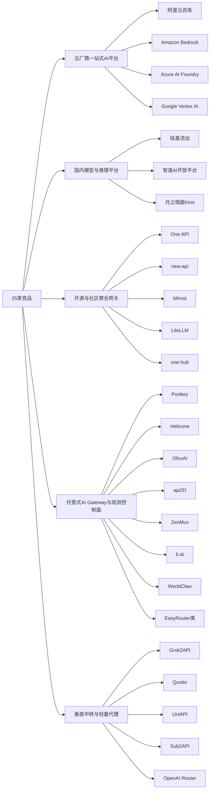

### 1.3 按竞争强度划分

高强度直接竞争者主要包括阿里云百炼、Amazon Bedrock、Azure AI Foundry、Google Vertex AI、硅基流动、LiteLLM、Portkey、Helicone、OfoxAI和ZenMux。它们要么与MaaS平台争夺企业级平台预算，要么与MaaS核心网关、路由、观测、控制面能力高度重叠。云厂商争夺的是大客户的AI平台标准入口；硅基流动争夺的是低成本推理和国产模型供应；LiteLLM争夺的是工程团队自建网关方案；Portkey和Helicone争夺的是AI Gateway与LLMOps工作台；OfoxAI、ZenMux、EasyRouter类产品争夺的是托管式多模型入口。

中等强度竞争者包括智谱AI、月之暗面、One API、new-api、bifrost、WorldClaw、api2D、one-hub、UniAPI、OpenAI Router。它们在某些客户阶段会替代MaaS的一部分能力，比如单模型调用、快速聚合、路由fallback或国内开发者接入，但要成为完整企业控制面仍有边界。

低到中等强度竞争者包括Grok2API、Quotio、Sub2API、b.ai等。它们更多是轻量工具或早期产品，竞争压力不在企业采购，而在开发者体验和低门槛心智。MaaS不能因为它们企业能力弱就忽视它们，因为开发者往往先被“能跑起来”的简单工具吸引，之后才考虑治理能力。

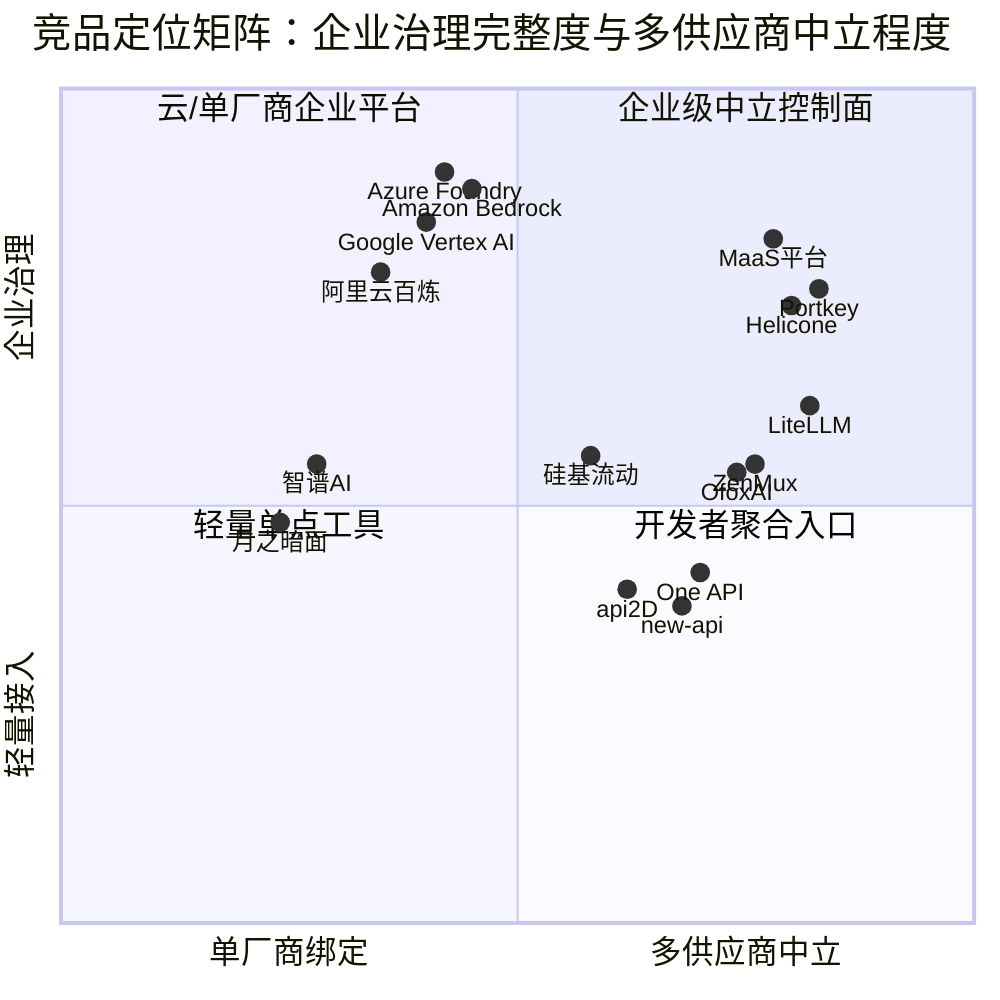

---

## 2. 模型聚合与模型目录能力

### 2.1 能力定义

模型聚合不是简单地把多个模型名字放进下拉框。成熟的模型目录至少包含五层含义：第一，能接入多个供应商和多个模型族；第二，能把供应商原生模型抽象为平台可理解的逻辑模型；第三，能描述模型能力，如上下文长度、输入输出模态、函数调用、工具调用、视觉能力、代码能力、Embedding能力、Rerank能力、图像生成能力、语音能力；第四，能维护价格、区域、SLA、合规、速率限制、quota、版本变更和停服风险；第五，能让开发者在模型广场中理解模型适用场景、成本、质量和替换建议。

### 2.2 各类竞品表现

云厂商平台在模型目录方面最完整。Amazon Bedrock提供多供应商基础模型，且能把模型与IAM、区域、Provisioned Throughput、Guardrails、Knowledge Bases、Agents等云内能力关联起来。Azure AI Foundry强调Foundry Models与模型比较、实时模型路由和Azure OpenAI生态，模型目录不仅是“可调用模型列表”，还是应用、Agent和评估体系的一部分。Google Vertex AI的Model Garden连接Gemini、Imagen、Veo、Gemma、Llama、Claude等模型，并与训练、调优、预测、向量检索、BigQuery等数据生态连接。阿里云百炼则以Qwen为核心，叠加DeepSeek、Kimi、GLM等第三方模型，并将模型目录与DashScope、应用构建、知识库、Agent和阿里云账号体系结合。

国内模型平台的模型目录更强调“强模型心智”。硅基流动覆盖DeepSeek、Qwen、Kimi、GLM、BGE、SenseVoice、图像与多模态模型，它的目录价值在于高性价比推理和多种模型形态统一服务。智谱AI主要围绕GLM系列建立模型矩阵，目录深度集中在自家模型能力、工具、联网搜索、知识库、评测和批量处理。月之暗面围绕Kimi模型族和工具生态组织目录，突出长上下文、代码、Agent、研究和官方工具。

开源网关类产品的模型目录通常偏“渠道配置”。One API、new-api、one-hub更关注渠道、模型映射、Key池和价格配置；LiteLLM在模型适配和多供应商能力方面更成熟，能覆盖大量模型提供商并提供统一调用接口。它们的优势是灵活，缺点是模型能力元数据、合规状态、采购状态、SLA和业务推荐通常需要团队自己维护。

托管式网关与观测产品的模型目录介于云厂商和开源网关之间。Portkey、Helicone、OfoxAI、ZenMux、EasyRouter类产品通常强调一个API访问多模型，部分会标注价格、供应商、可用性、协议兼容和模型能力。Helicone的强项不在模型目录本身，而在模型调用后的请求、成本、延迟、trace和实验数据。WorldClaw宣称WorldRouter可访问大量模型，并把模型入口与token marketplace、Agent OS结合，体现“模型目录商业化”的趋势。

轻量中转工具的模型目录最弱。Grok2API通常围绕Grok/xAI单模型或少量模型；Quotio、UniAPI、Sub2API、OpenAI Router更多是配置上游资源，目录能力取决于部署者配置，缺少标准化模型卡片、能力标签、价格解释和企业使用建议。

### 2.3 对MaaS平台的启示

当前MaaS PRD已经提出三层模型架构，即厂商模型目录、供应商后端、逻辑模型，这个方向非常正确。真正需要补强的是模型目录的“运营深度”。模型目录不能只是技术配置，而要成为产品、研发、商务、财务、合规共同维护的基础主数据。每个模型都应有能力标签、价格快照、成本价快照、售价快照、上下游SLA、区域可用性、合规属性、上下文长度、工具调用支持、模态支持、替代模型建议、停服风险、推荐路由场景和质量评估结果。

MaaS还应该把模型广场从“浏览模型”升级为“模型选型工作台”。开发者不只是想看模型列表，他们想知道某个任务该选哪个模型，为什么路由引擎推荐它，替换成便宜模型会损失多少质量，切到国产模型是否满足合规，是否支持私有化，是否有合同折扣。云厂商做的是云内模型目录，MaaS有机会做跨云、跨供应商、跨合同的中立模型目录。

### 2.4 PRD未充分覆盖项

PRD已经覆盖模型广场、逻辑模型、供应商后端、厂商模型目录和合同定价，但还需要补充以下内容：模型能力标签体系；模型卡片标准；模型质量基准与评测版本；模型合规标签；模型替代关系图；上下游价格生效时间；模型停服、降级、迁移公告机制；模型目录变更审计；模型推荐解释；模型灰度上架与下线阻断；模型级SLA和区域可用性标记；模型目录与路由策略的联动规则。

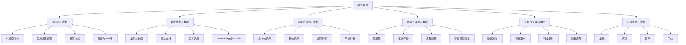

---

## 3. API兼容与协议适配能力

### 3.1 能力定义

API兼容是所有MaaS和网关产品的入场券。最基本的能力是OpenAI Chat Completions兼容，让开发者只改base_url和api_key即可迁移。但真正的协议适配远不止这一步。成熟平台需要兼容OpenAI、Anthropic Messages、Google Gemini、Azure OpenAI、Embeddings、Images、Audio、Batch、Function Calling、Tool Calling、Streaming、JSON Mode、Response API、错误码、用量字段、上下文截断、工具调用回放、文件上传和多模态输入输出。

### 3.2 各类竞品表现

轻量网关和开发者工具通常最重视OpenAI兼容，因为它们的第一卖点就是低迁移成本。One API、new-api、UniAPI、one-hub、api2D等产品的核心价值都是统一API Base和OpenAI兼容调用。Grok2API这类垂直代理也会尽量把特定模型封装成OpenAI风格接口，以便复用SDK生态。

LiteLLM在协议适配方面是开源生态里的强代表，它不仅做OpenAI兼容，还试图在大量供应商之间建立统一调用抽象。Portkey、Helicone、ZenMux、OfoxAI、EasyRouter类产品也普遍把OpenAI-compatible作为入口，并逐渐支持Anthropic、Gemini等协议格式。EasyRouter类托管网关尤其强调OpenAI、Anthropic和Gemini多协议格式，说明市场已经从单一OpenAI兼容走向多协议兼容。

云厂商平台的兼容性比较复杂。Azure OpenAI天然兼容OpenAI生态，但Azure AI Foundry整体能力远超OpenAI协议；Amazon Bedrock有Converse、Invoke、Chat Completions等多种接口，兼容性依赖具体模型和API；Google Vertex AI有Gemini和Vertex接口，外部开发者迁移成本相对高一些；阿里云百炼同时提供DashScope和OpenAI兼容模式，国内开发者接受度较好。

国内模型平台在OpenAI兼容上普遍增强。硅基流动、智谱、月之暗面均提供较友好的API调用体验，部分兼容OpenAI风格，但其高级能力如官方工具、搜索、Memory、Code Runner、MCP等往往需要使用各自平台扩展能力。

### 3.3 对MaaS平台的启示

MaaS不能只说“兼容OpenAI”。未来企业客户会同时接入OpenAI、Anthropic、Gemini、Azure OpenAI、国内模型和自托管模型，协议兼容要从“SDK能跑”升级为“行为一致、错误一致、用量一致、流式一致、工具调用一致、审计一致”。对于开发者来说，最痛苦的不是请求发不出去，而是同样的Tool Calling在不同供应商表现不一致，同样的错误码无法统一处理，同样的streaming chunk字段不一致，同样的token统计口径不一致。

MaaS应建立协议适配认证机制。每个供应商适配器上线前，要通过一套协议兼容测试集，包括普通对话、流式输出、多轮上下文、工具调用、JSON输出、超长上下文、超时、限流、错误码、token用量、取消请求和重试。这样平台才能向企业承诺“不是简单转发，而是可验证的协议兼容层”。

### 3.4 PRD未充分覆盖项

PRD已有统一API网关、OpenAI兼容REST API、协议适配层和SDK文档，但需要补充多协议兼容路线，包括Anthropic Messages、Gemini API、Azure OpenAI差异、Batch API、多模态文件协议、工具调用标准化、错误码映射、用量字段归一、流式响应一致性测试、协议兼容评分、适配器认证流程、兼容性变更公告和客户迁移指南。

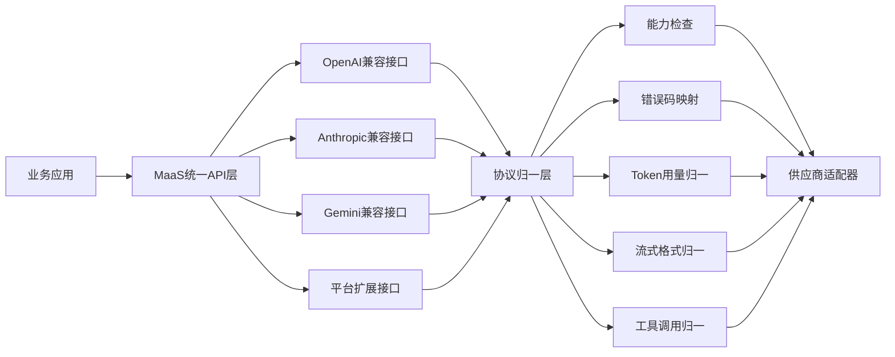

---

## 4. 路由策略能力

### 4.1 能力定义

路由是MaaS平台的核心差异化能力之一。基础路由是根据模型名把请求转发到对应上游；进阶路由是根据成本、延迟、成功率、质量、租户、项目、API Key、地域、供应商健康状态、预算、合规、任务类型、上下文长度和用户偏好动态选择模型。企业级路由还需要策略版本、审批、灰度、模拟、解释、回放、命中统计、异常归因和回滚。

### 4.2 各类竞品表现

云厂商平台的路由更偏云内资源编排。Amazon Bedrock有Inference Profiles、Cross-region Inference和Prompt Routing，能在区域、吞吐、模型选择和托管能力上做优化。Azure Foundry强调实时模型路由，在质量和成本之间自动选择模型。Google Vertex AI更偏模型选择、区域、端点和MLOps生命周期。阿里云百炼更多体现为模型选择、部署规格、地域和阿里云资源体系内的调度。

开源网关中，LiteLLM的路由和fallback能力最值得关注，支持多供应商、负载均衡、预算、fallback等。One API、new-api、one-hub通常支持渠道优先级、权重、模型映射、Key池和基础切换，但策略复杂度有限。bifrost与OpenAI Router类产品强调路由器型网关，价值在故障切换、低成本替换和多上游选择。

托管网关产品通常把路由包装为“智能选择、自动fallback、低成本、高可用”。Portkey更强调策略控制面，适合做策略治理对标；Helicone有AI Gateway和自动fallback，同时强在请求观测，能让路由策略被数据反馈；ZenMux、OfoxAI、EasyRouter类产品强调多模型、官方上游、全球高可用、负载均衡和自动容灾。

国内模型平台的路由能力整体较弱。硅基流动有推理加速、预留实例和企业网关能力，但它的核心仍是自家供给能力，不是中立路由控制面。智谱和月之暗面主要围绕自家模型族，客户如果要做跨供应商路由，通常需要在业务侧或外部网关中实现。

轻量代理类产品多为基础路由。Grok2API可能只做单上游转发；Quotio、UniAPI、Sub2API可能有Key池和基础选择；OpenAI Router类产品强调多上游fallback，但缺少完整治理。

### 4.3 路由能力成熟度分层

第一层是静态映射：请求中的model字段映射到某个供应商模型。第二层是渠道优先级：同一个模型配置多个渠道，按顺序或权重选择。第三层是健康感知路由：根据错误率、超时、限流、quota自动避开不健康上游。第四层是多目标优化：综合成本、延迟、质量和成功率打分。第五层是上下文感知路由：根据任务类型、语言、模态、上下文长度、工具调用需求选择模型。第六层是治理化路由：策略有版本、审批、灰度、仿真、解释、回放和审计。第七层是业务闭环路由：路由决策与用户满意度、任务成功率、业务转化、毛利和SLA联动。

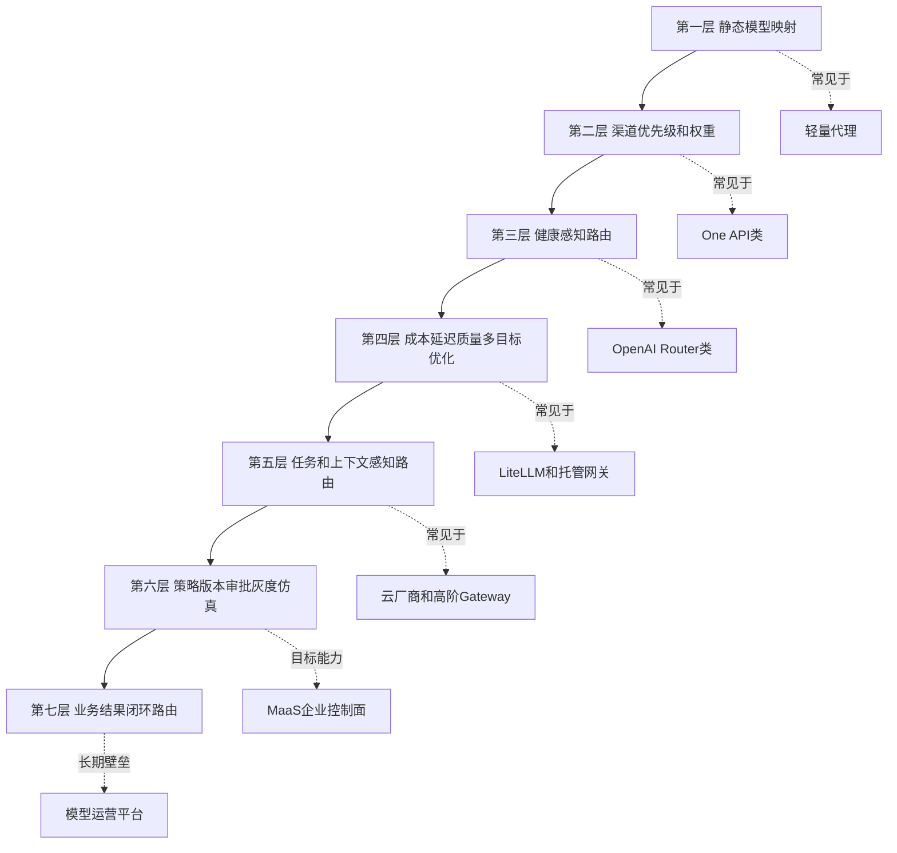

### 4.4 对MaaS平台的启示

当前MaaS PRD已经提出五种路由策略和四级作用域，这是比多数轻量网关更完整的方向。真正的差距在于策略生命周期。客户会问：为什么这次请求走了这个模型？如果改策略，成本和成功率会怎样？策略发布前能不能用历史流量回放模拟？策略发布后能不能灰度到10%的项目？出现故障后能不能解释是供应商失败、策略错误、预算限制还是合规规则导致？如果不能解释，智能路由会变成黑盒，企业客户很难放心把生产流量交给平台。

MaaS应把路由引擎从“规则配置”升级为“策略治理系统”。每条策略应包含目标、作用域、候选模型、约束条件、评分函数、fallback链、预算边界、合规边界、审批记录、版本号、灰度范围、仿真报告、发布人、回滚点和效果统计。平台要让客户知道每次路由决策的理由，而不是只展示最终模型。

### 4.5 PRD未充分覆盖项

PRD已有路由策略、优先级、作用域和智能评分，但需要补充策略解释、策略仿真、历史流量回放、策略灰度发布、策略效果对比、策略回滚、路由命中详情、策略冲突检测、fallback链可视化、预算与合规约束联动、任务类型识别、上下文长度感知、质量反馈闭环、路由事故归因和策略审批流。

---

## 5. 容灾、降级与SLA能力

### 5.1 能力定义

容灾不是简单的失败重试。企业级AI网关的容灾包括供应商级故障、模型级故障、Key级额度耗尽、区域级网络异常、限流、成本突增、质量异常、内容安全异常、缓存异常、计费链路异常和自身网关故障。降级也不只是返回错误，而应包括同模型备用供应商、同能力替代模型、低成本模型、缓存结果、异步处理、排队、限流保护、只读模式和用户可见告警。

### 5.2 各类竞品表现

云厂商平台的高可用能力来自云基础设施。AWS、Azure、Google都具备区域、多可用区、监控、审计、私网、SLA等能力，Bedrock的Cross-region Inference和Inference Profiles尤其值得关注。阿里云百炼在国内云资源和企业服务上有优势，但跨云容灾不是它的核心方向。

托管网关产品把自动fallback作为核心卖点。Portkey、Helicone、EasyRouter类、ZenMux、OfoxAI通常强调自动failover、负载均衡、全球节点、官方上游和稳定性。它们的优势是把容灾包装成开发者可感知的简单能力；短板是公开资料中不一定能看到完整演练报告、RTO/RPO、事故复盘和企业SLA承诺。

开源网关类产品可实现容灾，但责任在使用方。LiteLLM支持fallback和负载均衡，One API、new-api、one-hub也可以通过渠道优先级和Key池实现一定容灾。问题是实际高可用依赖部署架构、监控、数据存储、配置管理和运维团队能力。

国内模型平台和单模型平台通常容灾边界较窄。硅基流动作为推理云会强调稳定性、监控容错和企业服务，但跨供应商替代需要MaaS或客户自建网关。智谱、月之暗面更多保障自家平台可用性，不能天然承担多供应商fallback。

轻量中转工具的容灾能力最弱，通常没有明确SLA、演练机制和事故报告。它们适合开发测试或非关键业务，不适合作为高SLA生产入口。

### 5.3 对MaaS平台的启示

MaaS在容灾上应建立比竞品更可验证的体系。单纯说“支持failover”不足以打动金融、政务、大型企业。平台需要定义AI调用链路的SLO：网关可用性、供应商成功率、模型P95/P99延迟、fallback成功率、重试放大率、Key额度耗尽时间、异常检测时间、切换时间、恢复时间、计费补偿策略。对于企业客户，容灾演练报告本身就是销售资产。

MaaS还要区分技术容灾和业务降级。技术容灾解决请求能否成功；业务降级解决结果是否可接受。例如客服机器人可以从强模型降级到便宜模型，但法律合规审查不能随意降级；代码生成可以延迟返回，实时语音对话不能排队太久；内部知识库问答可以用缓存结果，金融交易解释不能用过期答案。降级策略必须和场景、模型能力、合规等级绑定。

### 5.4 PRD未充分覆盖项

PRD提到故障转移、多区域容灾、容灾演练和RTO/RPO，但还需要补充供应商故障分级、模型故障分级、Key额度耗尽处理、区域异常检测、fallback链配置、降级模型能力约束、缓存降级策略、异步队列降级、业务场景降级模板、演练计划、演练报告、事故复盘、SLA赔付口径、供应商SLA映射、客户可见状态页和故障通知模板。

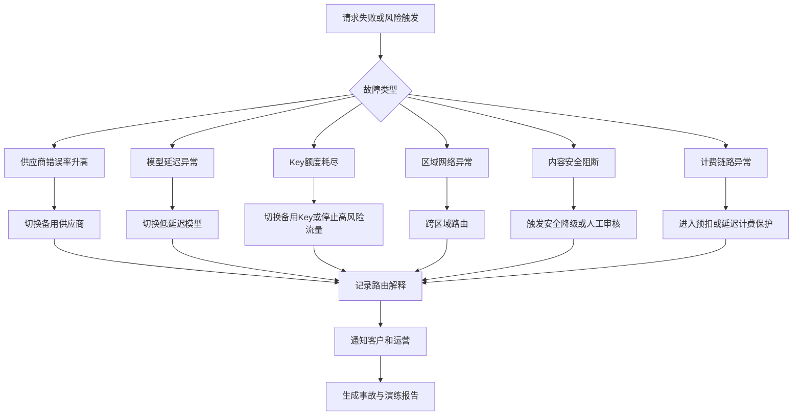

---

## 6. 可观测、Trace与LLMOps能力

### 6.1 能力定义

可观测是MaaS平台从“能转发请求”走向“能运营模型”的关键。传统监控关注QPS、错误率、延迟、CPU、内存和日志；LLMOps可观测还要关注prompt、completion、token、模型版本、供应商、路由决策、用户会话、工具调用、检索上下文、缓存命中、成本、质量、用户反馈、安全拦截、实验版本和业务结果。

### 6.2 各类竞品表现

Helicone是本组最重要的对标。它不仅提供AI Gateway，还提供请求日志、成本、延迟、sessions、traces、prompt management、playground、实验分析、数据导出、自托管和企业合规。它的启示是：工程团队需要的是可调试、可追踪、可复盘的工作台，而不是只有总量统计的仪表盘。

Portkey也值得关注，它强调AI Gateway和控制面，通常会把策略、观测、成本、日志、预算结合起来。LiteLLM在开源生态中也提供一定日志、预算和网关运行数据，但其观测体验取决于部署和外围系统。云厂商平台有CloudWatch、Azure Monitor、Cloud Logging、CloudTrail等成熟基础设施，但LLM请求级可观测与业务侧实验分析往往需要额外组合。

One API、new-api、one-hub等轻量网关一般有基础用量统计和日志，但缺少完整trace、session、prompt版本和实验评估。国内模型平台通常提供控制台统计、账单、调用日志和基础监控，深度LLMOps能力不一定突出。轻量代理类产品往往只有错误日志或简单调用记录。

### 6.3 对MaaS平台的启示

MaaS当前PRD和设计中有监控告警、日志、计费和质量成本分析看板，但需要进一步明确“请求级可观测”的产品规格。企业AI应用排障时，常见问题不是“今天请求数是多少”，而是“为什么这个用户这次答案很差”“为什么这个请求走了昂贵模型”“为什么工具调用失败”“为什么缓存没有命中”“为什么token突然变多”“为什么同样prompt昨天好今天差”“为什么fallback后质量下降”。这些问题需要以单次请求为中心串起模型、路由、prompt、上下文、工具、成本、缓存和响应。

MaaS应设计Trace详情页。每次调用都应能展开：租户、项目、API Key、用户标识、请求时间、模型名、逻辑模型、实际供应商、路由策略、路由评分、fallback次数、输入token、输出token、缓存状态、延迟分解、错误码、工具调用链、检索片段、内容安全结果、计费金额、毛利、审计标签和数据保留状态。对于敏感客户，还要支持字段脱敏、采样、保留周期和导出权限。

### 6.4 PRD未充分覆盖项

需要补充请求级Trace、Session视图、Prompt版本关联、工具调用链路、RAG上下文记录、缓存命中解释、路由解释、成本拆解、质量反馈、用户反馈采集、异常聚类、导出接口、数据保留策略、采样策略、敏感字段脱敏、客户侧Webhook告警、OpenTelemetry集成和与工单系统联动。

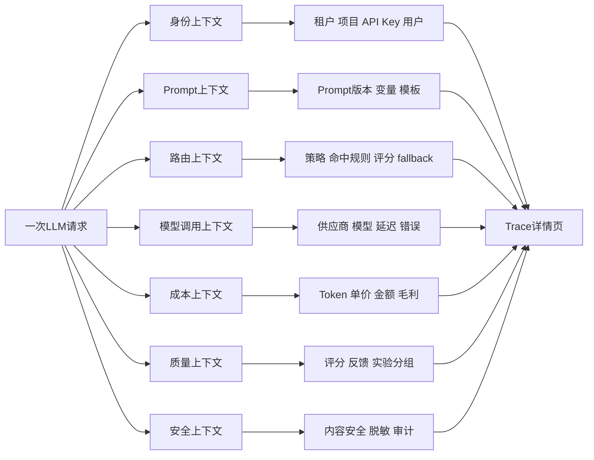

---

## 7. 成本、计费与商业治理能力

### 7.1 能力定义

成本治理是企业采用MaaS的强驱动力。它包括实时用量、token计量、供应商成本、平台售价、毛利、合同折扣、阶梯价格、预算、预警、分账、对账、发票、充值、欠费、额度、成本预测、异常成本检测和成本优化建议。对于聚合平台而言，计费不是附属模块，而是商业可持续的基础。

### 7.2 各类竞品表现

云厂商平台在账单和成本分摊方面最成熟。AWS、Azure、Google和阿里云都有自己的云账单、成本中心、标签、预算、发票、企业合同和财务流程。它们的优势是企业采购天然接受；劣势是AI模型成本跨云、跨供应商时难以统一。

硅基流动等推理平台强调低成本、高性价比和预留实例，适合成本敏感客户。智谱、月之暗面等单模型平台有清晰的按量计费和充值模式，但跨模型成本治理能力有限。api2D、OfoxAI、ZenMux、WorldClaw、EasyRouter类产品通常强调充值、credits、低价、官方价格或折扣，这类卖点对开发者很直接。

Helicone、Portkey和LiteLLM则从工程控制角度做成本治理。Helicone能把请求日志、成本、延迟、session结合起来，帮助团队发现成本异常。Portkey强调预算和策略控制。LiteLLM支持预算相关能力，适合自建团队做成本限制。

轻量代理和订阅转换工具的成本治理通常不规范。Sub2API这类工具可能在资源复用上很便宜，但合规、稳定性、来源和对账风险高，不适合企业核心生产。

### 7.3 对MaaS平台的启示

MaaS已有计量计费、合同折扣、阶梯价格、账单管理、总账视图、租户分账、对账差异和出账记录，这是非常重要的优势。下一步要把成本治理从“算账”升级为“优化”。客户关心的不只是花了多少钱，还关心为什么花、谁花的、是否超预算、是否可以降低、是否影响质量、是否有合同折扣没用上、是否有异常请求拉高成本。

MaaS可以形成一套成本优化闭环：发现高成本项目，定位高成本Prompt或模型，给出替代模型建议，模拟质量损失和成本节省，允许一键创建路由策略或预算策略，持续观察策略效果。语义缓存是MaaS的潜在差异化，但需要和成本报表强绑定，让客户看到缓存命中带来的真实节省。

### 7.4 PRD未充分覆盖项

需要补充成本异常检测、成本预测、预算消耗速度、月底超支预测、毛利风险归因、合同折扣未命中提醒、替代模型成本模拟、语义缓存节省报表、部门级成本分摊、成本中心标签、导出到财务系统、发票和收款状态联动、供应商账单对账、汇率和税费处理、预留实例或包量套餐管理、FinOps建议中心。

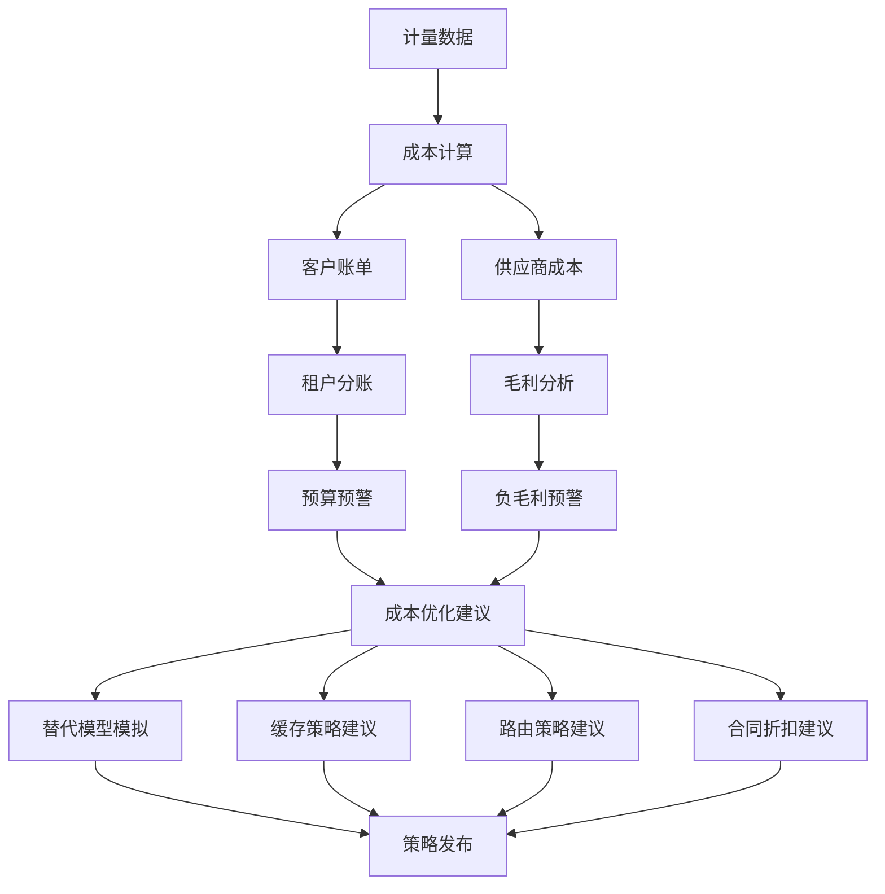

---

## 8. 企业治理、权限与审计能力

### 8.1 能力定义

企业治理能力决定MaaS能否从开发者工具进入大客户生产。它包括多租户、组织、部门、项目、环境、用户组、角色、权限矩阵、SSO、SCIM、API Key权限、审批流、审计日志、数据留存、变更记录、策略发布、预算审批、合规证明和管理后台。

### 8.2 各类竞品表现

云厂商平台的企业治理最强。AWS IAM、Azure Entra ID、Google IAM和阿里云RAM都已经是企业熟悉的权限体系，配套审计、日志、策略和云资源权限。客户不需要重新建立信任，这是云厂商优势。

Portkey这类控制面产品在AI策略治理上更突出，适合借鉴其策略、预算、控制和观测整合。Helicone在团队、日志和自托管方面对工程团队友好，但不是传统企业采购流程平台。LiteLLM等开源网关可做团队和预算管理，但企业权限深度取决于自建。

One API、new-api、one-hub等轻量网关通常有用户、令牌、渠道和额度管理，但组织层级、审批、审计、SSO、合规留存不足。国内模型平台会有企业账号和服务支持，但跨供应商治理不是重点。轻量代理工具几乎不具备企业治理能力。

### 8.3 对MaaS平台的启示

MaaS PRD已经有组织与权限体系，定义租户、成员、用户组、项目和角色，这是良好基础。但企业治理的关键在“所有高风险动作可审批、可追溯、可回滚”。例如新供应商上线、模型下线、价格调整、路由策略发布、预算上调、API Key创建、IP白名单变更、审计导出、敏感日志查看，都应该有审计事件和可配置审批规则。

MaaS还应区分开发者权限和运营权限。开发者需要创建Key、调试模型、查看自己项目用量；财务需要看账单和预算；安全团队需要看审计和数据留存；平台运营需要管理供应商、价格和模型；业务负责人需要批准预算和上线策略。若所有能力都塞进Admin和Member两档，会很快无法满足大客户。

### 8.4 PRD未充分覆盖项

PRD已有RBAC、成员、用户组和项目权限，但需要补充细粒度权限点、SSO/SAML/OIDC、SCIM自动同步、审批工作流引擎、高风险操作清单、审计日志字段标准、审计检索与导出、权限变更回溯、Break Glass应急权限、职责分离、合规报表、租户管理员可配置策略、API Key权限范围、数据访问权限和日志查看脱敏权限。

---

## 9. 合规、安全与私有化能力

### 9.1 能力定义

安全合规能力包括身份认证、访问控制、密钥管理、网络隔离、数据加密、数据脱敏、数据留存、审计、内容安全、隐私、区域合规、等保、行业监管、供应商合规、私有化部署、一体机交付和离线环境运维。对于MaaS平台，安全不仅是平台自身安全，也包括上游模型和下游客户数据在整个调用链中的安全。

### 9.2 各类竞品表现

云厂商平台在合规上有体系优势。AWS、Azure、Google和阿里云长期服务企业客户，具备成熟的安全认证、区域、私网、KMS、审计和企业合规工具。它们的短板在于云绑定和跨云中立性不足。

国内模型平台在本地化合规上更有优势。阿里云百炼、智谱、硅基流动等能更好适配国内采购、发票、数据合规和私有化要求。硅基流动还强调BYOC、私有化部署和资源隔离。月之暗面在企业服务上也有一定空间，但多供应商合规治理不是它核心。

Helicone支持自托管和企业合规，是观测产品中很值得学习的方向。LiteLLM等开源工具天然可自建，但合规能力取决于部署者。托管式网关类产品常强调零存储、官方上游、隐私协议、全球节点，但是否满足特定行业监管，需要逐项核验。轻量代理工具和订阅转换工具在合规上风险最大，尤其是上游资源来源、账号稳定性、数据流向和日志留存。

### 9.3 对MaaS平台的启示

MaaS要把合规从宣传语变成可配置、可审计的产品能力。企业客户会问：哪些请求会出境？哪些模型可以处理个人信息？Prompt是否落盘？日志保留多久？能否关闭内容存储？能否只记录元数据？供应商是否官方通道？数据是否用于训练？私有化部署时哪些组件需要外网？审计日志能否防篡改？这些问题需要产品页面和合同条款共同回答。

MaaS的机会在于建立跨供应商合规控制面。云厂商能证明自己云内合规，单模型平台能证明自家模型合规，但客户真正需要的是“我的所有模型调用是否符合本企业策略”。MaaS应允许按租户、项目、数据等级、地域、行业、模型类型配置合规策略。例如金融生产环境禁止调用境外模型，个人信息场景必须走脱敏，涉密项目只能使用私有化模型，日志只保留元数据。

### 9.4 PRD未充分覆盖项

需要补充数据分级、地域策略、出境控制、敏感字段识别、Prompt脱敏、响应脱敏、日志留存策略、零数据保留模式、供应商数据使用条款、官方通道证明、合规模型白名单、内容安全策略、行业模板、审计防篡改、私有化部署规格、离线升级、客户KMS、自带密钥、网络拓扑、安全基线扫描和合规报告导出。

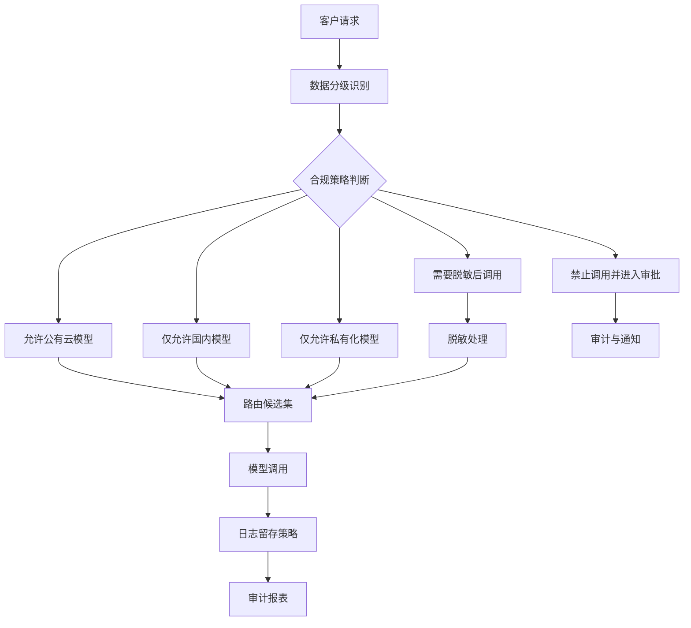

---

## 10. 私有化部署、自托管与混合云能力

### 10.1 能力定义

私有化不是把SaaS打包进客户机房那么简单。成熟私有化交付包括部署拓扑、依赖清单、离线镜像、证书、数据库、对象存储、日志、监控、升级、备份、灾备、许可证、容量规划、GPU适配、国产化适配、运维手册、巡检、远程支持和安全加固。对于MaaS而言，还要支持外部模型API、自托管模型、企业内网模型和混合云路由。

### 10.2 各类竞品表现

云厂商平台通常提供专有云、私有连接或云内隔离，但不一定支持真正脱离云厂商的私有部署。阿里云在国内专有云和企业交付方面相对有优势；AWS、Azure、Google更强调公有云和企业网络隔离。

硅基流动强调私有化部署、BYOC、独占算力和国产异构GPU适配，是MaaS在推理基础设施层面的重要对标。LiteLLM、One API、new-api等开源网关天然可以自托管，部署轻但企业能力要自己补。Helicone支持Docker自托管和企业Helm Chart，说明观测产品也在向企业私有化延伸。

Portkey等托管控制面产品通常会有企业部署选项或安全方案，但公开资料深度不一。轻量代理工具可以自部署，但缺少企业交付体系。

### 10.3 对MaaS平台的启示

MaaS如果要进入金融、政务、央国企和大型制造，私有化交付必须产品化。产品化私有化意味着不是项目制临时部署，而是有标准版本、组件清单、最小资源规格、升级策略、License机制、离线包、巡检工具、故障诊断脚本、数据备份恢复方案和验收清单。

混合云是MaaS的差异化方向。客户可能既有本地私有模型，也要调用公有云模型，还要保留某些场景的数据不出域。MaaS应支持同一个逻辑模型背后配置公有云后端、私有化后端和本地模型后端，并通过合规策略和路由策略决定使用哪个后端。

### 10.4 PRD未充分覆盖项

PRD提到私有化部署与一体机交付是P2，但需要补充私有化版本边界、部署拓扑、离线安装、许可证、升级回滚、国产化适配、GPU资源管理、内网模型接入、混合云路由、客户自带供应商Key、客户自带KMS、日志本地留存、数据备份、容量规划、运维SLA和私有化验收标准。

---

## 11. Prompt实验、评测回归与质量治理

### 11.1 能力定义

模型平台的竞争正在从“调用模型”走向“持续优化AI应用质量”。Prompt实验、评测回归和质量治理包括Prompt版本、变量管理、数据集、评测指标、人工标注、A/B实验、回归测试、上线门禁、质量趋势、模型对比、成本质量权衡和业务指标关联。

### 11.2 各类竞品表现

云厂商平台在评测、Prompt管理和Agent开发方面持续增强。Amazon Bedrock提供Evaluation、Prompt Management、Guardrails等能力；Azure Foundry强调模型比较、评估、Agent和控制面；Google Vertex AI具备训练、评估、调优和MLOps传统优势；阿里云百炼也覆盖模型评测、应用构建、知识库和智能体。

Helicone提供prompt management、playground、实验分析等能力，特别适合AI工程团队调试和迭代。Portkey也强调控制面与策略，对Prompt和实验管理有参考价值。国内平台中，智谱和月之暗面围绕自家模型提供工具、搜索、Agent和开发套件，但跨模型评测治理需要外部平台补齐。

轻量网关类产品大多不具备Prompt实验和质量治理。它们可以转发请求，但无法回答“哪个Prompt版本更好”“换模型后质量下降多少”“上线前是否会破坏核心用例”。

### 11.3 对MaaS平台的启示

MaaS原型中已经有Prompt实验中心，这是非常正确的方向。但它不能只是一个Prompt列表页面，而要和模型路由、评测、成本、上线流程打通。企业AI应用的真实迭代方式是：修改Prompt，选择候选模型，跑离线评测，对比成本和质量，小流量灰度，观察线上反馈，再决定是否全量发布。MaaS如果能把这一闭环做完整，就能从“网关”升级为“AI应用运营平台”。

质量治理还应反哺路由。当前多数路由只看成本、延迟和成功率，但企业真正关心任务成功率。MaaS应允许客户上传评测集或从线上反馈中沉淀评测集，让路由策略按任务质量选择模型，而不是只按技术指标选择。

### 11.4 PRD未充分覆盖项

需要补充Prompt版本数据模型、Prompt变量、评测数据集、评测指标、人工评分、模型对比实验、A/B实验、上线审批、回归门禁、质量趋势、任务成功率、用户反馈采集、实验结果导出、Prompt与Trace关联、Prompt与成本关联、Prompt与路由策略联动、评测集权限和数据脱敏。

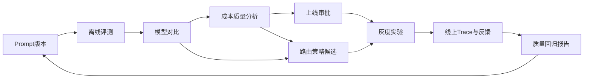

---

## 12. Agent、应用构建与工具生态

### 12.1 能力定义

Agent和应用构建能力包括智能体开发、工具调用、工作流、知识库、插件、MCP、代码执行、联网搜索、文件处理、Memory、RAG、行业模板和应用发布。它不一定是MaaS MVP的核心，但它决定平台能否向业务用户和应用团队延伸。

### 12.2 各类竞品表现

云厂商平台在Agent方向投入明显。Amazon Bedrock有Agents、Flows、Knowledge Bases和Guardrails；Azure Foundry定位AI app and agent factory，整合Agent Service、Foundry IQ、Copilot Studio和Microsoft生态；Google Vertex AI正在向Gemini Enterprise Agent Platform叙事演进；阿里云百炼提供智能体、知识库、工作流、插件和MCP等能力。

国内模型平台也在强化工具与Agent。智谱提供智能体、联网搜索、MCP、知识库、评测和批量处理。月之暗面提供Web Search、Memory、Excel、Code Runner、QuickJS、Fetch、单位转换等官方工具，强化Kimi在研究、代码和复杂任务中的体验。

WorldClaw体现了另一个方向，即模型网关与Agent OS结合。它不是只卖API，而是试图从Agent运行和技能市场切入用户入口。Helicone、Portkey等更偏工程侧，不直接做完整应用构建，但会服务Agent团队的观测、调试和治理。

轻量网关和代理工具基本不做应用构建，它们最多支持工具调用透传，不负责Agent编排和应用生命周期。

### 12.3 对MaaS平台的启示

MaaS需要明确边界：短期不必和云厂商正面对打完整Agent Studio，但必须保障Agent应用运行所需的底层能力，包括工具调用兼容、长上下文、检索调用trace、工具失败观测、成本控制、会话追踪和安全策略。也就是说，MaaS可以不先做完整Agent IDE，但要成为Agent应用的可靠基础设施。

中长期看，MaaS可以通过模板和插件生态切入轻量应用构建。比如企业知识库问答、客服助手、代码评审、合同审查、财务分析、研发助手等模板，不一定要做成复杂低代码平台，但要让客户看到从模型接入到场景落地的路径。

### 12.4 PRD未充分覆盖项

PRD提到AI应用商店运营体系本期不做，原型有MaaS Copilot，但还需要补充Agent底座能力：工具调用兼容矩阵、MCP接入、RAG链路观测、会话管理、Memory策略、工具权限、代码执行安全、联网搜索合规、应用模板、行业场景包、Agent成本预算、Agent Trace和Agent失败归因。

---

## 13. 开发者体验与生态能力

### 13.1 能力定义

开发者体验包括文档、Quickstart、SDK、示例代码、错误码、Playground、模型测试、迁移工具、CLI、Postman集合、Webhook、本地代理、Mock服务、状态页、变更日志和社区支持。企业平台也需要开发者体验，因为真正推动采用的人往往是研发团队。

### 13.2 各类竞品表现

OpenAI兼容生态是所有网关产品的重要基础。One API、new-api、LiteLLM、api2D、UniAPI等产品都受益于开发者只需替换base_url的低门槛。硅基流动、智谱、月之暗面也提供较完整文档和示例，国内开发者接入路径清晰。云厂商文档系统庞大但复杂，企业客户能找到权威资料，普通开发者上手成本可能更高。

Helicone、Portkey等产品的开发者体验更贴近AI工程工作流，强调快速接入、可观测、调试和团队协作。轻量代理工具则以部署简单、配置少、跑起来快取胜。

### 13.3 对MaaS平台的启示

MaaS已有公开文档结构、快速开始、SDK、迁移指南和Playground，这是基础。但要和竞品竞争，需要让开发者在5分钟内完成真实调用，在30分钟内完成一个生产前检查，在1天内完成从OpenAI迁移到MaaS并上线灰度。文档不应只讲接口，还要讲常见迁移坑、模型差异、错误处理、重试、超时、流式、工具调用、成本优化和安全最佳实践。

MaaS还可以提供本地开发工具，如CLI、配置检查器、策略模拟器、日志查询工具和本地代理。轻量工具之所以吸引开发者，是因为它们离开发环境很近。MaaS如果只提供控制台，开发者会觉得重。

### 13.4 PRD未充分覆盖项

需要补充CLI、Postman集合、OpenAPI规范、SDK版本策略、本地Mock、本地代理、迁移扫描工具、错误码诊断器、状态页、Webhook、示例应用、Terraform Provider、Helm Chart、GitHub Action、开发者沙箱、测试额度、兼容性测试工具和文档反馈机制。

---

## 14. 供应商治理与上游运营能力

### 14.1 能力定义

供应商治理是聚合平台特有能力，单模型平台和云厂商平台通常不会把它显性展示给客户。它包括供应商准入、官方通道证明、合同、价格、额度、Key池、区域、SLA、服务状态、结算、发票、风控、停服通知、模型版本变更、合规条款和供应商评分。

### 14.2 各类竞品表现

云厂商本身就是供应商，因此内部治理对客户不可见。托管聚合网关如EasyRouter类、OfoxAI、ZenMux、WorldClaw等会强调官方上游、低价、全球通道和多模型访问，这是供应商治理的外部化表达。硅基流动作为推理平台强调资源、预留实例和企业网关。One API、new-api等工具把供应商治理简化为渠道配置。Sub2API这类订阅转换工具则暴露了供应商治理缺失时的风险，即资源来源不清、稳定性不足和合规不可控。

### 14.3 对MaaS平台的启示

MaaS要把供应商治理做成后台核心能力，而不是只在技术配置里维护Key。运营人员需要看到每个供应商的健康、成本、额度、合同、模型覆盖、区域、结算周期、风险等级和历史事故。路由策略也应能读取供应商评分，例如某供应商连续三天错误率上升，自动降低权重；某供应商合同折扣到期，自动触发毛利预警；某供应商Key额度即将耗尽，自动通知运营补充。

供应商治理还影响销售可信度。客户会问MaaS的上游是否官方，是否稳定，是否加价，是否有数据留存，是否能提供发票和合同。平台需要可对外展示的供应商合规说明和可对内操作的供应商运营台。

### 14.4 PRD未充分覆盖项

PRD已有厂商管理、vendor、vendor_key、Key池和成本快照，但还需要补充供应商准入流程、官方通道证明字段、供应商合规材料、供应商SLA、供应商合同、结算周期、额度预测、Key池风险评分、供应商健康评分、供应商事故记录、价格变更审批、供应商下线预案、供应商评级和供应商对账。

---

## 15. 25家竞品逐类能力小结

### 15.1 阿里云百炼

阿里云百炼的核心优势是国内云生态、Qwen模型、阿里云账号体系、RAM权限、账单、地域和企业采购路径。它适合已经在阿里云上的客户，也适合围绕通义模型和阿里云应用构建能力做AI落地的团队。其对MaaS的威胁不是某个API能力，而是“企业客户已经信任阿里云”。MaaS应避免正面对打云生态，强调跨供应商中立、跨云统一治理、语义缓存和私有化控制面。

### 15.2 硅基流动

硅基流动的核心优势是高性价比推理、国产模型覆盖、推理加速、预留实例和企业部署服务。它既是竞品，也是MaaS潜在上游。MaaS需要把它纳入模型供应链，同时在预算、审计、路由、合规和多供应商治理上形成上层价值。

### 15.3 One API

One API代表轻量开源聚合网关的典型形态，优势是部署简单、OpenAI兼容、渠道管理和成本低。其短板是企业治理、观测、审批、合规和SLA。MaaS要证明自己不是“更贵的One API”，而是“企业可运营的模型控制面”。

### 15.4 Amazon Bedrock

Bedrock的优势是AWS企业基础设施、IAM、VPC、KMS、CloudWatch、CloudTrail、Guardrails、Agents、Knowledge Bases、Cross-region Inference和全球区域能力。MaaS的机会在跨云、国内合规、非AWS供应商和私有化交付。

### 15.5 Azure AI Foundry

Azure Foundry的优势是Azure OpenAI、Microsoft生态、Entra ID、GitHub、VS Code、Copilot Studio、Foundry Models、实时模型路由和企业控制面。MaaS需学习其“AI app and agent factory”叙事，但定位应更中立，服务非Azure和国内混合环境。

### 15.6 Google Vertex AI

Vertex AI强在Gemini、多模态、Model Garden、MLOps、BigQuery、Vector Search和Google Cloud数据生态。MaaS对其差异是国内可用性、跨供应商治理、采购本地化和私有化。

### 15.7 智谱AI开放平台

智谱强在GLM模型、中文、政企服务、智能体、联网搜索、MCP和知识库。它是重要上游和单模型平台竞品。MaaS应支持GLM并提供跨模型fallback、预算审计和企业统一控制。

### 15.8 月之暗面Kimi

Kimi强在长上下文、代码、Agent、研究、工具调用和中文用户心智。MaaS应把Kimi作为高价值模型接入，同时解决Kimi不可用或成本不适合时的替代路由。

### 15.9 new-api

new-api代表轻量开源聚合入口，优势是简单和社区心智，短板是企业治理。MaaS要在入门体验上不输它，同时在生产治理上拉开差距。

### 15.10 Grok2API

Grok2API更像垂直模型兼容代理，适合快速接入Grok。它不是企业MaaS替代品，但提醒MaaS需要快速支持新兴模型，否则开发者会先用轻量代理绕过平台。

### 15.11 Quotio

Quotio代表资料有限的轻量中转工具。它的价值在低门槛和统一API Base，短板是资料、治理、合规和SLA。MaaS应把这类工具作为开发者体验参照。

### 15.12 UniAPI

UniAPI代表通用API聚合代理，可能具备模型映射、Key管理和基础路由。MaaS与其差异在企业级预算、审批、合规、审计和策略解释。

### 15.13 Sub2API

Sub2API代表订阅资源转API工具，低门槛但合规风险高。MaaS要在销售上强调正规供应商、合同治理、数据安全和稳定SLA。

### 15.14 OpenAI Router

OpenAI Router类产品强调多上游路由和failover，是MaaS路由模块的局部竞品。它的短板是完整平台治理。MaaS需要在路由解释、审批和成本治理上超越它。

### 15.15 bifrost

bifrost属于轻量AI网关类别，价值在统一入口和基础路由。MaaS应关注其工程简洁性，避免自身路由配置过重。

### 15.16 LiteLLM

LiteLLM是开源LLM Proxy和Router的重要对标，强在供应商覆盖、fallback、budget、guardrails和工程可控性。它对平台工程团队很有吸引力。MaaS要提供比自建LiteLLM更省心的运营、治理、合规和可视化。

### 15.17 easyrouter类

17号easyrouter作为类别分析，代表轻量路由网关心智。它提醒MaaS：路由配置必须足够直观，不能为了企业能力牺牲开发者快速理解。

### 15.18 WorldClaw

WorldClaw把WorldRouter、Agent OS、token marketplace结合起来，代表模型入口向Agent生态延伸。MaaS应关注“模型网关不仅是API，也可能成为Agent运行入口”的趋势。

### 15.19 Portkey

Portkey是AI Gateway和控制面的重要标杆，强在策略、预算、观测和治理组合。MaaS应重点学习其控制面表达，但结合国内合规、私有化和企业合同做差异。

### 15.20 Helicone

Helicone是LLM Observability和AI Gateway标杆，强在trace、session、成本、prompt、playground、导出、自托管。MaaS当前与其最大差距在请求级可观测和LLMOps工作台。

### 15.21 one-hub

one-hub代表聚合中转工具，优势是轻量易用，短板是治理深度。MaaS要用更好的首接入体验减少客户自建轻量入口的动力。

### 15.22 OfoxAI

OfoxAI代表轻量SaaS化多模型入口，控制台和统计更像产品。它对MaaS的启示是托管式体验要足够顺滑，不能只有后台管理思维。

### 15.23 api2D

api2D代表国内开发者快速接入OpenAI兼容服务的入口，优势是便利，短板是平台治理。MaaS可以在国内可用性、合规通道和企业账单上建立差异。

### 15.24 ZenMux

ZenMux代表托管式多模型聚合和路由服务，通常强调统一API、模型覆盖、价格、可用性和团队体验。MaaS应重点关注其定价表达、模型广场和快速接入路径。

### 15.25 b.ai

b.ai代表轻量开发者AI平台，公开信息有限，但其价值在产品化和上手快。MaaS不能只做企业后台，也要让小团队觉得轻便。

---

## 16. 对当前MaaS平台的总体启示

### 16.1 战略定位启示

MaaS平台应从“大模型聚合网关”升级为“企业模型运营控制面”。聚合网关解决的是调用入口，运营控制面解决的是企业如何长期、安全、低成本、可审计地使用模型。竞品显示，单纯聚合很容易被One API、new-api、LiteLLM、OfoxAI、ZenMux等产品替代；单纯模型能力会被云厂商和单模型平台压制；只有把模型、路由、成本、观测、合规、供应商和组织治理串起来，MaaS才有稳定位置。

### 16.2 产品形态启示

MaaS需要同时有三套体验。第一套是开发者体验：5分钟接入、OpenAI兼容、Playground、SDK、错误诊断和示例。第二套是平台工程体验：路由、fallback、trace、Prompt实验、评测、策略和自托管。第三套是企业运营体验：租户、预算、合同、分账、审计、合规、供应商和SLA。很多竞品只覆盖其中一套或两套，MaaS的机会是三套体验统一。

### 16.3 技术架构启示

三层模型架构是正确方向，但还需要围绕它建立四类主数据：模型主数据、供应商主数据、策略主数据、成本主数据。路由引擎不能只读实时指标，也要读合同、预算、合规、质量和供应商状态。计费系统不能只是异步统计，也要反向影响预算和路由。观测系统不能只是监控面板，也要成为路由解释、Prompt优化和事故复盘的数据基础。

### 16.4 商业化启示

MaaS的商业价值不仅来自调用加价，还来自成本优化、治理效率、合规保障和运维省心。对成本敏感客户，要证明语义缓存、路由优化和合同折扣能抵消平台溢价；对大客户，要证明审计、预算、合规和SLA能降低管理风险；对开发者，要证明接入不比轻量工具更麻烦；对平台工程团队，要证明比自建LiteLLM加Helicone更省时间、更可控。

---

## 17. 当前PRD已覆盖能力与未覆盖能力

### 17.1 已覆盖且方向正确的能力

当前PRD已经覆盖统一API网关、OpenAI兼容、模型管理、智能路由、语义缓存、计量计费、模型广场、租户计费、合同折扣、阶梯定价、Key池、租户限流、告警通知、组织与权限、监控告警、平台后台、账单管理和基本合规要求。这些能力构成MaaS MVP的正确骨架。

原型文档进一步覆盖了Prompt实验中心、Policy as Code、预算审批、质量成本联合分析、容灾演练管理、审计日志和全局监控，这说明产品方向已经意识到竞品趋势。但问题是部分能力在原型中比PRD中更具体，容易出现“页面看起来有，需求验收和数据模型不够”的落差。

### 17.2 PRD弱覆盖或需要细化的能力

第一，请求级Trace和Session视图。PRD提到日志、监控和审计，但缺少LLM请求级Trace的字段、页面、保留策略和权限控制。

第二，路由策略生命周期。PRD有策略类型和作用域，但缺少策略仿真、灰度、审批、回放、解释、冲突检测和效果评估。

第三，Prompt实验与评测回归。PRD列为P1，但需要补数据模型、评测流程、上线门禁、A/B实验和与Trace、成本、路由的联动。

第四，Guardrails和内容安全。PRD提到内容安全过滤，但还没有形成策略模板、风险分类、模型输出拦截、人工复核、审计和合规模板。

第五，供应商治理。PRD有厂商和Key池，但缺少供应商准入、官方通道、合同、SLA、结算、额度预测、事故记录和供应商评分。

第六，合规策略产品化。PRD提出数据不出域和等保，但缺少数据分级、地域策略、零数据保留、日志脱敏、出境控制、客户KMS和合规报告。

第七，私有化交付产品化。PRD将私有化和一体机列为P2，但缺少部署规格、离线包、升级回滚、巡检、许可证、容量规划和验收标准。

第八，开发者工具生态。公开文档和SDK已有，但CLI、本地代理、OpenAPI规范、Postman集合、Terraform Provider、Helm Chart、迁移扫描和错误诊断还未充分体现。

第九，成本优化闭环。PRD有计费和账单，但缺少成本预测、异常检测、节省建议、替代模型模拟、缓存节省报表和FinOps工作台。

第十，SLA与容灾运营。PRD提到容灾和演练，但需要把RTO/RPO、故障分级、状态页、客户通知、演练报告和赔付口径产品化。

### 17.3 建议新增PRD章节

建议在PRD后续版本新增或强化以下章节：模型目录主数据规格、协议兼容认证、路由策略生命周期、请求级Trace与LLMOps、Prompt实验与评测回归、供应商治理中心、合规策略中心、私有化交付规格、开发者工具链、FinOps成本优化中心、容灾演练与SLA运营。

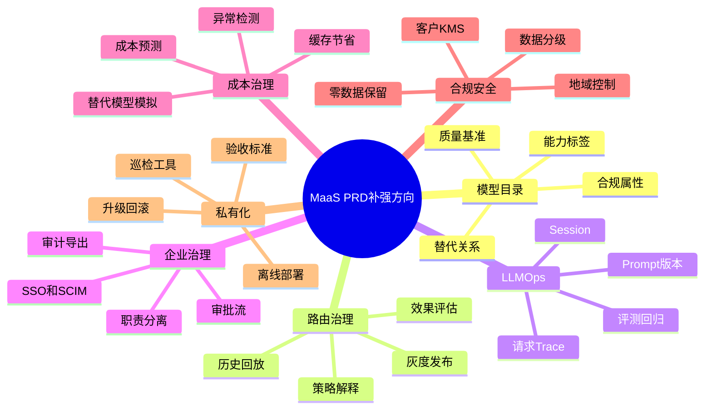

---

## 18. 产品路线建议

### 18.1 近期版本建议

近期应优先补齐会直接影响MVP可信度的能力。第一，完善模型目录主数据，不要让模型管理停留在名称、价格和状态。第二，完善路由解释和fallback链可视化，让智能路由可被客户理解。第三，建设请求级Trace详情页，把路由、模型、成本、缓存、错误和审计串起来。第四，补充供应商Key池额度预警和健康评分，避免上游风险变成客户故障。第五，完成成本节省报表，尤其是语义缓存节省和替代模型建议。

### 18.2 中期版本建议

中期应强化企业治理和LLMOps。包括Prompt实验中心、评测回归、策略审批、预算审批、Policy as Code、内容安全策略、质量成本联合分析、异常聚类、数据导出、SSO/SCIM、审计报表和合规模板。这一阶段的目标是让MaaS从“接入平台”升级为“企业AI工程工作台”。

### 18.3 长期版本建议

长期应建设混合云和生态能力。包括私有化标准交付、一体机方案、混合云路由、客户自带KMS、离线升级、开发者CLI、Terraform Provider、Helm Chart、Agent Trace、MCP工具生态、行业模板和供应商市场。目标是让MaaS成为企业内部统一模型运营层，而不是某个项目的API代理。

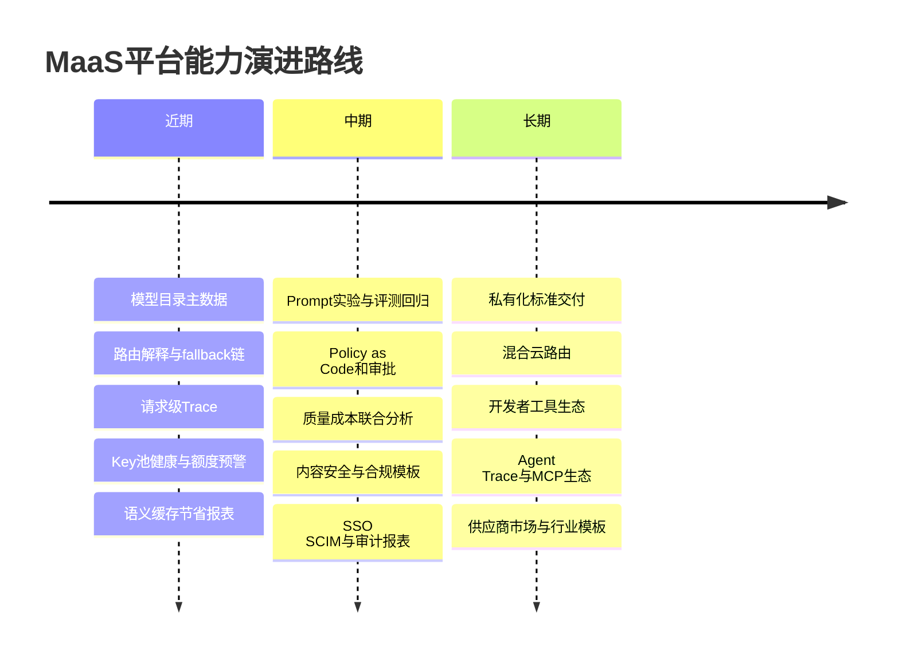

---

## 19. 面向团队学习的结论

对产品团队来说，25家竞品说明MaaS不是一个单点功能产品，而是一个跨模型、跨供应商、跨组织、跨成本中心的运营系统。PRD要从页面和功能列表升级为可验收的业务闭环，特别是路由、观测、成本、合规和供应商治理。

对研发团队来说，MaaS的复杂性不在转发请求，而在元数据、策略、状态和可观测。模型、供应商、价格、合同、预算、合规、路由、缓存和Trace之间会形成复杂依赖。架构上要避免把路由逻辑写死在网关里，而应形成策略引擎、元数据服务、观测数据和计费系统的清晰边界。

对测试团队来说，测试重点不能只覆盖接口成功返回。需要构建协议兼容测试、路由策略测试、fallback测试、计费准确性测试、权限审计测试、合规策略测试、Prompt评测回归和灾备演练测试。每个上游供应商都可能出现不同错误行为，测试体系必须模拟限流、超时、价格变化、模型下线、Key耗尽和响应格式异常。

对运维团队来说，MaaS的生产风险来自两端：一端是平台自身网关、数据库、缓存、消息队列和计费链路；另一端是外部供应商API、网络、额度、价格和质量波动。运维不仅要监控平台组件，还要监控供应商健康、模型延迟、fallback频率、错误类型、预算消耗和客户SLA。

对销售和解决方案团队来说，不同竞品要用不同打法。面对云厂商，要强调跨云中立和国内私有化；面对硅基流动，要强调上层治理和多供应商；面对LiteLLM和One API，要强调免运维、审计、SLA和企业流程；面对Helicone，要补齐观测叙事，强调国内合规和预算审批；面对轻量代理，要强调正规供应商、稳定性和审计。

---

## 20. 最终判断

25家竞品共同指向一个结论：模型入口会越来越普通，模型运营会越来越重要。OpenAI兼容、多模型聚合和基础路由已经是市场默认能力，不能作为MaaS的长期差异化。真正的差异化来自“企业如何放心地把所有AI调用交给这个平台”。这需要MaaS同时具备可解释路由、可审计计费、可追踪请求、可治理策略、可验证合规、可演练容灾、可优化成本和可扩展生态。

当前MaaS平台的基础方向是对的，尤其是三层模型架构、智能路由、语义缓存、计量计费和企业合同定价，这些能力已经超过多数轻量代理和简单聚合工具。但如果要和云厂商、Portkey、Helicone、LiteLLM、硅基流动、OfoxAI、ZenMux等竞品长期竞争，必须尽快把PRD从MVP功能描述升级为企业级运营闭环描述。

优先级最高的补强项应是：请求级Trace与LLMOps、路由策略生命周期、供应商治理中心、成本优化闭环、合规策略产品化、Prompt实验评测、容灾演练与SLA报告。这些能力一旦补齐，MaaS就不只是“能接很多模型的平台”，而是企业内部AI生产系统的控制层。

---

## 21. 附：建议补充到PRD的需求清单

### 21.1 P0建议

1. 请求级Trace详情页：展示租户、项目、Key、模型、供应商、路由策略、fallback、token、成本、缓存、延迟、错误和审计信息。
2. 路由解释：每次请求记录命中策略、候选模型、评分、排除原因和最终选择原因。
3. fallback链配置：支持模型级、供应商级、Key级和区域级fallback，并记录切换原因。
4. 供应商健康评分：综合错误率、延迟、限流、quota、成本和事故记录。
5. 语义缓存节省报表：展示命中率、节省token、节省金额、命中项目和可优化建议。
6. 成本异常检测：识别token暴涨、单请求异常、模型价格异常、负毛利和预算耗尽风险。
7. 模型能力标签：为模型配置上下文、模态、工具调用、Embedding、Rerank、图像、语音、合规和区域标签。
8. 审计日志增强：覆盖策略、价格、模型、供应商、Key、预算和权限变更。

### 21.2 P1建议

1. 策略仿真：用历史流量模拟新策略的成本、延迟、成功率和模型分布。
2. 策略灰度：按租户、项目、Key或流量比例发布路由策略。
3. Prompt版本管理：支持变量、版本、审批、回滚和关联Trace。
4. 评测回归：支持评测集、指标、模型对比、上线门禁和报告。
5. Policy as Code：覆盖路由、预算、内容安全和合规策略。
6. SSO与SCIM：支持企业身份系统和自动用户同步。
7. 合规策略中心：支持数据分级、地域限制、零数据保留、脱敏和模型白名单。
8. 供应商准入流程：记录官方通道、合同、SLA、合规材料和结算方式。

### 21.3 P2建议

1. 私有化标准交付包：支持离线部署、升级回滚、巡检和验收。
2. 混合云路由：支持公有云、私有化模型和本地模型统一逻辑模型。
3. 开发者CLI：支持Key管理、模型测试、策略模拟和日志查询。
4. Terraform Provider和Helm Chart：服务平台工程团队。
5. Agent Trace：支持工具调用、RAG上下文、Memory和多步骤任务追踪。
6. 行业模板：提供客服、合同审查、代码助手、知识库问答等模板。
7. 状态页与SLA报告：对客户展示服务状态、事故和可用性。
8. 供应商市场：面向模型供应商开放入驻、测试、定价和上架流程。

---

## 22. 附：能力成熟度总览图

```mermaid
flowchart TD
    A[企业级MaaS成熟度] --> B[入口层]
    A --> C[路由层]
    A --> D[治理层]
    A --> E[观测层]
    A --> F[商业层]
    A --> G[合规层]
    A --> H[生态层]

    B --> B1[OpenAI兼容]
    B --> B2[多协议兼容]
    B --> B3[SDK和CLI]

    C --> C1[静态映射]
    C --> C2[健康感知]
    C --> C3[多目标优化]
    C --> C4[策略生命周期]

    D --> D1[RBAC]
    D --> D2[审批]
    D --> D3[Policy as Code]
    D --> D4[审计]

    E --> E1[Metrics]
    E --> E2[Trace]
    E --> E3[Session]
    E --> E4[Prompt实验]

    F --> F1[计量]
    F --> F2[账单]
    F --> F3[预算]
    F --> F4[成本优化]

    G --> G1[数据分级]
    G --> G2[地域控制]
    G --> G3[零数据保留]
    G --> G4[合规报告]

    H --> H1[模型广场]
    H --> H2[模板]
    H --> H3[Agent工具]
    H --> H4[供应商市场]
```

---

## 23. 附：一句话竞争策略

面对阿里云百炼：不争阿里云生态，争跨云中立控制面。

面对AWS、Azure、Google：不争全球云基础设施，争国内合规、混合云和多供应商统一治理。

面对硅基流动：既接入其低成本推理，又在上层做预算、审计、路由和供应商治理。

面对智谱和Kimi：把它们作为高价值模型接入，用fallback和成本治理降低单模型依赖。

面对One API和new-api：用同样低的接入门槛，加上企业治理、SLA和免运维形成差异。

面对LiteLLM：承认其工程能力强，用可视化、合规、账单、审批、私有化交付和运营支持赢企业客户。

面对Portkey：学习策略控制面，用国内合规、供应商运营和合同计费做差异。

面对Helicone：补齐请求级Trace和LLMOps，同时强调MaaS是完整业务平台而非单纯观测工具。

面对OfoxAI、ZenMux、api2D、EasyRouter类产品：在托管体验、官方上游、低门槛上不落后，在企业治理上明显领先。

面对Grok2API、Quotio、UniAPI、Sub2API等轻量工具：不把它们当企业竞品，但把它们当开发者体验底线。

---

## 24. 结语

这25家竞品给MaaS平台最大的提醒是：市场不会只按“功能完整度”选择产品。开发者会选择简单，平台工程团队会选择可控，财务会选择可解释成本，安全会选择可审计，业务会选择快，管理层会选择风险低。MaaS平台要同时让这些角色都觉得自己被照顾到。

因此，下一版PRD应围绕“企业模型运营控制面”重写关键章节，把功能点升级为闭环能力，把页面升级为业务流程，把监控升级为LLMOps，把路由升级为策略治理，把计费升级为FinOps，把合规升级为可执行策略，把供应商接入升级为供应商治理。这样，MaaS才能在云厂商、模型平台、开源网关、托管Gateway和轻量代理之间形成清晰且持久的位置。
