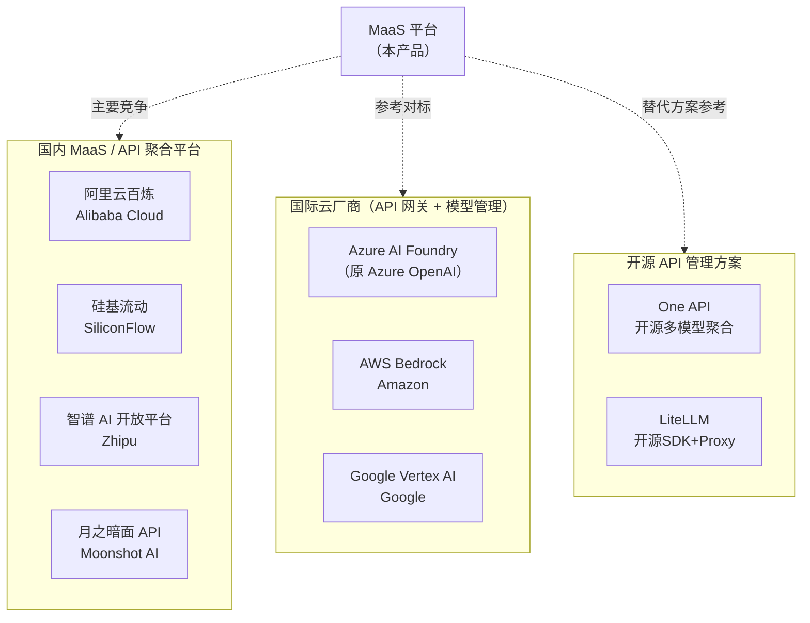
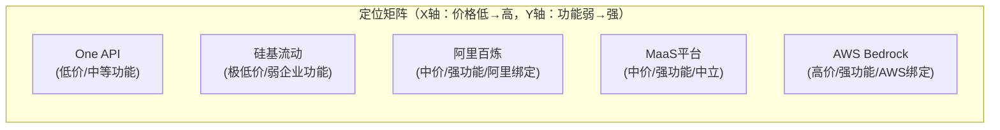

# 竞品分析文档

**文档版本：** V1.0  
**编写日期：** 2026年05月14日  
**用途：** 产品定位参考 + 差异化竞争策略制定  
**负责人：** 产品负责人

---

## 1. 竞品概览

### 1.1 竞品范围

---

## 2. 功能对比矩阵

### 2.1 核心功能对比

| 功能维度 | MaaS平台 | 阿里百炼 | 硅基流动 | One API | AWS Bedrock |
|---------|---------|---------|---------|---------|------------|
| **OpenAI 兼容 API** | ✅ 完整 | ✅ 完整 | ✅ 完整 | ✅ 完整 | ⚠️ 部分 |
| **多厂商聚合** | ✅ 6+ 厂商 | ⚠️ 主要阿里系 | ✅ 30+ 模型 | ✅ 30+ 模型 | ✅ AWS 系 |
| **智能路由（Failover）** | ✅ 多维评分 | ⚠️ 基础 | ⚠️ 基础 | ⚠️ 基础轮询 | ✅ 内置HA |
| **语义缓存** | ✅ L1+L2 向量 | ❌ | ❌ | ❌ | ❌ |
| **模型精调（Fine-tune）** | ✅ LoRA/SFT | ✅ | ⚠️ 有限 | ❌ | ✅ |
| **自托管模型** | ✅ vLLM/TGI | ✅ | ❌ | ✅ | ⚠️ 部分 |
| **企业级 RBAC** | ✅ 4角色 Casbin | ✅ | ❌ | ⚠️ 基础 | ✅ IAM |
| **多租户 SaaS** | ✅ 完整 | ✅ | ❌ 单租户 | ⚠️ 有限 | ✅ |
| **详细账单** | ✅ Token 粒度 | ✅ | ✅ | ⚠️ 基础 | ✅ |
| **AI Copilot** | ✅ 内置 | ❌ | ❌ | ❌ | ❌ |
| **国产模型优先** | ✅ | ✅ 阿里系 | ✅ | ✅ | ❌ |
| **等保合规** | ✅ | ✅ | ⚠️ 有限 | ❌ | ❌ |
| **私有化部署** | ✅ | ⚠️ 专有云 | ❌ | ✅ 开源 | ❌ |

### 2.2 定价模式对比

| 产品 | 定价模式 | 定价透明度 | 最低消费 |
|------|---------|----------|---------|
| **MaaS 平台** | 按 token 用量计费，阶梯定价，无最低消费 | 高（控制台实时展示） | 无 |
| 阿里百炼 | 按模型按 token 计费 | 高 | 无 |
| 硅基流动 | 按 token 计费（价格更低） | 高 | 无 |
| One API | 开源免费 + 自行承担厂商费用 | N/A（自建） | N/A |
| AWS Bedrock | 按 token + 推理时长（复杂） | 中 | 无 |

---

## 3. 深度竞品分析

### 3.1 阿里云百炼

**产品定位：** 阿里云旗下 MaaS 平台，主要推自家通义系列模型

| 维度 | 百炼 | MaaS 平台 |
|------|------|---------|
| 模型覆盖 | 通义系列 + 少量第三方 | 全主流厂商 6+ |
| 路由策略 | 简单，主推通义 | 多维评分，真正中立 |
| 精调能力 | 强（深度集成阿里基础设施） | 强（支持A100+昇腾） |
| 企业功能 | 完整 | 完整 |
| 数据主权 | 数据留在阿里云 | 私有化可部署 |
| 海外模型（GPT/Claude） | 需走特殊通道 | 直接支持 |

**我方优势：** 真正中立的多厂商路由，私有化部署，海外模型无缝接入  
**对方优势：** 与阿里云生态深度集成，通义模型性价比高

---

### 3.2 硅基流动（SiliconFlow）

**产品定位：** 国内新兴 MaaS 平台，专注高性价比推理 API

| 维度 | 硅基流动 | MaaS 平台 |
|------|---------|---------|
| 价格 | 极低（主要卖点） | 中等（聚合溢价） |
| 模型数量 | 30+ 开源模型 | 6 主流厂商闭源+开源 |
| 企业功能 | 弱（偏个人/小团队） | 强（多租户、RBAC、账单） |
| SLA | 无明确承诺 | 99.9%（专业版） |
| 语义缓存 | ❌ | ✅ |
| 私有化 | ❌ | ✅ |

**我方优势：** 企业级功能完整，有明确 SLA，私有化支持，语义缓存降本  
**对方优势：** 价格极低，适合个人开发者和预算敏感客户  
**应对策略：** 差异化打企业客户，强调合规、SLA、成本管控工具

---

### 3.3 One API（开源）

**产品定位：** 开源的多模型聚合 Proxy，自建成本低

| 维度 | One API | MaaS 平台 |
|------|---------|---------|
| 成本 | 开源免费（需自行运维） | 商业 SaaS 收费 |
| 运维要求 | 高（需自建+维护） | 低（托管服务） |
| 功能完整度 | 中等（社区维护） | 高（产品化） |
| 语义缓存 | ❌ | ✅ |
| 智能路由 | ⚠️ 基础 | ✅ 多维算法 |
| 企业合规 | ❌ | ✅ 等保2.0 |
| AI Copilot | ❌ | ✅ |

**我方优势：** 免运维、AI-Native 功能、合规支持、SLA 保障  
**对方优势：** 免费、数据完全自控  
**应对策略：** 提供私有化部署版本，满足数据自控诉求，同时保留 SaaS 便利性

---

### 3.4 AWS Bedrock

**产品定位：** AWS 托管的基础模型 API 服务，绑定 AWS 生态

| 维度 | AWS Bedrock | MaaS 平台 |
|------|------------|---------|
| 模型覆盖 | 主流国际模型（无国内模型） | 国内外均支持 |
| 国内可用性 | ❌ 中国区极有限 | ✅ 国内优先 |
| 与云生态绑定 | 深度 AWS 绑定 | 云无关 |
| 定价 | 较高 | 中等 |
| 精调 | ✅ | ✅ |
| 数据主权（国内合规） | ⚠️ 复杂 | ✅ 国内合规 |

**我方优势：** 国内合规、支持国产模型、无云厂商绑定  
**应对策略：** 主打国内市场，对选型纠结于国内/国际模型的客户，我方是唯一都能支持的选择

---

## 4. 差异化定位

**核心差异化价值主张：**

> "中立的企业级 AI 基础设施：支持全主流模型，真正智能的路由降本，无云厂商绑定，满足国内合规要求"

| 差异化维度 | 我方优势 | 目标客户 |
|-----------|---------|---------|
| **中立聚合** | 不偏向任何厂商，用最优路由为客户降本 | 多模型混用的技术团队 |
| **AI-Native 体验** | 内置 Copilot 助手，意图感知路由 | 重视 AI 研发效率的团队 |
| **国内合规** | 等保2.0 + 数据不出境选项 | 金融、政务、医疗等合规敏感行业 |
| **私有化支持** | 完整私有化版本 | 数据安全要求极高的大型企业 |
| **精调一体化** | API + 精调 + 推理全链路 | 有定制模型需求的企业 |

---

## 5. 竞争策略建议

### 5.1 销售策略

| 客户类型 | 主要竞争对手 | 销售话术重点 |
|---------|------------|------------|
| 初创/中小企业 | 硅基流动 | 语义缓存可降低 40% 成本；SLA 保障不停服 |
| 中大型技术公司 | 阿里百炼 | 中立路由无绑定；海外模型支持；私有化选项 |
| 金融/政务客户 | AWS Bedrock | 国内等保合规；数据不出境；私有化部署 |
| 有自建能力的团队 | One API | 免运维托管；AI-Native 功能；官方 SLA |

### 5.2 功能路线图优先级（竞争驱动）

| 功能 | 竞争压力来源 | 优先级 |
|------|------------|--------|
| 更多模型接入（Gemini、Llama 3 等） | 硅基流动模型丰富度 | 高 |
| 成本分析看板 + 降本建议 | 无竞品有此功能（差异化机会） | 高 |
| 企业私有化一键部署包 | One API 开源竞争 | 中 |
| 更细粒度的项目/团队管理 | AWS Bedrock IAM | 中 |

---

## 6. 信息来源与更新说明

| 竞品 | 信息截止日期 | 信息来源 |
|------|------------|---------|
| 阿里百炼 | 2026-05 | 官网 + 内部测试 |
| 硅基流动 | 2026-05 | 官网 + 开发者社区 |
| One API | 2026-05 | GitHub 仓库 |
| AWS Bedrock | 2026-05 | 官方文档 |

> ⚠️ AI 领域竞争格局变化极快，建议每季度更新一次本文档

---

**变更历史**

| 版本 | 日期 | 说明 | 修改人 |
|------|------|------|--------|
| V1.0 | 2026-05-14 | 初稿 | 产品负责人 |
