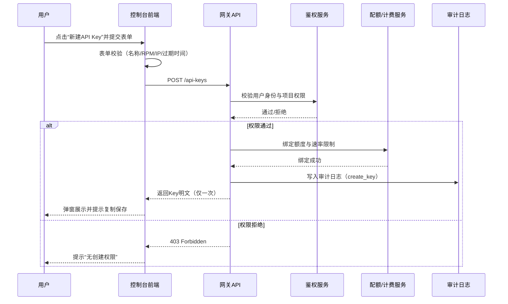
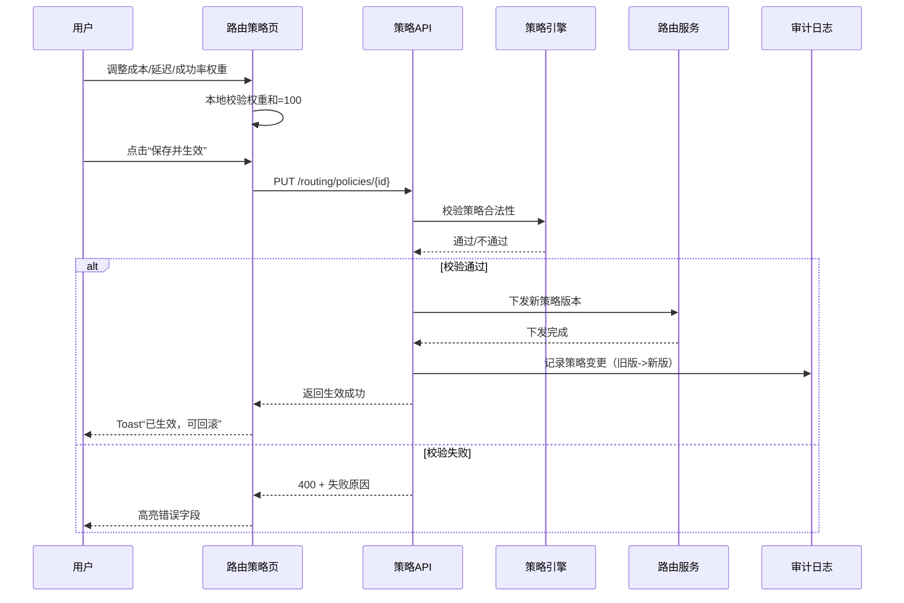
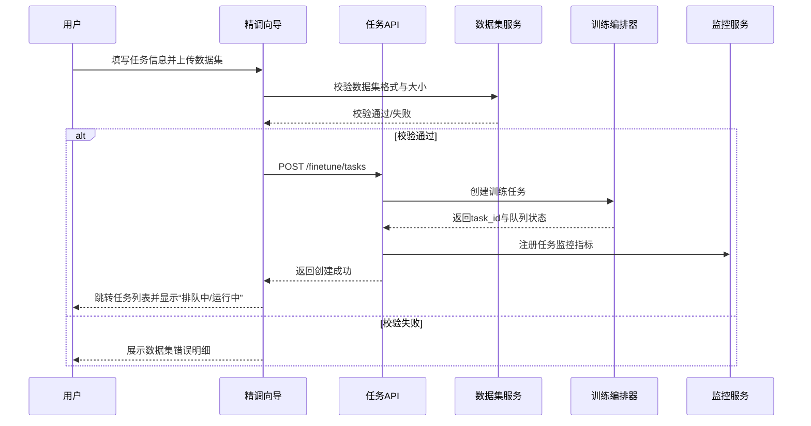
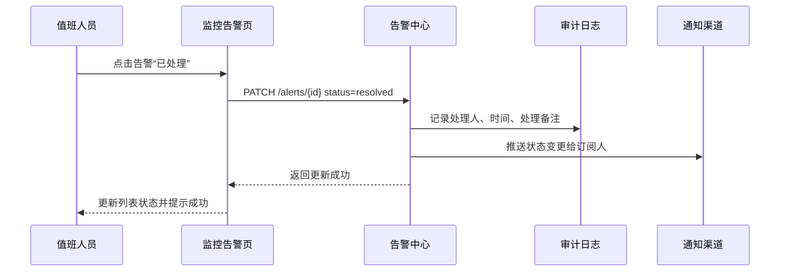
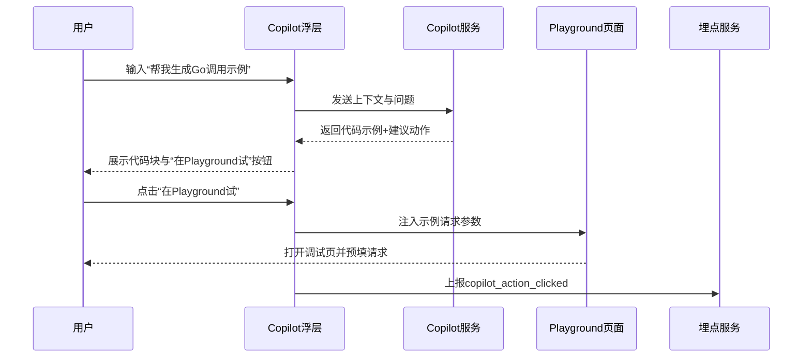
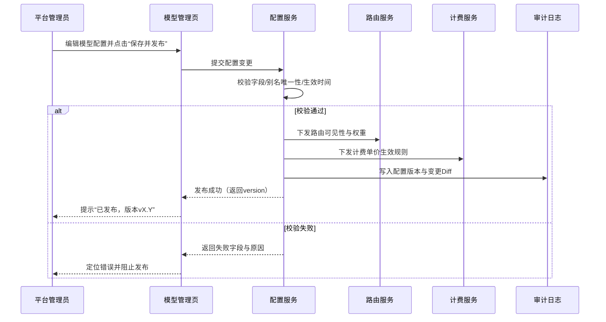

# MaaS平台 Console 原型设计文档

**文档版本：** V2.7  
**编写日期：** 2026年05月15日  
**最后更新：** 2026年05月20日  
**本文范围：** 开发者控制台 / 租户控制台页面原型 + 交互说明  
**来源：** 由 产品设计/原型设计文档.md 按端拆分而来  
**密级：** 内部

---

## 0. 原型线稿审核规则

> 本节定义本文档的持续审核标准。每次新增或修改线稿后，**须依据以下规则自检**，确保原型线稿与产品需求对齐、逻辑完整、无操作死路。规则体系与 `admin-原型设计文档.md §0` 保持一致，以下针对 Console 端的特定场景做了适配说明。

### R1 — 页面覆盖率

**规则：** 信息架构（§1）中 Console 域（`UserArea`）的每个菜单叶节点，必须有对应的独立页面线框或独立 Tab 面板。  
**判断方式：** 逐一对照 §1 IA 图中 `UserArea` 节点，检查 §3~§10.5 是否均有主线框。  
**豁免：** 纯跳转中间页（如面包屑跳转）和登录/注册流程（作为初始页面处理）无需独立线框，但须标注目标页面。

### R2 — 按钮闭环

**规则：** 页面线框中出现的每个可点击元素（按钮、操作列、Tab、链接），必须满足以下之一：
- 在当前页面或下方有对应的弹窗/抽屉/内联表单线框；
- 有明确的跳转注解（`→ 跳转至 §xx.x`）；
- 有明确的状态变化描述（`→ 按钮变为 loading → Toast 成功`）。

**Console 特殊约束：**
- 模型广场中的「接入」按钮须有 Code Snippet 交互（直接跳转抽屉的使用示例 Tab）；
- Playground 的「发送」按钮须定义加载态（Spinner + 流式输出动效）；
- 账单页面各 Tab 切换须有当前月份选择器的联动规则（已结算 vs 实时数据状态区分）。

### R3 — 表单完整性

**规则：** 每个新建/编辑表单须定义：
1. 所有字段列表（字段名、必填/选填、类型）；
2. 字段格式约束与错误提示文案；
3. 提交成功的反馈（Toast / 状态更新 / 页面刷新）；
4. 提交失败的反馈（错误高亮字段 / 全局错误提示）。

**Console 特殊约束：**
- 新建 API Key 表单须包含「Key 创建成功一次性展示」弹窗的完整设计（含复制、确认已保存两步）；
- 精调任务表单须说明文件格式校验失败的具体提示文案；
- 项目预算配置须明确超预算动作（仅告警 / 限流 + 审批 / 立即阻断）三种状态的 UI 差异。

### R4 — 弹窗/抽屉生命周期

**规则：** 每个弹窗/抽屉须定义：
1. **触发源**（点击哪个按钮/操作触发）；
2. **内容字段**（线框展示）；
3. **操作按钮**（含主操作和取消/关闭）；
4. **结果反馈**（成功/失败/部分成功的 UI 变化）；
5. **关闭行为**（点击遮罩/ESC 是否关闭，是否有未保存确认提示）。

**Console 特殊约束：**
- 邀请成员弹窗须包含邮件格式校验与成功反馈（Toast + 成员列表局部刷新）；
- 新建告警规则弹窗须在提交后重置所有字段，避免下次打开时残留数据。

### R5 — 状态覆盖

**规则：** 关键列表页和详情页须覆盖以下状态：
- **Loading**：骨架屏或 Spinner；
- **Empty**：零数据引导提示；
- **Error**：接口失败的重试入口；
- **正常态**：有数据的主线框。

**Console 特殊约束：**
- 项目列表须有空项目引导（新用户 onboarding 路径）；
- 精调任务列表须覆盖「全部任务均已完成」的空排队态。

### R6 — 业务规则可见性

**规则：** 关键业务约束须在对应线框的字段或校验说明中**明确体现**，不能仅在文字说明中描述。  
**Console 典型约束：**
- API Key 级 RPM/TPM 必须 ≤ 项目级，字段下方须有提示文案并在提交时校验；
- 项目月预算不可低于当月已消耗量；
- 权限范围（scope）至少选择 1 项；
- 告警阈值须为正数；
- 精调任务 Epochs 上限 20，Learning Rate 格式需校验。

### R7 — 跨模块导航

**规则：** 任何"跳转到另一个模块"的操作，须明确标注：
- 目标页面（§xx.x）；
- 目标 Tab（如有）；
- 预选/预过滤状态（如"在 Playground 加载此模型"）。

**Console 典型跨模块路径：**
- 概览 → 快捷入口 → API Keys / Playground / 账单 / Copilot；
- 模型广场详情抽屉 → Playground 试用；
- 项目设置成员页 → 团队管理；
- 精调模型 → Playground 试用 / API 详情。

### R8 — 危险操作二次确认

**规则：** 以下类型操作**必须**有二次确认弹窗（不可使用浏览器原生 `confirm()`，需使用平台样式弹窗），且弹窗须展示影响范围：
- 删除（项目、API Key、路由策略、用户组、成员移除等不可逆删除）；
- 停止/取消（精调任务停止/排队取消会导致 GPU 资源释放）；
- 发布（Prompt 发布为生产版本、Policy 灰度发布会影响线上流量）。

---

## 0A. 原型线稿审核报告（V2.6）

> **审核时间：** 2026-05-19  **审核版本：** V2.6  **审核规则：** §0 R1~R8

### 审核结论

| 规则 | 状态 | 说明 |
|------|------|------|
| R1 页面覆盖率 | ✅ 通过 | 全部 17 个 sidebar 叶节点均有对应 section，含 login、dashboard、apikey、models、**projects（卡片网格视图 + 新建Modal）**、billing（4 Tab）、alerts、contract、playground、finetune（3 Tab）、monitoring、**team（3 Tab：成员管理/用户组/项目权限）**、prompt-lab（3 Tab）、**policy（5 Tab：路由策略图形化/规则路由/预算策略/内容安全策略/策略审批跳转）**、**approval-center（3 Tab：待审批/审批历史/审批配置）**；侧边栏重组为5组：基础/开发接入/监控与账单/实验与优化/管理与治理 |
| R2 按钮闭环 | ✅ 通过 | G-01~G-05、新建项目 Modal、用户组管理 Modal 均有对应弹窗/交互 |
| R3 表单完整性 | ✅ 通过 | 新建项目表单（Modal）含项目名、环境、路由策略、月预算四字段，含格式校验与成功 Toast |
| R4 弹窗生命周期 | ✅ 通过 | 新增三个 Modal：新建项目、新建用户组、管理组成员，均有触发源、字段、操作按钮、结果反馈 |
| R5 状态覆盖 | ✅ 通过 | 项目管理页新增空项目引导状态（卡片网格/空态切换演示按钮）；已修复 V2.5 遗留问题 |
| R6 业务规则可见性 | ✅ 通过 | 项目权限 Tab 说明文字已更新为「个人直接授权优先覆盖用户组授权（无论高低）」 |
| R7 跨模块导航 | ✅ 通过 | 项目卡片「设置」跳转 project-settings，「API Keys」跳转 apikey |
| R8 危险操作确认 | ✅ 通过 | 删除项目、删除用户组均接入通用确认弹窗，展示影响范围 |

### 缺口清单（V2.6 本轮新增修复）

| 编号 | 位置 | 缺失内容 | 规则 | 优先级 | 状态 |
|------|------|----------|------|--------|------|
| G-01 | API Keys 页 `批量轮换` | 点击后无任何交互 | R2 | P2 | ✅ 已修复 |
| G-02 | API Keys 表格 `编辑` | 无弹窗/表单 | R2 | P2 | ✅ 已修复 |
| G-03 | 项目管理表格 | 行级无操作列 | R2 | P2 | ✅ 已修复 |
| G-04 | 路由策略 `删除` | 无确认弹窗 | R2/R8 | P1 | ✅ 已修复 |
| G-05 | 告警规则 `新建` | 弹窗缺告警指标类型 | R3 | P2 | ✅ 已修复 |
| G-06 | 告警规则弹窗 | `alertForm.reset()` JS 异常 | R4 | P1 | ✅ 已修复 |
| G-07~G-12 | 精调/团队/项目设置 | 危险操作无确认弹窗 | R8 | P1 | ✅ 已修复 |
| **G-13** | **项目管理页** | **左右分栏布局割裂，创建表单常驻右侧不合理** | **R4** | **P2** | **✅ 已修复（V2.6）：改为卡片网格 + 新建 Modal** |
| **G-14** | **团队管理** | **无用户组管理 Tab，只能查看无法操作** | **R2** | **P2** | **✅ 已修复（V2.6）：新增用户组 Tab，含卡片视图、管理成员 Modal、新建用户组 Modal** |
| **G-15** | **团队管理** | **权限叠加规则"就高原则"与 SCIM 场景冲突** | **R6** | **P1** | **✅ 已修复（V2.6）：改为"个人直接授权优先覆盖用户组授权（无论高低）"** |

> ✅ = 已修复  ⚠ = 待补充  ❌ = 未覆盖

---

## 目录

- [1. 信息架构（IA）](#1-信息架构)
- [2. 整体导航结构](#2-整体导航结构)
- [3. 页面1：登录 / 首页概览](#3-页面1登录--首页概览)
- [4. 页面2：API Key 管理](#4-页面2api-key-管理)
- [5. 页面3：模型广场](#5-页面3模型广场)
- [5.5 Playground（在线调试）](#55-playground在线调试)
- [6. 页面4：使用统计 & 账单](#6-页面4使用统计--账单)
- [6.5 合同管理（企业租户）](#65-合同管理企业租户)
- [7. 页面5：路由策略配置](#7-页面5路由策略配置)
- [8. 页面6：精调任务管理](#8-页面6精调任务管理)
- [9. 页面7：监控告警中心](#9-页面7监控告警中心)
- [10. 页面8：MaaS Copilot 浮层](#10-页面8maas-copilot-浮层)
- [10.0 页面：项目管理](#100-页面项目管理)（含卡片网格视图 / 新建项目 Modal / 空状态）
- [10.1 页面8.1：项目设置](#101-页面81项目设置)
- [10.2 页面8.2：团队与成员管理](#102-页面82团队与成员管理)（含 10.2.0 单页树形目录 / 10.2.1 左侧组织树 / 10.2.2 右侧目录详情 / 10.2.3 角色边界与跳转）
- [10.3 Prompt 实验中心](#103-prompt-实验中心)
- [10.4 策略中心（Policy as Code）](#104-策略中心policy-as-code)（路由策略图形化 / 规则路由含双模式新建抽屉 / 预算策略抽屉 / 内容安全抽屉 / 策略审批→跳转入口）
- [10.5 统一审批中心](#105-统一审批中心)（预算超限 + 策略变更 + 内容安全，含类型筛选 + 审批配置）
- [11. Console 重点交互补充](#11-console-重点交互补充)
- [12. 响应式设计规范](共享规范文档.md#12-响应式设计规范)
- [13. 设计系统规范](共享规范文档.md#13-设计系统规范)
- [14. 原型范围补充与交付边界](共享规范文档.md#14-原型范围补充与交付边界)
- [15. 关键用户旅程与任务流](共享规范文档.md#15-关键用户旅程与任务流)
- [16. 页面状态矩阵](#16-页面状态矩阵)
- [17. 表单字段与校验规则](#17-表单字段与校验规则)
- [18. 交互事件与埋点映射](#18-交互事件与埋点映射)
- [19. 页面级验收清单](#19-页面级验收清单)
- [20. 页面级交互时序图](#20-页面级交互时序图)
- [21. 变更历史](#21-变更历史)

---
## 1. 信息架构

```mermaid
graph TD
    Root["MaaS 平台控制台"]

    Root --> GuestArea["未登录区域"]
    Root --> UserArea["已登录 - 开发者控制台"]
    Root --> AdminArea["已登录 - 平台管理后台"]

    GuestArea --> Login["登录页\n账密 / SSO / 扫码"]
    GuestArea --> Register["注册页\n邮箱注册 / 企业认证"]

    UserArea --> Overview["首页 - 项目概览"]
    UserArea --> ApiKeys["API Keys\n创建/管理/权限"]
    UserArea --> ModelMarket["模型广场\n浏览/对比/收藏"]
    UserArea --> Playground["Playground\n在线调试"]
    UserArea --> Usage["用量 & 账单\n统计/报表/导出"]
    UserArea --> Contract["合同管理\n折扣查询/到期提醒"]
    UserArea --> Routing["路由策略\n规则配置/灰度"]
    UserArea --> Finetune["精调中心\n任务/数据集/模型"]
    UserArea --> Copilot["MaaS Copilot\n浮窗助手"]
    UserArea --> Settings["项目设置\n预算/成员/通知"]
    UserArea --> TeamMgmt["团队管理\n成员/用户组/权限矩阵"]

    AdminArea --> TenantMgmt["租户管理"]
    AdminArea --> ModelMgmt["模型管理\n上线/下线/定价"]
    AdminArea --> VendorMgmt["厂商管理\n密钥/模型目录/健康"]
    AdminArea --> GlobalMonitor["全局监控"]
    AdminArea --> BillingAdmin["账单管理\n总账视图/租户分账/对账差异/出账记录"]
    AdminArea --> ContractAdmin["商业管理\n合同/折扣/分层定价"]
```



---

## 2. 整体导航结构

```
┌─────────────────────────────────────────────────────────────┐
│  ⚡ MaaS Console          [≡ 折叠]              🔔 ? 👤      │  ← 顶栏
├──────────────┬──────────────────────────────────────────────┤
│              │                                              │
│  ── 基础 ──  │                                              │
│  📊 概览     │                                              │
│              │                                              │
│  ─ 开发接入 ─│                                              │
│  🤖 模型广场 │          主内容区域                           │
│  📁 项目管理 │                                              │
│  🔑 API Keys │                                              │
│              │                                              │
│  ─监控与账单─│                                              │
│  📡 监控告警 │                                              │
│  📈 用量账单 │                                              │
│  ✅ 审批中心 🔴4                                             │
│              │                                              │
│  ─实验与优化─│                                              │
│  ▶ Playground│                                              │
│  ⚗️ Prompt实验│                                             │
│  🔧 精调中心 │                                              │
│              │                                              │
│  ─管理与治理─│                                              │
│  🔀 策略中心 │                                              │
│  🔔 告警设置 │                                              │
│  👥 团队成员 │                                              │
│  📄 合同管理 │                                              │
│              │                                              │
└──────────────┴──────────────────────────────────────────────┘
                                                    [💬 Copilot 悬浮按钮]
```

**侧边栏分组设计原则：**

| 分组 | 定位 | 包含页面 | 目标用户 |
|------|------|---------|---------|
| **基础** | 全局入口 | 概览 | 所有人，每日打开 |
| **开发接入** | 新用户核心路径（顺序即引导） | 模型广场 → 项目管理 → API Keys | Developer |
| **监控与账单** | 日常高频查看 | 监控告警、用量账单、审批中心 | Owner / Admin |
| **实验与优化** | 中频工具 | Playground、Prompt 实验室、精调中心 | Developer / ML |
| **管理与治理** | 低频配置 | 策略中心、告警设置、团队成员、合同管理 | Admin |

> 审批中心带红色数字 badge，放在「监控与账单」组确保首屏可见，不被「高级」组遮蔽。

---

## 3. 页面1：登录 / 首页概览

### 3.1 登录页线框图

```
┌──────────────────────────────────────────┐
│                                          │
│            🔵 MaaS Platform             │
│         大模型聚合与调度平台              │
│                                          │
│  ┌──────────────────────────────────┐   │
│  │  邮箱 / 用户名                    │   │
│  └──────────────────────────────────┘   │
│  ┌──────────────────────────────────┐   │
│  │  密码                        👁   │   │
│  └──────────────────────────────────┘   │
│                                          │
│  ☑ 记住我              忘记密码？        │
│                                          │
│  ┌──────────────────────────────────┐   │
│  │          登 录                    │   │  ← Primary Button
│  └──────────────────────────────────┘   │
│                                          │
│  ──────────── 或 ──────────────         │
│                                          │
│  [  钉钉 SSO 登录  ]  [  企业 SSO  ]    │
│                                          │
│  没有账号？申请企业开通                   │
└──────────────────────────────────────────┘
```

### 3.2 首页概览线框图

```
┌─────────────────────────────────────────────────────────────────┐
│ 📊 项目概览  my-app-prod                   今日 | 本周 | 本月 ▾  │
├────────────┬────────────┬────────────┬────────────────────────────┤
│ 今日请求量  │ 成功率      │ P95 延迟   │ 今日费用                   │
│ 128,430    │ 99.2%      │ 842ms      │ ¥ 36.72                   │
│ ↑12% 昨日  │ ↓0.3%      │ ↑80ms      │ ↑8% 昨日                  │
├────────────┴────────────┴────────────┴────────────────────────────┤
│                                                                   │
│  📈 请求量趋势（24小时）                  🥧 模型用量分布           │
│  ┌─────────────────────────────────┐   ┌────────────────────┐   │
│  │     /\  /\    /\               │   │  GPT-4o    45%  🔵  │   │
│  │    /  \/  \  /  \    /\       │   │  Qwen-Turbo 30% 🟢  │   │
│  │   /        \/    \  /  \      │   │  Claude    15%  🟣  │   │
│  │  /              \ /    \     │   │  其他       10%  ⚫  │   │
│  └─────────────────────────────────┘   └────────────────────┘   │
│  00:00      06:00      12:00     18:00                           │
│                                                                   │
├──────────────────────────────┬────────────────────────────────────┤
│  🔑 API Keys 状态            │  ⚡ 快捷入口                        │
│  ● active: 3                 │  [+ 新建 API Key]                  │
│  ○ disabled: 1               │  [🧪 打开 Playground]              │
│  近7天新增调用: sk-xxx...    │  [📊 查看本月账单]                  │
│  [查看全部]                  │  [💬 问 Copilot]                   │
├──────────────────────────────┼────────────────────────────────────┤
│  🚨 近期告警（2条）           │  💡 Copilot 建议                   │
│  ⚠ P2 缓存命中率下降         │  发现成本优化机会：                  │
│     2小时前  [已处理]         │  你的 Playground 调用占本月费用      │
│  ℹ P3 磁盘使用 82%           │  的 23%，建议设置预算上限。          │
│     6小时前  [忽略]           │  [查看详情] [设置预算]              │
└──────────────────────────────┴────────────────────────────────────┘
```

**交互说明：**
- 顶部指标卡支持点击下钻到详细统计页
- 请求量趋势图支持悬停显示精确数值，支持拖拽选择时间范围
- Copilot 建议卡片每日刷新，可点击"不再提示"关闭
- 告警条目支持直接在列表中标记处理状态

---

### 3.3 注册页

```
┌──────────────────────────────────────────┐
│                                          │
│            🔵 MaaS Platform             │
│         大模型聚合与调度平台              │
│                                          │
│  创建企业账号                             │
│                                          │
│  ┌──────────────────────────────────┐   │
│  │  企业 / 组织名称 *                │   │
│  └──────────────────────────────────┘   │
│  ┌──────────────────────────────────┐   │
│  │  工作邮箱 *                       │   │
│  └──────────────────────────────────┘   │
│  ┌──────────────────────────────────┐   │
│  │  密码 *                      👁   │   │
│  └──────────────────────────────────┘   │
│  ┌──────────────────────────────────┐   │
│  │  确认密码 *                   👁   │   │
│  └──────────────────────────────────┘   │
│                                          │
│  ☑ 我已阅读并同意《服务条款》与《隐私政策》│
│                                          │
│  ┌──────────────────────────────────┐   │
│  │            注 册                  │   │  ← Primary Button
│  └──────────────────────────────────┘   │
│                                          │
│  ──────────── 或 ──────────────         │
│                                          │
│  [  钉钉 SSO 注册  ]  [  企业 SSO  ]    │
│                                          │
│  已有账号？去登录                         │
└──────────────────────────────────────────┘

 ── 邮箱验证步骤（注册后跳转）─────────────────────────────────────
┌──────────────────────────────────────────┐
│                                          │
│  📬 验证您的邮箱                         │
│                                          │
│  我们已向 alice@corp.com 发送了验证邮件。 │
│  请查收并点击邮件中的验证链接来激活账号。  │
│                                          │
│  验证链接有效期：24 小时                  │
│                                          │
│  没有收到邮件？                           │
│  [重新发送]（60s 冷却中...）              │
│                                          │
│  检查垃圾邮件箱，或                       │
│  [更换邮箱重新注册]                       │
│                                          │
│  [返回登录]                              │
└──────────────────────────────────────────┘
```

**交互说明：**
- 企业名称重复时实时提示（onChange 校验）
- 密码强度检测：至少 8 位，需包含大小写字母与数字，弱/中/强三级可视化
- SSO 注册流程由 IdP 完成，回调后补填企业名称即可
- 邮箱验证成功后自动跳转首页并弹出"欢迎引导"对话框（新手流程）

---

## 4. 页面2：API Key 管理

```
┌─────────────────────────────────────────────────────────────────┐
│ 🔑 API Keys                              [+ 新建 API Key]        │
├─────────────────────────────────────────────────────────────────┤
│ 🔍 搜索名称...          状态: 全部 ▾    排序: 最近使用 ▾         │
├──────┬──────────────┬───────┬───────────┬────────────┬──────────┤
│ 名称  │ Key（前缀）   │ 状态  │ 今日调用   │ 额度余量    │ 操作      │
├──────┼──────────────┼───────┼───────────┼────────────┼──────────┤
│ prod │ sk-AbCd...   │ ● 活跃 │ 43,210   │ ∞          │ 🔧 ⊘     │
│ dev  │ sk-XyZw...   │ ● 活跃 │ 1,280    │ 10K / 50K  │ 🔧 ⊘     │
│ test │ sk-Mnop...   │ ○ 禁用 │ 0        │ 0 / 1K     │ 🔧 ✓     │
├──────┴──────────────┴───────┴───────────┴────────────┴──────────┤
│  [查看日志]  共 3 条                                              │
└─────────────────────────────────────────────────────────────────┘

 ── 新建 API Key 对话框 ───────────────────────────────────────────
┌─────────────────────────────────────────────────────────────────┐
│  新建 API Key                                              ✕     │
├─────────────────────────────────────────────────────────────────┤
│  名称 *                                                          │
│  ┌───────────────────────────────────────────────────────────┐  │
│  │ my-production-key                                          │  │
│  └───────────────────────────────────────────────────────────┘  │
│                                                                   │
│  Token 额度限制         速率限制（RPM）                           │
│  ┌────────────────┐    ┌───────────────────────────────────┐    │
│  │ 不限制  ▾       │    │  1000 RPM                          │    │
│  └────────────────┘    └───────────────────────────────────┘    │
│                                                                   │
│  IP 白名单（可选，多个用逗号分隔）                                  │
│  ┌───────────────────────────────────────────────────────────┐  │
│  │ 192.168.1.0/24, 10.0.0.1                                   │  │
│  └───────────────────────────────────────────────────────────┘  │
│                                                                   │
│  过期时间  ☑ 永不过期                                             │
│                                                                   │
│  路由策略覆盖（可选）                                             │
│  ☐ 覆盖此 Key 的路由策略（默认继承项目/模型级策略）               │
│  ┌────────────────────────────────────────────────────────────┐ │
│  │ 策略类型  权重轮询 ▾  （含：权重轮询/成本优先/性能优先/        │ │
│  │           会话黏性）                                         │ │
│  │ 最大重试  [ 2 ]                                              │ │
│  └────────────────────────────────────────────────────────────┘ │
│  说明：Key 级策略优先级最高，会覆盖项目、模型和全局策略            │
│                                                                   │
│            [取消]                    [创建 API Key]               │
└─────────────────────────────────────────────────────────────────┘

 ── 创建成功弹窗（一次性展示明文）──────────────────────────────────
┌─────────────────────────────────────────────────────────────────┐
│  🔑 API Key 已创建                                         ✕     │
│                                                                   │
│  ⚠️ 请立即复制保存！此 Key 仅显示一次，关闭后无法再次查看。          │
│                                                                   │
│  sk-AbCdEfGhIjKlMnOpQrStUvWxYz0123456789AbCdEfGhIjKlMnOp  [复制]│
│                                                                   │
│  [我已安全保存，关闭]                                             │
└─────────────────────────────────────────────────────────────────┘
```

---

## 5. 页面3：模型广场

```
┌─────────────────────────────────────────────────────────────────┐
│ 🤖 模型广场                                                       │
├─────────────────────────────────────────────────────────────────┤
│ 🔍 搜索模型...   类型: 全部▾  厂商: 全部▾  排序: 综合评分▾         │
│ 标签: [对话] [代码] [推理] [长文本] [多模态] [中文优化] [嵌入]      │
├─────────────────────────────────────────────────────────────────┤
│  ┌──────────────────┐  ┌──────────────────┐  ┌───────────────┐  │
│  │  🟢 GPT-4o       │  │  🔵 Claude-3.5-S │  │ 🟡 Qwen-Turbo │  │
│  │  OpenAI          │  │  Anthropic        │  │  阿里云        │  │
│  │  ─────────────   │  │  ─────────────    │  │  ──────────   │  │
│  │  ★ 4.8  ▲ 99.1% │  │  ★ 4.7  ▲ 99.3% │  │  ★ 4.5 ▲99.5%│  │
│  │  延迟: 1.2s      │  │  延迟: 0.9s       │  │  延迟: 0.5s   │  │
│  │  ¥ 0.04/1K in   │  │  ¥ 0.02/1K in    │  │  ¥ 0.004/1K  │  │
│  │  ¥ 0.12/1K out  │  │  ¥ 0.06/1K out   │  │  ¥ 0.012/1K  │  │
│  │  [对话][代码][多模]│  │  [对话][分析][代码]│  │  [对话][中文] │  │
│  │  [查看详情][试用] │  │  [查看详情][试用]  │  │  [查看详情]  │  │
│  └──────────────────┘  └──────────────────┘  └───────────────┘  │
│                                                                   │
│  [加载更多...]                                                    │
└─────────────────────────────────────────────────────────────────┘

 ── 模型详情抽屉（右侧滑出）────────────────────────────────────────
┌──────────────────────────────────────────────┐
│  GPT-4o                                   ✕  │
│  OpenAI  ●可用  上下文窗口: 128K tokens       │
├──────────────────────────────────────────────┤
│  [概览] [性能] [定价] [使用示例]              │
├──────────────────────────────────────────────┤
│  【概览 Tab】                                 │
│  GPT-4o 是 OpenAI 最新旗舰多模态模型，        │
│  支持图文混合输入，擅长复杂推理与代码生成...   │
│                                               │
│  适用场景: 复杂推理、代码生成、多模态理解...   │
│  上下文窗口: 128K   最大输出: 4,096 tokens    │
│  支持流式: ✅  函数调用: ✅  视觉输入: ✅      │
│                                               │
│  近30天平台可用率: 99.1%                       │
│  平均延迟（P50/P95/P99）: 0.8s / 1.8s / 3.2s  │
│                                               │
│  [在 Playground 中试用]                        │
│  [设为默认路由模型]                            │
├──────────────────────────────────────────────┤
│  【性能 Tab】                                  │
│  数据来源: 平台近30天真实请求（脱敏聚合）      │
│                                               │
│  延迟分布（P50/P95/P99，折线图）               │
│  ┌──────────────────────────────────────┐    │
│  │  ms │                                │    │
│  │ 3200│                           ▄    │    │
│  │ 1800│               ─────────── █    │    │
│  │  800│ ─────────────────────────── █   │    │
│  │     │ 05-01  05-08  05-15  05-22     │    │
│  │     │ ── P50  ── P95  ── P99         │    │
│  └──────────────────────────────────────┘    │
│                                               │
│  成功率趋势（近30天日粒度折线图）              │
│  当前7天滚动均值: 99.1%                        │
│                                               │
│  吞吐能力参考                                  │
│  平台当前 RPM 上限: 5,000                     │
│  单请求平均 Token 数: 1,240 (in) / 842 (out)  │
├──────────────────────────────────────────────┤
│  【定价 Tab】                                  │
│  计费方式: 按 Token 计费                       │
│  ┌──────────────────────┬──────────────────┐  │
│  │ 计费项               │ 售价              │  │
│  ├──────────────────────┼──────────────────┤  │
│  │ 输入（未命中缓存）    │ ¥ 0.040 / 1K     │  │
│  │ 语义缓存命中          │ 免费（¥ 0.000）  │  │
│  │ 输出                 │ ¥ 0.120 / 1K     │  │
│  └──────────────────────┴──────────────────┘  │
│  说明：语义相似请求命中平台缓存时不扣费；        │
│        厂商 KV-cache 折扣已内含于输入定价。     │
│                                               │
│  费用估算器                                   │
│  月预计输入: [1,000,000] tokens               │
│  月预计输出: [300,000]   tokens               │
│  估算月费用: ≈ ¥ 76.00                        │
│  （缓存命中 30% 约 ¥ 67.00）                  │
│                                               │
│  历史价格                                     │
│  v3 生效 2026-05-01: ¥0.040/¥0.120（当前）    │
│  v2 生效 2026-03-01: ¥0.050/¥0.140            │
├──────────────────────────────────────────────┤
│  【使用示例 Tab】                              │
│  语言切换: [Python] [Node.js] [Go] [curl]     │
│  ────────────────────────────────────────    │
│  ┌────────────────────────────────────────┐  │
│  │ from openai import OpenAI              │  │
│  │                                        │  │
│  │ client = OpenAI(                       │  │
│  │   base_url="https://api.maas.com/v1",  │  │
│  │   api_key="sk-..."                     │  │
│  │ )                                      │  │
│  │ response = client.chat.completions     │  │
│  │   .create(                             │  │
│  │     model="prod-gpt4o",                │  │
│  │     messages=[{"role":"user",          │  │
│  │       "content":"你好"}]               │  │
│  │   )                                    │  │
│  │ print(response.choices[0].message)     │  │
│  │                          [📋 复制]      │  │
│  └────────────────────────────────────────┘  │
│  [在 Playground 中运行此示例]                  │
└──────────────────────────────────────────────┘
```

---

## 5.5 Playground（在线调试）

```
┌─────────────────────────────────────────────────────────────────┐
│ 🧪 Playground                    当前项目: my-app-prod ▾        │
├──────────────────┬──────────────────────────────────────────────┤
│  配置面板         │  对话区域                                     │
│  ────────        │                                               │
│  模型 *           │  系统提示词                                   │
│  gpt-4o ▾        │  ┌──────────────────────────────────────┐   │
│                  │  │ You are a helpful assistant.          │   │
│  API Key *       │  └──────────────────────────────────────┘   │
│  sk-prod... ▾    │                                               │
│                  │  ── 对话消息 ──────────────────────────────── │
│  温度             │                                               │
│  ─○───  0.7      │            ┌────────────────────────────┐    │
│                  │            │  👤 帮我写一个Python调用示例 │    │
│  Max Tokens      │            └────────────────────────────┘    │
│  [ 1024  ]       │                                               │
│                  │  ┌──────────────────────────────────────┐   │
│  Top-P           │  │ 🤖 好的！以下是 Python 接入示例：     │   │
│  ────○  1.0      │  │                                       │   │
│                  │  │ ```python                             │   │
│  频率惩罚         │  │ import openai                         │   │
│  ────○  0.0      │  │ client = openai.OpenAI(              │   │
│                  │  │   base_url="https://api.maas.../v1",  │   │
│  Stream 输出      │  │   api_key="sk-..."                   │   │
│  ● 开  ○ 关      │  │ )                                    │   │
│                  │  │ response = client.chat.completions   │   │
│  ──────────────  │  │   .create(model="gpt-4o", ...)       │   │
│  📊 本次消耗      │  │ ```                                   │   │
│  输入: 150 tokens │  │  [📋 复制代码]                        │   │
│  输出: 312 tokens │  └──────────────────────────────────────┘   │
│  费用: ≈ ¥0.05   │                                               │
│  延迟: 1.23s     │  ┌──────────────────────────────┐  [▶ 发送]  │
│                  │  │ 输入消息...                   │            │
│  [清空对话]       │  └──────────────────────────────┘            │
│  [导出记录]       │  [+ 添加用户消息]  [+ 添加Assistant消息]      │
└──────────────────┴──────────────────────────────────────────────┘
```

**Playground 顶部快捷栏：**
```
[保存为Prompt模板]  [分享此对话]  [查看请求体 JSON]  [复制 curl 命令]
```

**交互说明：**
- 模型下拉显示所有当前项目可用模型，并展示单价供选择参考
- 配置面板参数实时生效，修改后在下一条发送消息时生效
- Stream 模式开启时，AI 消息以打字机效果逐 token 输出
- "查看请求体 JSON"打开右侧抽屉，展示当前对话完整的 API 请求 payload
- "复制 curl 命令"一键生成可直接粘贴到终端的 curl 示例（API Key 脱敏，仅展示前缀）
- 对话历史保留在当前 Tab 中，刷新页面后提示是否恢复
- 本次消耗实时累加，超出项目预算时以橙色警示
- Playground 调用走项目 API Key，消耗计入项目账单

---

## 6. 页面4：用量与账单

> **设计变更（v1.1）**：原「使用统计 + 账单」拆分为两个区域已合并重组为**月份选择器 + 4 Tab** 结构（PRD §3.2.7.2）。新增历史 12 个月切换、按日消费趋势、充值记录 Tab、赠送额度 Tab、折扣可见性。

```
┌─────────────────────────────────────────────────────────────────┐
│ 用量与账单                                                        │
│                                                                   │
│  账期：[  2026年5月 ▾  ]  ← 支持切换最近 12 个自然月             │
│  标注：本月（实时数据，≤5min 延迟）  /  历史月（已结算快照）       │
├─────────────────────────────────────────────────────────────────┤
│ [消费概览]  [调用明细]  [充值记录]  [赠送额度]                    │
└─────────────────────────────────────────────────────────────────┘
```

---

### 6.1 Tab ①：消费概览

```
┌─────────────────────────────────────────────────────────────────┐
│ 【消费概览】                           账期：2026年5月（实时数据）│
├─────────────────────────────────────────────────────────────────┤
│                                                                   │
│  汇总卡（三列）                                                   │
│  ┌─────────────────────┬─────────────────────┬────────────────┐ │
│  │ 本月消费              │ 本月充值到账          │ 当前可用余额    │ │
│  │ ¥ 836.20 实付        │ ¥ 2,000.00           │ ¥ 1,163.80     │ │
│  │ 原价 ¥ 929.10        │                      │ 含赠送 ¥50     │ │
│  │ 节省 ¥ 92.90 (10%)   │                      │ 环比 -12.4%    │ │
│  └─────────────────────┴─────────────────────┴────────────────┘ │
│                                                                   │
│  阶梯 Tier 进度                                                   │
│  ┌──────────────────────────────────────────────────────────┐   │
│  │  当前：Tier 1（九折 ×0.90）  本月累计 3,412 万 Token       │   │
│  │  Tier 0  0～500万    ×1.00  ████████████████████ 已超     │   │
│  │  Tier 1  500万～5000万 ×0.90 ████████░░░░░░░░░ 68%       │   │
│  │  Tier 2  5000万～5亿  ×0.80  未到达（还需 1,588万 Token）  │   │
│  │  预计本月：4,800 万 Token，将保持 Tier 1                   │   │
│  └──────────────────────────────────────────────────────────┘   │
│                                                                   │
│  按日消费趋势（柱状图，可切换：消费金额 / Token 量）              │
│  ┌──────────────────────────────────────────────────────────┐   │
│  │  ¥200│    ██                                             │   │
│  │  ¥150│  ████  ██   ██  ██                               │   │
│  │  ¥100│  ████  ████ ██  ████  ██  ██                    │   │
│  │   ¥50│  ████  ████ ████████  ████████  ██  ██          │   │
│  │      └─────────────────────────────────────────         │   │
│  │       5/1  5/3  5/5  5/7  5/9  5/11 5/13 5/15...       │   │
│  └──────────────────────────────────────────────────────────┘   │
│                                                                   │
│  按模型消费明细                                                   │
│  ┌──────────────┬────────┬─────────┬──────────┬───────┬───────┐ │
│  │ 模型          │ 输入Token│ 输出Token│ 折扣系数  │ 原价   │ 实付  │ │
│  ├──────────────┼────────┼─────────┼──────────┼───────┼───────┤ │
│  │ prod-gpt4o   │ 38.2M  │  9.8M   │ ×0.80    │ ¥612  │ ¥490 │ │
│  │ qwen-turbo   │ 22.4M  │  6.1M   │ ×0.90    │ ¥134  │ ¥121 │ │
│  │ claude-3.5   │  8.1M  │  1.8M   │ ×0.82    │ ¥183  │ ¥150 │ │
│  ├──────────────┼────────┼─────────┼──────────┼───────┼───────┤ │
│  │ 合计          │ 68.7M  │ 17.7M   │ —        │ ¥929  │ ¥761 │ │
│  └──────────────┴────────┴─────────┴──────────┴───────┴───────┘ │
│                                                                   │
│  按项目消费（饼图 + 表格）                                        │
│  ┌──────────────────────┬────────────────────────────────────┐  │
│  │  [饼图占位]           │ core-api    ¥430  51.6%            │  │
│  │  core-api  52%       │ crm-bot     ¥210  25.2%            │  │
│  │  crm-bot   25%       │ ops-assistant ¥121 14.5%           │  │
│  │  其他      23%       │ 其他         ¥75   9.0%            │  │
│  └──────────────────────┴────────────────────────────────────┘  │
│                                                                   │
│  按 API Key 消费排名                                              │
│  ┌──────────────────────────┬───────────┬──────────────────────┐ │
│  │ Key 名称                  │ 消费金额   │ 占比                  │ │
│  ├──────────────────────────┼───────────┼──────────────────────┤ │
│  │ prod-key-001             │ ¥ 382.00  │ 45.8%                │ │
│  │ prod-key-002             │ ¥ 214.40  │ 25.7%                │ │
│  │ test-key-007             │ ¥  98.60  │ 11.8%                │ │
│  └──────────────────────────┴───────────┴──────────────────────┘ │
│                                                                   │
│  折扣节省统计                                                     │
│  ┌──────────────────────────────────────────────────────────┐   │
│  │  本月合计节省：¥ 92.90                                    │   │
│  │  ├── 阶梯折扣节省（Tier 1 九折）：¥ 61.40                 │   │
│  │  └── 合同折扣节省（gpt-4o 八折）：¥ 31.50                 │   │
│  └──────────────────────────────────────────────────────────┘   │
│                                                      [导出PDF]   │
└─────────────────────────────────────────────────────────────────┘
```

---

### 6.2 Tab ②：调用明细

> 对应 Q11.4 ⑤（脱敏视图）+ Q11.5 新增折扣字段。不展示 `backend_id`、`vendor_key_id`、`vendor_cost`、`gross_profit`（平台内部信息）。

```
┌─────────────────────────────────────────────────────────────────┐
│ 【调用明细】                                                      │
├─────────────────────────────────────────────────────────────────┤
│  筛选栏                                                           │
│  时间范围: [2026-05-01 ~ 2026-05-19]  模型: [全部▾]              │
│  API Key:  [全部▾]   状态: [全部▾]   项目: [全部▾]  [重置]       │
├─────────────────────────────────────────────────────────────────┤
│  主表（10 列，含 Q11.4 ⑤ 全部展示字段 + Q11.5 新增折扣字段）     │
│                                                                   │
│  ┌──────────────┬────────┬──────────┬──────────┬──────┬──────┬──────────┬──────┬────────┬──────────┐
│  │ 调用时间      │ 项目   │ 模型     │ Key 名称  │输入Tk│输出Tk│ 原始单价  │折扣  │ 实付   │  状态    │
│  │ created_at   │project │ model    │key_alias  │prompt│compl │list_price│disc  │revenue │status    │
│  ├──────────────┼────────┼──────────┼──────────┼──────┼──────┼──────────┼──────┼────────┼──────────┤
│  │14:32:01      │core-api│prod-gpt4o│prod-key-1 │1,240 │  380 │¥0.030/K  │×0.80 │¥0.0432 │ 成功     │
│  │14:33:15      │core-api│qwen-turbo│prod-key-1 │  420 │  210 │¥0.005/K  │  —   │¥0.0000 │ 缓存命中 │
│  │14:35:08      │数据分析 │prod-gpt4o│test-key-7 │3,800 │    0 │¥0.030/K  │×0.80 │¥0.0000 │ 失败     │
│  │14:10:44      │crm-bot │claude-3.5│prod-key-2 │2,100 │  640 │¥0.089/K  │×0.82 │¥0.0730 │ 成功     │
│  └──────────────┴────────┴──────────┴──────────┴──────┴──────┴──────────┴──────┴────────┴──────────┘
│                                                                   │
│  展开行（点击任意行，显示 Q11.4 ⑤ 补充字段）                     │
│  ┌──────────────────────────────────────────────────────────┐   │
│  │  request_id:  req-7f3a2c1b4e9d                           │   │
│  │  延迟:        1,240ms                                    │   │
│  │  Token 来源:  厂商 usage（精确）                          │   │
│  │  snapshot_listing_input:  ¥0.030/K token                 │   │
│  │  snapshot_listing_output: ¥0.120/K token                 │   │
│  └──────────────────────────────────────────────────────────┘   │
│                                                                   │
│  字段说明（刻意隐藏）                                             │
│  ─────────────────────────────────────────────────────────────  │
│  不展示：backend_id / vendor_key_id / vendor_cost / gross_profit  │
│  （含平台成本和利润率，属内部信息，租户不可见）                    │
│                                                                   │
│  共 2,847 条   第 1 / 57 页   [上一页] [下一页]   [导出CSV ↓]    │
└─────────────────────────────────────────────────────────────────┘
```

**状态标注说明：**

| 状态 | `status_code` | 计费 | 备注 |
|------|--------------|------|------|
| 成功 | 200 | 正常计费 | — |
| 缓存命中 | 200 | ¥0.000 | `is_cache_hit = true` |
| 失败 | 503 / 4xx | ¥0.000 | 不计费，retry_count 在展开行可见 |

---

### 6.3 Tab ③：充值记录

```
┌─────────────────────────────────────────────────────────────────┐
│ 【充值记录】                                    [在线充值 ▶]     │
├─────────────────────────────────────────────────────────────────┤
│  ┌────────────────┬──────────────┬────────┬────────┬──────┬────┐ │
│  │ 充值时间        │ 充值方式       │充值金额 │赠送金额 │ 状态  │ 凭证│ │
│  ├────────────────┼──────────────┼────────┼────────┼──────┼────┤ │
│  │ 2026-05-01 10:12│ 微信支付      │¥2,000  │  ¥20   │ 已到账│ PDF│ │
│  │ 2026-04-03 09:30│ 对公银行转账  │¥5,000  │ ¥100   │ 已到账│ PDF│ │
│  │ 2026-03-15 14:08│ 支付宝        │¥1,000  │   ¥0   │ 已到账│ PDF│ │
│  │ 2026-03-01 16:22│ 对公银行转账  │¥3,000  │  ¥60   │ 已撤销│  — │ │
│  └────────────────┴──────────────┴────────┴────────┴──────┴────┘ │
│                                                                   │
│  共 4 条                                          [导出CSV ↓]    │
└─────────────────────────────────────────────────────────────────┘
```

> **月结后付合同租户**：此 Tab 替换为「月结账单」Tab，展示每月信用额度使用量、账单状态（待支付 / 已支付）及历史账单 PDF 下载。

---

### 6.4 Tab ④：赠送额度

```
┌─────────────────────────────────────────────────────────────────┐
│ 【赠送额度】                                                      │
├─────────────────────────────────────────────────────────────────┤
│  当前可用赠送余额：¥ 50.00（到期时间最近的额度优先消耗）           │
├─────────────────────────────────────────────────────────────────┤
│  ┌──────────────┬────────┬────────────┬──────┬──────┬──────────┐ │
│  │ 来源          │发放金额 │ 到期时间    │已用量 │剩余量 │ 状态     │ │
│  ├──────────────┼────────┼────────────┼──────┼──────┼──────────┤ │
│  │ 新用户注册赠送 │ ¥20.00 │ 2026-06-30 │¥2.40 │¥17.60│ 使用中   │ │
│  │ 邀请奖励      │ ¥10.00 │ 2026-06-25 │¥3.80 │¥6.20 │ 使用中   │ │
│  │ 运营手动赠送  │ ¥50.00 │ 2026-05-31 │¥24.20│¥25.80│ 使用中   │ │
│  │ 新用户注册赠送 │ ¥20.00 │ 2026-03-01 │¥20.00│¥0.00 │ 已到期   │ │
│  └──────────────┴────────┴────────────┴──────┴──────┴──────────┘ │
│                                                                   │
│  说明：赠送额度优先于正式余额消耗，到期自动清零，不可提现/转让     │
└─────────────────────────────────────────────────────────────────┘
```

---

**交互说明：**

| 场景 | 交互行为 |
|------|---------|
| 切换月份选择器 | Tab ①/③/④ 随月份刷新聚合数据；Tab ② 调用明细的时间范围筛选器同步更新默认值，但可手动跨月调整（最多跨 3 个月） |
| 当前月标注 | 月份选择器旁显示「实时数据·5分钟内更新」badge；历史月显示「已结算」badge |
| 导出 PDF（消费概览） | 下载当月月度账单，含发票抬头信息，可用于报销 |
| 导出 CSV（调用明细） | 导出当前筛选结果，最多 10 万条；导出前弹窗确认 |
| 充值按钮 | 跳转充值弹窗（金额档位 + 自定义 + 支付方式选择） |
| 赠送额度到期前 7 天 | Tab ④ 对应行背景高亮为黄色，提示即将失效 |
| 无调用数据的月份 | Tab ② 展示空状态「本月暂无调用记录」 |

---

## 6.5 合同管理（企业租户）

> **适用对象**：签署了企业合同（预付费/月结后付）的租户，在控制台侧边栏「合同管理」中查看。PRD §3.2.7.5。

```
┌─────────────────────────────────────────────────────────────────┐
│ 📝 合同管理                                                       │
├─────────────────────────────────────────────────────────────────┤
│  当前合同                                                         │
│  ┌──────────────────────────────────────────────────────────┐   │
│  │  合同编号    CONTRACT-2026-0015                            │   │
│  │  计费模式    预付费（使用余额抵扣）                          │   │
│  │  合同有效期  2026-01-01 → 2026-12-31（剩余 227 天）         │   │
│  │  合同状态    ● 生效中                                       │   │
│  └──────────────────────────────────────────────────────────┘   │
│                                                                   │
│  折扣明细                                                         │
│  ┌──────────────────────────┬──────────────┬───────────────────┐ │
│  │ 订阅模型                  │ 折扣系数      │ 模型生效日期         │ │
│  ├──────────────────────────┼──────────────┼───────────────────┤ │
│  │ prod-gpt4o               │ 0.80（八折）  │ 2026-01-01~2026-12-31│ │
│  │ claude-3.5-sonnet        │ 0.82（八二折）│ 2026-03-01~2026-12-31│ │
│  │ qwen-max                 │ 0.88（八八折）│ 2026-06-01~2026-10-31│ │
│  └──────────────────────────┴──────────────┴───────────────────┘ │
│  说明：合同仅对已订阅模型生效；未订阅模型按公开价计费。            │
│        若当月阶梯折扣更优，以 min(模型合同折扣, 阶梯折扣) 为准。   │
│                                                                   │
│  本月阶梯进度（Token 累计）                                       │
│  ┌──────────────────────────────────────────────────────────┐   │
│  │  Tier 0  ¥0 - 500万 Token  × 1.00  ████████████ 已超      │   │
│  │  Tier 1  500万 - 5000万    × 0.90  ████████░░░  68%       │   │
│  │  Tier 2  5000万 - 5亿      × 0.80  未到达                  │   │
│  │  Tier 3  > 5亿             × 0.70  未到达                  │   │
│  │  本月累计：3,412万 Token   月末自动重置                     │   │
│  └──────────────────────────────────────────────────────────┘   │
│                                                                   │
│  如需更新合同，请联系您的客户成功经理。                            │
└─────────────────────────────────────────────────────────────────┘
```

**交互说明：**
- 无生效合同时该页显示「暂无企业合同，如需签约请联系商务」并提供联系入口
- 月结后付租户还展示：信用额度上限、本月已用信用额、账单支付截止日
- 阶梯进度条实时反映本月累计 Token 量，跨越 Tier 阈值时自动切换折扣

---

## 7. 页面5：路由策略配置

> **设计说明**：路由策略共 5 种类型（PRD §3.2.4.4），可作用于 4 级范围（API Key > 项目 > 逻辑模型 > 全局），高范围策略覆盖低范围。故障转移（Failover）始终自动叠加，无需单独开关。

```
┌─────────────────────────────────────────────────────────────────┐
│ 🔀 路由策略配置                            [+ 新建策略]           │
├─────────────────────────────────────────────────────────────────┤
│  已有策略（优先级由高到低）                                       │
│  ┌────────────────┬──────────────┬──────────┬──────┬──────────┐ │
│  │ 生效范围        │ 策略类型      │ 最大重试 │ 状态  │ 操作      │ │
│  ├────────────────┼──────────────┼──────────┼──────┼──────────┤ │
│  │ [Key] sk-prod  │ 成本优先      │ 0        │ ●生效 │ 编辑      │ │
│  │ [模型] gpt-4o  │ 会话黏性 30min│ 2        │ ●生效 │ 编辑      │ │
│  │ [全局]         │ 权重轮询      │ 2        │ ●生效 │ 编辑      │ │
│  └────────────────┴──────────────┴──────────┴──────┴──────────┘ │
│  说明：高范围（Key > 项目 > 模型 > 全局）的策略覆盖低范围策略       │
└─────────────────────────────────────────────────────────────────┘

 ── 新建 / 编辑策略（抽屉）─────────────────────────────────────────
┌─────────────────────────────────────────────────────────────────┐
│  配置路由策略                                              ✕     │
├─────────────────────────────────────────────────────────────────┤
│  生效范围 *                                                      │
│  ● 全局   ○ 逻辑模型   ○ 项目   ○ API Key                      │
│  目标（选非全局时显示） prod-gpt4o ▾                             │
│                                                                   │
│  策略类型 *                                                      │
│  ┌──────────────────────────────────────────────────────────┐   │
│  │  ○ 权重轮询（Weighted Round Robin）                        │   │
│  │    按各后端权重分配流量，适合通用场景                        │   │
│  │  ● 成本优先（Cost First）                                 │   │
│  │    优先选择单价最低的可用后端                               │   │
│  │  ○ 性能优先（Performance First）                         │   │
│  │    优先选择 P95 延迟最低的可用后端                          │   │
│  │  ○ 会话黏性（Session Affinity）                           │   │
│  │    X-Session-ID 相同的请求粘连同一后端                     │   │
│  └──────────────────────────────────────────────────────────┘   │
│  💡 故障转移（Failover）始终自动生效：后端失败时按权重轮询重试     │
│                                                                   │
│  ── 策略参数 ────────────────────────────────────────────────── │
│  【会话黏性时额外展示】                                           │
│  会话 TTL *  [ 30 ] 分钟（范围 1–120 分钟）                      │
│  说明：请求携带 X-Session-ID 时自动黏性，TTL 到期或后端失效后     │
│         重新路由并重建黏性；平台不保证跨逻辑模型的黏性一致性       │
│                                                                   │
│  【权重轮询时额外展示：后端权重配置】                              │
│  ┌─────────────────────────────────────────────────────────┐    │
│  │ 后端（厂商/模型）        权重（相对值，引擎自动归一化）     │    │
│  │ OpenAI / gpt-4o ▾       [ 50 ]  ●启用  [⊘禁用] [🗑]    │    │
│  │ Azure / gpt-4o  ▾       [ 30 ]  ●启用  [⊘禁用] [🗑]    │    │
│  │ 第三方代理 / gpt-4o ▾   [ 20 ]  ●启用  [⊘禁用] [🗑]    │    │
│  │                                     [+ 添加后端]          │    │
│  └─────────────────────────────────────────────────────────┘    │
│                                                                   │
│  故障转移参数（所有策略均生效）                                   │
│  最大重试次数 *  [ 2 ]（范围 0–5；0 = 不重试直接返回错误）        │
│  注：指数退避间隔 200ms 起，上限 2000ms，不可自定义               │
│                                                                   │
│            [取消]                    [保存并生效]                │
└─────────────────────────────────────────────────────────────────┘
```

**交互说明：**
- 同一 (范围, 目标) 组合只能有一条生效策略；新建时若已存在则提示"将覆盖已有策略"
- 策略类型切换后，参数面板实时切换对应配置项
- 会话黏性策略不展示后端权重配置（黏性期间不做负载分配）
- 成本优先/性能优先策略自动从已启用后端列表动态排序，无需手动配置顺序
- 故障转移始终生效，"最大重试次数 = 0"时表示不重试
- 流式请求在首 Token 已输出后不再重试（防止重复输出），直接断流并返回错误事件

---

## 8. 页面6：精调任务管理

```
┌─────────────────────────────────────────────────────────────────┐
│ ⚗️  精调中心                              [+ 新建精调任务]         │
├────────────────────────────────────────────────────────────────┤
│ [精调任务] [数据集管理] [精调模型]                                │
├─────────────────────────────────────────────────────────────────┤
│  状态: 全部▾                                                     │
│  ┌────────────────┬───────┬─────────────┬──────────┬───────────┐ │
│  │ 任务名称        │ 状态  │ 基础模型     │ GPU用量   │ 进度      │ │
│  ├────────────────┼───────┼─────────────┼──────────┼───────────┤ │
│  │ finance-v2      │ 🟢运行 │ Qwen-7B     │ A100×2   │ ████░ 72% │ │
│  │                 │       │             │ 剩余~2h   │           │ │
│  │  [日志] [停止]  │       │             │          │           │ │
│  ├────────────────┼───────┼─────────────┼──────────┼───────────┤ │
│  │ cs-bot-v1       │ ✅完成 │ Llama-3-8B  │ A100×1   │ ████ 100% │ │
│  │  [评估] [部署]  │       │             │ 耗时 4.2h │           │ │
│  ├────────────────┼───────┼─────────────┼──────────┼───────────┤ │
│  │ code-helper     │ ⏸队列  │ DeepSeek-7B │ -         │ 等待GPU  │ │
│  │  [取消]         │       │             │          │           │ │
│  └────────────────┴───────┴─────────────┴──────────┴───────────┘ │
└─────────────────────────────────────────────────────────────────┘

 ── 新建精调任务向导 ────────────────────────────────────────────────
步骤: [1 基础配置] → [2 数据集] → [3 超参数] → [4 确认]

Step 1: 基础配置
┌─────────────────────────────────────────────────────────────────┐
│  任务名称 *          fine-tune-20260514                          │
│  基础模型 *          Qwen-7B-Chat  ▾                             │
│  精调方式 *          ● LoRA   ○ QLoRA   ○ SFT   ○ DPO          │
│  任务描述            用于金融问答场景的专有模型                    │
│                                                                   │
│                    [取消]              [下一步 →]                 │
└─────────────────────────────────────────────────────────────────┘

Step 2: 数据集
┌─────────────────────────────────────────────────────────────────┐
│  数据集来源 *   ● 从数据集库选择   ○ 直接上传文件                │
│                                                                   │
│  【从数据集库选择】                                              │
│  搜索: [数据集名]  格式: 全部▾                                   │
│  ┌────────────────────┬──────┬───────────┬──────────────────┐  │
│  │ 数据集名称           │ 行数  │ 更新时间   │ 操作              │  │
│  ├────────────────────┼──────┼───────────┼──────────────────┤  │
│  │ 金融问答-v2          │ 5,200│ 2026-05-10│ ● 已选  [取消选]  │  │
│  │ 通用指令跟随-扩充版   │ 12,000│2026-04-20│ [选择]           │  │
│  └────────────────────┴──────┴───────────┴──────────────────┘  │
│                                                                   │
│  已选数据集: 金融问答-v2（5,200 条）                              │
│  训练/验证/测试 自动拆分 *  ● 80% / 10% / 10%   ○ 自定义        │
│                                                                   │
│  数据格式预览（前3条）                                            │
│  ┌────────────────────────────────────────────────────────────┐ │
│  │ {"messages": [{"role":"user","content":"..."},              │ │
│  │  {"role":"assistant","content":"..."}]}                     │ │
│  └────────────────────────────────────────────────────────────┘ │
│                                                                   │
│  ⚠ 建议每类别不少于 500 条，数据越均衡训练效果越好               │
│                                                                   │
│                  [← 上一步]           [下一步 →]                 │
└─────────────────────────────────────────────────────────────────┘

Step 3: 超参数
┌─────────────────────────────────────────────────────────────────┐
│  训练轮数 (Epochs) *          [ 3  ]   建议范围: 1–10           │
│  学习率 (Learning Rate) *     [ 2e-4 ] 建议范围: 1e-5 – 1e-3   │
│  批大小 (Batch Size) *        [ 8  ]   建议范围: 4–64           │
│  Gradient Accumulation Steps  [ 4  ]   有效批大小 = 8×4 = 32    │
│  最大序列长度 *                [ 2048 ] tokens                  │
│  Warmup Steps                 [ 100 ]  步（预热步数）           │
│  LoRA Rank (仅 LoRA/QLoRA)    [ 16 ]   建议: 8/16/32/64         │
│  LoRA Alpha                   [ 32 ]                            │
│  LoRA Target Modules          [q_proj, v_proj ▾]                │
│                                                                   │
│  预估资源                                                        │
│  GPU 规格: A100 × 1 (80GB)                                      │
│  预估训练时长: ~2.5 小时                                         │
│  预估费用: ≈ ¥ 125（根据 GPU 使用时长计算）                      │
│                                                                   │
│                  [← 上一步]           [下一步 →]                 │
└─────────────────────────────────────────────────────────────────┘

Step 4: 确认并提交
┌─────────────────────────────────────────────────────────────────┐
│  任务名称          fine-tune-20260514                            │
│  基础模型          Qwen-7B-Chat                                  │
│  精调方式          LoRA                                          │
│  数据集            金融问答-v2（5,200条 / 训练4,160/验证520/测试520）│
│  训练轮数          3   学习率  2e-4   批大小  8                  │
│  LoRA Rank         16  Alpha   32                                │
│  预估时长          ~2.5 小时   预估费用  ≈ ¥125                  │
│                                                                   │
│  完成后通知方式 *   ☑ 邮件  ☑ 企业微信                          │
│                                                                   │
│  ⚠ 提交后进入排队，视 GPU 资源情况自动开始。                     │
│                                                                   │
│           [← 上一步]          [保存草稿]     [提交训练]           │
└─────────────────────────────────────────────────────────────────┘
```

 ── 数据集管理 Tab ─────────────────────────────────────────────────
```
┌─────────────────────────────────────────────────────────────────┐
│  【数据集管理 Tab】                           [+ 上传数据集]      │
├─────────────────────────────────────────────────────────────────┤
│  搜索: [名称]  格式: 全部▾  状态: 全部▾  [查询]                  │
│  ┌────────────────────┬────────┬───────┬──────────┬───────────┐ │
│  │ 数据集名称           │ 行数    │ 格式  │ 状态      │ 操作       │ │
│  ├────────────────────┼────────┼───────┼──────────┼───────────┤ │
│  │ 金融问答-v2          │ 5,200  │ JSONL │ ● 可用    │ 预览 下载  │ │
│  │ 通用指令跟随-扩充版   │ 12,000 │ JSONL │ ● 可用    │ 预览 下载  │ │
│  │ cs-bot-v1-raw       │ 800    │ CSV   │ ⚠ 格式警告│ 修复 删除  │ │
│  └────────────────────┴────────┴───────┴──────────┴───────────┘ │
│                                                                   │
│  ── 上传数据集对话框 ────────────────────────────────────────── │
│  ┌──────────────────────────────────────────────────────────┐   │
│  │ 数据集名称 *  金融问答-v3                                  │   │
│  │ 文件格式 *    ● JSONL（推荐）  ○ CSV（需映射字段）         │   │
│  │ 文件上传 *    [拖拽或点击上传，最大 500MB]                 │   │
│  │                                                           │   │
│  │ JSONL 格式要求（messages 格式）：                         │   │
│  │ {"messages": [{"role":"user","content":"..."},             │   │
│  │               {"role":"assistant","content":"..."}]}      │   │
│  │                                                           │   │
│  │ 上传后自动进行格式校验，不合规条目高亮展示并给出修复建议。  │   │
│  │                                                           │   │
│  │           [取消]              [上传并验证]                │   │
│  └──────────────────────────────────────────────────────────┘   │
└─────────────────────────────────────────────────────────────────┘
```

 ── 精调模型 Tab ────────────────────────────────────────────────────
```
┌─────────────────────────────────────────────────────────────────┐
│  【精调模型 Tab】                                                │
├─────────────────────────────────────────────────────────────────┤
│  ┌─────────────────┬──────┬───────────┬──────────┬────────────┐ │
│  │ 精调模型名称       │ 基座  │ 训练任务   │ 状态     │ 操作        │ │
│  ├─────────────────┼──────┼───────────┼──────────┼────────────┤ │
│  │ qwen7b-finance-v1│Qwen7B│cs-bot-v1  │ ● 已部署  │ 评估 API详情│ │
│  │ llama3-code-v2   │Llama3│code-helper│ ○ 未部署  │ 评估 部署    │ │
│  └─────────────────┴──────┴───────────┴──────────┴────────────┘ │
│                                                                   │
│  ── 模型详情抽屉（点击模型名展开）─────────────────────────── │
│  ┌────────────────────────────────────────────────────────┐     │
│  │ 精调模型：qwen7b-finance-v1                      ✕    │     │
│  │ [概览] [评测指标] [版本历史] [部署配置]                │     │
│  ├────────────────────────────────────────────────────────┤     │
│  │ 【评测指标 Tab】                                       │     │
│  │ 训练 Loss 收敛曲线                                     │     │
│  │ ┌────────────────────────────────────────────────┐    │     │
│  │ │  2.0                                            │    │     │
│  │ │  1.5 \                                          │    │     │
│  │ │  1.0  \──\                                      │    │     │
│  │ │  0.5     \────────────────────────────          │    │     │
│  │ │  0.3               ────────────────────         │    │     │
│  │ └───────── Epoch 1 ── Epoch 2 ── Epoch 3 ─────────┘    │     │
│  │  最终验证 Loss: 0.312   Eval Accuracy: 87.3%            │     │
│  │                                                        │     │
│  │ 对照基座模型提升                                        │     │
│  │ 领域准确率: 78.2% → 87.3%  ▲ +9.1%                    │     │
│  │ 幻觉率:     12.4% → 7.8%   ▼ -4.6%                    │     │
│  ├────────────────────────────────────────────────────────┤     │
│  │ 【部署配置 Tab】                                       │     │
│  │ 部署方式 *   ● 注册为逻辑模型（在模型广场上线）         │     │
│  │              ○ 私有端点（仅指定项目可用）              │     │
│  │ 模型别名 *   qwen7b-finance-v1                        │     │
│  │ 可见范围 *   ● 全部租户  ○ 仅当前租户                  │     │
│  │ 最大并发 *   [ 10 ]                                    │     │
│  │                                                        │     │
│  │              [取消]           [确认部署]               │     │
│  └────────────────────────────────────────────────────────┘     │
└─────────────────────────────────────────────────────────────────┘
```

**交互说明：**
- 精调任务 Step 2–3 之间数据集格式校验完成前不允许进入 Step 3
- 超参数有"智能推荐"按钮，依据数据集大小与基座模型自动填充建议值
- Step 3 预估费用实时更新（epochs × 数据量 × GPU 单价）
- 精调任务执行中每 30s 轮询进度，支持实时查看训练日志流（tail -f 样式）
- 训练完成后推送邮件/IM 通知，含 Loss 曲线截图
- 精调模型部署后在「模型广场」和「路由策略」下拉框中可见
- 精调模型可回滚到任意历史 checkpoint（需额外存储）

---

## 9. 页面7：监控告警中心

```
┌─────────────────────────────────────────────────────────────────┐
│ 📡 监控告警中心                      [配置告警规则] [告警历史]     │
├───────────────────────────────────────────┬─────────────────────┤
│  🚨 活跃告警 (2)                          │  系统状态总览          │
│  ─────────────────────────────────────   │  ─────────────────   │
│  ⚠ [P2] 缓存命中率下降               │  API 网关    🟢 正常   │
│    当前值: 28%  阈值: 40%            │  路由服务    🟢 正常   │
│    触发时间: 14:23  持续: 37分钟      │  计费服务    🟢 正常   │
│    [查看详情] [静默] [已处理]          │  OpenAI端点  🟡 降级   │
│                                          │  Anthropic  🟢 正常   │
│  ℹ [P3] 磁盘使用率 82%              │  通义千问   🟢 正常   │
│    [查看详情] [静默]                   │                         │
├───────────────────────────────────────────┴─────────────────────┤
│  实时监控图表                      时间范围: 最近1小时 ▾          │
│  ┌────────────────────────────────────────────────────────┐     │
│  │  QPS  │  ─────────/\────────────────────────────       │     │
│  │       │ ────────/    \──────────────────────────       │     │
│  │ 延迟  │ ────────────────/\──────────────────────       │     │
│  │ 错误率│ ─────────────────────────────────────────       │     │
│  └────────────────────────────────────────────────────────┘     │
│  13:30          14:00          14:30          15:00              │
└─────────────────────────────────────────────────────────────────┘
```

---

## 10. 页面8：MaaS Copilot 浮层

```
 右下角悬浮按钮（未展开）:
                              ┌──────────────┐
                              │  💬 Copilot  │  ← 可拖拽
                              └──────────────┘

 点击后展开（右下角浮层，可最大化）:
 ┌──────────────────────────────────────────┐
 │  MaaS Copilot        [ □ 最大化 ] [ ✕ ] │
 ├──────────────────────────────────────────┤
 │  ┌────────────────────────────────────┐  │
 │  │  你好！我是 MaaS Copilot。          │  │  ← AI消息（左侧）
 │  │  我能帮你：                         │  │
 │  │  • 📝 生成 API 接入代码             │  │
 │  │  • 🔍 分析费用异常                  │  │
 │  │  • 🤖 推荐适合的模型                │  │
 │  │  • 🐛 诊断 API 调用错误             │  │
 │  └────────────────────────────────────┘  │
 │                                           │
 │  快捷提问：                               │
 │  [帮我写 Python 代码]                     │
 │  [为什么错误率高了]                       │
 │  [本月为什么这么贵]                       │
 │                                           │
 │  ─────────────────────────────────────── │
 │                                           │
 │  用户消息（右侧）                          │
 │            ┌──────────────────────────┐  │
 │            │  帮我用 Go 写调用示例      │  │
 │            └──────────────────────────┘  │
 │                                           │
 │  ┌────────────────────────────────────┐  │
 │  │  好的！这是 Go 语言接入示例：        │  │
 │  │  ```go                              │  │
 │  │  client := openai.NewClient(...)    │  │
 │  │  ...                               │  │
 │  │  ```                               │  │
 │  │  [📋 复制代码] [🧪 在 Playground 试]│  │
 │  └────────────────────────────────────┘  │
 │                                           │
 │  ┌──────────────────────────┐  [发送 ▶]  │
 │  │ 输入问题...               │            │
 │  └──────────────────────────┘            │
 └──────────────────────────────────────────┘
```

**Copilot 交互规范：**
- AI 消息在左侧，用户消息在右侧
## 10.0 页面：项目管理

> **设计说明（V2.6 重构）：** 原布局为左右分栏（3/5 项目表格 + 2/5 创建表单常驻），视觉割裂且创建表单占用长期空间不合理。V2.6 改为**卡片网格视图 + 新建项目 Modal**，创建操作按需触发。

### 10.0.1 主视图线框

```
┌──────────────────────────────────────────────────────────────────────┐
│ 📁 项目管理                                          [+ 新建项目]    │
│    多项目隔离，每个项目独立管理 API Key、预算、模型白名单与访问策略    │
├──────────────────────────────────────────────────────────────────────┤
│                                                                        │
│  ┌─────────────────────┐  ┌─────────────────────┐  ┌──────────────────────┐ │
│  │ 📁  core-api  [prod]│  │ 📁  crm-bot  [prod] │  │ 📁  ops-assistant    │ │
│  │ 核心 API 网关        │  │ CRM 智能客服机器人   │  │    [staging]         │ │
│  │                     │  │                     │  │ 运维智能助手，测试环境│ │
│  │ 月预算 ¥60,000       │  │ 月预算 ¥20,000      │  │ 月预算 ¥12,000       │ │
│  │ ████████░░ 52%      │  │ █████████░ 59%      │  │ ██████░░░░ 37%       │ │
│  │ ¥31,200 已用         │  │ ¥11,845 已用         │  │ ¥4,390 已用           │ │
│  │                     │  │                     │  │                      │ │
│  │ 🔑 7  ⚡1240万  👥3 │  │ 🔑 3  ⚡620万  👥2  │  │ 🔑 2  ⚡89万  👥1    │ │
│  ├─────────────────────┤  ├─────────────────────┤  ├──────────────────────┤ │
│  │ [设置] [API Keys] 🗑│  │ [设置] [API Keys] 🗑│  │ [设置] [API Keys] 🗑 │ │
│  └─────────────────────┘  └─────────────────────┘  └──────────────────────┘ │
│                                                                        │
└──────────────────────────────────────────────────────────────────────┘
```

**卡片信息层次：**
- 第一行：项目名 + 环境 badge（prod/staging/dev）
- 第二行：项目描述
- 第三区：月预算进度条（已用/总额，百分比，超 80% 变橙色）
- 第四区：统计数（API Key 数 · Token 消耗 · 成员数）
- 操作栏：设置（→ project-settings）/ API Keys（→ apikey 页筛选该项目）/ 删除（确认弹窗）

### 10.0.2 新建项目 Modal

```
┌──────────────────────────────────────────────────────────────┐
│ 新建项目                                                ✕    │
├──────────────────────────────────────────────────────────────┤
│ 项目名 *         [legal-bot        ] 仅字母、数字、-         │
│                  错误：项目名 3-30 位，仅字母数字和 -         │
│ 环境             ○ prod（生产）  ○ staging（预发）  ○ dev    │
│ 默认路由策略     [平衡策略          ▾]                       │
│ 月预算（元）*    [30000             ]  最低 5000             │
│                  错误：月预算需 >= 5000                       │
│                                                              │
│                        [取消]  [创建项目]                    │
└──────────────────────────────────────────────────────────────┘
```

**字段规则：**

| 字段 | 必填 | 类型 | 校验规则 | 错误提示 |
|------|:----:|------|----------|----------|
| 项目名 | ✅ | text | `/^[a-z0-9-]{3,30}$/i` | 项目名 3-30 位，仅字母数字和 - |
| 环境 | ✅ | radio | 三选一，默认 prod | — |
| 默认路由策略 | — | select | 平衡/低成本优先/性能优先 | — |
| 月预算 | ✅ | number | ≥ 5000 | 月预算需 >= 5000 |

**提交反馈：** Modal 关闭 + Toast「项目 {name} 创建成功」+ 卡片网格更新  
**关闭行为：** 点击遮罩或 ✕ 关闭，无未保存提示（表单草稿不保留）

### 10.0.3 空状态

```
┌──────────────────────────────────────────────────────────────┐
│                        📂                                     │
│                   还没有任何项目                               │
│           创建项目来隔离不同业务的 API Key 和用量数据           │
│                                                              │
│                   [+ 创建第一个项目]                           │
└──────────────────────────────────────────────────────────────┘
```

---

### 10.1 页面8.1：项目设置

```
┌─────────────────────────────────────────────────────────────────┐
│ ⚙️  项目设置                                  项目: my-app-prod    │
├─────────────────────────────────────────────────────────────────┤
│ [基础信息] [预算与告警] [成员权限] [通知渠道] [安全设置]           │
├─────────────────────────────────────────────────────────────────┤
│ 基础信息                                                         │
│ 项目名称 *            my-app-prod                               │
│ 项目描述               面向客服助手生产环境                      │
│ 默认模型 *            gpt-4o ▾                                  │
│ 默认路由策略 *        default-routing ▾                         │
│                                                                   │
│ 预算与告警                                                       │
│ 月预算上限 *          ¥ 1,500                                   │
│ 预算告警阈值 *         80% / 95%                                 │
│ 超预算动作 *          仅告警 ▾ (仅告警/限流/阻断)               │
│                                                                   │
│ 成员权限                                                         │
│ owner@corp.com       Owner      -           [管理]              │
│ dev1@corp.com        Developer  后端工程师组  [管理]              │
│ ops1@corp.com        Observer   运维组        [管理]              │
│ [邀请成员] [添加用户组] [前往团队管理 →]                          │
│                                                                   │
│ 通知渠道                                                         │
│ ☑ 邮件  ☑ 企业微信  ☐ Webhook                                    │
│ Webhook地址(可选)  https://example.com/hook                     │
│                                                                   │
│ [取消]                           [保存设置]                      │
└─────────────────────────────────────────────────────────────────┘
```

**项目设置用途说明：**
1. 这是项目级治理中心，不是平台级后台。
2. 用于管理预算、成员权限、通知、安全等“项目边界内”的配置。
3. 与“平台管理后台”区分：项目设置由项目Owner维护，平台后台由平台管理员维护。

**交互说明：**
1. 预算阈值修改后即时影响告警策略。
2. 成员角色变更后，页面权限与接口权限同步刷新。
3. 安全配置（如IP白名单）变更需二次确认。

---

## 10.2 页面8.2：团队与成员管理

> **职责边界（V2.7）**
>
> 团队页只负责“组织目录管理”：成员与用户组的增删改。
> 项目页只负责“项目域管理”：项目角色授权、项目预算、API Key、项目设置。
>
> 团队页展示可管理项目仅用于导航与可见性确认，不在此页执行项目授权操作。

### 10.2.0 页面整体结构（单页树形目录）

```
┌──────────────────────────────────────────────────────────────────────────┐
│ 👥 团队与成员                                                             │
├──────────────────────────────────────────────────────────────────────────┤
│ 左：组织目录树（成员/用户组） │ 右：目录详情（成员列表 + 可管理项目只读）  │
│                              │                                            │
│                              │ 项目权限编辑统一跳转至：项目管理             │
└──────────────────────────────────────────────────────────────────────────┘
```

### 10.2.1 左侧组织树

```
┌──────────────────────────────┐
│ 组织目录               [+]   │
├──────────────────────────────┤
│ 👥 全部成员             4    │
│ ▼ 🗂 后端工程师组       2    │
│    B Bob Li                 │
│    C Carol Wang             │
│ ▼ 🗂 运维组             1    │
│    D David Chen             │
│ ▶ 🗂 产品团队           0    │
│ 🚫 未分组               1    │
└──────────────────────────────┘
```

- 点击用户组节点：右侧展示该组成员与组级操作
- 点击成员节点：右侧展示该成员信息与成员级操作
- 点击「+」：新建用户组（弹窗）

### 10.2.2 右侧目录详情（只读项目可见）

```
┌──────────────────────────────────────────────────────────────────────────┐
│ 标题：后端工程师组                                      [管理成员][编辑][删除]│
│ 说明：此页仅管理成员与用户组，不进行项目权限编辑                           │
├──────────────────────────────────────────────────────────────────────────┤
│ 成员列表（按当前树节点上下文筛选）                                          │
│ ┌───────────┬──────────────────┬──────────┬────────────┬────────┐      │
│ │ 成员      │ 邮箱              │ 租户角色 │ 所属用户组 │ 状态   │      │
│ └───────────┴──────────────────┴──────────┴────────────┴────────┘      │
├──────────────────────────────────────────────────────────────────────────┤
│ 可管理项目（只读）                                         [前往项目管理]    │
│ 📁 core-api                                                         [查看项目]│
│ 📁 crm-bot                                                          [查看项目]│
└──────────────────────────────────────────────────────────────────────────┘
```

**项目查看交互：**
1. 点击「查看项目」跳转到项目管理页
2. 在项目管理页内执行角色授权、覆盖规则调整、API Key 及预算配置

### 10.2.3 角色边界与跳转规则

| 场景 | 团队与成员页 | 项目管理页 |
|------|--------------|------------|
| 新建/编辑/删除用户组 | ✅ | ❌ |
| 邀请/编辑/移除成员 | ✅ | ❌ |
| 查看某成员可管理项目 | ✅（只读） | ✅ |
| 项目角色授权（Owner/Developer/Observer/无权限） | ❌ | ✅ |
| 个人授权覆盖用户组授权 | 只读说明 | ✅ 执行变更 |
| API Key 与预算配置 | ❌ | ✅ |

**规则说明：**
- 个人直接授权优先覆盖用户组授权（无论高低）
- 团队页不提供任何项目授权编辑入口，避免权限入口分裂
- 审计路径统一：所有项目级变更在项目管理页闭环

---

## 10.3 Prompt 实验中心

```
┌─────────────────────────────────────────────────────────────────┐
│ 🔬 Prompt 实验中心                          [+ 新建 Prompt]     │
├─────────────────────────────────────────────────────────────────┤
│ [Prompt 库] [A/B 实验] [评测回归]                                │
├─────────────────────────────────────────────────────────────────┤
│  【Prompt 库 Tab】                                               │
│  搜索: [Prompt名称/标签]   标签: 全部▾   状态: 全部▾   [查询]    │
│  ┌────────────────────┬──────┬──────────┬────────┬───────────┐  │
│  │ Prompt 名称         │ 版本数│ 当前版本  │ 状态   │ 操作       │  │
│  ├────────────────────┼──────┼──────────┼────────┼───────────┤  │
│  │ 客服助手系统提示词   │  3   │ v3       │ ● 上线 │ 编辑 对比  │  │
│  │ 代码审查助手         │  2   │ v2       │ ● 上线 │ 编辑 对比  │  │
│  │ 数据提取模板         │  1   │ v1       │ ○ 草稿 │ 编辑 发布  │  │
│  └────────────────────┴──────┴──────────┴────────┴───────────┘  │
└─────────────────────────────────────────────────────────────────┘

 ── Prompt 编辑器与版本对比（抽屉）─────────────────────────────────
┌─────────────────────────────────────────────────────────────────┐
│ 编辑 Prompt：客服助手系统提示词                            ✕    │
├─────────────────────────────────────────────────────────────────┤
│ [基础信息] [版本历史] [版本对比] [测试]                          │
├────────────────────────────────┬────────────────────────────────┤
│  v2（当前生产版）               │  v3（编辑中 / 草稿）            │
├────────────────────────────────┼────────────────────────────────┤
│  你是一个专业的客服助手，        │  你是一个专业且友好的客服助手，  │
│  请根据用户问题提供准确、         │  请根据用户问题提供准确、        │
│  简洁的回答。                   │  简洁且富有同理心的回答。        │
│                                 │  当问题超出范围时，请礼貌地       │
│                                 │  引导用户联系人工客服。          │
├────────────────────────────────┴────────────────────────────────┤
│  测试面板                                                        │
│  模型: gpt-4o ▾   测试输入: [请问你们的退款政策是什么？]  [运行] │
│  ┌────────────────────────────────────────────────────────────┐ │
│  │ v2 响应: 您好，退款政策如下...                              │ │
│  │          耗时 1.15s  |  输入 85 tokens / 输出 130 tokens    │ │
│  │ v3 响应: 您好！很高兴为您解答...                            │ │
│  │          耗时 1.08s  |  输入 102 tokens / 输出 145 tokens   │ │
│  └────────────────────────────────────────────────────────────┘ │
│  [新建 A/B 实验]  [保存为草稿]  [发布为生产版本]                  │
└─────────────────────────────────────────────────────────────────┘

 ── A/B 实验 Tab ─────────────────────────────────────────────────
┌─────────────────────────────────────────────────────────────────┐
│  【A/B 实验 Tab】                             [+ 新建实验]       │
├──────────────────┬───────┬───────────┬────────┬────────────────┤
│ 实验名称           │ 状态  │ 流量分配   │ 时长   │ 操作           │
├──────────────────┼───────┼───────────┼────────┼────────────────┤
│ 客服Prompt迭代v3   │ 🟢运行│ A:50/B:50 │ 第5天  │ 查看报告 停止  │
│ 代码助手Prompt优化 │ ✅完成│ A:70/B:30 │ 14天   │ 查看报告       │
├─────────────────────────────────────────────────────────────────┤
│  实验报告（客服Prompt迭代v3 - 第5天中间报告）                     │
│  ┌──────────────────┬──────────────────┬──────────────────────┐ │
│  │ 指标              │ A（v2 / 当前生产）│ B（v3 / 实验版本）   │ │
│  ├──────────────────┼──────────────────┼──────────────────────┤ │
│  │ 平均 Tokens       │ 128              │ 142                  │ │
│  │ 平均延迟           │ 1.12s            │ 1.08s ▼ 3.6%        │ │
│  │ 用户满意率         │ 76%              │ 83% ▲ +7% ✅显著     │ │
│  │ 人工转接率         │ 18%              │ 12% ▼ -6% ✅显著     │ │
│  └──────────────────┴──────────────────┴──────────────────────┘ │
│  结论：B 版本在用户满意度和人工转接率上显著优于 A，建议推广        │
│  [推广 B 版本为生产] [延长观察期]                                 │
└─────────────────────────────────────────────────────────────────┘

 ── 评测回归 Tab ─────────────────────────────────────────────────
┌─────────────────────────────────────────────────────────────────┐
│  【评测回归 Tab】                        [+ 上传评测集]          │
├──────────────────────────┬──────────────┬───────────────────────┤
│ 评测集名称                │ 测试用例数   │ 操作                   │
├──────────────────────────┼──────────────┼───────────────────────┤
│ 客服标准问题集v2           │ 200条        │ 对Prompt回归测试       │
│ 通用安全Red-Team集         │ 50条         │ 对Prompt回归测试       │
├─────────────────────────────────────────────────────────────────┤
│  最近一次回归结果（客服标准问题集v2 × v3 草稿）                   │
│  通过率: 94.5%（189/200）  平均延迟: 1.1s  平均花费: ¥0.003/条   │
│  ⚠ 5 条用例结果与预期不符 → [查看差异]                           │
│  [通过回归，允许发布]                                             │
└─────────────────────────────────────────────────────────────────┘
```

**交互说明：**
- Prompt 版本号自动递增，每次"发布为生产"生成新版本，历史版本可查看不可删除
- A/B 实验支持基于请求量（请求数/Token 数/用户 ID 哈希）的流量分流
- 实验中间报告每日自动刷新，显著性检验结果基于 Chi-square / t-test
- 评测集上传格式：JSONL，每行格式为 `{"input": "...", "expected": "..."}`
- 回归不通过时阻断发布，并展示失败用例与建议修改方向

---

## 10.4 策略中心（Policy as Code）

```
┌─────────────────────────────────────────────────────────────────┐
│ � 策略中心                                                      │
├─────────────────────────────────────────────────────────────────┤
│ [路由策略] [规则路由] [预算策略] [内容安全策略] [策略审批→]        │
└─────────────────────────────────────────────────────────────────┘
```

### 10.4.1 路由策略 Tab（图形化）

```
┌─────────────────────────────────────────────────────────────────┐
│  【路由策略 Tab】                           [+ 新建路由策略]      │
├─────────────────────────────────────────────────────────────────┤
│                                                                   │
│  优先级说明条                                                    │
│  ┌──────────────────────────────────────────────────────────┐   │
│  │  P1 ████████████████ P2 ████████████ P3 ████ P4 ██ 兜底  │   │
│  │  高优先级策略先匹配，未命中时依次向后传递                     │   │
│  └──────────────────────────────────────────────────────────┘   │
│                                                                   │
│  ┌──┬──────────────────┬──────────┬────────────┬──────┬───────┐ │
│  │ # │ 策略名称          │ 生效范围  │ 调度策略    │ 状态 │ 操作   │ │
│  ├──┼──────────────────┼──────────┼────────────┼──────┼───────┤ │
│  │P1│ cost-first        │ 全局      │ 最低成本    │ ● 启 │ 编辑   │ │
│  │P2│ latency-crm       │ 项目:crm  │ 最低延迟    │ ● 启 │ 编辑   │ │
│  │P3│ quality-premium   │ Key级     │ 质量优先    │ ● 启 │ 编辑   │ │
│  │P4│ round-robin-dev   │ 全局      │ 轮询        │ ○ 关 │ 编辑   │ │
│  │兜│ default-fallback  │ 全局      │ 最低成本    │ ● 启 │ 编辑   │ │
│  └──┴──────────────────┴──────────┴────────────┴──────┴───────┘ │
│                                                                   │
│  类型说明                                                        │
│  ┌──────────────┐ ┌──────────────┐ ┌──────────────┐            │
│  │ 最低成本      │ │ 最低延迟      │ │ 质量优先      │            │
│  │ 优先低单价模型 │ │ 优先低P95模型 │ │ 优先高评分模型 │            │
│  └──────────────┘ └──────────────┘ └──────────────┘            │
└─────────────────────────────────────────────────────────────────┘

── 新建/编辑路由策略 右侧抽屉（560px）───────────────────────────
┌──────────────────────────────────────────────────┐
│ 新建路由策略                                  ✕   │
├────────────────────────────────────────────────── │
│ 策略名称 *    [ my-route-policy              ]    │
│ 生效范围 *    [全局（兜底）         ▾]            │
│ 调度策略 *    ● 最低成本  ○ 最低延迟  ○ 质量优先  │
│               ○ 轮询     ○ 自定义权重             │
│ 优先级        [ P1       ▾]                       │
│                                                   │
│ 路由目标模型（可多选，拖拽排序）                    │
│  ┌─────────────────────────────────────────────┐ │
│  │ ☑ qwen-max    权重 40%  [ ████░░   ]        │ │
│  │ ☑ gpt-4o      权重 35%  [ ███░░░   ]        │ │
│  │ ☑ glm-4-air   权重 25%  [ ██░░░░   ]        │ │
│  │ [+ 添加模型]                                 │ │
│  └─────────────────────────────────────────────┘ │
│                                                   │
│ Failover 兜底  [qwen-max            ▾]            │
│ 错误处理       [return_503          ▾]            │
│ 灰度比例       [ 10 ] %  剩余走默认策略            │
├────────────────────────────────────────────────── │
│ [取消]  [保存草稿]                  [提交审批]     │
└──────────────────────────────────────────────────┘
```

### 10.4.2 规则路由 Tab（Policy as Code）

```
┌─────────────────────────────────────────────────────────────────┐
│  【规则路由 Tab】                           [+ 新建规则]          │
├──────────────┬───────┬──────────────────┬───────────┬──────────┤
│ 规则名称      │ 版本  │ 匹配条件预览       │ 生效范围   │ 状态     │
├──────────────┼───────┼──────────────────┼───────────┼──────────┤
│ cost-first    │ v3    │ tokens<2k → 低成本│ 全局      │ ● 生效   │
│ latency-sens  │ v1    │ latency>800 → 切换│ 项目:crm  │ ● 生效   │
│ debug-fallbk  │ v2    │ true → debug后端  │ Key级     │ ○ 草稿   │
└──────────────┴───────┴──────────────────┴───────────┴──────────┘
```

**新建规则 右侧抽屉（700px，双列布局）：**

```
┌─────────────────────────────────────────────────────────────────────────┐
│ 新建规则路由                                                          ✕  │
│ 规则基于 YAML DSL；保存草稿后可提交审批，也可直接灰度发布                   │
├─────────────────────────────────────────────────────────────────────────┤
│ [⚠ 此规则已生效。修改建议先保存草稿并通过语法检查，再使用灰度发布（仅编辑时显示）]│
├──────────────────────────┬──────────────────────────────────────────────┤
│ 左列：元数据（220px）      │ 右列：编辑器                                 │
│                           │  [表单配置 Tab] [YAML 编辑器 Tab]            │
│ 规则名称 *                 │                                              │
│ [ my-rule            ]    │  ── 表单配置模式 ──────────────────────       │
│                           │                                              │
│ 生效范围 *                 │  规则 1                        [🗑]           │
│ [全局（兜底）  ▾]          │  IF [ input_tokens ▾] [< ▾] [ 2000 ]        │
│                           │  路由目标（多选）: [qwen-max][glm-4-air]      │
│ 错误处理                   │  调度策略: [lowest_cost ▾]                   │
│ [return_503       ▾]      │                                              │
│                           │  规则 2                        [🗑]           │
│ Fallback 模型              │  IF [ input_tokens ▾] [>= ▾] [ 2000 ]       │
│ [qwen-max         ▾]      │  路由目标（多选）: [gpt-4o][claude-3.5]       │
│                           │  调度策略: [quality_first ▾]                  │
│ 灰度比例                   │                                              │
│ [ 10 ] %                  │  [+ 添加规则]                                 │
│ 剩余流量走路由策略          │                                              │
│                           │  兜底策略                                    │
│ ☐ 发布需要审批             │  路由目标: [qwen-max ×] [+ 添加]             │
│                           │  策略: [lowest_cost ▾]                        │
│ ── DSL 字段参考 ──         │                                              │
│ match 变量:                │  ── YAML 编辑器模式 ──────────────────       │
│  input_tokens              │                                              │
│  output_tokens             │  policy.yaml          [语法检查] [Diff]      │
│  backend.latency_p95       │  ┌──────────────────────────────────────┐   │
│  request.model             │  │ name: my-rule                        │   │
│  true（无条件）             │  │ version: v1                          │   │
│                           │  │ scope: global                        │   │
│ strategy 可选值:           │  │ rules:                               │   │
│  lowest_cost               │  │   - match: "input_tokens < 2000"     │   │
│  lowest_latency            │  │     route_to: [...]                  │   │
│  quality_first             │  │     strategy: lowest_cost            │   │
│  round_robin               │  └──────────────────────────────────────┘   │
│                           │                                              │
│                           │  [ 语法检查结果条（绿色通过 / 红色报错）]       │
├──────────────────────────┴──────────────────────────────────────────────┤
│ [🗑 删除规则]               [取消]  [💾 保存草稿]  [🚀 灰度发布]           │
└─────────────────────────────────────────────────────────────────────────┘
```

**交互说明：**
- 右列默认显示「表单配置」模式，点 Tab 切换到「YAML 编辑器」
- 表单→YAML：点「导出 YAML」一键序列化表单为 YAML 并自动切换
- 行点击打开对应规则的预设数据；新建打开空白模板
- 已生效规则显示顶部橙色警告条；草稿模式隐藏

### 10.4.3 预算策略 Tab

```
┌─────────────────────────────────────────────────────────────────┐
│  【预算策略 Tab】                            [+ 新建策略]         │
├──────────────────┬──────────────┬───────┬──────────┬───────────┤
│ 策略名称          │ 周期 / 上限   │ 预警  │ 超限动作  │ 适用范围   │
├──────────────────┼──────────────┼───────┼──────────┼───────────┤
│ default-budget    │ 月度 / ¥60k  │ 80%   │ 限流+审批 │ 全部项目   │
│ crm-bot-budget    │ 月度 / ¥1.5k │ 90%   │ 仅告警   │ 项目:crm  │
└──────────────────┴──────────────┴───────┴──────────┴───────────┘
```

**新建/编辑策略 右侧抽屉（520px，单列分区表单）：**

```
┌──────────────────────────────────────────────────┐
│ 新建预算策略                                  ✕   │
│ 为项目或 Key 设置费用上限，超限后自动触发限流或告警  │
├────────────────────────────────────────────────── │
│ ── 基本信息 ─────────────────────────────────── │
│ 策略名称 *   [ my-budget-policy            ]    │
│ 适用范围 *   [全局（所有项目兜底）      ▾]       │
│   └─ 范围为「项目」时展开：目标项目 [crm-bot ▾] │
│   └─ 范围为「Key」时展开：目标 Key  [sk-proj-***] │
│                                                   │
│ ── 预算上限 ─────────────────────────────────── │
│ 统计周期   [月度（自然月）  ▾]                   │
│ 上限类型   [金额（元）      ▾]                   │
│ 上限值 *   [ 60000 ]  元                         │
│ 预警阈值   ───────────●──── 80%                  │
│            达到此比例时发送预警，不触发限流         │
│                                                   │
│ ── 超限动作 ─────────────────────────────────── │
│ ● 限流 + 提交审批（降至10% QPS，等待批准后恢复）   │
│ ○ 仅告警，不限流                                  │
│ ○ 立即阻断（返回 429）                            │
│                                                   │
│ ── 告警通知 ─────────────────────────────────── │
│ 通知对象  ☑ 项目Owner  ☑ Admin  ☐ 指定成员       │
│ 通知渠道  ☑ 站内消息  ☑ 邮件   ☐ Webhook         │
├────────────────────────────────────────────────── │
│ [🗑 删除策略]（编辑模式）   [取消]  [💾 保存策略]  │
└──────────────────────────────────────────────────┘
```

### 10.4.4 内容安全策略 Tab

```
┌─────────────────────────────────────────────────────────────────┐
│  【内容安全策略 Tab】                        [+ 新建规则]         │
├────────────────┬────────┬────┬────────────┬──────────┬─────────┤
│ 规则名称        │ 检测方向│ 级别│ 触发行为    │ 适用范围  │ 状态    │
├────────────────┼────────┼────┼────────────┼──────────┼─────────┤
│ 违禁词过滤      │ 输入+出 │ P0 │ 拦截+记录   │ 全局      │ ● 启用  │
│ 敏感信息检测    │ 输出    │ P1 │ 告警+继续   │ 全局      │ ● 启用  │
│ 垃圾信息识别    │ 输入    │ P2 │ 打标+继续   │ 全局      │ ○ 禁用  │
└────────────────┴────────┴────┴────────────┴──────────┴─────────┘
```

**新建/编辑规则 右侧抽屉（580px）：**

```
┌──────────────────────────────────────────────────┐
│ 新建内容安全规则                              ✕   │
│ 对模型的输入Prompt或输出内容进行检测与处置          │
├────────────────────────────────────────────────── │
│ ── 基本信息 ──────────────────────────────────── │
│ 规则名称 *   [ my-safety-rule              ]     │
│ 优先级  *    [P1 — 高          ▾]               │
│ 适用范围 *   [全局             ▾]  ← 联动目标选择 │
│                                                   │
│ ── 检测配置 ──────────────────────────────────── │
│ 检测方向     ☑ 输入（Prompt）  ☑ 输出（Response）│
│                                                   │
│ 检测类型（四选一）                                │
│  ┌──────────────┐ ┌──────────────┐               │
│  │● 关键词/正则  │ │○ AI 分类器   │               │
│  │  自定义词表   │ │  内置安全模型 │               │
│  └──────────────┘ └──────────────┘               │
│  ┌──────────────┐ ┌──────────────┐               │
│  │○ PII 识别    │ │○ 话题限制    │               │
│  │  手机/身份证  │ │  自然语言描述 │               │
│  └──────────────┘ └──────────────┘               │
│                                                   │
│  [关键词模式] 词表 textarea + 批量导入             │
│  [分类器模式] 类别勾选（暴力/色情/政治…）+ 阈值滑块│
│  [PII 模式]  识别类型 + 脱敏方式（遮蔽/哈希）      │
│  [话题模式]  描述 textarea + 说明提示              │
│                                                   │
│ ── 触发动作（四选一）────────────────────────── │
│  ● 拦截请求 + 记录日志                            │
│  ○ 告警 + 继续                                   │
│  ○ 打标记录                                       │
│  ○ 替换/脱敏后放行                                │
│                                                   │
│ 告警通知   ☑ 站内  ☑ 邮件  ☐ Webhook             │
├────────────────────────────────────────────────── │
│ [🗑 删除规则]（编辑模式）   [取消]  [💾 保存规则]  │
└──────────────────────────────────────────────────┘
```

### 10.4.5 策略审批 Tab（跳转入口）

```
┌─────────────────────────────────────────────────────────────────┐
│  【策略审批 Tab】                                                 │
├─────────────────────────────────────────────────────────────────┤
│                                                                   │
│              ✅  策略审批已并入「审批中心」                         │
│                                                                   │
│   路由策略、内容安全、预算策略的所有审批请求                        │
│   统一在审批中心处理，支持按类型筛选。                              │
│                                                                   │
│   当前待审批概览                                                  │
│   ┌──────────────┐ ┌──────────────┐ ┌──────────────┐           │
│   │ 路由策略       │ │ 预算超限       │ │ 内容安全       │           │
│   │     2 待审批  │ │     2 待审批  │ │     0 待审批  │           │
│   └──────────────┘ └──────────────┘ └──────────────┘           │
│                                                                   │
│                  [→ 前往审批中心]                                  │
│                                                                   │
└─────────────────────────────────────────────────────────────────┘
```

**策略中心交互说明：**
- 策略中心 Tab 顺序：路由策略 | 规则路由 | 预算策略 | 内容安全策略 | 策略审批
- 路由策略（图形化）：点击行/「新建」打开右侧 560px 抽屉
- 规则路由（Policy as Code）：点击行/「新建规则」打开 700px 双列抽屉；默认表单模式，可切换 YAML
- 预算策略/内容安全策略：点击行/「新建」打开对应抽屉，表单式配置无 YAML
- 策略审批 Tab 改为跳转入口，不再维护独立列表
- 所有新建/编辑抽屉：遮罩点击关闭，未保存时有二次确认弹窗

---

## 10.5 统一审批中心

审批中心替代原先分散的「策略审批 Tab」和「预算审批工作流」，统一受理三类审批请求：**预算超限、策略变更、内容安全策略变更**。

```
┌─────────────────────────────────────────────────────────────────┐
│ ✅ 审批中心                                                       │
├─────────────────────────────────────────────────────────────────┤
│ [待审批 (4)] [审批历史] [审批配置]                                │
└─────────────────────────────────────────────────────────────────┘
```

### 10.5.1 待审批 Tab

```
┌─────────────────────────────────────────────────────────────────┐
│  【待审批 Tab】                                                   │
│                                                                   │
│  ℹ️ 您有审批权限的项目：2个项目 Owner，所有租户 Admin              │
│     标注 [强制审批] 的策略变更由系统管理员发起，不可驳回           │
│                                                                   │
│  类型筛选                                                        │
│  [全部 4] [预算超限 2] [策略变更 2] [内容安全 0]                 │
│                                                                   │
│  ─── 预算超限类审批 ────────────────────────────────────────    │
│  ┌─────────────────────────────────────────────────────────┐   │
│  │  🔴 预算超限                              ⏳ 待审批       │   │
│  │  #1024   项目: 客服机器人-生产    申请人: dev1@corp.com   │   │
│  │  ┌──────────────┬───────────────┬────────────────────┐  │   │
│  │  │ 月度上限       │ 已消耗         │ 超出金额            │  │   │
│  │  │   ¥1,500      │  ¥1,502.30    │  ¥2.30             │  │   │
│  │  └──────────────┴───────────────┴────────────────────┘  │   │
│  │  申请额度: 临时追加 ¥500（至月底失效）                     │   │
│  │  申请原因: 本月活动量超出预期，需临时增加额度保障服务        │   │
│  │  申请时间: 2026-05-15 14:22    服务状态: 🔴 已限流         │   │
│  │  [查看调用日志]  [驳回]  [批准临时额度]  [永久上调预算]    │   │
│  └─────────────────────────────────────────────────────────┘   │
│  ┌─────────────────────────────────────────────────────────┐   │
│  │  🔴 预算超限                              ⏳ 待审批       │   │
│  │  #1025   项目: 数据分析工具      申请人: alice@corp.com   │   │
│  │  ┌──────────────┬───────────────┬────────────────────┐  │   │
│  │  │ 月度上限       │ 已消耗         │ 超出金额            │  │   │
│  │  │   ¥800        │  ¥801.10      │  ¥1.10             │  │   │
│  │  └──────────────┴───────────────┴────────────────────┘  │   │
│  │  申请额度: 临时追加 ¥200（至月底失效）                     │   │
│  │  申请原因: 月末批量报告生成，预计还需 200 元额度            │   │
│  │  申请时间: 2026-05-15 13:45    服务状态: 🔴 已限流         │   │
│  │  [查看调用日志]  [驳回]  [批准临时额度]  [永久上调预算]    │   │
│  └─────────────────────────────────────────────────────────┘   │
│                                                                   │
│  ─── 策略变更类审批 ────────────────────────────────────────    │
│  ┌─────────────────────────────────────────────────────────┐   │
│  │  🟠 策略变更  [强制审批]              ⏳ 待审批           │   │
│  │                                         ↑ 红色角标       │   │
│  │  #P-042  路由策略: cost-first  v3→v4   提交人: dev1       │   │
│  │  变更摘要: 调整成本权重 60%→70%，降低延迟权重 25%→15%    │   │
│  │  提交时间: 2026-05-15 10:30                              │   │
│  │  [查看完整 Diff]  [批注]  [驳回]  [批准并发布]           │   │
│  └─────────────────────────────────────────────────────────┘   │
│  ┌─────────────────────────────────────────────────────────┐   │
│  │  🟠 策略变更                              ⏳ 待审批       │   │
│  │  #P-043  规则路由: latency-sens  v1→v2  提交人: alice     │   │
│  │  变更摘要: 新增延迟>1000ms时切换模型条件                   │   │
│  │  提交时间: 2026-05-15 09:00                              │   │
│  │  [查看完整 Diff]  [批注]  [驳回]  [批准并发布]           │   │
│  └─────────────────────────────────────────────────────────┘   │
└─────────────────────────────────────────────────────────────────┘
```

### 10.5.2 审批历史 Tab

```
┌─────────────────────────────────────────────────────────────────┐
│  【审批历史 Tab】         [类型▾] [状态▾] [时间范围▾] [🔍 搜索]  │
├──────┬───────────────────┬────────┬──────────┬──────┬──────────┤
│ 单号  │ 标题               │ 类型   │ 审批人    │ 结果 │ 时间      │
├──────┼───────────────────┼────────┼──────────┼──────┼──────────┤
│ #1023│ 客服bot 4月超限      │ 预算   │ admin    │ ✅批 │ 05-01    │
│ #P-41│ cost-first v3 上线  │ 策略   │ owner    │ ✅批 │ 04-28    │
│ #P-40│ content-safe 词表更新│ 内容安全│ admin   │ ❌拒 │ 04-25    │
└──────┴───────────────────┴────────┴──────────┴──────┴──────────┘
```

### 10.5.3 审批配置 Tab

```
┌─────────────────────────────────────────────────────────────────┐
│  【审批配置 Tab】                                                 │
│                                                                   │
│  ── 预算超限审批 ──────────────────────────────────────────────  │
│  超限触发动作                                                    │
│  ● 限流 + 提交审批（降至10% QPS，等待审批后恢复）                  │
│  ○ 仅告警，不限流                                                │
│  ○ 立即阻断所有调用                                              │
│                                                                   │
│  审批人配置                                                      │
│  项目审批人    项目 Owner（默认）  ▾                              │
│  兜底审批人    admin@corp.com     ▾  （Owner 超时时自动升级）     │
│  升级超时      [ 30 ] 分钟                                       │
│                                                                   │
│  ── 策略变更审批 ──────────────────────────────────────────────  │
│  需要审批的变更类型                                               │
│  ☑ 路由策略发布 / 全量上线                                       │
│  ☑ 规则路由灰度比例 > 50%                                        │
│  ☑ 内容安全策略 P0/P1 变更                                      │
│  ☐ 预算策略普通调整（仅上调 ≤10% 免审批）                        │
│                                                                   │
│  审批人                                                          │
│  路由策略      owner + admin    ▾                                │
│  内容安全策略  admin 专属       ▾                                │
│                                                                   │
│  ── 权限摘要（只读） ─────────────────────────────────────────   │
│  ┌──────────────────────────────────────────────────┐          │
│  │ 角色        提交审批   审批     强制发布   配置审批 │          │
│  │ Developer     ✅        ❌       ❌         ❌     │          │
│  │ Project Owner ✅        ✅       ❌         ❌     │          │
│  │ Admin         ✅        ✅       ✅         ✅     │          │
│  └──────────────────────────────────────────────────┘          │
│                                                                   │
│  [保存审批配置]                                                   │
└─────────────────────────────────────────────────────────────────┘
```

**审批中心交互说明：**

| 场景 | 触发方 | 审批方 | 结果 |
|------|-------|-------|------|
| 预算超限 | 系统自动（检测到用量≥上限） | 项目Owner / Admin | 批准→恢复QPS；驳回→维持限流 |
| 策略变更 | Developer 提交草稿 | Owner / Admin | 批准→发布；驳回→返回草稿 |
| 强制审批 | Admin（系统管理员发起） | Admin | 必须批准，不可驳回 |
| 内容安全变更 | Developer / Owner 提交 | Admin 专属 | 批准→更新规则；驳回→维持旧规则 |

- 待审批列表：类型筛选栏点击切换，支持「全部 / 预算超限 / 策略变更 / 内容安全」
- 顶部蓝色权限说明条：显示当前用户的审批权限范围
- [强制审批] 红色角标：由系统管理员标记，不可被普通审批人驳回
- 审批通过后：服务立即恢复，站内消息+邮件通知申请人
- 驳回必填驳回原因，申请人可修改后重新提交

---


## 12. 响应式设计规范

本章已拆分至共享文档维护，详见 [共享规范文档 - 12. 响应式设计规范](共享规范文档.md#12-响应式设计规范)。

---

## 13. 设计系统规范

本章已拆分至共享文档维护，详见 [共享规范文档 - 13. 设计系统规范](共享规范文档.md#13-设计系统规范)。

---

## 14. 原型范围补充与交付边界

本章已拆分至共享文档维护，详见 [共享规范文档 - 14. 原型范围补充与交付边界](共享规范文档.md#14-原型范围补充与交付边界)。

---

## 15. 关键用户旅程与任务流

本章已拆分至共享文档维护，详见 [共享规范文档 - 15. 关键用户旅程与任务流](共享规范文档.md#15-关键用户旅程与任务流)。

---

## 16. 页面状态矩阵

| 页面 | Loading | Empty | Error | 权限不足 | 数据刷新 |
| --- | --- | --- | --- | --- | --- |
| 登录页 | 按钮loading | 不适用 | 账号密码错误提示 | 不适用 | 不适用 |
| 首页概览 | 指标卡骨架屏 | 展示新手引导卡 | 重试按钮+状态说明 | 隐藏受限卡片 | 自动30秒刷新 |
| API Key管理 | 表格骨架屏 | 引导创建首个Key | 接口失败toast+重试 | 禁用创建按钮并解释 | 手动刷新+分页 |
| 模型广场 | 卡片骨架屏 | 无结果建议更换筛选 | 拉取失败可重试 | 隐藏受限模型 | 筛选实时刷新 |
| 用量账单 | 图表骨架屏 | 当月无调用提示 | 报表加载失败导出禁用 | 隐藏敏感账单字段 | 时间维度刷新 |
| 路由策略 | 配置读取中 | 无策略引导创建 | 保存失败保留草稿 | 只读模式 | 保存后重拉 |
| 精调中心 | 队列状态占位 | 无任务引导创建 | 任务失败可查看日志 | 无创建权限仅查看 | 15秒轮询 |
| 监控告警 | 实时图骨架 | 无告警展示健康态 | 监控中断显著提示 | 仅展示授权范围 | 实时刷新 |
| 管理后台 | 看板骨架屏 | 无租户引导导入 | 模块级重试 | 菜单按角色裁剪 | 30秒刷新 |
| 注册页 | 按钮loading | 不适用 | 注册失败提示原因 | 不适用 | 不适用 |
| Playground | 模型响应loading动画 | 引导输入第一条消息 | 调用失败展示错误码 | 禁用发送按钮 | 手动发送触发 |
| Prompt实验中心 | 列表骨架屏 | 引导创建首个Prompt | 接口失败toast+重试 | 只读模式 | 手动刷新 |
| 策略中心 | 策略列表骨架屏 | 引导创建首条策略 | 保存失败保留草稿 | 只读+审批入口 | 发布后重拉 |
| 预算审批 | 申请列表loading | 无待审批展示空状态 | 审批提交失败toast | 无权限显示说明 | 审批操作后刷新 |
| 全局监控 | 实时图骨架屏 | 无告警展示健康态 | 监控中断显著提示 | 仅管理员可见 | 实时刷新 |
| 审计日志 | 列表骨架屏 | 无日志提示数据保留策略 | 接口失败toast+重试 | 仅管理员/审计员可见 | 查询触发 |
| 质量-成本分析 | 图表骨架屏 | 无数据提示时间范围 | 报表加载失败重试 | 仅管理员可见 | 时间维度切换刷新 |
| 容灾演练 | 列表骨架屏 | 无计划引导新建 | 演练提交失败toast | 仅管理员可见 | 演练状态轮询 |

---

## 17. 表单字段与校验规则

### 17.1 登录表单
| 字段 | 必填 | 规则 | 错误提示 |
| --- | --- | --- | --- |
| 邮箱/用户名 | 是 | 邮箱格式或长度3-64字符 | 请输入有效账号 |
| 密码 | 是 | 8-64字符 | 密码长度应为8-64位 |

### 17.2 新建API Key表单
| 字段 | 必填 | 规则 | 错误提示 |
| --- | --- | --- | --- |
| 名称 | 是 | 2-64字符，字母数字和-_| Key名称不合法 |
| Token额度 | 否 | 正整数或不限制 | 额度必须为正整数 |
| RPM | 是 | 1-100000 | 速率限制超出范围 |
| IP白名单 | 否 | CIDR或IP，逗号分隔 | IP格式错误 |
| 过期时间 | 否 | 大于当前时间 | 过期时间必须晚于当前时间 |

### 17.3 路由策略表单
| 字段 | 必填 | 规则 | 错误提示 |
| --- | --- | --- | --- |
| 策略名称 | 是 | 2-64字符 | 策略名称不能为空 |
| 成本/延迟/成功率权重 | 是 | 三者之和=100 | 权重总和必须为100% |
| 超时时间 | 是 | 100-30000ms | 超时时间超出范围 |
| 最大重试次数 | 是 | 0-5 | 重试次数超出范围 |

### 17.4 精调任务表单
| 字段 | 必填 | 规则 | 错误提示 |
| --- | --- | --- | --- |
| 任务名称 | 是 | 2-64字符 | 任务名称不能为空 |
| 基础模型 | 是 | 必须为可用模型 | 请选择可用模型 |
| 精调方式 | 是 | LoRA/QLoRA/SFT/DPO | 请选择精调方式 |
| 数据集 | 是 | 文件大小与格式受限 | 数据集格式或大小不合法 |

### 17.5 模型管理配置表单
| 字段 | 必填 | 规则 | 错误提示 |
| --- | --- | --- | --- |
| 模型别名 | 是 | 2-64字符，字母数字和-_| 模型别名不合法或已存在 |
| 模型类型 | 是 | 对话/推理/嵌入/多模态 | 请选择模型类型 |
| 上下文窗口 | 是 | 1024-2000000整数 | 上下文窗口超出范围 |
| **厂商输入成本价** | 是 | >=0，最多6位小数 | 厂商成本价格式错误 |
| **厂商输出成本价** | 是 | >=0，最多6位小数 | 厂商成本价格式错误 |
| **租户输入售价** | 是 | >=0，最多6位小数，**且 ≥ 厂商输入成本价** | 售价不得低于厂商成本价（当前成本价 ¥X.XXX） |
| **租户输出售价** | 是 | >=0，最多6位小数，**且 ≥ 厂商输出成本价** | 售价不得低于厂商成本价（当前成本价 ¥X.XXX） |
| RPM上限 | 是 | 1-100000 | RPM超出范围 |
| TPM上限 | 是 | 1-10000000 | TPM超出范围 |
| 全局权重 | 是 | 0-100整数 | 权重超出范围 |
| 生效时间 | 是 | 不早于当前时间 | 生效时间不能早于当前时间 |

### 17.6 项目设置表单
| 字段 | 必填 | 规则 | 错误提示 |
| --- | --- | --- | --- |
| 项目名称 | 是 | 2-64字符 | 项目名称不合法 |
| 月预算上限 | 是 | >=0，最多2位小数 | 预算金额格式错误 |
| 预算阈值 | 是 | 0-100且阈值递增 | 告警阈值配置错误 |
| Webhook地址 | 否 | 必须为合法URL | Webhook地址不合法 |

### 17.7 租户管理表单
| 字段 | 必填 | 规则 | 错误提示 |
| --- | --- | --- | --- |
| 租户名称 | 是 | 2-128字符 | 租户名称不能为空 |
| 套餐类型 | 是 | 基础版/标准版/企业版 | 请选择套餐类型 |
| 月配额 | 是 | 正整数且>=已使用量 | 月配额不能小于已使用量 |

### 17.8 厂商管理表单
| 字段 | 必填 | 规则 | 错误提示 |
| --- | --- | --- | --- |
| 厂商类型 | 是 | 标准OpenAI兼容/自定义 | 请选择厂商类型 |
| 厂商名称 | 是 | 枚举值或白名单内 | 厂商名称不支持 |
| 显示名称 | 是 | 2-64字符 | 显示名称不合法 |
| Base URL | 是 | 合法HTTPS URL | Base URL格式不合法 |
| API密钥 | 是 | 非空且长度校验 | 密钥不能为空或格式错误 |
| RPM上限 | 是 | 1-1000000 | RPM上限超出范围 |
| TPM上限 | 是 | 1-50000000 | TPM上限超出范围 |
| 并发上限 | 是 | 1-500 | 并发上限超出范围 |
| 请求超时 | 是 | 100-60000ms | 超时阈值超出范围 |
| 最大重试次数 | 是 | 0-5 | 重试次数超出范围 |
| 失败触发阈值 | 是 | 1-100次 | 降级阈值超出范围 |
| 降级冷却时间 | 是 | 10-3600s | 冷却时间超出范围 |

### 17.9 系统配置表单
| 字段 | 必填 | 规则 | 错误提示 |
| --- | --- | --- | --- |
| 网关RPM上限 | 是 | 1-1000000 | RPM上限超出范围 |
| 网关TPM上限 | 是 | 1-50000000 | TPM上限超出范围 |
| 灰度比例 | 是 | 0-100整数 | 灰度比例超出范围 |
| 目标租户 | 是 | 至少选择1个 | 请选择目标租户 |

---

## 18. 交互事件与埋点映射

| 事件ID | 触发页面 | 触发时机 | 关键参数 |
| --- | --- | --- | --- |
| login_submit | 登录页 | 点击登录 | account_type, result |
| api_key_created | API Key管理 | 创建成功 | project_id, key_name, rpm |
| model_try_clicked | 模型广场 | 点击试用 | model_id, vendor |
| route_policy_saved | 路由策略 | 保存生效 | policy_id, weight_config |
| bill_export_clicked | 用量账单 | 导出CSV | month, group_by |
| finetune_task_created | 精调中心 | 新建任务 | model_id, tune_type |
| alert_status_changed | 监控告警 | 告警处理状态变更 | alert_id, old_status, new_status |
| copilot_action_clicked | Copilot浮层 | 点击快捷建议/执行动作 | action_type, context_page |
| model_config_saved | 管理后台-模型管理 | 保存草稿/发布 | model_id, publish_mode, changed_fields |
| model_status_changed | 管理后台-模型管理 | 上线/下线 | model_id, old_status, new_status, reason |
| project_settings_saved | 项目设置 | 保存项目配置 | project_id, changed_sections |
| tenant_status_changed | 管理后台-租户管理 | 暂停/恢复租户 | tenant_id, old_status, new_status |
| vendor_connectivity_tested | 管理后台-厂商管理 | 执行连通性测试 | vendor_id, result, latency_ms |
| vendor_onboarded | 管理后台-厂商管理 | 完成接入并启用 | vendor_id, vendor_name, base_url |
| vendor_disabled | 管理后台-厂商管理 | 禁用厂商 | vendor_id, reason |
| system_config_published | 管理后台-系统配置 | 发布全局配置 | version, changed_sections |
| user_registered | 注册页 | 用户完成注册提交 | org_name, email_domain, sso_type |
| email_verified | 注册页-验证步骤 | 邮箱验证成功 | user_id, time_to_verify_seconds |
| playground_message_sent | Playground | 发送调试消息 | model_id, api_key_id, prompt_tokens, stream_mode |
| playground_code_copied | Playground | 复制代码示例 | language, model_id |
| playground_curl_copied | Playground | 复制curl命令 | model_id |
| prompt_version_published | Prompt实验中心 | 发布Prompt新版本 | prompt_id, version, prev_version |
| ab_experiment_created | Prompt实验中心 | 新建A/B实验 | experiment_id, prompt_id, traffic_split |
| ab_experiment_promoted | Prompt实验中心 | 推广B版本为生产 | experiment_id, winner_variant, key_metrics |
| policy_submitted_for_review | 策略中心 | 提交策略审批 | policy_id, policy_type, version |
| policy_approved | 策略中心 | 批准策略变更 | policy_id, version, approver_id |
| policy_rejected | 策略中心 | 驳回策略变更 | policy_id, version, reason |
| budget_approval_requested | 预算审批 | 申请追加预算 | project_id, current_budget, requested_amount |
| budget_approved | 预算审批 | 批准预算申请 | request_id, project_id, approved_amount, is_temporary |
| budget_rejected | 预算审批 | 驳回预算申请 | request_id, project_id, reason |
| audit_log_exported | 审计日志 | 导出审计日志 | operator_id, filter_params, record_count |
| quality_cost_report_exported | 质量-成本分析 | 导出分析周报 | period, dimension, model_count |
| disaster_drill_started | 容灾演练 | 触发演练执行 | plan_id, drill_type, target_vendor |
| disaster_drill_completed | 容灾演练 | 演练执行完成 | plan_id, actual_rto_seconds, result(pass/fail) |

---

## 19. 页面级验收清单

### 19.1 开发者控制台验收
1. 关键页面全部可切换并保留筛选状态。
2. 所有弹窗支持ESC关闭、遮罩关闭、按钮关闭三种方式。
3. 表单校验在输入和提交时均可触发。
4. 分页、筛选、排序组合操作无状态错乱。
5. Toast提示覆盖成功、失败、警告三种反馈。
6. 项目设置保存后，预算阈值与通知渠道立即生效。

### 19.2 管理后台验收
1. 策略权重校验严格等于100%。
2. 管理员关键操作（新增厂商、调整阈值）有二次确认。
3. 模拟校验类操作有明确输入限制和错误提示。
4. 列表筛选与分页联动正确。
5. 模型配置“草稿保存”和“发布生效”状态严格区分。
6. 下线模型时若存在路由引用，必须阻断并给出迁移提示。
7. 计费单价生效时间与账单口径一致，可追溯历史版本。
8. 租户暂停/恢复状态在列表、详情、审计日志一致。
9. 厂商密钥变更后必须通过连通性测试才允许启用。
10. 账单差异超阈值时禁止出账，并提供复核入口。
11. 系统配置发布必须生成版本号并支持回滚。

### 19.3 文档站验收
1. 左侧导航、正文锚点、右侧目录联动正常。
2. 代码块复制按钮可用并有反馈。
3. 多语言代码tab切换不丢内容。
4. 搜索框可触发页面内过滤或跳转。

---

## 20. 页面级交互时序图

### 20.1 创建 API Key 流程



**交互要点：**
1. 明文Key只在成功弹窗中显示一次，关闭后不可回显。
2. 若创建失败，表单数据保留，便于用户修正后重试。

### 20.2 保存路由策略并生效


---

## 11. Console 重点交互补充

> 本节用于补齐控制台侧“按钮已出现但交互未闭环”的高频缺口，默认与前述页面线框共同生效。

### 11.1 API Key 管理补充

**按钮级交互：**
1. `🔧`：打开 API Key 配置抽屉，允许编辑名称、额度上限、RPM、IP 白名单、过期时间与路由策略覆盖。
2. `⊘`：打开禁用确认弹窗；确认后 Key 状态从 `● 活跃` 变为 `○ 禁用`，后续请求立即返回 403。
3. `✓`：打开启用确认弹窗；启用后恢复该 Key 调用能力，并在列表行高亮 2 秒。
4. `查看日志`：打开右侧日志抽屉，展示最近 7/30/90 天调用记录，支持导出 CSV。

```text
【禁用 API Key 确认弹窗】
┌──────────────────────────────────────────────┐
│ 禁用 API Key：prod                        ✕  │
├──────────────────────────────────────────────┤
│ Key 前缀：sk-AbCd...                         │
│ 今日调用：43,210 次                          │
│                                              │
│ 禁用后该 Key 发起的请求将立即返回 403。       │
│ 若已有线上应用在使用，请先切换至其他 Key。     │
├──────────────────────────────────────────────┤
│ [取消] [确认禁用]                             │
└──────────────────────────────────────────────┘

【调用日志抽屉】
┌─────────────────────────────────────────────────────────┐
│ API Key 日志：prod                                 ✕   │
├─────────────────────────────────────────────────────────┤
│ 时间范围： [最近7天] [最近30天] [最近90天]  [导出CSV]    │
│ 时间                 状态码  模型        Token   摘要     │
│ 2026-05-18 14:22:11  200    gpt-4o      1280    正常     │
│ 2026-05-18 14:21:54  429    gpt-4o      0       限流     │
│ 2026-05-18 14:18:02  200    qwen-turbo  640     正常     │
└─────────────────────────────────────────────────────────┘
```

### 11.2 模型广场与 Playground 补充

**模型广场：**
1. `查看详情` 打开模型详情抽屉，默认落在“概览 Tab”。
2. `试用` 或 `在 Playground 中试用` 自动跳转 Playground，并预填当前模型。
3. 性能图表支持悬停查看具体数值，右上角支持切换 `7天 / 30天`，底部展示“最后刷新时间”。

**Playground 快捷栏：**
1. `保存为Prompt模板`：打开保存模板弹窗，字段包括模板名、分类、是否共享给项目成员。
2. `分享此对话`：生成只读分享链接；若对话包含脱敏前 API Key 或敏感文件，则按钮置灰。
3. `查看请求体 JSON`：打开请求体抽屉，展示本次调用的完整 JSON payload 与 headers 摘要。
4. `复制 curl 命令`：复制一条可执行 curl 命令，默认使用脱敏后的 Key 前缀占位。

```text
【查看请求体 JSON 抽屉】
┌─────────────────────────────────────────────────────────┐
│ 请求体 JSON                                         ✕   │
├─────────────────────────────────────────────────────────┤
│ 请求ID：req_20260518_142211   模型：gpt-4o   [复制]     │
│ Headers 摘要：Authorization: Bearer sk-AbCd...         │
│ ┌───────────────────────────────────────────────────┐   │
│ │ {                                                 │   │
│ │   "model": "gpt-4o",                            │   │
│ │   "messages": [...],                             │   │
│ │   "temperature": 0.7,                            │   │
│ │   "stream": true                                 │   │
│ │ }                                                 │   │
│ └───────────────────────────────────────────────────┘   │
└─────────────────────────────────────────────────────────┘
```

### 11.3 账单与预算补充

**按钮级交互：**
1. `充值`：打开 3 步充值弹窗，依次选择金额、支付方式、确认订单；成功后刷新余额卡片。
2. `修改`：打开预算修改弹窗，要求填写新预算、修改原因、生效方式。
3. `申请开票`：打开开票抽屉，填写抬头、税号、邮箱、账期范围，并展示预计开票金额。
4. `详情`：打开历史账单详情抽屉，展示账单快照、按模型费用、下载记录。

```text
【充值弹窗】
┌──────────────────────────────────────────────┐
│ 账户充值                                   ✕ │
├──────────────────────────────────────────────┤
│ Step 1 充值金额： [100] [500] [1000] [自定义] │
│ Step 2 支付方式： ( ) 支付宝 ( ) 银行转账      │
│                    ( ) 企业签约授信            │
│ Step 3 确认订单：应付金额 ¥500                 │
├──────────────────────────────────────────────┤
│ [取消] [确认充值]                             │
└──────────────────────────────────────────────┘

【预算修改弹窗】
┌──────────────────────────────────────────────┐
│ 修改月预算                                   ✕ │
├──────────────────────────────────────────────┤
│ 当前预算：¥1,500                             │
│ 新预算 * ：[ 2,500 ]                         │
│ 修改原因 *：[营销活动期间预计调用上升]       │
│ 生效方式： ( ) 立即生效  ( ) 下月1日生效      │
├──────────────────────────────────────────────┤
│ [取消] [保存预算]                             │
└──────────────────────────────────────────────┘
```

**校验规则：**
1. 新预算不可低于本月已消费金额。
2. 企业授信方式仅月结后付租户可见。
3. 开票申请提交后生成工单编号，并在账单详情页展示处理状态。

### 11.4 精调中心补充

**按钮级交互：**
1. `日志`：打开训练日志抽屉，按时间流持续刷新，支持暂停自动滚动。
2. `停止`：打开停止确认弹窗；确认后任务状态从 `训练中` 变为 `已停止`，当前 checkpoint 保留。
3. `评估`：打开评测任务弹窗，选择评测集、指标模板、是否与基座模型对比。
4. `部署`：打开部署确认弹窗，要求填写模型别名、可见范围、最大并发。

```text
【训练日志抽屉】
┌─────────────────────────────────────────────────────────┐
│ 训练日志：fine-tune-20260514                        ✕   │
├─────────────────────────────────────────────────────────┤
│ 状态：训练中   Epoch 2/3   [暂停滚动] [复制日志]        │
│ 14:21:02 step=120 loss=0.812 lr=0.0002                │
│ 14:21:05 step=121 loss=0.806 grad_norm=1.82           │
│ 14:21:08 step=122 eval_loss=0.774                     │
└─────────────────────────────────────────────────────────┘

【停止训练确认弹窗】
┌──────────────────────────────────────────────┐
│ 停止训练任务                               ✕ │
├──────────────────────────────────────────────┤
│ 当前进度：Epoch 2/3                          │
│ 已消耗费用：¥73.20                           │
│                                              │
│ 停止后任务不可恢复，但已生成 checkpoint 可保留。│
├──────────────────────────────────────────────┤
│ [取消] [确认停止]                             │
└──────────────────────────────────────────────┘
```

---


**交互要点：**
1. 保存失败时必须定位到具体字段，禁止只给通用报错。
2. 成功后展示策略版本号，便于后续回滚。

### 20.3 新建精调任务



**交互要点：**
1. 必须提供任务状态轮询与失败日志入口。
2. 任务创建成功后要可追踪到GPU资源占用与预计完成时间。

### 20.4 告警处理（标记已处理）



**交互要点：**
1. 告警处理必须要求填写处理备注（可配置为必填）。
2. 告警状态变化需实时同步到列表与历史页。

### 20.5 Copilot 执行动作（在Playground试用）



**交互要点：**
1. Copilot动作执行必须可回退（不应覆盖用户已有输入）。
2. 对话与动作需有埋点，支持效果评估。

### 20.6 模型配置发布流程（管理后台）



**交互要点：**
1. 发布成功后必须展示配置版本号与生效时间。
2. 发布失败时保留草稿并支持继续编辑。

---


## 21. 变更历史

| 版本 | 日期 | 说明 | 修改人 |
|------|------|------|--------|
| V1.0 | 2026-05-14 | 初稿，线框图完成 | 产品团队 |
| V1.1 | 2026-05-15 | 补充范围边界、状态矩阵、校验规则、埋点映射与页面验收清单 | 产品团队 |
| V1.2 | 2026-05-15 | 补充页面级交互时序图（创建Key、策略生效、精调任务、告警处理、Copilot动作） | 产品团队 |
| V1.3 | 2026-05-15 | 补充模型管理配置页（字段、规则、异常态、埋点、时序图与验收项） | 产品团队 |
| V1.4 | 2026-05-15 | 补充项目设置页面与管理后台缺失模块（租户、厂商、账单、系统配置） | 产品团队 |
| V1.5 | 2026-05-15 | 厂商管理细化：新增接入向导（3步）与配置抽屉完整线框，补充降级策略与巡检记录 | 产品团队 |
| V1.6 | 2026-05-15 | 补充PRD遗漏页面：注册页（3.3）、Playground（5.5）、Prompt实验中心（10.3）、策略中心Policy as Code（10.4）、预算审批工作流（10.5）、全局监控Admin（11.6） | 产品团队 |
| V1.7 | 2026-05-15 | 补充管理端遗漏页面：审计日志（11.7）、质量-成本联合分析看板（11.8）、容灾演练管理（11.9）；同步更新IA、导航栏、页面状态矩阵、埋点映射、覆盖范围表 | 产品团队 |
| V1.8 | 2026-05-18 | 新增商业管理页（11.4A）线框与交互说明：合同列表、新建合同弹窗、合同详情抽屉、折扣与阶梯定价规则 | 产品团队 |
| V1.9 | 2026-05-18 | 调整合同定价规则：从“全模型统一折扣”改为“订阅模型清单 + 模型级折扣”，并同步租户侧与管理侧线框描述 | 产品团队 |
| V2.0 | 2026-05-18 | 与最新PRD对齐：明确合同仅管理订阅模型，未订阅模型按公开价+阶梯折扣；订阅模型取 min(合同折扣, 阶梯折扣)；合同页改为引用全局阶梯规则（只读） | 产品团队 |
| V2.1 | 2026-05-18 | 补充账单管理页（11.4）四大Tab按钮级交互：总账视图、租户分账、对账差异、出账记录，明确弹窗动作与状态流转 | 产品团队 |
| V2.2 | 2026-05-18 | 文档按端拆分为 Console / Admin 两份，并补充控制台关键缺失交互：API Key、Playground、账单、精调任务 | 产品团队 |
| V2.3 | 2026-05-18 | 将 12-15 章抽离为共享规范文档，并将目录整理为可直接跳转的正式目录版 | 产品团队 |
| V2.4 | 2026-05-19 | 补充团队与成员管理全量交互（邀请弹窗、移除确认、用户组操作），修复 G-07~G-12 共 6 处按钮闭环 | 产品团队 |
| V2.5 | 2026-05-19 | 团队管理 section 重构：Tab 结构改为飞书式「左树（组织架构）+ 右内容区」，项目权限从横向矩阵表改为纵向项目树视图 | 产品团队 |
| V2.6 | 2026-05-19 | ① 项目管理页重构：左右分栏改为卡片网格 + 新建项目 Modal（含表单校验）；② 团队管理补充「用户组」独立 Tab（卡片视图、管理成员 Modal、新建用户组 Modal）；③ 权限规则更新："就高原则"改为"个人直接授权优先覆盖用户组授权（无论高低）"，支持 SCIM 场景项目级降权；④ 新增 §10.0 项目管理独立章节线稿 | 产品团队 |

