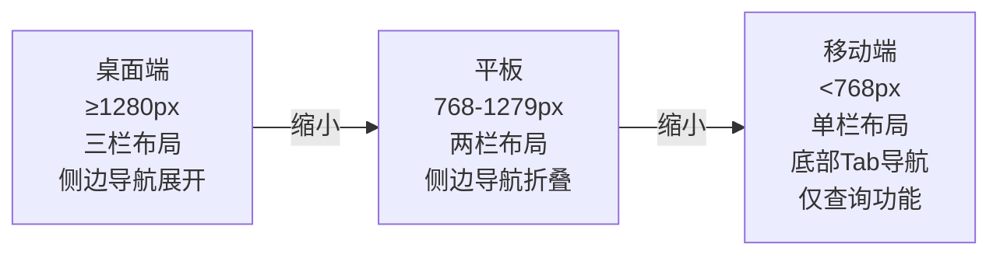
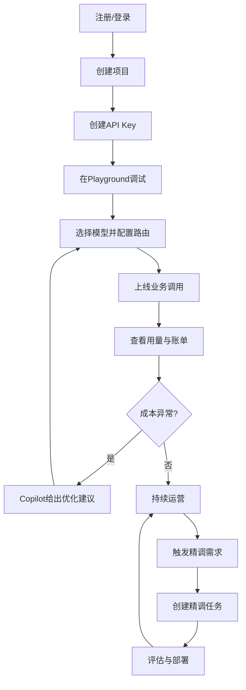

# MaaS平台 原型共享规范文档

**文档版本：** V1.0  
**编写日期：** 2026年05月18日  
**最后更新：** 2026年05月18日  
**本文范围：** 原型共享规范章节（12-15）  
**适用文档：** console-原型设计文档.md、admin-原型设计文档.md  
**密级：** 内部

---

## 目录

- [12. 响应式设计规范](#12-响应式设计规范)
- [13. 设计系统规范](#13-设计系统规范)
- [14. 原型范围补充与交付边界](#14-原型范围补充与交付边界)
- [15. 关键用户旅程与任务流](#15-关键用户旅程与任务流)
- [16. 变更历史](#16-变更历史)

---

## 12. 响应式设计规范

**移动端优先级（仅保留核心功能）：**

- ✅ 查看概览数据/告警
- ✅ 查看账单/用量
- ✅ Copilot 对话
- ❌ 路由策略配置（复杂操作，仅桌面端）
- ❌ 精调任务创建

---

## 13. 设计系统规范

### 13.0 设计哲学

#### 核心原则：简约商务（Minimal Business）

MaaS 平台面向企业开发者与平台管理员，界面设计以「低干扰、高信息密度」为首要目标。

| 原则 | 说明 |
| --- | --- |
| 白色为基底 | 页面背景 `#FFFFFF`，内容区 `#F8FAFC`；不使用暖色、渐变或纹理背景 |
| 颜色必须有语义 | 仅 5 种语义色：主色蓝（交互/焦点）、成功绿、警告黄、危险红、信息灰蓝；禁止将颜色用作纯装饰 |
| 禁止使用 Emoji | 导航、标签、按钮、状态标记等所有 UI 元素一律使用 Font Awesome 图标，不使用 Unicode Emoji |
| 层次靠间距与字重 | 通过 padding/margin 和 font-weight 建立视觉层次，不依赖渐变色块区分区域 |
| 克制的投影 | 卡片只在需要强调时使用极浅投影（`shadow-sm`），导航/表格不加投影 |
| 侧边栏浅色方案 | 侧边栏背景 `#FFFFFF`，用左侧 2px 蓝色 border 标记当前激活项，不使用深色侧边栏 |

**关于颜色使用决策树：**

1. 这里的颜色是传递信息（状态/优先级/类别）？→ **可以用**
2. 这里的颜色只是为了「好看」或「区分区域」？→ **不用**

### 13.1 色彩系统

| Token | 值 | 用途 |
| --- | --- | --- |
| `--color-primary` | `#2563EB` | 主操作按钮、链接、激活状态指示条 |
| `--color-primary-light` | `#EFF6FF` | 激活菜单项背景、选中行背景 |
| `--color-success` | `#16A34A` | 运行中、成功状态 |
| `--color-warning` | `#D97706` | 待处理、P2/P3 告警、余额不足预警 |
| `--color-danger` | `#DC2626` | 错误、P0/P1 告警、删除操作 |
| `--color-text-primary` | `#0F172A` | 正文、标题 |
| `--color-text-secondary` | `#64748B` | 辅助文字、占位符、空状态说明 |
| `--color-border` | `#E2E8F0` | 表格分割线、卡片边框 |
| `--color-bg-page` | `#F8FAFC` | 内容区页面底色 |
| `--color-bg-card` | `#FFFFFF` | 卡片、弹窗、侧边栏背景 |
| `--color-sidebar-active-bg` | `#EFF6FF` | 侧边栏激活菜单项背景 |
| `--color-sidebar-active-bar` | `#2563EB` | 侧边栏激活菜单项左侧指示条（2px） |

> **禁止引入的颜色：** 渐变色块（装饰用途）、暖米色系（#f6f5f1 类）、品红/橙/紫（无对应语义）。

### 13.2 关键交互规范

| 场景 | 规范 |
| --- | --- |
| 按钮点击反馈 | 100ms 内响应视觉变化 |
| 数据加载 | 超过 300ms 显示 Skeleton 骨架屏 |
| 操作确认 | 破坏性操作（删除/禁用）必须二次确认 |
| 表单校验 | 实时校验（onChange），提交时汇总展示 |
| 空状态 | 显示引导操作（如"创建第一个 API Key"） |
| 错误状态 | 展示具体错误原因 + 可操作的修复建议 |
| AI 内容 | 流式打字机效果输出，区分 AI/用户消息样式 |

---

## 14. 原型范围补充与交付边界

### 14.1 本次原型交付物

1. 开发者控制台高保真交互原型：原型HTML/console-frontend-prototype.html
2. 平台管理后台高保真交互原型：原型HTML/admin-frontend-prototype.html
3. 文档站示例原型：原型HTML/docs-site-example.html

### 14.2 本次原型已覆盖能力

| 能力域 | 覆盖情况 | 说明 |
| --- | --- | --- |
| 开发者接入闭环 | 已覆盖 | 注册/登录、Key管理、模型浏览、Playground调试、用量账单、策略配置、Copilot |
| 平台治理闭环 | 已覆盖 | 租户管理、厂商管理、模型管理、全局监控、策略校验 |
| 文档与开发体验 | 已覆盖 | API文档结构、代码示例切换、复制、目录导航 |
| Prompt工程与实验 | 已覆盖 | Prompt版本管理、A/B实验、评测回归 |
| 策略治理（Policy as Code） | 已覆盖 | 路由/预算/内容安全策略代码化、版本审批、灰度发布 |
| 预算管控闭环 | 已覆盖 | 预算超限拦截、审批工作流、临时额度申请 |
| 审计日志 | 已覆盖 | 全量操作记录查询、详情抽屉、导出功能 |
| 质量-成本联合分析 | 已覆盖 | 质量/延迟/成本三维江泵图、按模型/项目/租户切换、异常归因 |
| 容灾演练管理 | 已覆盖 | 演练计划/执行/报告闭环、RTO/RPO配置 |
| 权限差异视图 | 部分覆盖 | 已定义角色，需补不同角色菜单裁剪策略 |

### 14.3 本次不在原型范围（开发阶段补）

1. 全量国际化与无障碍规范（WCAG）细则。
2. 所有后端错误码的前端映射文案库。
3. 复杂图表的真实数据联动与性能优化。

---

## 15. 关键用户旅程与任务流

### 15.1 旅程关键成功标准

1. 首次接入时间小于30分钟。
2. 首次成功调用完成率大于90%。
3. 关键任务（创建Key、试用模型、查看账单）均可在3次点击内触达。

---

## 16. 变更历史

| 版本 | 日期 | 说明 | 修改人 |
| --- | --- | --- | --- |
| V1.0 | 2026-05-18 | 从 Console/Admin 原型文档中抽出 12-15 章共享规范，独立维护 | 产品团队 |
