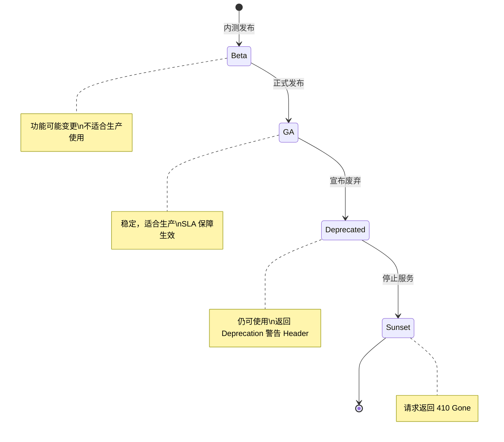
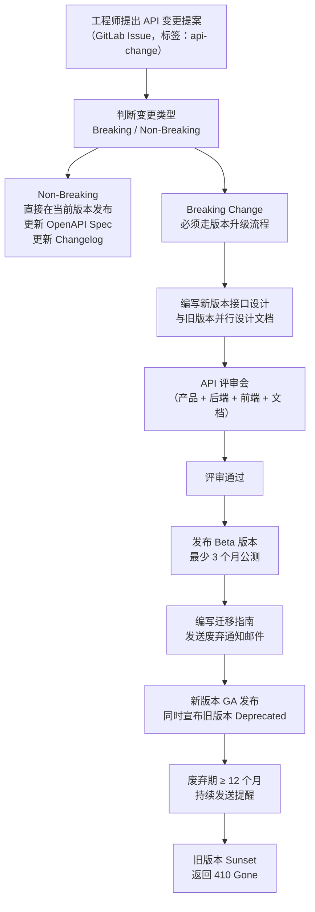
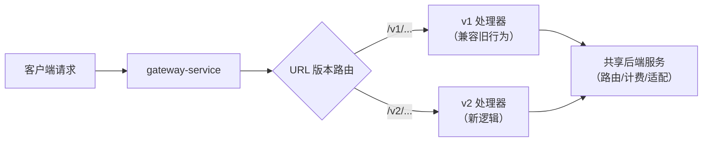

# API 版本管理策略

**文档版本：** V2.0  
**编写日期：** 2026年05月25日  
**适用范围：** MaaS 平台对外开放 API（OpenAI / Anthropic / Gemini 兼容端点）  
**关联PRD：** `产品设计/MaaS-PRD-V2.0/`  
**负责人：** 后端负责人 + 产品负责人

**变更说明：** V2.0 对齐 PRD V2.0：新增多协议端点版本管理（OpenAI/Anthropic/Gemini 各自原生版本演进策略）；新增协议废弃/迁移策略（deprecation notice + migration guide）

---

## 1. 版本策略总则

### 1.1 版本号规范

MaaS 平台 API 版本号遵循 **URI 路径版本化**方案：

```
https://api.maas-platform.com/v{major}/...

示例：
  https://api.maas-platform.com/v1/chat/completions   ← 当前版本
  https://api.maas-platform.com/v2/chat/completions   ← 未来主版本
```

**仅使用主版本号（Major）**，原因：
- Minor / Patch 变更通过向后兼容的方式发布，无需改 URL
- 简化客户端集成复杂度
- 与 OpenAI、Anthropic 等主流 API 惯例保持一致

### 1.2 版本生命周期



| 阶段 | 说明 | 最短持续时间 |
|------|------|------------|
| **Beta** | 内测，可能有破坏性变更，不受 SLA 约束 | 至少 3 个月 |
| **GA（正式版）** | 稳定，受 SLA 保障 | - |
| **Deprecated（废弃中）** | 宣布废弃后继续可用，带警告 Header | 至少 **12 个月** |
| **Sunset（终止）** | 停止服务，返回 410 Gone | - |

---

## 2. 什么是 Breaking Change（破坏性变更）

以下变更**必须升级主版本号**（v1 → v2），不可在现有版本中发布：

```
Breaking Changes（需升 Major 版本）：
  ✅ 删除某个字段（请求 or 响应）
  ✅ 重命名字段（如 max_tokens → max_completion_tokens）
  ✅ 修改字段数据类型（string → int）
  ✅ 修改 HTTP 状态码语义（如 404 → 422）
  ✅ 删除某个接口端点
  ✅ 修改 URL 路径结构
  ✅ 修改认证方式
  ✅ 修改分页参数（page/cursor 机制变更）
```

以下变更**可在当前版本发布**，无需升主版本：

```
Non-Breaking Changes（可在当前版本发布）：
  ✅ 新增可选的请求字段（旧客户端不传，默认值保持原有行为）
  ✅ 新增响应字段（旧客户端忽略未知字段）
  ✅ 新增接口端点
  ✅ 放宽字段校验（如允许更长的字符串）
  ✅ 新增错误码（旧客户端按 fallback 处理）
  ✅ 性能优化、Bug 修复（不改变接口语义）
  ✅ 新增模型（不影响现有模型 API）
```

---

## 3. 变更评审流程



---

## 4. 废弃通知机制

### 4.1 响应头警告

当某个接口或字段被废弃时，响应中加入标准 `Deprecation` Header：

```http
HTTP/1.1 200 OK
Content-Type: application/json
Deprecation: true
Sunset: Sat, 01 Oct 2027 00:00:00 GMT
Link: <https://docs.maas-platform.com/changelog/deprecations#v1-tokens>; rel="deprecation"

{
  "id": "chatcmpl-xxx",
  "object": "chat.completion",
  ...
}
```

### 4.2 邮件通知时间线

| 时间节点 | 通知行动 |
|---------|---------|
| Deprecated 宣布日 | 邮件通知所有调用过废弃 API 的租户，附迁移指南链接 |
| Sunset 前 6 个月 | 邮件再次提醒，强调截止日期 |
| Sunset 前 3 个月 | 控制台 Banner 警告 + 邮件第三次提醒 |
| Sunset 前 1 个月 | 每周邮件提醒，附迁移助手链接 |
| Sunset 日 | 旧版本端点返回 410 Gone + 迁移文档链接 |

### 4.3 410 Gone 响应格式

```json
// 旧版本 Sunset 后的响应
HTTP/1.1 410 Gone
{
  "error": {
    "code": "api_version_sunset",
    "message": "API v1 has been sunset on 2027-10-01. Please migrate to v2.",
    "migration_guide": "https://docs.maas-platform.com/guides/migrate-v1-to-v2",
    "type": "version_error"
  }
}
```

---

## 5. 多版本并行运行

当 v2 发布后，v1 和 v2 并行运行期间的架构：



**实现方式：** Gateway 层通过 URL 前缀路由到不同的处理器，共享底层业务逻辑，仅 API 契约（请求/响应格式）不同。

---

## 6. 变更日志规范

每次 API 变更（无论 Breaking 还是 Non-Breaking）必须更新 Changelog：

```markdown
# Changelog

## v1 - 2026-09-01（GA）

### 新增
- POST /v1/chat/completions：支持 `x-maas-cache-enabled` 扩展头
- POST /v1/embeddings：返回新增 `cached` 字段

### 修复
- 修复流式响应在某些代理下的 Content-Type 问题

### 废弃（Deprecation）
- `usage.total_tokens` 字段：将在 v2 中移除，请改用 `usage.input_tokens + usage.output_tokens`
  - Sunset 日期：2027-10-01
  - 迁移指南：https://docs.maas-platform.com/guides/usage-tokens-migration
```

---

## 7. OpenAPI Spec 版本管理

```
OpenAPI Spec 文件命名与存储：

仓库路径：
  api-specs/
    v1/
      openapi.yaml      ← 当前维护版本
      changelog.md
    v2/                 ← 开发中（Beta阶段）
      openapi.yaml
      changelog.md

发布时自动同步到：
  apps/docs-site/static/openapi/maas-api-v1.yaml   ← 文档站使用
```

---

## 8. 当前版本状态

| 版本 | 状态 | 发布日期 | Sunset 日期 |
|------|------|---------|------------|
| **v1** | ✅ GA | 2026-09-01 | 未定 |
| v2 | 规划中 | 预计 2027-Q3 | - |

**v1 稳定性承诺：** v1 在 2026-09-01 GA 后，至少 18 个月内（即 2028-03-01 前）不会进入 Deprecated 状态。

---

**变更历史**

| 版本 | 日期 | 说明 | 修改人 |
|------|------|------|--------|
| V1.0 | 2026-05-14 | 初稿 | 后端负责人 |
