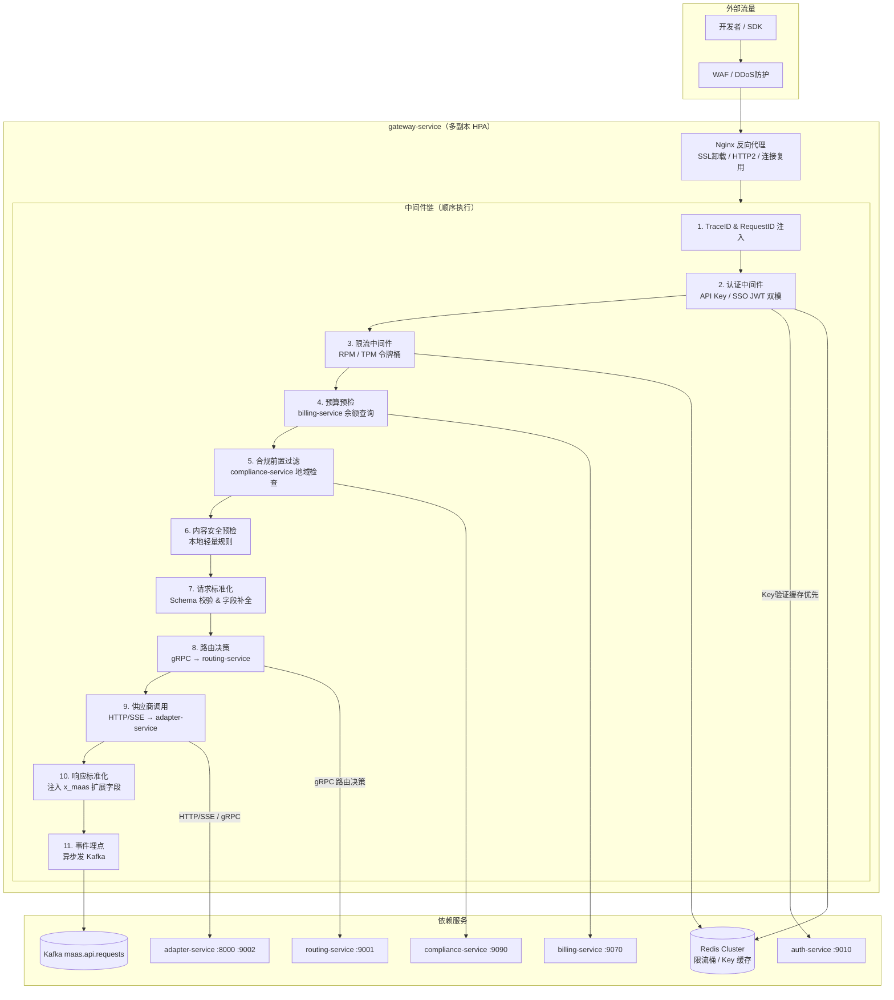
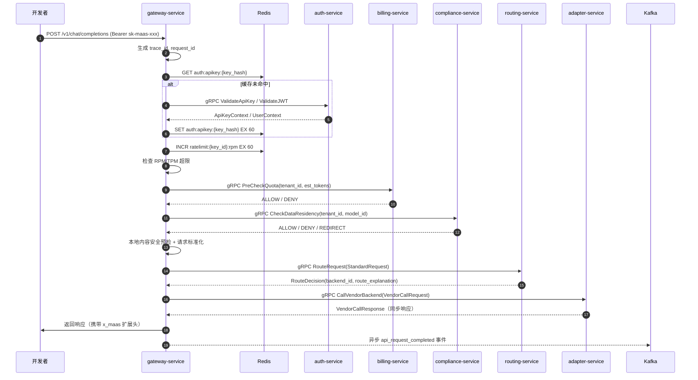
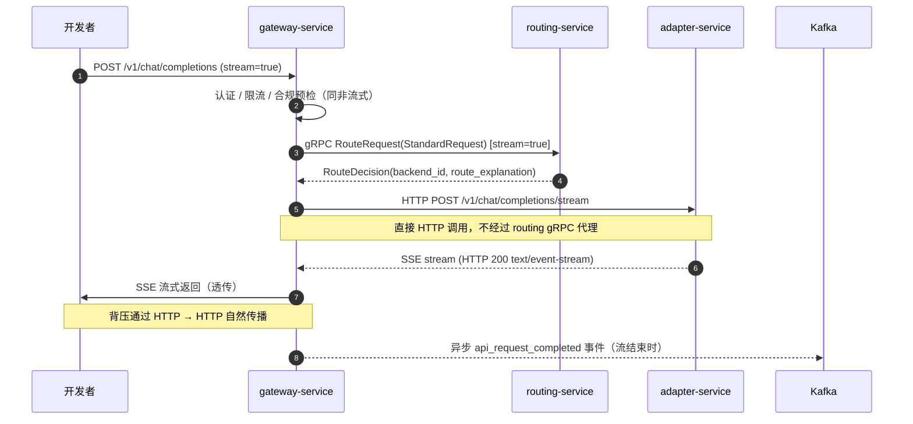

# gateway-service 详细设计文档

**文档版本：** V2.1.0
**更新日期：** 2026年05月25日
**基准PRD：** `产品设计/MaaS-PRD-V2.0/`
**服务名称：** `gateway-service`
**语言/框架：** Go 1.22 + 自研中间件框架
**变更说明：** V2.1 对齐 PRD V2.0 §00 架构：新增多协议端点支持（OpenAI / Anthropic / Gemini 三套兼容 API）、新增 WebSocket 代理端点、新增协议检测与请求标准化中间件、补充多协议请求-响应格式转换说明。

---

## 1. 服务职责

`gateway-service` 是 MaaS 平台**唯一外部流量入口**，所有租户 API 调用必须经过此服务。

| 职责域 | 具体能力 |
|--------|---------|
| **多协议接入** | OpenAI 兼容端点（`/v1/*`）+ Anthropic 兼容端点（`/v1/anthropic/*`）+ Gemini 兼容端点（`/v1/gemini/*`），WebSocket 代理（`/v1/ws`） |
| **协议检测与适配** | 自动识别请求格式（OpenAI / Anthropic / Gemini），标准化为内部 StandardRequest，响应时反向转换 |
| **身份认证** | API Key（HMAC-SHA256）+ SSO JWT（SAML2/OIDC）双模认证 |
| **限流保护** | RPM / TPM 令牌桶，Key 级 / 项目级 / 租户级三档限流配置 |
| **预算预检** | 调用 billing-service 实时余额预检，超额前置拒绝 |
| **合规前置** | 调用 compliance-service 完成数据驻留地域检查 |
| **内容安全预检** | 本地轻量关键词过滤（P99 < 2ms），严重违规直接拦截 |
| **Trace 注入** | 生成 trace_id / request_id，注入 gRPC metadata，传播全链路上下文 |
| **请求标准化** | 校验 JSON Schema，补全缺省字段，注入 zero_retention / kms_key_id 标记，多协议格式归一化 |
| **路由分发** | gRPC → routing-service 获取路由决策，同步请求 gRPC 代理、流式请求 HTTP 直连 adapter |
| **事件发布** | 异步向 Kafka maas.api.requests 发布请求完成事件 |

---

## 2. 服务架构图



---

## 3. 中间件链详细说明

### 3.1 协议检测与标准化中间件（V2.1 新增）

```
1. 根据 URL 前缀判断协议类型：
   /v1/chat/completions → OPENAI_FORMAT
   /v1/anthropic/messages → ANTHROPIC_FORMAT
   /v1/gemini/generateContent → GEMINI_FORMAT
2. 根据协议类型解析请求体，提取核心字段：
   - model 字段（映射到 logical_model）
   - messages/prompt（映射到 body）
   - max_tokens / stream / temperature 等参数
3. 注入 protocol_origin 标记 → request.Context
4. 后续中间件链使用统一 StandardRequest，协议差异在 gateway 层和 adapter 层分别处理
5. 响应时根据 protocol_origin 反向转换为客户端期望的响应格式

MVP 阶段：OpenAI 格式完整支持，Anthropic/Gemini 轻量映射
```

### 3.2 认证中间件（双模）

**模式一：API Key 认证**
```
1. 提取 Authorization: Bearer {api_key}
2. key_hash = HMAC-SHA256(api_key, platform_secret)
3. Redis GET auth:apikey:{key_hash}，未命中则 gRPC ValidateApiKey
4. 校验 status(active)、IP 白名单、过期时间、scope 权限范围
5. 注入 ApiKeyContext{tenant_id, project_id, key_id, scope[]} → request.Context

失败码：
  401 invalid_api_key   — Key 不存在或 Hash 不匹配
  401 api_key_expired   — 已过期
  403 ip_not_allowed    — IP 白名单拦截
  403 scope_denied      — 请求操作超出 Key 权限范围
```

**模式二：SSO JWT 认证（V2.0 新增）**
```
1. 提取 X-MaaS-Token: {jwt_token}
2. gRPC auth-service.ValidateJWT：验证 iss / exp / aud / sig
3. 解析 claims：{tenant_id, user_id, roles[]}
4. 注入 UserContext → request.Context
```

### 3.3 合规前置过滤（V2.0 新增）

```
从 Context 取 tenant_id、logical_model
gRPC compliance-service.CheckDataResidency({tenant_id, model_id, client_region})
结果：
  ALLOW        — 放行
  DENY         — 数据驻留违规 → HTTP 451 Unavailable For Legal Reasons
  REDIRECT     — 注入 X-MaaS-Required-Region 头，供 routing-service 强制地域路由
```

### 3.4 零数据保留模式（V2.0 新增）

若租户开启 `zero_data_retention = true`：
- 注入 metadata `x-maas-zero-retention: 1`
- Kafka 事件中 `prompt_content` 和 `response_content` 字段置空
- routing-service / llmops-trace-service 收到此标记后不持久化内容字段

### 3.5 请求标准化

- 强制校验 `model` 字段为有效逻辑模型名（正则 `^maas:.+`）
- 补全 `stream: false` 等缺省字段
- 注入 `x_maas_request_id` / `x_maas_trace_id` / `x_maas_tenant_id` 到 response header

---

## 4. 请求处理时序图

### 4.1 同步请求（非流式）



### 4.2 流式请求（SSE）

> **架构决策**：流式请求不再通过 routing-service gRPC 代理 SSE 流。改为 routing-service 返回路由决策后，gateway **直接通过 HTTP 调用 adapter-service**，避免 SSE 流穿越两层 gRPC 导致的背压失效和断开检测困难。



---

## 5. gRPC 接口（向 routing-service）

```protobuf
message StandardRequest {
    string trace_id         = 1;
    string request_id       = 2;
    string tenant_id        = 3;
    string project_id       = 4;
    string api_key_id       = 5;
    string logical_model    = 6;
    string user_id          = 7;
    bytes  body             = 8;   // 原始请求体 JSON
    bool   stream           = 9;
    bool   zero_retention   = 10;
    string required_region  = 11;  // 合规要求的强制地域
    string kms_key_id       = 12;  // 客户 KMS 引用（可选）
    map<string, string> metadata = 13;
}
```

---

## 6. Kafka 事件结构（maas.api.requests）

```json
{
  "event_type": "api_request_completed",
  "trace_id": "tr_xxxxxxxxxx",
  "request_id": "req_xxxxxxxxxx",
  "tenant_id": "t_xxx",
  "project_id": "p_xxx",
  "api_key_id": "k_xxx",
  "logical_model": "maas:gpt-4o",
  "vendor_backend_id": "vb_xxx",
  "status": "success",
  "http_status": 200,
  "prompt_tokens": 512,
  "completion_tokens": 128,
  "total_tokens": 640,
  "ttfb_ms": 320,
  "total_latency_ms": 1450,
  "stream": true,
  "zero_retention": false,
  "fallback_triggered": false,
  "ts": "2026-05-22T10:00:00.000Z"
}
```

---

## 7. 暴露端点

### 7.1 OpenAI 兼容端点

| 端点 | 协议 | 说明 |
|------|------|------|
| `POST /v1/chat/completions` | HTTP/SSE | 主对话接口，OpenAI 兼容 |
| `POST /v1/completions` | HTTP | 文本补全 |
| `POST /v1/embeddings` | HTTP | Embedding |
| `GET /v1/models` | HTTP | 逻辑模型列表 |

### 7.2 Anthropic 兼容端点（V2.1 新增）

PRD V2.0 §00 架构中入口层支持 Anthropic 兼容 API：

| 端点 | 协议 | 说明 |
|------|------|------|
| `POST /v1/anthropic/messages` | HTTP/SSE | Anthropic Messages API 兼容 |
| `POST /v1/anthropic/messages/stream` | SSE | Anthropic 流式 Messages |

**请求转换流程：**
```
Client Anthropic-format request → gateway 解析 anthropic 格式
  → 归一化为 StandardRequest（model/messages→body/max_tokens 等映射）
  → 后续中间件链复用（认证/限流/合规/路由）
  → adapter-service 调用供应商时自动转换回目标供应商格式（LiteLLM 处理）
```

### 7.3 Gemini 兼容端点（V2.1 新增）

| 端点 | 协议 | 说明 |
|------|------|------|
| `POST /v1/gemini/generateContent` | HTTP/SSE | Gemini API 兼容 |
| `POST /v1/gemini/streamGenerateContent` | SSE | Gemini 流式生成 |

### 7.4 其他端点

| 端点 | 协议 | 说明 |
|------|------|------|
| `POST /v1/ws` | WebSocket | 流式对话 WebSocket 代理（SSE 替代方案，企业客户高频需求） |
| `GET /healthz` | HTTP | K8s 探针 |
| `GET /metrics` | HTTP | Prometheus 指标 |

### 7.5 多协议支持策略

**MVP 阶段（当前）：**
- OpenAI 兼容格式：完整支持，直接透传
- Anthropic / Gemini 格式：在 gateway 层做轻量协议识别和标准化，核心字段映射到 StandardRequest，adapter 侧由 LiteLLM 自动处理供应商侧协议转换
- 不支持的供应商原生格式：返回 400 + 提示使用 OpenAI 兼容端点

**完整阶段（P2）：**
- 全部三种格式完整支持请求/响应双向转换
- 新增 `protocol` 字段到 StandardRequest，供下游服务感知原始协议类型

---

## 8. 缓存设计

| Key 格式 | TTL | 说明 |
|---------|-----|------|
| `auth:apikey:{key_hash}` | 60s | API Key 元数据 |
| `ratelimit:{key_id}:rpm` | 60s | RPM 计数器 |
| `ratelimit:{key_id}:tpm` | 60s | TPM 计数器 |
| `compliance:region:{tenant_id}` | 300s | 数据驻留规则 |

---

## 9. SLA

| 指标 | 目标 |
|-----|------|
| 中间件链 P99 处理延迟（不含路由） | ≤ 20ms |
| 认证缓存命中率 | ≥ 95% |
| 单副本最大并发连接 | 5,000 |
| Pod 可用性 | ≥ 99.99% |

---

## 10. 部署规格

```yaml
replicas: 3 (HPA min=3, max=20, targetCPU=60%)
resources:
  requests: {cpu: 500m, memory: 512Mi}
  limits:   {cpu: 2000m, memory: 2Gi}
ports:
  - 8080: HTTP（对外）
  - 9090: Prometheus metrics
```
