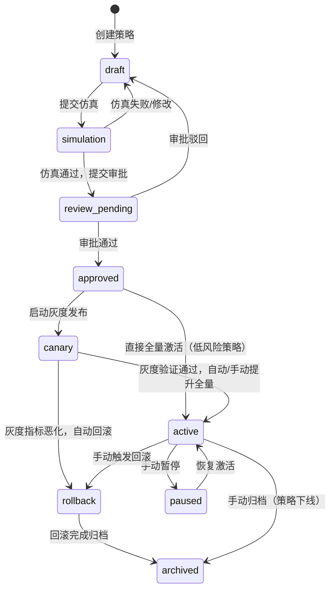
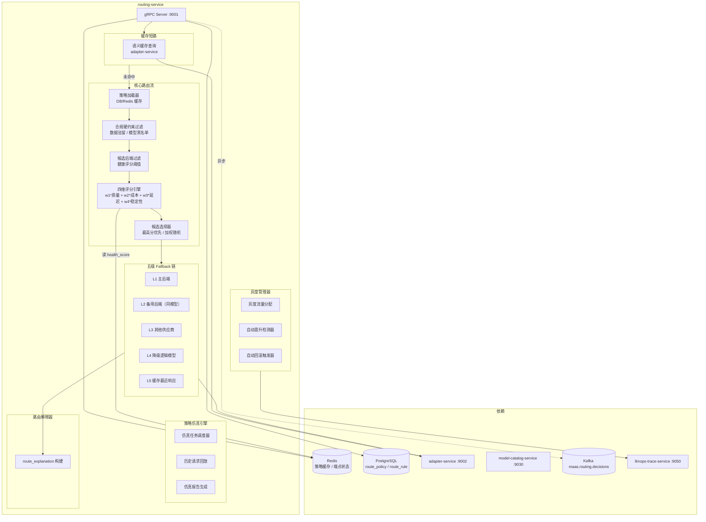
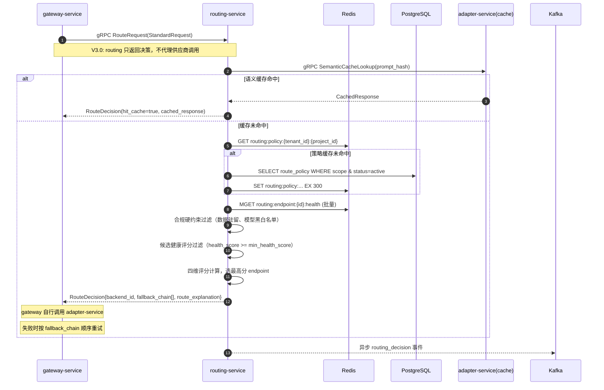

# routing-service 详细设计文档

**文档版本：** V2.1.0
**更新日期：** 2026年05月25日
**基准PRD：** `产品设计/MaaS-PRD-V2.0/03-路由策略与容灾降级规格.md`
**服务名称：** `routing-service`
**语言/框架：** Go 1.22 + gRPC
**变更说明：** V2.1 对齐 PRD V2.0 §03 完整规格：新增 route_rule / route_candidate 表完整字段、新增 RU类_BASED 规则条件匹配引擎、新增 A/B 实验流量联动机制、新增质量门禁联动（评测结果 → quality_score → 路由权重自动更新）、新增策略效果评估看板 API、细化四级作用域继承覆盖规则与合规硬约束冲突处理。

---

## 1. 服务职责

| 职责域 | 具体能力 |
|--------|---------|
| **策略管理** | 路由策略 CRUD，支持五类策略类型（STATIC / LB / HEALTH_AWARE / MULTI_OBJECTIVE / RULE_BASED） |
| **策略生命周期** | 九阶段状态机：draft→simulation→review_pending→approved→canary→active→paused→rollback→archived |
| **策略仿真** | 离线回放历史请求，预测策略变更对成本 / 延迟 / 成功率的影响 |
| **评分路由** | 四维权重公式（质量/成本/延迟/稳定性），实时评分选优 |
| **灰度发布** | canary_percentage 配置，支持按租户 / 项目 / Key / 流量比例灰度 |
| **自动回滚** | 灰度期间监控错误率 & P95 延迟，超阈值自动触发回滚 |
| **Fallback 链** | 五级降级链（主后端 → 备用后端 → 其他供应商 → 降级模型 → 缓存响应） |
| **路由解释** | 每次请求生成 route_explanation 对象，说明候选模型评分和选择理由 |
| **健康感知** | 主动健康探活（每 30s），EWMA P95 延迟追踪，health_score 实时更新 |
| **缓存集成** | 调用 adapter-service 语义缓存查询 |

---

## 2. 路由策略九阶段生命周期



### 状态转移触发条件

| 转移 | 触发方式 | 前置条件 |
|------|---------|---------|
| draft → simulation | 用户提交仿真任务 | 至少配置一个候选模型 |
| simulation → review_pending | 仿真结论无重大风险 | 仿真覆盖率 ≥ 1000 条历史请求 |
| review_pending → approved | 审批人（Router Manager+）审批通过 | — |
| approved → canary | 用户配置 canary_percentage > 0 | — |
| canary → active（自动） | 灰度期间错误率 < 阈值 & P95 < 阈值 & 持续 canary_window_minutes | auto_promote_enabled = true |
| canary → rollback（自动） | 错误率 > auto_rollback_threshold 或 P95 > latency_threshold | auto_rollback_enabled = true |
| active → rollback（手动） | Router Manager+ 触发 | — |

---

## 2.1 策略仿真引擎实现细节

### 2.1.1 仿真引擎核心流程

```
仿真引擎状态机：
  pending → running → completed | failed → report_generated

仿真执行流程：
  1. 快照创建
     - 锁定当前活跃策略（避免仿真期间策略变更）
     - 锁定端点健康状态（redis routing:endpoint:* 快照）
     - 锁定定价快照（billing-service 当前价格版本）
  2. 请求选取
     - 从 ClickHouse trace 表选取最近 N 条实际请求
     - N = max(1000, min(5000, 租户最近 7 天请求总数的 10%))
     - 分层采样确保覆盖所有活跃 LogicalModel
     - 过滤 zero_retention=true 的请求（无有效内容）
  3. 候选生成
     - 对每条历史请求，应用新策略的规则生成候选后端列表
     - 计算每个候选的四维评分（质量/成本/延迟/稳定性）
     - 使用当前快照的健康评分和历史延迟数据
  4. 结果对比（新策略 vs 当前策略）
     - 成本变化: Σ(new_cost) − Σ(old_cost)
     - 延迟变化: P95(new_latency) − P95(old_latency)
     - 成功率模拟: 对每条请求模拟 failover 路径
     - 供应商分布偏移: 各供应商负载比例变化
     - Fallback 触发率变化
  5. 报告生成
     - 输出对比报表（HTML/Markdown 双格式）
     - "建议接受/拒绝" 置信评分（基于效果提升幅度）
     - 风险标识：若某项指标恶化 > 10%，标记为 high_risk
  6. 覆盖率检查
     - N ≥ 1000 条历史请求
     - 覆盖所有活跃 LogicalModel
     - 覆盖所有活跃 VendorBackend
```

### 2.1.2 仿真任务 API

| 方法 | 路径 | 说明 |
|------|------|------|
| POST | `/api/v1/policies/{id}/simulate` | 提交仿真任务（参数：sample_size, time_range） |
| GET | `/api/v1/policies/{id}/simulate/{job_id}` | 查询仿真状态和进度 |
| GET | `/api/v1/policies/{id}/simulate/{job_id}/report` | 获取仿真报告 |

### 2.1.3 仿真性能要求

| 指标 | 目标 |
|-----|------|
| 1000 条请求仿真完成时间 | ≤ 30s |
| 5000 条请求仿真完成时间 | ≤ 120s |
| 单次请求模拟评分延迟 | ≤ 2ms |
| 仿真并发度 | 最多 3 个任务同时运行 |

---

## 3. 服务架构图



---

## 4. 四维评分公式

$$\text{score}_i = w_1 \cdot \text{quality}_i + w_2 \cdot (1 - \text{cost\_index}_i) + w_3 \cdot (1 - \text{latency\_index}_i) + w_4 \cdot \text{health\_score}_i$$

其中 $w_1 + w_2 + w_3 + w_4 = 1.0$

| 预设模板 | w1（质量） | w2（成本） | w3（延迟） | w4（稳定性） |
|----------|-----------|-----------|-----------|-------------|
| 成本优先 | 0.20 | 0.50 | 0.15 | 0.15 |
| 质量优先 | 0.55 | 0.15 | 0.15 | 0.15 |
| 均衡模式 | 0.25 | 0.25 | 0.25 | 0.25 |
| 低延迟优先 | 0.15 | 0.15 | 0.55 | 0.15 |
| 稳定性优先 | 0.15 | 0.15 | 0.15 | 0.55 |

---

## 5. 五级 Fallback 链

```
L1  主后端请求  ──→ 成功 → 返回
        │失败（超时/限流/5xx）
        ↓
L2  备用后端（同逻辑模型，不同 vendor_backend）
        │全部失败
        ↓
L3  其他供应商后端（同逻辑模型，不同 provider）
        │全部失败
        ↓
L4  降级逻辑模型（logical_model.replacement_model_id 链路）
        │降级模型也失败
        ↓
L5  语义缓存最近命中响应（仅只读场景，携带 x_maas_cached: stale 标记）
        │缓存也无命中
        ↓
    返回 503 Service Unavailable（所有后端不可用）
```

每次 Fallback 触发均记录在 `route_explanation.fallback_chain[]`，供 llmops-trace-service 可视化。

---

## 6. 路由决策时序图

### 6.1 架构决策：routing-service 不代理请求

> **V3.0 架构变更**：routing-service 只负责路由决策，不代理供应商调用。返回 RouteDecision 后，由 gateway-service 直接调用 adapter-service。好处：
> 1. 路由和协议翻译职责分离，各自可独立扩缩
> 2. 流式请求的 SSE 流不需要穿越一层 gRPC，延迟更低、背压更自然
> 3. Fallback 链逻辑仍在 routing-service 中（返回 fallback 候选列表），gateway 按序尝试

### 6.2 路由决策流程



---

## 7. route_explanation 结构

```json
{
  "trace_id": "tr_xxx",
  "policy_id": "pol_xxx",
  "policy_type": "MULTI_OBJECTIVE",
  "scope_type": "PROJECT",
  "weight_config": {"quality": 0.25, "cost": 0.25, "latency": 0.25, "stability": 0.25},
  "candidates": [
    {"backend_id": "vb_001", "model": "gpt-4o/openai", "score": 0.87, "quality": 0.91, "cost_index": 0.72, "latency_p95_ms": 820, "health_score": 0.95},
    {"backend_id": "vb_002", "model": "claude-3-5-sonnet/anthropic", "score": 0.79, "quality": 0.88, "cost_index": 0.68, "latency_p95_ms": 950, "health_score": 0.92}
  ],
  "selected_backend_id": "vb_001",
  "selected_reason": "最高综合评分",
  "fallback_chain": [],
  "compliance_filters_applied": ["data_residency_cn"],
  "cache_hit": false,
  "decision_latency_ms": 4
}
```

---

## 8. 关键数据模型（route_policy 表核心字段）

| 字段 | 类型 | 说明 |
|------|------|------|
| `policy_id` | VARCHAR(36) | UUID，全局唯一 |
| `scope_type` | ENUM | PLATFORM / TENANT / PROJECT / API_KEY |
| `policy_type` | ENUM | STATIC_MAPPING / LOAD_BALANCE / HEALTH_AWARE / MULTI_OBJECTIVE / RULE_BASED |
| `status` | ENUM | draft / simulation / review_pending / approved / canary / active / paused / rollback / archived |
| `version` | INT | 每次发布 +1 |
| `weight_quality` | DECIMAL(4,3) | 质量维度权重 w1 |
| `weight_cost` | DECIMAL(4,3) | 成本维度权重 w2 |
| `weight_latency` | DECIMAL(4,3) | 延迟维度权重 w3 |
| `weight_stability` | DECIMAL(4,3) | 稳定性维度权重 w4 |
| `min_health_score` | DECIMAL(4,3) | 候选最低健康评分阈值，默认 0.6 |
| `canary_percentage` | DECIMAL(5,2) | 灰度流量比例 0~100 |
| `auto_rollback_threshold_error_rate` | DECIMAL(5,4) | 自动回滚错误率阈值，默认 0.05 |
| `auto_rollback_threshold_latency_p95_ms` | INT | 自动回滚 P95 延迟阈值，默认 5000ms |
| `data_residency_required` | VARCHAR(10) | 数据驻留要求（CN/EU/null） |
| `model_whitelist` | JSON | 允许的逻辑模型 ID 列表 |
| `model_blacklist` | JSON | 禁止的逻辑模型 ID 列表 |
| `simulation_job_id` | VARCHAR(36) | 最近一次仿真任务 ID |

---

## 9. API 设计

### gRPC（内部，供 gateway-service 调用）

```protobuf
service RoutingService {
    // 路由决策：返回选定的后端 + 路由解释 + Fallback 候选链
    // V3.0 变更：不再代理请求流，只返回决策
    rpc RouteRequest(StandardRequest) returns (RouteDecision);
    rpc GetRouteExplanation(TraceId) returns (RouteExplanation);
}

message RouteDecision {
    string trace_id            = 1;
    string backend_id          = 2;   // 主选后端 ID
    string litellm_model       = 3;   // LiteLLM 模型名（如 "openai/gpt-4o"）
    string api_base            = 4;   // 供应商 API base URL
    RouteExplanation route_explanation = 5;  // 路由解释
    repeated FallbackEntry fallback_chain = 6;  // Fallback 候选链（L2-L5）
    bool   cache_hit           = 7;
    bytes  cached_response     = 8;   // 命中缓存时的响应
}

message FallbackEntry {
    string backend_id    = 1;
    string litellm_model = 2;
    string api_base      = 3;
    int32  priority      = 4;   // L2=2, L3=3, ... L5=5
}
```

### REST（管理面，供 Console/Admin 调用）

| 方法 | 路径 | 说明 |
|------|------|------|
| GET | `/api/v1/policies` | 列举策略（分页、作用域过滤） |
| POST | `/api/v1/policies` | 创建策略（→ draft 状态） |
| PUT | `/api/v1/policies/{id}` | 更新策略 |
| POST | `/api/v1/policies/{id}/simulate` | 提交仿真任务 |
| POST | `/api/v1/policies/{id}/submit-review` | 提交审批 |
| POST | `/api/v1/policies/{id}/approve` | 审批通过 |
| POST | `/api/v1/policies/{id}/activate` | 全量激活 |
| POST | `/api/v1/policies/{id}/canary` | 启动灰度（带 canary_percentage） |
| POST | `/api/v1/policies/{id}/rollback` | 手动回滚 |
| GET | `/api/v1/policies/{id}/explanation/{trace_id}` | 查询指定请求的路由解释 |
| GET | `/api/v1/policies/{id}/dashboard` | 策略效果看板（灰度/激活期间实时指标） |

### 9.1 策略效果看板

灰度发布或策略激活后，通过聚合 llmops-trace 数据提供实时效果对比：

```
看板指标（对比基线策略 vs 当前策略）：
  - 请求量：对比期间的请求总数趋势
  - 平均延迟 / P95 延迟 / TTFB
  - 成功率：2xx / 4xx / 5xx 分布（区分上游错误和平台错误）
  - 成本变化：每请求平均成本、总成本变化百分比
  - 供应商分布：各 VendorBackend 请求占比变化
  - Fallback 触发率：L1~L5 fallback 触发频率
  - 缓存命中率：语义缓存命中率变化

时间粒度：
  - 灰度期间：1 分钟粒度实时刷新（缓存 30s）
  - 全量激活后：5 分钟粒度
  - 对比窗口：灰度开始时间 ± 7 天历史基线

数据源：llmops-trace-service /api/v1/dashboard/metrics（通过 gRPC 或 HTTP 查询）
```

---

## 9.2 route_rule 表（RULE_BASED 策略条件规则 — V2.1 新增）

PRD V2.0 §2.2 定义规则条件表：

| 字段 | 类型 | 说明 |
|------|------|------|
| `rule_id` | VARCHAR(36) | 规则唯一 ID |
| `policy_id` | VARCHAR(36) | FK → route_policy |
| `rule_name` | VARCHAR(100) | 规则名称 |
| `priority` | INT | 规则优先级（1=最高） |
| `condition_type` | ENUM | AND / OR |
| `request_tags` | JSON | 匹配的请求标签 |
| `model_capabilities_required` | JSON | 必须具备的模型能力标签 |
| `budget_remaining_gt_percent` | DECIMAL(5,2) | 预算剩余 > 此值时匹配 |
| `budget_remaining_lt_percent` | DECIMAL(5,2) | 预算剩余 < 此值时匹配（切低价模型） |
| `time_window_start` | TIME | 时间窗口起始（UTC） |
| `time_window_end` | TIME | 时间窗口结束（UTC） |
| `time_window_days_of_week` | JSON | 适用星期 [1,2,3,4,5] |
| `request_source_ip_cidr` | VARCHAR(50) | 来源 IP CIDR（内网/外网分流） |
| `user_tier` | VARCHAR(20) | 匹配用户等级（free/basic/pro/enterprise） |
| `target_candidate_group` | VARCHAR(36) | 命中后使用的候选组 ID |
| `is_enabled` | BOOLEAN | 是否启用 |

## 9.3 route_candidate 表（候选模型配置 — V2.1 新增）

PRD V2.0 §2.3 定义：

| 字段 | 类型 | 说明 |
|------|------|------|
| `candidate_id` | VARCHAR(36) | 候选记录 ID |
| `policy_id` | VARCHAR(36) | FK → route_policy |
| `candidate_group` | VARCHAR(36) | 候选组 ID（一组候选用于不同规则） |
| `model_id` | VARCHAR(36) | 逻辑模型 ID |
| `physical_model_id` | VARCHAR(36) | 物理模型 ID（指定到具体供应商实例） |
| `weight` | DECIMAL(5,2) | 候选权重（LOAD_BALANCE 类型） |
| `priority` | INT | 候选优先级（STATIC_MAPPING 类型） |

## 9.4 A/B 实验流量联动（V2.1 新增）

PRD §03 要求路由策略与 prompt-eval-service 的 A/B 实验联动：

```
联动机制：
  1. prompt-eval-service 创建 A/B 实验时，在路由层创建对应的 canary 策略
  2. 实验的 variant_a（对照组）和 variant_b（实验组）分别映射到不同的候选模型组
  3. traffic_split_pct 映射为 routing 的 canary_percentage
  4. 实验结束时：
     - B_wins → prompt-eval-service 通知 routing 将 B 组策略提升为 active
     - A_wins → 回滚 B 组策略，维持 A 组 active
     - inconclusive → 保持当前策略不变

gRPC 接口：
  rpc ApplyExperimentTraffic(ExperimentTrafficRequest) returns (ExperimentTrafficResponse);
  rpc ConcludeExperiment(ExperimentConclusionRequest) returns (ExperimentConclusionResponse);
```

## 9.5 质量门禁联动（V2.1 新增）

PRD §03 / §05 要求路由策略权重与 prompt-eval-service 的评测结果联动：

```
联动流程：
  1. prompt-eval-service 完成评测任务，回写 quality_score 到 model-catalog
  2. model-catalog 发布 model_lifecycle_changed 事件到 Kafka
  3. routing-service 消费事件，自动更新候选模型的 quality_score
  4. 若 quality_score 下降超过门禁阈值（如 15%），自动降低该候选权重
  5. 若 quality_score 降至 quality_tier=C 以下，自动从候选集中剔除
  6. 通知策略负责人：「模型 X 因质量评分下降已自动降权/剔除」

独立于 pipeline 的 Kafka 消费：
  Topic: maas.model.events
  Event: {"event_type":"quality_score_updated","logical_model_id":"lm_xxx","old_score":0.88,"new_score":0.72,"eval_job_id":"job_xxx"}

调整规则：
  - 质量分下降 5%~15% → weight_quality 减半
  - 质量分下降 > 15% → 从所有 active 策略的候选集中移除
  - 质量分上升 → 手动确认后恢复权重（不自动恢复，避免震荡）
```

## 9.6 四级作用域继承覆盖规则

PRD V2.0 §1.3 定义：

```
Platform Default → Tenant → Project → API Key
      ↓ 可覆盖     ↓ 可覆盖   ↓ 可覆盖

继承：下级字段为 null 时，使用上级同名字段值
覆盖：下级字段有显式值时，完全替换上级值
禁止下沉：上级配置合规硬约束（如 data_residency_required=CN），
          下级不可移除此约束，只能收紧不能放宽

违规拦截：
  - Console 编辑 → 阻止保存，字段标红
  - API 提交 → 422 + 冲突详情 JSON
  - Terraform → terraform apply 报错退出
  - 上级约束后续收紧 → 下级自动被覆盖 + 通知 Project Admin
```

---

| Key 格式 | TTL | 说明 |
|---------|-----|------|
| `routing:policy:{tenant_id}:{project_id}` | 300s | 策略列表缓存 |
| `routing:endpoint:{backend_id}:health` | 30s | 端点健康评分 |
| `routing:endpoint:{backend_id}:latency_p95` | 60s | EWMA P95 延迟 |
| `routing:canary:{policy_id}:{tenant_id}` | — | 灰度分配状态 |

---

## 10.1 跨服务调用熔断与隔离（Bulkhead）

为保护核心路由链路不被依赖服务故障级联影响，所有对外部服务的 gRPC 调用需配置熔断和隔离：

```yaml
# 熔断配置（每个依赖服务独立配置）
circuit_breaker:
  adapter-service:
    max_requests: 100           # 半开状态最大请求数
    interval: 10s               # 统计窗口
    timeout: 30s                # 熔断后恢复时间
    failure_threshold: 0.5      # 窗口内失败率 > 50% 触发熔断
  model-catalog-service:
    max_requests: 200
    interval: 10s
    timeout: 10s
    failure_threshold: 0.3

# Bulkhead 隔离（限制对每个下游的最大并发调用）
bulkhead:
  adapter-service:
    max_concurrent: 50          # 最大并发调用数
    max_queue: 100              # 队列长度
  model-catalog-service:
    max_concurrent: 100
    max_queue: 200
```

熔断影响：
  - 熔断期间跳过该后端，直接进入 Fallback 链下一级
  - 熔断状态通过 metrics 暴露（routing_circuit_breaker_state{backend="adapter-service"}）
  - 恢复后自动重试，不清除熔断期间的累积错误

## 11. SLA

| 指标 | 目标 |
|-----|------|
| 路由决策 P99 延迟（含评分，不含后端请求） | ≤ 10ms |
| 策略缓存命中率 | ≥ 90% |
| Fallback 触发后响应成功率 | ≥ 99% |
| 仿真任务完成时间（1000 条历史请求） | ≤ 60s |

---

## 12. 部署规格

```yaml
replicas: 2 (HPA min=2, max=10, targetCPU=70%)
resources:
  requests: {cpu: 1000m, memory: 1Gi}
  limits:   {cpu: 4000m, memory: 4Gi}
ports:
  - 9001: gRPC（供 gateway 调用）
  - 8081: HTTP REST（管理面）
  - 9091: Prometheus metrics
```
