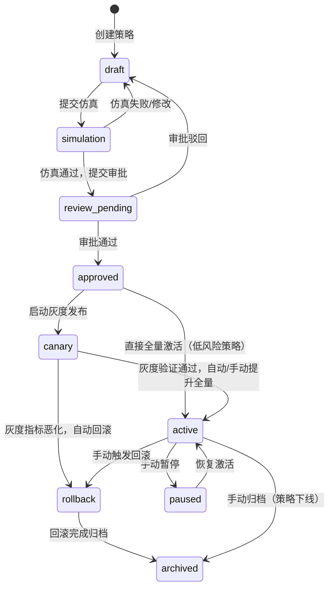
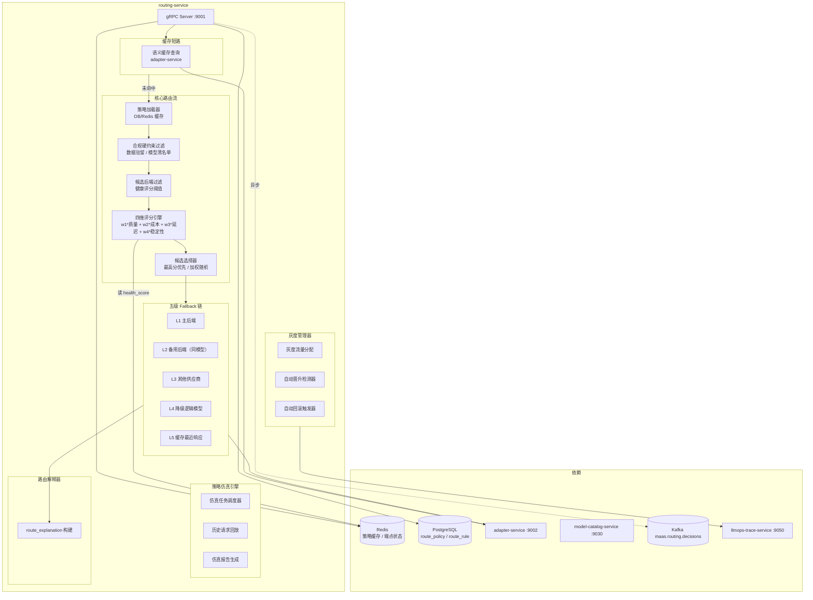
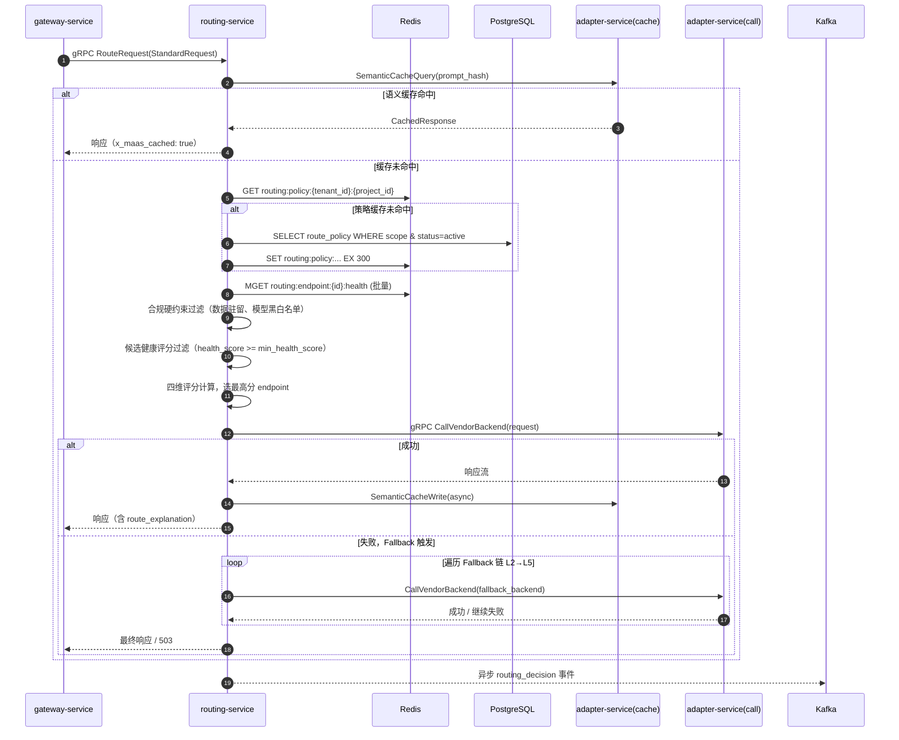

# routing-service 详细设计文档

**文档版本：** V2.0.0  
**更新日期：** 2026年05月22日  
**基准PRD：** `产品设计/MaaS-PRD-V2.0/03-路由策略与容灾降级规格.md`  
**服务名称：** `routing-service`  
**语言/框架：** Go 1.22 + gRPC  
**变更说明：** V2.0 引入路由策略九阶段生命周期、策略仿真引擎、灰度发布与自动回滚、五级 Fallback 链、可解释路由日志、四维权重评分公式、断路器。

---

## 1. 服务职责

| 职责域 | 具体能力 |
|--------|---------|
| **策略管理** | 路由策略 CRUD，支持五类策略类型（STATIC / LB / HEALTH_AWARE / MULTI_OBJECTIVE / RULE_BASED） |
| **策略生命周期** | 九阶段状态机：draft→simulation→review_pending→approved→canary→active→paused→rollback→archived |
| **策略仿真** | 离线回放历史请求，预测策略变更对成本 / 延迟 / 成功率的影响 |
| **评分路由** | 四维权重公式（质量/成本/延迟/稳定性），实时评分选优 |
| **灰度发布** | canary_percentage 配置，支持按租户 / 项目 / Key / 流量比例灰度 |
| **自动回滚** | 灰度期间监控错误率 & P95 延迟，超阈值自动触发回滚 |
| **Fallback 链** | 五级降级链（主后端 → 备用后端 → 其他供应商 → 降级模型 → 缓存响应） |
| **路由解释** | 每次请求生成 route_explanation 对象，说明候选模型评分和选择理由 |
| **健康感知** | 主动健康探活（每 30s），EWMA P95 延迟追踪，health_score 实时更新 |
| **缓存集成** | 调用 adapter-service 语义缓存查询 |

---

## 2. 路由策略九阶段生命周期



### 状态转移触发条件

| 转移 | 触发方式 | 前置条件 |
|------|---------|---------|
| draft → simulation | 用户提交仿真任务 | 至少配置一个候选模型 |
| simulation → review_pending | 仿真结论无重大风险 | 仿真覆盖率 ≥ 1000 条历史请求 |
| review_pending → approved | 审批人（Router Manager+）审批通过 | — |
| approved → canary | 用户配置 canary_percentage > 0 | — |
| canary → active（自动） | 灰度期间错误率 < 阈值 & P95 < 阈值 & 持续 canary_window_minutes | auto_promote_enabled = true |
| canary → rollback（自动） | 错误率 > auto_rollback_threshold 或 P95 > latency_threshold | auto_rollback_enabled = true |
| active → rollback（手动） | Router Manager+ 触发 | — |

---

## 3. 服务架构图



---

## 4. 四维评分公式

$$\text{score}_i = w_1 \cdot \text{quality}_i + w_2 \cdot (1 - \text{cost\_index}_i) + w_3 \cdot (1 - \text{latency\_index}_i) + w_4 \cdot \text{health\_score}_i$$

其中 $w_1 + w_2 + w_3 + w_4 = 1.0$

| 预设模板 | w1（质量） | w2（成本） | w3（延迟） | w4（稳定性） |
|----------|-----------|-----------|-----------|-------------|
| 成本优先 | 0.20 | 0.50 | 0.15 | 0.15 |
| 质量优先 | 0.55 | 0.15 | 0.15 | 0.15 |
| 均衡模式 | 0.25 | 0.25 | 0.25 | 0.25 |
| 低延迟优先 | 0.15 | 0.15 | 0.55 | 0.15 |
| 稳定性优先 | 0.15 | 0.15 | 0.15 | 0.55 |

---

## 5. 五级 Fallback 链

```
L1  主后端请求  ──→ 成功 → 返回
        │失败（超时/限流/5xx）
        ↓
L2  备用后端（同逻辑模型，不同 vendor_backend）
        │全部失败
        ↓
L3  其他供应商后端（同逻辑模型，不同 provider）
        │全部失败
        ↓
L4  降级逻辑模型（logical_model.replacement_model_id 链路）
        │降级模型也失败
        ↓
L5  语义缓存最近命中响应（仅只读场景，携带 x_maas_cached: stale 标记）
        │缓存也无命中
        ↓
    返回 503 Service Unavailable（所有后端不可用）
```

每次 Fallback 触发均记录在 `route_explanation.fallback_chain[]`，供 llmops-trace-service 可视化。

---

## 6. 路由决策时序图



---

## 7. route_explanation 结构

```json
{
  "trace_id": "tr_xxx",
  "policy_id": "pol_xxx",
  "policy_type": "MULTI_OBJECTIVE",
  "scope_type": "PROJECT",
  "weight_config": {"quality": 0.25, "cost": 0.25, "latency": 0.25, "stability": 0.25},
  "candidates": [
    {"backend_id": "vb_001", "model": "gpt-4o/openai", "score": 0.87, "quality": 0.91, "cost_index": 0.72, "latency_p95_ms": 820, "health_score": 0.95},
    {"backend_id": "vb_002", "model": "claude-3-5-sonnet/anthropic", "score": 0.79, "quality": 0.88, "cost_index": 0.68, "latency_p95_ms": 950, "health_score": 0.92}
  ],
  "selected_backend_id": "vb_001",
  "selected_reason": "最高综合评分",
  "fallback_chain": [],
  "compliance_filters_applied": ["data_residency_cn"],
  "cache_hit": false,
  "decision_latency_ms": 4
}
```

---

## 8. 关键数据模型（route_policy 表核心字段）

| 字段 | 类型 | 说明 |
|------|------|------|
| `policy_id` | VARCHAR(36) | UUID，全局唯一 |
| `scope_type` | ENUM | PLATFORM / TENANT / PROJECT / API_KEY |
| `policy_type` | ENUM | STATIC_MAPPING / LOAD_BALANCE / HEALTH_AWARE / MULTI_OBJECTIVE / RULE_BASED |
| `status` | ENUM | draft / simulation / review_pending / approved / canary / active / paused / rollback / archived |
| `version` | INT | 每次发布 +1 |
| `weight_quality` | DECIMAL(4,3) | 质量维度权重 w1 |
| `weight_cost` | DECIMAL(4,3) | 成本维度权重 w2 |
| `weight_latency` | DECIMAL(4,3) | 延迟维度权重 w3 |
| `weight_stability` | DECIMAL(4,3) | 稳定性维度权重 w4 |
| `min_health_score` | DECIMAL(4,3) | 候选最低健康评分阈值，默认 0.6 |
| `canary_percentage` | DECIMAL(5,2) | 灰度流量比例 0~100 |
| `auto_rollback_threshold_error_rate` | DECIMAL(5,4) | 自动回滚错误率阈值，默认 0.05 |
| `auto_rollback_threshold_latency_p95_ms` | INT | 自动回滚 P95 延迟阈值，默认 5000ms |
| `data_residency_required` | VARCHAR(10) | 数据驻留要求（CN/EU/null） |
| `model_whitelist` | JSON | 允许的逻辑模型 ID 列表 |
| `model_blacklist` | JSON | 禁止的逻辑模型 ID 列表 |
| `simulation_job_id` | VARCHAR(36) | 最近一次仿真任务 ID |

---

## 9. API 设计

### gRPC（内部，供 gateway-service 调用）

```protobuf
service RoutingService {
    rpc RouteRequest(StandardRequest) returns (stream RouteResponse);
    rpc GetRouteExplanation(TraceId) returns (RouteExplanation);
}
```

### REST（管理面，供 Console/Admin 调用）

| 方法 | 路径 | 说明 |
|------|------|------|
| GET | `/api/v1/policies` | 列举策略（分页、作用域过滤） |
| POST | `/api/v1/policies` | 创建策略（→ draft 状态） |
| PUT | `/api/v1/policies/{id}` | 更新策略 |
| POST | `/api/v1/policies/{id}/simulate` | 提交仿真任务 |
| POST | `/api/v1/policies/{id}/submit-review` | 提交审批 |
| POST | `/api/v1/policies/{id}/approve` | 审批通过 |
| POST | `/api/v1/policies/{id}/activate` | 全量激活 |
| POST | `/api/v1/policies/{id}/canary` | 启动灰度（带 canary_percentage） |
| POST | `/api/v1/policies/{id}/rollback` | 手动回滚 |
| GET | `/api/v1/policies/{id}/explanation/{trace_id}` | 查询指定请求的路由解释 |

---

## 10. 缓存设计

| Key 格式 | TTL | 说明 |
|---------|-----|------|
| `routing:policy:{tenant_id}:{project_id}` | 300s | 策略列表缓存 |
| `routing:endpoint:{backend_id}:health` | 30s | 端点健康评分 |
| `routing:endpoint:{backend_id}:latency_p95` | 60s | EWMA P95 延迟 |
| `routing:canary:{policy_id}:{tenant_id}` | — | 灰度分配状态 |

---

## 11. SLA

| 指标 | 目标 |
|-----|------|
| 路由决策 P99 延迟（含评分，不含后端请求） | ≤ 10ms |
| 策略缓存命中率 | ≥ 90% |
| Fallback 触发后响应成功率 | ≥ 99% |
| 仿真任务完成时间（1000 条历史请求） | ≤ 60s |

---

## 12. 部署规格

```yaml
replicas: 2 (HPA min=2, max=10, targetCPU=70%)
resources:
  requests: {cpu: 1000m, memory: 1Gi}
  limits:   {cpu: 4000m, memory: 4Gi}
ports:
  - 9001: gRPC（供 gateway 调用）
  - 8081: HTTP REST（管理面）
  - 9091: Prometheus metrics
```
