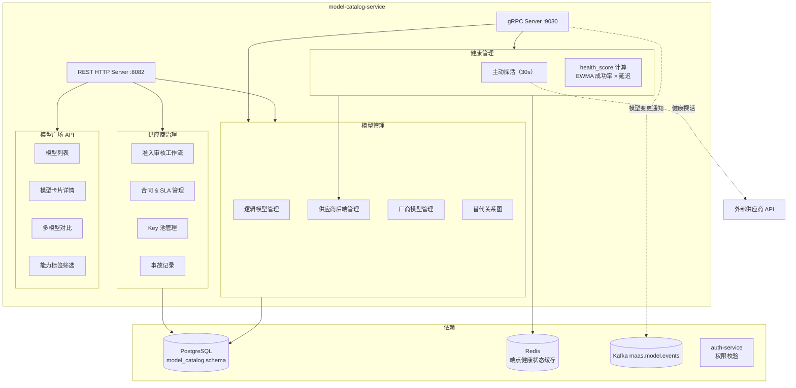
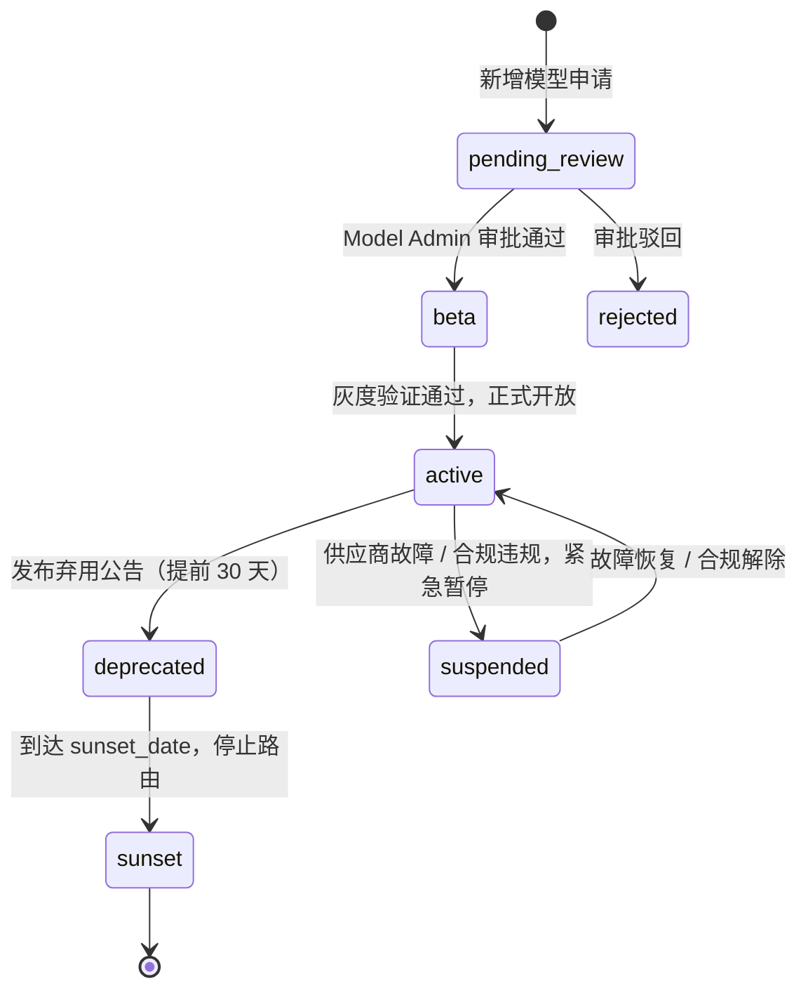

# model-catalog-service 详细设计文档

**文档版本：** V2.0.0  
**更新日期：** 2026年05月22日  
**基准PRD：** `产品设计/MaaS-PRD-V2.0/02-模型目录与供应商治理规格.md`  
**服务名称：** `model-catalog-service`  
**前身：** `adapter-model-service`（V1.0）  
**语言/框架：** Go 1.22 + gRPC  
**变更说明：** V2.0 完整引入三层模型架构（ProviderModel/VendorBackend/LogicalModel）、供应商全生命周期治理、模型健康评分、模型替代关系图、模型卡片主数据、模型广场 API。

---

## 1. 服务职责

| 职责域 | 具体能力 |
|--------|---------|
| **三层模型管理** | 维护 ProviderModel / VendorBackend / LogicalModel 三层数据，提供查询与 CRUD 接口 |
| **模型生命周期** | 模型状态机管理：pending_review → beta → active → deprecated → sunset |
| **供应商治理** | 供应商准入审核、合同状态、SLA 记录、健康评分、事故记录 |
| **Key 池管理** | VendorBackend 关联的 API Key 池，支持轮换、配额、健康监测 |
| **健康探活** | 主动健康检查（每 30s），更新 vendor_backend.health_score |
| **模型替代关系** | 维护 LogicalModel 的 replacement_model_id 链路，供路由引擎 Fallback 使用 |
| **模型广场 API** | 对外暴露模型列表、模型卡片详情、多模型对比、能力标签筛选 |
| **变更通知** | 模型上下线、价格变更发布到 Kafka，通知路由引擎和计费引擎 |

---

## 2. 三层架构说明

```
Layer 3：逻辑模型（Logical Model）
  租户 API 调用的抽象模型名：maas:gpt-4o
  挂载：能力标签 / 质量评分 / 合规属性 / 替代关系 / 模型卡片
        ↓ 一对多映射
Layer 2：供应商后端（Vendor Backend）
  具体可发起请求的后端实例：endpoint_url + key_pool + region
  挂载：health_score / RPM 速率限制 / 超时 / 协议类型
        ↓ 多对一引用
Layer 1：厂商模型（Provider Model）
  供应商原始模型标识：openai:gpt-4o
  挂载：成本价单价 / 协议格式 / 输入输出格式
```

---

## 3. 服务架构图



---

## 4. 核心数据模型

### 4.1 logical_model 表

| 字段 | 类型 | 说明 |
|------|------|------|
| `logical_model_id` | VARCHAR(36) | UUID，全局唯一 |
| `model_name` | VARCHAR(100) | 逻辑模型名，如 `maas:gpt-4o` |
| `display_name` | VARCHAR(200) | 展示名称 |
| `family` | VARCHAR(50) | 模型族（GPT-4 / Claude-3 / Qwen 等） |
| `lifecycle_status` | ENUM | pending_review / beta / active / deprecated / sunset |
| `capability_tags` | JSON | 能力标签列表（chat / code / vision / embedding / reasoning） |
| `context_window` | INT | 最大上下文窗口（tokens） |
| `max_output_tokens` | INT | 最大输出长度 |
| `quality_score` | DECIMAL(4,3) | 综合质量评分 0~1（由评测系统写入） |
| `compliance_tags` | JSON | 合规标签（data_cn / gdpr_compliant / zero_retention_capable） |
| `replacement_model_id` | VARCHAR(36) | 替代模型 ID（下线时 Fallback 链使用） |
| `sunset_date` | DATE | 计划下线日期 |
| `created_at` | TIMESTAMP | — |
| `updated_at` | TIMESTAMP | — |

### 4.2 vendor_backend 表

| 字段 | 类型 | 说明 |
|------|------|------|
| `backend_id` | VARCHAR(36) | UUID |
| `logical_model_id` | VARCHAR(36) | FK → logical_model |
| `provider_model_id` | VARCHAR(36) | FK → provider_model |
| `vendor_id` | VARCHAR(36) | FK → vendor |
| `backend_name` | VARCHAR(100) | 后端名称 |
| `region` | VARCHAR(20) | 部署地域（cn-beijing / us-east-1 等） |
| `endpoint_url` | VARCHAR(500) | API 端点 URL |
| `protocol` | ENUM | OPENAI_COMPAT / ANTHROPIC / DASHSCOPE / GEMINI / CUSTOM |
| `key_pool_ref` | VARCHAR(100) | Key 池引用 ID |
| `rate_limit_rpm` | INT | RPM 速率限制 |
| `rate_limit_tpm` | INT | TPM 速率限制 |
| `timeout_ms` | INT | 请求超时（ms），默认 30000 |
| `health_score` | DECIMAL(4,3) | 当前健康评分 0~1 |
| `status` | ENUM | active / suspended / maintenance / offline |
| `last_checked_at` | TIMESTAMP | 最后健康探活时间 |

### 4.3 vendor 表

| 字段 | 类型 | 说明 |
|------|------|------|
| `vendor_id` | VARCHAR(36) | UUID |
| `vendor_name` | VARCHAR(100) | 供应商名称（OpenAI / Anthropic / 阿里云等） |
| `vendor_type` | ENUM | CLOUD_PROVIDER / INDEPENDENT / OPEN_SOURCE |
| `health_score` | DECIMAL(4,3) | 供应商整体健康评分（聚合所有后端） |
| `sla_tier` | ENUM | STANDARD / PREMIUM / ENTERPRISE |
| `contract_status` | ENUM | negotiating / active / expired / terminated |
| `compliance_status` | ENUM | pending / approved / rejected |
| `official_channel_verified` | BOOLEAN | 是否为官方渠道 |

---

## 5. 模型生命周期状态机



---

## 6. 供应商健康评分计算

```
health_score = α × success_rate_7d + β × (1 - latency_index_p95) + γ × (1 - error_spike_factor)

success_rate_7d    : 最近 7 天请求成功率（响应 2xx/3xx）
latency_index_p95  : P95 延迟归一化值（0=最快，1=超时阈值）
error_spike_factor : 最近 1 小时错误率是否出现尖峰（0=正常，1=尖峰）

权重默认：α=0.5, β=0.3, γ=0.2
health_score < 0.3 → 后端自动从路由候选中剔除（降级 suspended）
health_score < 0.6 → 路由策略评分中被降权（min_health_score 过滤）
```

---

## 7. REST API 设计

### 管理面（Admin 调用）

| 方法 | 路径 | 说明 |
|------|------|------|
| GET | `/api/v1/vendors` | 供应商列表 |
| POST | `/api/v1/vendors` | 注册新供应商（→ 准入审核） |
| PUT | `/api/v1/vendors/{id}/approve` | 审批通过供应商 |
| GET | `/api/v1/models/logical` | 逻辑模型列表（可按能力标签、状态过滤） |
| POST | `/api/v1/models/logical` | 创建逻辑模型 |
| PUT | `/api/v1/models/logical/{id}/lifecycle` | 更改模型生命周期状态 |
| GET | `/api/v1/backends` | 供应商后端列表 |
| POST | `/api/v1/backends` | 添加供应商后端 |
| GET | `/api/v1/backends/{id}/health` | 查询后端健康状态 |

### 模型广场（Console 调用）

| 方法 | 路径 | 说明 |
|------|------|------|
| GET | `/api/v1/marketplace/models` | 模型广场列表（含能力标签、价格、质量评分） |
| GET | `/api/v1/marketplace/models/{id}` | 模型卡片详情 |
| POST | `/api/v1/marketplace/models/compare` | 多模型对比（最多 4 个） |
| GET | `/api/v1/marketplace/models/{id}/alternatives` | 查询替代关系 |

### gRPC（内部，供 routing-service 调用）

```protobuf
service ModelCatalogService {
    rpc GetVendorBackends(GetBackendsRequest) returns (VendorBackendList);
    rpc GetLogicalModel(LogicalModelId) returns (LogicalModel);
    rpc GetReplacementChain(LogicalModelId) returns (ReplacementChain);
    rpc GetBackendHealthBatch(BackendIdList) returns (HealthScoreList);
}
```

---

## 8. Kafka 事件（maas.model.events）

```json
// 模型状态变更
{"event_type": "model_lifecycle_changed", "logical_model_id": "lm_xxx", "old_status": "active", "new_status": "deprecated", "sunset_date": "2026-08-01", "replacement_model_id": "lm_yyy"}

// 后端健康状态变化
{"event_type": "backend_health_changed", "backend_id": "vb_xxx", "health_score": 0.15, "action": "auto_suspended"}

// 供应商价格变更
{"event_type": "provider_price_updated", "provider_model_id": "pm_xxx", "new_input_price": 0.005, "effective_at": "2026-06-01T00:00:00Z"}
```

---

## 9. 部署规格

```yaml
replicas: 2 (HPA min=2, max=6)
resources:
  requests: {cpu: 500m, memory: 512Mi}
  limits:   {cpu: 2000m, memory: 2Gi}
ports:
  - 8082: HTTP REST（管理面 + 模型广场）
  - 9030: gRPC（内部路由查询）
  - 9092: Prometheus metrics
```
