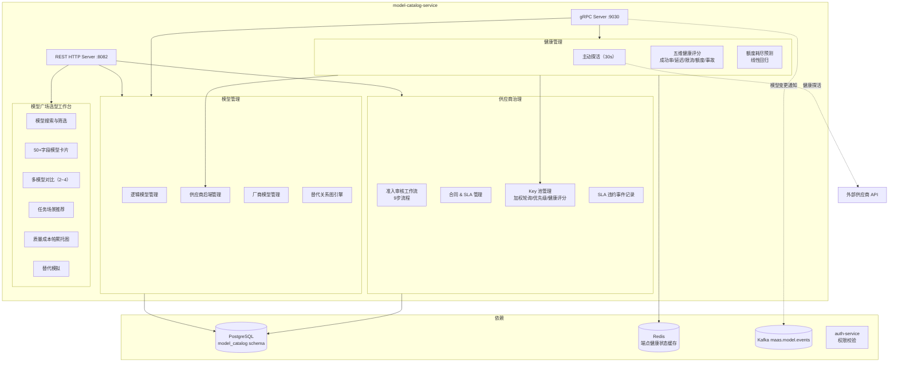
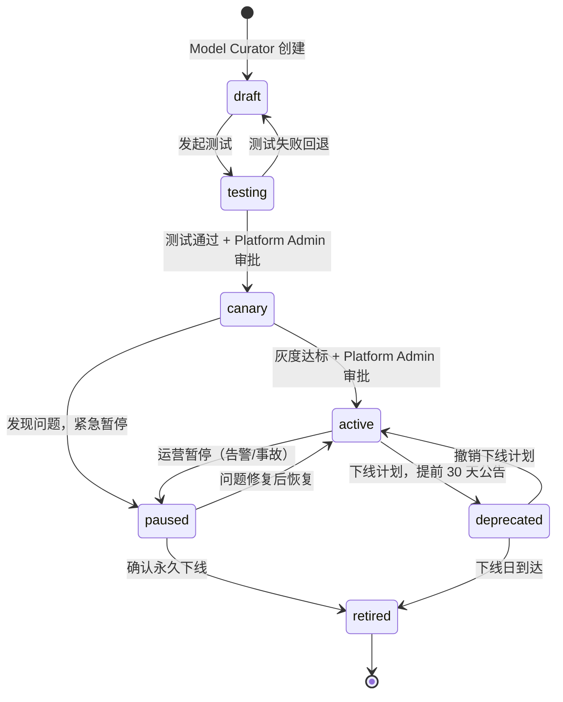
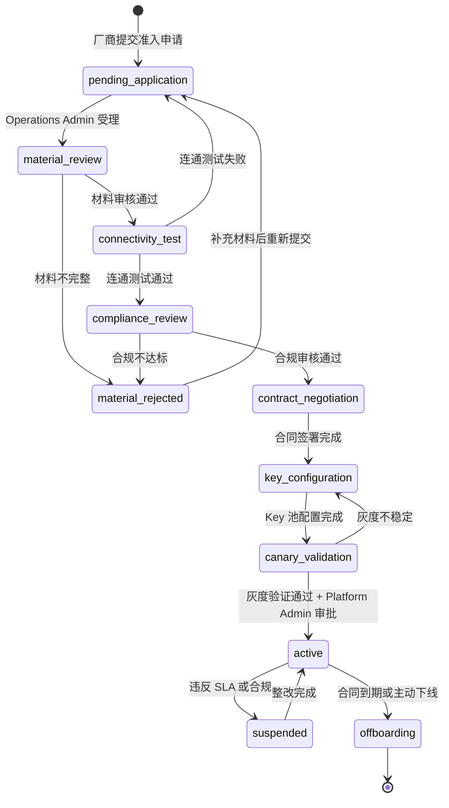

# model-catalog-service 详细设计文档

**文档版本：** V2.1.0
**更新日期：** 2026年05月25日
**基准PRD：** `产品设计/MaaS-PRD-V2.0/02-模型目录与供应商治理规格.md`
**服务名称：** `model-catalog-service`
**前身：** `adapter-model-service`（V1.0）
**语言/框架：** Go 1.22 + gRPC
**变更说明：** V2.1 对齐 PRD V2.0 §02 完整规格：扩展 logical_model 至 50+ 字段模型卡片、新增 model_replacement_graph 替代关系图与迁移引导、完善供应商准入 9 步流程、补充 Key 池五维健康评分与额度预测、新增 vendor_key / vendor_contract / vendor_sla_event 表、扩展模型广场为"选型工作台"（任务场景推荐 / 质量成本散点图 / 替代模拟）。

---

## 1. 服务职责

| 职责域 | 具体能力 |
|--------|---------|
| **三层模型管理** | 维护 ProviderModel / VendorBackend / LogicalModel 三层数据，提供查询与 CRUD 接口 |
| **模型卡片主数据** | 维护 50+ 字段的完整模型卡片（能力标签、基准评分、合规标签、价格快照），作为路由/计费/评测的共享数据源 |
| **模型生命周期** | 状态机管理：draft → testing → canary → active → paused → deprecated → retired，含提前 30 天下线公告 |
| **模型替代关系图** | 维护 model_replacement_graph 表，支持下线时自动推荐替代方案、一键迁移路由策略、迁移进度追踪 |
| **供应商准入治理** | 9 步准入流程（申请→材料审核→连通测试→合规审查→合同→Key配置→灰度→激活），含准入材料清单 |
| **供应商 SLA 与合同** | 合同管理、SLA 指标监控、违约事件记录、结算对账流程 |
| **Key 池管理** | API Key 加密存储、加权轮询/优先级调度、五维健康评分（成功率/延迟/限流/额度/事故）、额度耗尽预测 |
| **健康探活** | 主动健康检查（每 30s）+ 被动请求结果实时更新，更新 vendor_backend.health_score |
| **模型广场"选型工作台"** | 能力标签多维筛选、任务场景智能推荐、多模型对比（2~4个）、质量成本帕累托散点图、替代模拟 |
| **变更通知** | 模型上下线、价格变更、健康状态变化发布到 Kafka maas.model.events，通知路由引擎和计费引擎 |

---

## 2. 三层架构说明

```
Layer 3：逻辑模型（Logical Model）
  租户 API 调用的抽象模型名：maas:gpt-4o
  挂载：50+ 字段模型卡片 / 能力标签 / 质量评分 / 合规属性 / 替代关系
        ↓ 一对多映射
Layer 2：供应商后端（Vendor Backend）
  具体可发起请求的后端实例：endpoint_url + key_pool_ref + region + protocol
  挂载：health_score / RPM 速率限制 / 超时 / 协议类型
        ↓ 多对一引用
Layer 1：厂商模型（Provider Model）
  供应商原始模型标识：openai:gpt-4o / anthropic:claude-3-5-sonnet-20241022
  挂载：成本价单价 / 协议格式 / 输入输出模态
```

### 2.1 映射示例

```
租户 API 请求 model="maas:gpt-4o"
    ↓ 逻辑模型解析
逻辑模型: logical_model_id="lm_gpt4o_default"
    display_name="GPT-4o"  lifecycle_status="active"
    quality_score=0.92  quality_tier="S"
    ↓ 路由策略选择后端
候选后端：
    [1] backend_id="vb_openai_us1" region="us-east-1" health_score=0.96
    [2] backend_id="vb_openai_ap1" region="ap-southeast"  health_score=0.88
    ↓ 按健康分+延迟加权选择
实际调用：
    provider_model_name="gpt-4o-2024-11-20"
    endpoint_url="https://api.openai.com/v1/chat/completions"
    key_pool引用：kp_openai_prod_01
```

---

## 3. 服务架构图



---

## 4. 核心数据模型

### 4.1 provider_model 表（厂商模型）

| 字段 | 类型 | 必填 | 说明 |
|------|------|------|------|
| `provider_model_id` | VARCHAR(64) | ✅ | UUID，全局唯一 |
| `provider_name` | VARCHAR(64) | ✅ | 供应商名称（OpenAI / Anthropic / 阿里云） |
| `provider_model_name` | VARCHAR(128) | ✅ | 供应商侧原始模型标识，如 `gpt-4o-2024-11-20` |
| `protocol_type` | ENUM | ✅ | OPENAI_COMPAT / ANTHROPIC / DASHSCOPE / GEMINI / CUSTOM |
| `api_base_url` | VARCHAR(500) | ✅ | 供应商 API 基础 URL |
| `input_format` | JSON | | 输入格式定义 |
| `output_format` | JSON | | 输出格式定义 |
| `input_cost_per_1k` | DECIMAL(12,6) | ✅ | 平台采购价：输入每千 token 价格 |
| `output_cost_per_1k` | DECIMAL(12,6) | ✅ | 平台采购价：输出每千 token 价格 |
| `cost_currency` | CHAR(3) | ✅ | 采购价币种（CNY / USD） |
| `cost_effective_from` | DATE | | 采购价生效日期 |
| `status` | ENUM | ✅ | active / deprecated / retired |
| `created_at` | TIMESTAMP | ✅ | — |
| `updated_at` | TIMESTAMP | ✅ | — |

### 4.2 logical_model 表（逻辑模型 — 模型卡片主数据）

PRD V2.0 §3.1 定义完整模型卡片字段，共 50+ 字段：

| 字段 | 类型 | 必填 | 说明 |
|------|------|------|------|
| `logical_model_id` | VARCHAR(64) | ✅ | UUID，全局唯一，格式 `lm_{slug}` |
| `model_name` | VARCHAR(128) | ✅ | 对外模型标识符，如 `maas:gpt-4o`，全局唯一 |
| `display_name` | VARCHAR(256) | ✅ | 界面展示名称，如 `GPT-4o` |
| `description` | TEXT | ✅ | Markdown 格式模型描述 |
| `provider_name` | VARCHAR(64) | ✅ | 归属供应商名称 |
| `model_family` | VARCHAR(64) | ✅ | 模型族，如 GPT-4 / Qwen2.5 / Claude-3.x |
| `model_version` | VARCHAR(64) | | 版本标识，如 `gpt-4o-2024-11-20` |
| `lifecycle_status` | ENUM | ✅ | draft / testing / canary / active / paused / deprecated / retired |
| `context_window_tokens` | INT | ✅ | 最大上下文长度（tokens），如 128000 |
| `max_output_tokens` | INT | ✅ | 最大输出 tokens，如 16384 |
| **modalities_input** | JSON | ✅ | 输入模态：`["text","image","audio","video"]` |
| **modalities_output** | JSON | ✅ | 输出模态：`["text","image","audio"]` |
| **tool_calling_support** | BOOLEAN | ✅ | 是否支持 Function Calling / Tool Use |
| **parallel_tool_calls** | BOOLEAN | | 是否支持并行工具调用 |
| **streaming_support** | BOOLEAN | ✅ | 是否支持 SSE 流式输出 |
| **json_mode_support** | BOOLEAN | | 是否支持 JSON 输出模式 |
| **structured_output** | BOOLEAN | | 是否支持结构化输出（Schema 约束） |
| **embedding_support** | BOOLEAN | | 是否提供 Embedding 能力 |
| `embedding_dims` | INT | | Embedding 向量维度，如 1536 |
| **rerank_support** | BOOLEAN | | 是否提供 Rerank 能力 |
| **image_generation** | BOOLEAN | | 是否提供图像生成能力 |
| `image_resolution` | VARCHAR(64) | | 支持的图像分辨率 |
| **audio_support** | BOOLEAN | | 是否支持语音转写或 TTS |
| **fine_tuning_support** | BOOLEAN | | 是否支持微调 |
| `input_price_per_1k` | DECIMAL(12,6) | ✅ | 目录价：输入每千 token 价格（人民币） |
| `output_price_per_1k` | DECIMAL(12,6) | ✅ | 目录价：输出每千 token 价格（人民币） |
| `cost_snapshot_cny` | DECIMAL(12,6) | ✅ | 当前成本价快照（平台采购价），定期同步 |
| `cost_snapshot_at` | TIMESTAMP | ✅ | 成本价快照时间 |
| **data_residency_regions** | JSON | | 数据留存地域：`["cn-hangzhou","cn-beijing"]` |
| **data_export_restricted** | BOOLEAN | ✅ | 是否禁止数据出境 |
| `compliance_tags` | JSON | | 合规标签：`["MLPS-2","GDPR-compliant"]` |
| **pii_processing_allowed** | BOOLEAN | ✅ | 是否允许处理个人信息 |
| **model_data_retention** | VARCHAR(32) | ✅ | 供应商端数据留存策略：none / 30d / 90d / training |
| **official_channel** | BOOLEAN | ✅ | 是否官方通道接入 |
| **quality_tier** | CHAR(1) | ✅ | S / A / B / C / D 五档质量等级 |
| `quality_score` | DECIMAL(4,3) | | 综合质量评分 0~1（由评测系统回写） |
| **last_eval_date** | DATE | | 最近评测日期 |
| **eval_dataset_refs** | JSON | | 关联评测集 ID 数组 |
| **benchmark_scores** | JSON | | 基准评分：`{"MMLU":85.6,"HumanEval":87.2}` |
| `replacement_model_id` | VARCHAR(64) | | 默认替代模型 ID（FK→logical_model） |
| **deprecation_notice_at** | TIMESTAMP | | 下线公告发布时间 |
| **deprecation_at** | TIMESTAMP | | 计划下线日期 |
| **migration_guide_url** | VARCHAR(512) | | 迁移指南文档链接 |
| `tags` | JSON | | 运营标签：`["featured","new","sale"]` |
| `sort_weight` | INT | ✅ | 模型广场排序权重，默认 100 |
| `visibility` | ENUM | ✅ | public / tenant_only / internal |
| `created_at` | TIMESTAMP | ✅ | — |
| `updated_at` | TIMESTAMP | ✅ | — |
| `updated_by` | VARCHAR(64) | ✅ | 最后更新人 |

> **加粗字段**为 V2.1 对照 PRD §3.1 新增字段，相比 V2.0 的 13 字段模型卡片大幅扩展。

### 4.3 vendor_backend 表（供应商后端）

| 字段 | 类型 | 必填 | 说明 |
|------|------|------|------|
| `backend_id` | VARCHAR(64) | ✅ | UUID |
| `logical_model_id` | VARCHAR(64) | ✅ | FK → logical_model |
| `provider_model_id` | VARCHAR(64) | ✅ | FK → provider_model |
| `vendor_id` | VARCHAR(64) | ✅ | FK → vendor |
| `backend_name` | VARCHAR(100) | ✅ | 后端实例名称 |
| `region` | VARCHAR(20) | ✅ | 部署地域（cn-beijing / us-east-1 等） |
| `endpoint_url` | VARCHAR(500) | ✅ | API 端点 URL |
| `protocol` | ENUM | ✅ | OPENAI_COMPAT / ANTHROPIC / DASHSCOPE / GEMINI / CUSTOM |
| `key_pool_ref` | VARCHAR(100) | ✅ | Key 池引用 ID |
| `rate_limit_rpm` | INT | ✅ | RPM 速率限制 |
| `rate_limit_tpm` | INT | ✅ | TPM 速率限制 |
| `timeout_ms` | INT | ✅ | 请求超时（ms），默认 30000 |
| `health_score` | DECIMAL(4,3) | ✅ | 当前健康评分 0~1 |
| `health_tier` | ENUM | | excellent / healthy / degraded / warning / critical |
| `success_rate_1h` | DECIMAL(5,4) | | 近 1 小时成功率 |
| `avg_latency_ms_1h` | INT | | 近 1 小时平均延迟 |
| `status` | ENUM | ✅ | active / suspended / maintenance / offline |
| `last_checked_at` | TIMESTAMP | ✅ | 最后健康探活时间 |

### 4.4 vendor 表（供应商 — 完整治理字段）

PRD V2.0 §7.4 定义供应商完整字段，共 30+ 字段：

| 字段 | 类型 | 必填 | 说明 |
|------|------|------|------|
| `vendor_id` | VARCHAR(64) | ✅ | UUID |
| `vendor_name` | VARCHAR(256) | ✅ | 供应商全称 |
| `vendor_short_name` | VARCHAR(64) | ✅ | 显示简称，如 OpenAI / 阿里云 |
| `vendor_type` | ENUM | ✅ | official_direct / authorized_reseller / private_model / internal |
| `status` | ENUM | ✅ | pending_application / material_review / connectivity_test / compliance_review / contract_negotiation / key_configuration / canary_validation / active / suspended / offboarding |
| **official_channel_proof** | VARCHAR(512) | | 官方通道证明文件 URL |
| **dpa_signed** | BOOLEAN | ✅ | 是否签署 DPA（数据处理协议） |
| **dpa_signed_at** | DATE | | DPA 签署日期 |
| **contract_id** | VARCHAR(64) | | 关联合同 ID |
| **contract_start** | DATE | | 合同开始日期 |
| **contract_end** | DATE | | 合同结束日期 |
| **settlement_cycle** | ENUM | ✅ | monthly / quarterly / annual |
| **base_currency** | CHAR(3) | ✅ | 结算货币（CNY / USD） |
| **billing_method** | ENUM | ✅ | prepay / postpay |
| **total_quota_cny** | DECIMAL(15,2) | | 合同总额度（元） |
| **used_quota_cny** | DECIMAL(15,2) | | 已使用额度（元） |
| `health_score` | DECIMAL(4,3) | | 供应商整体健康评分（聚合所有后端） |
| **health_tier** | ENUM | | excellent / healthy / degraded / warning / critical |
| **sla_availability_slo** | DECIMAL(6,4) | | 可用性 SLO，如 0.9995 |
| **sla_p95_latency_ms** | INT | | P95 延迟 SLO（ms） |
| **last_incident_at** | TIMESTAMP | | 最近一次 SLA 事故时间 |
| **incident_count_30d** | INT | | 近 30 天事故次数 |
| **data_residency** | VARCHAR(64) | ✅ | 数据留存地域说明 |
| **compliance_certs** | JSON | | 合规证书列表 |
| **regions_supported** | JSON | ✅ | 支持的地域列表 |
| **contact_name** | VARCHAR(128) | | 供应商对接人姓名 |
| **contact_email** | VARCHAR(256) | | 供应商对接人邮箱 |
| **contact_phone** | VARCHAR(32) | | 紧急联系电话 |
| `notes` | TEXT | | 运营备注 |
| `created_at` | TIMESTAMP | ✅ | — |
| `updated_at` | TIMESTAMP | ✅ | — |

### 4.5 vendor_key 表（Key 池管理 — 新增）

PRD V2.0 §8.1 定义：

| 字段 | 类型 | 必填 | 说明 |
|------|------|------|------|
| `key_id` | VARCHAR(64) | ✅ | Key 唯一 ID |
| `vendor_id` | VARCHAR(64) | ✅ | 所属供应商 ID |
| `key_alias` | VARCHAR(128) | ✅ | Key 别名（运营友好名称） |
| `key_value_hash` | VARCHAR(256) | ✅ | API Key 的 SHA-256 哈希（去重用） |
| `key_value_encrypted` | TEXT | ✅ | AES-256-GCM 加密存储的 API Key 值 |
| `status` | ENUM | ✅ | active / paused / exhausted / revoked |
| `quota_total_cny` | DECIMAL(15,2) | | 额度总量（元），NULL=无限 |
| `quota_used_cny` | DECIMAL(15,2) | ✅ | 已使用额度（元） |
| `quota_reset_cycle` | ENUM | | monthly / never |
| `rate_limit_rpm` | INT | | 每分钟请求数限制 |
| `rate_limit_tpm` | INT | | 每分钟 Token 数限制 |
| **rate_limit_concurrent** | INT | | 最大并发请求数 |
| `health_score` | DECIMAL(4,3) | ✅ | 实时健康评分 0~1 |
| `success_rate_1h` | DECIMAL(5,4) | | 近 1 小时成功率 |
| `avg_latency_ms_1h` | INT | | 近 1 小时平均延迟 |
| **throttle_rate_1h** | DECIMAL(5,4) | | 近 1 小时限流率（429 比例） |
| `last_used_at` | TIMESTAMP | | 最近使用时间 |
| `last_checked_at` | TIMESTAMP | ✅ | 最近健康检查时间 |
| `created_at` | TIMESTAMP | ✅ | — |
| `expires_at` | TIMESTAMP | | Key 有效期 |
| `notes` | TEXT | | 运营备注 |

### 4.6 model_replacement_graph 表（模型替代关系图 — 新增）

PRD V2.0 §5.2 定义：

| 字段 | 类型 | 必填 | 说明 |
|------|------|------|------|
| `edge_id` | VARCHAR(64) | ✅ | 替代关系唯一 ID |
| `source_model_id` | VARCHAR(64) | ✅ | 被替代的逻辑模型 ID |
| `target_model_id` | VARCHAR(64) | ✅ | 推荐替代的逻辑模型 ID |
| **replacement_type** | ENUM | ✅ | same-family-upgrade / cross-family-parity / downgrade-backup / task-specific |
| **quality_delta_pct** | DECIMAL(5,2) | ✅ | 质量变化百分比（负数=下降） |
| **cost_delta_pct** | DECIMAL(5,2) | ✅ | 成本变化百分比（负数=降低） |
| **context_compatibility** | ENUM | ✅ | full / partial / incompatible |
| **context_delta_tokens** | INT | | 上下文窗口变化量 |
| **toolcall_compatibility** | ENUM | ✅ | full / format-change / partial / none |
| **toolcall_migration_note** | TEXT | | 工具调用迁移说明 |
| **task_scope** | JSON | | 适用任务场景，如 `["chat","rag","code"]` |
| `confidence` | DECIMAL(4,3) | ✅ | 替代建议置信度 0~1，基于实测 |
| `evidence_eval_job_id` | VARCHAR(64) | | 支撑此替代关系的评测任务 ID |
| `recommendation_priority` | INT | ✅ | 推荐优先级，数字越小越优先 |
| `effective_from` | DATE | | 替代关系生效日期 |
| `note` | TEXT | | 运营备注 |
| `created_by` | VARCHAR(64) | | 创建人 |
| `created_at` | TIMESTAMP | ✅ | — |

### 4.7 vendor_contract 表（供应商合同 — 新增）

PRD V2.0 §9.3 定义：

| 字段 | 类型 | 说明 |
|------|------|------|
| `contract_id` | VARCHAR(64) | 合同唯一 ID |
| `vendor_id` | VARCHAR(64) | FK → vendor |
| `contract_name` | VARCHAR(256) | 合同名称 |
| `contract_type` | ENUM | prepay / postpay / subscription / volume |
| `start_date` | DATE | 合同生效日 |
| `end_date` | DATE | 合同到期日 |
| `total_amount_cny` | DECIMAL(15,2) | 合同总金额 |
| `prepay_amount_cny` | DECIMAL(15,2) | 预付款金额 |
| `credit_limit_cny` | DECIMAL(15,2) | 授信额度 |
| `billing_cycle` | ENUM | monthly / quarterly / annual |
| `payment_terms` | VARCHAR(128) | 付款条件，如"月结30天" |
| `discount_models` | JSON | 模型级折扣配置数组 |
| `volume_tiers` | JSON | 阶梯价格配置 |
| `sla_terms` | JSON | SLA 承诺条款 |
| `invoice_type` | ENUM | vat_special / vat_general / receipt |
| `auto_renew` | BOOLEAN | 是否自动续约 |
| `renewal_notice_days` | INT | 续约提醒提前天数 |
| `contract_file_url` | VARCHAR(512) | 合同扫描件存储 URL |
| `signed_at` | DATE | 签署日期 |
| `signed_by` | VARCHAR(128) | 签署人 |
| `status` | ENUM | draft / active / expired / terminated |
| `notes` | TEXT | 备注 |

### 4.8 vendor_sla_event 表（SLA 违约事件 — 新增）

PRD V2.0 §9.2 定义：

| 字段 | 类型 | 说明 |
|------|------|------|
| `event_id` | VARCHAR(64) | 违约事件 ID |
| `vendor_id` | VARCHAR(64) | FK → vendor |
| `event_type` | ENUM | availability_breach / latency_breach / error_rate_breach / quota_breach |
| `severity` | ENUM | P0 / P1 / P2 / P3 |
| `metric_name` | VARCHAR(64) | 违约指标名 |
| `slo_threshold` | DECIMAL | SLO 目标值 |
| `actual_value` | DECIMAL | 实测值 |
| `start_at` | TIMESTAMP | 事故开始时间 |
| `end_at` | TIMESTAMP | 事故结束时间 |
| `duration_minutes` | INT | 持续时长 |
| `affected_requests` | INT | 受影响请求数 |
| `root_cause` | TEXT | 根因说明 |
| `remediation` | TEXT | 处置措施 |
| `penalty_triggered` | BOOLEAN | 是否触发赔付 |
| `penalty_amount_cny` | DECIMAL(15,2) | 赔付金额 |
| `status` | ENUM | open / investigating / resolved / pending_compensation |

---

## 5. 模型生命周期状态机

PRD V2.0 §6 定义完整状态机：



| 状态 | 含义 | 可接收请求 | 模型广场显示 |
|------|------|-----------|------------|
| draft | 草稿，尚未测试 | 否 | 否 |
| testing | 内部测试中 | 仅测试 Key | 否 |
| canary | 灰度中 | 白名单租户 | 白名单用户可见 |
| active | 正式生效 | 是 | 是 |
| paused | 暂停 | 否 | 显示"暂停中" |
| deprecated | 已宣布即将下线 | 是（过渡期） | 显示"即将下线" + 倒计时 |
| retired | 已下线 | 否 | 否 |

**状态转换权限要求：**

| 转换 | 需要角色 | 审批要求 |
|------|---------|---------|
| draft → testing | Model Curator | 无需审批 |
| testing → canary | Model Curator | Platform Admin 审批 |
| canary → active | Platform Admin | 需提交灰度报告 |
| active → deprecated | Platform Admin | 需提前 30 天，发送下线通知 |
| active → paused | Operations Admin | 紧急可免审批，事后补记录 |
| paused → active | Platform Admin | 需确认修复报告 |
| deprecated → retired | 自动触发 | 到达预定下线日期 |

---

## 6. 模型替代关系图与下线迁移

### 6.1 替代类型定义

PRD V2.0 §5.2：

| 类型 | 含义 | 示例 |
|------|------|------|
| `same-family-upgrade` | 同族升级 | gpt-3.5-turbo → gpt-4o-mini（质量提升，成本增加） |
| `cross-family-parity` | 跨族平替 | gpt-4o → qwen-max（质量相近，供应商不同） |
| `downgrade-backup` | 降级备用 | 主动模型 → 便宜备用模型（临时故障场景） |
| `task-specific` | 特定任务替代 | 仅在特定场景适用（如代码任务用 DeepSeek-Coder 替代） |

### 6.2 模型下线自动触发流程

PRD V2.0 §5.4：

```
模型状态变更为 deprecated → 查询 model_replacement_graph
  ├── 有显式替代关系 → 按 priority 排序 TopN，通知受影响租户
  └── 无替代关系 → 标记，生成工单指派 Model Curator
```

### 6.3 下线通知与迁移引导（T-30 天）

PRD V2.0 §5.5 定义的完整流程：

1. **T-30 天**：lifecycle_status → deprecated，Console 顶部横幅 + 外部通知，通知 Tenant Admin / Billing Admin / Project Admin
2. **Console 引导弹窗**：受影响的 Project Admin/Developer 进入项目时显示迁移引导，含"一键迁移至推荐模型"按钮
3. **一键迁移**：批量创建路由策略变更草稿，自动替换 model_id，触发审批流
4. **T-7 天**：主动推送 3 次提醒，Console 仪表板展示"待迁移项目"清单
5. **下线日兜底**：仍有引用 retired 模型的策略 → 自动替换为 replacement_model_id，billing_ledger 标注 `auto_migrated=true`，发送最终迁移报告

---

## 7. 供应商准入治理

### 7.1 准入流程状态机（PRD V2.0 §7.2）



### 7.2 准入材料清单（PRD V2.0 §7.3）

| 材料 | official_direct 必填 | authorized_reseller 必填 | 说明 |
|------|---------------------|------------------------|------|
| 官方通道授权证明 | ✅ | | 厂商出具的 API 使用授权函 |
| 授权转售许可证 | | ✅ | 上级渠道授权证明文件 |
| 企业营业执照 | ✅ | ✅ | 有效期内的扫描件 |
| 数据处理协议（DPA） | ✅ | ✅ | GDPR/个保法合规 |
| 服务水平协议（SLA） | ✅ | ✅ | 可用性/延迟/错误率承诺 |
| 信息安全评估报告 | ✅（金融/政务） | ✅（金融/政务） | 第三方或自评 |
| 等级保护证书 | 金融/政务 | 金融/政务 | 等保证书复印件 |
| 网络安全承诺书 | ✅ | ✅ | 不用于训练/不泄露数据 |

---

## 8. Key 池管理

### 8.1 轮询策略

| 策略 | 说明 | 适用场景 |
|------|------|---------|
| **round_robin** | 依次使用 active Key，忽略权重差异 | Key 额度均等 |
| **weighted** | `weight_i = health_score × quota_remaining_ratio`，按权重概率选择 | 健康度和余量不均 |
| **priority** | 按优先级数字顺序使用，高优先级不可用时才切低优先级 | 主备 Key 模式 |

### 8.2 五维健康评分算法（PRD V2.0 §8.3）

```
health_score = w1 × success_rate + w2 × latency_score + w3 × throttle_score + w4 × quota_score + w5 × incident_score

w1=0.30（成功率），w2=0.20（延迟），w3=0.20（限流），w4=0.20（额度），w5=0.10（事故）

success_rate_score = success_rate_1h                    (0~1)
latency_score      = max(0, 1 - avg_latency_ms_1h / baseline_latency_ms)
throttle_score     = max(0, 1 - throttle_rate_1h × 10)
quota_score        = min(1, quota_remaining / quota_total)
incident_score     = max(0, 1 - incidents_7d / 5)
```

### 8.3 额度预测（PRD V2.0 §8.4）

使用近 30 天日消耗数据 + 近 7 天日均值线性外推：

```
avg_daily = mean(daily_usage[-7:])
predicted_days_remaining = quota_remaining / avg_daily
predicted_exhaustion_date = today + predicted_days_remaining
```

### 8.4 预警级别（PRD V2.0 §8.5）

| 级别 | 触发条件 | 响应动作 |
|------|---------|---------|
| P3 信息 | 额度余量 ≤ 30% | 仅记录，控制台提示 |
| P2 警告 | 额度余量 ≤ 15%，或 health_score ≤ 0.70 | 邮件通知运营人员 |
| P1 紧急 | 额度余量 ≤ 5%，或 health_score ≤ 0.50 | 邮件 + IM 告警，激活备用 Key |
| P0 严重 | 额度耗尽，或 health_score ≤ 0.20 | 暂停 Key，触发 fallback，紧急呼叫 On-call |

---

## 9. 供应商健康评分（聚合级）

PRD V2.0 §10.1 定义供应商级综合健康分：

```
vendor_health = 0.5 × avg(key_health_scores)      // Key 池整体健康
              + 0.2 × sla_compliance_score         // SLA 达成率（30 天）
              + 0.2 × (1 - incident_frequency)      // 1 - 近 30 天事故频率
              + 0.1 × trend_score                   // 近 7 天质量趋势
```

| 等级 | 分数区间 | 路由影响 |
|------|---------|---------|
| Excellent | 0.95~1.00 | 优先参与路由 |
| Healthy | 0.80~0.95 | 正常参与路由 |
| Degraded | 0.65~0.80 | 权重降低 50% |
| Warning | 0.50~0.65 | 权重降低 80%，仅作备用 |
| Critical | <0.50 | 临时暂停，触发 fallback |

**自动降级：** 连续 5 分钟 < 0.65 → 自动降低权重；< 0.50 → 标记 temporarily_suspended，路由完全绕过。
**自动恢复：** 连续 15 分钟 ≥ 0.75 → 自动恢复权重。

---

## 10. REST API 设计

### 管理面（Admin 调用）

| 方法 | 路径 | 说明 |
|------|------|------|
| GET | `/api/v1/vendors` | 供应商列表（含健康分、合同状态、SLA 等级） |
| POST | `/api/v1/vendors` | 注册新供应商 → 进入准入审核流程 |
| PUT | `/api/v1/vendors/{id}/status` | 变更供应商准入状态 |
| GET | `/api/v1/vendors/{id}/contracts` | 供应商合同列表 |
| POST | `/api/v1/vendors/{id}/contracts` | 录入新合同 |
| GET | `/api/v1/vendors/{id}/sla-events` | SLA 违约事件列表 |
| POST | `/api/v1/vendors/{id}/sla-events` | 记录 SLA 违约事件 |
| GET | `/api/v1/vendors/{id}/keys` | 供应商 Key 池列表 |
| POST | `/api/v1/vendors/{id}/keys` | 添加 API Key（加密存储） |
| PUT | `/api/v1/vendors/keys/{key_id}/status` | 变更 Key 状态（暂停/恢复/吊销） |
| GET | `/api/v1/models/logical` | 逻辑模型列表（可按标签/状态/供应商过滤） |
| POST | `/api/v1/models/logical` | 创建逻辑模型（50+ 字段模型卡片） |
| PUT | `/api/v1/models/logical/{id}` | 更新模型卡片 |
| PUT | `/api/v1/models/logical/{id}/lifecycle` | 变更模型生命周期状态（需审批） |
| GET | `/api/v1/models/logical/{id}/replacement-graph` | 查询替代关系图 |
| POST | `/api/v1/models/replacement-edges` | 创建替代关系边 |
| DELETE | `/api/v1/models/replacement-edges/{edge_id}` | 删除替代关系边 |
| GET | `/api/v1/backends` | 供应商后端列表 |
| POST | `/api/v1/backends` | 添加供应商后端 |
| GET | `/api/v1/backends/{id}/health` | 查询后端健康详情（含五维评分明细） |
| POST | `/api/v1/reconcile` | 触发供应商账单对账 |

### 模型广场"选型工作台"（Console 调用）

PRD V2.0 §11 定义：

| 方法 | 路径 | 说明 |
|------|------|------|
| GET | `/api/v1/marketplace/models` | 模型广场列表（能力标签/价格/质量/合规标签筛选，分页+排序） |
| GET | `/api/v1/marketplace/models/{id}` | 模型卡片详情（50+ 字段完整展示） |
| POST | `/api/v1/marketplace/models/compare` | 多模型对比（2~4 个模型并排对比所有维度） |
| GET | `/api/v1/marketplace/models/{id}/alternatives` | 查询替代方案（含质量/成本变化预估） |
| POST | `/api/v1/marketplace/recommend` | **任务场景推荐**：输入任务描述，返回 TopN 推荐模型 + 选择理由 + 成本估算 |
| POST | `/api/v1/marketplace/simulate-replacement` | **替代模拟**：选择当前模型，模拟切换后的月度成本和质量变化 |
| GET | `/api/v1/marketplace/quality-cost-chart` | **质量成本散点图数据**：所有 active 模型在质量/成本坐标系的分布 + 帕累托前沿 |
| GET | `/api/v1/marketplace/tags` | 获取全部能力标签枚举值（按模态/上下文/工具/合规/特性分类） |
| GET | `/api/v1/marketplace/models/{id}/migration-guide` | 获取模型迁移指南（Markdown 格式） |

### gRPC（内部，供 routing-service / billing-service 调用）

```protobuf
service ModelCatalogService {
    rpc GetVendorBackends(GetBackendsRequest) returns (VendorBackendList);
    rpc GetLogicalModel(LogicalModelId) returns (LogicalModel);
    rpc GetReplacementChain(LogicalModelId) returns (ReplacementChain);
    rpc GetBackendHealthBatch(BackendIdList) returns (HealthScoreList);
    rpc EstimateCost(CostEstimateRequest) returns (CostEstimateResponse);
    rpc GetVendorContractDiscount(VendorDiscountRequest) returns (VendorDiscountResponse);
}

message CostEstimateRequest {
    string logical_model_id = 1;
    int32  estimated_prompt_tokens = 2;
    int32  estimated_completion_tokens = 3;
    string tenant_id = 4;
}

message CostEstimateResponse {
    string logical_model_id = 1;
    repeated BackendCostEstimate estimates = 2;
    double min_cost = 3;
    string currency = 4;
}

message BackendCostEstimate {
    string backend_id = 1;
    double prompt_cost = 2;
    double completion_cost = 3;
    double total_cost = 4;
    bool   has_active_key = 5;
    string tier_plan = 6;
}

// 新增：查询供应商合同折扣
message VendorDiscountRequest {
    string tenant_id = 1;
    string logical_model_id = 2;
}

message VendorDiscountResponse {
    double discount_pct = 1;    // 合同折扣百分比（0~100）
    string tier_plan = 2;       // 适用的阶梯定价计划名
}
```

---

## 11. 模型广场"选型工作台"核心能力

### 11.1 任务场景推荐（PRD V2.0 §11.2）

```
输入：自然语言描述 "我需要分析上传的PDF文档并回答问题"
处理流程：
  1. 提取需求标签 — NLP 解析 → ["modality:document-in","capability:tool-calling","context:128k"]
  2. 查询满足所有必要标签的 active 逻辑模型
  3. 按 quality_score × (1 - cost_index) 排序
  4. 考虑租户合规策略过滤（如 data_residency=CN）
  5. 返回 TopN，每个附带：
     - 选择理由（满足的标签说明）
     - 估算月成本（假设日均 1000 请求 × 平均 Token 数）
     - 质量等级 + 基准评分
     - 如有合同折扣则提示
```

### 11.2 质量成本帕累托图（PRD V2.0 §11.4）

```
X 轴：每千 token 综合成本（输入+输出加权均值）
Y 轴：质量评分 0~1
每个气泡 = 一个逻辑模型
  气泡大小：上下文窗口 tokens
  气泡颜色：供应商分类
高亮：帕累托最优前沿连线
悬停：模型名称、能力标签、合规标签、实时可用性
过滤：合规要求 / 任务场景 / 供应商
```

### 11.3 替代模拟（PRD V2.0 §11.3）

用户选择当前模型 A，系统基于 `model_replacement_graph` 返回：
- 推荐替代模型列表
- 每个方案：质量变化（±X%）、月成本节省估算、上下文兼容性、工具调用迁移说明
- 一键发起路由策略迁移申请（触发审批工作流）

---

## 12. 能力标签标准化体系

PRD V2.0 §4 定义完整标签枚举，标签应用于三个场景：模型广场筛选、路由策略 `must_have_tags` 过滤、合规策略强制排除。

### 12.1 模态类（modality:*）

| Tag | 描述 |
|-----|------|
| `modality:text-in` | 文本输入 |
| `modality:text-out` | 文本输出 |
| `modality:image-in` | 图像输入（多模态视觉） |
| `modality:image-out` | 图像生成 |
| `modality:audio-in` | 音频输入 |
| `modality:audio-out` | TTS 语音合成 |
| `modality:video-in` | 视频输入 |
| `modality:document-in` | 文档直接输入（PDF 等） |

### 12.2 上下文类（context:*）

| Tag | 阈值 |
|-----|------|
| `context:8k` | ≥ 8,192 tokens |
| `context:32k` | ≥ 32,768 tokens |
| `context:128k` | ≥ 128,000 tokens |
| `context:200k` | ≥ 200,000 tokens |
| `context:1m` | ≥ 1,000,000 tokens |

### 12.3 工具与能力类（capability:*）

| Tag | 描述 |
|-----|------|
| `capability:tool-calling` | Function Calling / Tool Use |
| `capability:parallel-tools` | 并行工具调用 |
| `capability:code-interpreter` | 内置代码解释器 |
| `capability:web-search` | 联网搜索 |
| `capability:json-mode` | JSON 输出模式 |
| `capability:structured-output` | 结构化输出（Schema 约束） |
| `capability:streaming` | SSE 流式输出 |
| `capability:embedding` | Embedding 向量化 |
| `capability:rerank` | 语义重排序 |
| `capability:vision` | 视觉理解 |
| `capability:reasoning` | 推理模型（思维链） |
| `capability:instruction-following` | 高指令遵循 |
| `capability:multilingual` | 多语言支持 |
| `capability:long-form` | 长文本生成 |
| `capability:code-generation` | 代码生成 |

### 12.4 合规类（compliance:*）

| Tag | 描述 |
|-----|------|
| `compliance:cn-only` | 数据仅留存中国大陆 |
| `compliance:mlps-2` | 等保二级 |
| `compliance:mlps-3` | 等保三级 |
| `compliance:gdpr` | GDPR 合规 |
| `compliance:no-training` | 供应商承诺不用于训练 |
| `compliance:pii-ok` | 允许处理个人信息 |
| `compliance:financial-ok` | 可用于金融场景 |
| `compliance:official-channel` | 官方通道接入 |

---

## 13. Kafka 事件（maas.model.events）

```json
// 模型生命周期变更
{"event_type": "model_lifecycle_changed", "logical_model_id": "lm_xxx", "old_status": "active", "new_status": "deprecated", "deprecation_at": "2026-08-01", "replacement_model_id": "lm_yyy"}

// 后端健康状态变化
{"event_type": "backend_health_changed", "backend_id": "vb_xxx", "health_score": 0.15, "health_tier": "critical", "action": "auto_suspended"}

// 供应商价格变更
{"event_type": "provider_price_updated", "provider_model_id": "pm_xxx", "new_input_price": 0.005, "new_output_price": 0.015, "effective_at": "2026-06-01T00:00:00Z", "logical_model_ids": ["lm_xxx"]}

// Key 池状态变更（新增）
{"event_type": "key_pool_changed", "vendor_id": "v_xxx", "key_id": "vk_xxx", "action": "exhausted", "health_score": 0.10, "trigger_level": "P0"}

// 供应商合同到期预警（新增）
{"event_type": "contract_expiring", "vendor_id": "v_xxx", "contract_id": "c_xxx", "end_date": "2026-07-01", "days_remaining": 30}

// 替代关系变更（新增）
{"event_type": "replacement_graph_updated", "source_model_id": "lm_xxx", "action": "edge_added", "target_model_id": "lm_yyy", "replacement_type": "cross-family-parity"}
```

---

## 14. 部署规格

```yaml
replicas: 2 (HPA min=2, max=8)
resources:
  requests: {cpu: 500m, memory: 1Gi}
  limits:   {cpu: 2000m, memory: 4Gi}
ports:
  - 8082: HTTP REST（管理面 + 模型广场）
  - 9030: gRPC（内部路由/计费查询）
  - 9092: Prometheus metrics
database:
  - PostgreSQL model_catalog schema
  - 关键索引：logical_model(lifecycle_status), logical_model(provider_name), logical_model(model_family), vendor(status)
  - vendor_key 表：key_value_hash UNIQUE 索引（去重）
  - model_replacement_graph：source_model_id + target_model_id 联合唯一索引
```
